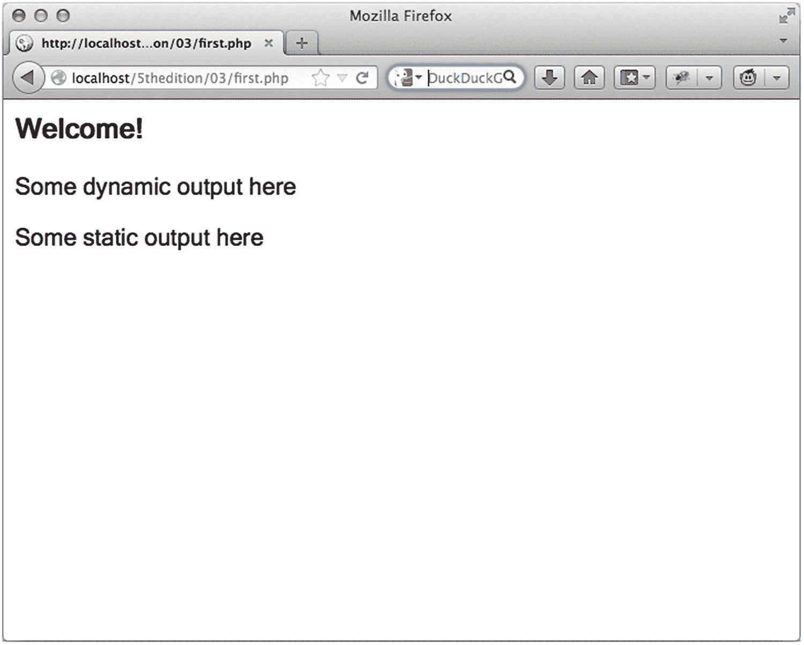

# 三、PHP 基础

这本书你只看了两章，已经涉及了相当多的内容。到目前为止，您已经熟悉了 PHP 的背景和历史，并且已经回顾了该语言的关键安装和配置概念和过程。到目前为止，您所学到的知识为本书的剩余内容奠定了基础:创建强大的 PHP 驱动的网站！本章开始了这一讨论，介绍了这种语言的大量基本特性。具体来说，您将学习如何执行以下操作:

*   在你的网页中嵌入 PHP 代码。

*   使用从 Unix shell 脚本、C 和 C++语言借用的各种方法对代码进行注释。

*   使用`echo(),print(), printf(),`和`sprintf()`语句将数据输出到浏览器。

*   使用 PHP 的数据类型、变量、操作符和语句来创建复杂的脚本。

*   利用关键控制结构和语句，包括`if-else-elseif`、`while`、`foreach, include, require, break, continue`和`declare.`

学完这一章，你不仅会掌握创建基本但有用的 PHP 应用程序所必需的知识，还会理解如何充分利用后面章节中的内容。

### 注意

本章既是新手程序员的教程，也是新手程序员的参考。如果你属于前一类，考虑完整地阅读这一章，并跟随例子。

## 在你的网页中嵌入 PHP 代码

PHP 的一个优势是你可以直接将 PHP 代码嵌入到 HTML 中。为了让代码做任何事情，必须将页面传递给 PHP 引擎进行解释。但是 web 服务器不只是传递每一页；相反，它只传递那些按照第 [2](02.html) 章中的指令定义的由特定文件扩展名(通常是`.php`)标识的页面。但是，即使有选择地只将某些页面传递给引擎，对于引擎来说，将每一行都视为潜在的 PHP 命令也是非常低效的。因此，引擎需要一些方法来立即确定页面的哪些区域启用了 PHP。这在逻辑上是通过将代码包含在 PHP 标签中来实现的。PHP 标签通常被定义为开头的`<?php`和结尾的`?>`。

每个文件可以包含一个 PHP 代码块，也可以包含嵌入整个文件的多个代码块。当文件包含单个 PHP 代码块时，通常会排除终止标签`?>`。这将消除任何内容，特别是作为输出的一部分发送给客户机的文件末尾的空白。

### 默认语法

默认分隔符语法以`<?php`开头，以`?>`结尾，如下所示:

```php
<h3>Welcome!</h3>
<?php
    echo "<p>Some dynamic output here</p>";
?>
<p>Some static output here</p>

```

如果您将这段代码保存为`first.php`并从支持 PHP 的 web 服务器上执行它，您将看到如图 [3-1](#Fig1) 所示的输出。



图 3-1

PHP 输出示例

### 短标签

对于积极性不高的打字员，可以使用更短的分隔符语法。这种语法被称为*短标签*，它放弃了默认语法中所需的`php`引用。然而，要使用这个特性，您需要确保 PHP 的`short_open_tag`指令是启用的(这是默认的)。下面是一个例子:

```php
<?
    print "This is another PHP example.";
?>

```

如果您想快速地进出 PHP 以输出一些动态文本，您可以使用一种称为 *shortcircuit 语法*的输出变体来省略这些语句，如下例所示。

```php
<?="This is another PHP example.";?>

```

这在功能上等同于以下两种变体:

```php
<? echo "This is another PHP example."; ?>
<?php echo "This is another PHP example.";?>

```

### 嵌入多个代码块

在一个给定的页面中，您可以根据需要多次进出 PHP。例如，下面的例子是完全可以接受的:

```php
<html>
<head>
<title><?php echo "Welcome to my web site!";?></title>
</head>
<body>
<?php
         $date = "November 2, 2017";
      ?>
<p>Today's date is <?=$date;?></p>
</body>
</html>

```

如您所见，前面代码块中声明的任何变量都会被后面的代码块记住，本例中的`$date`变量就是这种情况。变量将在本章后面讨论。基本定义是所有变量都以一个`$`字符开头。这使得有一个名为`$data`的变量和一个名为`date()`的内部函数成为可能，并允许解释器知道其中的区别。

## 注释您的代码

无论是为了你自己的利益还是为了负责维护你的代码的人的利益，彻底注释你的代码的重要性不能被夸大。PHP 提供了几种语法变体，尽管和定界变体一样，只有两种用于 any regularly，这两种我都将在本节中介绍。

### 单行 C++语法

注释通常只需要一行，这意味着您需要做的就是在该行前面加上一个特殊的字符序列，告诉 PHP 引擎该行是一个注释，应该被忽略。这个字符序列就是双斜线，`//`。

```php
<?php
    // Title: My first PHP script
    // Author: Jason Gilmore
    echo "This is a PHP program.";
?>

```

作为双斜杠的替代，PHP 还支持 Perl 风格的注释，其中`#`被用作字符，表示该行的其余部分将被视为注释。

```php
<?php
# Title: My first PHP script
# Author: Jason Gilmore
    echo "This is a PHP program."; # Some comment here
?>

```

`//`和`#`都可以在一行代码的任何地方使用。PHP 解释器将忽略注释字符右边的所有内容。

### phpDocumentor 的高级文档

因为文档是有效的代码创建和管理的如此重要的一部分，所以已经投入了相当大的努力来设计帮助开发人员自动化该过程的解决方案。事实上，现在所有主流编程语言都有先进的文档解决方案，包括 PHP。phpDocumentor ( [`https://www.phpdoc.org`](http://www.phpdoc.org) )是一个开源项目，它通过将源代码中嵌入的注释转换成各种易读的格式(包括 HTML 和 PDF)来简化文档处理过程。

phpDocumentor 的工作原理是解析应用程序的源代码，搜索被称为*文档块* *的特殊注释。*文档块用于记录应用程序中的所有代码，包括脚本、类、函数、变量等等，它包含人类可读的解释以及形式化的描述符，如作者姓名、代码版本、版权声明、函数返回值等等。

即使你是一个编程新手，也要花些时间尝试一些高级的文档解决方案，比如 phpDox ( [`http://phpdox.de/`](http://phpdox.de/) )。

### 多行注释

在代码中包含更详细的功能描述或其他解释性注释通常很方便，这在逻辑上保证了许多行。虽然您可以在每一行前面加一个双斜杠，但是 PHP 还提供了多行变体，可以在不同的行上打开和关闭注释。这里有一个例子:

```php
<?php
    /*
      Processes PayPal payments
      This script is responsible for processing the customer's payment via PayPal.
accepting the customer'scredit card information and billing address.
      Copyright 2014W.J. Gilmore, LLC.
     */
?>

```

为了更加清晰，您经常会遇到每行都带有星号前缀的多行注释，如下所示:

```php
<?php
    /*
* Processes PayPal payments
* This script is responsible for processing the customer's payment via PayPal.
     * accepting the customer'scredit card information and billing address.
* Copyright 2014 W.J. Gilmore, LLC.
     */
?> 

```

## 向客户端输出数据

当然，即使是最简单的动态网站也会向客户机(浏览器)输出数据，PHP 为此提供了几种方法。最常见的是`print()`函数和`echo()`语句。这两者有许多相似之处，也有一些不同之处。Echo 接受参数列表，不需要括号，也不返回值。要使用`echo()`，只需将你想要输出的参数传递给它，就像这样`:`

```php
echo "I love the summertime.";

```

您还可以将多个变量传递给`echo()`语句，如下所示:

```php
<?php
    $title = "<h1>Outputting content</h1>";
    $body = "<p>The content of the paragraph...</p>";
echo $ title , $ body ;
?>

```

该代码产生以下内容:

```php
Outputting Content

The content of the paragraph...

```

当处理双引号字符串时，可以不使用连接操作符直接将变量嵌入到字符串中。只需将变量作为字符串`"$title $body"`的一部分。

PHP 用户更喜欢使用视觉提示来区分静态字符串和任何变量。您可以用花括号将变量括起来，如下所示:

```php
echo "{$title} {$body}<p>Additional content</p>";

```

如果变量后面的字符串内容会被解释为变量的一部分，则需要括号。

```php
<php
  $a = 5;
  echo "$a_abc<br/>";  //there is no variable $a_abc this will not show the value of $a
  echo "{$a}_abc<br/>";  //Now $a is isolated as a variable and the output will be as expected.

```

？>

第一个 echo 语句将产生一个空行，第二个语句将显示附加了 _abc 的值`$a`。

```php
5_abc

```

虽然 echo()看起来像一个函数，但它实际上是一个语言构造。这就是为什么它可以不带括号使用，并且允许传递逗号分隔的参数列表，如下例所示:

```php
<php
  $a = "The value is: ";
  $b = 5;
  echo $a, $b;
?>

```

### 使用 printf()语句的复杂输出

当您想要输出存储在一个或几个变量中的静态文本和动态信息的混合时,`printf()`语句是理想的。它非常理想，原因有二。首先，它巧妙地将静态和动态数据分成两个不同的部分，从而提高了可读性并易于维护。第二，`printf()`允许您根据动态信息的类型、精度、对齐和位置，对动态信息在屏幕上的呈现方式进行相当大的控制。例如，假设您想将一个动态整数值插入到一个静态字符串中，如下所示:

```php
printf("Bar inventory: %d bottles of tonic water.", 100);

```

执行此命令会产生以下结果:

```php
Bar inventory: 100 bottles of tonic water.

```

在这个例子中， *%d* 是一个占位符，称为*类型说明符*，而 *d* 表示一个整数值将被放置在那个位置。当`printf()`语句执行时，唯一的参数`100`将被插入到占位符中。请记住，整数是预期的，因此如果您传递一个包含十进制值的数字(称为 *float* )，它将被向下舍入到最接近的整数。如果你传递`100.2`或`100.6`，那么`100`将被输出。传递一个字符串值，比如“一百”，将会输出 0，尽管如果传递`123food`，那么`123`将会输出。类似的逻辑适用于其他类型说明符(常用说明符列表见表 [3-1](#Tab1) )。

表 3-1

常用的类型说明符

<colgroup><col class="tcol1 align-left"> <col class="tcol2 align-left"></colgroup> 
| 

类型

 | 

描述

 |
| --- | --- |
| `%b` | 参数被视为整数；以二进制数表示 |
| `%c` | 参数被视为整数；表示为对应于该 ASCII 值的字符 |
| `%d` | 参数被视为整数；表示为带符号的十进制数 |
| `%f` | 被视为浮点数的参数；表示为浮点数 |
| `%o` | 参数被视为整数；表示为八进制数 |
| `%s` | 被视为字符串的参数；以字符串形式呈现 |
| `%u` | 参数被视为整数；表示为无符号十进制数 |

那么如果你想传递两个值呢？只需在字符串中插入两个说明符，并确保将两个值作为参数传递。例如，下面的`printf()`语句传入一个整数和浮点值:

```php
printf("%d bottles of tonic water cost $%f.", 100, 43.20);

```

执行此命令会产生以下结果:

```php
100 bottles of tonic water cost $43.200000.

```

因为`$43.200000`不是理想的货币表示，当处理小数值时，可以使用精度说明符将精度调整到两位小数。下面是一个例子:

```php
printf("$%.2f", 43.2); // outputs $43.20

```

还有其他说明符用于调整参数的对齐、填充、符号和宽度。更多信息请参考 PHP 手册。

### sprintf()语句

`sprintf()`语句在功能上与`printf()`相同，只是输出被分配给一个字符串，而不是作为输出呈现给客户端。原型如下:

```php
string sprintf(string format [, mixed arguments])

```

下面是一个例子:

```php
$cost = sprintf("$%.2f", 43.2); // $cost = $43.20

```

## PHP 的数据类型

*数据类型*是分配给共享一组公共特征的任何数据的通用名称。常见的数据类型包括布尔、整数、浮点、字符串和数组。PHP 早就提供了一组丰富的数据类型，这将在下面讨论。

### 标量数据类型

*标量*数据类型用于表示单个值。有几种数据类型属于这一类别，包括布尔型、整型、浮点型和字符串型。

#### 布尔代数学体系的

布尔数据类型以乔治·布尔(1815-1864)的名字命名，他是一位数学家，被认为是信息论的创始人之一。*布尔*数据类型代表真实，只支持两个值:true 和 false。或者，可以用零来表示`FALSE`，用任何非零值来表示`TRUE`。下面是几个例子:

```php
$alive = false;       // $alive is false.
$alive = true;        // $alive is true.
$alive = 1;           // $alive is true.
$alive = -1;          // $alive is true, because -1 is nonzero.
$alive = 5;           // $alive is true.
$alive = 0;           // $alive is false.
$alive = 'a';         // $alive is true.
$alive = '1';         // $alive is true.
$alive = '0';         // $alive is false.

```

在上面的例子中，只有前两个赋值将导致一个布尔值被赋给变量`$alive`。其他赋值将产生一个字符串或整数值，见下文。当下面列出的任何值在`if`语句中使用时，如下所示，它们都将被视为布尔值。这是因为 PHP 在执行`if`语句之前做了必要的变量转换。

```php
if ($alive) { ... }

```

如果值为 0、' 0 '、false 或 null(未定义)，则此语句为 false，在所有其他情况下为 true。字符串“0”的计算结果为 false，因为它首先被转换为整数，然后被转换为布尔值。

#### 整数

一个*整数*代表任何整数，或者换句话说，一个不包含小数部分的数。PHP 支持几种基本格式的整数值，其中包括以 10 为基数(十进制)和以 16 为基数(十六进制)的计数系统，尽管您可能只关心第一种系统。整数表示的几个例子如下:

```php
42           // decimal
-678900      // decimal
0755         // octal
0xC4E        // hexadecimal
0b1010       // binary

```

#### 浮动

浮点数，也称为*浮点数*、*双精度数*或*实数*，允许您指定包含小数部分的数字。当一个简单的整数值不够用时，浮点数被用来表示货币值、重量、距离和一大堆其他的表示形式。PHP 的浮点可以用多种方式指定，这里演示了其中几种:

```php
4.5678
4.0
8.7e4
1.23E+11

```

#### 线

简单地说，字符串是被视为连续组的字符序列。*字符串*由单引号或双引号分隔，尽管 PHP 还支持另一种定界方法，这将在后面的“字符串插值”一节中介绍。

以下是有效字符串的所有示例:

```php
"PHP is a great language"
"whoop-de-do"
'*9subway\n'
"123$%^789"
"123"
"12.543"

```

最后两个值是数字字符串。PHP 允许在数学运算中使用它们，如下例所示:

```php
<?php
$a = "123";
$b = "456";

echo $a + $b . "\n";
echo $a . $b . "\n";

```

不是$a 和$b 如何被定义为字符串，而是当这些值相加时，它们将被转换为数字。在第二个示例中，我们使用串联运算符将两个字符串相加。

```php
5791
23456

```

### 复合数据类型

*复合数据类型*允许相同类型或不同类型的多个项目聚集在单个代表性实体下。*阵列*和*物体*就属于这一类。

#### 排列

将一系列相似的项目聚集在一起，以某种特定的方式排列和引用它们通常是有用的。这个数据结构被称为*数组*，正式定义为数据值的索引集合。数组索引的每个成员(也称为*键*)引用一个对应的值，并且可以是对该值在序列中的位置的简单数字引用，也可以与该值有一些直接的关联。例如，如果您对创建美国各州的列表感兴趣，可以使用数字索引数组，如下所示:

```php
$state[0] = "Alabama";
$state[1] = "Alaska";
$state[2] = "Arizona";
...
$state[49] = "Wyoming";

```

但是，如果这个项目需要将美国各州和它们的首都联系起来呢？您可以使用关联索引代替基于数字索引的键，如下所示:

```php
$state["Alabama"] = "Montgomery";
$state["Alaska"] = "Juneau";
$state["Arizona"] = "Phoenix";
...
$state["Wyoming"] = "Cheyenne";

```

数组是在第 5 章正式介绍的，所以如果你现在还没有完全理解这些概念，不要太在意。

### 注意

PHP 还支持由几个维度组成的数组，更好的说法是多维数组。第 5 章[也介绍了这个概念。](05.html)

#### 目标

PHP 支持的另一种复合数据类型是对象。*对象*是面向对象编程范例的核心概念。如果你是面向对象编程的新手，第六章[和第七章](06.html)[会专门讨论这个话题。](07.html)

与 PHP 语言中包含的其他数据类型不同，对象必须显式声明。对象特征和行为的声明发生在一个叫做*类*的东西中。下面是一个类定义和后续调用的一般示例:

```php
class Appliance {
   private $_power;
   function setPower($status) {
      $this->_power = $status;
   }
}
...
$blender = new Appliance;

```

一个类定义创建了几个与数据结构相关的属性和函数，在这个例子中，数据结构名为`Appliance`。只有一个属性`power`，可以使用`setPower()`方法进行修改。

但是，请记住，类定义是一个模板，它本身不能被操作。相反，基于该模板创建对象。这是通过关键字`new`完成的。因此，在前面清单的最后一行，创建了一个名为`blender`的类`Appliance`的对象。

然后可以利用`setPower():`方法设置`blender`对象的`power`属性

```php
$blender->setPower("on");

```

第 6 章和第 7 章[致力于 PHP 面向对象开发模型的全面覆盖。](07.html)

### 使用类型转换在数据类型之间转换

将值从一种数据类型转换为另一种数据类型被称为*类型转换*。通过将变量转换为另一种类型，可以将变量作为不同的类型计算一次。这是通过将预期类型放在要转换的变量前面来实现的。可以通过在变量前插入表 [3-2](#Tab2) 中所示的操作符之一来转换类型。

表 3-2

铅字铸造操作员

<colgroup><col class="tcol1 align-left"> <col class="tcol2 align-left"></colgroup> 
| 

强制转换运算符

 | 

转换

 |
| --- | --- |
| `(array)` | 排列 |
| `(bool)`或`(boolean)` | 布尔代数学体系的 |
| `(int)`或`(integer)` | 整数 |
| `(object)` | 目标 |
| `(real)`或`(double)`或`(float)` | 浮动 |
| `(string)` | 线 |

让我们考虑几个例子。假设您想将一个整数转换为双精度型，如下所示:

```php
$score = (double) 13; // $score = 13.0

```

将 double 类型转换为 integer 类型将导致整数值向下舍入，而不考虑小数值。这里有一个例子:

```php
$score = (int) 14.8; // $score = 14

```

如果将字符串数据类型转换为整数数据类型，会发生什么情况？让我们来看看:

```php
$sentence = "This is a sentence";
echo (int) $sentence; // returns 0

```

虽然这可能不是预期的结果，但很难说您是否愿意像这样转换字符串。当用于数学运算或使用 cast 运算时，PHP 会将字符串转换为有代表性的数值。另一个例子是字符串“123 house ”,它将被转换为数值 123。

您也可以将数据类型转换为数组的成员。被转换的值只是成为数组的第一个元素，就像这样:

```php
$score = 1114;
$scoreboard = (array) $score;
echo $scoreboard[0]; // Outputs 1114

```

请注意，这不应该被认为是向数组中添加项目的标准做法，因为这似乎只适用于新创建的数组的第一个成员。如果对现有数组进行强制转换，该数组将被清除，仅在第一个位置留下新转换的值。有关创建阵列的更多信息，请参见第 [5](05.html) 章。

最后一个例子:任何数据类型都可以被转换为对象。结果是变量变成了对象的属性，该属性的名称为`scalar`:

```php
$model = "Toyota";
$obj = (object) $model;

```

然后，可以按如下方式引用该值:

```php
print $obj->scalar; // returns "Toyota"

```

### 通过类型转换调整数据类型

由于 PHP 对类型定义的宽松态度，变量有时会被自动转换为最适合它们被引用的环境。考虑下面的片段:

```php

<?php
    $total = 5;       // an integer
    $count = "15";    // a string
    $total = $total + $count; // $total = 20 (an integer)
?>

```

使用`+=`运算符可以将语句`$total = $total + $count;`写得更短:

```php
$total += $count;

```

结果是预期的；`$total`被赋值为 20，在这个过程中把`$count`变量从字符串转换成整数。下面是另一个展示 PHP 类型转换能力的例子:

```php
<?php
    $total = "45 fire engines";
    $incoming = 10;
echo $incoming + $total; // 55
?>

```

原始`$total`字符串开头的整数值用于计算。但是，如果它不是以数字表示开始，那么它的值就是`0`。

让我们考虑最后一个特别有趣的例子。如果数学计算中使用的字符串包含代表科学记数法的`e`或`E (`，它将被计算为浮点数，如下所示:

```php
<?php
    $val1 = "1.2e3"; // "1200"
    $val2 = 2;
    echo $val1 * $val2; // outputs 2400 as 1.2e3 as a float is1200
?>

```

### 类型标识符函数

许多函数可用于确定变量的类型，包括`is_array(), is_bool(), is_float(), is_integer(), is_null(), is_numeric(), is_object(), is_resource(), is_scalar(),`和`is_string()`。因为所有这些函数都遵循相同的命名约定、参数和返回值，所以它们的介绍被合并到一个示例中。通用原型如下:

```php
boolean is_name(mixed var)

```

所有这些功能都集中在这一部分，因为每个功能最终都完成相同的任务。每个函数确定由`var`指定的变量是否满足由函数名指定的特定条件。如果`var`确实是函数名测试的类型，则返回`TRUE`；否则，返回`FALSE`。下面是一个例子:

```php
<?php
    $item = 43;
    printf("The variable \$item is of type array: %d <br />", is_array($item));
    printf("The variable \$item is of type integer: %d <br />", is_integer($item));
    printf("The variable \$item is numeric: %d <br />", is_numeric($item));
?>

```

该代码返回以下内容:

```php
The variable $item is of type array: 0
The variable $item is of type integer: 1
The variable $item is numeric: 1

```

虽然`is_array()`、`is_integer()`和`is_numeric()`函数返回一个布尔值，但代码显示输出为 0 和 1。这是因为在`printf()`语句中使用的%d 占位符会将布尔值转换成整数。

您可能对`$item`前面的反斜杠感到疑惑。考虑到美元符号标识变量的特殊目的，如果您想将它输出到屏幕上，必须有一种方法来告诉解释器将它作为普通字符处理。用反斜杠分隔美元符号将实现这一点。

## 使用变量操作动态数据

虽然变量在本章的许多例子中被使用，但是这个概念还没有被正式引入。本节从定义开始。变量是可以在不同时间存储不同值的符号。例如，假设您创建了一个能够执行数学任务的基于 web 的计算器。当然，用户会想要输入他选择的值；因此，程序必须能够动态存储这些值并相应地执行计算。同时，程序员需要一种用户友好的方式来引用应用程序中的这些值持有者。变量完成这两项任务。

鉴于这一编程概念的重要性，明确地为变量的声明和操作打下基础将是明智的。在本节中，将详细研究这些规则。

### 变量声明

一个变量总是以一个美元符号`$`开始，然后是变量名。变量名可以以字母或下划线开头，可以由字母、下划线、数字或 127 到 255 之间的其他 ASCII 字符组成。以下是所有有效的变量:

*   `$color`

*   `$operating_system`

*   `$_some_variable`

*   `$model`

以及一些无效变量名的例子:

*   `$ color`

*   `$'test'`

*   `$-some-variable`

请注意，变量区分大小写。例如，以下变量相互之间没有关系:

*   `$color`

*   `$Color`

*   `$COLOR`

在 PHP 中，变量不必像在 c 语言中那样显式声明，相反，变量可以同时声明和赋值。尽管如此，仅仅因为你*能*做某事并不意味着你*应该*。良好的编程实践表明，所有变量都应该在使用前初始化，最好附带注释。如果变量在使用时没有定义，PHP 将赋予一个默认值。

一旦你初始化了你的变量，你可以在计算和输出中使用它们。变量赋值有两种方法:按值赋值和按引用赋值。

#### 给变量赋值

按值赋值只是将被赋值表达式的值复制到变量 assignee。这是最常见的作业类型。下面是几个例子:

```php
$color = "red";
$number = 12;
$age = 12;
$sum = $age + "15"; // $sum = 27

```

请记住，这些变量中的每一个都拥有分配给它的表达式的副本。例如，`$number`和`$age`各自拥有值 12 的唯一副本。如果给其中一个赋值，另一个不受影响。如果你希望两个变量指向一个值的同一个副本，你需要通过引用来赋值。

#### 通过引用分配变量

PHP 允许您通过引用来分配变量，这实质上意味着您可以创建一个变量来引用与另一个变量相同的内容。因此，对引用可变内容的特定项目的任何变量的改变将反映在引用相同内容的所有其他变量中。您可以通过在等号后面添加一个&符号`&`来引用变量。让我们考虑一个例子:

```php
<?php
    $value1 = "Hello";
    $value2 =& $value1;    // $value1 and $value2 both equal "Hello"
    $value2 = "Goodbye";   // $value1 and $value2 both equal "Goodbye"
?>

```

还支持另一种引用赋值语法，即在被引用的变量前面附加&符号。以下示例遵循这一新语法:

```php
<?php
    $value1 = "Hello";
    $value2 = &$value1;    // $value1 and $value2 both equal "Hello"
    $value2 = "Goodbye";   // $value1 and $value2 both equal "Goodbye"
?>

```

### PHP 的超全局变量

PHP 提供了许多有用的预定义变量，可以从执行脚本中的任何地方访问这些变量，并为您提供大量特定于环境的信息。您可以筛选这些变量来检索关于当前用户会话、用户操作环境、本地操作环境等等的细节。在这一节中，我将介绍几个最常用的超全局变量，其他超全局变量的介绍留到后面的章节。让我们从一个输出通过`$_SERVER`超全局可用的所有数据的例子开始:

```php
foreach ($_SERVER as $var => $value) {
   echo "$var => $value <br />";
}'

```

如您所见，相当多的信息是可用的——有些有用，有些不太有用。您可以只显示这些变量中的一个，只需将其视为常规变量。例如，使用它来显示用户的 IP 地址:

```php
HTTP_HOST => localhost
HTTP_USER_AGENT => Mozilla/5.0 (Macintosh; Intel Mac OS X 10.8; rv:24.0) Gecko/20100101 Firefox/24.0
HTTP_ACCEPT => text/html,application/xhtml+xml,application/xml;q=0.9,*/*;q=0.8
HTTP_ACCEPT_LANGUAGE => en-US,en;q=0.5
HTTP_ACCEPT_ENCODING => gzip, deflate
HTTP_DNT => 1
HTTP_CONNECTION => keep-alive
PATH => /usr/bin:/bin:/usr/sbin:/sbin
SERVER_SIGNATURE =>
SERVER_SOFTWARE => Apache/2.2.21 (Unix) mod_ssl/2.2.21 OpenSSL/0.9.8y DAV/2 PHP/5.3.6
SERVER_NAME => localhost
SERVER_ADDR => ::1
SERVER_PORT => 80
REMOTE_ADDR => ::1
DOCUMENT_ROOT => /Applications/MAMP/htdocs
SERVER_ADMIN => webmaster@dummy-host.example.com
SCRIPT_FILENAME => /Applications/MAMP/htdocs/5thedition/03/superglobal.php
REMOTE_PORT => 50070
GATEWAY_INTERFACE => CGI/1.1
SERVER_PROTOCOL => HTTP/1.1
REQUEST_METHOD => GET
QUERY_STRING =>
REQUEST_URI => /5thedition/03/superglobal.php
SCRIPT_NAME => /5thedition/03/superglobal.php
PHP_SELF => /5thedition/03/superglobal.php
REQUEST_TIME => 1383943162
argv => Array
argc => 0

```

如您所见，相当多的信息是可用的——有些有用，有些不太有用。您可以只显示这些变量中的一个，只需将其视为常规变量。例如，使用它来显示用户的 IP 地址:

```php
printf("Your IP address is: %s", $_SERVER['REMOTE_ADDR']);

```

这将返回一个数字 IP 地址，如 192.0.34.166。

您还可以获得有关用户浏览器和操作系统的信息。考虑以下一行程序:

```php
printf("Your browser is: %s", $_SERVER['HTTP_USER_AGENT']);

```

这将返回类似于以下内容的信息:

```php
Mozilla/5.0 (Macintosh; Intel Mac OS X 10.8; rv:24.0) Gecko/20100101 Firefox/24.0

```

这个例子只展示了 PHP 九个预定义变量数组中的一个。本节的其余部分将专门介绍每种方法的目的和内容。

#### 了解有关服务器和客户端的更多信息

`$_SERVER`超全局包含由 web 服务器创建的信息，比如关于服务器和客户机配置以及当前请求环境的细节。虽然在`$_SERVER`中找到的变量的值和数量因服务器而异，但是您通常可以找到在 CGI 1.1 规范中定义的变量( [`https://www.w3.org/CGI`](https://www.w3.org/CGI) )。您可能会发现所有这些变量在您的应用程序中都非常有用，其中一些变量包括:

*   将用户指引到当前位置的页面的 URL。

*   `$_SERVER['REMOTE_ADDR']:`客户端的 IP 地址。

*   `$_SERVER['REQUEST_URI']:`URL 的路径部分。例如，如果网址是`http://www.example.com/blog/apache/index.html`，URI 就是`/blog/apache/index.html`。

*   客户端的用户代理，通常提供关于操作系统和浏览器的信息。

#### 检索使用 GET 传递的变量

`$_GET`超全局包含与使用`GET`方法传递的任何参数相关的信息。如果请求 URL [`http://www.example.com/index.html?cat=apache&id=157`](http://www.example.com/index.html?cat=apache%2526id=157) ，您可以通过使用`$_GET`超级全局变量来访问以下变量:

```php
$_GET['cat'] = "apache"
$_GET['id'] = "157"

```

默认情况下，`$_GET`超全局是访问通过`GET`方法传递的变量的唯一方式。你不能像这样引用`GET`变量:`$cat, $id.`关于用 PHP 处理表单和安全访问外部数据的更多信息，请参见第 [13 章](13.html)。

#### 检索使用 POST 传递的变量

`$_POST`超全局包含与使用`POST`方法传递的任何参数相关的信息。考虑下面的 HTML 表单，用于请求订阅者信息:

```php
<form action="subscribe.php" method="post">
<p>
      Email address:<br />
<input type="text" name="email" size="20" maxlength="50" value="" />
</p>
<p>
      Password:<br />
<input type="password" name="pswd" size="20" maxlength="15" value="" />
</p>
<p>
<input type="submit" name="subscribe" value="subscribe!" />
</p>
</form>

```

以下`POST`变量将通过目标`subscribe.php`脚本可用:`$_POST['email']`、`$_POST['pswd']`、`$_POST['subscribe']`。

像`$_GET`一样，`$_POST`超全局默认是访问`POST`变量的唯一方式。你不能像这样引用`POST`变量:`$email, $pswd`，和`$subscribe`。我将在第 [13](13.html) 章中更多地谈论`POST`超级全球。

如果表单中的`action`参数看起来像“subscribe.php？mode=subscribe”，即使请求方法是 POST，模式变量也将在`$_GET`数组中可用。换句话说，`$_GET`数组将包含作为查询字符串的一部分传入的所有参数。

#### 了解操作系统环境的更多信息

超级全局提供了关于 PHP 解析器底层服务器环境的信息。该数组中的一些变量包括:

*   `$_ENV['HOSTNAME']:`服务器主机名

*   `$_ENV['SHELL']:`系统外壳

### 注意

PHP 支持另外两个超级全局变量，即`$GLOBALS`和`$_REQUEST`。`$_REQUEST`超全局是各种各样的集合，记录通过`GET`、`POST`和`Cookie`方法传递给脚本的变量。这些变量的顺序不取决于它们在发送脚本中出现的顺序；相反，它取决于由`variables_order`配置指令指定的顺序。`$GLOBALS`超全局数组可以被认为是超全局超集，它包含了全局范围内所有变量的完整列表。虽然这可能很诱人，但是您不应该使用这些超全局变量作为处理变量的方便方法，因为这是不安全的。参见第 [21 章](21.html)获取解释。

## 用常量管理常量数据

一个*常量*是一个在程序执行过程中不能被修改的值。常数在处理绝对不需要修改的值时特别有用，例如 Pi (3.141592)或一英里的英尺数(5，280)。一旦常量被定义，它就不能在程序的任何其他地方被改变(或重新定义)。使用`define()`函数或`const`关键字定义常量。

### 定义常数

`define()`函数通过给名称赋值来定义常数。考虑下面的例子，其中定义了数学常数 Pi:

```php
define("PI", 3.141592);

```

或者使用 const 关键字:

```php
Const PI = 3.141592;

```

该常数随后用于以下代码中:

```php
printf("The value of Pi is %f", PI);
$pi2 = 2 * PI;
printf("Pi doubled equals %f", $pi2);

```

这段代码会产生以下结果:

```php
The value of pi is 3.141592.
Pi doubled equals 6.283184.

```

关于这段代码有几点需要注意。第一个是常量引用没有以美元符号开头。第二是一旦定义了常量就不能重定义或者取消定义(比如 PI =`2*PI`)；如果需要基于常量生成一个值，该值必须存储在另一个变量或常量中。最后，常数是全局的；除了下面提到的例外，它们可以在脚本中的任何地方被引用，通常的做法是将常量名称定义为全部大写字母。

使用`const`关键字和`define()`函数有一些不同。`const`键是在编译时计算的，因此在函数或 if 语句中使用是无效的。define 函数在运行时计算。用`const`键定义的常量总是区分大小写的，其中`define()`函数有第三个可选参数，允许不区分大小写的定义。

## 用表情采取行动

一个*表达式*是一个表示程序中特定动作的短语。所有表达式至少由一个操作数和一个或多个运算符组成。下面是几个例子:

```php
$a = 5;                   // assigns integer value 5 to the variable $a
$a = "5";                 // assigns string value "5" to the variable $a
$sum = 50 + $some_int;    // assigns sum of 50 + $some_int to $sum
$wine = "Zinfandel";      // assigns "Zinfandel" to the variable $wine
$inventory++;             // increments the variable $inventory by 1

```

### 用操作数定义输入

*操作数*是一个表达式的输入。不仅通过日常的数学计算，而且通过以前的编程经验，您可能已经熟悉了操作数的操作和使用。操作数的一些例子如下:

```php
$a++; // $a is the operand
$sum = $val1 + val2; // $sum, $val1 and $val2 are operands

```

### 用运算符定义操作

一个*操作符*是一个在表达式中指定一个特定动作的符号。很多运营商你可能都很熟悉。无论如何，您应该记住 PHP 的自动类型转换将根据放置在两个操作数之间的运算符的类型来转换类型，这在其他编程语言中并不总是如此。

运算符的优先性和结合性是编程语言的重要特征。这两个概念都将在本节中介绍。表 [3-3](#Tab3) 包含所有操作符的完整列表，按优先级从高到低排序。

表 3-3

运算符优先级、结合性和用途

<colgroup><col class="tcol1 align-left"> <col class="tcol2 align-left"> <col class="tcol3 align-left"></colgroup> 
| 

结合性

 | 

经营者

 | 

附加说明

 |
| --- | --- | --- |
| 非联想性的 | *克隆新的* | `clone`和`new` |
| `left` | `[` | `array()` |
| `right` | `**` | `arithmetic` |
| `right` | *++-~(int)(float)(string)(array)(object)(bool)@* | `types`和`increment/decrement` |
| `non-associative` | `instanceof` | `types` |
| `right` | `!` | `logical` |
| `left` | `* / %` | `arithmetic` |
| `left` | *+ -。* | `arithmetic and string` |
| `left` | `<< >>` | `bitwise` |
| `non-associative` | `< <= > >=` | `comparison` |
| `non-associative` | `== != === !== <> <=>` | `comparison` |
| `left` | *&T1】* | `bitwise and references` |
| `left` | `^` | `bitwise` |
| `left` | `&#124;` | `bitwise` |
| `left` | `&&` | `logical` |
| `left` | `&#124;&#124;` | `logical` |
| `right` | `??` | `comparison` |
| `left` | `? :` | `ternary` |
| `right` | `= += -= *= **= /= .= %= &= &#124;= ^= <<= >>=` | `assignment` |
| `left` | `and` | `logical` |
| `left` | `xor` | `logical` |
| `left` | `or` | `logical` |

#### 运算符优先级

*运算符优先级*是运算符的一个特征，它决定了运算符对周围操作数求值的顺序。PHP 遵循小学数学课中使用的标准优先规则。考虑几个例子:

```php
$total_cost = $cost + $cost * 0.06;

```

这与编写以下代码是一样的，因为乘法运算符的优先级高于加法运算符:

```php
$total_cost = $cost + ($cost * 0.06);

```

#### 理解运算符结合性

运算符的*结合性*特性指定了相同优先级的运算(即具有相同的优先级值，如表 [3-3](#Tab3) 所示)在执行时的求值方式。关联性可以在两个方向上执行，从左到右或从右到左。从左到右的结合性意味着组成表达式的各种操作是从左到右计算的。考虑以下示例:

```php
$value = 3 * 4 * 5 * 7 * 2;

```

前面的示例与下面的示例相同:

```php
$value = ((((3 * 4) * 5) * 7) * 2);

```

这个表达式产生值`840`，因为乘法(`*`)运算符是从左到右关联的。

相反，从右到左的结合性从右到左计算相同优先级的运算符:

```php
$c = 5;
echo $value = $a = $b = $c;

```

前面的示例与下面的示例相同:

```php
$c = 5;
$value = ($a = ($b = $c));

```

当这个表达式被求值时，变量`$value, $a, $b,`和`$c`都将包含值`5`，因为赋值操作符(`=`)具有从右向左的结合性。

#### 算术运算符简介

表 [3-4](#Tab4) 中列出的*算术运算符*，执行各种数学运算，可能会在你的许多 PHP 程序中频繁使用。幸运的是，它们很容易使用。

顺便提一下，PHP 提供了大量预定义的数学函数，能够执行基数转换和计算对数、平方根、几何值等等。查看手册，获取这些功能的更新列表。

表 3-4

算术运算符

<colgroup><col class="tcol1 align-left"> <col class="tcol2 align-left"> <col class="tcol3 align-left"></colgroup> 
| 

例子

 | 

标签

 | 

结果

 |
| --- | --- | --- |
| `$a + $b` | 添加 | `$a`和`$b`之和 |
| `$a - $b` | 减法 | `$a`和`$b`的区别 |
| `$a * $b` | 增加 | `$a`和`$b`的乘积 |
| `$a / $b` | 分开 | `$a`和`$b`的商 |
| `$a % $b` | 系数 | `$a`除以`$b`的余数 |

#### 赋值运算符

*赋值运算符*将数据值赋给变量。最简单的赋值操作符只是赋值，而其他的(被称为*快捷赋值操作符*)在赋值之前执行一些其他的操作。表 [3-5](#Tab5) 列出了使用这种操作器的例子。

表 3-5

赋值运算符

<colgroup><col class="tcol1 align-left"> <col class="tcol2 align-left"> <col class="tcol3 align-left"></colgroup> 
| 

例子

 | 

标签

 | 

结果

 |
| --- | --- | --- |
| `$a = 5` | 分配 | `$a`等于 5 |
| `$a += 5` | 加法-赋值 | `$a`等于`$a`加 5 |
| `$a *= 5` | 乘法-赋值 | `$a`等于`$a`乘以 5 |
| `$a /= 5` | 分工-分配 | `$a`等于`$a`除以 5 |
| `$a .= 5` | 串联赋值 | `$a`等于与 5 连接的`$a` |

#### 字符串运算符

PHP 的*字符串操作符*(见表 [3-6](#Tab6) )提供了一种将字符串连接在一起的便捷方式。有两个这样的运算符，包括串联运算符(。)和串联赋值运算符(。=)在上一节讨论过。

### 注意

*连接*的意思是将两个或更多的对象结合在一起，形成一个单一的实体。

表 3-6

字符串运算符

<colgroup><col class="tcol1 align-left"> <col class="tcol2 align-left"> <col class="tcol3 align-left"></colgroup> 
| 

例子

 | 

标签

 | 

结果

 |
| --- | --- | --- |
| `$a = "abc"."def";` | 串联 | `$a`被赋予字符串“`abcdef"` |
| `$a .= "ghijkl";` | 串联赋值 | `$a`等于其与`"ghijkl"`连接的当前值 |

下面是一个涉及字符串运算符的示例:

```php
// $a contains the string value "Spaghetti & Meatballs";
$a = "Spaghetti" . "& Meatballs";

$a .= " are delicious."
// $a contains the value "Spaghetti & Meatballs are delicious."

```

这两个串联操作符很难扩展 PHP 的字符串处理能力。参见第 [9](09.html) 章了解这一重要功能的完整说明。

#### 递增和递减运算符

表 [3-7](#Tab7) 中列出的*增量* ( `++`)和*减量* ( `--`)运算符在代码清晰性方面提供了一点便利，提供了一种简化的方法，通过这种方法可以将变量的当前值加 1 或减 1。

表 3-7

递增和递减运算符

<colgroup><col class="tcol1 align-left"> <col class="tcol2 align-left"> <col class="tcol3 align-left"></colgroup> 
| 

例子

 | 

标签

 | 

结果

 |
| --- | --- | --- |
| `++$a`，`$a++` | 增量 | 将`$a`增加 1 |
| `--$a`，`$a--` | 减量 | 将`$a`减 1 |

这些操作符可以放在变量的任何一边，放在哪一边会产生稍微不同的效果。考虑以下示例的结果:

```php
$inv = 15;         // Assigns integer value 15 to $inv
$oldInv = $inv--;  // Assigns $oldInv the value of $inv, then decrement $inv
$origInv = ++$inv; // Increments $inv, then assign the new $inv value to $origInv

```

如您所见，递增和递减运算符的使用顺序对变量值有重要影响。在操作数前面加上这些运算符之一称为*前递增和前递减运算*，而在操作数后面加上前缀称为*后递增和后递减运算*。

#### 逻辑运算符

就像算术运算符一样，逻辑运算符(见表 [3-8](#Tab8) )可能会在许多 PHP 应用程序中扮演重要角色，提供一种基于多个变量的值做出决策的方法。*逻辑操作符*可以引导程序的流程，经常与控制结构一起使用，如`if`条件、`while`和`for`循环。

逻辑运算符还通常用于提供其他运算结果的详细信息，尤其是那些返回值的运算:

```php
$file = fopen("filename.txt", 'r') OR die("File does not exist!");

```

将会出现两种结果之一:

表 3-8

逻辑运算符

<colgroup><col class="tcol1 align-left"> <col class="tcol2 align-left"> <col class="tcol3 align-left"></colgroup> 
| 

例子

 | 

标签

 | 

结果

 |
| --- | --- | --- |
| `$a && $b` | 和 | 如果`$a`和`$b`都为真，则为真 |
| `$a AND $b` | 和 | 如果`$a`和`$b`都为真，则为真 |
| `$a &#124;&#124; $b` | 运筹学 | 如果`$a`或`$b`为真，则为真 |
| `$a OR $b` | 运筹学 | 如果`$a`或`$b`为真，则为真 |
| `!$a` | 不 | 如果`$a`不为真，则为真 |
| `NOT $a` | 不 | 如果`$a`不为真，则为真 |
| `$a XOR $b` | 异或 | 如果仅`$a`或仅`$b`为真，则为真 |

*   文件`filename.txt`存在。

*   句子“文件不存在！”将被输出。

#### 等式运算符

*相等运算符*(见表 [3-9](#Tab9) )用于比较两个值，测试是否相等。

表 3-9

等式运算符

<colgroup><col class="tcol1 align-left"> <col class="tcol2 align-left"> <col class="tcol3 align-left"></colgroup> 
| 

例子

 | 

标签

 | 

结果

 |
| --- | --- | --- |
| `$a == $b` | 等于 | 如果`$a`和`$b`相等，则为真 |
| `$a != $b` | 不等于 | 如果`$a`不等于`$b`则为真 |
| `$a === $b` | 与相同 | 如果`$a`和`$b`等价并且`$a`和`$b`类型相同，则为真 |

即使是有经验的程序员也很容易犯这样的错误:试图只使用一个等号(例如`$a = $b`)来测试相等性。请记住，这将导致将`$b`的内容分配给`$a`，从而不会产生预期的结果。它将根据`$b`的值评估为真或假。

#### 比较运算符

*比较运算符*(见表 [3-10](#Tab10) )像逻辑运算符一样，通过检查两个或多个变量的比较值，提供了一种引导程序流程的方法。

表 3-10

比较运算符

<colgroup><col class="tcol1 align-left"> <col class="tcol2 align-left"> <col class="tcol3 align-left"></colgroup> 
| 

例子

 | 

标签

 | 

结果

 |
| --- | --- | --- |
| `$a < $b` | 不到 | 如果`$a`小于`$b`则为真 |
| `$a > $b` | 大于 | 如果`$a`大于`$b`则为真 |
| `$a <= $b` | 小于或等于 | 如果$a 小于或等于`$b`，则为真 |
| `$a >= $b` | 大于或等于 | 如果`$a`大于或等于`$b`则为真 |
| `$a <=> $b` | 小于、等于或大于 | o 如果两个值相等，如果$a 小于$b，则为-1，如果$a 大于$b，则为 1。这是 PHP 7.0 中引入的“飞船”运算符 |
| `($a == 12) ? 5 : -1` | 第三的 | 如果`$a`等于`12`，返回值为`5`；否则，返回值为`–1` |
| `$a ?: 5` | 三元速记 | 如果真值与表达式相同，则可以省去三元运算符的中间部分。 |
| `$a ?? 'default'` | 零合并算子 | 这是 PHP 7.0 中引入的，它首先检查是否给$a 赋值，如果是，它将返回$a，如果没有赋值，将返回“默认”值。 |

请注意，比较运算符应该只用于比较数值。尽管您可能想用这些操作符来比较字符串，但如果您这样做，很可能不会得到预期的结果。有一组预定义的函数来比较字符串值；第 [9](09.html) 章详细讨论了这些问题。

#### 按位运算符

*按位运算符*在构成整数值(因此得名)的单个位的级别上检查和操作整数值。要完全理解这个概念，您至少需要十进制整数的二进制表示的介绍性知识。表 [3-11](#Tab11) 显示了一些十进制整数及其相应的二进制表示。

表 3-11

二进制表示

<colgroup><col class="tcol1 align-left"> <col class="tcol2 align-left"></colgroup> 
| 

十进制整数

 | 

二进制表示法

 |
| --- | --- |
| Two | Ten |
| five | One hundred and one |
| Ten | One thousand and ten |
| Twelve | One thousand one hundred |
| One hundred and forty-five | Ten million ten thousand and one |
| One million four hundred and fifty-two thousand and twelve | 101100010011111101100 |

表 [3-12](#Tab12) 中列出的按位运算符是一些逻辑运算符的变体，但可能会导致截然不同的结果。

表 3-12

按位运算符

<colgroup><col class="tcol1 align-left"> <col class="tcol2 align-left"> <col class="tcol3 align-left"></colgroup> 
| 

例子

 | 

标签

 | 

结果

 |
| --- | --- | --- |
| `$a & $b` | 和 | 以及包含在`$a`和`$b`中的每个位 |
| `$a &#124; $b` | 运筹学 | 或者包含在`$a`和`$b`中的每个位 |
| `$a ^ $b` | 异或 | 异或——将包含在`$a`和`$b`中的每一位相加 |
| `~ $b` | 不 | 对`$b`中的每一位取反 |
| `$a << $b` | 左移位 | `$a`将接收到左移两位的`$b`的值 |
| `$a >> $b` | 右移 | `$a`将接收到的`$b`的值右移两位 |

对于初学者来说，很少使用按位运算符，但是如果您有兴趣了解更多关于二进制编码和按位运算符以及它们为什么重要的信息，请查看 Randall Hyde 的大量在线参考资料“汇编语言编程的艺术”，可在 [`http://webster.cs.ucr.edu`](http://webster.cs.ucr.edu) 获得。

## 字符串插值

为了给开发人员在处理字符串值时提供最大的灵活性，PHP 提供了字面和比喻解释的方法。例如，考虑以下字符串:

```php
The $animal jumped over the wall.\n

```

您可能会假设`$animal`是一个变量，而`\n`是一个换行符，因此两者都应该被相应地解释。但是，如果您希望完全按照书写的内容输出字符串，或者您希望呈现换行符，但希望变量以文字形式显示(`$animal`)，或者反之亦然，该怎么办呢？所有这些变化在 PHP 中都是可能的，这取决于字符串是如何封装的，以及某些关键字符是否通过预定义的序列进行转义。这些主题是本节的重点。

### 双引号

双引号中的字符串是 PHP 脚本中最常用的，因为它们提供了最大的灵活性。这是因为变量和转义序列都会被相应地解析。考虑以下示例:

```php
<?php
    $sport = "boxing";
    echo "Jason's favorite sport is $sport.";
?>

```

此示例返回以下内容:

```php
Jason's favorite sport is boxing.

```

### 转义序列

转义序列也被解析。考虑这个例子:

```php
<?php
    $output = "This is one line.\nAnd this is another line.";
    echo $output;
?>

```

这将返回以下内容:

```php
This is one line.And this is another line.

```

值得重申的是，这个输出是在浏览器源代码中找到的，而不是在浏览器窗口中。只要内容类型设置为 text/html，浏览器窗口就会忽略这种风格的换行符。但是，如果您查看源代码，您会看到输出实际上出现在两个单独的行上。如果数据被输出到文本文件，同样的想法也适用。

除了换行符之外，PHP 还识别许多特殊的转义序列，所有这些都在表 [3-13](#Tab13) 中列出。

表 3-13

公认的转义序列

<colgroup><col class="tcol1 align-left"> <col class="tcol2 align-left"></colgroup> 
| 

顺序

 | 

描述

 |
| --- | --- |
| `\n` | 换行符 |
| `\r` | 回车 |
| `\t` | 横表 |
| `\\` | 反斜线符号 |
| `\$` | 美元符 |
| `\"` | 双引号 |
| `\[0-7]{1,3}` | 八分音符 |
| `\x[0-9A-Fa-f]{1,2}` | 十六进制符号 |

### 单引号

当字符串应该被准确地解释时，用单引号将字符串括起来非常有用。这意味着在解析字符串时，变量和转义序列都不会被解释。例如，考虑以下单引号字符串:

```php
print 'This string will $print exactly as it\'s \n declared.';

```

这会产生以下结果:

```php
This string will $print exactly as it's \n declared.

```

注意，位于 *it 的*中的单引号被转义。省略反斜杠转义字符将导致语法错误。考虑另一个例子:

```php
print 'This is another string.\\';

```

这会产生以下结果:

```php
This is another string.\

```

在这个例子中，出现在字符串末尾的反斜杠必须被转义；否则，PHP 解析器会理解尾部的单引号将被转义。但是，如果反斜杠出现在字符串中的任何其他地方，就没有必要对它进行转义。

### 花括号

虽然 PHP 完全能够插入表示标量数据类型的变量，但您会发现，表示复杂数据类型(如数组或对象)的变量在嵌入到`echo()`语句中时就不那么容易解析了。您可以通过在花括号中分隔变量来解决这个问题，如下所示:

```php
echo "The capital of Ohio is {$capitals['ohio']}.";

```

就个人而言，我更喜欢这种语法，因为它清楚地表明了字符串的哪些部分是静态的，哪些部分是动态的。

### 埃多克

语法为输出大量文本提供了一种方便的方法。使用两个相同的标识符，而不是用双引号或单引号来分隔字符串。下面是一个例子:

```php
<?php
$website = "http://www.romatermini.it";
echo <<<EXCERPT
<p>Rome's central train station, known as <a href = "$website">Roma Termini</a>, was built in 1867\. Because it had fallen into severe disrepair in the late 20th century, the government knew that considerable resources were required to rehabilitate the station prior to the 50-year <i>Giubileo</i>.</p>
EXCERPT;
?>

```

关于这个例子，有几点是没有价值的:

*   开始和结束标识符(在本例中，`EXCERPT)`必须相同。您可以随意选择任何标识符，但它们必须完全匹配。唯一的限制是标识符必须只由字母数字字符和下划线组成，并且不能以数字或下划线开头。

*   开始标识符前面必须有三个左尖括号(`<<<)`)。

*   Heredoc 语法遵循与双引号中的字符串相同的解析规则。也就是说，变量和转义序列都被解析。唯一的区别是双引号不需要转义。

*   结束标识符必须从一行的最开头开始。它不能以空格或任何其他无关字符开头。这是用户中经常出现的困惑点，所以要特别注意确保您的 heredoc 字符串符合这个烦人的要求。此外，在开始或结束标识符后出现任何空格都会产生语法错误。

当您需要处理大量材料，但又不想忍受转义引号的麻烦时，Heredoc 语法特别有用。

### 单引号

*nowdoc* 语法的操作与 heredoc 语法相同，只是不解析 nowdoc 中的任何分隔文本。例如，如果您想在浏览器中显示一段代码，您可以将它嵌入到 nowdoc 语句中；当随后输出 nowdoc 变量时，您可以确信 PHP 不会试图将任何字符串作为代码插入。

## 用控制结构进行控制

*控制结构*决定了应用程序中的代码流，定义了执行特性，如特定代码语句是否执行以及执行多少次，以及代码块何时放弃执行控制。这些结构还提供了一种简单的方法，将全新的代码部分(通过文件包含语句)引入到当前正在执行的脚本中。在这一节中，您将了解 PHP 语言可用的所有此类控制结构。

### 用条件语句做决策

*条件语句*使你的计算机程序能够对各种各样的输入做出相应的反应，使用逻辑根据输入值辨别各种条件。这种功能对于创建计算机软件来说是如此的基础，所以各种各样的条件语句成为包括 PHP 在内的所有主流编程语言的主食也就不足为奇了。

#### if 语句

`if`语句是任何主流编程语言中最常见的构造之一，为条件代码执行提供了一种方便的方法。以下是语法:

```php
if (expression) {
    statement
}

```

当只需要一条语句时，可以省去花括号，将 if 语句写在一行中。如果需要一个以上的语句，它们必须用花括号括起来，告诉解释器在语句为真的情况下执行什么。例如，假设您希望在用户猜出一个预定的秘密数字时显示一条祝贺消息:

```php
<?php
    $secretNumber = 453;
    if ($_POST['guess'] == $secretNumber) {
        echo "Congratulations!";
    }
?>

```

#### else 语句

前一个例子的问题是，输出只提供给正确猜出密码的用户。所有其他使用者都变得一无所有，完全被冷落，原因可能与他们缺乏精神力量有关。如果无论结果如何，您都希望提供量身定制的响应，该怎么办？为此，您需要一种方法来响应那些不满足`if`条件要求的用户，这是通过`else`语句方便地提供的特性。下面是对上一个示例的修改，这次在两种情况下都提供了响应:

```php
<?php
    $secretNumber = 453;
    if ($_POST['guess'] == $secretNumber) {
        echo "Congratulations!";
    } else {
        echo "Sorry!";
    }
?>

```

像`if`一样，如果只包含一个代码语句，那么`else`语句括号可以跳过。

#### 埃尔塞夫声明

在“非此即彼”的情况下——也就是说，在只有两种可能结果的情况下,`if-else`组合工作得很好。但是如果几种结果都有可能呢？您需要一种方法来考虑每种可能的结果，这可以通过`elseif`语句来实现。让我们再次修改秘密数字的例子，这次如果用户的猜测与秘密数字相对接近(在 10 以内),则提供一条消息:

```php
<?php
    $secretNumber = 453;
    $_POST['guess'] = 442;
    if ($_POST['guess'] == $secretNumber) {
        echo "Congratulations!";
    } elseif (abs ($_POST['guess'] - $secretNumber) < 10) {
        echo "You're getting close!";
    } else {
        echo "Sorry!";
    }
?>

```

像所有条件句一样，`elseif`支持在只包含一个语句时取消括号。

#### switch 语句

您可以将`switch`语句视为`if-else`组合的变体，通常在需要将一个变量与大量值进行比较时使用:

```php
<?php
    switch($category) {
        case "news":
            echo "What's happening around the world";
            break;
        case "weather":
            echo "Your weekly forecast";
            break;
        case "sports":
            echo "Latest sports highlights";
            echo "From your favorite teams";
            break;
        default:
            echo "Welcome to my web site";
    }
?>

```

请注意，在每个 case 块的结尾都有 break 语句。如果 break 语句不存在，所有后续的 case 块都将执行，直到找到 break 语句。为了说明这种行为，让我们假设 break 语句已从前面的示例中删除，并且`$category`已设置为 weather。您会得到以下结果:

```php
Your weekly forecast
Latest sports highlights
Welcome to my web site

```

### 用循环语句重复迭代

尽管存在各种各样的方法，但是循环语句是每一种广泛使用的编程语言中的一个固定部分。循环机制为完成编程中的普通任务提供了一种简单的方法:重复一系列指令，直到满足特定的条件。PHP 提供了几个这样的机制，如果你熟悉其他编程语言的话，这些机制都不足为奇。

#### while 语句

`while`语句指定了在其嵌入代码的执行被终止之前必须满足的条件。其语法如下:

```php
while (expression) {
    statements
}

```

在下面的例子中，`$count`被初始化为值`1`。然后将`$count`的值平方并输出。然后`$count`变量增加 1，循环重复，直到`$count`的值达到`5`。

```php
<?php
    $count = 1;
    while ($count < 5) {
        printf("%d squared = %d <br>", $count, pow($count, 2));
        $count++;
    }
?>

```

输出如下所示:

```php
1 squared = 1
2 squared = 4
3 squared = 9
4 squared = 16

```

#### do...while 语句

`do...while`循环语句是`while,`的变体，但是它在块的结尾而不是开始时验证循环条件。以下是它的语法:

```php
do {
    statements
} while (expression);

```

`while`和`do...while`的功能都差不多。唯一真正的区别是嵌入在`while`语句中的代码可能永远不会被执行，而嵌入在`do...while`语句中的代码至少会执行一次。考虑以下示例:

```php
<?php
    $count = 11;
    do {
        printf("%d squared = %d <br />", $count, pow($count, 2));
    } while ($count < 10);
?>

```

以下是结局:

```php
11 squared = 121

```

尽管事实上 11 超出了`while`条件的界限，但是嵌入式代码将执行一次，因为条件直到结束时才被评估。

#### for 语句

`for`语句提供了比`while`更复杂的循环机制。以下是它的语法:

```php
for (expression1; expression2; expression3) {
    statements
}

```

当使用 PHP 的`for`循环时，有一些规则要记住:

*   默认情况下，第一个表达式`expression1`在循环的第一次迭代时计算。

*   第二个表达式`expression2`在每次迭代开始时计算。这个表达式决定循环是否继续。

*   第三个表达式`expression3`在每个循环结束时计算。

*   任何表达式都可以是空的，它们的用途由嵌入在`for`块中的逻辑代替。

记住这些规则，考虑下面的例子，所有这些例子都显示了部分公里/英里等值图:

```php
// Example One
define('KILOMETER_TO_MILE', 0.62140);
for ($kilometers = 1; $kilometers <= 5; $kilometers++) {
    printf("%d kilometers = %f miles <br>", $kilometers, $kilometers*constant('KILOMETER_TO_MILE'));
}

// Example Two
define('KILOMETER_TO_MILE', 0.62140);
for ($kilometers = 1; ; $kilometers++) {
    if ($kilometers > 5) break;
    printf("%d kilometers = %f miles <br>", $kilometers, $kilometers*constant('KILOMETER_TO_MILE'));
}

// Example Three
define('KILOMETER_TO_MILE', 0.62140);
$kilometers = 1;
for (;;) {
    // if $kilometers > 5 break out of the for loop.
if ($kilometers > 5) break;
    printf("%d kilometers = %f miles <br>", $kilometers, $kilometers*constant('KILOMETER_TO_MILE'));
    $kilometers++;
}

```

所有三个示例的结果如下:

```php
1 kilometers = 0.621400 miles
2 kilometers = 1.242800 miles
3 kilometers = 1.864200 miles
4 kilometers = 2.485600 miles
5 kilometers = 3.107000 miles

```

#### foreach 语句

`foreach`循环构造语法擅长循环遍历数组，从数组中取出每个键/值对，直到所有的项都被检索到或者满足了其他一些内部条件。有两种语法变体，每种都有一个示例介绍。

第一个语法变体从数组中复制每个值，每次迭代都将指针移近末尾。以下是它的语法:

```php
foreach ($array_expr as $value) {
    statement
}

```

假设您想要输出一个链接数组，如下所示:

```php
<?php
    $links = array("www.apress.com","www.php.net","www.apache.org");
    echo "Online Resources<br>";
    foreach($links as $link) {
echo "{$link}<br>";
}
?>

```

这将导致以下结果:

```php
Online Resources
www.apress.com
www.php.net
www.apache.org

```

第二种变化非常适合处理数组的键和值。语法如下:

```php
foreach (array_expr as $key => $value) {
    statement
}

```

修改前面的例子，假设`$links`是一个关联数组，包含一个链接和一个相应的链接标题:

```php
$links = array("The Apache Web Server" => "www.apache.org",
               "Apress" => "www.apress.com",
               "The PHP Scripting Language" => "www.php.net");

```

每个数组项都由一个键和一个对应的值组成。`foreach`语句可以轻松地从数组中剥离每个键/值对，如下所示:

```php
echo "Online Resources<br>";
foreach($links as $title => $link) {
echo "<a href=\"http://{$link}\">{$title}</a><br>";
}

```

结果是每个链接都嵌入在各自的标题下，就像这样(为了清楚起见，输出包括 HTML 格式):

```php
Online Resources:<br />
<a href="http://www.apache.org">The Apache Web Server</a><br />
<a href="http://www.apress.com">Apress</a><br />
<a href="http://www.php.net">The PHP Scripting Language</a><br />

```

这种键/值检索方法还有其他变化，所有这些都在第 [5](05.html) 章中介绍。

#### 中断语句

遇到`break`语句将立即结束`do...while`、`for, foreach, switch`或`while`块的执行。例如，如果一个素数是伪随机发生的，下面的`for`循环将终止:

```php
<?php
    $primes = array(2,3,5,7,11,13,17,19,23,29,31,37,41,43,47);
    for($count = 1; $count++; $count < 1000) {
        $randomNumber = rand(1,50);
        if (in_array($randomNumber,$primes)) {
printf("Prime number found! %d <br />", $randomNumber);
            break;
        } else {
            printf("Non-prime number found: %d <br />", $randomNumber);
        }
    }
?>

```

示例输出如下:

```php
Non-prime number found: 48
Non-prime number found: 42
Prime number found: 17

```

#### continue 语句

`continue`语句导致当前循环迭代的执行结束，并在下一次迭代开始时开始执行。例如，如果发现`$usernames[$x]`具有值`missing`，将重新开始执行下面的`while`主体:

```php
<?php
    $usernames = array("Grace","Doris","Gary","Nate","missing","Tom");
    for ($x=0; $x < count($usernames); $x++) {
        if ($usernames[$x] == "missing") continue;
        printf("Staff member: %s <br />", $usernames[$x]);
    }
?>

```

这会产生以下输出:

```php
Staff member: Grace
Staff member: Doris
Staff member: Gary
Staff member: Nate
Staff member: Tom

```

### 文件包含语句

高效的程序员总是考虑确保可重用性和模块化。确保这一点的最普遍的方法是将功能组件隔离到单独的文件中，然后根据需要重新组装这些文件。PHP 提供了四种将这类文件包含到应用程序中的语句，本节将对每种语句进行介绍。

#### include()语句

`include()`语句将评估一个文件，并将它包含到被调用的位置。只要包含的文件只包含 PHP 代码，包含文件产生的结果与将代码从指定的文件复制到语句出现的位置相同。如果文件包含 HTML，它将被传递到客户端而不做进一步处理。当页面包含 HTML 的静态部分时，这是很有用的。其原型如下:

```php
include(/path/to/filename)

```

像`print`和`echo`语句一样，您可以选择在使用`include().`时省略括号。例如，如果您想要包含一系列预定义的函数和配置变量，您可以将它们放入一个单独的文件中(例如，称为`init.inc.php`，然后将该文件包含在每个 PHP 脚本的顶部，如下所示:

```php
<?php
    include "/usr/local/lib/php/wjgilmore/init.inc.php";
?>

```

关于`include()`语句的一个误解是，因为包含的代码将被嵌入到 PHP 执行块中，所以不需要 PHP 转义标签。然而，事实并非如此；必须始终包含分隔符。因此，您不能只是将一个 PHP 命令放在一个文件中，并期望它能正确解析，如下所示:

```php
echo "this is an invalid include file";

```

相反，任何 PHP 语句都必须用正确的转义标记括起来，如下所示:

```php
<?php
    echo "this is an invalid include file";
?>

```

### 小费

在包含文件中找到的任何代码都将继承其调用方位置的变量范围。范围的概念将在关于函数的第 [4](04.html) 章中进一步讨论。

#### 确保一个文件只包含一次

`include_once()`函数与`include()`的目的相同，只是它首先验证文件是否已经被包含。其原型如下:

```php
include_once (filename)

```

如果已经包含了一个文件，`include_once()`将不会执行。否则，它将根据需要包含该文件。除此之外，`include_once()`的运行方式与`include()`完全相同。

两个`include() and include_once()`都可以在条件语句中使用，允许基于逻辑包含不同的文件。这可用于包含基于配置值的特定数据库抽象。

#### 需要一个文件

在大多数情况下，`require()`的操作类似于`include(),`，包括一个模板到`require()`调用所在的文件中。其原型如下:

```php
require (filename)

```

`require()`和`include()`的区别是没有找到被引用文件时的结果。`require()`将发布一个编译器错误并停止执行，而`include()`将导致一个警告并继续执行。

### 小费

只有在默认情况下启用了`allow_url_fopen`时，URL 才能与`require()`一起使用。注意不要加载超出你控制范围的内容。

第二个重要的区别是，如果一个`require()`语句失败，脚本执行将会停止，而在一个`include() statement`语句的情况下，脚本执行可能会继续。对`require()`语句失败的一个可能的解释是错误引用的目标路径。

#### 确保一个文件只需要一次

随着站点的增长，您可能会发现自己冗余地包含了某些文件。虽然这可能并不总是一个问题，但有时您不希望被包含文件中修改的变量被随后包含的同一个文件覆盖。出现的另一个问题是函数名的冲突，如果它们存在于包含文件中的话。你可以用`require_once()`函数解决这些问题。其原型如下:

```php
require_once (filename)

```

`require_once()`函数确保包含文件在脚本中只包含一次。遇到`require_once()`后，任何后续的包含相同文件的尝试都将被忽略。

除了`require_once(),`的验证程序，该功能的所有其他方面与`require()`相同。

## 摘要

尽管这里提供的材料没有后面章节中的那么吸引人，但它对你成为一名成功的 PHP 程序员来说是无价的，因为所有后续的功能都是基于这些构件的。

下一章正式介绍了函数的概念，函数是用来执行特定任务的可重用代码块。这些材料将引导您开始构建模块化、可重用的 PHP 应用程序。