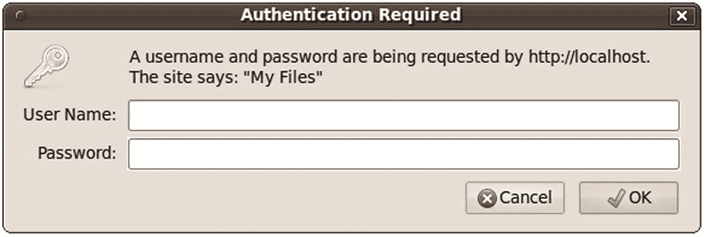

# 十四、认证您的用户

认证用户身份是一种常见的做法，这不仅是出于安全方面的原因，也是为了提供基于用户偏好和类型的可定制功能。通常，系统会提示用户输入用户名和密码，用户名和密码的组合构成了该用户的唯一标识值。在本章中，您将学习如何使用各种方法提示和验证这些信息，包括涉及 Apache 的 htpasswd 特性的简单方法，以及涉及将提供的用户名和密码与直接存储在脚本、文件和数据库中的值进行比较的方法。此外，您将了解如何使用一次性 URL 的概念来恢复丢失的密码。总之，本章的概念包括:

*   基于 HTTP 的基本身份验证概念

*   PHP 的认证变量，即`$_SERVER['PHP_AUTH_USER']`和`$_SERVER['PHP_AUTH_PW']`

*   几个常用于实现认证过程的 PHP 函数

*   三种常见的身份验证方法:将登录对(用户名和密码)直接硬编码到脚本中，基于文件的身份验证，以及基于数据库的身份验证

*   使用一次性 URL 恢复丢失的密码

*   使用 OAuth2 进行身份验证

## HTTP 身份验证概念

HTTP 协议为用户身份验证提供了一种相当基本的方法，典型的身份验证场景如下:



图 14-1

认证提示

1.  客户端请求受限资源。

2.  服务器用 401(未授权访问)响应消息来响应这个请求。

3.  浏览器识别 401 响应，并弹出一个类似于图 [14-1](#Fig1) 所示的认证提示。所有现代浏览器都能够理解 HTTP 认证并提供适当的功能，包括 Google Chrome、Internet Explorer、Mozilla Firefox 和 Opera。

4.  用户提供的凭证(通常是用户名和密码)被发送回服务器进行验证。如果用户提供了正确的凭证，则允许访问；否则就否定了。

5.  如果用户通过验证，浏览器会将身份验证信息存储在其缓存中。此缓存信息将保留在浏览器中，直到缓存被清除，或者直到另一个 401 服务器响应被发送到浏览器。每次请求资源时，密码都会自动传输。现代身份验证方案将使用带有到期时间的令牌，而不是发送实际的密码。

尽管 HTTP 身份验证有效地控制了对受限资源的访问，但它并不保护身份验证凭据传播的通道。也就是说，精心策划的攻击者有可能嗅探或监视服务器和客户端之间发生的所有流量，这些流量中包含未加密的用户名和密码。为了消除通过这种方法进行破坏的可能性，您需要实现一个安全的通信通道，通常使用安全套接字层(SSL)或传输层安全性(TLS)来实现。所有主流 web 服务器都支持 SSL/TLS，包括 Apache 和 Microsoft Internet Information Server(IIS)。当使用安全层时，协议从 HTTP 变为 HTTPS。这将允许客户端和服务器在传输任何真实信息之前交换加密密钥。然后，这些密钥被用来加密和解密客户端和服务器之间的所有双向信息。

### 用阿帕奇的。htaccess 功能

一段时间以来，Apache 已经本机支持了一个身份验证特性，如果您的需求仅限于简单地为整个网站或特定目录提供全面保护，那么这个特性是非常合适的。根据我的经验，典型的用法是结合一个用户名和密码组合来阻止对一组受限文件或项目演示的访问；但是，可以将它与其他高级功能集成在一起，例如在 MySQL 数据库中管理多个帐户的能力。

您将通过创建一个名为`.htaccess`的文件并将其存储在您想要保护的目录中来利用这个特性。因此，如果您想限制对整个网站的访问，请将该文件放在您站点的根目录下。最简单的格式是，`.htaccess`文件的内容如下所示:

```php
AuthUserFile /path/to/.htpasswd
AuthType Basic
AuthName "My Files"
Require valid-user

```

用指向另一个名为`.htpasswd`的必备文件的路径替换`/path/to`。该文件包含用户访问受限内容时必须提供的用户名和密码。这个文件应该放在网站使用的目录结构之外，以防止访问者直接访问它。一会儿，我将向您展示如何使用命令行生成这些用户名/密码对，这意味着您实际上不会编辑`.htpasswd`文件；然而，作为参考，典型的`.htpasswd`文件如下所示:

```php
admin:TcmvAdAHiM7UY
client:f.i9PC3.AtcXE

```

每行包含一个用户名和密码对，密码经过哈希处理(使用哈希是内容的单向转换。不可能将散列变回原始内容)以防止偷窥者潜在地获得整个身份。当用户提供一个密码时，Apache 将使用最初用于加密存储在`.htpasswd`文件中的密码的相同算法散列所提供的密码，比较两者是否相等。

文件不必命名为`.htpasswd`，因此如果您为不同的目录维护不同的密码，您可以相应地命名文件。它还允许您为所有目录共享一个统一的密码文件。

要生成用户名和密码，请打开终端窗口并执行以下命令:

```php
%>htpasswd -c .htpasswd client

```

执行该命令后，系统会提示您创建并确认与名为`client`的用户相关联的密码。一旦完成，如果您检查`.htpasswd`文件的内容，您将看到一行类似于上面显示的示例`.htpasswd`文件的第二行。您可以通过执行相同的命令来创建额外的帐户，但是省略了`-c`选项(它告诉`htpasswd`创建一个新的`.htpasswd`文件)。

一旦您的`.htaccess`和`.htpasswd`文件就位，尝试从您的浏览器导航到新限制的目录。如果一切都配置妥当，你会看到一个类似于图 [14-1](#Fig1) 的认证窗口。

## 用 PHP 认证你的用户

本章的剩余部分将研究 PHP 的内置认证特性，并演示几种可以立即集成到应用中的认证方法。

### PHP 的认证变量

PHP 使用两个预定义的变量来存储和访问来自上述基本 HTTP 认证的内容。分别是:`$_SERVER['PHP_AUTH_USER']`和$_S `ERVER['PHP_AUTH_PW']`。这些变量分别存储用户名和密码值。虽然身份验证就像将预期的用户名和密码与这些变量进行比较一样简单，但在使用这些预定义变量时，有两个重要的注意事项需要记住:

*   这两个变量都必须在每个受限页面的开头进行验证。您可以通过在受限页面上执行任何其他操作之前对用户进行身份验证来轻松实现这一点，这通常意味着将身份验证代码放在一个单独的文件中，然后使用`require()`函数将该文件包含在受限页面中。

*   这些变量在 PHP 的 CGI 版本中不能正常工作。

*   仅当 web 服务器配置为使用 HTTPS 协议时，才使用基本 HTTP 身份验证。

### 有用的功能

当通过 PHP 处理认证时，通常使用两个标准函数:`header()`和`isset()`。这两者都在本节中介绍。

#### 发送带有标头()的 HTTP 标头

`header()`函数向浏览器发送一个原始的 HTTP 头。标题是在浏览器中看到实际内容之前发送的附加信息。*报头*参数指定发送给浏览器的报头信息。其原型如下:

```php
void header(string header [, boolean replace [, int http_response_code]])

```

可选的*替换*参数确定该信息是否应该替换或伴随先前发送的同名报头。最后，可选的 *http_response_code* 参数定义了一个特定的响应代码，它将伴随着头部信息。请注意，您可以将这段代码包含在字符串中，因为很快就会演示到这一点。应用于用户身份验证时，该函数对于将 WWW 身份验证头发送到浏览器非常有用，可以显示弹出的身份验证提示。如果提交了不正确的身份验证凭据，它对于向用户发送 401 头消息也很有用。下面是一个例子:

```php
<?php
   header('WWW-Authenticate: Basic Realm="Book Projects"');
   header("HTTP/1.1 401 Unauthorized");
?>

```

请注意，除非启用了输出缓冲，否则必须在返回任何输出之前执行这些命令。当打开输出缓冲时，PHP 将把所有生成的输出保存在内存中，直到代码决定把它发送给浏览器。如果没有输出缓冲，当内容传输到客户端时，就由 web 服务器来处理。由于违反了 HTTP 规范，忽略此规则将导致服务器错误。

#### 确定变量是否用 Is Set()设置

`isset()`函数确定变量是否被赋值。其原型如下:

```php
boolean isset(mixed var [, mixed var [,...]])

```

如果变量被设置并且包含不同于空值的值，则返回`TRUE`,否则返回`FALSE`。当应用于用户认证时，`isset()`函数对于确定是否设置了`$_SERVER['PHP_AUTH_USER']`和`$_SERVER['PHP_AUTH_PW']`变量很有用。清单 [14-1](#PC7) 提供了一个例子。

```php
<?php

    // If the username or password isn't set, display the authentication window
    if (! isset($_SERVER['PHP_AUTH_USER']) || ! isset($_SERVER['PHP_AUTH_PW'])) {
        header('WWW-Authenticate: Basic Realm="Authentication"');
        header("HTTP/1.1 401 Unauthorized");

    // If the username and password are set, output their credentials
    } else {
        echo "Your supplied username: {$_SERVER['PHP_AUTH_USER']}<br />";

echo "Your password: {$_SERVER['PHP_AUTH_PW']}<br />";
    }
?>

Listing 14-1Using isset()

to Verify Whether a Variable Contains a Value

```

#### PHP 认证方法

有几种方法可以通过 PHP 脚本实现身份验证。这样做时，您应该始终考虑身份验证需求的范围和复杂性。本节讨论三种实现方法:将登录对直接硬编码到脚本中，使用基于文件的身份验证，以及使用基于数据库的身份验证。花时间研究每种身份认证方法，然后选择最适合您需求的解决方案。

### 硬编码身份验证

限制资源访问的最简单方法是将用户名和密码直接硬编码到脚本中。这是一种不好的做法，因为它将允许任何有权访问脚本的人读取这些值。此外，这是一种非常不灵活的处理安全性的方式，因为每次发生变化时都必须更新脚本。如果您决定使用这种方法，您应该存储一个哈希而不是明文密码。清单 [14-2](#PC8) 提供了一个如何实现这一点的例子。

```php
$secret = 'e5e9fa1ba31ecd1ae84f75caaa474f3a663f05f4';
if (($_SERVER['PHP_AUTH_USER'] != 'client') ||
   (hash('sha1', $_SERVER['PHP_AUTH_PW']) != $secret)) {
      header('WWW-Authenticate: Basic Realm="Secret Stash"');
      header('HTTP/1.0 401 Unauthorized');
      print('You must provide the proper credentials!');
      exit;
}

Listing 14-2Authenticating Against a Hard-Coded Login Pair

```

在本例中，如果`$_SERVER['PHP_AUTH_USER']`和`$_SERVER['PHP_AUTH_PW']`分别等于`client`和`secret`，则代码块不会执行，该代码块后面的任何代码都将执行。否则，系统会提示用户输入用户名和密码，直到提供正确的信息，或者由于多次身份验证失败而显示 401 未授权消息。

请注意，我们不是直接比较密码。相反，我们使用 sha1 散列函数将其与存储值进行比较。在这种情况下，该值由以下命令行语句生成:

```php
$ php -r "echo hash('sha1', 'secret');"

```

尽管针对硬编码值的身份验证非常快速且易于配置，但它有几个缺点。首先，所有需要访问该资源的用户必须使用相同的身份验证对。在大多数现实情况下，每个用户必须被唯一地标识，以便可以提供用户特定的偏好或资源。第二，更改用户名或密码只能通过输入代码并进行手动调整来完成。接下来的两种方法消除了这些问题。

### 基于文件的认证

通常，您需要为每个用户提供一个唯一的登录对，以便跟踪用户特定的登录时间、移动和动作。这很容易用一个文本文件来完成，很像通常用来存储 Unix 用户信息的文件(`/etc/passwd`)。清单 [14-3](#PC10) 提供了这样一个文件。每行包含一个用户名和一个散列密码对，这两个元素用冒号分隔。

```php
jason:68c46a606457643eab92053c1c05574abb26f861
donald:53e11eb7b24cc39e33733a0ff06640f1b39425ea
mickey:1aa25ead3880825480b6c0197552d90eb5d48d23

Listing 14-3The authenticationFile.txt File Containing Hashed Passwords

```

关于`authenticationFile.txt`的一个重要的安全考虑是这个文件应该存储在服务器文档根目录之外。如果不是，攻击者可以通过暴力猜测发现该文件，暴露一半的登录组合，并使用彩虹表、密码列表或暴力破解来发现密码。此外，尽管您可以选择跳过密码哈希，但强烈建议不要这样做，因为如果文件权限配置不正确，有权访问服务器的用户可能会查看登录信息。

解析该文件并根据给定的登录对对用户进行身份验证所需的 PHP 脚本只比用于根据硬编码的身份验证对进行身份验证的脚本复杂一点。区别在于脚本的额外任务是将文本文件读入一个数组，然后在数组中循环搜索匹配项。这涉及到几个函数的使用，包括:

*   `file(string` *文件名*`)`:`file()`函数将一个文件读入一个数组，数组的每个元素由文件中的一行组成。

*   `explode(string` *分隔符* `, string` *字符串* `[, int` *限制* `])`:函数`explode()`将一个字符串分割成一系列子字符串，每个字符串的边界由一个特定的分隔符决定。

*   `password_hash(string`*password*`, int`*algo*`)`:password _`hash()`函数返回一个字符串，其中包含算法和 salt 以及最终的散列。

清单 [14-4](#PC11) 展示了一个能够解析`authenticationFile.txt`的 PHP 脚本，潜在地将用户输入匹配到一个登录对。

```php
<?php

    // Preset authentication status to false
    $authorized = false;

    if (isset($_SERVER['PHP_AUTH_USER']) && isset($_SERVER['PHP_AUTH_PW'])) {

        // Read the authentication file into an array
        $authFile = file("/usr/local/lib/php/site/authenticate.txt");

        // Search array for authentication match
        foreach ($authFile, $line ) {
            list($user, $hash) = explode(":", $line);
            if ($_SERVER['PHP_AUTH_USER'] == $user &&
               password_verify($_SERVER['PHP_AUTH_PW'], trim($hash)))
            $authorized = true;
            break;
    }

    // If not authorized, display authentication prompt or 401 error
    If (!$_SERVER['HTTPS']) {
      echo " Please use HTTPS when accessing this document";
      exit;
    }
    if (!$authorized) {
        header('WWW-Authenticate: Basic Realm="Secret Stash"');
        header('HTTP/1.0 401 Unauthorized');
        print('You must provide the proper credentials!');
        exit;
    }
    // restricted material goes here...
?>

Listing 14-4Authenticating a User Against a Flat File Login Repository

```

尽管基于文件的身份验证系统对于相对较小的静态身份验证列表很有效，但是当您处理大量用户时，这种策略很快就会变得不方便；当用户被定期添加、删除和修改时；或者当您需要将身份验证方案合并到更大的信息基础设施(如预先存在的用户表)中时。实现基于数据库的解决方案可以更好地满足这些需求。下一节演示了这样一个解决方案，使用一个数据库来存储身份验证对。

### 基于数据库的认证

在本章讨论的各种身份验证方法中，实现数据库驱动的解决方案是最强大的，因为它不仅提高了管理的便利性和可伸缩性，而且还可以集成到更大的数据库基础结构中。出于本例的目的，数据存储仅限于三个字段:主键、用户名和密码。这些列被放入名为`logins`的表中，如清单 [14-5](#PC12) 所示。

### 注意

如果你不熟悉 MySQL，并且对这个例子中的语法感到困惑，可以考虑从第 [22](22.html) 章开始复习。

```php
CREATE TABLE logins (
   id INTEGER UNSIGNED NOT NULL AUTO_INCREMENT PRIMARY KEY,
   username VARCHAR(255) NOT NULL,
   pswd CHAR(40) NOT NULL
);

Listing 14-5A User Authentication Table

```

下面是几行示例数据:

```php
id    username    password
1     wjgilmore   1826ede4bb8891a3fc4d7355ff7feb6eb52b02c2
2     mwade       1a77d222f28a78e1864662947772da8fdb8721b1
3     jgennick    c1a01cd806b0c41b679f7cd4363f34c761c21279

```

清单 [14-6](#PC14) 显示了用于根据存储在`logins`表中的信息验证用户提供的用户名和密码的代码。

```php
<?php
    /* Because the authentication prompt needs to be invoked twice,
       embed it within a function.
    */

    function authenticate_user() {
        header('WWW-Authenticate: Basic realm="Secret Stash"');
        header("HTTP/1.0 401 Unauthorized");
        exit;
    }

    /* If $_SERVER['PHP_AUTH_USER'] is blank, the user has not yet been
       prompted for the authentication information.
    */

    if (! isset($_SERVER['PHP_AUTH_USER'])) {

        authenticate_user();

    } else {

      $db = new mysqli("localhost", "webuser", "secret", "chapter14");

      $stmt = $db->prepare("SELECT username, pswd FROM logins
                  WHERE username=? AND pswd= ?");

      $stmt->bind_param('ss', $_SERVER['PHP_AUTH_USER'], password_hash($_SERVER['PHP_AUTH_PW'], PASSWORD_DEFAULT));

      $stmt->execute();

      $stmt->store_result();

      // Remember to check for erres also!
      if ($stmt->num_rows == 0)
        authenticate_user();
  }

?>

Listing 14-6Authenticating a User Against a MySQL Database

```

尽管数据库身份验证比前两种方法更强大，但实现起来确实很简单。只需对`logins`表执行选择查询，使用输入的用户名和密码作为查询标准。当然，这种解决方案不依赖于 MySQL 数据库的特定用途；任何关系数据库都可以代替它。

## 用户登录管理

当您将用户登录合并到您的应用中时，提供一个可靠的身份验证机制仅仅是整体情况的一部分。如何确保用户选择一个足够难的可靠密码，使得攻击者无法将其作为可能的攻击途径？再者，你如何处理用户忘记密码这一不可避免的事件？这两个主题都将在本节中详细讨论。

## 密码哈希

以明文形式存储密码存在明显的安全风险，因为任何有权访问文件或数据库的人都可以读取密码，从而获得对系统的访问权限，就好像他们实际上就是该用户一样。使用弱哈希算法，已知的安全问题，甚至在某些情况下逆转过程的能力，几乎与纯文本一样不安全。

PHP 5.5 及以后版本增加了函数`password_hash()`和`password_verify()`。随着更安全的算法的开发，这些函数被设计成同样安全和可更新的。顾名思义，`password_hash()`函数用于从密码字符串创建散列。原型看起来像这样:

```php
string password_hash(string $password, integer $algo [, array $options ])

```

第一个参数是包含明文密码的字符串。第二个参数选择要使用的算法。到目前为止，PHP 支持 bcrypt、Blowfish 和 Argon2。第三个可选选项用于传递算法特定的值，在大多数情况下不使用。更多信息见 [`https://php.net/manual/en/function.password-hash.php`](https://php.net/manual/en/function.password-hash.php) 。

如果您创建一个简单的测试脚本，它接受一个密码值，然后调用几次`password_hash()`函数，您将会看到返回值每次都发生变化:

```php
<?php
$password = 'secret';
echo password_hash($password , PASSWORD_DEFAULT) . "\n";
echo password_hash($password , PASSWORD_DEFAULT) . "\n";
echo password_hash($password , PASSWORD_DEFAULT) . "\n";
?>

```

该脚本将生成如下所示的输出:

```php
$2y$10$vXQU7uqUGMc/Aey2kpfZl.F23MeCJx08C5ZFDEqiqxkHeRkxek9p2
$2y$10$g9ZJu1A80mzDnAvGENtUHO0lq600U4hXfYZse6R7zfvXEIDbHN8nG
$2y$10$/xqgeR8lsdJQhd.8qyW5XOy0FhNQ5raJ42MpY4/BREER1GATEdENa

```

如果函数返回不同的结果，就不可能将哈希存储在数据库中，并将其用作与用户尝试进行身份验证时生成的新值的直接比较。这就是`password_verify()`函数变得有用的地方。这个函数有两个参数:

```php
boolean password_verify ( string $password , string $hash )

```

第一个是以明文表示的密码，第二个是存储在文件或数据库中的散列。生成散列时，算法、salt 和成本(用于生成散列的参数)都包含在字符串中。这允许验证函数根据密码和这些参数生成新的散列。然后在内存中进行比较，将返回 true 或 false，指示密码是否与哈希值匹配。

### 一次性网址和密码恢复

毫无疑问，您的应用用户会忘记他们的密码。我们都有忘记这些信息的罪过，这不完全是我们的错。花点时间列出您经常使用的所有不同的登录组合；我猜你至少有 12 种这样的组合，包括电子邮件、工作站、服务器、银行账户、公用事业、在线商务和证券经纪。因为您的应用假定会在用户列表中添加另一个登录对，所以应该有一个简单的自动化机制，用于在忘记密码时检索或重置用户密码。本节研究一种这样的机制，称为一次性 URL。

当没有其他身份验证机制可用时，或者当用户发现身份验证对于手头的任务来说可能太单调乏味时，通常向用户提供一次性 URL 以确保唯一性。例如，假设您维护了一个新闻稿订阅者列表，并想知道哪些订阅者以及有多少订阅者正在对他们在新闻稿中读到的内容采取行动。做出这一决定的最常见方法之一是向他们提供一个指向新闻稿的一次性 URL，可能如下所示:

```php
http://www.example.com/newsletter/0503.php?id=9b758e7f08a2165d664c2684fddbcde2

```

为了确切地知道哪些用户对这期新闻简报感兴趣，已经为每个用户分配了一个唯一的 ID 参数，如前面的 URL 所示，并存储在某个`subscribers`表中。这些值通常是伪随机的，使用 PHP 的`hash()`和`uniqid()`函数导出，如下所示:

```php
$id = hash('sha1', uniqid(rand(),1));

```

`subscribers`表格可能如下所示:

```php
CREATE TABLE subscribers (
   id INTEGER UNSIGNED NOT NULL AUTO_INCREMENT PRIMARY KEY,
   email VARCHAR(255) NOT NULL,
   hash CHAR(40) NOT NULL,
   read CHAR(1)
);

```

当用户单击此链接，导致新闻稿显示时，将在显示新闻稿之前执行以下查询:

```php
UPDATE subscribers SET read="Y" WHERE hash="e46d90abd52f4d5f02953524f08c81e7c1b6a1fe";

```

结果是你将确切地知道哪些订户对时事通讯感兴趣。

这个非常相同的概念可以应用于密码恢复。为了说明这是如何完成的，考虑清单 [14-7](#PC23) 中显示的修改后的`logins`表。

```php
CREATE TABLE logins (
   id TINYINT UNSIGNED NOT NULL AUTO_INCREMENT PRIMARY KEY,
   email VARCHAR(55) NOT NULL,
   username VARCHAR(16) NOT NULL,
   pswd CHAR(32) NOT NULL,
   hash CHAR(32) NOT NULL
);

Listing 14-7A Revised logins Table

```

假设这个表中的一个用户忘记了他的密码，于是点击了`Forgot password?`链接，这通常出现在登录提示符附近。用户到达一个页面，要求他输入电子邮件地址。一旦输入地址并提交表单，就会执行类似于清单 [14-8](#PC24) 中所示的脚本。

```php
<?php

    $db = new mysqli("localhost", "webuser", "secret", "chapter14");

    // Create unique identifier
    $id = md5(uniqid(rand(),1));

    // User's email address
    $address = filter_var($_POST[email], FILTER_SANITIZE_EMAIL);

    // Set user's hash field to a unique id
    $stmt = $db->prepare("UPDATE logins SET hash=? WHERE email=?");
    $stmt->bind_param('ss', $id, $address);

    $stmt->execute();

    $email = <<< email
Dear user,
Click on the following link to reset your password:
http://www.example.com/users/lostpassword.php?id=$id
email;

// Email user password reset options
mail($address,"Password recovery","$email","FROM:services@example.com");
echo "<p>Instructions regarding resetting your password have been sent to
         $address</p>";
?>

Listing 14-8A One-Time URL Generator

```

当用户收到这封邮件并点击链接时，清单 [14-9](#PC25) 中所示的脚本`lostpassword.php`就会执行。

```php
<?php
    $length = 12;
    $valid = '0123456789abcdefghijklmnopqrstuvwxyzABCDEFGHIJKLMNOPQRSTUVWXYZ';
    $max = strlen($valid);
    $db = new mysqli("localhost", "webuser", "secret", "chapter14");

    // Create a pseudorandom password $length characters in length
    for ($i = 0; $i < $length; ++$i) {
        $pswd .= $valid[random_int(0, $max)];
    }

    // User's hash value
    $id = filter_var($_GET[id], FILTER_SANITIZE_STRING);

    // Update the user table with the new password
    $stmt = $db->prepare("UPDATE logins SET pswd=? WHERE hash=?");
    $stmt->bind_param("ss", password_hash($pswd, PASSWORD_DEFAULT), $id);
    $stmt->execute();

    // Display the new password
    echo "<p>Your password has been reset to {$pswd}.</p>";
?>

Listing 14-9Resetting a User’s Password

```

当然，这只是众多恢复机制中的一种。例如，您可以使用一个类似的脚本为用户提供一个重新设置密码的表单。

## 使用 OAuth 2.0

OAuth 2.0 是用于授权的行业标准协议。该协议允许以多种不同的方式授予对系统的访问权限。它通常与第三方授权服务一起使用，在第三方授权服务中，用户被重定向到另一个站点，在该站点中，用户的身份以某种方式得到验证，验证成功后，uer 被重定向回该站点，服务器可以从第三方站点获得访问令牌。现在有很多 OAuth 2.0 服务，其中一些最常见的是脸书、LinkedIn 和 Google。

有许多可能的库可用于 OAuth2 协议的客户端和服务器实现。使用客户端库可以相对简单地将一个或多个授权服务集成到您的网站中。

以下示例显示了如何与脸书的身份验证 API 集成。这些 API 可用于用户注册和用户认证，并且如果用户授权访问，则提供对附加用户信息的访问。基本概念是从在你的网站上添加一个链接或一个按钮开始的。该按钮将允许用户使用脸书登录。单击该按钮时，API 将打开一个弹出窗口，检查用户是否已经登录到脸书(在同一浏览器的不同选项卡中)。否则，将显示脸书登录对话框。如果用户已经登录，API 将检查用户是否已经被授权访问站点。如果没有访问权限，脸书将不会为该用户提供访问令牌。当访问被授予时，用户将被重定向回站点，在那里可以调用 API 来检索访问令牌。

实现脸书集成的第一步是通过以下 composer 命令安装脸书 SDK:

```php
composer require facebook/graph-sdk

```

这将在 vendor/facebook/graph-sdk 中安装 sdk 文件。之后的下一步是为您的网站生成一个应用 ID。进入 [`https://developer.facebook.com`](https://developer.facebook.com) ，点击右上角的“我的应用”下拉菜单。然后选择添加新应用选项，并按照表单中的步骤操作。这样做的结果是一个应用 ID 和一个应用秘密。应用 ID 是标识的公共部分，用于识别您的应用或网站。App Secret 是 id 的私有部分。您应该将它存储在一个无法从网站访问的地方。我建议将包含文件放在 web 根目录之外。

要在您的站点上初始化脸书 API，您必须在页面上的 JavaScript 块中包含以下匿名函数:

```php
window.fbAsyncInit = function() {
   FB.init({"appId":"<<APP ID>>","status":true,"cookie":true,"xfbml":true,"version":"v2.11"});
};
(function(d, s, id){
   var js, fjs = d.getElementsByTagName(s)[0];
   if (d.getElementById(id)) {return;}
   js = d.createElement(s); js.id = id;
   js.src = "//connect.facebook.net/en_US/sdk.js";
   fjs.parentNode.insertBefore(js, fjs);
}(document, 'script', 'facebook-jssdk'));

```

第一部分定义了一个用于初始化 API 的全局函数。在这种情况下，使用您为网站生成的 ID 来更改<<app id="">>非常重要。</app>

JavaScript 代码的下一部分用作用户单击“用脸书登录”按钮时的响应。

```php
function FacebookLogin() {
    FB.login(function(response) {
        if (response.authResponse) {
          // Perform actions here to validate that the user is known to the site.
          $.post( "/facebook_login.php", function( data ) {
           // Perform action on data returned from the login script.
          });
        }
    }, {scope: 'email,user_birthday'});
}

```

`FacebookLogin()`函数用两个参数调用 FB.login API。第一个是将处理响应的 annoynmoys 函数，第二个是将传递给登录 API 的作用域。在这种情况下，除了网站请求访问的 id 之外，范围还标识其他字段。在 actions 部分，您可以放置一个 Ajax POST 请求，该请求将在站点上执行实际的登录操作，验证所选的脸书用户是否与已经在站点上注册的用户相匹配。`facebook_login.php`文件将类似于下面的清单。

```php
<?php
include('fb_config.inc');

$fb = new \Facebook\Facebook([
    'app_id' => FB_APP_ID,
    'app_secret' => FB_APP_SECRET,
    'default_graph_version' => 'v2.11',
]);

$helper = $fb->getJavaScriptHelper();

try {
    $accessToken = $helper->getAccessToken();
    $fb->setDefaultAccessToken((string) $accessToken);
    $response = $fb->get('/me?fields=id,name');
} catch(\Facebook\Exceptions\FacebookResponseException $e) {
    // When Graph returns an error
    Error('Graph returned an error: ' . $e->getMessage());
    exit;
} catch(\Facebook\Exceptions\FacebookSDKException $e) {
    // When validation fails or other local issues
    Error('Facebook SDK returned an error: ' . $e->getMessage());
    exit;
}

$me = $response->getGraphUser();
// $me is an array with the id of the user and any additional fields requested.

```

这将为您提供用户的脸书 ID，您可以使用它来识别用户。如果您在第一次登录之前使用脸书注册用户，您将保存 ID 和其他请求的信息，并且您可以使用这些信息来查找用户并在您的站点上执行登录。

## 摘要

这一章介绍了 PHP 的认证功能，这些功能实际上保证会集成到您未来的许多应用中。除了讨论围绕此功能的基本概念之外，还研究了几种常见的身份验证方法。本章讨论了使用一次性 URL 恢复密码。

下一章讨论另一个流行的 PHP 特性——通过浏览器处理文件上传。