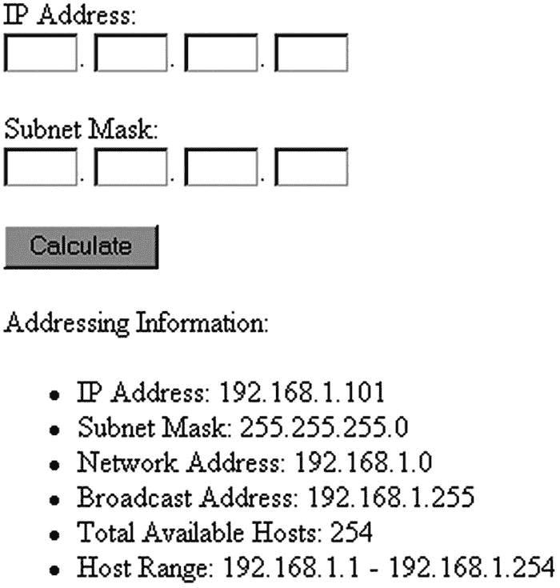

# 十六、网络编程

你可能会翻到这一章，想知道 PHP 在网络方面能提供什么。毕竟，网络任务不是很大程度上属于系统管理常用的语言吗，比如 Perl 或 Python？虽然这种刻板印象可能曾经描绘了一幅相当准确的画面，但如今，将网络功能整合到 web 应用程序中已经司空见惯。事实上，基于 web 的应用程序经常被用来监控甚至维护网络基础设施。此外，使用 PHP 的命令行版本。使用最喜欢的语言和所有可用的库来编写系统管理的高级脚本是非常容易的。PHP 开发人员总是热衷于承认不断增长的用户需求，他们已经集成了一系列令人印象深刻的特定于网络的功能。

本章分为几节，涵盖以下主题:

*   **DNS、服务器和服务** : PHP 提供了多种功能，能够检索关于网络内部、DNS、协议和互联网寻址方案的信息。本节将介绍这些函数，并提供几个使用示例。

*   用 PHP 发送电子邮件:通过 web 应用程序发送电子邮件无疑是目前你能找到的最常见的功能之一，而且理由充分。电子邮件仍然是互联网的杀手级应用，为交流和维护重要的数据和信息提供了一种非常有效的手段。本节解释了如何通过 PHP 脚本轻松发送消息。此外，您将了解如何使用 PHPMailer 库来简化更复杂的电子邮件发送，例如涉及多个收件人、HTML 格式和包含附件的发送。

*   **常见网络任务**:在本节中，您将学习如何使用 PHP 来模拟通常由命令行工具执行的任务，包括 ping 网络地址、跟踪网络连接、扫描服务器的开放端口等等。

## DNS、服务和服务器

如今，对网络问题进行调查或故障排除通常需要收集与受影响的客户端、服务器和网络内部相关的各种信息，如协议、域名解析和 IP 寻址方案。PHP 提供了许多函数来检索关于每个主题的大量信息，本节将介绍每一个函数。

### 域名服务器(Domain Name Server)

域名系统(DNS)允许您使用域名(如 example.com)代替相应的 IP 地址，如 192.0.34.166。域名及其互补的 IP 地址存储在散布在全球各地的域名服务器上。通常，一个域有多种类型的相关记录，一种将 IP 地址映射到该域的特定主机名，另一种用于定向电子邮件，还有一种用于域名别名。网络管理员和开发人员经常需要了解给定域的各种 DNS 记录。本节介绍了许多标准的 PHP 函数，这些函数能够挖掘大量关于 DNS 记录的信息。

#### 检查 DNS 记录是否存在

`checkdnsrr()`函数检查 DNS 记录的存在。其原型如下:

```php
int checkdnsrr(string host [, string type])

```

根据提供的`host`值和可选的 DNS 资源记录`type`检查 DNS 记录，如果找到任何记录，则返回`TRUE`，否则返回`FALSE`。可能的记录类型包括以下几种:

*   **A** : IPv4 地址记录。负责主机名到 IPv4 地址的转换。

*   **AAAA** : IPv6 地址记录。负责主机名到 IPv6 地址的转换。

*   **A6** : IPv6 地址记录。用于表示 IPv6 地址。旨在取代目前用于 IPv6 映射的 AAAA 记录。

*   **ANY** :查找任何类型的记录。

*   **CNAME** :规范名称记录。将别名映射到真实域名。

*   **MX** :邮件交换记录。确定主机邮件服务器的名称和相对首选项。这是默认设置。

*   **NAPTR** :命名机构指针。允许不符合 DNS 的名称，使用正则表达式重写规则将它们解析到新域。例如，NAPTR 可能用于维护遗留(前 DNS)服务。

*   **NS** :名称服务器记录。确定主机的名称服务器。

*   **PTR** :指针记录。将 IP 地址映射到主机。

*   **SOA** :权限记录开始。为主机设置全局参数。

*   **SRV** :服务记录。表示所提供域的各种服务的位置。

*   **TXT** :文本记录。存储有关主机的其他未格式化信息，如 SPF 记录。

举个例子。假设您想要验证域名 example.com 是否有相应的 DNS 记录:

```php
<?php
    $domain = "example.com";
    $recordexists = checkdnsrr($domain, "ANY");
    if ($recordexists)
      echo "The domain '$domain' has a DNS record!";
    else
      echo "The domain '$domain' does not appear to have a DNS record!";
?>

```

这将返回以下内容:

```php
The domain 'example.com' exists

```

您还可以使用此函数来验证所提供的邮件地址的域是否存在:

```php
<?php
    $email = "ceo@example.com";
    $domain = explode("@",$email);

    $valid = checkdnsrr($domain[1], "MX");

    if($valid)
      echo "The domain has an MX record!";
    else
      echo "Cannot locate MX record for $domain[1]!";
?>

```

这将返回以下内容:

```php
Cannot locate MX record for example.com!

```

将记录类型更改为“A”将导致脚本返回有效的响应。这是因为 example.com 域有一个有效的 A 记录，但没有有效的 MX(邮件交换)记录。请记住，这不是请求验证 MX 记录的存在。有时，网络管理员采用其他配置方法来允许在不使用 MX 记录的情况下进行邮件解析(因为 MX 记录不是强制性的)。为了谨慎起见，只需检查域是否存在，而不需要特别要求验证 MX 记录是否存在。

此外，这并不能验证电子邮件地址是否真的存在。做出这一决定的唯一确定方法是向用户发送一封电子邮件，并要求他通过单击一次性 URL 来验证地址。你可以在第 [14 章](14.html)中了解更多关于一次性 URL 的信息。

#### 正在检索 DNS 资源记录

函数的作用是:返回一个数组，该数组包含与特定域相关的各种 DNS 资源记录。其原型如下:

```php
array dns_get_record(string hostname [, int type [, array &authns, array &addtl]])

```

默认情况下，`dns_get_record()`返回它可以找到的特定于所提供的域的所有记录(`hostname`)；但是，您可以通过指定类型来简化检索过程，类型的名称必须以 DNS 开头。该功能支持与`checkdnsrr()`T3 一起介绍的所有类型，以及稍后将介绍的其他类型。最后，如果您正在寻找这个主机名的 DNS 描述的完整描述，您可以通过引用传递`authns`和`addtl`参数，它们指定与权威名称服务器和附加记录相关的信息也应该被返回。

假设提供的`hostname`有效并且存在，对`dns_get_record()`的调用至少返回四个属性:

*   `host`:指定所有其他属性对应的 DNS 名称空间的名称。

*   `class`:仅返回类 Internet 的记录，因此该属性始终为`IN`。

*   `type`:决定记录类型。根据返回的类型，其他属性也可能可用。

*   `ttl`:计算记录的原始生存时间减去自查询权威名称服务器以来经过的时间。

除了在`checkdnsrr()`一节中介绍的类型外，`dns_get_record()` `:`还可以使用以下域记录类型

*   `DNS_ALL`:检索所有可用的记录，甚至是那些在使用特定操作系统的识别功能时可能无法识别的记录。当您希望绝对确定所有可用记录都已被检索时，请使用此选项。

*   `DNS_ANY`:检索特定操作系统识别的所有记录。

*   `DNS_HINFO`:指定主机的操作系统和计算机类型。请记住，这些信息不是必需的。

*   `DNS_NS`:确定名称服务器是否是给定域的权威答案，或者该职责是否最终委托给另一个服务器。

请记住，类型名必须总是以`DNS_`开头。例如，假设您想了解有关 example.com 域的更多信息:

```php
<?php
    $result = dns_get_record("example.com");
    print_r($result);
?>

```

返回信息的示例如下:

```php
Array
(
    [0] => Array
        (
            [host] => example.com
            [class] => IN
            [ttl] => 3600
            [type] => SOA
            [mname] => sns.dns.icann.org
            [rname] => noc.dns.icann.org
            [serial] => 2018013021
            [refresh] => 7200
            [retry] => 3600
            [expire] => 1209600
            [minimum-ttl] => 3600
        )

    [1] => Array
        (
            [host] => example.com
            [class] => IN
            [ttl] => 25742
            [type] => NS
            [target] => a.iana-servers.net
        )

    [2] => Array
        (
            [host] => example.com
            [class] => IN
            [ttl] => 25742
            [type] => NS
            [target] => b.iana-servers.net
        )

    [3] => Array
        (
            [host] => example.com
            [class] => IN
            [ttl] => 25742
            [type] => AAAA
            [ipv6] => 2606:2800:220:1:248:1893:25c8:1946
        )

    [4] => Array

        (
            [host] => example.com
            [class] => IN
            [ttl] => 25742
            [type] => A
            [ip] => 93.184.216.34
        )

    [5] => Array
        (
            [host] => example.com
            [class] => IN
            [ttl] => 60
            [type] => TXT
            [txt] => v=spf1 -all
            [entries] => Array
                (
                    [0] => v=spf1 -all
                )
        )

    [6] => Array
        (
            [host] => example.com
            [class] => IN
            [ttl] => 60
            [type] => TXT
            [txt] => $Id: example.com 4415 2015-08-24 20:12:23Z davids $
            [entries] => Array

                (
                    [0] => $Id: example.com 4415 2015-08-24 20:12:23Z davids $
                )
        )
)

```

如果您只对地址记录感兴趣，您可以执行以下命令:

```php
<?php
    $result = dns_get_record("example.com", DNS_A);
    print_r($result);
?>

```

这将返回以下内容:

```php
Array (
  [0] => Array (
    [host] => example.com
    [type] => A
    [ip] => 192.0.32.10
    [class] => IN
    [ttl] => 169679 )
)

```

#### 正在检索 MX 记录

`getmxrr()`函数检索由`hostname`指定的域的 MX 记录。其原型如下:

```php
boolean getmxrr(string hostname, array &mxhosts [, array &weight])

```

由`hostname`指定的主机的 MX 记录被添加到由`mxhosts`指定的数组中。如果提供了可选的输入参数`weight`，相应的权重值将放在那里；这些是指分配给记录所标识的每台服务器的命中率。下面是一个例子:

```php
<?php
    getmxrr("wjgilmore.com", $mxhosts);
    print_r($mxhosts);
?>

```

这将返回以下输出:

```php
Array ( [0] => aspmx.l.google.com)

```

### 服务

虽然我们经常在广义上使用*互联网*这个词，指的是聊天、阅读或下载某个游戏的最新版本，但我们实际上指的是一个或几个互联网服务，它们共同定义了这个交流平台。这些服务的例子包括 HTTP、HTTPS、FTP、POP3、IMAP 和 SSH。由于各种原因(这方面的解释超出了本书的范围)，每个服务通常都在一个特定的通信端口上运行。例如，HTTP 的默认端口是 80，SSH 的默认端口是 22。如今，对网络各级防火墙的广泛需求使得这方面的知识变得非常重要。两个 PHP 函数，`getservbyname()`和`getservbyport()` `,`可用于了解更多关于服务及其相应端口号的信息。

#### 检索服务的端口号

函数的作用是:返回指定服务的端口号。其原型如下:

```php
int getservbyname(string service, string protocol)

```

对应于`service`的服务必须使用与在`/etc/services`文件或 C:\ Windows \ System32 \ drivers \ etc(在 Windows 系统上)中找到的相同名称来指定。`protocol`参数指定您是指这个服务的`tcp`还是`udp`组件。考虑一个例子:

```php
<?php
    echo "HTTP's default port number is: ".getservbyname("http", "tcp");
?>

```

这将返回以下内容:

```php
HTTP's default port number is: 80

```

#### 检索端口号的服务名

`getservbyport()`函数返回与所提供的端口号相对应的服务名。其原型如下:

```php
string getservbyport(int port, string protocol)

```

`protocol`参数指定您是指服务的`tcp`还是`udp`组件。考虑一个例子:

```php
<?php
    echo "Port 80's default service is: ".getservbyport(80, "tcp");
?>

```

这将返回以下内容:

```php
Port 80's default service is: www

```

### 建立套接字连接

在今天的网络环境中，您经常想要查询本地和远程的服务。这通常是通过与该服务建立套接字连接来实现的。本节演示了如何使用`fsockopen()`功能来实现这一点。其原型如下:

```php
resource fsockopen(string target, int port [, int errno [, string errstring
                   [, float timeout]]])

```

`fsockopen()`函数建立到端口上`target`指定的资源的连接，返回错误信息给可选参数`errno`和`errstring`。可选参数`timeout`设置了一个时间限制，以秒为单位，该函数在失败前将尝试建立连接多长时间。

第一个示例显示了如何使用`fsockopen()`建立到 [`www.example.com`](http://www.example.com) 的端口 80 连接，以及如何输出索引页面:

```php
<?php

    // Establish a port 80 connection with www.example.com
    $http = fsockopen("www.example.com",80);

    // Send a request to the server
    $req = "GET / HTTP/1.1\r\n";
    $req .= "Host: www.example.com\r\n";
    $req .= "Connection: Close\r\n\r\n";

    fputs($http, $req);

    // Output the request results
    while(!feof($http)) {
        echo fgets($http, 1024);
    }

    // Close the connection
    fclose($http);
?>

```

这将返回以下输出:

```php
HTTP/1.1 200 OK
Cache-Control: max-age=604800
Content-Type: text/html
Date: Sun, 25 Feb 2018 23:12:08 GMT
Etag: "1541025663+gzip+ident"
Expires: Sun, 04 Mar 2018 23:12:08 GMT
Last-Modified: Fri, 09 Aug 2013 23:54:35 GMT
Server: ECS (sea/5557)
Vary: Accept-Encoding
X-Cache: HIT
Content-Length: 1270
Connection: close

<!doctype html>
<html>
<head>
    <title>Example Domain</title>

    <meta charset="utf-8" />
    <meta http-equiv="Content-type" content="text/html; charset=utf-8" />
    <meta name="viewport" content="width=device-width, initial-scale=1" />
    <style type="text/css">
    body {
        background-color: #f0f0f2;
        margin: 0;
        padding: 0;
        font-family: "Open Sans", "Helvetica Neue", Helvetica, Arial, sans-serif;

    }
    div {
        width: 600px;
        margin: 5em auto;
        padding: 50px;
        background-color: #fff;
        border-radius: 1em;
    }
    a:link, a:visited {
        color: #38488f;
        text-decoration: none;
    }
    @media (max-width: 700px) {
        body {
            background-color: #fff;
        }
        div {
            width: auto;
            margin: 0 auto;
            border-radius: 0;
            padding: 1em;
        }
    }
    </style>
</head>

<body>
<div>
    <h1>Example Domain</h1>
    <p>This domain is established to be used for illustrative examples in documents

. You may use this
    domain in examples without prior coordination or asking for permission.</p>
    <p><a href="http://www.iana.org/domains/example">More information...</a></p>
</div>
</body>
</html>

```

输出显示了来自服务器的完整响应(头和主体)。使用 PHP 通过基于 HTTP 的服务检索内容可以通过对`file_get_contents() which only returns the body part`的单个函数调用来完成，但是对于遵循 PHP 不知道的协议的其他服务，必须使用 socket 函数并手动构建支持，如上例所示。

第二个例子，如清单 [16-1](#PC23) 所示，展示了如何使用`fsockopen()`构建一个基本的端口扫描器。

```php
<?php

    // Give the script enough time to complete the task
    ini_set("max_execution_time", 120);

    // Define scan range
    $rangeStart = 0;
    $rangeStop = 1024;

    // Which server to scan?
    $target = "localhost";

    // Build an array of port values
    $range =range($rangeStart, $rangeStop);

    echo "<p>Scan results for $target</p>";

    // Execute the scan
    foreach ($range as $port) {
        $result = @fsockopen($target, $port,$errno,$errstr,1);
        if ($result) echo "<p>Socket open at port $port</p>";
    }

?>

Listing 16-1Creating a Port Scanner with fsockopen()

```

使用此脚本扫描我的本地计算机会产生以下输出:

```php
Scan results for localhost
Socket open at port 22
Socket open at port 80
Socket open at port 631

```

请注意，运行远程计算机的扫描很可能会导致防火墙阻止请求。

完成同样任务的一个更为懒惰的方法是使用一个程序执行命令，比如`system()`和精彩的免费软件包 Nmap ( [`https://nmap.org/`](https://nmap.org/) )。“常见网络任务”一节演示了这种方法。

## 邮件

PHP 强大的邮件功能非常有用，而且许多 web 应用程序都需要它，因此这一部分很可能是本章中最受欢迎的部分之一，如果不是整本书的话。在本节中，您将学习如何使用 PHP 流行的`mail()`函数发送电子邮件，包括如何控制标题、包含附件以及执行其他常见的任务。

本节介绍了相关的配置指令，描述了 PHP 的`mail()`函数，并以几个例子强调了该函数的多种用法。

### 配置指令

有五个配置指令与 PHP 的`mail()`函数相关。请密切注意这些描述，因为每个描述都是特定于平台的。

#### SMTP = *字符串*

范围:`PHP_INI_ALL`；默认值:`localhost`

指令为 PHP 的 Windows 平台版本的邮件功能设置邮件传输代理(MTA)。请注意，这仅与 Windows 平台相关，因为该功能的 Unix 平台实现实际上只是该操作系统邮件功能的包装。相反，Windows 实现依赖于由该指令定义的到本地或远程 MTA 的套接字连接。

#### sendmail_from = *字符串*

范围:`PHP_INI_ALL`；默认值:`NULL`

`sendmail_from`指令设置消息头的`From`字段和返回路径。

#### sendmail_path = *字符串*

范围:`PHP_INI_SYSTEM`；默认值:默认的 sendmail 路径

如果 sendmail 二进制文件不在系统路径中，或者如果您想向二进制文件传递额外的参数，那么`sendmail_path`指令会设置它的路径。默认情况下，这被设置为以下内容:

```php
sendmail -t -i

```

请记住，该指令仅适用于 Unix 平台。Windows 依赖于与 smtp_port 端口上的 SMTP 指令指定的 SMTP 服务器建立套接字连接。

#### smtp_port = *整数*

范围:`PHP_INI_ALL`；默认值:`25`

ort 指令设置用于连接 SMTP 指令指定的服务器的端口。

#### mail . force _ extra _ parameters =*string*

范围:`PHP_INI_SYSTEM`；默认值:`NULL`

您可以使用`mail.force_extra_parameters`指令将附加标志传递给 sendmail 二进制文件。注意，这里传递的任何参数都将替换那些通过`mail()`函数的`addl_params`参数传递的参数。

### 使用 PHP 脚本发送电子邮件

使用`mail()`函数，可以通过 PHP 脚本以极其简单的方式发送电子邮件。其原型如下:

```php
boolean mail(string to, string subject, string message [, string addl_headers [, string addl_params]])

```

`mail()`功能可以向一个或多个收件人发送带有主题和信息的电子邮件。您可以使用 addl_header `s`参数定制许多电子邮件属性；您甚至可以通过`addl_params`参数传递额外的标志来修改您的 SMTP 服务器的行为。请注意，该函数不验证 addl_headers 参数的内容。添加多个换行符会破坏电子邮件。确保只添加有效的标题。

在 Unix 平台上，PHP 的`mail()`函数依赖于 sendmail MTA。如果你使用另一种 MTA(例如 qmail)，你需要使用 MTA 的 sendmail 包装器。PHP 的 Windows 函数实现依赖于建立一个套接字连接到一个由配置指令`SMTP`指定的 MTA，在前一节中已经介绍过。

本节的剩余部分将通过大量的例子来突出这个简单而强大的函数的许多功能。

#### 发送纯文本电子邮件

使用`mail()`函数发送最简单的电子邮件很简单，除了第四个参数(允许您识别发件人)之外，只使用三个必需的参数就可以完成。这里有一个例子:

```php
<?php
    mail("test@example.com", "This is a subject", "This is the mail body",
           "From:admin@example.com\r\n");
?>

```

请特别注意如何设置发件人地址，包括\r\n(回车加换行符)字符。忽略以这种方式格式化地址会产生意想不到的结果或导致功能完全失败。

#### 利用 PHPMailer

虽然可以使用`mail()`函数来执行更复杂的操作，比如发送给多个收件人、用 HTML 格式的电子邮件骚扰用户或者包含附件，但是这样做可能是一个繁琐且容易出错的过程。然而，PHPMailer 库( [`https://github.com/PHPMailer/PHPMailer`](https://github.com/PHPMailer/PHPMailer) )让这样的任务变得轻而易举。

##### 安装 PHPMailer

安装这个库很容易，它是通过前面描述的 composer 工具来完成的。将以下行添加到 composer.json 文件中，并在该目录中运行 composer update:

```php
"phpmailer/phpmailer": "~6.0"

```

您也可以运行以下命令行来安装文件:

```php
composer require phpmailer/phpmailer

```

这将在您的本地供应商文件夹中安装文件，并且这些文件可以使用。instalPackage 操作的输出:1 次安装，11 次更新，0 次删除

```php
  - Updating symfony/polyfill-mbstring (v1.6.0 => v1.7.0): Downloading (100%)
  - Updating symfony/translation (v3.4.1 => v4.0.4): Downloading (100%)
  - Updating php-http/discovery (1.3.0 => 1.4.0): Downloading (100%)
  - Updating symfony/event-dispatcher (v2.8.32 => v2.8.34): Downloading (100%)
  - Installing phpmailer/phpmailer (v6.0.3): Downloading (100%)
  - Updating geoip/geoip dev-master (1f94041 => b82fe29):  Checking out b82fe29281
  - Updating nesbot/carbon dev-master (926aee5 => b1ab4a1):  Checking out b1ab4a10fc
  - Updating ezyang/htmlpurifier dev-master (5988f29 => c1167ed):  Checking out c1167edbf1
  - Updating guzzlehttp/guzzle dev-master (501c7c2 => 748d67e):  Checking out 748d67e23a
  - Updating paypal/rest-api-sdk-php dev-master (81c2c17 => 219390b):  Checking out 219390b793
  - Updating piwik/device-detector dev-master (caf2d15 => 319d108):  Checking out 319d108899
  - Updating twilio/sdk dev-master (e9bc80c => d33971d):  Checking out d33971d26a
phpmailer/phpmailer suggests installing league/oauth2-google (Needed for Google XOAUTH2 authentication)
phpmailer/phpmailer suggests installing hayageek/oauth2-yahoo (Needed for Yahoo XOAUTH2 authentication)
phpmailer/phpmailer suggests installing stevenmaguire/oauth2-microsoft (Needed for Microsoft XOAUTH2 authentication)lation will look similar to this:

```

##### 用 PHPMailer 发送电子邮件

使用 PHPMailer 类需要使用两个名称空间，然后包含作曲者的 autoload.php 脚本。任何使用此功能的脚本都应该在顶部包含以下几行:

```php
<?php
// Import PHPMailer classes into the global namespace
// These must be at the top of your script, not inside a function
use PHPMailer\PHPMailer\PHPMailer;
use PHPMailer\PHPMailer\Exception;

//Load composer's autoloader
require 'vendor/autoload.php';

```

发送电子邮件的过程从 PHPMailer 类的安装开始:

```php
$mail = new PHPMailer(true);        // True indicates that exceptions are used.

```

使用$mail 对象，您现在可以添加发件人地址、一个或多个收件人、指定 SMTP 主机。等等。

如果您的 web 服务器可以在未经身份验证的情况下访问本地主机上的 SMTP 服务器，您可以使用如下简单脚本来发送电子邮件:

```php
<?php
// Import PHPMailer classes into the global namespace
// These must be at the top of your script, not inside a function
use PHPMailer\PHPMailer\PHPMailer;
use PHPMailer\PHPMailer\Exception;

//Load composer's autoloader
require 'autoload.php';

$mail = new PHPMailer(true);

$mail->isSMTP();
$mail->Host = "localhost";

$mail->setFrom('from@mywebsite.com', 'Web Site');
$mail->addAddress('user@customer.com');
$mail->Subject = 'Thank you for the order';
$mail->Body = "Your package will ship out asap!";
$mail->send();
?>

```

为了将邮件发送给多个收件人，您可以为每个收件人一直调用`addAddress()`方法。该对象还支持`addCC()`和`addBCC()`方法。

如果您的邮件服务器需要身份验证，您可以使用以下行来调整配置:

```php
$mail->isSMTP();                                      // Set mailer to use SMTP
$mail->Host = 'smtp1.example.com;smtp2.example.com';  // Specify main and backup SMTP servers
$mail->SMTPAuth = true;                               // Enable SMTP authentication
$mail->Username = 'user@example.com';                 // SMTP username
$mail->Password = 'secret';                           // SMTP password
$mail->SMTPSecure = 'tls';                            // Enable TLS encryption, `ssl` also accepted
$mail->Port = 587;                                    // TCP port to connect to

```

到目前为止，电子邮件只包含纯文本。为了将它更改为包含 HTML 内容，您需要使用参数 true 调用 isHTML()方法。

```php
$mail->isHTML(true);

```

请注意，可以为 Body 属性指定一个 HTML 字符串，最好也为 AltBody 属性指定一个值。如果电子邮件在不能呈现 HTML 消息的客户端中呈现，AltBody 属性将是用户将看到的版本。

最后，添加附件也很简单。方法`addAttachment()`使用完整路径的文件名，并将文件附加到消息中。多次调用`addAttachment()`将允许附加多个文件。请注意，一些邮件系统会限制电子邮件的总大小，甚至会过滤掉带有可执行文件或其他已知携带恶意软件的文件类型的电子邮件。包含用户可以下载文件的链接可能更简单。

## 常见网络任务

尽管各种命令行应用程序早已能够执行本节中演示的联网任务，但是提供一种通过 Web 执行这些任务的方法肯定是有用的。虽然命令行的功能更强大、更灵活，但是通过 Web 查看这些信息有时更方便。不管是什么原因，您都可以很好地利用本节中的一些应用程序。

### 注意

本节中的几个例子使用了`system()`函数。该功能在第 [10 章](10.html)中介绍。

### Pinging 服务器

验证服务器的连通性是一项常见的管理任务。以下示例向您展示了如何使用 PHP 实现这一点:

```php
<?php

    // Which server to ping?
    $server = "www.example.com";

    // Ping the server how many times?
    $count = 3;

    // Perform the task
    echo "<pre>";
    system("ping -c {$count} {$server}");
    echo "</pre>";
?>

```

前面的代码应该相当简单。在 ping 请求中使用固定数量的计数将导致 ping 命令在达到该数量时终止，然后输出将返回给 PHP 并传递回客户端。

示例输出如下:

```php
PING www.example.com (93.184.216.34) 56(84) bytes of data.
64 bytes from 93.184.216.34 (93.184.216.34): icmp_seq=1 ttl=60 time=0.798 ms
64 bytes from 93.184.216.34 (93.184.216.34): icmp_seq=2 ttl=60 time=0.846 ms
64 bytes from 93.184.216.34 (93.184.216.34): icmp_seq=3 ttl=60 time=0.828 ms

--- www.example.com ping statistics ---
3 packets transmitted, 3 received, 0% packet loss, time 2027ms
rtt min/avg/max/mdev = 0.798/0.824/0.846/0.019 ms

```

PHP 的程序执行功能非常强大，因为它们允许您利用安装在服务器上的任何程序，只要这些程序被分配了适当的权限。

### 创建端口扫描器

本章前面对`fsockopen()`的介绍伴随着如何创建端口扫描器的演示。然而，与本节中介绍的许多任务一样，使用 PHP 的一个程序执行函数可以更容易地完成这些任务。下面的例子使用了 PHP 的`system()`函数和 Nmap(网络映射器)工具:

```php
<?php
    $target = "localhost";
    echo "<pre>";
    system("nmap {$target}");
    echo "</pre>";
?>

```

示例输出的一个片段如下:

```php
Starting Nmap 6.40 ( http://nmap.org ) at 2018-02-25 19:00 PST
Nmap scan report for localhost (127.0.0.1)
Host is up (0.00042s latency).
Other addresses for localhost (not scanned): 127.0.0.1
Not shown: 991 closed ports
PORT     STATE SERVICE
22/tcp   open  ssh
25/tcp   open  smtp
53/tcp   open  domain
80/tcp   open  http
443/tcp  open  https
3306/tcp open  mysql
5432/tcp open  postgresql
8080/tcp open  http-proxy
9000/tcp open  cslistener

Nmap done: 1 IP address (1 host up) scanned in 0.06 seconds

```

列出的端口号表示 web 服务器可以访问主机上的哪些内容。防火墙可能会阻止从互联网访问这些端口。

### 创建子网转换器

您可能曾经绞尽脑汁试图找出一些模糊的网络配置问题。最常见的是，这种灾难的罪魁祸首似乎集中在有故障或未插好的网络电缆上。第二个最常见的问题可能是在计算必要的基本网络要素时出现的错误:IP 地址、子网掩码、广播地址、网络地址等等。为了解决这个问题，可以引入一些 PHP 函数和位运算来帮你进行计算。当提供一个 IP 地址和一个位掩码时，清单 [16-2](#PC40) 计算其中的几个部分。

```php
<form action="listing16-2.php" method="post">
<p>
IP Address:<br />
<input type="text" name="ip[]" size="3" maxlength="3" value="" />.
<input type="text" name="ip[]" size="3" maxlength="3" value="" />.
<input type="text" name="ip[]" size="3" maxlength="3" value="" />.
<input type="text" name="ip[]" size="3" maxlength="3" value="" />
</p>

<p>
Subnet Mask:<br />
<input type="text" name="sm[]" size="3" maxlength="3" value="" />.
<input type="text" name="sm[]" size="3" maxlength="3" value="" />.
<input type="text" name="sm[]" size="3" maxlength="3" value="" />.
<input type="text" name="sm[]" size="3" maxlength="3" value="" />
</p>

<input type="submit" name="submit" value="Calculate" />

</form>

<?php
    if (isset($_POST['submit'])) {
        // Concatenate the IP form components and convert to IPv4 format
        $ip = implode('.', $_POST['ip']);
        $ip = ip2long($ip);

        // Concatenate the netmask form components and convert to IPv4 format
        $netmask = implode('.', $_POST['sm']);
        $netmask = ip2long($netmask);

        // Calculate the network address
        $na = ($ip & $netmask);
        // Calculate the broadcast address
        $ba = $na | (~$netmask);
        // Number of hosts
        $h = ip2long(long2ip($ba)) - ip2long(long2ip($na));

        // Convert the addresses back to the dot-format representation and display
        echo "Addressing Information: <br />";
        echo "<ul>";
        echo "<li>IP Address: ". long2ip($ip)."</li>";
        echo "<li>Subnet Mask: ". long2ip($netmask)."</li>";
        echo "<li>Network Address: ". long2ip($na)."</li>";
        echo "<li>Broadcast Address: ". long2ip($ba)."</li>";
        echo "<li>Total Available Hosts: ".($h - 1)."</li>";
        echo "<li>Host Range: ". long2ip($na + 1)." -  ".
              long2ip($ba - 1)."</li>";
       echo "</ul>";
    }
?>

Listing 16-2A Subnet Converter

```

举个例子。如果您提供 192.168.1.101 作为 IP 地址，255.255.255.0 作为子网掩码，您应该会看到如图 [16-1](#Fig1) 所示的输出。



图 16-1

计算网络寻址

## 摘要

PHP 的许多网络功能不会很快取代那些已经在命令行或其他成熟的客户端上提供的工具。尽管如此，随着 PHP 的命令行功能越来越受欢迎，您很可能会很快发现本章中介绍的一些内容的用处，如果没有其他用处的话，也许是电子邮件发送功能。

下一章介绍会话功能。会话用于存储请求之间的数据。