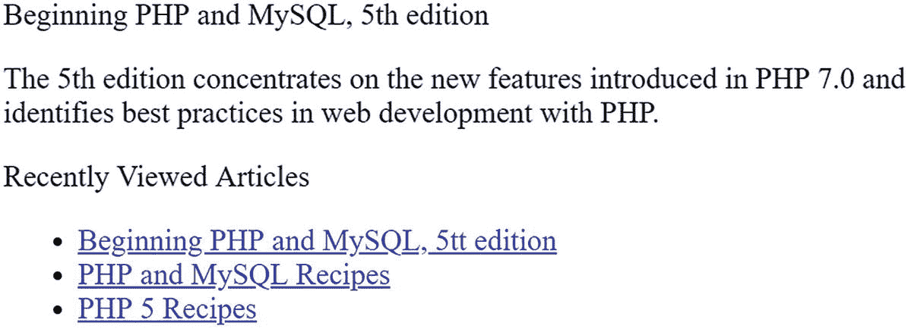

# 十七、会话处理器

虽然 PHP 的会话处理功能从 4.0 版本开始就有了，但它仍然是最酷、讨论最多的特性之一。在本章中，您将学习以下内容:

*   为什么会话处理是必要且有用的

*   如何配置 PHP 以最有效地使用该特性

*   如何创建和销毁会话，以及管理会话变量

*   为什么您可能考虑在数据库中管理会话数据，以及如何做到这一点

## 什么是会话处理？

超文本传输协议(HTTP)定义了用于通过万维网传输文本、图形、视频和所有其他数据的规则。这是一个无状态的协议，意味着每个请求都是在不知道任何先前或未来请求的情况下被处理的。虽然 HTTP 的简单性是其无处不在的重要原因，但它的无状态本质长期以来一直是希望创建复杂的基于 web 的应用的开发人员的一个问题，这些应用必须适应用户特定的行为和偏好。为了解决这个问题，在客户机器上存储信息的做法，也就是通常所说的 *cookies* ，很快获得了认可，缓解了这个难题。然而，对 cookie 大小、允许的 cookie 数量的限制，以及围绕其实现的各种其他不便和安全问题，促使开发人员设计了另一种解决方案:*会话处理*。

会话处理本质上是解决这个无状态问题的一个聪明的方法。这是通过为每个站点访问者分配一个唯一的标识属性(称为会话 ID (SID ))来实现的，然后将该 SID 与任何数量的其他数据相关联，无论是每月访问次数、最喜欢的背景颜色还是中间名，只要是您能想到的。会话 ID 作为 cookie 存储在浏览器中，并自动包含在对服务器的每个后续请求中。这样服务器就可以跟踪访问者在网站上做了什么。在基本配置中，会话 ID 是文件系统中某个文件的索引，该文件保存了用户的所有保存信息。由于会话 ID 存储在 cookie 中，因此访问者必须在浏览器中启用 cookie 功能，网站才能正常工作。许多国家要求网站所有者显示一条消息，通知访问者 cookies 被使用，即使它仅用于会话跟踪。

### 会话处理过程

在大多数情况下，开发人员在开始使用会话处理流程时不需要做太多工作。使用标准配置，您需要做的就是在脚本开始时调用`session_start()`函数，然后将输出发送到客户端。该函数将检测是否已经定义了会话 cookie。如果没有定义，它会在响应中添加一个 cookie 头。如果定义了 cookie，PHP 将寻找相关的会话文件，并使用它来填充`$_SESSION`超级全局变量。如果您查看会话文件，您会看到该用户先前请求的`$_SESSION`变量中内容的序列化副本。

谈到 PHP 如何使用会话，有许多配置选项。在接下来的小节中，您将了解负责执行这个过程的配置指令和函数。

## 配置指令

将近 30 条配置指令负责调整 PHP 的会话处理行为。因为这些指令中有许多在决定这种行为中起着如此重要的作用，所以您应该花一些时间来熟悉这些指令及其可能的设置。大多数初学者不必改变任何默认设置。

### 管理会话存储媒体

`session.save_handler`指令决定如何存储会话信息。其原型如下:

```php
session.save_handler = files|mm|redis|sqlite|user

```

只有`files`和`user`选项可以在不安装额外 PHP 扩展的情况下使用。

会话数据至少可以以五种方式存储:在平面文件中(`files`)、在易失性存储器中(`mm`)、使用 Redis 服务器( [`https://redis.io`](https://redis.io) )、使用 SQLite 数据库(`sqlite`)或通过用户定义的函数(`user`)。虽然默认设置`files`对于许多网站来说已经足够了，但是请记住，对于活跃的网站，会话存储文件的数量在给定的时间段内可能会达到数千个，甚至数十万个。

易失性内存选项对于管理会话数据是最快的，但也是最易变的，因为数据存储在 RAM 中。要使用该选项，您需要从 [`https://www.ossp.org/pkg/lib/mm/`](https://www.ossp.org/pkg/lib/mm/) 下载并安装 mm 库。除非您对以这种方式管理会话可能产生的各种问题了如指掌，否则我建议您选择另一个选项。

Redis 选项的工作方式类似于内存解决方案，但是 Redis 服务器支持磁盘持久性，并且它可以安装在不同的服务器上，从而允许在负载平衡环境中的多个 web 服务器之间共享会话数据。Redis 服务器可以从 [`http://redis.io`](http://redis.io) 下载。还需要可以从 [`https://github.com/nicolasff/phpredis`](https://github.com/nicolasff/phpredis) 下载的 Redis 扩展。一些 Linux 发行版允许您用软件包管理器安装这些元素。

`sqlite`选项利用 SQLite 扩展，使用这个轻量级数据库透明地管理会话信息。第五个选项`user`，虽然配置起来最复杂，但也是最灵活和最强大的，因为可以创建定制的处理器来将信息存储在开发人员希望的任何媒体中。在本章的后面，您将学习如何使用该选项在 MySQL 数据库中存储会话数据。

### 设置会话文件路径

如果`session.save_handler`被设置为`files`存储选项，那么必须设置`session.save_path`指令以识别存储目录。它的原型是这样的:

```php
session.save_path = string

```

默认情况下，没有定义该指令，除非提供值，否则系统将使用/tmp 作为会话文件的位置。如果您使用的是`files`选项，那么您需要在`php.ini`文件中启用它，并选择一个合适的存储目录。请记住，这不应该设置为位于服务器文档根目录中的目录，因为信息很容易通过浏览器泄露。此外，该目录必须可由服务器守护程序写入。

### 自动启用会话

默认情况下，只有通过调用函数`session_start()`(本章稍后介绍)页面才会启用会话。但是，如果您计划在整个站点使用会话，您可以通过将`session.auto_start`设置为`1`来放弃使用该功能。其原型如下:

```php
session.auto_start = 0 | 1

```

启用该指令的一个缺点是，如果您想在会话变量中存储对象，您需要使用`auto_prepend_file`指令加载它们的类定义。这样做当然会导致额外的开销，因为即使在应用中没有使用这些类的情况下，它们也会被加载。

### 设置会话名称

默认情况下，PHP 将使用会话名`PHPSESSID`。但是，您可以使用 session.name 指令将其更改为您想要的任何名称。其原型如下:

```php
session.name = string

```

### 选择 Cookies 或 URL 重写

如果您希望在用户多次访问该站点时维护用户会话，您应该使用 cookie，以便稍后可以检索 SID。您可以使用`session.use_cookies`选择这种方法。将此指令设置为`1`(默认值)会导致使用 cookies 进行 SID 传播；将其设置为`0`会导致使用 URL 重写。使用 URL 重写可以将会话 ID 作为 URL 的一部分来查看。这是一个潜在的安全风险，允许访问该 URL 的不同用户使用相同的会话 ID 访问该站点。`session.ude_cookies`指令有两个可能的值:

```php
session.use_cookies = 0 | 1

```

请记住，当`session.use_cookies`启用时，不需要显式调用 cookie 设置函数(例如，通过 PHP 的`set_cookie()`)，因为这将由会话库自动处理。如果您选择 cookies 作为跟踪用户 SID 的方法，那么您必须考虑其他几个指令，下面将介绍它们。

出于安全原因，建议您为 cookie 处理配置一些额外的选项。这将有助于防止 cookie 劫持。

```php
session.use_only_cookies = 0 | 1

```

设置`session.use_only_cookies = 1`将阻止用户在 querystring 中将 cookie 作为参数传递。只有当会话 id 作为 cookie 从浏览器传递过来时，服务器才会接受它。此外，大多数现代浏览器允许将 cookies 定义为“仅 http”这样做可以防止 JavaScript 访问 cookie。它由指令`session.cookie_httponly:`控制

```php
session.cookie_httponly = 0 | 1

```

最后，可以防止 cookie 设置在不安全的连接上。如果使用了安全 SSL 连接，设置`session.cookie_secure = 1`只会将 cookie 发送到浏览器。

```php
session.cookie_secure = 0 | 1

```

### 设置会话 Cookie 生存期

`session.cookie_lifetime`指令决定了会话 cookie 的有效期。其原型如下:

```php
session.cookie_lifetime = integer

```

生命周期是以秒为单位指定的，所以如果 cookie 应该存活 1 小时，那么这个指令应该设置为`3600`。如果该指令设置为`0`(默认值)，cookie 将一直存在，直到浏览器重新启动。cookie 生存期表示 cookie 的生存期。每次用户发送请求时，PHP 都会发出一个具有相同生存期的更新 cookie。如果用户等待的时间超过了请求之间的生存期，浏览器将不再在请求中包含 cookie，并且它将看起来像是站点的新访问者。

### 设置会话 Cookie 的有效 URL 路径

指令`session.cookie_path`决定了 cookie 被认为有效的路径。cookie 对该路径下的所有子目录也有效。其原型如下:

```php
session.cookie_path = string

```

例如，如果设置为`/`(默认值)，那么 cookie 将对整个网站有效。将它设置为`/books`意味着 cookie 只有在从 [`http://www.example.com/books/`](http://www.example.com/books/) 路径中被调用时才有效。

#### 设置会话 Cookie 的有效域

指令`session.cookie_domain`确定 cookie 对哪个域有效。忽略设置此 cookie 将导致 cookie 的域被设置为生成它的服务器的主机名。其原型如下:

```php
session.cookie_domain = string

```

下面的例子说明了它的用法:

```php
session.cookie_domain = www.example.com

```

如果您想为站点子域名提供一个会话，比如说`customers.example.com`、`intranet.example.com`和 [`www.example.com`](http://www.example.com) ，可以这样设置这个指令:

```php
session.cookie_domain = .example.com

```

### 设置缓存方向

使用缓存来加速网页加载是一种常见的做法。缓存可以由浏览器、代理服务器或 web 服务器来完成。如果您提供的页面包含特定于用户的内容，您不希望这些内容被缓存在代理服务器中，并被请求同一页面的不同用户获取。`session.cache_limiter`指令修改这些页面的缓存相关头，提供关于缓存偏好的指令。其原型如下:

```php
session.cache_limiter = string

```

有五个值可用:

*   `none`:该设置禁止传输任何缓存控制头以及启用会话的页面。

*   `nocache`:这是默认设置。此设置确保在提供可能缓存的版本之前，首先将每个请求发送到原始服务器，以确认页面未发生更改。

*   `private`:将缓存的文档指定为私有意味着该文档将只对原始用户可用，指示代理不缓存页面，因此不与其他用户共享。

*   `private_no_expire`:`private`名称的这种变化导致没有文档到期日期被发送到浏览器。其他方面与`private`设置相同，这是为各种浏览器添加的一个解决方法，当缓存设置为`private`时，这些浏览器会被发送的`Expire`头弄糊涂。

*   这个设置认为所有的文档都是可缓存的，由于性能的提高，它对于站点的非敏感区域是一个有用的选择。

#### 为启用会话的页面设置缓存过期时间

`session.cache_expire`指令决定了在创建新页面之前，缓存的会话页面可用的秒数(默认为 180 秒)。其原型如下:

```php
session.cache_expire = integer

```

如果`session.cache_limiter`被设置为`nocache`，该指令被忽略。

#### 设置会话生存期

`session.gc_maxlifetime`指令确定会话数据被认为有效的持续时间，以秒为单位(默认为`1440`)。当会话数据超过指定的生命周期时，它将不再被读入`$_SESSION`变量，内容将被“垃圾收集”或从系统中删除。其原型如下:

```php
session.gc_maxlifetime = integer

```

一旦达到此限制，会话信息将被销毁，以便回收系统资源。另外，查看`session.gc_divisor`和`session.gc_probability`指令，了解关于调整会话垃圾收集特性的更多信息。

## 使用会话

本节介绍了许多关键的会话处理任务，并一路展示了相关的会话功能。其中一些任务包括会话的创建和销毁、SID 的指定和检索以及会话变量的存储和检索。这一介绍为下一节奠定了基础，在下一节中，将提供几个实际的会话处理示例。

### 开始会话

请记住，HTTP 对用户的过去和将来的情况都是漠不关心的。因此，对于每个请求，您需要显式地启动并随后恢复会话。这两项任务都是使用`session_start()`功能完成的。它的原型是这样的:

```php
Boolean session_start()

```

如果没有找到 SID，执行`session_start()`将创建一个新会话，或者如果 SID 存在，则继续当前会话。您可以通过如下方式调用该函数:

```php
session_start([ array $options = array() ]);

```

一个让许多刚接触`session_start()`函数的人感到困惑的重要问题是，这个函数究竟可以在哪里被调用。在任何其他输出被发送到浏览器之前，忽略执行它*将导致生成错误消息(`headers already sent`)。*

您可以通过启用配置指令`session.auto_start`来完全消除该功能的执行。但是，请记住，这将为每个启用 PHP 的页面启动或恢复一个会话，而且还会带来其他副作用，例如，如果您希望将对象信息存储在一个会话变量中，就需要加载类定义。

可选参数`$options`是在 PHP 7.0 中引入的，允许开发人员通过传递选项的关联数组来覆盖 php.ini 中配置的任何指令。除了标准参数，还可以指定 read_and_close 选项。当设置为`TRUE`时，该功能将读取会话文件的内容并立即关闭它，防止文件更新。这可以用在高流量的网站上，那里的会话被很多页面读取，但只有少数页面更新。

### 销毁会话

虽然您可以配置 PHP 的会话处理指令来根据到期时间或垃圾收集概率自动销毁会话，但有时您自己手动取消会话也是有用的。例如，您可能希望允许用户手动注销您的站点。当用户点击适当的链接时，您可以从内存中清除会话变量，甚至从存储器中完全清除会话，分别通过`session_unset()`和`session_destroy()`函数来完成。

`session_unset()`函数删除当前会话中存储的所有会话变量，有效地将会话重置到创建时的状态(没有注册会话变量)。它的原型是这样的:

```php
void session_unset()

```

虽然执行`session_unset()`确实会删除当前会话中存储的所有会话变量，但它不会从存储机制中完全删除会话。如果想彻底销毁会话，需要使用函数`session_destroy()`，通过从存储机制中删除会话使当前会话失效。请记住，这将*而不是*破坏用户浏览器上的任何 cookies。它的原型是这样的:

```php
Boolean session_destroy()

```

如果您对在会话结束后使用 cookie 不感兴趣，只需在`php.ini`文件中将`session.cookie_lifetime`设置为`0`(其默认值)。

### 设置和检索会话 ID

请记住，SID 将所有会话数据绑定到特定用户。尽管 PHP 会自动创建和传播 SID，但有时您可能希望手动设置或检索它。函数`session_id()`能够执行这两项任务。它的原型是这样的:

```php
string session_id([string sid])

```

函数`session_id()`可以设置和获取 SID。如果没有参数，函数`session_id()`返回当前的 SID。如果包含可选的 SID 参数，当前 SID 将被替换为该值。下面是一个例子:

```php
<?php
    session_start();
    echo "Your session identification number is " . session_id();
?>

```

这将产生类似于以下内容的输出:

```php
Your session identification number is 967d992a949114ee9832f1c11c

```

如果您想要创建自定义会话处理器，支持的字符仅限于字母数字字符、逗号和减号。

### 创建和删除会话变量

会话变量用于管理用户从一个页面到下一个页面的数据。然而，现在的首选方法是简单地设置和删除这些变量，就像其他任何变量一样，只是您需要在`$_SESSION`超全局的上下文中引用它。例如，假设您想要设置一个名为`username`的会话变量:

```php
<?php
    session_start();
    $_SESSION['username'] = "Jason";
    printf("Your username is %s.", $_SESSION['username']);
?>

```

这将返回以下内容:

```php
Your username is Jason.

```

要删除变量，可以使用`unset()`功能:

```php
<?php
   session_start();
   $_SESSION['username'] = "Jason";
   printf("Your username is: %s <br />", $_SESSION['username']);
   unset($_SESSION['username']);
   printf("Username now set to: %s", $_SESSION['username']);
?>

```

这将返回:

```php
Your username is: Jason
Username now set to:

```

### 警告

您可能会遇到引用函数的`session_register()`和`session_unregister()`的旧的学习资源和新闻组讨论，它们曾经分别是创建和销毁会话变量的推荐方法。但是，因为这些函数依赖于一个名为`register_globals`的配置指令，这个指令在 PHP 4.2.0 中被默认禁用，在 PHP 5.4.0 中被完全删除，所以您应该使用本节中描述的变量赋值和删除方法。

### 编码和解码会话数据

不管存储介质是什么，PHP 都以由单个字符串组成的标准化格式存储会话数据。例如，由两个变量(`username`和`loggedon)`)组成的会话的内容显示在这里:

```php
username|s:5:"jason";loggedon|s:20:"Feb 16 2011 22:32:29";

```

每个会话变量引用由分号分隔，由三部分组成:名称、长度和值。一般语法如下:

```php
name|s:length:"value";

```

幸运的是，PHP 自动处理会话编码和解码。但是，有时您可能希望手动执行这些任务。为此，有两个函数可用:`session_encode()`和`session_decode()`。

#### 编码会话数据

`session_encode()`提供了一种将所有会话变量手动编码成一个字符串的便捷方法。其原型如下:

```php
string session_encode()

```

当您希望轻松地将用户的会话信息存储在数据库中以及进行调试时，该函数特别有用，它为您提供了一种查看会话内容的简单方法。例如，假设一个包含该用户 SID 的 cookie 存储在他的计算机上。当用户请求包含以下清单的页面时，将从 cookie 中检索用户 ID。然后，该值被指定为 SID。创建某些会话变量并赋予它们值，然后使用`session_encode()`对所有这些信息进行编码，准备将其插入数据库，如下所示:

```php
<?php
    // Initiate session and create a few session variables
    session_start();

    // Set a few session variables.
    $_SESSION['username'] = "jason";
    $_SESSION['loggedon'] = date("M d Y H:i:s");

    // Encode all session data into a single string and return the result
    $sessionVars = session_encode();
    echo $sessionVars;
?>

```

这将返回:

```php
username|s:5:"jason";loggedon|s:20:"Feb 16 2011 22:32:29";

```

请记住，`session_encode()`将对该用户可用的所有会话变量进行编码，而不仅仅是那些在执行`session_encode()`的特定脚本中注册的变量。

您也可以使用`seraialize()`函数来获得类似的结果，但是默认情况下`session_encode()`函数将使用与`serialize()`函数不同的内部序列化格式。

#### 解码会话数据

编码的会话数据可以用`session_decode()`解码。它的原型是这样的:

```php
Boolean session_decode(string session_data)

```

输入参数`session_data`表示会话变量的编码字符串。该函数将对变量进行解码，将它们返回到原始格式，如果成功，则返回 TRUE，否则返回 FALSE。继续前面的例子，假设一些会话数据被编码并存储在数据库中，即 SID 和变量`$_SESSION['username']`和`$_SESSION['loggedon']`。在下面的脚本中，从表中检索数据并解码:

```php
<?php
    session_start();
    $sid = session_id();

    // Encoded data retrieved from database looks like this:
    // $sessionVars = username|s:5:"jason";loggedon|s:20:"Feb 16 2011 22:32:29";

    session_decode($sessionVars);

    echo "User ".$_SESSION['username']." logged on at ".$_SESSION['loggedon'].".";

?>

```

这将返回:

```php
User jason logged on at Feb 16 2011 22:55:22.

```

如果您想将会话数据存储在数据库中，有一种更有效的方法，即定义自定义会话处理器，并将这些处理器直接绑定到 PHP 的 API 中。本章稍后将对此进行演示。

#### 重新生成会话 id

一种称为会话固定的攻击涉及攻击者以某种方式获得一个没有怀疑的用户的 SID，然后使用它来冒充该用户，以便获得对潜在敏感信息的访问。您可以通过在维护特定于会话的数据的同时在每个请求上重新生成会话 ID 来最小化这种风险。PHP 提供了一个名为`session_regenerate_id()`的便利函数，它将用一个新的 ID 替换现有的 ID。其原型如下:

```php
Boolean session_regenerate_id([boolean delete_old_session])

```

可选的`delete_old_session`参数决定了当重新生成会话 ID 时，旧的会话文件是否也将被删除。如果设置为 false 或未通过，旧的会话文件将会留在系统中，攻击者仍然可以使用这些数据。最好的选择是总是传递 true，以确保在创建新的会话 id 后删除旧的数据。

使用这个函数有一些开销，因为必须生成一个新的会话文件并更新会话 cookie。

## 实际会话处理示例

既然您已经熟悉了使会话处理工作的基本函数，那么您就可以考虑一些真实的例子了。第一个示例展示了如何创建一个自动验证返回注册用户的机制。第二个示例演示了如何使用会话变量为用户提供最近查看的文档的索引。这两个例子都很常见，鉴于它们明显的实用性，这并不奇怪。令人惊讶的是，你可以轻而易举地创建它们。

### 注意

如果您不熟悉 MySQL 数据库，并且对下面例子中的语法感到困惑，可以考虑复习第 22 章中的内容。

### 自动登录回访用户

一旦用户登录，通常通过提供唯一的用户名和密码组合，允许用户稍后返回站点而不必重复该过程通常是很方便的。您可以使用会话、几个会话变量和一个 MySQL 表轻松实现这一点。虽然有很多方法可以实现这个特性，但是检查现有的会话变量(即`$username`)就足够了。如果该变量存在，用户可以自动登录到该站点。如果没有，将显示一个登录表单。

### 注意

默认情况下，`session.cookie_lifetime`配置指令被设置为`0`，这意味着如果浏览器重新启动，cookie 将不会持续。因此，您应该将该值更改为适当的秒数，以便使会话持续一段时间。

清单 [17-1](#PC37) 中显示了 MySQL 表`users`。

```php
CREATE TABLE users (
   id INTEGER UNSIGNED NOT NULL AUTO_INCREMENT,
   first_name VARCHAR(255) NOT NULL,
   username VARCHAR(255) NOT NULL,
   password VARCHAR(32) NOT NULL,
   PRIMARY KEY(id)
);

Listing 17-1The users Table

```

如果没有找到有效的会话，用于向用户显示登录表单的代码片段(`login.html`)如下所示:

```php
<p>
    <form method="post" action="<?php echo $_SERVER['PHP_SELF']; ?>">
        Username:<br><input type="text" name="username" size="10"><br>
        Password:<br><input type="password" name="pswd" SIZE="10"><br>
        <input type="submit" value="Login">
    </form>
</p>

```

最后，用于管理自动登录过程的逻辑如下:

```php
<?php

  session_start();

  // Has a session been initiated previously?
  if (! isset($_SESSION['username'])) {

      // If no previous session, has the user submitted the form?
      if (isset($_POST['username']))
      {

        $db = new mysqli("localhost", "webuser", "secret", "corporate");

        $stmt = $db->prepare("SELECT first_name FROM users WHERE username = ? and password = ?");

        $stmt->bind_param('ss', $_POST['username'], $_POST['password]);

        $stmt->execute();

        $stmt->store_result();

        if ($stmt->num_rows == 1)
        {

          $stmt->bind_result($firstName);

          $stmt->fetch();

          $_SESSION['first_name'] = $firstName;

          header("Location: http://www.example.com/");

        }

      } else {
        require_once('login.html');
      }

  } else {
    echo "You are already logged into the site.";
  }

?>

```

当用户被各种可以想象的在线服务的用户名和密码淹没的时候，从检查电子邮件到库图书续借到查看银行账户，在情况允许时提供自动登录功能肯定会受到用户的欢迎。

上面的例子需要一个名为 users 的表，其中包含列的`username`和`password`。正如在第 [14](14.html) 章中所讨论的，你不应该用明文存储密码。相反，您应该使用哈希，因为如果攻击者获得了数据库的访问权限，就不会获得实际的密码。

### 生成最近查看的文档索引

有多少次你回到一个网站，想知道在哪里可以找到你忘记加书签的 PHP 教程？如果网站能够记住你读了哪些文章，并在你需要的时候给你一个列表，这不是很好吗？这个例子演示了这样一个特性。

这个解决方案出乎意料的简单，却很有效。要记住给定用户阅读了哪些文档，可以要求用户和每个文档都用唯一的标识符来标识。对于用户来说，SID 满足这个要求。可以按照您希望的任何方式来标识文档，但是本例使用文章的标题和 URL，并假设该信息来自名为`articles`的数据库表中存储的数据，如下所示:

```php
CREATE TABLE articles (
   id INTEGER UNSIGNED NOT NULL AUTO_INCREMENT,
   title VARCHAR(50),
   content MEDIUMTEXT NOT NULL,
   PRIMARY KEY(id)
);

```

唯一需要的任务是将文章标识符存储在会话变量中，这将在下面实现:

```php
<?php

    // Start session
    session_start();

    // Connect to server and select database
    $db = new mysqli("localhost", "webuser", "secret", "corporate");

    // User wants to view an article, retrieve it from database
    $stmt = $db->prepare("SELECT id, title, content FROM articles WHERE id = ?");

    $stmt->bind_param('i', $_GET['id']);

    $stmt->execute();

    $stmt->store_result();

    if ($stmt->num_rows == 1)
    {
      $stmt->bind_result($id, $title, $content);
      #stmt->fetch();
    }

    // Add article title and link to list
    $articleLink = "<a href='article.php?id={$id}'>{$title}</a>";

    if (! in_array($articleLink, $_SESSION['articles']))
        $_SESSION['articles'][] = $articleLink;

    // Display the article
    echo "<p>$title</p><p>$content</p>";

    // Output list of requested articles

    echo "<p>Recently Viewed Articles</p>";
    echo "<ul>";
    foreach($_SESSION['articles'] as $doc) {
      echo "<li>$doc</li>";
    }
    echo "</ul>";
?>

```

样本输出如图 [17-1](#Fig1) 所示。



图 17-1

跟踪用户查看的文档

## 创建自定义会话处理器

用户定义的会话处理器提供了四种存储方法中最大程度的灵活性。实现定制的会话处理器非常容易——只需遵循几个步骤。首先，您需要定制六个任务(定义如下)用于您的自定义存储位置。此外，无论您的特定实现是否使用参数，都必须遵循每个函数的参数定义。本节概述了这六个功能的目的和结构。此外，它还引入了`session_set_save_handler()`，这个函数用于神奇地将 PHP 的会话处理器行为转换成您的自定义处理器函数所定义的行为。最后，本节以演示这一伟大特性结束，提供了一个基于 MySQL 的实现。您可以立即将这个库合并到您自己的应用中，使用 MySQL 表作为会话信息的主要存储位置。

*   `session_open($session_save_path, $session_name)` `:`此函数初始化会话过程中可能用到的任何元素。两个输入参数`$session_save_path`和`$session_name`指的是在`php.ini`文件中找到的同名配置指令。PHP 的`get_cfg_var()`函数用于在后面的例子中检索这些配置值。

*   `session_close()` `:`这个函数的操作很像一个典型的处理函数，关闭任何由`session_open()` `.`初始化的打开的资源。正如你所看到的，这个函数没有输入参数。请记住，这不会破坏会话。这就是在列表末尾介绍的`session_destroy()`的工作。

*   `session_read($sessionID)` `:`该功能从存储介质中读取会话数据。输入参数`$sessionID`指的是 SID，它将用于标识为这个特定客户端存储的数据。

*   `session_write($sessionID, $value)` `:`该功能将会话数据写入存储介质。输入参数`$sessionID`是变量名，输入参数`$value`是会话数据。

*   这个函数可能是你在脚本中调用的最后一个函数。它会破坏会话和所有相关的会话变量。输入参数`$sessionID`指的是当前打开的会话中的 SID。

*   `session_garbage_collect($lifetime)` `:`此功能有效删除所有已过期的会话。输入参数`$lifetime`指的是在`php.ini`文件中找到的会话配置指令`session.gc_maxlifetime`。

### 将自定义会话函数绑定到 PHP 的逻辑中

在定义了六个自定义处理函数之后，必须将它们绑定到 PHP 的会话处理逻辑中。这是通过将它们的名字传递给函数`session_set_save_handler()`来实现的。请记住，这些名称可以是您选择的任何名称，但是它们必须接受正确数量和类型的参数，如前一节所述，并且必须按以下顺序传递给`session_set_save_handler()`函数:打开、关闭、读取、写入、销毁和垃圾收集。描述如何调用此函数的示例如下:

```php
session_set_save_handler("session_open", "session_close", "session_read",
                         "session_write", "session_destroy",
                         "session_garbage_collect");

```

### 使用定制的基于 MySQL 的会话处理器

在部署基于 MySQL 的处理器之前，您必须完成两项任务:

1.  创建将用于存储会话数据的数据库和表。

2.  创建六个自定义处理函数。

下面的 MySQL 表`sessioninfo`将用于存储会话数据。出于这个例子的目的，假设这个表是在数据库`sessions`中找到的，尽管您可以将这个表放在您希望的地方。

```php
CREATE TABLE sessioninfo (
   sid VARCHAR(255) NOT NULL,
   value TEXT NOT NULL,
   expiration TIMESTAMP NOT NULL,
  PRIMARY KEY(sid)
);

```

清单 [17-2](#PC44) 提供了自定义 MySQL 会话函数。请注意，它定义了每个必需的处理器，确保将适当数量的参数传递给每个处理器，而不管这些参数是否在函数中实际使用。该示例使用函数`session_set_save_handler()`来定义实现所有函数所需的六个回调函数。每个函数都可以用一个字符串形式的函数名或一个带两个参数的数组来标识。第一个是对对象的引用，第二个是对给定操作调用的方法的名称。因为本例中的会话处理器是用一个类定义的，所以每个函数名都用一个数组指定。

```php
<?php

class MySQLiSessionHandler {

  private $_dbLink;
  private $_sessionName;
  private $_sessionTable;
  CONST SESS_EXPIRE = 3600;

  public function __construct($host, $user, $pswd, $db, $sessionName, $sessionTable)
  {
    // Create a connection to the database
    $this->_dbLink = new mysqli($host, $user, $pswd, $db);
    $this->_sessionName = $sessionName;
    $this->_sessionTable = $sessionTable;

    // Set the handlers for open, close, read, write, destroy and garbage collection

.
    session_set_save_handler(
      array($this, "session_open"),
      array($this, "session_close"),
      array($this, "session_read"),
      array($this, "session_write"),
      array($this, "session_destroy"),
      array($this, "session_gc")
    );

    session_start();
  }

  function session_open($session_path, $session_name) {
    $this->_sessionName = $session_name;
    return true;
  }

  function session_close() {
      return 1;
  }

  function session_write($SID, $value) {
    $stmt = $this->_dbLink->prepare("
      INSERT INTO {$this->_sessionTable}
        (sid, value) VALUES (?, ?) ON DUPLICATE KEY
        UPDATE value = ?, expiration = NULL");

    $stmt->bind_param('sss', $SID, $value, $value);
    $stmt->execute();

    session_write_close();
  }

  function session_read($SID) {
      // create a SQL statement that selects the value for the cussent session ID and validates that it is not expired

.
      $stmt = $this->_dbLink->prepare(
        "SELECT value FROM {$this->_sessionTable}
         WHERE sid = ? AND
         UNIX_TIMESTAMP(expiration) + " .
         self::SESS_EXPIRE . " > UNIX_TIMESTAMP(NOW())"
      );

      $stmt->bind_param('s', $SID);

      if ($stmt->execute())
      {
      $stmt->bind_result($value);
        $stmt->fetch();

        if (! empty($value))
        {
          return $value;
        }
      }
  }

  public function session_destroy($SID) {
    // Delete the record for the session id provided
    $stmt = $this->_dbLink->prepare("DELETE FROM {$this->_sessionTable} WHERE SID = ?");
    $stmt->bind_param('s', $SID);
    $stmt->execute();
  }

    public function session_gc($lifetime) {
      // Delete records that are expired.
      $stmt = $this->_dbLink->prepare("DELETE FROM {$this->_sessionTable}
          WHERE UNIX_TIMESTAMP(expiration) < " . UNIX_TIMESTAMP(NOW()) - self::SESS_EXPIRE);

      $stmt->execute();
   }
}

Listing 17-2The MySQL Session Storage Handler

```

要使用该类，只需将它包含在您的脚本中，实例化该对象，并分配您的会话变量:

```php
require "mysqlisession.php";

$sess = new MySQLiSessionHandler("localhost", "root", "jason",
                                                            "chapter17", "default", "sessioninfo");
$_SESSION['name'] = "Jason";

```

执行完这个脚本后，使用`mysql`客户端查看一下`sessioninfo`表的内容:

```php
mysql> select * from sessioninfo;
+-------------------------------------+---------------+-------------------+
| SID                                 | expiration    | value             |
+-------------------------------------+---------------+-------------------+
| f3c57873f2f0654fe7d09e15a0554f08    | 1068488659    | name|s:5:"Jason"; |
+-------------------------------------+---------------+-------------------+
1 row in set (0.00 sec)

```

正如所料，已经插入了一行，将 SID 映射到会话变量`"Jason."`。该信息被设置为在创建后 1440 秒过期；该值的计算方法是确定 Unix 纪元后的当前秒数，然后加上 1，440。注意，虽然 1，440 是默认的到期设置，如在`php.ini`文件中所定义的，但是您可以将这个值更改为您认为合适的值。

请注意，这不是实现这些适用于 MySQL 的过程的唯一方法。你可以随意修改这个库。

## 摘要

本章涵盖了 PHP 会话处理能力的全部。您了解了许多用于定义这种行为的配置指令，以及将这种功能整合到应用中的最常用函数。本章以 PHP 用户定义的会话处理器的真实例子结束，向您展示了如何将 MySQL 表转换成会话存储介质。

下一章将讨论另一个高级但非常有用的主题:web 服务。它还将介绍如何使用标准 web 技术与服务和 API 进行交互。