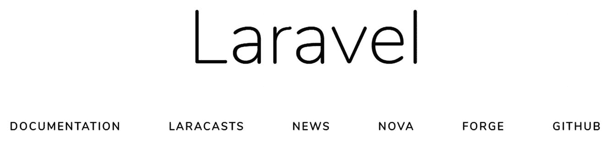
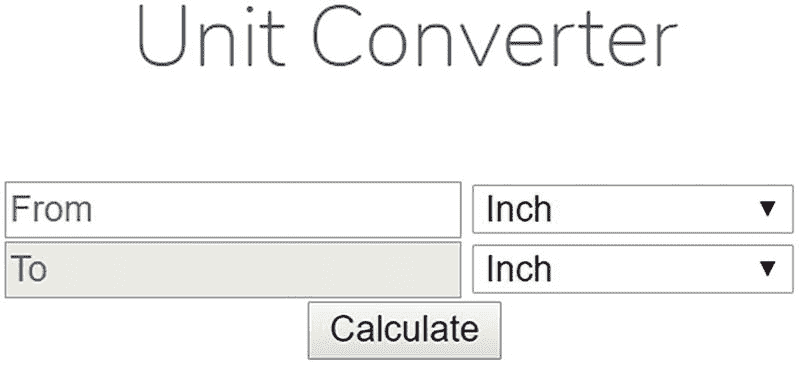
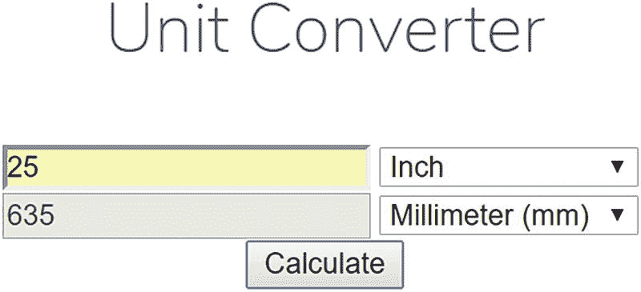

# 二十一、MVC 和框架

即使在你的 web 开发生涯的早期阶段，你可能已经在尝试勾画一个渴望已久的定制网站的功能了。也许是电子商务商店？一个致力于集邮的在线社区论坛？或者更实际的东西，比如公司内部网？不管目的是什么，您都应该努力使用合理的开发实践。近年来，使用这种事实上的最佳实践变得如此重要，以至于几个开发团队联合起来开发了各种各样的 *web 框架*，其中的每一个都有助于其他人以一种高效、快速且代表合理开发原则的方式开发 web 应用。

本章有三个目的。首先，我将介绍模型-视图-控制器(MVC)设计模式，它为开发人员构建网站提供了一种组织良好的方法。其次，我将介绍几个最流行的 PHP 驱动的框架，每个框架都允许您利用 MVC，以及各种其他节省时间的特性，如数据库和 web 服务集成。最后，我将介绍 PHP 框架互操作性组(PHP-FIG)。这是一个致力于让框架“和谐相处”的团队。

## MVC 简介

假设你最近推出了一个新网站，却发现它很快就被用户淹没了。渴望扩展这一新发现的成功，该项目开始在野心和复杂性方面增长。你甚至已经开始雇佣一些有才华的员工来帮助设计和开发。新聘请的设计师立即开始对网站页面进行彻底检查，其中许多页面目前看起来像这样:

```php
<?php
    // Include site configuration details and page header
    INCLUDE "config.inc.php";
    INCLUDE "header.inc.php";

    // Scrub some data
    $eid = htmlentities($_POST['eid']);

    // Retrieve desired employee's contact information

    $query = "SELECT last_name, email, tel
              FROM employees
              WHERE employee_id='$eid'";

    $result = $mysqli->query($query, MYSQLI_STORE_RESULT);

    // Convert result row into variables
    list($name, $email, $telephone) = $result->fetch_row();

?>
<div id="header">Contact Information for: <?php echo $name; ?>
Employee Name: <?php echo $name; ?><br />
Email: <?php echo $email; ?><br />
Telephone: <?php echo $telephone; ?><br />

<div id="sectionheader">Recent Absences
<?php

    // Retrieve employee absences in order according to descending date
    $query = "SELECT absence_date, reason
              FROM absences WHERE employee_id='$eid'
              ORDER BY absence_date DESC";

    // Parse and execute the query
    $result = $mysqli->query($query, MYSQLI_STORE_RESULT);

    // Output retrieved absence information
    while (list($date, $reason) = $result->fetch_row();
        echo "$date: $reason";
    }

    // Include page footer
    INCLUDE "footer.inc.php";

?>

```

因为设计和逻辑不可避免地交织在一起，很快就出现了几个问题:

*   由于网站的设计和逻辑的混合，那些被雇佣的唯一目的是让你的网站看起来很棒的设计师现在面临着不得不学习 PHP 的任务。

*   被雇来帮助扩展网站功能的开发人员，正忙着修复由设计师的新手 PHP 代码引入的错误和安全问题。在这个过程中，他们决定对网站设计做一些小小的调整，这激怒了设计师。

*   由于同时编辑同一组文件而引起的几乎不断的冲突很快变得令人厌烦和耗时。

您可能注意到了这里的一个模式:缺乏关注点的分离正在滋生一个痛苦、不信任和低效的环境。但是有一个解决方案可以大大缓解这些问题:MVC 架构。

MVC 方法通过将应用分成三个不同的组件来提高开发效率:模型*、*视图*和*控制器*。这样做允许独立地创建和维护每个组件，从而最小化组件以类似于前一示例中所示的方式缠绕时产生的残余影响。您可以在其他学习资源中找到每个组件的详细定义，但对于本简介而言，以下内容就足够了:*

*   **模型**:模型为你的网站建模的领域指定了规则，定义了应用的数据和行为。例如，假设您创建了一个用作转换计算器的应用，允许用户将磅转换为千克，将英尺转换为英里，将华氏温度转换为摄氏温度，以及其他单位。模型负责定义用于执行此类转换的公式，当提供值和所需的转换场景时，模型执行转换并返回结果。请注意，模型不负责格式化数据或将数据呈现给用户。这是由视图处理的。

*   **视图**:视图负责将模型返回的数据格式化并呈现给用户。一个以上的视图可以利用同一个模型，这取决于数据应该如何呈现。例如，您可以为转换应用提供两个接口:一个针对标准浏览器，另一个针对移动设备进行了优化。

*   **控制器**:控制器负责确定应用应该如何基于应用空间内发生的事件(通常是用户动作)做出响应，通过协调模型和视图来产生适当的响应。一个被称为*前端控制器*的特殊控制器负责将所有请求路由到适当的控制器并返回响应。

为了帮助您更好地理解 MVC 驱动的框架的动态性，下面的示例通过一个涉及转换器应用的典型场景，突出了每个 MVC 组件的角色:

1.  用户与视图交互以指定他想要执行的转换类型，例如，将输入温度从华氏温度转换为摄氏温度。

2.  控制器通过识别适当的转换动作、收集输入并将其提供给模型来做出响应。

3.  该模型将该值从华氏温度转换为摄氏温度，并将结果返回给控制器。

4.  控制器调用适当的视图，传递计算出的值。视图呈现结果并返回给用户。

## PHP 的框架解决方案

虽然 PHP 一直非常适合使用 MVC 方法进行开发，但直到 Ruby on Rails ( [`https://www.rubyonrails.org`](https://www.rubyonrails.org) )的突然成功吸引了全球 web 开发人员的注意，才出现了一些可用的解决方案。PHP 社区对这种新出现的对框架的需求做出了回应，并大量借鉴了 Rails 和许多其他 MVC 框架所支持的引人注目的特性。本节重点介绍了五个比较突出的 PHP 专用解决方案。这些框架可以自动化 CRUD(创建、检索、更新、删除)数据库操作，执行数据缓存，过滤表单输入；它们支持一长串选项和插件，使发送电子邮件、创建 PDF 文档、与 web 服务集成以及执行 web 应用中常用的其他任务变得容易。

### 注意

您还会发现，本节介绍的每个框架都比 MVC 实现提供了更多的功能。例如，它们都有助于 Ajax 集成、表单验证和数据库交互。我们鼓励您仔细研究每个框架的独特特性，以便确定哪个最适合您的特定应用的需求。

### CakePHP 框架

在本节描述的四个解决方案中，CakePHP ( [`https://www.cakephp.org`](https://www.cakephp.org) )最接近 Rails，实际上它的开发人员很乐意提到这个项目最初是受 breakout 框架的启发。该项目由 Michal Tatarynowicz 于 2005 年创建，此后吸引了数百名活跃分子的兴趣。

CakePHP 框架可以使用 Composer 安装，命令如下:

```php
$ composer require cakephp/cakephp

```

### Symfony 框架

symfony 框架([【https://symfony.com/】](https://symfony.com/))是法国网络开发公司 Sensio ( [`www.sensio.com`](http://www.sensio.com) )的创始人杨奇煜·庞蒂尔的创意。Symfony 建立在其他几个成熟的开源解决方案之上，包括对象关系映射工具 Doctrine 和 Propel。通过消除在创建这些组件时产生的额外开发时间，Symfony 的开发人员能够专注于创建大大加快应用开发时间的功能。Symfony 的用户还可以利用自动表单验证、分页、购物车管理和使用 jQuery 等库的直观 Ajax 交互。

Symfony 框架可以使用以下命令与 Composer 一起安装:

```php
$ composer create-project symfony/website-skeleton my-project

```

### Zend 框架

Zend Framework([https://zendframework.com/](https://zendframework.com/))是一个开源项目，由著名的 PHP 产品和服务提供商 Zend Technologies([https://www.zend.com](https://www.zend.com))开发。它提供了各种特定于任务的组件，能够执行当今尖端 web 应用的重要任务。

Zend 框架可以使用 Composer 安装，命令如下:

```php
$ composer require zendframework/zendframework

```

如果您只是对 Zend Framework 的 MVC 部分感兴趣，您可以使用这个命令:

```php
$ composer require zendframework/zend-mvc

```

### 费尔康框架

Phalcon 框架的核心([https://phalconphp.com/en/](https://phalconphp.com/en/))是作为 PHP 扩展用 C 语言编写的。这提供了路由和框架其他部分的快速执行，但也使得扩展更加困难。可以从编译该扩展的源代码进行安装，也可以使用 Debian/Ubuntu 或 CentOS 上的软件包管理器，使用以下命令进行安装:

```php
$ sudo apt-get install php7.0-phalcon

```

或者

```php
$ sudo yum install php70u-phalcon

```

在 Windows 上，您必须下载 php_phalcon.dll 文件，并将下面一行添加到 php.ini 文件中:

```php
extension=php_phalcon.dll

```

记住在对 php.ini 进行修改后重启 web 服务器。

### Laravel 框架

Laravel Framework([https://laravel.com/](https://laravel.com/))是一个全栈的 web 应用框架，专注于表达性和优雅的语法，并试图通过使大多数 web 应用中执行的常见任务变得容易来消除开发的痛苦。这些任务包括认证、路由、会话处理和缓存。该框架易于学习，并且有很好的文档记录。

可以使用 Composer 和以下命令安装 Laravel:

```php
$ composer global require "laravel/installer"

```

这将创建一个 Laravel 安装包的全局安装，可以用来创建多个站点。一个二进制文件将被安装在 Mac 上的`$HOME/.composer/vendor/bin`和 Linux 发行版上的`$HOME/.config/composer/vendor/bin`中。为了创建一个新的 Laravel 应用，可以使用 Laravel 命令:

```php
$ ~/.config/composer/vendor/bin/Laravel new blog

```

这将在当前工作目录中创建一个名为 blog 的目录，并安装配置站点所需的所有部件。缺少的只是 web 服务器的配置。将文档根目录设置为 blog/public 文件夹，并重新启动 web 服务器。您还必须将所有文件的所有权设置给运行 web 服务器的用户。这将允许 Laravel 在目录结构中写入日志文件和其他信息。

将网络浏览器指向新创建的网站将会提供一个看起来如图 [21-1](#Fig1) 所示的页面。



图 21-1

新 Laravel 网站的默认内容

安装好框架后，是时候编写第一个应用了。Laravel 框架使用模型视图控制器(MVC)模式将设计/布局从数据库模型和业务逻辑中分离出来，它提供了一个允许创建简单 URL 的路由系统。路由将一个 URL 链接到一个特定的 PHP 文件(控制器)，在某些情况下直接链接到一个布局(视图)。路由保存在名为 routes/web.php 的文件中。在同一目录中还有用于其他目的的路由文件，但是 web.php 文件用于与 web 应用相关的路由。在下面的例子中，我们将创建一个简单的应用来转换不同的长度单位。该应用不需要模型，因为不涉及数据库。它是通过一个视图实现的，该视图定义了一个输入表单的布局，该表单用于输入要转换的单位和选择要转换的单位。应用的第二部分是有两个动作的控制器。第一个动作是表单动作，用于显示表单。第二个动作是计算动作，它将接受输入值并计算结果。结果将作为 JSON 对象返回，JavaScript 代码随后使用该对象更新输出值。应用将有两条路线:第一条显示表单，第二条执行计算。这些路由在 routes 文件中定义，如下所示:

```php
<?php

/*
|--------------------------------------------------------------------------
| Web Routes
|--------------------------------------------------------------------------
|
| Here is where you can register web routes for your application. These
| routes are loaded by the RouteServiceProvider within a group which
| contains the "web" middleware group. Now create something great!
|
*/

Route::get('/convert', 'ConvertController@form');
Route::post('/calculate', 'ConvertController@calc');

```

这两个路由被定义为 get 和 post 方法。他们使用相同的控制器，但两个不同的行动。控制者将住在`app/Http/Controllers`并被称为 ConvertControler.php。创建路由时不包括 php 扩展名，而是包括用于控制器的类名，如清单 [21-1](#PC12) 所示。

```php
<?php

namespace App\Http\Controllers;

use Illuminate\Http\Request;

class ConvertController extends Controller
{
    /**
     * Show the conversion form
     *
     * @return \Illuminate\Http\Response
     */
    public function form()
    {
        return view('convertForm');
    }

    /**
     * Show the conversion form
     *
     * @return \Illuminate\Http\Response

     */
    public function calc()
    {
        return response()->json([
            'to' => round($_POST['from'] * $_POST['fromUnit'] / $_POST['toUnit'], 2),
        ]);
    }
}

Listing 21-1ConvertController.php

```

form 方法使用 view 函数来生成输出。视图文件存储在`resources/view`中，在这种情况下，该文件称为`convertForm.blade.php`。使用这种命名约定是因为 Laravel 使用的是刀片模板系统。这个例子的视图如清单 [21-2](#PC13) 所示。

```php
<!doctype html>
<html lang="{{ app()->getLocale() }}">
    <head>
        <meta charset="utf-8">
        <meta name="viewport" content="width=device-width, initial-scale=1">

        <title>Unit Converter</title>

        <!-- Fonts -->
        <link href="https://fonts.googleapis.com/css?family=Nunito:200,600" rel="stylesheet" type="text/css">

        <!-- Styles -->
        <style>
            html, body {
                background-color: #fff;
                color: #636b6f;
                font-family: 'Nunito', sans-serif;
                font-weight: 200;
                height: 100vh;
                margin: 0;
            }

            .full-height {
                height: 100vh;
            }

            .flex-center {
                align-items: center;
                display: flex;
                justify-content: center;

            }

            .position-ref {
                position: relative;
            }

            .top-right {
                position: absolute;
                right: 10px;
                top: 18px;
            }

            .content {
                text-align: center;
            }

            .title {
                font-size: 32px;
            }

            .links > a {
                color: #636b6f;
                padding: 0 25px;
                font-size: 12px;
                font-weight: 600;
                letter-spacing: .1rem;
                text-decoration: none;

                text-transform: uppercase;
            }

            .m-b-md {
                margin-bottom: 30px;
            }
        </style>
        <script
  src="https://code.jquery.com/jquery-3.3.1.min.js"
  integrity="sha256-FgpCb/KJQlLNfOu91ta32o/NMZxltwRo8QtmkMRdAu8="
  crossorigin="anonymous"></script>
    </head>
    <body>
        <div class="flex-center position-ref full-height">
            <div class="content">
                <div class="title m-b-md">
                    Unit Converter
                </div>

                <div class="links">
                    <form id="convertForm" method="POST" action="/calculate">
                       @csrf
                       <input id="from" name="from" placeholder="From" type="number">
                       <select id="fromUnit" name="fromUnit">
                          <option value="25.4">Inch</option>
                          <option value="304.8">Foot</option>
                          <option value="1">Millimeter (mm)</option>
                          <option value="10">Centimeter (cm)</option>
                          <option value="1000">Meeter (m)</option>
                       </select>
                       <br/>
                       <input id="to" placeholder="To" type="number" disabled>
                       <select id="toUnit" name="toUnit">
                          <option value="25.4">Inch</option>
                          <option value="304.8">Foot</option>
                          <option value="1">Millimeter (mm)</option>
                          <option value="10">Centimeter (cm)</option>
                          <option value="1000">Meeter (m)</option>
                       </select>
                       <br/>
                       <button type="submit">Calculate</button>

                   </form>
                </div>
            </div>
        </div>
        <script>
$("#convertForm").submit(function( event ) {

  // Stop form from submitting normally
  event.preventDefault();
  // Get some values from elements on the page:
  var $form = $( this ),
    t = $form.find("input[name='_token']").val(),
    f = $form.find("#from").val(),
    fU = $form.find("#fromUnit").val(),
    tU = $form.find("#toUnit").val(),
    url = $form.attr("action");

  // Send the data using post
  var posting = $.post( url, { _token: t, from: f, fromUnit: fU, toUnit: tU } );

  // Put the results in a div
  posting.done(function( data ) {
    $("#to").val(data.to);
  });
});
        </script>
    </body>
</html>

Listing 21-2convertForm.blade.php

```

在这种情况下，没有真正的 PHP 代码嵌入到模板中，但是可以引用模型中的变量和数据(如果使用的话)以及模板中的其他结构。向服务器发送数据和检索内容是由 AJAX 请求来处理的，通过使用 jQuery 库，这变得很容易。

在请求时用/convert 将网络浏览器指向服务器地址，将显示如图 [21-2](#Fig2) 所示的单位转换器表单。



图 21-2

单位转换表

在“从”字段中输入 25，选择英寸和毫米作为换算的单位，并点击计算按钮，结果应如图 [21-3](#Fig3) 所示。



图 21-3

结果

### PHP 框架互用性组织(PHP-FIG)

PHP 框架互操作性小组是一个协作性的工作组，通常由来自许多框架和项目的代表组成。该组织的目标是推进 PHP 生态系统和促进良好的标准。该组织推广 PHP 标准建议(PSRs)，这是一组被项目和开发人员接受和使用的标准。这些标准包括从基本编码指南(PSR-1 和 PSR-2)到自动加载(PSR-4)和缓存(PSR-6)。当项目遵循这些标准时，就有可能将一个项目的一部分包含在另一个项目中，或者其他开发人员有可能在不破坏整个项目的情况下对项目进行添加或替换。

### PSR-1 和 PSR-2 编码标准

PSR-1 和 PSR-2 中描述了基本的编码标准。https://www.php-fig.org/psr/psr-1/-1([)并通过陈述以下规则来定义 PHP 文件应该如何组织:](https://www.php-fig.org/psr/psr-1/)

*   文件必须仅使用

*   文件必须只使用 PHP 代码没有 BOM 的 UTF-8。

*   文件应该*或者*声明符号(类、函数、常量等。)*或*引起副作用(如，产生输出，改变。ini 设置等。)但不应该两者兼而有之。

*   命名空间和类必须遵循“自动加载”PSR: [PSR-4]。

*   类名必须在 StudlyCaps 中声明。

*   类常量必须全部用大写字母声明，并带有下划线分隔符。

*   方法名必须在 camelCase 中声明。

PSR-2 标准包含更多的要求，并且是关于代码布局和可读性的。PSR-2 扩展了 PSR-1 标准，旨在使遵循同一组编码标准的多个项目更容易协作:

*   代码必须遵循“编码风格指南”PSR-1。

*   代码必须使用 4 个空格缩进，而不是制表符。

*   对线路长度不能有硬性限制；软限制必须为 120 个字符；行数应等于或少于 80 个字符。

*   在命名空间声明后必须有一个空行，在 use 声明块后必须有一个空行。

*   类的左括号必须在下一行，右括号必须在主体后的下一行。

*   方法的左大括号必须在下一行，右大括号必须在正文后的下一行。

*   必须在所有属性和方法上声明可见性；必须在可见性之前声明 abstract 和 final 必须在可见性之后声明 static。

*   控制结构关键字后面必须有一个空格；方法和函数调用不能。

*   控制结构的左大括号必须在同一行，右大括号必须在主体后的下一行。

*   控制结构的左括号后面不能有空格，控制结构的右括号前面不能有空格。

即使您没有使用或参与一个框架，遵循这些建议也是一个很好的实践，特别是如果多个开发人员在同一个项目上合作，或者您在某个时候想要增加项目开发人员的数量，或者甚至可能将您的项目作为开源项目。

### PSR-4 自动装弹

当类第一次在脚本中使用时，自动加载是一个允许 PHP 包含或要求包含类定义的文件的特性。正确配置自动加载后，您将不必编写一长串 include 或 require 语句来确保代码运行无误。使用名称空间对于避免同名的多个类之间的冲突变得非常重要。这是 Composer 依赖管理系统的基石之一。PSR-4 标准定义了这些规则:

1.  术语“类”指的是类、接口、特征和其他类似的结构。

2.  完全限定的类名具有以下形式:

3.  \ <namespacename>(\ <subnamespacenames>)*\<classname></classname></subnamespacenames></namespacename>

    1.  完全限定类名必须有一个顶级名称空间名称，也称为“供应商名称空间”

    2.  完全限定类名可以有一个或多个子命名空间名。

    3.  完全限定类名必须有一个终止类名。

    4.  下划线在完全限定类名的任何部分都没有特殊含义。

    5.  完全限定类名中的字母字符可以是小写和大写的任意组合。

    6.  所有类名必须以区分大小写的方式引用。

4.  当加载对应于完全限定类名的文件时…

    1.  完全限定类名中的一个或多个前导命名空间和子命名空间名称的连续系列(不包括前导命名空间分隔符)(“命名空间前缀”)对应于至少一个“基目录”

    2.  “名字空间前缀”之后的连续子名字空间名称对应于“基本目录”中的子目录，其中名字空间分隔符表示目录分隔符。子目录名称必须与子名称空间名称的大小写匹配。

    3.  终止类名对应于以. php 结尾的文件名。文件名必须与终止类名的大小写匹配。

5.  自动加载器实现不得抛出异常，不得引发任何级别的错误，并且不得返回值。

Composer 附带的自动加载器功能是通过包含文件`vendor/autoload.php`来实例化的。您可以将供应商目录添加到 php.ini 文件的`include_path`中，并在脚本中简单地使用`require "autoload.php";`，假设在包含路径中只有一个 autoload.php 文件。

## 摘要

框架可以帮助开发人员专注于业务逻辑，而不是如何进行身份验证、如何创建访问控制或者如何为特定的布局格式化输出。PHP 社区已经构建了许多框架来简化这些任务。构建什么样的 web 应用并不重要；您将能够找到一个框架，可以为您解决大多数繁琐的任务。你需要做的就是找到一个有你需要的功能的，这样你就可以专注于实际的网站功能和外观。

今天可用的大多数框架还包括某种形式的数据库连接服务，允许您从流行的数据库中选择作为 web 应用的后端。PHP 使用的最流行的数据库之一是 MySQL 数据库，将在后面的章节中介绍。