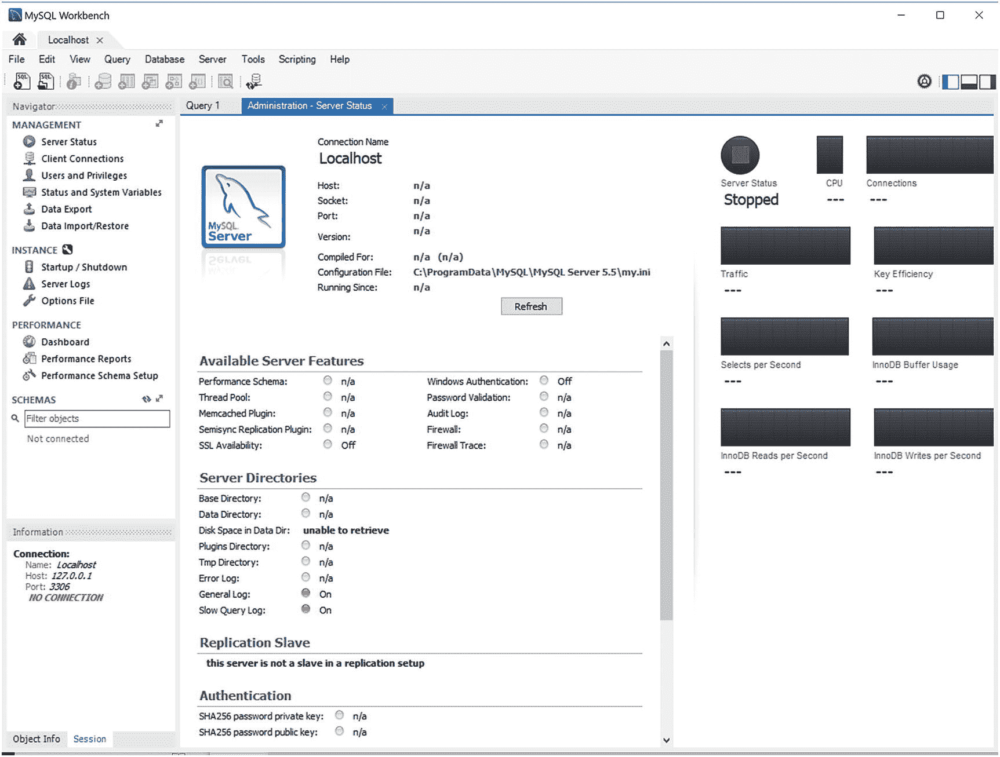
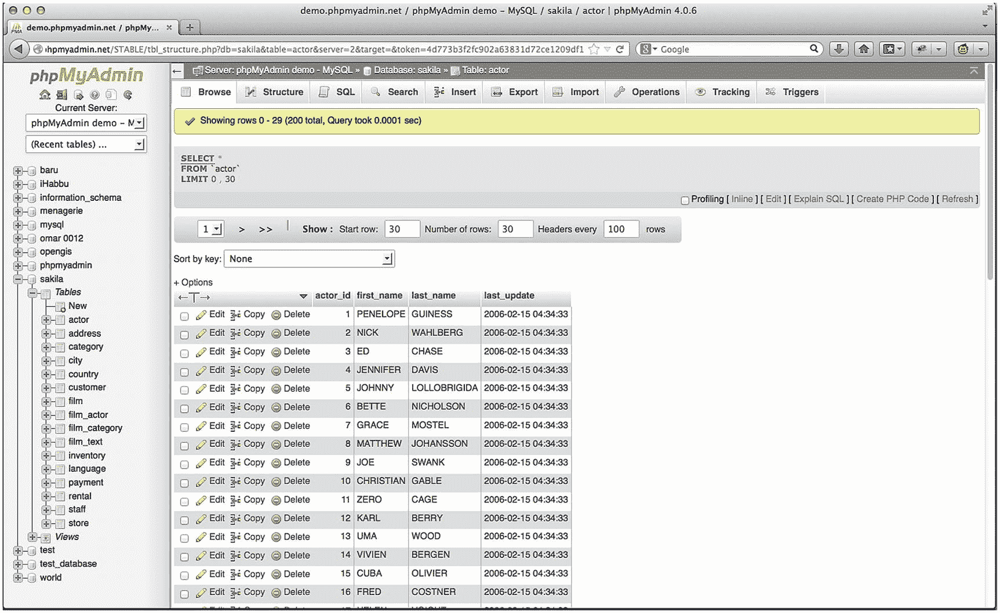

# 二十四、众多 MySQL 客户端

MySQL 附带了相当多的实用程序，或称*客户机，*其中的每一个都提供了执行与数据库服务器管理相关的各种任务的接口。本章概述了最常用的客户端，并深入介绍了原生 mysql 和 mysqladmin 客户端。 <sup>[1](#Fn1)</sup> 因为 MySQL 手册已经出色地提供了每个客户端的概述，所以这一章将重点放在那些您在日常管理活动中最有可能经常使用的特性上。

本章首先介绍捆绑的客户端。不需要安装额外的工具，但是当然，不是所有的用户都习惯使用命令行；因此，MySQL 开发人员和第三方多年来创造了许多强大的基于 GUI 的管理解决方案，其中一些我将在本章后面介绍。

## 命令行客户端简介

MySQL 与相当多的客户端程序捆绑在一起，其中许多程序即使使用，也很少使用。但是，当连接到无法远程访问的远程主机上的数据库时，有两种方法特别有用。这一部分提供了对这两个客户端(`mysql`和`mysqladmin`)的详细介绍，并在最后简要介绍了其他几个客户端。

### mysql 客户端

客户端是一个有用的 SQL shell，能够管理 MySQL 服务器的几乎所有方面，包括创建、修改和删除表和数据库；创建和管理用户；查看和修改服务器配置；和查询表数据。虽然大多数时候您可能会通过基于 GUI 的应用程序或 API 来使用 MySQL，但是这个客户机对于执行各种管理任务来说是非常宝贵的，特别是考虑到它在 shell 环境中的可脚本化功能。其一般用法语法如下:

```php
mysql [options] [database_name] [noninteractive_arguments]

```

客户端可以在交互或非交互模式下使用，这两种模式都将在本节中介绍。无论您使用哪一种，通常都需要提供连接选项。具体所需的凭据取决于您的服务器配置；然而，你通常需要一个主机名`(--host=, -h`、用户名`(--user=, -u`和密码`(--password=, -p`。密码选项可以在有密码或没有密码的情况下使用。如果您在命令行中包含密码，旁观者就有可能看到它。如果您忽略了密码。客户端会提示输入密码，但输入时不会显示实际的密码。通常，您会希望包含目标数据库名称`(--database=, -D`，以节省进入客户机后执行`use`命令的额外步骤。尽管顺序无关紧要，但连接选项通常是这样输入的:

```php
$ mysql -h hostname -u username -p -D databasename

```

请注意，命令行中不包含密码，尽管它可能如上所述。例如，以下是使用用户名`Jason`和数据库`employees`连接到位于 [`www.example.com`](http://www.example.com) 的 MySQL 服务器的尝试:

```php
$ mysql -h www.example.com -u jason -p -D employees

```

与其他连接选项不同，数据库选项实际上是可选的，前提是您将数据库名称放在行尾。因此，您可以通过省略它来节省一些击键次数，如下所示:

```php
$ mysql -h www.example.com -u jason -p employees

```

最后，最常见的情况是连接到数据库所在的本地开发环境。在这种情况下，您可以完全放弃引用主机，因为 MySQL 会默认假设您希望连接到 localhost:

```php
$ mysql –u jason –p employees

```

您还可以包括其他选项，其中许多将在后面的“有用的 mysql 选项”一节中介绍，或者执行命令来提示输入密码。如果您的凭证有效，您将被授予访问客户端界面的权限，或者被允许执行命令行中包含的任何非交互式参数。虽然可以提供密码作为一个选项，但是您不应该这样做，因为密码将被记录在您的命令历史中！然而，如果 MySQL 客户端是从脚本中调用的，那么这是一个有效的用法。这需要通过设置足够的权限来保护帐户和脚本。

#### 与 MySQL 交互

要在交互模式下使用 MySQL，需要先进入界面。如前所述，您可以通过传递适当的凭证来实现这一点。在前一个例子的基础上，假设您想要与驻留在您的开发环境中的 dev_c `orporate_com`数据库进行交互:

```php
$ mysql -u jason -p employees

Enter password:
Welcome to the MySQL monitor.  Commands end with ; or \g.
Your MySQL connection id is 387
Server version: 5.5.9-log Source distribution

Copyright (c) 2000, 2011, Oracle and/or its affiliates. All rights reserved.

Oracle is a registered trademark of Oracle Corporation and/or its
affiliates. Other names may be trademarks of their respective
owners.

Type 'help;' or '\h' for help. Type '\c' to clear the current input statement.
mysql>

```

为了说明 MySQL 和 MariaDB 之间的细微差别，如果您安装了 MariaDB，下面是相同命令的输出:

```php
Enter password:
Welcome to the MariaDB monitor.  Commands end with ; or \g.
Your MariaDB connection id is 16
Server version: 5.5.56-MariaDB MariaDB Server

Copyright (c) 2000, 2017, Oracle, MariaDB Corporation Ab and others.

Type 'help;' or '\h' for help. Type '\c' to clear the current input statement.

MariaDB [employees]>

```

通过`mysql`客户端连接后，您就可以开始执行 SQL 命令了。例如，要查看所有现有数据库的列表，请使用以下命令:

```php
mysql> show databases;
+------------------------------+
| Database                     |
+------------------------------+
| information_schema           |
| employees                    |
| mysql                        |
| test                         |
+------------------------------+
3 rows in set (0.00 sec)

```

如果您在没有明确识别数据库的情况下进入服务器，并且想要开始使用特定的数据库，请使用`use`命令:

```php
MariaDB  [(none)]> use employees;
Reading table information for completion of table and column names
You can turn off this feature to get a quicker startup with -A

Database changed
MariaDB [employees]>

```

一旦切换到`mysql`数据库上下文，就可以用这个命令查看所有表:

```php
mysql> show tables;

```

这将返回以下内容:

```php
+-----------------------------+
| Tables_in_employees         |
+-----------------------------+
| departments                 |
| dept_emp                    |
| dept_manager                |
| employees                   |
| salaries                    |
| titles                      |
+-----------------------------+
6 rows in set (0.00 sec)

```

要查看其中一个表的结构，例如,`host`表，使用以下命令:

```php
mysql> describe employees;

```

这将返回以下内容:

```php
+------------+---------------+------+-----+---------+-------+
| Field      | Type          | Null | Key | Default | Extra |
+------------+---------------+------+-----+---------+-------+
| emp_no     | int(11)       | NO   | PRI | NULL    |       |
| birth_date | date          | NO   |     | NULL    |       |
| first_name | varchar(14)   | NO   |     | NULL    |       |
| last_name  | varchar(16)   | NO   |     | NULL    |       |
| gender     | enum('M','F') | NO   |     | NULL    |       |
| hire_date  | date          | NO   |     | NULL    |       |
+------------+---------------+------+-----+---------+-------+
6 rows in set (0.01 sec)

```

您还可以执行 SQL 查询，如`insert`、`select`、`update`和`delete`。例如，假设您想要选择位于`employees`表中的`emp_no`、`first_name`和`last_name`值，按`last_name`对结果进行排序，并将结果限制为前三个:

```php
mysql> select emp_no, first_name, last_name from employees order by last_name limit 3;

```

总之，您可以通过 MySQL 能够理解的`mysql`客户端执行任何查询。

您可以通过执行以下任意命令来退出 mysql 客户端:`quit`、`exit`、`\q`或`Ctrl-D`。

#### 以批处理模式使用 mysql

`mysql`客户机还提供批处理模式功能，用于将模式和数据导入数据库，并将输出通过管道传输到另一个目的地。例如，您可以通过让`mysql`客户端使用`<`操作符消费`/path/to/file`的内容来执行驻留在文本文件中的 SQL 命令，如下所示:

```php
%>mysql [options] < /path/to/file

```

这个功能有很多用途。例如，该功能的一个可能用途是每天早上通过电子邮件将服务器统计数据发送给系统管理员。例如，假设您想要监控执行时间超过由变量`long_query_time`定义的时间的查询的数量:

```php
mysql> show variables like "long_query_time";
+-----------------+-----------+
| Variable_name   | Value     |
+-----------------+-----------+
| long_query_time | 10.000000 |
+-----------------+-----------+
1 row in set (0.01 sec)

```

首先创建一个名为`mysql_monitor`的没有密码的用户(不应该创建没有密码的帐户，因为这将允许任何人访问该帐户)，只授予该用户对`mysql`数据库的`usage`权限:

```php
mysql> grant usage on mysql.* to 'mysql_monitor'@'localhost';

```

然后，创建一个名为`mysqlmon.sql`的文件，并在其中添加以下代码行:

```php
show status like "slow_queries";

```

现在，您可以轻松访问这些数据，而无需首先登录 MySQL 服务器:

```php
$ mysql –u mysql_monitor < mysqlmon.sql
Variable_name    Value
Slow_queries     42

```

当然，如果您运行的是 OS X 或 Linux，您甚至可以将这个命令打包到它自己的 shell 脚本中，从而节省更多的击键时间:

```php
#!/bin/sh
mysql -u testuser2 < mysqlmon.sql

```

使用一个容易识别的名称保存该文件，例如`mysql_monitor.sh`，相应地设置其执行权限，并按如下方式执行:

```php
$ ./monitor.sh
Variable_name    Value
Slow_queries     42

```

顺便提一下，您也可以在已经登录到`mysql`客户端的情况下，通过使用`source`命令来执行文件:

```php
mysql> source mysqlmon.sql
+---------------+-------+
| Variable_name | Value |
+---------------+-------+
| Slow_queries  | 0     |
+---------------+-------+
1 row in set (0.00 sec)

```

#### 有用的 mysql 技巧

本节列举了几个有用的技巧，所有 MySQL 用户在开始使用`mysql`客户端时都应该知道。

##### 垂直显示结果

使用`\G`选项以垂直输出格式显示查询结果。这使得返回的数据更加易读。考虑这个例子，其中通过使用`\G`选项从`mysql`数据库的`db`表中选择所有行:

```php
mysql>use mysql;
mysql>select * from db\G
*************************** 1\. row ***************************
   Host: %
   Db: test%
   User:
   Select_priv: Y
   Insert_priv: Y
   Update_priv: Y
   …
*************************** 2\. row ***************************
...

```

##### 记录查询

当与`mysql`客户端交互工作时，将所有结果记录到一个文本文件中会很有用，这样您可以在以后查看它们。您可以使用`tee`或`\T`选项启动日志记录，后跟一个文件名，如果需要，还可以加上一个路径。例如，假设您想要将会话记录到名为`session.sql`的文件中:

```php
mysql>\T session.sql
Logging to file 'session.sql'
mysql>show databases;
+-------------+
| Database    |
+-------------+
| mysql       |
| test        |
+-------------+

```

一旦开始记录，您在这里看到的输出将被记录到`session.sql`中。要在会话期间的任何时候禁用日志记录，请执行`notee`或`\t`。

##### 获取服务器统计信息

执行`status`或`\s`命令将检索许多关于当前服务器状态的有用统计数据，包括正常运行时间、版本、TCP 端口、连接类型、执行的查询总数、平均每秒查询数等等。

##### 预防事故

假设您管理一个包含 10，000 名新闻稿成员的表。有一天，你决定使用 mysql 客户端删除一个旧的测试帐户。这是漫长的一天，你不假思索地执行

```php
mysql>DELETE FROM subscribers;

```

而不是

```php
mysql>DELETE FROM subscribers WHERE email="test@example.com";

```

哎呀，你刚刚删除了你的整个用户群！希望最近的备份是方便的。作为`mysql`命令的一个参数，`--safe-updates`选项通过拒绝执行任何没有附带`WHERE`子句的`DELETE`或`UPDATE`查询来防止这种无意的错误。有趣的是，你也可以用`--i-am-a-dummy`开关来达到同样的目的！

##### 修改 mysql 提示符

当同时处理驻留在不同服务器上的几个数据库时，您可能很快会弄不清当前使用的是哪一个服务器。为了使位置更明显，修改缺省提示以包括主机名。你可以用几种方法做到这一点。

一种方法是在登录`mysql`时修改命令行上的提示，像这样:

```php
%>mysql -u jason --prompt="(\u@\h) [\d]> " -p employees

```

登录到控制台后，会出现如下提示:

```php
(jason@localhost) [employees]>

```

要使更改永久化，您也可以在`[mysql]`部分下的`my.cnf`文件中进行更改:

```php
[mysql]
...
prompt=(\u@\h) [\d]>

```

最后，在 Linux/Unix 上，您可以通过`MYSQL_PS1`环境变量在提示符下包含主机名:

```php
%>export MYSQL_PS1="(\u@\h) [\d]> "

```

### 注意

MySQL 手册中提供了提示符可用标志的完整列表。

#### 查看配置变量和系统状态

您可以通过`SHOW VARIABLES`命令查看所有服务器配置变量的完整列表:

```php
mysql>show variables;

```

这将返回所有可用的系统变量。可用数量取决于 MySQL/MariaDB 的配置和版本。如果您只想查看一个特定的变量，比如默认的表格类型，您可以结合使用这个命令和`like`:

```php
mysql> show variables like "version";

```

这将返回以下内容:

```php
+---------------+-----------+
| Variable_name | Value     |
+---------------+-----------+
| version       | 5.5.9-log |
+---------------+-----------+

```

查看系统状态信息同样简单:

```php
mysql> show status;

```

这将返回以下内容:

```php
+------------------------------------------+-------------+
| Variable_name                            | Value       |
+------------------------------------------+-------------+
| Aborted_clients                          | 50          |
| Aborted_connects                         | 2           |
...
| Threads_connected                        | 7           |
| Threads_created                          | 399         |
| Threads_running                          | 1           |
| Uptime                                   | 1996110     |
| Uptime_since_flush_status                | 1996110     |
+------------------------------------------+-------------+
287 rows in set (0.00 sec)

```

要查看状态报告中的单个项目，例如发送到所有客户端的总字节数，请使用以下命令:

```php
mysql> show status like "bytes_sent";
+---------------+-------+
| Variable_name | Value |
+---------------+-------+
| Bytes_sent    | 18393 |
+---------------+-------+

```

如果您想要检索名称相似的变量组(这通常意味着相似的目的)，您可以使用`%`通配符。例如，以下命令检索用于跟踪与 MySQL 的查询缓存特性相关的统计数据的所有变量:

```php
mysql>show status like "Qc%";
+-------------------------+--------+
| Variable_name           | Value  |
+-------------------------+--------+
| Qcache_free_blocks      | 161    |
| Qcache_free_memory      | 308240 |
| Qcache_hits             | 696023 |
| Qcache_inserts          | 449839 |
| Qcache_lowmem_prunes    | 47665  |
| Qcache_not_cached       | 2537   |
| Qcache_queries_in_cache | 13854  |
| Qcache_total_blocks     | 27922  |
+-------------------------+--------+
8 rows in set (0.00 sec)

```

#### 有用的 mysql 选项

像本章介绍的所有客户端一样，`mysql client`提供了许多有用的选项，通过命令行传递。这里介绍了许多最重要的选项:

*   `--` `auto-rehash`:默认情况下，`mysql`会创建数据库、表和列名的散列，以便于自动完成(可以用`Tab`键自动完成数据库、表和列名)。您可以使用`--no-auto-rehash`禁用此行为。如果您想重新启用它，请使用此选项。如果您不打算使用自动完成，请考虑禁用此选项，这将稍微加快启动时间。

*   `--` `column-names`:默认情况下，`mysql`在每个结果集的顶部包含列名。你可以用`--no-column-names`禁用它们。如果您想重新启用此行为，请重新使用此选项。

*   `--` `compress`，`-C`:客户端与服务器通信时，启用数据压缩。

*   `--` `database=name` `, -D`:决定使用哪个数据库。当以交互方式使用 MySQL 时，您还可以根据需要使用`USE`命令在数据库之间切换。

*   `--default-character-set=character_set`:设置字符集。

*   `--` `disable-tee`:如果您已经使用选项`--tee`或命令`tee`启用了所有查询和结果的日志记录，那么您可以使用此选项禁用此行为。

*   `--execute=query`、`-e`、`query`:无需实际进入客户端界面即可执行查询。您可以使用此选项执行多个查询，用分号分隔每个查询。确保用引号将查询括起来，这样 shell 就不会将其误解为多个参数。例如，

*   `--` `force` `, -f`:在非交互模式下使用时，MySQL 可以读取和执行文本文件中的查询。默认情况下，如果出现错误，这些查询的执行将会停止。此选项会导致执行继续，而不管是否有错误。

*   `--host=name, -h`:指定连接主机。

*   `--html, -H`:以 HTML 格式输出所有结果。有关该选项的更多信息，请参见“有用的 mysql 技巧”一节中的相应技巧。

*   当快速输入和执行查询时，经常会出现错误，导致恼人的哔哔声错误。使用此选项禁用声音。

*   许多查询产生的信息超过了一个屏幕所能容纳的范围。通过分配一个分页器，您可以告诉客户端一次显示一页结果。有效寻呼机的例子包括 Unix 命令`more`和`less`。目前，该命令仅在 Unix 平台上有效。您也可以在`mysql`客户端中使用`\P`命令设置一个寻呼机。

*   `--password, -p`:指定密码。请注意，您不应该像用户名或主机一样在命令行上提供密码，而是应该等待随后的提示，这样密码就不会以纯文本的形式存储在您的命令历史记录中。

*   `--port=#, -P`:指定主机连接端口。

*   `--protocol=name` : MySQL 支持内存、管道、套接字、tcp 四种连接协议。使用此选项指定您想要使用的协议:

    *   TCP 协议:当客户端和服务器驻留在两台不同的机器上时，默认情况下使用，并且需要端口 3306 才能正常工作(端口号可以用`--port`更改)。如果客户端和服务器驻留在不同的计算机上，您需要使用 TCP，尽管当所有通信都在本地进行时您也可以使用它。

    *   套接字文件(Socket files ):一个 Unix 特有的特性，它有助于两个不同程序之间的通信，当通信在本地进行时，它是默认的。

    *   共享内存:一种 Windows 独有的功能，它使用一个公共内存块来实现通信。

    *   命名管道(Named pipes ):一个仅在 Windows 上使用的功能，其功能类似于 Unix 管道。

```php
$ mysql -u root -p -e "USE corporate; SELECT * from product;"

```

### 注意

默认情况下，不会启用上述两个特定于 Windows 的选项(TCP 是 Windows 上本地和远程通信的默认选项)。

*   `--` `safe-updates` `, -U`:使`mysql`忽略所有省略了`WHERE`子句的`DELETE`和`UPDATE`查询。这是防止意外批量删除或修改的特别有用的保护措施。有关这个选项的更多信息，请参阅“有用的 mysql 技巧”一节。

*   `--` `skip-column-names`:默认情况下，`mysql`在每个结果集的顶部包含包含列名的标题。您可以使用此选项禁止包含这些头。

*   `--tee=name`:使`mysql`将所有命令和结果输出记录到`name`指定的文件中。这对于调试特别有用。在 MySQL 内部，您可以通过发出命令`notee`随时禁用日志记录，并可以在以后使用命令`tee`重新启用它。有关该选项的更多信息，请参见“有用的 mysql 技巧”一节中的相应技巧。

*   `--vertical`、`-E`:使`mysql`以垂直格式显示所有查询结果。当您处理包含多列的表格时，这种格式通常更可取。有关该选项的更多信息，请参见“有用的 mysql 技巧”一节中的相应技巧。

*   `--xml`、`-X`:将所有结果以 XML 格式输出。有关该选项的更多信息，请参见“有用的 mysql 技巧”一节中的相应技巧。

### mysqladmin 客户端

`mysqladmin`客户机用于执行各种各样的管理任务，可能最显著的是创建和销毁数据库、监控服务器状态以及关闭 MySQL 服务器守护进程。像`mysql`一样，你需要传递必要的访问凭证来使用`mysqladmin`。

例如，您可以通过执行以下命令来检查所有服务器变量及其值

```php
%>mysqladmin -u root -p variables
Enter password:
+-------------------------------------+
| Variable_name             | Value   |
+-------------------------------------+
| auto_increment_increment  |  1      |
| auto_increment_offset     |  1      |
| autocommit                | ON      |
…
| version_compile_os        | osx10.6 |
| wait_timeout              | 28800   |

```

如果您提供了有效的凭证，将会滚动一长串参数和相应的值。如果您想浏览结果，如果您使用的是 Linux，您可以通过管道将该输出发送到`more`或`less`，如果您使用的是 Windows，则发送到`more`。

#### mysqladmin 命令

虽然`mysql`本质上是一个自由格式的 SQL shell，允许 MySQL 识别任何 SQL 查询，但是`mysqladmin`的范围要有限得多，只能识别一组预定义的命令；这里介绍最常用的:

*   `create` `databasename`:新建一个数据库，其名称由 databasename 指定。请注意，每个数据库必须拥有唯一的名称。尝试使用现有数据库的名称创建数据库将导致错误。

*   `drop` `databasename`:删除一个现有的数据库，其名称由 databasename 指定。提交删除数据库的请求后，系统会提示您确认请求，以防止意外删除。

*   `extended-status`:提供关于服务器状态的扩展信息。这与从`mysql`客户端中执行`show status`是一样的。

*   `flush-privileges`:重新加载权限表。如果您使用的是`GRANT`和`REVOKE`命令，而不是使用 SQL 查询直接修改特权表，那么您不需要使用这个命令。

*   `kill id[,id2[,id` `N` `]]`:终止`id`、`id2`到`id`、`N`指定的进程。您可以使用`processlist`命令查看进程号。

*   `old-password` `new-password`:使用 MySQL 4.1 之前的密码哈希算法，将`-u`指定的用户密码更改为`new-password`。

*   `password` `new-password`:使用后 MySQL 4.1 密码哈希算法将`-u`指定的用户密码更改为`new-password`。

*   `ping`:通过 pinged MySQL 服务器来验证它是否正在运行，就像 web 或邮件服务器可能被 ping 一样。

*   `processlist`:显示所有正在运行的 MySQL 服务器守护进程列表。

*   `shutdown`:关闭 MySQL 服务器守护进程。注意，您不能使用 mysqladmin 重启守护进程。相反，它必须使用第 26 章中介绍的机制重新启动。

*   `stat` us:输出各种服务器统计数据，比如正常运行时间、执行的查询总数、打开的表、平均每秒查询数和运行的线程。

*   `variables`:输出所有服务器变量及其对应的值。

*   `version`:输出版本信息和服务器统计。

让我们考虑几个简单的例子。如果您想快速创建一个新的数据库，您可以使用`create`命令:

```php
$ mysqladmin -u -p create dev_gamenomad_com
Enter password:

```

您可以使用`processlist`命令查看正在运行的 MySQL 进程列表:

```php
$ mysqladmin -u root -p processlist
Enter password:
+----+-----+----------+----------------+--------+------+-----+------------+
| Id | User| Host     |db              | Command| Time |State| Info       |
+----+-----+----------+----------------+--------+------+-----+------------+
| 387| root| localhost|local_apress_mis| Sleep  | 7071 |     |            |
| 401| root| localhost|                | Query  | 0    |     | show                                                                processlist|
+----+-----+----------+----------------+--------+------+-----+------------+

```

尽管有太多基于 GUI 的管理工具，但我倾向于将大部分 MySQL 管理时间花在`mysql`客户机上，用它来完成大多数管理任务。然而，当需要快速查看系统状态或配置信息时，我会使用`mysqladmin`(分别通过`extended-status`和`variables`命令)，将这些命令与 Unix 的`grep`和`less`命令结合起来。在 Windows 上，可以在 Windows 7 的 findstr 或 PowerShell 中找到类似的功能。

### 其他有用的客户端

本节涵盖了 MySQL 的其他几个本地客户端。像`mysql`和`mysqladmin`客户端一样，本节介绍的所有实用程序都可以通过`--help`选项调用。

### 注意

两个非常有用的导出数据的客户端是`mysqlhotcopy`和`mysqldump`；然而，我将放弃在这里介绍它们，把这些介绍留到第 [35 章](35.html)中，在那里我将全面概述 MySQL 的各种数据导入和导出功能。

#### MySQL show(MySQL 显示)

`mysqlshow`实用程序提供了一种便捷的方式来快速查看给定数据库服务器上存在哪些数据库、表和列。其用法语法如下:

```php
mysqlshow [options] [database [table [column]]]

```

例如，假设您想要查看所有可用数据库的列表:

```php
%>mysqlshow -u root -p
Enter password:
+------------------------------+
|          Databases           |
+------------------------------+
| information_schema           |
| employees                    |
| mysql                        |
| test                         |
+------------------------------+

```

要查看特定数据库(如`employees`)中的所有表，请使用以下命令:

```php
%>mysqlshow -u root -p employees
Enter password:
Database: employees
+--------------+
|    Tables    |
+--------------+
| departments  |
| dept_emp     |
| dept_manager |
| employees    |
| salaries     |
| titles       |
+--------------+

```

要查看特定表中的所有列，如`employee`数据库的`salaries`表，请使用以下命令:

```php
%>mysqlshow -u root -p employees salaries
Enter password:
Database: employees  Table: salaries
+---------+------+---------+---+----+-------+-----+----------------+------+
| Field   |Type  |Collation|Null|Key|Default|Extra|Privileges      |Comment|
+---------+------+---------+----+---+-------+-----+----------------+------+
| emp_no  |int(11)|         |NO  |PRI|       |     |select, insert,                                                  update,references|      |
| salary  |int(11)|         |NO  |   |       |     |select, insert,                                                  update,references|      |
| from_date|date  |         |NO  |PRI|       |     |select,insert,                                                  update,references|      |
| to_date |date   |         |NO  |   |       |     |select,insert,                                                  update,references|      |
+-------+---------+---------+----+---+-------+-----+---------------+------+

```

请注意，显示的内容完全取决于提供的凭据。在前面的例子中，使用了`root`用户，这意味着所有信息都由用户处理。但是，其他用户可能没有如此广泛的访问权限。因此，如果您对调查所有可用的数据结构感兴趣，请使用`root`用户。

## 有用的 GUI 客户端程序

认识到不是所有的用户都特别喜欢从命令行工作，许多公司和开源团队提供了奇妙的、基于图形的数据库管理解决方案。几年来，MySQL 团队实际上维护了几个不同的基于 GUI 的管理产品；然而，它们最终被合并到一个名为 MySQL Workbench 的项目中。MySQL Workbench 旨在成为管理 MySQL 服务器所有方面的一站式商店，包括模式、用户和表数据。

MySQL Workbench 可以在所有标准平台上使用，包括 Linux、OS X 和 Windows。如果您想自己构建，也可以使用源代码。前往 [`https://dev.mysql.com/downloads/tools/workbench`](https://dev.mysql.com/downloads/tools/workbench) 获取适合您平台的版本。

一旦安装完毕，我建议花些时间探索 MySQL Workbench 的许多特性。我发现基于 GUI 的模式设计和正向工程特性是必不可少的(图 [27-1](#Fig1) )，因为它允许您使用方便的点击式界面设计和维护数据库模式，而不是手工编写模式命令。



图 27-1

MySQL 工作台

## phpMyAdmin

phpMyAdmin 是一个用 PHP 编写的基于 web 的 MySQL 管理应用程序，被成千上万的开发人员使用，实际上是全球虚拟主机提供商的主要产品。它自 1998 年以来一直在积极开发，但由于热情的开发团队和用户社区，它的功能也很丰富。作为这款产品的长期用户，很难想象没有它会怎样。

phpMyAdmin 提供了许多引人注目的特性:

*   管理员可以完全控制用户权限、密码和资源使用，以及创建、删除甚至复制用户帐户。

*   实时界面可用于查看正常运行时间信息、查询和服务器流量统计、服务器变量和正在运行的进程。

*   来自世界各地的开发人员已经将 phpMyAdmin 的界面翻译成 50 多种语言，包括英语、中文(繁体和简体)、阿拉伯语、法语、西班牙语、希伯来语、德语和日语。

*   phpMyAdmin 提供了一个高度优化的点击式界面，大大降低了用户引发错误的可能性。



图 27-2

在 phpMyAdmin 中查看数据库

*   phpMyAdmin 是基于浏览器的，允许您从任何可以访问 Web 的地方轻松管理远程 MySQL 数据库。还透明地支持 SSL，如果您的服务器提供这一特性，则允许加密管理。用于管理数据库表的界面截图如图 [27-2](#Fig2) 所示。

phpMyAdmin 是在 GNU 通用公共许可证下发布的。phpMyAdmin 的官方网站， [`http://phpmyadmin.net`](http://phpmyadmin.net) ，提供源代码下载、新闻、邮件列表、现场演示等等。

clinets 到 MySQL 和 MariaDB 还有很多其他选择；Webyog/SQLyog，HeidiSQL，dbForge Studio for MariaDB 仅举几例。像 PHP Storm 这样的现代编辑器也支持直接的数据库连接，这在处理 SQL 文件时非常方便。

## 摘要

本章介绍了 MySQL 的众多客户端，重点介绍了`mysql`和`mysqladmin`。还介绍了几种最流行的基于 GUI 的管理解决方案。因为管理是维护健康的数据库服务器的一个关键方面，所以考虑尝试所有这些方法，以确定哪种方法最适合您的特定数据库管理情况。

下一章将讨论 MySQL 的另一个关键方面:表结构和数据类型。您将了解各种表类型以及支持的数据类型和属性；您还将看到许多关于如何创建、修改和使用数据库、表和列的示例。

<aside class="FootnoteSection" epub:type="footnotes">Footnotes [1](#Fn1_source)

虽然缺少外壳可能看起来很奇怪，但 mysql 和 mysqladmin 确实是这些客户端的正式名称。

 </aside>