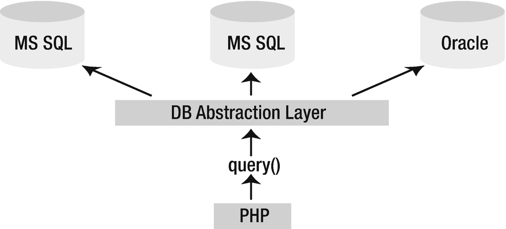

# 二十八、PDO 介绍

虽然所有主流数据库一般都遵循 SQL 标准，尽管程度不同，但程序员与数据库交互所依赖的接口可能会有很大差异(即使查询基本相同)。因此，应用几乎总是绑定到特定的数据库，迫使用户也安装和维护所需的数据库，即使该数据库不如企业中已经部署的其他解决方案。例如，假设您的组织需要一个专门在 Oracle 上运行的应用，但是您的组织在 MySQL 上实现了标准化。您是否准备好投入大量资源来获得在任务关键型环境中运行所需的 Oracle 知识，然后在应用的整个生命周期中部署和维护该数据库？

为了解决这种困境，聪明的程序员开始开发数据库抽象层，目标是将应用逻辑与用于与数据库通信的逻辑分离。通过这个通用接口传递所有与数据库相关的命令，应用就可以使用几种数据库解决方案中的一种，前提是数据库支持应用所需的特性，并且抽象层提供了与该数据库兼容的驱动程序。图 [28-1](#Fig1) 显示了这一过程。



图 28-1

使用数据库抽象层来分离应用和数据层

您可能听说过一些更广泛的实现:

*   JDBC:顾名思义，Java 数据库连接(JDBC)标准允许 Java 程序与任何有 JDBC 驱动程序的数据库进行交互。其中包括 FrontBase、Microsoft SQL Server、MySQL、Oracle 和 PostgreSQL。

*   ODBC :开放数据库连接(ODBC)接口是当今使用最广泛的抽象实现之一，受到包括 PHP 在内的各种应用和语言的支持。所有主流数据库都提供 ODBC 驱动程序，包括上面 JDBC 介绍中提到的那些。

*   **Perl DBI**:Perl 数据库接口模块是 Perl 与数据库通信的标准化手段，也是 PHP DB 包背后的灵感来源。

因为 PHP 提供了对 ODBC 的支持，所以在开发 PHP 驱动的应用时，您的数据库抽象需求似乎得到了解决，对吗？虽然这种(以及许多其他)解决方案很容易获得，但一种更好的解决方案已经开发了一段时间。PHP 5.1 正式发布了这个解决方案，它被称为 PHP 数据对象(PDO)抽象层。

## 另一个数据库抽象层？

随着 PDO 的成熟，它遇到了来自开发人员的抱怨，这些开发人员要么参与了替代数据库抽象层的开发，要么过于关注 PDO 的数据库抽象特性，而不是它提供的全部功能。事实上，PDO 是许多现有解决方案的理想替代品。然而，PDO 实际上不仅仅是一个数据库抽象层，它提供了:

*   **编码一致性**:因为 PHP 的各种数据库扩展是由许多不同的贡献者编写的，尽管有共同的特性集，编码方法却很不一致。PDO 通过提供统一的单一接口消除了这种不一致性。不管数据库。此外，扩展被分成两个不同的部分:PDO 核心包含大多数 PHP 特定的代码，让各种驱动程序只关注数据。此外，PDO 的开发人员在以前构建和维护本机数据库扩展时利用了大量的知识和经验，充分利用了成功之处，并小心避免了失败之处。尽管还存在一些不一致，但总的来说，数据库特性被很好地抽象了。

*   **灵活性**:因为 PDO 在运行时加载所需的数据库驱动程序，所以不需要每次使用不同的数据库时都重新配置和重新编译 PHP。例如，如果您的数据库突然需要从 Oracle 切换到 MySQL，只需加载`PDO_MYSQL`驱动程序(本章后面会详细介绍如何做)。

*   面向对象的特性 : PDO 利用了 PHP 5 的面向对象特性，产生了一种比以前的解决方案更好的数据库交互方式。

*   **性能** : PDO 是用 C 语言编写的，编译成 PHP，在其他条件相同的情况下，它比用 PHP 编写的解决方案提供了相当大的性能提升，至少对于与在数据库服务器中执行查询无关的部分是如此。

有这样的优势，还有什么不喜欢的呢？这一章的作用是让你完全熟悉 PDO 和它所提供的无数功能。

### PDO 的数据库选项

在撰写本文时，除了可以通过 DBLIB 和 ODBC 访问的任何数据库之外，PDO 还支持相当多的数据库，包括:

*   **4D** :可通过`PDO_4D`驱动程序访问。

*   **CUBRID** :可通过`PDO_CUBRID`驱动程序访问。

*   **火鸟/ InterBase 6** :可通过`PDO_FIREBIRD`驱动访问。

*   **IBM DB2** :可以通过`PDO_IBM`驱动程序访问。

*   **Informix** :可通过`PDO_INFORMIX`驱动程序访问。

*   **微软 SQL Server** :可通过`PDO_DBLIB`和`PDO_SQLSRV`驱动访问。

*   **MySQL** :可通过`PDO_MYSQL`驱动访问。

*   **ODBC** :可通过`PDO_ODBC`驱动程序访问。ODBC 本身并不是一个数据库，但是它使 PDO 能够与这个列表中没有的任何兼容 ODBC 的数据库结合使用。

*   **甲骨文**:可通过`PDO_OCI`驱动访问。支持 Oracle 版本 8 到 11g。

*   **PostgreSQL** :可通过`PDO_PGSQL`驱动程序访问。

*   **SQLite 3。X** :可通过`PDO_SQLITE`驱动程序访问。

## 使用 PDO

PDO 与 PHP 长期支持的所有数据库扩展有着惊人的相似之处。因此，对于那些将 PHP 与数据库结合使用过的人来说，本节介绍的内容应该非常熟悉。如前所述，PDO 的构建考虑到了前面数据库扩展的最佳特性，因此您会发现它的方法有显著的相似性是有道理的。

本节首先简要介绍 PDO 安装过程，然后总结其目前支持的数据库服务器。出于本章剩余部分中示例的目的，使用了以下 MySQL 表:

```php
CREATE TABLE products (
   id INT NOT NULL AUTO_INCREMENT,
   sku CHAR(8) NOT NULL,
   title VARCHAR(100) NOT NULL,
   PRIMARY KEY(id)
);

```

表格中已经填入了表格 [28-1](#Tab1) 中列出的产品。

表 28-1

示例产品数据

<colgroup><col class="tcol1 align-left"> <col class="tcol2 align-left"> <col class="tcol3 align-left"></colgroup> 
| 

**Id**

 | 

SKU

 | 

**标题**

 |
| --- | --- | --- |
| one | ZP457321 | 无痛须后水 |
| Two | TY232278 | AquaSmooth 牙膏 |
| three | PO988932 | 免提洗发水 |
| four | KL334899 | 威士克勒克剃刀 |

### 安装 PDO

从 PHP 5.1 版本开始，默认启用 PDO；然而，MySQL PDO 驱动程序不是。尽管可以将 PDO 和所需的 PDO 驱动程序作为共享模块安装，但最简单的方法是静态构建 PDO 和驱动程序；完成后，您将不必进行任何其他与配置相关的更改。因为您可能目前只对 MySQL 的 PDO 驱动程序感兴趣，所以您需要做的就是在配置 PHP 时传递`--with-pdo-mysql`标志。

如果您在 Windows 平台上使用 PHP 5.1 或更新版本，您需要在`php.ini`文件中添加对 PDO 和驱动程序扩展的引用。例如，要启用对 MySQL 的支持，请将以下几行添加到 Windows 扩展部分:

```php
extension=php_pdo.dll
extension=php_pdo_mysql.dll

```

和往常一样，不要忘记重启 Apache(或其他 web 服务器)以使`php.ini`更改生效。如果使用包管理器(yum 或 apt-get)安装 PHP，就不需要编译 PHP 或扩展，在许多情况下，所有需要的配置都将由包管理器处理。安装 PDO 驱动程序或任何其他软件包后，检查您的 php.ini 文件。

### 小费

您可以确定哪些 PDO 驱动程序可用于您的环境，方法是将`phpinfo()`加载到浏览器中并查看 PDO 部分标题下提供的列表，或者执行`pdo_drivers()`函数，如下所示:

`<?php print_r(pdo_drivers()); ?>`。

### 连接到数据库服务器并选择数据库

在使用 PDO 与数据库交互之前，您需要建立一个服务器连接并选择一个数据库。这是通过 PDO 的构造函数完成的。其原型如下:

```php
PDO PDO::__construct(string DSN [, string username [, string password
                     [, array driver_opts]]])

```

*DSN* ( *数据源名称)*参数由两项组成:所需的数据库驱动程序名称，以及任何必要的数据库连接变量，如主机名、端口和数据库名称。`username`和`password`参数分别指定用于连接数据库的用户名和密码。最后，`driver_opts`数组指定了连接可能需要或期望的任何附加选项。本节结尾提供了可用选项的列表。

您可以自由地以多种方式调用构造函数。接下来介绍这些不同的方法。

#### 将参数嵌入构造函数

连接到数据库最简单的方法是简单地将连接参数传递给构造函数。例如，可以像这样调用构造函数(特定于 MySQL):

```php
$dbh = new PDO('mysql:host=localhost;dbname=chp28', 'webuser', 'secret');

```

#### 将参数放在文件中

PDO 利用 PHP 的流特性，打开选项将 DSN 字符串放在本地或远程的单独文件中，并在构造函数中引用它，如下所示:

```php
$dbh = new PDO('uri:file://usr/local/mysql.dsn');

```

确保该文件由负责执行 PHP 脚本的同一个用户拥有，并且拥有必要的权限。

#### 参考 php.ini 文件

通过将 dsn 信息分配给名为 *pdo.dsn.aliasname* 的配置参数，也可以在`php.ini`文件中维护 DSN 信息，其中`aliasname`是随后提供给构造函数的 DSN 的别名。例如，以下示例将 DSN 别名为`mysqlpdo`:

```php
[PDO]
pdo.dsn.mysqlpdo = 'mysql:dbname=chp28;host=localhost'

```

别名随后可以由 PDO 构造函数调用，如下所示:

```php
$dbh = new PDO('mysqlpdo', 'webuser', 'secret');

```

与前面的方法不同，这种方法不允许在 DSN 中包含用户名和密码。

#### 使用 PDO 的连接相关选项

PDO 有几个与连接相关的选项，您可以考虑通过将它们传递到 driver_opts 数组中来进行调整。这些选项列举如下:

*   `PDO::ATTR_AUTOCOMMIT`:这个选项决定了 PDO 是在执行每个查询时提交它，还是等待`commit()`方法被执行后再生效。

*   `PDO::ATTR_CASE`:您可以强制 PDO 将检索到的列字符大小写全部转换为大写，或者全部转换为小写，或者完全按照它们在数据库中的位置使用它们。这种控制是通过将该选项分别设置为三个值之一来实现的:`PDO::CASE_UPPER`、`PDO::CASE_LOWER`或`PDO::CASE_NATURAL`。

*   `PDO::ATTR_EMULATE_PREPARES`:启用该选项可以让预处理语句利用 MySQL 的查询缓存。

*   `PDO::ATTR_ERRMODE` : PDO 支持三种报错模式:`PDO::ERRMODE_EXCEPTION`、`PDO::ERRMODE_SILENT`和`PDO::ERRMODE_WARNING`。这些模式决定了什么情况会导致 PDO 报告错误。将该选项设置为这三个值中的一个来改变默认行为，即`PDO::ERRMODE_EXCEPTION`。这个特性将在后面的“处理错误”一节中详细讨论

*   `PDO::ATTR_ORACLE_NULLS`:当设置为`TRUE`时，该属性导致空字符串在检索时被转换为`NULL`。默认设置为`FALSE`。

*   `PDO::ATTR_PERSISTENT`:该选项决定连接是否持久。默认设置为 FAL `SE`。

*   `PDO::ATTR_PREFETCH`:预取是一种数据库特性，即使客户端一次请求一行，也可以检索几行，原因是如果客户端请求一行，他很可能会想要其他行。这样做可以减少数据库请求的数量，从而提高效率。此选项为支持此功能的驱动程序设置预取大小，以千字节为单位。

*   `PDO::ATTR_TIMEOUT`:该选项设置超时前等待的秒数。MySQL 目前不支持这个选项。

*   `PDO::DEFAULT_FETCH_MODE`:您可以使用这个选项来设置默认的获取模式(关联数组、索引数组或对象)，如果您一直喜欢某个特定的方法，那么这样可以节省一些输入。

有四个属性可以帮助您了解有关客户端、服务器和连接状态的更多信息。可以使用“获取和设置属性”一节中介绍的方法`getAttribute()` `,`来检索属性值。

*   `PDO::ATTR_SERVER_INFO`:包含特定于数据库的服务器信息。对于 MySQL，它检索与服务器正常运行时间、总查询数、每秒执行的平均查询数以及其他重要信息相关的数据。

*   `PDO::ATTR_SERVER_VERSION`:包含与数据库服务器版本号相关的信息。

*   `PDO::ATTR_CLIENT_VERSION`:包含数据库客户端版本号的相关信息。

*   `PDO::ATTR_CONNECTION_STATUS`:包含关于连接状态的数据库特定信息。例如，在使用 MySQL 成功连接后，属性包含“通过 TCP/IP 的本地主机”，而在 PostgreSQL 上，它包含“连接正常；等着发。”

#### 处理连接错误

在出现连接错误的情况下，除非返回的`PDOException`对象被正确捕获，否则脚本会立即终止。当然，你可以使用第 8 章[第一次介绍的异常处理语法很容易地做到这一点。以下示例说明了如何在出现连接问题时捕获异常:](08.html)

```php
<?php
    try {
       $dbh = new PDO('mysql:host=localhost;dbname=chp28', 'webuser', 'secret');
    } catch (PDOException $exception) {
       echo "Connection error: " . $exception->getMessage();
    }
?>

```

一旦建立了连接，就该开始使用它了。这是本章其余部分的主题。

### 处理错误

PDO 提供了三种错误模式，允许您调整扩展处理错误的方式:

*   `PDO::ERRMODE_EXCEPTION`:使用`PDOException`类抛出一个异常，它立即停止脚本执行并提供与问题相关的信息。

*   发生错误时不做任何事情，让开发人员检查错误并决定如何处理。这是默认设置。

*   `PDO::ERRMODE_WARNING`:如果发生与 PDO 相关的错误，产生一条 PHP `E_WARNING`消息。

要设置错误模式，只需使用`setAttribute()`方法，如下所示:

```php
$dbh->setAttribute(PDO::ATTR_ERRMODE, PDO::ERRMODE_EXCEPTION);

```

还有两种方法可用于检索错误信息。接下来介绍两者。

#### 正在检索 SQL 错误代码

SQL 标准提供了一个诊断代码列表，用于表示 SQL 查询的结果，称为 SQLSTATE 代码。对 SQLSTATE 代码执行 web 搜索，以生成这些代码及其含义的列表。`errorCode()`方法用于返回这个标准的 SQLSTATE 代码，您可以选择存储该代码用于日志记录，甚至用于生成您自己的定制错误消息。其原型如下:

```php
int PDOStatement::errorCode()

```

例如，下面的脚本试图插入一个新产品，但是错误地引用了单个版本的`products`表:

```php
<?php
    try {
        $dbh = new PDO('mysql:host=localhost;dbname=chp28', 'webuser', 'secret');
    } catch (PDOException $exception) {
        printf("Connection error: %s", $exception->getMessage());
    }

    $query = "INSERT INTO product(id, sku, title)
              VALUES(NULL, 'SS873221', 'Surly Soap') ";

    $dbh->exec($query);

    echo $dbh->errorCode();
?>

```

这应该产生代码`42S02`，对应于 MySQL 不存在的表消息。当然，这个消息本身意义不大，所以您可能会对接下来介绍的`errorInfo()`方法感兴趣。

#### 正在检索 SQL 错误消息

`errorInfo()`方法产生一个数组，其中包含与最近执行的数据库操作相关的错误信息。其原型如下:

```php
array PDOStatement::errorInfo()

```

该数组由三个值组成，每个值由一个在`0`和`2`之间的数字索引值引用:

*   `0`:存储 SQL 标准中定义的 SQLSTATE 代码，

*   `1`:存储数据库驱动程序特有的错误代码，

*   `2`:存储数据库驱动程序特有的错误信息，

以下脚本演示了`errorInfo()`，使其输出与丢失的表相关的错误信息(在这种情况下，程序员错误地使用了现有`products`表的单数形式):

```php
<?php
    try {
       $dbh = new PDO('mysql:host=localhost;dbname=chp28', 'webuser', 'secret');
    } catch (PDOException $exception) {
        printf("Failed to obtain database handle %s", $exception->getMessage());
    }

    $query = "INSERT INTO product(id, sku, title)
              VALUES(NULL, 'SS873221', 'Surly Soap') ";

    $dbh->exec($query);

    print_r($dbh->errorInfo());

?>

```

假设 product 表不存在，将产生以下输出(为便于阅读而格式化):

```php
Array (
[0] => 42S02
[1] => 1146
[2] => Table 'chp28.product' doesn't exist )

```

### 获取和设置属性

相当多的属性可用于调整 PDO 的行为。因为可用属性的数量相当大，而且事实上几个数据库驱动程序提供了它们自己的自定义属性，所以将您指向 [`www.php.net/pdo`](http://www.php.net/pdo) 以获取最新信息是有意义的，而不是在此详尽地列出所有可用属性。

下一节将介绍可用于设置和检索这些属性值的方法。

#### 正在检索属性

`getAttribute()`方法检索由 attribute 指定的属性的值。它的原型是这样的:

```php
mixed PDOStatement::getAttribute(int attribute)

```

下面是一个例子:

```php
<?php

$dbh = new PDO('mysql:host=localhost;dbname=chp28', 'webuser', 'secret');
echo $dbh->getAttribute(PDO::ATTR_CONNECTION_STATUS);

?>

```

在我的服务器上，这会返回:

```php
localhost via TCP/IP

```

#### 设置属性

`setAttribute()`方法将由*值*指定的值赋给由*属性*指定的属性。它的原型是这样的:

```php
boolean PDOStatement::setAttribute(int attribute, mixed value)

```

例如，要设置 PDO 的错误模式，您需要像这样设置`PDO::ATTR_ERRMODE`:

```php
$dbh->setAttribute(PDO::ATTR_ERRMODE, PDO::ERRMODE_EXCEPTION);

```

### 执行查询

PDO 提供了几种执行查询的方法，每种方法都适合以最有效的方式执行特定的查询类型。以下列表细分了每种查询类型:

*   **执行没有结果集的查询**:执行插入、更新、删除等查询时，不返回结果集。在这种情况下，`exec()`方法返回受查询影响的行数。

*   **执行一次查询**:当执行一个返回结果集的查询时，或者当受影响的行数无关紧要时，应该使用`query()`方法。

*   **多次执行一个查询**:虽然可以使用`while`循环和`query()`方法多次执行一个查询，每次迭代传递不同的列值，但是使用*准备好的语句*这样做更有效。

#### 添加、修改和删除表格数据

您的应用可能会提供一些添加、修改和删除数据的方法。为此，您可以将一个查询传递给`exec()`方法，该方法执行一个查询并返回受其影响的行数。其原型如下:

```php
int PDO::exec(string query)

```

考虑以下示例:

```php
<?php

$query = "UPDATE products SET title='Painful Aftershave' WHERE sku="ZP457321"";
// Be aware of SQL injections when building query strings
$affected = $dbh->exec($query);
echo "Total rows affected: $affected";

?>

```

根据本章前面介绍的示例数据，此示例将返回以下内容:

```php
Total rows affected: 1

```

请注意，该方法不应与`SELECT`查询结合使用；相反，应该使用`query()`方法来实现这些目的。使用字符串连接来构建查询字符串，尤其是当它包含来自客户端的数据时，这不是避免 SQL 注入的安全方法。请改用准备好的语句。

#### 选择表格数据

`query()`方法执行一个查询，以 PDOStatement 对象的形式返回数据。其原型如下:

```php
PDOStatement query(string query)

```

下面是一个例子:

```php
<?php

$query = 'SELECT sku, title FROM products ORDER BY id';
// Be aware of SQL injections when building query strings

foreach ($dbh->query($query) AS $row) {
    printf("Product: %s (%s) <br />", $row['title'], $row['sku']);
}

?>

```

基于示例数据，此示例生成以下内容:

```php
Product: AquaSmooth Toothpaste (TY232278)
Product: HeadsFree Shampoo (PO988932)
Product: Painless Aftershave (ZP457321)
Product: WhiskerWrecker Razors (KL334899)

```

### 小费

如果您使用`query()`并想了解更多关于受影响的总行数，请使用`rowCount()`方法。

### 介绍准备好的声明

预准备语句是许多数据库系统的一个特征。它们至少在两个不同的方面有用。第一个也是最重要的一个是关于安全性。使用预准备语句将有助于防范 SQL 注入，在这种情况下，恶意客户端将内容发送回 web 服务器，但绕过了网页的内容检查，并提交了将执行附加任务的字符串(参见下面的示例)。当多次执行相似的语句时，可以发现预准备语句的第二个好处。在这种情况下，数据库引擎可以一次性分析语句的基本结构，并使用每次执行收集的信息，从而提高性能。批量插入或更新(一次一条记录)就是这种方法的一个很好的应用。

考虑以下代码:

```php
<?php
$query = "select * from product where sku = '{$_POST['sku']}';";
...

```

首先，没有对变量`$_POST['sku']`进行健全性检查。它用于将内容直接传递到查询字符串中。即使 web 页面被设计为验证每个字段的内容，也不能保证客户端会根据该逻辑提交表单。请记住，在浏览器中呈现时，网页不受您的控制。如果恶意访问者将以下内容放入表单的 sku 字段，该怎么办:

```php
'; delete from products;

```

该字符串将被直接添加到查询字符串中，您最终可能会删除该表中的所有行。

PDO 为支持这一特性的数据库提供了预准备语句功能。因为 MySQL 支持预处理语句，所以您可以自由地利用这个特性。准备好的语句使用两种方法来完成，一种是`prepare()`，它负责为执行查询做准备，另一种是`execute()`，它使用一组提供的列参数来重复执行查询。这些参数可以通过将它们作为数组传递给方法来显式地提供给`execute()`，或者通过使用使用`bindParam()`方法分配的绑定参数来提供。接下来将介绍这三种方法。

#### 使用准备好的语句

`prepare()`方法负责为执行查询做准备。其原型如下:

```php
PDOStatement PDO::prepare(string query [, array driver_options])

```

用作预准备语句的查询看起来与您可能习惯的查询略有不同，因为对于那些在执行迭代中会发生变化的列值，必须使用占位符而不是实际的列值。支持两种语法变体，*命名参数*和*问号参数*。例如，使用命名参数的查询可能如下所示:

```php
INSERT INTO products SET sku =:sku, name =:name;

```

使用问号参数的相同查询如下所示:

```php
INSERT INTO products SET sku = ?, name = ?;

```

您所选择的变体完全是个人喜好的问题，尽管使用命名参数可能更为明确，并且您不必被迫以正确的顺序传递参数。因此，在相关示例中使用了这种变体。首先，下面的例子使用`prepare()`来准备一个迭代执行的查询:

```php
// Connect to the database
$dbh = new PDO('mysql:host=localhost;dbname=chp28', 'webuser', 'secret');

$query = "INSERT INTO products SET sku =:sku, name =:name";
$stmt = $dbh->prepare($query);

```

一旦准备好查询，就必须执行它。这是通过下面介绍的`execute()`方法完成的。

除了查询之外，您还可以通过 *driver_options* 参数传递数据库驱动程序特定的选项。有关这些选项的更多信息，请参见 PHP 手册。

#### 执行准备好的查询

`execute()`方法负责执行准备好的查询。其原型如下:

```php
boolean PDOStatement::execute([array input_parameters])

```

这种方法需要输入参数，这些参数应该在每次迭代执行时被替换。这可以通过两种方式实现:要么将值作为数组传递给方法，要么使用`bindParam()`方法将值绑定到它们各自的变量名或查询中的位置偏移量。接下来将介绍第一个选项，第二个选项将在接下来的`bindParam()`介绍中介绍。

以下示例显示了一条语句是如何由`execute()`准备并重复执行的，每次都使用不同的参数:

```php
<?php
    // Connect to the database server
    $dbh = new PDO('mysql:host=localhost;dbname=chp28', 'webuser', 'secret');

    // Create and prepare the query
    $query = "INSERT INTO products SET sku =:sku, title =:title";
    $stmt = $dbh->prepare($query);

    // Execute the query
    $stmt->execute( [':sku' => 'MN873213', ':title' => 'Minty Mouthwash'] );

    // Execute again
    $stmt->execute( [':sku' => 'AB223234', ':title' => 'Lovable Lipstick'] );
?>

```

接下来我们将再次讨论这个例子，在这里您将学习使用`bindParam()`方法传递查询参数的另一种方法。

#### 绑定参数

您可能已经在前面对`execute()`方法的介绍中注意到，*输入参数*是可选的。这很方便，因为如果需要传递大量变量，以这种方式提供数组会很快变得难以处理。那么还有什么选择呢？`bindParam()`法。其原型如下:

```php
boolean PDOStatement::bindParam(mixed parameter, mixed &variable [, int datatype [, int length [, mixed driver_options]]])

```

使用命名参数时，*参数*是使用语法`:title`在准备好的语句中指定的列值占位符的名称。使用问号参数时，*参数*是位于查询中的列值占位符的索引偏移量。`variable` *参数*存储分配给占位符的值。它被描述为通过引用传递，因为当将该方法与准备好的存储过程结合使用时，该值可能会根据存储过程中的某些操作而改变。本节将不演示此功能；不过，在你读完第 [32](32.html) 章之后，这个过程应该就相当明显了。可选的*数据类型*参数显式设置参数数据类型，并且可以是以下任意值:

*   `PDO::PARAM_BOOL` ： SQL `BOOLEAN` 数据类型

*   `PDO::PARAM_INPUT_OUTPUT`:当参数被传递到存储过程中时使用，因此可以在过程执行后更改

*   `PDO::PARAM_INT` ： SQL `INTEGER` 数据类型

*   `PDO::PARAM_NULL` ： SQL `NULL` 数据类型

*   `PDO::PARAM_LOB` : SQL 大型对象数据类型

*   `PDO_PARAM_STMT` : `PDOStatement`对象类型；目前不运行

*   `PDO::PARAM_STR` : SQL 字符串数据类型

可选的*长度*参数指定数据类型的长度。只有在赋予它`PDO::PARAM_INPUT_OUTPUT`数据类型时才需要它。最后， *driver_options* 参数用于传递任何特定于驱动程序的选项。

以下示例重温了上一个示例，这次使用`bindParam()`来分配列值:

```php
<?php

    // Connect to the database server
    $dbh = new PDO('mysql:host=localhost;dbname=chp28', 'webuser', 'secret');

    // Create and prepare the query
    $query = "INSERT INTO products SET sku =:sku, title =:title";
    $stmt = $dbh->prepare($query);

    $sku = 'MN873213';
    $title = 'Minty Mouthwash';

    // Bind the parameters
    $stmt->bindParam(':sku', $sku);
    $stmt->bindParam(':title', $title);

    // Execute the query
    $stmt->execute();

    $sku = 'AB223234';
    $title = 'Lovable Lipstick';

    // Bind the parameters
    $stmt->bindParam(':sku', $sku);
    $stmt->bindParam(':title', $title);

    // Execute again
    $stmt->execute();
?>

```

如果使用问号参数，该语句将如下所示:

```php
$query = "INSERT INTO products SET sku = ?, title = ?";

```

因此，相应的`bindParam()`调用如下所示:

```php
$stmt->bindParam(1, $sku);
$stmt->bindParam(2, $title);
. . .
$stmt->bindParam(1, $sku);
$stmt->bindParam(2, $title);

```

### 检索数据

PDO 的数据检索方法与其他数据库扩展中的方法非常相似。事实上，如果你在过去使用过这些扩展，你会对 PDO 的五个相关方法感到非常舒服。本节中介绍的所有方法都是`PDOStatement`类的一部分，该类由前一节中介绍的几个方法返回。

#### 返回检索到的列数

`columnCount()`方法返回结果集中返回的列总数。其原型如下:

```php
integer PDOStatement::columnCount()

```

下面是一个例子:

```php
// Execute the query
$query = 'SELECT sku, title FROM products ORDER BY title';
$result = $dbh->query($query);

// Report how many columns were returned
printf("There were %d product fields returned.", $result->columnCount());

```

示例输出如下:

```php
There were 2 product fields returned.

```

#### 检索结果集中的下一行

`fetch()`方法返回结果集中的下一行，或者如果已经到达结果集的末尾，则返回`FALSE`。它的原型是这样的:

```php
mixed PDOStatement::fetch([int fetch_style [, int cursor_orientation
                          [, int cursor_offset]]])

```

引用行中每一列的方式取决于如何设置 *fetch_style* 参数。有八种设置可供选择:

*   `PDO::FETCH_ASSOC`:提示`fetch()`检索由列名索引的值数组。

*   `PDO::FETCH_BOTH`:提示`fetch()`获取一个数组值，该数组值由列名和行中该列的数字偏移量(从 0 开始)索引。这是默认设置。

*   `PDO::FETCH_BOUND`:提示`fetch()`返回 TRUE，并将检索到的列值分配给在`bindParam()`方法中指定的相应变量。有关绑定列的更多信息，请参见“设置绑定列”一节。

*   `PDO::FETCH_CLASS`:提示`fetch()`通过将结果集的列分配给同名的类属性来填充对象。

*   `PDO::FETCH_INTO`:将列值检索到一个类的现有实例中。各个类属性必须与列值匹配，并且必须被指定为公共范围。或者，必须重载`__get()`和`__set()`方法，以便于赋值，如第 [7](07.html) 章所述。

*   `PDO::FETCH_LAZY`:除了包含列属性的对象之外，创建关联和索引数组，允许您使用三个接口中您选择的任何一个。

*   `PDO::FETCH_NUM`:提示`fetch()`获取一个数组值，该数组值由行中列的数字偏移量索引(从 0 开始)。

*   `PDO::FETCH_OBJ`:提示`fetch()`创建一个对象，该对象由匹配每个检索到的列名的属性组成。

如果对象是可滚动游标，则参数 *cursor_orientation* 确定检索哪一行，这是一个结果集，允许您在不获取所有行的情况下对行进行迭代。 *cursor_offset* 参数是一个整数值，表示要检索的行相对于当前光标位置的偏移量。

以下示例从数据库中检索所有产品，并按标题对结果进行排序:

```php
<?php

    // Connect to the database server
    $dbh = new PDO("mysql:host=localhost;dbname=chp28", "webuser", "secret");

    // Execute the query
    $stmt = $dbh->query('SELECT sku, title FROM products ORDER BY title');

    while ($row = $stmt->fetch(PDO::FETCH_ASSOC)) {
        printf("Product: %s (%s) <br />", $row['title'], $row['sku']);
    }

?>

```

示例输出如下:

```php
Product: AquaSmooth Toothpaste (TY232278)
Product: HeadsFree Shampoo (PO988932)
Product: Painless Aftershave (ZP457321)
Product: WhiskerWrecker Razors (KL334899)

```

#### 同时返回所有结果集行

`fetchAll()`方法的工作方式与`fetch()`非常相似，除了对它的一次调用会导致检索结果集中的所有行并将其分配给返回的数组。其原型如下:

```php
array PDOStatement::fetchAll([int fetch_style])

```

引用检索到的列的方式取决于如何设置可选的 *fetch_style* 参数，默认设置为`PDO_FETCH_BOTH`。关于所有可用的`fetch_style`值的完整列表，参见前面关于`fetch()`方法的部分。

以下示例产生与`fetch()`简介中提供的示例相同的结果，但这一次取决于`fetchAll()`准备输出数据:

```php
<?php

function formatRow($row) {
    return sprintf("Product: %s (%s) <br />", $row[1], $row[0]);
}

// Execute the query
$stmt = $dbh->query('SELECT sku, title FROM products ORDER BY title');

// Retrieve all of the rows
$rows = $stmt->fetchAll();

// Output the rows
echo explode(array_map('formatRow', $rows));

?>

```

示例输出如下:

```php
Product: AquaSmooth Toothpaste (TY232278)
Product: HeadsFree Shampoo (PO988932)
Product: Painless Aftershave (ZP457321)
Product: WhiskerWrecker Razors (KL334899)

```

至于你是否选择使用`fetchAll()`而不是`fetch()`，这似乎很大程度上是一个方便的问题。但是，请记住，将`fetchAll()`与特别大的结果集结合使用可能会在数据库服务器资源和网络带宽方面给系统带来很大的负担。

#### 提取单个列

`fetchColumn()`方法返回位于结果集下一行的单个列值。其原型如下:

```php
string PDOStatement::fetchColumn([int column_number])

```

分配给`column_number`的列引用必须根据其在行中的数值偏移量来指定，偏移量从 0 开始。如果没有设置值，`fetchColumn()`返回在第一列中找到的值。奇怪的是，使用这种方法不可能在同一行中检索多列，因为每次调用都会将行指针移动到下一个位置；因此，如果需要的话，可以考虑使用`fetch()`。

下面的例子演示了`fetchColumn()`并显示了对该方法的后续调用如何移动行指针:

```php
    // Execute the query
    $result = $dbh->query('SELECT sku, title FROM products ORDER BY title');

    // Fetch the first row first column
    $sku = $result->fetchColumn(0);

    // Fetch the second row second column
    $title =  $result->fetchColumn(1);

    // Output the data.
    echo "Product: $title ($sku)";

```

结果输出如下。注意，产品标题和 SKU 并不对应于示例表中提供的正确值，因为如上所述，行指针随着对`fetchColumn()`的每次调用而前进；因此，使用这种方法时要谨慎。

```php
Product: AquaSmooth Toothpaste (PO988932)

```

### 设置绑定列

在上一节中，您学习了如何在`fetch()`和`fetchAll()`方法中设置 *fetch_style* 参数，以控制脚本如何使用结果集列。您可能对`PDO_FETCH_BOUND`设置感兴趣，因为它似乎让您在检索列值时完全避免了一个额外的步骤，只需将它们自动分配给预定义的变量。事实上，就是这样，并且是使用`bindColumn()`方法完成的。

`bindColumn()`方法用于将一个列名与一个期望的变量名相匹配，在每次检索行时，将导致相应的列值被自动分配给该变量。这使得从结果集中移动数据变得很容易，但是它不会对数据进行任何检查或格式化。这必须由代码提供。其原型如下:

```php
boolean PDOStatement::bindColumn(mixed column, mixed &param [, int type
                                 [, int maxlen [, mixed driver_options]]])

```

*列*参数指定行中的列偏移量，而 *&参数*定义相应变量的名称。您可以通过使用 *type* 参数定义变量值的类型，并使用 *maxlen* 参数限制其`length`来设置变量值的约束。支持七个`type`参数值。完整的列表见前面对`bindParam()`的介绍。

以下示例从`products`表中选择`sku`和`title`列，其中`id`等于 2，并分别根据数值偏移量和关联映射绑定结果:

```php
<?php
    // Connect to the database server
    $dbh = new PDO('mysql:host=localhost;dbname=chp28', 'webuser', 'secret');

    // Create and prepare the query
    $query = 'SELECT sku, title FROM products WHERE id=2';
    $stmt = $dbh->prepare($query);
    $stmt->execute();

    // Bind according to column offset
    $stmt->bindColumn(1, $sku);

    // Bind according to column title
    $stmt->bindColumn('title', $title);

    // Fetch the row
    $row = $stmt->fetch(PDO::FETCH_BOUND);

    // Output the data
    printf("Product: %s (%s)", $title, $sku);
?>

```

它返回以下内容:

```php
Painless Aftershave (TY232278)

```

### 使用事务

PDO 为那些能够执行事务的数据库提供事务支持。三种 PDO 方法促进事务性任务:`beginTransaction()` `, commit()` `,`和`rollback()`。因为第 [34 章](34.html)是关于交易的，所以这里不提供例子；相反，提供了对这三种方法的简要介绍。

#### 开始交易

`beginTransaction()`方法禁用自动提交模式，这意味着在执行`commit()`方法之前，任何数据库更改都不会生效。其原型如下:

```php
boolean PDO::beginTransaction()

```

一旦`commit()`或`rollback()`被执行，自动提交模式将自动再次启用。

#### 提交交易

`commit()`方法提交事务。其原型如下:

```php
boolean PDO::commit()

```

#### 回滚事务

`rollback()`方法否定自`beginTransaction()`执行以来所做的任何数据库更改。其原型如下:

```php
boolean PDO::rollback()

```

## 摘要

PDO 为用户提供了一种强大的方法来整合不一致的数据库命令，允许用一种几乎微不足道的方法将应用从一个数据库解决方案迁移到另一个数据库解决方案。此外，如果您的客户期望一个允许他们使用首选数据库的应用，由于特定于语言和特定于数据库的特性的分离，它鼓励 PHP 语言开发人员提高生产率。