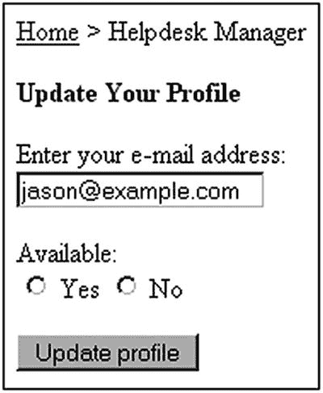

# 三十、MySQL 触发器

一个*触发器*是一个任务，它响应一些预定义的数据库事件而执行，比如在一个新的行被添加到一个特定的表之后。具体来说，该事件涉及插入、修改或删除表数据，并且该任务可以在任何此类事件之前或之后立即发生。本章首先提供了一些通用示例，说明如何使用触发器来执行一些任务，如实施参照完整性和业务规则、收集统计信息以及防止无效事务。然后我将讨论 MySQL 的触发器实现，向您展示如何创建、执行和管理触发器。最后，您将了解如何将触发器特性整合到 PHP 驱动的 web 应用中。

## 介绍触发器

作为开发人员，我们必须记住实现大量的细节，以使应用正常运行。这一挑战在很大程度上与管理数据有关，包括以下任务:

*   防止由于数据格式错误而导致的损坏。

*   强制实施业务规则，比如确保将关于产品的信息插入到`product`表中的尝试包括制造商的标识符，该制造商的信息已经存在于`manufacturer`表中。

*   通过在整个数据库中级联更改来确保数据库的完整性，例如删除与您希望从系统中删除的制造商相关联的所有产品。

如果您已经构建了一个简单的应用，那么您可能已经花了一些时间编写代码来执行至少其中的一些任务。如果可能的话，最好在服务器端自动执行其中的一些任务，不管哪种类型的应用正在与数据库进行交互。数据库触发器为您提供了这种选择。

### 为什么要使用触发器？

触发器有许多用途，包括:

*   **审计跟踪** **:** 假设您正在使用 MySQL 记录 Apache 流量(可能使用 Apache mod_log_sql 模块),但是您还想创建一个额外的特殊日志记录表，让您可以快速制表并将结果显示给不耐烦的主管。执行这个额外的插入可以通过触发器自动完成。

*   **验证** **:** 您可以在更新数据库之前使用触发器来验证数据，例如确保满足最小订单阈值。

*   参照完整性实施 **:** 良好的数据库管理实践表明，表关系在项目的整个生命周期中保持稳定。偶尔使用触发器来确保这些任务自动发生可能是有意义的，而不是试图以编程方式合并所有完整性约束。支持外键约束的数据库无需触发器即可处理完整性实施。维护引用完整性意味着，如果删除了另一个(或同一个)表中的记录，确保没有引用指向该记录。外键是用于标识另一个表中的键的列的术语，从而将两个表链接在一起。

触发器的用途远远超出了这些目的。假设您希望在达到每月 100 万美元的收入目标时更新公司网站。或者假设您想给一周内缺勤超过两天的任何员工发送电子邮件。或者，您可能希望在特定产品的库存不足时通知制造商。所有这些任务都可以由触发器来处理。

为了让您更好地理解触发器的效用，让我们考虑两个场景:第一个场景涉及在触发器之前的*，一个在事件之前发生的触发器；第二个涉及触发*后的*，该触发发生在事件之后。*

### 在事件发生前采取行动

假设食品经销商要求在处理交易之前至少购买 10 美元的咖啡。如果客户试图添加少于该金额的商品到购物车，该金额将自动四舍五入为 10 美元。这个过程可以通过 before 触发器轻松完成，在本例中，该触发器评估任何将产品插入购物车的尝试，并将任何不可接受的低咖啡购买金额增加到$10。一般过程如下所示:

```php
Shopping cart insertion request submitted.

    If product identifier set to "coffee":
        If dollar amount < $10:
            Set dollar amount = $10;
        End If
    End If

Process insertion 

request.

```

### 事件发生后采取行动

大多数帮助台支持软件都基于票证分配和解决的概念。票证由负责记录票证信息的帮助台技术人员分配和解决。然而，偶尔甚至技术人员也被允许离开他们的工作间去度假或养病。在此类缺席期间，客户不能指望等待技术人员回来，因此技术人员的票证应放回池中，由经理重新分配。

这个过程应该是自动的，这样未完成的票据就不会被忽略。这是一个很好的使用触发器的场景。

出于示例的目的，假设`technicians`表如下所示:

```php
+--------+---------+--------------------------+------------+
| id     | name    | email                    | available  |
+--------+---------+--------------------------+------------+
| 1      | Jason   | jason@example.com        | 1          |
| 2      | Robert  | robert@example.com       | 1          |
| 3      | Matt    | matt@example.com         | 1          |
+--------+---------+--------------------------+------------+

```

`tickets`表看起来像这样:

```php
+------+-----------+-----------------+---------------------+----------------+
| id   | username  | title           | description         |  technician_id |
+------+-----------+-----------------+---------------------+----------------+
| 1    | smith22   | disk drive      | Disk stuck in drive |       1        |
| 2    | gilroy4   | broken keyboard | Enter key is stuck  |       1        |
| 3    | cornell15 | login problems  | Forgot password     |       3        |
| 4    | mills443  | login problems  | forgot username     |       2        |
+------+-----------+-----------------+---------------------+----------------+

```

因此，要将技术人员指定为不在办公室，需要在`technicians`表中相应地设置`available`标志(`0`表示不在办公室，`1`表示在办公室)。如果对给定的技术人员执行查询，将该列设置为`0`,那么他的票据应该全部放回通用池中，以便最终重新分配。后触发过程如下所示:

```php
Technician table update request submitted.
    If available column set to 0:
        Update tickets table, setting any flag assigned
        to the technician back to the general pool.
    End If

```

在本章的后面，你将学习如何实现这个触发器并把它合并到一个 web 应用中。

### 前触发器与后触发器

您可能想知道如何得出使用 before 触发器代替 after 触发器的结论。例如，在上一节的触发后情形中，为什么票证重新分配不能在技术人员的可用性状态更改之前发生？标准实践表明，在验证或修改要插入或更新的数据时，应该使用 before 触发器。before 触发器不应用于强制传播或引用完整性(确保所有键都指向其他表中的现有记录)，因为其他 before 触发器可能会在它之后执行，这意味着正在执行的触发器可能正在处理即将无效的数据。

另一方面，当要根据其他表传播或验证数据以及执行计算时，应该使用 after 触发器，因为您可以确保触发器使用的是数据的最终版本。

在下面几节中，您将学习如何最有效地创建、管理和执行 MySQL 触发器。还提供了许多 PHP/MySQL 驱动的应用中触发器使用的例子。

## MySQL 的触发器支持

MySQL 版本 5.0.2 增加了对触发器的支持，但有一些限制。例如，在撰写本文时，存在以下缺陷:

*   不支持`TEMPORARY` **表****:**触发器不能与`TEMPORARY`表一起使用。

*   **不支持视图:**触发器不能与视图一起使用(将在下一章介绍)。

*   **MySQL 数据库不允许触发器:**在 MySQL 数据库中创建的表不允许创建触发器。

*   **触发器不能返回结果集:**只能在触发器内执行插入、更新和删除查询。然而，您可以在触发器中执行存储的例程，只要它们不返回结果集，以及`SET`命令。

*   **触发器必须是唯一的:**不能创建共享同一个表、事件(`INSERT`、`UPDATE`、`DELETE`)和提示(之前、之后)的多个触发器。但是，因为可以在一个查询的范围内执行多个命令(您很快就会知道)，所以这应该不是什么问题。

*   **错误处理** **和报告支持不成熟:**尽管正如所料，如果 before 或 after 触发器失败，MySQL 会阻止操作的执行，但目前还没有合适的方法来导致触发器失败并向用户返回有用的信息。

这可能看起来有局限性，但是触发器仍然提供了一种实现业务逻辑的强大方法。如果有多个用户/系统直接与数据库交互，并且不希望每个用户/系统都实现特定的业务逻辑，那么可以使用触发器。解决这个问题的另一种方法是创建实现逻辑的 API，并且只允许用户与 API 交互，而不是直接与数据库交互。这种方法的一个优点是，只要您的 API 继续以同样的方式工作，您就可以在需要时自由地更改模式。

### 创建触发器

MySQL 触发器是使用一个相当简单的 SQL 语句创建的。语法原型如下:

```php
CREATE
   [DEFINER = { USER | CURRENT_USER }]
   TRIGGER <trigger name>
   { BEFORE | AFTER }
   { INSERT | UPDATE | DELETE }
   ON <table name>
   FOR EACH ROW
   [{ FOLLOWS | PRECEDES } <other_trigger_name>]
   <triggered SQL statement>

```

如您所见，可以指定触发器应该在查询之前还是之后执行；是否应该在行插入、修改或删除时发生；以及触发器适用于哪个表。

`DEFINER`子句确定将咨询哪个用户帐户，以确定是否有适当的特权来执行触发器中定义的查询。如果已定义，您需要使用`'user@host'`语法指定用户名和主机名(例如，`'jason@localhost'`)。如果使用了`CURRENT_USER`(默认)，那么将查询导致触发器执行的任何帐户的权限。只有拥有`SUPER`权限的用户才能将`DEFINER`分配给其他用户。

以下示例实现了本章前面介绍的帮助台触发器:

```php
DELIMITER //
CREATE TRIGGER au_reassign_ticket
AFTER UPDATE ON technicians
FOR EACH ROW
BEGIN
   IF NEW.available = 0 THEN
      UPDATE tickets SET  technician_id=null WHERE  technician_id=NEW.id;
   END IF;
END;//

```

### 注意

您可能想知道触发器标题中的前缀`au`。关于这个前缀和类似前缀的更多信息，请参见侧栏“触发器命名约定”。

对于受`technicians`表更新影响的每一行，触发器将更新`tickets`表，只要在`UPDATE`查询中指定的`technician_id`值存在，就将`tickets.technician_id`设置为`null`。您知道正在使用查询值，因为别名`NEW`是列名的前缀。还可以通过在列前加上别名`OLD`来使用列的初始值。

一旦创建了触发器，继续进行测试，在`tickets`表中插入几行，并执行一个`UPDATE`查询，将技术人员的`availability`列设置为`0`:

```php
UPDATE technicians SET available=0 WHERE id =1;

```

现在检查`tickets`表，您将看到分配给 Jason 的两张票不再被分配。

### 触发器命名约定

虽然不是必需的，但为触发器设计某种命名约定是个好主意，这样您可以快速确定每个触发器的用途。例如，您可以考虑在每个触发器标题前添加以下字符串之一，正如在触发器创建示例中所做的那样:

*   `ad`:在`DELETE`查询发生后执行触发器

*   `ai`:在`INSERT`查询发生后执行触发器

*   `au`:在`UPDATE`查询发生后执行触发器

*   `bd`:在`DELETE`查询发生之前执行触发器

*   `bi`:在`INSERT`查询发生之前执行触发器

*   `bu`:在`UPDATE`查询发生之前执行触发器

### 查看现有触发器

有两种方法可以查看现有的触发器:使用`SHOW TRIGGERS`命令或者使用信息模式。本节将介绍这两种解决方案。

#### 显示触发器命令

SHOW TRIGGERS 命令为一个触发器或一组触发器生成几个属性。其原型如下:

```php
SHOW TRIGGERS [FROM db_name] [LIKE expr | WHERE expr]

```

因为输出有溢出到下一行的趋势，使得难以读取，所以使用`\G`标志执行`SHOW TRIGGERS`是有用的，如下所示:

```php
mysql>SHOW TRIGGERS\G

```

假设当前数据库中只存在先前创建的`au_reassign_ticket`触发器，输出如下:

```php
*************************** 1\. row ***************************
         Trigger: au_reassign_ticket
           Event: UPDATE
           Table: technicians
       Statement: begin
if NEW.available = 0 THEN
UPDATE tickets SET  technician_id=0 WHERE  technician_id=NEW.id;
END IF;
END
          Timing: AFTER
         Created: NULL
        sql_mode: STRICT_TRANS_TABLES,NO_AUTO_CREATE_USER,NO_ENGINE_SUBSTITUTION
         Definer: root@localhost
character_set_client: latin1
collation_connection: latin1_swedish_ci
  Database Collation: latin1_swedish_ci
1 row in set (0.00 sec)

```

您可能希望查看触发器创建语句。要查看触发器创建语法，请使用`SHOW CREATE TRIGGER`语句，如下所示:

```php
mysql>SHOW CREATE TRIGGER au_reassign_ticket\G
*************************** 1\. row ***************************
               Trigger: au_reassign_ticket
              sql_mode:
SQL Original Statement: CREATE DEFINER=`root`@`localhost` TRIGGER au_reassign_ticket
AFTER UPDATE ON technicians
FOR EACH ROW
BEGIN
   IF NEW.available = 0 THEN
      UPDATE tickets SET  technician_id=null WHERE  technician_id=NEW.id;
   END IF;
END
  character_set_client: latin1
  collation_connection: latin1_swedish_ci
    Database Collation: latin1_swedish_ci

```

了解触发器更多信息的另一种方法是查询`INFORMATION_SCHEMA`数据库。

#### 信息模式

对在`INFORMATION_SCHEMA`数据库中找到的`TRIGGERS`表执行`SELECT`查询会显示关于触发器的信息。这个数据库在第 28 章中首次介绍。

```php
mysql>SELECT * FROM INFORMATION_SCHEMA.triggers
    ->WHERE trigger_name="au_reassign_ticket"\G

```

执行此查询会检索到比上一个示例中显示的更多信息:

```php
*************************** 1\. row ***************************
           TRIGGER_CATALOG: NULL
            TRIGGER_SCHEMA: chapter33
              TRIGGER_NAME: au_reassign_ticket
        EVENT_MANIPULATION: UPDATE
      EVENT_OBJECT_CATALOG: NULL
       EVENT_OBJECT_SCHEMA: chapter33
        EVENT_OBJECT_TABLE: technicians
              ACTION_ORDER: 0
          ACTION_CONDITION: NULL
          ACTION_STATEMENT: begin
if NEW.available = 0 THEN
UPDATE tickets SET  technician_id=0 WHERE  technician_id=NEW.id;
END IF;
END
        ACTION_ORIENTATION: ROW
             ACTION_TIMING: AFTER
ACTION_REFERENCE_OLD_TABLE: NULL
ACTION_REFERENCE_NEW_TABLE: NULL
  ACTION_REFERENCE_OLD_ROW: OLD
  ACTION_REFERENCE_NEW_ROW: NEW
          CREATED: NULL
         SQL_MODE: STRICT_TRANS_TABLES,NO_AUTO_CREATE_USER,NO_ENGINE_SUBSTITUTION
          DEFINER: root@localhost
      CHARACTER_SET_CLIENT: latin1
      COLLATION_CONNECTION: latin1_swedish_ci
        DATABASE_COLLATION: latin1_swedish_ci

```

如您所见，查询`INFORMATION_SCHEMA`数据库的美妙之处在于它比使用`SHOW TRIGGERS`灵活得多。例如，假设您正在管理许多触发器，并想知道哪些触发器是在一条语句之后触发的:

```php
SELECT trigger_name FROM INFORMATION_SCHEMA.triggers WHERE action_timing="AFTER"

```

或者，您可能想知道当 technologies 表是一个`INSERT`、`UPDATE`或`DELETE`查询的目标时，执行了哪些触发器:

```php
mysql>SELECT trigger_name FROM INFORMATION_SCHEMA.triggers WHERE
    ->event_object_table="technicians"

```

### 修改触发器

在撰写本文时，没有支持的命令或 GUI 应用可用于修改现有的触发器。因此，修改触发器最简单的策略可能是删除并随后重新创建它。

### 删除触发器

可以想象，特别是在开发阶段，如果不再需要某个动作，您会想要删除某个触发器。这是通过使用`DROP TRIGGER`语句完成的，其原型如下:

```php
DROP TRIGGER [IF EXISTS] table_name.trigger_name

```

例如，要删除`au_reassign_ticket`触发器，执行以下命令:

```php
DROP TRIGGER au_reassign_ticket;

```

您需要`TRIGGER`或`SUPER`权限才能成功执行`DROP TRIGGER`。

### 警告

当数据库或表被删除时，所有相应的触发器也被删除。

在前面的章节中，我们已经讨论了触发器的创建和删除。这可以很容易地从 PHP 完成，而不是从命令行或 GUI 工具。这是因为 SQL 的本质。如前所述，有两种类型的 SQL 命令。第一个处理模式对象，第二个处理表中的数据。由于其性质，发出创建表或触发器的命令与发出在表中插入、更新或删除行的命令没有区别。清单 [30-1](#PC18) 展示了如何使用 PHP 创建触发器。

```php
<?php

   // Connect to the MySQL database
   $mysqli = new mysqli("localhost", "websiteuser", "secret", "helpdesk");

// Create a trigger
$query = <<<HEREDOC
DELIMITER //
CREATE TRIGGER au_reassign_ticket
AFTER UPDATE ON technicians
FOR EACH ROW
BEGIN
   IF NEW.available = 0 THEN
      UPDATE tickets SET  technician_id=null WHERE  technician_id=NEW.id;
   END IF;
END;//
HEREDOC;
$mysqli->query(($query);

?>

Listing 30-1Create trigger

```

## 将触发器集成到 Web 应用中

因为触发器透明地发生，所以您真的不需要做任何特殊的事情来将它们的操作集成到您的 web 应用中。尽管如此，还是有必要提供一个例子来证明这个特性在减少 PHP 代码量和进一步简化应用逻辑方面是多么有用。在本节中，您将学习如何实现先前在“事件后采取行动”一节中首次描述的帮助台应用。

首先，如果您还没有这样做，那么继续创建前面部分描述的两个表(`technicians`和`tickets`)。为每一行添加几个适当的行，确保每个`tickets.technician_id`匹配一个有效的`technicians.technician_id`。接下来，如前所述创建`au_reassign_ticket`触发器。

概括一下这个场景，提交的帮助台票证是通过将每个票证分配给技术人员来解决的。如果技术人员长时间不在办公室，他应该通过更改其可用性状态来更新其配置文件。profile manager 界面类似于图 [30-1](#Fig1) 所示。



图 30-1

帮助台帐户界面

当技术人员对该界面进行任何更改并提交表格时，清单 [30-2](#PC19) 中显示的代码被激活。

```php
<?php

   // Connect to the MySQL database
   $mysqli = new mysqli("localhost", "websiteuser", "secret", "helpdesk");

   // Assign the POSTed values for convenience
   $options = array('min_range' => 0, 'max_range' => 1);
   $email = filter_var($_POST['email'], FILTER_VALIDATE_EMAIL);
   $available = filter_var($_POST['available'], FILTER_VALIDATE_INT, $options);

   // Create the UPDATE query
   $stmt = $mysqli->prepare("UPDATE technicians SET available=? WHERE email=?");

   $stmt->bind_param('is', $available, $email);

   // Execute query and offer user output
   if ($stmt->execute()) {

      echo "<p>Thank you for updating your profile.</p>";

      if ($available == 0) {
         echo "<p>Your tickets will be reassigned to another technician.</p>";
      }

   } else {
      echo "<p>There was a problem updating your profile.</p>";
   }

?>

Listing 30-2Updating the Technician Profile

```

执行完这段代码后，返回到`tickets`表，您会看到相关的票已经被取消分配。

## 摘要

触发器可以大大减少为确保数据库的引用完整性和业务规则而需要编写的代码量。您了解了不同的触发器类型以及它们执行的条件。首先介绍了 MySQL 的触发器实现，然后介绍了如何将这些触发器集成到 PHP 应用中。

下一章介绍视图，这是一个强大的特性，允许您为长而复杂的 SQL 语句创建易于记忆的别名。