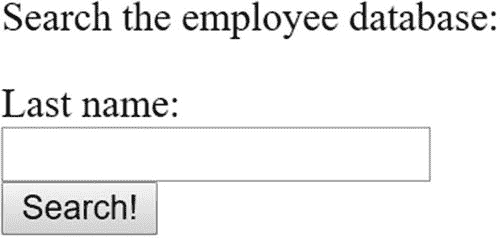
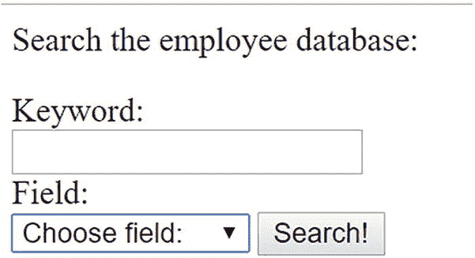
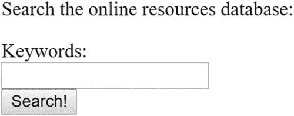

# 33.索引和搜索

第 [25](25.html) 章介绍了`PRIMARY`和`UNIQUE`键的用途，定义了每个键的作用，并向你展示了如何将它们整合到你的表格结构中。然而，索引在数据库开发中起着如此重要的作用，如果不详细讨论这个主题，这本书将是非常不完整的。本章涵盖了以下主题:

*   **数据库索引:**本章的前半部分介绍了一般的数据库索引术语和概念，并讨论了主索引、唯一索引、普通索引和全文 MySQL 索引。

*   **基于表单的搜索:**本章的后半部分将向您展示如何创建支持 PHP 的搜索接口，用于查询新索引的 MySQL 表。

## 数据库索引

*索引*是表列的有序(或索引)子集，每个行条目指向其对应的表行。一般来说，在 MySQL 数据库开发策略中引入索引有三个好处:

*   **查询优化:**数据按照输入的顺序存储在表中。但是，这个顺序可能与您想要访问它的顺序不一致。例如，假设您批量插入根据 SKU 订购的产品列表。你的在线商店访问者可能会根据名称搜索这些产品。因为当目标数据被排序(在本例中是按字母顺序)时，数据库搜索可以最有效地执行，所以除了将被频繁搜索的任何其他列之外，索引产品的名称是有意义的。

*   **唯一性:**通常，需要一种方法来标识一个数据行，该方法基于某个值或一组已知对该行唯一的值。例如，考虑一个存储雇员信息的表。该表可能包括关于每个雇员的名和姓、电话号码和社会保险号的信息。虽然两个或两个以上的雇员可能共用同一个名字(例如，John Smith)或共用同一个电话号码(例如，如果他们共用一个办公室)，但是您知道没有两个人拥有相同的社会保险号，从而保证每一行的唯一性。

*   **文本搜索:**由于有了一个称为全文索引的功能，因此可以优化对位于任何索引字段中的大量文本的搜索。

这些优势的实现要归功于四种类型的索引:主索引、惟一索引、普通索引和全文索引。本节将介绍每种类型。

### 主键索引

主键索引是关系数据库中最常见的索引类型。由于主键的唯一性，它用于唯一地标识每一行。因此，键必须是由行表示的实体唯一拥有的值，或者是其他值，如数据库在插入行时创建的自动递增的整数值。因此，不管先前存在的行是否随后被删除，每一行都将有一个唯一的主索引。例如，假设您想为公司的 IT 部门创建一个有用的在线资源数据库。用于存储这些书签的表格可能如下所示:

```php
CREATE TABLE bookmarks (
   id INT UNSIGNED NOT NULL AUTO_INCREMENT,
   name VARCHAR(75) NOT NULL,
   url VARCHAR(200) NOT NULL,
   description MEDIUMTEXT NOT NULL,
   PRIMARY KEY(id));

```

因为`id`列随着每次插入自动递增(从 1 开始),所以`bookmarks`表格不可能包含多个包含完全相同单元格的行。例如，考虑以下三个查询:

```php
INSERT INTO bookmarks (name, url, description)
       VALUES("Apress", "www.apress.com", "Computer books");
INSERT INTO bookmarks (name, url, description)
       VALUES("Google", "www.google.com", "Search engine");
INSERT INTO bookmarks (name, url, description)
       VALUES("W. Jason Gilmore", "www.wjgilmore.com", "Jason's website");

```

执行这三个查询并检索表会产生以下输出:

```php
+-------+------------------+-------------------+-----------------+
| id    | name             | url               | description     |
+------ +------------------+-------------------+-----------------+
|     1 | Apress           | www.apress.com    | Computer books  |
|     2 | Google           | www.google.com    | Search engine   |
|     3 | W. Jason Gilmore | www.wjgilmore.com | Jason's website |
+-------+------------------+-------------------+-----------------+

```

注意`id`列是如何随着每次插入而递增的，以确保行的唯一性。

### 注意

每个表只能有一个自动递增的列，并且该列必须被指定为主键。此外，任何被指定为主键的列都不能保存`NULL`值；即使没有明确声明为`NOT NULL`，MySQL 也会自动赋这个特质。主键不需要添加 NOT NULL 约束。

创建一个允许开发人员推测它所代表的行的一些信息的主索引通常是不明智的。并举例说明了原因。假设您决定使用 URL，而不是使用整数值作为`bookmarks`表的主索引。做出这样一个决定的影响应该是显而易见的。首先，如果 URL 由于商标问题或收购而改变，会发生什么？即使是社会安全号码，这个曾经被认为是独一无二的价值，也会因为身份盗窃的影响而改变。省去麻烦，总是使用主索引，它不提供对它所代表的数据的洞察；它应该是一种自主工具，唯一的目的是确保能够唯一地识别数据记录。主键不是必需的，但是如果您想引用其他表中的记录，主键是最好的方法。

### 唯一索引

像主索引一样，唯一索引可以防止创建重复值。但是，区别在于每个表只允许一个主索引，而支持多个唯一索引。考虑到这种可能性，再次考虑上一节的`bookmarks`表。虽然可以想象两个站点可以共享同一个名称——例如，“伟大的 PHP 资源”——但是重复 URL 是没有意义的。这听起来像是一个理想的唯一索引:

```php
CREATE TABLE bookmarks (
   id INT UNSIGNED AUTO_INCREMENT,
   name VARCHAR(75) NOT NULL,
   url VARCHAR(200) NOT NULL UNIQUE,
   description MEDIUMTEXT NOT NULL,
   PRIMARY KEY(id));

```

如上所述，在给定的表中，可以将多个字段指定为惟一的。例如，假设您想要防止链接存储库的贡献者在插入新网站时重复指定非描述性名称(例如，“酷站点”)。再次返回到书签表，将 name 列定义为 unique:

```php
CREATE TABLE bookmarks (
   id INT UNSIGNED AUTO_INCREMENT,
   name VARCHAR(75) NOT NULL UNIQUE,
   url VARCHAR(200) NOT NULL UNIQUE,
   description MEDIUMTEXT NOT NULL,
   PRIMARY KEY(id));

```

您还可以指定多列唯一索引。例如，假设您希望允许您的贡献者插入重复的 URL 值，甚至是重复的`name`值，但是您不希望出现重复的`name`和 URL 组合。您可以通过创建多列唯一索引来实施此类限制。重访最初的`bookmarks`表:

```php
CREATE TABLE bookmarks (
   id INT UNSIGNED AUTO_INCREMENT,
   name VARCHAR(75) NOT NULL,
   url VARCHAR(200) NOT NULL,
   UNIQUE(name, url),
   description MEDIUMTEXT NOT NULL,
   PRIMARY KEY(id));

```

给定这种配置，下面的`name`和 URL 值对可以同时驻留在同一个表中:

```php
Apress site, https://www.apress.com
Apress site, https://www.apress.com/us/blog
Blogs, https://www.apress.com
Apress blogs, https://www.apress.com/us/blog

```

然而，尝试多次插入这些组合将导致错误，因为重复的组合`name`和 URL 是非法的。

### 正常索引

您通常希望优化数据库的能力，使其能够根据列标准检索行，而不是那些被指定为主要或唯一的标准。最有效的方法是对列进行索引，使数据库能够以最快的方式查找值。这些指标通常被称为正常指标或普通指标。MySQL 为它们提供了“索引”类型。

#### 单列普通索引

如果表中的某一列将成为大量选择查询的焦点，则应该使用单列普通索引。例如，假设一个包含雇员信息的表由四列组成:唯一的行 ID、名、姓和电子邮件地址。您知道大多数搜索都是针对员工的姓氏或电子邮件地址的。您应该为姓氏创建一个普通索引，为电子邮件地址创建一个唯一索引，如下所示:

```php
CREATE TABLE employees (
   id INT UNSIGNED AUTO_INCREMENT,
   firstname VARCHAR(100) NOT NULL,
   lastname VARCHAR(100) NOT NULL,
   email VARCHAR(100) NOT NULL UNIQUE,
   INDEX (lastname),
   PRIMARY KEY(id));

```

基于这一思想，MySQL 提供了创建部分列索引的特性，其思想是给定列的前 *N* 个字符通常足以确保唯一性，其中 *N* 在索引创建语句中指定。创建部分列索引需要较少的磁盘空间，并且比索引整个列要快得多，尤其是在插入数据时。回顾前面的例子，您可以想象使用姓氏的前五个字符足以确保准确的检索:

```php
CREATE TABLE employees (
   id INT UNSIGNED AUTO_INCREMENT,
   firstname VARCHAR(100) NOT NULL,
   lastname VARCHAR(100) NOT NULL,
   email VARCHAR(100) NOT NULL UNIQUE,
   INDEX (lastname(5)),
   PRIMARY KEY(id));

```

然而，选择查询通常是包含多个列的函数。毕竟，更复杂的表可能需要由几个列组成的查询才能检索到所需的数据。通过建立多列普通索引，可以大大减少这类查询的运行时间。

#### 多列普通索引

当您知道在检索查询中将经常一起使用许多指定的列时，建议使用多列索引。MySQL 的多列索引方法是基于一种叫做*最左边前缀*的策略。最左边的前缀表示任何包含列 A、B 和 C 的多列索引都将提高涉及以下列组合的查询的性能:

*   甲、乙、丙

*   甲，乙

*   A

以下是创建多列 MySQL 索引的方法:

```php
CREATE TABLE employees (
   id INT UNSIGNED AUTO_INCREMENT,
   lastname VARCHAR(100) NOT NULL,
   firstname VARCHAR(100) NOT NULL,
   email VARCHAR(100) NOT NULL UNIQUE,
   INDEX name (lastname, firstname),
   PRIMARY KEY(id));

```

这将创建两个索引(除了主键索引之外)。第一个是电子邮件地址的唯一索引。第二个是多列索引，由两列组成，`lastname,`和`firstname`。这很有用，因为当查询涉及以下任何列组合时，它可以提高搜索速度:

*   `lastname`，`firstname`

*   `lastname`

为了说明这一点，以下查询将受益于多列索引:

```php
SELECT email FROM employees WHERE lastname="Geronimo" AND firstname="Ed";
SELECT lastname FROM employees WHERE lastname="Geronimo";

```

以下查询不会带来好处:

```php
SELECT lastname FROM employees WHERE firstname="Ed";

```

为了提高后一个查询的性能，您需要为`firstname`列创建单独的索引。

### 全文索引

全文索引为搜索存储在`CHAR`、`VARCHAR`或`TEXT`数据类型中的文本提供了一种有效的方法。在深入研究示例之前，先了解一下 MySQL 对这个索引的特殊处理的背景。在 MySQL 5.6 之前，这个特性只有在使用 MyISAM 存储引擎时才可用。现在 Innodb 引擎也支持它。

因为 MySQL 假设将实现全文搜索来筛选大量的自然语言文本，所以它提供了一种检索数据的机制，这种机制可以产生最符合用户期望的结果。更具体地说，如果用户使用类似于 *Apache 是世界上最受欢迎的 web 服务器*这样的字符串进行搜索，那么*是*而*是*这两个词在确定结果相关性方面应该起不到什么作用。事实上，MySQL 将可搜索的文本分割成单词，默认情况下会删除少于四个字符的单词。在本节的后面，您将了解如何修改这种行为。

创建全文索引与创建其他类型的索引非常相似。例如，重新访问本章前面创建的`bookmarks`表，使用全文变体索引其`description`列:

```php
CREATE TABLE bookmarks (
   id INT UNSIGNED AUTO_INCREMENT,
   name VARCHAR(75) NOT NULL,
   url VARCHAR(200) NOT NULL,
   description MEDIUMTEXT NOT NULL,
   FULLTEXT(description),
   PRIMARY KEY(id));

```

除了典型的主索引之外，这个示例还创建了一个由`description`列组成的全文索引。出于演示目的，表 [33-1](#Tab1) 给出了在`bookmarks`表中找到的数据。

表 33-1

示例表数据

<colgroup><col class="tcol1 align-left"> <col class="tcol2 align-left"> <col class="tcol3 align-left"> <col class="tcol4 align-left"></colgroup> 
| 

编号

 | 

名字

 | 

全球资源定位器(Uniform Resource Locator)

 | 

描述

 |
| --- | --- | --- | --- |
| one | Python.org | [T2`https://www.python.org`](https://www.python.org) | Python 官方网站 |
| Two | MySQL 手动 | [T2`https://dev.mysql.com/doc`](https://dev.mysql.com/doc) | MySQL 参考手册 |
| three | 阿帕奇网站 | [T2`https://httpd.apache.org`](https://httpd.apache.org) | 包括 Apache 2 手册 |
| four | PHP:超文本 | [T2`https://www.php.net`](https://www.php.net) | PHP 官方网站 |
| five | 阿帕奇周 | [T2`http://www.apacheweek.com`](http://www.apacheweek.com) | 提供专门的 Apache 2 部分 |

创建全文索引与创建其他类型的索引非常相似，而基于全文索引的检索查询则不同。当基于全文索引检索数据时，`SELECT`查询使用两个特殊的 MySQL 函数，`MATCH()`和`AGAINST()`。使用这些函数，可以对全文索引执行自然语言搜索，如下所示:

```php
SELECT name,url FROM bookmarks WHERE MATCH(description) AGAINST('Apache 2');

```

返回的结果如下所示:

```php
+-------------+----------------------------+
| name        | url                        |
+------------------------------------------+
| Apache site | https://httpd.apache.org   |
| Apache Week | http://www.apacheweek.com  |
+-------------+----------------------------+

```

这列出了在`description`列中找到 *Apache* 的行，按照相关性最高的顺序排列。记住 *2* 因其长度而被忽略。为了说明这一点，您可以从第 3 行和/或第 5 行的 description 列中删除数字 2，然后再次运行相同的查询。你会得到同样的结果。当在`WHERE`子句中使用`MATCH()`时，根据返回的行与搜索字符串的匹配程度来定义相关性。或者，可以将函数合并到查询体中，返回匹配行的加权分数列表；分数越高，相关性越大。下面是一个例子:

```php
SELECT MATCH(description) AGAINST('Apache 2') FROM bookmarks;

```

执行时，MySQL 将搜索`bookmarks`表中的每一行，计算每一行的相关性值，如下所示:

```php
+----------------------------------------+
| match(description) against('Apache 2') |
+----------------------------------------+
|                                      0 |
|                                      0 |
|                       0.57014514171969 |
|                                      0 |
|                       0.38763393589171 |
+----------------------------------------+

```

您还可以利用一个称为*查询扩展*的特性，这在用户做出某些假设时特别有用，否则这些假设可能不需要内置到应用程序的搜索逻辑中。例如，假设用户正在搜索词语*足球*。从逻辑上来说，包括匹兹堡钢人队、俄亥俄州七叶树队和伍迪·海耶斯等术语的行也会引起他的兴趣。为了弥补这一点，您可以包含`WITH QUERY EXPANSION`子句，该子句将首先检索包含词语 *football* 的所有行，然后再次搜索所有行，这次检索包含在第一组结果的行中找到的任何单词的所有行。

因此，回到示例，如果在第一次搜索中找到的一行包含术语*足球*和*匹兹堡*，那么在第二次搜索中将检索到包含*匹兹堡*的一行，即使它不包含术语*足球*。虽然这肯定会导致更彻底的搜索，但它可能会产生意想不到的副作用，例如返回一行，因为其中包含术语 *Pittsburgh* ，但与足球毫无关系。

还可以执行面向布尔的全文搜索。本节稍后将介绍该功能。

#### 停止言语

如前所述，默认情况下，MySQL 会忽略任何少于四个字符的关键字。这些词，以及那些在 MySQL 服务器内置的预定义列表中找到的词，被称为*停用词*，或者应该被忽略的词。通过修改以下 MySQL 变量，您可以对停用词行为进行很好的控制:

*   不符合特定长度的单词可以作为停用词。您可以使用此参数指定所需的最小长度。如果更改这个参数，您需要重启 MySQL 服务器守护进程并重建索引。

*   `ft_max_word_len`:你也可以将停用词定义为任何超过特定长度的词。您可以使用此参数指定该长度。如果更改这个参数，您需要重启 MySQL 服务器守护进程并重建索引。

*   `ft_stopword_file`:分配给该参数的文件包含一个 544 个英文单词的列表，这些单词会自动从任何搜索关键字中过滤出来。通过将该参数设置为所请求列表的路径和名称，可以将其更改为指向另一个列表。或者，如果您可以选择重新编译 MySQL 源代码，您可以通过打开`myisam/ft_static.c`并编辑预定义的列表来修改这个列表。在第一种情况下，您需要重启 MySQL 并重建索引，而在第二种情况下，您需要根据您的规范重新编译 MySQL 并重建索引。

可以使用以下命令显示这些和其他与停用字相关的变量的默认值:

```php
show variables where variable_name like 'ft_%';
+--------------------------+----------------+
| Variable_name            | Value          |
+--------------------------+----------------+
| ft_boolean_syntax        | + -><()~*:""&| |
| ft_max_word_len          | 84             |
| ft_min_word_len          | 4              |
| ft_query_expansion_limit | 20             |
| ft_stopword_file         | (built-in)     |
+--------------------------+----------------+

```

### 注意

MySQL 索引的重建是通过命令 REPAIR TABLE table_name `QUICK`完成的，其中`table_name`表示您想要重建的表的名称。

默认情况下，停用词被忽略的原因是，它们在普通语言中出现得过于频繁，可能被认为是不相关的。这可能会产生意想不到的效果，因为 MySQL 还会自动过滤掉在超过 50%的记录中存在的任何关键字。例如，考虑一下如果所有贡献者都添加了一个与 Apache Web 服务器相关的 URL，并且都在描述中包含单词`Apache`会发生什么。执行全文搜索来查找术语`Apache`将会产生意想不到的结果:没有找到记录。如果您正在处理一个小的结果集，或者由于其他原因需要忽略这种默认行为，请使用 MySQL 的布尔全文搜索功能。

#### 布尔全文搜索

布尔全文搜索对搜索查询提供了更细粒度的控制，允许您明确地确定哪些词应该出现在候选结果中，哪些词不应该出现在候选结果中(但是，在执行布尔全文搜索时，停用词列表仍然适用)。例如，布尔全文搜索可以检索包含单词 *Apache* 的行，但不能检索包含单词 *Navajo* 、 *Woodland* 或 *Shawnee* 的行。同样，您可以确保结果至少包含一个关键字、所有关键字或不包含关键字；您可以自由地对返回的结果进行大量的过滤控制。这种控制是通过许多公认的布尔运算符来维护的。表 [33-2](#Tab2) 中列出了其中几个操作符。

表 33-2

全文搜索布尔运算符

<colgroup><col class="tcol1 align-left"> <col class="tcol2 align-left"></colgroup> 
| 

操作员

 | 

描述

 |
| --- | --- |
| `+` | 前导加号确保每个结果行中都出现随后的单词。 |
| `–` | 前导减号确保随后的单词不会出现在返回的任何行中。 |
| `*` | 尾部星号允许关键字变化，前提是变化以前面单词指定的字符串开始。 |
| `" "` | 双引号可以确保结果行包含括起来的字符串，与输入的字符串完全一样。 |
| `< >` | 前面的大于号和小于号分别用于减少和增加后续单词与搜索排名的相关性。 |
| `( )` | 括号用于将单词分组为子表达式。 |

考虑几个例子。第一个例子返回包含 *Apache* 的行，但不包含 *manual* :

```php
SELECT name,url FROM bookmarks WHERE MATCH(description)
   AGAINST('+Apache -manual' in boolean mode);

```

下一个示例返回包含单词 *Apache* 的行，但不包含 *Shawnee* 或 *Navajo* 的行:

```php
SELECT name, url FROM bookmarks WHERE MATCH(description)
   AGAINST('+Apache -Shawnee -Navajo' in boolean mode);

```

最后一个示例返回包含 *web* 和*脚本*，或者 *php* 和*脚本*的行，但是 *web 脚本*的排名低于 *php 脚本*:

```php
SELECT name, url FROM bookmarks WHERE MATCH(description)
   AGAINST('+(<web >php) +scripting');

```

请注意，只有当您将`ft_min_word_len`变量降低到`3`时，最后一个示例才会起作用。

只要数据集大小合理，在关系数据库上执行的搜索操作就可以工作，而关系数据库从来不是为搜索而设计或优化的。其他系统如 ElasticSearch 更适合搜索大量结构化或非结构化数据。

### 索引最佳实践

下面的列表提供了一些在将索引合并到数据库开发策略中时应该始终牢记的提示:

*   仅索引那些在`WHERE`和`ORDER BY`子句中需要的列。大量索引列只会导致不必要的硬盘空间消耗，并且在更改表信息时实际上会降低性能。索引表上的性能会下降，因为每次记录更改时，索引都必须更新。

*   如果你创建了一个像`INDEX(firstname, lastname)`这样的索引，不要创建`INDEX(firstname)`，因为 MySQL 能够搜索索引前缀。但是，请记住，只有前缀是相关的；这种多列索引不适用于仅针对`lastname`的搜索。

*   使用`--log-long-format`选项记录不使用索引的查询。然后，您可以检查该日志文件，并相应地调整您的查询。

*   `EXPLAIN`语句帮助您确定 MySQL 将如何执行查询，向您展示如何以及以什么顺序连接表。这对于确定如何编写优化的查询以及是否应该添加索引非常有用。请查阅 MySQL 手册，了解关于`EXPLAIN`语句的更多信息。

## 基于表单的搜索

使用超链接轻松深入网站的能力是使 Web 成为如此受欢迎的媒体的行为之一。然而，随着网站和 Web 的规模呈指数级增长，基于用户提供的关键字执行搜索的能力从便利发展为必要。本节提供了几个例子，展示了构建搜索 MySQL 数据库的搜索界面是多么容易。

### 执行简单搜索

许多有效的搜索界面只包含一个文本字段。例如，假设您希望为人力资源部门提供按姓氏查找员工联系信息的功能。为了实现这个任务，查询将检查在`employees`表中找到的`lastname`列。图 [33-1](#Fig1) 显示了这样做的示例界面。



图 33-1

一个简单的搜索界面

清单 [33-1](#PC22) 实现了这个接口，将请求的姓氏传递给搜索查询。如果返回的行数大于零，则输出每一行；否则，会提供适当的消息。

```php
<p>
Search the employee database:<br />
<form action="search.php" method="post">
   Last name:<br>
   <input type="text" name="lastname" size="20" maxlength="40" value=""><br>
   <input type="submit" value="Search!">
</form>
</p>

<?php

   // If the form has been submitted with a supplied last name
   if (isset($_POST['lastname'])) {

      // Connect to server and select database

      $db = new mysqli("localhost", "websiteuser", "secret", "chapter36");

      // Query the employees table
      $stmt = $db->prepare("SELECT firstname, lastname, email FROM employees
                            WHERE lastname like ?");

      $stmt->bind_param('s', $_POST['lastname']);

      $stmt->execute();

      $stmt->store_result();

      // If records found, output them
      if ($stmt->num_rows > 0) {

        $stmt->bind_result($firstName, $lastName, $email);

        while ($stmt->fetch())
          printf("%s, %s (%s)<br />", $lastName, $firstName, $email);
      } else {
         echo "No results found.";
      }

   }
?>

Listing 33-1Searching the Employee Table (search.php

)

```

因此，在搜索界面中输入`Gilmore`将会返回如下结果:

```php
Gilmore, Jason (gilmore@example.com)

```

### 扩展搜索功能

虽然这个简单的搜索界面是有效的，但是如果用户不知道员工的姓氏会怎么样呢？如果用户知道另一条信息，比如电子邮件地址，该怎么办？清单 [33-2](#PC24) 修改了原来的例子，这样它就可以处理来自图 [33-2](#Fig2) 中描述的表单的输入。



图 33-2

修订后的搜索表单

```php
<p>
Search the employee database:<br>
<form action="search2.php" method="post">
   Keyword:<br>
   <input type="text" name="keyword" size="20" maxlength="40" value=""><br>
   Field:<br>
   <select name="field">
      <option value="">Choose field:</option>
      <option value="lastname">Last Name</option>
      <option value="email">E-mail Address</option>
      </select>
   <input type="submit" value="Search!" />
</form>
</p>

<?php
   // If the form has been submitted with a supplied keyword
   if (isset($_POST['field'])) {

      // Connect to server and select database
      $db = new mysqli("localhost", "websiteuser", "secret", "chapter36");

      // Create the query
      if ($_POST['field'] == "lastname") {
         $stmt = $db->prepare("SELECT firstname, lastname, email
                               FROM employees WHERE lastname like ?");
      } elseif ($_POST['field'] == "email") {
         $stmt = $db->prepare("SELECT firstname, lastname, email
                               FROM employees WHERE email like ?");
      }

      $stmt->bind_param('s', $_POST['keyword']);

      $stmt->execute();

      $stmt->store_result();

      // If records found, output them
      if ($stmt->num_rows > 0) {

        $stmt->bind_result($firstName, $lastName, $email);

        while ($stmt->fetch())
          printf("%s, %s (%s)<br>", $lastName, $firstName, $email);

      } else {
        echo "No results found.";
      }
   }
?>

Listing 33-2Extending the Search Capabilities (searchextended.php

)

```

因此，将该字段设置为`E-mail Address`并输入`gilmore@example.com`作为关键字，将会返回类似如下的结果:

```php
Gilmore, Jason (gilmore@example.com)

```

当然，在这两个示例中，您需要放置额外的控件来净化数据，并确保用户在提供无效输入时收到详细的响应。然而，基本的搜索过程应该是显而易见的。

### 执行全文搜索

执行全文搜索实际上与执行任何其他选择查询没有什么不同；只有查询看起来不同，这个细节对用户是隐藏的。例如，清单 [33-3](#PC26) 实现了图 [33-3](#Fig3) 中描述的搜索接口，演示了如何搜索`bookmarks`表的`description`列。



图 33-3

全文搜索界面

```php
<p>
Search the online resources database:<br>
<form action="fulltextsearch.php" method="post">
   Keywords:<br>
   <input type="text" name="keywords" size="20" maxlength="40" value=""><br>
   <input type="submit" value="Search!">
</form>
</p>

<?php

   // If the form has been submitted with supplied keywords
   if (isset($_POST['keywords'])) {

      // Connect to server and select database
      $db = new mysqli("localhost", "websiteuser", "secret", "chapter36");

      // Create the query
      $stmt = $db->prepare("SELECT name, url FROM bookmarks
                          WHERE MATCH(description) AGAINST(?)");

      $stmt->bind_param('s', $_POST['keywords']);

      $stmt->execute();

      $stmt->store_result();

      // Output retrieved rows or display appropriate message
      if ($stmt->num_rows > 0) {

        $stmt->bind_result($url, $name);

        while ($result->fetch)
          printf("<a href='%s'>%s</a><br />", $url, $name);
      } else {
          printf("No results found.");
      }
   }
?>

Listing 33-3Implementing Full-Text Search

```

为了扩展用户的全文搜索能力，可以考虑提供一个演示 MySQL 布尔搜索特性的帮助页面。

## 摘要

表索引是优化查询的可靠方法。本章介绍了表索引，并向您展示了如何创建主索引、唯一索引、普通索引和全文索引。然后，您了解到创建支持 PHP 的搜索界面来查询 MySQL 表是多么容易。

下一章将介绍 MySQL 的事务处理特性，并向您展示如何将事务整合到您的 web 应用程序中。