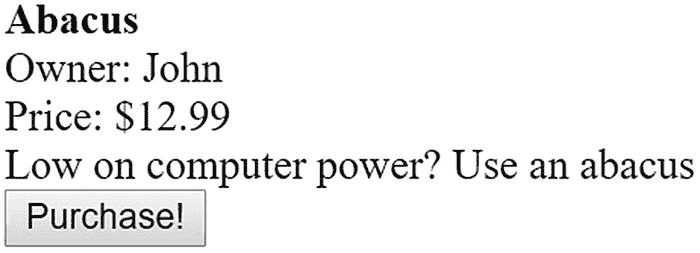

# 34.处理

本章介绍了 MySQL 的事务处理能力，并演示了如何通过 MySQL 客户端和从 PHP 脚本中执行事务。根据本文的结论，您将对事务有一个大致的了解，它们是如何被 MySQL 实现的，以及如何将它们整合到您的 PHP 应用程序中。

## 什么是交易？

*事务*是一组有序的数据库操作，它们被视为一个单元。如果组中的所有操作都成功，则认为交易成功，如果甚至一个操作失败，则认为交易不成功。如果所有操作成功完成，该事务将被*提交*，并且它的更改将对所有其他数据库进程可用。如果某项操作失败，该事务将*回滚*，构成该事务的所有操作的效果将被取消。

在事务过程中实现的任何改变将仅对拥有该事务的线程可用，并且将保持如此，直到那些改变确实被提交。这可以防止其他线程潜在地利用可能由于回滚而很快被否定的数据，这将导致数据完整性的破坏。

事务处理能力是企业数据库的关键部分，因为许多业务流程由多个步骤组成。举个例子，一个客户试图执行在线购买。结账时，顾客的购物车将与现有库存进行比较，以确保可用性。接下来，客户必须提供他们的账单和运输信息，此时他们的信用卡将被检查是否有必要的可用资金，然后被记入借方。接下来，将相应地扣除产品库存，并将未决订单通知给运输部门。如果这些步骤中的任何一个失败了，那么它们都不应该发生。想象一下，当客户得知他们的信用卡已经被扣款，而产品却因为库存不足而从未到达时，他会多么沮丧。同样，如果信用卡无效或者没有提供足够的运输信息，您也不会想要扣除库存或者运输产品。数据的收集(购物车、信用卡信息等。)不应包含在完成销售的实际事务中，因为这将导致在事务发生时受影响的表和行被锁定以进行读写。

用更专业的术语来说，一项交易是由其遵循四个原则的能力来定义的，体现在缩写词 *ACID* 中。这里定义了交易流程的四个支柱:

*   **原子性:**交易的所有步骤必须成功完成；否则，不会提交任何步骤。

*   **一致性:**交易的所有步骤必须成功完成；否则，所有数据都将恢复到事务开始前的状态。

*   **隔离:**任何尚未完成的交易执行的步骤必须保持与系统隔离，直到交易被视为完成。

*   **持久性:**所有提交的数据必须由系统保存，以便在系统出现故障时，数据可以成功恢复到有效状态。

随着您在本章中对 MySQL 的事务支持了解得越来越多，您将会理解必须遵循这些原则来确保数据库的完整性。

## MySQL 的事务处理能力

MySQL 的两个存储引擎支持事务:InnoDB 和 NDB。InnoDB 在第 [25 章](25.html)中介绍过，NDP 不在本书讨论范围之内。本节解释应用于 InnoDB 的事务。它首先讨论了 InnoDB 处理程序可用的系统要求和配置参数，最后给出了一个详细的使用示例和一系列使用 InnoDB 事务时需要记住的技巧。这一节为本章的最后一部分打下了基础，在这一部分中，您将学习如何将事务处理能力整合到您的 PHP 应用程序中。

### 系统需求

本章重点介绍受流行的 InnoDB 存储引擎支持的事务。InnoDB 是启用的，并且是大多数系统上的默认存储引擎，除非您从源代码编译了 MySQL 并省略了它。您可以通过执行以下命令来验证 InnoDB 表是否可用:

```php
mysql>show variables like '%have_inn%';

```

您应该看到以下内容:

```php
+-----------------------+
| Variable_name | Value |
+-----------------------+
| have_innodb    | YES  |
+-----------------------+
1 row in set (0.00 sec)

```

或者，您可以使用`SHOW ENGINES;`命令查看 MySQL 服务器支持的所有存储引擎。

### 表格创建

创建 InnoDB 类型的表实际上与创建任何其他类型的表没有什么不同。事实上，这种表类型在所有平台上都是默认的，这意味着创建 InnoDB 表不需要任何特殊操作。您所需要做的就是使用`CREATE TABLE`语句创建您认为合适的表格。如果您希望在创建表时更加明确，可以像这样添加引擎关键字:

```php
CREATE TABLE customers (
   id SMALLINT UNSIGNED AUTO_INCREMENT PRIMARY KEY,
   name VARCHAR(255) NOT NULL
   ) ENGINE=InnoDB;

```

一旦被创建，一个`*.frm`文件(在这个例子中，是一个`customers.frm`文件)被存储在各自的数据库目录中，其位置由 MySQL 的`datadir`参数表示，并在守护进程启动时定义。该文件包含 MySQL 所需的数据字典信息。然而，与 MyISAM 表不同，InnoDB 引擎要求将所有 InnoDB 数据和索引信息存储在一个表空间中。这个表空间实际上可以由许多不同的文件(甚至是原始磁盘分区)组成，它们默认位于 MySQL 的`datadir`目录中。这是一个非常强大的特性——这意味着，只需根据需要将新文件连接到表空间，就可以创建远远超过许多操作系统所规定的最大允许文件大小的数据库。所有这些行为取决于您如何定义相关的 InnoDB 配置参数，接下来将介绍这些参数。

### 注意

您可以通过修改`innodb_data_home_dir`参数来更改表空间的默认位置。

## 一个示例项目

为了让您确切了解 InnoDB 表的行为，本节将通过一个从命令行执行的简单事务示例来指导您。这个例子展示了两个旧物交换参与者如何将一件物品兑换成现金。在检查代码之前，花点时间查看一下伪代码:

1.  参与者 Jason 请求一个项目，比如位于参与者 Jon 的虚拟行李箱中的算盘。

2.  参与者 Jason 向参与者 Jon 的账户转账 12.99 美元。这样做的结果是借记杰森的账户，贷记乔恩的账户。

3.  算盘的所有权转移给杰森。

如你所见，这个过程的每一步对整个手术的成功都是至关重要的。您将把这个过程变成一个事务，以确保数据不会因为一个步骤的失败而被破坏。尽管在实际场景中还有其他步骤，比如确保购买参与者拥有足够的资金，但是在这个示例中，这个过程保持简单，以便不偏离主题。

### 创建表和添加示例数据

要跟进项目，请创建下表并添加后面的示例数据。

#### 参与者表

该表存储了每个交换会议参与者的信息，包括他们的姓名、电子邮件地址和可用现金:

```php
CREATE TABLE participants (
   id SMALLINT UNSIGNED AUTO_INCREMENT PRIMARY KEY,
   name VARCHAR(35) NOT NULL,
   email VARCHAR(45) NOT NULL,
   cash DECIMAL(5,2) NOT NULL
   ) ENGINE=InnoDB;

```

#### 行李箱桌子

此表存储参与者拥有的每件物品的信息，包括所有者、名称、描述和价格:

```php
CREATE TABLE trunks (
   id SMALLINT UNSIGNED AUTO_INCREMENT PRIMARY KEY,
   owner SMALLINT UNSIGNED NOT NULL REFERENCES participants(id),
   name VARCHAR(25) NOT NULL,
   price DECIMAL(5,2) NOT NULL,
   description MEDIUMTEXT NOT NULL
   ) ENGINE=InnoDB;

```

#### 添加一些示例数据

接下来，向两个表中添加几行数据。为了简单起见，添加两个参与者 Jason 和 Jon，并为他们各自的行李箱添加一些物品:

```php
mysql>INSERT INTO participants SET name="Jason", email="jason@example.com",
                                  cash="100.00";
mysql>INSERT INTO participants SET name="Jon", email="jon@example.com",
                                  cash="150.00";
mysql>INSERT INTO trunks SET owner=2, name="Abacus", price="12.99",
                            description="Low on computing power? Use an abacus!";
mysql>INSERT INTO trunks SET owner=2, name="Magazines", price="6.00",
                            description="Stack of computer magazines.";
mysql>INSERT INTO trunks SET owner=1, name="Used Lottery ticket", price="1.00",
                            description="Great gift for the eternal optimist.";

```

### 执行示例事务

通过发出`START TRANSACTION`命令开始交易过程:

```php
mysql>START TRANSACTION;

```

### 注意

命令`BEGIN`是`START TRANSACTION`的别名。尽管两者完成的任务相同，但建议您使用后者，因为它符合 SQL-99 语法。

接下来，从 Jason 的账户中扣除 12.99 美元:

```php
mysql>UPDATE participants SET cash=cash-12.99 WHERE id=1;

```

接下来，将 12.99 美元记入乔恩的账户:

```php
mysql>UPDATE participants SET cash=cash+12.99 WHERE id=2;

```

接下来，将算盘的所有权转让给 Jason:

```php
mysql>UPDATE trunks SET owner=1 WHERE name="Abacus" AND owner=2;

```

花点时间检查一下`participants`表，确保现金金额已经正确记入借方和贷方:

```php
mysql>SELECT * FROM participants;

```

这将返回以下结果:

```php
+-------+-------+-------------------+----------+
| id    | name  | email             | cash     |
+-------+-------+-------------------+----------+
|     1 | Jason | jason@example.com |  87.01   |
|     2 | Jon   | jon@example.com   | 162.99   |
+-------+-------+-------------------+----------+

```

还需要花点时间检查一下 trunks 表；你会发现算盘的所有权确实变了。但是，请记住，因为 InnoDB 表必须遵循 ACID 原则，所以这种更改目前只对执行事务的线程可用。为了说明这一点，启动第二个 mysql 客户端，再次登录并切换到`corporate`数据库。查看`participants`表。你会看到参与者各自的现金价值保持不变。检查`trunks`表也会显示算盘的所有权没有改变。这是因为酸性测试的隔离部分。在您`COMMIT`更改之前，事务处理过程中所做的任何更改都不会对其他线程可用。

尽管这些更新确实工作正常，但假设有一个或几个没有正常工作。返回第一个客户端窗口，通过发出命令`ROLLBACK`取消更改:

```php
mysql>ROLLBACK;

```

现在再次执行`SELECT`命令:

```php
mysql>SELECT * FROM participants;

```

这将返回:

```php
+-------+-------+-------------------+--------+
| id    | name  | email             | cash   |
+-------+-------+-------------------+--------+
|     1 | Jason | jason@example.com | 100.00 |
|     2 | Jon   | jon@example.com   | 150.00 |
+-------+-------+-------------------+--------+

```

请注意，参与者的现金持有量已被重置为其原始值。检查`trunks`表也会显示算盘的所有权没有改变。尝试重新重复上述过程，这次使用`COMMIT`命令提交更改，而不是回滚。一旦事务被提交，再次返回到第二个客户机并检查这些表；您将看到提交的更改立即可用。

### 注意

您应该意识到，在发出`COMMIT`或`ROLLBACK`命令之前，事务序列中发生的任何数据更改都不会生效。这意味着，如果 MySQL 服务器在提交更改之前崩溃，更改将不会发生，您需要启动事务系列来使这些更改发生。

下一节“用 PHP 构建事务性应用程序”将使用 PHP 脚本重新创建这个过程。

### 使用技巧

以下是使用 MySQL 事务时需要记住的一些提示:

*   发出`START TRANSACTION`命令等同于将`AUTOCOMMIT`变量设置为`0`。默认值是`AUTOCOMMIT=1`，这意味着每条语句一旦成功执行就会被提交。这就是用`START TRANSACTION`命令开始事务的原因——因为您不希望事务的每个组成部分都在执行时提交。

*   只有当整个流程的成功执行至关重要时，才使用事务。例如，将产品添加到购物车的过程非常关键；浏览所有可用的产品不是。在设计表时要考虑这些问题，因为这无疑会影响性能。

*   您不能回滚数据定义语言语句；也就是说，用于创建或删除数据库，或者创建、删除或更改表的任何语句。

*   事务不能嵌套。在一个`COMMIT`或`ROLLBACK`之前发出多个`START TRANSACTION`命令将不起作用。

*   如果在事务处理过程中更新非事务性表，然后通过发出 ROLLBACK 来结束该事务，将会返回一个错误，通知您非事务性表将不会回滚。

*   通过备份二进制日志文件，定期拍摄 InnoDB 数据和日志的快照，并使用`mysqldump`拍摄每个表中数据的快照。二进制日志文件作为增量备份，可以应用于以前的备份，以便在必须从备份恢复数据库时将数据库前滚到给定点。

## 用 PHP 构建事务性应用程序

将 MySQL 的事务能力集成到 PHP 应用程序中真的不是什么大事；您只需要记住在适当的时候启动事务，然后在相关操作完成后提交或回滚事务。在本节中，您将了解这是如何实现的。学完本课程后，您应该熟悉将这一重要功能整合到您的应用程序中的一般过程。

### 旧地重游

在本例中，您将重新创建之前演示的交换会议场景，这次使用 PHP。尽量减少不相关的细节；该页面将显示一个产品，并向用户提供将该商品添加到购物车的方法；它可能看起来类似于图 [34-1](#Fig1) 中所示的截图。



图 34-1

典型的产品展示

点击购买！按钮会把用户带到一个`purchase.php`脚本。传递一个变量，即`$_POST['itemid']`。将该变量与一些用于检索适当的`participants`和`trunks`行主键的假设类方法结合使用，您可以使用 MySQL 事务将产品添加到数据库中，并相应地扣除和贷记参与者的账户。

为了执行这个任务，使用`mysqli`扩展的事务性方法，第 27 章[第一次介绍了这些方法。清单](27.html) [34-1](#PC16) 包含代码(`purchase.php`)。如果您不熟悉这些方法，请在继续之前花点时间参考第 [3](03.html) 章中的相关章节进行快速回顾。

```php
<?php

   // Give the POSTed item ID a friendly variable name
   $itemID = filter_var($_POST['itemid'], FILTER_VALIDATE_INT);
   $participant = new Participant();
   $buyerID = $participant->getParticipantKey();

   // Retrieve the item seller and price using some fictitious item class
   $item = new Item();
   $sellerID = $item->getItemOwner($itemID);
   $price = $item->getPrice($itemID);

   // Instantiate the mysqli class
   $db = new mysqli("localhost","website","secret","chapter34");

   // Disable the autocommit feature
   $db->autocommit(FALSE);

   // Debit buyer's account

   $stmt = $db->prepare("UPDATE participants SET cash = cash - ? WHERE id = ?");

   $stmt->bind_param('di', $price, $buyerID);

   $stmt->execute();

   // Credit seller's account
   $query = $db->prepare("UPDATE participants SET cash = cash + ? WHERE id = ?");

   $stmt->bind_param('di', $price, $sellerID);

   $stmt->execute();

   // Update trunk item ownership. If it fails, set $success to FALSE
   $stmt = $db->prepare("UPDATE trunks SET owner = ? WHERE id = ?");

   $stmt->bind_param('ii', $buyerID, $itemID);

   $stmt->execute();

   if ($db->commit()) {
      echo "The swap took place! Congratulations!";
   } else {
      echo "There was a problem with the swap!";
   }

?>

Listing 34-1Swapping Items with purchase.php

```

如您所见，在事务的每一步执行之后，都会检查查询的状态和受影响的行。如果任何一次失败，`$success`被设置为`FALSE`,所有步骤在脚本结束时回滚。当然，您可以优化这个脚本，以锁步方式启动每个查询，每个查询只在确定前面的查询实际上已经正确执行之后才发生，但这留给您作为练习。

MySQL 也支持`rollback`命令。当在事务中发出时，数据库将撤消自事务开始以来的所有命令。如果在处理事务的过程中出现错误，通常会使用这种方法。与其提交不完整的值，不如回滚。

## 摘要

在对业务流程建模时，数据库事务非常有用，因为它们有助于确保组织最有价值的资产(信息)的完整性。如果您谨慎地使用数据库事务，在构建数据库驱动的应用程序时，它们是一笔巨大的资产。

在下一章也是最后一章，您将学习如何使用 MySQL 的默认实用程序导入和导出大量数据。此外，您将看到如何使用 PHP 脚本格式化基于表单的信息，以便通过电子表格应用程序(如 Microsoft Excel)进行查看。