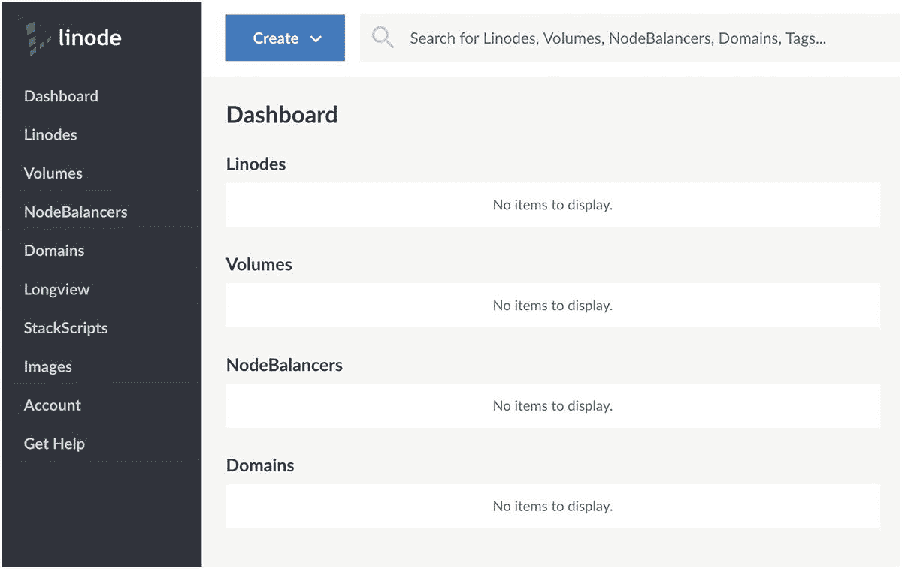
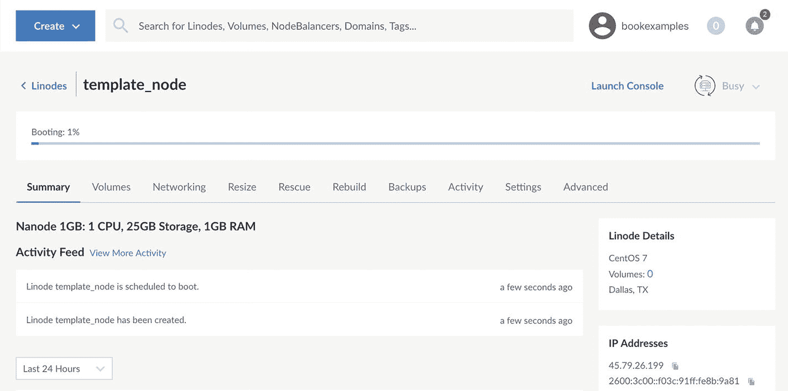
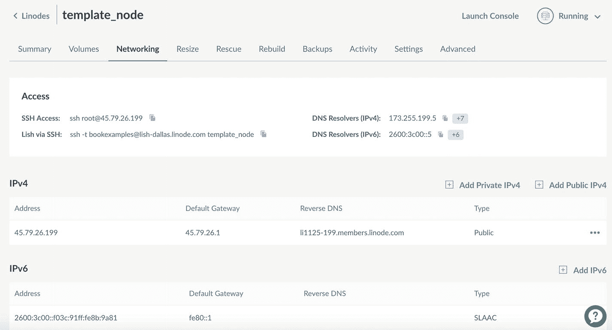
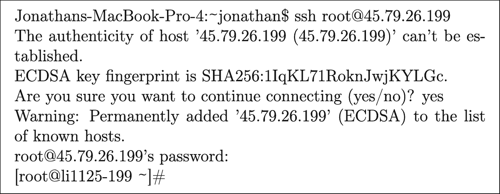
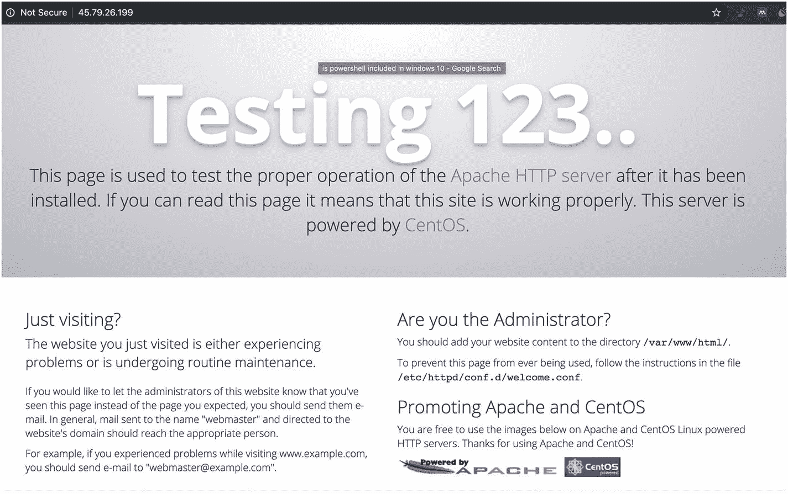
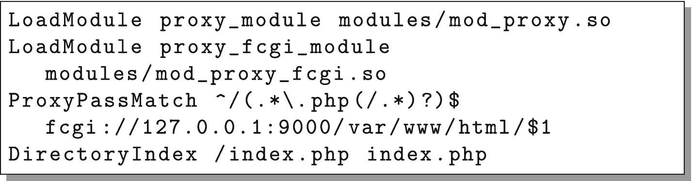
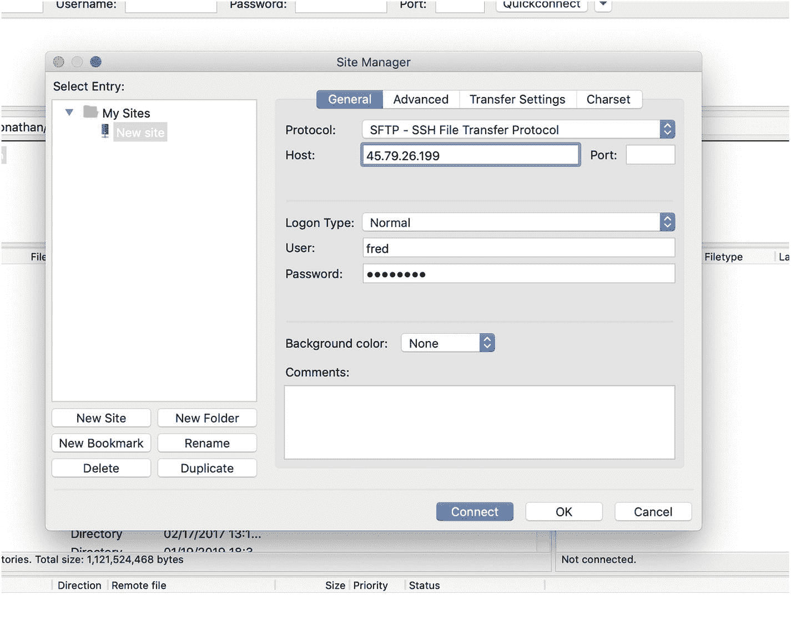

# 3.设置云服务器

与大多数云提供商一样，在 Linode 上设置云服务器极其简单。本章通过截图向您展示了启动和运行的基本过程。

## 3.1 创建虚拟服务器

如果你是一名网站开发人员或管理者，希望你可以不太麻烦地注册 Linode 服务。它需要预先准备一张信用卡，但是你会发现运行这本书里所有东西的费用可能比这本书本身要少，假设当你用完它们的时候你关闭了你的服务。

在继续之前，请立即在 Linode 创建您的帐户。

在您注册并登录之后，Linode 会将您带到您的仪表板，它看起来应该类似于图 [3-1](#Fig1) 。



图 3-1

Linux 仪表板

您目前没有进行任何设置，因此您的仪表板相当空。要开始，请单击“创建”按钮。Linode 将他们的虚拟服务器称为“节点”或“Linodes”，因此选择“Linode”来创建一台新机器。

然后，Linode 会问您几个问题，以帮助您配置要使用的节点。虽然有许多好的选择，但为了能够跟随这本书，请使用这里的一些:

1.  在“选择发行版”下，选择“CentOS 7”

2.  在“区域”下，您选择什么并不重要，但是您每次都必须选择相同的区域，以便您的服务器能够相互通信。这本书将使用“德克萨斯州达拉斯”的设施。

3.  在“Linode 计划”中，最便宜的是“Nanode 1GB”计划，它足以满足我们的目的。在撰写本文时，这项计划每小时的运行成本不到 1 美分。

4.  在“Linode Label”下，我们将称这台机器为`template_node`。

5.  您可以忽略“添加标签”部分。当您有很多机器时，标签对于将它们分组在一起很有用。

6.  在“Root Password”下，为该机器添加一个密码。请确保密码是安全的，因为有很多黑客只是到处尝试不同的 root 帐户密码。每月有 50，000 次这样的黑客攻击并不罕见。

7.  目前，你可以保持“可选附件”不变。我们将在本书的后面处理备份和私有 IP 地址。

完成所有这些设置后，点击“创建”按钮，Linode 将开始构建您的机器。Linode 会将你带到你的机器的仪表板上，除了别的以外，它还会有一个进度条和一个“活动提要”(见图 [3-2](#Fig2) )。当进度条完成时，您现在是云中一个新服务器的骄傲的所有者了！



图 3-2

您的新节点的仪表板

### 选择服务器

Linode 根据(a)服务器将服务的工作负载类型和(b)服务器自带的内存大小对服务器进行分类。工作负载类型有“Nanode”(超小型和超廉价的实例)、“Standard”(平衡的 CPU/RAM)、“Dedicated CPU”和“High Memory”(也有“GPU”，但这些是针对与这里考虑的完全不同类型的云计算)。

在每种工作负载下，服务器都是根据它们附带的内存量来命名的。你猜对了，一个“Linode 4GB”配有 4GB 内存。它还将指定有多少个虚拟 CPU 和多少磁盘空间。通常，内存量的增长速度比内核数量的增长速度快，考虑到内存通常是比 CPU 能力更强的限制因素，这是有道理的。它们各自也有不同数量的磁盘空间，但是我认为磁盘空间是次要的考虑因素，因为第 [8](08.html) 章将展示如何建立一个具有无限可用磁盘空间的服务。

在选择生产服务器时，出于今后将变得更加清楚的原因，我通常为数据库选择相当大的规模(因为它们更难复制)，为 web 服务器选择低到中等的规模(因为我可以通过添加更多的服务器来轻松增加容量)。

## 3.2 登录并四处查看

所以，你有一台机器，但是它在哪里，你如何访问它？

单击仪表板上的“网络”选项卡。它看起来应该类似于图 [3-3](#Fig3) 。在“访问”下，有一个标题为“SSH 访问”的区域这里有您需要在命令行中键入的命令，以便登录。使用您为节点创建的密码登录。



图 3-3

网络选项卡

### 命令行？那是什么？

命令行是访问计算机的老派方式。在漂亮的图形界面出现之前很久，人们通过打字与电脑互动。对于许多事情来说，*尤其是对于与系统管理相关的任务来说，*命令行仍然是管理系统的最佳方式。

如果您对命令行没有任何经验，请不要担心！这本书并不假设你有这方面的专业知识，并将引导你完成每一步。如果你只是想弄清楚如何*进入*命令行，这里是你在每个主要操作系统中要做的事情:

*   **Windows 10** : Windows 实际上有*两个*命令行系统。旧的“命令提示符”(`cmd.exe`)和新的 PowerShell。只需点击 Windows 图标并输入`PowerShell`即可开始。您将至少需要 2018 年 4 月的更新，以便在没有进一步设置的情况下运行此处的命令。

*   **MacOS X** :每台 Mac 都附带一个名为“终端”的应用程序。您可以使用 Spotlight search 找到它，或者您可以前往“应用程序”，然后前往“实用工具”，在那里找到它。我建议你把它添加到你的 Dock 中，因为你可能会经常用到它。

*   Linux :每个 Linux 发行版都安装了一个命令行程序，通常被命名为“终端”或“Bash 提示符”或类似的东西。

当您第一次启动命令行时，它会向您显示一些文本，后面跟着一个闪烁的光标。现在您可以开始输入命令了！

如果您是 Linux 新手，`ssh`是一个非常方便的工具，它允许远程、安全地连接到您的服务器命令行。也就是说，您可以`ssh`进入您的机器，它就像您登录到控制台一样工作。此外，连接是加密的，所以你不必担心有人窃听你或窃取你的密码。`ssh`默认安装在每个主要的操作系统上，所以你应该已经安装了。如果你用的是旧版本的 Windows，可能要下载一个单独的 ssh 应用，比如 PuTTY，可以从 [`www.putty.org`](http://www.putty.org) 免费下载。

要登录到您的机器，只需打开一个命令行，键入“SSH 访问”部分下面列出的命令。它应该显示类似于`ssh` `root@MY.IP.ADRESS.HERE`的内容，其中`MY.IP.ADDRESS.HERE`是您的 Linode 的 IP 地址。因为`ssh`之前没有见过这台电脑，所以很可能会警告你主机的真实性无法建立，并询问你是否要继续连接。就回答`yes`。它只会在第一次询问您，因为`ssh`会记住远程计算机。然后，输入您在设置机器时设置的密码作为密码。图 [3-4](#Fig4) 显示了这可能的样子。



图 3-4

从命令行登录

您现在已登录到您的机器！

最后一行被称为“命令提示符”它提供了会话当前状态的基本信息。`root`是您的用户名。这是 Linux 上管理用户的名称。`li1125-199`(或`@`符号后的任何符号)是您机器的名称。最后，`~`告诉你你在什么目录下(对于新手程序员来说，“目录”是“文件夹”的旧说法)。`~`表示用户的“主”目录。

如果您不熟悉 Linux，了解以下几个命令会有所帮助:

*   `pwd`:表示“打印工作目录”这将告诉您当前正在哪个目录下工作。如果你第一次登录时这样做，它应该会显示`/root`。Linux 目录不是以驱动器号开始，而是以斜杠(`/`)开始作为顶级目录。`/root`是根用户的主目录。

*   `mkdir`:这代表“制作目录”这将在当前目录中创建一个新目录。

*   `cd`:这代表“改变目录”如果你给它一个目录名，它将转到那个目录。如果您键入不带任何参数的命令，它将带您到您的主目录。命令`cd /`将带您到根目录(注意根目录是顶级目录的术语，不是根用户的目录)。如果一个目录名以斜杠开头，`cd`命令会认为它是一个绝对路径，从根目录开始。如果目录名以波浪符号(`~`)开头，`cd`命令将解释相对于您的主目录的路径。否则，它会将路径解释为相对于当前目录。

*   这代表“列表”，给你一个当前目录下的文件列表。要查看文件权限，在命令中添加选项`-l`。要查看隐藏文件，添加选项`-a`。因此，要查看*的*隐藏文件和文件权限，输入`ls -l -a`。

*   Nano 是你易于使用的文本编辑器。如果你将运行机器作为你工作的一部分，你也应该学习`vim`，因为这对你来说会更有效率，但那是一项更困难的任务。Nano 易于使用，对于入门来说已经足够了。如果你想在当前目录下创建一个名为`test.txt`的文件，输入`nano test.txt`并开始输入。组合键 control-o 将保存(即输出)您的文件，control-x 将退出。

*   `systemctl`:这个命令处理在某些 Linux 发行版上启动和停止系统服务，包括 CentOS。本章稍后将向您介绍如何使用它。

*   `logout`:退出当前用户会话。您也可以通过键入`exit`或 control-d 来完成此操作。

我鼓励你花些时间来研究一下命令`mkdir`、`cd`、`ls`和`nano`。尝试创建一个新目录，进入该目录，并在那里创建一个新文件。然后，尝试注销，用`ssh`重新登录，找到你的文件，并查看它。这样做几次，直到您完全熟悉登录、注销、导航目录和编辑文件的过程。

在您熟悉了在主目录中创建文件和目录之后，您应该扩展到其他目录。您还不应该在那里编辑文件(您的主目录之外的文件对操作系统来说可能意味着一些重要的东西)，但是四处看看没有坏处。

要开始四处查看，请转到根目录(`cd /`)并四处查看(`ls`)。你会看到许多目录，其中大部分都记录在 Linux 文件系统层次标准中(参见 [`www.pathname.com/fhs`)。尽管文件系统层次结构标准是关于目录用途的一般信息的好地方，但它不再被严格遵守，所以不要对一些偏差感到惊讶。然而，简而言之，`/etc`包含服务器配置信息，`/home`包含除 root 之外的用户的主目录，`/usr`包含已安装的程序，`/opt`包含定制的程序和其他特定于服务器的项目，`/var`包含定期变化的信息(例如，日志文件、缓存、队列等)。).](http://www.pathname.com/fhs))

## 3.3 更新您的系统

系统启动并运行后，您应该做的第一件事是用最新的升级和安全软件包更新服务器。CentOS 使用`yum`来管理系统软件安装。`yum`简单安全地下载、安装、升级、删除和验证软件包。当你要求`yum`安装或更新一个包时，它足够聪明，可以在远程服务器上找到这个包，验证这个包的真实性，查找并安装这个包所依赖的任何其他软件，并跟踪所有已安装的包及其文件。`yum`只能由根用户运行，但到目前为止，这是我们唯一可用的用户。

当你有一个新的服务器时，你应该做的第一件事就是把它所有的安装包更新到最新的版本。幸运的是，使用`yum`这真的很容易。只需运行以下命令:

```php
yum -y update

```

这通常会下载一个*非常大的*数量的包——这很好。CentOS 不断修复发行版中每一个软件的错误和解决安全问题，因此这些更新会变得很大。然而，CentOS 也非常小心地确保它包含的修订版不包含任何不兼容的升级。所以，通过运行`yum update`，你可以让自己跟上时代，并且你不太可能因为运行它而意外地打破任何东西。

## 3.4 运行 Web 服务器

默认情况下，Linode 附带的 Linux 发行版只安装绝对必要的软件。这实际上很棒，因为维护安全性的主要方法之一是只安装您绝对需要的东西，这将您面临的潜在漏洞的数量减到最少。但是，默认情况下，不会安装 web 服务器。

如果你在浏览器中输入你的网络服务器的 IP 地址，你的浏览器会回应说它不能连接到电脑。这是因为 web 服务器尚未运行。为了安装 web 服务器，我们将使用 CentOS 的`yum`包管理器。这本书涵盖了 Apache web 服务器，计算机称之为`httpd`，但是也有其他的可能性。

要安装`httpd`，请运行:

```php
yum -y install httpd

```

运行`yum`的时候在什么目录并不重要。无论您从哪里运行它，它都会将软件包安装到正确的目录中。`yum`将列出您想要安装的软件包，以及运行它所需的其他软件包。

现在你的 web 服务器已经安装好了，但是它没有运行。要运行 web 服务器，只需输入:

```php
systemctl start httpd

```

这个命令也不关心您在什么目录中。

现在您的 web 服务器正在运行，但是您可能仍然无法连接到它。这是因为 CentOS 在默认情况下会运行防火墙。因此，我们需要在防火墙上增加漏洞，以允许从外部访问 web 服务器。

为此，发出以下命令:

```php
firewall-cmd --add-service http
firewall-cmd --add-service http –permanent
firewall-cmd --add-service https
firewall-cmd --add-service https --permanent

```

这些命令会将 HTTP 和 HTTPS 添加到远程用户可以连接的服务列表中。管理您的防火墙。添加服务(`--add-service`)允许访问该服务。在没有`--permanent`标志的情况下运行它会修改当前的防火墙。添加`--permanent`标志告诉防火墙在服务器重启时将该规则准备好。要立即启用该规则，并在服务器重新启动后仍启用它，您需要这两个命令。

您可以通过发出以下命令来查看允许的服务列表:

```php
firewall-cmd --list-services

```

当这些命令已经运行时，你可以简单地在你的浏览器中找到你的服务器的 IP 地址，你应该得到一个如图 [3-5](#Fig5) 所示的测试屏幕。



图 3-5

Web 服务器的测试屏幕

这意味着您的 web 服务器已经启动并正常运行——祝贺您！

然而，还有一个问题需要考虑。即使服务器现在正在运行，如果你重新启动你的机器，它将不会在启动时运行。要确保该服务也在启动时运行，请发出以下命令:

```php
systemctl enable httpd

```

要进行测试，请转到您的节点的仪表板，在页面的右上角，应该显示“正在运行”如果你点击它，它会显示一个“重启”按钮。单击该按钮重新启动计算机。当您的服务重新启动时，测试网页可能会在某个时候消失。但是，一旦重新启动的进度条完成，测试网页应该可以再次使用。

重新启动将使您注销，因为计算机不再运行。但是，您可以再次登录，您将回到 root 的主目录。

## 3.5 建立自己的网页

如果网站没有内容，我们得到的测试页面是自动生成的。要为网站创建内容，您只需将一些内容放在正确的位置。

进入`/var`(类型`cd /var`)并环顾四周(类型`ls`)。您看到的其中一个目录将是`www.`这是 web 服务器提供的数据(即网页)的默认目录。走进`www`(类型`cd www`)四处看看(类型`ls`)。目录是你放置 HTML 和 PHP 文件的地方。进入那个目录(键入`cd html`)。要验证您是否在正确的位置，键入`pwd`，它应该会告诉您您在`/var/www/html`中。

现在您在`/var/www/html`中，您将为 web 服务创建页面。使用`nano index.html`创建文件`index.html`，并在其中放些东西(如果你不知道键入什么，只需键入`hello there`或类似的东西)。使用 control-o 保存文件，使用 control-x 退出编辑器。一旦你创建了这个文件，你就可以进入你的 IP 地址，这个文件就会显示为默认页面。

## 3.6 安装 PHP 7

因为这是一本关于 web 应用程序开发的书，我们想做的不仅仅是网页。我们需要在服务器端启用脚本。因此，我们需要安装我们正在开发的应用程序框架，以及让它在 Apache 上运行的插件。本书重点介绍 PHP 7。不幸的是，CentOS 7 只有 PHP 5 可用。因此，我们将不得不从另一个库加载 PHP 7。

两个常用的软件包仓库是 EPEL(Enterprise Linux 的额外软件包)仓库和 Remi Collet 的仓库。很容易加载新的存储库供`yum`查找。每个存储库都有一个 URL，`yum`可以加载这个 URL，这样`yum`就可以在将来的安装命令中使用它。要启用这些存储库，只需键入以下内容(缩进的行应该与前一行放在同一行):

```php
yum install -y
  https://dl.fedoraproject.org/pub/epel/epel-release-latest-7.noarch.rpm
yum install -y
  https://rpms.remirepo.net/enterprise/remi-release-7.rpm

```

现在我们可以安装 PHP 7 了。为此，只需键入:

```php
yum install -y php74

```

这将安装基本的 PHP 7 包及其依赖项，但没有其他的了。安装完成后，仍然在`/var/www/html`目录中，运行命令`nano test.php`并输入以下脚本:


完成此操作后，用 control-o 保存文件，用 control-x 退出。现在可以直接使用命令行运行该文件。键入命令:

```php
php74 test.php

```

它将运行您的文件中的代码，并像代码所说的那样输出字符串`This is a test`。

现在，打开你的网络浏览器，进入 [`http://MY.IP.ADDRESS.HERE/test.php.`](http://my.ip.address.here/test.php) 注意，它是*而不是*作为 PHP 脚本运行的。这是因为 Apache 和 PHP 没有连接在一起。

我们现在需要*将* PHP 连接到 Apache。这是通过 FastCGI 进程管理器完成的(FastCGI 是允许 PHP 和 Apache 进行通信的协议)。您可以使用以下命令进行安装:

```php
yum install -y php74-php-fpm

```

这是一个独立的过程，因此也必须启用和启动它。

```php
systemctl enable php74-php-fpm
systemctl start php74-php-fpm

```

现在，我们必须配置 Apache 将`.php`文件连接到 PHP 7 解释器。使用`nano`创建一个名为`/etc/httpd/conf.d/php.conf`的文件，并放入该文本(缩进的行应该在与前一行相同的*行*)。



图 3-6

PHP 配置文件

这段代码告诉 Apache 将所有对以`.php`结尾的文件的请求转发(称为代理)到我们之前安装的 FastCGI 服务。最后一行告诉 Apache，它可以将`index.php`作为目录索引，这意味着如果有人删除了文件名，并且有一个`index.php`文件可用，它可以将该文件作为该目录中的默认页面。

现在，要让它正常工作，重启 Apache:

```php
systemctl restart httpd

```

现在你应该可以用你的浏览器点击这个文件了，它应该是通过 PHP 7 处理的。万岁！

安装 PHP 时，您只安装了基础包。要查看您可以安装的所有扩展，请运行命令`yum search php74`。这将显示所有可用 PHP 包的列表，每个包都可以用`yum install -y`安装。

## 3.7 关闭 SELinux

SELinux 是 Linux 的一个安全增强特性。虽然从理论上讲，SELinux 可以做很多事情来最小化服务器上的安全风险，但实际上它对于实际应用来说太笨拙了。SELinux 对于构建良好的站点通常是不需要的，对于构建不良的站点也没有足够的保护。相反，它最终增加了一个很大的系统管理难题，但收效甚微。如果您运行 SELinux，最有可能的结果是，您将花费数天时间试图找出某些东西不工作的原因，结果却发现 SELinux 正在无缘无故地阻止一些基本操作。

要关闭 SELinux，编辑文件`/etc/selinux/config`，将`SELINUX=enforcing`改为`SELINUX=permissive`。

重启你的机器。当它重新启动时，登录并发出命令`getenforce`。上面应该写着`Permissive`。您现在可以开始工作了。

注意，如果不禁用 SELinux，本书中构建的应用程序将无法运行，因为 SELinux 会阻止应用程序连接到数据库。

## 3.8 为开发设置用户

到目前为止，我们已经使用了根用户(即超级用户)。虽然有许多事情需要 root 用户，但出于安全原因，通常情况下您应该尽可能少花时间作为 root 用户。因为根用户可以做任何事情，所以很容易违反安全措施，因为根用户要么破坏系统，要么意外地允许未经授权的实体访问您的系统。

因此，我们将创建一个非管理用户来完成我们的大部分任务。这个用户将被命名为`fred`。要创建用户，请键入以下内容:

```php
useradd fred

```

这将 Fred 设置为系统上的用户，为他创建一个主目录，并给他一个用户和组号。现在，我们需要通过键入以下内容为 Fred 设置密码:

```php
passwd fred

```

这将提示您输入密码，并通过要求您重复密码来确保您输入的密码是正确的。我们希望 Fred 能够添加和修改`/var/www/html`目录中的文件，因此我们需要授予他这些文件的所有权。我们使用`chown`命令来实现这一点:

```php
chown -R fred /var/www/html

```

这告诉将`/var/www/html`目录及其下所有文件的所有者更改为`fred`。我们现在可以注销，或者我们可以打开一个新窗口，以`fred`的身份`ssh`回到机器中:

```php
ssh fred@MY.IP.ADDRESS.HERE

```

这将把我们带到弗雷德的主目录。我们现在可以`cd`进入`/var/www/html`并像以前一样修改文件，因为它们现在归 Fred 所有。请注意，由于 root 是超级用户，所以即使文件归 Fred 所有，他仍然可以修改这些文件。

## 3.9 向服务器传输文件

现在，大多数人不喜欢直接在他们的服务器上编程。通常，他们希望在自己的机器上编写程序，然后传输到服务器。为此，您需要一个支持 SFTP 协议的工具。SFTP 基本上是基于 SSH 的 FTP。

跨 Windows、Macintosh 和 Linux 工作的最简单的 SFTP 解决方案是 FileZilla ( [`www.filezilla-project.org`](http://www.filezilla-project.org) )。您可以使用普通(免费)或专业(付费)版本。要使用 FileZilla，在你安装之后，只要打开它，点击“文件”，然后点击“网站管理器”单击“新建站点”按钮。

填写类似于图 [3-7](#Fig7) 的屏幕。在“主机”框中，输入您的 Linode 服务器的 IP 地址。在“协议”框中，选择 SFTP。将“登录类型”设置为正常，将用户名设置为`fred`，将密码设置为您为 Fred 设置的任何密码。你也可以把网站的名字改成一个容易记住的名字(我把我的名字叫做“Linode 虚拟服务器”)。



图 3-7

设置 FileZilla 进行连接

完成后，点击“连接”按钮。

第一次连接时，可能会弹出一个对话框，提示“未知主机密钥”这很好——这和你第一次通过`ssh`连接时的想法是一样的。该软件以前从未见过服务器。单击标有“始终信任该主机”的框，然后单击“确定”一旦连接上，它将看起来类似于图 [3-8](#Fig8) 。


图 3-8

FileZilla 连接到你的 Linode 服务器

FileZilla 有两个窗格——左窗格是您的本地计算机，右窗格是远程计算机。它会告诉你在每一个目录中它正在查看哪个目录。您需要做的是将本地目录设置为您想要传输文件的位置，将远程目录设置为您想要放置这些文件的位置(大概是`/var/www/html`)。一旦设置了这些目录，下面的两个窗格就会列出实际的文件，您可以简单地来回拖放它们。

作为练习，在您的本地计算机上创建几个简单的 PHP 文件，并将它们传输到服务器，并验证您可以通过 web 浏览器看到它们。

### 编辑`PHP.INI`

对于某些应用程序，您可能需要修改`php.ini`文件。我们安装的 PHP 7 版本将`php.ini`文件放在目录`/etc/opt/remi/php74/`中。但是，只有 root 用户可以访问该文件。

如果您需要用 FileZilla 传输它，您将需要以 root 用户身份使用 root 用户的密码重新连接。也可以通过`ssh`登录，直接用`nano`修改。在任何情况下，修改该文件时都要小心。此外，在修改文件之后，一定要使用

```php
systemctl restart php74-php-fpm

```

这似乎需要做大量的工作来设置。虽然有更快的开始方法，但这种方法有几个优点。首先，你现在比大多数人更熟悉所有这些部分是如何连接在一起的。第二，你有一个运行 PHP 7 的网络服务器，而不是某个十年前的版本。最后，您需要的一切都有了，没有什么是没有的，这将有助于您保持 web 服务器的安全。

### 其他要安装的工具

就个人而言，我喜欢用工具打包我的节点。我成为 Linux 用户的时间比我的许多读者还长，所以我非常熟悉大量的工具。幸运的是，它们都很容易安装(你必须以 root 用户身份登录才能安装)。

无论如何，以下是我经常使用的工具的安装命令:

```php
yum install -y git
yum install -y screen
yum install -y telnet
yum install -y bind-utils
yum install -y traceroute
yum install -y nmap
yum install -y strace
yum install -y perl

```

本书不是对这些命令的介绍，但是它们值得研究。