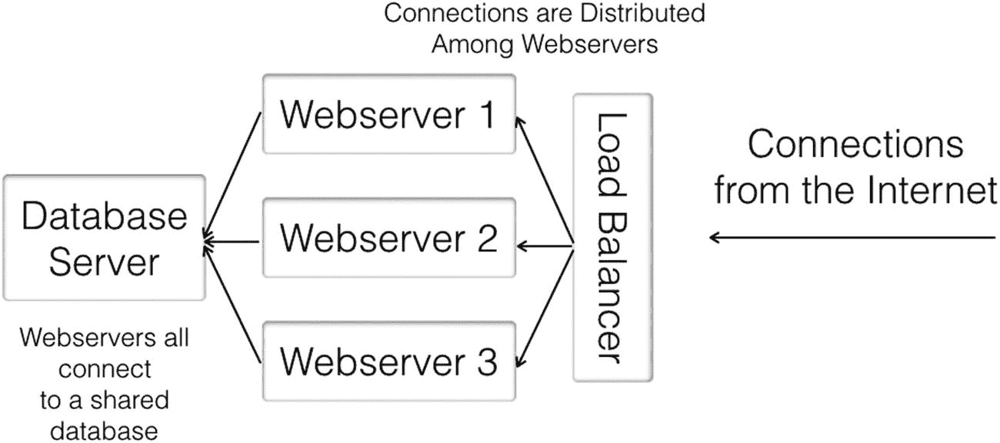
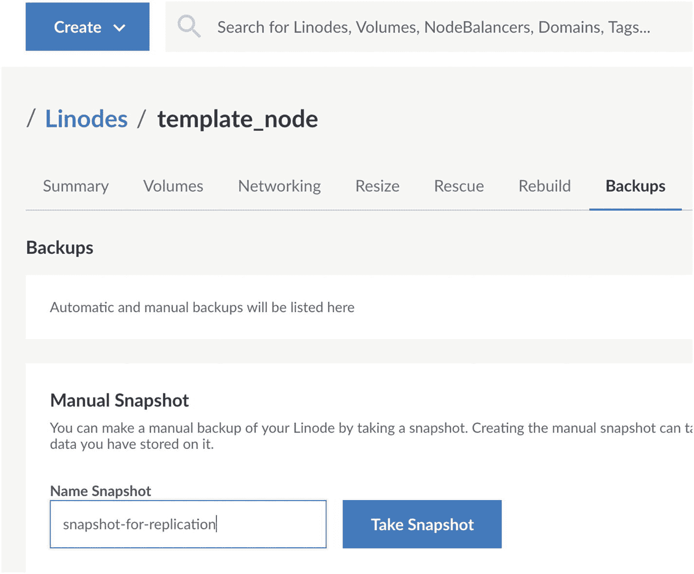
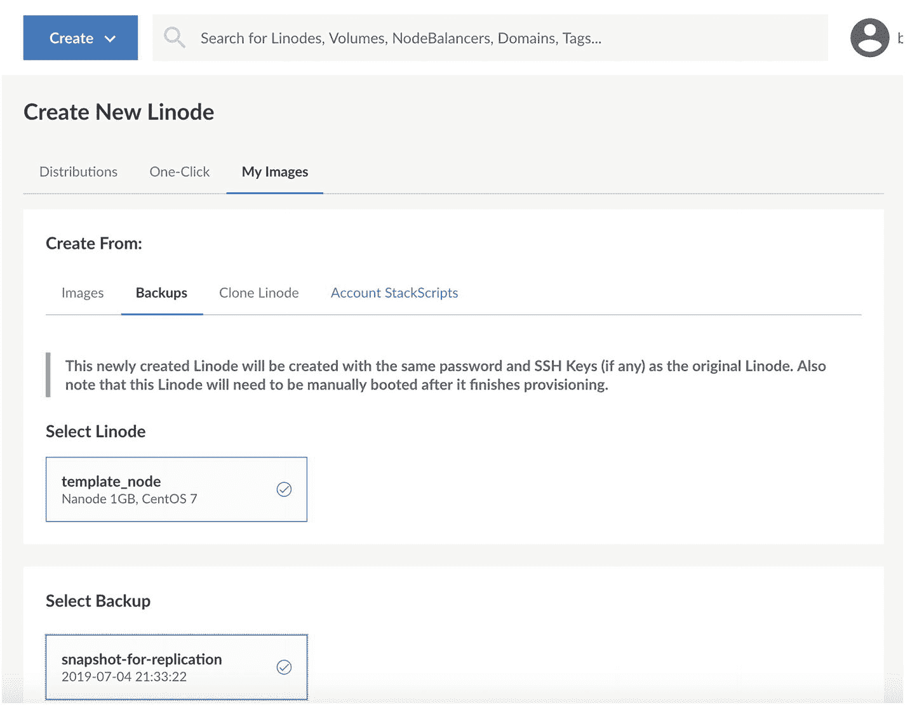
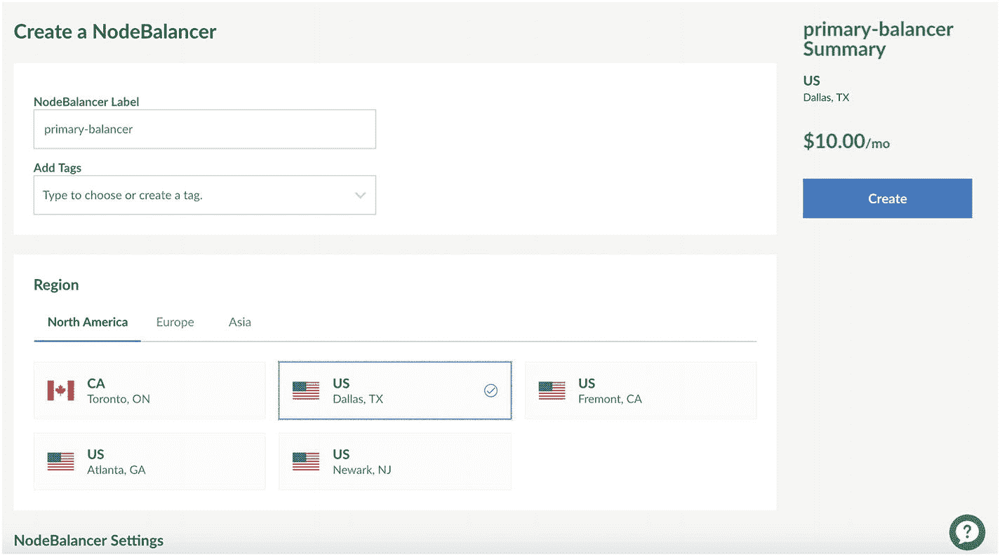
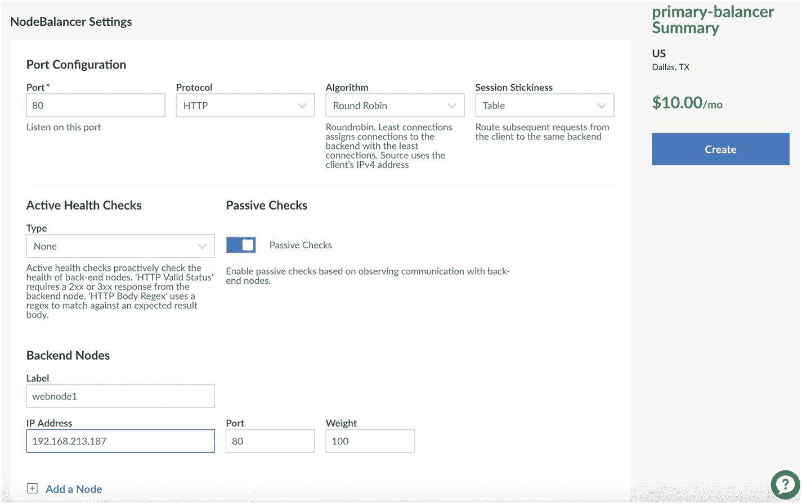
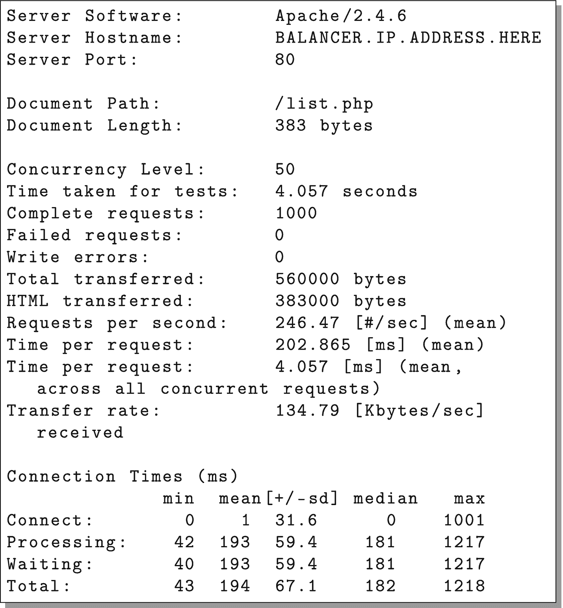
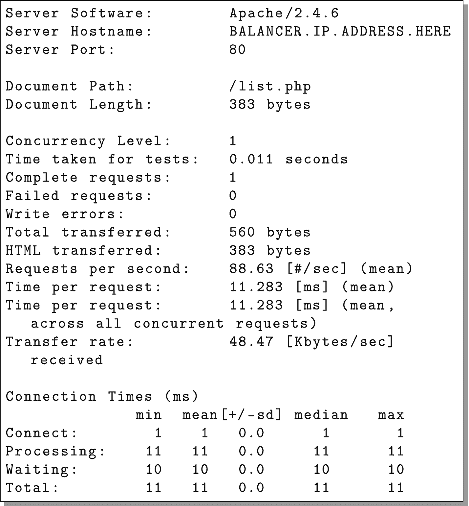

# 5.设置基本云集群

此时，我们有了一个简单的云应用程序，它运行在一台服务器上。虽然我们可以将它放在我们只需点击就能构建的服务器上，这很好，但这并没有充分利用云。云的目标之一是创建一个应用*集群*——一组协同工作来解决问题的服务器，其中的计算能力可以根据需要进行扩展和收缩。

## 5.1 简单的双层架构

在本章中，我们将探索一个简单的两层架构。该架构将包括

*   数据库服务器

*   一组 web 服务器

*   管理 web 服务器之间流量的负载平衡器

    

    图 5-1

    一个简单的双层体系结构图

该架构的基本结构如图 [5-1](#Fig1) 所示。所有的连接都进入一个负载平衡器，它的工作是将连接转发到几个 web 服务器中的一个。负载平衡器不仅转发连接，而且还监视各个 web 服务器的健康状况，如果 web 服务器停止响应，它将停止发送 web 服务器连接。每个 web 服务器共享一个数据库服务器。

在开发云应用程序时，程序员不仅需要知道如何建立集群，还需要知道如何分析集群。如果你看一下图 [5-1](#Fig1) 中的图表，你可以看到所有的网络服务器都依赖于一个数据库服务器。这使得数据库服务器成为集群的*限制因素*。几乎每个集群，不管设计得多好，都有一些限制因素。目标是最小化它们对您的架构的影响。

因为这种应用程序体系结构受单个数据库节点的限制，所以它最适合用于中小型部署，在这种部署中，大部分处理是在 web 服务器上完成的，而不是在数据库上。示例应用程序因为简单，实际上在 web 服务器上只做很少的处理。尽管如此，本章将向您展示如何设置服务器以在这种配置中部署它。

## 5.2 复制节点

图 [5-1](#Fig1) 中描述的基本双层应用表明我们将需要几个服务器节点。我们可以通过使用 CentOS 的空白副本启动新机器，并单独配置每台机器来实现这一点。然而，由于我们已经花了时间来设置当前的服务器，使其按照我们希望的方式工作，我们应该利用我们花在配置所有东西上的时间。

Linode 提供了几种可以完成这项任务的服务，每种服务都有自己的优点和缺点。Linode 能够创建保存的映像，这些映像可用于直接创建新节点(您可以选择保存的映像，而不是选择操作系统)。Linode 还有一个克隆服务，如果源机器和目标机器都关闭，它允许您克隆现有的机器(这不是一个硬性规定，但是如果您试图克隆一个正在运行的机器，您可能会遇到一致性问题)。最后，您可以从机器的备份中进行克隆。

我更喜欢从备份中进行克隆，因为(a)无论如何你都应该定期备份你的服务器，(b)在你创建新的服务器时，你不必关闭机器什么也不做，以及(c)这迫使你在学习克隆服务器的同时使用备份系统并适应它(有一天你将需要从备份中恢复，所以在你需要它之前熟悉这个过程是很好的)。Linode 图像服务*可以*解决这个问题，但是对于实际生产应用来说，它有太多的限制。为了防止用户将图像服务用作备份服务，他们限制了图像的大小和数量，但我的大多数机器通常都比 Linode 图像允许的最小大小大。请注意，其他云服务(如 DigitalOcean)提供类似的服务，但有不同的限制。

如果我们想要启动一台与现有服务器完全相同的新服务器，那么我们只需备份当前服务器。我们需要做的是首先在我们的服务器节点上启用备份。要做到这一点，只需登录到 Linode，在列表中单击您的节点，然后在节点的仪表板上单击“Backups”选项卡。这将为您提供一个按钮，上面写着“启用该节点的备份”这增加了一个小的月费，但它肯定是值得的。单击该按钮，您的计算机将自动拥有可用的每周、每天和临时快照。屏幕现在看起来应该类似于图 [5-2](#Fig2) 。



图 5-2

Linode 备份管理屏幕

我们现在要做的是拍摄我们机器的快照。为您的备份输入一个名称(我将我的命名为“用于复制的快照”)，然后单击“拍摄快照”按钮因为 Linode 服务器都在固态硬盘上，所以快照非常快，通常只需要 5-10 分钟。

### 其他备份设置

因为备份实际上会降低磁盘速度，所以 Linode 允许您指定备份窗口。您可以选择一天中要进行备份的时间，也可以选择一周中的某一天作为“每周备份”一天中的时间应该是系统使用率最低的时候，而一周中的某一天应该在任何主要批处理之前。例如，如果您在星期五进行批处理，将备份日期设置为星期四将确保您在主要处理发生之前有一个“之前”的快照。如果不进行大规模批处理，每周备份的日期并不重要。

备份开始后，我们可以进入下一个任务，即创建新的服务器。新服务器将成为我们的数据库服务器。

如我们在第 [3](03.html) 章中所做的那样，要创建机器，先进入“创建”,然后进入“Linode”。但是，在“映像”标题下，您需要选择“我的映像”，然后选择“备份”，而不是选择发行版这将显示具有可用备份的节点列表。单击您的节点，然后它将显示可用的备份，其中包括我们刚刚创建的备份。参见图 [5-3](#Fig3) 来看看这个应该是什么样子。

您可以根据自己的需要创建尽可能大的机器，但是为了便于练习，您最好使用最小的机器尺寸。这个节点需要和你的另一个节点在同一个数据中心(否则他们不能私下地、廉价地、快速地互相交谈)，但是 Linode 会自动把一个从备份创建的新节点放到同一个数据中心。

对于 Linode 标签，让我们使用名称`dbmaster`，这样我们就知道这个节点将用于主数据库。拥有一堆没有名字(或者名字不好)的节点会很快变得难以管理，所以一定要确保*总是*给你的节点起描述性的名字。



图 5-3

从备份中引导新的节点

现在，单击“创建”来构建您的新节点。从备份创建时，一旦节点完全创建，您必须自己引导节点。在屏幕的右上角，应该显示“离线”点击它，然后选择“开机”来启动你的新机器。现在，您可以使用为初始机器设置的相同用户和密码`ssh`进入这台新机器。事实上，它还应该运行您创建的应用程序。它是另一台机器的精确副本，只是修改了网络设置。

### 恢复到更大的机器

如果您将备份恢复到较大的计算机，它可能不会利用您购买的所有磁盘空间。由于分区是直接复制的，旧分区的大小将与其在复制它的服务器上的大小相同，这可能小于您的可用空间。

要解决这个问题，首先关闭服务器电源。接下来，在节点的仪表板上，单击“高级”选项卡。您可以添加另一个磁盘来使用剩余的空间(这很难管理，所以我不推荐)，或者调整主磁盘的大小来利用所有的空间。若要调整磁盘大小，请在“磁盘”下找到主磁盘它应该被命名为“CentOS 7 磁盘”(而不是标有“交换映像”的磁盘)之类的东西。点按主盘旁边的省略号(即`...`)，然后选取“调整大小”然后，您可以将大小设置为它告诉您的最大值，然后单击“调整大小”按钮。

当它完成尺寸调整后，你可以重新启动你的机器，现在你已经准备好了。

## 5.3 设置您的专用网络

既然我们有两台机器，我们需要它们进行通信。他们*可以*通过他们的公共 IP 地址通信，但是这导致了几个问题。首先，如果你有不想公开的服务(比如你的数据库)，如果你只有一个公开的 IP 地址，就更难阻止公众获取这些服务。此外，Linode 对你的公共 IP 地址上的流量收费，所以，如果你通过那个 IP 地址通信，Linode 会对你的*内部*流量收费。因此，拥有一个私有 IP 地址是很重要的，因为它能让计算机通过一个快速、自由、更安全的内部网络相互通信。

为了解决这些问题，Linode 允许你为你的服务器建立一个内部网络。一个帐户中的所有服务器共享一个内部网络(如果它们是为该网络设置的)。要将服务器添加到您的内部网络，您只需进入节点的“网络”选项卡，然后单击“添加专用 IPv4”它会给你一些关于私有地址的附加信息，你可以点击“分配”继续。这将为计算机分配一个专用 IP 地址。因为所有的 web 服务器都将与该服务器通信，所以您需要记下生成的私有 IP 地址。从现在开始，我们将把这个地址称为`DB.MASTER.PRIVATE.IP`，所以总是用您刚刚记下的服务器的私有 IP 地址来替换它。

注意，在一些云平台上(包括 Linode)，私有 IP 地址并不是完全私有的。也就是说，同一数据中心的其他云客户可能也在该网络上。因此，虽然私有网络肯定比公共网络更安全，但是云上的私有网络并不能保证只有我们自己的计算机在连接。因此，在生产系统上，您仍然需要采取预防措施来防止不必要的访问，即使是在内部网络上。然而，Linode 确实会过滤每个节点的流量，因此您不必担心有人会窥探内部网络上的数据流量。

您需要重新启动节点才能完成该过程。

一旦启动完成，您仍然可以在 [`http://NEW.NODE.PUBLIC.IP/list.php,`](http://new.node.public.ip/list.php) 看到应用程序，但是您将无法在私有 IP 地址上看到它，因为如上所述，它是私有的。

要查看服务器上的地址列表，请以 root 用户身份登录并发出以下命令:

```php
ip addr show

```

这应该会打印出分配给该节点的所有 IP 地址。

### 私有 IP 地址

如果您不熟悉 IP 寻址，一些 IPv4 地址已被保留用于内部网络。这些地址包括

*   `192.168.X.X`

*   `172.16–31.X.X`

*   `10.X.X.X`

这些 IP 地址都不允许用于互联网上的公共通信。

因此，在设置您的内部网络时，Linode 将从这些地址池中选择 IP 地址来配置您的机器。

另一个臭名昭著的 IP 地址是`127.0.0.1`，它被称为*环回*地址，这是一个机器可以用来指代自己的 IP 地址(实际上，整个范围`127.X.X.X`都是为此保留的，但通常只使用`127.0.0.1`)。

## 5.4 处理来自其他服务器的数据库连接

这台机器上现在有了应用程序和数据库的完整副本。但是，它仍然被配置为单服务器系统。我们需要将其配置为机器集群的主数据库。这一部分应该以 root 用户的身份执行，它将展示您需要做些什么来实现这一点。

由于这台机器是`template_node`的克隆，这意味着所有的用户、程序和配置都被复制到这个节点上。因此，您可以使用之前设置的密码以 root 用户身份`ssh`进入机器。

要将它用作其他节点的数据库服务器，您需要使数据库能够侦听来自这些节点的连接。默认情况下，PostgreSQL 只监听本地主机接口上的连接。我们不希望 PostgreSQL 监听公共互联网上的连接。因此，我们希望配置 PostgreSQL，使其监听本地主机及其*私有* IP 地址上的连接。

要做到这一点，作为根用户，用`nano`打开文件`/var/lib/pgsql/data/postgresql.conf`，并修改显示为`listen_addresses`的行。将该行改为:

```php
listen_addresses = 'localhost,DB.MASTER.PRIVATE.IP'

```

确保用节点的*实际*私有 IP 地址替换`DB.MASTER.PRIVATE.IP`。如果行首有注释标记(`#`)，一定要去掉；否则，该命令将不会被激活。用 control-o 保存文件(只要按回车键来验证文件名，如果它问)。然后，要退出，请使用 control-x。现在，使用以下命令重新启动 PostgreSQL:

```php
systemctl restart postgresql

```

此外，您将希望打开防火墙，以便它可以接受 PostgreSQL 的远程连接。您可以通过以下方式实现这一点:

```php
firewall-cmd --add-service postgresql
firewall-cmd --add-service postgresql --permanent

```

通常，我让 web 服务器在数据库服务器上运行，这样我就可以检查它。但是，如果您愿意，可以使用以下命令关闭 web 服务器:

```php
systemctl stop httpd
systemctl disable httpd

```

## 5.5 设置 Web 服务器

现在我们已经配置好了数据库，是时候设置我们的 web 服务器了。

请注意，我们实际上不会使用`template_node`作为服务器。我喜欢在身边放一个小机器，简单地用作未来盒子的模板，尤其是 webnodes。这样，我可以拥有一台最新的、已备份的小型计算机，当我准备好创建新的“映像”时，我只需创建一个命名备份即可使用。请注意，这将覆盖以前的快照映像，但对于我的目的来说，这通常是可以的。如果您需要保留旧版本，只需为您想要维护的每个配置保留一个模板节点。

现在我们将配置`template_node`成为一个 web 服务器模板。我们只需要做三点改变:

1.  关闭该计算机上的数据库。

2.  更改 web 应用程序的代码以指向我们的新数据库。

3.  在机器上启用专用 IP 地址，使其能够使用专用网络。

为了完成第一个任务，我们需要做的就是以 root 用户身份登录到`template_node`机器并运行:

```php
systemctl stop postgresql
systemctl disable postgresql

```

为了完成第二个任务，我们只需要修改`common.php`文件。我建议在您的本地机器上修改它，并使用 SFTP 传输新文件。不过也可以在服务器上用`nano`直接修改。您所要做的就是更改连接字符串。在当前显示为`host=localhost`的地方，将其改为`host=DB.MASTER.PRIVATE.IP`，其中`DB.MASTER.PRIVATE.IP`是您的`dbmaster`节点的私有 IP 地址。您需要进行两次修改——一次在`getReadOnlyConnection()`函数中，一次在`getReadWriteConnection()`函数中。完成后，用 SFTP 将代码加载回服务器。

此时，代码将不起作用，因为它不能访问`dbmaster`机器。这是因为 PostgreSQL 是*唯一的*监听它的私有 IP 地址，而`template_node`还没有私有 IP 地址进行通信。因此，您需要给机器添加一个私有 IP 地址，这样它就可以通过它的私有 IP 地址连接到`dbmaster`。

使用第 5.3 节中概述的过程为机器创建一个私有 IP 地址(不要忘记之后重新启动！).

一旦你完成了这些步骤，你的`template_node`机器应该能够连接到`dbmaster`，所以测试一下。找到你的`template_node`服务器的 IP 地址，看看它是否还能工作。如果是的话，那么恭喜你，因为你刚刚实现了一个小的、两层的系统！

现在，正如我前面说过的，我们实际上不会使用`template_node`来服务请求。我们的目标是使用它，以便我们可以轻松地启动新的 web 服务器节点，根据需要扩展容量。

因此，既然`template_node`已经完全设置为一个 web 服务器，那么创建一个新的备份快照。这一步至关重要。每当您在`template_node`中进行更改时，您应该创建一个新的备份快照，这样您从它创建的新节点将会有您的新更改(尽管它根本不会影响现有的节点)。

我们现在将为我们的集群创建三个(或者任意多个)web 服务器节点。

以下是每个新 web 服务器节点的步骤:

1.  使用第 5.2 节中的步骤创建一个新节点。确保(a)它是在与`dbmaster`相同的数据中心创建的，并且(b)将节点的名称设置为`webnode1`(或者 2，或者 3)。

2.  使用第 5.3 节中的步骤，为节点添加一个私有 IP 地址，使其可以连接到私有网络上的`dbmaster`。

3.  机器完成启动后，通过查看节点的公共 IP 地址(即 [`http://WEB.NODE.PUBLIC.IP/list.php).`](http://web.node.public.ip/list.php)) )上的 web 应用程序，验证其功能是否完整

最后，您应该有三台机器，`webnode1`、`webnode2`和`webnode3`，每一台都可以作为您的 web 应用程序的前端。现在您只需要将它们连接在一起，这将在下一节中介绍。

## 5.6 设置负载平衡器

现在我们有三台前端机器，都连接到一个数据库。我们如何将它们连接在一起？我们可以这样做的一个方法是建立一个 DNS 循环方案。其工作方式是在 DNS 中为一个主机名设置多个记录。然后，浏览器自己会选择要连接到哪个主机。这样做的问题是，如果您的一台机器出现故障，就没有办法引导用户离开该 IP 地址。Linode 现在实际上支持这种故障转移，但是它的用法超出了本书的范围。



图 5-4

创建节点平衡器

负载平衡器是一个更好的解决方案。负载平衡器位于您的集群前面，为您获取连接，然后将这些连接转发给可用于处理它们的服务器。此外，如果其中一台服务器出现故障，负载平衡器会检测到这一情况，并将流量转移到其余服务器上。然后，当您的服务器恢复时，负载平衡器也会检测到这一点，并将流量移回服务器。

在 Linode 中设置负载平衡器很容易。Linode 将其负载平衡器称为“节点平衡器”要设置节点平衡器，请单击“创建”，然后选择“节点平衡器”菜单项。这将带您进入图 [5-4](#Fig4) 所示的屏幕。

就像其他事情一样，你需要

*   设置平衡器的名称(我们将使用“主平衡器”)。

*   将平衡器放在与节点相同的数据中心。

此外，您需要添加一些额外的配置，如图 [5-5](#Fig5) 所示。确保选择了以下选项:

*   “端口”应设置为“80”

*   “协议”应设置为“HTTP”

*   “算法”应设置为“循环法”

*   “会话粘性”应设置为“无”

*   “主动健康检查”应设置为“无”

*   “被动健康检查”应该打开。

之后，您需要向您的平衡器添加至少一个节点(可以在创建平衡器之后添加更多节点)。在“标签”字段中输入节点的名称(我们假设为`webnode1`)。然后，在“IP 地址”字段中，从下拉列表中为您的节点选择 IP 地址。确定端口设置为“80”

完成这些设置后，单击“创建”创建平衡器。

创建平衡器后，您可以通过进入“配置”，然后进入“端口 80”，然后进入底部的“添加节点”来添加其余的节点。添加您创建的任意数量的节点。完成后点击“保存”。

平衡器将节点添加到列表中有时需要几分钟时间。要检查状态，请返回到节点平衡器配置屏幕。每台服务器旁边都有一个“状态”字段。当状态为“启动”时，服务器成功连接到平衡器。

如果您想为另一个端口配置一个负载平衡器，您可以使用“添加另一个配置”按钮。



图 5-5

节点平衡器附加设置

### 其他节点平衡器选项

节点平衡器有许多选项可用。下面是一些重要的描述。

**端口**:这是节点平衡器应该转发的 TCP 端口。这通常是 80 (HTTP)或 443 (HTTPS)。在我们的例子中，我们将使用端口 80。

**协议**:这是您希望服务器处理转发请求的方式。如果协议设置为 TCP，那么平衡器所做的*唯一的*事情就是将连接转发给你。如果它被设置为 HTTP 或 HTTPS，那么服务器实际上会为您处理连接的某些部分。HTTP 是我们将在本书中使用的。HTTPS 为安全站点增加了额外的支持，因为负载平衡器将为您处理 SSL 连接，从而从服务器上移除了大量负载(您还将证书和密钥信息上传到负载平衡器进行处理)。在进行 HTTPS 时，您可能希望平衡器上的端口不同于机器上的端口。在 HTTPS 的情况下，您应该将平衡器设置为连接到服务器上的未加密端口 80。如果你想做由你的机器而不是平衡器处理的 HTTPS，你可以选择 TCP(而不是 HTTPS)作为协议。由于获取和安装证书的复杂性，对于本书中的示例，选择端口 80 和 HTTP 进行负载平衡。

**算法**:这是负载均衡器决定将其转发给哪个服务器的方式。循环调度是默认设置，应该可以正常工作。

**会话粘性**:这是一个给定的用户是否应该继续连接到*相同的*网络服务器，一旦它已经建立了初始连接。只有当你在你的网络服务器上存储会话信息时，这才是重要的*。想象一下，如果您的 web 服务器有重要的会话信息，但是下一个请求发送到不同的服务器！因此，此选项允许您配置客户端是否以及如何与服务器匹配。我们的应用程序没有会话信息，所以应该设置为“None”如果您的应用程序使用本地会话信息(或本地缓存，我们将在 6.1 节中看到)，我会选择 HTTP Cookie 方法，因为它不会像“Table”方法那样妨碍您的负载测试。因为所有的请求都来自同一个 IP 地址，所以“Table”方法只是将整个负载测试指向一台服务器，而不是将其分散开来，看起来好像负载平衡没有给你任何帮助。*

**主动健康检查**:这允许您为负载平衡器指定一个 URL，以便检查 web 服务器的状态。您可以将平衡器配置为只检查 HTTP 状态，或者在响应正文中查找特定的字符串。

**后端节点:权重**:为该服务器设置节点平衡器的首选项。权重越高，服务器连接越多。

**后端节点:模式**:设置平衡器中节点的模式。“接受”用于正常操作。“拒绝”实际上是关闭该节点，这意味着平衡器不会再向该节点发送任何请求。但是，如果打开了会话粘性，您可能不希望直接从“接受”转到“拒绝”“Drain”告诉平衡器*仅*接受来自在该节点上有会话的客户端的连接。“备份”表示只有当所有其他节点都关闭时才接受连接。

将所有 webnodes 添加到节点平衡器后，现在可以通过查看节点平衡器本身的 IP 地址来查看集群，节点平衡器会将您的请求转发到集群中的一台机器。您可以通过单击主菜单中的“节点平衡器”找到您的节点平衡器的 IP 地址。IP 地址将列在列表中您的平衡器旁边。它也列在节点平衡器“摘要”屏幕的右侧。

## 5.7 测量可扩展性

我们开发的简单 web 应用程序并没有从这里介绍的架构中获益太多。我们的 web 应用程序只是一个简单的外壳，用于一些数据库查询。因此，简单地添加前端设备无助于解决我们的应用程序受数据库限制的问题。将数据库从 web 服务器中分离出来会给我们带来一些帮助，因为它允许数据库服务器只关注数据库连接。然而，在核心上，我们在这个应用程序中所做的一切只是围绕数据库查询的一个薄薄的包装。

但是我们如何*衡量*我们应用程序的可伸缩性呢？衡量应用程序可伸缩性的一个常见的简单工具是 ApacheBench。ApacheBench 是 Macintosh 和大多数 Linux 发行版的标准。对于我们的例子，我们实际上可以从我们的`template_node`服务器运行 ApacheBench 来测试集群的其余部分。

为此，以`root`或`fred`的身份登录到您的`template_node`服务器。要运行一个简单的 ApacheBench 会话，只需键入:

```php
ab http://BALANCER.IP.ADDRESS.HERE/list.php

```

显然，用负载平衡器的 IP 地址替换`BALANCER.IP.ADDRESS.HERE`。

这将向负载平衡器发送一个请求，并记录处理该请求所花费的时间。输出将类似于图 [5-6](#Fig6) 。

由于这只是对单个请求进行了基准测试，因此其中没有太多有趣的信息。它说这个请求花费了 9.674 毫秒，推断出来，它估计我们每秒可以处理 103.37 个请求。

现在，ApacheBench 有几个选项可以让我们更充分地使用服务器。`-n`选项告诉 ApacheBench 要发出多少个请求(默认情况下我们发出了 1 个)。`-c`选项告诉 ApacheBench 要建立多少个并发(即同时)连接。如果没有`-c`，ApacheBench 将一次只运行一个请求。但是，如果您添加了`-c 50`，ApacheBench 将始终保持对 web 服务器的 50 个活动请求。

因此，为了练习集群，我做了以下工作:

```php
ab -c 50 -n 1000 http://BALANCER.IP.ADDRESS.HERE/list.php

```

这总共发送 1，000 个请求，确保每次总是有 50 个活动的请求。结果如图 [5-7](#Fig7) 所示。

这表示有 50 个并发请求时，我们每个请求的平均*时间下降到 5.136 毫秒，但是每个*请求的平均*时间增长到 256.822 毫秒。这实际上不是问题，因为每个请求的平均时间对于容量规划来说是最重要的。我们还被告知，按照这个速度，我们的服务器每秒可以处理 194.69 个请求。*



图 5-7

1，000 个请求的 ApacheBench 结果



图 5-6

单个请求的 ApacheBench 输出示例

这听起来很棒，除了当您对单台机器进行测量时(您可以用您机器的 IP 地址之一替换 IP 地址)，您会得到接近相同的结果。当并发请求数量激增时，负载均衡器可以处理稍高的压力，但总的来说，它们的结果基本相同。这是因为我们的应用程序几乎完全只是数据库的一个外壳。因此，这个数字反映了我们数据库服务器的最大容量。为了验证这一点，您可以暂时将数据库服务器的大小调整到更大的机器上。

要调整您的`dbmaster`服务器，进入`dbmaster`的仪表板，点击“resize”选项卡，并选择一个新的计划(我选择了 Linode 4GB)。现在点击“立即调整这个节点的大小”停机几分钟后，你的 Linode 会重新调整大小，它会保留它的 IP 地址！一旦它完成调整，它将启动，你现在将有一个调整后的服务器！

现在，您可以在这个配置上运行 ApacheBench，并看到调整数据库服务器的大小为您提供了比以前的配置更大的优势。在做了这个实验之后，我已经将`dbmaster`的大小调整回了一个毫微级 1GB，这样我们就可以更好地看到后面章节中描述的架构的效果。

如果应用程序不是如此依赖数据库，我们应该已经看到了这种架构的一些扩展优势。然而，即使存在数据库瓶颈，第 6 章也将着眼于架构的改进，这将提供显著更好的伸缩能力。这里的目标仅仅是看看架构是如何工作的，以及如何在 Linode 上设置它。

很高兴看到，仅仅因为您可以向系统添加节点，并不意味着它可以自动伸缩。