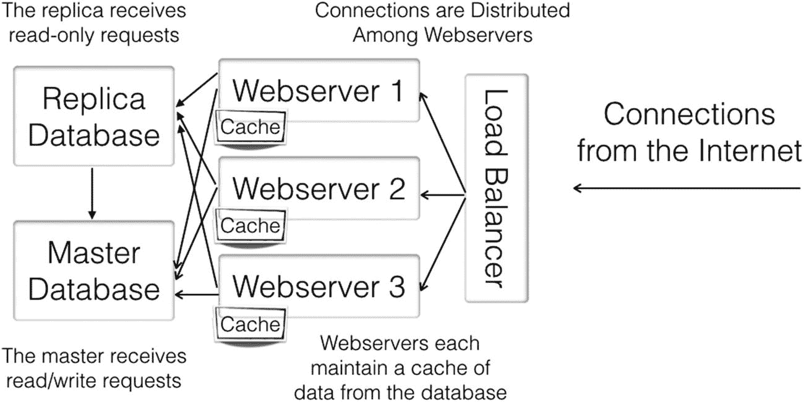
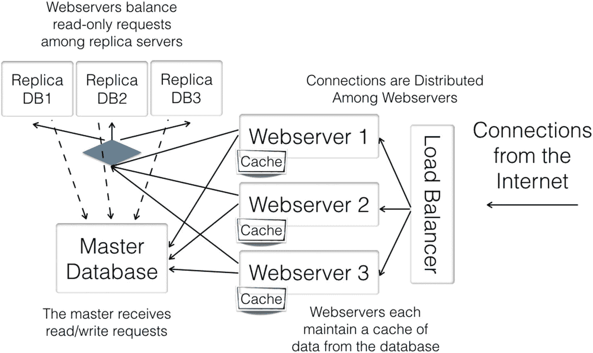
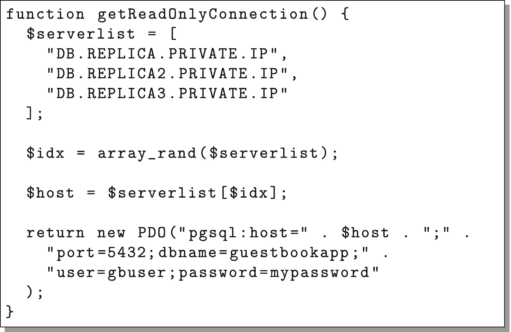

# 7.数据库复制

有些东西根本无法缓存。即席报告、最新的更改以及访问模式分布在大量不相关页面上的站点都很难使用缓存进行优化。对于这样的工作负载，你可以部署一个更大的数据库服务器，但是最终这些也会受到限制。

因此，许多应用程序架构都包括数据库复制，其中有多个数据库服务器为请求提供服务。

## 7.1 数据库复制的类型

根据您的需要，有许多类型的数据库复制。复制的基本类型包括

*   **故障转移复制**:在这种配置中，复制的服务器不帮助加载，但是它们确保如果主数据库服务器停机，有一个具有最新信息的数据库可以接管。

*   **主/副本复制**:在这种配置中，主数据库是唯一具有读/写权限的数据库。副本服务器接收记录在主服务器上的数据(或稍后接收)，但它们是主数据库的只读副本。所有更新都转到主数据库，但查询可以转到主服务器或任何副本服务器。这也称为“主/从”复制，其中副本数据库被视为“从数据库”

*   **多主复制**:在这种配置中，所有数据库都被视为同等的“主”数据库，可以在其中任何一个数据库上执行写操作。然后，对任何给定数据库的写入将与集群的其余部分同步。

本章将集中讨论主/副本复制，因为它最容易实现，实际问题最少，而且用最少的努力获得最多的结果。多主控复制很少使用，因为它很难设置、维护和保持高效，而且很少有数据库支持它。即使受到支持，多主控复制也经常会引入新的难以解决的问题，例如数据冲突(即，当冲突的数据被提交到两个不同的服务器上时)。因此，为了保持简单，本书将集中讨论主/副本配置。

图 [7-1](#Fig1) 显示了典型主/副本架构的概念视图。

## 7.2 复制 PostgreSQL 数据库

这些年来，PostgreSQL 的复制系统在功能和易用性方面都有了很大的进步。虽然使用起来并不困难，但需要一些解释才能理解。

内置的 PostgreSQL 复制系统使用一种称为日志流的技术进行复制。为了保证数据的一致性，PostgreSQL 创建了一个预写日志，简称 WAL。基本上，PostgreSQL 将*要做的更改写入 WAL，然后实际执行更改。这意味着，如果数据库服务器在更新过程中关闭，它会记录正在做的事情，并在重新启动时简单地完成操作。*



图 7-1

主/副本数据库架构图

有趣的是，这正是复制服务器也需要知道的信息。因此，要实现数据库复制，PostgreSQL 只需将 WAL 文件发送到复制服务器，复制服务器同样会实现更改。这种类型的复制被称为 WAL 流。

为了在我们的集群中实现这一点，我们需要配置我们的主数据库，以便接收复制连接。以 root 用户身份登录`dbmaster`，编辑文件`/var/lib/pgsql/data/postgresql.conf`，设置如下设置:

```php
wal_level = hot_standby
wal_keep_segments = 32
max_wal_senders = 4
hot_standby = on

```

如果您使用的是 PostgreSQL 的更高版本(9.4 或更高版本)，您还需要设置:

```php
max_replication_slots = 4

```

但是，该设置将破坏 CentOS 7.2 附带的 PostgreSQL 版本，我们将在本书中使用该版本。

这些配置更改完成了几件事:

*   `wal_level`调整 PostgreSQL 的“预写日志”(即 WAL)，以便它保留足够的细节来发送副本服务器需要的所有内容。

*   在使用后保留足够的数据，以便副本服务器在落后时仍能获得数据。我们将它设置为 32，这是一个相当保守的设置。这允许新的副本有大量时间来完全同步，并防止较小的网络故障和速度减慢导致服务器不同步。

*   `max_wal_senders`应该至少设置为副本服务器的数量加 2(并且，如果您决定安装较新的 PostgreSQL，您可能需要将`max_replication_slots`设置为相同的值)。

*   `hot_standby = on`允许副本服务器响应查询。

接下来，我们需要向 PostgreSQL 数据库添加一个 replicator 用户。键入`psql -U postgres`以访问数据库，然后键入以下内容以创建用于复制的用户`replicator`(全部在一行中):

```php
CREATE ROLE replicator WITH REPLICATION
PASSWORD 'mypassword' LOGIN;

```

然后键入`\q`退出。

接下来，我们需要授予远程服务器打开到该服务器的复制连接的权限。在`/var/lib/pgsql/data/pg_hba.conf`中添加以下一行:

```php
host replication replicator all md5

```

现在我们需要重新启动数据库，以便新设置生效:

```php
systemctl restart postgresql

```

我们的服务器现在完全可以开始接受复制请求了。现在我们可以设置副本服务器了。

为了设置 PostgreSQL 副本服务器，我们需要做的第一件事是创建一个新的 Linode 节点，通过使用标准过程复制我们的模板节点来运行它。在本练习中，将新节点命名为`dbreplica`。您还需要为这台机器添加一个私有 IP 地址并记下来(在本书的其余部分，我们将把它称为`DB.REPLICA.PRIVATE.IP`)。

现在，启动`dbreplica`并以`root`的身份登录。

如果您按照说明操作，这台机器应该没有运行 PostgreSQL。但是，如果它正在运行，您可以使用`systemctl stop postgresql`将其关闭。一旦 PostgreSQL 关闭，我们需要清除现有的 PostgreSQL 安装。使用以下命令完成该操作:

```php
rm -rf /var/lib/pgsql/data/*

```

现在，我们需要从主系统请求一个初始二进制备份，作为复制的起点。这是通过`pg_basebackup`命令完成的。要生成这个初始备份起点，首先切换到 postgres 用户，如下所示:

```php
su - postgres

```

接下来，发出以下命令(全部在一行中):

```php
pg_basebackup -x -U replicator -h DB.MASTER.PRIVATE.IP
 -D /var/lib/pgsql/data

```

它会要求您输入密码，然后从 master 数据库复制整个 PostgreSQL 实例，包括配置文件。接下来，在这一步完成后，您需要调整配置文件。我们在第 [5 章](05.html)中建立的`postgresql.conf`文件有一个包含服务器私有 IP 地址的命令`listen_addresses`。不幸的是，因为它是从主数据库复制的，所以它目前拥有主数据库的私有 IP 地址。要解决这个问题，只需打开`/var/lib/pgsql/data/postgresql.conf`并将`listen_addresses`配置改为:

```php
listen_addresses = 'localhost,DB.REPLICA.PRIVATE.IP'

```

成功结束后，您需要告诉 PostgreSQL 该服务器将被用作热备用。

这是通过告诉服务器在启动时进入“连续恢复模式”来实现的。为此，我们创建了包含以下内容的文件`/var/lib/pgsql/data/recovery.conf`(最后两行应该在同一行中键入):

```php
standby_mode = 'on'
primary_conninfo = 'host=DB.MASTER.PRIVATE.IP port=5432
 user=replicator password=mypassword'

```

一旦这一切就绪，您需要像这样退出回到 root 用户:

```php
exit

```

现在您再次成为 root 用户，我们需要重新打开 PostgreSQL 数据库，并确保它在重新启动时会自动启动:

```php
systemctl start postgresql
systemctl enable postgresql

```

我们还需要确保防火墙中有一个洞来接收数据库连接:

```php
firewall-cmd --add-service postgresql
firewall-cmd --add-service postgresql --permanent

```

此时，您的系统已经启动并作为副本服务器运行了！

要验证这一点，请运行以下命令，该命令将列出所有正在运行的 PostgreSQL 进程:

```php
ps afxw|grep postgres

```

列表中的一个进程应该在输出中包含单词`recovering`或 startup。这意味着数据库是启动的、活动的，并以主服务器的 WAL 日志为基础。

您还可以检查日志文件，这些文件位于目录`/var/lib/pgsql/data/pg_log`中。日志文件的结尾应该类似于“数据库系统已准备好接受只读连接”和“流式复制已成功连接到主数据库”

### 关于 Postgresql 复制的几点注意事项

PostgreSQL 实现称为“实例”，可以包含任意数量的数据库。如果您遵循本书中的说明，那么您的 PostgreSQL 实例只包含一个数据库(实际上是三个，因为 PostgreSQL 总是安装有一对模板数据库，`template0`和`template1`)。使用`createdb`命令行程序或者在运行`psql`时发出`create database`指令来创建一个新的数据库是非常容易的。

在任何情况下，请记住，由于 PostgreSQL WAL 文件是系统级功能(即 WAL 文件由整个数据库实例共享)，PostgreSQL 流复制复制整个 PostgreSQL 实例，而不仅仅是单个数据库。

## 7.3 设置应用程序以利用主/副本复制

应用程序本身已经构建为利用只读副本。如果你记得，我们实际上有*两个*连接函数，`getReadWriteConnection()`和`getReadOnlyConnection()`。现在，它们都指向同一个服务器。为了使用我们新的只读副本，我们所要做的就是改变`getReadOnlyConnection()`函数中的连接信息，它会将所有只读连接转移到副本服务器上。

我们所要做的就是改变`getReadOnlyConnection()`函数中的`host`参数，使其指向`DB.REPLICA.PRIVATE.IP`。

一旦完成，我们只需要重新部署我们的代码。通常，我们可以通过部署到`template_node`然后从它重新创建`webnode`服务器，或者通过将它单独部署到每个服务器来实现。

## 7.4 添加更多 PostgreSQL 副本服务器

如果分离出单个副本服务器并不能提高您需要的性能，那么您实际上可以根据需要拥有多个副本服务器。为此，您可以复制模板节点并重复 7.2 节中的过程，或者直接复制副本服务器。

复制副本服务器不像复制 web 节点那样自动，但是可以节省一些步骤。为此，您需要首先在当前的`dbreplica`节点上启用备份，然后从`dbreplica`的备份创建新的复制副本实例。创建每个副本实例后，您需要`ssh`到新的副本服务器，并将`/var/lib/pgsql/data/postgresql.conf`中的`listen_addresses`值设置为它自己的私有 IP 地址，因为默认情况下它将被设置为`dbreplica`的值。这样做之后，您将需要用`systemctl restart postgresql`重启 PostgreSQL。

在创建了大量数据库副本后，需要修改代码以利用数据库。如果我们可以为副本数据库创建一个负载平衡器，然后将所有应用程序代码指向负载平衡器，那就太好了。不幸的是，Linode 目前没有能力创建*内部*负载平衡器(即只接受私有网络上的请求的负载平衡器)，因此我们必须提供自己的负载分配机制。我们将在应用程序代码中模拟这个特性，在获取数据库连接时随机选择一个服务器。因为我们没有负载平衡器，所以我们必须在您的应用程序代码中对服务器列表进行硬编码，并且添加新的副本服务器也需要修改应用程序代码，并将该代码刷新到所有 web 服务器。

为了理解如何修改应用程序代码，假设我们现在有三台副本服务器，它们的私有 IP 地址分别是`DB.REPLICA.PRIVATE.IP`、`DB.REPLICA2.PRIVATE.IP`和`DB.REPLICA3.PRIVATE.IP`。为了让我们的只读连接在这些之间循环，我们将根据图 [7-2](#Fig2) 重写我们的`getReadOnlyConnection()`函数。

一旦这段代码在我们的集群中就位，我们所有的只读请求将会在多个副本服务器之间进行负载平衡，如图 [7-3](#Fig3) 所示。这意味着我们唯一的瓶颈是读写数据库请求。无论如何，大多数应用程序都是由只读请求控制的，因此读写请求出现瓶颈通常不成问题。



图 7-3

多副本数据库配置图



图 7-2

连接到一组副本服务器

## 7.5 跨数据中心复制

对于非常大的应用程序，有时您需要比单个数据中心更好的地理覆盖范围。此外，超关键应用程序可能需要拥有多个数据中心所带来的可靠性，这样，如果一个数据中心出现故障，应用程序至少可以继续部分运行。

这种设置的创建有点复杂，所以本书不会像其他体系结构那样给出一步一步的方法。但是，要实现此功能，您需要执行以下基本步骤:

1.  更改`dbmaster`，使其`listen_address`设置为`*`。因为它将接收来自其他数据中心的请求，所以它也必须监听公共 IP 地址。

2.  防火墙`dbmaster`防止不受欢迎的第三方访问。

3.  使用 SSL 加密到 PostgreSQL 的连接(参见后面如何启用它)。

4.  在新的数据中心部署一个“主副本”,它将是`dbmaster`的副本，但也将是网络上其他副本的主副本(如果需要的话)。这仍然是只读的，但它是流向其他副本的副本。

5.  将您的 web 应用程序的副本部署到新的数据中心，该数据中心具有用于读写连接的公共 IP 地址`dbmaster`,以及用于只读连接的本地副本的私有 IP 地址列表。

在这个过程的最后，您的集群架构应该看起来如图 [7-4](#Fig4) 所示。

随着您的部署变得越来越复杂，您对自动化部署处理的需求也在增加。有关自动部署的更多信息，请参见第 [12](12.html) 章。


图 7-4

多站点架构图

如果您需要对本地设置中的数据库进行读写访问，那么配置会变得更加困难，因为您现在必须管理系统之间如何进行同步，以及如果系统之间的网络连接中断会发生什么。在这种情况下，您通常将本地(非共享)和全局(共享)数据分离到*单独的*数据库实例中。对于非共享数据，您需要在每个位置都有一个主数据库。对于共享数据，您将按照类似于图 [7-4](#Fig4) 的方式进行设置。

### 在 Postgresql 上启用加密

要在 PostgreSQL 上启用加密，您需要以 root 用户身份转到目录`/var/lib/pgsql/data`。在那里，您需要编辑`postgresql.conf`并添加以下行:

```php
ssl = on

```

接下来，您需要生成一个 SSL 密钥和自签名证书。在同一个目录中，发出以下命令(全部在一行中):

```php
openssl req -nodes -new -x509 -keyout server.key
  -out server.crt

```

这将要求您填写一份简短的表格，该表格将被编码到您的证书中。然后，您需要对生成的文件设置权限:

```php
chown postgres:postgres server.key server.crt
chmod 600 server.key

```

如果此时重启数据库，服务器将*允许* SSL 连接，但*不要求*SSL 连接。要要求 SSL 连接，您可以将`pg_hba.conf`中的任意或所有`host`行改为`hostssl`。

完成所有更改后，您可以使用以下命令重新启动数据库:

```php
systemctl restart postgresql

```

## 7.6 数据分片

数据库可伸缩性的另一个选项是数据*分片*。数据库分片在概念上相对简单——它只是意味着您以这样一种方式对数据进行分区，即不是所有的数据都依赖于同一个数据库系统。

例如，您可以共享您的数据，以便姓名以“A”和“B”开头的所有客户都在一个数据库中，姓名以“C”和“D”开头的所有客户都在另一个数据库中，依此类推。只要系统能够容易地确定它需要查询哪个数据库，您就可以用您喜欢的任何方法对数据进行分区。主要的一点是，数据本身被分散到不同的数据库系统，而不是所有的东西都由同一个数据库系统管理。

在这样的系统中，通常要么是应用程序负责分片，要么是有一个中间层负责将连接切换到适当的数据库。一些更新的工具已经被开发出来，比如`pg_shard`，它的目标是作为一个数据库插件无缝运行。

在任何情况下，分片都会带来一系列数据管理和数据完整性问题。数据库的一个目的是确保数据的一致性。从本质上说，分片消除了数据库为实现规模而提供的许多保护。因此，重要的是要确定你知道你为什么想要切分和你想要如何切分，以最小化风险。

例如，如果您将客户划分到不同的数据库，那么您也应该划分相关的记录，这样客户就可以由一个数据库提供服务，他们的记录也可以一起管理。想象一下，如果您必须从备份中恢复记录，但是一些相关的记录在不同的数据库系统上！

分片需要大量的工作，需要大量的规划，并且严重依赖于您的使用和工作负载的细节，因此很难笼统地谈论它。尽管如此，如果您正在寻找更多的方法来扩展您的数据库，分片绝对是一个选择。分片还可以与其他方法结合使用，如主副本复制或多主复制，但同样，它需要很多额外的爱、关心和管理才能使其正常工作。

如果您的登录组不共享任何数据，分片会更容易。例如，假设你建立了一个电子邮件营销系统。不同的客户很少在这样的系统上共享任何数据。所以，把他们的记录完全分开是没有问题的。

您可能会运行几个完全独立的云，每个云拥有不同的客户群。来自客户 A、B、C 和 D 的登录将被转移到云 1，来自客户 E、F、G 和 H 的登录将被转移到云 2，依此类推。如果这些云都是完全独立管理的，这样的设置还可以实现一定程度的灾难缓解，因为您不太可能同时让所有数据中心完全停机。