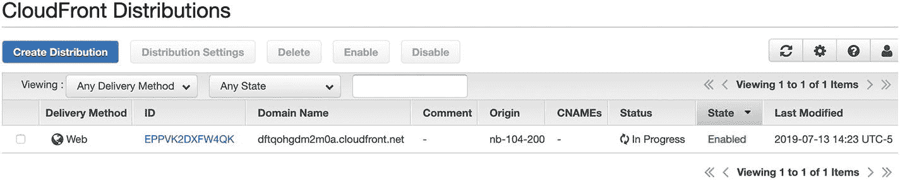
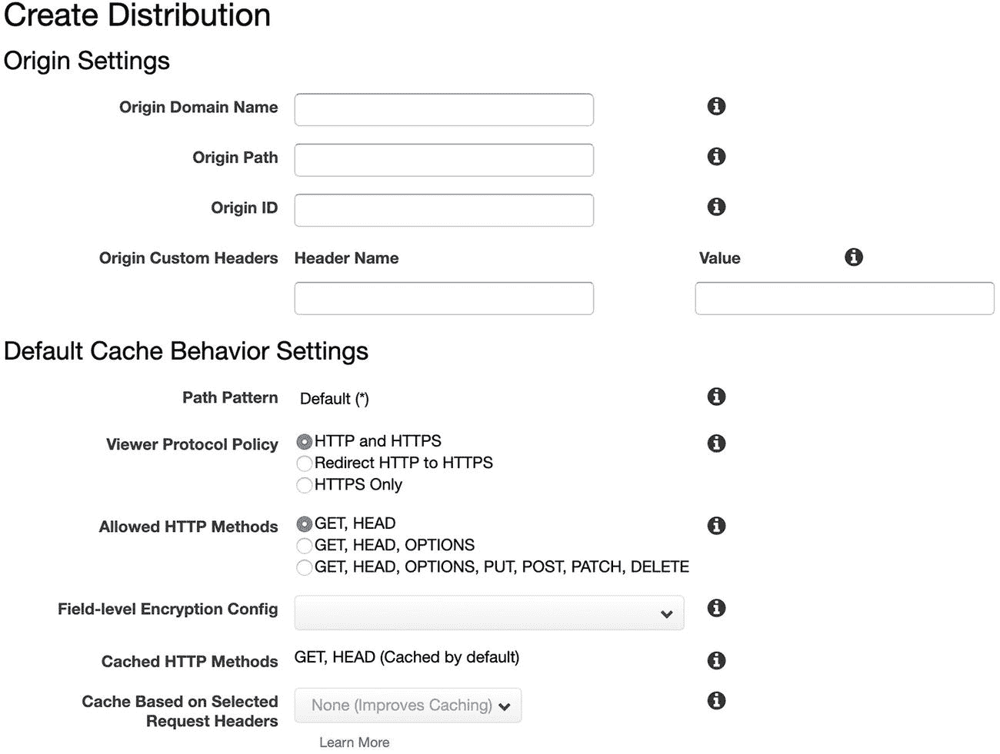
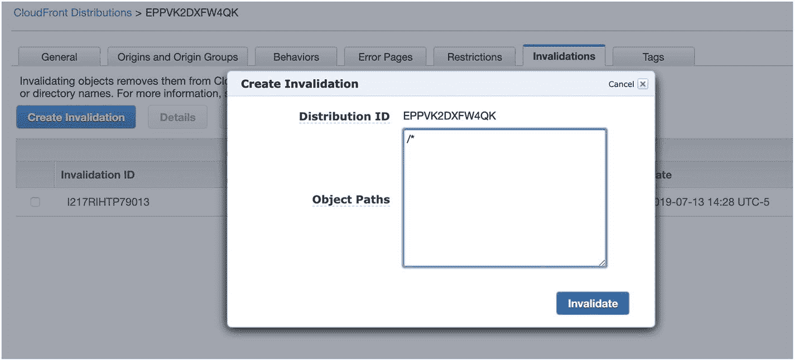

# 八、使用 CDN

到目前为止，我们对云应用的可伸缩性工作的重点是动态内容的服务(即从数据库查询中提取的内容)。然而，对于许多网站来说，动态内容实际上是系统中最小的部分。事实上，在任何网站上，大多数请求甚至不是针对动态内容，而是针对静态内容——图像、样式表和 JavaScript。因此，在考虑如何在云中扩展您的应用时，重要的是不要忘记扩展您的静态资产。

您可以通过创建更多的前端 web 服务器来扩展您的静态资产，因为它们通常是服务静态资产的服务器。然而，这可能会变得更昂贵(您必须保持更多服务器在线)并且更难管理(更多节点意味着更多管理)。

扩展静态资产实际上比扩展动态资产容易得多，因为您不必担心当它们改变时会发生什么。因此，有些服务是专门为扩展静态资产而构建的。扩展静态资产交付的服务被称为“内容交付网络”，也称为 CDN。

## 8.1 CDN 是如何工作的？

大多数 cdn 的工作方式是，它们有一个*全球*分布式内容服务器网络。假设您有一个 10MB 的图像，您希望由 CDN 提供服务。通常，如果该用户向您的服务器请求图像，那么您的服务器的处理时间和带宽将会被发送 10MB 的图像所限制。如果用户住在大洋的另一边，这是一个额外的问题，因为你的服务器会浪费大量资源来管理一个又慢又吵的连接。

CDN 允许你做的是将你的用户重定向到图片在 CDN 上的 URL。CDN 第一次看到 URL 时，通常对图像一无所知，但它有规则告诉它如何在您的服务上找到原始图像。从那时起，在 CDN 第一次获取图像后，每当有人请求该图像时，CDN 将设法将图像交付给用户，而完全不通过您的服务器。

此外，大多数 cdn 的服务器位于许多不同的物理位置。这些位置被称为“存在点”(pop)，那里的服务器通常被称为“边缘服务器”(正因为如此，cdn 通常被称为“边缘缓存”)。在各种 pop 中使用边缘服务器不仅允许 CDN 通过大量服务器提供可扩展性，边缘服务器还允许 CDN 提供与用户物理距离很近的*服务器。如果用户可以从附近的服务器获得大量数据，而不是漂洋过海去检索数据，这将大大提高用户的体验。*

CDN 为服务静态资产提供了本质上无限的规模——对于任何知名的 CDN，您都不必担心它们的网络溢出。只要资产没有变化，CDN 将完全能够处理对该资产的任意数量的请求。

通常，CDN 的主要成本是带宽。然而，许多 cdn 的带宽成本比云服务器低。现在，有了 Linode，你就必须有一个非常活跃的网站来超越你的带宽。尽管如此，如果你这样做了，如果带宽是由 CDN 提供的话，你需要支付的费用会稍微少一些。在任何情况下，即使您的服务器有足够的带宽，cdn 提高可扩展性的好处通常也是值得的，因为您不需要连续运行服务器来处理可能出现或可能不出现的流量。你只需要为你实际使用的带宽付费。

## 8.2 设置简单的 CDN

幸运的是，大多数 cdn 非常容易建立。在本书中，我们将使用亚马逊的 CloudFront 作为 CDN，尽管存在许多其他选项(CloudFlare、StackPath、CDN77 和 Fastly，仅举几例)。cdn 的好处在于，由于它们提供的服务相当透明，很容易混合和匹配 cdn 的服务提供商。

CloudFront 的工作方式非常简单:

1.  您在主站点上托管所有静态内容。这是你内容的“官方”存储库。

2.  您在 CloudFront 上创建一个主机来提供您的内容(通常会有一个名称，比如`xyzabc.cloudfront.net`)。

3.  你告诉 CloudFront 服务器你的主站点的 URL。

4.  每次从站点链接到静态内容时，都是使用 CloudFront URL 链接，而不是链接到自己服务器上的内容。例如，如果你的图片在 [`http://mysite.example.com/mydirectory/myimage.png,`](http://mysite.example.com/mydirectory/myimage.png) 链接到它，你可以使用 URL [`http://xyzabc.cloudfront.net/mydirectory/myimage.png.`](http://xyzabc.cloudfront.net/mydirectory/myimage.png) CloudFront 将从你的配置中知道如何找到`myimage.png`，并将它缓存并提供给你的用户。

CloudFront 第一次接收到对图像的请求时，它会到您的站点获取图像。接下来，任何未来的请求都将由 CloudFront 使用请求图像的用户附近的服务器直接提供服务。

让我们看看如何使用 Amazon AWS 和 CloudFront 来实现这一点。你需要做的第一件事是在 [`http://aws.amazon.com`注册 AWS。](http://aws.amazon.com)我想你可以自己完成注册过程。

AWS 有大量可用的服务，因此仪表盘不会列出所有服务，而是让您搜索一个。在搜索栏中输入“CloudFront ”,它将允许您进入 CloudFront 仪表板。

因为这是你第一次使用 CloudFront，它会给你一个按钮，上面写着“创建发行版”用 CloudFront 的术语来说，*发行版*就是一个 CDN 复制器服务。

点击“创建发行版”后，CloudFront 会询问您的交付方式，并让您选择“网络”或“RTMP”RTMP 是用于传输大量视频内容的协议。然而，由于我们只是分发像图像和样式表这样的基本资产，我们将选择从基本的 Web 交付开始。

然后亚马逊会询问你的销售细节，如图 8-1 所示。实际上，在这些选项下面有许多附加选项，但是唯一必需的字段是“原始域名”，这是您希望 CloudFront 从中获取资产的站点的 DNS 主机名。这个*不能*是一个 IP 地址，但必须是某种 DNS 主机名。如果您还没有为您的应用设置 DNS 主机名，您可以使用 Linode 自动生成的主机名。如果你进入 Linode 的节点平衡器屏幕，点击你的平衡器，它会给你一个(很长，可能分成两行)内部生成的平衡器主机名(类似于`nb-BALANCER-PUBLIC-IP-ADDRESS.dallas.nodebalancer.linode.com`)。填写“原始域名”后，向下滚动到页面底部。



图 8-2

CloudFront 发行版列表



图 8-1

创建 CloudFront 发行版

在页面底部，有一个“创建分发”按钮。点击此按钮后，您将进入一个显示新发行版的发行版列表，类似于图 [8-2](#Fig2) 。这个屏幕最重要的部分是“域名”，它向您展示了如何访问您新创建的发行版(您可能需要调整字段的大小，以便看到完整的名称)。它还会给你一个状态，从“进行中”到“已部署”需要 5 分钟到 1 小时的时间一旦部署完毕，您就拥有了一个正在运行的 CDN！

## 8.3 使用您的 CDN

一旦状态更改为“已部署”，该域名现在将完全反映您的原始站点。然而，它只是你网站的一个静态版本。如果你的网站发生变化，除非你要求，否则 CloudFront *不会*更新它的资产。

假设 CloudFront 给你的域名是`xyzabc.cloudfront.net`。这意味着如果你去 [`http://xyzabc.cloudfront.net/list.php`](http://xyzabc.cloudfront.net/list.php) ，它会显示你的留言簿列表。但是，如果您随后去修改您的留言簿列表，这些更改将不会反映在您的 CDN 上，它会将所有内容视为静态资产。这就是为什么在大多数情况下，cdn 只提供静态资产——图像、样式表、JavaScript 等等。

因此，让我们修改应用，通过 CDN 只提供我们的样式表，而不是通过 CDN 访问整个站点。我们要做的就是修改`common.php`的一行。在`getHeader()`函数中，我们只需将`<link>`标签改为:

```php
<link rel="stylesheet" href="http://xyzabc.cloudfront.net/guestbook.css" />

```

一定要用你的发行版的域名替换`xyzabc.cloudfront.net`！一旦在所有服务器上部署完毕，您的样式表现在将由 CDN 提供服务。



图 8-3

从 CDN 中删除内容

这意味着您的服务器几乎不会再提供样式表了。偶尔，CDN 可能会使其缓存的一些内容过期，但这取决于 CDN。CDN 将为自己优化存储多少数据，存储多长时间，以及重新请求原始文件的频率。对于更高级的应用，您可以配置 Apache 来提供一个`Expires:` HTTP 头或一个`Cache-Control:` HTTP 头，以指定 CDN 应该保存您的数据的最长时间。

然而，假设您部署了一个新版本的应用，它实际上有一个更新的样式表。这意味着 CDN 为您提供的版本现在已经过时了——它的缓存中可能仍然有旧版本。这根本不是问题，只是意味着你需要手动告诉 CDN“作废”你的内容，这样它才会再次请求。

要使 CloudFront CDN 上的内容无效，首先要单击 CloudFront 发行版的 ID。这将把您带到一个信息页面，描述在您的发行版上设置的所有选项。在最右边，有一个名为“无效”的标签单击此选项卡，然后单击“创建失效”这将把你带到一个类似于图 [8-3](#Fig3) 的屏幕。在“对象路径”字段中，只需清除那里的任何内容，只需键入`/*`即可使所有内容无效。虽然 CloudFront 允许细粒度的访问来使 CDN 无效并从 CDN 中删除特定的项目，但我发现，在大多数情况下，简单地使整个事情无效更容易、更干净。点击“无效”按钮使其无效。

失效可能需要几分钟才能扩散到 CloudFront 的所有服务器，但很快所有的服务器都会为您的新内容提供服务。当失效的“状态”变为“已完成”时，您将知道它何时完成

## 8.4 用 CDN 缓存整个站点

除了缓存单个内容片段，如样式表、JavaScript 和图像之外，现代 cdn 实际上还允许您缓存整个网站，为您提供跨互联网的即时可伸缩性。虽然这对于像我们这样的 web 应用不适用，但如果你有一个基本的网站，这可以让你的网站立即扩展到无限数量的用户，几乎不需要任何成本或额外的配置。

让我们来看看如何用 CloudFront 实现这一点。为了让 CDN 直接为您的网站服务，您需要将您的主站点的 DNS 指向 CDN 的服务器。

你可能认为你可以将你的网站的 A 记录设置为 CDN。然而，cdn 通常不会给你其主机的 IP 地址。其原因是 CDN 有*多个* IP 地址用于 CDN(每个 PoP 一个),它们通常依赖 DNs 查找来决定将哪个 IP 地址分配给哪个客户端(即，它将为客户端分配一个在地理上靠近它们的 IP 地址)。这意味着我们不能仅仅在 DNS 中指定 CDN 的 IP 地址来将网站指向它。

相反，cdn 通常通过 DNS CNAME 记录来处理这类事情。CNAME 是一个“规范名称”——它告诉浏览器对 DNS 查询使用不同的名称，并将该名称的结果用于我们自己的 DNS 查找。如果您将`www`设置为 CloudFront 主机的 CNAME，那么 CloudFront 仍然可以使用自己的 DNS 机制为每个客户端分配正确的 IP 地址。

然而，这产生了另一个问题。CDN 需要知道您可能通过哪个主机名访问它。也就是说，如果您将`www.example.com`命名为`abcxyz.cloudfront.com`，CloudFront 需要知道当它的一台机器接收到对`www.example.com,`的请求时，它应该提供与`abcxyz.cloudfront.com`相关的缓存。

这是通过 AWS 中的分发设置完成的。这些设置位于发行版的“常规”选项卡下。点击“编辑”并寻找一个名为“备用域名(CNAMEs)”的字段您可以在这里输入您为该发行版命名的任何主机名(每行一个或用逗号分隔)。

然而，这带来了一个问题，因为 CDN 需要一个地方来检索您的数据，而您只是将您的 DNS 指向 CDN，而不是您自己的服务器！要解决这个问题，您只需设置一个内部 DNS 名称，CDN 从这个名称中提取(您可以将这个名称称为`www2.example.com`或 [`www-internal.example.com`](http://www-internal.example.com) )，然后将`www`的 DNS 设置为指向 CDN(注意，我们使用“内部”并不是指只对我们可见，因为它在公共互联网上与主站点一样多，而是表示它不是我们将最终用户导向的目的地)。

这样做，CDN 允许无限增长的访问者访问你的网站。

### 处理裸域名

从技术角度来说，您不能为根级域名创建 CNAME。你可以为`www.example.com,`做 CNAME，但不能为`example.com`做。虽然您的 DNS 服务器可能允许这样做，但这是违反规范的，可能会给不希望这样做的客户端带来各种奇怪的问题。因此，您需要确保有一种机制将您的裸域名(即`example.com`)重定向到您的 CNAMEd 主机(即`www.example.com`)。

为了解决这个问题，许多 DNS 提供商提供重定向服务，自动将对裸域名的所有请求重定向到`www`主机。如果你的 DNS 提供商不提供这项服务，`wwwizer.com`的好心人会免费为你提供这项服务。本质上，如果您将空白域的 A 记录指向`174.129.25.170`，它将自动重定向到前面有`www`的同一个域。

有关该服务的更多信息，请访问 [`http://wwwizer.com/naked-domain-redirect`。](http://wwwizer.com/naked-domain-redirect)还要记住，和任何过于廉价的服务一样，你应该采取适当的谨慎措施。让他们重定向你的流量可以简化事情，但让一个你没有合同的第三方为你重定向你的流量也会有问题。

## 8.5 将 CloudFront 放在整个应用的前面

使用我们的应用，内容是动态的。这使得在它前面放置一个像 CloudFront 这样的 CDN 变得困难(但是，正如我们将看到的，并非不可能)。使用 CloudFront 带来了一个问题——我们如何防止人们查看陈旧的内容？

事实上，大多数 cdn 可以像我们处理本地缓存一样被处理。我们可以简单地为我们的内容设置一个最大到期日期。

在 CloudFront 上，如果你查看你的发行版，你会看到一个“行为”标签。点击这个，你会看到一个单一的，默认的行为。这些行为允许您在服务器的不同内容路径上设置不同的设置。对于这个例子，我们只需要编辑已经存在的那个。选择当前行为，然后点按“编辑”

如果向下滚动，您将看到一组 TTL(生存时间)值，以秒为单位。要更改这些值，首先将“对象缓存”设置从“使用原始缓存头”更改为“自定义”如果您不希望内容超过 5 秒，请将“最大 TTL”设置为 5。这意味着在重新查询内容之前，缓存将只保留内容 5 秒钟。因此，内容可能有点陈旧，但不会太陈旧。

这就引出了另一个问题 CDN 将如何处理向服务器发送表单？这也可以通过行为设置来处理。在“允许的 HTTP 方法”下，选择包含所有 HTTP 方法的选项。CDN 将只缓存 GET 和 HEAD 请求，但会将所有其他请求直接转发到您的服务器。

此外，默认情况下，CloudFront 不会将 cookies、HTTP 头或查询字符串转发给服务器。这是为了减少它必须发出的源请求的数量，以及它必须缓存的对象的数量。然而，在我们的应用中，您看到的内容是基于查询字符串的。因此，您需要将“查询字符串转发和缓存”设置为“全部转发，基于全部缓存”，以使应用正常工作。

所有这些设置完成后，单击“是，编辑”保存行为更改。

现在，您可以转到您的 CloudFront 发行版的 URL，并像使用常规网站一样使用它。您也可以按照 8.4 节中的说明，让用户通过您的网站自己的主机名访问它。

在您疯狂地使用这样的应用设置之前，请记住所有的缓存设置都是一种平衡。如果您的缓存使用了太多的键(即路径、头、查询字符串、cookies)，那么您的大部分内容将被传递到服务器(即没有被缓存)，并且您不会获得性能提升。事实上，这只会增加开销和成本，因为你必须支付高速缓存的带宽和服务器的带宽。但是，如果缓存设置过于宽松，用户将会看到过时的数据，或者更糟糕的是，看到其他人的数据！例如，如果您的内容是基于 cookie 进行个性化的，但是您没有使用 cookie 作为缓存键的一部分，那么如果 Jim Bob 请求了一个页面并将其放入缓存，当 Jane Doe 请求相同的页面时，她将获得 Jim Bob 的页面！

那么，拥有高度个性化 web 应用的人如何更好地利用 CDN 呢？答案就是把你的应用翻个底朝天。

## 8.6 彻底改变你的应用

我们在上一节中遇到的问题是向用户交付高度定制的页面，同时仍然充分利用缓存。拥有定制页面通常意味着它们是不可缓存的。这种困境可以通过为您的网站采用“由内向外”的页面架构来解决。

历史上，web 应用是通过让服务器生成页面来构建的。当用户导航到一个 URL 时，服务器获取一个模板，将其与用户数据结合，并添加页面内容以生成最终的 HTML 页面。然后，这个 HTML 页面作为一个整体返回给用户。

这种架构运行良好有多种原因:

*   大多数 web 应用框架都是围绕这个范例构建的。

*   这种架构非常符合 HTML 的结构方式。

*   这种架构很容易构思和构建。

*   这种架构需要更少的规划来实现。

*   这种架构几乎不需要前期开发。

*   网络的大部分历史都植根于这种架构。

*   这种架构的优化是最后执行的(即过早优化是万恶之源)。

然而，这种架构的问题在于，对于大多数用例来说，它在高流量的情况下效率非常低。

通过多年来 Ajax 技术的发展，构建应用的另一种方法是将页面翻过来。也就是说，在典型的架构中，服务器生成包含动态内容的页面。在新的方式中，服务器生成一个基本上静态的页面，但是对于任何动态内容，*将*回调到服务器。

例如，想象一下，有一个列出你的产品的页面。在典型的 web 框架中，您的服务器将执行以下任务:

1.  用户的浏览器向服务器请求特定的页面。

2.  服务器端开始 web 应用流程引擎(PHP，Ruby on Rails 等。).

3.  应用访问数据库以获取产品列表。

4.  应用为产品列表生成 HTML。

5.  应用访问数据库以获取用户的状态信息(即登录信息、购物车信息、其他状态信息等)。).

6.  该应用生成 HTML 页眉和页脚，其中包含用户的状态信息以及他们在页面导航中的位置。

7.  应用将生成的片段拼接成整个 HTML 页面。

8.  服务器将最终的 HTML 页面返回给用户。

9.  用户的浏览器呈现页面。

正如你所看到的，这是一个相当复杂的过程，在整个页面被呈现在服务器上之前，用户不会得到任何反馈。这导致服务器需要等待很长时间才能完成。

然而，如果我们把它翻过来，我们可以实现一个更好的优化策略。我们要做的是将页面作为静态页面提供，然后让用户自己的浏览器负责获取基于用户的内容并将页面拼接在一起。

新的序列如下所示:

1.  用户的浏览器从 CDN 请求页面。

2.  假设它已经被缓存，用户附近的 CDN 服务器立即用页面内容(即产品列表)进行响应。

3.  用户的浏览器加载内容并立即显示，在任何特定于用户的数据旁边有一个加载微调器。

4.  该页面执行 JavaScript，向服务器发出请求，请求用户的状态信息。

5.  服务器发回用户的 JSON 编码的状态信息。

6.  该页面呈现网页的其余组件。

在这个序列中，服务器的负担大大减轻。它不再需要查询产品列表、生成页眉和页脚，或者将页面缝合在一起。所有这些都发生在用户和 CDN 之间的快速交易中。服务器只对用户的会话状态负责(即使这样也常常可以本地化到用户自己的浏览器！).这允许大量的动态、交互式内容，而对服务器的负担很小。

这个概念可以进一步扩展，甚至可以在事后生成产品列表。API 请求本身也可以被缓存，使用与主 web 页面相同或不同的设置。

如您所见，如果应用的架构合理，CDNs 为提高网站速度提供了一个非常灵活和强大的工具。

这种方法的主要缺点是实施时需要大量的计划和预见。这种方法需要决定一个 Ajax 和动态 HTML 框架，设计一个好的应用架构，开发 API 和 API 认证，并规划包含所有部分的页面布局。在旧的架构上，你通常可以随意地制作页面，它们仍然可以工作。当使用由内而外的架构时，您必须从计划开始，这需要相当多的前期工作。本书并不试图展示由内向外的页面架构的代码，正是因为它需要大量的代码来实现。

在任何情况下，无论您的应用架构是什么，大多数应用都可以从某种 CDN 解决方案中受益。