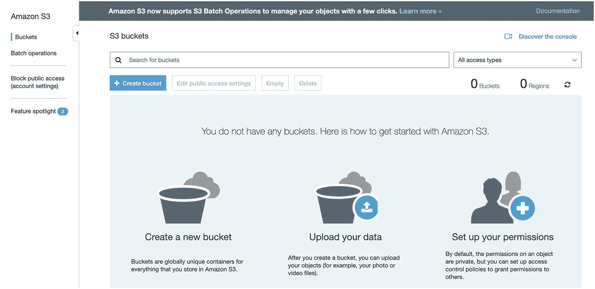
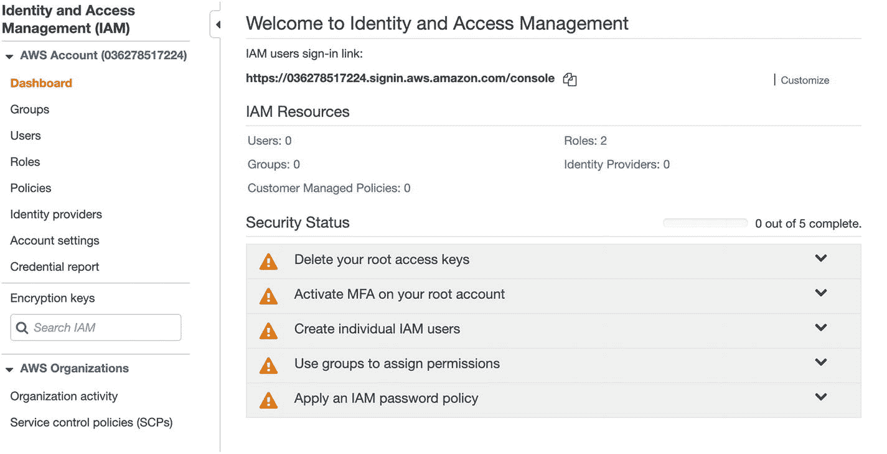
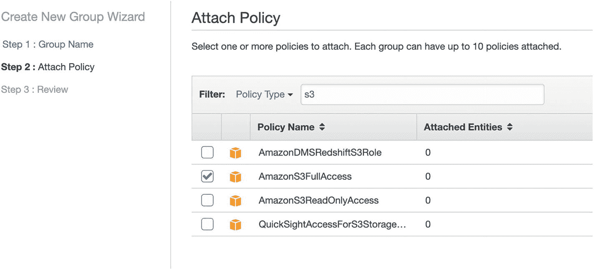
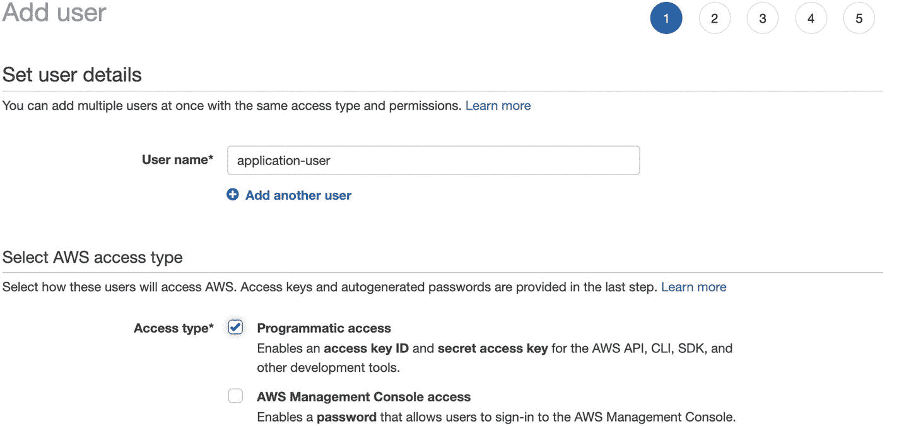
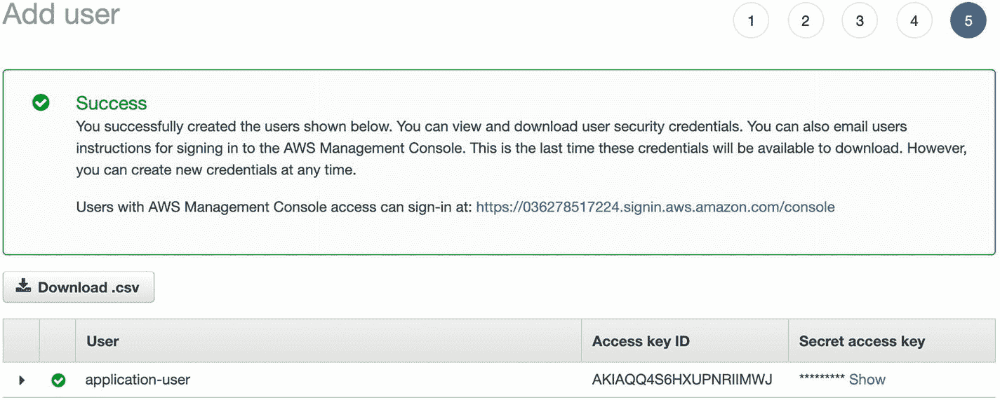
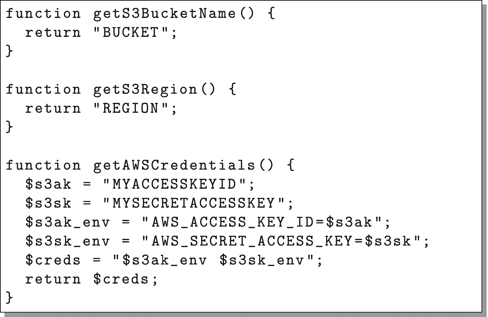
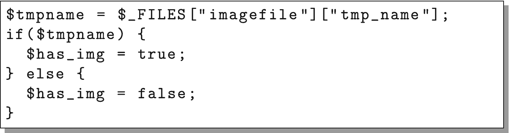
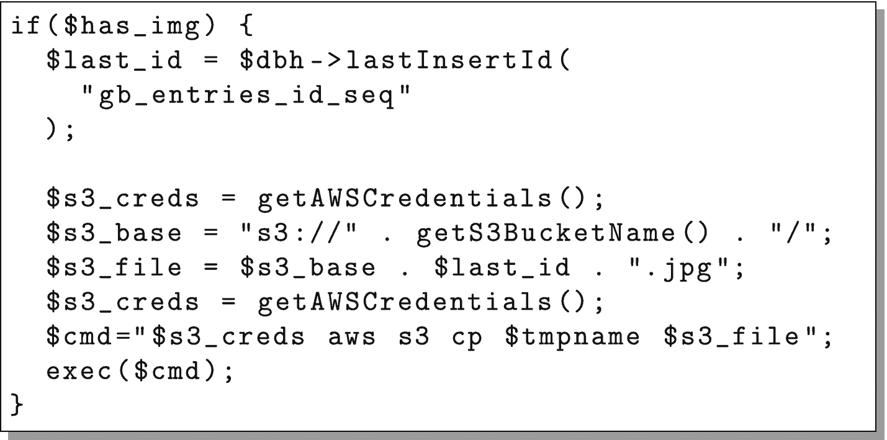
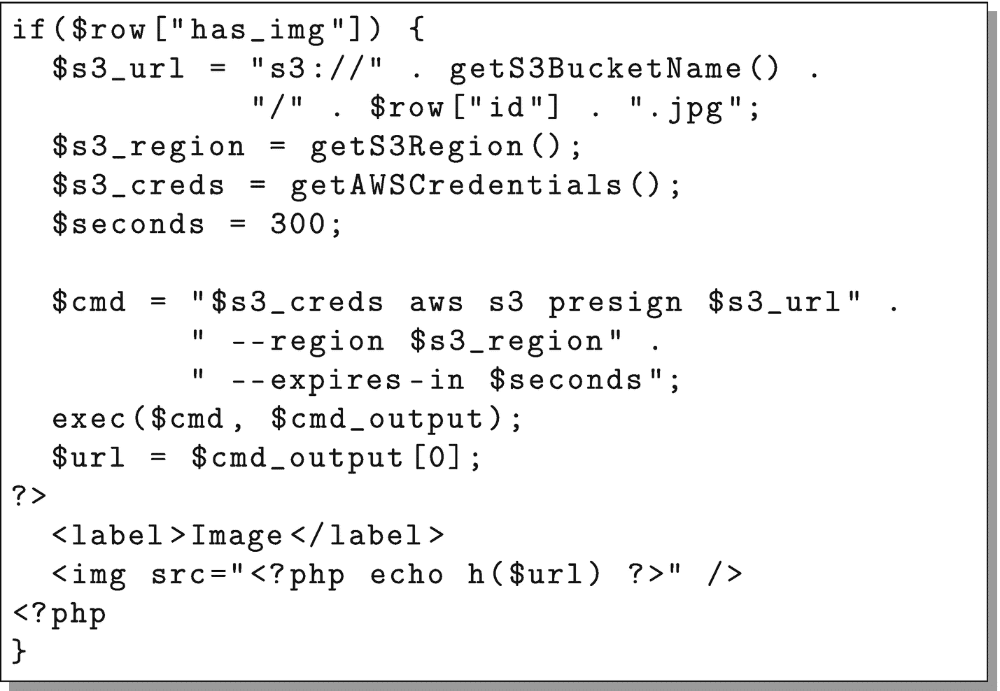

# 9.将 S3 用于无限磁盘空间

对于一个真正可伸缩的站点，另一个经常需要的方面是无限的磁盘存储。管理服务器的大规模存储确实是一项艰巨的任务。决定多少冗余、多少可访问性、每台服务器有多少磁盘，以及如何管理磁盘以确保您提前知道磁盘是否出现故障是一项艰巨的任务。即使对于小规模的站点，管理文件也是困难的。

令人欣慰的是，使用文件存储服务将允许你把这些任务外包给第三方，可能比你自己做要便宜得多。文件存储服务的黄金标准是亚马逊的 S3 服务。S3 代表简单存储服务。这个缩写在很大程度上是正确的——对于简单的情况，S3 很容易设置，但是对于更复杂的任务，它也有相当大的灵活性。

S3 以极低的每千兆字节成本为你提供无限的空间。它将随着您的需要而扩展，并防止您遇到因本地存储文件而带来的所有文件管理难题。

其他云存储服务也存在，许多具有更好的定价结构。一些比较常见的包括 Backblaze B2，数字海洋的空间，和 Rackspace 的云文件。这里我们使用 S3，因为它拥有最广泛的采用和集成。

## 9.1 入门

S3 是亚马逊 AWS 工具套件的一部分。因此，您可以使用您在第 [8](08.html) 章中创建的相同登录来访问 AWS。

一旦登录 AWS(网址为 [`http://aws.amazon.com`](http://aws.amazon.com) )，就可以在“存储”标题下访问 S3。当你点击 S3，你会得到一个类似图 [9-1](#Fig1) 的屏幕。



图 9-1

最初的 S3 屏幕

该屏幕的主按钮是“创建存储桶”按钮。S3 将所有文件组织成他们所谓的“桶”存储桶有点像命名硬盘。那是你储存所有文件的地方。桶名必须是唯一的，不仅对你的帐户，而且实际上在整个亚马逊。因此，对于 Amazon buckets，您不应该依赖任何特定的命名约定，这些约定假定您可以预测将来会有什么名称。相反，最好在您的应用中配置存储桶名称，这样更容易管理。

当您单击“创建存储桶”时，它会要求您输入存储桶名称和区域。AWS 将除了 CloudFront 之外的几乎所有服务组织成区域。就我们的目的而言，该地区本身并没有太大的不同。但是，如果您有特定的原因需要在特定的物理位置放置一个铲斗，AWS 允许您选择铲斗的放置位置。单击“创建”按钮创建您的存储桶。

一旦您成功地创建了您的 bucket，您应该得到一个 bucket 列表(只有您的一个 bucket)。如果你点击你的桶，你可以浏览你的空桶。要了解 S3，只需从硬盘上传一个文件到桶中。点击“上传”按钮，然后你可以从你的电脑拖放文件到你的桶。点击“上传”让他们上传。

## 9.2 的文件夹

如果您在 S3 控制台上四处看看，您会注意到您能够在您的存储桶中创建文件夹/目录。然而，在 S3，文件夹实际上是不存在的。实际上，S3 桶有一个完全扁平的结构，只有文件名和文件(从技术上讲，文件名称为“键”，文件本身称为“对象”)。但是，文件名可以包含斜杠字符。AWS 用户界面然后使用斜杠字符向您显示文件，就像它们在文件夹中一样。当你在 S3“创建一个文件夹”时，它实际上是创建一个文件夹名的空文件，文件名以斜杠结尾。简而言之，S3 控制台让你看起来像有文件夹和子文件夹，但实际上它只是一大堆文件，其中一些文件的名称中有斜线，S3 控制台用它来分隔成假文件夹，以便更容易查看。

## 9.3 获取凭据

在我们将 S3 帐户连接到服务器之前，我们需要创建一组安全凭据。为此，AWS 使用了一个名为 IAM 的系统，即“身份和访问管理”。IAM 允许您创建具有受限权限的用户，这样，如果您的安全密钥遭到破坏，就不会让攻击者完全控制您的环境。与其他服务一样，IAM 可以通过在其服务列表下搜索 IAM 来找到。当你第一次加载 IAM 屏幕时，它看起来如图 [9-2](#Fig2) 所示。



图 9-2

IAM 初始仪表板

IAM 主要使用“组”来管理权限，组本质上是权限的容器。因此，我们将从创建一个组开始。首先单击左侧面板上的“Groups ”,这将显示一个空的组列表。然后点按“创建新群组”这将打开一个屏幕，要求输入该组的名称。我们将使用名称`guestbook-access`(名称并不重要，我们稍后只需引用该名称)。单击“下一步”继续。

接下来，您将把策略附加到该组。策略是复杂的权限组。谢天谢地，AWS 有非常有用的预定义策略。出于我们的目的，我们只需要名为“AmazonS3FullAccess”的策略。您可以在“过滤器”框中搜索它，然后在找到时选择它。图 [9-3](#Fig3) 显示了它的样子。



图 9-3

将策略附加到组

最后，它会要求您审核并最终确定您的小组。单击“创建组”完成。

现在，您可以将用户添加到组中。在屏幕左侧，单击“用户”链接。这将把您带到一个空的 IAM 用户列表。要开始，请单击“添加用户”按钮。

在下一个屏幕中，将要求输入用户名和访问类型，如图 [9-4](#Fig4) 所示。我们称用户为`application-user`，尽管实际的名字并不重要。在“访问类型”下，选择“编程访问”这意味着创建的用户将不能登录，但只能使用 API。



图 9-4

创建 IAM 用户

在下一个屏幕中，它将要求您将用户添加到一个组。只需选择您之前创建的组(我们称之为我们的组`guestbook-access`)。下一个屏幕允许您为该用户设置标记。我们不需要，所以您可以跳过此屏幕继续。最后，它会要求您检查您的信息。此时，您可以单击“创建用户”，它将为您创建用户。

创建用户后，您现在可以下载他们的凭据。屏幕如图 [9-5](#Fig5) 所示。它列出了用户和两个特殊字段:“访问密钥 ID”和“秘密访问密钥”这两个字段实质上充当该用户的 API 的可重置用户名(“访问密钥 ID”)和密码(“秘密访问密钥”)。您可以下载凭据，也可以从屏幕上的字段中复制凭据。



图 9-5

正在检索 IAM 凭据

接下来，我们将把实际的访问密钥 ID 称为`MYACCESSKEYID`，把实际的秘密访问密钥称为`MYSECRETACCESSKEY`。

如果您后来丢失了这些凭据，您将无法再次获得它们。但是，您可以返回到用户的记录中，创建一组新的凭证。如果以后服务器的安全性受到威胁，您可以停用旧的凭据，并为同一用户颁发新的凭据。

## 9.4 通过命令行访问 S3

AWS 有一个命令行工具，不仅允许访问 S3，还允许访问它们的各种可伸缩性 API。要安装它，请在模板节点上以 root 用户身份发出以下命令:

```php
yum install -y awscli

```

AWS 命令行有两种主要方式来指定您的访问密钥 ID 和秘密访问密钥。您可以通过环境变量或配置文件来实现。环境变量更灵活，所以我们将走这条路。

如果您不熟悉命令行，环境变量是在命令行会话中设置的变量。不仅如此，您调用的命令还可以访问您的所有环境变量。此外，您设置的任何环境变量在您注销时都会消失，因此它们需要在您每次登录时重置(如果您希望它们在登录时自动设置，您可以将设置它们的命令放在一个名为`.bash_profile`的文件中)。

`aws`命令为您的凭证使用的环境变量是`AWS_ACCESS_KEY_ID`和`AWS_SECRET_ACCESS_KEY`。要设置这些变量，请在您的终端中输入以下命令(用您的实际按键替换`MYACCESSKEYID`和`MYSECRETACCESSKEY`):

```php
export AWS_ACCESS_KEY_ID=MYACCESSKEYID
export AWS_SECRET_ACCESS_KEY=MYSECRETACCESSKEY

```

现在你可以使用`aws`命令来操作你的 S3 桶。要获得您的存储桶列表，发出以下命令:

```php
aws s3 ls s3://

```

它应该列出您在第 9.1 节中创建的存储桶。

要列出该 bucket 的内容，发出以下命令(用 bucket 的实际名称替换`BUCKET`):

```php
aws s3 ls s3://BUCKET/

```

为了理解命令的工作方式，`aws`是我们正在使用的主命令，`s3`告诉我们要使用哪组子命令，`ls`就像 Linux 上的`ls`命令(它列出了内容)，`s3://BUCKET/`是我们想要查看的位置。

`aws`命令也给出了操作文件的其他常用命令。代替`ls`，我们可以使用`cp`将文件复制进和复制出桶。如果您有一个名为`test.txt`的文件，您可以使用以下命令将它复制到您的 bucket 中:

```php
aws s3 cp test.txt s3://BUCKET/

```

要将一个文件*从*你的桶*复制到*你的节点，只需切换`s3://BUCKET/`和`test.txt`的位置。

此外，您可以为您的文件创建临时访问 URL。这些 URL 是签名的 URL。这意味着 AWS 知道一个授权的人生成了这个 URL，并且 AWS 将在指定的时间内信任这个 URL 作为访问该文件的有效手段。

这允许您直接将人们引导到 AWS 站点来检索他们需要的数据，而不是必须将数据传输到您的服务器，然后自己发送。它节省了处理能力、带宽和响应时间。

然而，为了做到这一点，我们需要知道这个桶在哪个区域。您在创建 bucket 时指定了一个区域，但是 AWS 并不总是显示该区域的“计算机化”版本，这是命令行所需要的。发出以下命令来查找您的 bucket 的区域(用您的 bucket 名称替换`BUCKET`):

```php
aws s3api get-bucket-location --bucket BUCKET

```

这将返回一个 JSON 编码的值。这个键叫做`LocationConstraint`，这个值是这个桶所在区域的名称。该地区的一些常见值是类似于`us-east-1`、`us-east-2`、`ca-central-1`、`eu-west-2`等字符串。我们将使用 REGION 来表示您所在的地区。

要获取访问文件的 URL，请使用以下命令:

```php
aws s3 presign s3://BUCKET/FILE --region REGION

```

这将生成一个 URL，您可以将其复制并粘贴到您的浏览器中。瞧，文件将会出现！但是，这个网址只能用 3600 秒(1 小时)。如果您希望 URL 在不同的时间内有效，您可以使用`--expires-in`标志来告诉它。因此，如果您希望 URL 在 20 秒后过期，您只需在命令中添加`--expires-in 20`。

### 内联指定环境变量

在我们开始编码之前，我想快速补充一下，让您知道设置环境变量的另一种方法。您可以设置一个环境变量，使其仅对一个应用有效，方法是在给定命令本身之前指定要在同一行上设置的环境变量。

例如，如果我要运行命令`example-command`，并且我想将环境变量`MYVAR`设置为`myval`，我可以这样运行命令:

```php
MYVAR=myval example-command

```

这将设置环境变量，但仅用于运行命令。在运行命令时，您实际上可以设置任意多的环境变量，它们只需用空格隔开。例如，要设置两个值，我们可以这样做:

```php
MYVAR1=val1 MYVAR2=val2 example-command

```

这就是我们在将要创建的应用中设置凭据的方式。出于配置目的，实际上最好将凭证(和其他配置信息)放在代码之外，并通过服务器上的环境变量来设置它们。然而，这需要比本书更深入的、特定于服务器的配置细节。

## 9.5 将您的应用连接到 S3

现在我们知道了如何从我们的服务器与 S3 对话，我们现在将把我们的留言簿应用连接到 S3，这样用户就可以上传他们的消息和图片。这实际上相当简单。我们要做的就是

1.  创建一些通用函数来获取 AWS 配置信息。

2.  允许我们的表单有一个图像字段。

3.  创建留言簿条目时检查图像上传。

4.  把图像传送到 S3。

5.  查看留言簿条目时，为图像创建一个签名的 S3 URL。

第一步是在`common.php`中创建一些助手函数，用于处理 AWS 凭证和配置。图 [9-6](#Fig6) 显示了其功能。记住用您自己的值替换 BUCKET、ACCESSKEY 和 SECRETKEY。



图 9-6

AWS 配置对`common.php`的补充

函数`getAWSCredentials()`将返回一个字符串形式的凭证，该字符串可以在前置到命令字符串时设置环境变量。

下一步是在`new.php`中的表单上放置一个图像字段。这包括两个部分。我们必须做的第一件事是修改`<form>`标签，以便它允许文件上传。为此，将属性`enctype="multipart/form-data"`添加到`<form>`标签中。否则，文件输入标签实际上不会上传文件。

接下来，我们需要添加一个文件上传字段。就在提交按钮之前，添加以下几行:

```php
<label>Image (JPEG)</label>
<input type="file" name="imagefile" />

```

现在，您的表单被配置为可以上传文件。接下来，我们将配置`create.php`来接受文件上传。



图 9-7

修改`create.php`以检测文件上传

我们必须改变两个部分。首先，用图 [9-7](#Fig7) 中的代码替换线`$has_img = false;`。这段代码检测一个文件是否被上传，如果是，确保数据库被更新以反映这一点。其次，将图 [9-8](#Fig8) 中的代码添加到显示`$stmt->execute();`的行之后。这是把文件传送给 S3 的代码。



图 9-8

修改 create.php 向 S3 传输文件

现在，我们只需要提供一种方法来查看图片，如果你点击留言簿条目。为此，我们需要修改`single.php`。只需将图 [9-9](#Fig9) 中的代码添加到显示`getFooter()`的行之前。



图 9-9

修改`single.php`以显示图像

这段代码将为上传请求一个签名的 URL，然后将它放在一个图像标签中以供查看。

注意，对于一个真实的应用，我们希望验证上传的文件确实是一个 JPEG 文件。否则，任何人都可以上传任何东西，黑客可以很容易地滥用该系统作为一个免费的文件共享网站，或用于其他邪恶的目的。此外，您可能希望有一个管理功能来验证上传的图像是适当的。否则，有人会轻易地把你的留言簿变成色情分享网站。这些超出了我们简单的示例应用的范围，但它们是值得记住的好东西。

还要记住，你最终不仅要为存储空间付费，还要为进出 S3 的所有流量支付带宽使用费。未能保持警惕可能会付出高昂的代价。

现在您需要在`template_node`上测试您的新代码，然后，当它工作时，通过重新映像服务器将它部署到您的云集群，如 6.3 节所述。

现在试试你的应用——它现在有了亚马逊 S3 无限的文件存储空间！

注意，还有一个用于 PHP 的 AWS 库，它具有 S3 功能。这里，我们使用命令行，因为我们已经在前一节中学习了该工具。关于 AWS PHP 库的信息可以在 [`https://docs.aws.amazon.com/sdk-for-php/`](https://docs.aws.amazon.com/sdk-for-php/) 获得。

### 关于 S3 签名到期的说明

在处理签名 URL 时要记住的一件事是要警惕它们如何与缓存交互。在这种情况下，`single.php`没有被缓存，所以没有真正的担心。但是，如果是的话，确保 URL 的过期时间比呈现的代码在缓存中的时间长得多是很重要的。

例如，如果 URL 只在 30 秒内有效，但缓存持续了一个小时，那么，在第一个 30 秒结束后，在这一小时的剩余时间里，用户将获得他们无法使用的 URL。当问题开始出现时(或者最好是在问题出现之前)，请记住这一点。

###  S3 文件权限

除了已签名的 URL 之外，还可以通过授予对文件的公共访问权限来允许访问 S3 文件。这是可行的，但不是共享文件的最佳方法。问题是，如果你只是提供一个公开共享的网址供人们访问，那么这个网址就可以被分享，人们就可以出于自己的目的使用你的 S3 资源，完全绕过你的网络应用。这意味着你可能会花钱成为别人的文件服务器。

即使您没有立即在应用中实现对文件访问的谨慎控制，强制每个人使用由您的应用控制的签名 URL 来访问 S3 对象(如我们在此所示)也意味着当您准备好实现访问控制时，一切都准备好了。至少，它可以防止在互联网上公开分享 S3 网址，这些网址使用你的 AWS 帐户资源下载大文件。

如果您真的喜欢这样做而不是签名的 URL，您可以通过首先在 bucket 本身上启用公共访问，然后设置每个人都可读的单个文件来管理它。这也意味着您需要对新上传的文件设置权限。您可以在`aws s3 cp`命令中这样做，方法是在命令末尾添加以下标志(URL 应该与该行的其余部分在同一行，等号后面没有空格):

```php
--grants read=uri=http://acs.amazonaws.com/groups/global/AllUsers

```

但是，这只有在 bucket 本身被配置为允许公共访问时才有效。