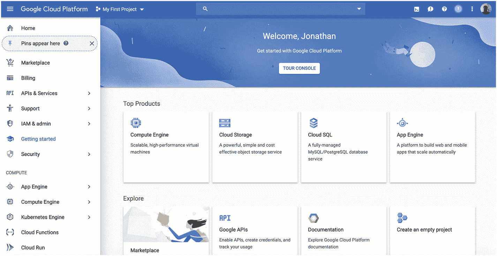
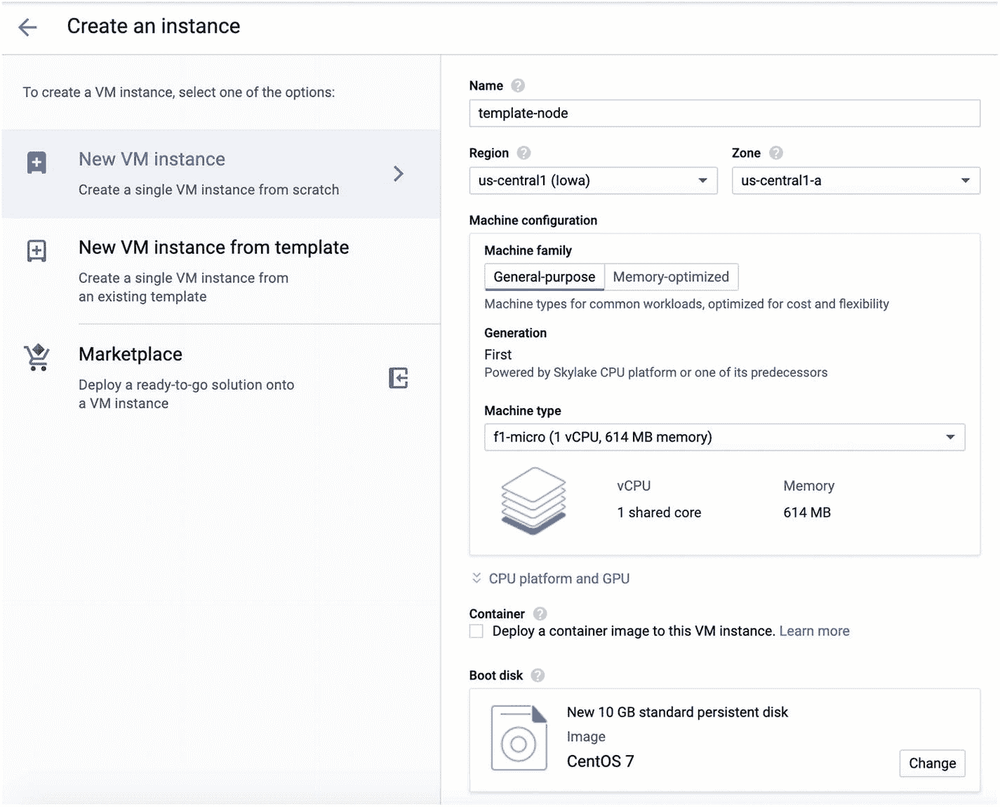
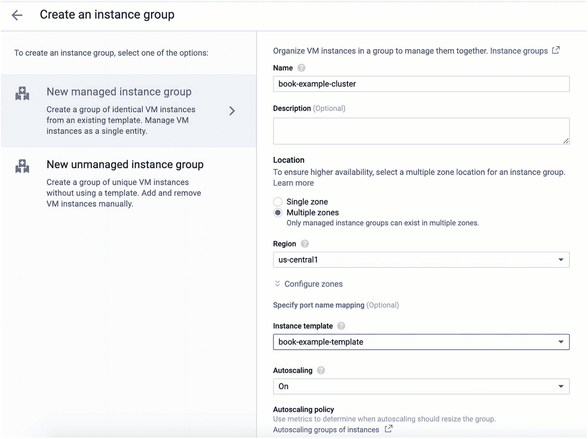

# 11.使用谷歌云平台

既然您已经有了与多家云提供商合作的经验，我希望您能够意识到云的基本组件并不会因为提供商的不同而有太大的变化。每个人可能调用不同的东西，可能有一点点不同的设置过程，或者可能有一些额外的能力或限制。然而，就其核心而言，不同提供商的 IaaS 云托管的基础非常相似。

这本身就是 IaaS 的一个优势。这意味着，如果您想从一个 IaaS 迁移到另一个 IaaS，这实际上是一个相当简单的过程。这可能需要计划和执行时间，但是，由于节点本身在您的控制之下，您可以使环境彼此完全相同。

我们要看的下一个提供商是谷歌云平台(GCP)。GCP 是 2008 年成立的新公司(Linode 成立于 2003 年，AWS 于 2006 年上线)。GCP 与 AWS 非常相似，尽管配置起来有点麻烦。您可以在 [`https://cloud.google.com`](https://cloud.google.com) 报名，开始体验 GCP。



图 11-1

GCP 欢迎屏幕

## 11.1 设置模板节点

关于 GCP，首先要知道的是一切都被组织成“项目”每个项目有点像它自己的帐户，每个都有自己的资源、服务等等，但是都可以在同一个登录中访问。

当你登录谷歌云平台时，它应该看起来像图 [11-1](#Fig1) 。请注意，在顶栏上，文本“Google Cloud Platform”旁边，列出了您当前项目的名称。您可以单击当前项目来更改项目或创建新项目。对于这个例子，我将创建一个名为`Book Examples Project`的新项目。

屏幕左侧列出了 GCP 服务。要创建新机器，请转到服务的“计算”部分，单击“计算引擎”，然后单击“虚拟机实例”GCP 称它的机器(或节点，正如利诺德所说)“虚拟机实例”要创建新机器，请单击“创建实例”按钮。这将弹出一个类似图 [11-2](#Fig2) 的屏幕

我们将我们的机器称为`template-node`，并选择最小的机器类型(本例中为“f1-micro”)。对于启动盘，我们会选择 CentOS 7。向下滚动，有一个“防火墙”部分。确定“允许 HTTP 流量”和“允许 HTTPS 流量”都已启用。其余的默认设置你可以不去管。当一切都设置好了，点击“创建”, GCP 将为你创建一个新的机器，并返回到虚拟机列表屏幕。



图 11-2

创建 GCP 虚拟机实例

创建机器后，您可以使用“连接”选项登录。在“连接”栏的下拉菜单中，选择“在浏览器窗口中打开”，它将在您的浏览器中为您提供一个`ssh`会话。

CentOS 的这个安装与 Linode 的安装非常相似，除了(a)它不包括`nano`(您可以用一个简单的`yum install -y nano`来修复它),以及(b)它自动为您创建一个用户，并让您以该用户的身份登录。您可以通过运行以下命令轻松切换到 root 用户:

```php
sudo su -

```

从那时起，您可以安装`nano`并执行第 [3](03.html) 和 [4](04.html) 章中概述的所有配置步骤。

### 公共与私有 IP 地址

GCP 和 Linode 之间的一个有趣的区别是，在 Linode 上，您的节点的公共 IP 地址是物理连接到您的节点的。也就是你发出`ip addr show`的时候，显示的是公有 IP 地址。当您添加专用 IP 地址时，它会将该专用 IP 地址添加到您的节点中。

然而，在 GCP，你的节点*以私有地址和公有地址开始。但是，私有地址是唯一物理映射到设备的地址。在网络设备上配置公共 IP 地址，以便将这些请求转发到您的机器。*

因此，在机器上的所有配置中，您将使用包装盒上的私有 IP 地址。此外，您不必担心只能监听您的私有 IP 地址，因为这实际上是您所拥有的全部。GCP 网络控制哪些服务可以从外部进入您的机器(这就是为什么您在设置虚拟机实例时选中了 HTTP 和 HTTPS 框，以告诉 GCP 将这些类型的请求路由到您的私有 IP 地址)。

基本上，除非另有说明，GCP 的一切都仅限于本地网络。

## 11.2 为远程访问设置数据库服务器

为了将我们的`template-node`用作数据库服务器，我们需要准备好远程访问我们数据库的设备。为此，我们需要做到以下几点:

1.  修改`/var/lib/pgsql/data/postgresql.conf`并设置`listen_addresses='*'`。我们不需要*让*专门将其设置为私有 IP 地址，因为这是我们唯一的 IP 地址，除非我们将 GCP 配置为允许，否则无法从互联网访问它。用`systemctl restart postgresql`重启 PostgreSQL，这样修改就会生效。

2.  更改防火墙，以便我们允许连接到 PostgreSQL 服务器。这将是命令`firewall-cmd --add-port 5432/tcp`和带有`--permanent`标志的相同命令。

3.  修改 PHP 代码`getReadOnlyConnection()`和`getReadWriteConnection()`，使它们连接到正确的私有 IP 地址。

现在，负载平衡集群可以使用服务器了。

## 11.3 创建复制映像

在 GCP 创建复制映像是一个有点过于复杂的三步过程。首先，您需要为您的实例创建一个“快照”，然后您需要从该快照创建一个“映像”，最后您将需要创建一个“实例模板”快照本质上是机器的备份。该映像本质上是一个快照，旨在用于为机器创建新的引导映像。最后，实例模板将图像与机器设置(大小、配置等)结合在一起。)可用于非常快速地部署相同的机器。

创建快照是一个相当简单的过程。从主菜单(点击“谷歌云平台”旁边的三个栏)，转到“计算”部分，选择“计算引擎”，然后选择“快照”单击“创建快照”按钮。它将询问快照的名称、源磁盘和位置。您可以随意命名，选择您现有的 VM 实例作为源磁盘，您可以不考虑位置(“多区域”是最灵活的选择)。点击“创建”, GCP 将为您创建一个新的快照。

现在，GCP 允许你从快照中创建实例。然而，为了利用 GCP 更多的特色，最好是从你的快照中创造出 GCP 所说的“形象”。为了做到这一点，进入主菜单，然后“计算”部分，选择“计算引擎”，然后选择“图像”它将加载一个巨大的预配置图像列表。你可以忽略这些。我们想塑造自己的形象。单击“创建图像”按钮开始。

给图像命名(如`template-image`)，并将“源”设置为“快照”这将弹出一个菜单，询问您希望从哪个快照创建映像。选择您刚刚创建的快照。如果你愿意，你可以加上一个“家庭”的名字。这将使您能够创建带有相同“系列”名称的此实例的更新版本。

现在点击“创建”在这里，您可以根据映像创建新的机器。创建新机器时，在“启动盘”下，您的映像将出现在“自定义映像”选项卡下。

最后，我们需要将这个图像打包成一个实例模板。实例模板位于主菜单的“计算引擎”和“实例模板”下创建实例模板的过程与创建常规虚拟机实例的过程相同。不同之处在于，它不会立即创建任何实例，而是可以在以后用于快速部署完全预配置的机器。确保在创建实例模板时，将引导映像设置为您在上一步中刚刚创建的映像。

### 更加小心我们的模板

请注意，因为我们在成为模板的机器上设置了数据库，所以集群中的每个新 web 服务器实际上都有一个运行 PostgreSQL 的未使用的数据库副本。这本身不是问题，但是如果您要进行生产部署，您可能希望确保 PostgreSQL 在模板上是关闭的。因为 GCP 有很多步骤，所以本章的目标是减少为了获得一个运行配置而必须完成的步骤。

## 11.4 创建负载平衡组

但是，您也可以创建一个自动扩展、负载平衡的计算机组，称为“实例组”这类似于我们在第五章中所做的，但是 GCP 将会为你管理你的应用。换句话说，随着机器上的负载增加，GCP 会自动启动新的、相同的机器，并将它们添加到负载平衡器下。



图 11-3

创建实例组

您可以在主菜单的“计算引擎”下找到实例组单击“创建实例组”开始该过程。图 [11-3](#Fig3) 显示了该过程的样子。

为您的实例组命名。为确保提高容错能力，请选择“位置”下的“多个区域”。选择我们在 11.3 节中创建的实例模板。确保“自动缩放”设定为“开”如果您愿意，您可以将最小实例数设置为大于 1，以确保 GCP 在多个服务器上平衡您的应用负载。单击“创建”以构建您的实例组。

默认情况下，实例组做得很少。我们需要的是为实例组带来流量的方法。这是通过负载平衡器完成的。

要创建负载平衡器，请在主菜单下查找“网络服务”，然后查找“负载平衡”单击“创建负载平衡器”开始。接下来选择“HTTP(S)负载平衡”接下来选择“从互联网到我的虚拟机”，因为我们希望这个负载平衡器充当互联网和您的机器之间的网关。

下一个屏幕显示了主要的配置区域。首先，给你的平衡器一个名字。接下来，在“后端配置”下，选择“后端服务”，然后“创建后端服务”您需要命名您的后端服务(名称并不重要)，然后选择您的实例组，然后创建一个健康检查(健康检查只需要设置为 TCP 端口 80)。然后点击“创建”,它将创建您的后端服务。您可以将“主机和路径规则”和“前端配置”保留为默认值。点按“检查并完成”以查看您的所有设置。最后，单击“创建”来构建您的负载平衡器。您可以访问生成的 IP 地址，它将在您的机器上平衡负载。

请记住，GCP 需要相当长的时间才能真正完成创建您的负载平衡器。即使在 GCP“认为”它已经创建完毕，并告诉您所有的实例都已经添加到负载均衡器中之后，仍然需要几分钟的时间来实现这一点。因此，在您的负载平衡器处于活动状态的最初几分钟，GCP 可能会在访问 URL 时报告错误。

### 移除负载平衡器

移除 GCP 负载平衡器比看起来要难。要删除我们以这种方式创建的负载平衡器，我们需要执行以下操作:

1.  从负载平衡器列表中删除负载平衡器本身。

2.  在负载平衡器列表屏幕上，有一个名为“后端”的选项卡点击查看您的后端服务。

3.  在“Backends”选项卡下，单击您为负载平衡器创建的后端，并将其删除。

4.  现在您的平衡器被移除了，但是您还需要移除您的实例组，否则您将继续为您的机器付费(在其他步骤完成之前，您将无法移除您的实例或实例组)。

5.  如果您不想为您的映像付费，您还必须删除您的实例模板，然后删除您的映像和快照。

## 11.5 其他 GCP 服务

和 AWS 一样，GCP 也有许多其他服务，在创建云应用时也很有用。几项类似的服务包括

*   云 SQL(类似于 RDS)

*   存储(类似于 S3)

*   Memorystore(类似于 ElastiCache)

此外，GCP 还通过名为谷歌应用引擎的服务提供 PaaS 服务。

总的来说，GCP 有许多与 Linode 和 AWS 相同的服务，但使用起来稍微复杂一些。在某些极端情况下，这种复杂性会增加额外的可配置性，但很少需要。例如，GCP 使得将不同的子目录映射到不同的实例组变得相对简单。这使得在同一个主机名下托管多个应用并使每个应用成为不同的实例组变得更加容易。

对于大多数应用，GCP 的复杂性超过了它提供的可配置性。