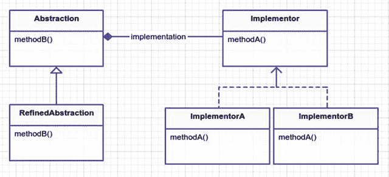
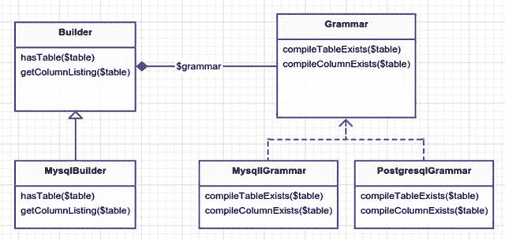

# 十、桥接

```php
$> git checkout bridge

```

## 目的

将抽象与其实现解耦，这样两者可以独立变化。 [<sup>1</sup>](#Fn1)

## 应用

从实现中分离抽象意味着什么？为了展示一个这样的例子，让我们假设你想发送一条消息。A `message`是一个抽象概念。然而，有许多不同的方式可以发送信息。你可以用电子邮件发送；把它作为一封信邮寄出去；在屋顶上大声说出来；把它贴到脸书、推特或其他网站上；把它放在瓶子里，扔进大海；或者在飞机后面挂横幅。见鬼，[甚至还有一个向](http://www.talk2ets.com/) [外太空](http://www.talk2ets.com/) [<sup>2</sup>](#Fn2) 提交短信的网站。这些都是`Message`抽象的可能实现。

## 抽象结构

*   `Abstraction`是使用来自`Implementer`的`methodA`的接口或类。见图 [10-1](#Fig1) 。

    

    图 10-1。

    Bridge pattern
*   `RefinedAbstraction`是`methodB`的一个实际实现。有时当使用不同的实现者时，你需要稍微改变你的抽象。稍后您将在 MySQL 和 PostgreSQL 连接的例子中看到这一点。

*   `Implementer`是真正的实现者 A 和 b 的接口。

*   `ImplementerA` / `B`满足实现者接口。他们都做`methodA`，但方式略有不同。这个方法是在抽象层的保护下使用的。

## 例子

在这个例子中，您将看到 Laravel 的模式构建器的幕后，并演示它对桥模式的使用。Laravel 的 schema builder 允许您在数据库中创建新的表和列，并在以后回滚它们。我将在命令模式一章中详细介绍这一点，但现在让我们问这个问题:如何在 MySQL 中构建一个表？PostgreSQL 呢？微软 SQL 或者 SQLite 怎么样？这些都是您想要支持的数据库，但是如果您仔细想想，您会发现有以下几个部分:

1.  抽象:构建一个表

2.  实现:用于在 MySQL、SQLite、PostgreSQL 等中构建表的语法。

您可以为 MySQL、SQLite 和 PostgreSQL 创建一个构建器，但是您可能会以这种方式编写大量重复的代码。构建者可以关注如何创建表模式、删除表或检查表是否存在。从一个数据库到另一个数据库的解耦语法允许您获得细粒度的数据库 SQL 语句，并且还可以全面重用 builder 类。此外，您还将涵盖上述消息示例。

## 示例结构

图 [10-2](#Fig2) 为结构示意图。



图 10-2。

Concrete example

## 履行

这些都是 Laravel 中相当大的类，所以您将只关注每个类中的一小部分代码，这样您就可以看到运行中的构建器模式。我们来看一下`hasTable`方法。这个方法告诉您`$table`是否已经存在于您的数据库中。构建器抽象依赖于语法来编译 SQL，以确定表是否存在。

vendor/laravel/framework/src/Illuminate/Database/Schema/builder . PHP

```php
49   public function hasTable($table)
50   {
51           $sql = $this->grammar->compileTableExists();
52
53           $table = $this->connection->getTablePrefix().$table;
54
55           return count($this->connection->select($sql, [$table])) > 0;
56   }

```

方法`hasTable`首先编译特定于数据库的 SQL 文本，确定一个表是否存在，接下来它查找带有可选全局配置前缀的表名，最后它返回对 SQL 代码运行`select`的结果。让我们来看看`compileTableExists`的语法。您将使用 MySQL 版本，但是每个数据库都有自己的方法实现。

vendor/laravel/framework/src/Illuminate/Database/Schema/Grammars/MySQL grammar . PHP

```php
33   public function compileTableExists()
34   {
35           return 'select * from information_schema.tables where table_schema \
36   = ? and table_name = ?';

37   }

```

这个简单的 SQL 字符串就是如何确定一个表在 MySQL 中是否存在。如果构建器是使用 MySQL 作为连接驱动程序配置的，那么在检查表是否存在时会使用这个语法。顺便说一下，如果你想知道 Laravel 是如何知道使用 MySQL 作为驱动程序的，这可以在`config/database.php`中看到。我可以在构建器中检查其他方法，但它们或多或少是相同的。事实上，构建器还使用一个名为`Blueprint`的类来帮助一些在表上创建列的常规方法和其他各种操作。如果你愿意的话，可以随意钻研那些代码，但是现在我将把注意力转移到另一个类上。

您可能没有注意到这一点，但是请注意在`compileTableExists`方法中实际上有两个`?`查询参数。然而，在`hasTable`方法中，只有一个查询参数被传递给`$this->connection->select($sql, [$table])`。这是如何工作的？不应该；它会出错。因此，MySQL 的`Builder`抽象需要改进。输入`MysqlBuilder`。

vendor/laravel/framework/src/Illuminate/Database/Schema/MySQL builder . PHP

```php
13   public function hasTable($table)
14   {
15           $sql = $this->grammar->compileTableExists();
16
17           $database = $this->connection->getDatabaseName();
18
19           $table = $this->connection->getTablePrefix().$table;
20
21           return count($this->connection->select($sql, [$database, $table])) > 0;
22   }

```

显然，要检查 MySQL 中是否存在表，您需要数据库名和表名；因此需要对`Builder`中的`hasTable`方法进行一些改进，以处理这种微妙的差异。事实上，`MysqlBuilder`只覆盖了 Builder 中的两个方法；它没有触及其他方法。

### 第二个示例(发送消息)

瓶子里的信息不仅仅是一首警察歌曲，它也是一种有效但低效的传递信息的方式。前面我谈到了将消息抽象从其实现中分离出来。所以让我们设计一个系统来发送消息。请注意下面的类名列表。看看本章开头的抽象 UML，看看你是否能把它们放在正确的地方。

*   `Carrier`

*   `Email`

*   `OceanBottle`

*   `Messenger`

*   `PlainMessenger`

现在看看下面的类。你会如何使用桥接模式？抽象是什么类，实现者是谁？桥在哪里？

*   `Carrier (Implementer)`

*   `Email (ImplementerA)`

*   `OceanBottle (ImplementerB)`

*   `Messenger (Abstraction)`

*   `PlainMessenger (RefinedAbstraction)`

你试图用各种载体抽象出信使。由于`Carrier`是实现者，它将保存如何发送特定类型消息的逻辑。

app/Carriers/Carrier.php

```php
namespace App\Carriers;

interface Carrier
{
        public function sendMessage($message);
}

```

`Email`和`OceanBottle`都是`Carrier`的具体实现。让我们来看看他们两个。请注意，他们只是吐出了消息。在现实世界的例子中，电子邮件运营商将连接到`MailChimp`或一些服务来发送您的消息。`OceanBottle`号航母会触发某种机器把你的信息打印在纸上，然后把折叠好的纸放进瓶子里，扔进太平洋。

app/Carriers/Email.php

```php
namespace App\Carriers;

class Email implements Carrier
{
        public function sendMessage($message)
        {
                echo 'EMAIL: '. $message . PHP_EOL;
        }
}

```

app/Carriers/OceanBottle.php

```php
namespace App\Carriers;

class OceanBottle implements Carrier 

{
        public function sendMessage($message)
        {
                echo 'OCEAN BOTTLE: ' . $message . PHP_EOL;
        }
}

```

现在您已经知道了消息是如何发送的，让我们来看看`Messenger`类。这种抽象是为了什么？记住，桥模式的目标是将抽象和实现分开。发送信息的想法与实际发送信息的细节是不同的。仔细想想，发送电子邮件的步骤与发送短信或邮寄信件的步骤非常相似。

1.  把信息放到媒体上。

2.  为媒介提供载体。

这并不是说媒介和载体不会改变，因为它们肯定会改变。电子邮件使用数字媒介和互联网作为载体。信件使用纸张作为媒介和邮件载体。当你说你的信息时，你的媒介是空气，你的载体是麦克风或者无线电广播。无论如何，这些步骤保持不变，因此当你抽象出`Messenger`类时，它使用载体和媒介来处理实际细节的两步过程。在本例中，为简单起见，您将介质和载体结合在一起。

app/Messengers/Messenger.php

```php
namespace App\Messengers;

class Messenger

{
        protected $carrier;

        public function __construct(use App\Carriers\Carrier; $carrier)
        {
                $this->carrier = $carrier;
        }

        public function send($message)
        {
                $message = $this->correctMisspellings($message);
                $this->carrier->sendMessage($message);
        }

        // pretend like you are correcting mispellings

        protected function correctMispellings($message)
        {
                return str_replace('Helo', 'Hello', $message);

        }
}

```

请注意，messenger 会尝试纠正您的拼写错误。纠正拼写错误不是运营商的工作，但你可以看到，如果你没有将信使与运营商分开，这可能会被破坏在一起。但是，如果您不想担心拼写检查呢？很像前面的`MysqlBuilder`是`Builder`的精炼版本，您将精炼您的`Messenger`抽象并创建一个`PlainMessenger`。

```php
{title="src/Messengers/PlainMessenger.php", lang=php}

```

类`PlainMessenger`扩展了`Messenger { public function send($message) { return $this->Carrier->sendMessage($message); } } ∼∼∼∼∼∼∼∼`

当你处理文本消息类型时，你可能想使用`PlainMessenger`。人们喜欢发表情符号和短词，所以拼写检查不太重要，实际上可能会让发短信的用户感到困惑。在模拟器中，让我们看看在处理短信载体时如何使用不同的信使。

app/Messengers/plain messenger . PHP

```php
$message = "Helo world!";

$emailMessenger = new App\Messengers\Messenger(new App\Carriers\Email;
$snailMessenger = new Messengers\Messenger(new App\Carriers\SnailMail('PO Box 123, Somewhere, NY, 12345'));
$textMessenger = new App\Messengers\PlainMessenger(new App\Carriers\TextMessage ('123.456.7890'));

$emailMessenger->send($message);
$snailMessenger->send($message);
$textMessenger->send($message);

```

## 结论

您使用桥接模式将模式构建器与底层数据库分离。作为一个简单的例子，您还使用了桥模式来构建消息传递应用的主干。

那么什么时候应该使用这种模式呢？您可能已经注意到，将抽象和实现分成两个不同的类会有一些开销。在简单的情况下，使用桥模式可能会矫枉过正，并且可能会给本来简单的问题增加巨大的混乱。然而，如果你正在计划一个可扩展的和灵活的生态系统(例如框架),并且桥模式看起来很适合，它可能是。在上面的例子中，您可以轻松地添加新的信使和承运人。挺灵活的，每节课都很专注。另一方面，您可以构建一个大型的`Emailer`类，它将发送消息和拼写检查合二为一。

因为您没有将抽象和实现分开，所以对于团队中的新成员来说，内聚且更大的`Emailer`类可能更容易理解。假如你从来没有实现一个不同的消息载体，这种方法是没有错的。在某种程度上，避免抽象和实现之间的永久绑定可以给你带来很大的灵活性。

您的`Messenger`抽象使用组合来调用来自`Carrier`实现者的方法。虽然你还没有学会策略模式，但它有相似的结构，也使用了复合。事实上，您学习的许多模式都使用了组合(因为它很糟糕),表面上看，这些模式可能类似。请记住，这都是关于意图。桥的目的是保持抽象和实现非常松散的耦合。适配器模式的目的是在两个不兼容的类之间充当中间人。策略模式的目的是封装算法。因此，如果你发现自己在思考两种模式之间的差异，写下它们的意图，你可能会回答你自己的问题。

Footnotes [1](#Fn1_source)

设计模式:可重用面向对象软件的元素，第 171 页

  [2](#Fn2_source)

[T2`www.talk2ets.com`](http://www.talk2ets.com)

  [3](#Fn3_source)

[T2`www.youtube.com/watch?v=MbXWrmQW-OE`](http://www.youtube.com/watch?v=MbXWrmQW-OE)