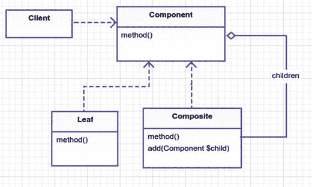
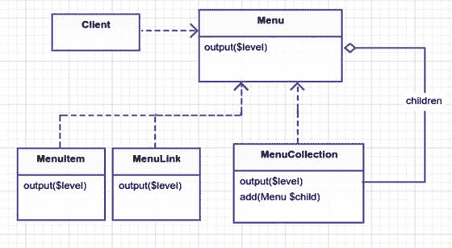

# 11.复合材料

```php
$> git checkout composite

```

## 目的

将对象组成树结构来表示部分-整体层次结构。Composite 允许客户端统一处理单个对象和对象的组合。 [<sup>1</sup>](#Fn1)

## 应用程序

生活中的很多东西都有等级结构:家谱、关系、组织、语言、自然、军事、政府、地址、工作场所、游戏、文件结构等等。有时候，事情在层级中更容易思考。想象一下，试着只用名字来解释你的家谱。等级制度允许我们把一个复杂的系统分解成相关的部分。然后，我们可以内省整棵树，或者只内省部分树，这对我们有利。

等级制度自然被认为是树。这是因为树木从底部开始，分支，并在某一特定的叶子处结束。叶子的父节点是分枝，它的父节点可能是另一个分枝。最后，事物在树的底部结束。但是，我不希望您认为，仅仅因为我们按照层次结构对事物进行排序，就意味着我们有一个复合模式。注意，在 intent 中还有第二句话:Composite 让客户机一致地对待单个对象和对象的组合。这意味着我们可以调用`$cat->methodName()`和`$cats->methodName()`，我们不必担心`$cat`是一个单独的叶子对象，而`$cats`是一个由许多对象的叶子组成的分支。

## 抽象结构

*   `Component`:这可以是一个接口，也可以是一个抽象类，任何叶子或者复合都可以扩展(图 [11-1](#Fig1) )。如果存在所有子类都能受益的方法，则使用抽象类；否则，简单的接口就足够了。

    

    图 11-1。

    The composite pattern
*   `Leaf`:叶子是原始的`Component`对象。它没有孩子。

*   `Composite`:复合是作为孩子的`Components`的集合。在简单的情况下，你可以将孩子作为数组存储在`Composite`类中。像`Leaf`一样，它是一个`Component`，因此必须实现`method`。

## 例子

如果你已经建立了一些网站，那么你可能已经处理过下拉菜单。如果你运气不好，你有这样一个客户，他想要一个带有很多链接的层次菜单的大菜单。如果不管菜单有多少级，你都能一视同仁，那会怎么样？你只是把它们打印出来，对吗？所以如果你能说下面的话呢？

把菜单打印出来

```php
$megaMenu->print();

// or

$simpleMenu->print();

// or

$someLink->print();

```

## 示例结构

图 [11-2](#Fig2) 为结构示意图。



图 11-2。

Composite pattern for menus

## 履行

您正在构建的是一种动态输出菜单的方式。不过，首先我要提醒您，将 HTML 放在 PHP 类中很难维护，有一种更好的方法:使用局部 Laravel 视图。然而，因为这个例子纯粹是为了说明复合模式，所以我在这些类中塞进了一些难看的 HTML。无论如何，这个示例的目标是构建一些菜单，以便您可以像这样轻松地输出它们:

app/simulator.php

```php
$menulink1 = new App\MenuLink('google', 'http://google.com');
$menulink2 = new App\MenuLink('facebook', 'http://facebook.com');
$menulink3 = new App\MenuLink('kelt', 'http://keltdockins.com');
$menuitem1 = new App\MenuItem('some text');

$megaMenu = new App\MenuCollection;
$subMenu1 = new App\MenuCollection;
$subMenu2 = new App\MenuCollection;
$subMenu3 = new App\MenuCollection;

$megaMenu->add($subMenu1);
$megaMenu->add($subMenu2);

$subMenu1->add($menulink1);
$subMenu1->add($menulink2);
$subMenu2->add($menulink3);
$subMenu2->add($subMenu3);
$subMenu3->add($menuitem1);

print '<!-- printing entire mega menu -->' . PHP_EOL; $megaMenu->output();

print PHP_EOL . '<!-- printing submenu only -->' . PHP_EOL; $subMenu1->output();

print PHP_EOL . '<!-- printing menuitem1 only -->' . PHP_EOL; $menuitem1->output();

```

这个模拟的输出是什么？它输出 HTML，就像我之前说的。

模拟器输出

```php
<!-- printing entire mega menu -->
<div class="sub-menu level0">
    <div class="sub-menu level1">
        <a title="google" href="http://google.com">google</a>
        <a title="facebook" href="http://facebook.com">facebook</a>
    </div>
    <div class="sub-menu level1">
        <a title="kelt" href="http://keltdockins.com">kelt</a>
        <div class="sub-menu level2">
            some text
        </div>
    </div>
</div>

<!-- printing submenu only -->
<div class="sub-menu level0">
    <a title="google" href="http://google.com">google</a>
    <a title="facebook" href="http://facebook.com">facebook</a>
</div>

<!-- printing menuitem1 only -->
some text

```

很漂亮，对吧？它让菜单的制作变得轻而易举。你也可以添加不同类型的菜单，比如一个`MenuButton`或者`MenuLinkWithImage`。不过，我有点言过其实了。你甚至还没有看到上面模拟中的类。它从`Menu`开始。

app/Menu.php

```php
namespace App;

interface Menu
{
        public function output($level = 0);
}

```

其余的类扩展了`Menu`，并且必须实现`output`方法。接下来，让我们来考察一下叫做`MenuLink`的叶子。

app/MenuLink.php

```php
namespace App;

class MenuLink implements Menu
{
        public function __construct($name, $url)
        {
                $this->name = $name;
                $this->url = $url;
        }
        public function output($level = 0)
        {
                print str_repeat(' ', $level * 4);
                print "<a title=\"{$this->name}\" href=\"{$this->url}\">{$this->name}</a>"   . PHP_EOL;
        }
}

```

正如您可能知道的，这个类只是处理打印带有 URL 和名称的锚 HTML 标签。很简单，对吧？但是，如果你没有这个`MenuLink`的网址呢？您可以在这里放入一个`if`语句，但这意味着您正在向一个方法添加逻辑。有没有另一种方法来处理这个问题，这样你就不必在你的`output`方法中添加一个`if`语句了？再来一片叶子怎么样？称它为`MenuItem`。

app/MenuItem.php 类型

```php
namespace App;

class MenuItem implements Menu
{
        public function __construct($name)
        {
                $this->name = $name;
        }

        public function output($level = 0)

        {
                print str_repeat(' ', $level * 4);
                print "{$this->name}" . PHP_EOL;
        }
}

```

不要急于创建`if`语句。记住:方法中的条件越多，方法的内部就越难理解。当然，在这里和那里添加一些`if` / `else`不会让你感到困惑，但是我把条件句当成友敌。你必须利用条件，但他们一有机会就会在背后捅你一刀，所以你周围的条件越少越好。除非你喜欢被人在背后捅刀子，在这种情况下，`if`该起来了！总之，您通过使用不同的叶类解决了上面的问题。现在让我们来看看你的组合，隐藏在阴影中，伪装成你的层次结构中的另一片叶子。

app/MenuCollection.php

```php
namespace App;

class MenuCollection implements Menu
{
        protected $children = [];

        public function add(Menu $menu)
        {
                $this->children[] = $menu;
        }
        public function output($level = 0)
        {
                print str_repeat(' ', $level * 4);
                print "<div class=\"sub-menu level{$level}\">". PHP_EOL;

                foreach ($this->children as $child){
                   $child->output($level + 1);
                }

                print str_repeat(' ', $level * 4);
                print "</div>" . PHP_EOL;
        }
}

```

这个集合处理`output`方法的方式略有不同。它调用它的直接子节点，当这些子节点也是`MenuCollections`时，它们的子节点被调用。请注意，您可以向您的`MenuCollection`添加实现`Menu`的任何类型的类。最终，这意味着您可以在集合中嵌套链接、项目和集合。

在我结束这一章之前，考虑一下:如果你想向后(向上)遍历这棵树呢？所以如果你启动一个子菜单，你想知道它的父菜单，父菜单的父菜单，等等。，现在这是一条单行道，从顶级巨型菜单开始。您可以用跟踪子节点的类似方式来保存对每个子节点的父节点的引用。这完全取决于您的应用程序的业务需求。如果决定存储父引用，一定要决定是希望对象只有一个父引用，还是允许多个父引用。当你冒险进入这个领域时，你可能会遇到除了复合模式之外的其他模式，这完全没问题，勇敢的灵魂，继续冒险吧！

## 结论

在本章中，您使用了复合模式来输出菜单的层次结构。我想重申，简单地创建类的层次结构并不意味着它就是复合模式。当单个对象和对象集合以相同的方式处理时，可以看到复合模式。Composite 允许你命令一只猫去`meow()`，同样也可以命令一群猫去`meow()`。它让你`output`一个菜单集合，就像一个菜单链接一样。老实说，如果你没有一个叶子，并且你正在使用一个单一的复合类，你也可以称它为复合模式。我不会向警方告发你的，我保证。

Footnotes [1](#Fn1_source)

设计模式:可重用面向对象软件的元素，第 183 页