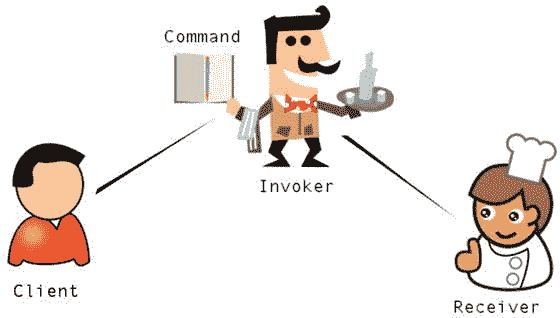
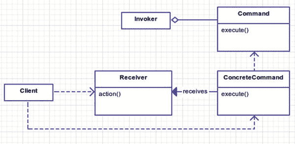
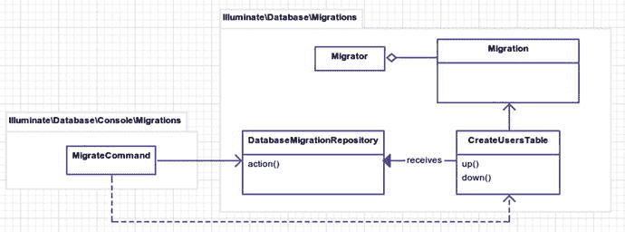
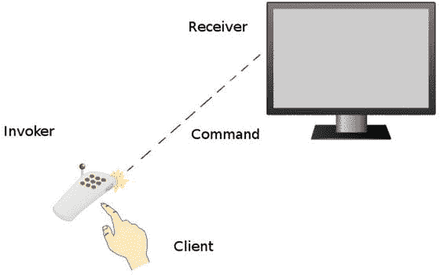

# 十七、命令

```php
$> git checkout command

```

## 目的

将请求封装为一个对象，从而允许您用不同的请求参数化客户端，对请求进行排队或记录，并支持可撤销的操作。 [<sup>1</sup>](#Fn1)

## 应用

当您需要将执行动作的对象与调用动作的对象分离时，这是一个很好的使用模式。然而，最后一部分到底是什么意思呢？假设您想要将一系列做各种不同事情的事件排队。稍后您将清除队列，这将实际调用所有这些操作。你为什么不立即调用/执行该操作？将一些动作排在后面有一些好处。一个是您可以保持调用动作的顺序。这允许您拥有撤消功能。另一个好处是您将请求具体化为一个对象。这使得定制新的请求就像创建新的命令类一样简单。

许多现实世界的例子都遵循命令模式。举个例子，一个顾客(也叫客户)点了他的食物。你可以把命令想象成命令。服务员是点菜的人。厨师收到订单，为顾客准备美味的晚餐。见图 [17-1](#Fig1) 。



图 17-1。

Too many cooks (Clipart provided by openclipart.org.[<sup>2</sup>](#Fn2) [<sup>3</sup>](#Fn3) [<sup>4</sup>](#Fn4) [<sup>5</sup>](#Fn5))

## 抽象结构

*   `Client`创建具体的命令实例供`Invoker`使用。见图 [17-2](#Fig2) 。

*   `Receiver`是命令将要操作的对象。这可能是一个文档、数据库或任何数量的类，它们保存您正在执行命令的实际数据。这些命令都在这个 receiver 对象上操作。

*   `Command`是一个抽象类，定义了所有具体命令的结构。

*   `ConcreteCommand`是一个特定的命令类。虽然不是必需的，但它通常具有回滚操作的能力。命令作用于接收器。

*   `Invoker`是实际调用命令的内容。假设你是客户，电视是接收器；`Invoker`将是遥控器。一些可能被调用的命令是音量增大和减小。



图 17-2。

Command pattern UML

## 例子

您将探索在 Laravel [<sup>6</sup>](#Fn6) 中[迁移](http://laravel.com/docs/migrations) [是如何工作的，而不是创建一个虚构的示例。Laravel 中的迁移受到了 Rails 框架的启发，并提供了一种一致的方式来为数据库创建表、列和索引。除了创建之外，迁移还提供回滚功能，以防您需要撤消数据库更改。](http://laravel.com/docs/migrations)

等一下。我以为这一章是关于命令模式的？是的。Laravel 迁移是在野外发现的命令模式的一个例子。我已经冒昧地将 Laravel 框架类映射到抽象 UML 图(图 [17-2](#Fig2) )。因此，您将了解更多关于迁移和新模式的知识！谈两只死鸟。这样你就不会觉得被欺骗了，我将用一个使用电视的命令模式的简化例子来结束这一章。

## 示例结构

图 [17-3](#Fig3) 为结构示意图。



图 17-3。

Laravel migrations and the command pattern

## 履行

您要做的第一件事是创建一个迁移，在您的数据库中创建一个`users`表。您没有设置数据库，所以对于这个例子，您将配置 Laravel 使用 SQLite。

```php
DB_CONNECTION=sqlite

```

如果使用 SQLite，Laravel 将尝试使用默认名称为 database/database.sqlite 的数据库。用户需要手动创建该文件(即在命令行上使用 touch database/database.sqlite)。

确保为 PHP 启用了 SQLite 驱动程序。在 Ubuntu 上，这和`sudo apt-get install php7.0-sqlite sqlite`一样简单。如果不想用 SQLite，可以随便用 PgSQL 或者 MySQL。您使用 SQLite 是因为它设置起来很容易。

如果您查看`database/migrations`文件夹，您应该会注意到用户的迁移文件。它将附有时间戳，文件名的最后一部分将是`create_users_table`。作为一种常见的良好做法，您应该根据您正在执行的操作来命名您的迁移。`create_users_table`这个名字清楚地解释了它的目的和作用。如果你不创建一个表呢？如果要向现有的表中添加一个新字段，该怎么办？然后您可以将您的迁移命名为`add_field1_to_users_table`。

*   命名迁移时，尽可能具体。

这有什么关系？这很重要，因为您不希望有两个名为`do_stuff`的迁移；太令人困惑了，伙计。每次迁移都有一个目的。请尝试在文件名中清楚地说明这一目的。

这是生成的文件。

数据库/迁移/2014 _ 07 _ 11 _ 185334 _ create _ users _ table . PHP

```php
class CreateUsersTable extends Migration
{
        public function up()
        {
                // do command action

        }

        public function down()
        {
                // undo command action

        }
}

```

`CreateUsersTable`是从抽象的`Migration`类扩展而来的具体命令。填充`up()`和`down()`部分是你的工作，所以现在让我们使用 [Laravel 令人敬畏的模式构建器](http://laravel.com/docs/schema) [<sup>7</sup>](#Fn7) 来完成这项工作。

数据库/迁移/2014 _ 07 _ 11 _ 185334 _ create _ users _ table . PHP

```php
public function up()
{
        Schema::create('users', function ($table) {
                $table->increments('id');
                $table->string('first_name');
                $table->string('last_name');
                $table->string('email')->unique();
                $table->string('password');
                $table->timestamp('last_login_at')->nullable();
                $table->timestamps();                  // gives you created_at and updated_

        });
}

public function down()
{
        Schema::drop('users');
}

```

给你。您创建了一个新的`users`表，其中包含一些字段:`first_name`、`last_name`、`email`等等。让我们抓住这个坏男孩！

```php
php artisan migrate

```

如果幸运的话，您应该会看到一条如下所示的消息，让您知道您创建的迁移命令已成功运行。如果没有，请确保您的数据库设置和配置正确。

```php
Migrated: 2014_07_11_185334_create_users_table

```

如果您决定撤销这个迁移，您可以运行`php artisan migrate:rollback`，它从您的`CreateUsersTable`类运行`down()`方法，然后从模式中删除`users`表。

注意，如果您连续多次运行`php artisan migrate`，脚本不会每次都尝试创建`users`表。您的模式的调用者称为`Migrator`，它将之前运行的迁移存储在一个名为`migrations`的数据库表中。一会儿你会看一看`Migrator`；现在让我们检查一下你的模式的`client`类:T6。

vendor/laravel/framework/src/Illuminate/Database/Console/Migrations/migrate command . PHP

```php
public function __construct(Migrator $migrator)
{
  parent::__construct();
  $this->migrator = $migrator;
}

public function fire()
{
  if (! $this->confirmToProceed()) {
      return;
  }
  $this->prepareDatabase();
  $this->migrator->run($this->getMigrationPaths(), [
     'pretend' => $this->option('pretend'),
     'step' => $this->option('step'),
  ]);
  foreach ($this->migrator->getNotes() as $note) {

     $this->output->writeln($note);
  }
  if ($this->option('seed')) {
      $this->call('db:seed', ['--force' => true);
  }
}

```

vendor/laravel/framework/src/Illuminate/Database/Migrations/Migrator . PHP

```php
public function run($paths = [], array $options = [])
{
    $this->notes = [];
    $files = $this->getMigrationFiles($paths);
$ran = $this->repository->getRan();
    $migrations = Collection::make($files)
                    ->reject(function ($file) use ($ran) {
                        return in_array($this->getMigrationName($file), $ran);
                    })->values()->all();
    $this->requireFiles($migrations);
    $this->runMigrationList($migrations, $options);
    return $migrations;
}

public function runMigrationList($migrations, array $options = [])
{

if (count($migrations) == 0) {
        $this->note('<info>Nothing to migrate.</info>');
        return;
    }
    $batch = $this->repository->getNextBatchNumber();
    $pretend = Arr::get($options, 'pretend', false);
    $step = Arr::get($options, 'step', false);
    foreach ($migrations as $file) {
        $this->runUp($file, $batch, $pretend);
        if ($step) {
            $batch++;
        }
    }
}

protected function runUp($file, $batch, $pretend)
{
    $file = $this->getMigrationName($file);
    $migration = $this->resolve($file);
    if ($pretend) {
        return $this->pretendToRun($migration, 'up');
    }

    $this->runMigration($migration, 'up');
    $this->repository->log($file, $batch);
    $this->note("<info>Migrated:</info> {$file}");
}

```

客户机利用构造函数中传递的`Migrator`并最终运行迁移器。上面要注意的重点是`$this->migrator->run($paths = [], array $options = [])`法。这就是`Invoker`的开始。如果您想了解迁移是如何回滚的，您可以查看另一个名为`RollbackCommand`的命令。它像`MigrateCommand`一样使用`Migrator`来调用`rollback`方法，而不是`run`。

`Migrator`作为`Invoker`运行每个迁移命令。但是等等。为什么`Client`知道`Invoker`？我以为客户端依赖于`Command`和`Receiver` `?`上面的 UML 图有错吗？这真的不是命令模式吗？当你在野外发现模式时，它们并不总是与“我不知道泰勒·奥特威尔在想什么”相匹配。我怀疑当他写这些东西的时候，命令模式是否在他的脑海中。更有可能的是，他在做他觉得正确的事情，于是这种命令模式出现了。没关系。你不是警察。

事实上，泰勒写这个的方式，他几乎已经排除了一个`Receiver`类。不过，不要让这欺骗了你，因为在 Laravel 中，使用所谓的 [facade](http://laravel.com/docs/facades) [<sup>8</sup>](#Fn8) (不要与 facade 模式混淆)允许你从任何地方全局访问框架的许多不同部分。在您的`CreateUsersTable`中，`Schema`构建者承担`Receiver`的角色。

多棒啊。想象一下，在运行任何类型的迁移之前，您必须检查它以前是否运行过。那不是很糟糕吗？幸运的是，您所要担心的只是填写每次迁移的`up()`和`down()`部分；剩下的在拉勒维尔手上。迁移通常用于改变模式，但不限于此。您可以使用 up()将照片从互联网下载到 public/awesome-cat-photos 目录中。`down()`命令可以简单地删除 public/awesome-cat-photos 目录。

需要指出的是，迁移是按顺序调用的。这就是为什么每次迁移的文件名中都有一个时间戳:以确保所有迁移都按照特定的时间顺序运行。命令模式也包含时间顺序。当您在文本编辑器中按 Ctrl+Z 时，它应该会撤消您刚刚做的最后一件事。其他任何事情都会令人沮丧。

命令模式的出现正是为了解决这个问题:文本编辑器的撤销按钮！作者不想将命令请求与文档本身联系起来。他们将文档用作一个`Receiver`，通过您刚才看到的命令模式，可以很容易地撤销在文档对象上调用的命令。

### 电视命令模式示例

在这个简短的例子中，我将使用电视、遥控器和手来说明命令模式是如何工作的。他们说一张照片胜过一千句话。不过，谁在数呢，阿米赖特？任何人，这里有一张图描述了你想要编码出来的情况(见图 [17-4](#Fig4) )。



图 17-4。

Using the command pattern (clip art provided by openclipart.org)

您将制作一个电视遥控器，它可以执行命令，但也可以存储可以撤消的命令的历史记录。大多数电视遥控器不存储命令的历史。不是很好的用户体验。如果你按下音量增大按钮，最好按下音量减小按钮，而不是撤销按钮。在本例中，您正在构建一个间谍遥控器。它将保存所有发送命令的历史记录。为什么呢？因为你是个间谍。这是你的遥控器，它充当调用者。

app/TV/remote control . PHP

```php
namespace App\Television;

class RemoteControl

{
        private $history;

        public function __construct()
        {
                $this->history = new \SplStack;
        }

        public function invoke(Command $command)
        {
                $this->history->push($command);
                $command->fire();
        }

```

您在命令对象的堆栈中跟踪历史。但是，请注意调用者并不知道实际命令在做什么。调用程序只触发命令并保存历史记录。您可以添加更多功能。您将提供一种撤消命令的方法。

app/TV/remote control . PHP

```php
public function undo($amount = 1)
{
        while ($amount-- > 0 && ! $this->history->isEmpty())
        {
                $command = $this->history->pop();

                $command->undo();
        }
}

```

这个`undo`函数从堆栈中弹出命令，并对命令调用`undo`方法。那么命令看起来像什么呢？这是一个处理不断变化的卷的命令。

app/TV/change volume . PHP

```php
namespace App\Television;

class ChangeVolume implements Command
{
        protected $tv;

        public function __construct(Television $tv, $delta = 1)
        {
                $this->tv = $tv;
                $this->delta = $delta;
        }

        public function fire()
        {
                $volume = $this->tv->getVolume();
                $this->tv->setVolume($volume + $this->delta);
        }

        public function undo()
        {
                $volume = $this->tv->getVolume();
                $this->tv->setVolume($volume - $this->delta);
        }
}

```

该命令用一个电视接收机对象和一个增量初始化。Delta 是一个整数，用于知道每次执行该命令时电视音量应该改变多少。大多数命令都耦合到接收器。如果您希望能够与实现电视接口的其他具体类一起工作，您可以将接收器作为一个接口。不过，在这个例子中，您直接将命令耦合到接收器。你的接收器，电视，负责存储音量。它可以存储其他属性，如频道号、输入源、视频/音频设置。为了简化这个例子，电视只存储音量。

app/TV/Television . PHP

```php
namespace App\Television;

class Television

{
       protected $volume;

       public function getVolume()
       {
               return $this->volume;
       }

       public function setVolume($volume)
       {
               if ($volume < 0) $volume = 0;
               if ($volume > 50) $volume = 50;
               $this->volume = $volume;
       }
}

```

除了充当模型和存储卷之外，`Television`类还有一些业务逻辑来确保没有卷是负数或超过 50。任何超过 50 的声音都会弄坏扬声器。你不想要坏了的扬声器。电视课对命令一无所知。最后，您将客户端代码付诸实施。客户端的第一步是创建`invoker`、`receiver`和`command`对象。

app/simulator.php

```php
$tv = new \App\Television\Television;
$control = new \App\Television\RemoteControl;
$volumeUp = new \App\Television\ChangeVolume($tv, 1);
$volumeUpFour = new \App\Television\ChangeVolume($tv, 4);
$volumeDown = new \App\Television\ChangeVolume($tv, -1);

```

接下来，客户端调用命令。我在每个调用方法旁边都注释了音量的变化。这将在你撤销命令时处理。

app/simulator.php

```php
$control->invoke($volumeUp);          // 1

$control->invoke($volumeUp);          // 2

$control->invoke($volumeDown);        // 1

$control->invoke($volumeUp);          // 2

$control->invoke($volumeUp);          // 3 <-- 6 more

$control->invoke($volumeDown);        // 2

$control->invoke($volumeUpFour);      // 6

$control->invoke($volumeUpFour);      // 10

$control->invoke($volumeUp);          // 11

$control->invoke($volumeUp);          // 12

$control->invoke($volumeUp);          // 13 <-- 4 ago

$control->invoke($volumeUp);          // 14

$control->invoke($volumeUp);          // 15

$control->invoke($volumeUp);          // 16

$control->invoke($volumeDown);        // 15 <-- current

```

您检查当前状态下的音量。应该是 15。接下来，回滚四个命令，然后再回滚六个，每次都确保输出音量。这些水平应该是 13 和 3。

app/simulator.php

```php
print $tv->getVolume() . PHP_EOL;  // 15

$control->undo(4);

print $tv->getVolume() . PHP_EOL;  // 13

$control->undo(6);

print $tv->getVolume() . PHP_EOL;  // 3

```

所以你有它。命令模式如何工作的另一个例子。构建和处理调用者、接收者和命令的任务留给了客户端。建造工作可以委托给名为`CreateRemoteControl`的工厂。

## 结论

命令模式在处理请求时非常有用，如果将它们作为对象处理，会更容易处理。在这些例子中，你可以写一个大类来处理电视机的所有命令。您可以编写一个大型 SQL 文件来处理数据库。这样做使得处理代码的特定部分变得困难，因为您有一大块代表所有命令的代码。您将每个命令封装到它自己的对象中。这意味着重用命令和提供可撤销的动作要容易得多。

命令模式的主要缺点是增加了处理命令的类。班级越多，尤其是班级差异很大的时候，就越容易失去凝聚力。使用迁移时，假设您创建的所有类都与数据库结构的变化有关。然而，情况并不一定如此。你可以使用迁移将海蒂·克鲁姆的图片下载到`/public`目录中。这是对迁移的严重滥用，但在技术上仍然是可能的。只要保持命令的目的一致，就不需要太担心整体的内聚性。

接下来，你将学习解释器模式(见图 [17-5](#Fig5) )。


图 17-5。

You’ve been beckoned. Footnotes [1](#Fn1_source)

`Design Patterns: Elements of Reusable Object-Oriented Software`，第 263 页

  [2](#Fn2_source)

[T2`https://openclipart.org/detail/154837/people-cook-by-yyycatch`](https://openclipart.org/detail/154837/people-cook-by-yyycatch)

  [3](#Fn3_source)

[T2`https://openclipart.org/detail/77077/waiter-by-shokunin`](https://openclipart.org/detail/77077/waiter-by-shokunin)

  [4](#Fn4_source)

[T2`https://openclipart.org/detail/182377/notepadr-by-crisg-182377`](https://openclipart.org/detail/182377/notepadr-by-crisg-182377)

  [5](#Fn5_source)

[T2`https://openclipart.org/detail/77077/waiter-by-shokunin`](https://openclipart.org/detail/77077/waiter-by-shokunin)

  [6](#Fn6_source)

[T2`http://laravel.com/docs/migrations`](http://laravel.com/docs/migrations)

  [7](#Fn7_source)

[T2`http://laravel.com/docs/schema`](http://laravel.com/docs/schema)

  [8](#Fn8_source)

[T2`http://laravel.com/docs/facades`](http://laravel.com/docs/facades)