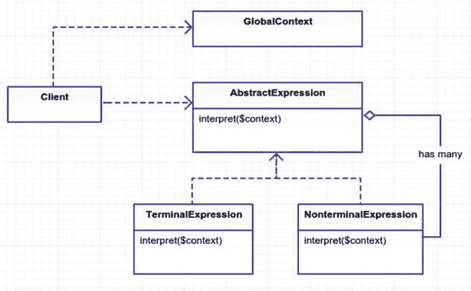
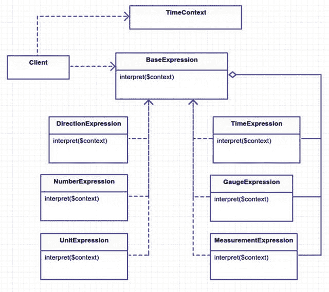

# 18.解释者

```php
$> git checkout interpreter

```

## 目的

给定一种语言，为它的语法定义一个表示，以及一个使用该表示来解释该语言中的句子的解释器。 [<sup>1</sup>](#Fn1)

## 应用

有些模式你可能永远不会用到:flyweight、singleton 和这个。无论如何我都要报道它。以防万一。我以前也错过。这一章比其他章节更理论化一点。为了理解解释器模式，我需要先谈谈语言和语法。了解如何运用语法会让你在别人看来更聪明。这也恰好是解释器模式的主要好处。

虽然这一章可能看起来非常理论化，但在现实世界中有大量的解释者。联合国使用数百名口译员。你可能已经用谷歌翻译把这首冰冻的歌从英语翻译成俄语了。那个名为 C3PO 的金色机器人已经被编程为翻译超过 600 万种语言。也许你见过美国手语翻译在舞台前挥舞手臂。

人类是天生的解释者。甚至那些只说英语的单语者也仍然把英语的声音和单词翻译成意思。这就是上下文的重要性。同一组词可能会衍生出不同的意思。为了说明上下文的价值，“我马上就去做”是什么意思这要看上下文。如果你的老板要一份 TPS 报告，这可能意味着“我将立即开始着手 TPS 报告。”然而，如果你把语境换成你的朋友建议你剃光全身的毛，在网上裸体摆姿势，你的语气可能是讽刺的，意思就变成了，“哈。哈。我不会那么做的。”同样的话。不同的语境等于不同的意义。语言很难，是的。

听起来更聪明并不是解释器模式的唯一应用。当您想要将特定于领域的语言翻译成行动时，可以使用解释器模式。如果您的应用处理汽车，那么您可能需要翻译某些机械术语。对机械师来说，售后服务意味着零件不是由原始制造商制造的。气斧是一种割炬。扳手是在引擎上工作的俚语。你想使用你的机械词汇，一个翻译可能会有用。

### 上下文无关语法

为什么要讨论上下文无关语法？我想告诉你什么是上下文无关语法，这样你就可以在本章的后面使用这个术语。我不会让你的生活变得更艰难，我保证。

上下文无关语法是一组生成字符串模式的规则。它由终端和非终端组成。一个非终结点由其他非终结点或终结点组成。终端只是一个符号。想象一下 a 的语言后面跟着 b，以 a 结尾。这种语言的一些有效示例如下

*   阿伯

*   aaaaba

*   abaaaaaaa

*   aabbaa

为了表示这种语言的语法，您将使用 [Backus-Naur 形式](http://en.wikipedia.org/wiki/Backus%E2%80%93Naur_Form)。 [<sup>2</sup>](#Fn2) 。你可以在维基百科上读到更多关于它的内容，但是你可能会通过阅读下一个例子来理解它是如何工作的。

```php
<L> ::= <A><B><A>
<A> ::= 'a' | 'a' <A>
<B> ::= 'b'{<B>}

```

这乍一看可能很奇怪。非端子用`brackets, like < >`包裹。符号用引号括起来，像`' '`。烟斗(`|)`代表一种选择；你可以把它读成或，意思是你可以选择一边或另一边。所以在`<A>`的情况下，你可以选择符号‘a’或‘a’后跟另一个‘a’。非终结符`<A>`使用递归来构建一个“a”符号列表。还有一个修改过的 BNF 语法，我已经用在了`<B>`中。`<B>`规则的工作方式与`<A>`规则相同。`{<B>}`表示零个或多个实例。你可以用任何一种方式来写这些语法；这取决于你的口味。我给你看了两个，所以你可以选择。

用这种 BNF 结构写语法有什么收获？当你用这种结构写你的语法时，你可以很容易地分辨出终结符和非终结符在哪里。第二个好处是，当您有一个要遵守的规则列表时，为这种语法创建代码会更容易。函数式程序员会为每个非终结规则创建一个方法。每个方法都可以调用语法中的其他非终结方法。您将做一些类似的事情，除了您将使用类而不是方法。既然你对语法有所了解，你应该马上运用这些知识。

## 抽象结构

*   使用全局上下文和解释器表达式来执行一些动作。执行的一组动作(通常在上下文中)取决于客户端调用的表达式。客户端可以使用表达式构建语法。然而，为了避免给客户端带来太多的工作，解析器类也可以处理语法的构建。见图 [18-1](#Fig1) 。

    

    图 18-1。

    Abstract structure
*   `GlobalContext`是一个保存所有表达式可用的全局数据的类。你可以在这个类中分配和查找变量。如果不需要共享数据，那么可以忽略这个类。

*   `AbstractExpression`是所有终端和非终端表达式使用的基类/接口。它包含了由所有子类专门定义的`interpret`方法。

*   `TerminalExpression`实现`interpret`方法，不依赖任何其他表达式。这些表达式规则只有“字符串”,不依赖于其他表达式。

*   `NonterminalExpression`实现`interpret`方法并依赖其他表达式。如果一个非终结表达式依赖于自身或者依赖于另一个循环的表达式，那么它很容易递归。你必须努力防止你的语法中出现非终结符，这些非终结符会陷入无限递归循环，永远不会结束。一个无限循环、永远不会终止和提供用户反馈的应用是没有用的。

为什么我们要区分非终结符和终结符？如果您检查非终结符和终结符表达式类的代码，它们看起来非常相似。两者都继承自基本表达式接口，所以在代码方面没有真正的区别。唯一真正的区别是，非终结符表达式有一个额外的属性来存储其他表达式。可能值得在 php-doc 注释中为每个表达式类声明非终结符或终结符。这让你可以快速浏览注释，甚至是 grep 出所有非终结符表达式。非终结表达式比没有进一步执行的终结表达式更难排除故障。

## 例子

我在互联网上找到了一些这种模式的例子。

1.  罗马数字翻译器

2.  反向波兰计算器

3.  创建您自己的 SQL 语句

在构建 web 应用时，您可能不会做这些事情。很难想出一个类似于轻量级章节的例子，所以我再次依赖于时间的例子。在这个例子中，您将把某些短语解释成 PHP 日期时间。以下是一些你可能需要解释的候选短语:

*   “几天前”->“-3 天”

*   "未来很短的时间"-> "+ 10 分钟"

*   "不久的某个时候"-> "+ 1 天"

*   “很长一段时间过去了”->“1 年”

*   “五十六小时前”->“五十六小时”

通过检查这里的结构，我为你的解释器想出了一个语法。你从一个时间表达式开始，它由一些量规和方向组成。量规是时间的度量或距离。除了时间量，你还需要方向。方向要么是负的(过去)，要么是正的(未来)。

```php
<time> ::= <gauge> <direction>

<gauge> ::= 'a few' <unit> | 'a short time' | 'a long time' |
                       'sometime soon' | <measurement>

<direction> ::= 'ago' | 'in the past' | 'in the future' |
                             'goes by' | ''

<measurement> ::= <number> <unit>

<number> ::= '1' | '2' | ... | '23' | 'one' | 'two' | ... | 'twenty \
three'

<unit> ::= 'seconds' | 'minutes' | 'hours' | 'days' | 'weeks' |
                 'months' | 'years'

```

扪心自问，`gauge`表达式是终结的还是非终结的？它由几个字符串和表达式组成。这意味着它是非终结性的。你看到哪些表情了？`unit`和`measurement`表达式可能是`gauge`表达式的一部分。请注意，`direction`表达式是终结性的，因为它没有链接到其他表达式。

那么为什么不使用正则表达式或字符串替换呢？举个小例子，这可能更容易。然而，随着复杂性的增加，字符串匹配可能会令人不安。用一个类来处理每种类型的表达式可以更容易地理解发生了什么。每个表情都有自己的工作要做。完成整个翻译可能需要几个表达式，但是你已经将每个表达式分解成(希望)可维护的部分。

## 示例结构

图 [18-2](#Fig2) 为结构示意图。



图 18-2。

Example structure

## 履行

信不信由你，最困难的部分已经过去了。之前我想出了一套 BNF 语法规则。您为每个表达式规则创建一个类，并严格遵循语法。让我们为第一个表达式`<time> ::= <gauge> <direction>`制作一个类。

app/Time/Expressions/Time expression . PHP

```php
namespace App\Time\Expressions;

class TimeExpression implements BaseExpression
{
        public function __construct(BaseExpression $gauge, BaseExpression
        $direction)
        {
                $this->gauge = $gauge;
                $this->direction = $direction;
        }

        public function interpret(\App\Time\TimeContext $context)
        {
                $gauge = $this->gauge->interpret($context);
                $direction = $this->direction->interpret($context);

                if ($direction != '') {
                        $time = $context->getTime();
                        $time->modify($direction . $gauge);
                        $context->setTime($time);
                }

                return $context->getTimeAsString();
        }
}

```

时间表达式有两个参数，一个用于度量，一个用于方向。这正是语法的读法。在量规和方向被解释后，您可以在`$context`中修改时间。背景很重要。如果没有上下文，你怎么知道时间是“现在”呢？你可以硬编码`new DateTime`或者`time()`。但是，这是不灵活的。当你能控制开始日期时，测试就更容易了。上下文允许你做其他的事情，比如获取和分配变量。我们来看看`TimeContext`级。

app/Time/TimeContext.php

```php
namespace App\Time;

class TimeContext

{
        protected $time, $variables;
        public function __construct(\DateTime $time)
        {
                $this->time = $time;
                $this->variables = [];
        }

        public function getTime()
        {
                return $this->time;
        }
        public function setTime(\DateTime $time)
        {
                $this->time = $time;
        }

        public function getTimeAsString($format = 'Y-m-d H:i:s')
        {
                return $this->time->format($format);
        }

        public function getVariable($key, $default = null)
        {
                return $this->hasVariable($key)
                    ? $this->variables[$key] : $default;
        }

        public function setVariable($key, $value)
        {
                $this->variables[$key] = $value;
        }

        public function hasVariable($key)
        {
                return is_string($key)
                   && array_key_exists($key, $this->variables);
        }

        public function unsetVariable($key)
        {
                unset($this->variables[$key]);
        }
}

```

为什么可以在上下文中设置变量？我在 BNF 中没有提到任何变量，那么什么是变量呢？你很快就会明白。首先我们来看另一个表达式类，具体来说就是方向表达式`<direction> ::= 'ago' | 'in the past' | 'in the future'`。它是一个终结表达式，因为它不依赖于任何其他表达式。

app/Time/Expressions/direction expression . PHP

```php
namespace App\Time\Expressions;

class DirectionExpress implements BaseExpression
{

        public function __construct($literal)
        {
                $this->literal = $literal;
        }

        public function interpret(\App\Time\TimeContext $context)
        {
                switch ($this->literal) {
                        case 'ago': return '-';
                        case 'in the past': return '-';
                        case 'in the future': return '+';
                        case 'goes by': return '+';
                        case '': return '+';
                }

                throw new \Exception('Could not interpret literal '
                             .  $this->literal);
         }
}

```

方向表达式的唯一职责是返回一个“+”或“-”。加号表示将来，负号表示过去。该表达式不包含对其他表达式的外部调用。终结表达式比非终结表达式更好使用。接下来是`gauge`表达式，它应该返回实际的时间测量值。语法规则如下所示:

```php
<gauge> ::= 'a few' <unit> | 'a short time' | 'a long time' | 'sometime soon' | <measurement>.

```

app/Time/Expressions/gauge expression . PHP

```php
namespace App\Time\Expressions;

class GaugeExpression implements BaseExpression

{
        public function __construct($expr1, BaseExpression $expr2 = null)
        {
                $this->expr1 = $expr1;
                $this->expr2 = $expr2;
        }

        public function interpret(\App\Time\TimeContext $context)
        {
                if ($context->hasVariable($this->expr1)) {
                        return $context->getVariable($this->expr1);
                }
                switch ($this->expr1) {
                       case 'a few':
                         return '3 ' . $this->expr2->interpret
                         ($context);
                       case 'a short time':
                         return '10 minutes';

                       case 'a long time':
                         return '2 years';

                       case 'sometime soon':
                         return '1 day';
                }

                return $this->expr1->interpret($context);
        }
}

```

切换回`TimeContext`和变量。像“不久的某个时候”和“几个”这样的表达是相对的。您需要覆盖这些变量的灵活性。每个文字都有默认值，正如您在`switch`语句中看到的。但是，这些值可以被上下文覆盖。正如我前面提到的，这是拥有上下文的另一个好处。请注意，如果您没有找到一个文字表达式，您假设发生了`<measurement>`规则，并试图解释该表达式。

接下来，让我们跳到模拟器(客户端)部分。我可以给你展示更多的表达，但是我想现在你可能已经掌握了表达的概念。您可以随意浏览 git 存储库中的其他表达式。模拟器给你一个想法，如何把这些碎片放在一起。运行模拟器客户端会产生以下输出:

```php
$> php app/simulator.php

time for now:            2015-01-31 12:34:56
a few hours in the past: 2015-01-31 09:34:56
thirty days ago:         2015-01-01 09:34:56
sometime soon:           2015-01-01 09:44:56
a long time goes by:     2017-01-01 09:44:56
a short time ago:        2017-01-01 09:34:56

```

让我们看看模拟器代码内部是如何生成这个输出的。在您的应用中，所有表达式都需要一个上下文，因此您需要初始化一个`TimeContext`。有趣的是，您将在整个客户端的执行过程中重用相同的上下文。

app/simulator.php

```php
1   $context = new TimeContext(new DateTime('2015-01-31 12:34:56'));
2   print "time for now:" . $context->getTimeAsString() . PHP_EOL;

```

接下来，您将创建一个新的时间表达式。

app/simulator.php

```php
$gauge = new GaugeExpression('a few', new UnitExpression('hours'));
$direction = new DirectionExpression('in the past');
$time = new TimeExpression($gauge, $direction);

print "a few hours in the past: " . $time->interpret($context) . PHP_EOL;

// ... look in the git repository for more examples ...

```

这就是了。你的第一个翻译。不太好看，是吧？即使你已经完成了所有这些工作，仍然有很多工作是客户被迫要做的。客户端也负责设置上下文和表达式。天啊，客户就不能休息一下吗？它们当然可以，这是进入下一节的一个很好的过渡，下一节将介绍一个可以这样做的小解析器。

### 伙计，我的解析器呢？

客户端并不总是负责连接表达式。有时您将这项工作委托给解析器。最好是解析一个字符串，而不是把不同的表达式类串在一起。解析器最初不是解释器模式的一部分。不要悲伤，我的朋友；无论如何，您都要创建一个解析器。这将使您了解如何将解释器表达式和解析器放在一起。让我们重写上面的模拟器代码，并添加一些语法糖。

app/simulator-with-parser.php

```php
print "a few hours in the past: " . $parser->interpret('a few hours
in the past', $context) . PHP_EOL;

```

啊，很好，对吧？不再需要将`new TimeExpression`硬编码到客户端代码中。你只需要用一个字符串和上下文对象调用解析器的解释器。那么这个解析器是如何工作的呢？每个解析器都可以不同。每个解析器可能有很大的不同。我遵循的基本思路是这样的。

1.  将句子分成一组记号。

2.  将光标移动到第一个标记。

3.  用语法规则匹配/识别单词。

4.  继续将光标向前移动到下一个标记。

5.  继续下去，直到你处理完所有的代币。

那么什么是代币呢？在您的例子中，您将把句子分成一个单词数组。然而，令牌也可以是单个字符。但是，在解析器中不需要这样的粒度。

什么是光标？游标是一个整数，它指向令牌数组的当前索引。这个指针帮助你跟上你已经处理的令牌。对于某些解析器来说，光标允许您向前甚至向后移动。一旦识别出标记，就向前移动光标。当光标到达 tokens 数组的末尾时，您应该完成了对字符串的解析。如果发生错误，您可以使用异常中的光标位置来广播问题，以便开发人员或客户端进行故障排除。当您在代码中省略分号并犯错误时，您会看到这种行为。有了行号和堆栈跟踪，就更容易跟踪错误。您不会采取包括堆栈跟踪这样过分的措施，但是如果您想扩展您的解析器以包括更多的调试选项，原则仍然在这里。

app/Time/TimeParser.php

```php
class TimeExpressionParser

{
        protected $tokens, $cursor;

        public function __construct(NumberParser $numberParser)
        {
                $this->numberParser = $numberParser;
        }

        public function interpret($sentence, $context)
        {

                return $this->parse($sentence)->interpret($context);
        }

```

您已经保护了属性，以跟上令牌数组和当前处理的令牌光标在数组中的位置。解析器的构造依赖于数字解析器。`NumberParser`将类似“65”的字符串转换成数字“65”。您可以扩展这个解析器，但是没有必要，因为我刚刚说了它的作用。

这种方法似乎相当无害。它解析句子，然后对返回的解释器对象运行`interpret`方法。所以让我们更深入地研究一下`parse`方法。

app/Time/TimeParser.php

```php
public function parse($sentence)
{
        $this->tokens = explode(' ', $sentence);

        $this->cursor = 0;

        $gauge = $this->gauge();

        $direction = $this->direction();

        return new Expressions\TimeExpression($gauge, $direction);
}

```

`parse`方法处理将句子分解成记号。您希望从令牌数组的开头开始，因此将光标位置设置为零。接下来，您有两个获取规格和方向表达式的辅助方法。最后，返回一个新的时间表达式。让我们来看看如何获取量规表达式。

app/Time/TimeParser.php

```php
protected function gauge()
{
        $section = $this->tokens(2);

        if ($section == 'a few') {
                $this->cursor += 2;

                $unit = new Expressions\UnitExpression($this->tokens(1));

                $this->cursor += 1;

                return new Expressions\GaugeExpression($section, $unit);
        }
        if ($section == 'sometime soon') {

                $this->cursor += 2;

                return new Expressions\GaugeExpression($section);

        }

        $section = $this->tokens(3);

        if ($section == 'a short time' || $section == 'a long time') {
                $this->cursor += 3;

                return new Expressions\GaugeExpression($section);
        }

        $measurement = $this->measurement();

        return new Expressions\GaugeExpression($measurement);
}

```

咻，这种方法有很多优点。每个条件返回一个`GaugeExpression`，所以你几乎可以把这个方法看作一个巨大的`switch`语句。回忆一下`<gauge>`的规则:

```php
<gauge> ::= 'a few' <unit> | 'a short time' | 'a long time' | 'some\
time soon' | <measurement>

```

您的`gauge`方法中的每个条件都检查您在表达式语法中找到的标记。让我们来看看第一个条件匹配“几个”。

app/Time/TimeParser.php

```php
if ($section == 'a few') {
        $this->cursor += 2;

        $unit = new Expressions\UnitExpression($this->tokens(1));

        $this->cursor += 1;

        return new Expressions\GaugeExpression($section, $unit);
}

```

当您匹配标记“几个”时，您需要将光标前移两个位置，因为“几个”是两个单词。接下来，你利用了“单位”只是一个单词的事实，所以无论下一个单词是什么，都必须是你的单位。当然，您可能会遇到无效的语法。如果您提供的单元令牌无效，您假设`UnitExpression`将抛出异常。在将令牌向前推进一个点之后，返回新的规范表达式。我可以介绍一下`direction`方法，但是我想现在你可以看到如何使用标记和光标来删除组成表达式的单词。请注意，您仍然使用相同的表达式类和语法。之前你在`simulator.php`里面手动创建了表达式类。现在您的解析器正在为您创建新的表达式对象。但是，解析器与解释器模式无关。它只是一个表达式工厂，使用您之前已经构建好的语法和解释器模式来创建对象。

解析器通常是为语法和句法规则定制的。每个解析器都不同。有些语法会比其他语法更难解析。我在上面概述了一些指导原则，比如使用令牌数组和游标，来帮助您构建自己的解析器。这里的基本观点是，您可以在解析器中重用来自解释器模式的语法。

## 结论

您已经看到了解释器模式如何帮助将短语翻译成日期时间。您还构建了一个解析器来集成字符串和解释器表达式。将每个语法规则转换成类有助于保持代码的可维护性和易懂性。如果你想进一步扩展你的语法，你只需要添加更多的表达式类。

添加更多的表达式类也是不利的。这些表达式类一起工作。如果一个表达式不能正确完成它的工作，那么它可能会抛弃所有其他的表达式。尽管每个表达式可能都很简单，但是所有的表达式都可以一起工作。表达式之间可能存在嵌套依赖关系，因此很难跟踪错综复杂的关系。这就是为什么每个组件都需要彻底测试。

在您的例子中，您创建了一个解析器。随着语法的增长，创建解释器的解析器也会挑战你。您在两个地方管理语法:解析器和解释器。需要对解析器进行大量测试，以确保它创建了正确的解释表达式。它与表达式紧密耦合，如果表达式的基本规则在以后发生变化，这会导致令人头痛的问题。

解释器模式也被传言很慢。但是比什么慢呢？一个成熟的解析器？一个机器学习算法？我还没有看到这种说法的任何真正的基准或证据。我的直觉是，是的，这种模式会比一些手工制作的算法慢。您可能从未使用过这种设计模式，但至少现在您知道了它的基本工作原理。

Footnotes [1](#Fn1_source)

设计模式:可重用面向对象软件的元素，第 274 页

  [2](#Fn2_source)

[T2`http://en.wikipedia.org/wiki/Backus%E2%80%93Naur_Form`](http://en.wikipedia.org/wiki/Backus%E2%80%93Naur_Form)