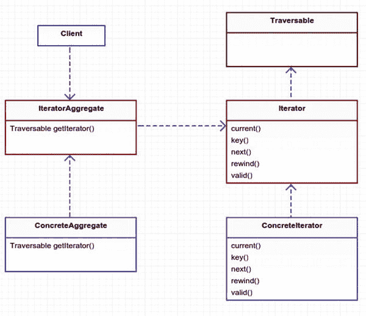
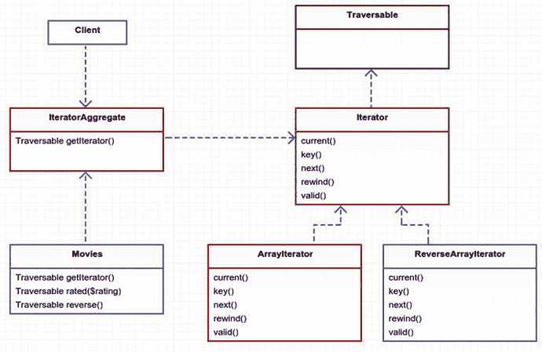

# 19.迭代程序

```php
$> git checkout iterator

```

## 目的

提供一种方法来顺序访问聚合对象的元素，而不暴露其底层表示。 [<sup>1</sup>](#Fn1)

## 应用

什么是聚合对象？聚合这个词的意思是由几个元素组合而成的一个整体。在编程术语中，它是一个集合、数组、列表等。但是，为什么要使用聚合对象呢？您已经可以使用数组顺序聚合一组数字、字符串或对象。为什么需要迭代器模式？这是一个无用的模式吗？答案是否定的。

使用迭代器对象有一些好处。第一个好处是迭代器用来从一个条目遍历到下一个条目的机制都是隐藏的。你不必公开如何从 A 点到达 z 点。客户端对所有迭代器使用相同的接口，并且不必担心在`for`循环中保持一些计数器索引。客户端只是不断地请求下一个条目，直到迭代器不再提供任何条目。这不同于传统的遍历数组的方式，它提供了更大的灵活性。

迭代器的另一个主要好处是，通过切换迭代器对象，可以很容易地改变集合对象中项的顺序。迭代器负责以特定的顺序遍历列表。也许你想打乱你的列表或者过滤掉符合搜索条件的条目，或者甚至在列表中向后遍历。这是迭代器模式真正闪光的地方。

想象一下，你的 iPod/iPhone/Droid 手机上有一堆歌曲。如果你和我一样，这些歌曲的播放顺序很重要。我不想听到马文·盖接着对机器大发雷霆。或许我知道。这取决于我的心情。有些日子我想听新的流行音乐。其他时候想听老歌。有时我想随机混合一些音乐。我永远不会让贾斯汀比伯和他的父亲鲍勃·西格 [<sup>2</sup>](#Fn2) 混在一起。您可以使用播放列表来整理您收藏的歌曲。

从这个意义上说，播放列表与迭代器同义。播放列表决定了歌曲的顺序。歌曲不知道它们的顺序。这就是播放列表的用途。所以如果播放列表是迭代器，那么集合对象是什么呢？在这个类比中，那可能是你，因为你正在创建播放列表并拥有所有的歌曲。聚集对象是构造迭代器的东西。您将很快了解更多这方面的内容。

## 抽象结构

Note

PHP 内部接口/类用红色标出。

*   `IteratorAggregate`是一个聚合对象的[抽象 PHP 内部接口](http://php.net/manual/en/class.iteratoraggregate.php) [<sup>3</sup>](#Fn3) 。这个接口的`getIterator`方法是由`ConcreteAggregate`定义的。该方法应该生成新的`Iterator`对象。注意，如果除了`getIterator`方法之外还需要其他方法，那么可以创建自己的基本迭代器接口，从这个接口扩展而来。见图 [19-1](#Fig1) 。

    

    图 19-1。

    Abstract structure
*   迭代器是[抽象 PHP 内部接口](http://php.net/manual/en/class.iterator.php) [<sup>4</sup>](#Fn4) ，包含遍历列表所需的方法。

    *   `current()`返回当前活动元素。

    *   `key()`返回当前活动元素的索引。

    *   `next()`向前移动到下一个元素。

    *   将迭代器移动到第一个元素。

    *   检查你是否在迭代器的末尾。

*   `Traversable`是一个抽象的空接口，[被 PHP](http://php.net/manual/en/class.traversable.php) [<sup>5</sup>](#Fn5) 特殊处理。它的目的是允许您在一个`foreach`循环中灵活地使用迭代器。在本章的后面你会看到更多的内容。默认情况下，`Iterator`接口继承自这个抽象接口，所以你不必太担心。值得一提的是，这样你就能理解 PHP 迭代器是如何工作的。现在，只需知道如果没有这个接口，您将无法方便地在`foreach`中使用迭代器。

*   `ConcreteAggregate`保存了`getIterator`方法的实际实现。它还包含对数组、列表或项目集合的引用。它需要将其项目传递给生成的`Iterator`对象的构造函数。

*   `ConcreteIterator`是`Iterator`接口的实际实现。还有一些[内置的 PHP 具体迭代器](http://php.net/manual/en/spl.iterators.php) [<sup>6</sup>](#Fn6) 。你将在你的例子中使用[`ArrayIterator`](http://php.net/manual/en/class.arrayiterator.php)[<sup>7</sup>](#Fn7)。

## 例子

在本例中，您将创建一个电影列表。您将使用不同的迭代器迭代这个电影集合。在这个场景中，迭代器由聚合对象`Movies`创建。在您进一步理解迭代器模式之后，您将通过查看 Laravel 如何以自己简洁的方式将迭代器模式用于雄辩的集合来结束这一章。

## 示例结构

 Note

图 [19-2](#Fig2) 中列出了两个具体的迭代器。我只是想向你展示在 PHP 中创建一个向后遍历数组的迭代器是多么容易。



图 19-2。

Example structure

## 履行

首先，您需要一个`Movie`对象来存储电影的标题和分级。这里没什么特别的，这甚至不是迭代器模式的一部分。

app/Movie.php

```php
namespace App;

class Movie

{
        protected $title, $rating;

        public function __construct($title, $rating)
        {
                $this->title = $title;
                $this->rating = $rating;
        }

        public function title()
        {
                return $this->title;
        }

        public function rating()
        {
                return $this->rating;
        }
}

```

接下来是你的聚合迭代器。您需要一种添加电影的方法。

app/Movies.php

```php
namespace App;

class Movies implements \IteratorAggregate
{
        protected $list = [];

        public function add(Movie $movie)
        {
                $this->list[] = $movie;
        }

```

记住这是生成迭代器对象的类。这个类中创建了三个迭代器，所以让我们更详细地看看它们。第一个是默认的`getIterator`方法，它使用你的电影列表生成一个新的`ArrayIterator`。

app/Movies.php

```php
12   public function getIterator()
13   {
14           return new \ArrayIterator($this->list);
15   }

```

接下来，创建一个迭代器，作为电影分级的过滤器。你使用`ArrayIterator`来完成这个。

`app/Movies.php`

```php
17   public function rated($rating)
18   {
19           $filtered = array_filter($this->list, function ($item) use ($rating) {
20           
21                   return $item->rating() === $rating;
22           });
23
24           return new \ArrayIterator($filtered);
25   }

```

您现在可能已经猜到了`ArrayIterator`是一个非常有用的迭代器。接下来，您将生成这个迭代器的山寨版，名为`ReverseArrayIterator`。这个迭代器在 PHP 中不是现成的，所以你必须尽快创建它。

app/Movies.php

```php
27   public function reverse()
28   {
29           return new ReverseArrayIterator($this->list);
30   }

```

按照约定，这里是`ReverseArrayIterator`。你可以自己实现`current, key`、`next, rewind, valid`；然而，更容易的是反转数组，然后搭载掉`ArrayIterator`。`ArrayIterator`再一次来救你。

app/reversearrayiiterator . PHP

```php
class ReverseArrayIterator extends \ArrayIterator
{
        public function __construct(array $array)
        {
                parent::__construct(array_reverse($array));
        }
}

```

你已经上过几节课了。现在是时候看看这个东西是如何工作的了。所有这些工作的要点是对客户机隐藏遍历条目列表的细节。让我们看看你是否做到了。首先，您的客户必须添加一个电影列表。我会在这里展示。尽量不要笑得太厉害。

app/simulator.php

```php
$movies = new \App\Movies;
$movies->add(new \App\Movie('Ponyo', 'G'));
$movies->add(new \App\Movie('Kill Bill', 'R'));
$movies->add(new \App\Movie('The Santa Clause', 'PG'));
$movies->add(new \App\Movie('Guardians of the Galaxy', 'PG-13'));
$movies->add(new \App\Movie('Reservoir dogs', 'R'));
$movies->add(new \App\Movie('Sharknado', 'PG-13'));
$movies->add(new \App\Movie('Back to the Future', 'PG'));

```

现在是关键时刻了。你想用三种不同的方式来循环播放这些电影。第一种方式是正常方式，使用`getIterator`和`foreach`。这将使用`ArrayIterator`，并吐出所有添加到你的`movies`聚集对象的电影。

app/simulator.php

```php
print 'MOVIE LISTING' . PHP_EOL;

foreach ($movies as $movie) {
        print ' - ' . $movie->title() . PHP_EOL;
}

```

对于那些有鹰眼的人来说，你可能想知道打给`getIterator`的电话是从哪里打来的。我要对你们中的那些人说，恭喜你们，你们得到了一张贴纸 [<sup>8</sup>](#Fn8) ！如果你没有得到一个贴纸，那么也许你已经知道这个窍门了？这有点 PHP 的魔力。前面我提到了特殊的`Traversable`接口。该接口仅用于`IteratorAggregate`或`Iterator`。在你的例子中，`Movies`从`IteratorAggregate`开始延伸，所以它也在延伸`Traversable`。这就是 PHP 如何知道在上面的代码中神奇地使用`getIterator`方法，而不需要您显式地调用它。试着把这看作是保持代码美观的一种便利，而不是某种神奇的独角兽特性。

在下一段代码中，你必须显式地调用迭代器方法的名字。你可以得到一场免费的魔术表演。现在是时候明确表态了。(我就知道我圣诞节得到的这本辞典会派上用场。)

app/simulator.php

```php
print PHP_EOL . 'RATED R ONLY' . PHP_EOL;

foreach ($movies->rated('R') as $movie) {
        print ' - ' . $movie->title() . PHP_EOL;
}

```

您将使用反向迭代器做同样的事情。

app/simulator.php

```php
print PHP_EOL . 'IN REVERSE ORDER' . PHP_EOL;

foreach ($movies->reverse() as $movie) {
        print ' - ' . $movie->title() . PHP_EOL;
}

```

请注意，在所有这些过程中，您不必跟踪索引、过滤或排序。这都是在幕后为你做的。客户端仍然负责调用迭代器。客户不负责如何到达下一个项目的细节。虽然您知道它是幕后驱动迭代器的数组，但是客户端不知道。没有什么可以阻止你用别的东西替换掉`Movies`中的数组，比如说一个列表，你的客户端代码应该仍然起同样的作用。

### 拉勒维尔收藏

现在您已经了解了迭代器的工作原理，让我们来研究一下 Laravel。拉勒维尔有一种东西叫做收藏品。它通过它的 ORM 使用集合。数据库检索工作流是这样的:

1.  使用雄辩的查询生成器(也称为 Fluent)构建数据库查询。

2.  执行查询。对于选择，检索表行。

3.  每个表行中的字段被合并到模型中。

4.  每一个模型都被添加到一个雄辩的集合。

5.  集合被返回。

Laravel 的雄辩系列是模特的绝佳包装。如果你有兴趣，可以在`vendor/laravel/framework/src/Illuminate/Database/Eloquent/Collection.php`查看该文件。雄辩的集合扩展了基本的通用支持集合。这个漂亮的类可以在`Illuminate\Support\Collection`中找到，它有超过 1300 行帮助方法。它也与数据库无关，因此您可以将它用于任何类型的数据结构。您对这个类感兴趣，想看看它是如何使用迭代器模式的。

vendor/laravel/framework/src/Illuminate/Support/collection . PHP

```php
12   class Collection implements ArrayAccess, Arrayable, Countable, IteratorAggregate,
13   Jsonable, JsonSerializable {
14           
15           use Macroable;
16           
17           /**

18            * The items contained in the collection.

19            *
20            * @var array
21            */
22           protected $items = [];
23           /**

24            * Create a new collection.

25            *

26            * @param array $items

27            * @return void

28            */

29           public function __construct(array $items = [])
30           {
31                   $this->items = $items;
32           }

```

这个类实现了很多其他的东西；尽管如此，它仍然实现了`IteratorAggregate`，这正是您创建的`Movies`类的工作方式。这里面应该有一个`getIterator`的方法。

vendor/laravel/framework/src/Illuminate/Support/collection . PHP

```php
610   public function getIterator()
611   {
612           return new ArrayIterator($this->items);
613   }

```

不过，这有点无聊。您已经在前面的`Movies` aggregate 对象中看到了这一点。但是等等！在这条`getIterator`线下面有一些新的东西:

vendor/laravel/framework/src/Illuminate/Support/collection . PHP

```php
620   public function getCachingIterator($flags = CachingIterator::CALL_TO
621   STRING)
622   {
623           return new CachingIterator($this->getIterator(), $flags);
624   }

```

还记得我之前给你看的清单吗 [<sup>9</sup>](#Fn9) 带有所有内置的原生 PHP 迭代器？[caching iterator](http://php.net/manual/en/class.cachingiterator.php)[<sup>10</sup>](#Fn10)是另一个你可以使用的内置迭代器。你为什么要用它？

它是做什么的？PHP 文档没有提供太多的见解，只是说，这个对象支持缓存迭代器覆盖另一个迭代器。缓存另一个迭代器有什么好处？我发现这个迭代器有一个很好的用例，就是当你在遍历过程中需要向前看的时候。假设您需要知道遍历中的下一项，并在此基础上进行一些逻辑运算。下面你就这么做吧。

app/cache-example.php

```php
$numbers = new CachingIterator(new ArrayIterator([1, 2, 3, 1, 4, 6, 3, 9]));

foreach ($numbers as $currentNumber) {
        $sign = '';
        if ($numbers->hasNext()) {
                $nextNumber = $numbers->getInnerIterator()->current();
                $sign = $nextNumber > $currentNumber ? '>' : '<';
        }

        print $sign ? "$currentNumber $sign " : $currentNumber;
}

print PHP_EOL;

```

在此示例中，您应该会看到以下输出:

```php
B> 1 > 2 > 3 < 1 > 4 > 6 < 3 > 9

```

这些都行得通，因为你可以向前看。如果没有缓存迭代器，您将无法预测下一个数字是大于还是小于当前数字。还有很多其他有用的迭代器，比如 [`RecursiveDirectoryIterator`](http://php.net/manual/en/class.recursivedirectoryiterator.php) [<sup>11</sup>](#Fn11) 和[`AppendIterator`](http://php.net/manual/en/class.appenditerator.php)[<sup>12</sup>](#Fn12)。我鼓励你去调查这些。到目前为止，您已经介绍了足够多的迭代器。我累了，朋友。

## 结论

在每一章的结尾，我都试图列出每种模式的缺点。迭代器模式的一个缺点是，为了创建您自己的自定义迭代器，您必须定义五个方法。这可能看起来势不可挡。为什么需要有一个`hasNext()`方法？`key()`应该返回什么？如果您最终创建了一些自定义迭代器，而不是依赖于原生 PHP SPL 迭代器，这些是您必须回答的问题。

迭代器模式的好处是隐藏了如何遍历对象的细节。这就是意图。你不再被迫对整数索引使用`for`循环。您可以循环复杂的列表和树。同样，就像您在`Movies`类中对评级过滤器所做的那样，您可以轻松地创建返回特殊过滤迭代器的方法。这减轻了客户端的工作负担。

你学到了很多关于 PHP 中迭代器的知识。尽可能多地使用现成的 SPL 产品。一个缺点是缺少文档。然而，这不应该阻止您在处理对象集合时使用迭代器模式。在 Laravel 中，您会经常使用集合，Taylor 已经做了大量工作来处理集合上的迭代和类似数组的访问。好好逛逛`Collection`班；它有一些简洁的方法，也没有文档记录，但是非常有用！

Footnotes [1](#Fn1_source)

设计模式:可重用面向对象软件的元素，第 289 页

  [2](#Fn2_source)

[T2`www.bobseger.com/`](http://www.bobseger.com/)

  [3](#Fn3_source)

[T2`http://php.net/manual/en/class.iteratoraggregate.php`](http://php.net/manual/en/class.iteratoraggregate.php)

  [4](#Fn4_source)

[T2`http://php.net/manual/en/class.iterator.php`](http://php.net/manual/en/class.iterator.php)

  [5](#Fn5_source)

[T2`http://php.net/manual/en/class.traversable.php`](http://php.net/manual/en/class.traversable.php)

  [6](#Fn6_source)

[T2`http://php.net/manual/en/spl.iterators.php`](http://php.net/manual/en/spl.iterators.php)

  [7](#Fn7_source)

[T2`http://php.net/manual/en/class.arrayiterator.php`](http://php.net/manual/en/class.arrayiterator.php)

  [8](#Fn8_source)

贴纸不是我提供的；抱歉，我没有贴纸可发。你得向卖贴纸的人要你的贴纸。你认识贴纸男吗？

  [9](#Fn9_source)

[T2`http://php.net/manual/en/spl.iterators.php`](http://php.net/manual/en/spl.iterators.php)

  [10](#Fn10_source)

[T2`http://php.net/manual/en/class.cachingiterator.php`](http://php.net/manual/en/class.cachingiterator.php)

  [11](#Fn11_source)

[T2`http://php.net/manual/en/class.recursivedirectoryiterator.php`](http://php.net/manual/en/class.recursivedirectoryiterator.php)

  [12](#Fn12_source)

[T2`http://php.net/manual/en/class.appenditerator.php`](http://php.net/manual/en/class.appenditerator.php)