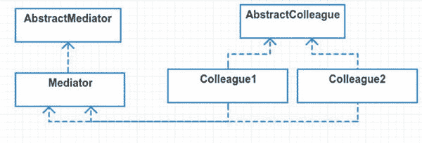
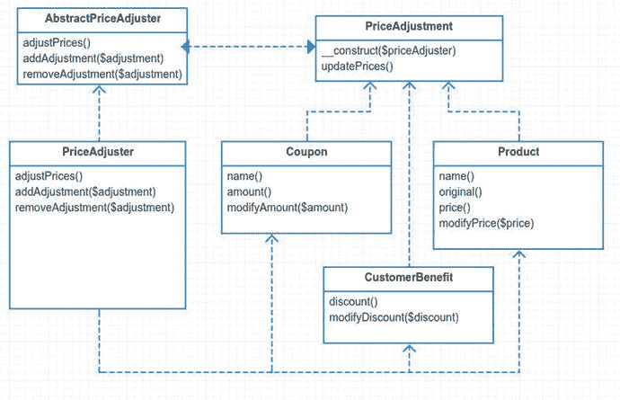

# 20.调解人

```php
$> git checkout mediator
$> composer update

```

## 目的

定义一个封装一组对象如何交互的对象。Mediator 通过防止对象显式地相互引用来促进松散耦合，并允许您独立地改变它们的交互。 [<sup>1</sup>](#Fn1)

## 应用程序

每个人都有需要帮助的时候。有时候你已经够忙的了。调解人是中间那个和你一起工作的人。律师、秘书和房地产经纪人都是现实世界中的调解人。房地产经纪人与买方和卖方合作，完成改变房屋所有权的任务。通常，买方和卖方从不直接沟通；所有的交流都通过房地产经纪人进行。

《四人帮》一书将用户界面控件列为中介模式的用例示例。什么是用户界面控件？假设您正在查看一个下拉框和一个保存按钮。在您从下拉框中选择有效选项之前,“保存”按钮是禁用的。这两个小部件不需要相互了解。保存按钮只需要知道它是否被启用。调解人可以帮助解决这个问题。

然而，您不是在用 Java 或 Smalltalk 构建用户界面。你用拉弗尔。您编写 HTML，作为客户端的视图。当然，可能有 JavaScript/jQuery 来处理 Save 按钮的禁用/启用特性，但是在这一点上，您是在 Laravel 的上下文之外。因此，在 Laravel 视图中使用 mediator 模式在用户界面控件之间进行通信是不可取的。

## 抽象结构

*   `AbstractMediator`是一个接口或抽象类。它的方法由具体的中介实现。这里列出的抽象方法将是同事通知中介者的公共 API。见图 [20-1](#Fig1) 。

    

    图 20-1。

    Abstract structure
*   `Mediator`包含具体同事使用的方法。这些方法可以通知其他同事，或者做他们需要的任何事情。

*   `AbstractColleague`是一个接口或抽象类。这个抽象类可以保存所有同事对象使用的方法，也可以保存对中介对象的引用。

*   `Colleague1`和`Colleague2`是`AbstractColleague`的实现。每个同事都不知道对方的存在。如果这些同事之间直接交流，这就违背了中介模式的目的。

## 例子

在本例中，您将构建一个电子商务结账系统的开端。如果你曾经建立或管理过电子商务，你就会知道这有多痛苦。钱总是让事情变得复杂。在这个平台上，你将依靠一个价格调节中介。调整器保存用于计算价格调整的业务逻辑。你有产品、顾客利益和优惠券。价格调整器根据您添加到系统中的客户优惠和优惠券重新计算产品价格。因此，当您添加块状奶酪的优惠券时，您应该会自动看到块状奶酪产品的价格变化，这都要感谢处理价格调整的中介。就像一般的工作流程一样，这就是你想要的:

*   客户增加了一些产品。

*   产品价格会随着客户添加(或删除)优惠券和优惠而自动变化。

我将在这里定义两个抽象的概念:价格调整和价格调整者。价格调节员(调解员)在计算价格时会考虑所有的价格调整(同事)。

作为一个警告，我并不推荐电子商务使用中介模式，但这似乎是展示这种模式的一个很好的例子。定价的业务逻辑可能很难处理，尤其是当跨越许多许多文件时。许多因素都会影响定价，比如你订购了多少产品、优惠券、你住在哪个国家、你是否是一名退伍军人或超过 65 岁或者你是否喜欢一个好苹果。好吧，最后一个可能永远不会被使用，但我确实喜欢一个好苹果。

在本例中，您还有一个任意的业务规则，即如果使用三张或更多优惠券，客户将失去利益。为什么是三个或更多？我不知道。去问客户。这很重要，你知道吗？

## 示例结构

图 [20-2](#Fig2) 为结构示意图。



图 20-2。

Example structure

## 履行

抽象的价格调整类扮演您的抽象同事的角色。它的主要目标是设置价格调整器，然后使用价格调整器中介对象更新价格。这个类通过产品、优惠券和客户利益来扩展。

src/PriceAdjustment.php

```php
abstract class PriceAdjustment

{
        private $priceAdjuster;

        protected function __construct(AbstractPriceAdjuster $priceAdjuster)
        {
                $this->priceAdjuster = $priceAdjuster;
                $this->priceAdjuster->addAdjustment($this);
        }
        protected function updatePrices()
        {
                $this->priceAdjuster->adjustPrices($this);
        }
}

```

你可以把它变成一个界面。你为什么没有呢？没有真正的原因，真的。将价格调整器对象抽象出来似乎不错。这可以防止同事类破坏它，除了构造函数。任何扩展调价类的同事都可以打`updatePrices`。然后`updatePrices`将信息反馈给中介。然后，调解人做它想做的任何事情。接下来，让我们定义一个产品，然后继续讨论优惠券和客户福利。

app/Product.php

```php
namespace App;

class Product extends PriceAdjustment

{
        protected $name, $price, $modifiedPrice;
        public function __construct($name, $price, AbstractPriceAdjuster $priceAdjuster)
        {
                $this->name = $name;
                $this->price = $this->modifiedPrice = $price;
                parent::__construct($priceAdjuster);
        }

```

请注意，您必须将依赖项传递给构造函数。最后一个依赖项包括中介对象。个人感觉把这个服务类传到一个产品里面是不对的。产品似乎很像模型。它应该只是用来存储数据的。在这里有这个调节器类看起来很奇怪，尤其是当你考虑处理雄辩的模型时。事实上，雄辩的模型有一个构造器，它需要一个数据属性列表。

vendor/laravel/framework/src/Illuminate/Database/口才/模型. php

```php
public function __construct(array $attributes = []) {
...
}

```

如果你试图将这个额外的中介类注入到一个雄辩的模型中，那你就违背了初衷。更适合雄辩模型的模式是观察者模式。事实上，雄辩术已经将观察者模式融入其中。我将在几章中讨论这个问题。回到产品，您会看到其余的方法都是访问器和赋值器。

src/Product.php

```php
15   public function name()
16   {
17           return $this->name;
18   }
19
20   public function original()
21   {
22           return $this->price;
23   }
24
25   public function price()
26   {
27           return $this->modifiedPrice;
28   }
29
30   public function modifyPrice($price)
31   {
32           $this->modifiedPrice = $price;
33           $this->updatePrices();
34   }

```

请注意，无论何时修改产品价格，您都需要调用`updatePrices`。这个方法调用价格调整器中介器，它为您处理价格。将价格计算与实际产品类别分开是一件好事。接下来，看看优惠券和客户福利。这些类和你的`Product`类很像。

app/Coupon.php

```php
namespace App;

class Coupon extends PriceAdjustment
{
        protected $name, $amount;

        public function __construct($name, $amount, AbstractPriceAdjuster $priceAdjuster)
        {
                $this->name = $name;
                $this->amount = $amount;
                parent::__construct($priceAdjuster);
        }

        // name() and amount() accessors omitted

        public function modifyAmount($amount)
        {
                $this->amount = $amount;
                $this->updatePrices();
        }
}

```

同样，当您修改优惠券的金额时，您需要告诉价格调整器更新价格。每当修改客户优惠折扣时，您都将执行相同的操作。

app/CustomerBenefit.php

```php
namespace App;

class CustomerBenefit extends PriceAdjustment
{
        protected $discount;

        public function construct($discount, AbstractPriceAdjuster $priceAdjuster)
        {
                if ($discount > 100) throw new Exception("cannot have a discount over 100%");

                $this->discount = $discount;

                parent:: construct($priceAdjuster);
       }

       // discount() accessor omitted

       public function modifyDiscount($discount)
       {
               $this->discount = $discount;
               $this->updatePrices();
       }
}

```

你可能会觉得奇怪，优惠券和顾客利益可以改变。在现实生活中，优惠券通常不会改变价格。如果是这样的话，它可能会被视为一种完全不同的优惠券。优惠券很像价值对象。值对象应该被视为不可变的。原因超出了本章的范围，但是如果你好奇的话，一个[谷歌搜索](https://www.google.com/webhp#q%3Dwhy%20should%20value%20objects%20be%20immutable) [<sup>2</sup>](#Fn2) 可以告诉你。然而，在本例中，您允许优惠券和优惠在创建后被更改，而不是将它们视为不可变的值对象。

到目前为止，您已经完成了价格调整课程。下一步是制造价格调整器。这里我不打算展示[抽象调价器](https://github.com/kdocki/larasign/blob/mediator/src/AbstractPriceAdjuster.php) [<sup>3</sup>](#Fn3) ，因为它只是一个接口，在上面的 UML 图中你可以很容易地看到它需要实现哪些方法。让我们直接进入正题:价格调节者。

app/PriceAdjuster.php

```php
namespace App;

use Illuminate\Support\Collection;

class PriceAdjuster implements AbstractPriceAdjuster
{
        protected $cid = 1;

        public function construct()
        {
                $this->products = new Collection;
                $this->coupons = new Collection;
                $this->customerBenefits = new Collection;
                $this->appliedCoupons = [];
        }

```

您用三个新的集合和一个数组来构造价格调整器。作为业务规则的一部分，每件产品只能使用一张优惠券。这就是为什么你有一个应用优惠券的数组。接下来，你进入这个中介的心脏:`adjustPrices`。

app/PriceAdjuster.php

```php
17   public function adjustPrices()
18   {
19           $customerDiscount = $this->getCustomerDiscount();
20   
21           foreach ($this->products as $product) {
22                   $oldPrice = $product->price();
23                   $newPrice = round($this->getCouponDiscountForProduct($product) *
24                   1 - $customerDiscount / 100), 2);
25                   if ($oldPrice !== $newPrice) $product->modifyPrice($newPrice);
26           }
27   }

```

该方法遍历所有产品，找到产品的优惠券折扣，然后减去客户折扣。如果数学让你困惑，不要担心；这只意味着你不再是 21 岁了。比较`oldPrice`和`newPrice`的条件很重要。除了在产品价格没有变化的情况下不需要更新价格之外，这种情况还可以防止你一遍又一遍地递归调用自己。请记住，当您修改产品价格时，它会调用价格调整器。这将不断调用自己，你会得到一个恼人的最大递归深度超过堆栈跟踪。继续，您仍然需要实现另外两个方法来添加和删除调整。

app/PriceAdjuster.php

```php
27   public function addAdjustment(PriceAdjustment $adjustment)
28   {
29           $this->{'add' . get_class($adjustment)}($adjustment);
30   }
31   
32   public function removeAdjustment(PriceAdjustment $adjustment)
33   {
34           $this->{'remove' . get_class($adjustment)}($adjustment);
35   }
36   
37   protected function addProduct(Product $product)
38   {
39           $this->addToCollection($this->products, $product);
40   }
41   
42   protected function addCustomerBenefit(CustomerBenefit $benefit)
43   {
44           $this->addToCollection($this->customerBenefits, $benefit);
45   }
46   
47   protected function addCoupon(Coupon $coupon)
48   {
49           $this->addToCollection($this->coupons, $coupon);
50   }
51   
52   protected function removeProduct(Product $product)
53   {
54           unset($this->appliedCoupons[$product->cid]);
55           $this->removeFromCollection($this->products, $product);
56   }
57   
58   protected function removeCoupon(Coupon $coupon)
59   {
60           $key = array_search($coupon->cid, $this->appliedCoupons);
61   
62           if ($key !== false) unset($this->appliedCoupons[$key]);
63   
64           $this->removeFromCollection($this->coupons, $coupon);
65   }
66   
67   protected function removeCustomerBenefit(CustomerBenefit $benefit)
68   {
69           $this->removeFromCollection($this->customerBenefits, $benefit);
70   }
71   
72   protected function addToCollection($collection, $object)
73   {
74           $object->cid = $this->cid++;
75   
76           $collection->push($object);
77   
78           $this->adjustPrices();
79   }
80   
81   protected function removeFromCollection($collection, $object)
82   {
83           $key = $collection->search($object);
84   
85           $collection->forget($key);
86   
87           $this->adjustPrices();
88   }

```

在价格调整器中有一些更受保护的方法，但是它们与中介模式没有任何关系。如果你对这个类的其余部分感到好奇，请查看 GitHub [<sup>4</sup>](#Fn4) 上的代码[。](https://github.com/kdocki/larasign/blob/mediator/src/PriceAdjuster.php)

现在终于到了跑这个坏小子的时候了！在您的模拟中，您将添加一些产品和优惠券，甚至是客户折扣。然后你将打印出你的产品价格和总价。模拟器看起来像这样:

app/simulator.php

```php
 6   $priceAdjuster = new \App\PriceAdjuster;
 7   
 8   $product1 = new \App\Product('Block Cheese', 3.99, $priceAdjuster);
 9   $product2 = new Product('Frozen Pizza', 6.69, $priceAdjuster);
10   $product3 = new Product('Popcorn', 2.34, $priceAdjuster);
11   price()('untouched prices', $product1, $product2, $product3);

```

在这里，您正在创建三种新产品，并设置名称和价格。`price`方法给出了以下输出:

```php
--- untouched prices ---
Block Cheese: 3.99
Frozen Pizza: 6.69
Popcorn: 2.34
total: 13.02

```

你的理算员还没有调整这些原始价格。让我们通过添加一些优惠券来改变这种情况。

```php
app/simulator.php

13   $coupon1 = new \App\Coupon('Block Cheese', 1.00, $priceAdjuster);
14   $coupon2 = new Coupon('Frozen Pizza', 2.00, $priceAdjuster);
15   price('adding 2 coupons', $product1, $product2, $product3);

```

既然已经添加了优惠券，价格调整器就开始工作了。你可以看到块状奶酪和冷冻披萨现在更便宜了。

```php
--- adding 2 coupons ---
Block Cheese: 2.99
Frozen Pizza: 4.69
Popcorn: 2.34
total: 10.02

```

接下来，你得到了你的客户利益，它把你的价格打了 30%的折扣。同样，通过将价格调整器添加到类中，价格会自动调整。

app/simulator.php

```php
17   $benefit1 = new \App\CustomerBenefit(30, $priceAdjuster);
18   price('added 30% customer benefit', $product1, $product2, $product3);

--- added 30% customer benefit ---
Block Cheese: 2.09
Frozen Pizza: 3.28
Popcorn: 1.64
total: 7.01

```

请记住，作为上述商业规则的一部分，如果顾客使用两张以上的优惠券，他或她将失去利益。

app/simulator.php

```php
13   $coupon3 = new Coupon('Popcorn', 2.00, $priceAdjuster);
14   price('adding 3rd coupon, customer looses 30% benefit', $product1,
15   $product2, $product3);

--- adding 3rd coupon, customer looses 30% benefit ---
Block Cheese: 2.99
Frozen Pizza: 4.69
Popcorn: 0.34
total: 8.02

```

在这一部分，你决定取消最便宜的优惠券，最大限度地节省。我觉得我应该从周日的报纸上剪优惠券什么的。

app/simulator.php

```php
13   $priceAdjuster->removeAdjustment($coupon1);
14   unset($coupon1);
15   price('removing coupon #1, now 30% benefit back', $product1, $product2, $product3);

--- removing coupon #1, now 30% benefit back ---
Block Cheese: 2.79
Frozen Pizza: 3.28
Popcorn: 0.24
total: 6.31

```

最后，您展示了您可以编辑一项福利，并且产品价格会通过 price adjuster mediator 自动更改。

app/simulator.php

```php
13   $benefit1->modifyDiscount(45);
14   price('customer gets 45% discount now!', $product1, $product2, $product3);

--- customer gets 45% discount now! ---
Block Cheese: 2.19
Frozen Pizza: 2.58
Popcorn: 0.19
total: 4.96

```

这个例子差不多结束了。下面我给你留下一些对这种模式的思考。

### 别惹我的构造器，伙计！

如果你不喜欢中介模式破坏构造函数的方式，请注意，你可以改变这一点。你可以使用一个可空的对象或者简单的单例对象。

app/Product.php

```php
public function construct($name, $price, AbstractPriceAdjuster $priceAdjuster = null)
{
        $this->name = $name;
        $this->price = $this->modifiedPrice = $price;
        parent:: construct($priceAdjuster ?: PriceAdjuster::instance());
}

```

这就是了。不再需要传递价格调整器。如果您没有传入任何东西，它使用价格调整器的静态实例，一个简单的单例。当进行单元测试时，请确保不要使用这种单例模式，方法是传入您自己的模拟调价器。

### 调解人不适合我

你可能已经注意到，调解人可以很快变得势不可挡。我个人不喜欢我在这个例子中采用的方法。这是一个试图使模式“适合”的例子在更新产品价格时，只需进行两次调用就可以避免中介模式:一次是更新价格，另一次是重新计算。请允许我演示一下。

```php
$product = new Product("name", 3.45);
$product->modifyPrice(2.34);
$priceAdjuster->updatePrice();

```

现在不是产品调用中介，而是你自己调用它。我自己更喜欢这种程度的控制。目前，中介耦合到所有同事，反之亦然。它看起来太复杂了。希望您已经了解了一些关于中介模式的知识(并且足以知道什么时候应该远离它)。让我们来谈谈什么不是中介模式。

### 不是中介模式

让我花点时间指出，管理者和控制者与中介者模式不同。管理器或控制器初始化从属类。通常情况下，这些下属之间从不直接交流。那不是调解人吗？不，有几个原因。首先，那些从属类通常没有办法与管理器通信。这种交流是单向的。经理告诉下属做什么，然后等待直接的回应。如果后来下属发生了什么事，经理会幸福地保持不知道，因为下属没有办法与经理取得联系。第二个原因是，下属很可能不是同事。他们彼此没有什么关系。下属很可能彼此不相结合。

六边形模式可用于控制器、控制器和管理器对象。人们可能倾向于认为六边形图案很像介体图案。它的结构类似。六边形模式的基本思想是将控制器对象传递给从属类。然后，从属对象可以回调传入的控制器对象上的方法。这类似于中介模式，但又不完全相同。调解人处理多个同事之间的沟通。六边形模式只处理两个类之间的直接通信:控制器和服务。

如果您想知道六边形图案可能是什么样子，这里有一些示例代码。您定义一个供控制器使用的接口。

```php
interface Created
{
        public function created($obj);
        public function notCreated($errors);
}

```

控制器实现了`Created`接口。它必须被您很快就会看到的`UserCreator`服务类使用。在下面的代码中，控制器不再负责实际验证和创建新用户。他的工作仅仅是充当传输层/路由层，并将任务委派给下属的`UserCreator`类。

```php
class UserController extends Controller implements Created
{
        public function store(Request $request)
        {
            $userCreator = new UserCreator($this);
            return $userCreator->create($request->input('email'), $request->input('password'));
        }

        public function created($user)
        {
            auth()->login($user);
            return redirect('/');
        }

        public function notCreated($errors)
        {
            return redirect('users/create')->withErrors($errors)->withInpt();
        }
}

```

接下来，您需要定义您的`UserCreator`服务类。它将处理创建用户的工作。通过直接调用管理器的方法，`UserCreator`告诉管理器它是`created`还是`notCreated`。使用这种方法，请注意您的控制器是完全无逻辑的。它非常简单，甚至不需要测试。如果你愿意，你仍然可以对控制器进行单元测试，但是你需要重构，这样你就可以注入一个模拟`UserCreator`。测试您的`UserCreator`更加容易，因为您不必处理外观、HTTP 请求和重定向。

```php
class UserCreator

{
        public function construct(Created $manager)
        {
                $this->manager = $manager;
        }

        public function create($email, $password)
        {
                $validator = Validator::make(...);

                if ($validator->fails()) {
                        return $this->manager->notCreated($errors);
                }

                $user = new User;
                $user->email = $email;
                $user->password = bcrypt($password);
                $user->save();

                // do other user creation stuff here

                return $this->manager->created($user);
        }
}

```

六边形模式的另一个好处是，您可以用不同的类重用您的`UserCreator`类，就像用控制台命令创建用户一样。这种模式的缺点是，现在需要检查两个地方来创建用户:`UserController`和`UserCreator`。它使您的代码稍微复杂一点，但是提供了分离传输层和业务逻辑层的灵活性。

我可以写一整章关于六边形图案的内容，但我在这里只是简单地介绍了一下，主要是为了说明一个观点。关键是你的`UserCreator`可以反馈给他的经理，这是一个类似于中介模式的结构。六边形模式的目的是分离传输层和业务层。其目的不是解耦同事对象。我的最后一点是，在讨论模式时，你应该记住意图是非常重要的。尤其是在比较不同模式之间的差异时。

## 结论

中介模式用于处理同事对象之间的通信。这促进了原本紧密耦合的类之间的松散耦合。在研究这种模式时，我看到的最大缺点之一是创建了上帝对象。我们以前都创造过上帝的物品。如果有足够的时间，这些物品会让你的内心充满悔恨和遗憾。我和一个朋友对这种行为有一个术语。我们称之为前任混蛋。

前一个混蛋就是写了一堆代码然后走人的家伙。现在，您陷入了一大堆您必须弄清楚的怪异代码中。有时候你甚至是你自己以前的混蛋。你爬回到几个月前写的代码，只是因为客户抱怨一些奇怪的错误。奇怪的代码往往会产生奇怪的错误。调解人往往会产生以前的混蛋，尤其是随着同事数量的增加。

这种模式的另一个缺点是，当中介模式不适合时，您最终会创建比所需更复杂的代码。中介体是一个很难适应 Laravel 的模式。前端 JavaScript 可能更适合这种模式。事件通常用于在整个代码中传播更改，因此在 JavaScript 领域中它可能做得更好。我的两个观点:如果你发现自己想要许多对象之间的松散耦合，那么就给中介一个机会。否则，随它去吧。

接下来，让我们花点时间来讨论一下纪念物模式。

Footnotes [1](#Fn1_source)

设计模式:可重用面向对象软件的元素，第 305 页

  [2](#Fn2_source)

[T2`www.google.com/webhp#q=why%20should%20value%20objects%20be%20immutable`](http://www.google.com/webhp#q=why%20should%20value%20objects%20be%20immutable)

  [3](#Fn3_source)

[T2`https://github.com/kdocki/larasign/blob/mediator/src/AbstractPriceAdjuster.php`](https://github.com/kdocki/larasign/blob/mediator/src/AbstractPriceAdjuster.php)

  [4](#Fn4_source)

[T2`https://github.com/kdocki/larasign/blob/mediator/src/PriceAdjuster.php`](https://github.com/kdocki/larasign/blob/mediator/src/PriceAdjuster.php)