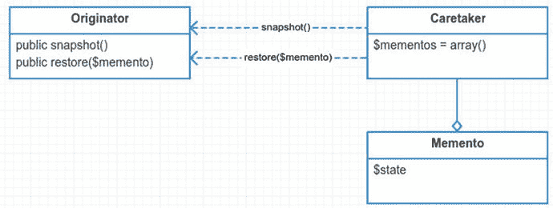
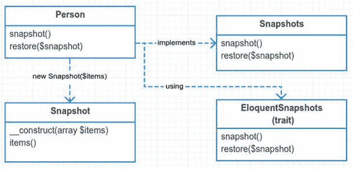

# 21.纪念品

```php
$> git checkout memento

```

## 目的

在不违反封装的情况下，捕获并具体化一个对象的内部状态，以便该对象可以在以后恢复到这个状态。 [<sup>1</sup>](#Fn1)

## 应用

你看过那部叫[纪念物](http://en.wikipedia.org/wiki/Memento_%28film%29) [<sup>2</sup>](#Fn2) 的电影吗？故事讲述了一个再也无法制造新记忆的调查员。他循着线索寻找杀害他妻子的第二个袭击者。这不是克里斯托弗·诺兰最好的电影之一，但仍然值得一看。这一章与此无关。我甚至不知道如何把电影和纪念品联系起来。不过，我确实喜欢一部好的诺兰电影。

使用 memento 模式的原因是为了保存对象的内部状态。这种模式也称为撤销模式。您创建对象的快照。并且您可以随时恢复到以前的状态。

拍摄物体的快照听起来可能很容易。你看着一个物体复制数值，对吗？嗯，事情没那么简单。看下面的对象，问问自己，你是怎么保存`MyObject?`的内部变量状态的

app/MyObject.php

```php
namespace App;

class MyObject

{
        private $thing;
        public $anotherThing;
}

```

你可以访问`$anotherThing`，因为它是公共的。保存`$thing`的值很困难，因为它是私有变量。你可以创建一个名为`getThing()`的公共方法来解决这个问题。此时，您正在为保存私有值而创建方法。这暴露了类的内部工作方式，打破了封装。

为什么这会破坏封装？想象你有一个盒子。当你按下盒子上的按钮时，它就会吐出一块巧克力蛋糕。那就是封装。现在想象一下，蛋糕盒上有一百个按钮。你可以做不同大小和不同口味的蛋糕。一台有上百个按钮的机器听起来很复杂。创造一个是痛苦的。维持它是一种痛苦。用起来也是一种痛苦。我的意思是，如果我只是想要巧克力蛋糕，我不应该弄乱 99 个按钮。在软件设计中，你努力创造一百个不同的只有一个按钮的蛋糕机，而不是一个有一百个按钮的蛋糕机。

你不是在造蛋糕机。你在建造物品。不过，同样的原则也适用。当你设计你的对象时，你应该努力使它们尽可能容易使用。为了做到这一点，你的班级应该承担尽可能少的责任。您为您的类创建的公共方法越多，您添加的责任就越多。这就是为什么您使用 memento 模式而不是公开私有变量。

避免暴露私有变量并保存它们以备后用的一个好方法是使用 memento 模式。所以让我们来学习如何。

## 抽象结构

*   `Originator`是包含您想要保存的`public, protected,`和`private`变量的类。当您在`Originator`上调用`snapshot`方法时，它将创建一个新的`Memento`对象。`restore`方法允许你在这个类中设置`private`和`protected`变量。见图 [21-1](#Fig1) 。

    

    图 21-1。

    Abstract structure
*   `Caretaker`处理快照。`Originator`不需要额外负责保存自己的快照。由管理员决定以后如何恢复快照。这可以通过一种`undo`方法来完成。这可以通过从`$mementos`数组中选取一个数字索引来完成。可能完全是随机的。由管理员决定如何将纪念品放回`Originator`。

*   `Memento`是普通的老式 PHP 对象(POPO ),它存储了从`Originator`中保存的变量。请不要更改这些变量，这一点很重要。这在某种程度上违反了纪念模式。快照应该被视为不可变的。一旦你开始篡改一个`Memento`对象，你就在`Memento`和`Originator`之间创建了一个紧密耦合。到那时，它就不再是纪念品了。它变成了完全不同的东西。

这个模式没有抽象接口。很奇怪吧。Singleton 和 facade 是唯一没有抽象接口的模式。实际上，我将在下面的例子中使用一个接口，因为我发现接口很好使用。我提到这一点是为了说明一点。你不必总是为了使用一个模式而使用接口。不管您是否使用接口，您可能仍然在使用设计模式。我知道在这一点上我可能听起来像一张破唱片，但是我要再说一遍:**真正决定设计模式的是意图，而不是代码结构。

## 例子

你的目标是给你雄辩的模特拍快照。快照应该包含将模型恢复到原始状态所需的所有信息。这意味着，如果您更改模型的属性、表名和其他属性，您总是可以恢复到以前的快照。

在这个例子中，你会学到更多关于口才的内部知识。您也将稍微偏离 UML，并利用特征来实现您的 memento 模式。这些特征不是必需的，但是我发现在这种情况下，它给整个代码增加了一点语法上的好处。

利用你的快照特质，你可以给你雄辩的模特拍快照。这样做有很多好处。一个是你可以在任何时候创建一个模型的快照，然后将它恢复到某个原始状态。也许您正在更改一个人对象的电子邮件地址，并将它保存在数据库中。如果事情出错了，也许你想把人对象恢复到原来的样子。更新一个人的信息后，您需要更新一些远程服务上的信息，如 Stripe、CRM 或搜索索引。您将创建自己的快照。如果更新远程服务出现问题，您将从快照中恢复您的个人。

但是数据库事务或审计历史表不是更合适吗？是的，这是真的。事实上，数据库事务是 memento 模式的一个真实例子。此外，没有什么可以阻止您将审计历史作为 memento 模式的一部分来实现。在本例中您不会这样做，但是您可以在以后拍摄快照时轻松地添加审计。

## 示例结构

图 [22-2](22.html#Fig2) 为结构示意图。



图 21-2。

Example structure

## 履行

让我们来看看你的`snapshot`对象。这取代了 memento 对象。您用一组键/值对来构造快照。请注意，创建快照后，您不能更改项目。这样做是为了防止管理员破坏封装。

app/快照. php

```php
namespace App;

class Snapshot

{
         protected $items;

         public function __construct(array $items)
         {
                 $this->items = $items;
         }

         public function items()
         {
                 return $this->items;
         }
}

```

与其传入一个名为`$items`的通用数组，不如显式地列出要拍摄的实际属性。当然也欢迎你这样做。这个通用快照类足够抽象，可以处理许多不同类型的`Originators`。`Originator`是唯一应该使用快照的人。你的`snapshot`班只有一个责任。它充当键/值对的存储桶。`snapshot`类对`Originator`了解得越多，就越有可能危及`Originator`的封装。

上面的`snapshot`类对`Originator`一无所知。不明确`Originator`的属性有一个缺点。`Originator`在创建快照时必须格外小心。当`Originator`忘记设置一个键时，不会出现编译错误，如果您必须显式地向快照构造函数提供所有`Originator`的属性，就会出现编译错误。明确通常可以防止以后的错误。在这种情况下，您可以破例选择隐式路径。

接下来，看你的`Originator`对象。

app/Person.php

```php
namespace App;

class Person extends Model implements Snapshots
{
        use EloquentSnapshots;
}

```

您在这里使用一个特征来实现您的`Snapshots`接口。这种做法在 Laravel 越来越普遍。`Snapshots`接口只需要您实现两个方法。

app/快照. php

```php
namespace App;

interface Snapshots
{
        public function snapshot();
        public function restore(Snapshot $snapshot);
}

```

您使用 trait 来混合这种功能。您可以直接在您的`Person`类中编写方法。你选择做一个特质的原因有两个。一是为了可重用性。这个特性非常普遍，可以被其他雄辩的模型重用。第二个原因是为了避免继承除了雄辩之外的另一个基类。

app/EloquentSnapshots.php

```php
namespace App;

trait EloquentSnapshots
{
        public function snapshot()
        {
                $items = [];

                $keys = [
                        'connection', 'table', 'primaryKey', 'perPage', 'incrementing', 'timestamps', 'attributes', 'original', 'relations', 'hidden', 'visible', 'appends', 'fillable', 'guarded', 'dates', 'touches', 'observables', 'with', 'morphClass', 'exists',
                ];

                foreach ($keys as $key) {
                        $items[$key] = $this->$key;
                }
                return new Snapshot($items);
        }

```

循环遍历所有的键，并将它们添加到名为`$items`的键/值对数组中。然后，这些项目用于创建新的快照对象。稍后，snapshot 对象将用于循环遍历您添加的项目，并将它们分配回您的雄辩类。

app/EloquentSnapshots.php

```php
public function restore(Snapshot $snapshot)
{
        foreach ($snapshot->items() as $key => $value) {
                $this->$key = $value;
        }
}

```

现在只剩下看守人了。管理员管理从`Originator`创建的快照。在你的例子中，你不会成为那类人；相反，模拟器将为您管理快照。在某种程度上，模拟器承担了看管者的角色。

app/simulator.php

```php
 9   $person = new \App\Person;
10   $person->name = "Kelt";
11   $snapshot1 = $person->snapshot();
12   
13   $person->setTable('persons');
14   $person->name = "test name";
15   $person->email = "testing@test.com";
16   $snapshot2 = $person->snapshot();

```

请注意，您创建了两个快照。第一个快照的名称中只有“Kelt”。第二张快照更改了此人的姓名和电子邮件地址。它还设置了表名。让我们检查以下语句的输出:

app/simulator.php

```php
18   print personInfo("this is how person looks now", $person);

```

控制台输出

```php
this is how person looks now
name: test name, table: persons, email: testing@test.com

```

app/simulator.php

```php
20   $person->restore($snapshot1);
21   print personInfo("restoring snapshot 1", $person);

```

控制台输出

```php
restoring snapshot 1
name: Kelt, table: people, email:

```

app/simulator.php

```php
23   $person->restore($snapshot2);
24   print personInfo("restoring snapshot 2", $person);

```

控制台输出

```php
restoring snapshot 2
name: test name, table: persons, email: testing@test.com

```

看看您是如何将对象恢复到以前的快照的？您打印出表名、人名和电子邮件，作为快照正在工作的证据。第一次和第三次打印的声明是一样的，正如所料。当然，你已经偷看了幕后，所以你知道魔术是如何在幕后工作的。不过，这还是很酷。您可以为您的雄辩模型创建快照，并且在任何时候，您都可以通过恢复快照来撤消更改。

### 纪念品的替代品

每当我遇到一个问题，我总是试图记住检查其他人是如何解决这个问题的。这通常可以节省我的时间。也就是说，让我们提出几个使用 memento 模式的替代方案。

1.  使用雄辩的方法

2.  对象序列化

#### 使用雄辩的方法

不出意外的话，口才已经有了一个叫`syncOriginal`的方法。Taylor 使用这个数组来跟踪自从您上次保存以来在您的雄辩模型中发生了什么变化。有一些叫做`isDirty`和`getDirty`的方法可以检查你雄辩模型的变化。他们比较了`$original`数组和`$attributes`数组的内容。

vendor/laravel/framework/src/Illuminate/Database/口才/模型. php

```php
3217   public function getDirty()
3218   {
3219           $dirty = [];
3220   
3221           foreach ($this->attributes as $key => $value) {
3222              if (! array_key_exists($key, $this->original)) {
3223                  $dirty[$key] = $value;
3224              } elseif ($value !== $this->original[$key] &&
3225                           ! $this->originalIsNumericallyEquivalent($key)) {
3226                $dirty[$key] = $value;
3227              }
3228           }
3229   }

```

此方法允许您查看脏字段。在一个雄辩的模型完成保存后，您同步原始数组。这意味着一旦您保存了模型，就不应该认为任何东西是脏的。

vendor/laravel/framework/src/Illuminate/Database/口才/模型. php

```php
1502   protected function finishSave(array $options)
1503   {
1504            $this->fireModelEvent('saved', false);
1505   
1506            $this->syncOriginal();
1507   
1508            if (Arr::get($options, 'touch', true)) {
1509                $this->touchOwners();
1510            }
1511   }

```

在你保存完一个模型后，`$attributes`数组被`syncOriginal`方法复制到`$original`。

vendor/laravel/framework/src/Illuminate/Database/口才/模型. php

```php
3154   public function syncOriginal()
3155   {
3156          $this->original = $this->attributes;
3157   
3158          return $this;
3159   }

```

为什么我要报道这些？了解口才如何处理某些事情对你有好处。看看泰勒是怎么处理这个问题的，可以给你自己的问题一些思路。通过查看引擎盖下面，你可以确保泰勒没有在拍快照或做纪念品图案。你确实发现他在跟踪一个数组中的属性。这很方便。这意味着，如果你只想要你的属性快照，泰勒有你涵盖。可以用`getAttributes()`。

app/test1.php

```php
   $person1 = new \App\Person;
   $person1->name = 'Kelt';
   $snapshot1 = $person1->getAttributes();

   $person2 = new Person($snapshot1);
   print personInfo('New person from attributes of person1', $person2);

```

控制台输出

```php
New person from attributes of person1
name: Kelt, table: people, email:

```

该代码不需要您进行特殊编码。都已经烤成雄辩了。如果你需要做的只是恢复属性，那么你就不需要纪念品模式。

#### 对象序列化

您可以选择的另一个选项是对象序列化。您不是创建 memento 模式，而是序列化一个对象，从而将其保存为一个字符串。该字符串可以被存储以备后用。当需要还原时，将字符串反序列化回对象中。这是创建快照的好方法。

app/test2.php

```php
$person = new \App\Person;
$person->setTable('persons');
$person->email = 'testing@test.com';
$snapshot1 = serialize($person);

$person->setTable('crm_people');
$person->email = "some-new@email.com";

print personInfo('examining person object', $person);

$person = unserialize($snapshot1);

print personInfo('restoring snapshot 1', $person);

```

控制台输出

```php
examining person object
name: , table: crm_people, email: some-new@email.com
restoring snapshot 1
name: , table: persons, email: testing@test.com

```

为什么不只是序列化对象呢？为什么要使用纪念品图案呢？memento 模式比序列化有一些优势。memento 模式提供的第一个优势是灵活性和可控性。如果你只是简单地序列化你的对象，你就不能选择你想要保存的字段。如果您只想保存几个受保护的属性，该怎么办？memento 模式允许您只选择那些您想要保存的字段。

大多数对象都可以序列化。包含资源(如数据库连接或文件流)的对象可能会有问题。在某些情况下，序列化会失败。这是纪念品模式的第二个好处。使用 memento 模式时，您不必处理`sleep`和`wakeup`或[可序列化](http://php.net/manual/en/class.serializable.php) [<sup>3</sup>](#Fn3) 接口。但是，您不应该害怕处理序列化。对象序列化非常酷。下面的测试表明，即使你已经连接到数据库，口才似乎仍然为你处理序列化。快看。

app/test3.php

```php
$person = new \App\Person;
$person->email = 'testing@test.com';
$person->save();

$snapshot1 = serialize($person);
$person->email = "something@else.com";
$person = unserialize($snapshot1);

print $person->isDirty() === false ? '' : 'isDirty' . PHP_EOL;

print personInfo('unserialized person', $person);

```

控制台输出

```php
unserialized person
name: , table: people, email: testing@test.com

```

为了让上面的代码工作，你必须运行迁移。您还需要在您的机器上安装 SQLite PHP PDO 驱动程序。

序列化可以带你走很长的路。即使有 memento 模式的优势，序列化仍然是一个非常酷的选择。

## 结论

memento 模式用于避免违反封装，同时仍然捕获发起者类的内部变量。纪念品模式也有一些缺点。当发起者对象有大量数据要存储时，创建 memento 对象的成本可能是存储器密集型的。这种模式的第二个缺点是，您给发起者对象增加了更多的责任。

你也学会了纪念品模式的替代方案。总而言之，如果在创建快照时不需要任何额外的灵活性，这种模式可能会被序列化替代。

Footnotes [1](#Fn1_source)

设计模式:可重用面向对象软件的元素，第 315 页

  [2](#Fn2_source)

[T2`http://en.wikipedia.org/wiki/Memento_%28film%29`](http://en.wikipedia.org/wiki/Memento_%28film%29)

  [3](#Fn3_source)

[T2`http://php.net/manual/en/class.serializable.php`](http://php.net/manual/en/class.serializable.php)