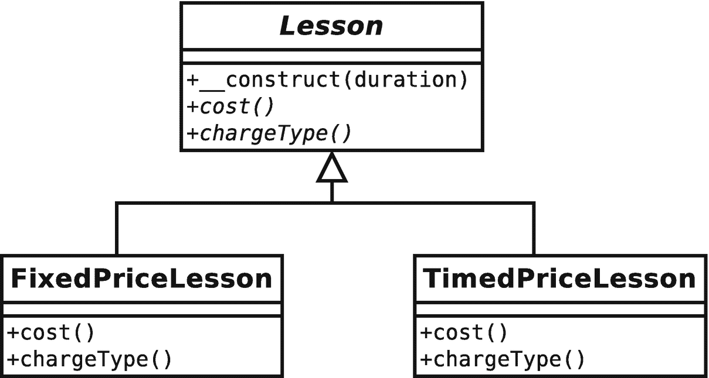
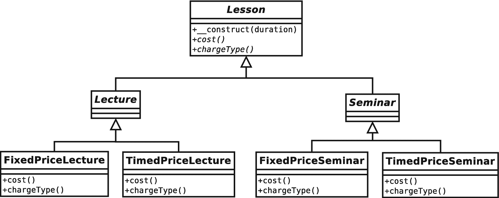
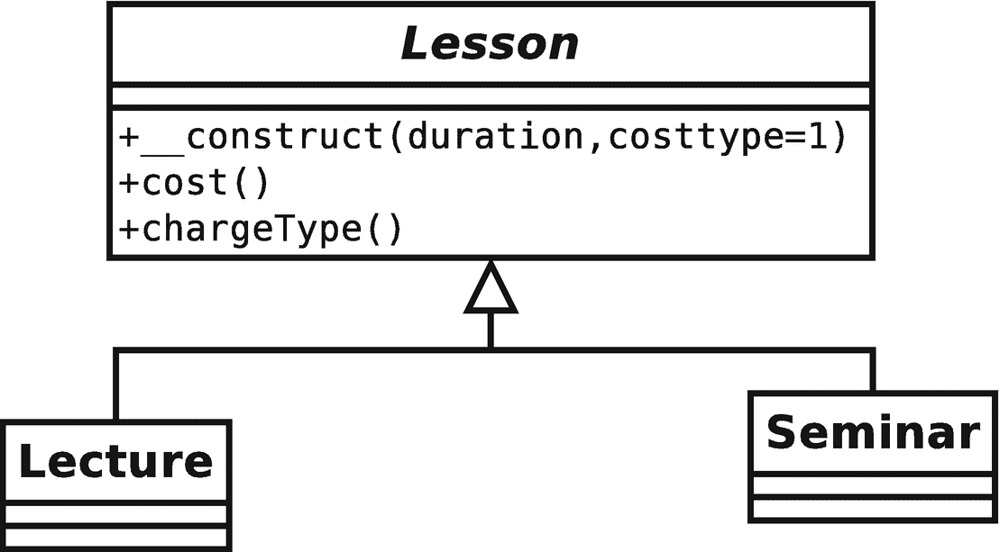
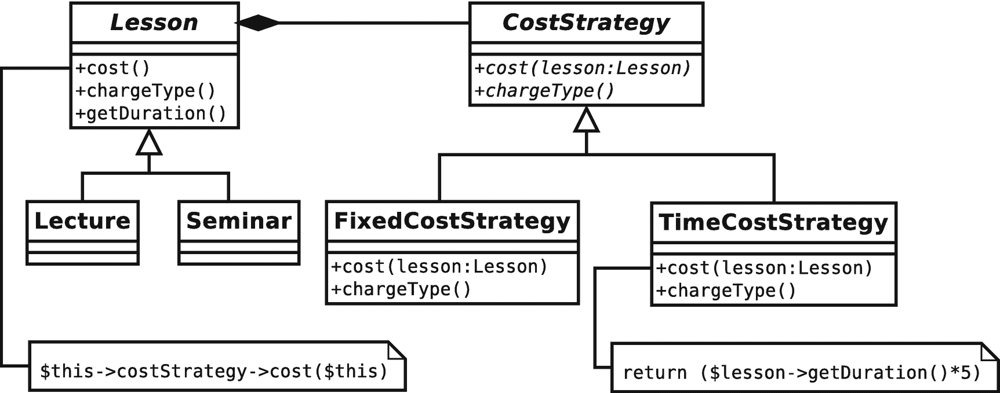
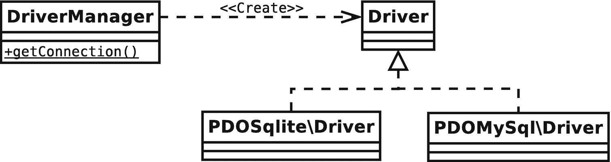
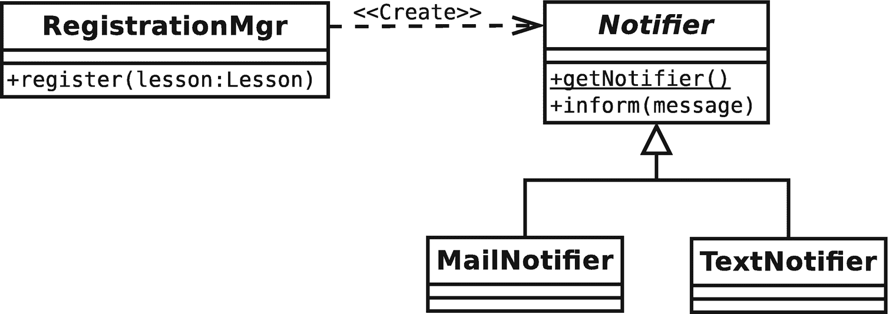

# 8.一些模式原则

尽管设计模式简单地描述了问题的解决方案，但是它们倾向于强调提高可重用性和灵活性的解决方案。为了实现这一点，它们体现了一些关键的面向对象设计原则。我们将在本章中遇到其中的一些，并在本书的其余部分更详细地介绍。

本章将涵盖以下主题:

*   组合:如何使用对象聚合来获得比单独使用继承更大的灵活性

*   *解耦*:如何减少系统中元素之间的依赖

*   接口的力量:模式和多态性

*   *图案类别*:本书将涉及的图案类型

## 模式启示

我第一次开始用 Java 语言处理对象。正如你所料，一些概念的出现需要一段时间。然而，当它真的发生时，它发生得非常快，几乎具有启示的力量。继承和封装的优雅让我大吃一惊。我能感觉到这是一种不同的定义和构建系统的方式。我*得到了*多态，在运行时处理一个类型并切换实现。在我看来，这种理解将解决我的大部分设计问题，并帮助我设计出漂亮而优雅的系统。

当时我桌上所有的书都集中在语言特性和 Java 程序员可用的许多 API 上。除了多态性的简短定义，很少有人尝试去检查设计策略。

语言特性本身不会产生面向对象的设计。尽管我的项目满足了它们的功能需求，但继承、封装和多态提供的设计似乎继续困扰着我。

当我试图为每一个可能发生的事情建立一个新的类时，我的继承层次变得越来越宽，越来越深。我的系统的结构使得很难将消息从一个层传递到另一个层，而不会让中间类过多地意识到它们的环境，将它们绑定到应用程序中，并使它们在新的上下文中不可用。

直到我发现了*设计模式:可重用面向对象软件的元素* (Addison-Wesley Professional，1995)，或者被称为*四人帮的书*，我才意识到我错过了整个设计维度。到那时，我已经为自己发现了一些核心模式，但其他人贡献了一种新的思维方式。

我发现我的设计中有过多的特权继承，试图在我的类中构建太多的功能。但是在面向对象的系统中，功能还能去哪里呢？

我在作文里找到了答案。通过以灵活的关系组合对象，可以在运行时定义软件组件。“四人帮”把这归结为一条原则:“重创作，轻继承。”模式描述了在运行时组合对象的方式，以达到在继承树中不可能实现的灵活性。

## 构成和继承

继承是为不断变化的环境或上下文进行设计的一种强有力的方式。然而，这会限制灵活性，尤其是当类承担多重责任时。

### 问题

众所周知，子类继承了其父类的方法和属性(只要它们是受保护的或公共的元素)。您可以利用这一事实来设计提供专门功能的子类。

图 8-1 给出了一个使用 UML 的简单例子。



图 8-1

一个父类和两个子类

图 [8-1](#Fig1) 中的抽象`Lesson`类模拟了大学中的一堂课。它定义了抽象的`cost()`和`chargeType()`方法。该图显示了两个实现类，`FixedPriceLesson`和`TimedPriceLesson`，它们为课程提供了不同的收费机制。

使用这个继承方案，我可以在课程实现之间切换。客户端代码将只知道它正在处理一个`Lesson`对象，因此成本的细节将是透明的。

但是，如果我引入一组新的专门化，会发生什么呢？我需要处理讲座和研讨会。因为它们以不同的方式组织注册和课程笔记，所以需要单独的课程。现在我有两种力量在影响我的设计。我需要处理定价策略和单独的讲座和研讨会。

图 [8-2](#Fig2) 显示了一个强力解决方案。



图 8-2

糟糕的继承结构

图 [8-2](#Fig2) 显示了一个明显有缺陷的层级。我不能再使用继承树来管理我的定价机制而不复制大量的功能。定价策略反映在`Lecture`和`Seminar`级系列中。

在这个阶段，我可能会考虑在`Lesson`超类中使用条件语句，删除那些不幸的重复。本质上，我将定价逻辑从继承树中完全移除，将其移到超类中。这与通常的重构相反，用多态替换条件。下面是一个修改过的`Lesson`类:

```php
// listing 08.01
abstract class Lesson
{
    public const FIXED = 1;
    public const TIMED = 2;

    public function __construct(protected int $duration, private int $costtype = 1)
    {
    }

    public function cost(): int
    {

        switch ($this->costtype) {
            case self::TIMED:
                return (5 * $this->duration);
                break;
            case self::FIXED:
                return 30;
                break;
            default:
                $this->costtype = self::FIXED;
                return 30;
        }
    }

    public function chargeType(): string
    {
        switch ($this->costtype) {
            case self::TIMED:
                return "hourly rate";
                break;
            case self::FIXED:
                return "fixed rate";
                break;
            default:
                $this->costtype = self::FIXED;
                return "fixed rate";
        }
    }

    // more lesson methods...
}

```

```php
// listing 08.02
class Lecture extends Lesson
{
    // Lecture-specific implementations ...
}

```

```php
// listing 08.03
class Seminar extends Lesson
{
    // Seminar-specific implementations ...
}

```

下面是我如何使用这些类:

```php
// listing 08.04
$lecture = new Lecture(5, Lesson::FIXED);
print "{$lecture->cost()} ({$lecture->chargeType()})\n";

$seminar = new Seminar(3, Lesson::TIMED);
print "{$seminar->cost()} ({$seminar->chargeType()})\n";

```

这是输出结果:

```php
30 (fixed rate)
15 (hourly rate)

```

你可以在图 [8-3](#Fig3) 中看到新的类图。



图 8-3

通过从子类中移除成本计算改进了继承层次结构

我已经使职业结构变得更容易管理，但这是有代价的。在这段代码中使用条件句是一种倒退。通常，您会尝试用多态来替换条件语句。在这里，我做了相反的事情。如您所见，这迫使我在`chargeType()`和`cost()`方法中重复条件语句。

我似乎注定要复制代码。

### 使用合成

我可以用策略模式来构建我的脱困之路。策略用于将一组算法转移到一个单独的类型中。通过移动成本计算，我可以简化`Lesson`类型。你可以在图 [8-4](#Fig4) 中看到这一点。



图 8-4

将算法转移到单独的类型中

我创建了一个抽象类`CostStrategy`，它定义了抽象方法`cost()`和`chargeType()`。`cost()`方法需要一个`Lesson`的实例，它将使用这个实例来生成成本数据。我为`CostStrategy`提供了两个具体的子类。`Lesson`对象只适用于`CostStrategy`类型，而不是特定的实现，所以我可以通过子类化`CostStrategy`随时添加新的成本算法。这不需要对任何`Lesson`类做任何改变。

下面是新`Lesson`类的简化版本，如图 [8-4](#Fig4) 所示:

```php
// listing 08.05
abstract class Lesson
{

    public function __construct(private int $duration, private CostStrategy $costStrategy)
    {
    }

    public function cost(): int
    {
        return $this->costStrategy->cost($this);
    }

    public function chargeType(): string
    {
        return $this->costStrategy->chargeType();
    }

    public function getDuration(): int
    {
        return $this->duration;
    }
    // more lesson methods...
}

```

```php
// listing 08.06
class Lecture extends Lesson
{
    // Lecture-specific implementations ...
}

```

```php
// listing 08.07
class Seminar extends Lesson
{
    // Seminar-specific implementations ...
}

```

`Lesson`类需要一个`CostStrategy`对象，它将该对象存储为一个属性。`Lesson::cost()`方法简单地调用`CostStrategy::cost()`。同样，`Lesson::chargeType()`调用`CostStrategy::chargeType()`。这种为了满足请求而显式调用另一个对象的方法的行为称为委托。在我的例子中，`CostStrategy`对象是`Lesson`的委托。`Lesson`类不再负责成本计算，并将任务交给`CostStrategy`实现。在这里，它被夹在授权的行为中:

```php
// listing 08.08
public function cost(): int
{
    return $this->costStrategy->cost($this);
}

```

下面是`CostStrategy`类及其实现子类:

```php
// listing 08.09
abstract class CostStrategy
{
    abstract public function cost(Lesson $lesson): int;
    abstract public function chargeType(): string;
}

```

```php
// listing 08.10
class TimedCostStrategy extends CostStrategy
{
    public function cost(Lesson $lesson): int
    {
        return ($lesson->getDuration() * 5);
    }

    public function chargeType(): string
    {
        return "hourly rate";
    }
}

```

```php
// listing 08.11
class FixedCostStrategy extends CostStrategy
{
    public function cost(Lesson $lesson): int
    {
        return 30;
    }
    public function chargeType(): string
    {
        return "fixed rate";
    }
}

```

我可以通过在运行时传递不同的`CostStrategy`对象来改变任何`Lesson`对象计算成本的方式。这种方法可以产生高度灵活的代码。我可以动态地组合和重组对象，而不是静态地在我的代码结构中构建功能:

```php
// listing 08.12
$lessons[] = new Seminar(4, new TimedCostStrategy());
$lessons[] = new Lecture(4, new FixedCostStrategy());

foreach ($lessons as $lesson) {
    print "lesson charge {$lesson->cost()}. ";
    print "Charge type: {$lesson->chargeType()}\n";
}

lesson charge 20\. Charge type: hourly rate
lesson charge 30\. Charge type: fixed rate

```

正如你所看到的，这种结构的一个效果是我集中了我的类的职责。`CostStrategy`对象单独负责计算成本，`Lesson`对象管理课程数据。

因此，组合可以使您的代码更加灵活，因为对象可以组合在一起，以比您单独在继承层次结构中预期的更多的方式来动态处理任务。不过，可读性可能会受到影响。因为组合往往会产生更多的类型，并且关系不像继承关系那样具有固定的可预测性，所以在系统中消化这些关系会稍微困难一些。

## 退耦

你在第 [6](06.html) 章中看到，构建独立的组件是有意义的。具有高度相互依赖的类的系统可能很难维护。一个地点的变化可能需要整个系统的一系列相关变化。

### 问题

可重用性是面向对象设计的关键目标之一，紧耦合是它的敌人。当您看到对系统的一个组件的更改必然导致其他地方的许多更改时，您可以诊断出紧耦合。您应该渴望创建独立的组件，这样您就可以在没有意外后果的多米诺骨牌效应的情况下进行更改。当您更改一个组件时，它的独立程度与您的更改导致系统其他部分失败的可能性有关。

你可以在图 [8-2](#Fig2) 中看到一个紧密耦合的例子。因为成本逻辑是跨`Lecture`和`Seminar`类型镜像的，所以对`TimedPriceLecture`的更改将需要对`TimedPriceSeminar`中的相同逻辑进行并行更改。通过更新一个类而不更新另一个类，我会破坏我的系统——没有任何来自 PHP 引擎的警告。我的第一个解决方案使用条件语句，在`cost()`和`chargeType()`方法之间产生了类似的依赖关系。

通过应用策略模式，我将我的成本算法提炼为`CostStrategy`类型，将它们放在一个公共接口后面，并且每个算法只实现一次。

当系统中的许多类被显式嵌入到平台或环境中时，会出现另一种类型的耦合。例如，假设您正在构建一个使用 MySQL 数据库的系统。您可以使用诸如`mysqli::query()`这样的方法与数据库服务器对话。

如果您被要求在不支持 MySQL 的服务器上部署系统，您可以将整个项目转换成使用 SQLite。但是，您将被迫在整个代码中进行更改，并且面临维护应用程序的两个并行版本的前景。

这里的问题不是系统对外部平台的依赖。这种依赖是不可避免的。您需要处理与数据库对话的代码。当这样的代码分散在整个项目中时，问题就来了。与数据库对话并不是系统中大多数类的主要职责，所以最好的策略是提取这样的代码，并将其组合在一个公共接口后面。这样，你促进了你的类的独立性。同时，通过将您的网关代码集中在一个地方，您可以更容易地切换到一个新的平台，而不会干扰您更广泛的系统。这个过程，将实现隐藏在干净的接口后面，被称为*封装*。主义数据库库用`DBAL`(数据库抽象层)项目解决了这个问题。这为多个数据库提供了单点访问。

`DriverManager`类提供了一个名为`getConnection()`的静态方法，它接受一个参数数组。根据这个数组的组成，它返回一个名为`Doctrine\DBAL\Driver`的接口的特定实现。你可以在图 [8-5](#Fig5) 中看到阶级结构。



图 8-5

DBAL 包将客户机代码从数据库对象中分离出来

Note

静态属性和操作应该在 UML 中加下划线。

然后，`DBAL`包让您将应用程序代码从数据库平台的细节中分离出来。您应该能够用 MySQL、SQLite、MSSQL 和其他工具运行一个系统，而不需要修改一行代码(当然，除了配置参数之外)。

### 松开你的联轴器

为了灵活地处理数据库代码，您应该将应用程序逻辑从它所使用的数据库平台的细节中分离出来。在你自己的项目中，你会看到很多这种组件分离的机会。

例如，想象一下,`Lesson`系统必须包含一个注册组件来为系统添加新的课程。作为注册过程的一部分，添加课时应通知管理员。该系统的用户无法就该通知是通过邮件还是短信发送达成一致。事实上，他们太爱争论了，以至于你怀疑他们可能想在未来换一种新的交流方式。更重要的是，他们希望得到各种事情的通知，因此一个地方的通知模式的改变将意味着许多其他地方的类似改变。

如果您硬编码了对一个`Mailer`类或一个`Texter`类的调用，那么您的系统将紧密耦合到一个特定的通知模式，就像它将通过使用一个专门的数据库 API 紧密耦合到一个数据库平台一样。

下面是一些代码，它们向使用通知程序的系统隐藏了通知程序的实现细节:

```php
// listing 08.13
class RegistrationMgr
{
    public function register(Lesson $lesson): void
    {
        // do something with this Lesson

        // now tell someone
        $notifier = Notifier::getNotifier();
        $notifier->inform("new lesson: cost ({$lesson->cost()})");
    }
}

```

```php
// listing 08.14
abstract class Notifier
{

    public static function getNotifier(): Notifier
    {
        // acquire concrete class according to
        // configuration or other logic

        if (rand(1, 2) === 1) {
            return new MailNotifier();
        } else {
            return new TextNotifier();
        }
    }

    abstract public function inform($message): void;
}

```

```php
// listing 08.15
class MailNotifier extends Notifier
{
    public function inform($message): void
    {
        print "MAIL notification: {$message}\n";
    }
}

```

```php
// listing 08.16
class TextNotifier extends Notifier
{
    public function inform($message): void
    {
        print "TEXT notification: {$message}\n";
    }
}

```

我为我的通知程序类创建了一个样本客户端`RegistrationMgr`。`Notifier`类是抽象的，但是它实现了一个静态方法`getNotifier()`，该方法获取一个具体的`Notifier`对象(`TextNotifier`或`MailNotifier`)。在一个真实的项目中，`Notifier`的选择将由一个灵活的机制决定，比如一个配置文件。在这里，我作弊，随机选择。`MailNotifier`和`TextNotifier`只不过是打印出它们被传递的消息，以及一个标识符来显示哪个被调用了。

注意应该使用哪种混凝土的知识是如何在`Notifier::getNotifier()`方法中集中的。我可以从我的系统的上百个不同部分发送通知消息，并且只需要在这一个方法中改变通知消息。

下面是一些调用`RegistrationMgr`的代码:

```php
// listing 08.17
$lessons1 = new Seminar(4, new TimedCostStrategy());
$lessons2 = new Lecture(4, new FixedCostStrategy());
$mgr = new  RegistrationMgr();
$mgr->register($lessons1);
$mgr->register($lessons2);

```

下面是典型运行的输出:

```php
TEXT notification: new lesson: cost (20)
MAIL notification: new lesson: cost (30)

```

图 [8-6](#Fig6) 显示了这些类别。



图 8-6

通告程序类将客户端代码与通告程序实现分开

请注意图 [8-6](#Fig6) 中的结构与图 [8-5](#Fig5) 中所示的原则组件形成的结构是多么相似。

## 代码指向接口，而不是实现

这个原则是这本书的主题之一。你在第 6 章(以及最后一节)中看到，你可以在一个超类中定义的公共接口后面隐藏不同的实现。然后，客户端代码可能需要超类类型的对象，而不是实现类的对象，而不关心它实际获得的具体实现。

并行条件语句，就像我从`Lesson::cost()`和`Lesson::chargeType()`中找到的，是需要多态性的一个常见标志。它们使得代码难以维护，因为一个条件表达式的变化必然导致其兄弟表达式的变化。条件语句有时被称为实现了“模拟继承”

通过将成本算法放在实现`CostStrategy`的单独的类中，我消除了重复。如果我将来需要添加新的成本策略，我也会让它变得更加容易。

从客户端代码的角度来看，在方法的参数中要求抽象或通用类型通常是个好主意。通过要求更具体的类型，您可能会限制代码在运行时的灵活性。

当然，话虽如此，你在论点暗示中选择的概括性程度是一个判断问题。让你的选择过于笼统，你的方法可能会变得不那么安全。如果您需要子类型的特定功能，那么在一个方法中接受一个装备不同的兄弟可能会有风险。

尽管如此，如果对参数提示的选择过于严格，就会失去多态性的好处。看看这个来自`Lesson`类的修改过的摘录:

```php
// listing 08.18
public function __construct(private int $duration, private FixedCostStrategy $costStrategy)
{
}

```

在这个例子中，设计决策产生了两个问题。首先，`Lesson`对象现在被绑定到一个特定的成本策略，这限制了我编写动态组件的能力。其次，对`FixedPriceStrategy`类的显式引用迫使我维护这个特定的实现。

通过要求一个公共接口，我可以将一个`Lesson`对象与任何`CostStrategy`实现结合起来:

```php
// listing 08.19
public function __construct(private int $duration, private CostStrategy $costStrategy)
{
}

```

换句话说，我已经将我的`Lesson`类从成本计算的细节中分离出来。重要的是接口和保证被提供的对象会遵守它。

当然，编写接口代码通常可以简单地推迟如何实例化对象的问题。当我说一个`Lesson`对象可以在运行时与任何一个`CostStrategy`接口结合时，我提出了一个问题，“但是这个`CostStrategy`对象是从哪里来的呢？”

当你创建一个抽象超类时，总会有一个问题，那就是它的子类应该如何被实例化。你选择哪个孩子，根据哪个条件？这个主题在“四人帮”的模式目录中自成一类，我将在下一章进一步探讨这个问题。

## 变化的概念

设计决策一旦做出，很容易解释，但是如何决定从哪里开始呢？

“四人帮”建议你“把变化的概念封装起来。”根据我的例子，变化的概念是成本算法。在这个例子中，成本计算不仅是两种可能的策略之一，而且显然是一种扩展的候选策略:特别优惠、海外学生费率、入门折扣，各种各样的可能性都出现了。

我很快发现为这种变化划分子类是不合适的，于是我求助于条件语句。通过将我的变体放在同一个类中，我强调了它适合封装。

“四人帮”建议您积极地在类中寻找不同的元素，并评估它们是否适合封装成新的类型。可疑条件中的每一个选择都可以被提取以形成扩展公共抽象父类的类。然后，这个新类型可以由提取它的一个或多个类使用。这具有以下效果:

*   聚焦责任

*   通过构图提高灵活性

*   使继承层次更加紧凑和集中

*   减少重复

那么，你如何发现变异呢？一个迹象是对继承的滥用。这可能包括同时根据多种力量部署的继承(例如，讲座/研讨会和固定/定时成本)。它还可能包括算法的子类化，其中算法是该类型的核心职责所附带的。正如您所看到的，适合封装的变体的另一个标志是条件表达式。

## 图案炎

没有模式的一个问题是模式的不必要或不恰当的使用。这使得模式在某些领域名声不佳。因为模式解决方案很简洁，所以无论它们是否真正满足需求，都很容易将它们应用到您认为合适的地方。

极限编程(XP)方法提供了一些可能适用于这里的原则。第一个是，“你不需要它”(通常缩写为 YAGNI)。这通常适用于应用程序特性，但对模式也有意义。

当我用 PHP 构建大型环境时，我倾向于将我的应用程序分层，将应用程序逻辑从表示层和持久层中分离出来。我将各种核心和企业模式相互结合使用。

然而，当我被要求为一个小型商业网站构建一个反馈表单时，我可能只是在一个单页脚本中使用程序代码。我不需要大量的灵活性；我不会在最初版本的基础上进行构建。我不需要在更大的系统中使用解决问题的模式。相反，我应用第二个 XP 原则:“做最简单的工作。”

当您使用一个模式目录时，解决方案的结构和过程是牢记在心的，并通过代码示例得到巩固。但是，在应用一个模式之前，请密切关注问题，或者“何时使用它”一节，然后仔细阅读该模式的结果。在某些情况下，治疗可能比疾病更糟糕。

## 模式

这本书不是一个模式目录。然而，在接下来的章节中，我将介绍一些目前正在使用的关键模式，提供 PHP 实现并在 PHP 编程的大背景下讨论它们。

所描述的模式将来自关键目录，包括马丁·福勒(Addison-Wesley Professional，2002)的*设计模式:可重用面向对象软件的元素* (Addison-Wesley Professional，1995)；*企业应用架构的模式*，以及 Alur 等人的*核心 J2EE 模式:最佳实践和设计策略* (Prentice Hall，2001)。

### 用于生成对象的模式

这些模式与对象的实例化有关。这是一个重要的类别，因为原则是“接口代码”如果您在设计中使用抽象父类，那么您必须开发从具体子类实例化对象的策略。正是这些对象将在您的系统中传递。

### 组织对象和类的模式

这些模式帮助您组织对象的组合关系。更简单地说，这些模式展示了如何组合对象和类。

### 面向任务的模式

这些模式描述了类和对象合作实现目标的机制。

### 企业模式

我看到了一些描述典型互联网编程问题和解决方案的模式。主要从 *企业应用* *架构*和*核心 J2EE 模式:最佳实践和设计策略*的*模式中提取，模式处理表示和应用逻辑。*

### 数据库模式

本节分析了有助于存储和检索数据以及将对象映射到数据库和从数据库映射对象的模式。

## 摘要

在这一章中，我研究了支撑许多设计模式的一些原则。我研究了如何使用组合来实现运行时的对象组合和重组，从而得到比单独使用继承更灵活的结构。我还向您介绍了解耦，即从上下文中提取软件组件以使它们更普遍适用的实践。最后，我回顾了接口作为将客户端从实现细节中分离出来的手段的重要性。

在接下来的章节中，我将详细研究一些设计模式。