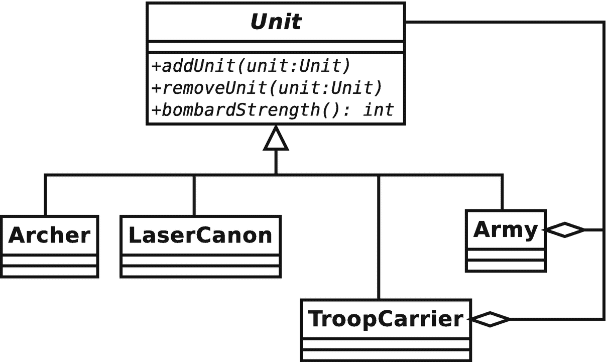
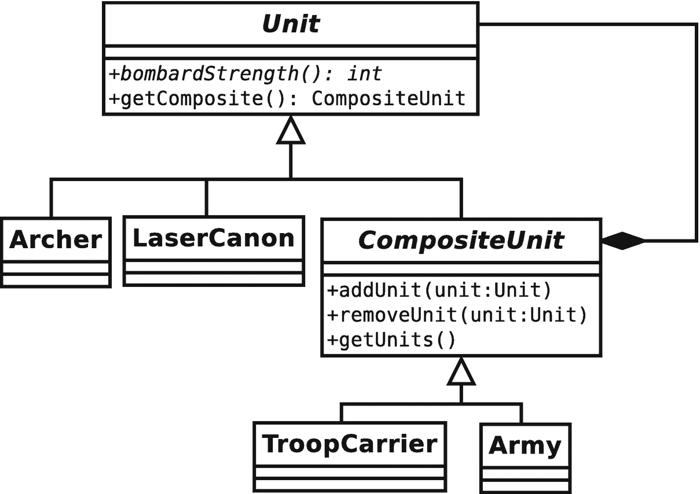
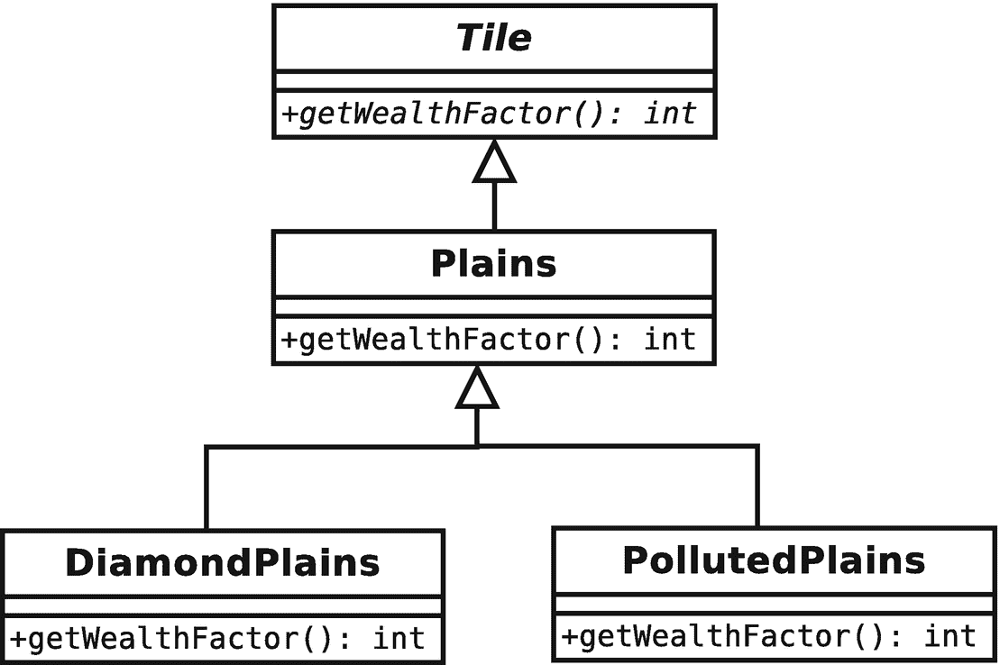
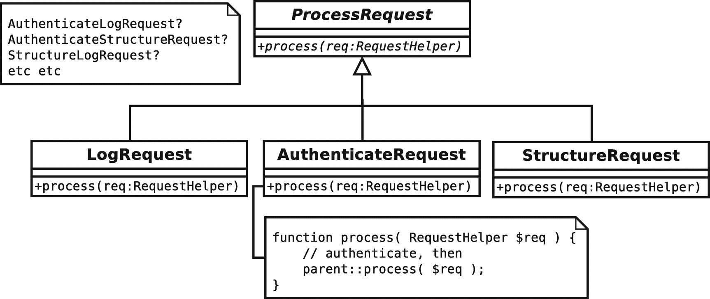
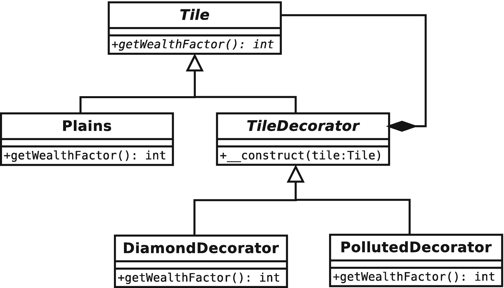

# 十、对象编程的灵活模式

在介绍了生成对象的策略之后，我们现在可以自由地看一些构造类和对象的策略了。我将特别关注组合比继承提供更大灵活性的原则。我在这一章中考察的模式再次取自四人帮的目录。

本章将介绍三种模式:

*   组合模式(Composite pattern):组合结构，其中对象组可以像单独的对象一样使用

*   装饰模式:一种在运行时组合对象以扩展功能的灵活机制

*   *门面模式*:创建复杂或可变系统的简单接口

## 构造类以允许灵活的对象

在第三章中，我说过初学者经常混淆对象和类。这话只对了一半。事实上，我们大多数人偶尔会对 UML 类图感到困惑，试图将它们显示的静态继承结构与它们的对象将要进入的动态对象关系协调起来。

还记得模式原则“重组合轻继承”吗？这个原则提炼了类和对象的组织之间的紧张关系。为了在我们的项目中建立灵活性，我们构建我们的类，以便它们的对象可以在运行时组成有用的结构。

这是贯穿本章前两个模式的共同主题。继承在两者中都是一个重要的特性，但是它的部分重要性在于提供了一种机制，通过这种机制可以使用组合来表示结构和扩展功能。

## 组合模式

组合模式可能是组合服务中部署的继承的最极端的例子。这是一个简单而优雅的设计。它也非常有用。不过，要小心；它如此简洁，你可能会忍不住过度使用这个策略。

组合模式是一种简单的聚集和管理相似对象组的方法，这样客户端就无法将单个对象与对象集合区分开来。事实上，这种模式非常简单，但也经常令人困惑。其中一个原因是模式中的类的结构与其对象组织的相似性。继承层次是树，从根的超类开始，分支到专门的子类。由组合模式建立的*类*的继承树被设计成允许简单地生成和遍历*对象*的树。

如果您还不熟悉这种模式，那么在这一点上您完全有理由感到困惑。让我们用一个类比来说明单个实体可以像事物的集合一样被对待。给定谷物和肉类(或者大豆，如果你喜欢的话)等基本不可减少的成分，我们可以制作一种食品——比如香肠。然后，我们作为一个单一的实体对结果采取行动。正如我们吃、煮、买或卖肉一样，我们也可以吃、煮、买或卖部分由肉组成的香肠。我们可以把香肠和其他复合材料成分混合在一起做成馅饼，从而把一种复合材料卷成一种更大的复合材料。我们对集合的行为方式与对零件的行为方式相同。组合模式帮助我们在代码中对集合和组件之间的关系进行建模。

### 问题

管理对象组可能是一项相当复杂的任务，尤其是当所讨论的对象可能还包含它们自己的对象时。这种问题在编码中很常见。想想发票，带有总结附加产品或服务的行项目，或者带有项目的待办事项列表，这些项目本身包含多个子任务。在内容管理中，我们不能为章节、页面、文章或媒体组件的树而移动。从外部管理这些结构会很快变得令人生畏。

让我们回到之前的场景。我正在设计一个基于游戏《文明》的系统。玩家可以在构成地图的数百个方块周围移动单位。单个柜台可以组合在一起，作为一个整体进行移动、战斗和防御。在这里，我定义了几个单元类型:

```php
// listing 10.01
abstract class Unit
{
    abstract public function bombardStrength(): int;
}

```

```php
class Archer extends Unit
{
    public function bombardStrength(): int
    {
        return 4;
    }
}

```

```php
class LaserCannonUnit extends Unit
{
    public function bombardStrength(): int
    {
        return 44;
    }
}

```

`Unit`类定义了一个抽象的`bombardStrength()`方法，该方法设置一个单位轰击相邻磁贴的攻击强度。我在`Archer`和`LaserCannonUnit`类中都实现了这一点。这些类也将包含关于移动和防御能力的信息，但是我将保持事情简单。我可以定义一个单独的类来将单元组合在一起，就像这样:

```php
// listing  10.02
class Army
{
    private array $units = [];

    public function addUnit(Unit $unit): void
    {
        array_push($this->units, $unit);
    }

    public function bombardStrength(): int
    {
        $ret = 0;
        foreach ($this->units as $unit) {
            $ret += $unit->bombardStrength();
        }
        return $ret;
    }
}

```

```php
// listing 10.03
$unit1 = new Archer();
$unit2 = new LaserCannonUnit();
$army = new Army();
$army->addUnit($unit1);
$army->addUnit($unit2);
print $army->bombardStrength();

```

`Army`类有一个接受`Unit`对象的`addUnit()`方法。`Unit`对象存储在一个名为`$units`的数组属性中。我用`bombardStrength()`方法计算我的军队的综合实力。这只是遍历聚合的`Unit`对象，调用每个对象的`bombardStrength()`方法。以下是输出:

```php
48

```

只要问题仍然像这样简单，这个模型是完全可以接受的。但是，如果我添加一些新的需求，会发生什么呢？这么说吧，一支军队要能和其他军队联合起来。每支军队都应该保留自己的身份，以便日后能够脱离整体。大公爵的勇敢的部队今天可能会和索姆斯将军一起攻击敌人暴露的侧翼，但是国内的叛乱可能会让他的军队随时逃回老家。由于这个原因，我不能把每个军队的单位都编入一个新的部队。

我可以修改`Army`类来接受`Army`对象和`Unit`对象:

```php
// listing 10.04
public function addArmy(Army $army): void
{
    array_push($this->armies, $army);
}

```

然后我需要修改`bombardStrength()`方法来遍历所有的军队和单位:

```php
// listing 10.05
public function bombardStrength(): int
{
    $ret = 0;
    foreach ($this->units as $unit) {
        $ret += $unit->bombardStrength();
    }

    foreach ($this->armies as $army) {
        $ret += $army->bombardStrength();
    }

    return $ret;
}

```

这种额外的复杂性目前还不是太大的问题。但是，请记住，我需要在类似于`defensiveStrength()`、`movementRange()`等方法中做一些类似的事情。我的游戏将会有丰富的特色。这个商业组织已经开始呼吁能够装载十个单位的运兵船来提高他们在特定地形上的移动范围。很明显，运兵船和军队相似，都是由单位组成的。它也有自己的特点。我可以进一步修改`Army`类来处理`TroopCarrier`对象，但是我知道还需要更多的单位分组。很明显，我需要一个更灵活的模型。

让我们再来看看我一直在构建的模型。我创建的所有类都需要一个`bombardStrength()`方法。实际上，客户端不需要区分军队、单位或运兵船。它们功能相同。他们需要移动、进攻和防守。那些包含其他对象的对象需要提供添加和移除它们的方法。这些相似之处让我们得出一个必然的结论。因为容器对象与其包含的对象共享一个接口，所以它们自然适合共享一个类型族。

### 履行

组合模式定义了一个单一的继承层次结构，它划分了两组不同的职责。在我们的示例中，我们已经看到了这两种情况。模式中的类必须支持一组通用的操作，这是它们的主要职责。对我们来说，这意味着`bombardStrength()`方法。类还必须支持添加和移除子对象的方法。

图 [10-1](#Fig1) 显示了一个类图，展示了应用于我们问题的组合模式。



图 10-1

组合模式

如你所见，这个模型中的所有单元都扩展了`Unit`类。那么，客户可以确信任何一个`Unit`对象都将支持`bombardStrength()`方法。所以，一只`Army`可以和一只`Archer`完全一样的方式被对待。

`Army`和`TroopCarrier`类是*复合*:它们被设计用来保存`Unit`对象。`Archer`和`LaserCannon`类是*叶*，用于支持单位操作，但不支持其他`Unit`物体。实际上存在一个问题，即叶子是否应该遵循与复合物相同的接口，如图 [10-1](#Fig1) 所示。该图显示了聚合其他单元的`TroopCarrier`和`Army`，即使叶类也被绑定来实现`addUnit()`。我将很快回到这个问题。下面是抽象的`Unit`类:

```php
// listing 10.06
abstract class Unit
{
    abstract public function addUnit(Unit $unit): void;
    abstract public function removeUnit(Unit $unit): void;
    abstract public function bombardStrength(): int;
}

```

如您所见，我在这里为所有的`Unit`对象提供了基本的功能。现在，让我们看看复合对象如何实现这些抽象方法:

```php
// listing 10.07
class Army extends Unit
{
    private array $units = [];

    public function addUnit(Unit $unit): void
    {
        if (in_array($unit, $this->units, true)) {
            return;
        }

        $this->units[] = $unit;
    }

    public function removeUnit(Unit $unit): void
    {
        $idx = array_search($unit, $this->units, true);
        if (is_int($idx)) {
            array_splice($this->units, $idx, 1, []);
        }
    }

    public function bombardStrength(): int
    {
        $ret = 0;
        foreach ($this->units as $unit) {
            $ret += $unit->bombardStrength();
        }
        return $ret;
    }
}

```

在将同一个`Unit`对象存储到私有的`$units`数组属性之前，`addUnit()`方法检查我是否已经添加了它。`removeUnit()`使用类似的检查从属性中删除给定的`Unit`对象。

Note

在检查我是否已经向`addUnit()`方法添加了一个特定的对象时，我使用了带有第三个布尔`true`参数的`in_array()`。这加强了`in_array()`的严格性，使得它只匹配对同一对象的引用。`array_search()`的第三个参数以同样的方式工作，仅当提供的搜索值是在数组中找到的等价对象引用时，才返回数组索引。

然后，`Army`对象可以存储任何种类的`Units`，包括其他的`Army`对象，或者像`Archer`或`LaserCannonUnit`这样的树叶。因为所有单元都保证支持`bombardStrength()`，所以我们的`Army::bombardStrength()`方法简单地遍历存储在`$units`属性中的所有子`Unit`对象，对每个对象调用相同的方法。

组合模式的一个问题是添加和删除功能的实现。经典模式将`add()`和`remove()`方法放在抽象超类中。这确保了模式中的所有类共享一个公共接口。正如您在这里看到的，这也意味着叶类必须提供一个实现:

```php
// listing 10.08
class UnitException extends \Exception
{
}

```

```php
// listing 10.09
class Archer extends Unit
{
    public function addUnit(Unit $unit): void
    {
        throw new UnitException(get_class($this) . " is a leaf");
    }

    public function removeUnit(Unit $unit): void
    {
        throw new UnitException(get_class($this) . " is a leaf");
    }

    public function bombardStrength(): int
    {
        return 4;
    }
}

```

我不想让添加一个`Unit`对象到一个`Archer`对象成为可能，所以如果调用了`addUnit()`或`removeUnit()`，我会抛出异常。我需要对所有的叶子对象都这样做，所以我也许可以通过用默认实现替换`Unit`中的抽象`addUnit()/removeUnit()`方法来改进我的设计:

```php
// listing 10.10
abstract class Unit
{
    public function addUnit(Unit $unit): void
    {
        throw new UnitException(get_class($this) . " is a leaf");
    }

    public function removeUnit(Unit $unit): void
    {
        throw new UnitException(get_class($this) . " is a leaf");
    }

    abstract public function bombardStrength(): int;
}

```

```php
// listing 10.11
class Archer extends Unit
{
    public function bombardStrength(): int
    {
        return 4;
    }
}

```

这消除了叶类中的重复，但缺点是在编译时没有强制复合来提供`addUnit()`和`removeUnit()`的实现，这可能会导致问题。

在下一节中，我将更详细地讨论组合模式带来的一些问题。让我们通过研究它的一些好处来结束这一部分:

*   灵活性:因为组合模式中的所有东西都共享一个公共的超类型，所以在不改变程序更广泛的上下文的情况下，向设计中添加新的复合或叶对象是非常容易的。

*   *简单性*:使用复合结构的客户端有一个简单明了的界面。客户端不需要区分由其他组件组成的对象和叶对象(除非添加新组件)。对`Army::bombardStrength()`的调用可能会在幕后导致委托调用的级联；但是对于客户端来说，这个过程和结果与调用`Archer::bombardStrength()`是完全等价的。

*   *隐式到达*:复合图案中的对象被组织成一棵树。每个组合都包含对其子组合的引用。因此，对树的特定部分的操作会产生广泛的影响。我们可以从它的`Army`父对象中移除一个`Army`对象，并将其添加到另一个对象中。这个简单的动作是在一个对象上完成的，但是它具有改变`Army`对象的被引用的`Unit`对象和它们自己的子对象的状态的效果。

*   *显式到达*:树形结构容易遍历。为了获取信息或执行转换，可以对它们进行迭代。在下一章处理访问者模式时，我们将会看到一个特别强大的技术。

通常，你只能从客户的角度看到一个模式的好处，所以这里有几支军队:

```php
// listing 10.12
// create an army
$main_army = new Army();

// add some units
$main_army->addUnit(new Archer());
$main_army->addUnit(new LaserCannonUnit());

// create a new army
$sub_army = new Army();

// add some units
$sub_army->addUnit(new Archer());
$sub_army->addUnit(new Archer());
$sub_army->addUnit(new Archer());

// add the second army to the first
$main_army->addUnit($sub_army);

// all the calculations handled behind the scenes
print "attacking with strength: {$main_army->bombardStrength()}\n";

```

我创建了一个新的`Army`对象，并添加了一些原始的`Unit`对象。我为第二个`Army`对象重复这个过程，然后添加到第一个。当我在第一个`Army`对象上调用`Unit::bombardStrength()`时，我构建的结构的所有复杂性都被完全隐藏了。以下是我的输出:

```php
attacking with strength: 60

```

### 结果

如果你和我一样，那么当你看到`Archer`类的代码摘录时，你会听到警钟响起。为什么我们在不需要支持它们的叶子类中忍受这些多余的`addUnit()`和`removeUnit()`方法？一个答案在于`Unit`类型的透明性。

如果一个客户端被传递了一个`Unit`对象，它知道`addUnit()`方法将会出现。坚持组合模式原则，即基本(叶)类与复合类具有相同的接口。这实际上对你没有多大帮助，因为你仍然不知道在你可能遇到的任何`Unit`对象上调用`addUnit()`有多安全。

如果我将这些添加/移除方法下移，使它们只对复合类可用，那么将一个`Unit`对象传递给一个方法会给我带来一个问题，我不知道默认情况下它是否支持`addUnit()`。然而，在 leaf 类中留下陷阱方法让我很不舒服。它没有增加任何价值，并且混淆了系统的设计，因为界面实际上依赖于它自己的功能。

您可以很容易地将复合类分解成它们自己的`CompositeUnit`子类型。首先，我删除了`Unit`中的添加/删除行为:

```php
// listing 10.13
abstract class Unit
{
    public function getComposite(): ?CompositeUnit
    {
        return null;
    }

    abstract public function bombardStrength(): int;
}

```

注意新的`getComposite()`方法。过一会儿我会回到这个话题。现在，我需要一个新的抽象类来保存`addUnit()`和`removeUnit()`。我甚至可以提供默认实现:

```php
// listing 10.14
abstract class CompositeUnit extends Unit
{
    private array $units = [];

    public function getComposite(): ?CompositeUnit
    {
        return $this;
    }

    public function addUnit(Unit $unit): void
    {
        if (in_array($unit, $this->units, true)) {
            return;
        }

        $this->units[] = $unit;
    }

    public function removeUnit(Unit $unit): void
    {
        $idx = array_search($unit, $this->units, true);
        if (is_int($idx)) {
            array_splice($this->units, $idx, 1, []);
        }
    }

    public function getUnits(): array
    {
        return $this->units;
    }
}

```

`CompositeUnit`类被声明为抽象的，即使它本身没有声明抽象方法。然而，它扩展了`Unit`，并且没有实现抽象的`bombardStrength()`方法。`Army`(以及任何其他复合类)现在可以扩展`CompositeUnit`。我的例子中的类现在如图 [10-2](#Fig2) 所示。



图 10-2

将添加/移除方法移出基类

叶子类中恼人的、无用的 add/remove 方法的实现已经消失了，但是客户机仍然必须在使用`addUnit()`之前检查它是否有一个`CompositeUnit`。

这就是`getComposite()`方法发挥作用的地方。默认情况下，此方法返回空值。只有在一个`CompositeUnit`类中，它才返回`CompositeUnit`。因此，如果对这个方法的调用返回一个对象，我们应该能够对它调用`addUnit()`。这里有一个使用这种技术的客户:

```php
// listing 10.15
class UnitScript
{
    public static function joinExisting(
        Unit $newUnit,
        Unit $occupyingUnit
    ): CompositeUnit {
        $comp = $occupyingUnit->getComposite();
        if (! is_null($comp)) {
            $comp->addUnit($newUnit);
        } else {
            $comp = new Army();
            $comp->addUnit($occupyingUnit);
            $comp->addUnit($newUnit);
        }
        return $comp;
    }
}

```

`joinExisting()`方法接受两个`Unit`对象。第一个是瓷砖的新用户，第二个是先前的用户。如果第二只`Unit`是一只`CompositeUnit`，那么第一只将试图加入它。如果没有，那么将创建一个新的`Army`来涵盖这两个部门。我一开始无法知道`$occupyingUnit`参数是否包含一个`CompositeUnit`。然而，调用`getComposite()`解决了这个问题。如果`getComposite()`返回一个对象，我可以直接将新的`Unit`对象添加到其中。如果没有，我创建新的`Army`对象并添加两者。

我可以通过让`Unit::getComposite()`方法返回一个预先填充了当前`Unit`的`Army`对象来进一步简化这个模型。或者我可以回到以前的模型(它没有在结构上区分复合对象和叶对象),让`Unit::addUnit()`做同样的事情:创建一个`Army`对象，并向其中添加两个`Unit`对象。这很简洁，但是它预先假定您知道您想要用来聚合您的单元的复合类型。当您设计像`getComposite()`和`addUnit()`这样的方法时，您的业务逻辑将决定您可以做出的假设的种类。

这些扭曲是合成图案缺陷的症状。简单性是通过确保所有的类都是从一个公共库派生出来的来实现的。简单的好处有时是以牺牲类型安全为代价的。你的模型变得越复杂，你需要做的手工类型检查就越多。假设我有一个`Cavalry`对象。如果游戏规则规定你不能把马放在运兵船上，我没有自动的方法用组合模式来强制执行:

```php
// listing 10.16
class TroopCarrier extends CompositeUnit
{
    public function addUnit(Unit $unit): void
    {
        if ($unit instanceof Cavalry) {
            throw new UnitException("Can't get a horse on the vehicle");
        }

        parent::addUnit($unit);
    }

    public function bombardStrength(): int
    {
        return 0;
    }
}

```

我被迫使用`instanceof`操作符来测试传递给`addUnit()`的对象的类型。如果有太多这种特殊情况，这种模式的缺点就会开始超过它的好处。当大多数组件可以互换时，复合材料的效果最好。

要记住的另一个问题是一些复合操作的成本。`Army::bombardStrength()`方法的典型之处在于它引发了对同一方法的级联调用。对于一棵有很多子树的大树来说，一个简单的调用就能在幕后引发雪崩。`bombardStrength()`本身并不昂贵，但是如果一些树叶执行复杂的计算来得出它们的返回值，会发生什么呢？解决这个问题的一种方法是在父对象中缓存这种方法调用的结果，这样后续调用的开销就不会太大。但是，您需要小心，以确保缓存的值不会过时。您应该制定策略，以便在树上发生任何操作时清除任何缓存。这可能需要您为子对象提供对其父对象的引用。

最后，关于持久性的说明。组合模式很优雅，但是它不适合存储在关系数据库中。这是因为，默认情况下，您只能通过级联引用来访问整个结构。要以自然的方式从数据库构建一个复合结构，您必须进行多次昂贵的查询。您可以通过为整个树分配一个 ID 来解决这个问题，这样就可以一次从数据库中提取所有组件。然而，获得所有对象后，您仍然需要重新创建父/子引用，这些引用本身必须存储在数据库中。这个不难，但是有些乱。

尽管复合数据库与关系数据库不太兼容，但它们确实非常适合 XML 或 JSON 存储，因此也适合各种 NoSQL 商店，如 MongoDB、CouchDB 和 Elasticsearch。这是因为在这两种情况下，元素本身通常由子元素树组成。

### 综合总结

因此，当您需要以对待个人的方式对待事物集合时，组合模式非常有用，因为集合本质上就像一个组件(军队和弓箭手)，或者因为上下文赋予了集合与组件相同的特征(发票中的行项目)。组合以树的形式排列，因此整体上的操作可以影响部分，而来自部分的数据可以通过整体透明地获得。组合模式使得这样的操作和查询对客户端是透明的。树很容易穿过(我们将在下一章看到)。向复合结构中添加新的组件类型很容易。

不利的一面是，复合材料依赖于其部件的相似性。一旦我们引入了复杂的规则，比如哪个复合对象可以容纳哪组组件，我们的代码就会变得难以管理。复合不太适合存储在关系数据库中。

## 装饰图案

组合模式帮助我们创建聚合组件的灵活表示，装饰模式使用类似的结构来帮助我们修改具体组件的功能。同样，这种模式的关键在于运行时合成的重要性。继承是一种在父类特性的基础上构建的简洁方式。这种整洁会导致您将变体硬编码到继承层次结构中，这通常会导致不灵活。

### 问题

将所有功能构建到一个继承结构中会导致系统中类的激增。更糟糕的是，当您试图对继承树的不同分支应用类似的修改时，您很可能会看到重复出现。

让我们回到我们的游戏。在这里，我定义了一个`Tile`类和一个派生类型:

```php
// listing 10.17
abstract class Tile
{
    abstract public function getWealthFactor(): int;
}

```

```php
// listing 10.18
class Plains extends Tile
{
    private int $wealthfactor = 2;

    public function getWealthFactor(): int
    {
        return $this->wealthfactor;
    }
}

```

一个方块代表一个方块，我的单位可能会出现在这个方块上。每个瓷砖都有一定的特点。在这个例子中，我定义了一个`getWealthFactor()`方法，这个方法影响一个特定方块如果被玩家拥有可能产生的收入。如你所见，`Plains`物体的财富因子为 2。显然，tiles 管理其他数据。它们可能还包含对图像信息的引用，这样就可以绘制板子了。再说一次，我会保持事情简单。

我需要修改`Plains`对象的行为来处理自然资源和人类滥用的影响。我希望模拟钻石在景观中的出现和污染造成的破坏。一种方法可能是从`Plains`对象继承:

```php
// listing 10.19
class DiamondPlains extends Plains
{
    public function getWealthFactor(): int
    {
        return parent::getWealthFactor() + 2;
    }
}

```

```php
// listing 10.20
class PollutedPlains extends Plains
{
    public function getWealthFactor(): int
    {
        return parent::getWealthFactor() - 4;
    }
}

```

我现在可以轻而易举地获得一块被污染的瓷砖:

```php
// listing 10.21
$tile = new PollutedPlains();
print $tile->getWealthFactor();

```

以下是输出:

```php
-2

```

你可以在图 [10-3](#Fig3) 中看到这个例子的类图。



图 10-3

将变异构建到继承树中

这个结构显然是不灵活的。我可以得到有钻石的平原。我可以得到被污染的平原。但是我能两个都要吗？显然不会，除非我愿意犯下那种令人恐惧的罪行。这种情况在我引入`Forest`级的时候只能变得更糟，它也可以有钻石和污染。

当然，这是一个极端的例子，但这一点是明确的。完全依赖继承来定义您的功能会导致类的多样性和重复的趋势。

在这一点上，让我们举一个更普通的例子。严肃的 web 应用通常必须在启动任务形成响应之前对请求执行一系列操作。例如，您可能需要对用户进行身份验证，并记录请求。也许您应该处理从原始输入构建数据结构的请求。最后，您必须执行您的核心处理。你面临着同样的问题。

您可以通过在派生的`LogRequest`类、`StructureRequest`类和`AuthenticateRequest`类中进行额外的处理来扩展基本`ProcessRequest`类的功能。你可以在图 [10-4](#Fig4) 中看到这个阶级等级。



图 10-4

更多硬编码变体

但是，当您需要执行日志记录和身份验证，而不是数据准备时，会发生什么呢？你创建了一个`LogAndAuthenticateProcessor`类吗？显然，现在是找到更灵活的解决方案的时候了。

### 履行

`Decorator`模式使用组合和委托，而不是仅仅使用继承来解决功能变化的问题。本质上，`Decorator`类管理对它们自己类型的另一个类的实例的引用。一个`Decorator`将实现一个操作，这样它在执行自己的动作之前(或之后)对它所引用的对象调用相同的操作。这样，就有可能在运行时构建一个`Decorator`对象的管道。

让我们重写我们的游戏示例来说明这一点:

```php
// listing 10.22
abstract class Tile
{
    abstract public function getWealthFactor(): int;
}

```

```php
// listing 10.23
class Plains extends Tile
{
    private int $wealthfactor = 2;

    public function getWealthFactor(): int
    {
        return $this->wealthfactor;
    }
}

```

```php
// listing 10.24
abstract class TileDecorator extends Tile
{
    protected Tile $tile;

    public function construct(Tile $tile)
    {
        $this->tile = $tile;
    }
}

```

这里，我像以前一样声明了`Tile`和`Plains`类，但是我也引入了一个新类:`TileDecorator`。这个没有实现`getWealthFactor()`，所以必须声明抽象。我定义了一个需要一个`Tile`对象的构造函数，它存储在一个名为`$tile`的属性中。我创建这个属性`protected`,以便子类可以访问它。现在我将重新定义`Pollution`和`Diamond`类:

```php
// listing 10.25

class DiamondDecorator extends TileDecorator
{
    public function getWealthFactor(): int
    {
        return $this->tile->getWealthFactor() + 2;
    }
}

```

```php
// listing 10.26

class PollutionDecorator extends TileDecorator
{
    public function getWealthFactor(): int
    {
        return $this->tile->getWealthFactor() - 4;
    }
}

```

每个类都扩展了`TileDecorator`。这意味着它们引用了一个`Tile`对象。当`getWealthFactor()`被调用时，这些类中的每一个在做出自己的调整之前都会调用其`Tile`引用上的相同方法。

通过像这样使用组合和委托，可以很容易地在运行时组合对象。因为模式中的所有对象都扩展了`Tile`，所以客户端不需要知道它正在使用哪个组合。可以肯定的是，`getWealthFactor()`方法可用于任何`Tile`对象，无论它是否在幕后装饰另一个对象:

```php
// listing 10.27
$tile = new Plains();
print $tile->getWealthFactor(); // 2

```

`Plains`是组件。它只是返回 2:

```php
// listing 10.28
$tile = new DiamondDecorator(new Plains());
print $tile->getWealthFactor(); // 4

```

`DiamondDecorator`引用了一个`Plains`对象。它在添加自己的权重 2 之前调用`getWealthFactor()`:

```php
// listing 10.29
$tile = new PollutionDecorator(new DiamondDecorator(new Plains()));
print $tile->getWealthFactor(); // 0

```

`PollutionDecorator`引用了一个`DiamondDecorator`对象，该对象有自己的`Tile`引用。

你可以在图 [10-5](#Fig5) 中看到这个例子的类图。



图 10-5

装饰图案

这个模型是非常可扩展的。您可以非常容易地添加新的装饰器和组件。有了许多装饰器，你可以在运行时构建非常灵活的结构。在这种情况下，组件类`Plains`可以以多种方式进行显著修改，而无需将所有修改构建到类层次结构中。简单地说，这意味着你可以拥有一个带有钻石的被污染的`Plains`物体，而不必创建一个`PollutedDiamondPlains`物体。

`Decorator`模式构建了对创建过滤器非常有用的管道。`java.io`包充分利用了装饰类。客户端编码器可以将装饰对象与核心组件结合起来，为核心方法如`read()`添加过滤、缓冲、压缩等功能。我的 web 请求示例也可以开发成可配置的管道。下面是一个使用`Decorator`模式的简单实现:

```php
// listing 10.30
class RequestHelper
{
}

```

```php
// listing 10.31
abstract class ProcessRequest
{
    abstract public function process(RequestHelper $req): void;
}

```

```php
// listing 10.32
class MainProcess extends ProcessRequest
{
    public function process(RequestHelper $req): void
    {
        print __CLASS__ . ": doing something useful with request\n";
    }
}

```

```php
// listing 10.33
abstract class DecorateProcess extends ProcessRequest
{
    public function __construct(protected ProcessRequest $processrequest)
    {
    }
}

```

和以前一样，我们定义了一个抽象超类(`ProcessRequest`)、一个具体组件(`MainProcess`)和一个抽象装饰器(`DecorateProcess`)。`MainProcess::process()`什么也不做，只是报告它已经被调用。`DecorateProcess`代表其子节点存储一个`ProcessRequest`对象。下面是一些简单的具体装饰类:

```php
// listing 10.34
class LogRequest extends DecorateProcess
{
    public function process(RequestHelper $req): void
    {
        print __CLASS__ . ": logging request\n";
        $this->processrequest->process($req);
    }
}

```

```php
// listing 10.35
class AuthenticateRequest extends DecorateProcess
{
    public function process(RequestHelper $req): void
    {
        print __CLASS__ . ": authenticating request\n";
        $this->processrequest->process($req);
    }
}

```

```php
// listing 10.36
class StructureRequest extends DecorateProcess
{
    public function process(RequestHelper $req): void
    {
        print __CLASS__ . ": structuring request data\n";
        $this->processrequest->process($req);
    }
}

```

每个`process()`方法在调用被引用的`ProcessRequest`对象自己的`process()`方法之前输出一条消息。现在，您可以在运行时组合从这些类实例化的对象来构建过滤器，以不同的顺序对请求执行不同的操作。下面是将所有这些具体类中的对象合并到一个过滤器中的一些代码:

```php
// listing 10.37
$process = new AuthenticateRequest(
    new StructureRequest(
        new LogRequest(
            new MainProcess()
        )
    )
);
$process->process(new  RequestHelper());

```

该代码给出以下输出:

```php
popp\ch10\batch07\AuthenticateRequest: authenticating request
popp\ch10\batch07\StructureRequest: structuring request data
popp\ch10\batch07\LogRequest: logging request
popp\ch10\batch07\MainProcess: doing something useful with request

```

Note

事实上，这个例子也是一个名为拦截过滤器的企业模式的实例。拦截过滤器在 Alur 等人的*核心 J2EE 模式:最佳实践和设计策略(Prentice Hall，2001)* 中有所描述。

### 结果

像`Composite`模式一样，`Decorator`可能会令人困惑。重要的是要记住，组合和继承是同时起作用的。所以`LogRequest`从`ProcessRequest`继承了它的接口，但是它是另一个`ProcessRequest`对象的包装器。

因为 decorator 对象在子对象周围形成了一个包装器，所以它有助于保持接口尽可能稀疏。如果您构建了一个功能强大的基类，那么 decorators 将被迫委托给它们所包含的对象中的所有公共方法。这可以在抽象装饰类中完成，但是它仍然引入了会导致错误的耦合。

一些程序员创建的装饰器与他们修改的对象不共享一个公共类型。只要它们实现与这些对象相同的接口，这种策略就能很好地工作。您得到的好处是能够使用内置的拦截器方法来自动化委托(实现`call()`来捕捉对不存在的方法的调用，并在子对象上自动调用相同的方法)。然而，这样做，您也失去了类类型检查所提供的安全性。在我们到目前为止的例子中，客户端代码可以在其参数列表中要求一个`Tile`或一个`ProcessRequest`对象，并确定它的接口，不管所讨论的对象是否被大量修饰。

## 立面图案

在过去，您可能有机会将第三方系统整合到您自己的项目中。无论代码是否面向对象，它通常都是令人望而生畏的、庞大的和复杂的。您自己的代码也可能对只需要访问少数几个特性的客户端程序员构成挑战。`Facade`模式是一种为复杂系统提供简单、清晰界面的方式。

### 问题

系统倾向于进化出大量的代码，这些代码实际上只在系统内部有用。正如类定义了清晰的公共接口并对外界隐藏了它们的本质一样，设计良好的系统也应该如此。然而，并不总是清楚系统的哪些部分被设计为供客户端代码使用，哪些部分最好隐藏起来。

当您使用子系统(如 web 论坛或图库应用)时，您可能会发现自己在深入代码逻辑中进行调用。如果子系统代码随着时间的推移会发生变化，并且您的代码在许多不同的点上与之交互，那么随着子系统的发展，您可能会发现自己面临着严重的维护问题。

类似地，当您构建自己的系统时，将不同的部分组织到不同的层中是一个好主意。通常，您可能有一个层负责应用逻辑，另一个层负责数据库交互，另一个层负责表示，等等。您应该努力保持这些层尽可能地相互独立，这样项目中一个区域的变化对其他区域的影响就很小。如果一层的代码紧密集成到另一层的代码中，那么这个目标就很难实现。

下面是一些故意混淆的程序代码，它们将从文件中获取日志信息并将其转换为对象数据的简单过程变成了歌舞升平的例行程序:

```php
// listing 10.38

function getProductFileLines(string $file): array
{
    return file($file);
}

function getProductObjectFromId(string $id, string $productname): Product
{
    // some kind of database lookup
    return new Product($id, $productname);
}

function getNameFromLine(string $line): string
{
    if (preg_match("/.*-(.*)\s\d+/", $line, $array)) {
        return str_replace('_', ' ', $array[1]);
    }
    return '';
}

function getIDFromLine($line): int|string
{
    if (preg_match("/^(\d{1,3})-/", $line, $array)) {
        return $array[1];
    }
    return -1;
}

class Product
{
    public string $id;
    public string $name;

    public function __construct(string $id, string $name)
    {
        $this->id = $id;
        $this->name = $name;
    }
}

```

让我们假设这段代码的内部比实际更复杂，我坚持使用它，而不是从头开始重写。例如，假设我必须将包含如下行的文件转换成一个对象数组:

```php
234-ladies_jumper 55
532-gents_hat 44

```

为此，我必须调用所有这些函数(注意，为了简洁起见，我没有提取代表价格的最终数字):

```php
// listing 10.39
$lines = getProductFileLines(__DIR__ . '/test2.txt');
$objects = [];
foreach ($lines as $line) {
    $id = getIDFromLine($line);
    $name = getNameFromLine($line);
    $objects[$id] = getProductObjectFromID($id, $name);
}

print_r($objects);

```

以下是输出:

```php
Array
(
    [234] => Product Object
    (
        [id] => 234
        [name] => ladies jumper
    )

    [532] => Product Object
    (
        [id] => 532
        [name] => gents hat
    )

)

```

如果我在整个项目中像这样直接调用这些函数，我的代码将与它所使用的子系统紧密相连。如果子系统发生变化，或者如果我决定将其完全切换出去，这可能会导致问题。我真的需要在系统和其余代码之间引入一个网关。

### 履行

下面是一个简单的类，它为您在上一节中遇到的过程代码提供了一个接口:

```php
// listing 10.40
class ProductFacade
{

    private array $products = [];
    public function __construct(private string $file)
    {
        $this->compile();
    }

    private function compile(): void
    {
        $lines = getProductFileLines($this->file);
        foreach ($lines as $line) {
            $id = getIDFromLine($line);
            $name = getNameFromLine($line);
            $this->products[$id] = getProductObjectFromID($id, $name);
        }
    }

    public function getProducts(): array
    {
        return $this->products;
    }

    public function getProduct(string $id): ?\Product
    {
        if (isset($this->products[$id])) {
            return $this->products[$id];
        }
        return null;
    }

}

```

从客户端代码的角度来看，从日志文件访问``Product``对象要简单得多:

```php
// listing 10.41
$facade = new ProductFacade(__DIR__ . '/test2.txt');
$object = $facade->getProduct("234");

```

### 结果

A `Facade`真的是一个很简单的概念。这只是为层或子系统创建一个单一入口点的问题。这有许多好处。它有助于将项目中不同的区域相互分离。对于客户端编码人员来说，使用简单的方法来实现清晰的目标是非常有用和方便的。它通过将子系统的使用集中在一个地方来减少错误；对子系统的更改应该会导致可预测位置的故障。复杂子系统中的`Facade`类也可以最小化错误，否则客户端代码可能会错误地使用内部函数。

尽管`Facade`模式很简单，但是很容易忘记使用它，尤其是如果您熟悉您正在使用的子系统。当然，需要找到一个平衡点。一方面，为复杂系统创建简单接口的好处应该是显而易见的。另一方面，人们可以不顾后果地对系统进行抽象，然后再进行抽象。如果您为了客户代码的明显好处而进行了显著的简化，并且/或者将它从可能改变的系统中屏蔽掉，那么您实现`Facade`模式可能是正确的。

## 摘要

在这一章中，我看了一些在系统中组织类和对象的方法。特别是，我关注的原则是，在继承失败的情况下，组合可以用来产生灵活性。在`Composite`和`Decorator`模式中，继承被用来促进组合，并定义一个为客户端代码提供保证的公共接口。

您还看到了在这些模式中有效使用的委托。最后，我看了看简单但功能强大的`Facade`模式。`Facade`是许多人已经使用多年却没有名字的模式之一。`Facade`允许您为层或子系统提供一个干净的入口点。在 PHP 中，`Facade`模式也用于创建封装程序代码块的对象包装器。