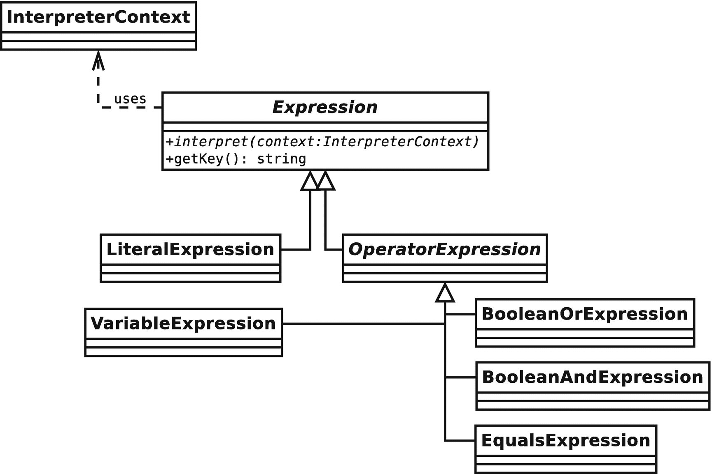
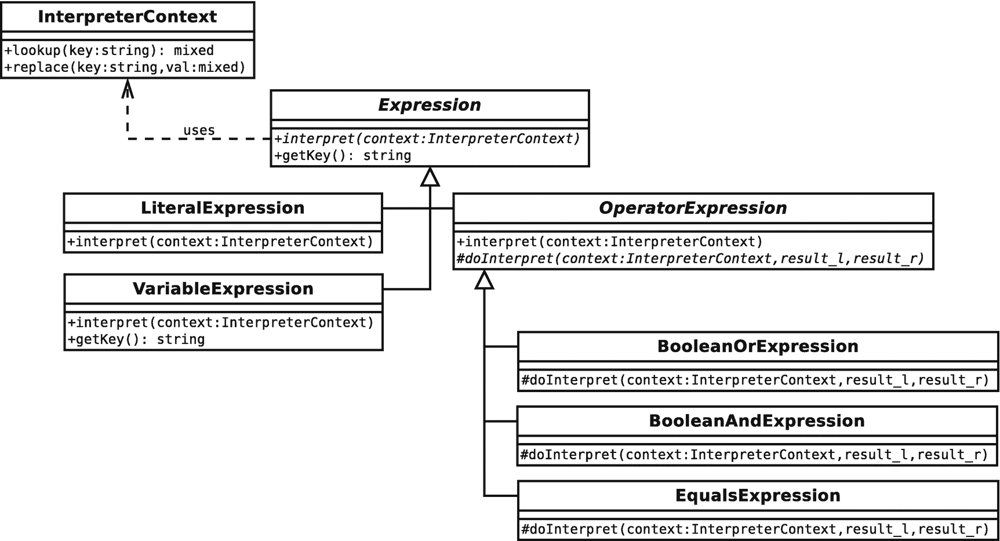
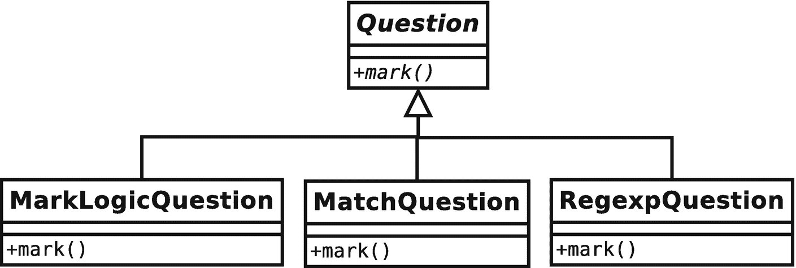
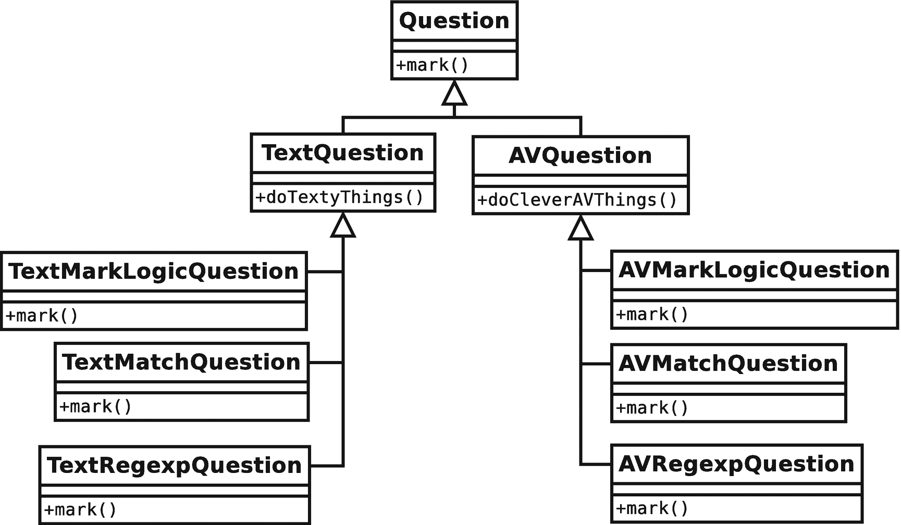
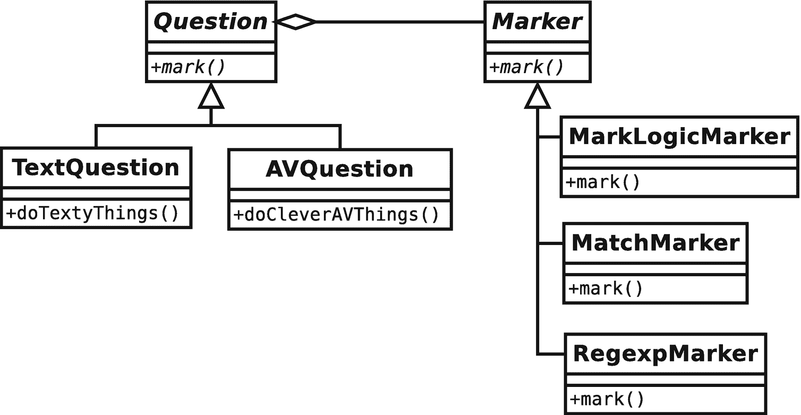
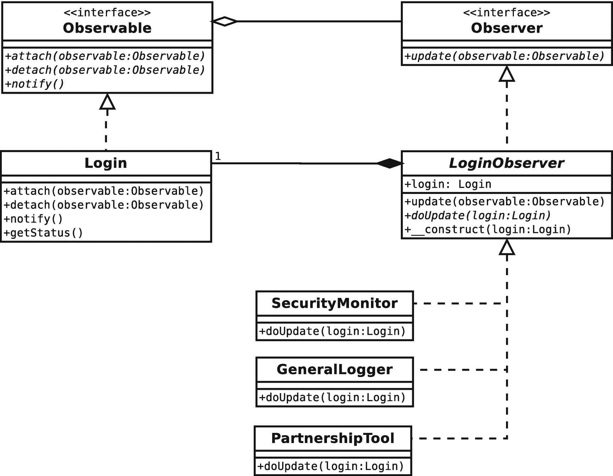
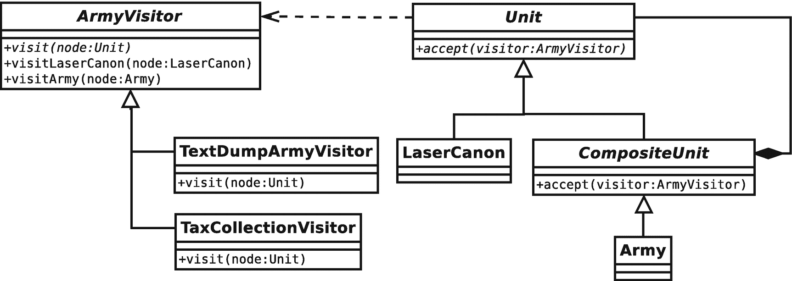
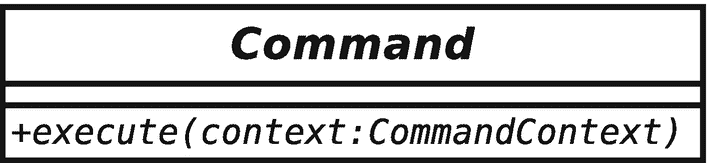
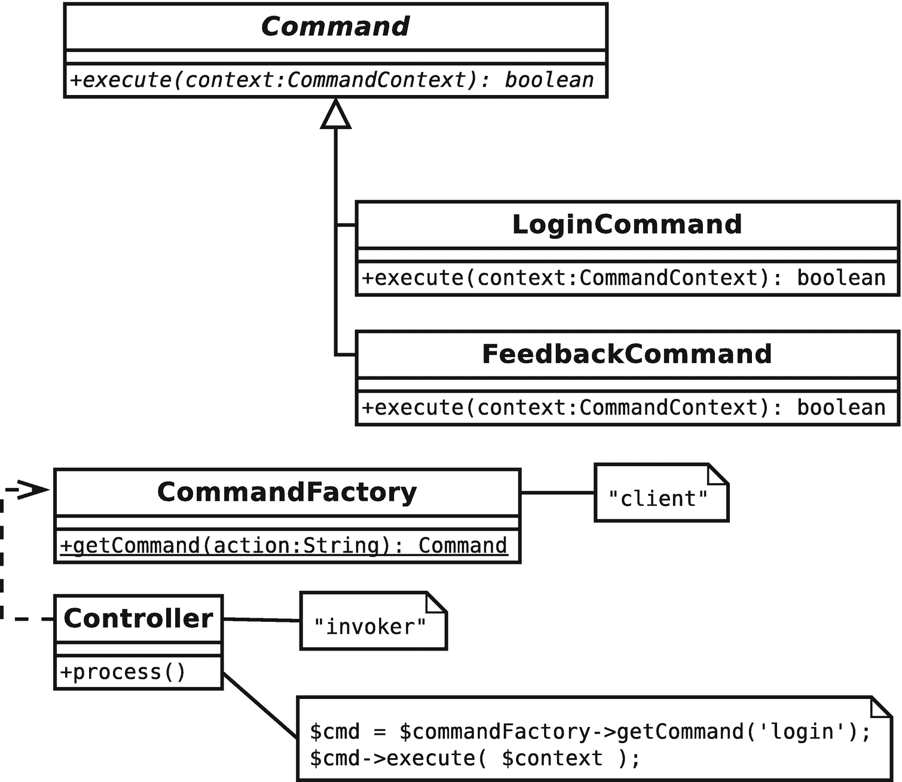

# 11.执行和表示任务

在这一章中，我们开始行动。我着眼于帮助你完成事情的模式，无论是解释一种迷你语言还是封装一种算法。

本章将带您了解几种模式:

*   *解释器模式*:构建一个小型语言解释器，可以用来创建可脚本化的应用

*   *策略模式*:识别系统中的算法，并将它们封装成自己的类型

*   *观察者模式*:创建钩子来提醒不同的对象关于系统事件

*   *访问者模式*:对对象树中的所有节点应用操作

*   *命令模式*:创建可以保存和传递的命令对象

*   *空对象模式*:使用非操作对象代替空值

## 解释器模式

语言是用其他语言写的(至少一开始是这样)。例如，PHP 本身就是用 c 语言编写的。同样，尽管听起来有些奇怪，但你可以使用 PHP 定义和运行你自己的语言。当然，你可能创造的任何语言都将是缓慢的，而且有些局限。尽管如此，小语种还是非常有用的，你会在本章中看到。

### 问题

当您在 PHP 中创建 web(或命令行)界面时，您给了用户访问功能的权限。界面设计的取舍是在功能和易用性之间。通常，你给用户的权力越多，你的界面就变得越混乱。当然，好的界面设计在这里会有很大帮助。但是如果 90%的用户都在使用你的 30%的功能，增加功能的成本可能会超过收益。您可能希望为大多数用户简化您的系统。但是那 10%使用你的系统的高级功能的超级用户呢？也许你可以用不同的方式来适应它们。通过为这些用户提供一种领域语言(通常称为 DSL——特定于领域的语言),您实际上可以扩展应用的功能。

当然，你马上就有了一门编程语言。它叫 PHP。以下是允许用户编写系统脚本的方法:

```php
// listing 11.01
$form_input = $_REQUEST['form_input'];
// contains: "print file_get_contents('/etc/passwd');"
eval($form_input);

```

这种使应用可脚本化的方法显然是疯狂的。以防原因不明显，它们归结为两个问题:安全性和复杂性。这个例子很好地解决了安全问题。通过允许用户通过您的脚本执行 PHP，您实际上是给了他们访问运行脚本的服务器的权限。复杂性问题也是一大缺点。无论你的代码有多清晰，普通用户都不太可能轻易扩展它，当然更不可能从浏览器窗口扩展。

然而，迷你语言可以解决这两个问题。您可以在语言中设计灵活性，减少用户造成损害的可能性，并保持事情的重点。

设想一个用于编写测验的应用。制作人设计问题，并制定规则，对参赛者提交的答案进行评分。要求测验必须在没有人工干预的情况下进行标记，即使用户可以将一些答案键入文本字段中。

这里有个问题:

```php
How many members in the Design Patterns gang?

```

你可以接受“四”或“4”作为正确答案。您可以创建一个 web 界面，允许生成器使用正则表达式来标记响应:

```php
^4|four$

```

然而，大多数生产者并不是因为他们对正则表达式的了解而被雇佣的。为了使每个人的生活更容易，您可以实现一个更用户友好的机制来标记响应:

```php
$input equals "4" or $input equals "four"

```

你提出了一种支持变量的语言，一个叫做`equals`的操作符，以及布尔逻辑(`or`和`and`)。程序员喜欢给东西命名，我们就叫它 MarkLogic 吧。它应该很容易扩展，因为你可以想象对更丰富功能的大量请求。让我们暂时把解析输入的问题放在一边，专注于一种在运行时将这些元素组合在一起以产生答案的机制。如您所料，这就是解释器模式的用武之地。

### 履行

语言包含表达式(即解析为值的事物)。正如你在表 [11-1](#Tab1) 中看到的，即使是像 MarkLogic 这样微小的语言也需要跟踪大量的元素。

表 11-1

标记逻辑语法的要素

<colgroup><col class="tcol1 align-left"> <col class="tcol2 align-left"> <col class="tcol3 align-left"> <col class="tcol4 align-left"></colgroup> 
| 

描述

 | 

EBNF 元标识符

 | 

类别名

 | 

例子

 |
| --- | --- | --- | --- |
| 可变的 | `variable` | `VariableExpression` | `$input` |
| 字符串文字 | `stringLiteral` | `LiteralExpression` | `"four"` |
| 布尔与 | `andExpr` | `BooleanAndExpression` | `$input  equals  '4' and $other equals '6'` |
| 布尔或 | `orExpr` | `BooleanOrExpression` | `$input  equals '4' or $other equals '6'` |
| 平等测试 | `eqExpr` | `BooleanEqualsExpression` | `$input   equals   '4'` |

表 [11-1](#Tab1) 列出了 EBNF 的名字。那么 EBNF 到底是什么呢？EBNF 是一种句法元语言，你可以用它来描述语言语法。EBNF 代表扩展的巴克斯-诺尔形式。它由一系列行(称为产品)组成，每一行都由一个名称和一个描述组成，描述的形式是对其他产品和终端的引用(即元素本身不是由对其他产品的引用组成的)。下面是用 EBNF 描述我的语法的一种方式:

```php
Expr     = operand { orExpr | andExpr }
Operand  = ( '(' expr ')' | ? string literal ? | variable ) { eqExpr } orExpr   = 'or' operand
andExpr  = 'and' operand
eqExpr   = 'equals' operand
variable = '$' , ? word ?

```

一些符号有特殊的含义(从正则表达式符号中应该很熟悉):`|`(更确切地说是一个定义分隔符)可以粗略地认为是*或*，例如。您可以使用括号对标识符进行分组。所以在这个例子中，一个表达式(`expr`)由一个`operand`后跟零个或多个`orExpr`或`andExpr`组成。一个`operand`可以是一个带括号的`expr`(即，一个用文字“(”和“)”字符包装的`expr`)、一个带引号的字符串(我已经省略了它的产生)，或者一个后面跟有零个或多个`eqExpr`实例的`variable`。一旦你掌握了从一部作品提到另一部作品的诀窍，《EBNF》就变得很容易读懂了。

在图 [11-1](#Fig1) 中，我将我的语法元素表示为类。



图 11-1

组成 MarkLogic 语言的解释器类

如您所见，`BooleanAndExpression`和它的兄弟从`OperatorExpression`继承而来。这是因为这些类都在其他`Expression`对象上执行它们的操作。`VariableExpression`和`LiteralExpression`直接和价值观打交道。

所有的`Expression`对象都实现了一个在抽象基类`Expression`中定义的`interpret()`方法。`interpret()`方法需要一个用作共享数据存储的`InterpreterContext`对象。每个`Expression`对象可以在`InterpreterContext`对象中存储数据。然后`InterpreterContext`将被传递给其他`Expression`对象。为了方便从`InterpreterContext`中检索数据，`Expression`基类实现了一个返回唯一句柄的`getKey()`方法。让我们通过`Expression`的实现来看看这在实践中是如何工作的:

```php
// listing 11.02
abstract class Expression
{

    private static int $keycount = 0;
    private string $key;
    abstract public function interpret(InterpreterContext $context);

    public function getKey(): string
    {
        if (! isset($this->key)) {
            self::$keycount++;
            $this->key = (string)self::$keycount;
        }
        return $this->key;
    }
}

```

```php
// listing 11.03
class LiteralExpression extends Expression
{
    private mixed $value;

    public function __construct(mixed $value)
    {
        $this->value = $value;
    }

    public function interpret(InterpreterContext $context): void
    {
        $context->replace($this, $this->value);
    }
}

```

```php
// listing 11.04
class InterpreterContext
{
    private array $expressionstore = [];

    public function replace(Expression $exp, mixed $value): void
    {
        $this->expressionstore[$exp->getKey()] = $value;
    }

    public function lookup(Expression $exp): mixed
    {
        return $this->expressionstore[$exp->getKey()];
    }

}

```

```php
// listing 11.05
$context = new InterpreterContext();
$literal = new LiteralExpression('four');
$literal->interpret($context);
print $context->lookup($literal) . "\n";

```

以下是输出结果:

```php
four

```

我将从第`InterpreterContext`课开始。如您所见，它实际上只是一个关联数组`$expressionstore`的前端，我用它来保存数据。`replace()`方法接受一个`Expression`对象作为键和一个任意类型的值，然后将这一对添加到`$expressionstore`。它还提供了一个用于检索数据的`lookup()`方法。

`Expression`类定义了抽象的`interpret()`方法和具体的`getKey()`方法，后者使用静态计数器值来生成、存储和返回字符串标识符。

这个方法被`InterpreterContext::lookup()`和`InterpreterContext::replace()`用来索引数据。

`LiteralExpression`类定义一个接受值参数的构造函数。`interpret()`方法需要一个`InterpreterContext`对象。我简单地使用`getKey()`调用`replace()`来定义检索的键和`$value`属性。在您研究其他`Expression`类时，这将成为一种熟悉的模式。`interpret()`方法总是将其结果写在`InterpreterContext`对象上。

我还包含了一些客户端代码，实例化了一个`InterpreterContext`对象和一个`LiteralExpression`对象(值为`"four"`)。我把`InterpreterContext`对象递给`LiteralExpression::interpret()`。`interpret()`方法将键/值对存储在`InterpreterContext`中，我通过调用`lookup()`从那里检索值。

这是剩下的终端类。`VariableExpression`稍微复杂一点:

```php
// listing 11.06
class VariableExpression extends Expression
{
     public function __construct(private string $name, private mixed $val = null)
    {
    }

    public function interpret(InterpreterContext $context): void
    {
        if (! is_null($this->val)) {
            $context->replace($this, $this->val);
            $this->val = null;
        }
    }

    public function setValue(mixed $value): void
    {
        $this->val = $value;
    }

    public function getKey(): string
    {
        return $this->name;
    }
}

```

```php
// listing 11.07
$context = new InterpreterContext();
$myvar = new VariableExpression('input', 'four');
$myvar->interpret($context);
print $context->lookup($myvar) . "\n";
// output: four

$newvar = new VariableExpression('input');
$newvar->interpret($context);
print $context->lookup($newvar) . "\n";
// output: four

$myvar->setValue("five");
$myvar->interpret($context);
print $context->lookup($myvar) . "\n";
// output: five
print $context->lookup($newvar) . "\n";
// output: five

```

`VariableExpression`类接受存储在属性变量中的名称和值参数。我提供了`setValue()`方法，这样客户端代码可以随时更改值。

`interpret()`方法检查`$val`属性是否具有非空值。如果`$val`属性有一个值，它就在`InterpreterContext`上设置它。然后我将`$val`属性设置为`null`。这是在`VariableExpression`的另一个同名实例更改了`InterpreterContext`对象中的值后再次调用`interpret()`的情况下。这是一个非常有限的变量，只接受字符串值。如果你打算扩展你的语言，你应该考虑让它与其他`Expression`对象一起工作，这样它就可以包含测试和操作的结果。不过现在，`VariableExpression`将完成我需要它做的工作。注意，我已经覆盖了`getKey()`方法，因此变量值链接到变量名，而不是任意的静态 ID。

语言中的运算符表达式都与另外两个`Expression`对象一起工作，以完成它们的工作。因此，让它们扩展一个公共超类是有意义的。下面是`OperatorExpression`类:

```php
// listing 11.08
abstract class OperatorExpression extends Expression
{
    public function __construct(protected Expression $l_op, protected Expression $r_op)
    {
    }

    public function interpret(InterpreterContext $context): void
    {
        $this->l_op->interpret($context);
        $this->r_op->interpret($context);
        $result_l = $context->lookup($this->l_op);
        $result_r = $context->lookup($this->r_op);
        $this->doInterpret($context, $result_l, $result_r);
    }

    abstract protected function doInterpret(
        InterpreterContext $context,
        $result_l,
        $result_r
    ): void;
}

```

`OperatorExpression`是一个抽象类。它实现了`interpret()`，但是它也定义了抽象的`dointerpret()`方法。

构造函数需要两个`Expression`对象，`$l_op`和`$r_op`，并将其存储在属性中。

`interpret()`方法首先在其两个操作数属性上调用`interpret()`(如果您已经阅读了前一章，您可能会注意到我在这里创建了复合模式的一个实例)。一旦操作数已经运行，`interpret()`仍然需要获取它产生的值。它通过为每个属性调用`InterpreterContext::lookup()`来做到这一点。然后它调用`dointerpret()`，让子类来决定如何处理这些操作的结果。

Note

`dointerpret()`是模板方法模式的一个实例。在这种模式中，父类既定义又调用抽象方法，让子类来提供实现。这可以简化具体类的开发，因为共享功能是由超类处理的，让孩子专注于干净、狭窄的目标。

下面是`BooleanEqualsExpression`类，它测试两个`Expression`对象是否相等:

```php
// listing 11.09
class BooleanEqualsExpression extends OperatorExpression
{
    protected function doInterpret(
        InterpreterContext $context,
        mixed $result_l,
        mixed $result_r
    ): void {
        $context->replace($this, $result_l == $result_r);
    }
}

```

`BooleanEqualsExpression`只实现了`dointerpret()`方法，该方法测试由`interpret()`方法传递的操作数结果的相等性，并将结果放在`InterpreterContext`对象中。

总结一下`Expression`类，下面是`BooleanOrExpression`和`BooleanAndExpression`:

```php
// listing 11.10
class BooleanOrExpression extends OperatorExpression
{
    protected function doInterpret(
        InterpreterContext $context,
        mixed $result_l,
        mixed $result_r
    ): void {
        $context->replace($this, $result_l || $result_r);
    }
}

```

```php
// listing 11.11
class BooleanAndExpression extends OperatorExpression
{
    protected function doInterpret(
        InterpreterContext $context,
        mixed $result_l,
        mixed $result_r
    ): void {
        $context->replace($this, $result_l && $result_r);
    }
}

```

`BooleanOrExpression`类应用逻辑`or`运算并通过`InterpreterContext::replace()`方法存储运算结果，而不是测试相等性。`BooleanAndExpression`当然应用了逻辑`and`运算。

我现在有足够的代码来执行我前面引用的迷你语言片段。又来了:

```php
$input equals "4" or $input equals "four"

```

下面是我如何用我的`Expression`类建立这个语句:

```php
// listing 11.12
$context = new InterpreterContext();
$input = new VariableExpression('input');
$statement = new BooleanOrExpression(
    new BooleanEqualsExpression($input, new LiteralExpression('four')),
    new BooleanEqualsExpression($input, new LiteralExpression('4'))
);

```

我实例化了一个名为`"input"`的变量，但是没有为它提供值。然后我创建一个`BooleanOrExpression`对象来比较两个`BooleanEqualsExpression`对象的结果。这些对象中的第一个将存储在`$input`中的`VariableExpression`对象与包含字符串`"four"`的`LiteralExpression`进行比较；第二个将`$input`与包含字符串`"4"`的`LiteralExpression`对象进行比较。

现在，准备好语句后，我准备为输入变量提供一个值并运行代码:

```php
// listing 11.13
foreach ([ "four", "4", "52" ] as $val) {
    $input->setValue($val);
    print "$val:\n";
    $statement->interpret($context);
    if ($context->lookup($statement)) {
        print "top marks\n\n";
    } else {
        print "dunce hat on\n\n";
    }
}

```

事实上，我用三个不同的值运行了代码三次。第一次，我将临时变量`$val`设置为`"four"`，使用其`setValue()`方法将它赋给输入`VariableExpression`对象。然后我调用最顶层的`Expression`对象上的`interpret()`(`BooleanOrExpression`对象包含对语句中所有其他表达式的引用)。下面是这个调用的内部过程，一步一步来:

*   `$statement`在其`$l_op`属性上调用`interpret()`(第一个`BooleanEqualsExpression`对象)。

*   第一个`BooleanEqualsExpression`对象调用*上的`interpret()`及其* `$l_op`属性(对输入`VariableExpression`对象的引用，该对象当前设置为`"four"`)。

*   输入`VariableExpression`对象通过调用`InterpreterContext::replace()`将其当前值写入提供的`InterpreterContext`对象。

*   第一个`BooleanEqualsExpression`对象在其`$r_op`属性上调用`interpret()`(一个值为`"four"`的`LiteralExpression`对象)。

*   `LiteralExpression`对象向`InterpreterContext`注册它的键和值。

*   第一个`BooleanEqualsExpression`对象从`InterpreterContext`对象中检索`$l_op` ( `"four"`)和`$r_op` ( `"four"`)的值。

*   第一个`BooleanEqualsExpression`对象比较这两个值是否相等，然后向`InterpreterContext`对象注册结果(`true`)及其键。

*   回到树的顶端，`$statement`对象(`BooleanOrExpression`)在其`$r_op`属性上调用`interpret()`。这以与`$l_op`属性相同的方式解析为一个值(在本例中为`false`)。

*   `$statement`对象从`InterpreterContext`对象中检索每个操作数的值，并使用`||`进行比较。它在比较`true`和`false`，所以结果是`true`。这个最终结果存储在`InterpreterContext`对象中。

所有这些只是针对循环的第一次迭代。以下是最终输出:

```php
four:
top marks 4:
top marks 52:
dunce hat on

```

您可能需要通读几遍这一部分，然后才能点击程序。在这里，对象与类树的老问题可能会让你困惑。`Expression`类被安排在一个继承层次中，就像`Expression`对象在运行时被组成一棵树。当您通读代码时，请记住这一区别。

图 [11-2](#Fig2) 显示了该示例的完整类图。



图 11-2

部署的解释器模式

### 翻译问题

一旦为解释器模式实现设置了核心类，扩展就变得容易了。您所付出的代价在于您最终可能创建的类的数量。由于这个原因，解释器最好应用于相对较小的语言。如果你需要一种通用编程语言，你最好找一个第三方工具来使用。

因为解释器类经常执行非常相似的任务，所以关注您创建的类以消除重复是值得的。

许多第一次接触解释器模式的人，在最初的兴奋之后，失望地发现它没有解决解析问题。这意味着你还不能为你的用户提供一种友好的语言。附录 B 包含一些粗略的代码来说明一种解析小型语言的策略。

## 战略模式

班级经常试图做太多。这是可以理解的:你创建了一个执行一些相关动作的类；而且，当您编码时，这些动作中的一些需要根据环境而变化。同时，你的类需要拆分成子类。在你意识到之前，你的设计已经被竞争的力量撕裂了。

### 问题

因为我最近构建了一种标记语言，所以我坚持使用测验示例。测验需要问题，所以你构建了一个`Question`类，给它一个`mark()`方法。一切都很好，直到您需要支持不同的标记机制。

假设要求你支持简单的 MarkLogic 语言，通过直接匹配和正则表达式进行标记。你的第一个想法可能是对这些差异进行子类化，如图 [11-3](#Fig3) 所示。



图 11-3

根据标记策略定义子类

这将很好地为你服务，只要分数仍然是这门课唯一不同的方面。想象一下，你被要求支持不同类型的问题:基于文本的问题和支持富媒体的问题。这就给你带来了一个问题，如何将这些力量整合到一个继承树中，如图 [11-4](#Fig4) 所示。



图 11-4

根据两种力量定义子类

不仅层次结构中的类数量激增，而且还必然会引入重复。您的标记逻辑会在继承层次结构的每个分支中复制。

每当您发现自己在一个继承树中跨兄弟重复一个算法时(无论是通过子类化还是重复的条件语句)，考虑将这些行为抽象成它们自己的类型。

### 履行

和所有最好的模式一样，策略简单而强大。当类必须支持一个接口的多种实现(例如，多种标记机制)时，最好的方法通常是提取这些实现并将它们放在自己的类型中，而不是扩展原始类来处理它们。

所以，在这个例子中，你的标记方法可能被放在一个`Marker`类型中。图 [11-5](#Fig5) 显示了新的结构。



图 11-5

将算法提取到它们自己的类型中

还记得“四人帮”的“重作文轻继承”的原则吗？这是一个极好的例子。通过定义和封装标记算法，可以减少子类化并增加灵活性。您可以随时添加新的标记策略，而完全不需要更改`Question`类。所有的`Question`类都知道它们拥有一个`Marker`的实例，并且它的接口保证它支持一个`mark()`方法。实施的细节完全是别人的问题。

下面是呈现为代码的`Question`类:

```php
// listing 11.14
abstract class Question
{
    public function __construct(protected string $prompt, protected Marker $marker)
    {
    }

    public function mark(string $response): bool
    {
        return $this->marker->mark($response);
    }
}

```

```php
// listing 11.15
class TextQuestion extends Question
{
    // do text question specific things
}

```

```php
// listing 11.16
class AVQuestion extends Question
{
    // do audiovisual question specific things
}

```

如你所见，我把`TextQuestion`和`AVQuestion`之间的差异的确切本质留给了想象。`Question`基类提供所有真正的功能，存储一个提示属性和一个`Marker`对象。当终端用户响应调用`Question::mark()`时，该方法简单地将问题解决委托给它的`Marker`对象。

现在是时候定义一些简单的`Marker`对象了:

```php
// listing 11.17
abstract class Marker
{
    public function __construct(protected string $test)
    {
        abstract public function mark(string $response): bool;
}

```

```php
// listing 11.18
class MarkLogicMarker extends Marker
{

    private MarkParse $engine;

    public function __construct(string $test)
    {
        parent:: __construct($test);
        $this->engine = new MarkParse($test);
    }

    public function mark(string $response): bool
    {
        return $this->engine->evaluate($response);
    }
}

```

```php
// listing 11.19
class MatchMarker extends Marker
{
    public function mark(string $response): bool
    {
        return ($this->test == $response);
    }
}

```

```php
// listing 11.20
class RegexpMarker extends Marker
{
    public function mark(string $response): bool
    {
        return (preg_match("$this->test", $response) === 1);
    }
}

```

对于`Marker`类本身，应该没有什么特别令人惊讶的。注意，`MarkParse`对象被设计为与附录 b 中开发的简单解析器一起工作。这里的关键在于我定义的结构，而不是策略本身的细节。我可以把`RegexpMarker`换成`MatchMarker`，对`Question`职业没有影响。

当然，您仍然必须决定使用什么方法在具体的`Marker`对象之间进行选择。我见过两种现实世界中解决这个问题的方法。首先，生产者使用单选按钮来选择首选的标记策略。在第二种情况下，使用标记条件本身的结构；也就是说，match 语句是空白的:

```php
five

```

MarkLogic 语句前面有一个冒号:

```php
:$input equals 'five'

```

一个正则表达式使用了正斜杠:

```php
/f.ve/

```

下面是一些运行这些类的代码:

```php
// listing 11.21
$markers = [
    new RegexpMarker("/f.ve/"),
    new MatchMarker("five"),
    new MarkLogicMarker('$input equals "five"')
];

foreach ($markers as $marker) {
    print get_class($marker) . "\n";
    $question = new TextQuestion("how many beans make five", $marker);

    foreach ([ "five", "four" ] as $response) {
        print " response: $response: ";
        if ($question->mark($response)) {
            print "well done\n";
        } else {
            print "never mind\n";
        }
    }
}

```

我构建了三个策略对象，依次使用每个对象来帮助构建一个`TextQuestion`对象。然后对两个样本响应尝试使用`TextQuestion`对象。以下是输出(包括名称空间):

```php
popp\ch11\batch02\RegexpMarker
    response: five: well done
    response: four: never mind

popp\ch11\batch02\MatchMarker
    response: five: well done
    response: four: never mind

popp\ch11\batch02\MarkLogicMarker
    response: five: well done
    response: five: never mind

```

在这个例子中，我通过`mark()`方法将特定的数据(`$response`变量)从客户端传递给策略对象。有时，您可能会遇到这样的情况:当调用策略对象的操作时，您并不总是预先知道策略对象将需要多少信息。您可以通过将策略传递给客户端本身的一个实例来委托获取哪些数据的决策。然后，该策略可以查询客户端，以构建它需要的数据。

## 观察者模式

正交性是我之前描述过的一个优点。作为程序员，我们的目标之一应该是构建可以在对其他组件影响最小的情况下进行更改或移动的组件。如果我们对一个组件所做的每一个更改都必然会在代码库中的其他地方引起连锁反应，那么开发任务很快就会变成错误创建和消除的螺旋。

当然，正交往往只是一个梦想。系统中的元素必须嵌入对其他元素的引用。但是，您可以部署各种策略来最小化这种情况。您已经看到了各种各样的多态例子，在这些例子中，客户端理解组件的接口，但是实际的组件可能在运行时发生变化。

在某些情况下，您可能希望在组件之间插入比这更大的楔子。考虑一个负责处理用户访问系统的类:

```php
// listing 11.22
classLogin
{
    public const LOGIN_USER_UNKNOWN = 1;
    public const LOGIN_WRONG_PASS = 2;
    public const LOGIN_ACCESS = 3;

    private array $status = [];

    public function handleLogin(string $user, string $pass, string $ip): bool
    {
        $isvalid = false;
        switch (rand(1, 3)) {
            case 1:
                $this->setStatus(self::LOGIN_ACCESS, $user, $ip);
                $isvalid = true;
                break;
            case 2:
                $this->setStatus(self::LOGIN_WRONG_PASS, $user, $ip);
                $isvalid = false;
                break;
            case 3:
                $this->setStatus(self::LOGIN_USER_UNKNOWN, $user, $ip);
                $isvalid = false;
                break;
        }

        print "returning " . (($isvalid) ? "true" : "false") . "\n";

        return $isvalid;
    }

    private function setStatus(int $status, string $user, string $ip): void
    {
        $this->status = [$status, $user, $ip];
    }

    public function getStatus(): array
    {
        return $this->status;
    }
}

```

当然，在现实世界的例子中，`handleLogin()`方法将根据存储机制来验证用户。实际上，这个类使用`rand()`函数来伪造登录过程。给`handleLogin()`打电话有三种可能的结果。状态标志可以设置为`LOGIN_ACCESS`、`LOGIN_WRONG_PASS`或`LOGIN_USER_UNKNOWN`。

因为`Login`类是保护你的业务团队财富的门户，它可能会在开发期间和以后的几个月里激发很多兴趣。营销人员可能会打电话给你，要求你记录 IP 地址。您可以向系统的`Logger`类添加一个调用:

```php
// listing 11.23
public function handleLogin(string $user, string $pass, string $ip): bool
{
    switch (rand(1, 3)) {
        case 1:
            $this->setStatus(self::LOGIN_ACCESS, $user, $ip);
            $isvalid = true;
            break;
        case 2:
            $this->setStatus(self::LOGIN_WRONG_PASS, $user, $ip);
            $isvalid = false;
            break;
        case 3:
            $this->setStatus(self::LOGIN_USER_UNKNOWN, $user, $ip);
            $isvalid = false;
            break;
    }

    Logger::logIP($user, $ip, $this->getStatus());

    return $isvalid;
}

```

由于担心安全性，系统管理员可能会要求通知失败的登录。同样，您可以返回到登录方法并添加一个新呼叫:

```php
// listing 11.24
if (! $isvalid) {
    Notifier::mailWarning(
        $user,
        $ip,
        $this->getStatus()
    );
}

```

业务开发团队可能会宣布与特定 ISP 的合作，要求在特定用户登录时设置 cookie。等等，等等。

这些都是很容易满足的要求，但是解决它们需要为您的设计付出代价。类很快就非常紧密地嵌入到这个特定的系统中。如果不一行一行地检查代码，删除旧系统特有的所有内容，就不能把它取出来放到另一个产品中。当然，这并不太难，但是这样你就走上了剪切粘贴编码的道路。现在你的系统中有了两个相似但不同的`Login`类，你会发现对其中一个的改进需要对另一个进行同样的修改——直到它们不可避免地、不体面地彼此脱离。

那么你能做些什么来拯救`Login`类呢？观察者模式非常适合这里。

### 履行

观察者模式的核心是将客户端元素(观察者)从中心类(主体)中分离出来。当受试者知道的事件发生时，观察者需要被告知。同时，您不希望 subject 与其 observer 类有硬编码的关系。

为了实现这一点，您可以允许观察者向主题注册他们自己。您给了`Login`类三个新方法，`attach()`、`detach()`和`notify()`，并使用一个名为`Observable`的接口来强制执行:

```php
// listing 11.25
interface Observable
{
    public function attach(Observer $observer): void;
    public function detach(Observer $observer): void;
    public function notify(): void;
}

```

```php
// listing 11.26
class Login implements Observable
{
    private array $observers = [];

    public const LOGIN_USER_UNKNOWN = 1;
    public const LOGIN_WRONG_PASS   = 2;
    public const LOGIN_ACCESS       = 3;

    public function attach(Observer $observer): void
    {
        $this->observers[] = $observer;
    }

    public function detach(Observer $observer): void
    {
        $this->observers = array_filter(
            $this->observers,
            function ($a) use ($observer) {
                return (! ($a === $observer ));
            }
        );
    }

    public function notify(): void
    {
        foreach ($this->observers as $obs) {
            $obs->update($this);
        }
    }

    // ...
}

```

所以`Login`类管理一个观察者对象列表。这些可以由第三方使用`attach()`方法添加，并通过`detach()`删除。调用`notify()`方法是为了告诉观察者发生了一些有趣的事情。该方法简单地遍历观察器列表，对每个观察器调用`update()`。

`Login`类本身从它的`handleLogin()`方法中调用`notify()`:

```php
// listing 11.27
public function handleLogin(string $user, string $pass, string $ip): bool
{
    switch (rand(1, 3)) {
        case 1:
            $this->setStatus(self::LOGIN_ACCESS, $user, $ip);
            $isvalid = true;
            break;
        case 2:
            $this->setStatus(self::LOGIN_WRONG_PASS, $user, $ip);
            $isvalid = false;
            break;
        case 3:
            $this->setStatus(self::LOGIN_USER_UNKNOWN, $user, $ip);
            $isvalid = false;
            break;
    }

    $this->notify();

    return $isvalid;
}

```

下面是`Observer`类的接口:

```php
// listing 11.28
interface Observer
{
    public function update(Observable $observable): void;
}

```

任何使用这个接口的对象都可以通过`attach()`方法添加到`Login`类中。这里有一个具体的例子:

```php
// listing 11.29
class LoginAnalytics implements Observer
{
    public function update(Observable $observable): void
    {
        // not type safe!
        $status = $observable->getStatus();
        print __CLASS __ . ": doing something with status info\n";
    }
}

```

注意 observer 对象如何使用`Observable`的实例来获得关于事件的更多信息。由 subject 类提供观察者可以查询以了解状态的方法。在这种情况下，我定义了一个名为`getStatus()`的方法，观察者可以调用它来获得游戏当前状态的快照。

不过，这一增加也凸显了一个问题。通过调用`Login::getStatus()`,`LoginAnalytics`类承担了比它安全所能承担的更多的知识。它在一个`Observable`对象上进行这个调用，但是不能保证这个对象也会是一个`Login`对象。我有几个选择。我可以扩展`Observable`接口，使其包含一个`getStatus()`声明，并可能将其重命名为类似于`ObservableLogin`的名称，以表明它是特定于`Login`类型的。

或者，我可以保持`Observable`接口的通用性，让`Observer`类负责确保它们的主题是正确的类型。他们甚至可以把自己和主题联系起来。由于将会有不止一种类型的`Observer`，并且由于我计划执行一些对它们都通用的内务处理，这里有一个抽象超类来处理这些繁琐的工作:

```php
// listing 11.30
abstract class LoginObserver implements Observer
{
    private Login $login;

    public function __construct(Login $login)
    {
        $this->login = $login;
        $login->attach($this);
    }

    public function update(Observable $observable): void
    {
        if ($observable === $this->login) {
            $this->doUpdate($observable);
        }
    }

    abstract public function doUpdate(Login $login): void;
}

```

`LoginObserver`类在其构造函数中需要一个`Login`对象。它存储一个引用并调用`Login::attach()`。当调用`update()`时，它检查提供的`Observable`对象是否是正确的引用。然后它调用一个模板方法:`doUpdate()`。我现在可以创建一套`LoginObserver`对象，所有这些对象都是安全的，它们使用的是`Login`对象，而不是任何旧的`Observable`:

```php
// listing 11.31
class SecurityMonitor extends LoginObserver
{
    public function doUpdate(Login $login): void
    {
        $status = $login->getStatus();
        if ($status[0] == Login::LOGIN_WRONG_PASS) {
            // send mail to sysadmin
            print __CLASS__ . ": sending mail to sysadmin\n";
        }
    }
}

```

```php
// listing 11.32
class GeneralLogger extends LoginObserver
{
    public function doUpdate(Login $login): void
    {
        $status = $login->getStatus();
        // add login data to log
        print __CLASS__ . ": add login data to log\n";
    }
}

```

```php
// listing 11.33
class PartnershipTool extends LoginObserver
{
    public function doUpdate(Login $login): void
    {
        $status = $login->getStatus();
        // check $ip address
        // set cookie if it matches a list
        print __CLASS__ . ": set cookie if it matches a list\n";
    }
}

```

创建和附加`LoginObserver`类现在可以在实例化时一次性完成:

```php
// listing 11.34
$login = new Login();
new SecurityMonitor($login);
new GeneralLogger($login);
new PartnershipTool($login);

```

所以现在我在主题类和观察者之间创建了一个灵活的关联。你可以在图 [11-6](#Fig6) 中看到例子的类图。



图 11-6

观察者模式

PHP 通过捆绑的 SPL(标准 PHP 库)扩展提供了对观察者模式的内置支持。SPL 是一套帮助解决常见的、主要面向对象的问题的工具。这把 OO 瑞士军刀的观察者方面由三个元素组成:`SplObserver`、`SplSubject`和`SplObjectStorage`。`SplObserver`和`SplSubject`是接口，与本节示例中的`Observer`和`Observable`接口完全平行。`SplObjectStorage`是一个实用程序类，旨在提供改进的对象存储和移除。下面是 Observer 实现的编辑版本:

```php
// listing 11.35
class Login implements \SplSubject
{
    private \SplObjectStorage $storage;

    // ...
    public function __construct()
    {
        $this->storage = new \SplObjectStorage();
    }

    public function attach(\SplObserver $observer): void
    {
        $this->storage->attach($observer);
    }

    public function detach(\SplObserver $observer): void
    {
        $this->storage->detach($observer);
    }

    public function notify(): void
    {
        foreach ($this->storage as $obs) {
            $obs->update($this);
        }
    }

    // ...
}

```

```php
// listing 11.36
abstract class LoginObserver implements \SplObserver
{
    public function __construct(private Login $login)
    {
        $login->attach($this);
    }

    public function update(\SplSubject $subject): void
    {
        if ($subject === $this->login) {
            $this->doUpdate($subject);
        }
    }

    abstract public function doUpdate(Login $login): void;
}

```

就`SplObserver`(即`Observer`)和`SplSubject`(即`Observable`)而言，没有真正的区别——当然，除了我不再需要声明接口，并且我必须根据新名称改变我的类型提示。`SplObjectStorage`为你提供了一个真正有用的服务，不过。您可能已经注意到，在我最初的例子中，我的`Login::detach()`实现将`array_filter`(以及一个匿名函数)应用于`$observers`数组，以便找到并移除参数对象。`SplObjectStorage`类在幕后为您完成这项工作。它实现了`attach()`和`detach()`方法，可以传递给`foreach`并像数组一样迭代。

Note

你可以在 [`www.php.net/spl`](http://www.php.net/spl) 的 PHP 文档中读到更多关于 SPL 的内容。特别是，你会发现那里有很多迭代器工具。我将在第 13 章中介绍 PHP 内置的迭代器接口。

另一种解决`Observable`类和它的`Observer`类之间通信问题的方法是通过`update()`方法传递特定的状态信息，而不是 subject 类的实例。对于快速和肮脏的解决方案，这通常是我最初采取的方法。所以在这个例子中，`update()`将期望一个状态标志、用户名和 IP 地址(为了便于携带，可能在一个数组中)，而不是一个`Login`的实例。这使您不必在`Login`类中编写状态方法。另一方面，在 subject 类存储大量状态的情况下，将它的一个实例传递给`update()`允许观察者有更大的灵活性。

您也可以完全锁定类型，通过让`Login`类拒绝与除了特定类型的 observer 类(也许是`LoginObserver`)之外的任何东西一起工作。如果您想这样做，那么您可以考虑对传递给`attach()`方法的对象进行某种运行时检查；否则，您可能需要重新考虑`Observable`接口。

我再一次在运行时使用了组合来构建一个灵活且可扩展的模型。`Login`类可以从它的上下文中提取出来，放到一个完全不同的项目中，没有任何限制。在那里，它可能与一组不同的观察者一起工作。

## 访问者模式

如您所见，许多模式旨在运行时构建结构，遵循组合比继承更灵活的原则。无处不在的复合模式就是一个很好的例子。当您处理对象集合时，可能需要对结构应用各种操作，这些操作涉及处理每个单独的组件。这种操作可以内置到组件本身中。毕竟，组件通常最适合相互调用。

这种方法并非没有问题。您并不总是知道可能需要在结构上执行的所有操作。如果您在逐个案例的基础上向您的类添加对新操作的支持，您可能会使您的接口膨胀，并承担不真正适合的责任。正如您可能猜到的，访问者模式解决了这些问题。

### 问题

回想一下上一章的复合示例。对于一个游戏，我创造了一个组件大军，这样整体和它的部分可以互换。您看到了操作可以构建到组件中。通常，叶对象执行操作，复合对象调用其子对象来执行操作:

```php
// listing 11.37
class Army extends CompositeUnit
{
    public function bombardStrength(): int
    {
        $strength = 0;

        foreach ($this->units() as $unit) {
            $strength += $unit->bombardStrength();
        }

        return $strength;
    }
}

```

```php
// listing 11.38
class LaserCanonUnit extends Unit
{
    public function bombardStrength(): int
    {
        return 44;
    }
}

```

如果这个操作是复合类职责的一部分，就没有问题。然而，有更多的外围任务在界面上可能不那么愉快。

这里有一个转储关于叶节点的文本信息的操作。它可以被添加到抽象的`Unit`类:

```php
// listing 11.39
abstract class Unit
{
    // ...

    public function textDump($num = 0): string
    {
        $txtout = "";
        $pad = 4 * $num;
        $txtout .= sprintf("%{$pad}s", "");
        $txtout .= get_class($this) . ": ";
        $txtout .= "bombard: " . $this->bombardStrength() . "\n";

        return $txtout;
    }
    // ...

}

```

然后可以在`CompositeUnit`类中覆盖这个方法:

```php
// listing 11.40
abstract class CompositeUnit extends Unit
{
    // ...
    public function textDump($num = 0): string
    {
        $txtout = parent::textDump($num);

        foreach ($this->units as $unit) {
            $txtout .= $unit->textDump($num + 1);
        }

        return $txtout;
    }
}

```

我可以继续创建方法来计算树中单位的数量，将组件保存到数据库中，以及计算军队消耗的食物单位。

为什么我要在组合的接口中包含这些方法？只有一个真正令人信服的答案。我在这里包含了这些不同的操作，因为这是操作可以轻松访问复合结构中相关节点的地方。

尽管遍历的便利性确实是复合模式的一部分，但这并不意味着需要遍历树的每个操作都应该在复合模式的接口中占有一席之地。

所以这些是起作用的力量:我想充分利用我的对象结构提供的简单遍历，但是我想在不膨胀接口的情况下做到这一点。

### 履行

我将从接口开始。在抽象的`Unit`类中，我定义了一个`accept()`方法:

```php
// listing 11.41
abstract class Unit
{
    // ...
    public function accept(ArmyVisitor $visitor): void
    {
        $refthis = new \ReflectionClass(get_class($this));
        $method = "visit" . $refthis->getShortName();
        $visitor->$method($this);
    }

    protected function setDepth($depth): void
    {
        $this->depth = $depth;
    }

    public function getDepth(): int
    {
        return $this->depth;
    }
}

```

如您所见，`accept()`方法期望一个`ArmyVisitor`对象被传递给它。PHP 允许您动态地在您希望调用的`ArmyVisitor`上定义方法，所以我基于当前类的名称构造了一个方法名，并在提供的`ArmyVisitor`对象上调用该方法。如果当前的类是`Army`，那么我调用`ArmyVisitor::visitArmy()`。如果当前类是`TroopCarrier`，那么我调用`ArmyVisitor::visitTroopCarrier()`等等。这让我不用在类层次结构中的每个叶节点上实现`accept()`。我在专区的时候，还加了两个方便的方法:`getDepth()`和`setDepth()`。这些可以用来存储和检索树中一个单元的深度。`setDepth()`由单元的父单元调用，当它从`CompositeUnit::addUnit()`添加到树中时:

```php
// listing 11.42
abstract class CompositeUnit extends Unit
{
    // ...

    public function addUnit(Unit $unit): void
    {
        foreach ($this->units as $thisunit) {
            if ($unit === $thisunit) {
                return;
            }
        }

        $unit->setDepth($this->depth + 1);
        $this->units[] = $unit;
    }

    public function accept(ArmyVisitor $visitor): void
    {
        parent::accept($visitor);

        foreach ($this->units as $thisunit) {
            $thisunit->accept($visitor);
        }
    }
}

```

我在这个片段中包含了一个`accept()`方法。这将调用`Unit::accept()`来调用所提供的`ArmyVisitor`对象上的相关 visit()方法。然后它遍历调用`accept()`的所有子对象。事实上，因为`accept()`覆盖了它的父操作，所以`accept()`方法允许我做两件事:

*   为当前组件调用正确的访问者方法

*   通过`accept()`方法将 visitor 对象传递给所有当前元素的子元素(假设当前组件是复合的)

我还没有为`ArmyVisitor`定义接口。`accept()`方法应该会给你一些提示。visitor 类将为类层次结构中的每个具体类定义`accept()`方法。这允许我为不同的对象提供不同的功能。在这个类的我的版本中，我还定义了一个默认的`visit()`方法，如果实现类选择不为特定的`Unit`类提供特定的处理，这个方法就会被自动调用:

```php
// listing 11.43
abstract class ArmyVisitor
{
    abstract public function visit(Unit $node);

    public function visitArcher(Archer $node): void
    {
        $this->visit($node);
    }
    public function visitCavalry(Cavalry $node): void
    {
        $this->visit($node);
    }

    public function visitLaserCanonUnit(LaserCanonUnit $node): void
    {
        $this->visit($node);
    }

    public function visitTroopCarrierUnit(TroopCarrierUnit $node): void
    {
        $this->visit($node);
    }

    public function visitArmy(Army $node): void
    {
        $this->visit($node);
    }
}

```

所以现在只需要提供`ArmyVisitor`的实现，我已经准备好了。下面是作为一个`ArmyVisitor`对象重新实现的简单文本转储代码:

```php
// listing 11.44
class TextDumpArmyVisitor extends ArmyVisitor
{
    private string $text = "";

    public function visit(Unit $node): void
    {
        $txt = "";
        $pad = 4 * $node->getDepth();
        $txt .= sprintf("%{$pad}s", "");
        $txt .= get_class($node) . ": ";
        $txt .= "bombard: " . $node->bombardStrength() . "\n";
        $this->text .= $txt;
    }

    public function getText(): string
    {
        return $this->text;
    }
}

```

让我们看一些客户端代码，然后浏览整个过程:

```php
// listing 11.45
$main_army = new Army();
$main_army->addUnit(new Archer());
$main_army->addUnit(new LaserCanonUnit());
$main_army->addUnit(new Cavalry());

$textdump = new TextDumpArmyVisitor();
$main_army->accept($textdump);
print $textdump->getText();

```

该代码产生以下输出:

```php
popp\ch11\batch08\Army: bombard: 50
    popp\ch11\batch08\Archer: bombard: 4
    popp\ch11\batch08\LaserCanonUnit: bombard: 44
    popp\ch11\batch08\Cavalry: bombard: 2

```

我创建了一个`Army`对象。因为`Army`是复合的，所以它有一个`addUnit()`方法，我用它来添加更多的`Unit`对象。然后我创建了`TextDumpArmyVisitor`对象，并将其传递给`Army::accept()`。`accept()`方法构造一个方法调用并调用`TextDumpArmyVisitor::visitArmy()`。在这种情况下，我没有为`Army`对象提供特殊处理，所以调用被传递给通用的`visit()`方法。已经向`visit()`传递了对`Army`对象的引用。它调用它的方法(包括新添加的`getDepth()`，它告诉任何需要知道该单元在组合树中的位置的人)来生成汇总数据。对`visitArmy()`的调用已经完成，所以`Army::accept()`操作现在依次调用其子操作`accept()`，传递访问者。这样，`ArmyVisitor`类访问树中的每个对象。

只添加了几个方法，我就创建了一种机制，通过这种机制，新功能可以插入到我的复合类中，而不会损害它们的接口，也不会有大量重复的遍历代码。

在游戏的某些方格中，军队需要缴税。税收官拜访军队，并对每一个找到的单位征收费用。不同的单位按不同的税率征税。在这里，我可以利用 visitor 类中的专用方法:

```php
// listing 11.46
class TaxCollectionVisitor extends ArmyVisitor
{
    private int $due = 0;
    private string $report = "";

    public function visit(Unit $node): void
    {
        $this->levy($node, 1);
    }

    public function visitArcher(Archer $node): void
    {
        $this->levy($node, 2);
    }

    public function visitCavalry(Cavalry $node): void
    {
        $this->levy($node, 3);
    }

    public function visitTroopCarrierUnit(TroopCarrierUnit $node): void
    {
        $this->levy($node, 5);
    }

    private function levy(Unit $unit, int $amount): void
    {
        $this->report .= "Tax levied for " . get_class($unit);
        $this->report .= ": $amount\n";
        $this->due += $amount;
    }

    public function getReport(): string
    {
        return $this->report;
    }

    public function getTax(): int
    {
        return $this->due;
    }
}

```

在这个简单的例子中，我没有直接使用传递给各种访问方法的`Unit`对象。然而，我确实使用了这些方法的特殊性质，根据调用`Unit`对象的具体类型征收不同的费用。

下面是一些客户端代码:

```php
// listing 11.47
$main_army = new Army();
$main_army->addUnit(new Archer());
$main_army->addUnit(new LaserCanonUnit());
$main_army->addUnit(new Cavalry());

$taxcollector = new TaxCollectionVisitor();
$main_army->accept($taxcollector);
print  $taxcollector->getReport();
print "TOTAL: ";
print $taxcollector->getTax() . "\n";

```

像以前一样，`TaxCollectionVisitor`对象被传递给`Army`对象的`accept()`方法。再次，`Army`在调用其子节点上的`accept()`之前，将对自身的引用传递给了`visitArmy()`方法。组件并不知道访问者执行的操作。它们只是与它的公共接口协作，每个接口都尽职尽责地将自己传递给其类型的正确方法。

除了在`ArmyVisitor`类中定义的方法之外，`TaxCollectionVisitor`还提供了两个汇总方法，`getReport()`和`getTax()`。调用这些函数会提供您可能期望的数据:

```php
Tax levied for popp\ch11\batch08\Army: 1
Tax levied for popp\ch11\batch08\Archer: 2
Tax levied for popp\ch11\batch08\LaserCanonUnit: 1
Tax levied for popp\ch11\batch08\Cavalry:  3

TOTAL: 7

```

图 [11-7](#Fig7) 显示了本例中的参与者。



图 11-7

访问者模式

### 访客问题

那么，访问者模式是另一种结合了简单性和强大功能的模式。然而，在部署这种模式时，需要记住一些事情。

首先，尽管 Visitor 非常适合复合模式，但它实际上可以用于任何对象集合。因此，您可以将它用于对象列表，例如，其中每个对象都存储对其兄弟对象的引用。

通过外部化操作，您可能会冒损害封装的风险。也就是说，您可能需要公开您访问过的对象的内部，以便让访问者对它们做任何有用的事情。例如，您看到，对于第一个访问者示例，我被迫在`Unit`接口中提供一个额外的方法，以便为`TextDumpArmyVisitor`对象提供信息。您在之前的观察者模式中也看到了这种困境。

因为迭代与访问者对象执行的操作是分开的，所以您必须放弃一定程度的控制。例如，您不能很容易地创建一个在子节点迭代前后都做一些事情的`visit()`方法。解决这个问题的一种方法是将迭代的责任转移到 visitor 对象中。这样做的问题是，您可能会在不同的访问者之间重复遍历代码。

默认情况下，我更喜欢将遍历保持在被访问类的内部，但是将它外部化会为您提供一个独特的优势。您可以在逐个访问者的基础上改变您处理被访问的类的方式。

## 命令模式

近年来，我很少在没有部署这种模式的情况下完成一个 web 项目。最初是在图形用户界面设计的环境中构思的，命令对象有助于良好的企业应用设计，鼓励控制器(请求和分派处理)和域模型(应用逻辑)层之间的分离。更简单地说，命令模式使系统组织良好，易于扩展。

### 问题

所有系统都必须决定如何响应用户的请求。在 PHP 中，决策过程通常由一系列接触点页面来处理。在选择页面(`feedback.php`)时，用户清楚地表明了她需要的功能和界面。PHP 开发人员越来越多地选择单点联系方式(我将在下一章讨论)。然而，在这两种情况下，请求的接收者必须委派给更关心应用逻辑的层。在用户可以向不同页面发出请求的情况下，这种委托尤其重要。没有它，重复不可避免地进入项目。

因此，假设您有一个项目，其中包含一系列需要执行的任务。特别是，系统必须允许一些用户登录，另一些用户提交反馈。您可以创建处理这些任务的`login.php`和`feedback.php`页面，实例化专家类来完成工作。不幸的是，系统中的用户界面很少能清晰地映射到系统设计要完成的任务。例如，您可能需要在每个页面上都有登录和反馈功能。如果页面必须处理许多不同的任务，那么也许您应该将任务视为可以封装的东西。通过这样做，您可以轻松地向系统添加新任务，并在系统的各层之间建立一个边界。这就把我们带到了命令模式。

### 履行

命令对象的界面再简单不过了。它需要一个简单的方法:`execute()`。

在图 [11-8](#Fig8) 中，我已经将`Command`表示为一个抽象类。在这个简单的层次上，它可以被定义为一个接口。我倾向于为此使用抽象，因为我经常发现基类也可以为它的派生对象提供有用的公共功能。



图 11-8

命令类

command 模式中有三个其他参与者:客户机，它实例化 Command 对象；调用程序，它部署对象；和命令在其上操作的接收器。

接收方可以由客户端在其构造函数中提供给命令，也可以从某种工厂对象中获取。我喜欢后一种方法，保持构造函数方法没有参数。所有的`Command`对象都可以用完全相同的方式实例化。

下面是抽象基类:

```php
// listing 11.48
abstract class Command
{
    abstract public function execute(CommandContext $context): bool;
}

```

这里有一个具体的`Command`类:

```php
// listing 11.49
class LoginCommand extends Command
{

    public function execute(CommandContext $context): bool
    {
        $manager = Registry::getAccessManager();
        $user = $context->get('username');
        $pass = $context->get('pass');
        $user_obj = $manager->login($user, $pass);

        if (is_null($user_obj)) {
            $context->setError($manager->getError());
            return  false;
        }

        $context->addParam("user", $user_obj);

        return true;
    }
}

```

`LoginCommand`被设计成与`AccessManager`对象一起工作。`AccessManager`是一个虚构的类，处理登录用户进入系统的细节。注意，`Command::execute()`方法需要一个`CommandContext`对象——这在 Alur 等人的*核心 J2EE 模式:最佳实践和设计策略* (Prentice Hall，2001)中被称为`RequestHelper`。这是一种机制，请求数据可以通过它传递给`Command`对象，响应可以通过它返回到视图层。以这种方式使用对象很有用，因为我可以在不破坏接口的情况下向命令传递不同的参数。`CommandContext`本质上是一个关联数组变量的对象包装器，尽管它经常被扩展来执行额外的有用任务。下面是一个简单的`CommandContext`实现:

```php
// listing 11.50
class CommandContext
{
    private array $params = [];
    private string $error = "";

    public function __construct()
    {
        $this->params = $_REQUEST;
    }

    public function addParam(string $key, $val): void
    {
        $this->params[$key] = $val;
    }

    public function get(string $key): string
    {
        if (isset($this->params[$key])) {
            return $this->params[$key];
        }
        return null;
    }
    public function setError($error): string
    {
        $this->error = $error;
    }

    public function getError(): string
    {
        return  $this->error;
    }
}

```

因此，有了`CommandContext`对象，`LoginCommand`就可以访问请求数据:提交的用户名和密码。我使用`Registry`，一个简单的类，用静态方法生成公共对象，返回`LoginCommand`需要使用的`AccessManager`对象。如果`AccessManager`报告了一个错误，该命令将错误消息与`CommandContext`对象一起提交给表示层使用，并返回`false`。如果一切正常，`LoginCommand`简单地返回`true`。注意`Command`对象本身并不执行太多的逻辑。它们检查输入、处理错误情况、缓存数据，以及调用其他对象来执行操作。如果您发现应用逻辑悄悄进入您的命令类，这通常是您应该考虑重构的信号。这样的代码会导致重复，因为它不可避免地要在命令之间复制和粘贴。您至少应该看看这样的功能属于哪里。它可能最好向下移动到您的业务对象中，或者可能移动到外观层中。在我的例子中，我仍然缺少客户机(生成命令对象的类)和 invoker(处理生成的命令的类)。选择在 web 项目中实例化哪个命令的最简单方法是在请求本身中使用一个参数。这是一个简化的客户端:

```php
// listing 11.51
class CommandFactory
{
    private static string $dir = 'commands';

    public static function getCommand(string $action = 'Default'): Command
    {
        if (preg_match('/\W/', $action)) {
            throw new \Exception("illegal characters in action");
        }

        $class = __NAMESPACE__ . "\\commands\\" . UCFirst(strtolower($action)) . "Command";
        if (! class_exists($class)) {
            throw new CommandNotFoundException("no '$class' class located");
        }

        $cmd = new $class();

        return $cmd;
    }
}

```

`CommandFactory`类只是寻找一个特定的类。使用`CommandFactory`类自己的名称空间、字符串“\commands”和`CommandContext`对象的`$action`参数构建一个完全限定的类名。请求中的最后一项应该已经传递给系统。感谢 Composer 的自动加载功能，我们不需要担心显式地要求一个类。如果该类存在，那么实例化一个对象并返回给调用者。我可以在这里添加更多的错误检查，确保找到的类属于`Command`家族，并且构造函数不需要参数；然而，这个版本可以满足我的需求。这种方法的优点是您可以在任何时候用正确的名称空间创建一个可发现的`Command`对象，并且系统会立即支持它。

调用者现在变得简单了:

```php
// listing 11.52
class Controller
{
    private CommandContext $context;

    public function __construct()
    {
        $this->context = new CommandContext();
    }

    public function getContext(): CommandContext
    {
        return $this->context;
    }

    public function process(): void
    {
        $action = $this->context->get('action');
        $action = (is_null($action)) ? "default" : $action;
        $cmd = CommandFactory::getCommand($action);

        if (! $cmd->execute($this->context)) {
            // handle failure
        } else {
            // success
            // dispatch view
        }
    }
}

```

下面是调用该类的一些代码:

```php
// listing 11.53
$controller = new Controller();
$context = $controller->getContext();

$context->addParam('action', 'login');
$context->addParam('username', 'bob');
$context->addParam('pass','tiddles');
$controller->process();

print $context->getError();

```

在我调用`Controller::process()`之前，我通过在控制器的构造函数中实例化的`CommandContext`对象上设置参数来伪造一个 web 请求。`process()`方法获取`"action"`参数(如果没有动作参数，则返回到字符串`"default"`)。然后，该方法将对象实例化委托给`CommandFactory`对象。它对返回的命令调用`execute()`。请注意，控制器对命令的内部结构一无所知。正是这种与命令执行细节的独立性，使得您可以添加新的`Command`类，而对这个框架的影响相对较小。

这里还有一门课:

```php
// listing 11.54
class FeedbackCommand extends Command
{
    public function execute(CommandContext $context): bool
    {
        $msgSystem = Registry::getMessageSystem();
        $email = $context->get('email');
        $msg   = $context->get('msg');
        $topic = $context->get('topic');
        $result = $msgSystem->send($email, $msg, $topic);

        if (! $result) {
            $context->setError($msgSystem->getError());
            return false;
        }

        return true;
    }
}

```

Note

我将回到第 12 章中的命令模式，用一个`Command`工厂类的更完整的实现。这里给出的运行命令的框架是您将遇到的另一种模式的简化版本:前端控制器。

这个类将响应一个`"feedback"`动作字符串而运行，不需要控制器或`CommandFactory`类的任何改变。

图 [11-9](#Fig9) 显示了`Command`模式的参与者。



图 11-9

命令模式参与者

## 空对象模式

程序员面临的一半问题似乎都与类型有关。这是 PHP 越来越支持方法声明和返回的类型检查的原因之一。如果处理一个包含错误类型的变量是一个问题，那么处理一个不包含任何类型的变量至少同样糟糕。这种情况经常发生，因为当函数无法生成有用的值时，它们通常会返回`null`。通过在项目中使用空对象模式，可以避免给自己和他人带来这个问题。正如你将看到的，当本章中的其他模式试图完成一些事情时，空对象被设计成尽可能优雅地什么也不做。

### 问题

如果你的方法已经被赋予了找对象的任务，有时候除了认输就没什么可做的了。由调用代码提供的信息可能是陈旧的，或者资源可能是不可用的。如果失败是灾难性的，您可以选择抛出一个异常。不过，通常情况下，你会想变得宽容一点。在这种情况下，返回一个`null`值似乎是向客户端发出失败信号的好方法。

这里的问题是你的方法违反了它的契约。如果它已经承诺使用某个方法返回一个对象，那么返回 null 将强制客户端代码根据意外情况进行调整。

让我们再一次回到我们的游戏。让我们假设一个名为`TileForces`的类跟踪某个特定图块上单元的信息。我们的游戏维护系统中单元的本地保存信息，一个名为`UnitAcquisition`的组件负责将这些元数据转换成一个对象数组。

下面是`TileForces`构造函数:

```php
// listing 11.55
class TileForces
{
    private int $x;
    private int $y;
    private array $units = [];

    public function __construct(int $x, int $y, UnitAcquisition $acq)
    {
        $this->x = $x;
        $this->y = $x;
        $this->units = $acq->getUnits($this->x, $this->y);
    }

    // ...
}

```

`TileForces`对象除了委托给所提供的`UnitAcquisition`对象来获得一个单元对象数组之外，没有做什么。让我们建造一个假的`UnitAcquisition`物体:

```php
// listing 11.56
class UnitAcquisition
{
    public function getUnits(int $x, int $y): array
    {
        // 1\. looks up x and y in local data and gets a list of unit ids
        // 2\. goes off to a data source and gets full unit data
        // here's some fake data
        $army = new Army();
        $army->addUnit(new Archer());
        $found = [
            new Cavalry(),
            null,
            new LaserCanonUnit(),
            $army
        ];

        return $found;
    }
}

```

在这个类中，我隐藏了获取`Unit`数据的过程。当然，在真实的系统中，这里会执行一些实际的查找。我已经满足于一些直接的实例化。不过，请注意，我在`$found`数组中嵌入了一个偷偷摸摸的`null`值。例如，如果我们的网络游戏客户端保存的元数据与服务器上的数据状态不一致，就会发生这种情况。

有了`Unit`对象数组的武装，`TileForces`可以提供一些功能:

```php
// listing 11.57

// TileForces

public function firepower(): int
{
    $power = 0;

    foreach ($this->units as $unit) {
        $power += $unit->bombardStrength();
    }

    return $power;
}

```

让我们测试一下代码:

```php
// listing 11.58
$acquirer = new UnitAcquisition();
$tileforces = new TileForces(4, 2, $acquirer);
$power = $tileforces->firepower();

print "power is {$power}\n";

```

由于这个隐藏的空值，这段代码导致了一个错误:

```php
Error: Call to a member function bombardStrength() on null

```

`TileForces::firepower()`循环通过它的`$units`数组，在每个`Unit`上调用`bombardStrength()`。当然，试图对一个`null`值调用一个方法会导致错误。

最显而易见的解决方案是在使用数组之前检查它的每个元素:

```php
// listing 11.59

// TileForces

public function firepower(): int
{
    $power = 0;
    foreach ($this->units as $unit) {
        if (! is_null($unit)) {
            $power += $unit->bombardStrength();
        }
    }

    return $power;
}

```

就其本身而言，这不是太大的问题。但是想象一下`TileForces`的一个版本，它对其`$units`属性中的元素执行各种操作。一旦我们开始在多个地方复制`is_null()`检查，我们又一次被呈现出一种特殊的代码味道。通常，解决并行客户端代码块的方法是用多态替换多个条件。我们在这里也可以这样做。

### 履行

空对象模式允许我们把什么都不做委托给一个期望类型的类。在这种情况下，我将创建一个`NullUnit`类。

```php
// listing 11.60
class NullUnit extends Unit
{
    public function bombardStrength(): int
    {
        return 0;
    }

    public function getHealth(): int
    {
        return 0;
    }

    public function getDepth(): int
    {
        return 0;
    }
}

```

`Unit`的这个实现尊重接口，但是不做任何事情。现在，我可以修改`UnitAcquisition`来创建一个`NullUnit`，而不是使用一个`null`:

```php
// listing 11.61
public function getUnits(int $x, int $y): array
{
    $army = new Army();
    $army->addUnit(new Archer());

    $found = [
        new Cavalry(),
        new NullUnit(),
        new LaserCanonUnit(),
        $army
    ];

    return $found;
}

```

`TileForces`中的客户端代码可以在`NullUnit`对象上调用它喜欢的任何方法，而不会出现问题或错误:

```php
// listing 11.62

// TileForces

public function firepower(): int
{
    $power = 0;

    foreach ($this->units as $unit) {
        $power += $unit->bombardStrength();
    }

    return $power;
}

```

看一看任何一个重要的项目，统计一下返回空值的方法对其编码人员强制进行的不恰当检查的数量。如果更多的人使用空对象，那么这些检查中有多少可以省去？

当然，有时你*将*需要知道你正在处理一个空对象。最明显的方法是用`instanceof`操作符测试一个对象。然而，这甚至不如最初的`is_null()`呼叫优雅。

也许最简洁的解决方案是给基类(返回`false`)和空对象(返回`true`)都添加一个`isNull()`方法:

```php
// listing 11.63
if (! $unit->isNull()) {
    // do something
} else {
    print "null - no action\n";
}

```

这让我们两全其美。可以安全地调用`NullUnit`对象的任何方法。并且可以查询任何`Unit`对象的空状态。

## 摘要

在这一章中，我总结了对“四人帮”模式的研究，重点强调了如何把事情做好。我首先向您展示了如何设计一种迷你语言，并使用解释器模式构建它的引擎。

在策略模式中，您遇到了另一种使用组合来增加灵活性和减少重复子类化的方法。使用 Observer 模式，您学习了如何解决向不同的组件通知系统事件的问题。您还回顾了复合示例；使用访问者模式，您学习了如何访问树中的每个组件，并对其应用许多操作。您甚至看到了命令模式如何帮助您构建可扩展的分层系统。最后，您用空对象模式为自己节省了大量检查空值的工作。

在下一章中，我将进一步超越“四人帮”,研究一些专门面向企业编程的模式。