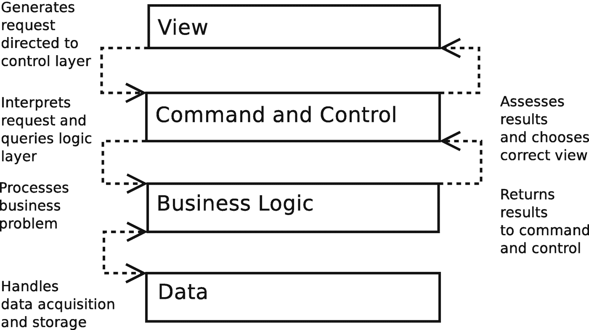
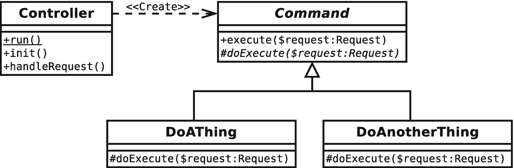
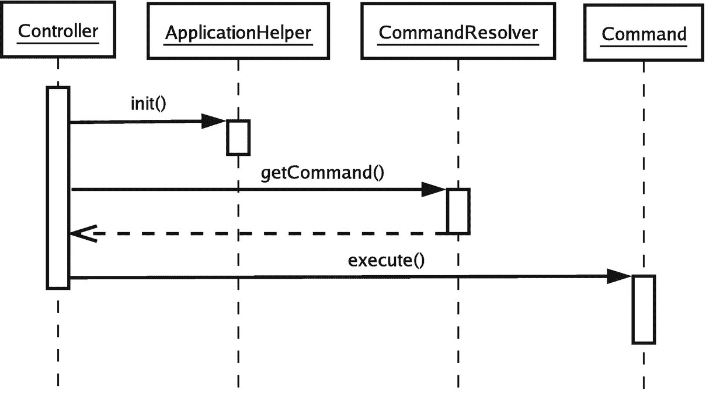
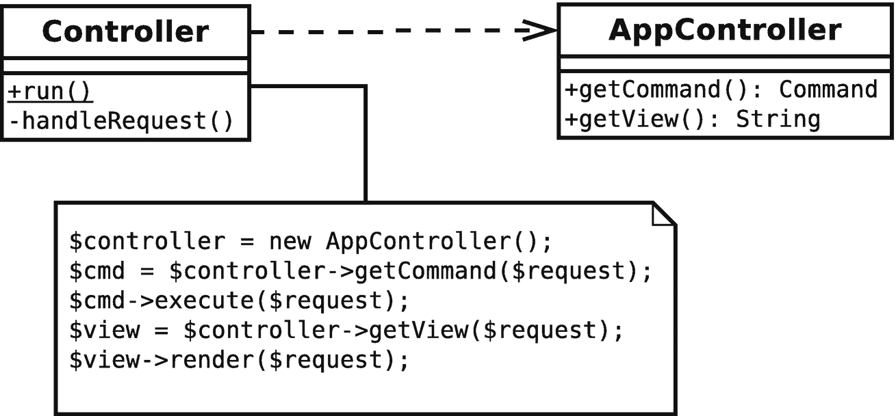
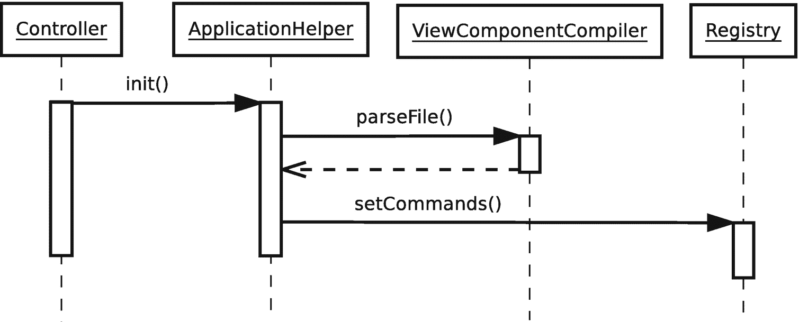
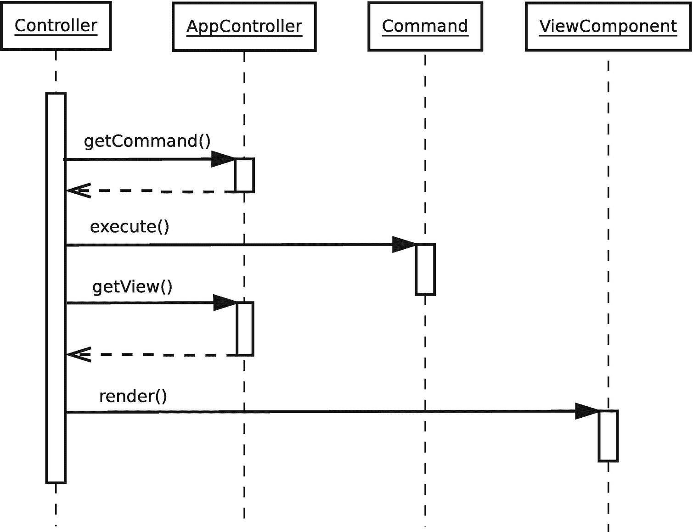
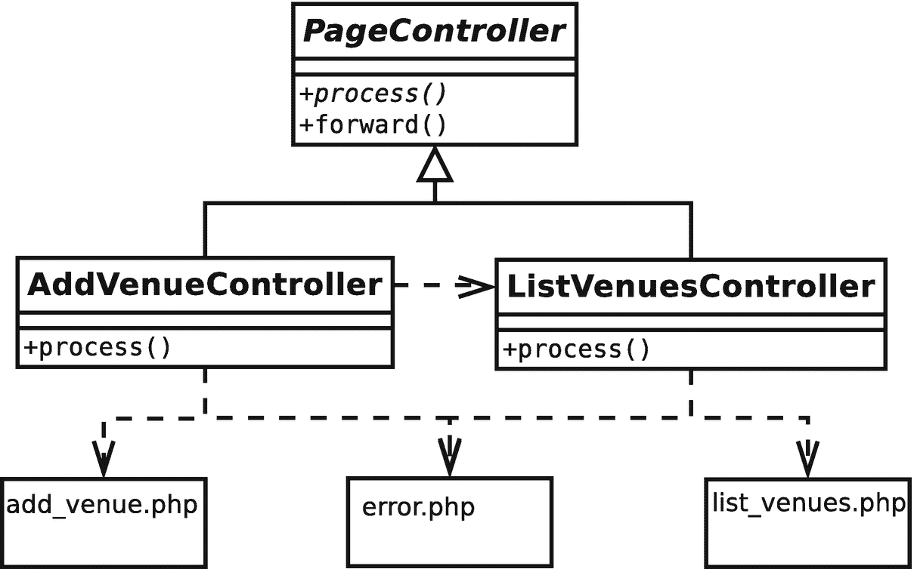
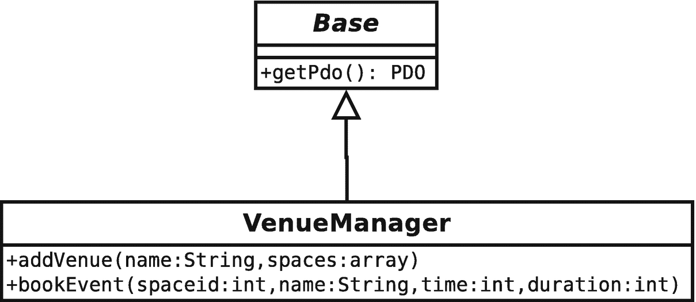
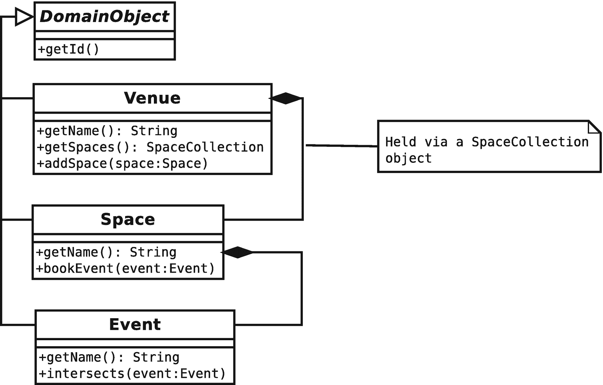

# 12.企业模式

PHP 首先是一种为网络设计的语言。而且，由于它对对象的广泛支持，我们可以利用在其他面向对象语言(尤其是 Java)的环境中孕育出来的模式。

在这一章中，我开发了一个例子，用它来说明我所涉及的模式。但是，请记住，选择使用一种模式，并不意味着就一定要使用所有适合它的模式。您也不应该认为这里介绍的实现是部署这些模式的唯一方式。相反，您应该使用这里的例子来帮助您理解所描述的模式的主旨，自由地提取您的项目所需要的东西。

因为要涵盖的内容太多，这是本书最长、最复杂的章节之一，一口气读完可能是个挑战。它分为引言和两个主要部分。这些分界线可能是很好的切入点。

我还在“架构概述”一节中描述了各个模式。虽然这些在某种程度上是相互依赖的，但是你应该能够直接跳到任何特定的模式，并独立地完成它，在你空闲的时候继续相关的模式。

本章将涵盖几个关键主题:

*   *架构概述*:介绍通常构成企业应用程序的层

*   *注册表模式*:管理应用数据

*   *表示层*:用于管理和响应请求以及向用户呈现数据的工具

*   *业务逻辑层*:了解系统的真正目的，即解决业务问题

## 架构概述

有了大量的基础知识，让我们首先概述即将出现的模式，然后介绍如何构建分层的应用程序。

### 模式

我将在本章中探讨几种模式。你可以从头到尾读一遍，或者浏览那些符合你需要或引起你兴趣的模式:

*   *Registry* :这种模式对于让数据对一个进程中的所有类可用很有用。通过谨慎使用序列化，它还可以用于跨会话甚至跨应用程序实例存储信息。

*   *前端控制器*:对于大型系统，如果您知道在管理许多不同的视图和命令时需要尽可能多的灵活性，可以使用这个。

*   *应用控制器*:创建一个类来管理视图逻辑和命令选择。

*   *模板视图*:创建只管理显示和用户界面的页面，用尽可能少的原始代码将动态信息合并到显示标记中。

*   *页面控制器*:重量较轻，但灵活性不如前端控制器，页面控制器解决了同样的需求。如果您希望快速得到结果，并且您的系统不太可能变得复杂，那么可以使用这种模式来管理请求和处理视图逻辑。

*   *事务脚本*:当您想要快速完成工作，并进行最少的预先规划时，请依靠过程库代码来实现您的应用程序逻辑。这种模式不适合扩展。

*   *域模型*:与事务脚本相反，使用该模式来构建业务参与者和流程的基于对象的模型。

Note

这里不单独描述命令模式(我在第 [11](11.html) 章中有写)；但是，在前端控制器和应用程序控制器模式中又会遇到这种情况。

### 应用程序和层

本章中的许多(实际上是大多数)模式都是为了促进应用程序中几个不同层的独立操作而设计的。就像类代表职责的专门化一样，企业系统的层次也是如此，尽管规模更大。图 [12-1](#Fig1) 显示了系统中各层的典型分解。



图 12-1

典型企业系统中的层

图 [12-1](#Fig1) 中所示的结构并不是一成不变的:这些层中的一些可以组合起来，不同的策略可以用于它们之间的通信，这取决于你的系统的复杂性。尽管如此，图 [12-1](#Fig1) 展示了一个强调灵活性和重用的模型，许多企业应用程序在很大程度上遵循它。

*   *视图层*包含系统用户实际看到并与之交互的界面。它负责呈现用户请求的结果，并提供向系统发出下一个请求的机制。

*   *命令和控制层*处理来自用户的请求。基于这种分析，它将完成请求所需的任何处理委托给业务逻辑层。然后，它选择最适合向用户呈现结果的视图。实际上，这一层和视图层通常被合并成一个单一的*表示层*。尽管如此，显示的角色应该与请求处理和业务逻辑调用的角色严格分开。

*   *业务逻辑层*负责处理请求的业务。它执行任何所需的计算并整理结果数据。

*   *数据层*将系统的其余部分与保存和获取持久信息的机制隔离开来。在一些系统中，命令和控制层使用数据层来获取它需要处理的业务对象。在其他系统中，尽可能隐藏数据层。

那么这样划分一个系统有什么意义呢？正如本书中的许多其他内容一样，答案在于脱钩。通过保持业务逻辑独立于视图层，只需很少或不需要重写就可以向系统添加新的接口。

想象一个管理事件列表的系统(在本章结束时，这将是一个非常熟悉的例子)。最终用户自然会需要一个漂亮的 HTML 界面。维护系统的管理员可能需要一个命令行界面来构建自动化系统。同时，您可能正在开发该系统的版本，以便与手机和其他手持设备一起使用。您甚至可以开始考虑 SOAP 或 RESTful API。

如果您最初将系统的底层逻辑与 HTML 视图层结合在一起(这仍然是一种常见的策略)，这些需求将触发即时重写。另一方面，如果您已经创建了一个分层系统，您将能够附加新的表示策略，而不需要重新考虑您的业务逻辑和数据层。

出于同样的原因，持久性策略会发生变化。同样，您应该能够在存储模型之间切换，而对系统中的其他层影响最小。

测试是创建分层系统的另一个好理由。众所周知，Web 应用程序很难测试。在一个没有充分分层的系统中，自动化测试必须在一端协商 HTML 接口，而在另一端冒着触发对数据库的随机查询的风险，即使它们的关注点不是针对这两个领域。尽管有测试总比没有好，但这种测试必然是偶然的。另一方面，在分层系统中，面向其他层的类通常被编写为扩展抽象超类或实现接口。这个超类型可以支持多态性。在测试环境中，整个层可以由一组虚拟对象(通常称为“存根”或“模拟”对象)来代替。例如，通过这种方式，您可以使用一个假的数据层来测试业务逻辑。你可以在第 18 章中读到更多关于测试的内容。

即使你认为测试是为 wimps 准备的，你的系统只有一个接口，层也是有用的。通过创建具有不同职责的层，您可以构建一个组成部分更易于扩展和调试的系统。通过将具有相同职责的代码放在一个地方来限制重复(而不是用数据库调用或显示策略来限制系统)。添加到这样一个系统中相对容易，因为你的改变往往是垂直的，而不是杂乱的水平。

分层系统中的一个新特性可能需要一个新的接口组件、额外的请求处理、更多的业务逻辑，以及对存储机制的修改。那就是垂直变化。在非分层系统中，您可以添加您的特性，然后记住五个单独的页面引用您修改的数据库表。或者是六个？您的新接口可能会在许多地方被调用，因此您需要在系统中进行工作，为此添加代码。这是横向修正。

当然，在现实中，你永远无法完全摆脱这种水平依赖，尤其是当涉及到界面中的导航元素时。然而，分级制度有助于最大限度地减少横向修正的需要。

Note

虽然这些模式中的许多已经存在了一段时间(毕竟，模式反映了久经考验的实践)，但其名称和界限要么来自马丁·福勒关于企业模式的主要著作，企业应用程序架构的 (Addison-Wesley Professional，2002)，要么来自有影响力的*核心 J2EE 模式:最佳实践和设计策略* (Prentice Hall，2001)。为了保持一致，我倾向于在两种来源不同的地方使用福勒的命名约定。

本章中的所有例子都围绕着一个虚构的列表系统，它的名字听起来很古怪，“Woo”，代表“外面发生了什么”

该系统的参与者包括场地(如剧院、俱乐部或电影院)、空间(如屏幕 1 或楼上的舞台)和事件(如*漫长的耶稣受难日*或*认真的重要性*)。

我将介绍的操作包括创建一个场所、向一个场所添加一个空间以及列出系统中的所有场所。

请记住，本章的目的是阐明关键的企业设计模式，而不是构建一个工作系统。反映出设计模式相互依赖的本质，这些例子中的大多数在很大程度上与代码例子重叠，很好地利用了本章其他地方所涉及的内容。由于这段代码主要是为了演示企业模式而设计的，所以它的大部分并没有满足生产系统所要求的所有标准。特别是，我省略了可能妨碍清晰性的错误检查。您应该将这些示例作为说明它们实现的模式的一种方式，而不是作为框架或应用程序中的构建块。

## 开始前作弊

本书中的大多数模式在企业架构的各层中找到了自然的位置。但是一些模式是如此的基础，以至于它们站在这个结构之外。注册表模式就是一个很好的例子。事实上，注册是打破分层所带来的限制的一种强有力的方法。只有例外才能保证规则的顺利运行。

### 登记处

注册表模式完全是为了提供对对象的系统级访问。如今，全球化不好几乎成了一种信条。然而，像其他罪恶一样，全球数据具有致命的吸引力。这种情况如此之多，以至于面向对象的架构师觉得有必要在一个新的名称下重新发明全局变量。你在第 9 章中遇到了单例模式，尽管单例对象确实不会遇到困扰全局变量的所有问题。特别是，您不能意外地覆盖单例。因此，单身族是低脂肪的全球性人群。但是，您应该对单例对象保持怀疑，因为它们会让您将类锚定到一个系统中，从而引入耦合。

然而，单例有时非常有用，以至于许多程序员(包括我)都无法放弃它们。

#### 问题

正如您所看到的，许多企业系统被划分为不同的层，每一层都只能通过严格定义的管道与其邻居进行通信。这种层的分离使得应用程序更加灵活。您可以在对系统其余部分影响最小的情况下替换或开发每一层。但是，当您在一个层中获得了以后在另一个非相邻层中需要的信息时，会发生什么呢？

假设我在一个`ApplicationHelper`类中获取配置数据:

```php
// listing 12.01
class ApplicationHelper
{
    public function getOptions(): array
    {
        $optionfile = __DIR __ . "/data/woo_options.xml";

        if (! file_exists($optionfile)) {
            throw new AppException("Could not find options file");
        }

        $options = \simplexml_load_file($optionfile);
        $dsn = (string)$options->dsn;
        // what do we do with this now?
        // ...
    }
}

```

获取信息很容易，但是我如何将信息传递到数据层，以便以后使用呢？我必须在整个系统中传播的所有其他配置信息呢？

一个答案是在系统中从对象到对象传递信息:从负责处理请求的控制器对象到业务逻辑层中的对象，最后到负责与数据库对话的对象。

这是完全可行的。事实上，您可以传递`ApplicationHelper`对象本身，或者一个更专门化的`Context`对象。无论哪种方式，上下文信息都通过系统的各层传递给需要它的对象。

代价是，为了做到这一点，您必须改变所有传递上下文对象的对象的接口，不管它们是否需要使用它。显然，这在某种程度上破坏了松散耦合。

注册表模式提供了一种替代方案，但也有其自身的后果。

一个*注册表*仅仅是一个类，它通过静态方法(或者通过单例上的实例方法)提供对数据(通常是，但不仅仅是对象)的访问。因此，系统中的每个对象都可以访问这些对象。

术语“注册中心”来自于 Fowler 的企业应用架构的*模式；但是，和所有模式一样，实现到处都是。在《务实的程序员:从熟练工到大师》一书中(Addison-Wesley Professional，1999)，Andrew Hunt 和戴维·托马斯将注册表类比作警察事件公告板。一个轮班的侦探在黑板上留下证据和草图，然后由另一个轮班的新侦探捡起来。我也见过叫做白板和黑板的注册表模式。*

### 履行

图 [12-2](#Fig2) 显示了一个`Registry`对象，用于存储和服务`Request`对象。


图 12-2

简单的注册表

下面是这个类的代码形式:

```php
// listing 12.02
class Registry
{
    private static ?Registry $instance = null;
    private ?Request $request = null;

    private function __construct()
    {
    }

    public static function instance(): self
    {
        if (is_null(self::$instance)) {
            self::$instance = new self();
        }

        return self::$instance;
    }

    public function getRequest(): Request
    {
        if (is_null($this->request)) {
            $this->request = new Request();
        }

        return $this->request;
    }
}

```

```php
// listing 12.03 class Request
{
}

```

然后，您可以从系统的任何部分访问相同的`Request`:

```php
// listing 12.04
$reg = Registry::instance();
print_r($reg->getRequest());

```

如你所见，`Registry`只是一个单例类(如果你需要关于单例类的提示，请参见第 [9 章](09.html))。代码通过`instance()`方法创建并返回`Registry`类的唯一实例。这可以用来检索一个`Request`对象。

众所周知，我会不顾一切地使用基于密钥的系统，就像这样:

```php
// listing 12.05
class Registry
{
    private static ?Registry $instance = null;
    private array $values = [];

    private function __construct()
    {
    }

    public static function instance(): self
    {
        if (is_null(self::$instance)) {
            self::$instance = new self();
        }

        return self::$instance;
    }

    public function get(string $key): mixed
    {
        if (isset($this->values[$key])) {
            return $this->values[$key];
        }

        return null;
    }

    public function set(string $key, mixed $value): void
    {
        $this->values[$key] = $value;
    }
}

```

这样做的好处是，您不需要为希望存储和服务的每个对象创建方法。然而，缺点是你通过后门重新引入了全局变量。使用任意字符串作为存储对象的键意味着在添加对象时，没有什么可以阻止系统的一部分覆盖键/值对。我发现在开发过程中使用这种类似地图的结构很有用，然后当我清楚需要存储和检索的数据时，就转移到显式命名的方法。

Note

注册表模式并不是管理系统所需服务的唯一方式。在第 9 章中，我们介绍了一个类似的策略，叫做依赖注入，它在 Symfony 等流行的框架中使用。

您还可以将注册表对象用作系统中公共对象的工厂。`Registry`类不是存储提供的对象，而是创建一个实例，然后缓存引用。它也可以在后台进行一些设置，比如从配置文件中检索数据，或者合并一些对象:

```php
// listing 12.06

// class Registry

private ?TreeBuilder $treeBuilder = null;
private ?Conf $conf = null;

// ...

public function treeBuilder(): TreeBuilder
{
    if (is_null($this->treeBuilder)) {
        $this->treeBuilder = new TreeBuilder($this->conf()->get('treedir'));
    }

    return $this->treeBuilder;
}

public function conf(): Conf
{
    if (is_null($this->conf)) {
        $this->conf = new Conf();
    }

    return $this->conf;
}

```

`TreeBuilder`和`Conf`只是虚拟类，包含它们是为了演示一个观点。需要一个`TreeBuilder`对象的客户端类可以简单地调用`Registry::treeBuilder()`，而不用担心初始化的复杂性。这种复杂性可能包括应用程序级的数据，比如虚拟的`Conf`对象，系统中的大多数类应该与它们隔离开来。

注册表对象对于测试也很有用。静态的`instance()`方法可以用来提供一个`Registry`类的子类，以虚拟对象为基础。下面是我如何修改`instance()`来达到这个目的:

```php
// listing 12.07

// class Registry

private static $testmode = false;

// ...

public static function testMode(bool $mode = true): void
{
    self::$instance = null;
    self::$testmode = $mode;
}

public static function instance(): self
{
    if (is_null(self::$instance)) {
        if (self::$testmode) {
            self::$instance = new MockRegistry();
        } else {
            self::$instance = new self();
        }
    }

    return self::$instance;
}

```

当您需要测试您的系统时，您可以使用测试模式切换到一个假的注册表中。这可以提供存根(出于测试目的而伪造真实环境的对象)或模拟(也分析对它们的调用并评估其正确性的类似对象):

```php
// listing 12.08
Registry::testMode();
$mockreg = Registry::instance();

```

你可以在第 18 章中读到更多关于 mock 和 stub 对象的内容。

#### 注册表、作用域和 PHP

术语*范围*通常用于描述代码结构上下文中对象或值的可见性。变量的生命周期也可以随着时间的推移来衡量。从这个意义上讲，您可以考虑三个级别的范围。标准是 HTTP *请求*所覆盖的时间段。PHP 还提供了对会话变量的内置支持。在请求结束时，它们被序列化并保存到文件系统或数据库中，然后在下一次请求开始时恢复。存储在 cookie 中或在查询字符串中传递的会话 ID 用于跟踪会话所有者。因此，您可以将一些变量视为具有会话范围。您可以通过在请求之间存储一些对象来利用这一点，从而节省到数据库的行程。显然，您需要小心，不要以同一个对象的多个版本而告终，所以当您将一个也存在于数据库中的对象签入到会话中时，您可能需要考虑一个锁定策略。

在其他语言中，特别是 Java 和 Perl(运行在 ModPerl Apache 模块上)，有应用程序范围的概念。占据这个空间的变量在应用程序的所有实例中都可用。这对 PHP 来说相当陌生；但是在较大的应用程序中，访问应用程序范围的空间来访问配置变量可能被认为是有用的。

在本书之前的版本中，我演示了会话和应用程序范围的注册表类的例子；但是在我第一次编写这个示例代码的十年左右的时间里，除了请求范围的注册表，我从来没有使用过任何东西。这种基于请求的方法有一个初始化成本，但是您通常会使用缓存策略来管理它。

#### 结果

对象使它们的数据全局可用。这意味着任何充当注册表客户端的类都将表现出一种未在其接口中声明的依赖关系。如果您开始依赖`Registry`对象获取系统中的大量数据，这可能会成为一个严重的问题。`Registry`对于一组定义明确的数据项，对象最好少用。

## 表示层

当请求到达您的系统时，您必须解释它携带的需求，调用任何需要的业务逻辑，并最终返回响应。对于简单的脚本，整个过程通常完全发生在视图本身内部，只有重量级的逻辑和持久性代码被分离到库中。

Note

一个*视图*是视图层中的一个独立元素。它可以是一个 PHP 页面(或者一组复合视图元素)，其主要职责是显示数据并提供用户生成新请求的机制。它也可以是 Twig 等系统中的模板。

随着系统规模的增长，这种默认策略变得越来越站不住脚，因为请求处理、业务逻辑调用和视图调度逻辑必然会在视图之间重复。

在这一节中，我将研究管理表示层这三个关键职责的策略。因为视图层与命令和控制层之间的界限经常相当模糊，所以将它们放在一个通用术语“表示层”下是有意义的

### 前端控制器

这种模式与具有多个入口点的传统 PHP 应用程序截然相反。前端控制器模式为所有传入请求提供了一个中心访问点，最终将向用户呈现结果的任务委托给视图。这是 Java 企业社区中的一个关键模式。在*核心 J2EE 模式:最佳实践和设计策略*中详细介绍了这一点，这仍然是最有影响力的企业模式资源之一。PHP 社区并不普遍喜欢这种模式，部分原因是初始化有时会导致开销。

我写的大多数系统都倾向于前端控制器。也就是说，我可能不会一开始就部署整个模式，但是如果我需要它提供的灵活性，我会知道将我的项目发展成前端控制器实现所必需的步骤。

#### 问题

在整个系统的多个点处理请求的情况下，很难避免代码的重复。您可能需要对用户进行身份验证，将术语翻译成不同的语言，或者只是访问公共数据。当一个请求需要视图之间的通用操作时，您可能会发现自己需要复制和粘贴操作。这使得修改变得困难，因为一个简单的修改可能需要跨系统中的几个点进行部署。因此，代码的某些部分很容易与其他部分不一致。当然，第一步可能是将常见操作集中到库代码中，但是您仍然需要调用分布在整个系统中的库函数或方法。

管理从视图到视图的进展的困难是另一个问题，该问题可能出现在控制分布在其视图中的系统中。在一个复杂的系统中，根据输入和在逻辑层执行的任何操作的成功，一个视图中的提交可能导致任意数量的结果页面。从一个视图到另一个视图的转发可能会变得混乱，尤其是如果同一个视图可能在不同的流中使用。

#### 履行

本质上，前端控制器模式为每个请求定义了一个中心入口点。它处理请求并使用它来选择要执行的操作。操作通常在根据命令模式组织的专用`command`对象中定义。

图 [12-3](#Fig3) 显示了前控制器实施的概述。



图 12-3

控制器类和命令层次结构

事实上，您可能会部署几个助手类来平滑这个过程，但是让我们从核心参与者开始。下面是一个简单的`Controller`类:

```php
// listing 12.09
class Controller

{
    private Registry $reg;

    private function __construct()
    {
        $this->reg = Registry::instance();
    }

    public static function run(): void
    {
        $instance = new self();
        $instance->init();
        $instance->handleRequest();
    }

    private function init(): void
    {
        $this->reg->getApplicationHelper()->init();
    }

    private function handleRequest(): void
    {
        $request = $this->reg->getRequest();
        $resolver = new CommandResolver();
        $cmd = $resolver->getCommand($request);
        $cmd->execute($request);
    }
}

```

尽管这很简单，并且没有错误处理，但对于`Controller`类来说没有什么更多的了。控制器位于系统的顶端，委托给其他类。正是这些其他类完成了大部分工作。`run()`仅仅是一个调用`init()`和`handleRequest()`的方便方法。它是静态的，构造函数是私有的，所以客户端代码的唯一选择是启动系统的执行。我通常在一个名为`index.php`的文件中这样做，这个文件只包含几行代码:

```php
// listing 12.10
require_once(__DIR__ . "/../../../vendor/autoload.php");

use  \popp\ch12\batch05\Controller;
Controller::run();

```

请注意看起来令人讨厌的 require 语句。实际上，只有在那里，系统的其余部分才能在不知道需要文件的情况下生存。`autoload.php`脚本由 Composer 自动生成。它根据需要管理加载类文件的逻辑。如果这对你毫无意义，不要担心；我们将在第 [15 章](15.html)中更详细地介绍自动装填。

`init()`和`handleRequest()`方法之间的区别实际上是 PHP 中的一个范畴。在一些语言中，`init()`将只在应用程序启动时运行，而`handleRequest()`或一个等效的将为每个用户请求运行。这个类注意到了设置和请求处理之间的相同区别，即使每个请求都调用了`init()`。

`init()`方法通过控制器的`$reg`属性引用的`Registry`类调用一个名为`ApplicationHelper`的类。`ApplicationHelper`类管理整个应用程序的配置数据。`Controller::init()`调用`ApplicationHelper`中的一个方法，也称为`init()`，正如您将看到的，它初始化应用程序使用的数据。

`handleRequest()`方法使用一个`CommandResolver`来获取一个`Command`对象，它通过调用`Command::execute()`来运行这个对象。

##### 应用助手

`ApplicationHelper`类对于前端控制器来说并不重要。但是，大多数实现都必须获取基本的配置数据，所以我应该为此开发一个策略。下面是一个简单的`ApplicationHelper`:

```php
// listing 12.11
class ApplicationHelper
{
    private string $config = __DIR__ . "/data/woo_options.ini";
    private Registry $reg;

    public function __construct()
    {
        $this->reg = Registry::instance();

    public function init(): void
    {
        $this->setupOptions();
        if (defined('STDIN')) {
            $request = new CliRequest();
        } else {
            $request = new HttpRequest();
        }

        $this->reg->setRequest($request);
    }

    private function setupOptions(): void
    {
        if (! file_exists($this->config)) {
            throw new AppException("Could not find options file");
        }

        $options = parse_ini_file($this->config, true);

        $this->reg->setConf(new Conf($options['config']));
        $this->reg->setCommands(new Conf($options['commands']));
    }
}

```

这个类只是读取一个配置文件，并将各种对象添加到注册表中，从而使它们对更广泛的系统可用。`init()`方法调用一个私有方法——`setupOptions()`——该方法读取一个`.ini`文件并将两个数组(每个数组位于一个名为`Conf`的数组包装器的实例中)传递给`Registry`对象。除了一个`get()`和一个`set()`方法之外，`Conf`没有任何东西——尽管更复杂的配置类可能管理搜索和解析文件，以及管理找到的数据。这些`Conf`数组中的一个用来保存一般的配置值，并传递给`Registry::setConf()`。另一个数组用于将 URL 路径映射到`Command`类，我将它传递给`Registry::setCommands()`。

`init()`方法还试图发现应用程序是在网络环境中运行还是在命令行上运行(通过检查常量`STDIN`是否被定义)。根据测试的结果，它将一个独特的`Request`子类传递给`Registry`对象。

因为类除了存储和提供对象之外做得很少，所以它们不适合令人兴奋的源代码清单。为了完整起见，下面是由`ApplicationHelper`使用或暗示的额外的`Registry`方法:

```php
// listing 12.12
// must be initialized by some smarter component
public function setRequest(Request $request): void
{
    $this->request = $request;
}
public function getRequest(): Request
{
    if (is_null($this->request)) {
        throw new \Exception("No Request set");
    }

    return $this->request;
}

public function getApplicationHelper(): ApplicationHelper
{
    if (is_null($this->applicationHelper)) {
        $this->applicationHelper = new ApplicationHelper();
    }

    return $this->applicationHelper;
}

public function setConf(Conf $conf): void
{
    $this->conf = $conf;
}

public function getConf(): Conf
{
    if (is_null($this->conf)) {
        $this->conf = new Conf();
    }

    return $this->conf;
}

public function setCommands(Conf $commands): void
{
    $this->commands = $commands;
}

public function getCommands(): Conf
{
    if (is_null($this->commands)) {
        $this->commands = new Conf();
    }

    return $this->commands;
}

```

下面是简单的配置文件:

```php
[config]
dsn=sqlite:/var/popp/src/ch12/batch05/data/woo.db

[commands]
/=\popp\ch12\batch05\DefaultCommand

```

##### CommandResolver

控制器需要一种方法来决定如何解释 HTTP 请求，这样它就可以调用正确的代码来完成该请求。您可以很容易地将这个逻辑包含在`Controller`类本身中，但是我更喜欢使用一个专门的类来实现这个目的。这使得在必要时重构多态性变得容易。

前端控制器通常通过运行`Command`对象来调用应用程序逻辑(我在第 [11](11.html) 章中介绍了命令模式)。根据请求 URL 选择`Command`(使用 URL 路径，或者现在不太常用的 GET 参数)。无论哪种方式，您最终都会得到一个可用于命令选择的令牌或模式。使用 URL 选择命令的方式不止一种。例如，您可以根据配置文件或数据结构来测试令牌(一种*逻辑*策略)。或者，您可以直接对文件系统上的类文件进行测试(一种*物理*策略)。

在上一章中，您看到了一个使用物理策略的命令工厂的例子。这一次，我将采用逻辑方法，将 URL 片段映射到命令类:

```php
// listing  12.13
class CommandResolver
{
    private static ?\ReflectionClass $refcmd = null;
    private static string $defaultcmd = DefaultCommand::class;

    public function __construct()
    {
        // could make this configurable
        self::$refcmd = new \ReflectionClass(Command::class);
    }

    public function getCommand(Request $request): Command
    {
        $reg = Registry::instance();
        $commands = $reg->getCommands();
        $path = $request->getPath();
        $class = $commands->get($path);
        if (is_null($class)) {
            $request->addFeedback("path '$path' not matched");
            return new self::$defaultcmd();
        }

        if (! class_exists($class)) {
            $request->addFeedback("class '$class' not found");
            return new self::$defaultcmd();
        }

        $refclass = new \ReflectionClass($class);

        if (! $refclass->isSubClassOf(self::$refcmd)) {
            $request->addFeedback("command '$refclass' is not a Command");
            return new self::$defaultcmd();
        }

        return $refclass->newInstance();
    }
}

```

这个简单的类从注册表中获取一个`Conf`对象，并使用 URL 路径(由`Request::getPath()`方法提供)来尝试获取一个类名。如果找到了类名，并且该类既存在又扩展了`Command`基类，那么它将被实例化并返回。

如果不满足这些条件中的任何一个，`getCommand()`方法就会通过提供一个默认的`Command`对象来适当地降级。

更复杂的实现(例如 Symfony 中路由逻辑使用的实现)将允许在这些路径中使用通配符。

您可能想知道为什么这段代码相信它所定位的`Command`类不需要参数:

```php
return $refclass->newInstance();

```

这个问题的答案在于`Command`类本身的签名:

```php
// listing 12.14
abstract class Command
{
    final public function __construct()
    {
    }

    public function execute(Request $request): void
    {
        $this->doExecute($request);
    }

    abstract protected function doExecute(Request $request): void;
}

```

通过声明构造函数方法`final`，我使得子类无法覆盖它。因此，没有一个`Command`类会要求它的构造函数有参数。

当创建命令类时，您应该尽可能地保持它们没有应用程序逻辑。一旦他们开始做应用程序类型的事情，你会发现他们变成了一种复杂的事务脚本，重复很快就会出现。命令是一种中继站:它们应该解释请求，调用域来处理一些对象，然后为表示层存放数据。一旦他们开始做任何比这更复杂的事情，可能就是重构的时候了。好消息是重构相对容易。当一个命令试图做太多事情时，并不难发现，解决方案通常很明确:将该功能下移到一个助手或域类。

##### 请求

PHP 神奇地为我们处理了请求，并整齐地打包在超全局数组中。您可能已经注意到，我仍然使用一个类来表示一个请求。一个`Request`对象被传递给`CommandResolver`，然后再传递给`Command`。

为什么不让这些类自己简单地查询`$_REQUEST`、`$_POST`或`$_GET`数组呢？当然，我可以这样做，但是通过将请求操作集中在一个地方，我打开了新的选择。

例如，您可以对传入的请求应用过滤器。或者，如下一个例子所示，您可以从 HTTP 请求之外的地方收集请求参数，允许应用程序从命令行或测试脚本运行。

`Request`对象也是需要传递给视图层的数据的有用存储库。事实上，许多系统为此提供了一个单独的`Response`对象，但是我们在这里将保持精简。

下面是一个简单的`Request`超类:

```php
// listing 12.15
abstract class Request
{
    protected array $properties = [];
    protected array $feedback = [];
    protected string $path = "/";
    public function __construct()
    {
        $this->init();
    }

    abstract public function init(): void;

    public function setPath(string $path): void
    {
        $this->path = $path;
    }

    public function getPath(): string
    {
        return $this->path;
    }

    public function getProperty(string $key): mixed
    {
        if (isset($this->properties[$key])) {
            return $this->properties[$key];
        }

        return null;
    }

    public function setProperty(string $key, mixed $val): void
    {
        $this->properties[$key] = $val;
    }

    public function addFeedback(string $msg): void
    {
        array_push($this->feedback, $msg);
    }

    public function getFeedback(): array
    {
        return $this->feedback;
    }

    public function getFeedbackString($separator = "\n"): string
    {
        return implode($separator, $this->feedback);
    }

    public function clearFeedback(): void
    {
        $this->feedback = [];
    }
}

```

正如您所看到的，这个类的大部分内容都是关于设置和获取属性的机制。`init()`方法负责填充私有`$properties`数组，它将由子类处理。值得注意的是，这个示例实现忽略了请求方法——这不是您在现实世界中想要做的事情。完整的实现应该管理 GET、POST 和 PUT 数组，并提供统一的查询机制。一旦有了一个`Request`对象，就应该能够通过`getProperty()`方法访问一个参数，该方法接受一个键字符串并返回相应的值(存储在`$properties`数组中)。您也可以通过`setProperty()`添加数据。

该类还管理一个`$feedback`数组。这是一个简单的管道，控制器类可以通过它向用户传递消息。在更完整的实现中，我们可能希望区分错误消息和信息性消息。

你可能记得`ApplicationHelper`实例化了`HttpRequest`和`CliRequest`中的一个。这是其中的第一个:

```php
// listing 12.16
class HttpRequest extends Request
{
    public function init(): void
    {
        // we're conveniently ignoring POST/GET/etc distinctions
        // don't do that in the real world!
        $this->properties = $_REQUEST;
        $this->path = $_SERVER['PATH_INFO'];
        $this->path = (empty($this->path)) ? "/" : $this->path;
    }
}

```

`CliRequest`以`key=value`的形式从命令行获取参数对，并将它们分解成属性。它还检测带有`path:`前缀的参数，并将提供的值赋给对象的`$path`属性:

```php
// listing 12.17
class CliRequest extends Request
{
    public function init(): void
    {
        $args = $_SERVER['argv'];

        foreach ($args as $arg) {
            if (preg_match("/^path:(\S+)/", $arg, $matches)) {
                $this->path = $matches[1];
            } else {
                if (strpos($arg, '=')) {
                    list($key, $val) = explode("=", $arg);
                    $this->setProperty($key,  $val);
                }
            }
        }

        $this->path = (empty($this->path)) ? "/" : $this->path;
    }
}

```

##### 一个命令

你已经看到了`Command`基类，第 [11 章](11.html)详细介绍了命令模式，所以没有必要深入研究命令。不过，让我们用一个简单、具体的`Command`对象来结束这一切:

```php
// listing 12.18
class DefaultCommand extends Command
{
    protected function doExecute(Request $request): void
    {
        $request->addFeedback("Welcome to WOO");
        include(__DIR__ . "/main.php");
    }
}

```

如果没有收到对特定`Command`的明确请求，这就是由`CommandResolver`提供的`Command`对象。

您可能已经注意到，抽象基类自己实现了`execute()`，向下调用其子类的`doExecute()`实现。这使得我们可以简单地通过改变基类来为所有命令添加设置和清理代码。

向`execute()`方法传递一个`Request`对象，该对象提供对用户输入以及`setFeedback()`方法的访问。`DefaultCommand`利用这一点来设置欢迎信息。

最后，该命令简单地通过调用`include()`将控制分派给一个视图。在`Command`类中嵌入从命令到视图的映射是最简单的分派机制；但是对于小型系统来说，这已经足够了。在“应用程序控制器”一节中可以看到更灵活的策略。

文件`main.php`包含一些 HTML 和对`Request`对象的调用，以检查任何反馈(稍后我将更详细地介绍视图)。我现在已经准备好了运行系统的所有组件。这是我所看到的:

```php
<html>
<head>
<title>Woo! it's WOO!</title>
</head>
<body>

<table>
<tr>
<td>
Welcome to WOO</td>
</tr>
</table>

</body>
</html>

```

正如您所看到的，默认命令设置的反馈消息已经进入了输出。让我们回顾一下导致这一结果的整个过程。

##### 概观

这一节中涉及的类的细节可能掩盖了前端控制器模式的简单性。图 [12-4](#Fig4) 显示了说明请求生命周期的序列图。



图 12-4

运行中的前端控制器

如您所见，前端控制器将初始化委托给了`ApplicationHelper`对象(它可以使用缓存来缩短任何昂贵的设置)。然后，`Controller`从`CommandResolver`对象中获取一个`Command`对象。最后，它调用`Command::execute()`来启动应用程序逻辑。

在这个模式的实现中，`Command`本身负责委托给视图层。您可以在下一节中看到对此的改进。

#### 结果

前控制器不适合胆小的人。在你开始看到好处之前，它确实需要大量的前期开发。如果您的项目需要快速周转，或者如果它足够小，前端控制器框架将比系统的其余部分更重，这是一个严重的缺点。

话说回来，一旦你在一个项目中成功部署了一个前置控制器，你会发现你可以以迅雷不及掩耳之势为别人重用它。您可以将它的大部分功能抽象成库代码，有效地为自己构建一个可重用的框架。

要求为每个请求加载所有配置信息是另一个缺点。所有方法都会在某种程度上受到这种影响，但是前端控制器通常需要额外的信息，例如命令和视图的逻辑图。

通过缓存这些数据，可以大大减少这种开销。最有效的方法是将数据作为原生 PHP 添加到系统中。如果你是一个系统的唯一维护者，这很好；但是如果您有非技术用户，您可能需要提供一个配置文件。不过，您仍然可以通过创建一个系统来读取配置文件，然后构建 PHP 数据结构，并将其写入缓存文件，从而实现原生 PHP 方法的自动化。一旦创建了本地 PHP 缓存，系统将优先使用它而不是配置文件，直到做出更改并且必须重新构建缓存。

另一方面，前端控制器集中了系统的表现逻辑。这意味着您可以在一个地方(至少在一组类中)对处理请求和选择视图的方式进行控制。这减少了重复并降低了出现错误的可能性。

前端控制器也非常具有可扩展性。一旦您有了一个启动并运行的核心，您就可以非常容易地添加新的`Command`类和视图。

在这个例子中，命令处理它们自己的视图分派。如果您将前端控制器模式与帮助视图(可能还有命令)选择的对象一起使用，那么该模式允许对导航进行很好的控制，而当表示控制分布在整个系统中时，这种控制很难保持良好。我将在下一节讨论这样一个对象。

### 应用控制器

对于较小的系统来说，允许命令调用它们自己的视图是可以接受的，但这并不理想。最好尽可能地将命令从视图层中分离出来。

应用程序控制器负责将请求映射到命令，将命令映射到视图。这种分离意味着在不改变代码库的情况下切换不同的视图集变得更加容易。它还允许系统所有者改变应用程序的流程，同样不需要触及任何内部。通过允许命令解析的逻辑系统，该模式还使同一命令更容易在系统内的不同上下文中使用。

#### 问题

记住例题的性质。管理员需要能够向系统中添加一个地点，并将其与一个空间相关联。因此，系统可能支持`AddVenue`和`AddSpace`命令。根据迄今为止的例子，这些命令将使用从路径(`/addvenue`)到类(`AddVenue`)的直接映射来选择。

一般来说，对`AddVenue`命令的成功调用应该导致对`AddSpace`命令的初始调用。这种关系可能被硬编码到类本身中，一旦成功，`AddVenue`就会调用`AddSpace`。`AddSpace`可能会包含一个视图，该视图包含将空间添加到场地的表单。

这两个命令可以与至少两个不同的视图相关联，一个用于呈现输入表单的核心视图和一个错误或“谢谢”屏幕。根据已经讨论过的逻辑，`Command`类本身将包含那些视图(使用条件测试来决定在什么情况下呈现哪个视图)。

只要命令总是以相同的方式使用，这种级别的硬编码就可以了。但是，如果我想在某些情况下对`AddVenue`进行特殊的查看，或者如果我想改变一个命令引导另一个命令的逻辑(也许一个流程可能在成功的地点添加和空间添加的开始之间包括一个额外的屏幕),它就开始崩溃了。如果您的每个命令只使用一次，在与其他命令的一个关系中和一个视图中，那么您应该硬编码您的命令彼此之间的关系和它们的视图。否则，你应该继续读下去。

应用程序控制器类可以接管这个逻辑，释放出`Command`类来专注于它们的工作，即处理输入、调用应用程序逻辑和处理任何结果。

#### 履行

和往常一样，这个模式的关键是接口。应用程序控制器是一个类(或一组类)，前端控制器可以使用它根据用户请求获取命令，并在命令运行后找到正确的视图。你可以在图 [12-5](#Fig5) 中看到这种关系的骨架。



图 12-5

应用程序控制器模式

与本章中的所有模式一样，目标是使客户端代码尽可能简单——因此有了 spartan 前端控制器类。但是，在接口背后，我必须部署一个实现。这里介绍的方法只是一种方法。当您阅读这一部分时，请记住模式的本质在于参与者(应用程序控制器、命令和视图)的交互方式，而不是这个实现的细节。

让我们从使用应用程序控制器的代码开始。

##### 前端控制器

下面是`FrontController`如何与`AppController`类一起工作(简化并去除了错误处理):

```php
// listing 12.19
// Controller
private function __construct()
{
    $this->reg = Registry::instance();
}

private function handleRequest(): void
{
    $request = $this->reg->getRequest();
    $controller = new AppController();
    $cmd = $controller->getCommand($request);
    $cmd->execute($request);
    $view = $controller->getView($request);
    $view->render($request);
}

public static function run(): void
{
    $instance = new self();
    $instance->init();
    $instance->handleRequest();
}

private function init(): void
{
    $this->reg->getApplicationHelper()->init();
}

```

继续前面的例子，主要的区别是，除了将类名从`CommandResolver`改为`AppController`(不可否认，这是一个有点装饰性的动作)，我们现在检索一个`ViewComponent`以及一个`Command`对象。注意，这段代码使用一个注册表对象来获取`Request`对象。我们也可以将`AppController`对象存储在`Registry`中——即使它没有被其他组件使用。避免直接实例化的类通常更灵活，也更容易测试。

那么`AppController`通过什么逻辑知道哪个视图与哪个命令相关联呢？与面向对象代码一样，接口比实现更重要。然而，让我们填写一个可能的方法。

##### 实施概述

根据操作的不同阶段，一个`Command`类可能需要不同的视图。`AddVenue`命令的默认视图可能是一个数据输入表单。如果用户添加了错误的数据，表单可能会再次显示，或者显示错误页面。如果一切顺利，并且在系统中创建了场地，那么我可能希望转发到`Command`对象链中的另一个:`AddSpace`，也许。

`Command`对象通过设置状态标志告诉系统它们的当前状态。下面是这个最小实现识别的标志(在`Command`超类中设置为属性):

```php
// listing 12.20
public const CMD_DEFAULT = 0;
public const CMD_OK = 1;
public const CMD_ERROR = 2;
public const CMD_INSUFFICIENT_DATA = 3;

```

应用程序控制器使用`Request`对象找到并实例化正确的`Command`类。一旦运行，`Command`将与一个状态相关联。可以将`Command`和 status 的组合与一个数据结构进行比较，以确定接下来应该运行哪个命令，或者如果不再需要运行命令，应该提供哪个视图。

##### 配置文件

系统的所有者可以通过设置一组配置指令来确定命令和视图协同工作的方式。以下是摘录:

```php
// listing 12.21
<woo-routing>
    <control>

        <command  path="/"  class="\popp\ch12\batch06\DefaultCommand">
           <view name="main" />
           <status value="CMD_ERROR">
              <view name="error" />
           </status>
        </command>

        <command path="/listvenues" class="\popp\ch12\batch06\ListVenues">
           <view  name="listvenues" />
        </command>

        <command path="/quickaddvenue" class="\popp\ch12\batch06\AddVenue">
           <view name="quickadd" />
        </command>

        <command path="/addvenue" class="\popp\ch12\batch06\AddVenue">
           <view name="addvenue" />
           <status value="CMD_OK">
              <forward path="/addspace" />
           </status>
        </command>
        <command path="/addspace" class="\popp\ch12\batch06\AddSpace">
           <view name="addspace" />
           <status value="CMD_OK">
              <forward path="/listvenues" />
           </status>
        </command>

    </control>
</woo-routing>

```

这个 XML 片段展示了一种策略，用于从`Command`类本身抽象出命令流及其与视图的关系。这些指令都包含在一个`control`元素中。

每个命令元素定义了描述基本命令映射的`path`和`class`属性。然而，视图的逻辑更加复杂。位于`command`顶层的`view`元素定义了一个默认关系。换句话说，如果没有更具体的条件匹配，这个`view`将被用于一个命令。`status`元素定义了这些特定条件。它们的`value`属性应该与你看到的命令状态相匹配。当一个命令的执行呈现一个`CMD_OK`状态时，例如，如果在 XML 文档中定义了一个等价的状态，那么就会使用相应的视图元素。

一个`view`元素定义了一个`name`属性。该值用于构建模板文件的路径，然后可以包含该模板文件。

一个`command`或者一个`status`元素可能包含一个`forward`元素而不是一个`view`。Woo 系统将一个`forward`视为一种特殊的`view`，它不是呈现一个模板，而是用一个新的路径重新调用应用程序。

根据这个解释，让我们来看一下这个 XML 的一个片段:

```php
// listing 12.22
<command path="/addvenue" class="\popp\ch12\batch06\AddVenue">
    <view name="addvenue" />
    <status value="CMD_OK">
        <forward path="/addspace" />
    </status>
</command>

```

当用`/addvenue`路径调用系统时，调用`AddVenue`命令。然后，它生成一个状态值，即`CMD_DEFAULT`、`CMD_OK`、`CMD_ERROR`或`CMD_INSUFFICIENT_DATA`中的一个。对于除`CMD_OK`之外的任何状态，将调用`addvenue`模板。然而，如果命令返回`CMD_OK`状态，则条件匹配。元素可以简单地包含另一个视图来代替默认视图。不过，在这里，`forward`元素开始发挥作用。通过转发到另一个`command`，配置文件将处理视图的所有责任委托给新元素。然后，系统将在新请求中以`/addspace`路径重新开始。

##### 解析配置文件

感谢 SimpleXML 扩展，我们不需要做任何实际的解析——这是为我们处理的。剩下的工作就是遍历 SimpleXML 数据结构并构建我们自己的数据。这里有一个名为`ViewComponentCompiler`的类就是这样做的:

```php
// listing 12.23
class ViewComponentCompiler
{
    private static $defaultcmd = DefaultCommand::class;

    public function parseFile(string $file): Conf
    {
        $options = \simplexml_load_file($file);

        return $this->parse($options);
    }

    public function parse(\SimpleXMLElement $options): Conf
    {
        $conf = new Conf();

        foreach ($options->control->command as $command) {
            $path = (string) $command['path'];
            $cmdstr = (string) $command['class'];
            $path = (empty($path)) ? "/" : $path;
            $cmdstr = (empty($cmdstr)) ? self::$defaultcmd : $cmdstr;
            $pathobj = new ComponentDescriptor($path, $cmdstr);

            $this->processView($pathobj, 0, $command);

            if (isset($command->status) &&  isset($command->status['value'])) {
                foreach ($command->status as $statusel) {
                    $status = (string)$statusel['value'];
                    $statusval = constant(Command::class . "::" . $status);

                if (is_null($statusval)) {
                    throw new AppException("unknown status: {$status}");
                }

                $this->processView($pathobj, $statusval, $statusel);
            }
        }

        $conf->set($path, $pathobj);
    }

    return $conf;
    }

    public function processView(ComponentDescriptor $pathobj, int $statusval, \ SimpleXMLElement $el): void
    {
        if (isset($el->view) && isset($el->view['name'])) {
            $pathobj->setView($statusval, new TemplateViewComponent((string)$el->view['name']));
        }

        if (isset($el->forward) && isset($el->forward['path'])) {
            $pathobj->setView($statusval, new ForwardViewComponent((string)$el->forward['path']));
        }
    }
}

```

这里真正的动作发生在`parse()`方法中，该方法接受一个`SimpleXMLElement`对象进行遍历。我首先实例化一个`Conf`对象(记住，这只是一个数组的包装)。然后我遍历 XML 中的命令元素。对于每个命令，我提取了`path`和`class`属性的值，并将这些数据传递给`ComponentDescriptor`对象的构造函数。这个对象将管理与一个`command`元素相关的信息包——您很快就会看到这个类。

然后我调用一个名为`processView()`的私有方法，向它传递`ComponentDescriptor`，一个零值整数(因为我们正在处理默认状态)，以及一个对当前 XML 元素的引用(现在是`command`)。根据在 XML 片段中找到的内容，`processView()`要么创建一个`TemplateViewComponent`要么创建一个`ForwardViewComponent`，并将其传递给`ComponentDescriptor::setView()`。当然，它可能什么也不匹配，也根本不打电话——但这可能是不可取的。也许我们会在更完整的实现中把它变成一个错误条件。

回到`parse()`，我开始处理`status`属性。我再次调用`processView()`——但是这次使用的整数对应于`status`元素的`value`属性中的字符串。换句话说，字符串`CMD_OK`变为 1，`CMD_ERROR`变为 2，依此类推。PHP 的`constant()`方法提供了一种进行这种转换的简洁方法。所以这次我传递给`processView()`一个非零整数，以及`status` XML 元素。

再次，`processView()`用任何找到的`ViewComponent`对象填充`ComponentDescriptor`。

最后，我将`ComponentDescriptor`对象存储在`Conf`对象中，通过命令组件的`path`值进行索引。

一旦循环结束，我就返回`Conf`对象。

在你能跟随这个流程之前，它可能需要一点重新阅读；但本质上，这个过程非常简单:`ViewComponentCompiler`构建一个由`ComponentDescriptor`对象组成的数组(和前面一样，包装在`Conf`对象中)。每个`ComponentDescriptor`对象维护关于路径和`Command`类的信息，以及由状态值(默认视图为 0)索引的一组`ViewComponent`对象(管理模板显示或转发)。

尽管有这些忙碌的工作，重要的是要记住高层次的过程是非常简单的。我们正在构建潜在请求与命令和视图之间的关系。图 [12-6](#Fig6) 显示了这个初始化过程。



图 12-6

编译命令和视图

##### 管理组件数据

您已经看到编译后的`ComponentDescriptor`对象存储在一个`Conf`对象中——本质上是一个关联数组的 getter 和 setter。这里的关键是系统识别的路径:例如`/`，或者`/addvenue`。

因此，让我们来看看管理命令、查看和转发信息的`ComponentDescriptor`:

```php
// listing 12.24
class ComponentDescriptor
{
    private array $views = [];

    public function __construct(private string $path, private string $cmdstr)
    {
    }

    public function getCommand(): Command
    {
        $class = $this->cmdstr;
        if (is_null($class)) {
            throw new AppException("unknown class '$class'");
        }

        if (! class_exists($class)) {
            throw new AppException("class '$class' not found");
        }

        $refclass = new \ReflectionClass($class);

        if (! $refclass->isSubClassOf(Command::class)) {
            throw new AppException("command '$class' is not a Command");
        }

        return $refclass->newInstance();
    }

    public function setView(int $status, ViewComponent $view): void
    {
        $this->views[$status] = $view;
    }

    public function getView(Request $request): ViewComponent
    {
        $status = $request->getCmdStatus();
        $status = (is_null($status)) ? 0 : $status;

        if (isset($this->views[$status])) {
            return $this->views[$status];
        }

        if (isset($this->views[0])) {
            return $this->views[0];
        }

        throw new AppException("no view found");
    }
}

```

因此，您可以在这里看到存储和检索，但是还有更多的工作要做。命令信息(`Command`的完整类名)是通过构造函数添加的，只有在调用`getCommand()`时才被延迟转换成`Command`对象。这个实例化和检查发生在一个私有方法中:`resolveCommand()`。这里的代码应该看起来很熟悉——它实际上是从本章前面的`CommandResolver`的等效功能中偷来的。

获取视图更容易。记住，每个视图组件都是通过`setView()`方法存储的。在幕后，我们现在看到`ViewComponent`对象在一个数组属性`$views`中被管理，并由一个整数，一个`Command`状态值索引。当客户端代码调用`getView()`方法时，我们被传递一个`Request`对象，其中可能已经缓存了`Command`状态。我们通过一个新的方便的方法`Request::getCmdStatus()`得到这个值。有了这些，只需检查`$views`数组中相应的`ViewComponent`元素。如果没有匹配，我们返回默认值，该值的索引为零。

这样，这个小类提供了 XML 文件中一个`command`元素隐含的所有逻辑。

因为大部分实际工作是由助手类完成的，所以应用程序控制器本身相对来说比较单薄。让我们来看看:

```php
// listing 12.25
class AppController
{
    private static string $defaultcmd = DefaultCommand::class;
    private static string $defaultview = "fallback";

    public function getCommand(Request $request): Command
    {
        try {
            $descriptor = $this->getDescriptor($request);
            $cmd = $descriptor->getCommand();
        } catch (AppException $e) {
            $request->addFeedback($e->getMessage());
            return new self::$defaultcmd();
        }

        return $cmd;
    }

    public function getView(Request $request): ViewComponent
    {
        try {
            $descriptor = $this->getDescriptor($request);
            $view = $descriptor->getView($request);
        } catch (AppException) {
            return new TemplateViewComponent(self::$defaultview);
        }

        return $view;
    }

    private function getDescriptor(Request $request): ComponentDescriptor
    {
        $reg = Registry::instance();
        $commands = $reg->getCommands();
        $path = $request->getPath();
        $descriptor = $commands->get($path);

        if (is_null($descriptor)) {
            throw new AppException("no descriptor for {$path}", 404);
        }

        return $descriptor;
    }
}

```

这个类中几乎没有实际的逻辑，因为大部分复杂性都被推给了各种助手类。`getCommand()`和`getView()`都调用私有方法`getDescriptor()`，为当前请求获取一个`ComponentDescriptor`。`getDescriptor()`方法从`Request`对象中获取当前路径，并使用它从`Conf`对象中提取一个`ComponentDescriptor`对象，该对象也由注册表存储并由`getCommands()`返回。记住这个`ComponentDescriptor`对象的数组之前是由`ViewComponentCompiler`对象填充的，潜在的路径作为键。

一旦`getCommand()`和`getView()`有了`ComponentDescriptor`对象，就可以各自调用其对应的方法。在`getCommand()`里，我们叫`ComponentDescriptor::getCommand()`；在`getView()`中，我们称之为`ComponentDescriptor::getView()`。

在我们继续之前，有一些细节需要总结。既然`Command`对象不再调用视图，我们需要一种呈现模板的机制。这是由`TemplateViewComponent`对象处理的。这些实现了一个接口，`ViewComponent`:

```php
// listing 12.26
interface ViewComponent
{
    public function render(Request $request): void;
}

```

这里是`TemplateViewComponent`:

```php
// listing 12.27
class TemplateViewComponent implements ViewComponent
{

    public function __construct(private string $name)
    {
    }

    public function render(Request $request): void
    {
        $reg = Registry::instance();
        $conf = $reg->getConf();
        $path = $conf->get("templatepath");

        if (is_null($path)) {
            throw new AppException("no template directory");
        }
        $fullpath = "{$path}/{$this->name}.php";

        if (! file_exists($fullpath)) {
            throw new AppException("no template at {$fullpath}");
        }

        include($fullpath);
    }
}

```

这个类用一个名称实例化——然后在`render()`时间使用这个名称，结合一个路径配置值，以包含一个模板。

为什么`ViewComponent`是一个接口？虽然`TemplateViewComponent`处理渲染，但在这个实现中，我们也将转发视为一个视图过程。

这里是`ForwardViewComponent`:

```php
// listing 12.28
class ForwardViewComponent implements ViewComponent
{
    public function __construct(private ?string $path)
    {
    }

    public function render(Request $request): void
    {
        $request->forward($this->path);
    }
}

```

这个类简单地在提供的`Request`对象上调用`forward()`。`forward()`的实现因`Request`子类型而异。对于`HttpRequest`来说，就是设置位置头的问题:

```php
// listing 12.29

//HttpRequest

public function forward(string $path): void
{
    header("Location: {$path}");
    exit;
}

```

对于`CliRequest`，我们不能依赖服务器来处理转发，所以我们必须采取不同的方法:

```php
// listing 12.30

// CliRequest

public function forward(string $path): void
{
    // tack the new path onto the end the argument list
    // last argument wins
    $_SERVER['argv'][] = "path:{$path}";
    Registry::reset();
    Controller::run();
}

```

我们利用了这样一个事实，当参数数组被解析为一个路径时，找到的最终匹配最终被设置在`Request`上。我们需要做的就是添加一个路径参数，清除注册表，并从头开始运行控制器。

这让我们兜了一圈，这是一个很好的概述时刻！

应用程序控制器可能用来获取视图和命令的策略可以有很大不同；关键是这些都隐藏在更广泛的系统之外。图 [12-7](#Fig7) 显示了前端控制器类使用应用控制器首先获取`Command`对象，然后获取视图的高级过程。


图 12-8

视图中嵌入的页面控制器



图 12-7

使用应用程序控制器获取命令和视图

注意，图 [12-7](#Fig7) 中呈现的视图可能是`ForwardViewComponent`(将使用新路径重新开始该过程)或`TemplateViewComponent`(将包括一个模板文件)中的一个。

还记得图 [12-7](#Fig7) 中获取`Command`和`ViewComponent`对象过程中需要的数据是由我们的老朋友`ApplicationHelper`整理的。提醒一下，下面是实现这一点的高级代码:

```php
// listing 12.31
private function setupOptions(): void
{

    //...
    $vcfile = $conf->get("viewcomponentfile");
    $cparse = new ViewComponentCompiler();

    $commandandviewdata = $cparse->parseFile($vcfile);
    $this->reg->setCommands($commandandviewdata);
}

```

##### 命令类

既然命令不再负责调用它们的模板，那么有必要简要地看一下基类和实现。我们已经看到了`Command`类中的新状态，但是还有一点需要注意:

```php
// listing 12.32
abstract class Command
{
    public const CMD_DEFAULT = 0;
    public const CMD_OK = 1;
    public const CMD_ERROR = 2;
    public const CMD_INSUFFICIENT_DATA = 3;
    final public function __construct()
    {
    }

    public function execute(Request $request): void
    {
        $status = $this->doExecute($request);
        $request->setCmdStatus($status);
    }

    abstract protected function doExecute(Request $request): int;
}

```

在模板方法模式的一个很好的例子中，`execute()`方法调用抽象的`doExecute()`方法，并将返回值缓存在`Request`对象中。稍后,`ComponentDescriptor`将使用它来选择要返回的正确视图。

##### 具体的命令

下面是一个简单的`AddVenue`命令可能的样子:

```php
// listing 12.33
class AddVenue extends Command
{
    protected function doExecute(Request $request): int
    {
        $name = $request->getProperty("venue_name");

        if (is_null($name)) {
            $request->addFeedback("no name provided");
            return self::CMD_INSUFFICIENT_DATA;
        } else {
            // do some stuff
            $request->addFeedback("'{$name}' added");
            return self::CMD_OK;
        }

        return self::CMD_DEFAULT;
    }
}

```

事实上，这缺少了与构建一个`Venue`对象并将其保存到数据库中相关的功能代码，但是我们将会谈到所有这些。在这一点上，重要的是命令根据环境返回不同的状态。正如我们已经看到的，不同的状态将导致应用程序控制器选择和返回不同的视图。因此，如果我们使用示例 XML，当返回`CMD_OK`时，转发机制将触发转发到`/addspace`。只有`/addvenue`才会以这种方式触发。如果导致该命令被调用的请求使用了路径`/quickaddvenue`，则不会发生转发，并将显示`quickaddvenue`视图。然而,`AddVenue`命令对此一无所知。它坚持自己的核心职责。

#### 结果

由于获取和应用描述命令和请求、命令和命令、命令和视图之间关系的元数据的工作量很大，所以建立一个功能齐全的应用程序控制器模式实例可能会很困难。

出于这个原因，我倾向于只在我的应用程序告诉我需要的时候才实现这样的东西。当我发现自己根据具体情况向调用不同视图或调用其他命令的命令添加条件时，我通常会听到这种低语。大约就在这个时候，我觉得命令流和显示逻辑开始脱离我的控制。

当然，应用程序控制器可以使用各种机制在命令和视图之间建立关联，而不仅仅是我在这里采用的方法。即使在所有情况下，您都从请求字符串、命令名和视图之间的固定关系开始，您仍然可以从构建应用程序控制器来封装这些关系中受益。当你必须重构以适应更多的复杂性时，它会给你相当大的灵活性。

### 页面控制器

虽然我很喜欢前端控制器模式，但这并不总是正确的方法。前期设计的投资倾向于奖励更大的系统，而惩罚简单的、需要立即得到结果的项目。页面控制器模式对您来说可能已经很熟悉了，因为它是一种常见的策略。尽管如此，有些问题还是值得探讨的。

#### 问题

同样，问题是您需要管理请求、领域逻辑和表示之间的关系。对于企业项目来说，这几乎是一个常量。然而，不同的是对你的约束。

如果你有一个相对简单的项目，在这个项目中，大的预先设计可能会威胁到你的最后期限，而没有增加大量的价值，那么页面控制器是管理请求和视图的一个好的选择。

假设您想要呈现一个显示 Woo 系统中所有场馆列表的页面。即使完成了数据库检索代码，在没有前端控制器的情况下，要获得这个简单的结果仍然是一项艰巨的任务。

视图是一个地点列表；请求是一个地点列表。在错误允许的情况下，请求不会导致新的视图，正如您在复杂的任务中可能期望的那样。这里最简单的工作是将视图和控制器关联起来——通常在同一个页面中。

#### 履行

尽管页面控制器项目的实际情况可能会变得非常残酷，但模式是简单的。控件与一个视图或一组视图相关。在最简单的情况下，这意味着控件位于视图本身中，尽管它可以被抽象，特别是当一个视图与其他视图紧密链接时(例如，当您可能需要在不同的环境下转到不同的页面时)。

下面是最简单的页面控制器:

```php
// listing 12.34
<?php
namespace popp\ch12\batch07;

try {

    $venuemapper = new VenueMapper();
    $venues = $venuemapper->findAll();
} catch (\Exception) {
    include('error.php');
    exit(0);
}

// default page follows
?>
<html>
<head>
<title>Venues</title>
</head>
<body>
<h1>Venues</h1>

<?php foreach ($venues as $venue) { ?>
    <?php print $venue->getName(); ?><br />
<?php } ?>

</body>
</html>

```

这份文件有两个要素。视图元素处理显示，而控制器元素管理请求并调用应用程序逻辑。尽管视图和控制器位于同一个页面，但是它们是严格分离的。

这个例子很简单(除了在幕后进行的数据库工作，在下一章中你会发现更多)。页面顶部的 PHP 块试图获取一个`Venue`对象的列表，并将其存储在`$venues`全局变量中。

如果出现错误，页面通过使用`include()`委托给一个名为`error.php`的页面，然后使用`exit()`终止当前页面上的任何进一步处理。我同样可以使用 HTTP 转发。如果没有包含发生，则显示页面底部的 HTML(视图)。

你可以在图 [12-8](#Fig8) 中看到控制器和视图的组合。

这可以作为一个快速测试，但是任何规模或复杂性的系统都可能需要更多的支持。

页面控制器代码以前被隐式地从视图中分离出来。在这里，我从一个基本的页面控制器基类开始:

```php
// listing 12.35
abstract class PageController
{
    private Registry $reg;

    abstract public function process(): void;

    public function __construct()
    {
        $this->reg = Registry::instance();
    }

    public function init(): void
    {
        if (isset($_SERVER['REQUEST_METHOD'])) {
            $request = new HttpRequest();
        } else {
            $request = new CliRequest();
        }

        $this->reg->setRequest($request);
    }

    public function forward(string $resource): void
    {
        $request = $this->getRequest();
        $request->forward($resource);
    }

    public function render(string $resource, Request $request): void
    {
        include($resource);
    }

    public function getRequest(): Request
    {
        return $this->reg->getRequest();
    }
}

```

这个类使用了一些您已经看过的工具——特别是`Request`和`Registry`类。`PageController`类的主要角色是提供对`Request`对象的访问，并管理视图的包含。随着越来越多的子类发现对公共功能的需求，这个目的列表在实际项目中会迅速增长。

一个子类可以存在于视图中，从而像以前一样默认显示它。或者，它可以独立于视图。我认为后一种方法更干净，所以我选择了这条路。下面是一个试图向系统添加新场地的`PageController`:

```php
// listing 12.36
class AddVenueController extends PageController
{
    public function process(): void
    {
        $request = $this->getRequest();

        try {
            $name = $request->getProperty('venue_name');

            if (is_null($request->getProperty('submitted'))) {
                $request->addFeedback("choose a name for the venue");
                $this->render(__DIR__ . '/view/add_venue.php', $request);
            } elseif (is_null($name)) {
                $request->addFeedback("name is a required field");
                $this->render(__DIR__ . '/view/add_venue.php', $request);

                return;
            } else {
                // add to database
                $this->forward('listvenues.php');
            }
        } catch (Exception) {
            $this->render(__DIR__ . '/view/error.php', $request);
        }
    }
}

```

`AddVenueController`类只实现了`process()`方法。`process()`负责审核用户的提交。如果用户没有提交表单，或者没有正确地完成表单，则包括默认视图(`add_venue.php`)，提供反馈并呈现表单。如果我成功地添加了一个新的地点，那么该方法调用`forward()`将用户发送到`ListVenues`页面控制器。

请注意我在视图中使用的格式。我倾向于区分视图文件和类文件，在前者中使用全部小写的文件名，在后者中使用 camel case(将单词放在一起并使用大写字母来显示边界)。

您可能已经注意到,`AddVenueController`类中没有导致它运行的东西。我可以将 runner 代码放在同一个文件中，但是这将使测试变得困难(因为包含类的行为将执行它的方法)。为此，我为每个页面创建了一个 runner 脚本。下面是 addvenue.php:

```php
// listing 12.37
$addvenue = new AddVenueController();
$addvenue->init();
$addvenue->process();

```

下面是与`AddVenueController`类相关联的视图:

```php
// listing 12.38
<html>
<head>
<title>Add Venue</title>
</head>
<body>
<h1>Add Venue</h1>

<table>
<tr>
<td>
<?php
print  $request->getFeedbackString("</td></tr><tr><td>");
?>
</td>
</tr>
</table>

<form action="/addvenue.php" method="get">
    <input type="hidden" name="submitted" value="yes"/>
    <input type="text" name="venue_name" />
</form>

</body>
</html>

```

如您所见，该视图除了显示数据和提供生成新请求的机制之外什么也不做。请求被发送给`PageController`(通过`/addvenue.php` runner)，而不是返回给视图。记住，是`PageController`类负责处理请求。

你可以在图 [12-9](#Fig9) 中看到页面控制器模式的更复杂版本的概述。



图 12-9

页面控制器类层次结构及其包含关系

#### 结果

这种方法有一个很大的优点，那就是它对任何有网络经验的人来说都有意义。我请求`venues.php`，这正是我得到的。即使是一个错误也在意料之中，因为“服务器错误”和“页面未找到”页面是每天的现实。

如果将视图从页面控制器类中分离出来，事情会变得稍微复杂一些，但是参与者之间近乎一对一的关系已经足够清楚了。

一旦完成处理，页面控制器就包含它的视图。但是，在某些情况下，它会转发到另一个页面控制器。所以，例如当`AddVenue`成功添加一个场地时，它不再需要显示添加表单。相反，它委托给`ListVenues`。

这是在`PageController`中由`forward()`方法处理的，就像我们已经看到的`ForwardViewComponent`一样，简单地在`Request`上调用`forward()`。

尽管页面控制器类可能会委托给`Command`对象，但这样做的好处并不像前端控制器那样明显。前端控制器类需要弄清楚请求的目的是什么；页面控制器类已经知道这一点。您将放在`Command`中的轻量级请求检查和逻辑层调用在页面控制器类中同样容易，并且您受益于您不需要选择您的`Command`对象的机制这一事实。

重复可能是一个问题，但是使用一个公共超类可以解决很多问题。您还可以节省设置时间，因为您可以避免加载在当前上下文中不需要的数据。当然，您也可以使用前端控制器来实现这一点，但是发现什么是需要的，什么是不需要的过程会复杂得多。

这种模式的真正缺点在于视图路径复杂的情况——尤其是同一视图在不同时间以不同方式使用时(添加和编辑屏幕就是一个很好的例子)。您会发现自己陷入了条件和状态检查中，并且很难对系统有一个总体的了解。

然而，从页面控制器开始并向前端控制器模式发展也不是不可能的。如果您正在使用一个`PageController`超类，这一点尤其正确。根据经验，如果我估计一个系统应该用不到一周左右的时间来完成，并且在未来不需要更多的阶段，我会选择页面控制器，并从快速周转中受益。如果我正在构建一个大型项目，它需要随着时间的推移而增长，并且具有复杂的视图逻辑，我每次都会选择前端控制器。

### 模板视图和视图助手

模板视图几乎就是 PHP 中默认的视图，因为我可以混合表示标记(HTML)和系统代码(原生 PHP)。正如我以前说过的，这既是一件好事，也是一件坏事，因为将它们结合在一起的容易程度代表了将应用程序和显示逻辑结合在一起的诱惑——这可能会带来灾难性的后果。

在 PHP 中，对视图进行编程在很大程度上是一种约束。如果严格来说这不是一个显示问题，那么就用最大的怀疑来对待任何代码。

为此，视图助手模式(Alur 等人)提供了一个助手类，该类可以是特定于一个视图的，也可以在多个视图之间共享，以帮助完成任何需要最少量代码的任务。

#### 问题

如今，在显示页面中直接嵌入 SQL 查询和其他业务逻辑的情况越来越少，但这种情况还是会发生。我在前面的章节中已经非常详细地介绍了这种特殊的邪恶，所以我将保持简短。

包含太多代码的网页对 Web 制作者来说可能很难处理，因为表示组件会在循环和条件中纠缠在一起。

表示中的业务逻辑迫使你坚持使用那个接口。如果不移植大量的应用程序代码，你就不能轻松地切换到一个新的视图。

将视图从逻辑中分离出来的系统也更容易测试。这是因为测试可以应用到逻辑层的功能上，而不会干扰到表现。

在表示层嵌入逻辑的系统中也经常出现安全问题。在这样的系统中，因为处理用户输入的数据库查询和代码往往分散在表格、表单和列表中，所以很难识别潜在的危险。

随着许多操作从一个视图到另一个视图重复出现，在模板中嵌入应用程序代码的系统很容易成为复制的牺牲品，因为相同的代码结构从一页粘贴到另一页。在这种情况下，错误和维护噩梦肯定会随之而来。

为了防止这种情况发生，您应该在其他地方处理应用程序，并且只允许视图管理表示。这通常是通过使视图成为数据的被动接收者来实现的。当一个视图确实需要询问系统时，提供一个视图助手对象来代表视图做任何相关的工作是一个好主意。

#### 履行

一旦创建了一个更广泛的框架，视图层就不再是一个巨大的编程挑战。当然，这仍然是一个巨大的设计和信息架构问题，但那是另一本书！

模板视图是由 Fowler 命名的。这是大多数企业程序员使用的主要模式。在某些语言中，一个实现可能涉及到创建一个模板系统，将标签翻译成系统设置的值。PHP 中也有这个选项。您可以使用像 excellent Twig 这样的模板引擎。不过，我更倾向于使用 PHP 现有的功能，但是要小心使用。

为了让视图有所作为，它必须能够获取数据。我喜欢定义视图可以使用的视图助手。

下面是一个简单的视图助手类:

```php
// listing 12.39
class ViewHelper
{
    public function sponsorList(): string
    {
        // do something complicated to get the sponsor list return "Bob's Shoe Emporium";
    }
}

```

这个类目前所做的只是提供一个赞助商列表字符串。让我们假设有一些相对复杂的过程来获取或格式化这些我们不应该嵌入模板本身的数据。随着应用程序的发展，您可以扩展它以提供额外的功能。如果您发现自己在一个视图中做的事情占用了不止几行，那么它很可能属于视图助手。在较大的应用程序中，您可以在继承层次结构中提供多个视图助手对象，以便为系统的不同部分提供不同的工具。

我可能会从某种工厂——也许是注册中心——获得一个视图助手。从模板的角度来看，最简单的方法是在`render()`方法中提供一个助手实例:

```php
// listing 12.40
public function render(string $resource, Request $request): void
{
    $vh = new ViewHelper();
    // now the template will have the $vh variable include($resource);
}

```

下面是一个使用视图助手的简单视图:

```php
// listing 12.41
<html>
<head>
<title>Venues</title>
</head>
<body>
<h1>Venues</h1>

<div>
Proudly sponsored by: <?php echo $vh->sponsorList(); ?>

</div> Listing venues
</body>
</html>

```

视图(`list_venues.php`)在`$vh`变量中被授予一个 ViewHelper 实例。它调用`sponsorList()`方法并打印结果。

显然，这个例子没有将代码从视图中排除，但是它严格限制了需要完成的代码的数量和种类。该页面包含一个简单的 echo 语句，并且随着复杂性的增加，不可避免地需要其他方法调用，但是设计人员应该能够轻松地处理这种代码。

稍微有问题的是`if`语句和循环。这些很难委托给视图助手，因为它们通常与格式化输出绑定在一起。我倾向于将简单的条件和循环(在构建显示数据行的表格时非常常见)都放在模板视图中；但是为了使它们尽可能简单，我尽可能地委托测试子句之类的事情。

#### 结果

数据传递到视图层的方式有点令人不安，因为视图并没有真正的固定接口来保证它的环境。我倾向于认为每一个观点都是和整个系统签订了合同。该视图实际上是在对应用程序说，“如果我被调用，那么我有权访问对象`This`、对象`That`和对象`TheOther`由应用程序来确保这一点。

您可以通过在助手类中提供访问器方法来使视图更严格，但是我总是发现通过一个`Request`、`Response`或`Context`对象为视图层动态注册对象更容易。

虽然模板通常本质上是被动的，由最后一次请求产生的数据填充，但有时视图可能需要发出辅助请求。视图助手是提供这种功能的好地方，它对视图本身隐藏了所需数据的机制。即使是视图助手也应该做尽可能少的工作，委托给一个命令或者通过一个 facade 联系域层。

Note

你在第 [10](10.html) 章看到了门面模式。Alur 等人在 Session Facade 模式(旨在限制细粒度的网络事务)中研究了 Facade 在企业编程中的一种用途。Fowler 还描述了一种称为服务层的模式，它提供了一个简单的访问层内复杂性的点。

## 业务逻辑层

如果控制层协调与外部世界的通信，并整理系统对它的响应，那么逻辑层继续处理应用程序的*业务*。这一层应该尽可能避免分析查询字符串、构造 HTML 表和编写反馈消息时产生的噪音和创伤。业务逻辑是关于做需要做的事情——应用程序的真正目的。其他一切的存在只是为了支持这些任务。

在经典的面向对象应用程序中，业务逻辑层通常由对系统要解决的问题进行建模的类组成。正如您将看到的，这是一个灵活的设计决策。它还需要大量的前期规划。

那么，让我们从启动和运行系统的最快方式开始。

### 交易脚本

事务脚本模式(*企业应用架构模式*)描述了许多系统自动进化的方式。它简单、直观、有效，尽管随着系统的增长，它会变得不那么简单。事务脚本内联处理请求，而不是委托给专门的对象。这是典型的快速解决方案。这也是一个很难归类的模式，因为它结合了本章中其他层的元素。我选择将其作为业务逻辑层的一部分，因为模式的动机是实现系统的业务目标。

#### 问题

每个请求都必须以某种方式处理。如您所见，许多系统都提供了评估和过滤输入数据的层。不过，理想情况下，这一层应该调用为满足请求而设计的类。这些类可以被分解来表示系统中的力量和职责，也许有一个门面接口。然而，这种方法需要一定程度的精心设计。对于一些项目(通常规模小，性质紧急)，这样的开发开销是不可接受的。在这种情况下，您可能需要将您的业务逻辑构建到一组程序操作中。每个操作都将被精心设计来处理特定的请求。

因此，问题是需要提供一种快速有效的机制来实现系统的目标，而不需要在复杂的设计中进行潜在的昂贵投资。

这种模式的最大好处是可以快速获得结果。每个脚本接受输入并操纵数据库以确保结果。除了在同一个类中组织相关的方法并将事务脚本类保持在它们自己的层中(即，尽可能独立于命令、控制和视图层)，几乎不需要预先设计。

虽然业务逻辑层类倾向于与表示层明确分离，但它们通常更多地嵌入在数据层中。这是因为检索和存储数据是这些类经常执行的任务的关键。在本章的后面，你会看到将逻辑对象从数据库中分离出来的机制。不过，事务脚本类通常了解数据库的所有信息(尽管它们可以使用网关类来处理实际查询的细节)。

#### 履行

让我们回到我的事件列表示例。在这种情况下，系统支持三种关系数据库表:`venue`、`space`、`event`。一个`venue`可能有多个`spaces`(例如，一个剧院可能有多个舞台，一个舞蹈俱乐部可能有不同的房间)。每个`space`都会举办许多活动。以下是模式:

```php
CREATE TABLE 'venue' (
    'id' int(11) NOT NULL auto_increment,
    'name' text,
    PRIMARY KEY  ('id')
)

CREATE TABLE 'space' (
    'id' int(11) NOT NULL auto_increment,
    'venue' int(11) default NULL,
    'name' text,
    PRIMARY KEY ('id')
)

CREATE TABLE 'event' (
    'id' int(11) NOT NULL auto_increment,
    'space' int(11) default NULL,
    'start' mediumtext,
    'duration' int(11) default NULL,
    'name' text,
    PRIMARY KEY ('id')
)

```

很明显，这个系统需要增加场地和事件的机制。其中的每一个都代表一个事务。我可以给每个方法一个自己的类(并根据你在第 [11](11.html) 章中遇到的命令模式来组织我的类)。不过，在这种情况下，我将把这些方法放在一个单独的类中，尽管是作为继承层次结构的一部分。结构如图 [12-10](#Fig10) 所示。



图 12-10

一个事务脚本类及其超类

那么为什么这个例子包括一个抽象超类呢？在任何大小的脚本中，我都可能向这个层次结构中添加更多具体的类。因为这些中的大多数至少会共享一些核心功能，所以将其放在一个公共的父节点中是有意义的。

事实上，这本身就是一种模式(Fowler 将其命名为层超类型)。如果一个层中的类具有相同的特征，那么将它们组合成一个类型，在基类中定位实用程序操作是有意义的。在本章的其余部分，你会经常看到这一点。

在这种情况下，基类获取一个`PDO`对象，并将其存储在一个属性中。

```php
// listing 12.42
abstract class Base
{
    private \PDO $pdo;
    private string $config = __DIR__ . "/data/woo_options.ini";

    public function __construct()
    {
        $reg = Registry::instance();
        $options = parse_ini_file($this->config, true);
        $conf = new Conf($options['config']);
        $reg->setConf($conf);
        $dsn = $reg->getDSN();

        if (is_null($dsn)) {
            throw new AppException("No DSN");
        }

        $this->pdo = new \PDO($dsn);
        $this->pdo->setAttribute(\PDO::ATTR_ERRMODE, \PDO::ERRMODE_EXCEPTION);
    }

    public function getPdo(): \PDO
    {

        return $this->pdo;
    }
}

```

我使用`Registry`类获取一个 DSN 字符串，并将其传递给 PDO 构造函数。我通过一个 getter 方法使 PDO 对象可用:`getPdo()`。事实上，很多这种工作可以推回到注册表对象本身——在本章和下一章的其他地方，你会看到我采用的一种策略。

这里是`VenueManager`类的开始，它设置了我的 SQL 语句:

```php
// listing 12.43
class VenueManager extends Base
{
    private string $addvenue = "INSERT INTO venue
                                ( name  )
                                VALUES( ? )";

    private string $addspace = "INSERT INTO space
                                ( name, venue )
                                VALUES( ?, ? )";

    private string $addevent = "INSERT INTO event
                                ( name, space, start, duration )
                                VALUES( ?, ?, ?, ? )";

// ...

```

这里没什么新东西。这些是事务脚本将使用的 SQL 语句。它们是以 PDO 类的`prepare()`方法接受的格式构造的。问号是将传递给`execute()`的值的占位符。现在是时候定义旨在满足特定业务需求的第一种方法了:

```php
// listing 12.44

// VenueManager

public function addVenue(string $name, array $spaces): array
{
    $pdo = $this->getPdo();
    $ret = [];
    $ret['venue'] = [$name];
    $stmt = $pdo->prepare($this->addvenue);
    $stmt->execute($ret['venue']);
    $vid = $pdo->lastInsertId();

    $ret['spaces'] = [];

    $stmt = $pdo->prepare($this->addspace);

    foreach ($spaces as $spacename) {
        $values = [$spacename, $vid];
        $stmt->execute($values);
        $sid = $pdo->lastInsertId();
        array_unshift($values, $sid);
        $ret['spaces'][] = $values;
    }

    return $ret;
}

```

如您所见，`addVenue()`需要一个地点名称和一组空间名称。它使用这些来填充`venue`和`space`表。它还创建了一个包含该信息的数据结构，以及为每行新生成的 ID 值。

记住，如果有错误，就会抛出一个异常。我在这里没有捕捉到任何异常，所以任何由`prepare()`抛出的东西也会被这个方法抛出。这是我想要的结果，尽管我应该在我的文档中说明这个方法抛出了异常。

创建了`venue`行后，我循环遍历`$spaces`，在`space`表中为每个元素添加一行。注意，在我创建的每一个`space`行中，我都包含了作为外键的场所 ID，将行与场所相关联。

第二个事务脚本同样简单明了:

```php
// listing 12.45

// VenueManager

public function bookEvent(int $spaceid, string $name, int $time, int $duration): void
{
    $pdo = $this->getPdo();
    $stmt = $pdo->prepare($this->addevent);
    $stmt->execute([$name, $spaceid, $time, $duration]);
}

```

这个脚本的目的是向`events`表中添加一个与空间相关联的事件。

#### 结果

事务脚本模式是快速获得良好结果的有效方法。这也是许多程序员多年来一直使用的模式之一，没有想到它可能需要一个名称。有了一些好的助手方法，比如我添加到基类中的那些方法，您就可以专注于应用程序逻辑，而不会在数据库摆弄中陷入太多的麻烦。

我见过事务脚本出现在 lessc 欢迎上下文中。我认为我正在编写一个比通常适合这种模式更复杂、对象更多的应用程序。随着最后期限的压力开始显现，我发现我正在将越来越多的逻辑放在一个领域模型上的一个薄薄的门面中(见下一节)。尽管结果没有我想要的那么优雅，但我不得不承认，应用程序似乎并没有因为其隐含的重新设计而受到影响。

在大多数情况下，当您确定小型项目不会发展成大型项目时，您会选择事务脚本方法。这种方法不能很好地扩展，因为当脚本不可避免地相互交叉时，重复经常开始蔓延。当然，你可以在某种程度上解决这个问题，但是你可能无法完全去除它。

在我的例子中，我决定将数据库代码嵌入事务脚本类本身。但是，正如您所看到的，代码希望将数据库工作与应用程序逻辑分开。我可以把它完全从类中抽出来，创建一个 gateway 类，它的作用是代表系统处理数据库交互。

### 领域模型

领域模型是原始的逻辑引擎，本章中的许多其他模式都在努力创建、培育和保护它。它是在你的项目中起作用的力量的抽象表示。这是一种形式的平面，在这里，您的业务问题发挥出它们的本性，不受令人讨厌的物质问题(如数据库和网页)的阻碍。

如果这看起来有点华丽，让我们回到现实吧。领域模型是您的系统的真实世界参与者的表示。在领域模型中，“对象即事物”的经验法则比其他地方更正确。在其他任何地方，对象都倾向于体现责任。在领域模型中，它们通常描述一组属性，并添加代理。他们是做*事情*的*事物*。

#### 问题

如果您一直在使用事务脚本，您可能会发现重复成为一个问题，因为不同的脚本需要执行相同的任务。这在一定程度上可以被排除，但是随着时间的推移，很容易陷入剪切粘贴编码。

您可以使用领域模型来提取和具体化您的系统的参与者和过程。您可以创建`Space`和`Event`类，而不是使用脚本将空间数据添加到数据库中，然后将事件数据与其相关联。预订某个空间的活动就像打电话到`Space::bookEvent()`一样简单。像检查时间冲突这样的任务变成了`Event::intersects()`等等。

显然，对于像 Woo 这样简单的例子，一个事务脚本就足够了。但是随着领域逻辑变得越来越复杂，领域模型的替代品变得越来越有吸引力。复杂的逻辑可以更容易地处理，并且在对应用程序域建模时，您需要更少的条件代码。

#### 履行

领域模型设计起来相对简单。与该主题相关的大部分复杂性在于旨在保持模型纯净的模式——也就是说，将它与应用程序中的其他层分离开来。

将领域模型的参与者从表示层中分离出来，很大程度上是为了确保他们保持自我。将参与者从数据层中分离出来要困难得多。尽管理想的情况是只根据领域模型所代表和解决的问题来考虑领域模型，但是数据库的现实是难以逃避的。

领域模型类相当直接地映射到关系数据库中的表是很常见的，这无疑使生活变得更加容易。例如，图 [12-11](#Fig11) 显示了一个类图，它描绘了 Woo 系统的一些参与者。



图 12-11

领域模型的摘录

图 [12-11](#Fig11) 中的对象反映了为事务脚本示例设置的表。这种直接关联使系统更容易管理，但这并不总是可能的，尤其是当您在应用程序之前使用数据库模式时。这种联系本身就是问题的根源。如果您不小心，您可能最终会对数据库建模，而不是对您试图解决的问题和压力建模。

仅仅因为域模型经常反映数据库的结构，并不意味着它的类应该了解它。通过将模型从数据库中分离出来，您可以使整个层更容易测试，并且不太可能受到模式变化甚至存储机制变化的影响。它还将每个类的责任集中在其核心任务上。

下面是一个简化的`Venue`对象及其父类:

```php
// listing 12.46
abstract class DomainObject
{

    public function __construct(private int $id)
    {
    }

    public function getId(): int
    {
        return $this->id;
    }

    public static function getCollection(string $type): Collection
    {
        // dummy implementation
        return Collection::getCollection($type);
    }

    public function markDirty(): void
    {
        // next chapter!
    }
}

```

```php
// listing 12.47
class Venue extends DomainObject
{
    private SpaceCollection $spaces;

    public function __construct(int $id, private string $name)
    {
        $this->name = $name;
        $this->spaces = self::getCollection(Space::class);
        parent:: __construct($id);
    }

    public function setSpaces(SpaceCollection $spaces): void
    {
        $this->spaces = $spaces;
    }

    public function getSpaces(): SpaceCollection
    {
        return $this->spaces;
    }

    public function addSpace(Space $space): void
    {
        $this->spaces->add($space);
        $space->setVenue($this);
    }

    public function setName(string $name): void
    {
        $this->name = $name;
        $this->markDirty();
    }

    public function getName(): string
    {
        return $this->name;
    }
}

```

有几点可以将这个类与没有持久性的类区分开来。我没有使用数组，而是使用一个类型为`SpaceCollection`的对象来存储`Venue`可能包含的任何`Space`对象(尽管可以说，无论您是否在使用数据库，类型安全数组都是一个额外的好处！).因为这个类使用一个特殊的集合对象，而不是一个`Space`对象数组，所以构造函数需要在启动时实例化一个空集合。它通过调用层超类型上的静态方法来实现这一点:

```php
$this->spaces = self::getCollection(Space::class);

```

我将在下一章回到这个系统的集合对象以及如何获取它们。不过现在，超类只是返回一个空数组。

Note

在本章和下一章，我将讨论对`Venue`和`Space`对象的修改。这些是简单的领域对象，它们共享一个公共的功能核心。如果您正在编写代码，您应该能够将我讨论的概念应用到任何一个类中。例如，`Space`类可能不维护`Space`对象的集合，但是它可能以完全相同的方式管理`Event`对象。

我希望构造函数中有一个`$id`参数，我将它传递给超类进行存储。得知`$id`参数表示数据库中一行的惟一 ID 时，应该不会感到惊讶。还要注意，我在超类上调用了一个名为`markDirty()`的方法(这将在你遇到工作单元模式时涉及到)。

#### 结果

领域模型的设计需要像您需要模拟的业务流程一样简单或复杂。它的美妙之处在于，在设计模型时，您可以将注意力集中在问题中的力量上，处理其他层中的持久性和表示等问题——理论上是这样的。

实际上，我认为大多数开发人员在设计他们的领域模型时至少会关注数据库。没有人想设计这样的结构，当涉及到将对象放入和取出数据库时，它会迫使您(或者，更糟的是，您的同事)陷入复杂代码的困境。

就设计和规划而言，域模型和数据层之间的这种分离代价相当大。可以将数据库代码直接放在模型中(尽管您可能希望设计一个网关来处理实际的 SQL)。对于相对简单的模型，特别是如果每个类广泛地映射到一个表，这种方法可能是一个真正的胜利，为您节省了设计一个外部系统来协调对象和数据库的大量设计开销。

## 摘要

我在这里涉及了大量的内容(尽管我也遗漏了很多)。你不应该被本章中大量的代码吓倒。模式意味着在正确的情况下使用，并在有用的时候结合使用。使用本章中描述的那些你认为满足你的项目需求的方法，不要认为你必须在开始一个项目之前建立一个完整的框架。另一方面，*这里有*足够的材料来形成一个框架的基础，或者，很有可能，提供一些关于你可能选择部署的一些预构建框架的架构的见解。

还有更多！我让您徘徊在持久性的边缘，只有一些关于集合和地图绘制器的诱人提示来戏弄您。在下一章中，我将介绍一些使用数据库的模式，以及将对象与数据存储的细节隔离开来的模式。