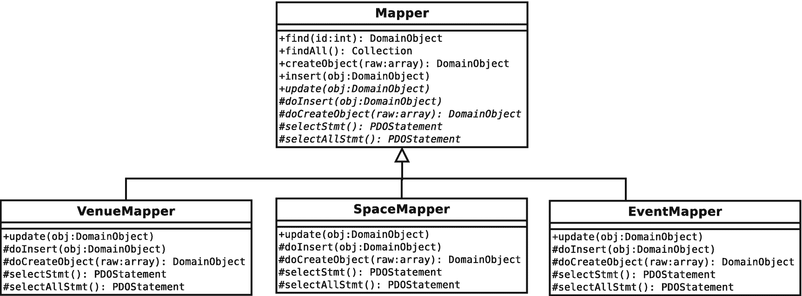
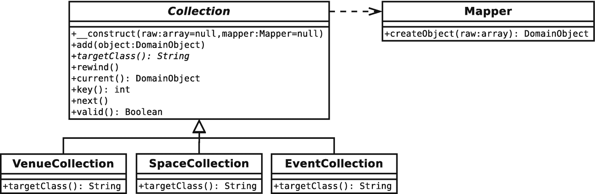
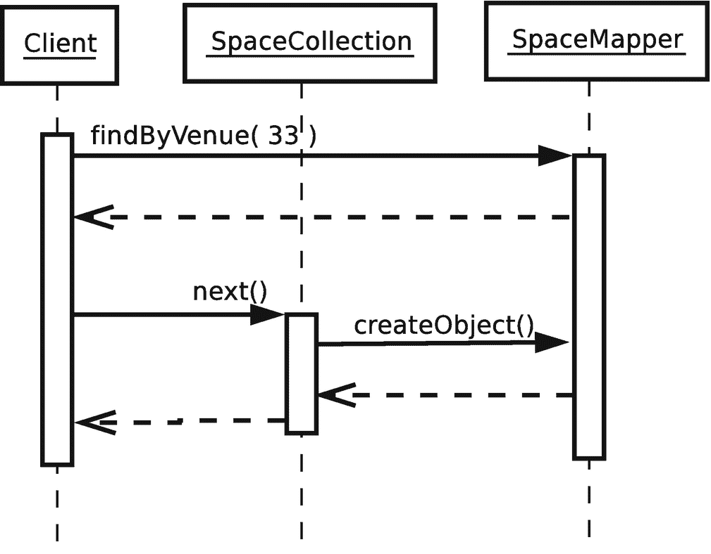
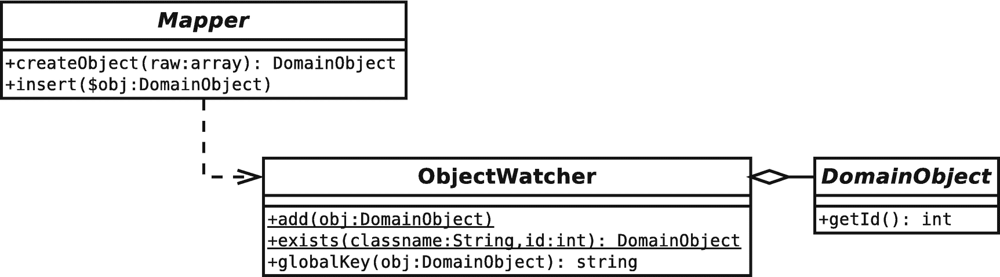
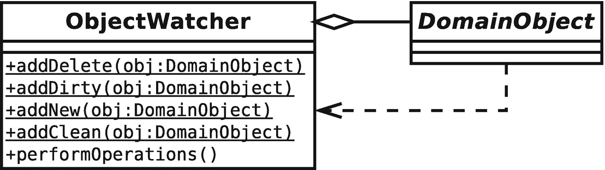
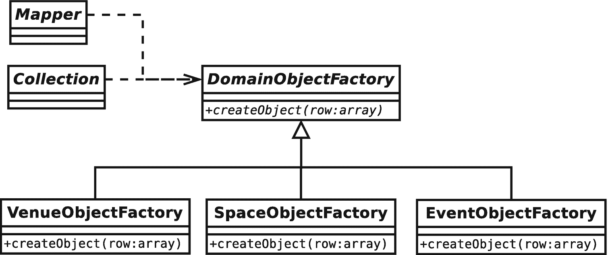
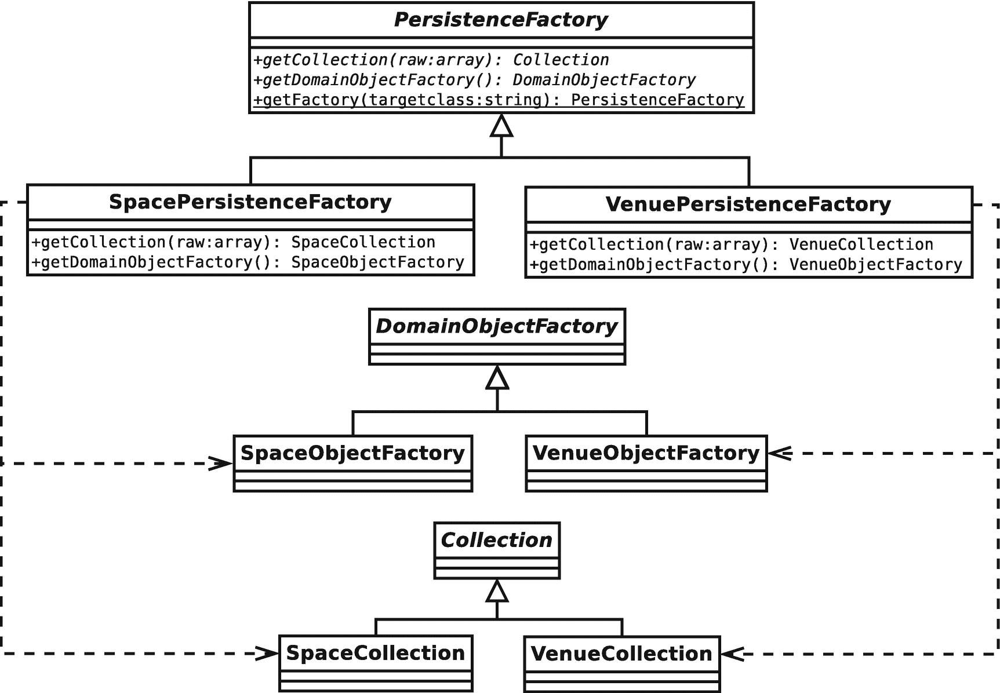
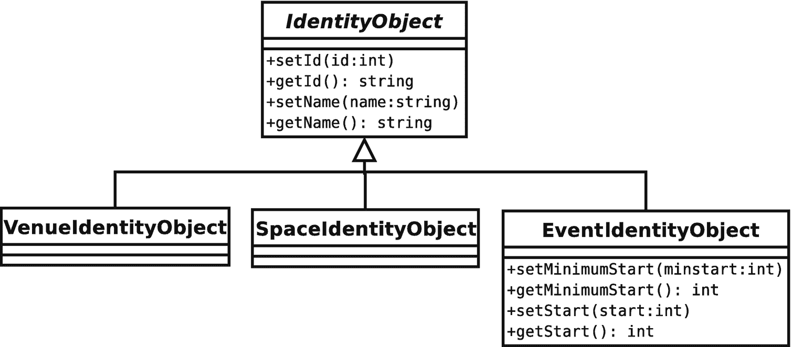
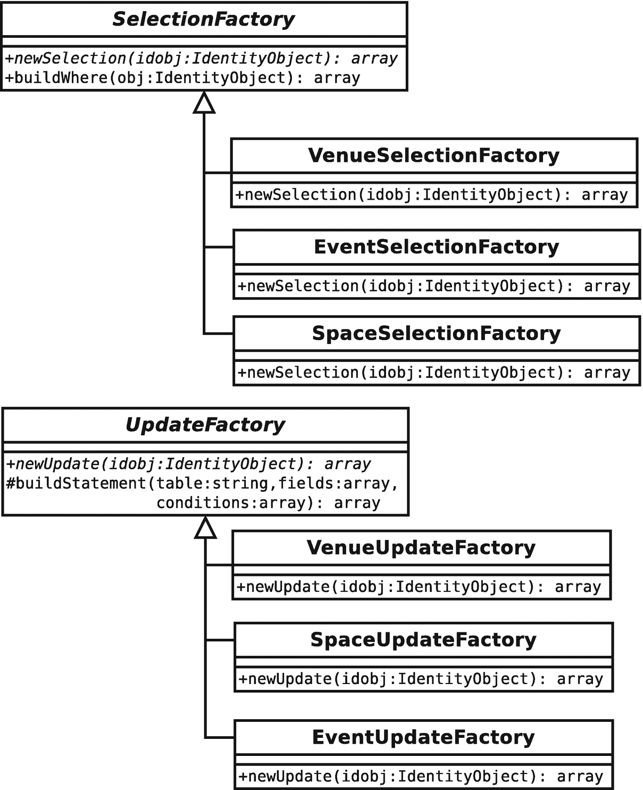
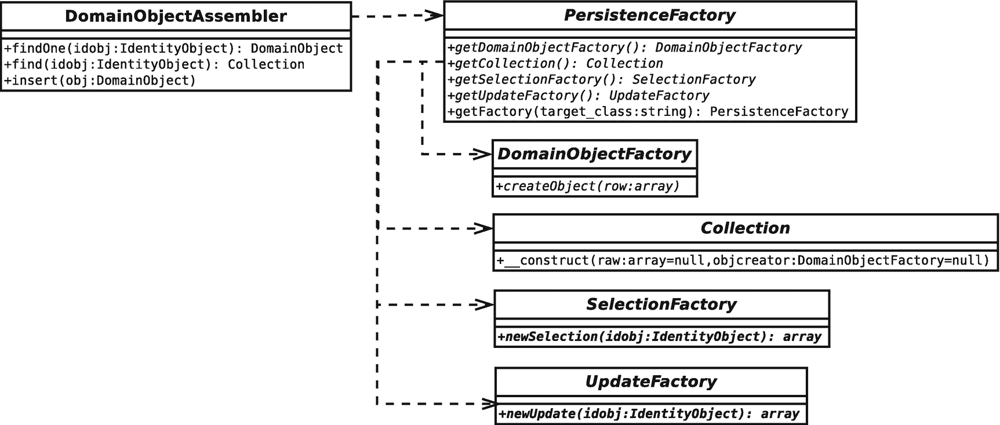

# 十三、数据库模式

大多数复杂的 web 应用或多或少都会处理持久性。商店必须召回他们的产品和顾客记录。游戏必须记住他们的玩家和游戏的状态。社交网站必须记录你的 238 个朋友，以及你对上世纪八九十年代男子乐队莫名其妙的喜爱。无论应用是什么，它都有可能在幕后记分。在这一章中，我看了一些有帮助的模式。

本章将涵盖以下内容:

*   *数据层接口*:定义存储层和系统其余部分之间接触点的模式

*   *对象观察*:跟踪对象，避免重复，自动保存和插入操作

*   *灵活的查询*:允许您的客户端编码人员在不考虑底层数据库的情况下构建查询

*   *创建已发现对象的列表*:构建可迭代集合

*   *管理你的数据库组件*:抽象工厂模式的回归

## 数据层

在与客户的讨论中，通常是表示层占主导地位。字体、颜色和易用性是交谈的主要话题。在开发人员中，数据库常常显得很重要。我们关心的不是数据库本身；我们可以相信它的工作，除非我们非常不幸。不，是我们用来将数据库表的行和列转换成数据结构的机制导致了问题。在这一章中，我将看看有助于这一过程的代码。

并非这里介绍的所有内容都位于数据层本身。相反，我将一些有助于解决持久性问题的模式进行了分组。Clifton Nock、Martin Fowler 和 Alur 等人描述了所有这些模式。

## 数据映射器

如果你认为我在第 [12 章](12.html)的“域模型”一节中掩盖了从数据库中保存和检索`Venue`对象的问题，这里你至少可以找到一些答案。数据映射器模式在几个地方被描述为数据访问对象。首先，它被 Alur 等人在*核心 J2EE 模式:最佳实践和设计策略* (Prentice Hall，2001)中涉及。Martin Fowler 在*企业应用架构模式*中也谈到了这一点(Addison-Wesley Professional，2002)。请注意，数据访问对象并不完全匹配数据映射器模式，因为它会生成数据传输对象；但是因为这些物体被设计成如果你加水就会变成真实的东西，所以图案足够接近。

正如您所想象的，数据映射器是一个负责处理从数据库到对象的转换的类。

### 问题

对象的组织方式不同于关系数据库中的表。如您所知，关系数据库表是由行和列组成的网格。一行可能通过外键与不同(甚至相同)表中的另一行相关。另一方面，对象倾向于更加有机地相互关联。一个对象可能包含另一个对象，不同的数据结构将以不同的方式组织相同的对象，在运行时以新的关系组合和重组对象。关系数据库被优化来管理大量的表格数据，而类和对象封装了较小的集中信息块。

类和关系数据库之间的这种脱节通常被描述为对象-关系阻抗不匹配(或简称为阻抗不匹配)。

那么，如何实现这种转变呢？一个答案是让一个类(或一组类)负责这个问题，有效地对领域模型隐藏数据库，并管理翻译中不可避免的粗糙边缘。

### 履行

尽管通过仔细的编程，创建一个单独的`Mapper`类来服务多个对象是可能的，但是在领域模型中看到一个单独的`Mapper`用于一个主要的类是很常见的。

图 [13-1](#Fig1) 显示了三个具体的`Mapper`类和一个抽象超类。



图 13-1

映射器类

事实上，因为`Space`对象实际上从属于`Venue`对象，所以有可能将`SpaceMapper`类分解到`VenueMapper`中。为了这些练习，我将把它们分开。

如您所见，这些类提供了保存和加载数据的常见操作。基类存储通用功能，将处理特定于对象的操作的责任委托给其子类。通常，这些操作包括实际的对象生成和为数据库操作构造查询。

基类经常在操作之前或之后执行内务处理，这就是为什么模板方法被用于显式委托(例如，从像`insert()`这样的具体方法到像`doInsert()`这样的抽象方法的调用，等等)。).实现决定了哪些基类方法以这种方式具体化，你将在本章后面看到。

下面是一个`Mapper`基类的简化版本:

```php
// listing 13.01
abstract class Mapper
{
    protected \PDO $pdo;

    public function __construct()
    {
        $reg = Registry::instance();
        $this->pdo = $reg->getPdo();
    }

    public function find(int w0024;id): ?DomainObject
    {
        $this->selectstmt()->execute([$id]);
        $row = $this->selectstmt()->fetch();
        $this->selectstmt()->closeCursor();

        if (! is_array($row)) {
            return null;
        }

        if (! isset($row['id'])) {
            return null;
        }

        $object = $this->createObject($row);

        return $object;
    }

    public function createObject(array $raw): DomainObject
    {
        $obj = $this->doCreateObject($raw); return $obj;
    }

    public function insert(DomainObject $obj): void
    {
        $this->doInsert($obj);
    }

    abstract public function update(DomainObject $obj): void;
    abstract protected function doCreateObject(array $raw): DomainObject;
    abstract protected function doInsert(DomainObject $object): void;
    abstract protected function selectStmt(): \PDOStatement;
    abstract protected function targetClass(): string;
}

```

构造函数方法使用一个`Registry`来获得一个 PDO 对象。对于这样的类，注册中心确实显示了它的价值。从控制层到`Mapper`并不总是有一条合理的路径可以传递数据。管理映射器创建的另一种方式是将它交给`Registry`类本身。与其实例化它，映射器会期望*提供给*一个 PDO 对象作为构造函数参数:

```php
// listing 13.02
abstract class Mapper
{
    public function __construct(protected \PDO $pdo)
    {
    }
}

```

客户端代码将使用诸如`getVenueMapper()`之类的方法从`Registry`获取一个新的`VenueMapper`。这将实例化一个映射器，同时生成 PDO 对象。对于后续请求，该方法将返回缓存的映射器。因为它允许我让映射者不知道配置的复杂性(即使有注册中心作为门面)，后一种方法是我通常选择的方法。

回到`Mapper`类，`insert()`方法除了委托给`doInsert()`之外什么也不做。如果不是因为我知道这里使用的实现在适当的时候会有用，我会选择抽象的`insert()`方法。

`find()`负责调用准备好的语句(由实现的子类提供)并获取行数据。它通过调用`createObject()`结束。当然，将数组转换成对象的细节会因情况而异，所以实现由抽象的`doCreateObject()`方法处理。再一次，`createObject()`似乎什么也不做，只是委托给子实现；再一次，我将很快添加内务处理，使模板方法模式的使用值得麻烦。

子类还将实现根据特定标准查找数据的定制方法(例如，我将想要定位属于`Venue`对象的`Space`对象)。

你可以从孩子的角度来看看这个过程:

```php
// listing 13.03
class VenueMapper extends Mapper
{
    private \PDOStatement $selectStmt;
    private \PDOStatement $updateStmt;
    private \PDOStatement $insertStmt;

    public function __construct()
    {
        parent:: __construct();
        $this->selectStmt = $this->pdo->prepare(
            "SELECT * FROM venue WHERE id=?"
        );

        $this->updateStmt = $this->pdo->prepare(
            "UPDATE venue SET name=?, id=? WHERE id=?"
        );

        $this->insertStmt = $this->pdo->prepare(
            "INSERT INTO venue ( name ) VALUES( ? )"
        );
    }

    protected function targetClass(): string
    {
        return Venue::class;
    }

    public function getCollection(array $raw): VenueCollection
    {
        return new VenueCollection($raw, $this);
    }

    protected function doCreateObject(array $raw): Venue
    {
        $obj = new Venue(
            (int)$raw['id'],

            $raw['name']
        );

        return $obj;
    }

    protected function doInsert(DomainObject $obj): void
    {
        $values = [$obj->getName()];
        $this->insertStmt->execute($values);
        $id = $this->pdo->lastInsertId();
        $obj->setId((int)$id);
    }

    public function update(DomainObject $obj): void
    {
        $values = [
            $obj->getName(),
            $obj->getId(),
            $obj->getId()
        ];

        $this->updateStmt->execute($values);
    }

    public function selectStmt(): \PDOStatement
    {
        return $this->selectStmt;
    }

}

```

这个类再一次被剥夺了一些即将到来的好东西。尽管如此，它完成了它的工作。构造函数准备了一些 SQL 语句供以后使用。

Note

注意，在`VenueMapper`中，`doCreateObject()`声明了它的返回类型`Venue`，而不是父`Mapper`类中指定的`DomainObject`。同样的道理也适用于`getCollection()`，它在这里声明了`VenueCollection`，而不是在`Mapper`类中指定的更通用的返回类型`Collection`。这是 PHP 7.4 中引入的*返回类型协方差*的一个例子，它允许你在子类中声明更专门化的返回类型。

父类`Mapper`实现`find()`，后者调用`selectStmt()`来获取准备好的`SELECT`语句。假设一切顺利，`Mapper`调用`VenueMapper::doCreateObject()`。在这里，我使用关联数组来生成一个`Venue`对象。

从客户的角度来看，这个过程本身很简单:

```php
// listing 13.04
$mapper = new VenueMapper();
$venue = $mapper->find(2);
print_r($venue);

```

对`print_r()`的调用是确认`find()`成功的快速方法。在我的系统中(在 ID 为`2`的`venue`表中有一行)，这个片段的输出如下:

```php
popp\ch13\batch01\Venue Object
(
    [name:popp\ch13\batch01\Venue:private] => The Likey Lounge
    [spaces:popp\ch13\batch01\Venue:private] =>
    [id:popp\ch13\batch01\DomainObject:private] => 2
)

```

`doInsert()`和`update()`方法与`find()`建立的过程相反。每个都接受一个`DomainObject`，从中提取行数据，并使用结果信息调用`PDOStatement::execute()`。注意，`doInsert()`方法在所提供的对象上设置了一个 ID。请记住，在 PHP 中对象是通过引用传递的，因此客户端代码将通过自己的引用看到这种变化。

另一件要注意的事情是`doInsert()`和`update()`并不是真正的类型安全。他们会毫无怨言地接受任何`DomainObject`子类。您应该执行一个`instanceof`测试，如果传递了错误的对象，就抛出一个`Exception`。

同样，这是一个关于插入和更新的客户端视角:

```php
// listing 13.05
$mapper = new VenueMapper();
$venue = new Venue(-1, "The Likey Lounge");
// add the object to the database
$mapper->insert($venue);
// find the object again – just to prove it works!
$venue = $mapper->find($venue->getId());
print_r($venue);
// alter our object
$venue->setName("The Bibble Beer Likey Lounge");
// call update to enter the amended data
$mapper->update($venue);
// once again, go back to the database to prove it worked
$venue = $mapper->find($venue->getId());
print_r($venue);

```

为什么我对我希望添加到数据库中的`Venue`对象的 id 使用了负值？正如你将在本章后面看到的，我使用这个约定来区分已经分配了数据库 id 的对象和没有分配的对象。`VenueMapper::doInsert()`不检查 id——它只是使用地点的名称创建一个新行，然后在提供的`Venue`对象上设置生成的数据库 id。下面是 doInsert()方法:

```php
// listing 13.06
protected function doInsert(DomainObject $obj): void
{
    $values = [$obj->getName()];
    $this->insertStmt->execute($values);
    $id = $this->pdo->lastInsertId();
    $obj->setId((int)$id);
}

```

#### 处理多行

`find()`方法非常简单，因为它只需要返回一个对象。但是，如果需要从数据库中提取大量数据，该怎么办呢？您的第一个想法可能是返回一个对象数组。这是可行的，但是这种方法有一个主要问题。

如果返回一个数组，集合中的每个对象都需要首先实例化，如果结果集有 1000 个对象，这可能是不必要的开销。另一种方法是简单地返回一个数组，让调用代码挑选出对象实例。这是可能的，但是这违背了`Mapper`类的真正目的。

有一种方法可以让你鱼与熊掌兼得。可以使用内置的`Iterator`接口。

`Iterator`接口需要实现类来定义查询列表的方法。如果你这样做，你的类可以像数组一样在`foreach`循环中使用。

表 [13-1](#Tab1) 显示了`Iterator`接口需要的方法。

表 13-1

迭代器接口定义的方法

<colgroup><col class="tcol1 align-left"> <col class="tcol2 align-left"></colgroup> 
| 

名字

 | 

描述

 |
| --- | --- |
| `rewind()` | 将指针发送到列表的开头 |
| `current()` | 返回当前指针位置的元素 |
| `key()` | 返回当前键(即指针值) |
| `next()` | 向前移动指针 |
| `valid()` | 确认在当前指针位置有一个元素 |

为了实现一个`Iterator`，你需要实现它的方法并跟踪你在数据集中的位置。您如何获取、排序或过滤数据对客户端是隐藏的。

下面是一个`Iterator`实现，它包装了一个数组，但也在其构造函数中接受了一个`Mapper`对象，原因很明显:

```php
// listing 13.07
abstract class Collection implements \Iterator
{
    protected int $total = 0;
    private int $pointer = 0;
    private array $objects = [];

    public function __construct(protected array $raw = [], protected ?Mapper $mapper = null)
    {
        $this->total = count($raw);
        if (count($raw) &&  is_null($mapper)) {
            throw new AppException("need Mapper to generate objects");
        }
    }

    public function add(DomainObject $object): void
    {
        $class = $this->targetClass();

        if (! ($object instanceof $class)) {
            throw new AppException("This is a {$class} collection");
        }

        $this->notifyAccess();
        $this->objects[$this->total] = $object;
        $this->total++;
    }

    abstract public function targetClass(): string;

    protected function notifyAccess(): void
    {
        // deliberately left blank!
    }

    private function getRow(int $num): ?DomainObject
    {
        $this->notifyAccess();

        if ($num >= $this->total || $num < 0) {

            return  null;
        }

        if (isset($this->objects[$num])) {
            return $this->objects[$num];
        }

        if (isset($this->raw[$num])) {
            $this->objects[$num] = $this->mapper->createObject($this->raw[$num]);

            return $this->objects[$num];
        }

        return null;
    }

    public function rewind(): void
    {
        $this->pointer = 0;
    }

    public function current(): ?DomainObject
    {
        return $this->getRow($this->pointer);
    }

    public function key(): mixed
    {
        return $this->pointer;
    }

    public function next(): void
    {
        $row = $this->getRow($this->pointer);

        if (! is_null($row)) {
            $this->pointer++;
        }
    }

    public function valid(): bool
    {
        return (! is_null($this->current()));
    }
}

```

构造函数期望不带参数或带两个参数(最终可能转换为对象的原始数据和映射器引用)被调用。

假设客户端已经设置了`$raw`参数(这将是一个执行此操作的`Mapper`对象)，它将与所提供的数据集的大小一起存储在一个属性中。如果提供了原始数据，还需要一个`Mapper`的实例，因为它会将每一行转换成一个对象。

如果没有参数传递给构造函数，类开始时为空；但是，请注意，`add()`方法可用于添加到集合中。

该类维护两个数组:`$objects`和`$raw`。如果客户端请求一个特定的元素，`getRow()`方法首先在`$objects`中查看它是否已经实例化了一个元素。如果是，则返回。否则，该方法在`$raw`中查找行数据。`$raw`只有当`Mapper`对象也存在时，数据才存在，因此相关行的数据可以传递给前面遇到的`Mapper::createObject()`方法。这将返回一个`DomainObject`对象，该对象缓存在带有相关索引的`$objects`数组中。新创建的`DomainObject`对象返回给用户。

该类的其余部分是对`$pointer`属性的简单操作和对`getRow()`的调用。它还包括`notifyAccess()`方法，当您遇到惰性加载模式时，这将变得很重要。

你可能已经注意到了`Collection`类是抽象的。您需要为每个域类提供特定的实现:

```php
// listing 13.08
class VenueCollection extends Collection
{
    public function targetClass(): string
    {
        return Venue::class;
    }
}

```

`VenueCollection`类只是扩展了`Collection`并实现了一个`targetClass()`方法。这与超类的`add()`方法中的类型检查一起，确保了只有`Venue`对象可以添加到集合中。如果你想更安全的话，你也可以在构造函数中提供额外的检查。

注意，我使用了`::class`语法来获得类的完全限定的字符串表示。这个特性是从 PHP 5.5 开始才有的。在此之前，我必须小心地自己提供完整的`namespace`路径。

显然，这个类应该只与一个`VenueMapper`一起工作。但是，实际上，这是一个相当类型安全的集合，尤其是就域模型而言。

当然，`Event`和`Space`对象也有并行类。图 [13-2](#Fig2) 显示了一些`Collection`类。



图 13-2

使用集合管理多行

因为域模型需要实例化`Collection`对象，并且因为我可能需要在某个时候切换实现(特别是出于测试目的)，所以我在注册表中提供了方便的 getter 方法来获取空集合。随着系统的增长，您可以将其委托给专门的工厂。不过，在开发过程中，我倾向于从最简单的方法开始，默认使用注册表来创建大多数对象。下面是我如何得到一个空的`VenueCollection`对象:

```php
// listing 13.09
$reg = Registry::instance();

$collection = $reg->getVenueCollection();
$collection->add(new  Venue(-1, "Loud  and  Thumping"));
$collection->add(new  Venue(-1, "Eeezy"));
$collection->add(new  Venue(-1, "Duck  and  Badger"));

foreach ($collection as $venue) {
    print $venue->getName() . "\n";
}

```

同样，在这个例子中，我使用了一个惯例，即对于一个还没有添加到数据库中的对象，我使用的 id 是–1。`Collection`对象不关心它的`DomainObject`成员是否已经被插入。

有了我在这里构建的实现，您就没有什么可以对这个集合做的了；然而，添加`elementAt()`、`deleteAt()`、`count()`以及类似的方法是一个微不足道的练习。(也很好玩！好好享受！)

##### 使用生成器代替迭代器接口

尽管实现一个`Iterator`接口并不难，但却是一件苦差事。从 PHP 5.5 开始，您可以使用一种更简单的(通常内存效率更高的)机制，称为*生成器*。生成器是一个可以返回多个值的函数，通常在一个循环中。一个生成器函数将使用`yield`，而不是使用`return`关键字。当 PHP 处理器在一个函数中看到`yield`时，它将返回一个`Generator`类型的`Iterator`给调用代码。这个新对象可以像任何`Iterator`一样对待。巧妙的是，使用`yield`产生一个值的循环将继续运行，但只是在`Generator`被要求下一个()值时。实际上，流程看起来是这样的:

*   客户端代码调用一个生成器函数(一个包含`yield`关键字的函数)。

*   生成器函数包含一个通过 yield 返回多个值的循环或重复过程。遇到 yield 时，PHP 处理器创建一个`Generator`对象，并将其返回给客户端代码。

*   发生器功能中的重复过程暂时冻结在这一点上。

*   客户端代码接受这个`Generator`，并像对待任何一个`Iterator`一样对待它——很可能将它传递给`foreach`。

*   随着`foreach`的每次迭代，`Generator`对象从生成器函数中获取下一个值。

所以我可以为我的`Collection`基类使用这个特性。因为生成器函数(或方法)返回一个`Generator`,`Collection`本身将不再是可迭代的——相反，我将使用一个生成器方法作为工厂:

```php
// listing 13.10
abstract class GenCollection
{
    protected int $total = 0;
    private array $objects = [];

    public function __construct(protected array $raw = [], protected ?Mapper $mapper = null)
    {
        $this->total = count($raw);

        if (count($raw) && is_null($mapper)) {
            throw new AppException("need Mapper to generate objects");
        }
    }

    public function add(DomainObject $object): void
    {
        $class = $this->targetClass();

        if (! ($object instanceof $class )) {
            throw new AppException("This is a {$class} collection");
        }

        $this->notifyAccess();
        $this->objects[$this->total] = $object;
        $this->total++;
    }

    public function getGenerator(): \Generator
    {
        for ($x = 0; $x < $this->total; $x++) {
             yield $this->getRow($x);
        }
    }

    abstract public function targetClass(): string;

    protected function notifyAccess(): void
    {
        // deliberately left blank!
    }

    private function getRow(int $num): ?DomainObject
    {
        $this->notifyAccess();

        if ($num >= $this->total || $num < 0) {
            return null;
        }

        if (isset($this->objects[$num])) {
            return $this->objects[$num];
        }

        if (isset($this->raw[$num])) {
            $this->objects[$num] = $this->mapper->createObject($this->raw[$num]);
            return $this->objects[$num];
        }

        return null;
    }
}

```

如您所见，这使得基类更加紧凑。我已经能够取消`current()`和`reset()`等等。一个缺点是`Collection`本身不能直接迭代。相反，客户端代码必须调用`getGenerator()`并迭代`yield`返回的`Generator`对象，如下所示:

```php
// listing 13.11
$genvencoll = new GenVenueCollection();
$genvencoll->add(new Venue(-1, "Loud and Thumping"));
$genvencoll->add(new Venue(-1, "Eeezy"));
$genvencoll->add(new Venue(-1, "Duck and Badger"));

$gen = $genvencoll->getGenerator();

foreach ($gen as $wrapper) {
    print_r($wrapper);
}

```

因为我不想在我的系统中增加这个额外的层，所以对于这个例子，我将坚持使用已实现的`Iterator`版本。然而，生成器确实是用最少的设置制作轻量级迭代器的好方法。

##### 获取集合对象

我们已经看到，我已经决定使用`Registry`作为收藏的工厂。我也用它来提供`Mapper`对象。代码如下:

```php
// listing 13.12

public function getVenueMapper(): VenueMapper
{
    return new VenueMapper();
}

public function getSpaceMapper(): SpaceMapper
{
    return new SpaceMapper();
}

public function getEventMapper(): EventMapper
{
    return new EventMapper();
}

public function getVenueCollection(): VenueCollection
{
    return new VenueCollection();
}

public function getSpaceCollection(): SpaceCollection
{
    return new SpaceCollection();
}

public function getEventCollection(): EventCollection
{
    return new EventCollection();
}

```

我开始打破`Registry`中的界限。再多几个 getter 方法，就该重构这段代码来使用抽象工厂模式了。不过，我把这个留给你(如果你需要提醒，请回到第 9 章)。

既然访问`Mapper`和`Collection`类如此容易，那么`Venue`类可以被扩展来管理`Space`对象的持久性。该类提供了将单个的`Space`对象添加到它的`SpaceCollection`或者切换到一个全新的`SpaceCollection`的方法:

```php
// listing 13.13

// Venue

public function getSpaces(): SpaceCollection
{
    if (is_null($this->spaces)) {
        $reg = Registry::instance();
        $this->spaces = $reg->getSpaceCollection();
    }

    return $this->spaces;
}

public function setSpaces(SpaceCollection $spaces): void
{
    $this->spaces = $spaces;
}

public function addSpace(Space $space): void
{
    $this->getSpaces()->add($space);
    $space->setVenue($this);
}

```

`setSpaces()`操作当前认为集合中的所有`Space`对象都引用当前的`Venue`。向方法中添加检查是非常容易的。这个版本保持事情简单。注意，我只在调用`getSpaces()`时实例化了`$spaces`属性。稍后，我将演示如何扩展这个惰性实例化来限制数据库请求。

`VenueMapper`需要为它创建的每个`Venue`对象设置一个`SpaceCollection`:

```php
// listing 13.14

// VenueMapper

protected function doCreateObject(array $raw): Venue
{
    $obj = new  Venue(
        (int)$raw['id'],
        $raw['name']
    );

    $spacemapper = new SpaceMapper();
    $spacecollection = $spacemapper->findByVenue($raw['id']);
    $obj->setSpaces($spacecollection);

    return $obj;
}

```

`VenueMapper::doCreateObject()`方法创建一个`SpaceMapper`并从中获取一个`SpaceCollection`。如您所见，`SpaceMapper`类实现了一个`findByVenue()`方法。这将我们带到生成多个对象的查询。为了简洁起见，我从最初的清单中为`woo\mapper\Mapper`省略了`Mapper::findAll()`方法。在这里，它被恢复了:

```php
// listing 13.15

// Mapper

public function findAll(): Collection
{
    $this->selectAllStmt()->execute([]);

    return $this->getCollection(
        $this->selectAllStmt()->fetchAll()
    );
}

abstract protected function selectAllStmt(): \PDOStatement;
abstract protected function getCollection(array $raw): Collection;

```

这个方法调用一个子方法:`selectAllStmt()`。像`selectStmt()`一样，它应该包含一个准备好的语句对象来获取表中的所有行。下面是在`SpaceMapper`类中创建的`PDOStatement`对象:

```php
// listing 13.16

// SpaceMapper::__construct()

$this->selectAllStmt = $this->pdo->prepare(
    "SELECT * FROM space"
);
$this->findByVenueStmt = $this->pdo->prepare(
    "SELECT * FROM space WHERE venue=?"
);

```

我在这里包含了另一个语句，`$findByVenueStmt`，它用于定位特定于个人`Venue`的`Space`对象。

`findAll()`方法调用另一个新方法`getCollection()`，向其传递找到的数据。这里是`SpaceMapper::getCollection()`:

```php
// listing 13.17
public function getCollection(array $raw): SpaceCollection
{
    return new SpaceCollection($raw, $this);
}

```

完整版本的`Mapper`类应该将`getCollection()`和`selectAllStmt()`声明为抽象方法，这样所有的映射器都能够返回包含它们的持久域对象的集合。然而，为了获得属于`Venue`的`Space`对象，我需要一个更有限的集合。您已经看到了用于获取数据的准备好的语句；现在，这里是生成集合的`SpaceMapper::findByVenue()`方法:

```php
// listing 13.18
public function findByVenue($vid): SpaceCollection
{
    $this->findByVenueStmt->execute([$vid]);

    return new SpaceCollection($this->findByVenueStmt->fetchAll(), $this);
}

```

除了使用的 SQL 语句之外，`findByVenue()`方法与`findAll()`相同。回到`VenueMapper`，结果集合通过`Venue::setSpaces()`设置在`Venue`对象上。

所以`Venue`对象现在是从数据库中新鲜到达的，所有的`Space`对象都在一个整洁的类型安全列表中。该列表中的对象在被请求之前都不会被实例化。

图 [13-3](#Fig3) 显示了客户端类获取`SpaceCollection`的过程，以及`SpaceCollection`类如何与`SpaceMapper::createObject()`交互，将其原始数据转换成返回给客户端的对象。



图 13-3

获取 shapecollection 并使用它来获取空间对象

### 结果

我采用的将`Space`对象添加到`Venue`对象的方法的缺点是，我必须两次访问数据库。在大多数情况下，我认为这是值得付出的代价。另外，请注意在`VenueMapper::doCreateObject()`获取正确填充的`SpaceCollection`的工作可以转移到`Venue::getSpaces()`，这样辅助数据库连接将只在需要时发生。这种方法可能是这样的:

```php
// listing 13.19

// Venue

public function getSpaces2(): SpaceCollection
{
    if (is_null($this->spaces)) {
        $reg = Registry::instance();
        $finder = $reg->getSpaceMapper();
        $this->spaces = $finder->findByVenue($this->getId());
    }

    return $this->spaces;
}

```

然而，如果效率成为一个问题，那么将`SpaceMapper`完全分解出来并使用 SQL join 一次性检索您需要的所有数据应该是足够容易的。

当然，您的代码可能会因此变得不那么可移植，但是效率优化总是要付出代价的！

最终，您的`Mapper`类的粒度会有所不同。如果一个对象类型由另一个单独存储，那么你可以考虑只为容器设置一个`Mapper`。

这种模式的强大之处在于它在领域层和数据库之间实现了强有力的解耦。对象承担了幕后的压力，并能适应各种关系扭曲。

也许这种模式最大的缺点是创建具体的`Mapper`类所涉及的大量繁重工作。然而，有大量的样板代码可以自动生成。为`Mapper`类生成公共方法的一种简洁方式是通过反射。您可以查询一个域对象，发现它的 setter 和 getter 方法(可能与一个参数命名约定一起)，并生成基本的`Mapper`类以备修改。这就是本章介绍的所有`Mapper`类最初是如何产生的。

使用 mappers 需要注意的一个问题是一次加载太多对象的危险。然而,`Iterator`实现在这里帮助了我们。因为一个`Collection`对象最初只保存行数据，所以只有当一个特定的`Venue`被访问并从数组转换为对象时，才会发出第二个请求(对一个`Space`对象)。正如您将看到的，这种形式的延迟加载还可以进一步增强。

你应该小心波纹负载。创建映射器时要注意，使用另一个映射器来获取对象的属性可能只是冰山一角。这个二级映射器本身可以在构造它自己的对象时使用更多。如果不小心的话，您可能会发现表面上看似简单的查找操作引发了数十个其他类似的操作。

您还应该了解您的数据库应用为构建高效查询而制定的任何准则，并准备好进行优化(如果需要，在逐个数据库的基础上)。适用于多个数据库应用的 SQL 语句很好；快速应用更好。虽然引入条件(或策略类)来管理相同查询的不同版本是一件麻烦的事情，并且在前一种情况下可能是丑陋的，但是不要忘记所有这些肮脏的优化都巧妙地隐藏在客户端代码之外。

## 身份地图

你还记得 PHP 4 中传值错误的噩梦吗？当你认为指向同一个对象的两个变量结果指向不同但非常相似的对象时，随之而来的纯粹的混乱？噩梦又回来了。

### 问题

下面是为测试数据映射器示例而创建的一些测试代码的变体:

```php
// listing 13.20
$mapper = new VenueMapper();

$venue = new Venue(-1, "The Likey Lounge");
$mapper->insert($venue);

$venue1 = $mapper->find($venue->getId());
$venue2 = $mapper->find($venue->getId());

$venue1->setName("The Something Else");
$venue2->setName("The Bibble Beer Likey Lounge");

print $venue->getName() . "\n";
print $venue1->getName() . "\n";
print $venue2->getName() . "\n";

```

原始代码的目的是演示添加到数据库中的对象也可以通过`Mapper`提取，并且是相同的。完全相同，也就是说，除了与*同一个*物体之外，其他方面都完全相同。在这里，我通过使用三个版本的`Venue`——一个原始版本和从数据库中提取的两个实例，使问题变得明显。我修改了新实例的名称，并输出了所有三个名称。以下是我的输出:

```php
The Likey Lounge
The Something Else
The Bibble Beer Likey Lounge

```

请记住，我使用的约定是，一个全新的`DomainObject`(即数据库中尚不存在的)应该用一个–1 id 值进行实例化。多亏了`VenueMapper::insert()`方法，我的初始`Venue`对象将被数据库自动生成的 id 值更新。

我通过将新的`Venue`对象分配给旧的对象来回避这个问题，所以我没有以多个类似克隆的对象结束。不幸的是，你并不总是能控制局面。在一个*单个*请求中，同一个对象可能在不同的时间被引用。如果您修改了它的一个版本并保存到数据库中，您能确定对象的另一个版本(可能已经存储在一个`Collection`对象中)不会覆盖您的修改吗？

重复的对象不仅在系统中有风险，它们也代表了相当大的开销。一些流行的对象可能在一个进程中被加载三次或四次，除了一次之外，所有这些对数据库的访问都是完全多余的。

幸运的是，解决这个问题相对简单。

### 履行

身份映射只是一个对象，它的任务是跟踪系统中的所有对象，从而有助于确保本应是一个对象的对象不会变成两个。

```php
// listing 13.21
class ObjectWatcher

{
    private array $all = [];
    private static ?ObjectWatcher $instance = null;

    private function __construct()
    {
    }
    public static function instance(): self
    {
        if (is_null(self::$instance)) {
            self::$instance = new ObjectWatcher();
        }

        return self::$instance;
    }

    public function globalKey(DomainObject $obj): string
    {
        return  get_class($obj) . "." . $obj->getId();
    }

    public static function add(DomainObject $obj): void
    {
        $inst = self::instance();
        $inst->all[$inst->globalKey($obj)] = $obj;
    }

    public static function exists(string $classname, int $id): ?DomainObject
    {
        $inst = self::instance();
        $key = "{$classname} . {$id}";

        if (isset($inst->all[$key])) {
            return $inst->all[$key];
        }

        return null;
    }
}

```

图 [13-4](#Fig4) 展示了一个身份映射对象如何与你见过的其他类集成。



图 13-4

身份地图

很明显，身份地图的主要技巧是识别物体。这意味着您需要以某种方式标记每个对象。您可以在这里采取许多不同的策略。系统中所有对象已经使用的数据库表键不好，因为不能保证 ID 在所有表中是唯一的。

您还可以使用数据库来维护一个全局键表。每次创建一个对象时，都要迭代键表的运行总数，并将全局键与其所在行中的对象相关联。这样做的开销相对较小，而且很容易做到。

如你所见，我选择了一种更简单的方法。我将对象的类名与其表 ID 连接起来。不能有两个 ID 为 4 的类型为`popp\ch13\batch03\Event`的对象，所以我的键`popp\ch13\batch03\Event.4`对于我的目的来说足够安全。

`globalKey()`方法处理这方面的细节。该类提供了一个用于添加新对象的`add()`方法。在一个数组属性中，每个对象都用其唯一的键标记，`$all`。

`exists()`方法接受一个类名和一个`$id`而不是一个对象。我不想必须实例化一个对象来查看它是否已经存在！该方法从该数据构建一个键，并检查它是否索引了`$all`属性中的一个元素。如果找到了一个对象，就适时地返回一个引用。

我只在一个类中使用了作为身份映射的`ObjectWatcher`类。`Mapper`类提供了生成对象的功能，所以在那里添加检查是有意义的:

```php
// listing 13.22

// Mapper

public function find(int $id): ?DomainObject
{
    $old = $this->getFromMap($id);

    if (! is_null($old)) {
        return $old;
    }

    // work with db return $object;
}

abstract protected function targetClass(): string;

private function getFromMap($id): ?DomainObject
{
    return ObjectWatcher::exists(
        $this->targetClass(),
        $id
    );
}

private function addToMap(DomainObject $obj): void
{
    ObjectWatcher::add($obj);
}

public function createObject($raw): ?DomainObject
{
    $old = $this->getFromMap((int)$raw['id']);

    if (! is_null($old)) {
        return $old;
    }

    $obj = $this->doCreateObject($raw);
    $this->addToMap($obj);

    return $obj;
}

public function insert(DomainObject $obj): void
{
    $this->doInsert($obj);
    $this->addToMap($obj);
}

```

该类提供了两个方便的方法:`addToMap()`和`getFromMap()`。这些让我免去了记住静态调用`ObjectWatcher`的完整语法的麻烦。更重要的是，它们向下调用子实现(例如，`VenueMapper`)来获取当前等待实例化的类的名称。

这是通过调用`targetClass()`实现的，这是一个由所有具体的`Mapper`类实现的抽象方法。它应该返回`Mapper`设计用来生成的类名。下面是`SpaceMapper`类对`targetClass()`的实现:

```php
// listing 13.23

// SpaceMapper

protected function targetClass(): string
{
    return Space::class;
}

```

`find()`和`createObject()`首先通过将对象 ID 传递给`getFromMap()`来检查现有对象。如果找到一个对象，它被返回给客户端，方法执行结束。然而，如果还没有这个对象的版本，那么对象实例化继续进行。在`createObject()`中，新对象被传递给`addToMap()`以防止将来发生任何冲突。

那么为什么我要两次经历这个过程的一部分，在`find()`和`createObject()`中都调用`getFromMap()`？答案就在`Collections`身上。当这些生成对象时，它们通过调用`createObject()`来实现。我需要确保由一个`Collection`对象封装的行没有过时，并确保将对象的最新版本返回给用户。

### 结果

只要在从数据库生成对象或向数据库添加对象的所有上下文中使用身份映射，在您的流程中出现重复对象的可能性几乎为零。

当然，这只在您的流程中*有效。不同的进程将不可避免地同时访问同一对象的不同版本。考虑并发访问导致数据损坏的可能性非常重要。如果有严重的问题，您可能需要考虑锁定策略。您还可以考虑将对象存储在共享内存中，或者使用 Memcached 之类的外部对象缓存系统。你可以在 [`https://memcached.org/`](https://memcached.org/) 了解 Memcached，在 [`https://www.php.net/memcache`](https://www.php.net/memcache) 了解 PHP 对它的支持。*

## 工作单位

你什么时候保存你的物品？直到我发现了工作单元模式(由 David Rice 在 Martin Fowler 的*企业应用架构模式*中撰写)，我在完成一个命令时从表示层发出保存命令。这被证明是一个昂贵的设计决策。

工作单元模式帮助您只保存那些需要保存的对象。

### 问题

有一天，我在浏览器窗口中回显我的 SQL 语句来跟踪一个问题，结果大吃一惊。我发现我在同一个请求中一遍又一遍地保存相同的数据。我有一个整洁的复合命令系统，这意味着一个命令可能会触发其他几个命令，并且每个命令都会自动清理。

我不仅保存了同一个对象两次，还保存了不需要保存的对象。

因此，这个问题在某些方面类似于身份图解决的问题。这个问题包括不必要的对象加载；这个问题存在于过程的另一端。正如这些问题是相辅相成的，解决方案也是如此。

### 履行

为了确定需要什么样的数据库操作，您需要跟踪发生在对象身上的各种事件。也许最好的地方是在物品本身。

您还需要维护为每个数据库操作(即插入、更新、删除)安排的对象列表。这里我只讨论插入和更新操作。哪里是存储对象列表的好地方？碰巧我已经有了一个`ObjectWatcher`对象，所以我可以进一步开发它:

```php
// listing 13.24
// ObjectWatcher
private array $all = [];
private array $dirty = [];
private array $new = [];
private array $delete = []; // unused in this example
private static ?ObjectWatcher $instance = null;

public static function addDelete(DomainObject $obj): void
{
    $inst = self::instance();
    $inst->delete[$inst->globalKey($obj)] = $obj;
}

public static function addDirty(DomainObject $obj): void
{
    $inst = self::instance();

    if (! in_array($obj, $inst->new, true)) {
        $inst->dirty[$inst->globalKey($obj)] = $obj;
    }
}

public static function addNew(DomainObject $obj): void
{
    $inst = self::instance();
    // we don't yet have an id
    $inst->new[] = $obj;
}

public static function addClean(DomainObject $obj): void
{
    $inst = self::instance();
    unset($inst->delete[$inst->globalKey($obj)]);
    unset($inst->dirty[$inst->globalKey($obj)]);
    $inst->new = array_filter(
        $inst->new,
        function ($a) use ($obj) {
            return !($a === $obj);
        }
    );
}

public function performOperations(): void
{
    foreach ($this->dirty as $key => $obj) {
        $obj->getFinder()->update($obj);
    }

    foreach ($this->new as $key => $obj) {
        $obj->getFinder()->insert($obj);
        print "inserting " . $obj->getName() . "\n";
    }

    $this->dirty = [];
    $this->new = [];
}

```

`ObjectWatcher`类仍然是一个身份映射，并通过`$all`属性继续提供跟踪系统中所有对象的功能。这个例子只是给类增加了更多的功能。

你可以在图 [13-5](#Fig5) 中看到`ObjectWatcher`类的工作单元方面。



图 13-5

ObjectWatcher 类中的工作单元方面

当对象在从数据库中提取后被更改时，它们被描述为“脏的”。脏对象存储在`$dirty`数组属性中(通过`addDirty()`方法),直到更新数据库的时候。客户端代码可能出于自身原因决定脏对象不应进行更新。它可以通过将脏对象标记为干净来确保这一点(通过`addClean()`方法)。正如您所料，一个新创建的对象应该被添加到`$new`数组中(通过`addNew()`方法)。该数组中的对象计划插入数据库。我没有在这些例子中实现删除功能，但是原理应该足够清楚了。

`addDirty()`和`addNew()`方法各自将一个对象添加到它们各自的数组属性中。然而，`addClean()`*从`$dirty`数组中移除*给定对象，将其标记为不再等待更新。

当最终需要处理存储在这些数组中的所有对象时，应该调用`performOperations()`方法(可能来自控制器类或其助手)。这个方法通过`$dirty`和`$new`数组循环，或者更新或者添加对象。

`ObjectWatcher`类现在提供了一种更新和插入对象的机制。客户端代码仍然缺少向`ObjectWatcher`对象添加对象的方法。

因为操作的是这些对象，所以它们可能最适合执行此通知。下面是我可以添加到`DomainObject`类中的一些实用方法——请特别注意构造函数方法:

```php
// listing 13.25
abstract class DomainObject
{
    public function __construct(private int $id = -1)
    {
        if ($id < 0) {
            $this->markNew();
        }
    }

    abstract public function getFinder(): Mapper;

    public function getId(): int
    {
        return $this->id;
    }

    public function setId(int $id): void
    {
        $this->id = $id;
    }

    public function markNew(): void
    {
        ObjectWatcher::addNew($this);
    }

    public function markDeleted(): void
    {
        ObjectWatcher::addDelete($this);
    }

    public function markDirty(): void
    {
        ObjectWatcher::addDirty($this);
    }

    public function markClean(): void
    {
        ObjectWatcher::addClean($this);
    }
}

```

如您所见，如果没有向当前对象传递`$id`属性，构造函数方法会将当前对象标记为新对象(通过调用`markNew()`)。

Note

请记住，对于未插入的数据库行，我们的约定是 id 为–1。这允许我们总是要求一个整数值，然后测试该值是否大于零，以确定行数据是否应该被视为新的。当然，您可以选择对新数据使用空值，并将`DomainObject`中的构造函数签名改为`private ?int $id = null`。

这可以称得上是一种魔法，应该谨慎对待。按照现在的情况，这段代码指定了一个新的对象插入数据库，而不需要对象创建者的任何干预。想象一下，你的团队中一个新的程序员编写了一个一次性的脚本来测试一些领域行为。那里没有持久性代码的迹象，所以一切都应该足够安全，不是吗？现在想象一下这些测试对象，可能有有趣的名字，正在进入持久存储。魔法很好，但清晰更好。最好要求客户端代码将某种标志传递到构造函数中，以便将新对象放入队列中进行插入。

我还需要给`Mapper`类添加一些代码:

```php
// listing 13.26

// Mapper

public function createObject($raw): DomainObject
{
    $old = $this->getFromMap($raw['id']);

    if (! is_null($old)) {
        return $old;
    }

    $obj = $this->doCreateObject($raw);
    $this->addToMap($obj);

    return $obj;
}

```

剩下唯一要做的事情是向域模型类中的方法添加`markDirty()`调用。请记住，脏对象是指从数据库中检索出来后发生了更改的对象。这是这种模式中有轻微鱼腥味的一个方面。显然，确保所有扰乱对象状态的方法都被标记为脏是很重要的，但是这项任务的手动性质意味着人为错误的可能性非常大。

下面是`Space`对象中调用`markDirty()`的一些方法:

```php
// listing 13.27

// Space

public function setVenue(Venue $venue): void
{
    $this->venue = $venue;
    $this->markDirty();
}

public function setName(string $name): void
{
    $this->name = $name;
    $this->markDirty();
}

```

下面是一些代码，用于向数据库添加新的`Venue`和`Space`，取自一个`Command`类:

```php
// listing 13.28

// a -1 id value represents a brand new Venue or Space
$venue = new Venue(-1, "The Green Trees");

$venue->addSpace(
    new Space(-1, 'The Space Upstairs')
);
$venue->addSpace(
    new Space(-1, 'The Bar Stage')
);
// this could be called from the controller or a helper class ObjectWatcher::instance()->performOperations();

```

我在`ObjectWatcher`中添加了一些调试代码，所以您可以看到在请求结束时发生了什么:

```php
inserting The Green Trees
inserting The Space Upstairs
inserting The Bar Stage

```

因为我的`Venue`和`Space`对象是用 ids 实例化的，所以它们被`DomainObject`视为新的。在内部，在每种情况下，域对象构造函数调用`DomainObject::markNew()`，然后调用`ObjectWatcher::addNew()`。当`ObjectWatcher::performOperations()`最终被调用时，这些对象被插入到数据库中(而不是在那里更新)，我的调试输出被触发。

因为高级控制器对象通常调用`performOperations()`方法，所以在大多数情况下，您需要做的只是创建或修改一个对象，工作类的单元(`ObjectWatcher`)将在请求结束时完成它的工作。

### 结果

这种模式非常有用，但是有几个问题需要注意。您需要确保所有的修改操作确实将有问题的对象标记为脏。不这样做可能会导致难以发现的错误。

您可能想看看测试修改对象的其他方法。反射听起来是一个不错的选择，但是您应该研究这种测试的性能含义——这种模式是为了提高效率，而不是破坏效率。

### 延迟加载

惰性加载是大多数 web 程序员很快就学会的核心模式之一，因为它是避免大量数据库命中的重要机制，这是我们都想做的事情。

### 问题

在本章的例子中，我在`Venue`、`Space`和`Event`对象之间建立了一个关系。当一个`Venue`对象被创建时，它被自动赋予一个`SpaceCollection`对象。如果我要在一个`Venue`中列出每个`Space`对象，这将自动启动一个数据库请求，以获取与每个`Space`相关的所有`Events`。这些都存储在一个`EventCollection`对象中。如果我不想查看任何事件，我还是会无缘无故地多次访问数据库。有许多场馆，每个场馆有两到三个场地，每个场地管理几十个，也许几百个活动，这是一个昂贵的过程。

显然，在某些情况下，我们需要抑制这种集合的自动包含。下面是`SpaceMapper`中获取`Event`数据的代码:

```php
// listing 13.29

// SpaceMapper
protected function doCreateObject(array $raw): Space
{

    $obj = new Space((int)$raw['id'], $raw['name']);
    $venmapper = new VenueMapper();
    $venue = $venmapper->find((int)$raw['venue']);
    $obj->setVenue($venue);

    $eventmapper = new EventMapper();
    $eventcollection = $eventmapper->findBySpaceId((int)$raw['id']);
    $obj->setEvents($eventcollection);

    return $obj;
}

```

`doCreateObject()`方法首先获取与空间相关联的`Venue`对象。这并不昂贵，因为它几乎肯定已经存储在`ObjectWatcher`对象中。然后方法调用`EventMapper::findBySpaceId()`方法。这是系统可能遇到问题的地方。

### 履行

正如您可能知道的那样，惰性加载意味着将属性的获取推迟到客户端实际请求的时候。

最简单的方法是在包含对象中显式延迟。下面是我如何在`Space`对象中做到这一点:

```php
// listing 13.30

// Space

public function getEvents2(): EventCollection
{
    if (is_null($this->events)) {
        $reg = Registry::instance();
        $eventmapper = $reg->getEventMapper();
        $this->events = $eventmapper->findBySpaceId($this->getId());
    }

    return $this->events;
}

```

该方法检查是否设置了`$events`属性。如果没有设置，那么该方法获取一个查找器(即一个`Mapper`)并使用它自己的`$id`属性来获取与之关联的`EventCollection`。显然，为了让这个方法为我们节省一个潜在的不必要的数据库查询，我还需要修改`SpaceMapper`代码，这样它就不会像前面的例子那样自动预加载一个`EventCollection`对象！

这种方法可以很好地工作，尽管有点混乱。把这些乱七八糟的东西收拾掉不是很好吗？这将我们带回到了制作`Collection`对象的`Iterator`实现。我已经在这个接口后面隐藏了一个秘密(事实上，在客户机访问它的时候，原始数据可能还没有被用来实例化一个域对象)。也许我可以藏得更多。

这里的想法是创建一个`EventCollection`对象，它推迟对数据库的访问，直到发出请求。这意味着客户端对象(比如`Space`)不需要知道它在第一个实例中持有一个空的`Collection`。就客户端而言，它持有一个完全正常的`EventCollection`。

这里是`DeferredEventCollection`对象:

```php
// listing 13.31
class DeferredEventCollection extends EventCollection
{
    private bool $run = false;

    public function __construct(
        Mapper $mapper,
        private \PDOStatement $stmt,
        private array $valueArray
    ) {
        parent:: construct([], $mapper);
    }

    protected function notifyAccess(): void
    {
        if (! $this->run) {
            $this->stmt->execute($this->valueArray);
            $this->raw = $this->stmt->fetchAll();
            $this->total = count($this->raw);
        }

        $this->run = true;
    }
}

```

如您所见，这个类扩展了一个标准的`EventCollection`。它的构造函数需要`Mapper`和`PDOStatement`对象以及一组应该与准备好的语句匹配的术语。在第一个实例中，该类什么也不做，只是存储其属性并等待。没有对数据库进行查询。

您可能还记得，`Collection`基类定义了我在“数据映射器”一节中提到的名为`notifyAccess()`的空方法。这是从任何方法调用的，其调用是来自外部世界的调用的结果。

`DeferredEventCollection`覆盖此方法。现在，如果有人试图访问`Collection`，这个类知道是时候结束伪装，获取一些真正的数据了。它通过调用`PDOStatement::execute()`方法来做到这一点。与`PDOStatement::fetch()`一起，这产生了一个适合传递给`Mapper::createObject()`的字段数组。

下面是`EventMapper`中实例化一个`DeferredEventCollection`的方法:

```php
// listing 13.32

// EventMapper

public function findBySpaceId(int $sid): DeferredEventCollection
{
    return new DeferredEventCollection(
        $this,
        $this->selectBySpaceStmt,
        [$sid]
    );
}

```

### 结果

不管您是否明确地将延迟加载逻辑添加到您的域类中，延迟加载都是一个需要养成的好习惯。

除了类型安全之外，对属性使用集合而不是数组的特别好处是，如果需要的话，这给了你改进延迟加载的机会。

## 域对象工厂

数据映射器模式很简洁，但是它也有一些缺点。特别是，一个`Mapper`类会占用很多资源。它组成 SQL 语句；它将数组转换为对象；当然，它将对象转换回数组，准备向数据库添加数据。这种多功能性使`Mapper`级变得方便而强大。但是，它会在一定程度上降低灵活性。当一个映射器必须处理许多不同种类的查询时，或者当其他类需要共享一个`Mapper`的功能时，尤其如此。在本章的剩余部分，我将分解数据映射器，把它分解成一组更集中的模式。这些更细粒度的模式组合起来复制了 Data Mapper 中管理的全部职责，其中一些或全部可以与该模式结合使用。Clifton Nock 在*数据访问模式* (Addison-Wesley，2003)中很好地定义了它们，我在出现重叠的地方使用了他的名字。

先说一个核心功能:域对象的生成。

### 问题

您已经遇到过`Mapper`级显示自然断层线的情况。当然，`createObject()`方法由`Mapper`内部使用，但是`Collection`对象也需要它来按需创建域对象。这要求我们在创建一个`Collection`对象时传递一个`Mapper`引用。尽管允许回调没有错(正如您在 Visitor 和 Observer 模式中看到的)，但是将创建域对象的责任转移到它自己的类型中会更好。这可以由`Mapper`和`Collection`类共享。

域对象工厂在*数据访问模式*中描述。

### 履行

想象一组`Mapper`类，广泛地组织起来，每个类都面向自己的域对象。域对象工厂模式只需要您从每个`Mapper`中提取出`createObject()`方法，并将其放在一个并行层次结构中自己的类中。图 [13-6](#Fig6) 显示了这些新的类别。



图 13-6

域对象工厂类

域对象工厂类只有一个核心职责，因此它们往往很简单:

```php
// listing 13.33
abstract class DomainObjectFactory
{
    abstract public function createObject(array $row): DomainObject;

}

```

下面是一个具体的实现:

```php
// listing 13.34
class VenueObjectFactory extends DomainObjectFactory
{
    public function createObject(array $row): Venue
    {
        $obj = new Venue((int)$row['id'], $row['name']);

        return $obj;
    }
}

```

当然，您可能还想缓存对象以防止重复和不必要的数据库访问，就像我在`Mapper`类中所做的那样。您可以将`addToMap()`和`getFromMap()`方法移到这里，或者您可以在`ObjectWatcher`和您的`createObject()`方法之间建立一个观察者关系。我将把细节留给你。请记住，防止域对象的克隆在您的系统中横行是您的责任！

### 结果

域对象工厂将数据库行数据与对象字段数据分离。您可以在`createObject()`方法中执行任意数量的调整。这个过程对客户是透明的，客户的责任是提供原始数据。

通过将这个功能从`Mapper`类中分离出来，它就可供其他组件使用了。下面是一个修改过的`Collection`实现，例如:

```php
// listing 13.35
abstract class Collection implements \Iterator
{
    protected int $total = 0;
    protected array $raw = [];

    private int $pointer = 0;
    private array $objects = [];

    // Collection

    public function __construct(array $raw = [], protected  ?DomainObjectFactory $dofact = null)
    {

        if (count($raw) && ! is_null($dofact)) {
            $this->raw = $raw;
            $this->total = count($raw);
        }
        $this->dofact = $dofact;
    }

// ...

```

`DomainObjectFactory`可用于按需生成对象:

```php
// listing 13.36

private function getRow(int $num): ?DomainObject
{
    // ...
    if (isset($this->raw[$num])) {
        $this->objects[$num] = $this->dofact->createObject($this->raw[$num]);

        return $this->objects[$num];
    }
}

```

因为域对象工厂与数据库是分离的，所以它们可以更有效地用于测试。例如，我可能会创建一个模拟的`DomainObjectFactory`来测试`Collection`代码。这比模拟一个完整的`Mapper`对象要容易得多(你可以在第 18 章中读到更多关于 mock 和 stub 对象的内容)。

将整体组件分解成可组合部分的一个普遍影响是不可避免的类的增加。不应该低估混淆的可能性。即使每个组件及其与其他组件的关系都符合逻辑并且定义清晰，我也经常发现绘制包含数十个名称相似的组件的包的图表很有挑战性。

在情况好转之前，情况会变得更糟。我已经看到数据映射器中出现了另一条断层线。`Mapper::getCollection()`法方便；但是同样，其他类可能想为一个域类型获取一个`Collection`对象，而不必使用面向数据库的类。所以我有两个相关的抽象组件:`Collection`和`DomainObjectFactory`。根据我正在处理的域对象，我将需要一组不同的具体实现:例如，`VenueCollection`和`VenueObjectFactory`，或者`SpaceCollection`和`SpaceObjectFactory`。当然，这个问题直接将我们引向抽象工厂模式。

图 [13-7](#Fig7) 所示为`PersistenceFactory`级。我将用它来组织构成接下来几个模式的各种组件。



图 13-7

使用抽象工厂模式组织相关组件

## 身份对象

我在这里介绍的映射器实现在定位域对象时存在一定的不灵活性。找到一个单独的对象没有问题。找到所有相关的领域对象也很容易。但是，介于两者之间的任何东西都需要您添加一个特殊的方法来构建查询(`EventMapper::findBySpaceId()`就是一个很好的例子)。

identity 对象(Alur 等人也称为数据传输对象)封装了查询条件，从而将系统与数据库语法分离。

### 问题

很难提前知道您或其他客户编码人员需要在数据库中搜索什么。域对象越复杂，查询中可能需要的过滤器数量就越多。您可以根据具体情况向您的`Mapper`类添加更多的方法，从而在一定程度上解决这个问题。当然，这不是很灵活，并且可能涉及重复，因为您需要在单个`Mapper`类中和跨系统中的映射器创建许多相似但不同的查询。

identity 对象封装了数据库查询的条件方面，使得不同的组合可以在运行时进行组合。例如，给定一个名为`Person`的域对象，客户可以调用身份对象上的方法来指定一名男性，年龄在 30 岁以上 40 岁以下，身高不到 6 英尺。这个职业应该设计成可以灵活组合条件(也许你对目标的身高不感兴趣，或者你想取消年龄下限)。身份对象在某种程度上限制了客户端编码人员的选择。如果您没有编写代码来容纳一个`income`字段，那么如果不进行调整，它就不能被包含在查询中。然而，应用不同条件组合的能力确实在灵活性方面向前迈进了一步。让我们看看这是如何工作的。

### 履行

身份对象通常由一组方法组成，您可以调用这些方法来构建查询标准。设置好对象的状态后，可以将它传递给负责构造 SQL 语句的方法。

图 [13-8](#Fig8) 显示了一组典型的`IdentityObject`类。



图 13-8

使用身份对象管理查询条件

您可以使用基类来管理常见操作，并确保您的条件对象共享一个类型。这里有一个比图 [13-8](#Fig8) 所示的类更简单的实现:

```php
// listing 13.37
abstract class IdentityObject
{
    private ?string $name = null;

    public function setName(string $name): void
    {
        $this->name = $name;
    }

    public function getName(): ?string
    {
        return $this->name;
    }
}

```

这里没什么太费事的。这些类只是存储所提供的数据，并根据请求放弃这些数据。下面是一些可能使用`EventIdentityObject`构建`WHERE`子句的代码:

```php
// listing 13.38
$idobj = new EventIdentityObject();
$idobj->setMinimumStart(time());
$idobj->setName("A Fine Show");
$comps = [];
$name = $idobj->getName();

if (! is_null($name)) {
    $comps[] = "name = '{$name}'";
}
$minstart = $idobj->getMinimumStart();
if (! is_null($minstart)) {
    $comps[] = "start > {$minstart}";
}
$start = $idobj->getStart();
if (! is_null($start)) {
    $comps[] = "start = '{$start}'";
}

$clause = " WHERE " . implode(" and ", $comps);
print "{$clause}\n";

```

这种模式将足够好，但它不适合我懒惰的灵魂。对于一个大型域对象，您必须构建的 getters 和 setters 的数量之多令人望而生畏。然后，按照这个模型，您必须编写代码来输出`WHERE`子句中的每个条件。我甚至懒得处理我的示例代码中的所有情况(对我来说没有`setMaximumStart()`方法)，所以想象一下我在现实世界中构建身份对象的喜悦。

幸运的是，您可以部署各种策略来自动收集数据和生成 SQL。例如，在过去，我在基类中填充了字段名称的关联数组。它们本身由比较类型索引:大于、等于、小于或等于。子类提供了将这些数据添加到底层结构的便利方法。然后，SQL 构建器可以循环遍历该结构，以动态构建其查询。我确信实现这样一个系统只是一个着色的问题，所以我将在这里研究它的一个变体。

我会使用流畅的界面。这是一个类，它的 setter 方法返回对象实例，允许用户以流畅的、类似语言的方式将对象链接在一起。这将满足我的懒惰，但我仍然希望，给客户编码器一个灵活的定义标准的方式。

我从创建`woo\mapper\Field`开始，这个类被设计用来保存每个字段的比较数据，这些数据将在`WHERE`子句中结束:

```php
// listing 13.39
class Field
{
    protected array $comps = [];
    protected bool $incomplete = false;

    // sets up the field name (age, for example)
    public function __construct(protected string $name)
    {
    }

    // add the operator and the value for the test
    // (> 40, for example) and add to the $comps property
    public function addTest(string $operator, $value): void
    {
        $this->comps[] = [
            'name' => $this->name,
            'operator'  =>  $operator,
            'value' => $value
        ];
    }

    // comps is an array so that we can test one field in more than one way public function getComps(): array
    {
        return $this->comps;
    }

    // if $comps does not contain elements, then we have
    // comparison data and this field is not ready to be used in
    // a query

    public function isIncomplete(): bool
    {
        return empty($this->comps);
    }
}

```

这个简单的类接受并存储一个字段名。通过`addTest()`方法，该类构建了一个包含`operator`和`value`元素的数组。这允许我们为单个字段维护多个比较测试。现在，这里是新的`IdentityObject`类:

```php
// listing 13.40
class IdentityObject
{
    protected ?Field $currentfield = null;
    protected array $fields = [];
    private array $enforce = [];

    // an identity object can start off empty, or with a field
    public function __construct(?string $field = null, ?array $enforce = null)
    {
        if (! is_null($enforce)) {
            $this->enforce = $enforce;
        }

        if (! is_null($field)) {
            $this->field($field);
        }
    }

    // field names to which this is constrained
    public function getObjectFields(): array
    {
        return $this->enforce;
    }

    // kick off a new field.
    // will throw an error if a current field is not complete
    // (ie age rather than age > 40)
    // this method returns a  reference to the current object
    // allowing for fluent syntax
    public function field(string $fieldname): self
    {
        if (! $this->isVoid() && $this->currentfield->isIncomplete()) {
            throw new \Exception("Incomplete field");
        }

        $this->enforceField($fieldname);

        if (isset($this->fields[$fieldname])) {
            $this->currentfield = $this->fields[$fieldname];
        } else {
            $this->currentfield = new Field($fieldname);
            $this->fields[$fieldname] = $this->currentfield;
        }

        return $this;
    }

    // does the identity object have any fields yet
    public function isVoid(): bool
    {
        return empty($this->fields);
    }

    // is the given fieldname legal?
    public function enforceField(string $fieldname): void
    {
        if (! in_array($fieldname, $this->enforce) && ! empty($this->enforce)) {
            $forcelist = implode(', ', $this->enforce);
            throw new \Exception("{$fieldname} not a legal field ($forcelist)");
        }
    }

    // add an equality operator to the current field
    // ie 'age' becomes age=40
    // returns a reference to the current object (via operator())
    public function eq($value): self
    {
        return $this->operator("=", $value);
    }

    // less than
    public function lt($value): self
    {
        return $this->operator("<", $value);
    }

    // greater than
    public function gt($value): self
    {
        return $this->operator(">", $value);
    }

    // does the work for the operator methods
    // gets the current field and adds the operator and test value
    // to it
    private function operator(string $symbol, $value): self
    {
        if ($this->isVoid()) {
            throw new \Exception("no object field defined");
        }

        $this->currentfield->addTest($symbol, $value);

        return $this;
    }

    // return all comparisons built up so far in an associative array
    public function getComps(): array
    {
        $ret = [];

        foreach ($this->fields as $field) {
            $ret = array_merge($ret, $field->getComps());
        }

        return $ret;
    }
}

```

要弄清楚这里发生了什么，最简单的方法是从一些客户端代码开始，然后逆向工作:

```php
// listing 13.41
$idobj = new IdentityObject();
$idobj->field("name")
    ->eq("'The Good Show'")
    ->field("start")
    ->gt(time())
    ->lt(time() + (24 * 60 * 60));

```

我从创建`IdentityObject`开始。调用`field()`导致一个`Field`对象被创建并被分配为`$currentfield`属性。注意，`field()`返回了对`identity`对象的引用。这允许我们在调用`field()`的后面挂起更多的方法调用。比较方法`eq()`、`gt()`等等各自调用`operator()`。这将检查是否有当前的`Field`对象可以使用；如果是，它将传递操作符和提供的值。再次，`eq()`返回一个对象引用，这样我就可以添加新的测试或者再次调用`add()`开始处理一个新的字段。

注意客户端代码几乎像句子一样:字段`"name"`等于`"The Good Show"`，字段`"start"`大于当前时间，但相差不到一天。

当然，通过失去那些硬编码的方法，我也失去了一些安全性。这就是`$enforce`数组的设计目的。子类可以通过一组约束来调用基类:

```php
// listing 13.42
class EventIdentityObject extends IdentityObject
{
    public function __construct(string $field = null)
    {
        parent:: construct(
            $field,
            ['name', 'id', 'start', 'duration', 'space']
        );
    }
}

```

`EventIdentityObject`类现在强制一组字段。如果我尝试使用随机字段名，会发生以下情况:

```php
// listing 13.43
try {
    $idobj = new EventIdentityObject();
    $idobj->field("banana")
        ->eq("The Good Show")
        ->field("start")
        ->gt(time())
        ->lt(time() + (24 * 60 * 60));
    print $idobj;
} catch (\Exception $e) {
    print $e->getMessage();
}

```

下面是输出:`banana not a legal field (name, id, start, duration, space)`

### 结果

身份对象允许客户端编码人员定义搜索标准，而无需参考数据库查询。它们还使您不必为用户可能需要的各种查找操作构建特殊的查询方法。

身份对象的部分作用是保护用户免受数据库细节的影响。因此，如果您构建一个自动化的解决方案，比如前面例子中的 fluent 接口，那么您使用的标签应该明确地指向您的域对象，而不是底层的列名，这一点很重要。当它们不同时，您应该为它们之间的别名建立一个机制。

当您使用专门化的实体对象(每个域对象一个)时，使用抽象工厂(就像上一节描述的`PersistenceFactory`)来为它们和其他相关对象提供服务是很有用的。

现在我可以表示搜索条件，我可以用它来构建查询本身。

## 选择工厂和更新工厂模式

我已经从`Mapper`类中窃取了一些职责。有了这些模式，`Mapper`不需要创建对象或集合。有了由身份对象处理的查询标准，it 就不必再管理`find()`方法的多种变体。下一步是删除查询创建的责任。

### 问题

任何与数据库对话的系统都必须生成查询，但是系统本身是围绕域对象和业务规则组织的，而不是围绕数据库。本章中的许多模式可以说是在表格数据库和更有机的领域树状结构之间架起了一座桥梁。然而，有一个转换的时刻——领域数据被转换成数据库可以理解的形式。正是在这一点上，真正的脱钩发生了。

### 履行

当然，您以前已经在数据映射器模式中看到过一些这样的功能。不过，在这个专门化中，我可以从 identity object 模式提供的附加功能中受益。这将使查询生成更加动态，原因很简单，因为潜在的变化非常多。

图 [13-9](#Fig9) 显示了我简单的选择和更新工厂。



图 13-9

选择和更新工厂

选择和更新工厂通常也是这样组织的，使得它们与系统中的域对象并行(可能通过身份对象作为中介)。正因为如此，它们也是我的`PersistenceFactory`的候选者:我维护的抽象工厂，作为领域对象持久性工具的一站式商店。以下是更新工厂基类的实现:

```php
// listing 13.44
abstract class UpdateFactory
{
    abstract public function newUpdate(DomainObject $obj): array;

    protected function buildStatement(string $table, array $fields, ?array $conditions = null): array
    {
        $terms = array();

        if (! is_null($conditions)) {
            $query = "UPDATE {$table} SET ";
            $query .= implode(" = ?,", array_keys($fields)) . " = ?";
            $terms = array_values($fields);
            $cond = [];
            $query .= " WHERE ";

            foreach ($conditions as $key => $val) {
                $cond[] = "$key = ?";
                $terms[] = $val;
            }

            $query .= implode(" AND ", $cond);
        } else {
            $qs = [];
            $query = "INSERT  INTO {$table} (";
            $query .= implode(",", array_keys($fields));
            $query .= ") VALUES (";

            foreach ($fields as $name => $value) {
                $terms[] = $value;
                $qs[] = '?';
            }

            $query .= implode(",", $qs);
            $query .= ")";
        }

        return [$query, $terms];
    }
}

```

在接口方面，这个类唯一做的事情就是定义`newUpdate()`方法。这将返回一个数组，其中包含一个查询字符串和一个应用于该字符串的术语列表。`buildStatement()`方法完成构建更新查询所涉及的一般工作，具体工作由子类处理各个域对象。`buildStatement()`接受一个表名、一个字段及其值的关联数组以及一个类似的条件关联数组。该方法将这些结合起来创建查询。这里有一个具体的`UpdateFactory`类:

```php
// listing 13.45
class VenueUpdateFactory extends UpdateFactory
{
    public function newUpdate(DomainObject $obj): array
    {
        // note type checking removed
        $id = $obj->getId();
        $cond = null;
        $values['name'] = $obj->getName();

        if ($id > 0) {
            $cond['id'] = $id;
        }

        return $this->buildStatement("venue", $values, $cond);
    }
}

```

在这个实现中，我直接使用一个`DomainObject`。在一次更新中可能同时操作许多对象的系统中，我可以使用 identity 对象来定义我想要操作的集合。这将形成`$cond`数组的基础，这里只保存`id`数据。

`newUpdate()`提取生成查询所需的数据。这是将对象数据转换为数据库信息的过程。注意对`$id`值的检查。如果 id 设置为–1，那么这是一个新的域对象，我们不会提供条件值`buildStatement()`。`buildStatement()`使用条件语句的存在来确定是否生成`INSERT`或`UPDATE`。

注意，`newUpdate()`方法将接受任何`DomainObject`。这是为了让所有的`UpdateFactory`类可以共享一个接口。添加一些进一步的类型检查来确保不会传入错误的对象是一个好主意。

下面是一些测试`VenueUpdateFactory`类的快速代码:

```php
// listing 13.46
$vuf = new VenueUpdateFactory();
print_r($vuf->newUpdate(new Venue(334, "The Happy Hairband")));

Array

(
    [0] => UPDATE venue SET name = ? WHERE id = ?
    [1] => Array
    (
        [0] => The Happy Hairband
        [1] => 334
    )
)

```

现在生成一个`INSERT`语句:

```php
// listing 13.47
$vuf = new VenueUpdateFactory();
print_r($vuf->newUpdate(new Venue(-1, "The Lonely Hat Hive")));

Array
(
    [0] => INSERT INTO venue (name) VALUES (?)
    [1] => Array
    (
        [0] => The Lonely Hat Hive
    )

)

```

您可以看到`SelectionFactory`类的类似结构。下面是基类:

```php
// listing 13.48
abstract class SelectionFactory
{
    abstract public function newSelection(IdentityObject $obj): array;

    public function buildWhere(IdentityObject $obj): array
    {
        if ($obj->isVoid()) {
            return ["", []];
        }

        $compstrings = [];
        $values = [];

        foreach ($obj->getComps() as $comp) {
            $compstrings[] = "{$comp['name']} {$comp['operator']} ?";
            $values[] = $comp['value'];
        }

        $where = "WHERE " . implode(" AND ", $compstrings);

        return [$where, $values];
    }
}

```

这个类再次以抽象类的形式定义了公共接口。`newSelection()`期待一个`IdentityObject`。同样需要一个`IdentityObject`，但是对于类型来说是本地的，是实用方法`buildWhere()`。它使用`IdentityObject::getComps()`方法来获取构建`WHERE`子句所需的信息，并构建一个值列表，这两者都以两元素数组的形式返回。

下面是一个具体的`SelectionFactory`类:

```php
// listing 13.49
class VenueSelectionFactory extends SelectionFactory
{
    public function newSelection(IdentityObject $obj): array
    {
        $fields = implode(',', $obj->getObjectFields());
        $core = "SELECT $fields FROM venue";
        list($where, $values) = $this->buildWhere($obj);

        return [$core . " " . $where, $values];
    }
}

```

这构建了 SQL 语句的核心，然后调用`buildWhere()`来添加条件子句。事实上，在我的测试代码中，一个具体的`SelectionFactory`与另一个具体的`SelectionFactory`唯一不同的地方就是表的名称。如果我没有很快发现我需要独特的专门化，我将重构这些子类并使用单个具体的`SelectionFactory`。这将从`PersistenceFactory`中查询表名。

同样，这里有一些客户端代码:

```php
// listing 13.50
$vio = new VenueIdentityObject();
$vio->field("name")->eq("The Happy Hairband");

$vsf = new VenueSelectionFactory();
print_r($vsf->newSelection($vio));

(
    [0] => SELECT name,id FROM venue WHERE name = ?
    [1] => Array
    (
        [0] => The Happy Hairband
    )
)

```

### 结果

通用身份对象实现的使用使得使用单个参数化的`SelectionFactory`类变得更加容易。如果您选择硬编码的身份对象——即由一系列 getter 和 setter 方法组成的身份对象——您很可能必须为每个域对象构建一个单独的`SelectionFactory`。

与身份对象相结合的查询工厂的最大好处之一是可以生成的查询范围。这也会导致缓存问题。这些方法会动态地生成查询，并且很难知道您何时在重复工作。建立一种比较标识对象的方法可能是值得的，这样您就可以返回一个缓存的字符串，而不需要所有这些工作。在更高的层次上，也可以考虑类似的数据库语句池。

我在本章后半部分提到的模式组合的另一个问题是，它们是灵活的，但是它们没有*那么*灵活。我的意思是，它们被设计成在一定范围内具有极强的适应性。不过，这里没有太多例外情况的空间。虽然类的创建和维护更加麻烦，但它们非常适合任何类型的性能组装或数据杂耍，你可能需要在它们干净的 API 后面执行。这些更优雅的模式面临的问题是，由于它们专注的职责和对组成的强调，很难跨越聪明之处，做一些愚蠢但强大的事情。

幸运的是，我没有丢失我的高级接口——仍然有一个控制器级别，如果有必要的话，我可以在这个级别阻止聪明行为。

## 数据映射器现在还剩下什么？

因此，我已经从数据映射器中剥离了对象、查询和集合生成，更不用说条件的管理了。它还能剩下什么呢？嗯，在遗迹形式中需要一个非常像映射器的东西。我仍然需要一个对象，它位于我创建的其他对象之上，并协调它们的活动。它可以帮助完成缓存任务和处理数据库连接(尽管面向数据库的工作还可以进一步委派)。Clifton Nock 称这些数据层控制器为域对象组装器。

这里有一个例子:

```php
// listing 13.51
class DomainObjectAssembler
{
    protected \PDO $pdo;

    public function __construct(private PersistenceFactory $factory)
    {
        $reg = Registry::instance();
        $this->pdo = $reg->getPdo();
    }

    public function getStatement(string $str): \PDOStatement
    {
        if (! isset($this->statements[$str])) {
            $this->statements[$str] = $this->pdo->prepare($str);
        }

        return $this->statements[$str];
    }

    public function findOne(IdentityObject $idobj): DomainObject
    {
        $collection = $this->find($idobj);

        return $collection->next();
    }
    public function find(IdentityObject $idobj): Collection
    {
        $selfact = $this->factory->getSelectionFactory();
        list ($selection, $values) = $selfact->newSelection($idobj);
        $stmt = $this->getStatement($selection);
        $stmt->execute($values);
        $raw = $stmt->fetchAll();

        return $this->factory->getCollection($raw);
    }

    public function insert(DomainObject $obj): void
    {
        $upfact = $this->factory->getUpdateFactory();
        list($update, $values) = $upfact->newUpdate($obj);
        $stmt = $this->getStatement($update);
        $stmt->execute($values);

        if ($obj->getId() < 0) {
            $obj->setId((int)$this->pdo->lastInsertId());
        }

        $obj->markClean();
    }
}

```

如你所见，这不是一个抽象类。它不是自己分解成专门化，而是使用`PersistenceFactory`来确保获得当前域对象的正确组件。

图 [13-10](#Fig10) 显示了我剔除`Mapper`后建立的高层参与者。



图 13-10

本章中开发的一些持久性类

除了建立数据库连接和执行查询，该类还管理`SelectionFactory`和`UpdateFactory`对象。在选择的情况下，它也可以使用`Collection`类来生成返回值。

从客户的角度来看，创建一个`DomainObjectAssembler`很容易。这只是获得正确的具体`PersistenceFactory`对象并将其传递给构造函数的问题:

```php
// listing 13.52
$factory = PersistenceFactory::getFactory(Venue::class);
$finder = new DomainObjectAssembler($factory);

```

当然，这里的“客户”不太可能是指最终客户。我们可以通过向`PersistenceFactory`本身添加一个`getFinder()`方法，并将前面的例子转换成一行代码，从而将更高级别的类与这种复杂性隔离开来，就像这样:

```php
$finder = PersistenceFactory::getFinder(Venue::class);

```

不过，我会把它留给你。

然后，客户端编码人员可能会继续获取一组`Venue`对象:

```php
// listing 13.53
$idobj = $factory->getIdentityObject()
    ->field('name')
    ->eq('The Eyeball Inn');
$collection = $finder->find($idobj);
foreach ($collection as $venue) {
    print $venue->getName() . "\n";
}

```

## 摘要

一如既往，您选择使用的模式将取决于您的问题的性质。我很自然地倾向于使用身份对象的数据映射器。我喜欢整洁的自动化解决方案，但我也需要知道我可以脱离系统，在需要时进行手动操作，同时保持干净的界面和分离的数据库层。例如，我可能需要优化一个 SQL 查询，或者使用一个连接来跨多个表获取数据。即使您正在使用一个复杂的基于模式的第三方框架，您可能会发现提供的花哨的对象关系映射并不完全符合您的需要。对一个好的框架和一个好的自主开发的系统的一个测试是，你能容易地把你自己的黑客插入到适当的位置，而不降低系统的整体完整性。我喜欢优雅、优美的解决方案，但我也是一个实用主义者！

同样，我在这一章已经讲了很多。以下是我们所研究的模式以及如何使用它们的简要概述:

*   *数据映射器*:创建专家类，用于将领域模型对象映射到关系数据库或从关系数据库映射出来

*   *身份映射*:跟踪系统中的所有对象，防止重复实例化和不必要的数据库访问

*   *工作单元*:将对象保存到数据库的过程自动化，确保只更新已更改的对象，只插入新创建的对象

*   *惰性加载*:推迟对象创建，甚至数据库查询，直到真正需要它们的时候

*   *域对象工厂*:封装对象创建功能

*   *身份对象*:允许客户端在不参考底层数据库的情况下构建查询条件

*   *查询(选择和更新)工厂*:封装构造 SQL 查询的逻辑

*   *域对象组装器*:构造一个控制器，管理数据存储和检索的高级过程

在下一章中，我们从代码中解脱出来，我将介绍一些有助于项目成功的更广泛的实践。