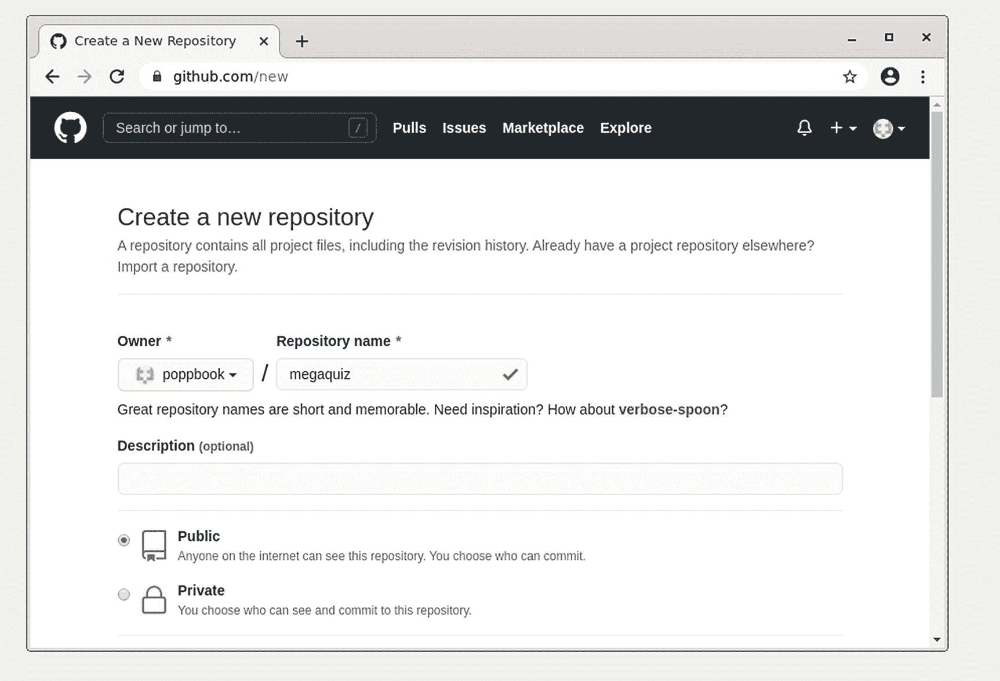
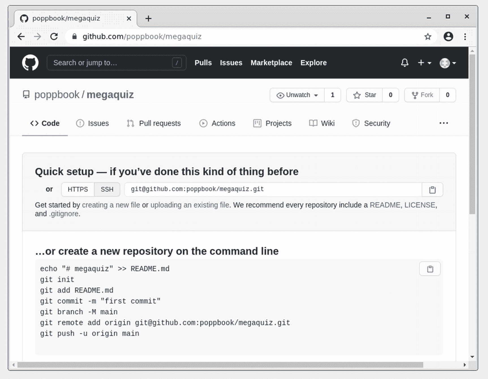
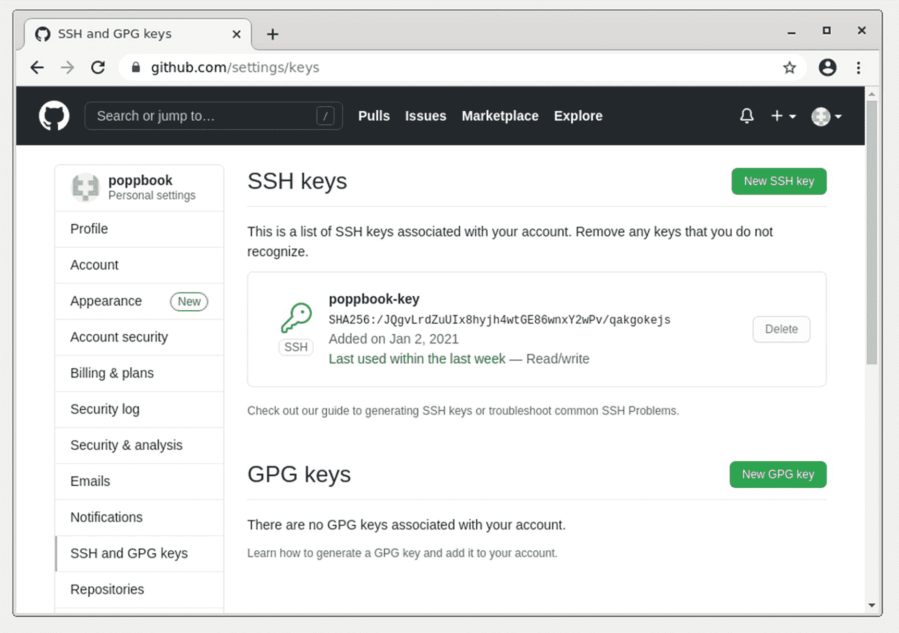
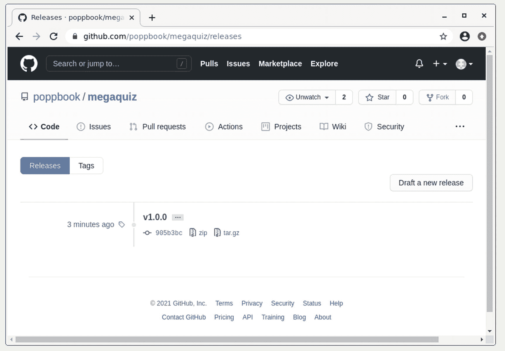
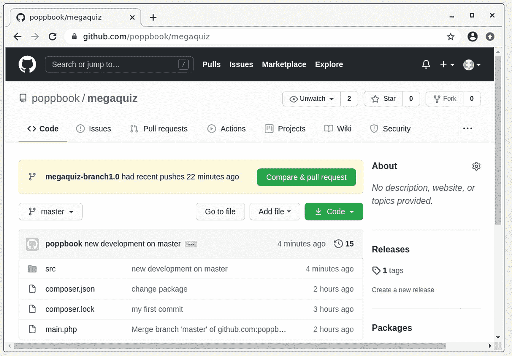
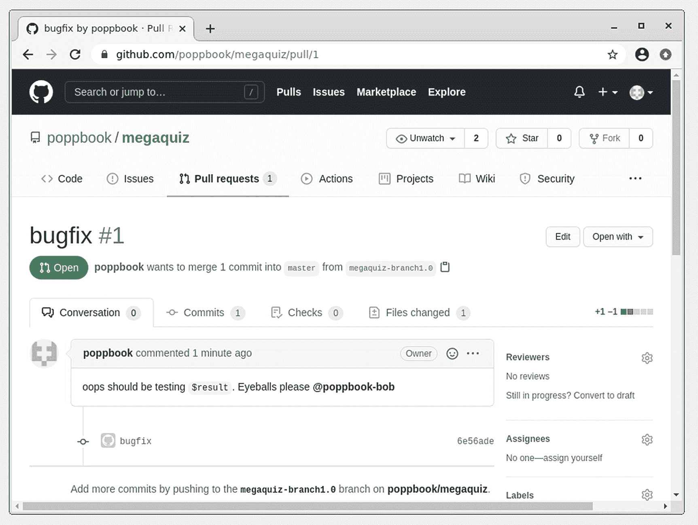
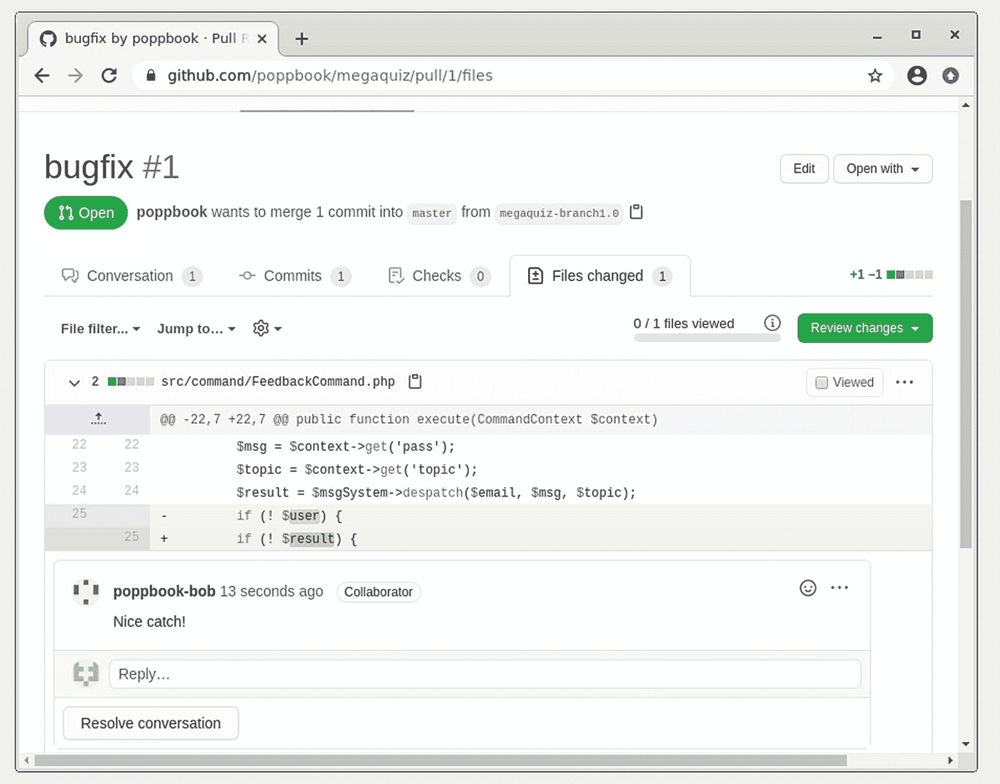

# 17.使用 Git 进行版本控制

所有的灾难都有其临界点，即秩序最终崩溃、事件失控的时刻。你在这样的项目中发现过自己吗？你能发现那个关键时刻吗？

也许是当你“仅仅做了几个改变”就发现你让周围的一切都崩溃了(更糟糕的是，你不太确定如何回到你刚刚破坏的稳定点)。可能是当你意识到你的团队中的三个成员一直在同一个类上工作，并且愉快地分享彼此的工作。或者可能是当你发现一个你已经实现了两次的 bug 修复不知何故又从代码库中消失了。如果有一种工具可以帮助你管理协同工作，允许你拍摄你的项目的快照，如果需要的话回滚它们，然后合并多个开发链，这不是很好吗？在这一章中，我们来看看 Git，一个可以做所有这些事情的工具，以及更多。

本章将涵盖使用 Git 的以下方面:

*   *基本配置*:探索设置 Git 的一些技巧

*   *导入*:开始新项目

*   *提交变更*:将您的工作保存到存储库中

*   *更新*:把别人的作品和你自己的融合在一起

*   *分支*:维护平行的开发链

## 为什么要使用版本控制？

如果还没有的话，版本控制将会改变你的生活(如果仅仅是你作为开发人员的生活)。有多少次你在一个项目中到达了一个稳定的时刻，吸了一口气，然后又一次陷入开发混乱中？当展示您正在进行的工作时，恢复到稳定版本有多容易？当然，当项目达到稳定状态时，您可能已经保存了项目的快照，这可能是通过复制您的开发目录实现的。现在，假设您的同事正在处理相同的代码库。也许他和你一样保存了一份稳定的代码副本。不同的是，他的副本是他作品的快照，而不是你的。当然，他也有一个混乱的开发目录。因此，您需要协调项目的四个版本。现在想象一个有四个程序员和一个 web UI 开发人员的项目。你看起来很苍白。也许你想躺下来？

Git 的存在就是为了解决这个问题。使用 Git，所有开发人员都可以从一个中央存储库中克隆他们自己的代码库副本。每当他们的代码达到一个稳定点时，他们可以从服务器上下载最新的代码，并将其与自己最近的工作合并。当他们准备好了，并且在他们修复了任何冲突并且运行了所有测试之后，他们可以把他们的新的稳定合成推回到共享存储库中。

Git 是一个分布式版本控制系统。这意味着，一旦用户获得了一个分支，他们就可以提交给自己的本地存储库，而不需要网络连接。这有许多好处。这意味着日常操作更快，你可以在飞机、火车和汽车上轻松工作。然而，最终，您可以与您的队友共享一个权威的存储库。

事实上，每个开发人员都可以将其工作合并到一个中央存储库中，这意味着协调多个开发链变得更加容易。更好的是，您可以根据日期或标签来检查代码库的版本。因此，当您的代码达到一个稳定点时，例如，适合向客户显示正在进行的工作，您可以用任意标签标记它。然后，当你的客户突然来到你的办公室，想要给投资者留下深刻印象时，你可以使用这个标签来检查正确的代码库。

等等！还有呢！您还可以同时管理多个开发链。如果这听起来不必要的复杂，想象一个成熟的项目。您已经发布了第一个版本，并且正在开发第二个版本。版本 1。_n_ 同时走开？当然不是。您的用户一直在发现错误并要求增强。您可能离发布版本 2 还有几个月的时间，那么您在哪里进行和测试更改呢？Git 允许您维护代码库的不同分支。因此，您可以创建版本 1 的 bug 修复分支。_n_ 用于当前生产代码的开发。在关键点上，这个分支可以合并回版本 2 的代码(主干)，这样您的新版本就可以从版本 1 的改进中获益。_n_。

Note

Git 不是唯一可用的版本控制系统。你可能还想看看 Subversion ( [`http://subversion.apache.org/`](http://subversion.apache.org/) )或者 Mercurial ( [`http://mercurial.selenic.com/`](http://mercurial.selenic.com/) )。这一章必然是对一个大题目的简要介绍。然而，幸运的是，斯科特·沙孔的*Pro Git*(2014 年出版)深入而清晰地涵盖了这个主题。不仅如此，在 [`https://git-scm.com/book/en/v2`](https://git-scm.com/book/en/v2) 网站上还有网页版。

让我们来看看实践中的一些特性。

## 获取 Git

如果您正在使用一个类似 Unix 的操作系统(比如 Linux 或 FreeBSD)，那么您可能已经安装了 Git 并可以使用了。

Note

我用一个前导美元符号(`$`)来显示在命令行输入的命令，以表示命令提示符，以区别于它们可能产生的任何输出。

尝试从命令行键入以下内容:

```php
$ git help

```

您应该会看到一些使用信息，以确认您已经准备好开始使用。如果您还没有 Git，那么您应该查阅发行版的文档。您几乎肯定可以使用 Yum 或 Apt 之类的简单安装机制，或者您可以直接从 [`http://git-scm.com/downloads`获取 Git。](http://git-scm.com/downloads)

Note

技术编辑 Paul Tregoing 也推荐 Git for Windows([`https://gitforwindows.org/`](https://gitforwindows.org/))Git 自带的，自然也是一套有用的开源工具。

## 使用在线 Git 存储库

你可能已经注意到了，这本书经常是单干的。我几乎从不认为你应该重新发明轮子；相反，在购买现成的车轮之前，你至少应该对车轮结构有所了解。出于这个原因，我将在下一节介绍建立和维护您自己的中央 git 存储库的机制。不过，还是现实点吧。您几乎肯定会使用专门的主机来管理您的存储库。有很多这样的软件可供选择，尽管最大的玩家可能是 Bitbucket ( [`https://bitbucket.org`](https://bitbucket.org) )、GitHub ( [`https://github.org`](https://github.org) )和 GitLab ( [`https://about.gitlab.com/`](https://about.gitlab.com/) )。

那么，你应该选择哪个呢？根据经验，GitHub 可能是开源产品的标准。所以，我会和 GitHub 签约我的项目。图 [17-1](#Fig1) 显示了我的下一个决定，是在公共库还是私有库之间。我将选择公共项目(因为我正在创建一个开源项目)。



图 17-1

GitHub 项目入门

如你所见，在图 [17-1](#Fig1) 中，我还没有完全打完`megaquiz`。此时，GitHub 为导入我的项目提供了一些有用的说明。你可以在图 [17-2](#Fig2) 中看到这些。



图 17-2

GitHub 的导入说明

不过，我还没有准备好运行这些命令。当我将文件推送到服务器时，GitHub 需要能够验证我。为了做到这一点，它需要我的公钥。我将在下一节“配置 Git 服务器”中描述生成这种密钥的一种方法一旦我有了公钥，我就可以从 GitHub 的用户设置界面的`SSH and GPG keys`链接添加它。

在图 [17-3](#Fig3) 中可以看到 GitHub 的 SSH 和 GPG 键的设置画面。



图 17-3

添加 SSH 密钥

现在，我准备开始向我的存储库添加文件。不过，在我们开始之前，我们应该后退一步，花一些时间来遵循自己动手的路线。

## 配置 Git 服务器

Git 在两个关键方面不同于传统的版本控制系统。首先，在幕后，它存储文件的快照，而不是在提交之间对文件所做的更改。第二，对用户来说更明显的是，它在您的系统本地运行，直到您选择推送到远程存储库或从远程存储库拉出。这意味着您不需要依赖互联网连接来继续工作。

为了使用 Git，您不需要一个单独的远程存储库；但是在实践中，如果你和一个团队一起工作，拥有一个共享的权力来源几乎总是有意义的。

在这一节中，我将介绍启动和运行远程 Git 服务器所需的步骤。我假设 root 用户可以访问 Linux 机器。

### 创建远程存储库

为了创建 Git 存储库，我必须首先创建一个包含目录。我通过 SSH 登录到一个新配置的远程服务器。我将在`/var/git`下创建我的存储库。一般来说，只有 root 用户可以在那里创建和修改目录，所以我使用`sudo`运行下面的命令:

```php
$ sudo mkdir -p /var/git/megaquiz
$ cd /var/git/megaquiz/

```

我创建了`/var/git`，它是我的存储库的父目录和一个名为`megaquiz`的样例项目的子目录。现在我可以准备目录本身了:

```php
$ sudo git init --bare

Initialized empty Git repository in /var/git/megaquiz/

```

`--bare flag`告诉 Git 在没有工作目录的情况下初始化存储库。如果您试图推送到一个不是以这种方式创建的存储库，Git 将会抱怨。

目前只有 root 用户可以在`/var/git`下乱来。我可以通过创建一个名为`git`的用户和组并使其成为目录的所有者来改变这一点:

```php
$ sudo adduser git
$ sudo chown -R git:git /var/git

```

#### 为本地用户准备存储库

尽管这是一个指定的远程服务器，我也应该确保本地用户可以提交到存储库。如果不小心的话，这可能会导致所有权和权限问题(特别是当拥有`sudo`特权的用户推送代码时)。

```php
$ sudo chmod -R g+rws /var/git

```

这给予了`git`组的成员对`/var/git`的写访问权，并导致在此创建的所有文件和目录都采用`git`组。现在，只要我确保他们是`git`组的成员，本地用户就能够写入存储库。不仅如此，创建的任何文件都可以被组中的其他成员写入。

您可以将本地用户添加到`git`组，如下所示:

```php
$ sudo usermod -aG git bob

```

现在用户`bob`是`git`组的成员。

#### 为用户提供访问权限

前面提到的`bob`用户的所有者可以登录到服务器，并通过他的 shell 与存储库进行交互。但是，一般来说，您不希望向所有用户提供 shell 访问。在任何情况下，大多数用户都喜欢利用 Git 的分布式特性，并在本地处理他们的克隆数据。

授予用户 SSH 访问权限的一种方式是通过公钥认证。为此，您首先需要获得用户的公共 SSH 密钥。用户可能已经有了这个——在 Linux 机器上，他可能会在配置目录中的一个名为`id_rsa.pub`的文件中找到这个密钥。否则，他可以很容易地生成新的密钥。在类似 Unix 的机器上，这就是运行`ssh-keygen`命令并复制它生成的值:

```php
$ ssh-keygen
$ cat .ssh/id_rsa.pub

```

作为存储库管理员，我会要求您提供这个密钥的副本。一旦有了它，我必须将它添加到存储库服务器上的`git`用户的 SSH 设置中。这仅仅是将公钥粘贴到`.ssh/authorized_keys`文件中的问题。我可能需要为我设置的第一个密钥创建`.ssh`配置目录(我从`git`用户的主目录运行这些命令):

```php
$ mkdir .ssh
$ chmod 0700 .ssh
# create authorized_keys file and paste in the user's key:
$ vi .ssh/authorized_keys
$ chmod 0700 .ssh/authorized_keys

```

Note

SSH 访问失败的一个常见原因是创建了权限过于宽松的配置文件。SSH 配置环境应该只对帐户的所有者可读和可写。Michael Stahnke (Apress，2005)的 Pro OpenSSH 全面介绍了 SSH。

#### 关闭 git 用户的 Shell 访问

任何服务器都不应该比它需要的更开放。您可能希望让您的用户能够访问 Git 命令，但可能仅此而已。

通过查看文件`/etc/passwd`，您可以看到与 Linux 服务器上的用户相关联的 shell。下面是我的远程服务器上的`git`帐户的相关行:

```php
git:x:1001:1001::/home/git:/bin/bash

```

Git 提供了一个名为`git-shell`的特殊 shell，它限制用户只能使用选定的命令。我可以通过编辑`/etc/passwd`来启用这个登录程序:

```php
git:x:1001:1001::/home/git:/usr/bin/git-shell

```

现在，如果我尝试通过 SSH 登录，我会被告知分数并被注销:

```php
$ ssh git@poppch17.vagrant.internal

Last login: Thu Dec 31 14:25:05 2020 from 192.168.33.1
fatal: Interactive git shell is not enabled.
hint: ~/git-shell-commands should exist and have read and execute access. Connection to 192.168.33.71 closed.

```

## 开始一个项目

现在我有了一个远程 Git 服务器，并且可以从我的本地帐户访问它，是时候在`/var/git/megaquiz`将我正在进行的工作添加到存储库中了。

在开始之前，我会仔细检查一下我的文件和目录，并删除我可能找到的任何临时项目。

做不到这一点是常见的烦恼。要监视的临时项目包括自动生成的文件，如 composer 包、构建目录、安装程序日志等。

Note

您可以通过在存储库中放置一个名为`.gitignore`的文件来指定要忽略的文件和模式。在 Linux 系统上，`man gitignore`命令应该提供文件名通配符的例子，您可以修改这些例子来排除由您的构建过程、编辑器和 ide 创建的各种锁文件和临时目录。该文本也可在 [`http://git-scm.com/docs/gitignore`在线获取。](http://git-scm.com/docs/gitignore)

在继续之前，我应该用 Git 注册我的身份——这样可以更容易地跟踪谁在存储库中做了什么:

```php
$ git config --global user.name "poppbook"
$ git config --global user.email "poppbook@getinstance.com"

```

现在，我已经建立了我的个人详细信息，并确保我的项目是干净的，我可以设置它并将其代码推送到服务器:

```php
$ cd /home/mattz/work/megaquiz
$ git init

Initialized empty Git repository in /home/mattz/work/megaquiz/.git/

```

现在是时候添加我的文件了:

```php
$ git add .

```

Git 现在正在跟踪`megaquiz`下的所有文件和目录。被跟踪的文件可以有三种状态:*未修改*、*修改*或*暂存*。您可以通过运行命令`git status`来检查这一点:

```php
$ git status

# On branch master
#
# Initial commit
#
# Changes to be committed:
#   (use "git rm --cached <file>..." to unstage)
#
#       new file:   composer.json
#       new file:   composer.lock
#       new file:   main.php
#       new file:   src/command/Command.php
#       new file:   src/command/CommandContext.php
#       new file:   src/command/FeedbackCommand.php
#       new file:   src/command/LoginCommand.php
#       new file:   src/quizobjects/User.php
#       new file:   src/quiztools/AccessManager.php
#       new file:   src/quiztools/ReceiverFactory.php
#

```

感谢我之前的`git add`命令，我所有的文件都准备好提交了。我现在可以继续执行`commit`命令了:

```php
$ git commit -m'my first commit'

[master (root-commit) a5ca2d4] my first commit
 10 files changed, 1638 insertions(+)
 create mode 100644 composer.json
 create mode 100644 composer.lock
 create mode 100755 main.php
 create mode 100755 src/command/Command.php
 create mode 100755 src/command/CommandContext.php
 create mode 100755 src/command/FeedbackCommand.php
 create mode 100755 src/command/LoginCommand.php
 create mode 100755 src/quizobjects/User.php
 create mode 100755 src/quiztools/AccessManager.php
 create mode 100644 src/quiztools/ReceiverFactory.php

```

我通过`-m`标志添加了一条消息。如果我忽略了这一点，那么 Git 将启动一个编辑器，我可以用它来添加我的签入消息。

如果您习惯于 CVS 和 Subversion 等版本控制系统，您可能会认为我们已经完成了。虽然我可以愉快地从这里继续编辑、添加、提交和分支，但是如果我想使用中央存储库共享这些代码，我还需要考虑一个额外的阶段。正如我们将在本章后面看到的，Git 允许我们管理多个项目分支。多亏了这个特性，我可以为每个版本维护一个分支，而且还可以将我最前沿的高风险开发安全地保留在我的产品代码之外。当我们开始时，Git 建立了一个名为`master`的分支。我可以用命令`git branch`确认我的分支的状态:

```php
$ git branch -a

* master

```

`-a`标志指定 Git 应该向我们显示所有分支(缺省情况是忽略远程分支)。输出显示`master`支路。

事实上，我还没有将我的本地存储库与远程服务器关联起来。是时候纠正这个错误了:

```php
$ git remote add origin git@poppch17.vagrant.internal:/var/git/megaquiz

```

考虑到它所做的工作，这个命令安静得令人失望。事实上，这相当于告诉 Git“将昵称`origin`与给定的服务器位置相关联”。此外，在本地分支机构`master`和远程对等机构之间建立跟踪关系。”

为了确认所有这些，我用 Git 检查远程句柄`origin`是否已经设置好:

```php
$ git remote -v

origin git@poppch17.vagrant.internal:/var/git/megaquiz (fetch)
origin git@poppch17.vagrant.internal:/var/git/megaquiz (push)

```

当然，如果你使用像 GitHub 这样的服务，你会使用图 [17-2](#Fig2) 所示的`git remote add`步骤。在我的例子中，它看起来像这样:

```php
$ git remote add origin git@github.com:poppbook/megaquiz.git

```

但是，不要运行前面的命令，除非您真的想推送到我的 GitHub repo！我现在坚持使用我的自托管 Git 存储库。

然而，我还没有向我的 Git 服务器发送任何实际的文件，所以这是我的下一步:

```php
$ git push origin master
Counting objects: 16, done.
Delta compression using up to 2 threads.
Compressing objects: 100% (15/15), done.
Writing objects: 100% (16/16), 8.87 KiB | 0 bytes/s, done.
Total 16 (delta 2), reused 0 (delta 0)
remote: Resolving deltas: 100% (2/2), done.
To git@github.com:poppbook/megaquiz.git
* [new branch] master -> master

```

现在我可以再次运行`git branch`命令来确认`master`分支的远程版本已经出现:

```php
$ git branch -a

* master
  remotes/origin/master

```

或者，只查看远程分支:

```php
$ git branch –r

   origin/master

```

Note

我建立了一个叫做*的跟踪分支*。这是与远程 twin 相关联的本地分支。

### 克隆存储库

为了这一章的目的，我已经虚构了一个名为 Bob 的团队成员。鲍勃正在和我一起做大测验项目。自然，他想要自己版本的代码。我已经将他的公钥添加到 Git 服务器中，所以他可以开始了。在 GitHub 的平行世界中，我邀请了 Bob 加入我的项目，他在自己的帐户中添加了自己的公钥。效果是一样的；Bob 可以使用命令`git clone`获取存储库:

```php
$ git clone git@github.com:poppbook/megaquiz.git

Cloning into 'megaquiz'...
remote: Enumerating objects: 16, done.
remote: Counting objects: 100% (16/16), done.
remote: Compressing objects: 100% (13/13), done.
remote: Total 16 (delta 2), reused 16 (delta 2), pack-reused 0
Receiving objects: 100% (16/16), 8.87 KiB | 0 bytes/s, done.
Resolving deltas: 100% (2/2), done.

```

现在我们两个都可以在本地开发，当我们准备好的时候，彼此分享我们的代码。

## 更新和提交

当然，Bob 是一个优秀且有才华的人——除了一个非常令人讨厌的共同特点:他不能不管别人的代码。

Bob 既聪明又好奇，很容易被闪亮的新开发途径所激发，他热衷于帮助优化新代码。结果，无论我走到哪里，我似乎都能看到鲍勃的手。Bob 补充了我的文档，他实现了我在喝咖啡时提到的一个想法。我可能要杀了鲍勃。然而，与此同时，我必须处理这样一个事实，即我正在处理的代码需要与 Bob 的输入合并。

这里有一个文件叫做`quizobjects/User.php`。目前，它只包含最少的骨头:

```php
namespace poppbook\megaquiz\quizobjects;
class User
{
}

```

我决定添加一些文档。我首先向我的文件版本添加一个文件注释:

```php
namespace popp\ch17\megaquiz\quizobjects;

/**
 * @license http://www.example.com Borsetshire Open License
 * @package quizobjects
 */

class User
{
}

```

记住，一个文件可以有三种状态:*未修改*、*已修改*和*已登台*。`User.php`文件现在已经从*未修改的*移动到*已修改的*。我可以用`git status`命令看到这一点:

```php
$ git status

# On branch master
# Changes not staged for commit:
#   (use "git add <file>..." to update what will be committed)
#   (use "git checkout -- <file>..." to discard changes in working directory)
#
#      modified: src/quizobjects/User.php
#
no changes added to commit (use "git add" and/or "git commit -a")

```

`User.php`已被修改，但尚未准备提交。我可以使用命令`git add`改变这种状态:

```php
$ git add src/quizobjects/User.php
$ git status

# On branch master
# Changes to be committed:
#   (use "git reset HEAD <file>..." to unstage)
#
#      modified: src/quizobjects/User.php
#

```

现在我准备提交:

```php
$ git commit -m'added documentation' src/quizobjects/User.php

[master 997622c] added documentation
1 file changed, 5 insertions(+)

```

Git 提交只影响我的本地存储库。如果我确信世界已经为我的改变做好了准备，我必须将我的代码推送到远程存储库:

```php
$ git push origin master
Counting objects: 9, done.
Delta compression using up to 2 threads.
Compressing objects: 100% (4/4), done.
Writing objects: 100% (5/5), 537 bytes | 0 bytes/s, done.
Total 5 (delta 1), reused 0 (delta 0)
remote: Resolving deltas: 100% (1/1), completed with 1 local object.
To git@github.com:poppbook/megaquiz.git
    ce5a604..997622c master -> master

```

与此同时，在自己的沙盒中工作的鲍勃一如既往地热衷于此，他创建了一个班级评论:

```php
namespace popp\ch17\megaquiz\quizobjects;

/**
 * @package quizobjects
 */

class User
{
}

```

现在轮到鲍勃了`add`、`commit`和`push`。因为添加和提交部分经常一起运行，所以 Git 允许您将它们合并到一个命令中:

```php
$ git commit -a -m'my great documentation'

[master 13de456] my great documentation
 1 file changed, 4 insertions(+)

```

所以我们现在有两个不同版本的`User.php`。一个是我刚刚推送到远程存储库的版本，另一个是 Bob 的版本，已提交，但尚未推送到远程存储库。让我们看看当 Bob 试图将他的本地版本推送到远程存储库时会发生什么:

```php
$ git push origin master

To git@github.com:poppbook/megaquiz.git
 ! [rejected]        master -> master (fetch first)
error: failed to push some refs to 'git@github.com:poppbook/megaquiz.git'
hint: Updates were rejected because the remote contains work that you do
hint: not have locally. This is usually caused by another repository pushing
hint: to the same ref. You may want to first merge the remote changes (e.g.,
hint: 'git pull') before pushing again.
hint: See the 'Note about fast-forwards' in 'git push --help' for details.

```

如您所见，如果有更新要应用，Git 不会让您推送。Bob 必须首先下载我版本的`User.php`文件:

```php
$ git pull origin master

remote: Enumerating objects: 9, done.
remote: Counting objects: 100% (9/9), done.
remote: Compressing objects: 100% (3/3), done.
remote: Total 5 (delta 1), reused 5 (delta 1), pack-reused 0 Unpacking objects: 100% (5/5), done.
From github.com:poppbook/megaquiz
 * branch            master     -> FETCH_HEAD
Auto-merging src/quizobjects/User.php
CONFLICT (content): Merge conflict in src/quizobjects/User.php
Automatic merge failed; fix conflicts and then commit the result.

```

Git 很乐意将来自两个源的数据合并到同一个文件中，只要变化不重叠。Git 无法处理影响相同行的更改。它如何决定什么是有优先权的？存储库应该覆盖 Bob 的更改，还是相反？这两种变化应该共存吗？哪个应该先走？Git 别无选择，只能报告冲突，让 Bob 解决问题。

以下是 Bob 打开文件时看到的内容:

```php
/**
<<<<<<< HEAD
 * @package quizobjects
 */
=======
 * @license http://www.example.com Borsetshire Open License
 * @package quizobjects
 */
>>>>>>> f36c6244521dbd137b37b76414e3cea2071958d2

namespace poppbook\megaquiz\quizobjects;

class User
{
}

```

Git 包括 Bob 的注释和冲突的更改，以及告诉他哪个部分来自哪里的元数据。冲突的信息由一行等号隔开。Bob 的输入由一行小于符号后跟“HEAD”来表示。远程更改包含在分界线的另一边。

现在 Bob 已经确定了冲突，他可以编辑文件来修复冲突:

```php
/**
 * @package quizobjects
 * @license http://www.example.com Borsetshire Open License
 * @package quizobjects
 */

namespace poppbook\megaquiz\quizobjects;

class User
{
}

```

接下来，Bob 通过暂存文件来解决冲突:

```php
$ git add src/quizobjects/User.php
$ git commit -m'documentation merged'

[master c99d3f5] documentation merged

```

现在，他终于可以推送到远程存储库了:

```php
$ git push origin master

```

## 添加和删除文件和目录

项目在发展过程中会改变形状。版本控制软件必须考虑到这一点，允许用户添加新文件，并删除那些碍事的无用文件。

### 添加文件

您已经多次看到了`add`子命令。在我的项目设置期间，我使用它将我的代码添加到空的`megaquiz`存储库中，并随后准备提交文件。通过在未跟踪的文件或目录上运行`git add`,您要求 Git 跟踪它——并准备提交。在这里，我将一个名为`CompositeQuestion.php`的文档添加到项目中:

```php
$ touch src/quizobjects/CompositeQuestion.php
$ git add src/quizobjects/CompositeQuestion.php

```

在现实世界中，我可能会从给`CompositeQuestion.php`添加一些内容开始。这里，我将自己限制在使用标准的`touch`命令创建一个空文件。一旦我添加了一个文档，我仍然必须调用`commit`子命令来完成添加:

```php
$ git commit -m'initial check in'

[master 323bec3] initial check in
 1 file changed, 0 insertions(+), 0 deletions(-)
 create mode 100644 src/quizobjects/CompositeQuestion.php

```

`CompositeQuestion.php`现在位于本地存储库中。

### 删除文件

如果我发现我太仓促了，需要删除文档，那么毫不奇怪我可以使用名为`rm`的子命令:

```php
$ git rm src/quizobjects/CompositeQuestion.php
rm 'src/quizobjects/CompositeQuestion.php'

```

再次需要一个`commit`来完成工作。和往常一样，我可以通过运行`git status`来确认这一点:

```php
$ git status

# On branch master
# Your branch is ahead of 'origin/master' by 1 commit.
#   (use "git push" to publish your local commits)
#
# Changes to be committed:
#   (use "git reset HEAD <file>..." to unstage)
#
#       deleted:    src/quizobjects/CompositeQuestion.php
#

$ git commit -m'removed Question'

[master 5bf88aa] removed CompositeQuestion
 1 file changed, 0 insertions(+), 0 deletions(-)
 delete mode 100644 src/quizobjects/CompositeQuestion.php

```

### 添加目录

还可以用`add`和`rm`添加和删除目录。假设 Bob 想要创建一个新目录:

```php
$ mkdir resources
$ touch resources/blah.gif
$ git add resources/
$ git status

# On branch master
# Changes to be committed:
#   (use "git reset HEAD <file>..." to unstage)
#
#       new file: resources/blah.gif
#

```

注意`resources`的内容是如何自动添加到存储库中的。现在 Bob 可以提交，然后以通常的方式将全部内容推送到远程存储库。

Note

对目录使用`git add`时要小心；简直是贪心！该命令将选取给定目录下的任何文件和目录。用`git status`检查操作总是一个好主意。

### 删除目录

如您所料，您可以使用`rm`子命令删除目录。然而，在这种情况下，我必须告诉 Git，我希望它通过向子命令传递一个`-r`标志来删除目录的内容。在这里，我完全不同意鲍勃增加一个`resources`目录的决定:

```php
$ git rm -r resources/
rm 'resources/blah.gif'

```

## 标记发布

一切顺利的话，一个项目将最终达到准备就绪的状态，您将想要交付或部署它。每当您发布一个版本时，您应该在您的存储库中留下一个书签，这样您就可以随时在那个时候重新访问代码。如您所料，您可以使用`git tag`命令在代码中创建一个标记:

```php
git tag -a 'v1.0.0' -m'release 1.0.0'

```

您可以通过运行不带参数的`git tag`来查看与您的存储库相关联的标签:

```php
$ git tag
v1.0.0

```

到目前为止，我们一直在当地开展工作。为了将标签放到远程存储库中，我们必须使用带有`git push`子命令的`--tags`标志:

```php
$ git push origin --tags

Counting objects: 1, done.
Writing objects: 100% (1/1), 159 bytes | 0 bytes/s, done.
Total 1 (delta 0), reused 0 (delta 0)
To git@github.com:poppbook/megaquiz.git
 * [new tag]         v1.0.0 -> v1.0.0

```

使用`--tags`标志导致所有本地标签被推送到远程储存库。

当然，你在 GitHub repo 上的任何操作都可以在网站上被跟踪。你可以在图 [17-4](#Fig4) 中看到我的发布标签。



图 17-4

查看 GitHub 上的标签

一旦你可以用一个标签来标记你的代码，你就可以考虑如何重新访问旧版本了。然而，对于这一点，您应该首先花些时间研究分支 Git 在这方面特别擅长。

## 分支项目

一旦我的项目发布了，我就可以打包离开，去做一些新的事情，对吗？毕竟，它写得如此优雅，以至于不可能出现 bug，更不用说如此详细地说明，没有用户可能需要任何新功能！

同时，回到现实世界，我必须继续在至少两个层面上使用代码库。Bug 报告现在应该会陆续出现，对 1.2.0 版本的需求会随着对奇妙新特性的需求而膨胀。我如何调和这些力量？我需要修复被报告的错误，并且我需要继续主要的开发工作。当下一个版本稳定时，我可以作为开发的一部分修复 bug 并一次性发布所有内容。但是用户可能要等很长时间才能看到问题得到解决。这显然是不能接受的。另一方面，我可以边走边释放。在这种情况下，我会冒着发布不完整代码的风险。显然，我的发展需要两股力量。我将继续向项目的主分支(通常称为主干)添加新的和有风险的特性，但是我现在应该为我的新版本创建一个分支，在这个分支上我只能添加错误修复。

Note

这种管理分行的方式绝不是城里唯一的游戏。开发人员经常争论组织分支和管理发布和错误修复的最佳方式。最流行的方法之一是 git-flow(在 [`https://danielkummer.github.io/git-flow-cheatsheet/`](https://danielkummer.github.io/git-flow-cheatsheet/) 中有清晰的描述)。在这种做法下，`master`就是发布分支。新代码在一个`develop`分支上运行，并在发布时合并到`master`中。每个活跃开发的单元都有自己的特性分支，当稳定时，这些特性分支被合并到`develop`中。

我可以使用`git checkout`命令创建并切换到一个新的分支。首先，让我们快速看一下我的分支的状态:

```php
$ git branch -a

* master
  remotes/origin/master

```

如您所见，我有一个单独的分支，`master`，和它的远程对等物。现在，我将创建并切换到一个新的分支:

```php
$ git checkout -b megaquiz-branch1.0
Switched to a new branch 'megaquiz-branch1.0'

```

为了跟踪我对分支的使用，我将使用一个特定的文件作为例子，`src/command/FeedbackCommand.php`。看来我及时创建了我的 bug 修复分支。用户开始报告他们无法使用系统中的反馈机制。我找到了窃听器:

```php
//...
$result = $msgSystem->despatch($email, $msg, $topic);
if (! $user)  {
    $this->context->setError($msgSystem->getError());
//...

```

事实上，我应该测试`$result`而不是`$user`。以下是我的编辑:

```php
//...
$result = $msgSystem->dispatch($email, $msg, $topic);
if (! $result)  {
    $this->context->setError($msgSystem->getError());
//...

```

因为我正在分支`megaquiz-branch1.0`上工作，所以我可以提交这个变更:

```php
$ git add src/command/FeedbackCommand.php
$ git commit -m'bugfix'

[megaquiz-branch1.0 6e56ade] bugfix
 1 file changed, 1 insertion(+), 1 deletion(-)

```

当然，这个提交是本地的。我需要使用`git` push 命令将分支放到远程存储库上:

```php
$ git push origin megaquiz-branch1.0

Counting objects: 9, done.
Delta compression using up to 2 threads.
Compressing objects: 100% (5/5), done.
Writing objects: 100% (5/5), 456 bytes | 0 bytes/s, done.
Total 5 (delta 3), reused 0 (delta 0)
remote: Resolving deltas: 100% (3/3), completed with 3 local objects. remote:
remote: Create a pull request for 'megaquiz-branch1.0' on GitHub by visiting:
remote: https://github.com/poppbook/megaquiz/pull/new/megaquiz-branch1.0
remote:
To git@github.com:poppbook/megaquiz.git
 * [new branch]     megaquiz-branch1.0 -> megaquiz-branch1.0

```

现在，鲍勃怎么办？他不可避免地会想参与进来并修复一些错误。首先，他调用`git fetch`，它从服务器获取任何新信息。然后他可以用`git branch -a`查看所有可用的分支。

```php
$ git fetch
$ git branch -a

* master
  remotes/origin/HEAD -> origin/master
  remotes/origin/master
  remotes/origin/megaquiz-branch1.0

```

现在 Bob 可以切换到本地分支，该分支将跟踪远程分支:

```php
$ git checkout megaquiz-branch1.0

Branch megaquiz-branch1.0 set up to track remote branch megaquiz-branch1.0 from origin.
Switched to a new branch 'megaquiz-branch1.0'

```

鲍勃现在可以走了。他可以添加和提交自己的修复；当他用力时，它们会停在远处的树枝上。

同时，我想在主干上添加一些前沿的增强功能——也就是我的`master`分支。让我们从我的本地存储库的角度再次查看我的分支的状态:

```php
$ git branch -a

  master
* megaquiz-branch1.0
  remotes/origin/master
  remotes/origin/megaquiz-branch1.0

```

我可以通过调用`git checkout`切换到现有的分支:

```php
$ git checkout master

Switched to branch 'master'
Your branch is up-to-date with 'origin/master'.

```

当我现在看`command/FeedbackCommand.php`时，我发现我的错误修复已经神奇地消失了。当然还是存放在`megaquiz-branch1.0`下。稍后，我可以将补丁合并到`master`分支，所以没有必要担心。相反，我可以专注于添加新代码:

```php
class FeedbackCommand extends Command
{

    public function execute(CommandContext $context): bool
    {

        // new and risky development
        // goes here

        $msgSystem = ReceiverFactory::getMessageSystem();
        $email = $context->get('email');

        // ...

```

我在这里所做的只是添加一个注释来模拟代码的添加。我现在可以提交并推动这个:

```php
$ git commit -am'new development on master'
$ git push origin master

```

所以我现在有平行的分支。当然，迟早，我会希望我的主分支从我在`megaquiz-branch1.0`提交的错误修复中受益。

我可以在命令行上做到这一点，但首先让我们暂停一下，看看 GitHub 和 Bitbucket 等类似服务支持的一个特性。pull 请求(通常缩写为 PR)允许我在合并分支之前请求代码审查。所以在 megaquiz-branch1.0 击中 master 之前，我可以让 Bob 检查我的工作。正如你在图 [17-5](#Fig5) 中看到的，GitHub 检测到了分支，并给了我一个机会来发出我的拉请求。



图 17-5

GitHub 使得发布拉请求变得容易

在提交拉取请求之前，我点击了按钮并添加了一条评论。你可以在图 [17-6](#Fig6) 中看到结果。



图 17-6

发出拉取请求

现在 Bob 可以检查我的更改，并添加他可能有的任何评论。GitHub 向他展示了到底发生了什么变化。你可以在图 [17-7](#Fig7) 中看到 Bob 的评论。



图 17-7

拉请求所涵盖的变更

一旦 Bob 批准了我的 pull 请求，我就可以直接从浏览器进行合并，或者返回到命令行。这很简单。Git 提供了一个名为`merge`的子命令:

```php
$ git checkout master

Already on 'master'

```

事实上，我已经在主分支上了——但是确定一下也无妨。现在我执行实际的合并:

```php
$ git merge --no-commit megaquiz-branch1.0
Auto-merging src/command/FeedbackCommand.php
Automatic merge went well; stopped before committing as requested

```

通过传入`--no-commit`标志，我保持合并未提交——这给了我另一个检查一切正常的机会。一旦我满意了，我就可以开始行动了。

```php
$ git commit -m'merge from megaquiz-branch1.0'

[master e1b5169] merge from megaquiz-branch1.0

```

Note

合并还是不合并？选择并不总是像看起来那么简单。例如，在某些情况下，您的 bug 修复可能是一种临时的工作，被主干上更彻底的重构所取代，或者由于规范的变化而不再适用。这是一个必要的判断。然而，我工作过的大多数团队倾向于在可能的情况下合并到主干，同时将分支上的工作保持在最低限度。对我们来说，新特性通常出现在主干上，并通过“尽早和经常发布”的策略快速到达用户手中。

现在，当我在`master`分支上查看`FeedbackCommand`的版本时，我确认所有的变更已经被合并:

```php
public function execute(CommandContext $context): bool
{

    // new and risky development
    // goes here

    $msgSystem = ReceiverFactory::getMessageSystem();
    $email = $context->get('email');
    $msg = $context->get('pass');
    $topic = $context->get('topic');
    $result = $msgSystem->despatch($email, $msg, $topic);
    if (! $result) {
        $this->context->setError($msgSystem->getError());
        return false;
    }

```

`execute()`方法现在包括我模拟的`master`开发和 bug 修复。

当我第一次“发布”MegaQuiz 版本时，我创建了一个分支，这就是我们一直在做的事情。但是，请记住，我也在那个阶段创建了一个标记。我当时承诺过，我会告诉你如何访问标签。事实上，您已经看到了。您可以基于标签创建一个本地分支，就像 Bob 创建我们的 bug fix 分支的本地版本一样。不同的是，这个新分支是全新的。它不跟踪现有的远程分支:

```php
$ git checkout -b v1.0.0-branch v1.0.0

Switched to a new branch 'v1.0.0-branch'

```

然而，现在我有了这个新的分支，我可以像你看到的那样推它和分享它。

Note

Git 是一个非常通用和有用的工具。像所有强大的工具一样，它的使用偶尔会导致意想不到的后果。对于那些你已经把自己逼入绝境，需要快速重置的时刻，科技编辑保罗·特雷哥推荐 [`https://dangitgit.com/en`](https://dangitgit.com/en) (实际上，他推荐的是更瑞典的版本！).该网站充满了可能会拯救你的理智的食谱，所以如果你认真使用 Git 的话，它非常值得收藏。

另外两个值得拥有的 git 命令是`git stash`和`git stash apply`。当您忙于本地编辑，但被要求切换分支时，您的第一个选择是提交正在进行的工作。但是，您可能不想提交粗糙的代码。您可能认为您唯一的选择是丢弃您的本地更改或将它们复制到临时文件中。但是，如果您运行`git stash`，所有的本地更改都会隐藏在幕后，您的分支会返回到上次提交时的状态。你可以离开去做你的紧急工作，当你准备好的时候，运行`git stash apply`来取回你未提交的工作。就像魔法一样！

## 摘要

Git 包含大量的工具，每一个都有令人望而生畏的选项和功能。我只能希望在有限的篇幅内提供一个简要的介绍。尽管如此，如果您只使用我在本章中介绍的功能，您应该会在自己的工作中看到好处，无论是通过防止数据丢失还是改进协作。

在本章中，我们浏览了 Git 的基础知识。在导入项目之前，我简要地看了一下配置。我签出、提交和更新了代码，然后向您展示了如何标记和导出一个版本。在本章的最后，我简要介绍了分支，展示了它们在维护项目中的并发开发和 bug 修复链中的作用。

在某种程度上，我忽略了一个问题。我们建立了一个原则，即开发人员应该签出他们自己的项目版本。但是，总的来说，项目不会原地运行。为了测试他们的更改，开发人员需要在本地部署代码。有时，这就像复制几个目录一样简单。然而，更常见的情况是，部署必须解决一系列配置问题。在下一章，我们将研究一些自动化这一过程的技术。