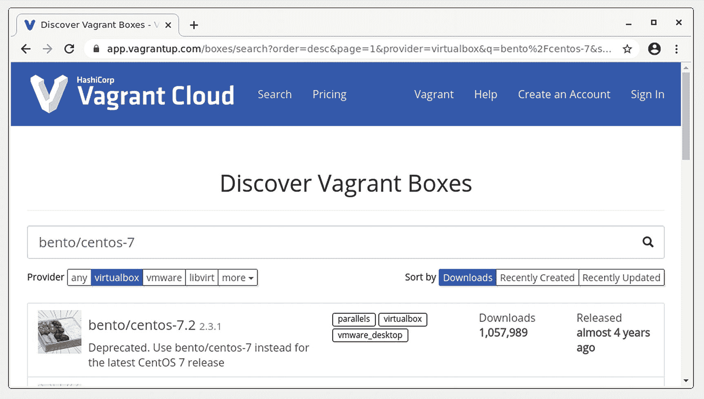
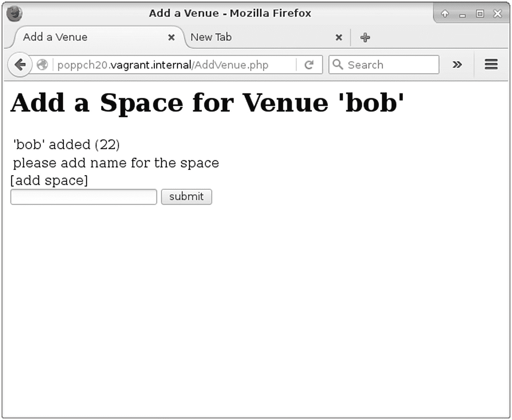

# 二十、Vagrant

你在哪里运行你的代码？

也许你有一个开发环境，你已经用一个最喜欢的编辑器和许多有用的开发工具磨练到完美。当然，您编写代码的完美设置可能与运行代码的最佳系统大相径庭。这是一个挑战，流浪者可以帮助你。使用 vagger，您可以在本地机器上工作，并在与您的生产服务器完全相同的系统上运行您的代码。在这一章中，我将告诉你如何做。我们将涵盖以下内容:

*   *基本设置*:从安装到选择第一个盒子

*   *登录*:用 ssh 调查你的虚拟机

*   *挂载主机目录*:在你的主机上编辑代码，并让它透明地出现在你的流浪者盒子里

*   *Provisioning* :编写脚本安装软件包，配置 Apache 和 MySQL

*   *设置主机名*:配置您的机顶盒，以便您可以使用自定义主机名访问它

## 问题

像往常一样，让我们花一点时间来定义问题空间。如今，在大多数台式机或笔记本电脑上配置灯组相对容易。即便如此，个人电脑也不太可能与您的生产环境相匹配。它运行的是同一版本的 PHP 吗？Apache 和 MySQL 呢？如果你正在使用 Elasticsearch，你可能也需要考虑 Java。这个名单很快就变长了。如果您的产品堆栈非常不同，在特定平台上使用一组工具进行开发有时会有问题。

你可能会放弃，将你的开发转移到一台远程机器上——有很多云供应商可以让你快速运转机器。但是这不是一个免费的选项，而且，根据您选择的编辑器，远程系统可能无法与您希望使用的开发工具很好地集成。

因此，尽可能地将您计算机上的软件包与安装在生产系统上的软件包匹配起来可能是值得的。匹配不会是完美的，但也许会足够好，并且您可能会在登台服务器上发现大多数问题。

然而，当你开始进行另一个需求完全不同的项目时，会发生什么呢？我们已经看到 Composer 在分离依赖项方面做得很好，但是仍然有像 PHP、MySQL 和 Apache 这样的全局包需要保持一致。

Note

如果您决定在远程系统上开发，我建议您努力学习如何使用 vim 编辑器。尽管它有些古怪，但它非常强大，您可以 99%确定 vim 或它的更基本的祖先 vi 可以在您遇到的任何类 Unix 系统上使用。

虚拟化是一个潜在的解决方案，也是一个很好的解决方案。不过，安装操作系统可能是一件痛苦的事，而且可能会有相当多的配置问题。

要是有一种工具能让在本地机器上创建类似生产的开发环境变得非常简单就好了。好了，很明显，现在我要说的就是这样一个工具的存在。嗯，有一个是。它叫《流浪》,真的很神奇。

## 一个小陷阱

很有诱惑力的说法是，流浪者给你一个单一命令的开发环境。那个*可能*是真的——但是你必须先安装必要的软件。考虑到这一点，以及您可以从项目的版本控制存储库中签出的配置文件，启动一个新环境确实只需要一个命令。

让我们先开始设置。流浪者需要一个虚拟化平台。它支持几个，但我会使用 VirtualBox。我的主机运行 Fedora，但你可以在任何 Linux 发行版和 OSX 或 Windows 上安装 VirtualBox。您可以在 [`www.virtualbox.org/wiki/Downloads`](https://www.virtualbox.org/wiki/Downloads) 找到下载页面，以及针对您的平台的说明。

当然，一旦你安装了 VirtualBox，你将需要一个流浪者。下载页面在 [`www.vagrantup.com/downloads.html`](https://www.vagrantup.com/downloads.html) 。一旦我们安装了这些应用，我们的下一个任务将是选择运行代码的机器。

### 选择和安装流浪盒

大概最简单的获得流浪盒子的方法就是使用 [`https://app.vagrantup.com/boxes/search`](https://app.vagrantup.com/boxes/search) 的搜索界面。由于许多生产系统运行 CentOS，这就是我要寻找的。你可以在图 [20-1](#Fig1) 中看到我的研究成果。



图 20-1

寻找一个流浪的盒子

CentOS 7 看起来很适合我的需求。我可以点击我感兴趣的框的列表来获取设置说明。这给了我足够的信息来运行一个流浪环境。通常当你运行 named 时，它会读取一个名为`Vagrantfile`的配置文件——但由于我是从头开始，所以我需要让 named 生成一个:

```php
$ vagrant init bento/centos-7

A `Vagrantfile` has been placed in this directory. You are now
ready to `vagrant up` your first virtual environment! Please read
the comments in the Vagrantfile as well as documentation on
`vagrantup.com` for more information on using Vagrant.

```

如您所见，我将我想要使用的机器的名称传递给了 vagger，它使用这些信息来生成一些最小的配置。

如果我打开生成的`Vagrantfile`文档，我可以看到这个(在许多其他样板文件中):

```php
# Every Vagrant development environment requires a box. You can search for
# boxes at https://vagrantcloud.com/search.
config.vm.box = "bento/centos-7"

```

至此，我只完成了生成配置的工作。接下来，我必须运行非常重要的`vagrant up`命令。如果你经常和流浪者一起工作，你会很快发现这个命令非常熟悉。它通过下载和提供您的新盒子(如果需要)来启动您的漫游会话，然后启动它:

```php
$ vagrant up

```

因为我是第一次用`bento/centos-7`虚拟机运行这个命令，所以 vagger 从下载盒子开始:

```php
==> default: Box 'bento/centos-7' could not be found. Attempting to find and install...
    default: Box Provider: virtualbox
    default: Box Version: >= 0
==> default: Loading metadata for box 'bento/centos-7'
    default: URL: https://vagrantcloud.com/bento/centos-7
==> default: Adding box 'bento/centos-7' (v202008.16.0) for provider: virtualbox
    default: Downloading:
https://vagrantcloud.com/bento/boxes/centos-7/versions/202008.16.0/providers/ virtualbox.box
    default: Download redirected to host: vagrantcloud-files-production.s3.amazonaws.com
==> default: Successfully added box 'bento/centos-7' (v202008.16.0) for 'virtualbox'!
...

```

vagger 存储了这个盒子(如果你运行的是 Linux，在`~/.vagrant.d/boxes/`下),这样你就不必在你的系统上再次下载它——即使你运行多个虚拟机。然后它配置并引导机器(它提供了很多细节)。一旦它运行完毕，我就可以登录到我的新机器上进行测试了:

```php
$ vagrant ssh
$ pwd

/home/vagrant

$ cat /etc/redhat-release

CentOS Linux release 7.8.2009 (Core)

```

我们进去了。那么我们赢得了什么？嗯，我们可以使用一台有点像我们生产环境的机器。还有别的吗？事实上，相当多。我之前说过，我想在本地机器上编辑文件，但在类似生产的空间中运行它们。我们来设置一下。

是时候再次离开盒子，回到主机上了:

```php
$ exit

```

## 在流浪者盒子上安装本地目录

让我们把一些样本文件放在一起。我在一个我命名为`infrastructure`的目录中运行了我的第一个`vagrant init`和`vagrant up`命令。我将重新启用我在第 18 章[中使用的`webwoo`项目(我为第 12 章](18.html)开发的系统的精简版)。综上所述，我的开发环境看起来有点像这样:

```php
ch20/
    infrastructure/
        Vagrantfile
    webwoo/
        AddVenue.php
        index.php
        Main.php
        AddSpace.php

```

我们面临的挑战是设置环境，以便我们可以在本地处理`webwoo`文件，但使用 CentOS box 上安装的堆栈透明地运行它们。根据我们的配置，vagger 将尝试在来宾系统中的主机上安装目录。事实上，流浪者*已经*为我们安装了一个目录。让我们来看看:

```php
$ vagrant ssh

Last login: Wed Sep 23 16:46:53 2020 from 10.0.2.2

$ ls -a /vagrant

.  ..    .vagrant    Vagrantfile

```

所以流浪者把`infrastructure`目录挂载为盒子上的`/vagrant`。当我们编写一个脚本来配置机器时，这将派上用场。不过现在，让我们集中精力安装`webwoo`目录。我们可以通过编辑`Vagrantfile`来做到这一点。不过，首先，现在可能是再次退出虚拟机的好时机。一旦我这样做了，我打开`Vagrantfile`,添加这一行:

```php
config.vm.synced_folder "../webwoo", "/var/www/poppch20"

```

通过搜索带注释的样板文件中的字符串`synced_folder`，我可以找到放置这一行的最佳位置。我发现一个示例配置行看起来很像我自己的。通过这个指令，我告诉流浪者在`/var/www/poppch20`的访客箱上安装`webwoo`目录。为了看到效果，我需要重启机器。为此有一个新命令(应该在主机系统上运行，而不是在虚拟机中运行):

```php
$ vagrant reload

```

虚拟机会完全关闭并重新启动。流浪者挂载`infrastructure` ( `/vagrant`)和`webwoo` ( `/var/www/poppch20`)目录。以下是该命令输出的摘录:

```php
==> default: Mounting shared folders...
    default: /vagrant => /home/mattz/localwork/popp/ch20-vagrant/infrastructure
    default: /var/www/poppch20 => /home/mattz/localwork/popp/ch20-vagrant/webwoo

```

我可以快速登录以确认`/var/www/poppch20`已就位:

```php
$ vagrant ssh
$ ls /var/www/poppch20/

AddSpace.php  AddVenue.php  index.php  Main.php

```

所以现在我可以在我的本地机器上运行一个性感的 IDE，并让它所做的更改透明地出现在来宾操作系统上！

Note

来自技术评论者和 Windows 用户 Paul Tregoing 的注释:如果运行 Windows 主机，不要使用 VirtualBox 共享文件系统(在本例中，它支撑着 vagger 的同步文件夹)。如果这样做，您可能会遇到区分大小写和缺少符号链接支持的问题。在这种情况下，最好在客户操作系统上运行 Samba(大多数发行版都将其安装为`smbd`)并在主机上映射一个网络驱动器，以获得更无缝的体验。这方面有很多在线指南。

当然，将文件放在 CentOS 虚拟机上并不等同于运行系统。一个典型的流浪者盒子没有太多的预装。假设开发者想要根据需要和环境定制环境。

下一步是配置我们的机器。

## 准备金提取

同样，调配由`Vagrantfile`文档指导。游民支持几个为置备机器设计的工具，包括 Chef ( [`www.chef.io/chef/`](http://www.chef.io/chef/) )、Puppet ( [`https://puppet.com`](https://puppet.com) )和 Ansible ( [`www.ansible.com`](http://www.ansible.com) )。都值得调查。但是，出于这个示例的目的，我将使用一个很好的老式 shell 脚本。

我再一次从`Vagrantfile`开始:

```php
config.vm.provision "shell", path: "setup.sh"

```

这应该是相当清楚的。我告诉 vagger 使用一个 shell 脚本来提供我的机器，我指定`setup.sh`作为应该执行的脚本。

当然，在 shell 脚本中放入什么取决于您的需求。我将从设置几个变量和安装一些包开始:

```php
#!/bin/bash

VAGRANTDIR=/vagrant
SERVERDIR=/var/www/poppch20/

sudo yum -q -y install epel-release yum-utils
sudo yum -q -y install http://rpms.remirepo.net/enterprise/remi-release-7.rpm

yum-config-manager --enable  remi-php80

sudo yum -q -y install mysql-server
sudo yum -q -y install httpd;
sudo yum -q -y install php
sudo yum -q -y install php-common
sudo yum -q -y install php-cli
sudo yum -q -y install php-mbstring
sudo yum -q -y install php-dom
sudo yum -q -y install php-mysql
sudo yum -q -y install php-xml
sudo yum -q -y install php-dom

```

PHP 8 在 CentOS 7 上默认不可用。然而，通过安装包`remi-release-7.rpm`，我能够安装 PHP 的新版本。我把我的脚本写到一个名为`setup.sh`的文件中，我把它放在基础设施目录中`Vagrantfile`的旁边。

现在，我该如何开始调配流程呢？如果在我运行`vagrant up`时`config.vm.provision`指令和`setup.sh`脚本都已经就绪，那么供应将是自动的。实际上，我现在需要手动运行它:

```php
$ vagrant provision

```

当`setup.sh`脚本在 travel box 中运行时，这将会在你的终端上产生大量的信息。让我们看看它是否有效:

```php
$ vagrant ssh
$ php -v

PHP 8.0.0 (cli) (built: Nov 24 2020 17:04:03) ( NTS gcc x86_64 )
Copyright (c) The PHP Group
Zend Engine v4.0.0-dev, Copyright (c) Zend Technologies

```

### 设置 Web 服务器

当然，即使安装了 Apache，系统也不能运行。首先要配置 Apache。最简单的方法是创建一个可以复制到 Apache 的`conf.d`目录中的配置文件。让我们调用文件`poppch20.conf`并将其放入基础设施目录:

```php
<VirtualHost *:80>
    ServerAdmin matt@getinstance.com
    DocumentRoot /var/www/poppch20
    ServerName poppch20.vagrant.internal
    ErrorLog logs/poppch20-error_log
    CustomLog logs/poppch20-access_log common
</VirtualHost>

<Directory /var/popp/wwwch20>
AllowOverride all
</Directory>

```

稍后我将返回到该主机名。抛开那些诱人的细节，这足以告诉 Apache 我们的`/var/www/poppch20`目录并设置日志记录。当然，我还必须更新`setup.sh`,以便在供应时复制配置文件:

```php
sudo cp $VAGRANTDIR/poppch20.conf /etc/httpd/conf.d/
systemctl start httpd
systemctl enable httpd

```

我将配置文件复制到适当的位置，并重新启动 web 服务器，这样就可以获得配置了。我还运行`systemctl enable`来确保服务器将在引导时启动。

进行了这一更改后，我可以重新运行该脚本:

```php
$ vagrant provision

```

需要注意的是，我们之前提到的安装脚本的那些部分也将被重新运行。创建配置脚本时，必须将其设计为可以重复执行而不会产生严重影响。幸运的是，Yum 检测到我指定的包已经被安装，并发出无害的抱怨，部分原因是我采取了预防措施，传递了它的`-q`标志，这使得抱怨相对较少。

### 设置 MariaDB

对于许多应用，您需要确保数据库可用并准备好连接。下面是对我的设置脚本的一个简单补充:

```php
sudo yum -q -y install mariadb-server
systemctl start mariadb
systemctl enable mariadb

/usr/bin/mysqladmin -s -u root password 'vagrant' || echo " -- unable to create pass - probably already done"
domysqldb vagrant poppch20_vagrant vagrant vagrant

ROOTPASS=vagrant
DBNAME=poppch20_vagrant
DBUSER=vagrant
DBPASS=vagrant
MYSQL=mysql
MYSQLROOTCMD="mysql -uroot    -p$ROOTPASS"

echo "creating database $DBNAME..."
echo "CREATE DATABASE IF NOT EXISTS $DBNAME" | $MYSQLROOTCMD || die "unable to create db";

echo "grant all on $DBNAME.* to $DBUSER@'localhost' identified by \"$DBPASS\""  |
$MYSQLROOTCMD || die "unable to grand privs for user $DBUSER"
echo "FLUSH PRIVILEGES" | $MYSQL -uroot -p"$ROOTPASS" || die "unable to flush privs"

```

我安装了 MariaDB，它是 MySQL 的现代替代品(由 MySQL 开发人员创建，在实现熟悉的 MySQL 工具和命令方面是兼容的)。我运行`mysqladmin`命令来创建一个 root 密码。这将在第一次运行后失败，因为密码已经设置好了，所以我使用`-s`标志来隐藏错误消息，并在命令失败时打印我自己的消息。然后我创建一个数据库、一个用户和一个密码。

准备就绪后，我可以再次调配资源，然后测试我的数据库:

```php
$ vagrant provision

# much output

$ vagrant ssh
$ mysql -uvagrant -pvagrant poppch20_vagrant

Welcome to the MariaDB monitor. Commands end with ; or \g.
Your MariaDB connection id is 8
Server version: 5.5.65-MariaDB MariaDB Server

Copyright (c) 2000, 2018, Oracle, MariaDB Corporation Ab and others.

Type 'help;' or '\h' for help. Type '\c' to clear the current input statement.

MariaDB [poppch20_vagrant]>

```

我们现在有了一个正在运行的数据库和一个 web 服务器。是时候看看代码是如何运行的了。

### 配置主机名

我们已经多次登录到我们新的类似生产的开发环境中，因此网络或多或少得到了关注。尽管我已经配置了一个 web 服务器，但我还没有使用过它。这是因为我们仍然需要为我们的虚拟机支持一个主机名。所以我们给`Vagrantfile`加一:

```php
config.vm.hostname = "poppch20.vagrant.internal"
config.vm.network :private_network, ip: "192.168.33.148"

```

我发明了一个主机名，并使用`config.vm.hostname`指令添加它。我还用`config.vm.network`配置了私有网络，分配了一个静态 IP 地址。您应该为此使用私有地址空间——以`192.168`开头的未使用的 IP 地址应该可以。

因为这是一个虚构的主机名，所以我们必须配置我们的操作系统来处理这个解析。在类 Unix 系统上，这意味着编辑系统文件`/etc/hosts`。在这种情况下，我要补充以下内容:

```php
192.168.33.148    poppch20.vagrant.internal

```

Note

Windows 上的 hosts 文件可以在`%windir%\system32\drivers\etc\hosts`找到。

不太麻烦，但是我们正在为我们的团队进行一个命令安装，所以有一个自动化这个步骤的方法是很好的。幸运的是，Vagrant 支持插件，`hostmanager`插件正是我们所需要的。要添加插件，只需运行`vagrant plugin install`命令:

```php
$ vagrant plugin install vagrant-hostmanager

Installing the 'vagrant-hostmanager' plugin. This can take a few minutes...
Installed the plugin 'vagrant-hostmanager (1.8.9)'!

```

然后你可以显式的告诉插件更新`/etc/hosts`，像这样:

```php
$ vagrant hostmanager

[default] Updating /etc/hosts file...

```

为了让团队成员自动完成这个过程，我们应该在`Vagrantfile`中显式启用 hostmanager:

```php
config.hostmanager.enabled = true

```

配置更改就绪后，我们应该运行`vagrant reload`来应用它们。那就是真相大白的时刻了！我们的系统会在浏览器中运行吗？正如你在图 [20-2](#Fig2) 中看到的，这个系统应该可以正常工作。



图 20-2

访问流浪盒上的已配置系统

## 包装它

因此，我们已经从一无所有到一个完全工作的开发环境。考虑到花了整整一章的努力才到达这里，说流浪者又快又容易似乎有点欺骗。对此有两个答案。首先，一旦你这样做了几次，建立另一个浮动设置就变得非常简单了——当然比手动处理多个依赖栈要容易得多。

然而，更重要的是，真正的速度和效率的提高并不在于设置流浪者的人。想象一下，一个新的开发人员来到您的项目，期待几天的下载、配置文件编辑和 wiki 点击。想象一下，你告诉她，“安装流浪者和 VirtualBox。查看代码。从基础结构目录中，运行“向上漫游”。就这样！与你经历过或听到过的一些痛苦的入职流程相比。

当然，在这一章中我们仅仅触及了表面。由于您需要配置流浪者为您做更多的事情， [`www.vagrantup.com`](http://www.vagrantup.com/) 的官方网站将为您提供所需的一切支持。

表 [20-1](#Tab1) 提供了本章中我们遇到的浮动命令的快速提示。

表 20-1

一些流浪的命令

<colgroup><col class="tcol1 align-left"> <col class="tcol2 align-left"></colgroup> 
| 

命令

 | 

描述

 |
| --- | --- |
| `vagrant up` | 启动虚拟机并进行配置(如果尚未配置) |
| `vagrant reload` | 暂停系统并重新启动(除非使用`--provision`标志运行，否则不会再次运行配置) |
| `vagrant plugin list` | 列出已安装的插件 |
| `vagrant plugin install <plugin-name>` | 安装插件 |
| `vagrant provision` | 再次运行预配步骤(如果您已经更新了预配脚本，这将非常有用) |
| `vagrant halt` | 正常关闭虚拟机 |
| `vagrant suspend` | 停止虚拟机进程并保存状态 |
| `vagrant resume` | 恢复先前挂起的虚拟机进程 |
| `vagrant init` | 创建新的流浪者文件文档 |
| `vagrant destroy` | 摧毁虚拟机。别担心，你随时可以用`vagrant up`重新开始！ |

## 摘要

在这一章中，我介绍了 vagger，这个应用可以让您在一个类似生产的开发环境中工作，而不会牺牲您的创作工具。我讲述了安装、发行版的选择和初始设置——包括安装您的开发目录。一旦我们有了一个可以使用的虚拟机，我就进入了配置过程——包括软件包安装以及数据库和 web 服务器配置。最后，我查看了主机名管理，并展示了我们的系统在浏览器中的工作情况！