# 二十一、持续集成

在前面的章节中，您已经看到了大量被设计来支持一个管理良好的项目的工具。单元测试、文档、构建和版本控制都非常有用。但是工具，尤其是测试，会很麻烦。

即使你的测试只需要几分钟就能运行，你也经常太专注于编码而不去理会它们。不仅如此，你还有客户和同事在等待新的特性。坚持编码的诱惑总是存在的。但是 bug 在接近孵化时更容易修复。这是因为您更有可能知道哪个变化导致了问题，并且更有能力提出快速解决方案。

在这一章中，我将介绍持续集成，这是一种自动化测试和构建的实践，它将您在最近几章中遇到的工具和技术结合在一起。

本章将涵盖以下主题:

*   定义持续集成

*   为 CI 准备项目

*   看 Jenkins:CI 服务器

*   用专门的插件为 PHP 项目定制 Jenkins

## 什么是持续集成？

在过去糟糕的日子里，集成是在你完成有趣的事情后做的事情。这也是你意识到还有多少工作要做的阶段。集成是这样一个过程，通过这个过程，您的项目的所有部分都被打包成可以运输和部署的包。这并不迷人，而且实际上很难。

集成也与 QA 紧密相关。如果产品不符合用途，你就不能发货。这意味着测试。很多测试。如果您在集成阶段之前没有进行太多的测试，这可能也意味着令人讨厌的惊喜。很多人。

从第 [18](18.html) 章你知道，最好的做法是尽早并经常进行测试。从第 [15](15.html) 和 [19](19.html) 章中你知道，你应该从一开始就在头脑中设计部署。我们大多数人都认为这是理想状态，但是现实和理想有多匹配呢？

如果你实践面向测试的开发(这个术语我更喜欢测试优先的开发，因为它更好地反映了我见过的大多数好项目的现实)，那么编写测试没有你想象的那么难。毕竟，无论如何，你都是一边编码一边写测试。每次开发一个组件时，您都会创建代码片段，可能在类文件的底部，这些代码片段实例化对象并调用它们的方法。如果你收集那些一次性的代码碎片，在开发过程中测试你的组件，你就有了一个测试用例。将它们放入一个类中，并添加到您的套件中。

奇怪的是，人们通常会回避测试的运行。随着时间的推移，测试需要更长的时间来运行。与已知问题相关的故障不断出现，使得诊断新问题变得困难。此外，您怀疑其他人提交了破坏测试的代码，并且您没有时间停下自己的工作来修复其他人造成的问题。最好运行几个与您的工作相关的测试，而不是整个套件。

未能运行测试，因此未能修复它们可能揭示的问题，使得问题越来越难以解决。寻找 bug 的最大开销通常是诊断，而不是治疗。通常，修复可以在几分钟内完成，而不是花几个小时去寻找测试失败的原因。然而，如果测试在提交后的几分钟或几小时内失败，您更有可能知道在哪里查找问题。

软件构建也有类似的问题。如果您不经常安装您的项目，您可能会发现，尽管在您的开发机器上一切运行良好，但安装的实例会出现一个模糊的错误消息。构建间隔的时间越长，失败的原因对你来说就越模糊。

通常是一些简单的事情:对系统上的库的未声明的依赖，或者您未能签入的一些类文件。如果你手头有，这些很容易解决。但是，如果您不在办公室时发生构建失败，该怎么办呢？无论哪个不幸的团队成员得到了构建和发布项目的工作，都不会知道您的设置，也不会容易地访问那些丢失的文件。

项目中涉及的人数越多，集成问题就越严重。你可能喜欢并尊重你所有的团队成员，但是我们都知道他们比你更有可能不进行测试。然后，他们在周五下午 4 点提交一周的开发工作，就在你准备宣布项目可以发布的时候。

持续集成(CI)通过自动化构建和测试过程来减少这些问题。

CI 既是一套实践，也是一套工具。作为一种实践，它需要频繁地提交项目代码(至少每天一次)。每次提交时，都应该运行测试并构建任何包。您已经看到了 CI 所需的一些工具，特别是 PHPUnit 和 Phing。然而，单独的工具是不够的。需要更高级别的系统来协调和自动化该过程。

如果没有更高的系统，CI 服务器，CI 实践很可能会屈服于我们跳过杂务的自然倾向。毕竟，我们宁愿编码。

拥有这样的系统有明显的好处。首先，您的项目经常被构建和测试。这是 CI 的最终目的和效益。然而，它的自动化又增加了两个维度。测试和构建发生在与开发不同的线程中。它发生在幕后，不需要您停止工作来运行测试。同样，和测试一样，CI 鼓励好的设计。为了能够在远程位置自动安装，您必须从一开始就考虑安装的方便性。

我不知道我遇到过多少次这样的项目，安装过程是只有少数开发人员知道的神秘秘密。"你是说你没有设置 URL 重写？"一个老手带着几乎不加掩饰的轻蔑问道。“老实说，重写规则*在维基中是*，你知道。只需将它们粘贴到 Apache 配置文件中。”开发时考虑 CI 意味着让系统更容易测试和安装。这可能意味着前期工作要多一点，但它让我们以后的生活更轻松。简单多了。

所以，首先，我要打下一些昂贵的基础。事实上，您会发现在接下来的大部分章节中，您已经遇到了这些准备步骤。

### 为 CI 准备项目

首先，当然我需要一个项目不断整合。现在，我是一个懒惰的人，所以我会寻找一些已经写好的测试附带的代码。显而易见的候选者是我在第 18 章[中创建的用来说明 PHPUnit 的项目。我要把它命名为`userthing`，因为它是一个*的东西*，里面有一个`User`的物体。](18.html)

Note

本章中描述的一些工具要么是最近才发布的，要么在撰写本文时还处于测试阶段。这导致了一些怪癖和不兼容性。当你读到这篇文章时，这些问题很可能已经解决了。然而，为了构建一个可靠的 CI 系统，我不得不为这些例子回滚到 PHP 和 PHPUnit 的早期版本。这对显示的代码和配置应该没有影响。

首先，这里是我的项目目录的明细:

```php
$ find src/ test/

src/
src/persist
src/persist/UserStore.php
src/util
src/util/Validator.php
src/domain
src/domain/User.php
test/
test/persist
test/persist/UserStoreTest.php
test/util
test/util/ValidatorTest.php

```

如您所见，我稍微整理了一下结构，添加了一些包目录。在代码中，我使用名称空间来支持包结构。

现在我有了一个项目，我应该将它添加到版本控制系统中。

#### CI 和版本控制

版本控制对 CI 至关重要。一个 CI 系统需要在没有人工干预的情况下获得一个项目的最新版本(至少在设置好之后)。

对于这个例子，我将使用我在 Bitbucket 上建立的存储库。我将在本地开发机器上配置代码，添加并提交它，然后推送到远程服务器:

```php
$ cd path/to/userthing
$ git init
$ git remote add origin git@bitbucket.org:getinstance/userthing.git
$ git add build.xml composer.json src/ test/
$ git commit -m 'initial commit'
$ git push -u origin master

```

Note

在这些例子中，我已经创建并使用了一个位存储库。我可以很容易地使用 GitHub，它现在支持免费的私有库。

我导航到我的开发目录并初始化它。然后，我添加了`origin`遥控器，并向其推送代码。我喜欢通过执行新的克隆来确认一切正常:

```php
$ git clone git@bitbucket.org:getinstance/userthing.git

Cloning into 'userthing'...
X11 forwarding request failed on channel 0
remote: Counting objects: 16, done.
remote: Compressing objects: 100% (11/11), done.
remote: Total 16 (delta 0), reused 0 (delta 0)
Receiving objects: 100% (16/16), done.
Checking connectivity… done.

```

现在我有了一个`userthing`存储库和一个本地克隆。自动化构建和测试的时间到了。

#### Phing

我们在第 19 章遇到了 Phing。对于这一章，我将使用随 composer 一起安装的版本。

```php
    "require-dev": {
        "phing/phing": "3.*"
    },

```

Note

撰写本章时，Phing 3 仍在 alpha 测试中，composer 安装由于依赖问题而失败。phar 版本和 PHP 8 也有问题。因此，为了本章的目的，我们对 Phing 进行了分叉和修补，以解决各种代码和兼容性问题。希望，当你读到这篇文章时，Phing 又一次稳定了！你可以在首页找到 Phing 的版本信息和安装说明: [`www.phing.info/#install`](http://www.phing.info/%2523install) 。

我将使用这个构建工具作为我的项目 CI 环境的粘合剂，所以我在我打算用于测试的服务器上运行这个安装(或者，当然，您可以在使用 vagger 和 VirtualBox 的虚拟服务器上尝试这个)。我将定义构建和测试代码的目标，以及运行您将在本章中遇到的各种其他质量保证工具的目标。

让我们构建一个示例任务:

```php
// listing 21.01
<project name="userthing" default="build" basedir=".">
    <property name="build" value="./build" />
    <property name="test" value="./test" />
    <property name="src" value="./src" />
    <property name="version" value="1.1.1" />

    <target name="build">
        <mkdir dir="${build}" />
        <copy todir="${build}/src">
            <fileset dir="${src}">
            </fileset>
        </copy>

        <copy todir="${build}/test">
            <fileset dir="${test}">
            </fileset>
        </copy>

    </target>

    <target name="clean">
        <delete dir="${build}" />
    </target>
</project>

```

我设置了四个属性。`build`指的是在生成包之前，我可能会在其中组合我的文件的目录。`test`指向测试目录。`src`指来源目录。`version`定义包的版本号。

`build`目标将`src`和`test`目录复制到构建环境中。在一个更复杂的项目中，我可能还会执行转换，生成配置文件，并在这个阶段组装二进制资产。此目标是项目的默认目标。

`clean`目标删除构建目录及其包含的任何内容。让我们运行一个构建:

```php
$ ./vendor/bin/phing

Buildfile: /var/popp/src/ch21/build.xml

userthing > build:
    [mkdir] Created dir: /var/popp/src/ch21/build
     [copy] Created 4 empty directories in /var/popp/src/ch21/build/src
     [copy] Copying 3 files to /var/popp/src/ch21/build/src
     [copy] Created 3 empty directories in /var/popp/src/ch21/build/test
     [copy] Copying 2 files to /var/popp/src/ch21/build/test

BUILD FINISHED

Total time: 1.8206 second

```

#### 单元测试

单元测试是持续集成的关键。成功构建一个包含破碎代码的项目是没有好处的。我在第 18 章中介绍了 PHPUnit 的单元测试。但是，如果您没有按顺序阅读，您会希望在继续阅读之前安装这个非常有用的工具。这里有一种全局安装 PHPUnit 的方法:

```php
$ wget https://phar.phpunit.de/phpunit.phar
$ chmod 755 phpunit.phar
$ sudo mv phpunit.phar /usr/local/bin/phpunit

```

您也可以使用 Composer 安装 PHPUnit:

```php
    "require-dev": {
        "phpunit/phpunit": "^9"
    }

```

这是我将在我的例子中采用的方法。因为 PHPUnit 将安装在`vendor/`目录下，所以我的开发目录将保持独立于更广泛的系统。

我已经将我的测试目录与其余的源代码分开，所以我需要设置我的自动加载规则，以便 PHP 可以在测试期间定位所有的系统类。以下是我的完整`composer.json`:

```php
    "require-dev": {
        "phpunit/phpunit": "^9"
    },
    "autoload":  {
        "psr-4": {
            "userthing\\": ["src/", "test/"]
        }
    }

```

在对`composer.json`进行任何更改后，不要忘记运行`composer update`。

同样在第 18 章中，我为我将在本章中使用的`userthing`代码版本写了测试。在这里，我再次运行它们(从`src`目录中)，以确保我的重组没有破坏任何新的东西:

```php
$ vendor/bin/phpunit test/

PHPUnit 9.5.0 by Sebastian Bergmann and contributors.

.......                          7 / 7 (100%)

Time: 00:00.002, Memory: 18.00 MB

OK (7 tests, 7 assertions)

```

这证实了我的测试有效。然而，我想用 Phing 来调用它们。

Phing 提供了一个 exec 任务，我们可以用它来调用 phpunit 命令。然而，如果有的话，最好使用专门的工具。此作业有一个内置任务:

```php
// listing 21.02
<target name="test" depends="build">
    <phpunit bootstrap="${phing.dir}/vendor/autoload.php" printsummary="true">
        <formatter type="plain" usefile="false"/>
        <batchtest>
            <fileset dir="${test}">
                <include name="**/*Test.php"/>
            </fileset>
        </batchtest>
    </phpunit>
</target>

```

因为这些是单元测试而不是功能测试，所以我们可以在本地的`src/`目录下运行它们，而不需要一个已安装的实例(带有一个正常运行的数据库或 web 服务器)。在许多其他属性中，`phpunit`任务接受一个`printsummary`属性，这将导致输出测试过程的概述。

该任务的大部分功能是使用嵌套元素配置的。元素管理测试信息的生成方式。在这种情况下，我选择输出基本的人类可读数据。`batchtest`允许您使用嵌套的`fileset`元素定义多个测试文件。

Note

任务是高度可配置的。Phing 手册在 [`www.phing.info/guide/chunkhtml/PHPUnitTask.html`](http://www.phing.info/guide/chunkhtml/PHPUnitTask.html) 提供了完整的文档。

在这里，我用 Phing 运行测试:

```php
$ ./vendor/bin/phing test

Buildfile: /vagrant/poppch21/build.xml

userthing > build:

userthing > test:

  [phpunit] Testsuite: userthing\persist\UserStoreTest
  [phpunit] Tests run: 4, Warnings: 0, Failures: 0, Errors: 0, Incomplete: 0, Skipped: 0, Time elapsed: 0.00684 s
  [phpunit] Testsuite: userthing\util\ValidatorTest
  [phpunit] Tests run: 3, Warnings: 0, Failures: 0, Errors: 0, Incomplete: 0, Skipped: 0, Time elapsed: 0.01188 s
  [phpunit] Total tests run: 7, Warnings: 0, Failures: 0, Errors: 0, Incomplete: 0, Skipped: 0, Time elapsed: 0.02169 s

BUILD FINISHED

Total time: 0.1457 seconds

```

#### 文件

透明是 CI 的原则之一。因此，当您在持续集成环境中查看构建时，能够检查文档是否是最新的并涵盖了最新的类和方法是很重要的。因为 PHPDocumentor 的最新版本正在开发中，所以目前不鼓励安装 composer。出于同样的原因，PHPDocumentor GitHub 页面可能是获取最新信息的最佳位置。

```php
$ wget -O phpDocumentor https://github.com/phpDocumentor/phpDocumentor/releases/download/v3.0.0-rc/
phpDocumentor.phar
$ chmod 755 ./phpDocumentor
$ mv phpDocumentor /usr/local/bin/phpDocumentor

```

以 root 用户身份运行，我下载了`phpDocumentor v3`，使其可执行，并将其移动到我的系统的中央位置。

为了确保万无一失，我最好调用这个工具，这次是从`build`目录:

```php
$ cd ./build
$ phpDocumentor --directory=src --target=docs --title=userthing

```

这会生成一些非常简单的文档。一旦它在 CI 服务器上发布，我肯定会羞愧地写一些真正的内联文档。

我想再一次把这个添加到我的`build.xml`文档中。有一个名为`phpdoc2`的任务被设计用来与 PHPDocumentor 集成。然而，由于它不能很好地与 PHPDocumentor 的 phar 版本集成，我将使用 cruder `exec`任务调用该工具。

```php
// listing 21.03
<target name="doc" depends="build">
    <mkdir dir="reports/docs" />
    <exec executable="/usr/local/bin/phpDocumentor" dir="${phing.dir}">
        <arg line=" --directory=build/src --target=reports/docs ​--title=userthing" />
    </exec>
</target>

```

同样，我的`doc`目标依赖于`build`目标。我创建了`reports/docs`输出目录，然后使用`exec`任务调用`PHPDocumentor`。`exec`接受一个嵌套的`arg`元素，我用它来指定我的命令参数。

#### 代码覆盖率

如果测试不适用于你写的代码，那么依靠测试是没有用的。PHPUnit 包括报告代码覆盖率的能力。以下是 PHPUnit 使用信息的摘录:

```php
--coverage-clover <file>    Generate code coverage report in Clover XML format
...
--coverage-html  <dir>      Generate code coverage report in HTML format

```

为了使用此功能，您必须安装代码覆盖率扩展，如 Xdebug 或 pcov。我将演示如何用 Xdebug 生成覆盖率报告。使用 pcov 是一个非常相似的过程。您可以在 [`http://pecl.php.net/package/Xdebug`](http://pecl.php.net/package/Xdebug) 和 [`https://pecl.php.net/package/pcov`](https://pecl.php.net/package/pcov) 找到关于这些扩展的更多信息(安装信息可在 [`http://xdebug.org/docs/install`](http://xdebug.org/docs/install) 和 [`https://github.com/krakjoe/pcov/blob/develop/INSTALL.md`](https://github.com/krakjoe/pcov/blob/develop/INSTALL.md) 找到)。您也可以使用您的 Linux 发行版的软件包管理系统直接安装这些软件包。在 Fedora 中，这应该对您有用，例如:

```php
$  sudo yum install php-xdebug

```

在这里，我从`src/`目录运行 PHPUnit，并启用代码覆盖率:

```php
$ export XDEBUG_MODE=coverage
$ ./vendor/bin/phpunit --whitelist src/ --coverage-html coverage test

PHPUnit 9.5.0 by Sebastian Bergmann and contributors.

.......                          7 / 7 (100%)

Time: 00:00.121, Memory: 12.00 MB

OK (7 tests, 7 assertions)

Generating code coverage report in HTML format ... done [00:00.047]

```

现在您可以在浏览器中看到该报告(参见图 [21-1](#Fig1) )。

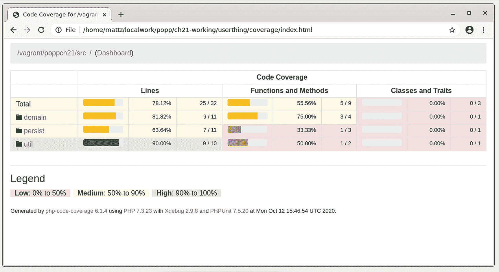

图 21-1

代码覆盖率报告

需要注意的是，实现完全覆盖并不等同于充分测试一个系统。另一方面，了解您的测试中的任何差距是很好的。如你所见，我还有一些工作要做。

确认我可以从命令行检查覆盖率之后，我需要将这个功能添加到我的构建文档中:

```php
// listing 21.04
<target name="citest" depends="build">
    <mkdir dir="reports/coverage" />
    <coverage-setup database="reports/coverage.db">
        <fileset dir="${src}">
            <include name="**/*.php"/>
        </fileset>
    </coverage-setup>

    <phpunit haltonfailure="true" codecoverage="true" bootstrap="${phing.dir}/vendor/autoload.php" printsummary="true">
        <formatter type="plain" usefile="false"/>
        <formatter type="xml" outfile="testreport.xml" todir="reports" />
        <formatter type="clover" outfile="cloverreport.xml" todir="reports" />
        <batchtest>
            <fileset dir="${test}">
                <include name="**/*Test.php"/>
            </fileset>
        </batchtest>
    </phpunit>

    <coverage-report outfile="reports/coverage.xml">
        <report todir="reports/coverage" />
    </coverage-report>
</target>

```

我创建了一个名为`citest`的新任务。大部分都是你已经看过的`test`任务的翻版。

我首先创建一个`reports`目录和一个`coverage`子目录。

我使用`coverage-setup`任务为`coverage`特性提供配置信息。我使用`database`属性指定原始覆盖率数据应该存储在哪里。嵌套的`fileset`元素定义了应该接受覆盖率分析的文件。

我已经向`phpunit`任务添加了两个`formatter`元素。类型为`xml`的`formatter`将生成一个名为`testreport.xml`的文件，该文件将包含测试结果。`clover formatter`将生成覆盖信息，也是 XML 格式的。最后，在`citest`目标中，我部署了`coverage-report`任务。这将获取现有的覆盖率信息，生成一个新的 XML 文件，然后输出一个 HTML 报告。

Note

`CoverageReportTask`元素记录在 [`www.phing.info/guide/chunkhtml/CoverageReportTask.html`](http://www.phing.info/guide/chunkhtml/CoverageReportTask.html) 。

#### 编码标准

我在第 15 章中详细讨论了编码标准。虽然你的个人风格被一个共同的标准所束缚是令人讨厌的，但是它可以使一个项目更容易被更广泛的团队所使用。由于这个原因，许多团队强制执行一个标准。然而，这很难用肉眼来执行，所以自动化这个过程是有意义的。

我将再次使用 Composer。这一次，我将配置它来安装 PHP_CodeSniffer:

```php
    "require-dev": {
        "phpunit/phpunit": "^9",
        "squizlabs/php_codesniffer": "3.*"
    },

```

现在，我将把 PSR-12 编码标准应用到我的代码中:

```php
$ vendor/bin/phpcs --standard=PSR12 src/util/Validator.php

FILE: /vagrant/poppch21/src/util/Validator.php
-----------------------------------------------------------------
FOUND 8 ERRORS AFFECTING 2 LINES
------------------------------------------------------------------
  7 | ERROR | [x] Header blocks must be separated by a single blank line
 22 | ERROR | [ ] Visibility must be declared on method "validateUser"
 22 | ERROR | [ ] Expected "function abc(...)"; found "function abc (...)"
 22 | ERROR | [x] Expected 1 space after FUNCTION keyword; 4 found
 22 | ERROR | [x] Expected 0 spaces after opening parenthesis; 1 found
 22 | ERROR | [x] Expected 0 spaces before opening parenthesis; 3 found
 22 | ERROR | [x] Expected 1 space between comma and argument "$pass"; 0 found
 22 | ERROR | [x] Opening brace should be on a new line
-----------------------------------------------------------------
PHPCBF CAN FIX THE 6 MARKED SNIFF VIOLATIONS AUTOMATICALLY
------------------------------------------------------------------

```

显然，我需要稍微清理一下我的代码！

自动化工具的一个好处是它的非个人性质。如果你的团队决定强加一套编码惯例，那么有一个没有幽默感的脚本来纠正你的风格可能比一个没有幽默感的同事做同样的事情要好。

如您所料，我想在我的构建文件中添加一个`CodeSniffer`目标。

```php
// listing 21.05
<target name="sniff" depends="build">
    <exec executable="vendor/bin/phpcs" passthru="true" dir="${phing.dir}">
        <arg line="--report-checkstyle=reports/checkstyle.xml ​--standard=PSR12  build/src"
/>
    </exec>
</target>

```

虽然 Phing 提供了一个`phpcodesniffer`任务，但是它与最近版本的 PHP_CodeSniffer 不兼容。因此，我再次使用`exec`来运行工具。我用`--report-checkstyle`标志调用`phpcs`,这样它将在`reports`目录中生成一个 XML 文件。

所以我有很多有用的工具可以用来监控我的项目。当然，如果让我自己去做，我很快就会对运行它们失去兴趣，即使是使用我有用的 Phing 构建文件。事实上，我可能会回到集成阶段的旧思想，只有在接近发布时才拿出工具，到那时，它们作为早期预警系统的有效性就无关紧要了。我需要的是一个 CI 服务器来为我运行这些工具。

Jenkins(以前叫 Hudson)是一个开源的持续集成服务器。虽然是用 Java 写的，但是 Jenkins 用 PHP 工具很好用。这是因为持续集成服务器位于它构建的项目之外，启动并监控各种命令的结果。Jenkins 还可以很好地与 PHP 集成，因为它被设计为支持插件，并且有一个非常活跃的开发人员社区正在努力扩展服务器的核心功能。

Note

为什么是詹金斯？Jenkins 非常易于使用和扩展。它已经很好地建立起来，并且有一个活跃的用户社区。它是免费和开源的。支持与 PHP 集成的插件(包括您可能想到的大多数构建和测试工具)是可用的。然而，有许多 CI 服务器解决方案。这本书的前一个版本侧重于 CruiseControl ( [`http://cruisecontrol.sourceforge.net/`](http://cruisecontrol.sourceforge.net/) )，这仍然是一个不错的选择。

#### 安装 Jenkins

Jenkins 是一个 Java 系统，所以你需要安装 Java。如何做到这一点将因系统而异。詹金斯网站在 [`www.jenkins.io/doc/book/installing/`](http://www.jenkins.io/doc/book/installing/) 提供了良好的安装说明。

多亏了 vagger，我现在正在 CentOS 7 系统上安装，以下是我的安装步骤:

```php
$ sudo wget -O /etc/yum.repos.d/jenkins.repo \
    https://pkg.jenkins.io/redhat-stable/jenkins.repo
$ sudo rpm --import https://pkg.jenkins.io/redhat-stable/jenkins.io.key
$ sudo yum update
$ sudo yum install jenkins java-1.8.0-openjdk-devel
$ sudo systemctl daemon-reload

```

你可以这样开始詹金斯:

```php
$ sudo systemctl start jenkins

```

默认情况下，Jenkins 在端口 8080 上运行，因此您可以通过启动浏览器并访问`http://yourhost:8080/`来确定您是否准备好继续。你应该会看到类似图 [21-2](#Fig2) 中的屏幕。

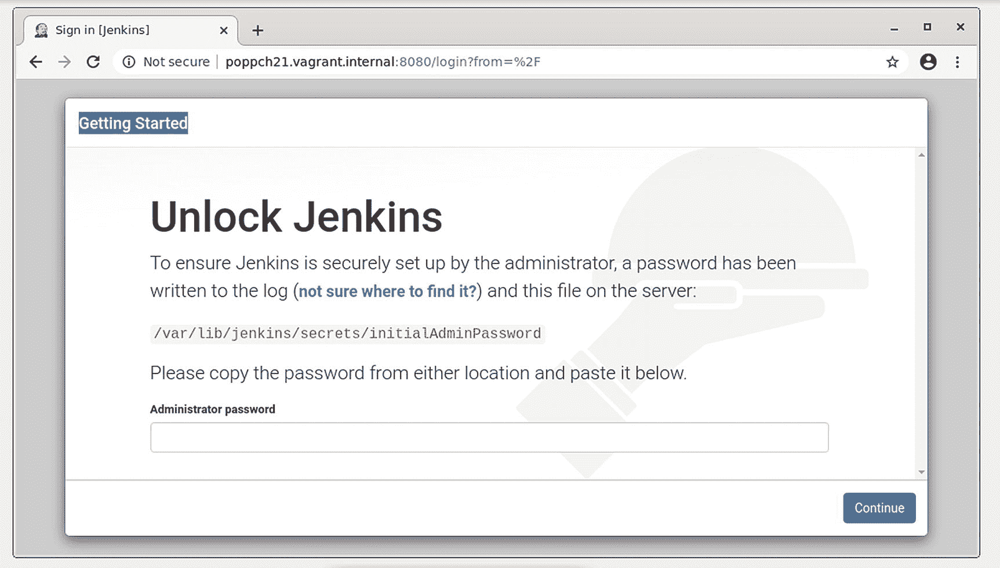

图 21-2

安装屏幕

图 [21-2](#Fig2) 中的说明一目了然。我从`/var/lib/jenkins/secrets/initialAdminPassword`获取密码(使用`sudo`是因为受限的读取权限),并将其输入到提供的框中。然后我面临一个选择:用流行的插件安装还是选择我自己的？我选择最流行的插件，我知道它会让我获得对 Git 的支持。如果您想要一个苗条的系统，您可以选择只选择那些您需要的插件。之后，是时候在完成安装之前创建用户名和密码了。

### 安装 Jenkins 插件

Jenkins 是高度可定制的，我将需要相当多的插件来集成我在本章中描述的特性。在 Jenkins web 界面中，我点击`Manage Jenkins`，然后点击`Manage Plugins`。在`Available`标签下，我发现了一个长长的列表。我在`Install`列中选择我希望添加到 Jenkins 的所有插件的复选框。

表 [21-1](#Tab1) 描述了我将要使用的插件。

表 21-1

一些 Jenkins 插件

<colgroup><col class="tcol1 align-left"> <col class="tcol2 align-left"></colgroup> 
| 

插件

 | 

描述

 |
| --- | --- |
| Git 插件 | 允许与 Git 存储库交互 |
| jUnit 插件 | 与包括 PHPUnit 在内的 xUnit 工具系列集成 |
| Phing 插件 | 调用 Phing 目标 |
| Clover PHP 插件 | 访问 clover XML 文件和由 PHPUnit 生成的 HTML 文件并生成报告 |
| HTML Publisher 插件 | 集成 HTML 报告。用于 PHPDocumentor 输出 |
| 警告下一代插件 | 访问 PHPCodeSniffer 生成的 XML 文件并生成报告 |

可以看到图 [21-3](#Fig3) 中的 Jenkins 插件页面。

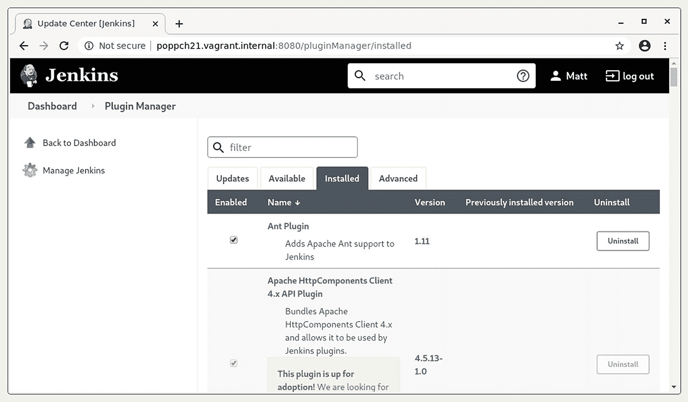

图 21-3

詹金斯插件屏幕

安装完这些插件后，我就可以创建和配置我的项目了。

### 设置 Git 公钥

在使用 Git 插件之前，我需要确保能够访问 Git 存储库。在第 [17](17.html) 章中，我描述了为了访问远程 Git 库而生成公钥的过程。我们需要在这里重复这个过程。但是詹金斯把哪里叫做家呢？

这个位置是可配置的，但自然詹金斯会提示你。我点击`Manage Jenkins`，然后点击`Configure System`。我发现詹金斯的主目录在那里。当然，我也可以检查`/etc/ passwd`文件中与`jenkins`用户相关的信息。在我的例子中，目录是`/var/lib/jenkins`。

现在我需要配置一个`SSH`目录:

```php
$ sudo su jenkins -s /bin/bash
$ cd ~
$ mkdir .ssh
$ chmod 0700 .ssh
$ ssh-keygen

```

我切换到`jenkins`用户，指定要使用的 shell(因为 shell 访问在默认情况下可能被禁用)。我切换到这个用户的主目录。`ssh-keygen`命令生成 SSH 密钥。当提示输入密码时，我只需按回车键，这样 Jenkins 将只通过其密钥进行身份验证。我确保在`.ssh/id_rsa`生成的文件既不是全球可读的，也不是群体可读的:

```php
$ chmod 0600 .ssh/id_rsa

```

我可以从`.ssh/id_rsa.pub`获取公钥，并将其添加到我的远程 Git 存储库中。详见第 17 章。

我还没到那一步。我需要确保我的 Git 服务器是一个已知的 SSH 主机。我可以将这种设置与我的 Git 配置的命令行测试结合起来。当我这样做时，我确保我仍然以`jenkins`用户的身份登录:

```php
$ cd /tmp
$ git clone git@bitbucket.org:getinstance/userthing.git

```

我被提示确认我的 Git 主机，然后它被添加到用户的文件中。这可以防止 Jenkins 在稍后建立 Git 连接时被绊倒。

Note

还有各种插件可以用来管理 Git 凭证，包括 *SSH 代理*、 *OAuth 凭证*和 *Kubernetes 凭证*。

### 安装项目

在 Jenkins 仪表板页面，我点击`New Item`。在这个新屏幕上，我终于可以创建我的`userthing`项目了。在图 [21-4](#Fig4) 中可以看到设置画面。

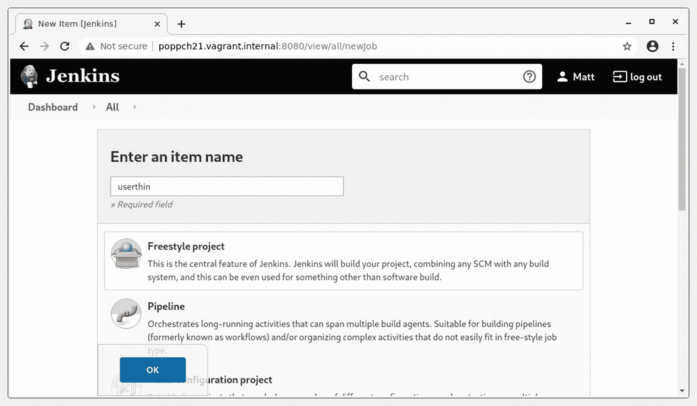

图 21-4

项目设置屏幕

我选了`Freestyle project`，打了`OK`。这将我带到项目配置屏幕。我的首要任务是链接远程 Git 存储库。我在`Source Code Manager section`中选择 Git 单选按钮并添加我的存储库。你可以在图 [21-5](#Fig5) 中看到这一点。

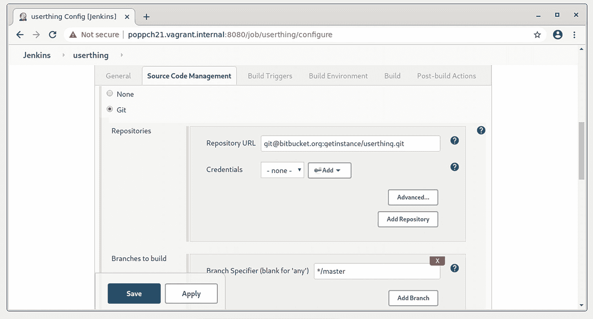

图 21-5

设置版本控制存储库

如果一切顺利，我应该可以访问我的源代码。我可以通过保存并从仪表板页面选择`Build Now`来检查。然而，为了看到一些有意义的行动，我也应该建立 Phing。这很简单，因为我已经集中安装了 Phing。然而，如果你像我一样使用 Composer，事情就有点复杂了。你必须告诉詹金斯在哪里可以找到 Phing 可执行文件。您可以通过从主菜单中选择`Manage Jenkins`，然后选择`Global Tool Configuration`来完成此操作。因为我已经安装了 Phing 插件，所以我将在那里为该工具找到一个配置区域。我点击`Add Phing`进入表格。在图 [21-6](#Fig6) 中，我展示了你用来引用 Phing 本地版本的配置区域。

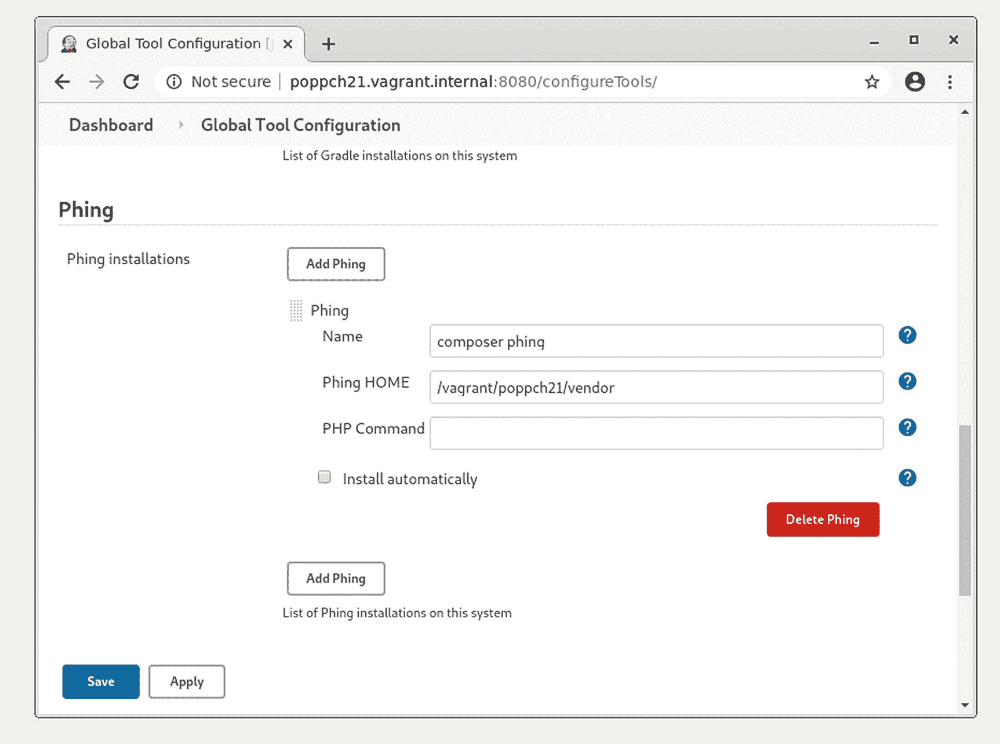

图 21-6

指定 Phing 的位置

我给这个配置起了一个名字，并将路径添加到我的项目中的`vendor`目录，Phing 就在这个目录中。

一旦我确信 Jenkins 可以找到 Phing，我就可以为我的项目配置它。我返回到`userthing`项目区和`Configure`菜单。我滚动到`Build`部分，从`Add build step`下拉菜单中选择两个项目。首先，我选择`Execute shell`。我需要确保 Jenkins 运行`composer install`，否则我的项目所依赖的工具都不会被安装。图 [21-7](#Fig7) 为其结构示意图。

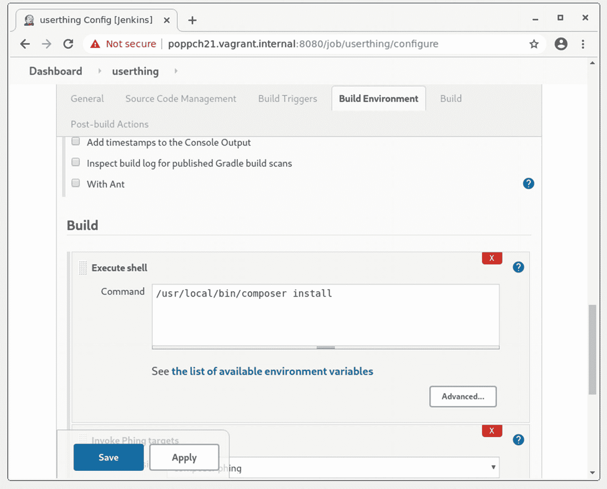

图 21-7

设置外壳执行

我从`Add build step`下拉菜单中选择的下一个项目是`Invoke Phing targets`。我从下拉菜单中选择我之前配置的 Phing 实例(`composer phing`)并将我的目标添加到文本字段中。你可以在图 [21-8](#Fig8) 中看到这个步骤。

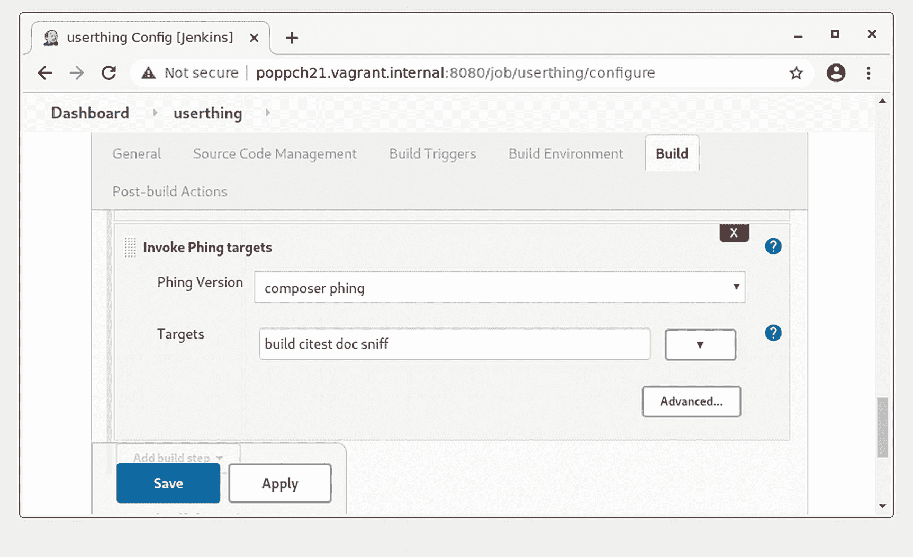

图 21-8

配置 Phing

### 运行第一次构建

我保存配置屏幕并点击`Build Now`来运行构建和测试过程。这是关键时刻！构建链接应该出现在屏幕的`Build History`区域。我点击它，然后点击`Console Output`来确认构建按预期进行。您可以在图 [21-9](#Fig9) 中看到输出。

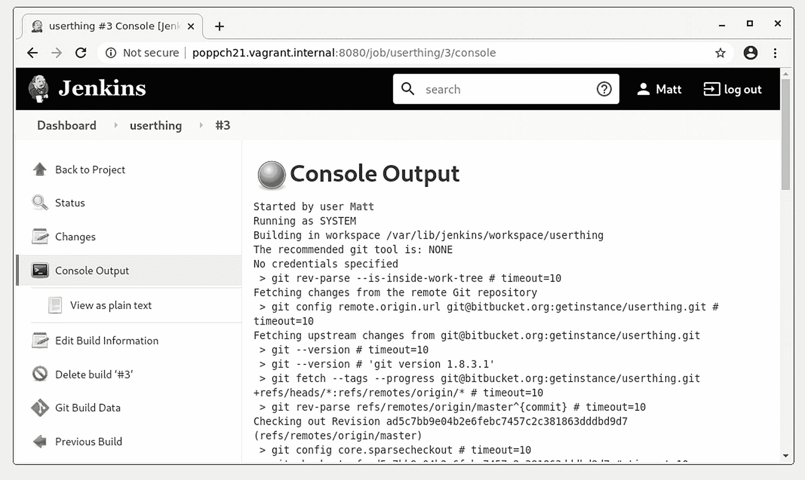

图 21-9

控制台输出

Jenkins 从 Git 服务器检查出`userthing`代码，并运行所有的构建和测试目标。

### 配置报告

多亏了我的构建文件，Phing 将报告保存在`build/reports`目录中，将文档保存在`build/docs`中。我激活的插件可以在项目配置界面的`Add post-build action`下拉菜单中进行配置。

图 [21-10](#Fig10) 显示了其中一些配置项目。

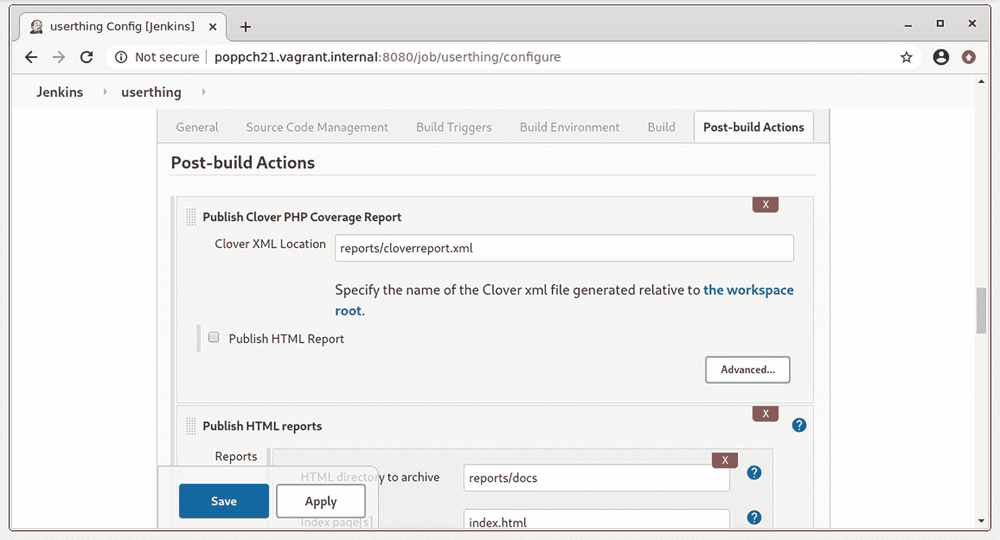

图 21-10

配置报告插件项目

而不是让你一个接一个的截图，把配置项压缩成一个表格会更清晰。表 [21-2](#Tab2) 显示了我的 Phing 构建文件中的一些后期构建动作字段和相应的目标。

表 21-2

报告配置

<colgroup><col class="tcol1 align-left"> <col class="tcol2 align-left"> <col class="tcol3 align-left"> <col class="tcol4 align-left"></colgroup> 
| 

配置项

 | 

Phing 目标

 | 

田

 | 

价值

 |
| --- | --- | --- | --- |
| 记录编译器警告和静态分析结果 | `sniff` | 工具 | `PHP_CodeSniffer` |
|   |   | 报告文件模式 | `reports/checkstyle.xml` |
| 发布 Clover PHP 覆盖率报告 | `citest` | Clover XML 位置 | `reports/cloverreport.xml` |
|   |   | Clover HTML 报告目录 | `reports/clovercoverage/` |
| 发布 HTML 报告 | `doc` | HTML 目录到 | `reports/docs` |
|   |   | 存档索引页 | `index.html` |
| 发布 Junit 测试结果报告 | `citest` | 测试报告 XML | `reports/testreport.xml` |
| 电子邮件通知 |   | 收件人 | `someone@somemail.com` |

当我构建项目的构建文件时，你会遇到表 [21-2](#Tab2) 中的所有配置值。全部，也就是除了最后一个。`E-mail Notification`字段允许您定义一个开发人员列表，当一个构建失败时，他们都会收到通知。

在检查覆盖率之前，我必须创建一个名为`XDEBUG_MODE`的环境变量，其值为`coverage`。我可以去`Manage Jenkins`然后去`Configure System`屏幕。如图 [21-11](#Fig11) 所示，我可以在`Global Properties`部分设置环境变量。

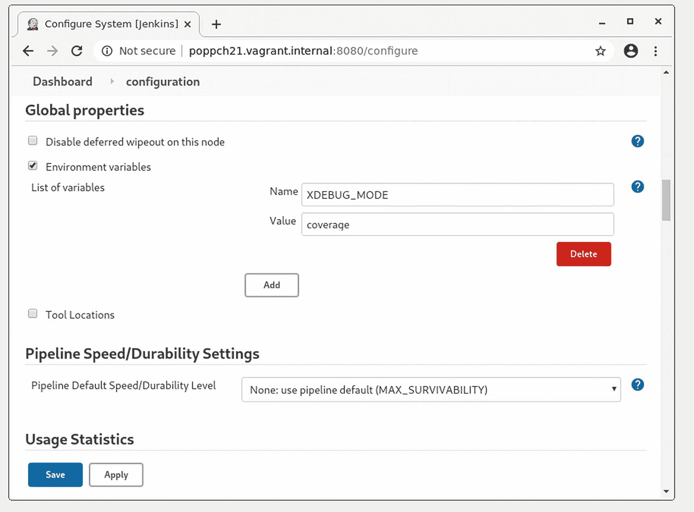

图 21-11

设置环境变量

完成所有设置后，我可以返回到项目屏幕并运行另一个构建。图 [21-12](#Fig12) 显示了我新增强的输出。

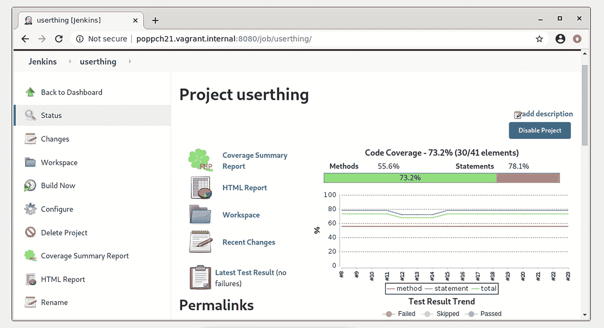

图 21-12

显示趋势信息的项目屏幕

随着时间的推移，项目屏幕将绘制测试性能、覆盖率和风格符合性的趋势。还有到最新 API 文档、详细测试结果和全覆盖信息的链接。

### 触发构件

如果团队中的某个人必须记得通过手动点击来启动每个构建，那么所有这些丰富的信息几乎都是无用的。当然，Jenkins 提供了自动触发构建的机制。

您可以设置 Jenkins 以固定的时间间隔进行构建，或者以指定的时间间隔轮询版本控制存储库。可以使用 cron 格式设置时间间隔，这提供了对调度的精细控制，尽管有些神秘。幸运的是，Jenkins 为该格式提供了很好的在线帮助，如果您不需要精确调度，还有简单的别名。别名有`@hourly`、`@midnight`、`@daily`、`@weekly`、`@monthly`。在图 [21-13](#Fig13) 中，我将构建配置为每天运行一次，或者每当存储库发生变化时运行，基于每小时一次的变更轮询。

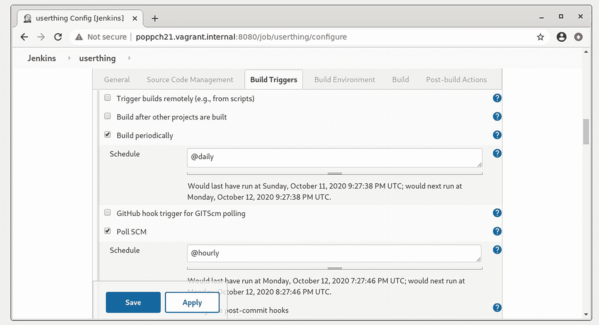

图 21-13

调度构建

#### 测试失败

到目前为止，一切似乎进展顺利，即使`userthing`不会很快赢得任何法规遵从徽章。但是测试失败时就会成功，所以我最好打破一些东西，以确保 Jenkins 报告它。

下面是命名空间`userthing\util`中名为`Validate`的类的一部分:

```php
// listing 21.06
public function validateUser(string $mail, string $pass): bool
{
    // make it always fail
    // return false;
    $user = $this->store->getUser($mail);
    if (is_null($user)) {
        return false;
    }
    $testpass = $user->getPass();
    if ($testpass == $pass) {
        return true;
    }

    $this->store->notifyPasswordFailure($mail);
    return false;
}

```

看看我会在哪里破坏这个方法？如果我取消了方法中第二行的注释，`validateUser()`将总是返回`false`。

下面的测试应该会让你窒息。就在`test/util/ValidatorTest.php`里:

```php
// listing 21.07
public function testValidateCorrectPass(): void
{
    $this->assertTrue(
        $this->validator->validateUser("bob@example.com", "12345"),
        "Expecting successful validation"
    );
}

```

做出改变后，我需要做的就是提交并等待。果不其然，不久之后，项目状态显示了一个由黄色图标标记的构建(表示整个项目的健康状况已经恶化)。单击构建链接后，我会找到更多详细信息。您可以看到图 [21-14](#Fig14) 中的屏幕。

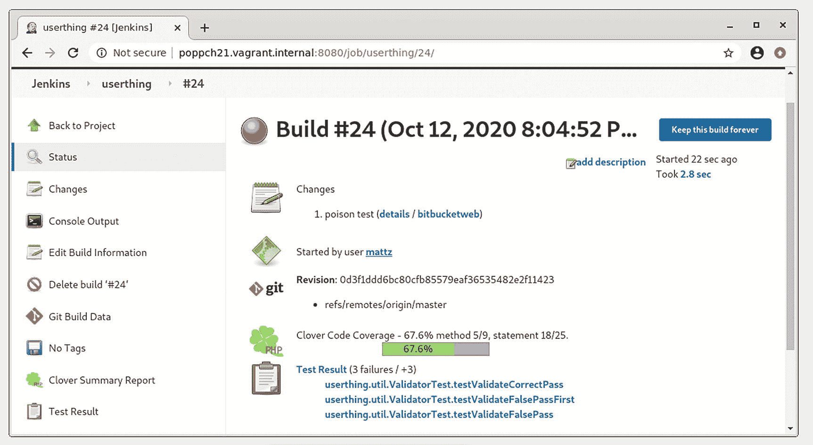

图 21-14

失败的构建

记住，如果你需要更多关于构建错误的信息，你可以点击构建界面中的`Console Output`链接。您通常会在那里找到比构建摘要屏幕本身更有用的信息。

## 摘要

在这一章中，我把你在前面章节中看到的许多工具放在一起，并用 Jenkins 把它们粘在一起。我为 CI 准备了一个小项目，应用了一系列工具，包括 PHPUnit(用于测试和代码覆盖)、PHP_CodeSniffer、phpDocumentor 和 Git。然后，我设置了 Jenkins，并向您展示了如何向系统添加项目。我测试了系统的速度，最后，向您展示了如何扩展 Jenkins，以便它可以用电子邮件来调试您，并测试构建和安装。