# 6.赋予形式以生命

表单是使用 PHP 的核心。您使用表单登录受限页面、注册新用户、向在线商店下订单、在数据库中输入和更新信息、发送反馈……等等。所有这些用法背后都有相同的原则，所以你从本章学到的知识在大多数 PHP 应用程序中都有实用价值。为了演示如何处理表单中的信息，我将向您展示如何收集网站访问者的反馈并将其发送到您的邮箱。

不幸的是，用户输入可能会使您的站点遭受恶意攻击。在接受表单之前检查从表单提交的数据是很重要的。尽管 HTML5 表单元素在现代浏览器中验证用户输入，但您仍然需要检查服务器上的数据。HTML5 验证有助于合法用户避免提交有错误的表单，但是恶意用户可以很容易地避开在浏览器中执行的检查。服务器端验证不是可选的，而是必不可少的。本章中的 PHP 解决方案向你展示了如何过滤或阻止任何可疑或危险的东西。没有一个在线应用程序是完全防黑客的，但是要让除了最坚定的掠夺者之外的所有人远离黑客并不需要太多的努力。如果表单不完整或发现错误，最好保留用户输入并重新显示。

这些解决方案构建了一个完整的邮件处理脚本，可以以不同的形式重用，因此按顺序阅读它们非常重要。

在本章中，您将了解以下内容:

*   了解用户输入是如何从在线表单传输的

*   显示错误而不丢失用户输入

*   验证用户输入

*   通过电子邮件发送用户输入

## PHP 如何从表单中收集信息

尽管 HTML 包含了构建表单所需的所有标签，但它没有提供任何提交表单时处理表单的方法。为此，你需要一个服务器端的解决方案，比如 PHP。

日本之旅网站包含一份简单的反馈表(见图 [6-1](#Fig1) )。其他元素—如单选按钮、复选框和下拉菜单—将在以后添加。

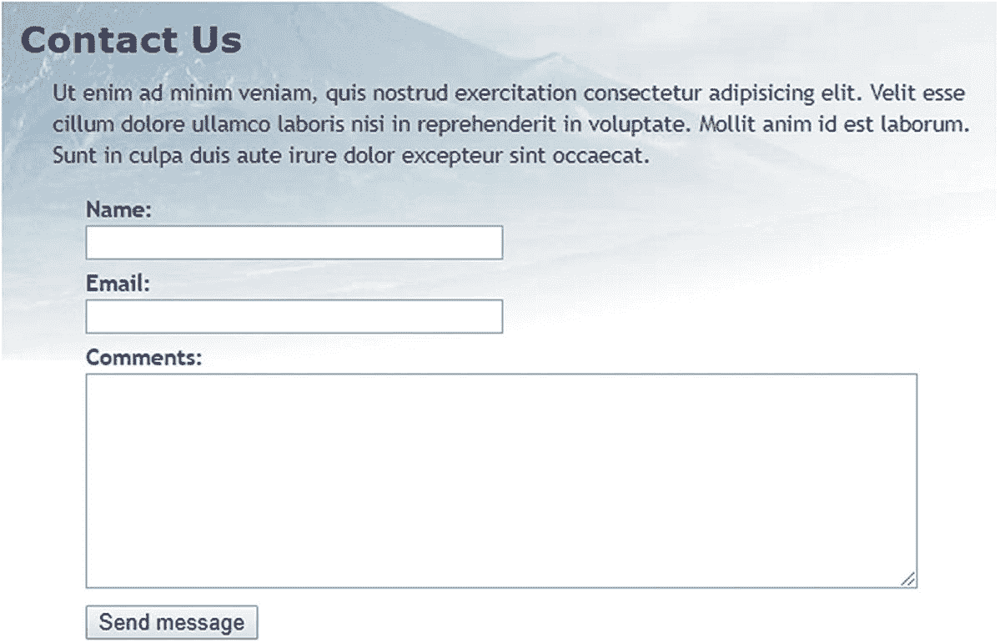

图 6-1

处理反馈表单是 PHP 最常见的用途之一

首先，让我们看看表单的 HTML 代码(它在`ch06`文件夹的`contact_01.php`中):

```php
<form method="post" action="">
    <p>
        <label for="name">Name:</label>
        <input name="name" id="name" type="text">
    </p>
    <p>
        <label for="email">Email:</label>
        <input name="email" id="email" type="text">
    </p>
    <p>
        <label for="comments">Comments:</label>
        <textarea name="comments" id="comments"></textarea>
    </p>
    <p>
        <input name="send" type="submit" value="Send message">
    </p>
</form>

```

前两个`<input>`标签和`<textarea>`标签包含设置为相同值的`name`和`id`属性。这种重复的原因是可访问性。HTML 使用`id`属性将`<label>`元素与正确的`<input>`元素关联起来。然而，表单处理脚本依赖于`name`属性。因此，尽管`id`属性在 Submit 按钮中是可选的，但是对于想要处理的每个表单元素，您*必须*使用`name`属性。

Note

表单输入元素的`name`属性通常不应该包含空格。如果您想要组合多个单词，请用下划线将它们连接起来(如果您留下任何空格，PHP 会自动这样做)。因为本章后面开发的脚本将`name`属性转换为 PHP 变量，所以不要在 PHP 变量名称中使用连字符或任何其他无效字符。

另外两件需要注意的事情是开始的`<form>`标签中的`method`和`action`属性。`method`属性决定了表单如何发送数据。可以设置为`post`或`get`。`action`属性告诉浏览器在单击提交按钮时将数据发送到哪里进行处理。如果该值为空，就像这里一样，页面会尝试自己处理表单。但是，空的 action 属性在 HTML5 中是无效的，因此需要解决这个问题。

Note

我有意避免使用任何新的 HTML5 表单特性，比如`type="email"`和`required`属性。这使得测试 PHP 服务器端验证脚本变得更加容易。测试后，您可以更新表单以使用 HTML5 验证功能。浏览器中的验证主要是为了避免用户提交不完整的信息，所以它是可选的。永远不要跳过服务器端验证。

### 理解 post 和 get 之间的区别

演示`post`和`get`方法之间的区别的最好方法是用一个真实的表单。如果您完成了上一章，您可以继续使用相同的文件。

否则，`ch06`文件夹包含日本旅程网站的一整套文件，其中包含第 [5](05.html) 章的所有代码。将`contact_01.php`复制到站点根目录，并将其重命名为`contact.php`。同时将`ch06/includes`文件夹中的`footer.php`、`menu.php`和`title.php`复制到站点根目录下的`includes`文件夹中。

1.  找到`contact.php`中的开始`<form>`标签，将`method`属性的值从`post`更改为`get`，如下所示:

1.  保存`contact.php`并在浏览器中加载页面。在表单中键入您的姓名、电子邮件地址和一条短信。然后单击发送消息。

```php
<form method="get" action="">

```

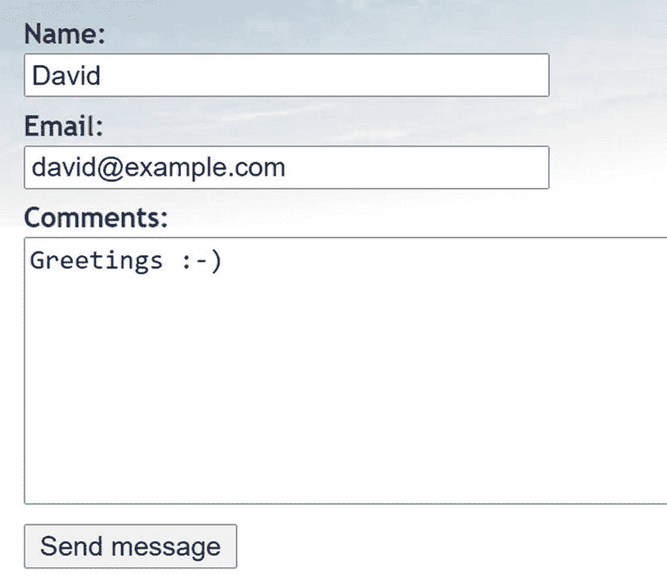

1.  查看浏览器地址栏。您应该会看到附加在 URL 末尾的表单内容，如下所示:

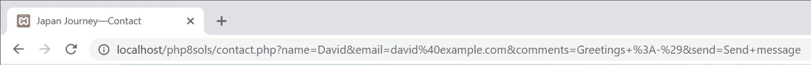

如果你把网址拆开，看起来是这样的:

```php
http://localhost/php8sols/contact.php
?name=David
&email=david%40example.com
&comments=Greetings+%3A-%29
&send=Send+message

```

表单提交的数据已经作为一个以问号开头的**查询字符串**附加到基本 URL 上。来自每个字段和提交按钮的值由表单元素的`name`属性标识，后跟一个等号和提交的数据。来自每个输入元素的数据由一个&符号(`&`)分隔。URL 不能包含空格或某些字符(如感叹号或笑脸)，因此浏览器用`+`替换空格，并将其他字符编码为十六进制值，这一过程称为 **URL 编码**(完整的值列表请参见 [`www.degraeve.com/reference/urlencoding.php`](http://www.degraeve.com/reference/urlencoding.php) )。

1.  回到`contact.php`的代码，把`method`改回`post`，像这样:

1.  保存`contact.php`并在浏览器中重新加载页面，确保从 URL 的末尾清除查询字符串。键入另一条消息，然后单击发送消息。您的消息应该会消失，但不会发生其他事情。它没有丢失，但是你还没有做任何事情来处理它。

2.  在`contact.php`中，在结束`</form>`标签的正下方添加以下代码:

```php
<form method="post" action="">

```

```php
<pre>
<?php if ($_POST) { print_r($_POST); } ?>
</pre>

```

如果已经发送了任何`post`数据，这将显示`$_POST`超全局数组的内容。如第 [4](04.html) 章所述，`print_r()`函数允许你检查数组的内容；`<pre>`标签只是让输出更容易阅读。

1.  保存页面并单击浏览器中的刷新按钮。您可能会看到类似下面的警告。这告诉你数据会被重发，这正是你想要的。确认您要再次发送信息。

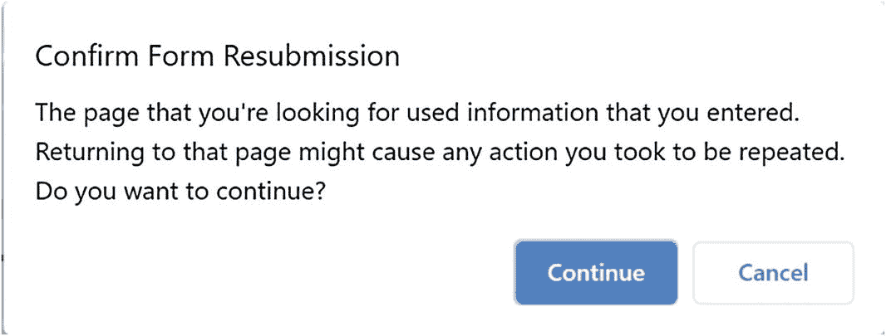

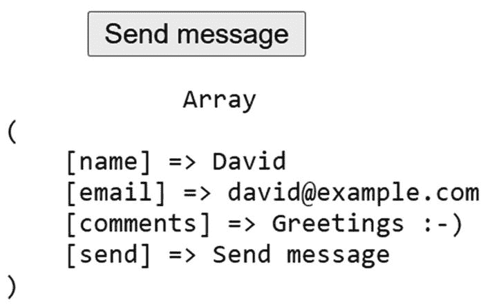

图 6-2

＄_ POST 数组使用表单的名称属性来标识每个数据元素

1.  步骤 6 中的代码现在应该在表单下方显示您的消息内容，如图 [6-2](#Fig2) 所示。一切都存储在 PHP 的超级全局数组之一`$_POST`中，其中包含使用`post`方法发送的数据。每个表单元素的`name`属性被用作数组键，这使得检索内容变得很容易。

正如您刚才看到的，`get`方法发送附加到 URL 上的数据，而`post`方法发送带有 HTTP 头的数据，因此它是隐藏的。一些浏览器将 URL 的最大长度限制在 2000 个字符左右，因此`get`方法只能用于少量数据。`post`方法可用于更大量的数据。默认情况下，PHP 允许高达 8 MB 的`post`数据，尽管托管公司可能会设置不同的限制。

然而，这两种方法之间最重要的区别是它们的预期用途。`get`方法被设计用于无论请求多少次都不会导致服务器发生变化的请求。因此，它主要用于数据库搜索；给你的搜索结果做书签很有用，因为所有的搜索标准都在 URL 中。另一方面，`post`方法是为导致服务器发生变化的请求而设计的。所以它被用来插入、更新或删除数据库中的记录，上传文件或发送电子邮件。

我们将在本书的后面回到`get`方法。这一章集中在`post`方法和它相关的超级全局数组`$_POST`。

### 用 PHP 超级全局变量获取表单数据

`$_POST`超全局数组包含使用`post`方法发送的数据。毫不奇怪，`get`方法发送的数据在`$_GET`数组中。

要访问表单提交的值，只需将表单元素的`name`属性放在`$_POST`或`$_GET`后面的方括号中，这取决于表单的`method`属性。因此，如果通过`post`方法发送，则`email`变为`$_POST['email']`，如果通过`get`方法发送，则变为`$_GET['email']`。么事儿啦在那里。

您可能会遇到使用`$_REQUEST`的脚本，这避免了区分`$_POST`或`$_GET`的需要。不太安全。你应该总是知道用户信息来自哪里。`$_REQUEST`还包括 cookie 的值，所以您不知道您处理的是 post 方法提交的值，还是通过 URL 传输或由 cookie 注入的值。始终使用`$_POST`或`$_GET`。

你可能会遇到使用`$HTTP_POST_VARS`和`$HTTP_GET_VARS`的旧脚本，它们与`$_POST`和`$_GET`的意思相同。这些都是过时的，已经从 PHP 8 中删除了。

## 处理和验证用户输入

本章的最终目的是通过电子邮件将`contact.php`表格中的输入发送到您的收件箱。使用 PHP `mail()`函数相对简单。它至少需要三个参数:电子邮件要发送到的地址、包含主题行的字符串和包含邮件正文的字符串。通过将输入字段的内容连接成一个字符串来构建消息体。

大多数互联网服务提供商(ISP)实施的安全措施使得在本地测试环境中测试`mail()`功能变得非常困难。PHP 解决方案 6-2 到 6-5 没有直接使用`mail()`，而是专注于验证用户输入以确保必填字段被填写并显示错误消息。实施这些措施使您的在线表单更加用户友好和安全。

使用 JavaScript 或 HTML5 表单元素和属性来检查用户输入被称为**客户端验证**，因为它发生在用户的计算机(或客户端)上。它很有用，因为它几乎是即时的，可以提醒用户有问题，而无需与服务器进行不必要的往返。然而，客户端验证很容易回避。恶意用户只需从自定义脚本提交数据，您的检查就会变得毫无用处。用 PHP 检查用户输入也很重要。

Tip

客户端验证本身是不够的。总是使用 PHP 的服务器端验证来验证来自外部数据源的数据。

### 创建可重用的脚本

为多个网站重用同一个脚本(可能只需少量编辑)可以节省大量时间。然而，将输入数据发送到一个单独的文件进行处理，很难在不丢失用户输入的情况下提醒用户错误。为了解决这个问题，本章采用的方法是使用所谓的**自处理表单**。

提交表单时，页面会重新加载，条件语句会运行处理脚本。如果服务器端验证检测到错误，表单可以重新显示错误消息，同时保留用户的输入。特定于表单的脚本部分将嵌入到 DOCTYPE 声明之上。通用的、可重用的部分将位于一个单独的文件中，该文件可以包含在任何需要电子邮件处理脚本的页面中。

#### PHP 解决方案 6-1:防止自处理表单中的跨站脚本

当提交数据时，将开始表单标签的`action`属性留空或完全忽略它会重新加载表单。但是，空的`action`属性在 HTML5 中是无效的。PHP 有一个非常方便的超级全局变量(`$_SERVER['PHP_SELF']`)，它包含当前文件的站点根目录相对路径。将它设置为`action`属性的值会自动为自处理表单插入正确的值——但是单独使用它会将您的站点暴露给被称为**跨站脚本** (XSS)的恶意攻击。这个 PHP 解决方案解释了风险，并展示了如何安全地使用`$_SERVER['PHP_SELF']`。

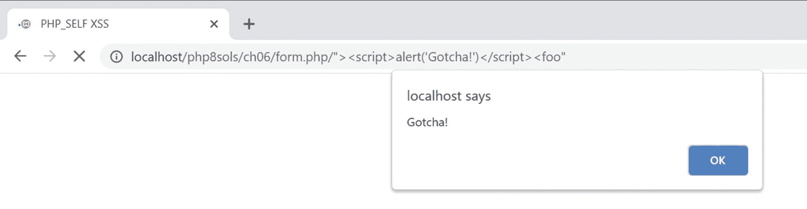

图 6-3

畸形链接嵌入了 XSS 攻击

1.  将`ch06`文件夹中的`bad_link.php`加载到浏览器中。它在同一个文件夹中包含一个到`form.php`的链接；但是底层 HTML 中的链接已经被故意弄成畸形，以模拟 XSS 攻击。

    注意，这个 PHP 解决方案的练习文件中的链接假设它们位于本地主机服务器根目录下的一个名为`php8sols/ch06`的文件夹中。如有必要，调整它们以符合您的测试设置。

2.  单击该链接。在大多数浏览器中，您应该会看到如图 [6-3](#Fig3) 所示的 JavaScript 警告对话框。

Note

谷歌 Chrome 和微软 Edge 曾用 XSS 过滤器阻止可疑攻击。但是，它已经被删除，取而代之的是使用内容安全策略(CSP)。有关 CSP 的详细信息，请参见 [`https://developer.mozilla.org/en-US/docs/Web/HTTP/CSP`](https://developer.mozilla.org/en-US/docs/Web/HTTP/CSP) 。

1.  消除 JavaScript 警告，并右键单击以查看页面源代码。第 10 行应该类似如下:

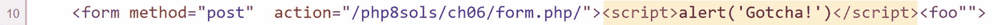

`bad_link.php`中的错误链接在开始的`<form>`标签后立即向页面中注入了一段 JavaScript 代码。在这种情况下，这是一个无害的 JavaScript 警报；但在真正的 XSS 攻击中，它可能会试图窃取 cookies 或其他个人信息。这种攻击是无声的，让用户不知道发生了什么，除非他们注意到浏览器地址栏中的脚本。

这是因为`form.php`使用`$_SERVER['PHP_SELF']`来生成`action`属性的值。畸形链接在`action`属性中插入页面位置，关闭开始表单标签，然后注入`<script>`标签，该标签在页面加载时立即执行。

1.  抵消这种类型的 XSS 攻击的一个简单方法是像这样将`$_SERVER['PHP_SELF']`传递给`htmlentities()`函数:

```php
<form method="post"  action="<?= htmlentities($_SERVER['PHP_SELF']) ?>">

```

这将把`<script>`标签的尖括号转换成它们的 HTML 实体等价物，防止脚本被执行。虽然它可以工作，但它会在浏览器地址栏中留下格式错误的 URL，这可能会导致用户质疑您的站点的安全性。我认为更好的解决方案是在检测到 XSS 病毒时将用户重定向到错误页面。

1.  在`form.php`中，在 DOCTYPE 声明上方创建一个 PHP 块，并使用当前文件的站点根目录相对路径定义一个变量，如下所示:

1.  现在比较一下`$currentPage`和`$_SERVER['PHP_SELF']`的值。如果它们不相同，使用`header()`函数将用户重定向到一个错误页面并立即退出脚本，如下所示:

```php
<?php
$currentPage = '/php8sols/ch06/form.php';
?>
<!doctype html>

```

```php
if ($currentPage !== $_SERVER['PHP_SELF']) {
    header('Location: http://localhost/php8sols/ch06/missing.php');
    exit;
}

```

Caution

传递给`header()`函数的位置必须是完全合格的 URL。如果使用与文档相关的链接，目标将附加到格式错误的链接上，从而阻止页面被成功重定向。

1.  使用`$currentPage`作为开始表单标签中`action`属性的值:

1.  保存`form.php`，返回`bad_link.php`，再次点击链接。这次你应该被直接带到`missing.php`。

2.  直接在浏览器中加载`form.php`。它应该像预期的那样加载和工作。

```php
<form method="post"  action="<?= $currentPage ?>">

```

完成的版本在`ch06`文件夹的`form_end.php`中。如果你只是想测试脚本，名为`bad_link_end.php`的文件链接到完成的版本。

这种技术比简单地将`$_SERVER['PHP_SELF']`传递给`htmlentities()`函数涉及更多的代码；但是它有一个优点，如果用户通过一个恶意链接访问您的表单，它可以将用户无缝地引导到一个错误页面。显然，错误页面应该链接回主菜单。

#### PHP 解决方案 6-2:确保必填字段不为空

当必填字段为空时，您将无法获得所需的信息，并且用户可能永远得不到回复，尤其是当联系方式被省略时。

继续使用本章前面的“理解 post 和 get 之间的区别”中的文件。或者，使用`ch06`文件夹中的`contact_02.php`，并从文件名中删除`_02`。

1.  处理脚本使用两个名为`$errors`和`$missing`的数组来存储错误的详细信息和尚未填写的必填字段。这些数组将用于控制表单标签旁边的错误消息的显示。页面第一次加载时不会有任何错误，所以在`contact.php`顶部的 PHP 代码块中将`$errors`和`$missing`初始化为空数组，就像这样:

1.  只有在表单提交后，电子邮件处理脚本才会运行。使用条件语句检查超全局变量`$_SERVER['REQUEST_METHOD']`的值。如果是 POST(全部大写)，您知道表单已经使用`post`方法提交了。将粗体突出显示的代码添加到页面顶部的 PHP 块中。

```php
<?php
include './includes/title.php';
$errors = [];
$missing = [];
?>

```

```php
<?php
include './includes/title.php';
$errors = [];
$missing = [];
// check if the form has been submitted
if ($_SERVER['REQUEST_METHOD'] == 'POST') {
    // email processing script
}
?>

```

Tip

检查`$_SERVER['REQUEST_METHOD']`的值是否为 POST 是一个通用条件，可以用于任何表单，不管 Submit 按钮的名称是什么。

1.  虽然您现在还不会发送电子邮件，但是可以定义两个变量来存储电子邮件的目的地址和主题行。以下代码位于您在上一步中创建的条件语句中:

1.  接下来，创建两个数组:一个列出表单中每个字段的`name`属性，另一个列出所有*必需的*字段。为了便于演示，将`email`字段设为可选，这样就只需要`name`和`comments`字段。将以下代码添加到条件块中，紧接在定义主题行的代码之后:

```php
if ( $_SERVER['REQUEST_METHOD'] == 'POST') {
    // email processing script
    $to = 'david@example.com'; // use your own email address
    $subject = 'Feedback from Japan Journey';
}

```

```php
    $subject = 'Feedback from Japan Journey';
    // list expected fields
    $expected = ['name', 'email', 'comments'];
    // set required fields
    $required = ['name', 'comments'];
}

```

Tip

`$expected`数组是为了防止攻击者将其他变量注入到`$_POST`数组中，试图覆盖您的默认值。通过只处理那些您期望的变量，您的表单更加安全。任何虚假值都将被忽略。

1.  下一部分代码不是特定于这个表单的，所以它应该放在一个外部文件中，可以包含在任何电子邮件处理脚本中。在`includes`文件夹中创建一个名为`processmail.php`的新 PHP 文件。然后将它包含在`contact.php`中，紧跟在您在上一步中输入的代码之后，就像这样:

1.  `processmail.php`中的代码首先检查`$_POST`变量中已经留空的必填字段。去掉由你的编辑器插入的任何默认代码，并将下面的代码添加到`processmail.php`:

```php
    $required = ['name', 'comments'];
    require './includes/processmail.php';
}

```

```php
<?php
foreach ($_POST as $key => $value) {
    // strip whitespace from $value if not an array
    if (!is_array($value)) {
        $value = trim($value);
    }
    if (!in_array($key, $expected)) {
        // ignore the value, it's not in $expected
        continue;
    }
    if (in_array($key, $required) && empty($value)) {
        // required value is missing
        $missing[] = $key;
        $$key = "";
        continue;
    }
    $$key = $value;
}

```

这个`foreach`循环处理`$_POST`数组，从文本字段中去除前导和尾随空格，并将字段内容赋给一个具有简化名称的变量。结果，`$_POST['email']`变成了`$email`等等。它还检查必填字段是否为空，并将它们添加到`$missing`数组中，将相关变量设置为空字符串。

`$_POST`数组是一个关联数组，所以循环将当前元素的键和值分别分配给`$key`和`$value`。通过使用带有逻辑 Not 运算符(`!`)的`is_array()`函数，循环开始检查当前值是否不是一个数组。如果不是这样，`trim()`函数将去掉前导和尾随的空白，并将其重新分配给`$value`。删除开头和结尾的空白可以防止任何人多次按空格键来避免填写必填字段。

Note

该表单目前只有文本输入字段，但以后会扩展到包含以数组形式提交数据的`<select>`和复选框元素。有必要检查当前元素的值是否是一个数组，因为将数组传递给`trim()`函数会触发错误。

下一个条件语句检查当前键是否不在`$expected`数组中。如果不是，关键字`continue`会强制循环停止处理当前元素，转到下一个元素。所以任何不在`$expected`数组中的东西都会被忽略。

接下来，我们检查当前数组键是否在`$required`数组中，以及它是否没有值。如果条件返回 true，那么这个键被添加到`$missing`数组中，并且基于这个键的名称的一个变量被动态创建，它的值被设置为一个空字符串。注意`$$key`在下面一行中以两个美元符号开始:

```php
$$key = "";

```

这意味着它是一个可变变量(参见第 [4](04.html) 章中的“动态创建新变量”)。所以，如果`$key`的值是“姓名”，`$$key`就变成了`$name`。

再次，`continue`将循环移动到下一个元素。

但是，如果我们一直到循环的最后一行，我们知道我们正在处理一个需要处理的元素，所以基于键名的变量是动态创建的，当前值被赋给它。

1.  保存`processmail.php`。稍后您将向它添加更多的代码，但是现在让我们转向`contact.php`的主体。开始表单标记中的 action 属性为空。为了进行本地测试，只需将其值设置为当前页面的名称:

1.  如果缺少任何东西，您需要显示一个警告。在页面内容顶部的`<h2>`标题和第一段之间添加一个条件语句，如下所示:

```php
<form method="post" action="contact.php">

```

```php
<h2>Contact us</h2>
<?php if ($missing || $errors) { ?>
<p class="warning">Please fix the item(s) indicated.</p>
<?php } ?>
<p>Ut enim ad minim veniam . . . </p>

```

这将检查在步骤 1 中初始化为空数组的`$missing`和`$errors`。正如在第 4 章[的“PHP 的真相”中所解释的，空数组被视为`false`，所以当页面第一次加载时，条件语句中的段落不会显示。但是，如果提交表单时某个必填字段还没有填写，它的名称将被添加到`$missing`数组中。至少包含一个元素的数组被视为`true`。`||`表示“或”，因此如果必填字段留空或发现错误，将显示该警告段落。(`$errors`数组在 PHP 解决方案 6-4 中发挥作用。)](04.html)

1.  为了确保到目前为止还能工作，保存`contact.php`并在浏览器中正常加载(不要点击刷新按钮)。不会显示警告消息。单击发送消息，不填写任何字段。您现在应该会看到关于缺少项目的消息，如下面的屏幕截图所示:


1.  要在每个缺少的必填字段旁边显示合适的消息，使用 PHP 条件语句在`<label>`标记中插入一个`<span>`，如下所示:

```php
<label for="name">Name:
<?php if (in_array('name', $missing)) { ?>
    <span class="warning">Please enter your name</span>
<?php } ?>
</label>

```

该条件使用`in_array()`函数来检查`$missing`数组是否包含值`name`。如果是，则显示`<span>`。`$missing`在脚本顶部被定义为一个空数组，所以当页面第一次加载时，跨度不会显示。

1.  为`email`和`comments`字段插入类似的警告，如下所示:

```php
    <label for="email">Email:
    <?php if (in_array('email', $missing)) { ?>
        <span class="warning">Please enter your email address</span>
    <?php } ?>
    </label>
    <input name="email" id="email" type="text">
</p>
<p>
    <label for="comments">Comments:
    <?php if (in_array('comments', $missing)) { ?>
        <span class="warning">Please enter your comments</span>
    <?php } ?>
    </label>

```

PHP 代码是相同的，除了您在`$missing`数组中寻找的值。它与表单元素的`name`属性相同。

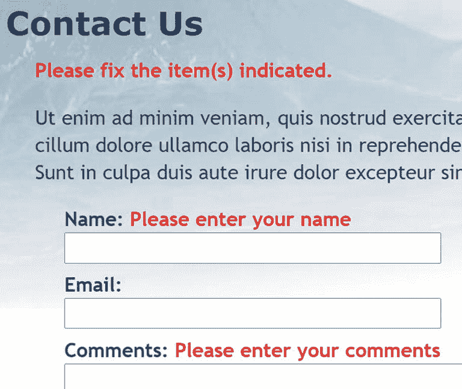

图 6-4

通过验证用户输入，您可以显示关于必填字段的警告

1.  保存`contact.php`并再次测试页面，首先在任何字段中不输入任何内容。表单标签应该如图 [6-4](#Fig4) 所示。

虽然您为`email`字段向`<label>`添加了一个警告，但是它没有显示出来，因为`email`还没有被添加到`$required`数组中。因此，它不会被`processmail.php`中的代码添加到`$missing`数组中。

1.  将`email`添加到`contact.php`顶部代码块中的`$required`数组中，如下所示:

1.  再次单击发送消息，不填写任何字段。这一次，您将在每个标签旁边看到一条警告消息。

2.  在“名称”栏中键入您的姓名。在电子邮件和评论字段中，只需按几次空格键，然后单击发送消息。名称字段旁边的警告消息会消失，但其他两条警告消息会保留。`processmail.php`中的代码去除了文本字段中的空白，因此它拒绝通过输入一系列空格来绕过必填字段的尝试。

```php
$required = ['name', 'comments', 'email'];

```

如果你有任何问题，将你的代码与`ch06`文件夹中的`contact_03.php`和`includes/processmail_01.php`进行比较。

要更改必填字段，只需更改`$required`数组中的名称，并在表单内适当输入元素的`<label>`标记中添加一个合适的警告。这很容易做到，因为您总是使用表单输入元素的`name`属性。

### 当表单不完整时保留用户输入

假设你花了 10 分钟填写一张表格。单击 Submit 按钮，返回的响应是缺少一个必填字段。如果你不得不重新填写每一个字段，那就太令人恼火了。因为每个字段的内容都在`$_POST`数组中，所以当出现错误时很容易重新显示它。

#### PHP 解决方案 6-3:创建粘性表单域

这个 PHP 解决方案展示了如何使用条件语句从`$_POST`数组中提取用户的输入，并在文本输入字段和文本区域中重新显示。

像以前一样继续处理相同的文件。或者，使用`ch06`文件夹中的`contact_03.php`和`includes/processmail_01.php`。

1.  当页面第一次加载时，您不希望任何内容出现在输入字段中，但是如果一个必填字段丢失或出现错误，您*确实*希望重新显示内容。这就是关键:如果`$missing`或`$errors`数组包含任何值，那么每个字段的内容都应该重新显示。您使用`<input>`标签的`value`属性为文本输入字段设置了默认文本，因此将`name`的`<input>`标签修改如下:

    ```php
    <input name="name" id="name" type="text"
    <?php if ($missing || $errors) {
        echo 'value="' . htmlentities($name) . '"';
    } ?>>

    ```

    花括号内的行包含引号和句点的组合，这可能会让您感到困惑。首先要意识到的是只有一个分号——就在末尾——所以`echo`命令适用于整行。正如在第 3 章中所解释的，一个句点被称为连接操作符，它连接字符串和变量。您可以将该行的其余部分分为三个部分，如下所示:

    *   `'value="' .`

    *   `htmlentities($name)`

    *   `. '"'`

第一部分将`value="`输出为文本，并使用连接操作符将其连接到下一部分，下一部分将`$name`传递给一个名为`htmlentities()`的函数。我稍后将解释为什么这是必要的，但是第三部分再次使用连接操作符来连接最终输出，它只包含一个双引号。因此，如果`$missing`或`$errors`包含任何值，而`$_POST['name']`包含`Joe`，那么在`<input>`标记中就会出现这个:

```php
<input name="name" id="name" type="text" value="Joe">

```

`$name`变量包含通过`$_POST`数组传输的原始用户输入。你在 PHP 解决方案 6-2 的`processmail.php`中创建的`foreach`循环处理`$_POST`数组并将每个元素赋给一个同名的变量。这允许您简单地以`$name`的形式访问`$_POST['name']`。

那么我们为什么需要`htmlentities()`函数呢？正如函数名所示，它将某些字符转换成等价的 HTML 字符实体。你现在关心的是双引号。假设埃里克·克拉普顿决定通过表单发送反馈。如果您单独使用`$name`，图 [6-5](#Fig5) 显示了当一个必填字段被省略并且您没有使用`htmlentities()`时会发生什么。

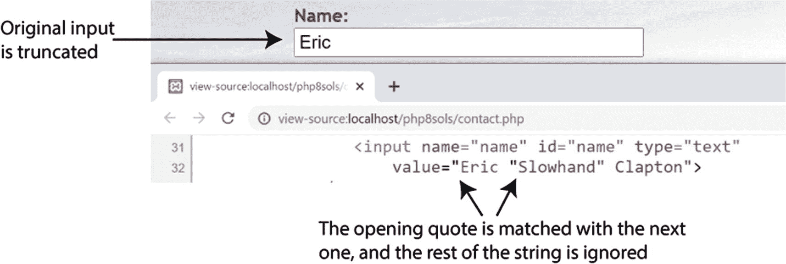

图 6-5

在重新显示表单域之前，需要对引号进行特殊处理

然而，将`$_POST`数组元素的内容传递给`htmlentities()`，会将字符串中间的双引号转换为`&quot`；。并且，如图 [6-6](#Fig6) 所示，内容不再被截断。

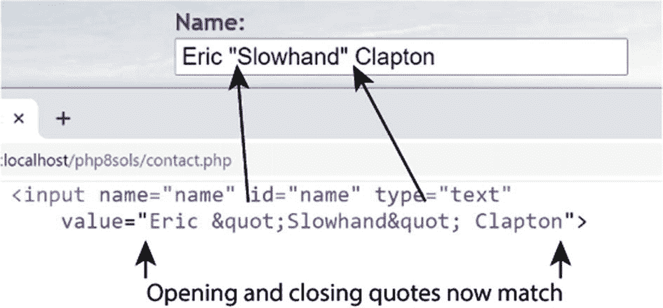

图 6-6

在显示之前将值传递给 htmlentities()解决了这个问题

这个比较酷的是人物实体`&quot`；重新提交表单时，会转换回双引号。因此，在发送电子邮件之前，无需进一步转换。

Note

如果`htmlentities()`破坏了你的文本，你可以在 PHP 8 中使用命名参数直接设置编码(参见第 [4](04.html) 章中的“使用命名参数”)。例如，要将编码设置为简体中文，请使用`htmlentities($name, encoding: 'GB2312')`。

1.  用同样的方式编辑`email`字段，用`$email`代替`$name`。

2.  因为`<textarea>`标签没有`value`属性，所以对`comments`文本区域的处理需要稍有不同。您必须将 PHP 块放在文本区域的开始和结束标记之间，就像这样(新代码以粗体显示):

```php
<textarea name="comments" id="comments"><?php
  if ($missing || $errors) {
      echo htmlentities($comments);
  } ?></textarea>

```

将 PHP 的开始和结束标记放在正对着`<textarea>`标记的位置是很重要的。如果不这样做，就会在文本区域中出现不需要的空白。

1.  保存`contact.php`并在浏览器中测试页面。如果省略了任何必填字段，表单将显示原始内容以及任何错误消息。

你可以用`ch06`文件夹中的`contact_04.php`来检查你的代码。

Caution

使用这种技术可以防止表单的重置按钮重置 PHP 脚本更改过的任何字段，因为它显式地设置了每个字段的 value 属性。

### 过滤掉潜在的攻击

一个被称为**邮件头注入**的特别令人讨厌的漏洞试图将在线表单转化为垃圾邮件中继。攻击者试图欺骗您的脚本，将带有副本的 HTML 电子邮件发送给许多人。如果您将未过滤的用户输入合并到可以作为第四个参数传递给`mail()`函数的附加头中，这是可能的。添加用户的电子邮件地址作为`Reply-To`头是很常见的。如果您在提交的值中检测到空格、换行符、回车符或任何字符串“Content-Type:"、“Cc:”或“Bcc:”时，您就是攻击的目标，因此您应该阻止该消息。

#### PHP 解决方案 6-4:阻止包含可疑内容的电子邮件地址

这个 PHP 解决方案检查用户的电子邮件地址输入是否有可疑内容。如果检测到，布尔变量被设置为`true`。这将在以后被用来阻止电子邮件被发送。

继续使用与以前相同的页面。或者，使用`ch06`文件夹中的`contact_04.php`和`includes/processmail_01.php`。

1.  为了检测可疑短语，我们将使用搜索模式或**正则表达式**。在现有的`foreach`循环之前的`processmail.php`顶部添加以下代码:

```php
// pattern to locate suspect phrases
$pattern = '/[\s\r\n]|Content-Type:|Bcc:|Cc:/i';
foreach ($_POST as $key => $value) {

```

分配给`$pattern`的字符串将用于执行不区分大小写的搜索:空格、回车、换行符、" Content-Type:"、" Bcc:"或" cc:"。它是以一种叫做 Perl 兼容正则表达式(PCRE)的格式编写的。搜索模式包含在一对正斜杠中，最后一个斜杠后的`i`使模式不区分大小写。

Tip

正则表达式是匹配文本模式的非常强大的工具。诚然，它们不容易学；但是如果你真的想使用 PHP 和 JavaScript 之类的编程语言，这是一项必不可少的技能。看看 rg Krause 的*介绍正则表达式*(a press，2017，ISBN 978-1-4842-2508-0)。它主要面向 JavaScript 开发人员，但是 JavaScript 和 PHP 在实现上只有很小的区别。基本语法是相同的。

1.  您现在可以使用存储在`$pattern`中的 PCRE 来检测提交的电子邮件地址中任何可疑的用户输入。在步骤 1 中的`$pattern`变量后立即添加以下代码:

```php
// check the submitted email address
$suspect = preg_match($pattern,  $_POST['email']);

```

`preg_match()`函数将作为第一个参数传递的正则表达式与第二个参数中的值进行比较，在本例中是来自 Email 字段的值。如果找到匹配，它将返回`true`。所以，如果任何可疑的内容被发现，`$suspect`将是真实的。但是如果没有匹配的话，那就是`false`。

1.  如果在电子邮件地址中检测到可疑内容，那么进一步处理`$_POST`数组就没有意义了。将处理`$_POST`变量的代码包装在一个条件语句中，如下所示:

```php
if (!$suspect) {
    foreach ($_POST as $key => $value) {
        // strip whitespace from $value if not an array
        if (!is_array($value)) {
           $value = trim($value);
        }
        if (!in_array($key, $expected)) {
            // ignore the value, it's not in $expected
            continue;
        }
        if (in_array($key, $required) && empty($value)) {
            // required value is missing
            $missing[] = $key;
            $$key = "";
            continue;
        }
    $$key = $value;
    }
}

```

只有当`$suspect`不是`true`时，才会处理`$_POST`数组中的变量。

不要忘记用额外的花括号来结束条件语句。

1.  编辑`contact.php`中`<h2>`标题后的 PHP 块，在表单上方添加一条新的警告消息，如下所示:

```php
<h2>Contact Us</h2>
<?php if ($_POST && $suspect) { ?>
    <p class="warning">Sorry, your mail could not be sent.
    Please try later.</p>
<?php } elseif ($missing || $errors) { ?>
  <p class="warning">Please fix the item(s) indicated.</p>
<?php } ?>

```

这设置了一个新的条件，该条件通过被首先考虑而优先于原始警告消息。它检查`$_POST`数组是否包含任何元素——换句话说，表单已经提交——以及`$suspect`是否为`true`。这一警告的语气刻意保持中立。激怒攻击者毫无意义。

1.  保存`contact.php`并通过在电子邮件字段中键入任何可疑内容来测试表单。您应该会看到新的警告消息，但是您的输入不会被保存。

你可以对照`ch06`文件夹中的`contact_05.php`和`includes/processmail_02.php`来检查你的代码。

## 发送电子邮件

在继续之前，有必要解释一下 PHP `mail()`函数是如何工作的，因为它将帮助您理解处理脚本的其余部分。

PHP `mail()`函数最多接受五个参数，都是字符串，如下所示:

*   收件人的地址

*   主题行

*   邮件正文

*   其他电子邮件标题列表(可选)

*   附加参数(可选)

第一个参数中的电子邮件地址可以是下列格式之一:

```php
'user@example.com'
'Some Guy <user2@example.com>'

```

要发送到多个地址，请使用逗号分隔的字符串，如下所示:

```php
'user@example.com, another@example.com, Some Guy <user2@example.com>'

```

消息正文必须显示为单个字符串。这意味着您需要从`$_POST`数组中提取输入数据并格式化消息，添加标签来标识每个字段。默认情况下，`mail()`函数只支持纯文本。新行必须同时使用回车和换行符。还建议将行的长度限制在 78 个字符以内。虽然听起来很复杂，但是你可以用大约 20 行 PHP 代码自动构建消息体，正如你将在 PHP 解决方案 6-6 中看到的。添加其他电子邮件标题将在下一节详细介绍。

许多托管公司现在把第五个论点作为一个要求。它确保电子邮件是由可信用户发送的，通常由您自己的电子邮件地址加上前缀`-f`(中间没有空格)组成，全部用引号括起来。检查你的托管公司的说明，看看这是否是必需的，以及它应该采取的确切格式。

Caution

永远不要将用户输入合并到`mail()`函数的第五个参数中，因为它可以用来在 web 服务器上执行任意脚本。

### 安全使用附加电子邮件标题

你可以在 [`www.faqs.org/rfcs/rfc2076`](http://www.faqs.org/rfcs/rfc2076) 找到电子邮件标题的完整列表，但是一些最著名和最有用的标题可以让你发送电子邮件的副本到其他地址(抄送和密件抄送)或者改变编码。除了最后一个标题，每个新标题都必须在一个单独的行上，以回车和换行符结束。在 PHP 的旧版本中，这意味着在双引号字符串中使用`\r`和`\n`转义序列(参见第 [4](04.html) 章中的表 [4-5](04.html#Tab5) )。

Tip

从 PHP 7.2 开始，附加头的格式化是自动处理的。简单地定义一个关联数组，使用标题名作为每个元素的键，然后将该数组作为第四个参数传递给`mail()`函数。

默认情况下，`mail()`使用 Latin1 (ISO-8859-1)编码，它不支持重音字符。如今，网页编辑经常使用 Unicode (UTF-8 ),它支持大多数书面语言，包括欧洲语言中常用的重音符号，以及非字母文字，如中文和日文。为了确保电子邮件不会乱码，使用`Content-Type`头将编码设置为 UTF-8，如下所示:

```php
$headers['Content-Type'] = 'text/plain; charset=utf-8';

```

您还需要将 UTF-8 作为`charset`属性添加到 web 页面的`<head>`中的`<meta>`标签中，如下所示:

```php
<meta charset="utf-8">

```

假设您想将副本发送到其他部门，再将副本发送到另一个您不想让其他人看到的地址。由`mail()`发送的电子邮件通常被识别为来自`nobody@yourdomain`(或者分配给网络服务器的任何用户名)，所以添加一个更用户友好的“发件人”地址是一个好主意。这就是你如何建立那些额外的头:

```php
$headers['From'] = 'Japan Journey<feedback@example.com>';
$headers['Cc'] = 'sales@example.com, finance@example.com';
$headers['Bcc'] = 'secretplanning@example.com';

```

在定义了您想要使用的标题数组之后，您将该数组传递给`mail()`，就像这样(假设目的地址、主题和消息体已经存储在变量中):

```php
$mailSent = mail($to, $subject, $message, $headers);

```

像这样硬编码的附加头不会带来安全风险，但是来自用户输入的任何内容在使用之前都必须经过过滤。最大的危险来自一个要求输入用户电子邮件地址的文本字段。一种广泛使用的技术是将用户的电子邮件地址合并到一个`From`或`Reply-To`标题中，这使得你可以通过点击你的电子邮件程序中的回复按钮来直接回复收到的消息。这非常方便，但是攻击者经常试图在电子邮件输入字段中装入大量伪造的标题。以前的 PHP 解决方案消除了攻击者最常用的头，但是我们需要在将电子邮件地址合并到附加头之前进一步检查它。

Caution

尽管电子邮件字段是攻击者的主要目标，但是如果您允许用户更改值，目标地址和主题行都很容易受到攻击。用户输入应该总是被认为是可疑的。始终对目的地址和主题行进行硬编码。或者，提供一个可接受值的下拉菜单，并根据相同值的数组检查提交的值。

#### PHP 解决方案 6-5:添加标题和自动回复地址

这个 PHP 解决方案为电子邮件添加了三个标题:`From`、`Content-Type`(将编码设置为 UTF-8)和`Reply-To`。在将用户的电子邮件地址添加到最终的头之前，它使用一个内置的 PHP 过滤器来验证提交的值是否符合有效电子邮件地址的格式。

继续使用与以前相同的页面。或者，使用`ch06`文件夹中的`contact_05.php`和`includes/processmail_02.php`。

1.  标题通常特定于特定的网站或页面，所以`From`和`Content-Type`标题将被添加到`contact.php`的脚本中。将以下代码添加到页面顶部的 PHP 块中，刚好在包含`processmail.php`之前:

1.  验证电子邮件地址的目的是确保其格式有效，但是该字段可能为空，因为您决定不要求它，或者因为用户简单地忽略了它。如果该字段是必填的但为空，它将被添加到`$missing`数组中，并显示您在 PHP 解决方案 6-2 中添加的警告。如果字段不为空，但是输入无效，则需要显示不同的消息。

```php
$required = ['name', 'comments', 'email'];
// create additional headers
$headers['From'] = 'Japan Journey<feedback@example.com>';
$headers['Content-Type'] = 'text/plain; charset=utf-8';
require './includes/processmail.php';

```

切换到`processmail.php`并将这段代码添加到脚本的底部:

```php
// validate the user's email
if (!$suspect && !empty($email)) {
    $validemail = filter_input(INPUT_POST, 'email', FILTER_VALIDATE_EMAIL);
    if ($validemail) {
        $headers['Reply-To'] = $validemail;
    } else {
        $errors['email'] = true;
    }
}

```

首先检查是否没有发现可疑内容，并且`email`字段不为空。这两个条件前面都有逻辑非运算符，所以如果`$suspect`和`empty($email)`都是`false`，它们就返回`true`。您在 PHP 解决方案 6-2 中添加的`foreach`循环将`$_POST`数组中所有期望的元素分配给更简单的变量，因此`$email`包含与`$_POST['email']`相同的值。

下一行使用`filter_input()`来验证电子邮件地址。第一个参数是 PHP 常量`INPUT_POST`，它指定值必须在`$_POST`数组中。第二个参数是您想要测试的元素的名称。最后一个参数是另一个 PHP 常量，它指定您要检查元素是否符合电子邮件的有效格式。

如果有效的话,`filter_input()`函数返回被测试的值。否则返回`false`。因此，如果用户提交的值看起来像一个有效的电子邮件地址，`$validemail`包含该地址。如果格式无效，`$validemail`为`false`。`FILTER_VALIDATE_EMAIL`常量只接受单个电子邮件地址，因此任何插入多个电子邮件地址的尝试都将被拒绝。

Note

`FILTER_VALIDATE_EMAIL`检查格式，而不是地址是否真实。

如果`$validemail`不是`false`，合并到`Reply-To`邮件头中是安全的。但是如果`$validemail`是`false`，那么`$errors['email']`被添加到`$errors`数组中。

1.  您现在需要修改`contact.php`中`email`字段的`<label>`，如下所示:

```php
<label for="email">Email:
<?php if (in_array('email', $missing)) { ?>
    <span class="warning">Please enter your email address</span>
<?php } elseif (isset($errors['email'])) { ?>
    <span class="warning">Invalid email address</span>
<?php } ?>
</label>

```

这将在第一个条件语句中添加一个`elseif`子句，如果电子邮件地址验证失败，将显示不同的警告。

1.  保存`contact.php`并通过将所有字段留空并点击发送消息来测试表单。您将看到最初的错误消息。通过在“电子邮件”栏中输入非电子邮件地址的值或输入两个电子邮件地址来再次测试。您应该会看到无效消息。

    注意:如果在测试更新的脚本时，在多个电子邮件地址之间的逗号后面加一个空格，您将不会看到新的错误消息，因为 PHP 解决方案 6–4 中的正则表达式拒绝包含空格的电子邮件字段中的值。无论哪种方式，企图攻击被挫败。

你可以用`ch06`文件夹中的`contact_06.php`和`includes/processmail_03.php`来检查你的代码。

#### PHP 解决方案 6-6:构建消息体并发送邮件

许多 PHP 教程展示了如何像这样手动构建消息体:

```php
$message = "Name: $name\r\n\r\n";
$message .= "Email: $email\r\n\r\n";
$message .= "Comments: $comments";

```

这将添加标签来标识输入来自哪个字段，并在每个标签之间插入两个回车符和换行符。这对于少量的字段来说很好，但是对于更多的字段来说很快就变得乏味了。只要给表单字段赋予有意义的`name`属性，就可以用一个`foreach`循环自动构建消息体，这是这个 PHP 解决方案中采用的方法。

像以前一样继续处理相同的文件。或者，使用`ch06`文件夹中的`contact_06.php`和`includes/processmail_03.php`。

1.  在`processmail.php`中的脚本底部添加以下代码:

```php
$mailSent = false;

```

这将初始化一个变量，以便在邮件发送后重定向到感谢页面。它需要被设置为`false`，直到你知道`mail()`功能已经成功。

1.  现在添加构建消息的代码，紧跟在:

```php
// go ahead only if not suspect, all required fields OK, and no errors
if (!$suspect && !$missing && !$errors) {
    // initialize the $message variable
    $message = '';
    // loop through the $expected array
    foreach($expected as $item) {
        // assign the value of the current item to $val
        if (isset($$item) && !empty($$item)) {
            $val = $$item;
        } else {
            // if it has no value, assign 'Not selected'
            $val = 'Not selected';
        }
        // if an array, expand as comma-separated string
        if (is_array($val)) {
            $val = implode(', ', $val);
        }
        // replace underscores in the label with spaces
        $item = str_replace('_', ' ', $item);
        // add label and value to the message body
        $message .= ucfirst($item).": $val\r\n\r\n";
    }
    // limit line length to 70 characters
    $message = wordwrap($message, 70);
    $mailSent = true;
}

```

这段代码首先检查`$suspect`、`$missing`和`$errors`都是`false`。如果是，它通过遍历`$expected`数组构建消息体，将结果作为一系列标签/值对存储在`$message`中。

其工作原理的关键在于下面的条件语句:

```php
if (isset($$item) && !empty($$item)) {
    $val = $$item;
}

```

这是使用可变变量的另一个例子(参见第 [4](04.html) 章中的“动态创建新变量”)。每次循环运行时，`$item`包含`$expected`数组中当前元素的值。第一个元素是`name`，所以`$$item`动态创建一个名为`$name`的变量。实际上，条件语句变成了这样:

```php
if (isset($name) && !empty($name)) {
    $val = $name;
}

```

在下一次传递中，`$$item`创建一个名为`$email`的变量，依此类推。PHP 解决方案 6–2 将每个表单字段中提交的数据分配给一个简单的变量，因此这个条件语句将当前字段中的数据分配给一个临时变量`$val`。

Caution

该脚本仅从`$expected`数组中的项目构建消息正文。您必须在`$expected`数组中列出所有表单字段的名称，它才能工作。

如果未指定为必填的字段留空，其值将设置为“未选择”该代码还处理来自多项选择元素的值，例如复选框组和`<select>`列表，它们作为`$_POST`数组的子数组传输。`implode()`函数将子数组转换成逗号分隔的字符串。第一个参数是要在每个数组元素之间插入的字符串。第二个参数是要处理的数组。

每个标签都是从`$expected`数组的当前元素中输入字段的`name`属性派生而来的。`str_replace()`的第一个参数是下划线。如果在`name`属性中发现了一个下划线，它将被第二个参数替换，第二个参数是一个由单个空格组成的字符串。然后第一个字母被`ucfirst()`设为大写。注意`str_replace()`的第三个参数是`$item`(带单美元符号)，所以这次是普通变量，不是变量变量。它包含来自`$expected`数组的当前值。来自当前元素的数据后跟两个回车符和换行符，然后连接到标签。

将标签和字段数据组合成一个字符串后，`wordwrap()`函数将行长度限制为 70 个字符。

仍然需要添加发送电子邮件的代码，但是出于测试目的，`$mailSent`被设置为`true`。

1.  保存`processmail.php`。在`contact.php`的底部找到这个代码块:

```php
<pre>
<?php if ($_POST) {print_r($_POST);} ?>
</pre>
Change it to this:
<pre>
<?php if ($_POST && $mailSent) {
    echo htmlentities($message);
    foreach ($headers as $key => $value) {
        echo htmlentities("$key: $value") . '<br>';
    }
} ?>
</pre>

```

这将检查表单是否已提交，邮件是否已准备好发送。然后显示`$message`和`$headers`数组中的值。所有的值都被传递给`htmlentities()`,以确保它们在浏览器中正确显示。

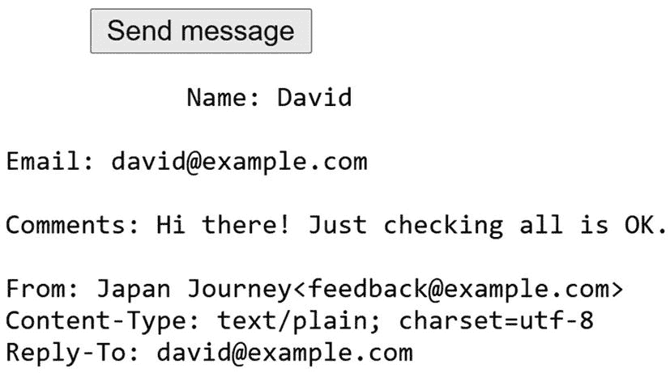

图 6-7

验证邮件正文和邮件头的格式是否正确

1.  保存`contact.php`，并通过输入您的姓名、电子邮件地址和简短评论来测试表单。当你点击发送消息时，你应该看到消息正文和标题显示在页面的底部，如图 [6-7](#Fig7) 所示。

假设邮件正文和标题正确显示在页面底部，您就可以添加发送电子邮件的代码了。如有必要，对照`ch06`文件夹中的`contact_07.php`和`includes/processmail_04.php`检查您的代码。

1.  在`processmail.php`中，添加发送邮件的代码。找到以下行:

```php
$mailSent = true;
Change it to this:
$mailSent = mail($to, $subject, $message, $headers);
if (!$mailSent) {
    $errors['mailfail'] = true;
}

```

这会将目的地址、主题行、消息正文和标题传递给`mail()`函数，如果成功地将电子邮件传递给 web 服务器的邮件传输代理(MTA ),该函数将返回`true`。如果失败，`$mailSent`被设置为`false`，条件语句向`$errors`数组添加一个元素，允许您在表单重新显示时保留用户的输入。

1.  在位于`contact.php`顶部的 PHP 块中，在包含`processmail.php`的命令之后立即添加以下条件语句:

```php
    require './includes/processmail.php';
    if ($mailSent) {
        header('Location: http://www.example.com/thank_you.php');
        exit;
    }
}
?>

```

您需要在您的远程服务器上测试这一点，所以用您自己的域名替换 [`www.example.com`](http://www.example.com) 。这将检查`$mailSent`是否为`true`。如果是，`header()`功能重定向到`thank_you.php`，一个确认消息已经发送的页面。下一行中的`exit`命令确保脚本在页面被重定向后终止。

在`ch06`文件夹中有一份`thank_you.php`的副本。

1.  如果`$mailSent`为`false`，则`contact.php`重新显示；您需要警告用户消息无法发送。编辑`<h2>`标题后的条件语句，如下所示:

```php
<h2>Contact Us </h2>
<?php if (($_POST && $suspect) || ($_POST && isset($errors['mailfail']))) { ?>
    <p class="warning">Sorry, your mail could not be sent. . . .

```

原始条件和新条件都被括在括号中，因此每一对都被单独考虑。如果表单已提交且发现可疑短语*或*如果表单已提交且`$errors['mailfail']`已设置，则显示消息未发送的警告。

1.  删除在`contact.php`底部显示消息正文和标题的代码块(包括`<pre>`标签)。

2.  在本地测试可能会显示感谢页面，但电子邮件不会到达。这是因为大多数测试环境没有 MTA。即使您设置了一个，大多数邮件服务器也会拒绝来自无法识别的来源的邮件。将`contact.php`和所有相关文件，包括`processmail.php`和`thank_you.php`上传到你的远程服务器，并在那里测试联系方式。不要忘记`processmail.php`需要在一个名为`includes`的子文件夹中。

你可以用`ch06`文件夹中的`contact_08.php`和`includes/processmail_05.php`来检查你的代码。

#### 邮件故障排除( )

重要的是要明白`mail()`不是一个电子邮件程序。一旦将地址、主题、消息和头传递给 MTA，PHP 的责任就结束了。它无法知道电子邮件是否被发送到了预定的目的地。通常情况下，电子邮件会瞬间到达，但是网络堵塞会延迟几个小时甚至几天。

Tip

在远程服务器上测试这个脚本时，最有可能导致失败的原因之一是 PHP 的版本。如果您的远程服务器运行的是 PHP 7.1 或更早版本，那么`$headers`数组将需要被转换成一个字符串，在每个头之间有一个回车符和换行符。使用带有“r\n”(双引号)的`implode()`作为第一个参数。

如果您在从`contact.php`发送邮件后被重定向到感谢页面，但您的收件箱中没有收到任何邮件，请检查以下内容:

*   邮件被垃圾邮件过滤器拦截了吗？

*   您是否检查过存储在`$to`中的目的地地址？尝试另一个电子邮件地址，看看是否有所不同。

*   你在`From`头中使用了真正的地址吗？使用假的或无效的地址很可能导致邮件被拒绝。请使用与您的 web 服务器属于同一域的有效地址。

*   请咨询您的托管公司，看看第五个参数`mail()`是否是必需的。如果是这样，它通常应该是一个由`-f`后跟您的电子邮件地址组成的字符串。比如`david@example.com`变成了`'-fdavid@example.com'`。

如果您仍然没有收到来自 contact.php 的消息，请使用以下脚本创建一个文件:

```php
<?php
ini_set('display_errors', '1');
$mailSent = mail('you@example.com', 'PHP mail test', 'This is a test email');
if ($mailSent) {
    echo 'Mail sent';
} else {
    echo 'Failed';
}

```

用您自己的电子邮件地址替换`you@example.com`。将文件上传到您的网站，并将页面加载到浏览器中。

如果您看到一条关于没有`From`头的错误消息，添加一个头作为`mail()`函数的第四个参数，如下所示:

```php
$mailSent = mail('you@example.com', 'PHP mail test', 'This is a test email',
'From: me@example.com');

```

在第一个参数中使用与目的地址不同的地址通常是个好主意。

如果你的主机公司需要第五个参数，调整代码如下:

```php
$mailSent = mail('you@example.com', 'PHP mail test', 'This is a test email', null,
'-fme@example.com');

```

使用第五个参数通常取代了提供一个`From`头的需要，所以使用`null`(不带引号)作为第四个参数表明它没有值。

如果你看到“邮件已发送”但没有邮件到达，或者在尝试了所有五个参数后，你看到“失败”,请咨询你的托管公司以获得建议。

如果您收到的测试邮件来自这个脚本，而不是来自`contact.php`，这意味着您在代码中犯了一个错误，或者您忘记上传`processmail.php`。临时打开错误显示，如“为什么我的页面是空白的？”在第三章[中](03.html)，要检查`contact.php`是否能够找到`processmail.php`。

Tip

我在英国的一所大学教书，不明白为什么学生的邮件没有被投递，尽管他们的代码是完美的。原来 It 部门已经禁用了 Sendmail(MTA ),以防止服务器被用来发送垃圾邮件！

## 处理多选表单元素

`contact.php`中的表格仅使用文本输入字段和文本区。要成功使用表单，您还需要知道如何处理多选元素，即:

*   单选按钮

*   检查框

*   下拉选项菜单

*   多项选择列表

它们背后的原理与您一直在处理的文本输入字段相同:表单元素的`name`属性被用作`$_POST`数组中的键。但是，有一些重要的区别:

*   复选框组和多选列表将选定的值存储为一个数组，因此您需要在这些类型的输入的`name`属性的末尾添加一对空的方括号。例如，对于一个名为`interests`的复选框组，每个`<input>`标签中的`name`属性应该是`name="interests[]"`。如果省略方括号，只有最后选择的项目通过`$_POST`阵列传输。

*   复选框组或多选列表中所选项的值作为`$_POST`数组的子数组传输。PHP 解决方案 6-6 中的代码自动将这些子数组转换为逗号分隔的字符串。但是，当将表单用于其他目的时，您需要从子数组中提取值。您将在后面的章节中看到如何做到这一点。

*   如果没有选择值，单选按钮、复选框和多选列表*不会*包含在`$_POST`数组中。因此，在处理表单时尝试访问它们的值之前，使用`isset()`检查它们的存在是至关重要的。

本章剩余的 PHP 解决方案展示了如何处理多选表单元素。我不想详细介绍每一步，我只想强调重点。在阅读本章剩余部分时，请记住以下几点:

*   处理这些元素依赖于`processmail.php`中的代码。

*   您必须将每个元素的`name`属性添加到`$expected`数组中，以便将其添加到消息体中。

*   要使一个字段成为必填字段，将其属性添加到数组`$required`中。

*   如果不需要的字段留空，`processmail.php`中的代码将其值设置为“未选择”

图 [6-8](#Fig8) 显示了添加到原始设计中的各种类型输入的`contact.php`。

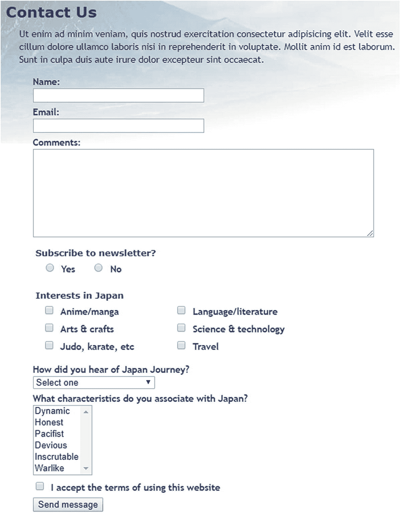

图 6-8

带有多项选择表单元素示例的反馈表单

Tip

HTML5 表单输入元素都使用`name`属性，并将值作为文本或`$_POST`数组的子数组发送，因此您应该能够相应地修改代码。

### PHP 解决方案 6-7:处理单选按钮组

单选按钮组只允许您选择一个值。尽管在 HTML 标记中设置默认值很常见，但这不是必须的。这个 PHP 解决方案展示了如何处理这两种情况。

1.  处理单选按钮的简单方法是将其中一个设为默认按钮。单选按钮组总是包含在`$_POST`数组中，因为总是选择一个值。

具有默认值的单选按钮组的代码如下所示(`name`属性和 PHP 代码以粗体突出显示):

```php
<fieldset id="subscribe">
    <h2>Subscribe to newsletter?</h2>
    <p>
    <input name="subscribe" type="radio" value="Yes" id="subscribe-yes"
    <?php
    if ($_POST && $_POST['subscribe'] == 'Yes') {
        echo 'checked';
    } ?>>
    <label for="subscribe-yes">Yes</label>
    <input name="subscribe" type="radio" value="No" id="subscribe-no"
    <?php
    if (!$_POST || $_POST['subscribe'] == 'No') {
       echo 'checked';
    } ?>>
    <label for="subscribe-no">No</label>
    </p>
</fieldset>

```

单选按钮组的所有成员共享相同的`name`属性。因为只能选择一个值，所以`name`属性的*不是*以一对空括号结束。

与 Yes 按钮相关的条件语句检查`$_POST`以查看表单是否已经提交。如果有，并且`$_POST['subscribe']`的值为“是”，那么`checked`属性将被添加到`<input>`标签中。

在 No 按钮中，条件语句使用`||` (or)。第一个条件是`!$_POST`，当表单还没有提交时是`true`。如果是`true`，当页面第一次加载时，`checked`属性被添加为默认值。如果`false`，则表示表单已经提交，因此检查`$_POST['subscribe']`的值。

1.  当单选按钮没有默认值时，它不包含在`$_POST`数组中，所以构建`$missing`数组的`processmail.php`中的循环不会检测到它。为了确保单选按钮元素包含在`$_POST`数组中，您需要在表单提交后测试它是否存在。如果没有包含它，您需要将其值设置为空字符串，如下所示:

1.  如果单选按钮组是必需的但未被选中，则需要在表单重新加载时显示一条错误消息。您还需要更改`<input>`标签中的条件语句来反映不同的行为。

```php
$required = ['name', 'comments', 'email', 'subscribe'];
// set default values for variables that might not exist
if (!isset($_POST['subscribe'])) {
    $_POST['subscribe'] = '';
}

```

下面的清单显示了来自`contact_09.php`的`subscribe`单选按钮组，所有 PHP 代码都以粗体突出显示:

```php
<fieldset id="subscribe">
    <h2>Subscribe to newsletter?
    <?php if (in_array('subscribe', $missing)) { ?>
    <span class="warning">Please make a selection</span>
    <?php } ?>
    </h2>
    <p>
    <input name="subscribe" type="radio" value="Yes" id="subscribe-yes"
    <?php
    if ($_POST && $_POST['subscribe'] == 'Yes') {
        echo 'checked';
    } ?>>
    <label for="subscribe-yes">Yes</label>
    <input name="subscribe" type="radio" value="No" id="subscribe-no"
    <?php
    if ($_POST && $_POST['subscribe'] == 'No') {
        echo 'checked';
    } ?>>
    <label for="subscribe-no">No</label>
    </p>
</fieldset>

```

控制`<h2>`标签中警告消息的条件语句使用了与文本输入字段相同的技术。如果单选按钮组是必填项并且在`$missing`数组中，则显示该消息。

两个单选按钮中围绕`checked`属性的条件语句是相同的。它检查表单是否已经提交，只有当`$_POST['subscribe']`中的值匹配时才显示选中的属性。

#### PHP 解决方案 6-8:处理复选框组

复选框可以单独使用，也可以成组使用。处理它们的方法略有不同。这个 PHP 解决方案展示了如何处理名为`interests`的复选框组。PHP 解决方案 6-11 解释了如何处理单个复选框。

当作为一个组使用时，组中的所有复选框共享同一个`name`属性，该属性需要以一对空的方括号结束，以便 PHP 将选择的值作为数组传输。为了识别哪些复选框被选中，每个复选框都需要一个惟一的`value`属性。

如果没有选择任何项目，复选框组不包含在`$_POST`数组中。表单提交后，您需要检查`$_POST`数组，看它是否包含复选框组的子数组。如果没有，您需要创建一个空的子数组作为`processmail.php`中脚本的默认值。

1.  为了节省空间，只显示该组的前两个复选框。代码的`name`属性和 PHP 部分以粗体突出显示:

```php
<fieldset id="interests">
<h2>Interests in Japan</h2>
<div>
    <p>
        <input type="checkbox" name="interests[]" value="Anime/manga"
        id="anime"
        <?php
        if ($_POST && in_array('Anime/manga', $_POST['interests'])) {
            echo 'checked';
        } ?>>
        <label for="anime">Anime/manga</label>
    </p>
    <p>
        <input type="checkbox" name="interests[]" value="Arts & crafts"
        id="art"
        <?php
        if ($_POST && in_array('Arts & crafts', $_POST['interests'])) {
            echo 'checked';
        } ?>>
        <label for="art">Arts & crafts</label>
    </p>
. . .
</div>
</fieldset>

```

每个复选框共享相同的`name`属性，该属性以一对空方括号结束，因此数据被视为数组。如果省略括号，`$_POST['interests']`只包含选中的第一个复选框的值。另外，如果没有选择复选框，`$_POST['interests']`也不会存在。您将在下一步中解决这个问题。

Note

虽然对于多重选择，必须将括号添加到`name`属性中，但是所选值的子数组在`$_POST['interests']`中，而不是在`$_POST['interests[]']`中。

每个复选框元素中的 PHP 代码执行与单选按钮组中相同的角色，将`checked`属性包装在一个条件语句中。第一个条件检查表单是否已经提交。第二个条件使用`in_array()`函数来检查与该复选框相关联的`value`是否在`$_POST['interests']`子数组中。如果是，则意味着该复选框已被选中。

1.  提交表单后，您需要检查是否存在`$_POST['interests']`。如果还没有设置，您必须创建一个空数组作为缺省值，以便脚本的其余部分进行处理。代码遵循与单选按钮组相同的模式:

1.  要设置所需复选框的最小数量，使用`count()`功能确认从表单传输的值的数量。如果少于所需的最小值，将该组添加到`$errors`数组，如下所示:

```php
$required = ['name', 'comments', 'email', 'subscribe', 'interests'];
// set default values for variables that might not exist
if (!isset($_POST['subscribe'])) {
    $_POST['subscribe'] = '';
}
if (!isset($_POST['interests'])) {
    $_POST['interests'] = [];
}

```

```php
if (!isset($_POST['interests'])) {
    $_POST['interests'] = [];
}
// minimum number of required check boxes
$minCheckboxes = 2;
if (count($_POST['interests']) < $minCheckboxes) {
    $errors['interests'] = true;
}

```

`count()`函数返回数组中元素的数量，所以如果选择的复选框少于两个，就会创建`$errors['interests']`。你可能想知道为什么我用了一个变量，而不是像这样的数字:

```php
if (count($_POST['interests']) < 2) {

```

这当然是可行的，而且涉及的输入更少，但是`$minCheckboxes`可以在错误消息中重用。将数字存储在变量中意味着这种情况和错误消息总是保持同步。

1.  表单正文中的错误消息如下所示:

```php
<h2>Interests in Japan
<?php if (isset($errors['interests'])) { ?>
    <span class="warning">Please select at least <?= $minCheckboxes ?></span>
<?php } ?>
</h2>

```

#### PHP 解决方案 6-9:使用下拉选项菜单

用`<select>`标签创建的下拉选项菜单类似于单选按钮组，因为它们通常只允许用户从几个选项中选择一个。它们的不同之处在于下拉菜单中总是有一个项目被选中，即使它只是邀请用户选择其他项目的第一个项目。因此，`$_POST`数组总是包含一个引用`<select>`菜单的元素，而单选按钮组被忽略，除非预设了默认值。

1.  下面的代码显示了`contact_09.php`中下拉菜单的前两项，PHP 代码以粗体突出显示。与所有多选元素一样，PHP 代码包装了指示选择了哪个项目的属性。尽管这个属性在单选按钮和复选框中都被称为`checked`，但在`<select>`菜单和列表中它被称为`selected`。如果提交的表单缺少必需的项目，使用正确的属性重新显示选择是很重要的。当页面第一次加载时，`$_POST`数组不包含任何元素，所以您可以通过测试`!$_POST`来选择第一个`<option>`。一旦表单被提交，`$_POST`数组总是包含一个下拉菜单中的元素，所以您不需要测试它是否存在:

1.  尽管下拉菜单中的某个选项总是处于选中状态，但您可能希望强制用户进行非默认选择。为此，将`<select>`菜单的`name`属性添加到`$required`数组，然后将默认选项的`value`属性和`$_POST`数组元素设置为空字符串，如下所示:

```php
<p>
    <label for="howhear">How did you hear of Japan Journey?</label>
    <select name="howhear" id="howhear">
        <option value="No reply"
        <?php
        if (!$_POST || $_POST['howhear'] == 'No reply') {
            echo 'selected';
        } ?>>Select one</option>
        <option value="Apress"
        <?php
        if (isset($_POST && $_POST['howhear'] == 'Apress') {
            echo 'selected';
        } ?>>Apress</option>
    . . .
    </select>
</p>

```

```php
<option value=""
<?php
if (!$_POST || $_POST['howhear'] == '') {
    echo 'selected';
} ?>>Select one</option>

```

在`<option>`标签中不需要`value`属性，但是如果省略它，表单会使用开始和结束标签之间的文本作为选择值。因此，有必要将`value`属性显式设置为空字符串。否则，“选择一个”作为所选值传输。

1.  如果没有进行选择，则显示警告消息的代码遵循一种熟悉的模式:

```php
<label for="select">How did you hear of Japan Journey?
<?php if (in_array('howhear', $missing)) { ?>
    <span class="warning">Please make a selection</span>
<?php } ?>
</label>

```

#### PHP 解决方案 6-10:处理多项选择列表

多选列表类似于复选框组:它们允许用户选择零个或多个项目，因此结果存储在一个数组中。如果没有选择任何项目，多选列表就不会包含在`$_POST`数组中，所以需要像添加复选框组一样添加一个空的子数组。

1.  下面的代码显示了`contact_09.php`中多选列表的前两项，用粗体突出显示了`name`属性和 PHP 代码。附加到`name`属性的方括号确保它将结果存储为一个数组。该代码的工作方式与 PHP 解决方案 6-8 中的复选框组相同:

1.  在处理消息的代码中，以与复选框数组相同的方式为多选列表设置默认值:

```php
<p>
    <label for="characteristics">What characteristics do you associate with
    Japan?</label>
    <select name="characteristics[]" size="6" multiple="multiple"
    id="characteristics">
        <option value="Dynamic"
        <?php
        if ($_POST && in_array('Dynamic', $_POST['characteristics'])) {
            echo 'selected';
        } ?>>Dynamic</option>
        <option value="Honest"
        <?php
        if ($_POST && in_array('Honest', $_POST['characteristics'])) {
            echo 'selected';
        } ?>>Honest</option>
. . .
    </select>
</p>

```

1.  要制作所需的多选列表并设置最小选择数，使用 PHP 解决方案 6-8 中用于复选框组的相同技术。

```php
if (!isset($_POST['interests'])) {
  $_POST['interests'] = [];
}
if (!isset($_POST['characteristics'])) {
  $_POST['characteristics'] = [];
}

```

#### PHP 解决方案 6-11:处理单个复选框

处理单个复选框的方式与复选框组略有不同。对于一个单独的复选框，您不需要将方括号附加到`name`属性，因为它不需要作为数组来处理。另外，`value`属性是可选的。如果不设置`value`属性，则复选框被选中时默认为“开”。但是，如果复选框没有被选中，它的名字就不会包含在`$_POST`数组中，所以您需要测试它是否存在。

这个 PHP 解决方案展示了如何添加一个复选框来确认站点的条款已经被接受。它假设需要选中该复选框。

1.  这段代码显示了单个复选框，用粗体突出显示了`name`属性和 PHP 代码。

```php
<p>
    <input type="checkbox" name="terms" value="accepted" id="terms"
    <?php
    if ($_POST && !isset($errors['terms'])) {
        echo 'checked';
    } ?>>
    <label for="terms">I accept the terms of using this website
    <?php if (isset($errors['terms'])) { ?>
        <span class="warning">Please select the check box</span>
    <?php } ?></label>
</p>

```

只有当`$_POST`数组包含值并且`$errors['terms']`没有被设置时，`<input>`元素中的 PHP 块才会插入`checked`属性。这可以确保在首次加载页面时不会选中该复选框。如果用户在没有确认接受条款的情况下提交表单，它也会保持未选中状态。

如果设置了`$errors['terms']`，第二个 PHP 块会在标签旁边显示一条错误消息。

1.  除了向`$expected`和`$required`数组添加项之外，还需要为`$_POST['terms']`设置一个默认值；然后在提交表单时处理数据的代码中设置`$errors['terms']`:

```php
if (!isset($_POST['characteristics'])) {
    $_POST['characteristics'] = [];
}
if (!isset($_POST['terms'])) {
    $_POST['terms'] = '';
    $errors['terms'] = true;
}

```

只有在复选框是必需的情况下，才需要创建`$errors['terms']`。对于可选的复选框，如果它不包含在`$_POST`数组中，只需将值设置为空字符串。

## 第三章回顾

构建`processmail.php`已经做了很多工作，但是这个脚本的美妙之处在于它可以与任何形式一起工作。唯一需要更改的部分是`$expected`和`$required`数组以及特定于表单的细节，比如目标地址、标题和多选元素的默认值，如果没有选择值，这些内容将不会包含在`$_POST`数组中。

我避免谈论 HTML 电子邮件，因为`mail()`函数处理它的能力很差。位于 [`www.php.net/manual/en/book.mail.php`](http://www.php.net/manual/en/book.mail.php) 的 PHP 在线手册展示了一种通过添加额外标题来发送 HTML 邮件的方法。然而，人们普遍认为 HTML 邮件应该包含不接受 HTML 的电子邮件程序的替代文本版本。如果想发送 HTML 邮件或附件，试试 PHPMailer ( [`https://github.com/PHPMailer/PHPMailer/`](https://github.com/PHPMailer/PHPMailer/) )。

正如你将在后面的章节中看到的，在线表单是你用 PHP 做的所有事情的核心。它们是浏览器和网络服务器之间的网关。你会一次又一次地回到你在本章中学到的技术。