# 七、使用 PHP 管理文件

PHP 有大量用于服务器文件系统的函数，但是找到合适的函数并不容易。这一章从混乱中切入，向您展示这些函数的一些实际用途，例如在没有数据库的情况下读写文本文件来存储少量信息。循环在检查文件系统的内容中起着重要的作用，所以您还将探索一些标准的 PHP 库(SPL)迭代器，这些迭代器旨在提高循环的效率。

除了打开本地文件，PHP 还可以读取其他服务器上的公共文件，比如新闻提要。新闻提要通常被格式化为 XML(可扩展标记语言)。在过去，从 XML 文件中提取信息是一个曲折的过程，但是名字非常贴切的 SimpleXML 使 PHP 变得很容易。在本章中，您将了解如何创建一个列出文件夹中所有图像的下拉菜单，如何创建一个从文件夹中选择特定类型文件的功能，如何从另一个服务器获取实时新闻，以及如何提示访问者下载图像或 PDF 文件，而不是在浏览器中打开它。作为奖励，您将学习如何更改从另一个网站检索的日期的时区。

本章涵盖以下主题:

*   读取和写入文件

*   列出文件夹的内容

*   用`SplFileInfo`类检查文件

*   用 SPL 迭代器控制循环

*   使用 SimpleXML 从 XML 文件中提取信息

*   消费 RSS 源

*   创建下载链接

## 检查 PHP 是否可以打开文件

本章中的许多 PHP 解决方案都涉及到打开文件进行读写，所以确保在本地测试环境和远程服务器上设置正确的权限是很重要的。PHP 能够在任何地方读写文件，只要它有正确的权限并且知道在哪里可以找到文件。因此，为了安全起见，您应该将计划读写的文件存储在 web 服务器根目录之外(通常称为`htdocs`、`public_html`或`www`)。这可以防止未经授权的人阅读您的文件，或者更糟的是，篡改其内容。

大多数托管公司使用 Linux 或 Unix 服务器，这些服务器对文件和目录的所有权有严格的规定。检查在 web 服务器根目录之外存储文件的目录的权限是否已设置为 644(这允许所有者读取和写入该目录；所有其他用户只能读取)。如果你仍然得到许可被拒绝的警告，咨询你的托管公司。如果您被告知将任何设置提升到 7，请注意这将允许执行脚本，这可能会被恶意攻击者利用。

Tip

如果你不能访问网站根目录以外的目录，我建议你换一家托管公司。由网站维护者以外的人上传到网站的文件在被包含在网页中之前应该被检查。将它们存储在公众视野之外可以降低任何安全风险。

### 在服务器根目录外创建一个文件夹，以便在 Windows 上进行本地测试

对于下面的练习，我建议你在 c 盘的顶层创建一个名为`private`的文件夹。在 Windows 上没有权限问题，所以这就是你需要做的。

#### 在服务器根目录外创建一个文件夹，以便在 macOS 上进行本地测试

Mac 用户可能需要做更多的准备，因为文件权限类似于 Linux。在你的主文件夹中创建一个名为`private`的文件夹，并按照 PHP 解决方案 7-1 中的说明进行操作。

如果一切顺利，你不需要做任何额外的事情。但是，如果您收到 PHP“未能打开流”的警告，请像这样更改`private`文件夹的权限:

1.  在 Mac Finder 中选择`private`，选择文件➤获取信息(Cmd+I)打开其信息面板。

2.  在“共享与权限”中，单击右下方的挂锁图标解锁设置，然后将所有人的设置从只读更改为读写，如以下截图所示:

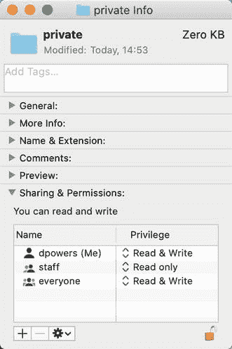

1.  再次单击挂锁图标以保存新设置并关闭信息面板。现在你应该能够使用`private`文件夹继续本章的剩余部分。

### 影响文件访问的配置设置

托管公司可以通过`php.ini`对文件访问进行进一步限制。要找出施加了什么限制，请在您的网站上运行`phpinfo()`并检查核心部分的设置。表 [7-1](#Tab1) 列出了您需要检查的设置。除非您运行自己的服务器，否则通常无法控制这些设置。

表 7-1

影响文件访问的 PHP 配置设置

<colgroup><col class="tcol1 align-left"> <col class="tcol2 align-left"> <col class="tcol3 align-left"></colgroup> 
| 

管理的

 | 

缺省值

 | 

描述

 |
| --- | --- | --- |
| `allow_url_fopen` | 在 | 允许 PHP 脚本打开互联网上的公共文件 |
| `allow_url_include` | 离开 | 控制包含远程文件的能力 |

表 [7-1](#Tab1) 中的设置都通过 URL 控制对文件的访问(与本地文件系统相反)。第一个是`allow_url_fopen`，允许您读取远程文件，但不能将它们包含在脚本中。这通常是安全的，因此默认情况下启用它。

另一方面，`allow_url_include`允许您在脚本中直接包含远程文件。这是一个主要的安全风险，所以默认情况下`allow_url_include`是禁用的。

Tip

如果你的托管公司已经禁用了`allow_url_fopen`，要求将其启用。否则，你将无法使用 PHP 解决方案 7-5。但是不要把名字搞混了:`allow_url_include`在托管环境中应该总是关闭的。即使在您的网站上禁用了`allow_url_fopen`，您仍然可以使用客户端 URL 库(cURL)访问有用的外部数据源，比如新闻提要和公共 XML 文档。详见 [`www.php.net/manual/en/book.curl.php`](http://www.php.net/manual/en/book.curl.php) 。

## 读取和写入文件

读写文件的能力有广泛的应用。例如，您可以打开另一个网站上的文件，将内容读入服务器内存，使用字符串和 XML 操作函数提取信息，然后将结果写入本地文件。您也可以在自己的服务器上查询数据库，并将数据输出为文本或 CSV(逗号分隔值)文件。您甚至可以生成开放文档格式或 Microsoft Excel 电子表格格式的文件。但首先，我们来看看基本操作。

### 在单个操作中读取文件

PHP 有三个函数可以在一次操作中读取文本文件的内容:

*   **readfile()** 打开一个文件，直接输出其内容。

*   **file_get_contents()** 将文件的全部内容读入一个字符串，但不生成直接输出。

*   **file()** 将每一行读入一个数组。

#### PHP 解决方案 7-1:获取文本文件的内容

这个 PHP 解决方案展示了使用`readfile()`、`file_get_contents()`和`file()`访问文件内容的区别。

1.  将`ch07`文件夹中的`sonnet.txt`复制到你的`private`文件夹中。这是一个包含莎士比亚十四行诗 116 的文本文件。

2.  在 php8sols 站点根目录下创建一个名为`filesystem`的新文件夹，然后在新文件夹下创建一个名为`get_contents.php`的 php 文件。将以下代码插入 PHP 块中(`ch07`文件夹中的`get_contents_01.php`显示了嵌入在网页中的代码，但是您可以只使用 PHP 代码进行测试):

```php
readfile('C:/private/sonnet.txt');

```

如果您使用的是 Mac，请使用您自己的 Mac 用户名修改路径名，如下所示:

```php
readfile('/Users/username/private/sonnet.txt');

```

如果您在 Linux 或远程服务器上进行测试，请相应地修改路径名。

Note

为简洁起见，本章中的其余示例只显示了 Windows 路径名。

1.  保存`get_contents.php`并在浏览器中查看。您应该会看到类似下面的截图。浏览器会忽略原始文本中的换行符，并将莎士比亚的十四行诗显示为实心块:

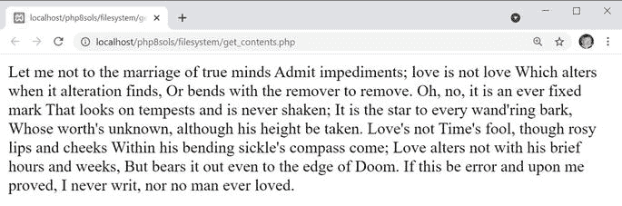

Tip

如果您看到错误消息，请检查您键入的代码是否正确，以及在 Mac 或 Linux 上是否设置了正确的文件和文件夹权限。

1.  PHP 有一个名为`nl2br()`的函数，将换行符转换为`<br/>`标签(尾部斜杠是为了与 XHTML 兼容，在 HTML5 中有效)。把`get_contents.php`里的代码改成这样(在`get_contents_02.php`里):

1.  保存`get_contents.php`并在浏览器中重新加载。输出仍然是一个完整的文本块。当您像这样将一个函数作为参数传递给另一个函数时，内部函数的结果通常会传递给外部函数，在一个表达式中执行这两个操作。因此，您可能希望文件的内容在浏览器中显示之前被传递给`nl2br()`。然而，`readfile()`会立即输出文件的内容。当它完成的时候，已经没有什么可以让`nl2br()`插入`<br/>`标签了。文本已经在浏览器中。

    注意当两个函数像这样嵌套时，首先执行内部函数，然后外部函数处理结果。但是内部函数的返回值需要作为外部函数的参数有意义。`readfile()`的返回值是从文件中读取的字节数。即使您在行首添加了`echo`，您得到的也只是添加到文本末尾的 594。在这种情况下，嵌套函数不起作用，但它通常是一种非常有用的技术，避免了在用另一个函数处理内部函数的结果之前将它存储在变量中的需要。

2.  代替`readfile()`，你需要使用`file_get_contents()`来将换行符转换成`<br/>`标签。`readfile()`只是输出文件的内容，`file_get_contents()`将文件的内容作为一个字符串返回。由你决定如何处理它。像这样修改代码(或使用`get_contents_03.php`):

```php
nl2br(readfile('C:/private/sonnet.txt'));

```

1.  在浏览器中重新加载页面。十四行诗的每一行现在都自成一行:

```php
echo nl2br(file_get_contents('C:/private/sonnet.txt'));

```

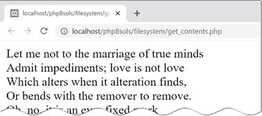

1.  `file_get_contents()`的优点是你可以将文件内容赋给一个变量，并在决定如何处理它之前以某种方式处理它。像这样修改`get_contents.php`中的代码(或者使用`get_contents_04.php`，并将页面加载到浏览器中:

    ```php
    $sonnet = file_get_contents('C:/private/sonnet.txt');
    // replace new lines with spaces
    $words = str_replace("\r\n", ' ', $sonnet);
    // split into an array of words
    $words = explode(' ', $words);
    // extract the first nine array elements
    $first_line = array_slice($words, 0, 9);
    // join the first nine elements and display
    echo implode(' ', $first_line);

    ```

这将把`sonnet.txt`的内容存储在一个名为`$sonnet`的变量中，该变量被传递给`str_replace()`，后者用空格替换回车符和换行符，并将结果存储为`$words`。

Note

关于`"\r\n"`的解释，参见第 [4](04.html) 章中的“在双引号内使用转义序列”。文本文件是在 Windows 中创建的，所以换行符由回车和换行符表示。在 macOS 和 Linux 上创建的文件只使用一个换行符(`"\n"`)。

然后`$words`被传递给`explode()`函数。这个名字令人担忧的函数“拆开”一个字符串，并将其转换为一个数组，使用第一个参数来确定在哪里断开字符串。在这种情况下，使用了一个空格，因此文本文件的内容被分成一个单词数组。

然后将单词数组传递给`array_slice()`函数，该函数从第二个参数指定的位置开始从数组中取出一部分。第三个参数指定切片的长度。PHP 从 0 开始对数组计数，因此提取前九个单词。

最后，`implode()`执行与`explode()`相反的操作，连接数组的元素，并在每个元素之间插入第一个参数。结果由`echo`显示，产生如下:

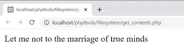

该脚本现在只显示第一行，而不是显示文件的全部内容。完整的字符串仍然存储在`$sonnet`中。

1.  然而，如果您想单独处理每一行，使用`file()`更简单，它将文件的每一行读入一个数组。为了显示`sonnet.txt`的第一行，前面的代码可以简化成这样(参见`get_contents_05.php`):

    ```php
    $sonnet = file('C:/private/sonnet.txt');
    echo $sonnet[0];

    ```

2.  事实上，如果您不需要完整的数组，您可以使用一种称为数组解引用的技术直接访问一行，方法是在调用函数后在方括号中添加它的索引号。以下代码显示十四行诗的第 11 行(见`get_contents_06.php`):

```php
echo file('C:/private/sonnet.txt')[10];

```

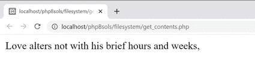

在我们刚刚探索的三个函数中，`readfile()`只是读取一个文件的内容，并将其直接转储到输出中。您不能操作文件内容或从中提取信息。然而，`readfile()`的一个实际用途是强制下载一个文件，你将在本章后面看到。

另外两个函数`file_get_contents()`和`file()`，允许您捕获变量中的内容，以便重新格式化或提取信息。唯一的区别是，`file_get_contents()`将内容读入单个字符串，而`file()`生成一个数组，其中每个元素对应文件中的一行。

Tip

`file()`函数在每个数组元素的末尾保留换行符。如果想去掉换行符，将常量`FILE_IGNORE_NEW_LINES`作为第二个参数传递给函数。您也可以使用`FILE_SKIP_EMPTY_LINES`作为第二个参数来跳过空行。要删除换行符，跳过空行，用竖线分隔两个常量，像这样:`FILE_IGNORE_NEW_LINES | FILE_SKIP_EMPTY_LINES`。

虽然我们只对本地文本文件测试了`file_get_contents()`和`file()`，但是它们也可以从其他域的公共文件中获取内容。这使得它们对于访问其他网页上的信息非常有用，尽管提取信息通常需要对字符串函数和文档对象模型或 DOM 所描述的文档的逻辑结构有扎实的理解(参见 [`www.w3.org/TR/WD-DOM/introduction.html`](http://www.w3.org/TR/WD-DOM/introduction.html) )。

`file_get_contents()`和`file()`的缺点是将整个文件读入内存。对于非常大的文件，最好使用一次只处理文件一部分的函数。我们接下来会看这些。

### 为读/写操作打开和关闭文件

到目前为止，我们所看到的函数都是一次完成的。然而，PHP 也有一组函数，允许你打开一个文件，读它和/或写它，然后关闭文件。该文件可以在本地文件系统上，也可以是不同域上的公开文件。

以下是用于此类操作的最重要的功能:

*   `fopen()`:打开一个文件

*   读取文件的内容，通常一次一行

*   `fgetcsv()`:从 CSV 文件中获取当前行，并将其转换为数组

*   `fread()`:读取指定数量的文件

*   `fwrite()`:写入文件

*   `feof()`:判断是否已经到达文件的末尾

*   `rewind()`:将内部指针移回文件顶部

*   `fseek()`:将内部指针移动到文件中的特定位置

*   `fclose()`:关闭文件

第一个是`fopen()`，它提供了一个令人困惑的选项来选择文件打开后如何使用:`fopen()`有一个只读模式、四个只写模式和五个读/写模式。之所以有这么多，是因为它们让您可以控制是覆盖现有内容还是添加新内容。在其他时候，如果文件不存在，您可能希望 PHP 创建一个文件。

每种模式都决定了打开文件时放置内部指针的位置。这就像文字处理器中的光标:当你调用`fread()`或`fwrite()`时，PHP 从指针碰巧所在的地方开始读取或写入。

表格 [7-2](#Tab2) 指导您完成所有选项。

表 7-2

fopen()使用的读/写模式

<colgroup><col class="tcol1 align-left"> <col class="tcol2 align-left"> <col class="tcol3 align-left"></colgroup> 
| 

类型

 | 

方式

 | 

描述

 |
| --- | --- | --- |
| 只读 | `r` | 最初放在文件开头的内部指针。 |
| 只写 | `w` | 写入前删除现有数据。创建一个不存在的文件。 |
|   | `a` | 追加模式。在末尾添加了新数据。创建一个不存在的文件。 |
|   | `c` | 现有内容被保留，但是内部指针被放在文件的开头。创建一个不存在的文件。 |
|   | `x` | 仅在文件不存在时创建文件。如果已经有同名文件，则失败。 |
| 读/写 | `r+` | 读/写操作可以按任意顺序进行，并且从内部指针所在的位置开始。指针最初放在文件的开头。文件必须已经存在，操作才能成功。 |
| `w+` | 现有数据已删除。数据可以在写入后读回。创建一个不存在的文件。 |
| `a+` | 打开一个文件，准备在文件末尾添加新数据。还允许在内部指针移动后回读数据。创建一个不存在的文件。 |
| `c+` | 保留现有内容，并将内部指针放在文件的开头。如果文件不存在，则创建一个新文件。 |
| `x+` | 创建新文件，但如果同名文件已经存在，则创建失败。数据可以在写入后读回。 |

选择了错误的模式，你可能最终会删除有价值的数据。您还需要注意内部指针的位置。如果指针在文件的末尾，而你试图读取内容，你最终会一无所获。另一方面，如果指针位于文件的开头，并且您开始写入，您将覆盖等量的现有数据。本章后面的“移动内部指针”对此有更详细的解释。

通过传递以下两个参数来使用`fopen()`:

*   您要打开的文件的路径或 URL(如果文件在不同的域中)

*   包含表 [7-2](#Tab2) 中所列模式之一的字符串

`fopen()`函数返回一个对打开文件的引用，该引用可用于其他读/写函数。这是打开文本文件进行阅读的方式:

```php
$file = fopen('C:/private/sonnet.txt', 'r');

```

此后，将`$file`作为参数传递给其他函数，比如`fgets()`和`fclose()`。通过一些实际的演示，事情会变得更清楚。您可能会发现使用`ch07`文件夹中的文件比自己构建文件更容易。我将快速浏览每个模式。

Note

Mac 和 Linux 用户需要调整示例文件中`private`文件夹的路径，以匹配他们的设置。

#### 用 fopen()读取文件

文件`fopen_read.php`包含以下代码:

```php
// store the pathname of the file
$filename = 'C:/private/sonnet.txt';
// open the file in read-only mode
$file = fopen($filename, 'r');
// read the file and store its contents
$contents = fread($file, filesize($filename));
// close the file
fclose($file);
// display the contents with <br/> tags
echo nl2br($contents);

```

如果将它加载到浏览器中，您应该会看到以下输出:

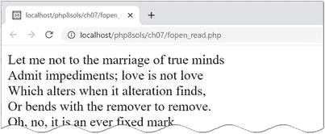

结果与在`get_contents_03.php`中使用`file_get_contents()`相同。与`file_get_contents()`不同，函数`fread()`需要知道要读取多少文件。您需要提供第二个参数来指示字节数。例如，如果您只需要一个非常大的文件中的前 100 个左右的字符，这可能会很有用。但是，如果您想要整个文件，您需要将文件的路径名传递给`filesize()`以获得正确的数字。

用`fopen()`读取文件内容的另一种方法是使用`fgets()`，它一次检索一行。这意味着您需要结合使用`while`循环和`feof()`来读取文件的末尾。`fopen_readloop.php`中的代码是这样的:

```php
$filename = 'C:/private/sonnet.txt';
// open the file in read-only mode
$file = fopen($filename, 'r');
// create variable to store the contents
$contents = ";
// loop through each line until end of file
while (!feof($file)) {
    // retrieve next line, and add to $contents
    $contents .= fgets($file);
}
// close the file
fclose($file);
// display the contents
echo nl2br($contents);

```

`while`循环使用`fgets()`一次一行地检索文件的内容——`!feof($file)`等同于说“直到`$file`结束”——并将它们存储在`$contents`中。

使用`fgets()`与使用`file()`函数非常相似，因为它一次处理一行。不同的是，一旦你找到了你要找的信息，你就可以用`fgets()`打破这个循环。如果您正在处理一个非常大的文件，这是一个显著的优势。`file()`函数将整个文件加载到一个数组中，消耗内存。

#### PHP 解决方案 7-2:从 CSV 文件中提取数据

文本文件可以用作平面文件数据库，其中每条记录都存储在一行中，每个字段之间用逗号、制表符或其他分隔符分隔。这种类型的文件称为 **CSV 文件**。通常，CSV 代表逗号分隔的值，但是当使用制表符或不同的分隔符时，它也可以表示字符分隔的值。这个 PHP 解决方案展示了如何使用`fopen()`和`fgetcsv()`将 CSV 文件中的值提取到多维关联数组中。

1.  将`ch07`文件夹中的`weather.csv`复制到你的`private`文件夹中。该文件包含以下逗号分隔值的数据:

```php
city,temp
London,11
Paris,10
Rome,12
Berlin,8
Athens,19

```

第一行由文件其余部分的数据标题组成。共有五行数据，每行包含一个城市的名称和一个温度。

Caution

将数据存储为逗号分隔的值时，逗号后面不应有空格。如果添加空格，它将被视为数据字段的第一个字符。CSV 文件中的每一行都必须有相同数量的项目。

1.  在`filesystem`文件夹中创建一个名为`getcsv.php`的文件，使用`fopen()`以读取模式打开`weather.csv`:

1.  使用`fgetcsv()`从文件中提取第一行作为数组，然后将它赋给一个名为`$titles`的变量:

    `$titles = fgetcsv($file);`

    这会将`$titles`创建为一个数组，其中包含第一行(city 和 temp)的值。

    `fgetcsv()`函数需要一个参数，即您打开的文件的引用。它还接受多达四个可选参数:

    *   **线的最大长度**:默认值为 0，表示无限制。

    *   **字段之间的分隔符**:默认为逗号。

    *   **包围字符**:如果字段包含分隔符作为数据的一部分，它们必须用引号括起来。双引号是默认设置。

    *   **转义符**:默认为反斜杠。

```php
$file = fopen('C:/private/weather.csv', 'r');

```

我们使用的 CSV 文件不需要设置任何可选参数。

1.  在下一行，为将从 CSV 数据中提取的值初始化一个空数组:

1.  从一行中提取值后，`fgetcsv()`移动到下一行。要从文件中获取剩余的数据，您需要创建一个循环。添加以下代码:

    ```php
    while (!(feof($file)) {
        $data = fgetcsv($file);
        $cities[] = array_combine($titles, $data);
    }

    ```

```php
$cities = [];

```

循环内部的代码将 CSV 文件的当前行作为数组分配给$data，然后使用`array_combine()`函数生成一个关联数组，该数组被添加到`$cities`数组中。这个函数需要两个参数，这两个参数都必须是元素个数相同的数组。这两个数组被合并，从第一个参数中提取结果关联数组的键，从第二个参数中提取值。

1.  关闭 CSV 文件:

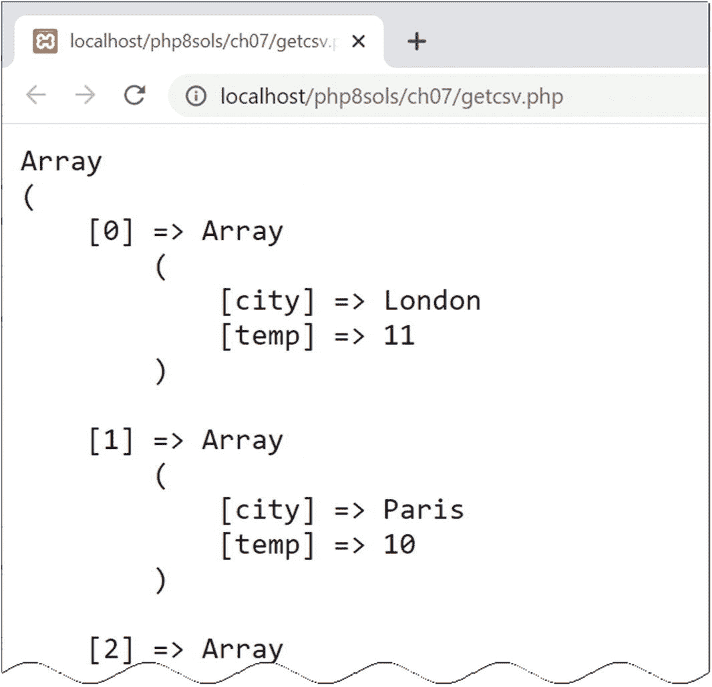

图 7-1

CSV 数据已被转换为多维关联数组

1.  要检查结果，使用`print_r()`。用`<pre>`标记包围它，使输出更容易阅读:

    ```php
    echo '<pre>';
    print_r($cities);
    echo '</pre>';

    ```

2.  保存`getcsv.php`并将其载入浏览器。您应该会看到如图 [7-1](#Fig1) 所示的结果。

```php
fclose($file);

```

1.  这与`weather.csv`配合得很好，但是脚本可以做得更健壮。如果`fgetcsv()`遇到一个空行，它将返回一个包含单个`null`元素的数组，该数组在作为参数传递给`array_combine()`时会产生一个错误。通过添加以粗体突出显示的条件语句来修改`while`循环:

    ```php
    while (!feof($file)) {
        $data = fgetcsv($file);
        if (empty($data[0])) {
            continue;
        }
        $cities[] = array_combine($titles, $data);
    }

    ```

如果 fgetcsv()遇到一个空行，它将返回一个包含单个 null 元素的数组。条件语句使用`empty()`函数测试$data 数组中的第一个元素，如果变量不存在或等于`false`，则返回 true。如果有一个空行，`continue`关键字返回到循环的顶部，而不执行下一行。

您可以对照`ch07`文件夹中的`getcsv.php`来检查您的代码。

CSV FILES CREATED ON MACOS

PHP 经常很难检测在 Mac 操作系统上创建的 CSV 文件的行尾。如果`fgetcsv()`无法从 CSV 文件中正确提取数据，请在脚本顶部添加以下代码行:

```php
ini_set('auto_detect_line_endings', true);

```

这对性能的影响微乎其微，因此只有当 Mac 行尾导致 CSV 文件出现问题时，才应该使用它。

#### 用 fopen()替换内容

第一种只写模式(`w`)删除文件中的任何现有内容，因此对于需要频繁更新的文件非常有用。您可以用`fopen_write.php`测试`w`模式，它在`DOCTYPE`声明上面有以下 PHP 代码:

```php
<?php
// if the form has been submitted, process the input text
if (isset($_POST['putContents'])) {
    // open the file in write-only mode
    $file = fopen('C:/private/write.txt', 'w');
    // write the contents
    fwrite($file, $_POST['contents']);
    // close the file
    fclose($file);
}
?>

```

当页面中的表单被提交时，这段代码将把`$_POST['contents'`的值写到一个名为`write.txt`的文件中。`fwrite()`函数有两个参数:文件的引用和你想写入的内容。

Note

你可能会遇到`fputs()`而不是`fwrite()`。这两个功能是相同的:`fputs()`是`fwrite()`的同义词。

如果您将`fopen_write.php`加载到浏览器中，请在文本区域中键入一些内容，然后单击写入文件。PHP 创建`write.txt`并将您输入的内容插入文本区域。因为这只是一个演示，所以我省略了任何检查来确保文件被成功写入。打开`write.txt`来验证你的文本已经被插入。现在，在文本区域输入不同的内容，然后再次提交表单。从`write.txt`中删除原始内容，并用新文本替换。

#### 用 fopen()追加内容

append 模式不仅在末尾添加新内容，保留任何现有内容，而且如果文件不存在，它还可以创建一个新文件。`fopen_append.php`中的代码看起来像这样:

```php
// open the file in append mode
$file = fopen('C:/private/append.txt', 'a');
// write the contents followed by a new line
fwrite($file, $_POST['contents'] . PHP_EOL);
// close the file
fclose($file);

```

请注意，我在`$_POST['contents']`后面连接了`PHP_EOL`。这是一个 PHP 常量，表示使用操作系统的正确字符的新行。在 Windows 上，它插入一个回车和换行符，但是在 Mac 和 Linux 上只有一个换行符。

如果您将`fopen_append.php`加载到浏览器中，键入一些文本，然后提交表单。它在私有文件夹中创建一个名为 append.txt 的文件，并插入您的文本。键入其他内容并再次提交表单；新文本应添加到先前文本的末尾，如下面的屏幕截图所示:

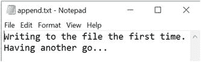

我们将在第 [11](11.html) 章回到追加模式。

#### 写入前锁定文件

在`c`模式下使用`fopen()`的目的是让你有机会在修改文件之前用`flock()`锁定文件。

`flock()`函数有两个参数:文件引用和一个指定锁应该如何操作的常量。有三种类型的操作:

*   `LOCK_SH`获取共享锁进行读取。

*   获得一个写操作的独占锁。

*   `LOCK_UN`解除锁定。

要在写入文件之前锁定文件，请在`c`模式下打开文件并立即调用`flock()`，如下所示:

```php
// open the file in c mode
$file = fopen('C:/private/lock.txt', 'c');
// acquire an exclusive lock
flock($file, LOCK_EX);

```

这将打开文件，如果文件不存在，则创建它，并将内部指针放在文件的开头。这意味着您需要将指针移动到文件的末尾或删除现有内容，然后才能使用`fwrite()`开始写入。

要将指针移动到文件的末尾，使用`fseek()`函数，如下所示:

```php
// move to end of file
fseek($file, 0, SEEK_END);

```

或者，通过调用`ftruncate()`删除现有内容:

```php
// delete the existing contents
ftruncate($file, 0);

```

在您完成写入文件后，您必须在调用`fclose()`之前手动解锁它:

```php
// unlock the file before closing
flock($file, LOCK_UN);
fclose($file);

```

Caution

如果您在关闭文件之前忘记解锁该文件，即使您自己可以打开它，其他用户和进程仍会锁定该文件。

#### 防止覆盖现有文件

与其他写入模式不同，`x`模式不会打开现有文件。它只创建一个准备写入的新文件。如果同名文件已经存在，`fopen()`返回`false`，防止您覆盖它。`fopen_exclusive.php`中的处理代码是这样的:

```php
// create a file ready for writing only if it doesn't already exist
// error control operator prevents error message from being displayed
if ($file = @ fopen('C:/private/once_only.txt', 'x')) {
    // write the contents
    fwrite($file, $_POST['contents']);
    // close the file
    fclose($file);
} else {
    $error = 'File already exists, and cannot be overwritten.';
}

```

试图以`x`模式写入现有文件会产生 PHP 警告和致命错误。将写和关闭操作包装在条件语句中消除了致命错误，但是`fopen()`仍然会生成警告。`fopen()`前面的错误控制操作符(`@`)抑制警告。

将`fopen_exclusive.php`加载到浏览器中，键入一些文本，然后单击写入文件。内容应该写入目标文件夹中的`once_only.txt`。

如果您再次尝试，储存在`$error`中的信息会显示在表单上方。

#### 用 fopen()组合读/写操作

通过在前面的任何模式后添加一个加号(`+`)，文件被打开以进行读写。您可以按任意顺序执行任意数量的读取或写入操作，直到文件关闭。组合模式之间的区别如下:

*   `r+`:文件必须已经存在；不会自动创建新的。内部指针放在开头，准备读取现有内容。

*   `w+`:已有内容被删除，所以第一次打开文件时没有可读取的内容。

*   `a+`:文件打开时，内部指针在末尾，准备追加新的素材，所以指针需要移回，才能读取任何内容。

*   `c+`:文件以内部指针开头打开。

*   总是创建一个新文件，所以当文件第一次打开时没有什么可读的。

用`fread()`或`fgets()`读，用`fwrite()`写，和以前一模一样。重要的是理解内部指针的位置。

#### 移动内部指针

读取和写入操作总是从内部指针所在的地方开始，所以通常你希望它在文件的开头读取，在文件的结尾写入。

要将指针移到开头，将文件引用传递给`rewind()`,如下所示:

```php
rewind($file);

```

要将指针移动到文件的末尾，像这样使用`fseek()`:

```php
fseek($file, 0, SEEK_END);

```

您也可以使用`fseek()`将内部指针移动到特定位置或相对于其当前位置。详见 [`www.php.net/manual/en/function.fseek`](http://www.php.net/manual/en/function.fseek) 。

Tip

在追加模式(`a`或`a+`)下，无论指针的当前位置如何，内容总是被写到文件的末尾。

## 探索文件系统

PHP 的文件系统函数也可以打开目录(文件夹)并检查其内容。从 web 开发人员的角度来看，文件系统功能的实际用途包括构建显示文件夹内容的下拉菜单，以及创建提示用户下载文件(如图像或 PDF 文档)的脚本。

### 用 scandir()检查文件夹

函数的作用是:返回一个由指定文件夹中的文件和文件夹组成的数组。只需将文件夹(目录)的路径名作为字符串传递给`scandir()`，并将结果存储在一个变量中，如下所示:

```php
$files = scandir('../images');

```

您可以通过使用`print_r()`显示数组的内容来检查结果，如下图所示(代码在`ch07`文件夹中的`scandir.php`):

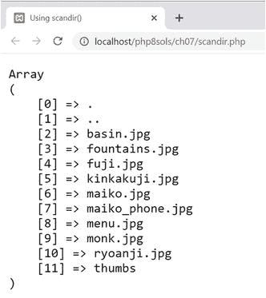

由`scandir()`返回的数组不仅仅包含文件。前两项称为点文件，代表当前文件夹和父文件夹。最后一项是一个名为`thumbs`的文件夹。

该数组只包含每个项目的名称。如果你想要更多关于文件夹内容的信息，最好使用`FilesystemIterator`类。

### 使用文件系统生成器检查文件夹的内容

`FilesystemIterator`类可以让你遍历一个目录或文件夹的内容。它是标准 PHP 库(SPL)的一部分，是 PHP 的核心部分。SPL 的主要特性之一是一组专门的迭代器，这些迭代器可以用很少的代码创建复杂的循环。

因为它是一个类，所以您用关键字`new`实例化一个`FilesystemIterator`对象，并将您想要检查的文件夹的路径传递给构造函数，如下所示:

```php
$files = new FilesystemIterator('../images');

```

与`scandir()`不同，它不返回文件名数组，所以不能使用`print_r()`来显示其内容。相反，它会创建一个对象，让您可以访问文件夹中的所有内容。要显示文件名，使用一个像这样的`foreach`循环(代码在`ch07`文件夹的`iterator_01.php`中):

```php
$files = new FilesystemIterator('../images');
foreach ($files as $file) {
    echo $file . '<br>';
}

```

这会产生以下结果:

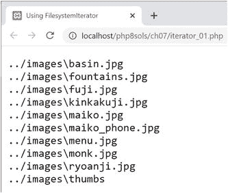

可以对该输出进行以下观察:

*   省略了表示当前文件夹和父文件夹的点文件。

*   显示的值代表文件的相对路径，而不仅仅是文件名。

*   因为截图是在 Windows 上拍摄的，所以在相对路径中使用了反斜杠。

在大多数情况下，反斜杠不重要，因为 PHP 接受 Windows 路径中的正斜杠或反斜杠。但是，如果您想从`FilesystemIterator`的输出中生成 URL，可以选择使用 Unix 风格的路径。设置选项的一种方法是将一个常量作为第二个参数传递给`FilesystemIterator()`，就像这样(参见`iterator_02.php`):

```php
$files = new FilesystemIterator('../images', FilesystemIterator::UNIX_PATHS);

```

或者，您可以像这样调用`FilesystemIterator`对象上的`setFlags()`方法(`see iterator_03.php`):

```php
$files = new FilesystemIterator('../images');
$files->setFlags(FilesystemIterator::UNIX_PATHS);

```

两者都产生如下屏幕截图所示的输出:


当然，这在 macOS 或 Linux 上不会有什么不同，但是设置这个选项会使您的代码更具可移植性。

Tip

SPL 类使用的常量都是类常量。它们总是以类名和范围解析操作符(两个冒号)为前缀。像这样冗长的名字使得使用带有 PHP 代码提示和代码补全的编辑程序非常值得。

虽然能够显示文件夹内容的相对路径很有用，但是使用`FilesystemIterator`类的真正价值在于每次循环运行时，它都可以让您访问一个`SplFileInfo`对象。`SplFileInfo`类有近 30 种方法可以用来提取关于文件和文件夹的有用信息。表 [7-3](#Tab3) 列出了一些最有用的`SplFileInfo`方法。

表 7-3

可通过 SplFileInfo 方法访问的文件信息

<colgroup><col class="tcol1 align-left"> <col class="tcol2 align-left"></colgroup> 
| 

方法

 | 

返回

 |
| --- | --- |
| `getFilename()` | 文件的名称 |
| `getPath()` | 当前对象的相对路径减去文件名，或者如果当前对象是文件夹，则减去文件夹名 |
| `getPathName()` | 当前对象的相对路径，包括文件名或文件夹名，具体取决于当前类型 |
| `getRealPath()` | 当前对象的完整路径，包括文件名(如果适用) |
| `getSize()` | 文件或文件夹的大小，以字节为单位 |
| `isDir()` | 如果当前对象是文件夹(目录)，则为 True |
| `isFile()` | 如果当前对象是文件，则为 True |
| `isReadable()` | 如果当前对象可读，则为 True |
| `isWritable()` | 如果当前对象可写，则为 True |

要访问子文件夹的内容，请使用`RecursiveDirectoryIterator`类。这深入到了文件夹结构的每一层，但是你需要把它和名字奇怪的`RecursiveIteratorIterator`结合起来使用，就像这样(代码在`iterator_04.php`):

```php
$files = new RecursiveDirectoryIterator('../images');
$files->setFlags(RecursiveDirectoryIterator::SKIP_DOTS);
$files = new RecursiveIteratorIterator($files);
foreach ($files as $file) {
    echo $file->getRealPath() . '<br>';
}

```

Note

默认情况下，`RecursiveDirectoryIterator`包括代表当前和父文件夹的点文件。要排除它们，需要将类的`SKIP_DOTS`常量作为第二个参数传递给构造函数方法，或者使用`setFlags()`方法。

如下面的截图所示，`RecursiveDirectoryIterator`检查所有子文件夹的内容，显示`thumbs`文件夹的内容，只需一次操作:

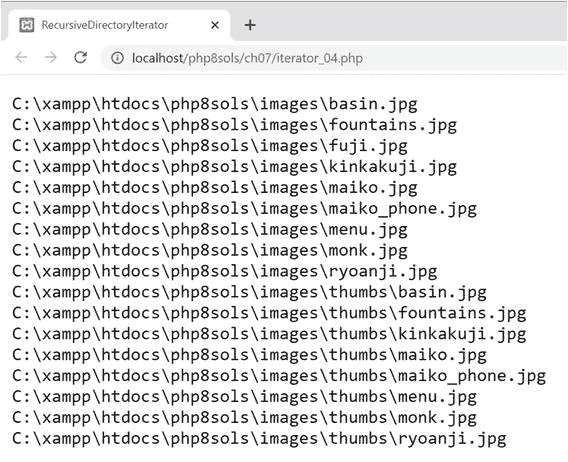

如果您只想查找特定类型的文件，该怎么办？提示另一个迭代器…

### 使用 RegexIterator 限制文件类型

`RegexIterator`充当另一个迭代器的包装器，使用正则表达式(regex)作为搜索模式过滤其内容。假设您想在`ch07`文件夹中找到文本和 CSV 文件。用于搜索`.txt`和`.csv`文件扩展名的正则表达式如下所示:

```php
'/\.(?:txt|csv)$/i'

```

这个正则表达式以不区分大小写的方式匹配这两个文件扩展名。`iterator_05.php`中的代码看起来像这样:

```php
$files = new FilesystemIterator('.');
$files = new RegexIterator($files, '/\.(?:txt|csv)$/i');
foreach ($files as $file) {
    echo $file->getFilename() . '<br>';
}

```

传递给`FilesystemIterator`构造函数的点告诉它检查当前文件夹。然后原始的`$files`对象作为第一个参数传递给`RegexIterator`构造函数，正则表达式作为第二个参数，过滤后的集合被重新分配给`$files`。在`foreach`循环中，`getFilename()`方法检索文件的名称。结果是这样的:

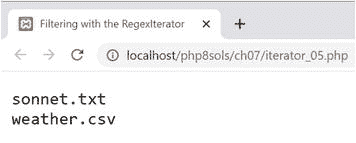

现在只列出了文本和 CSV 文件。所有的 PHP 文件都被忽略了。

我想到了这个阶段，你可能会想知道这是否能有任何实际用途。让我们在一个文件夹中构建一个图像下拉菜单。

#### PHP 解决方案 7-3:建立一个文件下拉菜单

使用数据库时，您通常需要特定文件夹中的图像或其他文件的列表。例如，您可能希望将图片与产品详细信息页面相关联。虽然您可以在文本字段中键入图像的名称，但是您需要确保图像在那里，并且拼写正确。通过自动构建下拉菜单，让 PHP 来完成这项艰巨的工作。它总是最新的，而且没有拼错名字的危险。

1.  在`filesystem`文件夹中创建一个名为`imagelist.php`的 PHP 页面。或者，使用`ch07`文件夹中的`imagelist_01.php`。

2.  在`imagelist.php`中创建一个表单，插入一个只有一个`<option>`的`<select>`元素，就像这样(代码已经在`imagelist_01.php`中了):

    ```php
    <form method="post">
        <select name="pix" id="pix">
            <option value="">Select an image</option>
        </select>
    </form>

    ```

3.  这个`<option>`是下拉菜单中唯一的静态元素。

4.  按如下形式修改`<select>`元素:

    ```php
    <select name="pix" id="pix">
        <option value="">Select an image</option>
        <?php
        $files = new FilesystemIterator('../images');
        $images = new RegexIterator($files, '/\.(?:jpg|png|gif|webp)$/i');
        foreach ($images as $image) {
            $filename = $image->getFilename();
        ?>
            <option value="<?= $filename ?>"><?= $filename ?></option>
        <?php } ?>
    </select>

    ```

确保`images`文件夹的路径对于您站点的文件夹结构是正确的。用作`RegexIterator`构造函数第二个参数的正则表达式匹配不区分大小写的文件，文件扩展名为`.jpg`、`.png`、`.gif`和`.webp`。

`foreach`循环简单地获取当前图像的文件名，并将其插入到`<option>`元素中。

保存`imagelist.php`并将其加载到浏览器中。你应该会看到一个下拉菜单，列出了你的`images`文件夹中的所有图片，如图 [7-2](#Fig2) 所示。


图 7-2

PHP 轻松地在特定文件夹中创建一个图片下拉菜单

当合并到在线表单中时，所选图像的文件名出现在`$_POST`数组中，并由`<select>`元素的`name`属性标识——在本例中为`$_POST['pix']`。仅此而已！

您可以将您的代码与`ch07`文件夹中的`imagelist_02.php`进行比较。

#### PHP 解决方案 7-4:创建一个通用文件选择器

之前的 PHP 解决方案依赖于对正则表达式的理解。使其适应其他文件扩展名并不困难，但是您需要小心，不要意外删除了一个重要的字符。除非正则表达式是您的专长，否则将代码包装在一个函数中可能更容易，该函数可用于检查特定文件夹并创建特定类型的文件名数组。例如，您可能想要创建一个 PDF 文档文件名数组或一个包含 PDF 和 Word 文档的数组。这是你怎么做的。

1.  在`filesystem`文件夹中创建一个名为`buildlist.php`的新文件。该文件将只包含 PHP 代码，所以删除任何由你的编辑程序插入的 HTML。

2.  将以下代码添加到文件中:

    ```php
    function buildFileList(string $dir, string|array $extensions) {
        if (!is_dir($dir) && !is_readable($dir)) {
            return false;
        } else {
            if (is_array($extensions)) {
                $extensions = implode('|', $extensions);
            }
         }
    }

    ```

3.  这定义了一个名为`buildFileList()`的函数，它有两个参数:

    *   `$dir`:您要从中获取文件名列表的文件夹的路径。这必须是一个字符串。

    *   `$extensions`:函数签名使用了联合类型声明，这是 PHP 8 的新功能。它指定参数可以是字符串或数组。这应该是单个文件扩展名或文件扩展名数组。为了保持代码简单，扩展名不应包含前导句点。

该函数首先检查`$dir`是否是一个文件夹并且可读。如果不是，函数返回`false`，不再执行代码。

如果`$dir`没问题，则执行`else`块。它也以检查`$extensions`是否是一个数组的条件语句开始。如果是，它被传递给`implode()`，T3 用每个数组元素之间的竖线(`|`)连接数组元素。正则表达式中使用竖线来表示可选值。假设下面的数组作为第二个参数传递给函数:

```php
['jpg', 'png', 'gif']

```

条件语句将其转换为`jpg|png|gif`。所以这个寻找`jpg`或者`png`或者`gif`。但是，如果参数是字符串，它将保持不变。

1.  现在可以构建正则表达式搜索模式，并将两个参数传递给`FilesystemIterator`和`RegexIterator`，如下所示:

    ```php
    function buildFileList(string $dir, string|array $extensions) {
        if (!is_dir($dir) && !is_readable($dir)) {
            return false;
        } else {
            if (is_array($extensions)) {
                $extensions = implode('|', $extensions);
            }
            $pattern = "/\.(?:{$extensions})$/i";
            $folder = new FilesystemIterator($dir);
            $files = new RegexIterator($folder, $pattern);
        }
    }

    ```

regex 模式是使用双引号中的字符串和花括号中的`$extensions`构建的，以确保 PHP 引擎正确解释它。复制代码时要小心。它不太容易读懂。

1.  代码的最后一部分提取文件名来构建一个数组，数组被排序然后返回。完成的函数定义如下所示:

    ```php
    function buildFileList(string $dir, string|array $extensions) {
        if (!is_dir($dir) && !is_readable($dir)) {
            return false;
        } else {
            if (is_array($extensions)) {
                $extensions = implode('|', $extensions);
            }
            $pattern = "/\.(?:{$extensions})$/i";
            $folder = new FilesystemIterator($dir);
            $files = new RegexIterator($folder, $pattern);
            $filenames = [];
            foreach ($files as $file) {
                $filenames[] = $file->getFilename();
            }
            natcasesort($filenames);
            return $filenames;
        }
    }

    ```

这将初始化一个数组，并使用一个`foreach`循环通过`getFilename()`方法给它分配文件名。最后，数组被传递给`natcasesort()`，它以自然的、不区分大小写的顺序对数组进行排序。“自然”的意思是包含数字的字符串的排序方式与人的排序方式相同。例如，计算机通常将`img12.jpg`排在`img2.jpg`之前，因为 12 中的 1 小于 2。使用`natcasesort()`导致`img2.jpg`在`img12.jpg`之前。

1.  若要使用该函数，请将文件夹路径和要查找的文件的文件扩展名用作参数。例如，您可以从这样的文件夹中获取所有 Word 和 PDF 文档:

```php
$docs = buildFileList('folder_name', ['doc', 'docx', 'pdf']);

```

然后，您可以在 foreach 循环中遍历`$docs`来构建一个`select`列表的`option`元素，方法与 PHP Solution 7–3 的第 3 步相同。

`buildFileList()`功能的代码在`ch07`文件夹的`buildlist.php`中。

## 访问远程文件

在本地计算机或您自己的网站上读取、写入和检查文件非常有用。但是`allow_url_fopen`也让你可以在互联网的任何地方获得公开的文件。您可以读取内容，将其保存到一个变量中，并在将它合并到您自己的页面或将信息保存到数据库之前用 PHP 函数对其进行操作。

一个警告:当从远程资源中提取材料以包含在您自己的页面中时，存在安全风险。例如，远程页面可能包含嵌入在`<script>`标签或超链接中的恶意脚本。即使远程页面以已知的格式从可信的来源提供数据——比如来自 Amazon.com 数据库的产品细节、来自政府气象办公室的天气信息，或者来自报纸或广播公司的新闻提要——你也应该总是通过将它传递给`htmlentities()`来净化内容(参见 PHP 解决方案 6-3)。除了将双引号转换为`&quot;`，`htmlentities()`还将`<`转换为`& lt;`，将`>`转换为`& gt;`。这会以纯文本显示标签，而不是将其视为 HTML。

如果你想允许一些 HTML 标签，使用`strip_tags()`函数代替。如果您将一个字符串传递给`strip_tags()`，它将返回去掉所有 HTML 标签和注释的字符串。它还删除了 PHP 标签。第二个可选参数是您想要保留的标签列表。例如，下面的代码去掉了除段落、一级和二级标题之外的所有标签:

```php
$stripped = strip_tags($original, '<p><h1><h2>');

```

### 消费新闻和其他 RSS 源

一些最有用的远程信息源来自 RSS 提要，您可能希望将它们合并到您的站点中。RSS 代表真正简单的联合，是 XML 的一种方言。XML 和 HTML 的相似之处在于它使用标签来标记内容。XML 标签不是定义段落、标题和图像，而是用来以可预测的层次结构组织数据。XML 是用纯文本编写的，所以它经常被用来在可能运行不同操作系统的计算机之间共享信息。

图 [7-3](#Fig3) 显示了 RSS 2.0 提要的典型结构。整个文档被包装在一对`<rss>`标签中。这是根元素，类似于网页的`<html>`标签。文档的其余部分被包装在一对`<channel>`标签中，它们总是包含以下三个描述 RSS 提要的元素:`<title>`、`<description>`和`<link>`。

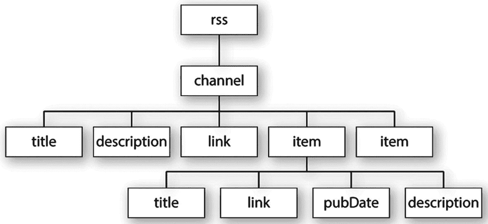

图 7-3

RSS 提要的主要内容在 item 元素中

除了这三个必需的元素之外，`<channel>`还可以包含许多其他元素，但是有趣的内容可以在`<item>`元素中找到。对于新闻提要，这是可以找到单个新闻条目的地方。如果你正在查看一个博客的 RSS 提要，那么`<item>`元素通常包含博客文章的摘要。

每个`<item>`元素可以包含几个元素，但是图 [7-3](#Fig3) 中显示的元素是最常见的，通常也是最有趣的:

*   `<title>`:项目的标题

*   `<link>`:项目的 URL

*   `<pubDate>`:出版日期

*   `<description>`:项目摘要

这种可预测的格式使得使用 SimpleXML 提取信息变得容易。

Note

你可以在 [`www.rssboard.org/rss-specification`](http://www.rssboard.org/rss-specification) 找到完整的 RSS 规范。与大多数技术规范不同，它是用通俗易懂的语言编写的，易于阅读。

### 使用 SimpleXML

只要您知道 XML 文档的结构，SimpleXML 就像它在 tin 上所说的那样:它使得从 XML 中提取信息变得简单。第一步是将 XML 文档的 URL 传递给`simplexml_load_file()`。还可以通过将路径作为参数传递来加载本地 XML 文件。例如，它从 BBC 获得世界新闻提要:

```php
$feed = simplexml_load_file('http://feeds.bbci.co.uk/news/world/rss.xml');

```

这创建了一个`SimpleXMLElement`类的实例。提要中的所有元素现在都可以通过使用元素名称作为`$feed`对象的属性来访问。使用 RSS 提要，`<item>`元素可以作为`$feed->channel->item`被访问。

要显示每个`<item>`的`<title>`，创建一个`foreach`循环，如下所示:

```php
foreach ($feed->channel->item as $item) {
    echo $item->title . '<br>';
}

```

如果你与图 [7-3](#Fig3) 比较，你可以看到你通过用`->`操作符链接元素名来访问元素，直到你到达目标。由于有多个`<item>`元素，您需要使用一个循环来进一步挖掘。或者，使用数组符号，如下所示:

```php
$feed->channel->item[2]->title

```

这将获得第三个`<item>`元素的`<title>`。除非您只想要一个特定的值，否则使用循环会更简单。

了解了背景之后，让我们使用 SimpleXML 来显示新闻提要的内容。

#### PHP 解决方案 7-5:使用 RSS 新闻提要

这个 PHP 解决方案展示了如何使用 SimpleXML 从实时新闻提要中提取信息，然后将其显示在 web 页面上。它还展示了如何将`<pubDate>`元素格式化为更加用户友好的格式，以及如何使用`LimitIterator`类限制显示的项目数量。


图 7-4

新闻提要包含大量项目

1.  在`filesystem`文件夹中创建一个名为`newsfeed.php`的新页面。这个页面将包含 PHP 和 HTML 的混合。

2.  这个 PHP 解决方案选择的新闻提要是 BBC 世界新闻。使用大多数新闻源的一个条件是你要知道来源。因此，在页面顶部添加格式为`<h1>`标题的最新 BBC 新闻。

    请注意在您自己的网站上使用 BBC 新闻源的条款和条件，请参见 [`www.bbc.co.uk/news/10628494#mysite`](http://www.bbc.co.uk/news/10628494%2523mysite) `and` [`www.bbc.co.uk/usingthebbc/terms/can-i-share-things-from-the-bbc/`](http://www.bbc.co.uk/usingthebbc/terms/can-i-share-things-from-the-bbc/) 。

3.  在标题下创建一个 PHP 块，并添加以下代码来加载提要:

    ```php
    $url = 'https://feeds.bbci.co.uk/news/world/rss.xml';
    $feed = simplexml_load_file($url);

    ```

4.  使用`foreach`循环访问`<item>`元素并显示每个元素的`<title>`:

    ```php
    foreach ($feed->channel->item as $item) {
        echo htmlentities($item->title) . '<br>';
    }

    ```

5.  保存`newsfeed.php`并在浏览器中加载页面。您应该会看到一长串类似于图 [7-4](#Fig4) 的新闻条目。

1.  正常的提要通常包含 30 个或更多的条目。对于一个新闻网站来说这很好，但是你可能希望在你自己的网站中有一个较短的选择。使用另一个 SPL 迭代器选择特定范围的项目。像这样修改代码:

    ```php
    $url = 'http://feeds.bbci.co.uk/news/world/rss.xml';
    $feed = simplexml_load_file($url, 'SimpleXMLIterator');
    $filtered = new LimitIterator($feed->channel->item, 0 , 4);
    foreach ($filtered as $item) {
        echo htmlentities($item->title) . '<br>';
    }

    ```

要在 SPL 迭代器中使用 SimpleXML，您需要提供`SimpleXMLIterator`类名作为`simplexml_load_file()`的第二个参数。然后，您可以将想要影响的 SimpleXML 元素传递给迭代器构造函数。

在这种情况下，`$feed->channel->item`被传递给`LimitIterator`构造函数。`LimitIterator`有三个参数:想要限制的对象、起点(从 0 开始计数)和想要循环运行的次数。这段代码从第一项开始，并将项数限制为四。

`foreach`循环现在遍历`$filtered`结果。如果你再次测试这个页面，你会看到只有四个标题，如图 [7-5](#Fig5) 所示。如果头条的选择和以前不一样，不要惊讶。BBC 新闻网站每分钟都在更新。

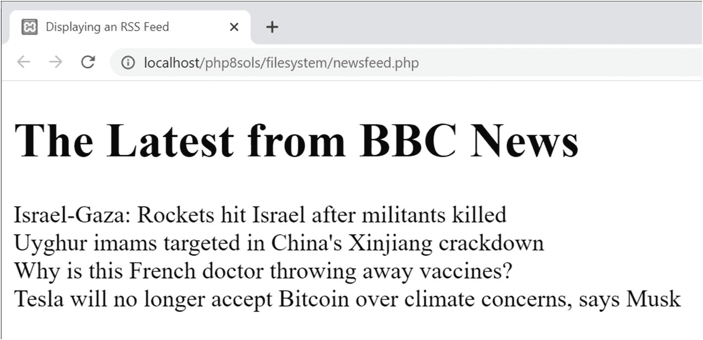

图 7-5

`LimitIterator`限制显示的项目数量

1.  现在您已经限制了条目的数量，修改`foreach`循环以将`<title>`元素包装在到原始文章的链接中，然后显示`<pubDate>`和`<description>`条目。该循环如下所示:

    ```php
    foreach ($filtered as $item) { ?>
        <h2><a href="<?= htmlentities($item->link) ?>">
             <?= htmlentities($item->title)?></a></h2>
        <p class="datetime"><?= htmlentities($item->pubDate) ?></p>
        <p><?= htmlentities($item->description) ?></p>
    <?php } ?>

    ```

2.  保存页面并再次测试。这些链接直接把你带到 BBC 网站上的相关新闻报道。新闻提要现在可以使用了，但是`<pubDate>`格式遵循 RSS 规范中规定的格式，如下面的截图所示:


1.  为了以更加用户友好的方式格式化日期和时间，将`$item->pubDate`传递给`DateTime`类构造函数，然后使用`DateTime format()`方法来显示它。更改`foreach`循环中的代码，如下所示:

    ```php
    <p class="datetime"><?php $date = new DateTime($item->pubDate);
    echo $date->format('M j, Y, g:ia'); ?></p>

    ```

这将日期重新格式化如下:

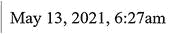

神秘的 PHP 日期格式字符串在第 [16 章](16.html)中有解释。

1.  那看起来好多了，但是时间还是用 GMT(伦敦时间)表示。如果你网站的大多数访问者住在美国东海岸，你可能想显示当地时间。这对于一个`DateTime`对象来说没有问题。使用`setTimezone()`方法更改为纽约时间。你甚至可以自动显示 EDT(东部夏令时)或 EST(东部标准时间),这取决于夏令时是否有效。像这样修改代码:

    ```php
    <p class="datetime"><?php $date = new DateTime($item->pubDate);
    $date->setTimezone(new DateTimeZone('America/New_York'));
    $offset = $date->getOffset();
    $timezone = ($offset == -14400) ? ' EDT' : ' EST';
    echo $date->format('M j, Y, g:ia') . $timezone; ?></p>

    ```

要创建一个`DateTimeZone`对象，将在 [`www.php.net/manual/en/timezones.php`](http://www.php.net/manual/en/timezones.php) 列出的时区之一作为参数传递给它。这是唯一需要`DateTimeZone`对象的地方，所以它被直接创建为`setTimezone()`方法的参数。

没有专门的方法告诉您夏令时是否在运行，但是`getOffset()`方法返回时间与协调世界时(UTC)的偏差秒数。下面一行决定是显示 EDT 还是 EST:

```php
$timezone = ($offset == -14400) ? ' EDT' : ' EST';

```

这使用了带有三元运算符的值`$offset`。在夏季，纽约比世界协调时晚 4 小时(14440 秒)。因此，如果`$offset`为 14400，则条件等同于`true`，EDT 被分配给`$timezone`。否则，使用 EST。

最后，`$timezone`的值被连接到格式化的时间。用于`$timezone`的字符串有一个前导空格来分隔时区和时间。当页面被加载时，时间被调整到美国东海岸，如下所示:


图 7-6

实时新闻提要只需要十几行 PHP 代码

1.  所有的网页现在需要的是用 CSS 来美化。图 [7-6](#Fig6) 显示了在`styles`文件夹中使用`newsfeed.css`样式的新闻提要。

虽然我在这个 PHP 解决方案中使用了 BBC 新闻提要，但它应该可以与任何 RSS 2.0 提要一起工作。比如可以用 [`http://rss.cnn.com/rss/edition.rss`](http://rss.cnn.com/rss/edition.rss) 局部尝试一下。在公共网站上使用 CNN 新闻需要获得 CNN 的许可。在将提要合并到网站之前，一定要检查版权所有者的条款和条件。

## 创建下载链接

在线论坛中经常出现的一个问题是“我如何创建一个链接到一个图片(或 PDF 文件)来提示用户下载它？”快速的解决方法是将文件转换成压缩格式，比如 ZIP。这通常会导致较小的下载量，但缺点是没有经验的用户可能不知道如何解压缩文件，或者他们可能使用的是不包含解压缩功能的旧操作系统。使用 PHP 文件系统函数，很容易创建一个链接，自动提示用户下载原始格式的文件。

### PHP 解决方案 7-6:提示用户下载图像

这个 PHP 解决方案发送必要的 HTTP 头，并使用`readfile()`以二进制流的形式输出文件内容，迫使浏览器下载它。

1.  在`filesystem`文件夹中创建一个名为`download.php`的 PHP 文件。下一步将给出完整的列表。你也可以在`ch07`文件夹的`download.php`中找到。

2.  删除脚本编辑器创建的任何默认代码，并插入以下代码:

```php
<?php
// define error page
$error = 'http://localhost/php8sols/error.php';
// define the path to the download folder
$filepath = 'C:/xampp/htdocs/php8sols/img/';
$getfile = NULL;
// block any attempt to explore the filesystem
if (isset($_GET['file']) && basename($_GET['file']) == $_GET['file']) {
    $getfile = $_GET['file'];
} else {
    header("Location: $error");
  exit;
}
if ($getfile) {
    $path = $filepath . $getfile;
    // check that it exists and is readable
    if (file_exists($path) && is_readable($path)) {
        // send the appropriate headers
        header('Content-Type: application/octet-stream');
        header('Content-Length: '. filesize($path));
        header('Content-Disposition: attachment; filename=' . $getfile);
        header('Content-Transfer-Encoding: binary');
        // output the file content
        readfile($path);
    } else {
        header("Location: $error");
    }
}

```

在这个脚本中，您需要修改的只有两行以粗体突出显示。第一个定义了`$error`，一个包含错误页面 URL 的变量。需要修改的第二行定义了存储下载文件的文件夹的路径。

该脚本的工作方式是从附加到 URL 的查询字符串中获取要下载的文件的名称，并将其保存为`$getfile`。因为查询字符串很容易被篡改，`$getfile`最初被设置为`NULL`。如果做不到这一点，就可能让恶意用户访问服务器上的任何文件。

开始条件语句使用`basename()`来确保攻击者不能从文件结构的另一部分请求文件，比如存储密码的文件。正如在第 [5](05.html) 章中解释的那样，`basename()`提取路径的文件名部分，所以如果`basename($_GET['file'])`不同于`$_GET['file']`，你知道有人试图探测你的服务器。然后，您可以通过使用`header()`函数将用户重定向到错误页面来阻止脚本继续运行。

在检查请求的文件存在并且可读之后，脚本发送适当的 HTTP 头，并使用`readfile()`将文件发送到输出缓冲区。如果找不到该文件，用户将被重定向到错误页面。

1.  通过创建另一个页面来测试脚本；给`download.php`添加几个链接。在每个链接的末尾添加一个查询字符串，后跟要下载的文件的名称。您将在`ch07`文件夹中找到一个名为`getdownloads.php`的页面，其中包含以下两个链接:

1.  单击其中一个链接。根据您的浏览器设置，该文件将被下载到您的默认下载文件夹，或者会出现一个对话框，询问您如何处理该文件。

```php
<p><a href="download.php?file=fountains.jpg">Download fountains image</a></p>
<p><a href="download.php?file=monk.jpg">Download monk image</a></p>

```

我已经用图像文件演示了`download.php`,但是它可以用于任何类型的文件，因为头文件以二进制流的形式发送文件。

Caution

这个脚本依靠`header()`向浏览器发送适当的 HTTP 头。确保开始的 PHP 标签前面没有新行或空白是至关重要的。如果你删除了所有的空格，仍然得到一个错误信息“头已经发送”，你的编辑器可能在文件的开头插入了不可见的控制字符。一些编辑程序会插入字节顺序标记(BOM ),这已知会导致`header()`函数出现问题。检查您的程序首选项，以确保取消选择插入 BOM 表的选项。

## 第三章回顾

文件系统函数并不特别难使用，但是有许多微妙之处可以将看似简单的任务变成复杂的任务。检查您是否拥有正确的权限非常重要。即使在您自己的网站中处理文件，PHP 也需要权限来访问您想要读取或写入文件的任何文件夹。

SPL `FilesystemIterator`和`RecursiveDirectoryIterator`类使得检查文件夹的内容变得容易。与`SplFileInfo`方法和`RegexIterator`结合使用，您可以在文件夹或文件夹层次结构中快速找到特定类型的文件。

当处理远程数据源时，您需要检查`allow_url_fopen`没有被禁用。远程数据源最常见的用途之一是从 RSS 新闻提要或 XML 文档中提取信息，多亏了 SimpleXML，这项任务只需要几行代码。

在本书的后面，我们将把本章中的一些 PHP 解决方案应用到处理图像和构建一个简单的用户认证系统的实际应用中。