# 8.使用数组

数组是 PHP 中最通用的数据类型之一。有 80 多个核心函数专门用于处理存储在数组中的数据，这一事实反映了它们的重要性。它们通常可以分类为修改、排序、比较和从数组中提取信息。本章并不试图涵盖所有这些。它主要关注一些更有趣和有用的数组操作应用。

本章涵盖

*   了解修改数组内容的各种方法

*   合并数组

*   将数组转换为符合语法的字符串

*   寻找一个数组的所有排列

*   排序数组

*   从多维数组自动生成嵌套的 HTML 列表

*   从 JSON 中提取数据

*   将数组元素赋给变量

*   用 splat 操作符解包数组

## 修改数组元素

PHP 新手在尝试修改数组中的每个元素时，经常会感到很困惑。比方说，您想要对一个数字数组中的每个元素执行计算。最简单的方法似乎是使用一个循环，在循环内执行计算，然后将结果重新分配给当前元素，如下所示:

```php
$numbers = [2, 4, 7];
foreach ($numbers as $number) {
    $number *= 2;
}

```

看起来好像它应该工作；但事实并非如此。`$numbers`数组中的值保持不变。发生这种情况是因为 PHP 在一个循环中对数组的一个*副本*进行操作。当循环结束时，副本被丢弃，计算结果也随之丢弃。要更改原始数组，需要通过引用将每个元素的值传递到循环中。

### PHP 解决方案 8-1:用循环修改数组元素

这个 PHP 解决方案展示了如何使用一个`foreach`循环来修改数组中的每个元素。索引数组和关联数组的技术是相似的。

1.  打开`ch08`文件夹中的`modify_01.php`。它包含前一节中的代码，后跟一对`<pre>`标记之间的`print_r($numbers);`。

2.  将页面加载到浏览器中，以验证$ numbers 数组中的值没有改变，如下面的屏幕截图所示:

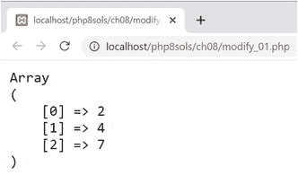

1.  通过引用将每个数组元素的值传递给循环，方法是在循环声明中的临时变量前加上一个&符号，如下所示:

1.  当循环结束时，临时变量仍将包含最后一个数组元素的重新计算值。为了避免以后意外更改值，建议在循环后取消设置临时变量，如下所示:

    ```php
    foreach ($numbers as &$number) {
        $number *= 2;
    }
    unset($number);

    ```

2.  保存文件并将其加载到浏览器中，以测试修改后的代码(在`modify_02.php`中)。数组中的每个数字都应该是双精度的，如下图所示:

```php
foreach ($numbers as &$number) {

```

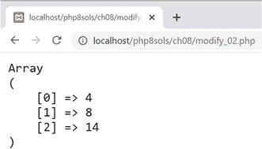

1.  要修改关联数组的值，需要为键和值声明临时变量；但是只有值应该通过引用传递。以下代码在`modify_03.php`中:

    ```php
    $book = [
        'author' => 'David Powers',
        'title' => 'PHP 8 Solutions'
    ];
    foreach ($book as $key => &$value) {
        $book[$key] = strtoupper($value);
    }
    unset($value);

    ```

这会产生以下输出:

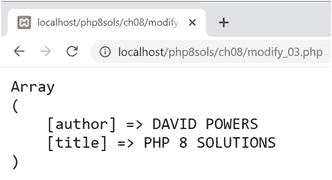

1.  然而，假设您想要修改数组键。合乎逻辑的方法是在键前面加一个&符号，通过引用传递它，如下所示:

```php
foreach ($book as &$key => $value) {

```

但是，如果您尝试这样做，将会触发致命错误。数组键不能通过引用传递。只有数组值可以。

1.  要修改关联数组的每个键，只需在循环内部修改它，就像在循环外部一样。以下代码在`modify_04.php`中:

    ```php
    foreach ($book as $key => $value) {
        $book[ucfirst($key)] = $value;
    }

    ```

它产生以下输出:

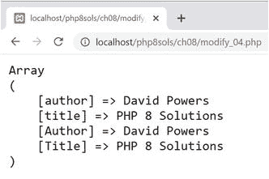

1.  如前面的屏幕截图所示，原始密钥与修改后的密钥一起保留。如果您只想要修改过的键，您需要像这样在循环中取消原始键的设置(代码在`modify_05.php`中):

    ```php
    foreach ($book as $key => $value) {
        $book[ucfirst($key)] = $value;
        unset($book[$key]);
    }

    ```

这仅保留每个密钥的修改版本。

Tip

如果您想将数组键转换成大写或小写，简单的方法是使用下面 PHP 解决方案中描述的`array_change_key_case()`函数。

### PHP 解决方案 8-2:用 array_walk()修改数组元素

使用循环修改数组元素的另一种方法是使用`array_walk()`函数，它对数组的每个元素应用一个回调函数。回调可以是一个匿名函数、一个箭头函数(参见第 [4](04.html) 章中的“使用箭头函数的简明匿名语法”)，或者一个已定义函数的名称。默认情况下，`array_walk()`向回调传递两个参数:元素的值和键— *，顺序是*。也可以使用可选的第三个参数。这个 PHP 解决方案探索了使用`array_walk()`的各种方式。

1.  `ch08`文件夹中`array_walk_01.php`的主代码如下所示:

    ```php
    $numbers = [2, 4, 7];
    array_walk($numbers, fn (&$val) => $val *= 2);

    ```

`array_walk()`的第一个参数是回调函数将应用到的数组。第二个参数是回调，在本例中是一个箭头函数。与`foreach`循环一样，值需要通过引用传递，因此回调函数的第一个参数前面有一个&符号。

这个例子修改了一个索引数组，所以不需要将数组键作为第二个参数传递给回调函数。

像这样应用`array_walk()`会产生与前面的 PHP 解决方案中的`modify_02.php`相同的结果:`$numbers`数组中的每个值都加倍。

1.  当对关联数组使用 array_walk()时，如果只想修改值，就不需要将数组键作为参数传递给回调函数。array_walk_02.php 中的代码使用箭头函数将每个数组元素的值转换为大写字符串，如下所示:

    ```php
    $book = [
        'author' => 'David Powers',
        'title' => 'PHP 8 Solutions'
    ];
    array_walk($book, fn (&$val) => $val = strtoupper($val));

    ```

这产生了与前面 PHP 解决方案中的`modify_03.php`相同的输出。

1.  除了将匿名或箭头函数作为第二个参数传递给`array_walk()`，您还可以将已定义函数的名称作为字符串传递，如下所示(代码在`array_walk_03.php`):

    ```php
    array_walk($book, 'output');
    function output (&$val) {
        return $val = strtoupper($val);
    }

    ```

这将产生与前面示例相同的输出。如果函数定义在同一个文件中，它是在调用`array_walk()`之前还是之后都没关系。但是，如果定义在一个外部文件中，那么在调用`array_walk()`之前必须包含该文件。

1.  传递给`array_walk()`的回调函数最多可以有三个参数。第二个参数必须是数组键，而最后一个参数可以是您想要使用的任何其他值。当使用第三个参数时，它也作为第三个参数传递给`array_walk()`。下面在`array_walk_04.php`的例子演示了它的用法:

    ```php
    array_walk($book, 'output', 'is');
    function output (&$val, $key, $verb) {
        return $val = "The $key of this book $verb $val.";
    }

    ```

这会产生以下输出:

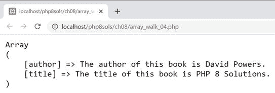

1.  使用`array_walk()`，你不能修改数组键。如果你只是想把所有的键都改成大写或小写，使用`array_change_key_case()`。默认情况下，它将键转换为小写。与`array_walk()`不同，它不修改原始数组。它返回一个带有修改过的键的新数组，所以您需要将结果赋给一个变量。在`array_change_key_case_01.php`中，数组键已经被赋予了一个初始的 cap。以下代码将密钥转换为小写，并将结果重新分配给`$book`:

    ```php
    $book = [
        'Author' => 'David Powers',
        'Title' => 'PHP 8 Solutions'
    ];
    $book = array_change_key_case($book);

    ```

2.  要将密钥转换为大写，将 PHP 常量`CASE_UPPER`作为第二个参数传递给`array_change_key_case()`，如下所示(代码在`array_change_key_case_02.php`中):

```php
$book = array_change_key_case($book, CASE_UPPER);

```

### PHP 解决方案 8-3:用 array_map()修改数组元素

通过引用一个`foreach`循环或`array_walk()`来传递数组值会修改原始数组。往往，这就是你想要的。但是，如果你想保留原来的数组，可以考虑使用`array_map()`。这将对每个数组元素应用一个回调函数，并返回一个包含已修改元素的新数组。array_map()的第一个参数是回调函数，可以是匿名函数、箭头函数或已定义函数的名称。第二个参数是要修改其元素的数组。

如果回调使用多个参数，那么每个参数的值必须以数组的形式传递给`array_map()`，传递顺序与回调所需的顺序相同。即使您想在随后的参数中每次都使用相同的值，也必须将它作为一个数组传递给`array_map()`,该数组的元素数量与被修改的数组相同。

对于关联数组，`array_map()`只在回调使用单个参数时保留键。如果将多个参数传递给回调函数，`array_map()`将返回一个索引数组。

1.  `array_map_01.php`中的代码展示了一个简单的例子，使用箭头回调函数使用`array_map()`将数组中的数字加倍。代码如下所示:

    ```php
    $numbers = [2, 4, 7];
    $doubled = array_map(fn ($num) => $num * 2}, $numbers);
    echo '<pre>';
    print_r($numbers);
    print_r($doubled);
    echo '</pre>';

    ```

如下图所示，原始`$numbers`数组中的值没有改变。`$doubled`数组包含回调返回的结果。

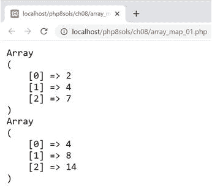

1.  `array_map_02.php`中的下一个例子使用一个已定义的函数来修改一个关联数组:

    ```php
    $book = [
        'author' => 'David Powers',
        'title' => 'PHP 8 Solutions'
    ];
    $modified = array_map('modify', $book);
    function modify($val) {
        return strtoupper($val);
    }
    echo '<pre>';
    print_r($book);
    print_r($modified);
    echo '</pre>';

    ```

如下面的屏幕截图所示，数组键保留在修改后的数组中:

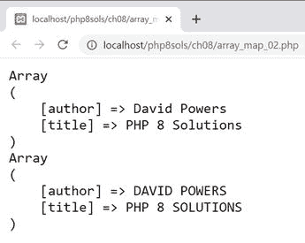

1.  `array_map_03.php`中的代码已被修改，以演示如何向回调函数传递多个参数:

    ```php
    $descriptions = ['British', 'the fifth edition'];
    $modified = array_map('modify', $book, $descriptions);
    function modify($val, $description) {
        return "$val is $description.";
    }

    ```

第二个参数`$description`被添加到`modify()`函数中。作为参数传递给回调的值存储在一个名为`$descriptions`的数组中，该数组作为第三个参数传递给`array_map()`。这会产生以下结果:

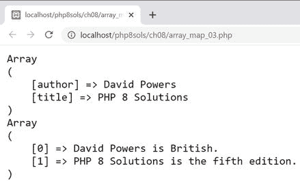

请注意，修改后的数组中没有保留数组键。向回调传递多个参数会产生一个索引数组。

1.  传递给`array_map()`的第三个和后续参数必须包含与被修改的数组相同数量的元素。`array_map_04.php`中的代码显示了如果一个参数包含的元素太少会发生什么。看起来是这样的:

    ```php
    $descriptions = ['British', 'the fifth edition'];
    $label = ['Description'];
    $modified = array_map('modify', $book, $descriptions, $label);
    function modify($val, $description, $label) {
        return "$label: $val is $description.";
    }

    ```

在`$label`数组中只有一个元素；但是如下图所示，这不会导致相同的值被重用。

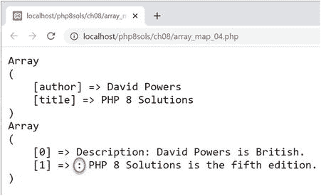

当作为参数传递给`array_map()`的数组的元素比第一个数组(被修改的那个)少时，较短的数组用空元素填充。因此，修改后的数组中的第二个元素省略了标签；但是 PHP 不会触发错误。

## 合并数组

PHP 提供了几种不同的方法来组合两个或多个数组的元素；但是它们并不总是产生相同的结果。理解每种方法的工作原理将会避免错误和混乱。

### 使用数组联合运算符

合并数组最简单的方法是使用数组联合操作符，一个加号(`+`)。然而，结果可能不是你所期望的。在`ch08`文件夹的`merge_01.php`中的代码演示了当你在两个索引数组上使用数组联合操作符时会发生什么:

```php
$first = ['PHP', 'JavaScript'];
$second = ['Java', 'R', 'Python'];
$languages = $first + $second;
echo '<pre>';
print_r($languages);
echo '</pre>';

```

运行该脚本会产生以下输出:

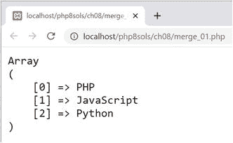

结果数组只包含三个元素，而不是五个元素。这是因为数组联合运算符不会将第二个数组连接到第一个数组的末尾。对于索引数组，它忽略第二个数组中与第一个数组中的元素具有相同索引的元素。在这个例子中，第二个数组中的 Java 和 R 与 PHP 和 JavaScript 具有相同的索引(0 和 1)，所以它们被忽略了。只有 Python 有一个第一个数组中不存在的索引(2)，所以它被添加到合并后的数组中。

数组联合运算符对关联数组的处理方式类似。`merge_02.php`中的代码包含两个关联数组，如下所示:

```php
$first = ['PHP' => 'Rasmus Lerdorf', 'JavaScript' => 'Brendan Eich'];
$second = ['Java' => 'James Gosling', 'R' => 'Ross Ihaka', 'Python' => 'Guido van Rossum'];
$lead_developers = $first + $second;

```

两个数组都包含一组唯一的键，因此生成的数组包含每个元素及其相关的键，如下面的屏幕截图所示:

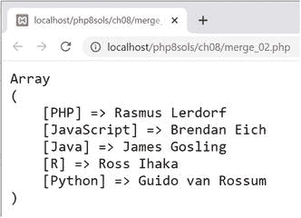

然而，当存在重复的键时，数组联合操作符忽略第二个数组中的元素，如`merge_03.php`中的代码所示:

```php
$first = ['PHP' => 'Rasmus Lerdorf', 'JavaScript' => 'Brendan Eich', 'R' => 'Robert Gentleman'];
$second = ['Java' => 'James Gosling', 'R' => 'Ross Ihaka', 'Python' => 'Guido van Rossum'];
$lead_developers = $first + $second;

```

如下面的屏幕截图所示，只有 Robert Gentleman 被认为是 R. Ross Ihaka 的首席开发人员。第二个数组中的 Ihaka 被忽略，因为他共享一个重复的密钥。

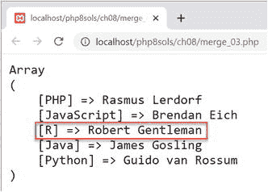

忽略重复的索引或键并不总是您想要的，所以 PHP 提供了几个函数来产生所有元素的完全合并数组。

### 使用 array_merge()和 array_merge_recursive()

函数`array_merge()`和`array_merge_recursive()`连接两个或多个数组来创建一个新数组。它们之间的区别在于处理关联数组中重复值的方式。

对于索引数组，`array_merge()`自动对每个元素的索引重新编号，并包含每个值，包括重复值。这由`merge_04.php`中的以下代码演示:

```php
$first = ['PHP', 'JavaScript', 'R'];
$second = ['Java', 'R', 'Python', 'PHP'];
$languages = array_merge($first, $second);

```

如下面的屏幕截图所示，索引是连续编号的，重复的值(PHP 和 R)保留在结果数组中:

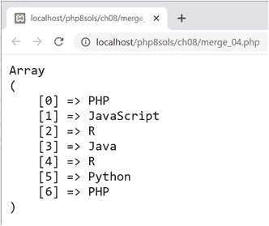

对于关联数组，`array_merge()`的行为取决于重复数组键的存在。当没有重复时，`array_merge()`以与使用数组联合操作符完全相同的方式连接关联数组。你可以通过运行`merge_05.php`中的代码来验证。

但是，重复键的存在会导致只保留最后一个重复值。这由`merge_06.php`中的以下代码演示:

```php
$first = ['PHP' => 'Rasmus Lerdorf', 'JavaScript' => 'Brendan Eich', 'R' => 'Robert Gentleman'];
$second = ['Java' => 'James Gosling', 'R' => 'Ross Ihaka', 'Python' => 'Guido van Rossum'];
$lead_developers = array_merge($first, $second);

```

如下面的屏幕截图所示，第二个数组(Ross Ihaka)中的 R 值覆盖了第一个数组(Robert Gentleman)中的值:

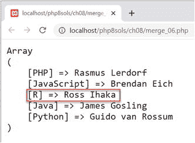

Caution

数组合并的顺序不同于数组联合运算符。数组 union 操作符保留第一个重复值，而`array_merge()`保留最后一个重复值。

要保留重复键的值，需要使用`array_merge_recursive()`。`merge_07.php`中的代码合并了相同的数组，如下所示:

```php
$lead_developers = array_merge_recursive($first, $second);

```

如下图所示，重复键的值被合并到一个索引子数组中:

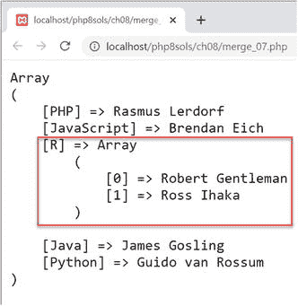

Robert Gentleman 的名字作为`$lead_developers['R'][0]`存储在新数组中。

Note

数组联合运算符、`array_merge()`和`array_merge_recursive()`可以用于两个以上的数组。关于重复键和值的规则是相同的。使用`array_merge()`，总是最后一个副本被保存下来。

### 将两个索引数组合并成一个关联数组

`array_combine()`函数合并两个索引数组来创建一个关联数组，第一个数组用于键，第二个数组用于值。两个数组必须有相同数量的值。否则，该函数返回 false 并触发警告。

下面的简单例子展示了它是如何工作的:

```php
$colors = ['red', 'amber', 'green'];
$actions = ['stop', 'caution', 'go'];
$signals = array_combine($colors, $actions);
// $signals is ['red' => 'stop', 'amber' => 'caution', 'green' => 'go']

```

Tip

关于`array_combine()`的实际用法，请参见“PHP 解决方案 7-2:从 CSV 文件中提取数据”。

### 比较数组

表 [8-1](#Tab1) 列出了 PHP 核心函数，可以用来寻找数组的不同或交集。表中的所有函数都接受两个或更多的数组作为参数。在回调函数执行比较的情况下，回调应该是传递给函数的最后一个参数。

表 8-1

比较数组的 PHP 函数

<colgroup><col class="tcol1 align-left"> <col class="tcol2 align-left"></colgroup> 
| 

功能

 | 

描述

 |
| --- | --- |
| `array_diff()` | 将第一个数组与一个或多个其他数组进行比较。返回第一个数组中不存在于其他数组中的值的数组。 |
| `array_diff_assoc()` | 与`array_diff()`类似，但在比较中同时使用数组键和值。 |
| `array_diff_key()` | 与`array_diff()`类似，但比较的是键而不是值。 |
| `array_diff_uassoc()` | 与`array_diff_assoc()`相同，但使用用户提供的回调函数来比较按键。 |
| `array_diff_ukey()` | 与`array_diff_key()`相同，但使用用户提供的回调函数来比较按键。 |
| `array_intersect()` | 比较两个或多个数组。返回一个数组，该数组包含第一个数组中出现在所有其他数组中的所有值。密钥被保留。 |
| `array_intersect_assoc()` | 类似于`array_intersect()`，但是在比较中同时使用数组键和值。 |
| `array_intersect_key()` | 返回一个数组，该数组包含第一个数组中的所有条目，这些条目的键在所有其他数组中都存在。 |
| `array_intersect_uassoc()` | 与`array_intersect_assoc()`相同，但使用用户提供的回调函数来比较按键。 |
| `array_intersect_ukey()` | 与`array_intersect_key()`相同，但使用用户提供的回调函数来比较按键。 |

我不会深入每个函数的细节，但是让我们来看看通过比较下面两个带有`array_diff_assoc()`和`array_diff_key()`的数组返回的不同结果:

```php
$first = [
    'PHP' => 'Rasmus Lerdorf',
    'JavaScript' => 'Brendan Eich',
    'R' => 'Robert Gentleman'];
$second = [
    'Java' => 'James Gosling',
    'R' => 'Ross Ihaka',
    'Python' => 'Guido van Rossum'];
$diff = array_diff_assoc($first, $second); // $diff is the same as $first

```

`array_diff_assoc()`(参见`ch08`文件夹中的`array_diff_assoc.php`)检查键和值，返回存在于第一个数组中但不存在于其他数组中的元素数组。在本例中，返回第一个数组中的所有三个元素，即使两个数组都包含 R 作为键。这是因为分配给 R 的值是不同的。

```php
$diff = array_diff_key($first, $second);
// $diff is ['PHP' => 'Rasmus Lerdorf','JavaScript' => 'Brendan Eich']

```

然而，`array_diff_key()`(见`ch08`文件夹中的`array_diff_key.php`)只检查键，忽略值。因此，它返回第一个数组的前两个元素，但不返回第三个元素，因为 R 在第二个数组中作为键存在。分配给 R 的值不同这一事实无关紧要。

`ch08`文件夹包含表 [8-1](#Tab1) 中其他功能的简单示例，并附有简要说明。`*_uassoc()`和`*_ukey()`版本需要一个回调函数作为最终参数来比较每个元素的键。回调必须接受两个参数，如果第一个参数分别小于、等于或大于第二个参数，则返回小于、等于或大于零的整数。`ch08`文件夹中的示例使用内置的 PHP `strcasecmp()`函数来执行不区分大小写的比较，如果两个字符串被认为相等，则返回`0`。

Tip

比较两个值最有效的方法是使用宇宙飞船运算符。你会在本章后面的“PHP 解决方案 8-5:用飞船操作符自定义排序”中看到一个例子。

### 删除重复元素

要从单个数组中删除重复的元素，使用`array_unique()`，它接受一个输入数组并返回一个删除了重复值的新数组。在`ch08`文件夹的`unique_01.php`中的代码包含以下简单的例子:

```php
$original = ['John', 'john', 'Elton John', 'John', 'Elton John', 42, "42"];
$unique = array_unique($original);
print_r($unique);

```

这将产生如下屏幕截图所示的输出:

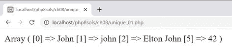

默认情况下，`array_unique()`将每个值转换为一个字符串，并执行严格的比较。结果，“john”和“John”都被保留，因为比较区分大小写。因为整数被转换为字符串，所以`$original`数组中的最后两项被认为是重复的。如截图所示，保留了原来的键，表示第四个和第五个元素已被删除。

`array_unique()`函数也适用于关联数组。`unique_02.php`中的例子如下所示:

```php
$tracks = [
    'The Beatles' => 'With a Little Help from my Friends',
    'Joe Cocker' => 'With A Little Help From My Friends',
    'Wet Wet Wet' => 'With a Little Help from my Friends',
    'Paul McCartney' => 'Yesterday'
];
$unique = array_unique($tracks);
echo '<pre>';
print_r($unique);
echo '</pre>';

```

这会产生以下输出:

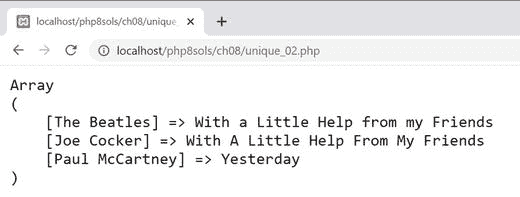

字符串比较区分大小写，因此 Wet Wet Wet 被排除在外。

### PHP 解决方案 8-4:用逗号连接数组

内置的 PHP `implode()`函数用用户提供的字符串连接数组的所有元素。这个 PHP 解决方案通过在最后一个元素前插入“and”来增强输出。它提供了限制元素数量的选项，用“and one other”或“and others”替换多余的值

1.  打开`ch08`文件夹中的`commas_01.php`。它包含一系列索引数组，包含 20 世纪 60 年代和 70 年代的 0 到 5 个录音艺术家的名字。最后一行使用`implode()`用逗号连接最后一个数组:

    ```php
    $too_many = ['Dave Dee', 'Dozy', 'Beaky', 'Mick', 'Tich'];
    echo implode(', ', $too_many);

    ```

2.  将脚本加载到浏览器中。如下面的屏幕截图所示，最终名称前没有“and”时，输出看起来很笨拙:

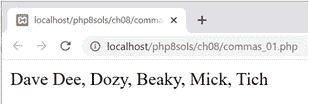

1.  删除最后一行，开始定义一个函数，如下所示:

```php
function with_commas(array $array, int $max = 4) { }

```

函数签名有两个参数:`$array`和`$max`。`The`类型声明指定第一个必须是一个数组，第二个必须是一个整数，所以如果有任何其他类型的数据传递给它，该函数将触发一个错误。`$max`设置待连接元素的最大数量。它有一个默认值`4`，所以它是一个可选参数。

1.  在函数内部，我们可以使用一个`match`表达式(参见第 [4 章](04.html)中的“为决策链使用匹配表达式”)来决定如何根据数组中元素的数量来处理输出:

    ```php
    $length = count($array);
    $result = match ($length) {
        0 => '',
        1 => array_pop($array),
        2 => implode(' and ', $array),
        default => implode(', ', array_slice($array, 0, $length -1)) . ' and ' . array_pop($array)
    };
    return $result;

    ```

首先，我们使用`count($array)`来确定数组中元素的数量，并将值赋给`$length`。然后将它作为参数传递给`match`表达式，该表达式将返回值存储为`$result`。

如果数组不包含任何元素，则返回一个空字符串。如果只有一个，数组被传递给`array_pop()`函数。我们需要这样做，因为函数应该返回一个准备显示的字符串。如果你只是返回`$array`，它仍然是一个不能用`echo`或`print`显示的数组。`array_pop()`函数移除数组中的最后一个元素并返回它。

如果数组中有两个元素，数组被传递给`implode()`函数，字符串“and”两边用空格包围。

默认操作使用`implode()`连接数组中除最后一个元素之外的所有元素，用逗号后跟一个空格。传递给`implode()`的第二个参数使用`array_slice()`函数来选择所需的元素。`array_slice()`函数有三个参数:要从中提取元素的数组、要从中开始的元素的索引以及要提取的元素的数量。数组是从零开始计数的，所以从数组的开头开始，提取`$length–1`元素。然后，在返回结果之前，最后一个元素的值(再次使用`array_pop()`)被连接到以“and”开头的逗号分隔的字符串。

Caution

这个脚本至少需要 PHP 8。对于旧版本的 PHP，你需要使用我的 *PHP 7 解决方案*中描述的 switch 语句。

1.  保存脚本，并依次用每个测试数组测试它。例如:

1.  这以合乎语法的方式用逗号连接数组元素:

```php
echo with_commas($fab_four);

```

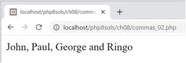

1.  让我们修复数组元素数量超过$max 的情况，从多一个开始。在 default 之前插入以下代码:

```php
$max + 1 =>implode(', ', array_slice($array, 0, $max)) . ' and one other';

```

这将把`array_slice($array, 0, $max)`作为第二个参数传递给`implode()`。然后，在返回结果之前，将字符串“and one other”连接到结果上。

1.  保存脚本并再次测试。如果你用`$fab_four`测试它，你会得到和前面截图一样的结果。现在用`$too_many`试试会产生以下结果:

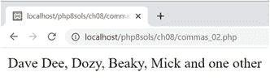

1.  超过`$max`的多个元素以类似方式处理。然而，`match`表达式需要稍微不同的方法来处理比较。不要将`$length`作为参数传递给`match()`，而是需要传递`true`并对每种情况进行比较。像这样修改匹配表达式:

    ```php
    $result = match (true) {
        $length === 0 => '',
        $length === 1 => array_pop($array),
        $length === 2 => implode(' and ', $array),
        $length === $max + 1 => implode(', ', array_slice($array, 0, $max)) . ' and one other',
        $length > $max + 1 => implode(', ', array_slice($array, 0, $max)) . ' and others',
        default => implode(', ', array_slice($array, 0, $length -1)) . ' and ' . array_pop($array)
    };

    ```

2.  保存脚本并再次运行。用`$too_many`，结果不变。但是，将第二个参数`with_commas()`改为一个较小的数字，如下所示:

```php
echo with_commas($too_many, 3);

```

这将输出更改如下:

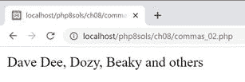

1.  您可以在`ch08`文件夹中用`commas_02.php`检查完成的代码。

## 排序数组

表 [8-2](#Tab2) 列出了许多用于排序数组的内置 PHP 函数。

表 8-2

数组排序函数

<colgroup><col class="tcol1 align-left"> <col class="tcol2 align-left"></colgroup> 
| 

功能

 | 

描述

 |
| --- | --- |
| `sort()` | 按升序排序(从低到高) |
| `rsort()` | 按降序排序(从最高到最低) |
| `asort()` | 按值升序排序，保持键值关系 |
| `arsort()` | 按值降序排序，保持键值关系 |
| `ksort()` | 按键升序排序，保持键与值的关系 |
| `krsort()` | 按键降序排序，保持键与值的关系 |
| `natsort()` | 以“自然顺序”按值排序，维护值关系的键 |
| `natcasesort()` | 以不区分大小写的“自然顺序”按值排序，保持键值关系 |
| `usort()` | 使用回调比较函数按值排序 |
| `uasort()` | 使用回调比较函数按值排序，保持键与值的关系 |
| `uksort()` | 使用回调比较函数按键排序，保持键与值的关系 |
| `array_multisort()` | 对多个或多维数组进行排序 |

表 [8-2](#Tab2) 中的所有函数影响原始数组，根据操作是否成功，只返回`true`或`false`。前六个函数(包括`krsort()`)可以将表 [8-3](#Tab3) 中列出的 PHP 常量作为可选的第二个参数来修改排序顺序。

表 8-3

修改排序顺序的常数

<colgroup><col class="tcol1 align-left"> <col class="tcol2 align-left"></colgroup> 
| 

常数

 | 

描述

 |
| --- | --- |
| `SORT_REGULAR` | 比较项目而不改变其类型(默认) |
| `SORT_NUMERIC` | 将项目作为数字进行比较 |
| `SORT_STRING` | 将项目作为字符串进行比较 |
| `SORT_LOCALE_STRING` | 基于当前区域设置比较项目 |
| `SORT_NATURAL` | 以“自然顺序”比较项目 |
| `SORT_FLAG_CASE` | 可以与使用竖线(`&#124;`)的`SORT_STRING`或`SORT_NATURAL`结合使用，对字符串进行不区分大小写的排序 |

以“自然顺序”对值进行排序的两个函数和常量以与人类相同的方式对包含数字的字符串进行排序。在`ch08`文件夹的`natsort.php`中有一个例子，用`sort()`和`natsort()`对下面的数组进行排序:

```php
$images = ['image10.jpg', 'image9.jpg', 'image2.jpg'];

```

下面的屏幕截图显示了不同的结果:

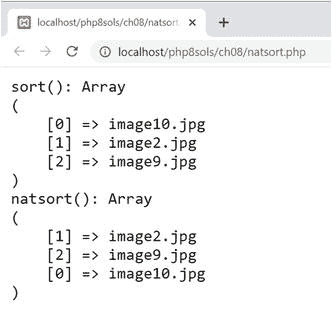

有了`sort()`，顺序不仅违反直觉，而且索引也被重新编号。有了`natsort()`，顺序更加人性化，原来的索引都保留了下来。

Tip

`natsort()`和`natcasesort()`函数没有逆序的等价函数，但是您可以将结果传递给内置的`array_reverse()`函数。这将返回一个新数组，其中的元素以相反的顺序排列，不进行排序。与表 [8-2](#Tab2) 中的功能不同，原始数组不变。关联数组键被保留，但索引数组被重新编号。为了防止索引数组被重新编号，传递布尔值`true`作为第二个(可选)参数。

在`usort()`、`uasort()`和`uksort()`中使用的回调比较函数必须接受两个参数，如果第一个参数分别小于、等于或大于第二个参数，则返回一个小于、等于或大于零的整数。PHP 解决方案 8-5 展示了如何用飞船操作符来做这件事。

### PHP 解决方案 8-5:用飞船操作符自定义排序

表 [8-2](#Tab2) 中的前八个排序函数在处理大多数排序操作时表现出色。然而，它们不能涵盖所有场景。这时定制排序函数就派上用场了。这个 PHP 解决方案展示了飞船操作员如何简化定制排序*。*

1.  打开`ch08`文件夹中的`spaceship_01.php`。它包含以下音乐播放列表的多维数组和一个将它显示为无序列表的循环:

    ```php
    $playlist = [
        ['artist' => 'Jethro Tull', 'track' => 'Locomotive Breath'],
        ['artist' => 'Dire Straits', 'track' => 'Telegraph Road'],
        ['artist' => 'Mumford and Sons', 'track' => 'Broad-Shouldered Beasts'],
        ['artist' => 'Ed Sheeran', 'track' => 'Nancy Mulligan'],
        ['artist' => 'Dire Straits', 'track' => 'Sultans of Swing'],
        ['artist' => 'Jethro Tull', 'track' => 'Aqualung'],
        ['artist' => 'Mumford and Sons', 'track' => 'Thistles and Weeds'],
        ['artist' => 'Ed Sheeran', 'track' => 'Eraser']
    ];
    echo '<ul>';
    foreach ($playlist as $item) {
        echo "<li>{$item['artist']}: {$item['track']}</li>";
    }
    echo '</ul>';

    ```

2.  在循环之前插入一行，使用`asort()`对数组进行排序:

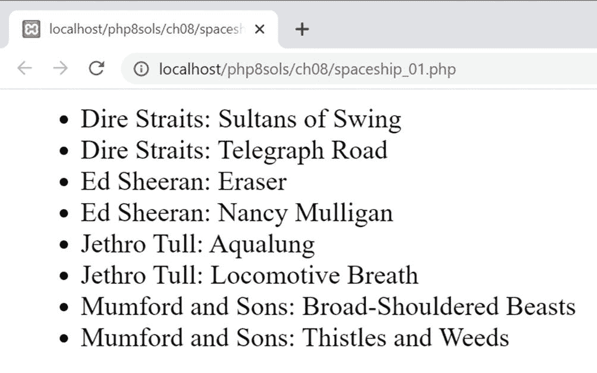

图 8-1

`asort()`函数使得对多维关联数组中的值进行排序变得简单

1.  保存文件，并将其加载到浏览器中。如图 [8-1](#Fig1) 所示，`asort()`不仅按字母顺序对艺人进行了排序；与每个艺术家相关的曲目也是按字母顺序排列的。

```php
asort($playlist);

```

1.  但是，假设您想按曲目名称的字母顺序对播放列表进行排序。为此，您需要一个自定义排序。用以下代码替换您在步骤 2 中插入的代码行:

```php
usort($playlist, fn ($a, $b) => $a['track'] <=> $b['track']);

```

这使用了带有箭头回调函数的`usort()`函数。回调函数的两个参数(`$a`和`$b`)表示您想要比较的两个数组元素。该函数使用宇宙飞船运算符将当前 track 元素的值与下一个元素的值进行比较，根据左边的操作数是小于、等于还是大于右边的操作数，分别返回小于、等于或大于零的整数。

1.  要使自定排序的结果看起来更清楚，请交换每个列表项中显示的艺术家和曲目的顺序:

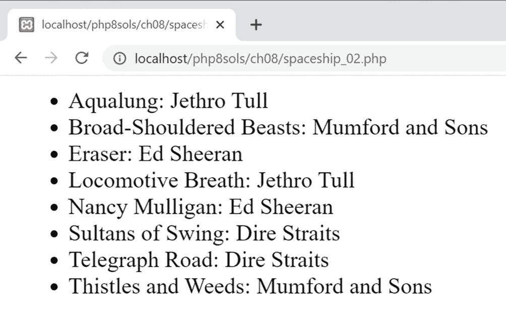

图 8-2

播放列表现在已经按曲目名称的字母顺序排序

1.  保存文件并在浏览器中重新加载。轨道现在按字母顺序列出(见图 [8-2](#Fig2) )。

```php
echo "<li>{$item['track']}: {$item['artist']}</li>";

```

1.  要颠倒自定义排序的顺序，请交换 spaceship 运算符两边的操作数顺序:

1.  您可以对照`ch08`文件夹中的`spaceship_02.php`来检查您的代码。

```php
usort($playlist, fn ($a, $b) => $b['track'] <=> $a['track']);

```

### 使用 array_multisort()进行复杂排序

`array_multisort()`功能有两个目的，即:

*   要对希望保持同步的多个数组进行排序

*   按一个或多个维度对多维数组进行排序

`multisort_01.php`中的代码包含了一个在重新排序时需要保持同步的数组的例子。`$states`数组按字母顺序列出各州，而`$population`数组包含按相同顺序列出的每个州的人口:

```php
$states = ['Arizona', 'California', 'Colorado', 'Florida', 'Maryland', 'New York', 'Vermont'];
$population = [7_151_502, 39_538_223, 5_773_714, 21_538_187, 6_177_224, 20_201_249, 643_077];

```

然后循环显示每个州的名称及其人口:

```php
echo '<ul>';
for ($i = 0, $len = count($states); $i < $len; $i++) {
    echo "<li>$states[$i]: $population[$i]</li>";
}
echo '</ul>';

```

图 [8-3](#Fig3) 显示了输出。

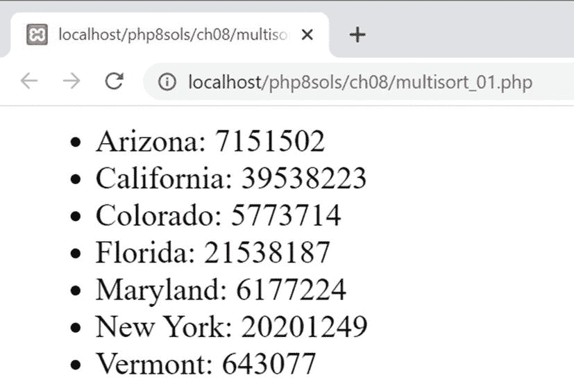

图 8-3

尽管各州和人口数字在不同的数组中，但它们的顺序是正确的

Note

PHP 引擎在执行脚本时去掉了`$population`数组中的下划线。PHP 7.4 引入了在整数中使用下划线以提高可读性。

但是，如果您希望按升序或降序对人口数据进行重新排序，两个数组需要保持同步。

`multisort_02.php`中的代码显示了如何使用`array_multisort()`完成这一任务:

```php
array_multisort($population, SORT_ASC, $states);

```

`array_multisort()`的第一个参数是要首先排序的数组。它后面可以跟两个可选参数:使用常量`SORT_ASC`或`SORT_DESC`分别表示升序或降序的排序方向，以及使用表 [8-3](#Tab3) 中列出的常量之一的排序类型。剩下的参数是您希望与第一个数组同步排序的其他数组。每个后续数组后面还可以跟有排序方向和类型的可选参数。

在这个例子中，`$population`数组按升序排序，而`$states`数组与其同步重新排序。如图 [8-4](#Fig4) 所示，人口数据和州名之间的正确关系得以保持。

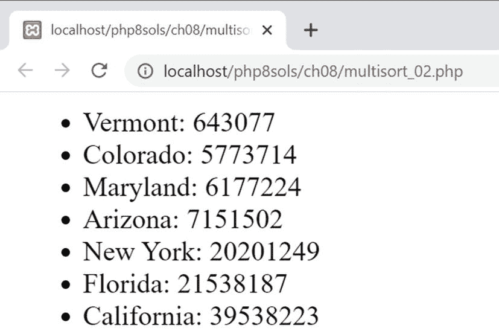

图 8-4

人口数字现在按升序排列，保留正确的州名

下一个 PHP 解决方案展示了一个使用`array_multisort()`按照多维度对多维数组重新排序的例子。

### PHP 解决方案 8-6:用 array_multisort()对多维数组排序

在前面的 PHP 解决方案中，我们使用了 spaceship 操作符，通过比较分配给单个键的值，对多维数组进行自定义排序。在这个解决方案中，我们将使用`array_multisort()`来执行更复杂的排序操作。

1.  `multisort_03.php`中的代码包含 PHP 解决方案 8-5 中的`$playlist`多维数组的更新版本。每个子阵列都添加了一个评级键，如下所示:

    ```php
    $playlist = [
        ['artist' => 'Jethro Tull', 'track' => 'Locomotive Breath', 'rating' => 8],
        ['artist' => 'Dire Straits', 'track' => 'Telegraph Road', 'rating' => 7],
        ['artist' => 'Mumford and Sons', 'track' => 'Broad-Shouldered Beasts', 'rating' => 9],
        ['artist' => 'Ed Sheeran', 'track' => 'Nancy Mulligan', 'rating' => 10],
        ['artist' => 'Dire Straits', 'track' => 'Sultans of Swing', 'rating' => 9],
        ['artist' => 'Jethro Tull', 'track' => 'Aqualung', 'rating' => 10],
        ['artist' => 'Mumford and Sons', 'track' => 'Thistles and Weeds', 'rating' => 6],
        ['artist' => 'Ed Sheeran', 'track' => 'Eraser', 'rating' => 8]
    ];

    ```

2.  正如前面的解决方案所演示的，使用`usort()`和飞船操作符可以很容易地按照轨道的字母顺序对数组进行排序。我们也可以通过评级对数组进行排序；但是根据评级和跟踪进行分类需要不同的方法。

根据多个标准对多维数组进行排序的第一步是将待排序的值提取到单独的数组中。使用`array_column()`函数很容易做到这一点，该函数有两个参数:顶级数组和要从每个子数组中提取的键。在`$playlist`数组后添加以下代码(在`multisort_04.php`):

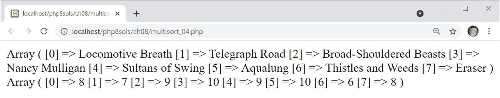

图 8-5

排序所需的值已经提取到单独的索引数组中

1.  保存文件并在浏览器中测试。如图 [8-5](#Fig5) 所示，多维数组中的值被提取到两个索引数组中。

```php
$tracks = array_column($playlist, 'track');
$ratings = array_column($playlist, 'rating');
print_r($tracks);
print_r($ratings);

```

1.  我们不再需要检查`$tracks`和`$ratings`数组的内容，所以注释掉或删除这两个对`print_r()`的调用。

2.  我们现在可以使用`array_multisort()`对多维数组进行排序。传递给函数的参数顺序决定了分配给最终排序的优先级。我希望播放列表按收视率降序排序，然后按曲目的字母顺序。所以第一个参数需要是`$ratings`数组，后面是排序方向；然后是`$tracks`数组，接着是排序方向；最后，`$playlist`，多维数组。

将以下代码添加到脚本的底部:

1.  多维数组现在已经从最高评级到最低评级进行了重新排序，同等评级的曲目按字母顺序排列。我们可以通过像这样遍历`$playlist`数组来验证这一点(代码在`multisort_05.php`中):

    ```php
    echo '<ul>';
    foreach ($playlist as $item) {
        echo "<li>{$item['rating']} {$item['track']} by {$item['artist']}</li>";
    }
    echo '</ul>';

    ```

```php
array_multisort($ratings, SORT_DESC, $tracks, SORT_ASC, $playlist);

```

图 [8-6](#Fig6) 显示了它工作的证据。

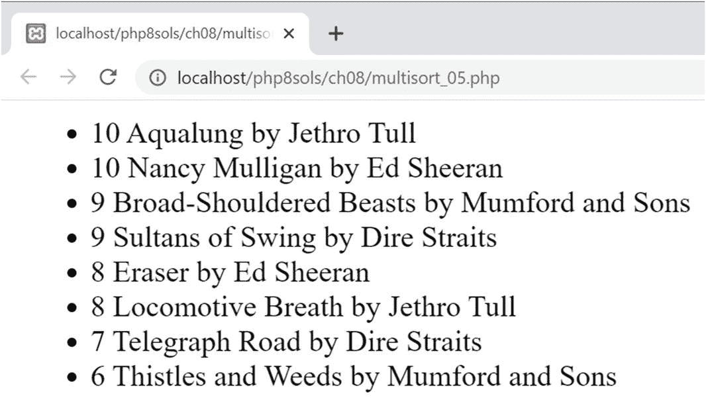

图 8-6

多维数组已按多个标准排序

Note

在前面的 PHP 解决方案中，array_column()与关联子数组一起使用，所以第二个参数是一个字符串，包含我们想要提取的值的键。该函数还能够从索引子数组中提取值。只需传递想要提取的值的索引作为第二个参数。在下一章的“PHP 解决方案 9-6:修改类以处理多次上传”中你会看到一个实际的例子。

### PHP 解决方案 8-7:寻找一个数组的所有排列

这个 PHP 解决方案改编自 Python。它使用递归生成器中的`array_slice()`和`array_merge()`函数(参见第 [4](04.html) 章中的“生成器:一种特殊类型的不断给出的函数”)来分离数组并以不同的顺序合并元素。它是递归的，因为生成器会反复调用自己，直到到达要处理的元素的末尾。

1.  生成器的定义是这样的(代码在`ch08`文件夹的`permutations.php`):

    ```php
    function permutations(array $elements) {
        $len = count($elements);
        if ($len <= 1) {
            yield $elements;
        } else {
            foreach(permutations(array_slice($elements, 1)) as $permutation) {
                foreach(range(0, $len - 1) as $i) {
                    yield array_merge(
                        array_slice($permutation, 0, $i),
                        [$elements[0]],
                        array_slice($permutation, $i)
                    );
                }
            }
        }
    }

    ```

从第 7 行开始的`foreach`循环使用`array_slice()`函数递归调用生成器，提取传递给它的数组中除第一个元素之外的所有元素。当我们在“PHP 解决方案 8-4:用逗号连接一个数组”中使用`array_slice()`时，我们给它传递了三个参数:数组、开始元素的索引和要提取的元素数量。在这种情况下，只使用前两个参数。当`array_slice()`的最后一个参数被省略时，它返回从数组的起点到结尾的所有元素。因此，如果字母`ABC`作为数组传递给它，`array_slice($elements, 1)`返回`BC`，这在循环内部被称为`$permutation`。

嵌套的`foreach`循环使用`range()`函数创建一个从 0 到`$elements`数组长度减 1 的数字数组。每次循环运行时，生成器使用`array_merge()`和`array_slice()`的组合产生一个重新排序的数组。循环第一次运行时，计数器`$i`为`0`，因此`array_slice($permutation, 0, 0)`不会从`BC`中提取任何内容。`$elements[0]`是`A`，`array_slice($permutation, 0)`是`BC`。结果，原始数组`ABC`被生成。

下一次循环运行时，`$i`为`1`，于是从`$permutation`中提取出`B`，`$elements[0]`仍为`A`，`array_slice($permutation, 1)`为`C`，产生`BAC`，以此类推。

1.  要使用`permutations()`生成器，将一个索引数组作为参数传递给它，并将生成器分配给一个变量，如下所示:

1.  然后，您可以使用一个带有生成器的`foreach`循环来获得数组的所有排列(代码在`permutations.php`中):

    ```php
    foreach ($perms as $perm) {
        echo implode(' ', $perm) . '<br>';
    }

    ```

```php
$perms = permutations(['A', 'B', 'C']);

```

这将显示 ABC 的所有排列，如以下屏幕截图所示:

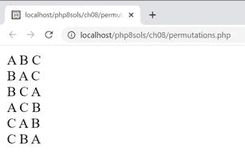

## 处理数组数据

在这一节中，我们将研究两种处理存储在数组中的数据的 PHP 解决方案:从多维关联数组中自动构建 HTML 嵌套列表，以及从 JSON 提要中提取数据。

### PHP 解决方案 8-8:自动构建嵌套列表

这个 PHP 解决方案重新访问了标准 PHP 库(SPL)中的`RecursiveIteratorIterator`,我们在第 [7](07.html) 章的“用 FilesystemIterator 检查文件夹的内容”中使用过它来挖掘文件系统。像`RecursiveIteratorIterator`这样的类的一个有用的特性是你可以通过扩展它们来适应你自己的需要。当您扩展一个类时，**子类**——通常被称为**子类**——继承其父类的所有公共和受保护的方法和属性。您可以添加新的方法和属性，或者通过重写父类的方法来更改它们的工作方式。`RecursiveIteratorIterator`公开了几个公共方法，可以重写这些方法，以便在多维关联数组上循环时在数组键和值之间注入 HTML 标记。

Note

类可以将方法和属性声明为公共的、受保护的或私有的。Public 意味着可以在类定义之外访问它们。受保护意味着它们只能在类定义或子类中被访问。Private 意味着它们只能在类定义中访问，而不能在子类中访问。

在构建 PHP 脚本之前，让我们检查一下 HTML 中嵌套列表的结构。下图显示了一个简单的嵌套列表:

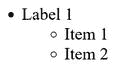

HTML 代码如下所示:

```php
<ul>
    <li>Label 1
        <ul>
            <li>Item 1</li>
            <li>Item 2</li>
        </ul>
    </li>
</ul>

```

需要注意的重要一点是，缩进列表嵌套在顶级列表项中。标签 1 的结束标记位于嵌套列表的结束标记之后。手工编写 HTML 嵌套列表容易出错，因为很难跟踪列表项的打开和关闭位置。当用 PHP 自动化嵌套列表时，我们需要记住这种结构。

1.  在`ch08`文件夹中创建一个名为`ListBuilder.php`的文件。如果你只是想研究完整的代码，它在`ListBuilder_end.php`中，带有完整的注释。

2.  定义一个名为`ListBuilder`的类来扩展`RecursiveIteratorIterator`，并为要处理的数组和输出 HTML 创建两个受保护的属性:

    ```php
    class ListBuilder extends RecursiveIteratorIterator
    {
        protected $array;
        protected $output = '';
    }

    ```

3.  大多数类都有一个构造函数方法来初始化它们并接受任何参数。`ListBuilder`类需要将一个数组作为它的参数，并准备使用它。将以下代码添加到类定义中(所有的`ListBuilder`代码需要放在步骤 2 中代码的右花括号之前):

    ```php
    public function __construct(array $array) {
        $this->array = new RecursiveArrayIterator($array);
        // Call the RecursiveIteratorIterator parent constructor
        parent::__construct($this->array, parent::SELF_FIRST);
    }

    ```

所有类的构造函数方法的名称都是相同的，并且以两个下划线开头。这个构造函数只有一个参数:将被转换成嵌套无序列表的数组。

要使用带有 SPL 迭代器的数组，必须先将其转换为迭代器，因此构造函数中的第一行创建了一个新的`RecursiveArrayIterator`实例，并将其赋给`ListBuilder`的`$array`属性。

因为我们覆盖了`RecursiveIteratorIterator`构造函数，所以我们需要调用父构造函数，并将`$array`属性作为第一个参数传递给它。调用`parent::SELF_FIRST`作为第二个参数可以访问正在处理的数组的键和值。如果没有第二个参数，我们就无法访问密钥。

Tip

在第 9 章和第 10 章中你会学到更多关于类和扩展类的知识。

1.  一个 HTML 无序列表以开始和结束的`<ul>`标签开始和结束。`RecursiveIteratorIterator`有在循环开始和结束时自动调用的公共方法，所以我们可以覆盖它们，用如下组合连接操作符向`$output`属性添加必要的标记:

    ```php
    public function beginIteration() {
        $this->output .= '<ul>';
    }
    public function endIteration() {
        $this->output .= '</ul>';
    }

    ```

2.  在每个子数组的开头和结尾也自动调用两个公共方法。我们可以使用这些来插入嵌套列表的开始标签`<ul>`,并关闭嵌套列表及其父列表项:

    ```php
    public function beginChildren() {
        $this->output .= '<ul>';
    }
    public function endChildren() {
        $this->output .= '</ul></li>';
    }

    ```

3.  为了处理每个数组元素，我们可以覆盖自动调用的`nextElement()`公共方法…是的，你已经猜到了。这稍微复杂一些，因为我们需要检查当前元素是否有子数组。如果有，我们需要添加一个开始标签和子数组的键。否则，我们需要在一对`<li>`标签之间添加当前值，如下所示:

    ```php
    public function nextElement() {
        // Check whether there's a subarray
        if (parent::callHasChildren()) {
            // Display the subarray's key
            $this->output .= '<li>' . self::key();
        } else {
            // Display the current array element
            $this->output .= '<li>' . self::current() . '</li>';
        }
    }

    ```

这些代码的大部分是不言自明的。该条件调用父级的—换句话说，`RecursiveIteratorIterator`的— `callHasChildren()`方法。如果当前元素有子元素，即子数组，则返回 true。如果有，开始的`<li>`标签被连接到`$output`属性上，后面跟着`self::key()`。这将调用从`RecursiveIteratorIterator`继承而来的`ListBuilder`的`key()`方法来获取当前键的值。没有结束的`</li>`标签，因为直到子数组被处理后才会添加。

如果当前元素没有任何子元素，则执行`else`子句。它调用`current()`方法来获取当前元素的值，该元素夹在一对`<li>`标记之间。

1.  为了显示嵌套列表，我们需要迭代数组并返回`$output`属性。我们可以用神奇的`__toString()`方法。这样定义它:

    ```php
    public function __toString() {
        // Generate the list
        $this->run();
        return $this->output;
    }

    ```

2.  要完成`ListBuilder`类，如下定义`run()`方法:

    ```php
    protected function run() {
        self::beginIteration();
        while (self::valid()) {
            self::next();
        }
        self::endIteration();
    }

    ```

这只是调用了从`RecursiveIteratorIterator`继承的四个方法。他们调用`beginIteration()`，然后通过`while`循环运行数组，并结束迭代。

1.  要测试`ListBuilder`，打开`ch08`文件夹中的`multidimensional_01.php`。它包含一个名为`$wines`的多维关联数组。包含`ListBuilder`定义，然后通过添加以下代码生成输出并显示(完整的代码在`multidimensional_02.php`):

    ```php
    require './ListBuilder.php';
    echo new ListBuilder($wines);

    ```

图 [8-7](#Fig7) 显示了结果。

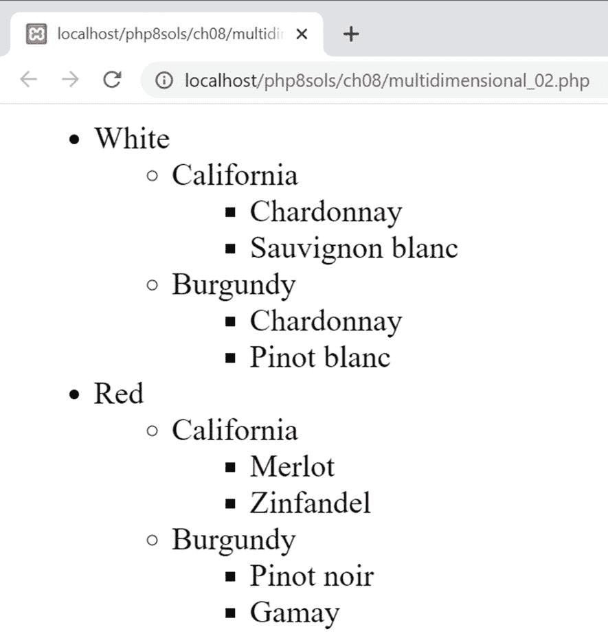

图 8-7

ListBuilder 扩展了 RecursiveIteratorIterator，从多维关联数组中自动构建嵌套列表

### PHP 解决方案 8-9:从 JSON 中提取数据

在前一章中，我们使用了`SimpleXML`来消化一个 RSS 新闻提要。RSS 和其他形式的 XML 分发数据的缺点是，用于包装数据的标签使数据变得冗长。JavaScript Object Notation (JSON)越来越多地被用于在线分发数据，因为它更简洁。虽然简洁的格式使得 JSON 下载速度更快，消耗的带宽更少，但缺点是不容易阅读。

这个 PHP 解决方案从旧金山开放数据( [`https://datasf.org/opendata/`](https://datasf.org/opendata/) )访问一个 JSON 提要，将其转换为一个数组，构建数据的多维关联数组，然后过滤它以提取所需的信息。这听起来像是很多艰苦的工作，但它涉及的代码相对较少。

1.  这个 PHP 解决方案的 JSON 数据源在`ch08/data`文件夹的`film_locations.json`中。或者，您可以从 [`https://data.sfgov.org/api/views/yitu-d5am/rows.json?accessType=DOWNLOAD`](https://data.sfgov.org/api/views/yitu-d5am/rows.json%253FaccessType%253DDOWNLOAD) 获得最新版本。如果您访问在线版本，请将其作为一个`.json`文件保存在本地硬盘上，以避免不断访问远程提要。

2.  这些数据由旧金山电影委员会收集的电影拍摄地的数据组成。使用 JSON 的挑战之一是定位您想要的信息，因为没有通用的命名约定。虽然这个提要被格式化为单独的行和缩进，但是 JSON 经常没有空格以使它更紧凑。将其转换为多维关联数组简化了识别过程。在`ch08`文件夹中创建一个名为`json.php`的 PHP 文件，并添加以下代码(在`json_01.php`):

    ```php
    $json = file_get_contents('./data/film_locations.json');
    $data = json_decode($json, true);
    echo '<pre>';
    print_r($data);
    echo '</pre>';

    ```

这使用`file_get_contents()`从数据文件中获取原始 JSON，将其转换为多维关联数组，然后显示它。将`true`作为第二个参数传递给`json_decode()`会将 JSON 对象转换成 PHP 关联数组。

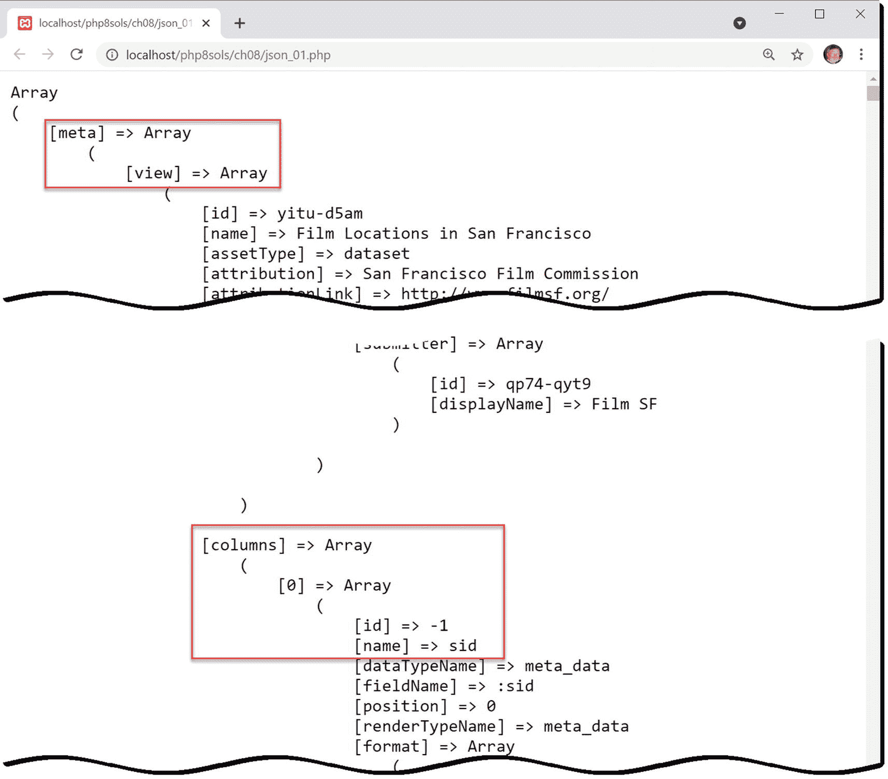

图 8-8

将 JSON 提要转换成关联数组简化了数据位置的识别

1.  保存文件并在浏览器中运行脚本。这个`$data`数组非常庞大。它包含了 3400 多部电影的细节。在`print_r()`周围包裹`<pre>`标签使得检查结构以识别感兴趣的数据位于何处变得容易。如图 [8-8](#Fig8) 所示，顶层数组称为`meta`。嵌套在里面的是一个名为`view`的子数组，它又包含一个名为`columns`的子数组。

`columns`子数组包含一个索引数组；在第一个元素中还有另一个数组，它有一个名为`name`的键。当你进一步向下滚动找到一个名为`data`的数组时，这一点的重要性就变得很明显了(见图 [8-9](#Fig9) )。

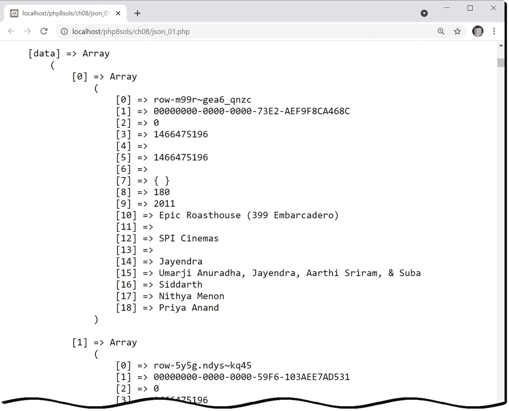

图 8-9

为了紧凑，电影数据存储在索引数组中

Tip

因为 JSON 文件太大了，所以使用浏览器的 Find 实用程序来搜索[数据]。

所有有趣的信息都存储在这里。它包含一个有 3400 多个元素的索引子数组，每个元素包含另一个有 19 个元素的索引数组。数据被映射到图 [8-8](#Fig8) 中标识的名称数组，而不是数千次重复列名。为了提取我们想要的信息，有必要为这个`data`数组中的每部电影构建一个关联数组。

1.  我们可以使用在“PHP 解决方案 8-6:用`array_multisort()`排序多维数组”中遇到的`array_column()`函数来获得列名然而，`name`元素被深埋在顶层数组中，该数组在步骤 2 中被存储为`$data`。图 [8-8](#Fig8) 中的缩进有助于找到作为第一个参数传递的正确子数组。将以下代码添加到脚本中(在`json_02.php`):

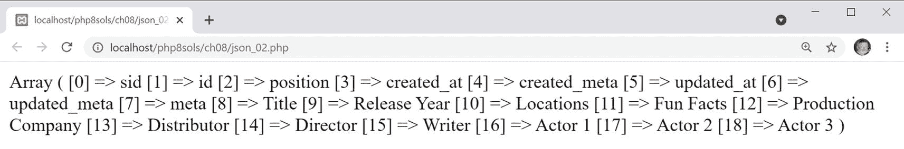

图 8-10

列名标识为每个电影位置存储的信息

1.  使用`print_r()`检查是否提取了正确的值，如图 [8-10](#Fig10) 所示。

```php
$col_names = array_column($data['meta']['view']['columns'], 'name');

```

1.  现在我们有了列名，我们可以循环通过`data`子数组，使用`array_combine()`将每个元素转换成关联数组。将以下代码添加到脚本中:

    ```php
    $locations = [];
    foreach ($data['data'] as $datum) {
        $locations[] = array_combine($col_names, $datum);
    }

    ```

这会将`$locations`初始化为一个空数组，然后遍历`data`子数组，将`$col_names`和当前数组的值传递给`array_combine()`。这导致相关的列名被指定为每个值的键。`data`(见图 [8-9](#Fig9) 的压痕水平表示`data`子阵列与`meta`在同一深度(见图 [8-8](#Fig8) )。

1.  现在包含一个关联数组的数组，每个数组包含 JSON 提要中列出的 3400 多个电影位置的详细信息。为了定位特定的信息，我们可以使用`array_filter()`函数，它将一个数组和一个回调函数作为参数，并返回一个新的过滤结果数组。

回调函数接受一个参数，即过滤器正在检查的当前元素。这意味着过滤标准需要在回调中硬编码。为了使回调更具适应性，我将使用一个能够从全局范围继承变量的 arrow 函数。如下定义搜索词和回调函数:

```php
$search = 'Pier 7';
$getLocation = fn($location) => str_contains($location['Locations'], $search);

```

arrow 函数被分配给一个变量。它采用一个参数`$location`，表示当前数组元素。回调函数使用`str_contains()`函数对当前数组的`Locations`元素中的搜索词执行区分大小写的搜索，这是 PHP 8 的新功能。如果找到搜索词，结果将是`true`。

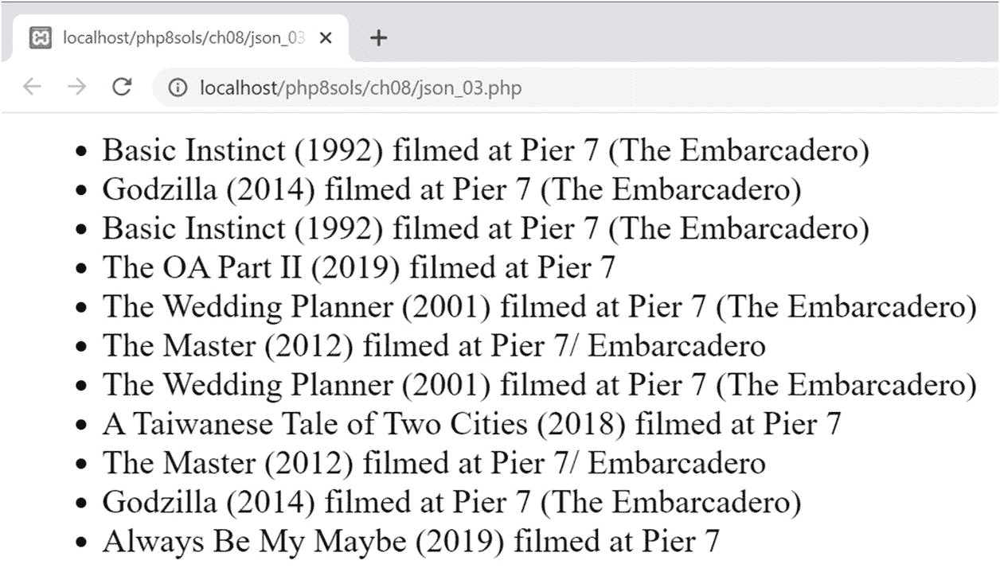

图 8-11

这些信息是从 JSON 提要的 3400 多个条目中筛选出来的

1.  我们现在可以过滤`$locations`数组，并像这样显示结果(完成的代码在`json_03.php`中):

    ```php
    $filtered = array_filter($locations, $getLocation);
    echo '<ul>';
    foreach ($filtered as $item) {
        echo "<li>{$item['Title']} ({$item['Release Year']}) filmed at
        {$item['Locations']}</li>";
    }
    echo '</ul>';

    ```

2.  保存脚本并在浏览器中测试。您应该会看到如图 [8-11](#Fig11) 所示的结果。

1.  有些电影在 JSON 文件中不止列出一次。要删除重复项，请通过创建一个空数组并修改`foreach`循环来修改代码，如下所示:

    ```php
    $duplicates = [];
    foreach ($filtered as $item) {
        if (in_array($item['Title'], $duplicates)) continue;
        echo "<li>{$item['Title']} ({$item['Release Year']}) filmed at {$item['Locations']}</li>";
        $duplicates[] = $item['Title'];
    }

    ```

循环内的条件语句使用`in_array()`函数检查`$` `item['Title']`是否在`$duplicates`数组中。如果是，函数返回`true`，`continue`关键字跳过循环的当前迭代。显示结果后，`$item['Title']`被添加到`$duplicates`数组中。更新后的代码在`json_04.php`中。

1.  再次运行脚本。这一次，重复项被省略。

2.  将`$search`的值更改为三藩市其他地点的名称，如普雷斯迪奥或阿卡特兹，以查看在那里拍摄的电影的名称。

## 自动将数组元素赋给变量

毫无疑问，关联数组非常有用，但是它们的缺点是键入和嵌入双引号字符串很费力。因此，通常将关联数组元素赋给简单变量，如下所示:

```php
$name = $_POST['name'];
$email = $_POST['email'];
$message = $_POST['message'];

```

但是，有一些方法可以简化这个过程，如下面几节所述。

### 使用 extract()函数

在最基本的形式中，`extract()`函数根据相关键的名称自动将关联数组的值赋给变量。换句话说，你*可以*通过简单地这样做获得与前面三行代码相同的结果:

```php
extract($_POST);

```

Caution

使用`extract()`处理来自用户输入的未过滤数据，比如`$_POST`或`$_GET`数组，被认为是一个主要的安全风险。恶意攻击者可能会尝试注入变量来覆盖您已经定义的值。

以最简单的形式使用，`extract()`函数是一个钝工具。除非您确切地知道哪些键在关联数组中，否则您将冒覆盖现有变量的风险。为了解决这个问题，该函数可以采用两个可选参数:一个是八个 PHP 常量中的一个，用于确定在命名冲突的情况下应该做什么；另一个是一个字符串，用于作为变量名的前缀。您可以在 [`www.php.net/manual/en/function.extract.php`](http://www.php.net/manual/en/function.extract.php) 的在线文档中找到这些选项的详细信息。

虽然可选参数改进了`extract()`的行为，但是使用它们的需要降低了函数提供的便利性。`extract()`还有另一个缺点:它不能处理变量名中包含无效字符的键。例如，下面是一个完全有效的关联数组:

```php
$author = ['first name' => 'David', 'last name' => 'Powers'];

```

即使键包含空格，`$author['first name']`和`$author['last name']`也是有效的。然而，将`$author`数组传递给`extract()`不会导致变量被创建。

这些限制大大降低了`extract()`的价值。

### 使用列表()

虽然括号使`list()`看起来像一个函数，但从技术上讲，它不是；这是一种 PHP 语言结构，它在一次操作中将一个变量列表赋给一个值数组。它从 PHP 4 开始就可用了，但在 PHP 7.1 中已经得到了相当大的增强。

在 PHP 7.1 之前，`list()`只能处理索引数组。按照变量名在数组中出现的顺序，列出要为其分配数组值的变量名。以下`list_01.php`中的例子展示了它是如何工作的:

```php
$person = ['David', 'Powers', 'London'];
list($first_name, $last_name, $city) = $person;
// Displays "David Powers lives in London."
echo "$first_name $last_name lives in $city.";

```

在 PHP 7.1 及更高版本中，`list()`也可以和关联数组一起使用。语法类似于创建文字关联数组的语法。使用双箭头运算符将关联数组键赋给一个变量。因为每个数组键都标识其关联值，所以它们不需要按照数组中的相同顺序列出，也不需要使用所有键，如`list_02.php`中的示例所示:

```php
$person = [
    'first name' => 'David',
    'last name' => 'Powers',
    'city' => 'London',
    'country' => 'the UK'];
list('country' => $country,
    'last name' => $surname,
    'first name' => $name) = $person;
// Displays "David Powers lives in the UK."
echo "$name $surname lives in $country.";

```

### 对 list()使用数组速记语法

PHP 7.1 中的另一个增强是对`list()`使用数组速记语法。前两个例子中变量的赋值可以简化成这样(完整代码在`list_03.php`和`list_04.php`中):

```php
[$first_name, $last_name, $city] = $person;
['country' => $country, 'last name' => $surname, 'first name' => $name] = $person;

```

### PHP 解决方案 8-10:使用生成器处理 CSV 文件

这个 PHP 解决方案修改了“PHP 解决方案 7-2:从 CSV 文件中提取数据”中的脚本，使用一个生成器来处理 CSV 文件，并用`list()`数组速记将每行生成的数组值赋给变量。

1.  打开`ch08`文件夹中的`csv_processor.php`。它包含了一个名为`csv_processor()`的发生器的如下定义:

    ```php
    // generator that yields each line of a CSV file as an array
    function csv_processor($csv_file) {
        if (@!$file = fopen($csv_file, 'r')) {
            echo "Can't open $csv_file.";
            return;
        }
        while (($data = fgetcsv($file)) !== false) {
            yield $data;
        }
        fclose($file);
    }

    ```

生成器接受一个参数，即 CSV 文件的名称。它使用第 [7](07.html) 章中描述的文件操作功能以读取模式打开文件。如果文件无法打开，错误控制操作符(`@`)会抑制任何 PHP 错误消息，显示一条自定义消息，然后返回，防止进一步尝试处理该文件。

假设文件被成功打开，`while`循环一次传递一行给`fgetcsv()`函数，后者将数据作为生成器生成的数组返回。当循环结束时，文件被关闭。

这是一个方便的实用函数，可以用来处理任何 CSV 文件。

1.  在`ch08`文件夹中创建一个名为`csv_list.php`的文件，并包含`csv_processor.php`:

1.  在`ch08/data`文件夹中，`scores.csv`包含以下以逗号分隔值存储的数据:

    ```php
    Home team,Home score,Away team,Away score
    Arsenal,2,Newcastle United,0
    Tottenham Hotspur,2,Crystal Palace,0
    Watford,4,Fulham,1
    Manchester City,2,Cardiff City,0
    Southampton,1,Liverpool,3
    Wolverhampton Wanderers,2,Manchester United,1

    ```

2.  通过创建如下所示的`csv_processor()`生成器实例，将数据加载到 CSV 文件中:

```php
require_once './csv_processor.php';

```

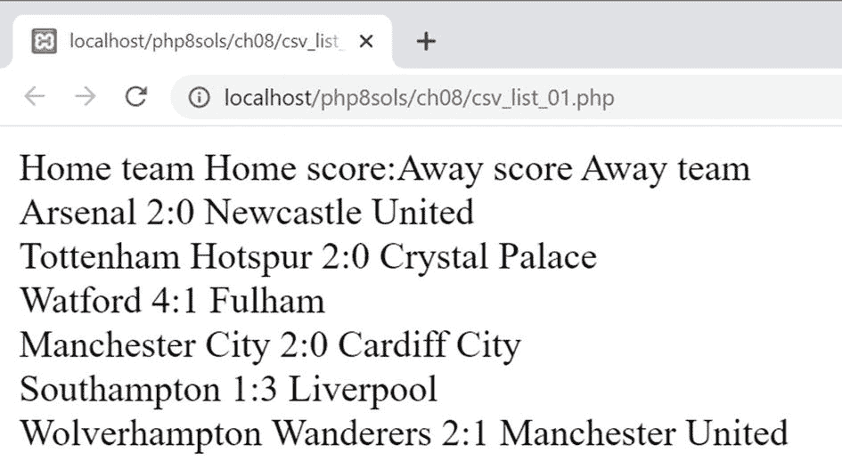

图 8-12

生成器处理 CSV 文件的每一行，包括列标题

1.  使用发电机最简单的方法是使用`foreach`回路。每次循环运行时，生成器都会将 CSV 文件的当前行作为索引数组生成。使用`list()`数组简写将数组值赋给变量，然后用`echo`显示它们，如下所示:

    ```php
    foreach ($scores as $score) {
        [$home, $hscore, $away, $ascore] = $score;
        echo "$home $hscore:$ascore $away<br>";
    }

    ```

2.  保存文件，并通过将脚本加载到浏览器中来运行脚本。或者，使用`ch08`文件夹中的`csv_list_01.php`。如图 [8-12](#Fig12) 所示，输出包括 CSV 文件中的列标题行。

```php
$scores = csv_processor('./data/scores.csv');

```

1.  使用`foreach`循环的问题是它处理 CSV 文件中的每一行。我们可以在每次循环运行时递增一个计数器，并用它来跳过带有关键字`continue`的第一行。但是，生成器有内置的方法，允许我们遍历要生成的值并检索当前值。编辑步骤 5 中的代码，如下所示(更改以粗体突出显示):

    ```php
    $scores->next();
        while ($scores->valid()) {
        [$home, $hscore, $away, $ascore] = $scores->current();
        echo "$home $hscore:$ascore $away<br>";
        $scores->next();
    }

    ```

修改后的代码使用了调用生成器的`valid()`方法的`while`循环，而不是`foreach`循环。只要至少还有一个值需要生成器生成，就会返回`true`。因此，这具有在被处理的 CSV 文件中的每一行上循环的效果。

为了跳过第一行，在循环开始之前调用`next()`方法。顾名思义，这会将生成器移动到下一个可用值。在循环内部，`current()`方法返回当前值，`next()`方法移动到下一个值，为循环再次运行做好准备。

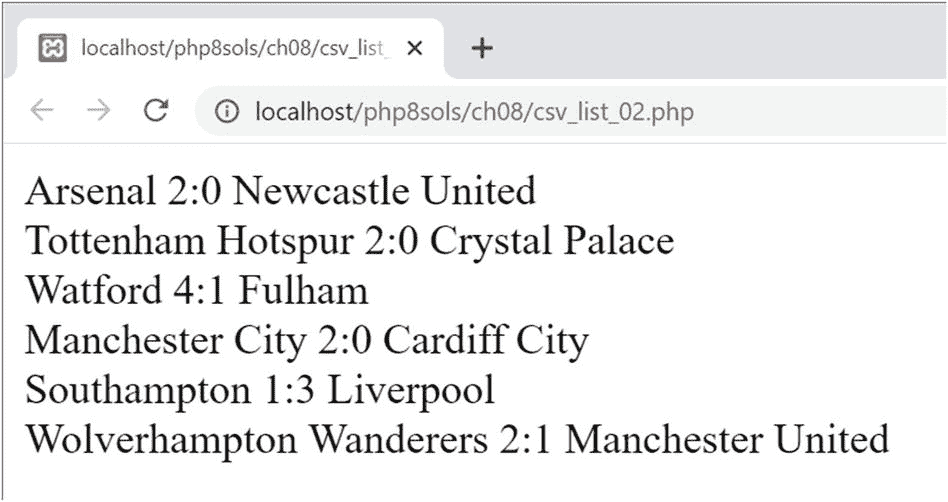

图 8-13

在迭代剩余的值之前，已经跳过了第一行

1.  保存文件并再次运行脚本(代码在`csv_list_02.php`中)。这次只显示分数，如图 [8-13](#Fig13) 所示。

## 用 Splat 运算符从数组中解包参数

第 [4 章](04.html)中简要介绍的 splat 运算符(`...`)有两个作用，即:

*   当在函数定义中使用时，它将多个参数转换成可以在函数内部使用的数组。

*   当调用一个函数时，它解包一个参数数组，把它们当作单独传递给一个函数。

下面的 PHP 解决方案展示了一个简单的例子，展示了它的实用价值。

### PHP 解决方案 8-11:用 Splat 操作符处理 CSV 文件

`fgetcsv()`函数将 CSV 文件中的数据作为索引数组返回。这个 PHP 解决方案展示了如何使用 splat 操作符将数组直接传递给需要多个参数的函数，而无需分隔各个元素。它还使用了前面 PHP 解决方案中描述的`csv_processor()`生成器。

1.  在`ch08`文件夹中创建一个名为`csv_splat.php`的文件，并包含`csv_processor.php`:

1.  在`ch08/data`文件夹中，`weather.csv`包含以下数据:

```php
require_once './csv_processor.php';

```

```php
City,temp
London,11
Paris,10
Rome,12
Berlin,8
Athens,19

```

温度以摄氏度为单位。为了那些相信水在 32 度而不是 0 度结冰的人的利益，我们需要以一种用户友好的方式处理这些数据。

1.  在`csv_splat.php`中，添加如下函数定义(代码在 csv_splat_01.php 中):

```php
function display_temp($city, $temp) {
    $tempF = round($temp/5*9+32);
    return "$city: $temp&deg;C ($tempF&deg;F)";
}

```

该函数有两个参数:城市名和温度。使用标准公式(除以 5，乘以 9，然后加上 32)将温度转换为华氏温度，并四舍五入为最接近的整数。

然后，该函数返回一个字符串，该字符串由城市名称和以摄氏度表示的温度组成，后跟括号中的华氏温度。

1.  包含数据的 CSV 文件以一行列标题开始，因此我们需要使用与上一个解决方案相同的技术跳过第一行。将数据加载到`csv_processor()`生成器中，并像这样跳过第一行:

1.  使用一个`while`循环，通过`display_temp()`函数和 splat 运算符处理剩余的数据行，如下所示:

```php
$cities = csv_processor('./data/weather.csv');
$cities->next();

```

```php
while ($cities->valid()) {
    echo display_temp(...$cities->current()) . '<br>';
    $cities->next();
}

```

和前面的解决方案一样，生成器的`current()`方法以数组的形式返回当前数据行。但是，这一次，splat 操作符没有将每个数组元素分配给一个变量，而是将数组解包，并将值作为参数按照它们在数组中出现的顺序进行分配。

如果您觉得这段代码难以理解，可以先将`current()`方法的返回值赋给一个变量，如下所示:

```php
$data = $cities->current();
echo display_temp(...$data) . '<br>';

```

在作为参数传递给函数的数组前面加上 splat 操作符的效果与此完全相同(代码在`csv_splat_02.php`中):

```php
[$city, $temp] = $cities->current();
echo display_temp($city, $temp) . '<br>';

```

图 [8-14](#Fig14) 显示了使用任一技术的结果。

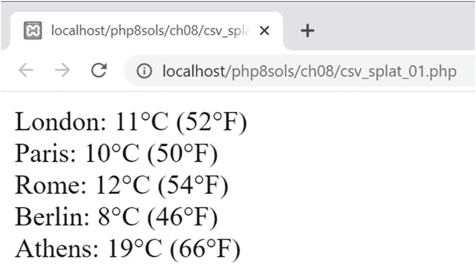

图 8-14

每个数据数组都通过 splat 操作符直接传递给函数进行了处理

使用 splat 操作符来解包参数数组具有简洁的优点，但是较短的代码并不总是可读性最好的，当您没有得到预期的结果时，这会使调试变得困难。我个人认为，将数组元素赋给变量，然后将其作为参数显式传递是一种更安全的方法。但是即使你不使用特定的技术，如果你需要使用其他人的代码，理解它是如何工作的也是有用的。

## 第三章回顾

使用数组是 PHP 中最常见的任务之一，尤其是在使用数据库时。数据库查询的几乎所有结果都以关联数组的形式返回，因此理解如何处理它们非常重要。在这一章中，我们已经学习了修改数组，合并数组，排序和提取数据。关于在循环中使用数组，要记住的要点是 PHP 总是在数组的副本上工作，除非您通过引用将值传递到循环中。相比之下，对数组排序的函数在原始数组上工作。

你可以在 PHP 在线文档 [`www.php.net/manual/en/ref.array.php`](http://www.php.net/manual/en/ref.array.php) 中找到所有数组相关函数的全部细节。这一章展示了使用其中大约一半的实际例子，帮助你成为 PHP 中处理数组的专家。