# 十一、页面记录：简单登录和多页面表单

网络是一个辉煌的幻觉。当你访问一个设计良好的网站时，你会有一种连续的感觉，就像翻阅一本书或一本杂志。所有的东西作为一个连贯的整体组合在一起。现实却大相径庭。web 服务器分别存储和处理单个页面的每个部分。除了需要知道相关文件发送到哪里，服务器对你是谁没有兴趣。每次 PHP 脚本运行时，变量只存在于服务器的内存中，通常脚本一结束就被丢弃。甚至`$_POST`和`$_GET`数组中的变量也只有短暂的生命周期。它们的值被传递给下一个脚本一次，然后从内存中删除，除非您对它做了什么，比如将信息存储在一个隐藏的表单字段中。即使这样，只有当表单被提交时，它才继续存在。

为了解决这些问题，PHP 使用了**会话**。在简要描述了会话的工作原理之后，我将向您展示如何使用会话变量来创建一个简单的、基于文件的登录系统，并将信息从一个页面传递到另一个页面，而无需使用隐藏的表单字段。

在本章中，您将了解以下内容:

*   了解什么是会话以及如何创建会话

*   创建基于文件的登录系统

*   使用定制的类检查密码强度

*   为会话设置时间限制

*   使用会话跟踪多个页面上的信息

## 什么是会话以及它们如何工作

会话通过在 web 服务器上存储一个随机标识符(即会话 ID)并作为 cookie 存储在访问者的计算机上来确保连续性。web 服务器使用 cookie 来识别它正在与同一个人通信(或者更准确地说，是与同一台计算机通信)。图 [11-1](#Fig1) 到 [11-3](#Fig3) 显示了在我的本地测试环境中创建的一个简单会话的细节。

如图 [11-1](#Fig1) 所示，浏览器中存储的 cookie 名为`PHPSESSID`，内容是一堆杂乱的字母和数字。这个随机字符串是会话的 ID。

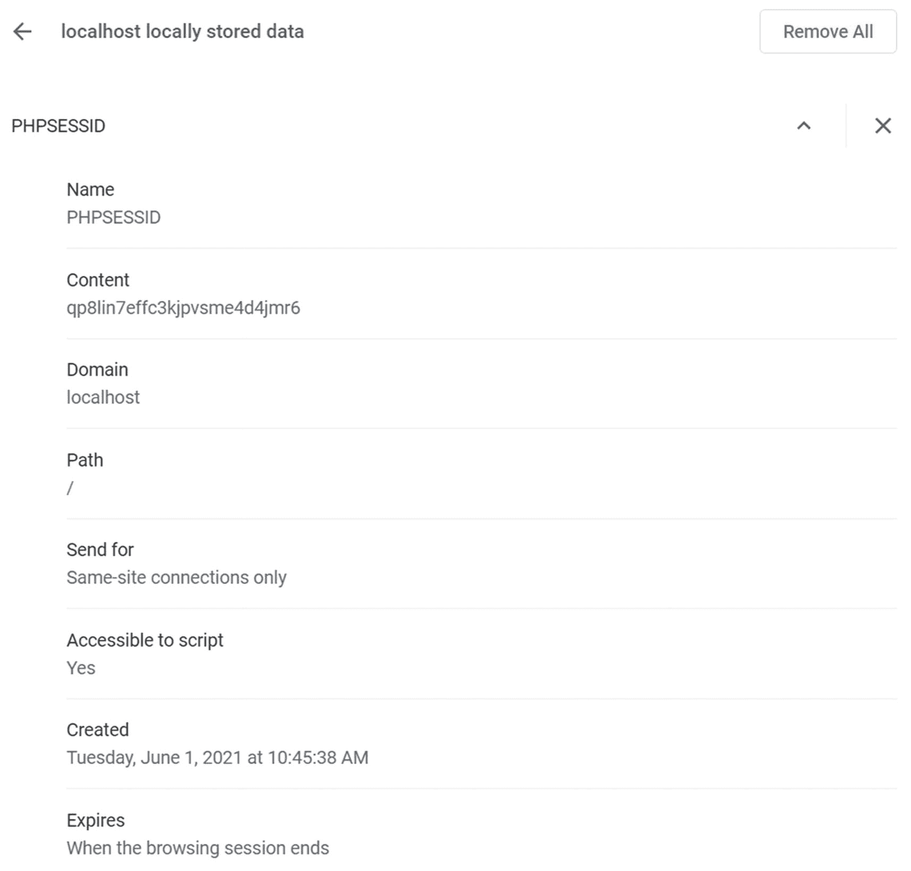

图 11-1

PHP 会话在浏览器中以 cookie 的形式存储一个唯一的标识符

在网络服务器上创建一个匹配文件，其文件名中包含相同的字母和数字，如图 [11-2](#Fig2) 所示。

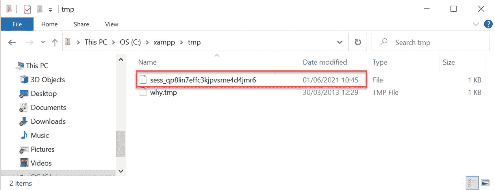

图 11-2

cookie 的内容标识存储在 web 服务器上的会话数据

当会话启动时，服务器将信息存储在会话变量中，只要会话保持活动状态(通常直到浏览器关闭)，其他页面就可以访问这些变量。因为会话 ID 对每个访问者都是唯一的，所以存储在会话变量中的信息不能被其他任何人看到。这意味着会话是用户身份验证的理想选择，尽管它们可以用于在从一个页面传递到下一个页面时希望保留同一用户的信息的任何情况，例如多页表单或购物车。

用户计算机上存储的唯一信息是包含会话 ID 的 cookie，它本身是没有意义的。这意味着不能简单地通过检查这个 cookie 的内容来暴露私人信息。

会话变量及其值存储在 web 服务器上。图 [11-3](#Fig3) 显示了一个简单会话文件的内容。如您所见，它是纯文本的，内容不难破译。图中所示的会话有一个变量:`name`。变量名后跟一个竖线，然后是字母“s”，一个冒号，一个数字，另一个冒号，变量值用引号括起来。“s”代表字符串，数字表示字符串包含多少个字符。所以这个会话变量包含我的名字，它是一个五个字符长的字符串。

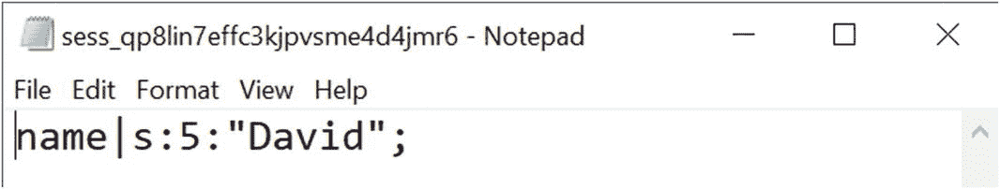

图 11-3

会话的详细信息以纯文本形式存储在服务器上

这种设置有几个含义。包含会话 ID 的 cookie 通常保持活动状态，直到浏览器关闭。因此，如果几个人共用同一台电脑，他们都可以访问彼此的会话，除非他们在移交给下一个人之前总是关闭浏览器，这是你无法控制的。所以提供一个注销机制来删除 cookie 和会话变量是很重要的，这样可以保证站点的安全。您还可以创建一个超时机制，自动防止任何人在一段时间的不活动后重新获得访问权限。

在 web 服务器上以纯文本的形式存储会话变量，这本身并不需要担心。只要服务器配置正确，就不能通过浏览器访问会话文件。PHP 还会定期删除不活动的文件(理论上，生命周期是 1440 秒——24 分钟——但这并不可靠)。然而，显而易见的是，如果攻击者设法破坏服务器或劫持会话，信息就可能暴露。因此，尽管会话对于网站的密码保护部分或使用多页表单来说通常是足够安全的，但是您不应该使用会话变量来存储敏感信息，如密码或信用卡详细信息。正如您将在本章后面的“使用会话限制访问”中看到的，虽然密码用于获得对受保护站点的访问，但密码本身存储(最好是散列)在一个单独的位置，而不是作为会话变量。

Note

哈希是一种单向过程，它对纯文本进行加扰以生成唯一的消息摘要。它经常与加密混淆，后者允许加密的文本被解密。当哈希正确执行时，没有办法逆转该过程来揭示原始密码。

默认情况下支持会话，因此不需要任何特殊配置。但是，如果在用户的浏览器中禁用了 cookies，会话将无法工作。可以配置 PHP 通过一个查询字符串发送会话 ID，但是这被认为是一个安全风险。

### 创建 PHP 会话

只需将以下命令放入您希望在会话中使用的每个 PHP 页面中:

```php
session_start();

```

这个命令应该在每个页面中只调用一次，并且必须在 PHP 脚本生成任何输出之前调用，所以理想的位置是紧接在开始的 PHP 标记之后。如果在调用`session_start()`之前生成了任何输出，该命令将失败，并且不会为该页面激活会话。(有关解释，请参见后面的“标题已发送”部分。)

### 创建和销毁会话变量

通过将会话变量添加到`$_SESSION`超全局数组中，可以创建一个会话变量，就像分配普通变量一样。假设您想要存储访问者的姓名并显示问候语。如果在登录表单中提交的名称是`$_POST['name']`，您可以这样分配它:

```php
$_SESSION['name'] = $_POST['name'];

```

`$_SESSION['name']`现在可以在任何以`session_start()`开头的页面中使用。因为会话变量存储在服务器上，所以您应该在脚本或应用不再需要它们时立即将其删除。取消设置会话变量，如下所示:

```php
unset($_SESSION['name']);

```

要取消设置所有会话变量——例如，当您注销某人时——将`$_SESSION`超全局数组设置为空数组，如下所示:

```php
$_SESSION = [];

```

Caution

不要尝试`unset($_SESSION)`。效果不错，但有点太有效了。它不仅清除当前会话，而且防止存储任何进一步的会话变量。

### 销毁会话

取消设置所有会话变量本身可以有效地防止任何信息被重用，但是您也应该像这样使会话 cookie 无效:

```php
if (isset($_COOKIE[session_name()])) {
    setcookie(session_name(), ", time()-86400, '/');
}

```

它使用函数`session_name()`动态获取会话名称，并将会话 cookie 重置为空字符串，并在 24 小时前过期(86，400 是一天中的秒数)。最后一个参数(`'/'`)将 cookie 应用于整个域。

最后，使用以下命令关闭会话:

```php
session_destroy();

```

这个函数的名字很糟糕。它只是关闭会话。它不会破坏任何会话变量或取消设置会话 cookie。重要的是使会话 cookie 无效并关闭会话，以避免未经授权的人访问站点的受限部分或会话期间交换的任何信息的风险。然而，访问者可能会忘记注销，因此并不总是能够保证会话会被正确关闭，这就是为什么不在会话变量中存储敏感信息如此重要。

Note

PHP 8 不支持旧脚本中常见的`session_register()`或`session_unregister()`。

### 重新生成会话 ID

当用户更改状态时，例如登录后，作为一种安全措施，建议重新生成会话 ID。这将更改标识会话的随机字母和数字字符串，但保留存储在会话变量中的所有信息。在 *Pro PHP Security，Second Edition* (Apress，2010，ISBN 978-1-4302-3318-3)中，Chris Snyder 和 Michael Southwell 解释说“生成新的会话 ID 的目标是消除具有低级安全会话知识的攻击者能够执行高安全性任务的可能性，不管这种可能性有多小。”

要重新生成会话 ID，只需调用`session_regenerate_id()`并将用户重定向到另一个页面或重新加载同一个页面。

### “邮件头已发送”错误

尽管使用 PHP 会话非常容易，但有一个问题让初学者头疼不已。您会看到以下消息，而不是一切都按您预期的方式运行:

```php
Warning: Cannot add header information - headers already sent

```

这个问题我之前结合`header()`函数提过好几次了。它也影响了`session_start()`和`setcookie()`。在`session_start()`的情况下，解决方案很简单:确保将它放在 PHP 开始标记之后(或之后不久)，并检查开始标记之前没有空格。

有时，即使 PHP 标签前面没有空格，问题也会发生。这通常是由于编辑软件在脚本开头插入了字节顺序标记(BOM)造成的。如果发生这种情况，请打开脚本编辑器的首选项，并禁止在 PHP 页面中使用 BOM。

然而，当使用`setcookie()`销毁会话 cookie 时，很可能需要在调用该函数之前将输出发送到浏览器。在这种情况下，PHP 让您使用`ob_start()`将输出保存在缓冲区中。然后在`setcookie()`完成工作后，用`ob_end_flush()`刷新缓冲区。你将在 PHP 解决方案 11-2 中看到如何做到这一点。

## 使用会话限制访问

当考虑限制对网站的访问时，首先想到的词可能是“用户名”和“密码”尽管这些通常会解锁站点入口，但对会话来说都不是必需的。您可以将任何值存储为会话变量，并使用它来确定是否授予对页面的访问权限。例如，你可以创建一个名为`$_SESSION['status']`的变量，根据它的值给访问者访问站点不同部分的权限，或者如果没有设置，就不允许访问。

一个小小的演示应该能让一切变得清晰，并向你展示会话在实践中是如何工作的。

### PHP 解决方案 11-1:简单的会话示例

这应该只需要几分钟就能完成，但是您也可以在`ch11`文件夹的`session_01.php`、`session_02.php`和`session_03.php`中找到完整的代码。

1.  在`php8sols`站点根目录下名为`sessions`的新文件夹中创建一个名为`session_01.php`的页面。插入一个带有名为`name`的文本字段和一个`Submit`按钮的表单。将`method`设置为`post`并将`action`设置为`session_02.php`。该表单应该如下所示:

    ```php
    <form method="post" action="session_02.php">
        <p>
            <label for="name">Enter your name:</label>
            <input type="text" name="name" id="name">
        </p>
        <p>
            <input type="submit" name="Submit" value="Submit">
        </p>
    </form>

    ```

2.  在另一个名为`session_02.php`的页面中，将其插入到`DOCTYPE`声明的上方:

    ```php
    <?php
    // initiate session
    session_start();
    // check that form has been submitted and that name is not empty
    if ($_POST && !empty($_POST['name'])) {
        // set session variable
        $_SESSION['name'] = $_POST['name'];
    }
    ?>

    ```

行内注释解释了正在发生的事情。会话开始，只要`$_POST['name']`不为空，它的值就被赋给`$_SESSION['name']`。

1.  在`session_02.php`中的`<body>`标签之间插入以下代码:

    ```php
    <?php
    // check session variable is set
    if (isset($_SESSION['name'])) {
        // if set, greet by name
        echo 'Hi there, ' . htmlentities($_SESSION['name']) . '. <a
            href="session_03.php">Next</a>';
    } else {
        // if not set, send back to login
        echo 'Who are you? <a href="session_01.php">Please log in</a>';
    }
    ?>

    ```

如果`$_SESSION['name']`已设置，将显示一条欢迎消息以及一个到`session_03.php`的链接。否则，页面会告诉访问者它不知道谁在试图访问，并提供一个返回到第一页的链接。

Caution

键入以下行时要小心:

`echo 'Hi there, ' . htmlentities($_SESSION['name']) . '. <a href="session03.php">Next</a>';`

前两个句点(`htmlentities($_SESSION['name'])`)是 PHP 连接运算符。第三个句点(紧接在单引号之后)是一个普通的句点，将作为字符串的一部分显示。

1.  创建`session_03.php`。在`DOCTYPE`上方键入以下内容以启动会话:

1.  在`session_03.php`的`<body>`标签之间插入以下代码:

    ```php
    <?php
    // check whether session variable is set
    if (isset($_SESSION['name'])) {
        // if set, greet by name
        echo 'Hi, ' . htmlentities($_SESSION['name']) . '. See, I remembered
            your name!<br>';
        // unset session variable
        unset($_SESSION['name']);
        // invalidate the session cookie
        if (isset($_COOKIE[session_name()])) {
            setcookie(session_name(), '', time()-86400, '/');
        }
        // end session
        session_destroy();
        echo '<a href="session_02.php">Back to page 2</a>';
    } else {
        // display if not recognized
        echo "Sorry, I don't know you.<br>";
        echo '<a href="session_01.php">Please log in</a>';
    }
    ?>

    ```

```php
<?php session_start(); ?>

```

如果已经设置了`$_SESSION['name']`，页面显示它，然后取消设置，并使当前会话 cookie 无效。通过将`session_destroy()`放在第一个代码块的末尾，会话及其相关变量将不再可用。

1.  将`session_01.php`加载到浏览器中，在文本字段中键入您的姓名，然后单击提交。

2.  您应该会看到类似下面的截图。在这个阶段，这里发生的事情和普通形式没有明显的区别:

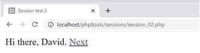

1.  当您单击“下一步”时，会话的威力开始显现。页面会记住你的名字，即使`$_POST`数组对它不再可用。在大多数情况下，您可能会看到类似于以下截图的内容:

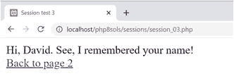

但是，在某些服务器上，您可能会收到以下警告消息，指出无法修改邮件头信息，因为邮件头已经发送:

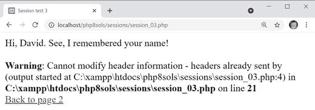

Note

正如第 [5](05.html) 章所解释的，如果服务器被配置为缓冲前 4 KB 的输出，它们不会产生关于头的警告。然而，并不是所有的服务器都会缓冲输出，所以解决这个问题很重要。

1.  单击第 2 页的链接(如果您收到错误消息，它就在消息的下面)。会话已被破坏，所以这次`session_02.php`不知道你是谁:

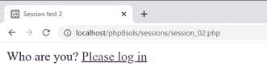

1.  在浏览器地址栏中输入`session_03.php`的地址并加载。它也不记得该会话，并显示相应的消息:

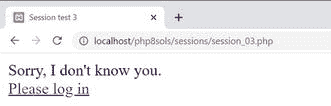

即使您在步骤 8 中没有收到警告消息，当您将依赖于会话的页面部署到其他服务器时，也需要防止它发生。错误消息不仅看起来很糟糕，而且还意味着`setcookie()`不能使会话 cookie 无效。尽管在`session_03.php`中`session_start()`紧跟在开始的 PHP 标签之后，但是警告消息是由`DOCTYPE`声明、`<head>`和其他在`setcookie()`之前输出的 HTML 触发的。

#### PHP 解决方案 11-2:用 ob_start()缓冲输出

虽然您可以将`setcookie()`放在 PHP 块中的`DOCTYPE`声明之上，但是您也需要将`$_SESSION['name']`的值赋给一个普通变量，因为它在会话被销毁后就不再存在了。答案不是将整个脚本分开，而是用`ob_start()`缓冲输出。

继续使用上一节的`session_03.php`。

1.  像这样修改`DOCTYPE`声明上面的 PHP 块:

    ```php
    <?php
    session_start();
    ob_start();
    ?>

    ```

这会打开输出缓冲，并防止输出被发送到浏览器，直到脚本结束，或者直到您使用`ob_end_flush()`专门刷新输出。

1.  使会话 cookie 无效后，立即刷新输出，如下所示:

    ```php
    // invalidate the session cookie
    if (isset($_COOKIE[session_name()])) {
        setcookie(session_name(), ", time()-86400, '/');
    }
    ob_end_flush();

    ```

2.  保存`session_03.php`并再次测试序列。这一次应该没有警告。更重要的是，会话 cookie 不再有效。(更新后的代码在`session_04.php`里。)

### 使用基于文件的身份验证

正如您刚才看到的，会话变量和条件语句的组合让您根据是否设置了会话变量向访问者呈现完全不同的页面。你所需要做的就是添加一个密码检查系统，这样你就有了一个基本的用户认证系统。

在深入研究代码之前，让我们考虑一下安全密码这个重要问题。

### 确保密码安全

密码不应存储在公共场所。换句话说，如果您使用基于文件的身份验证系统，该文件必须在 web 服务器的文档根目录之外。此外，密码不应以纯文本形式保存。为了更安全，建议散列密码。多年来，人们推荐使用`MD5`或`SHA-` 1 算法将密码散列为 32 位或 40 位十六进制数。他们最初的优势之一，速度，变成了一个主要的弱点。自动化脚本可以在暴力攻击中每秒处理大量计算，以确定原始值——与其说是猜测，不如说是尝试每种可能的组合。

当前的建议是使用两个函数:`password_hash()`和`password_verify()`，它们提供了一个更加健壮的散列和验证密码的系统。要散列一个密码，只需将它传递给`password_hash()`函数，就像这样:

```php
$hashed = password_hash($password, PASSWORD_DEFAULT);

```

`password_hash()`的第二个参数是一个常量，它将加密方法留给 PHP，允许您随时更新当时被认为是最安全的方法。

Note

`password_hash()`功能为高级用户提供了其他选项。详见 [`www.php.net/manual/en/function.password-hash.php`](http://www.php.net/manual/en/function.password-hash.php) 。在 [`www.php.net/manual/en/faq.passwords.php`](http://www.php.net/manual/en/faq.passwords.php) 还有一个关于安全密码哈希的 FAQ(常见问题)页面。

使用`password_hash()`以一种不可能逆转的方式打乱纯文本密码。这意味着，即使您的密码文件被暴露，也没有人能够知道密码是什么。这也意味着您无法将密码转换回其原始值。在一个方面，这并不重要:当用户登录时，`password_verify()`根据散列版本检查提交的值。缺点是，如果用户忘记密码，您无法向他们发送密码提醒；必须创建新密码。然而，良好的安全性要求散列密码。

散列法并不能防止密码最常见的问题:容易猜测或使用常见单词的密码。许多注册系统现在通过要求混合字母数字字符和符号来强制使用更强的密码。

因此，第一项任务是创建一个用户注册表单，检查以下内容:

*   密码和用户名包含最少数量的字符

*   密码符合最小强度标准，例如包含数字、大写和小写字符以及符号的混合

*   密码与确认字段中的第二个条目相匹配

*   用户名没有被使用

#### PHP 解决方案 11-3:创建密码强度检查器

这个 PHP 解决方案展示了如何创建一个类来检查密码是否满足某些要求，比如空格的使用、最小字符数以及不同类型字符的组合。默认情况下，该类只检查密码是否只有单个空格，开头或结尾没有空格，并且包含最少数量的字符。可选方法允许您设置更严格的条件，例如使用大写和小写字符、数字和非字母数字符号的组合。

这个 PHP 解决方案从构建用户注册表单开始，这个表单也将在 PHP 解决方案 11-4 中使用。

1.  在`sessions`文件夹中创建一个名为`register.php`的页面，并插入一个带有三个文本输入字段和一个提交按钮的表单。布局表单并命名输入元素，如下图所示。如果您想节省时间，请使用`ch11`文件夹中的`register_01.php`:

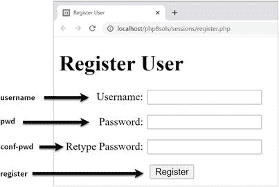

1.  和往常一样，您希望处理脚本只在表单提交后才运行，所以一切都需要包含在一个条件语句中，该语句检查提交按钮的`name`属性是否在`$_POST`数组中。然后，您需要检查输入是否满足您的最低要求。在 PHP 块中的`DOCTYPE`声明上方插入以下代码:

    ```php
    if (isset($_POST['register'])) {
        $username = trim($_POST['username']);
        $password = trim($_POST['pwd']);
        $retyped = trim($_POST['conf_pwd']);
        require_once '../Php8Solutions/Authenticate/CheckPassword.php';
    }

    ```

条件语句中的代码将来自三个文本字段的输入传递给`trim()`以删除开头和结尾的空白，并将结果分配给简单的变量。然后，它包含一个文件，该文件将包含检查密码的类，这将在接下来定义。

Note

在这个阶段，代码不会检查`$password`和`$retyped`是否相同。现在不比较它们简化了类的测试。

1.  在`Php8Solutions`文件夹中新建一个名为`Authenticate`的文件夹。然后在新文件夹中创建一个名为`CheckPassword.php`的文件。它将只包含 PHP 脚本，所以去掉任何 HTML 并添加以下代码:

    ```php
    <?php
    namespace Php8Solutions\Authenticate;

    class CheckPassword {
        const MIN_LENGTH = 8;
        protected array $errors = [];

        public function __construct(
            protected string $password,
            protected int ?$minChars = null,
            protected bool $mixedCase = false,
            protected int $minNums = 0,
            protected int $minSymbols = 0
        ) {
            if (!isset($this->minChars) || $this->minChars <
                self::MIN_LENGTH) {
                $this->minChars = self::MIN_LENGTH;
            }
            $this->check();
        }

    }

    ```

这定义了基本的`CheckPassword`类，它最初只检查密码是否包含多个空格，以空格开始或结束，并具有所需的最小字符数。您将很快添加其他特性。

该文件首先将`Php8Solutions\Authenticate`声明为其名称空间，然后用设置为`8`的常量`MIN_LENGTH`来定义`CheckPassword`类。这决定了密码中的最小字符数。还有一个名为`$errors`的受保护属性，它被初始化为一个空数组。如果密码未通过任何检查，这将用于存储所有错误消息。

构造函数方法有五个参数，前面都有`protected`可见性声明，所以 PHP 8 的构造函数属性提升会自动将它们转换为类属性。只有第一个参数是必需的:要检查的密码，它必须是一个字符串。其余的参数都有默认值，所以它们成为可选参数。

`$minChars`参数接受整数或`null`。默认情况下，是`null`。设置此参数的值允许您更改密码中的最小字符数。然而，构造函数体中的条件语句使用带有作用域解析操作符(`::`)的`self`关键字检查是否提供了一个大于`MIN_LENGTH`常数的值。如果条件的两部分都等于假，则使用`MIN_LENGTH`的值。否则，将使用传递给构造函数的值。这可以防止使用低于常数中指定的最小值的值。

其他参数为其他要求设置默认值:混合使用大写和小写字符，最少使用数字字符，最少使用非字母数字字符。三者的默认值都是负数。

构造函数最后调用一个名为 check()的内部方法，我们接下来将定义它。

1.  在构造函数定义后插入以下代码:

    ```php
                  protected function check() {
                      if (preg_match('/\s{2,}/', $this->password)) {
                          $this->errors[] = 'Password can contain only single spaces.';
                      }
                      if (strlen($this->password) < $this->minChars) {
                     $this->errors[] = "Password must be at least
                         $this->minChars characters.";
                     }
                 }

    ```

`check()`方法包含两个条件语句。第一种方法将`preg_match()`与正则表达式结合使用，在密码中搜索两个或更多连续的空白字符。另一个条件语句使用`strlen()`来确定密码字符串的长度，并将结果与`$minChars`属性进行比较。

如果密码没有通过这些测试，那么`$errors`属性将包含至少一个元素。所以我们可以用它来决定是接受还是拒绝密码。

1.  `getErrors()`公共方法只是返回错误消息的数组，它看起来像这样:

    ```php
                  public function getErrors() {
                      return $this->errors;
                  }

    ```

2.  将`getErrors()`方法添加到类定义中，保存`CheckPassword.php`，切换到`register.php`。

3.  在`register.php`中，在开始的 PHP 标签后添加下面一行以导入 CheckPassword 类:

```php
use Php8Solutions\Authenticate\CheckPassword;

```

Caution

您必须总是在脚本的顶层导入命名空间类。试图在条件语句中导入该类会生成分析错误。

1.  在表单提交后执行代码的条件语句中，创建一个`CheckPassword`对象，将`$password`作为参数传递。然后这样调用`getErrors()`方法:

    ```php
    require_once '../Php8Solutions/Authenticate/CheckPassword.php';
    $checkPwd = new CheckPassword($password);
    $errors = $checkPwd->getErrors();
    }

    ```

只有`CheckPassword`构造函数的第一个参数是必需的。在这个阶段，该类只能检查多个空格和密码的长度。因此，唯一有影响的另一个参数是设置最小字符数。省略它会将最小值设置为默认值 8。

1.  将以下 PHP 代码块添加到页面正文中的表单上方:

    ```php
    <h1>Register User</h1>
    <?php
    if (isset($errors)) {
        echo '<ul>';
         if (empty($errors)) {
               echo '<li>Password OK</li>';
         } else {
            foreach ($errors as $error) {
                echo "<li>$error</li>";
            }
         }
        echo '</ul>';
    }
    ?>
    <form action="register.php" method="post">

    ```

这将检查`$errors`是否已被定义。如果有，我们知道表单已经被提交，所以一个条件语句检查`$errors`是否为空。如果是，我们知道密码通过了测试；并且我们显示适当的消息。否则，foreach 循环会显示错误信息。

1.  保存`register.php`并将其载入浏览器。通过点击 Register 按钮测试`CheckPassword`类，无需填写任何字段。您应该会看到一条消息，通知您密码至少需要八个字符。

2.  尝试使用包含八个字符的密码。您应该看到密码正常。

    **提示**只检查在密码字段中输入的值，所以在这个阶段不需要填写其他字段。

3.  尝试使用至少包含八个字符的密码，但在中间插入一个空格。您应该看到密码正常。

4.  中间放两个连续的空格。你会被警告只允许一个空格。

5.  请尝试使用少于八个字符且中间有多个连续空格的字符。您将看到以下警告:

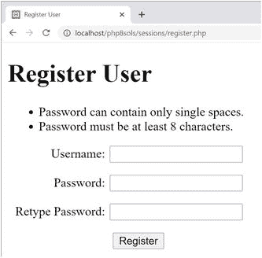

1.  更改`register.php`中的代码，将可选的第二个参数传递给`CheckPassword`构造函数，将最小字符数设置为 10:

1.  保存并再次测试页面。如果您遇到任何问题，请将您的代码与`ch11`文件夹中的`register_02.php`和`ch11/Php8Solutions/Authenticate`文件夹中的`CheckPassword_01.php`进行比较。

2.  假设您的代码正在运行，修改`check()`方法来添加对混合大写和小写字符、最小数量的数字字符和最小数量的非字母数字字符的测试。更新后的代码如下所示:

    ```php
    public function check() {
        if (preg_match('/\s{2,}/', $this->password)) {
          $this->errors[] = 'Password can contain only single spaces.';
        }
        if (strlen($this->password) < $this->minChars) {
            $this->errors[] = "Password must be at least
                $this->minChars characters.";
        }
        if ($this->mixedCase) {
            $pattern = '/(?=.*\p{Ll})(?=.*\p{Lu})/u';
            if (!preg_match($pattern, $this->password)) {
                $this->errors[] = 'Password should include uppercase
                    and lowercase characters.';
            }
        }

        if ($this->minNums > 0) {
            $pattern = '/\d/';
            $found = preg_match_all($pattern, $this->password, $matches);
            if ($found < $this->minNums) {
                $this->errors[] = "Password should include at least
                    $this->minNums number(s).";
            }
        }
        if ($this->minSymbols > 0) {
            $pattern =  '/[\p{S}\p{P}]/u';
            $found = preg_match_all($pattern, $this->password, $matches);
            if ($found < $this->minSymbols) {
                $this->errors[] = "Password should include at least
                    $this->minSymbols nonalphanumeric character(s).";
            }
        }

    ```

```php
$checkPwd = new CheckPassword($password, 10);

```

```php
}

```

只有当等效的可选参数传递给类构造函数时，三个新的条件语句才会运行。每一个都存储一个正则表达式作为`$pattern`，然后使用`preg_match()`或`preg_match_all()`来测试密码。

如果`$mixedCase`属性被设置为`true`，则正则表达式和密码被传递给`preg_match()`，以在密码的任何位置查找至少一个小写字母和一个大写字母。正则表达式使用 Unicode 类别元字符表示小写和大写，因此允许的字符不限于非重音字符 A-z。结束分隔符后的小写字母 *u* 是一个修饰符，它将模式和主题字符串视为 UTF-8。

默认情况下，`$minNums`和`$minSymbols`属性设置为 0。如果它们被重置为正数，正则表达式和密码被传递给`preg_match_all()`函数，以找出正则表达式匹配了多少次。该函数需要三个参数:正则表达式、要搜索的字符串和存储匹配项的变量；它返回找到的匹配数。在这种情况下，您感兴趣的只是匹配的数量。存储匹配的变量被丢弃。

最后一个条件语句中的`$pattern`将数学符号、货币符号、标点符号和其他符号的 Unicode 类别元字符与 UTF-8 修饰符一起使用。

1.  保存`CheckPassword.php`并通过将可选参数传递给`register.php`中的类构造函数来测试更新后的类。您可以按照与构造函数签名中相同的顺序传递它们，也可以使用命名参数传递它们。例如，以下要求密码至少包含两个数字和一个非字母数字符号:

    ```php
                  $checkPwd = new CheckPassword($password, minNums: 2,
                      minSymbols: 1);

    ```

使用各种组合来加强不同强度的密码。

如有必要，对照`ch11`文件夹中的`register_03.php`和`ch11/Php8Solutions/Authenticate`文件夹中的`CheckPassword_02.php`检查您的代码。

既然我们可以检查密码强度，我们就可以构建一个简单的用户注册系统。

#### PHP 解决方案 11-4:创建一个基于文件的用户注册系统

这个 PHP 解决方案创建了一个简单的用户注册系统，用`password_hash()`函数散列密码。它使用 PHP 解决方案 11-3 中的`CheckPassword`类来执行最低强度要求。进一步的检查确保用户名包含最少数量的字符，并且用户已经在第二个字段中正确地重新键入了密码。

用户凭据存储在纯文本文件中，该文件必须位于 web 服务器的文档根目录之外。这些说明假设你已经建立了一个 PHP 可以写访问的`private`文件夹，如第 [7 章](07.html)所述。还假设您熟悉那一章中的“用 fopen()追加内容”一节。

继续使用前面的 PHP 解决方案中的文件。或者，使用`ch11`文件夹中的`register_03.php`和`ch11/Php8Solutions/Authenticate`文件夹中的`CheckPassword_02.php`。

1.  在`includes`文件夹中创建一个名为`register_user_csv.php`的文件，并删除脚本编辑器插入的所有 HTML。

2.  当使用命名空间类时，import 语句必须在使用该类的同一个文件中，即使它是一个包含文件。从`register.php`的顶部剪下下面一行，粘贴到`register_user_csv.php`中:

1.  从`register.php`中剪切以下代码，粘贴到导入语句后的`register_user_csv.php`(如果您的密码强度设置不同也没关系):

    ```php
                  require_once '../Php8Solutions/Authenticate/CheckPassword.php';
                  $checkPwd = new CheckPassword($password, minNums: 2,
                      minSymbols: 1);
                  $errors = $checkPwd->getErrors();

    ```

2.  在`register.php`中的`DOCTYPE`声明上方的剩余脚本的末尾，创建一个用于存储用户凭证的文本文件位置的变量；包括`register_user_csv.php`。`register.php`顶部的 PHP 块中的代码现在应该是这样的:

    ```php
    if (isset($_POST['register'])) {
        $username = trim($_POST['username']);
        $password = trim($_POST['pwd']);
        $retyped = trim($_POST['conf_pwd']);
        $userfile = 'C:/private/hashed.csv';
        require_once '../includes/register_user_csv.php';
    }

    ```

```php
use Php8Solutions\Authenticate\CheckPassword;

```

用户凭据的 CSV 文件尚不存在。当第一个用户注册时，它将自动创建。如有必要，修改`private`文件夹的路径以匹配您自己的设置。

1.  在`register_user_csv.php`中，粘贴您在步骤 3 中从`register.php`中剪切的代码，并修改包含类定义的命令，如下所示:

    ```php
                  require_once __DIR__ .
                      '/../Php8Solutions/Authenticate/CheckPassword.php';

    ```

您需要修改相对路径，因为`register_user_csv.php`也是一个包含文件(参见第 [5](05.html) 章中的“嵌套包含文件”)。

1.  在 include 命令后立即插入以粗体突出显示的代码:

    ```php
    require_once __DIR__ .
         '/../Php8Solutions/Authenticate/CheckPassword.php';
    $usernameMinChars = 6;
    $formErrors = [];
    if (strlen($username) < $usernameMinChars) {
        $formErrors[] = "Username must be at least $usernameMinChars characters.";
    }
    if (!preg_match('/^[-_\p{L}\d]+$/ui', $username)) {
        $formErrors[] = 'Only alphanumeric characters, hyphens, and underscores
            are permitted in username.';
    }
    if ($password != $retyped) {
        $formErrors[] = "Your passwords don't match.";
    }
    $checkPwd = new CheckPassword($password, minNums: 2,
        minSymbols: 1);

    ```

新代码的前两行指定了用户名中的最小字符数，并为注册表单中的错误消息初始化一个空数组。新代码的其余部分使用`strlen()`检查用户名的长度，并测试它是否包含除字母、数字、连字符和下划线之外的任何字符。检查用户名的正则表达式接受所有 UTF-8 字母，包括重音字符。虽然这允许使用非常广泛的字符，但它阻止用户注册可能被用来注入恶意代码的名称。最后一个条件语句检查两个密码字段是否包含相同的值。

Note

如果在第二个密码字段中输入的值与第一个不匹配，是否值得检查密码强度是有争议的。然而，我认为提醒用户密码不足是一个好主意，即使字段不匹配。

1.  像这样修改`register_user_csv.php`底部的代码:

```php
$errors = array_merge($formErrors, $checkPwd->getErrors());

```

不是简单地将调用`getErrors()`方法的结果分配给`$errors`，而是使用`array_merge()`函数合并两个错误消息数组。

1.  保存`register_user_csv.php`和`register.php`，然后再次测试表单。将所有字段留空，然后单击注册。您应该会看到一系列与此类似的错误消息(与密码相关的消息取决于类构造函数中设置的选项):

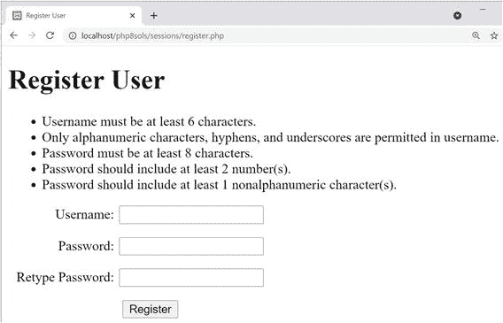

尝试各种测试，以确保您的验证代码正常工作。

如果你有问题，将你的代码与`ch11`文件夹中的`register_user_csv_01.php`和`register_04.php`进行比较。

假设您的代码正在运行，您已经准备好创建脚本的注册部分了。让我们停下来考虑一下主脚本需要做什么。首先，你需要散列密码。然后，在将详细信息写入 CSV 文件之前，您必须检查用户名是否唯一。这就出现了一个关于使用`fopen()`的模式的问题。

Note

第 [7 章](07.html)中描述了各种`fopen()`模式。

理想情况下，您希望内部指针位于文件的开头，这样您就可以遍历现有的记录。`r+`模式会这样做，但是除非文件已经存在，否则操作会失败。您不能使用`w+`，因为它会删除现有内容。您也不能使用`x+`，因为如果同名文件已经存在，它将失败。

这使得`a+`和`c+`成为唯一具有所需灵活性的选项:两者都在必要时创建文件，并允许您读写。它们的不同之处在于当你打开文件时内部指针放在哪里:`a+`把它放在末尾，而`c+`把它放在开头。这使得`c+`在检查现有记录时更有用，但是`a+`的优势在于总是在文件末尾追加新内容。这避免了意外覆盖现有值的危险。我们将以`a+`模式打开 CSV 文件。

第一次运行脚本时，文件是空的(因为`filesize()`函数返回`0`，所以可以看出这一点)，所以可以继续使用`fputcsv()`编写细节。这是`fgetcsv()`的对应物，在第 [7](07.html) 章有描述。`fgetcsv()`从 CSV 文件中一次提取一行数据，`fputcsv()`创建一个 CSV 记录。它有两个必需的参数:文件引用和作为 CSV 记录插入的值数组。它还接受可选参数来设置分隔符和包围字符(参见在线文档 [`www.php.net/manual/en/function.fputcsv.php`](http://www.php.net/manual/en/function.fputcsv.php) )。

如果`filesize()`没有返回`0`，你需要重置内部指针并遍历记录来查看用户名是否已经注册。如果有匹配，就跳出循环并准备一条错误消息。如果在循环结束时没有匹配，您知道这是一个需要添加到文件中的新用户名。现在你已经理解了剧本的流程，你可以把它插入到`register_user_csv.php`中了。

1.  在`register_user_csv.php`的底部添加以下代码:

    ```php
    if (!$errors) {
        // hash password using default algorithm
        $password = password_hash($password, PASSWORD_DEFAULT);
        // open the file in append mode
        $file = fopen($userfile, 'a+');
        // if filesize is zero, no names yet registered
        // so just write the username and password to file as CSV
        if (filesize($userfile) === 0) {
            fputcsv($file, [$username, $password]);
            $result = "$username registered.";
        } else {
            // if filesize is greater than zero, check username first
            // move internal pointer to beginning of file
            rewind($file);
            // loop through file one line at a time
            while (!feof($file)) {
                $data = fgetcsv($file);
                // skip empty lines
            if (!$data) continue;
                if ($data[0] == $username) {
                    $result = "$username taken - choose a different username.";
                    break;
                }
            }
            // if $result not set, username is OK
            if (!isset($result)) {
                // insert new CSV record
                fputcsv($file, [$username, $password]);
                $result = "$username registered.";
            }
            // close the file
            fclose($file);
        }
    }

    ```

前面的解释和行内注释应该有助于您理解这个脚本。

1.  注册脚本将结果存储在`$result`或`$errors`数组中。修改`register.php`主体中的代码以显示结果或错误消息，如下所示:

    ```php
                  <?php
             if (isset($errors) || isset($result)) {
                 echo '<ul>';
                      if (empty($errors)) {
                          echo "<li>$result</li>";
                      } else {
                          foreach ($errors as $error) {
                              echo "<li>$error</li>";
                          }
                      }
                 echo '</ul>';
             }
    ?>

    ```

这将`$result`的值显示为单个项目符号项。否则，如果不为空，它将遍历`$errors`数组。

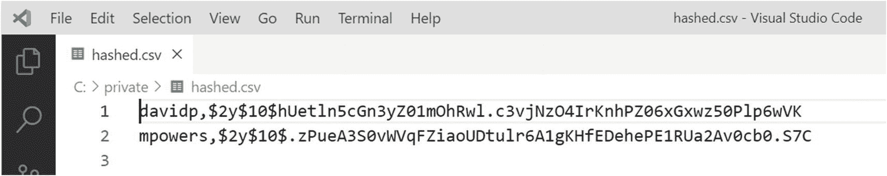

图 11-4

使用 salt 会产生相同密码的完全不同的散列

1.  保存`register_user_csv.php`和`register.php`并测试注册系统。尝试多次注册同一个用户名。您应该会看到一条消息，通知您该用户名已被占用，并要求您选择另一个用户名。

2.  打开`hashed.csv`。您应该看到纯文本的用户名，但密码应该已经过哈希处理。即使您为两个不同的用户选择相同的密码，哈希版本也是不同的，因为在加密之前，`password_hash()`会在密码中添加一个随机值，称为 **salt** 。图 [11-4](#Fig4) 显示了两个用户都用密码`chapter11*`注册。

如有必要，对照`ch11`文件夹中的`register_user_csv_02.php`和`register_05.php`检查您的代码。

Tip

`register_user_csv.php`中的大部分代码都是通用的。要将它用于任何注册表，您只需在包含它之前定义`$username`、`$password`、`$retyped`和`$userfile`，并使用`$errors`和`$result`捕获结果。您可能需要对外部文件进行的唯一更改是设置用户名中的最小字符数和设置密码强度的参数。这些设置是在文件的顶部定义的，所以很容易访问和调整。

#### 使用 password_verify()检查散列密码

`password_verify()`函数做的正是您所期望的:它验证用`password_hash()`散列的密码。它只需要两个参数，提交的密码和散列版本。如果提交的密码正确，函数返回`true`。否则返回`false`。

#### PHP 解决方案 11-5:构建登录页面

这个 PHP 解决方案展示了如何通过`post`方法提交用户名和密码，然后对照存储在外部文本文件中的值检查提交的值。如果找到匹配，脚本会设置一个会话变量，然后将用户重定向到另一个页面。

1.  在`sessions`文件夹中创建一个名为`login.php`的文件，然后插入一个带有用户名和密码文本输入字段的表单，以及一个名为`login`的提交按钮，就像这样(或者，使用`ch11`文件夹中的`login_01.php`):

    ```php
    <form method="post" action="login.php">
        <p>
            <label for="username">Username:</label>
            <input type="text" name="username" id="username">
        </p>
        <p>
            <label for="pwd">Password:</label>
            <input type="password" name="pwd" id="pwd">
        </p>
        <p>
            <input name="login" type="submit" value="Log in">
        </p>
    </form>

    ```

这是一个简单的形式，没有什么花哨:

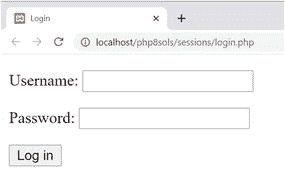

1.  在 PHP 块中的`DOCTYPE`声明上方添加以下代码:

    ```php
    $error = '';
    if (isset($_POST['login'])) {
        session_start();
        $username = $_POST['username'];
        $password = $_POST['pwd'];
        // location of usernames and passwords
        $userlist = 'C:/private/hashed.csv';
        // location to redirect on success
        $redirect = 'http://localhost/php8sols/sessions/menu.php';
        require_once '../includes/authenticate.php';
    }

    ```

这将名为`$error`的变量初始化为空字符串。如果登录失败，这将用于显示一条错误消息，通知用户失败的原因。

条件语句然后检查`$_POST`数组是否包含名为`login`的元素。如果是，则表单已经提交，花括号内的代码启动一个 PHP 会话，并将通过`$_POST`数组传递的值存储在`$username`和`$password`中。然后创建`$userlist`，它定义了包含注册用户名和密码的文件的位置，以及`$redirect`，用户成功登录后将被发送到的页面的 URL。

最后，条件语句中的代码包括`authenticate.php`，接下来您将创建它。

Note

调整`$userlist`的值，以匹配您自己设置中的位置。

1.  在`includes`文件夹中创建一个名为`authenticate.php`的文件。它将只包含 PHP 代码，所以去掉脚本编辑器插入的任何 HTML，并插入以下代码:

    ```php
    <?php
    if (!file_exists($userlist) || !is_readable($userlist)) {
        $error = 'Login facility unavailable. Please try later.';
    } else {
        $file = fopen($userlist, 'r');
        while (!feof($file)) {
            $data = fgetcsv($file);
            // ignore if the first element is empty
            if (empty($data[0])) {
                continue;
            }
            // if username and password match, create session variable,
            // regenerate the session ID, and break out of the loop
            if ($data[0] == $username && password_verify($password, $data[1])) {
                $_SESSION['authenticated'] = 'Jethro Tull';
                session_regenerate_id();
                break;
            }
        }
        fclose($file);
    }

    ```

这改编了你在 PHP 解决方案 7-2 的`getcsv.php`中使用的代码。条件语句检查不存在的文件或无法读取的文件。如果`$userlist`有问题，会立即创建错误消息。

否则，`else`块中的主代码通过以读取模式打开文件并使用`fgetcsv()`函数返回每行数据的数组来提取 CSV 文件的内容。包含用户名和散列密码的 CSV 文件没有列标题，因此 while 循环检查每一行中的数据。

如果`$data[0]`是`empty`，很可能意味着当前行是空白的，所以跳过。

每行的第一个数组元素`($data[0]`包含存储的用户名。它与提交的值`$username`进行比较。

通过登录表单提交的密码存储在`$password`中，哈希版本存储在`$data[1]`中。两者都作为参数传递给`password_verify()`，如果匹配，它返回`true`。

如果用户名和密码都匹配，脚本会创建一个名为`$_SESSION['authenticated']`的变量，并将其命名为 20 世纪 70 年代一个伟大的民谣摇滚乐队的名字。这两者都没有什么魔力(除了杰斯洛·图尔的音乐)；我已经任意选择了变量的名称和值。重要的是创建了一个会话变量。一旦发现匹配，就重新生成会话 ID，并且`break`退出循环。

1.  如果登录成功，`header()`函数需要将用户重定向到`$redirect`中存储的 URL，然后退出脚本。否则，需要创建一条错误消息，通知用户登录失败。完整的脚本如下所示:

    ```php
    <?php
    if (!file_exists($userlist) || !is_readable($userlist)) {
        $error = 'Login facility unavailable. Please try later.';
    } else {
        $file = fopen($userlist, 'r');
        while (!feof($file)) {
            $data = fgetcsv($file);
            // ignore if the first element is empty
            if (empty($data[0])) {
                continue;
            }
            // if username and password match, create session variable,
            // regenerate the session ID, and break out of the loop
            if ($data[0] == $username && password_verify($password, $data[1])) {
                $_SESSION['authenticated'] = 'Jethro Tull';
                session_regenerate_id();
                break;
            }
        }
        fclose($file);
        // if the session variable has been set, redirect
        if (isset($_SESSION['authenticated'])) {
            header("Location: $redirect");
            exit;
        } else {
            $error = 'Invalid username or password.';
        }

    ```

1.  在`login.php`中，在开始的`<body>`标签后添加以下短代码块，以显示任何错误消息:

```php
}

```

```php
<body>

```

```php
<?php
if ($error) {
    echo "<p>$error</p>";
}
?>
<form method="post" action="login.php">

```

完整的代码在`ch11`文件夹的`authenticate.php`和`login_02.php`中。在测试`login.php`之前，您需要创建`menu.php`，并使用会话限制访问。

#### PHP 解决方案 11-6:通过会话限制对页面的访问

这个 PHP 解决方案演示了如何通过检查会话变量的存在来限制对页面的访问，该变量指示用户的凭证已经过身份验证。如果变量没有被设置，`header()`函数将用户重定向到登录页面。

1.  在`sessions`文件夹中创建两个名为`menu.php`和`secretpage.php`的页面。它们包含什么并不重要，只要它们相互链接。或者，使用`ch11`文件夹中的`menu_01.php`和`secretpage_01.php`。

2.  通过在`DOCTYPE`声明上方插入以下内容来保护对每个页面的访问:

    ```php
    <?php
    session_start();
    // if session variable not set, redirect to login page
    if (!isset($_SESSION['authenticated'])) {
        header('Location: http://localhost/php8sols/sessions/login.php');
        exit;
    }
    ?>

    ```

启动会话后，脚本检查是否设置了`$_SESSION['authenticated']`。如果没有，它将用户重定向到`login.php`并退出。仅此而已！该脚本不需要知道`$_SESSION['authenticated']`的值，尽管您可以通过如下修改第 4 行来加倍确保:

```php
             if (!isset($_SESSION['authenticated']) || $_SESSION['authenticated']
                 != 'Jethro Tull')  {

```

现在，如果`$_SESSION['authenticated']`的值不正确，也会拒绝访问者。

1.  保存`menu.php`和`secretpage.php`，然后尝试将它们加载到浏览器中。你应该总是被重定向到`login.php`。

2.  在`login.php`中输入您在`hashed.csv`中注册的有效用户名和密码(值区分大小写)，然后点击`Log in`。您应该会立即被重定向到`menu.php`，到`secretpage.php`的链接也应该可以工作。

你可以对照`ch11`文件夹中的`menu_02.php`和`secretpage_02.php`来检查你的代码。

要保护站点上的任何页面，您只需在步骤 2 中的`DOCTYPE`声明上方添加八行代码。

#### PHP 解决方案 11-7:创建一个可重用的注销按钮

除了登录到站点，用户还应该能够注销。这个 PHP 解决方案展示了如何创建一个可以插入任何页面的注销按钮。

继续使用上一节中的文件。

1.  通过插入以下表单，在`menu.php`的`<body>`中创建一个注销按钮:

    ```php
    <form method="post">
        <input name="logout" type="submit" value="Log out">
    </form>

    ```

该页面应该类似于下面的屏幕截图:

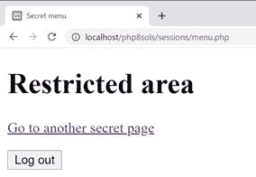

1.  现在，您需要添加单击 logout 按钮时运行的脚本。像这样修改`DOCTYPE`声明上面的代码(代码在`menu_02.php`):

    ```php
    <?php
    session_start();
    // if session variable not set, redirect to login page
    if (!isset($_SESSION['authenticated'])) {
        header('Location: http://localhost/php8sols/sessions/login.php');
        exit;
    }
    // run this script only if the logout button has been clicked
    if (isset($_POST['logout'])) {
        // empty the $_SESSION array
        $_SESSION = [];
        // invalidate the session cookie
        if (isset($_COOKIE[session_name()])) {
            setcookie(session_name(), '', time()-86400, '/');
        }
        // end session and redirect
        session_destroy();
        header('Location: http://localhost/php8sols/sessions/login.php');
        exit;
    }
    ?>

    ```

这与本章前面的“销毁会话”中的代码相同。唯一的区别是它被包含在一个条件语句中，所以它只在点击 logout 按钮时运行，并使用`header()`将用户重定向到`login.php`。

1.  保存`menu.php`并点击退出测试。您应该被重定向到`login.php`。任何返回`menu.php`或`secretpage.php`的尝试都会把你带回`login.php`。

2.  你可以把相同的代码放在每个受限页面中，但是 PHP 是为了节省工作，而不是制造工作。将它转换成包含文件是有意义的。在`includes`文件夹中创建一个名为`logout.php`的新文件。将步骤 1 和 2 中的新代码剪切并粘贴到新文件中，就像这样(它在`ch11`文件夹的`logout.php`中):

    ```php
    <?php
    // run this script only if the logout button has been clicked
    if (isset($_POST['logout'])) {
        // empty the $_SESSION array
        $_SESSION = array();
        // invalidate the session cookie
        if (isset($_COOKIE[session_name()])) {
            setcookie(session_name(), ", time()-86400, '/');
        }
        // end session and redirect
        session_destroy();
        header('Location: http://localhost/php8sols/sessions/login.php');
        exit;
    }
    ?>
    <form method="post">
        <input name="logout" type="submit" value="Log out">
    </form>

    ```

因为表单将包含在不同的页面中，所以不能将`action`属性设置为特定的页面。然而，省略它只会导致当前页面被重新加载，因此注销脚本将在包含`logout.php`的每个页面中可用。

1.  在`menu.php`中剪切表单代码的同一点，包含新文件，如下所示:

```php
<?php include '../includes/logout.php'; ?>

```

像这样包含来自外部文件的代码意味着在调用`setcookie()`和`header()`之前会有输出到浏览器。所以你需要缓冲输出，如 PHP 解决方案 11-2 所示。

1.  在调用`menu.php`顶部的`session_start()`后立即添加`ob_start();`。没必要用`ob_end_flush()`或者`ob_end_clean()`。如果您还没有明确地这样做，PHP 会在脚本结束时自动刷新缓冲区。

2.  保存`menu.php`并测试页面。它的外观和工作方式应该和以前完全一样。

3.  用`secretpage.php`重复步骤 5 和 6。您现在有了一个简单的、可重复使用的注销按钮，它可以合并到任何受限页面中。

您可以对照`ch11`文件夹中的`menu_04.php`、`secretpage_03.php`和`logout.php`来检查您的代码。

PHP 解决方案 11-3 到 11-7 构建了一个简单而有效的用户认证系统，不需要数据库后端。然而，它也有其局限性。最重要的是，包含用户名和密码的 CSV 文件必须位于服务器根目录之外。此外，一旦获得了多条记录，查询数据库通常比逐行遍历 CSV 文件要快得多。第 [19](19.html) 章介绍了数据库的用户认证。

#### 保持哈希算法最新

使用`password_hash()`和`password_verify()`的主要优势是它们被设计来跟上密码学的发展。使用`PASSWORD_DEFAULT`作为`password_hash()`的第二个参数，而不是指定特定的散列算法，可以确保新注册总是使用当时认为最安全的方法。即使缺省值改变了，现有的密码仍然可以通过`password_verify()`函数进行验证，因为散列密码包含识别其散列方式的信息。

还有一个名为`password_needs_rehash()`的函数，它检查散列密码是否需要更新到当前标准。它是为用户登录网站时使用而设计的。下面的代码假设提交的密码存储在`$password`中，哈希密码存储在`$hashed`中，并且您使用的是 PHP 默认的哈希方法:

```php
if (password_verify($password, $hashed) {
    if (password_needs_rehash($hashed, PASSWORD_DEFAULT)) {
        $hashed = password_hash($password, PASSWORD_DEFAULT);
        // store the updated version of $hashed
    }
}

```

每次用户登录时都执行这种检查是否过分值得商榷。PHP 的策略是仅在完整版本(如 8.1.0 或 8.2.0)时更改默认加密。唯一的例外是在紧急情况下，当在当前缺省值中发现严重的安全缺陷时。如果您紧跟 PHP 的发展，您可以创建一个脚本，每当缺省值发生变化时，它可以在一个操作中更新所有存储的密码。然而，在大多数服务器上，每次有人登录时使用`password_needs_rehash()`的速度快得令人难以察觉，并且可能值得添加到您的登录例程中，以保证您的站点安全。

## 为会话设置时间限制

默认情况下，PHP 将用户计算机上的会话 cookie 的生存期设置为 0，这将使会话保持活动状态，直到用户注销或浏览器关闭。您可以通过调用`ini_set()`使会话提前超时，这个函数允许您动态地更改一些 PHP 配置指令。会话一启动，就将指令`session.cookie_lifetime`作为第一个参数传递，并将包含您希望 cookie 保持活动状态的秒数的字符串作为第二个参数传递。例如，您可以将会话 cookie 的生存期限制为 10 分钟，如下所示:

```php
session_start();
ini_set('session.cookie_lifetime', '600');

```

虽然这是有效的，但它有两个缺点。首先，过期时间是相对于服务器上的时间设置的，而不是用户计算机上的时间。如果用户的计算机时钟不正确，cookie 可能会立即过期，或者它可能会比您预期的时间长得多。另一个问题是，用户可能会被自动注销，而没有任何解释。下一个 PHP 解决方案提供了一种更加用户友好的方法。

### PHP 解决方案 11-8:在一段时间不活动后结束会话

这个 PHP 解决方案展示了如果用户在指定时间内没有做任何触发页面加载的事情，如何结束会话。当会话首次启动时，通常是用户登录时，当前时间存储在会话变量中。每次用户加载页面时，会话变量都会与当前时间进行比较。如果差值大于预定的限制，会话及其变量将被销毁。否则，变量将更新为当前时间。

这些说明假设您已经在 PHP 解决方案 11-3 到 11-7 中设置了登录系统。

1.  您需要在用户凭证通过身份验证之后、脚本将用户重定向到站点的受限部分之前存储当前时间。在`authenticate.php`(第 14-18 行周围)中找到以下代码段，并插入以粗体突出显示的新代码，如下所示:

    ```php
    if ($data[0] == $username && password_verify($password, $data[1])) {
        $_SESSION['authenticated'] = 'Jethro Tull';
        $_SESSION['start'] = time();
        session_regenerate_id();
        break;
    }

    ```

    `time()`函数返回当前时间戳。通过存储在`$_SESSION['start']`中，以`session_start()`开头的每一页都可以使用它。

2.  当一个会话超时时，毫不客气地将用户退回到登录屏幕是不友好的，所以解释一下发生了什么是个好主意。在`login.php`中，将粗体突出显示的代码添加到 PHP 块中，紧跟在开始的`<body>`标签之后(在第 22–27 行周围):

    ```php
    <?php
    if ($error) {
        echo "<p>$error</p>";
    } elseif (isset($_GET['expired'])) { ?>
        <p>Your session has expired. Please log in again.</p>
    <?php } ?>

    ```

如果 URL 在查询字符串中包含名为`expired`的参数，则会显示该消息。

1.  打开`menu.php`，剪切`DOCTYPE`声明上方 PHP 块中的代码，粘贴到一个新的空白文件中。

2.  将文件另存为`includes`文件夹中的`session_timeout.php`，然后编辑如下代码:

    ```php
    <?php
    session_start();
    ob_start();
    // set a time limit in seconds
    $timelimit = 15;
    // get the current time
    $now = time();
    // where to redirect if rejected
    $redirect = 'http://localhost/php8sols/sessions/login.php';
    // if session variable not set, redirect to login page
    if (!isset($_SESSION['authenticated'])) {
        header("Location: $redirect");
        exit;
    } elseif ($now > $_SESSION['start'] + $timelimit) {
        // if timelimit has expired, destroy session and redirect
        $_SESSION = [];
        // invalidate the session cookie
        if (isset($_COOKIE[session_name()])) {
            setcookie(session_name(), '', time()-86400, '/');
        }
        // end session and redirect with query string
        session_destroy();
        header("Location: {$redirect}?expired=yes");
        exit;
    } else {
        // if it's got this far, it's OK, so update start time
        $_SESSION['start'] = time();
    }

    ```

行内注释解释了正在发生的事情，你应该认识 PHP 解决方案 11-5 中的大部分`elseif`子句。PHP 以秒为单位测量时间，我将`$timelimit`(第 5 行)设置为可笑的 15 秒，纯粹是为了演示效果。要设置一个更合理的限制，比如说 15 分钟，稍后再更改，就像这样:

```php
$timelimit = 15 * 60; // 15 minutes

```

当然，您可以将`$timelimit`设置为`900`，但是当 PHP 可以为您完成这项艰巨的工作时，为什么还要麻烦呢？

如果`$_SESSION['start']`加上`$timelimit`的总和小于当前时间(存储为`$now`，您将结束会话并将用户重定向到登录页面。执行重定向的代码行将查询字符串添加到 URL 的末尾，如下所示:

```php
http://localhost/php8sols/sessions/login.php?expired=yes

```

步骤 2 中的代码没有注意到`expired`的值；添加`yes`作为值只是让它在浏览器地址栏看起来更人性化。

如果脚本到达了最后的`else`，这意味着`$_SESSION ['authenticated']`已经被设置，时间限制还没有到，所以`$_SESSION['start']`被更新为当前时间，页面正常显示。

1.  在`menu.php`中的`DOCTYPE`声明上包含`session_timeout.php`。include 命令应该是 PHP 块中唯一的代码:

    ```php
    <?php require_once '../includes/session_timeout.php'; ?>
    <!DOCTYPE HTML>

    ```

2.  用同样的方法替换`secretpage.php`中`DOCTYPE`声明上面的代码。

3.  保存您编辑的所有页面，并将`menu.php`或`secretpage.php`加载到浏览器中。如果页面显示，请单击“注销”。然后重新登录，在`menu.php`和`secretpage.php`之间来回导航。一旦您确认链接有效，等待 15 秒或更长时间，并尝试导航回另一个页面。您应该会自动注销，并出现以下屏幕:

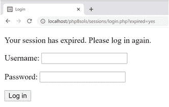

如有必要，对照`ch11`文件夹中的`authenticate_02.php`、`login_04.php`、`session_timeout.php`、`menu_05.php`和`secretpage_04.php`检查您的代码。

## 通过多页表单传递信息

通过`$_POST`和`$_GET`数组传递的变量只有短暂的存在。一旦它们被传递到页面，它们就消失了，除非你以某种方式保存它们的值。保存从一种形式传递到另一种形式的信息的一种常见方法是从`$_POST`数组中提取其值，并将其存储在 HTML 中的一个隐藏字段中，如下所示:

```php
<input type="hidden" name="address" id="address" value="<?= htmlentities($_POST['address']) ?>">

```

顾名思义，隐藏字段是表单代码的一部分，但不会显示在屏幕上。对于一两个项目，隐藏字段是可以的，但是假设您有一个超过四页的调查。如果一个页面上有 10 个项目，那么总共需要 60 个隐藏字段(第二页 10 个，第三页 20 个，第四页 30 个)。会话变量可以节省你所有的编码。他们还可以确保访问者总是从多页表单的正确页面开始。

### PHP 解决方案 11-9:为多页表单使用会话

在这个 PHP 解决方案中，您将构建一个用于多页面表单的脚本，该脚本从`$_POST`数组收集数据并将其分配给会话变量。如果试图首先访问表单的任何其他部分，该脚本会自动将用户重定向到表单的第一页。

1.  将`multiple_01.php`、`multiple_02.php`、`multiple_03.php`和`multiple_04.php`从`ch11`文件夹复制到`sessions`文件夹。前三页包含简单的表单，要求用户输入姓名、年龄和地址。每个`<form>`标签的`action`属性被设置为当前页面，所以表单是自处理的，但是它们还不包含任何处理脚本。前三页的数据最终将显示在最后一页。

2.  在`multiple_01.php`中的`DOCTYPE`声明上方的 PHP 块中添加以下代码:

    ```php
    if (isset($_POST['next'])) {
        session_start();
        // set a variable to control access to other pages
        $_SESSION['formStarted'] = true;
        // set required fields
        $required = 'first_name';
        $firstPage = 'multiple_01.php';
        $nextPage = 'multiple_02.php';
        $submit = 'next';
        require_once '../includes/multiform.php';
    }

    ```

    提交按钮的`name`属性是`next`，所以这个块中的代码只有在表单提交后才会运行。它启动一个会话并创建一个会话变量，该变量将用于控制对其他表单页面的访问。

    接下来是处理多页表单的脚本将使用的四个变量:

    *   `$required`:这是当前页面中必填字段的`name`属性的数组。如果只需要一个字段，可以用字符串代替数组。如果不需要字段，可以省略。

    *   `$firstPage`:表格第一页的文件名。

    *   `$nextPage`:表格下一页的文件名。

    *   `$submit`:当前页面中提交按钮的名称。

最后，代码包括处理多页表单的脚本。

1.  在`includes`文件夹中创建一个名为`multiform.php`的文件。删除所有 HTML 标记，并插入以下代码:

    ```php
    <?php
    if (!isset($_SESSION)) {
        session_start();
    }
    $filename = basename($_SERVER['SCRIPT_FILENAME']);
    $current = 'http://' . $_SERVER['HTTP_HOST'] .
         $_SERVER['PHP_SELF'];

    ```

multipage 表单的每一页都需要调用`session_start()`，但是在同一个页面上调用两次会产生错误，所以条件语句首先检查`$_SESSION`超全局变量是否可访问。如果不是，它将启动该页面的会话。

在条件语句之后，`$_SERVER['SCRIPT_FILENAME']`被传递给`basename()`函数来提取当前页面的文件名。这和你在 PHP 解决方案 5-3 中使用的技术是一样的。

`$_SERVER['SCRIPT_FILENAME']`包含了父文件的路径，所以当这个脚本包含在`multiple_01.php`中时，`$filename`的值将是`multiple_01.php`，*而不是* `multiform.php`。

下一行从字符串`http://`和包含当前域名的`$_SERVER['HTTP_HOST']`值以及包含当前文件路径减去域名的`$_SERVER['PHP_SELF']`值构建当前页面的 URL。如果您在本地测试，当多页表单的第一页加载时，`$current`是`http://localhost/php8sols/sessions/multiple_01.php`。

1.  现在您已经有了当前文件的名称和它的 URL，您可以使用`str_replace()`来创建第一页和下一页的 URL，如下所示:

```php
 $redirectFirst = str_replace($filename, $firstPage, $current);
$redirectNext = str_replace($filename, $nextPage, $current);

```

第一个参数是要替换的字符串，第二个是替换字符串，第三个是目标字符串。在第二步中，你将`$firstPage`设置为`multiple_01.php`，将`$nextPage`设置为`multiple_02.php`。结果，`$redirectFirst`变成了`http://localhost/php8sols/sessions/multiple_01.php`，而`$redirectNext`就是`http://localhost/php8sols/sessions/multiple_02.php`。

1.  为了防止用户在没有从头开始的情况下访问多页表单，添加一个条件语句来检查`$filename`的值。如果与第一页不同，并且还没有创建`$_SESSION['formStarted']`，那么`header()`函数将重定向到第一页，如下所示:

    ```php
    if ($filename != $firstPage && !isset($_SESSION['formStarted'])) {
        header("Location: $redirectFirst");
        exit;
    }

    ```

2.  脚本的其余部分遍历`$_POST`数组，检查空白的必填字段，并将它们添加到`$missing`数组中。如果没有遗漏任何内容，`header()`函数会将用户重定向到多页表单的下一页。`multiform.php`的完整脚本如下所示:

    ```php
    <?php
    if (!isset($_SESSION)) {
        session_start();
    }
    $filename = basename($_SERVER['SCRIPT_FILENAME']);
    $current = 'http://' . $_SERVER['HTTP_HOST'] .
        $_SERVER['PHP_SELF'];
    $redirectFirst = str_replace($filename, $firstPage, $current);
    $redirectNext = str_replace($filename, $nextPage, $current);
    if ($filename != $firstPage && !isset($_SESSION['formStarted'])) {
        header("Location: $redirectFirst");
        exit;
    }
    if (isset($_POST[$submit])) {
        // create empty array for any missing fields
        $missing = [];
        // create $required array if not set
        if (!isset($required)) {
            $required = [];
        } else {
            // using casting operator to turn single string to array
            $required = (array) $required;
        }
        // process the $_POST variables and save them in the $_SESSION array
        foreach ($_POST as $key => $value) {
            // skip submit button
            if ($key == $submit) continue;
            // strip whitespace if not an array
            if (!is_array($value)) {
                $value = trim($value);
            }
            // if empty and required, add to $missing array
            if (in_array($key, $required) && empty($value)) {
                $missing[] = $key;
                continue;
            }
            // otherwise, assign to a session variable of the same name as $key
            $_SESSION[$key] = $value;
        }
        // if no required fields are missing, redirect to next page
        if (!$missing) {
            header("Location: $redirectNext");
            exit;
        }
    }

    ```

代码与第六章中处理反馈表的代码非常相似，所以行内注释应该足以解释它是如何工作的。包装在新代码周围的条件语句使用`$_POST[$submit]`来检查表单是否已经提交。为了使代码更加灵活，我使用了一个变量，而不是硬编码 Submit 按钮的名称。虽然这个脚本只在表单提交后才包含在第一页中，但是它直接包含在其他页面中，所以有必要在这里添加条件语句。

提交按钮的名称和值总是包含在`$_POST`数组中，所以如果关键字与提交按钮的名称相同，`foreach`循环使用`continue`关键字跳到下一项。这避免了将不需要的值添加到`$_SESSION`数组中。关于`continue`的描述，参见第 [4](04.html) 章中的“跳出循环”。

1.  在`multiple_02.php`中的`DOCTYPE`声明上方的 PHP 块中添加以下代码:

    ```php
    $firstPage = 'multiple_01.php';
    $nextPage = 'multiple_03.php';
    $submit = 'next';
    require_once '../includes/multiform.php';

    ```

这将设置`$firstPage`、`$nextPage`和`$submit`的值，并包括您刚刚创建的处理脚本。这个页面上的表单只包含一个可选字段，所以不需要`$required`变量。如果主页中没有设置空数组，处理脚本会自动创建一个空数组。

1.  在`multiple_03.php`中，在`DOCTYPE`声明上方的 PHP 代码块中添加以下内容:

    ```php
    // set required fields
    $required = ['city', 'country'];
    $firstPage = 'multiple_01.php';
    $nextPage = 'multiple_04.php';
    $submit = 'next';
    require_once '../includes/multiform.php';

    ```

两个字段是必需的，因此它们的`name`属性被列为一个数组，并被分配给`$required`。其他代码与上一页中的相同。

1.  在`multiple_01.php`、`multiple_02.php`和`multiple_03.php`中的`<form>`标签上方添加以下代码:

    ```php
    <?php if (isset($missing)) { ?>
    <p> Please fix the following required fields:</p>
        <ul>
        <?php
        foreach ($missing as $item) {
            echo "<li>$item</li>";
        }
        ?>
        </ul>
    <?php } ?>

    ```

这将显示尚未填写的必填项列表。

1.  在`multiple_04.php`中，在`DOCTYPE`声明上方的 PHP 块中添加以下代码，以便在用户没有从第一页进入表单时将用户重定向到第一页:

    ```php
    session_start();
    if (!isset($_SESSION['formStarted'])) {
        header('Location: http://localhost/php8sols/sessions/multiple_01.php');
        exit;
    }

    ```

2.  在页面正文中，将以下代码添加到无序列表中以显示结果:

    ```php
    <ul>
    <?php
    $expected = ['first_name', 'family_name', 'age',
                 'address', 'city', 'country'];
    // unset the formStarted variable
    unset($_SESSION['formStarted']);
    foreach ($expected as $key) {
        echo "<li>$key: " . htmlentities($_SESSION[$key] ) . '</li>';
        // unset the session variable
        unset($_SESSION[$key]);
    }
    ?>
    </ul>

    ```

这将表单域的`name`属性列为一个数组，并将该数组分配给`$expected`。这是一种安全措施，确保您不会处理可能被恶意用户注入到`$_POST`数组中的假值。

然后，代码重置`$_SESSION['formStarted']`并循环遍历`$expected`数组，使用每个值来访问`$_SESSION`数组的相关元素，并将其显示在无序列表中。然后，会话变量被删除。单独删除会话变量不会影响任何其他与会话相关的信息。

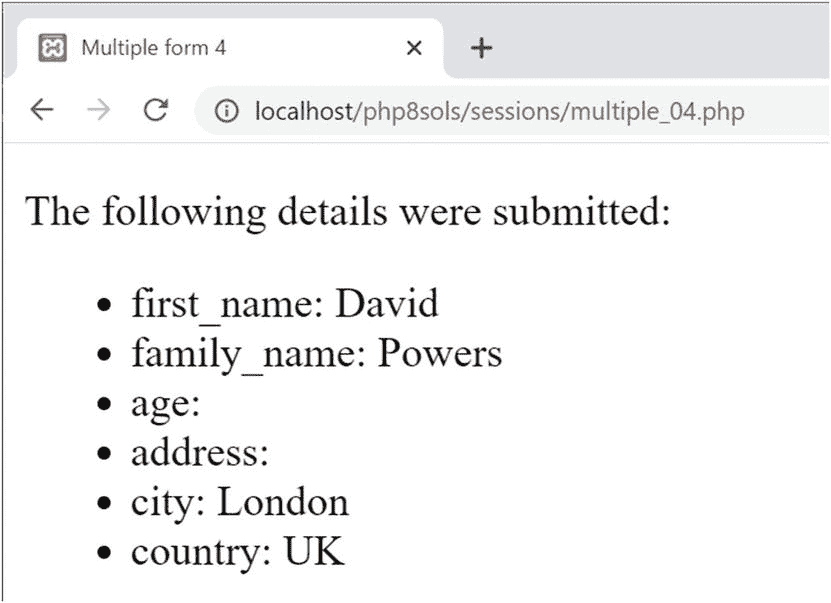

图 11-5

会话变量保存了来自多个页面的输入

1.  保存所有页面，然后尝试将表单的中间页面或最后一个页面加载到浏览器中。你应该被带到第一页。单击下一步，不填写任何字段。您将被要求填写`first_name`字段。填写必填字段，然后单击每页上的下一步。结果应显示在最终页面上，如图 [11-5](#Fig5) 所示。

您可以对照`ch11`文件夹中的`multiple_01_done.php`、`multiple_02_done.php`、`multiple_03_done.php`、`multiple_04_done.php`和`multiform.php`来检查您的代码。

这只是一个多页表单的简单演示。在真实的应用中，当必填字段留空时，您需要保留用户输入。

通过在表单提交后的第一页上创建`$_SESSION['formStarted']`，并在每页上使用`$required`、`$firstPage`、`$nextPage`和`$submit`，可以将`multiform.php`中的脚本用于任何多页表单。使用`$missing`数组处理未填写的必填字段。

## 第三章回顾

如果你开始阅读这本书时对 PHP 知之甚少或一无所知，那么你就不再是初学者了，而是在许多有用的方面利用了 PHP 的力量。希望到现在为止，您已经开始意识到相同或相似的技术会一次又一次地出现。不要只是复制代码，你应该开始认识到你可以适应你的需求的技术，然后自己去试验。

本书的其余部分继续建立在您的知识基础上，但引入了一个新的因素:MySQL 关系数据库(及其替代产品 MariaDB)，它将使您的 PHP 技能达到一个更高的水平。下一章将介绍 MySQL，并向您展示如何为后面的章节设置它。