# 13.用 PHP 和 SQL 连接到数据库

PHP 8 提供了两种连接和交互 MySQL 数据库的方式:MySQL 改进版(MySQLi)和 PHP 数据对象(PDO)。您选择哪一个是一个重要的决定，因为它们使用不兼容的代码。您不能在同一个数据库连接中混合使用它们。同样重要的是，不要将 MySQL 与最初的 MySQL 扩展混淆，后者不再受支持。在大多数情况下，MySQLi 函数名称的唯一区别是添加了字母 *i* (例如，`mysqli_query`()而不是`mysql_query()`)。然而，参数的顺序通常是不同的，所以转换一个旧的脚本不仅仅是在函数名中插入一个 *i* 。

顾名思义，MySQL 是专门为与 MySQL 协同工作而设计的。它也完全兼容 MariaDB。另一方面，PDO 是数据库系统中立的。至少在理论上，只需修改几行 PHP 代码，就可以将网站从 MySQL 切换到 Microsoft SQL Server 或不同的数据库系统。实际上，您通常需要至少重写一些 SQL 查询，因为每个数据库供应商都在标准 SQL 的基础上添加了自定义函数。

我个人的偏好是用 PDO；但是为了完整起见，剩下的章节涵盖了 MySQLi 和 PDO。如果你想只关注其中一个，就忽略与另一个相关的部分。尽管您使用 PHP 连接到数据库并存储任何结果，但数据库查询需要用 SQL 编写。本章教你检索存储在表中的信息的基本知识。

在本章中，我们将介绍以下内容:

*   用 MySQL 和 PDO 连接到 MySQL 和 MariaDB

*   计算表中的记录数

*   使用选择查询检索数据并将其显示在网页上

*   使用准备好的语句和其他技术保护数据安全

## 检查您的远程服务器设置

XAMPP 和 MAMP 都支持 MySQLi 和 PDO，但是你需要检查你的远程服务器的 PHP 配置来验证它提供的支持程度。在您的远程服务器上运行`phpinfo()`，向下滚动配置页面，并查找以下部分。它们是按字母顺序排列的，所以您需要向下滚动很长一段距离才能找到它们:

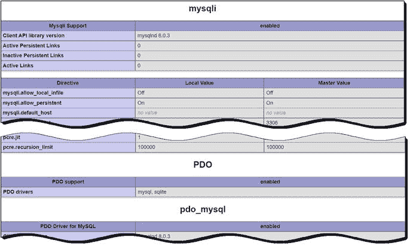

所有托管公司都要有第一节(`mysqli`)。如果只列出了`mysql`(没有最后的 *i* )，那么你的服务器已经过时了。让你的托管公司尽快把你转移到运行最新版本 PHP 8.x 的服务器上(你可以在 [`https://php.net/supported-versions.php`](https://php.net/supported-versions.php) 查看目前支持哪些版本的 PHP)。如果您计划使用 PDO，您不仅需要检查 PDO 是否已启用，还必须确保`pdo_mysql`已列出。PDO 要求每种类型的数据库使用不同的驱动程序。

## PHP 如何与数据库通信

不管你使用 MySQLi 还是 PDO，这个过程总是遵循这个顺序:

1.  使用主机名、用户名、口令和数据库名连接到数据库。

2.  准备一个 SQL 查询。

3.  执行查询并保存结果。

4.  从结果中提取数据(通常使用循环)。

用户名和密码是您在第 [12 章](12.html)中创建的帐户的用户名和密码，或者是您的托管公司给您的帐户的用户名和密码。但是主机名呢？在本地测试环境中，它是`localhost`。令人惊讶的是，即使在远程服务器上也经常是`localhost`。这是因为在许多情况下，数据库服务器与您的网站位于同一服务器上。换句话说，显示页面的 web 服务器和数据库服务器位于彼此的本地。然而，如果数据库服务器在一台单独的机器上，你的主机公司会告诉你使用的地址。重要的一点是，主机名是*而不是*，通常与你网站的域名相同。

让我们快速看一下如何使用每种方法连接到数据库。

### 连接 MySQL 改进的扩展

MySQLi 有两个接口:过程的和面向对象的。过程接口的设计是为了简化从最初的 MySQL 函数的转换。因为面向对象的版本更紧凑，所以这里采用的就是这个版本。

要连接到 MySQL 或 MariaDB，可以通过向构造函数方法传递四个参数来创建一个`mysqli`对象:主机名、用户名、密码和数据库名称。这是您连接到`phpsols`数据库的方式:

```php
$conn = new mysqli($hostname, $username, $password, 'phpsols');

```

这将连接对象存储为`$conn`。

如果您的数据库服务器使用非标准端口，您需要将端口号作为第五个参数传递给`mysqli`构造函数。

Tip

MAMP 使用套接字连接 MySQL，所以即使 MySQL 正在监听端口 8889，也不需要添加端口号。这适用于 MySQLi 和 PDO。

### 连接 PDO

PDO 需要一个稍微不同的方法。最重要的区别是，如果连接失败，PDO 会抛出一个异常。如果您没有捕捉到异常，调试信息会显示所有的连接细节，包括您的用户名和密码。因此，您需要将代码包装在一个`try`块中，并捕捉异常以防止敏感信息被显示。

`PDO`构造函数方法的第一个参数是一个**数据源名称** (DSN)。这是一个由 PDO 驱动程序名称后跟一个冒号，再后跟特定于 PDO 驱动程序的连接详细信息组成的字符串。

要连接到 MySQL 或 MariaDB，DSN 需要采用以下格式:

```php
'mysql:host=hostname;dbname=databaseName'

```

如果您的数据库服务器使用非标准端口，DSN 也应该包含端口号，如下所示:

```php
'mysql:host=hostname;port=portNumber;dbname=databaseName'

```

在 DSN 之后，您将用户名和密码传递给`PDO()`构造函数方法。因此，连接到`phpsols`数据库的代码如下所示:

```php
try {
 $conn = new PDO("mysql:host=$hostname;dbname=phpsols", $username, $password);
} catch (PDOException $e) {
 echo $e->getMessage();
}

```

在测试期间使用`echo`来显示异常产生的消息是可以接受的，但是当你在一个活动的网站上部署脚本时，你需要将用户重定向到一个错误页面，如 PHP 解决方案 5-9 中所述。

Tip

为了连接到不同的数据库系统，DSN 是 PHP 代码中唯一需要修改的部分。所有剩余的 PDO 代码都是完全数据库中立的。有关如何为 PostgreSQL、Microsoft SQL Server、SQLite 和其他数据库系统创建 DSN 的详细信息，请访问 [`www.php.net/manual/en/pdo.drivers.php`](http://www.php.net/manual/en/pdo.drivers.php) 。

### PHP 解决方案 13-1:制作一个可重用的数据库连接器

连接到数据库是一项日常工作，从现在开始需要在每个页面中执行。这个 PHP 解决方案创建了一个存储在连接到数据库的外部文件中的简单函数。它主要是为测试剩余章节中不同的 MySQLi 和 PDO 脚本而设计的，不需要每次都重新输入连接细节，也不需要在不同的连接文件之间切换。

1.  在`includes`文件夹中创建一个名为`connection.php`的文件，并插入以下代码(在`ch13`文件夹中有一份完整脚本的副本):

```php
<?php
function dbConnect($usertype, $connectionType = 'mysqli') {
    $host = 'localhost';
    $db = 'phpsols';
    if ($usertype == 'read') {
        $user = 'psread';
        $pwd = 'K1yoMizu^dera';
    } elseif ($usertype == 'write') {
        $user = 'pswrite';
        $pwd = '0Ch@Nom1$u';
    } else {
        exit('Unrecognized user');
    }
    // Connection code goes here
}

```

该函数有两个参数:用户类型和连接类型。第二个参数默认为`mysqli`。如果您想专注于使用 PDO，请将第二个参数的默认值设置为`pdo`。

函数中的前两行存储了您想要连接的主机服务器和数据库的名称。

条件语句检查第一个参数的值，并根据需要在`psread`和`pswrite`用户名和密码之间切换。如果用户帐户未被识别，`exit()`功能会暂停脚本并显示`Unrecognized user`。

1.  用以下内容替换`Connection code goes here`注释:

```php
if ($connectionType == 'mysqli') {
    $conn = @ new mysqli($host, $user, $pwd, $db);
    if ($conn->connect_error) {
        exit($conn->connect_error);
    }
    return $conn;
} else {
    try {
        return new PDO("mysql:host=$host;dbname=$db", $user, $pwd);
    } catch (PDOException $e) {
        echo $e->getMessage();
    }
}

```

如果第二个参数设置为`mysqli`，就会创建一个名为`$conn`的 MySQLi 连接对象。错误控制运算符(`@`)防止构造函数方法显示错误消息。如果连接失败，原因存储在对象的`connect_error`属性中。如果为空，则被视为`false`，因此跳过下一行，返回`$conn`对象。但是如果有问题，`exit()`会显示`connect_error`的值，并暂停脚本。

否则，该函数返回一个 PDO 连接对象。没有必要在`PDO`构造函数中使用错误控制操作符，因为如果有问题，它会抛出一个`PDOException`。`catch`块使用异常的`getMessage()`方法来显示问题的原因。

Tip

如果您的数据库服务器使用非标准端口，不要忘记将端口号作为第五个参数添加到`mysqli()`构造函数中，并将其包含在 PDO DSN 中，如前面几节所述。如果数据库使用套接字连接，这是不必要的，这在 macOS 和 Linux 上很常见。

1.  在`phpsols`站点根文件夹中创建一个名为`connection_test.php`的文件，并插入以下代码:

```php
<?php
require_once './includes/connection.php';
if ($conn = dbConnect('read')) {
    echo 'Connection successful';
}

```

这包括连接脚本，并用`psread`用户帐户和 MySQLi 进行测试。

1.  保存页面并将其加载到浏览器中。如果你看到`Connection successful`，一切都好。如果收到错误消息，请参考下一节中的故障排除提示。

2.  测试与`pswrite`用户和 MySQLi 的连接:

    ```php
    if ($conn = dbConnect('write')) {
        echo 'Connection successful';
    }

    ```

3.  通过将`'pdo'`作为第二个参数添加到`dbConnect()`来测试 PDO 的两个用户帐户。

4.  假设一切顺利，您就可以开始与`phpsols`数据库交互了。如果您遇到了问题，请查看下一部分。

#### 数据库连接问题疑难解答

连接数据库时最常见的失败原因是用户名或密码错误。密码和用户名区分大小写。仔细检查拼写。例如，下面的截图显示了将`psread`改为`Psread`会发生什么:

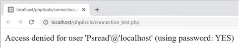

访问被拒绝，因为没有这样的用户。用户名的第一个大写字母非常重要。但是，即使用户名是正确的，您也可能会得到相同的错误消息，如下所示:


这完全让很多人困惑。错误信息确认您正在使用密码。那么，为什么访问被拒绝呢？密码不对。这就是原因。

如果错误信息显示`using password: NO`，这意味着您忘记了提供密码。短语`using password`是问题与登录凭证有关的线索。

如果缺少该短语，则表明存在不同的问题，如下一个屏幕截图所示:

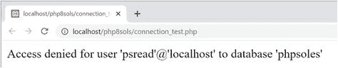

这里的问题是数据库的名称不正确。如果你拼错了主机，你会得到一个消息，没有这样的主机是已知的。

本节截图由 MySQLi 生成。PDO 生成相同的消息，但也包括错误号和代码。

### 净化来自数据库的文本结果

当显示 SQL 查询的结果时，您可以确信存储在某些类型的列中的值将采用特定的格式。例如，数字列类型只能存储数字。类似地，与日期和时间相关的列仅以 ISO 日期-时间格式存储值。然而，与文本相关的列可以存储任何类型的字符串，包括 HTML、JavaScript 和其他可执行代码。当从与文本相关的列中输出值时，您应该始终对它们进行清理，以防止执行任意代码。

净化文本输出的简单方法是将其传递给`htmlspecialchars()`。这个函数与`htmlentities()`相关，但是它将更有限范围的字符转换成等价的 HTML 字符实体。具体来说，它转换&符号、引号和尖括号；但是它保留了句点(点)不变。这具有中和在浏览器中显示代码时执行代码的企图的效果，因为`<script>`和 PHP 标签的尖括号被转换了。重要的是不要转换点，因为它们用在我们想要显示的文件名中。

`htmlspecialchars()`的缺点是，默认情况下，它对现有的字符实体进行双重编码。结果，`&`被转换为`&amp;`。您可以通过将命名参数`double_encode`传递给`htmlspecialchars()`并将其值设置为`false`来关闭这个默认行为。

每次您想要调用`htmlspecialchars()`时，键入指定的参数是乏味的。因此，我在`ch13`文件夹中的一个名为`utility_funcs.php`的文件中定义了以下自定义函数:

```php
function safe($text) {
    return htmlspecialchars($text, double_encode: false);
}

```

这只是将`$text`传递给`htmlspecialchars()`，设置可选参数，并返回结果。将`utility_funcs.php`复制到`includes`文件夹，并将其包含在从数据库输出文本的脚本中。

作为对`htmlspecialchars()`的替代，您可以将文本值传递给`strip_tags()`，这允许您指定允许的 HTML 标签(参见第 [7](07.html) 章中的“访问远程文件”)。

### 查询数据库并显示结果

在尝试显示数据库查询的结果之前，最好先了解有多少个结果。如果没有任何结果，您将没有什么可显示的。这对于创建一个浏览一长串结果的导航系统也是必要的(你将在下一章学习如何做)。在用户认证中(在第 [19 章](19.html)中介绍)，搜索用户名和密码时没有结果意味着登录应该失败。

MySQLi 和 PDO 使用不同的方法来计算和显示结果。接下来的两个 PHP 解决方案展示了如何用 MySQLi 实现这一点。对于 PDO，直接跳到 PHP 解决方案 13-4。

#### PHP 解决方案 13-2:计算结果集中的记录数(MySQLi)

这个 PHP 解决方案展示了如何提交一个 SQL 查询来选择`images`表中的所有记录，并将结果存储在一个`MySQLi_Result`对象中。对象的`num_rows`属性包含查询检索到的记录数。

1.  在`php8sols`站点根目录下创建一个名为`mysqli`的新文件夹，然后在文件夹内创建一个名为`mysqli.php`的新文件。该页面最终将用于显示一个表格，因此它应该有一个`DOCTYPE`声明和一个 HTML 框架。

2.  将连接文件包含在 PHP 块中的`DOCTYPE`声明之上，并使用具有只读权限的帐户连接到`phpsols`数据库，如下所示:

    ```php
    require_once '../includes/connection.php';
    $conn = dbConnect('read');

    ```

3.  接下来，准备 SQL 查询。在前一步之后(但在结束 PHP 标记之前)立即添加以下代码:

```php
$sql = 'SELECT * FROM images';

```

这意味着“从`images`表中选择所有内容”星号(`*`)是“所有列”的简写

1.  现在通过调用 connection 对象上的`query()`方法执行查询，并将 SQL 查询作为参数传递，如下所示:

```php
                  $result = $conn->query($sql);

```

结果存储在一个变量中，我将它富有想象力地命名为`$result`。

1.  如果有问题，`$result`就会是`false`。为了找出问题所在，我们需要获取错误消息，该消息存储为`mysqli`连接对象的`error`属性。在前一行之后添加以下条件语句:

1.  假设没有问题，`$result`现在持有一个`MySQLi_Result`对象，该对象有一个名为`num_rows`的属性。要获得查询找到的记录数，向条件语句添加一个`else`块，并将值赋给一个变量，如下所示:

    ```php
    if (!$result) {
        $error = $conn->error;
    } else {
       $numRows = $result->num_rows;
    }

    ```

2.  现在，您可以在页面正文中显示结果，如下所示:

    ```php
    <?php
    if (isset($error)) {
        echo "<p>$error</p>";
    } else {
        echo "<p>A total of $numRows records were found.</p>";
    }
    ?>

    ```

```php
if (!$result) {
    $error = $conn->error;
}

```

如果有问题，`$error`将被设置，所以它被显示。否则，`else`块显示找到的记录数。两个字符串都嵌入了变量，所以它们用双引号括起来。

1.  保存`mysqli.php`并将其加载到浏览器中。您应该会看到以下结果:

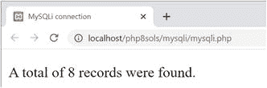

如有必要，用`ch13`文件夹中的`mysqli_01.php`检查您的代码。

#### PHP 解决方案 13-3:使用 MySQLi 显示图像表

显示`SELECT`查询结果的最常见方式是使用循环从结果集中一次提取一行。`MySQLi_Result`有一个名为`fetch_assoc()`的方法，该方法以关联数组的形式检索当前行，以便显示在网页上。数组中的每个元素都以表格中相应的列命名。

这个 PHP 解决方案展示了如何遍历一个`MySQLi_Result`对象来显示一个`SELECT`查询的结果。继续使用 PHP 解决方案 13-2 中的文件。

1.  将`utility_funcs.php`从`ch13`文件夹复制到`includes`文件夹，并将其包含在脚本的顶部:

    ```php
    require_once '../includes/connection.php';
    require_once '../includes/utility_funcs.php';

    ```

2.  移除页面主体中`else`块末尾的右花括号(应该在第 24 行左右)。尽管显示`images`表的大部分代码是 HTML，但它需要在`else`块中。

3.  在结束 PHP 标记后插入一个空行，并在单独的 PHP 代码块中的下一行添加结束括号。修改后的代码应该如下所示:

1.  在`mysqli.php`的主体中的两个 PHP 块之间添加下表，以便它由`else`块控制。这样做的原因是为了防止 SQL 查询失败时出错。显示结果集的 PHP 代码以粗体突出显示:

```php
               } else {
echo "<p>A total of $numRows records were found.</p>";
              ?>
<?php } ?>
               </body>

```

```php
<table>
     <tr>
         <th>image_id</th>
         <th>filename</th>
         <th>caption</th>
     </tr>
 <?php while ($row = $result->fetch_assoc()) { ?>
     <tr>
         <td><?= $row['image_id'] ?></td>
         <td><?= safe($row['filename']) ?></td>
         <td><?= safe($row['caption']) ?></td>
     </tr>
 <?php } ?>
</table>

```

**提示**`while`循环遍历数据库结果，使用`fetch_assoc()`方法将每条记录提取到`$row`中。`$row`的每个元素都显示在一个表格单元中。循环继续，直到`fetch_assoc()`到达结果集的末尾。

没有必要净化`image_id`的值，因为它在一个只存储整数的列中。

1.  保存`mysqli.php`并在浏览器中查看。您应该会看到显示的`images`表的内容，如下图所示:

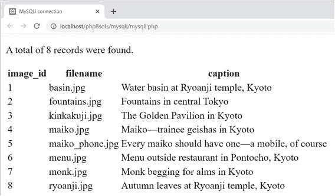

如有必要，您可以将您的代码与`ch13`文件夹中的`mysql_02.php`进行比较。

#### MySQLi 连接婴儿床表

表 [13-1](#Tab1) 总结了 MySQLi 的连接和数据库查询的基本细节。

表 13-1

通过 MySQL 改进的面向对象接口连接到 MySQL/MariaDB

<colgroup><col class="tcol1 align-left"> <col class="tcol2 align-left"> <col class="tcol3 align-left"></colgroup> 
| 

行动

 | 

使用

 | 

评论

 |
| --- | --- | --- |
| 连接 | `$conn = new mysqli($h,$u,$p,$d);` | 所有参数都是可选的；实践中总是需要前四个:主机名、用户名、密码、数据库名。创建连接对象。 |
| 选择数据库 | `$conn->select_db('dbName');` | 用于选择不同的数据库。 |
| 提交查询 | `$result = $conn->query($sql);` | 返回结果对象。 |
| 计数结果 | `$numRows = $result->num_rows;` | 返回结果对象中的行数。 |
| 提取记录 | `$row = $result->fetch_assoc();` | 从结果对象中提取当前行作为关联数组。 |
| 提取记录 | `$row = $result->fetch_row();` | 从结果对象中提取当前行作为索引(编号)数组。 |

#### PHP 解决方案 13-4:计算结果集中的记录数(PDO)

PDO 没有直接等同于 MySQLi `num_rows`的属性。对于大多数数据库，您需要执行一个 SQL 查询来计算表中的项数，然后获取结果。然而，PDO `rowCount()`方法实现了 MySQL 和 MariaDB 的双重目的。通常，它只报告受插入、更新或删除记录影响的行数，但是对于 MySQL 和 MariaDB，它还报告由`SELECT`查询找到的记录数。

1.  在`php8sols`站点中创建一个名为`pdo`的新文件夹。然后在刚刚创建的文件夹中创建一个名为`pdo.php`的文件。该页面最终将用于显示一个表格，因此它应该有一个`DOCTYPE`声明和一个 HTML 框架。

2.  将连接文件包含在 PHP 块中的`DOCTYPE`声明之上，然后使用只读帐户创建一个到`phpsols`数据库的 PDO 连接，如下所示:

    ```php
    require_once '../includes/connection.php';
    $conn = dbConnect('read', 'pdo');

    ```

3.  接下来，准备 SQL 查询:

```php
$sql = 'SELECT * FROM images';

```

这意味着“选择`images`表中的每一条记录”星号(`*`)是“所有列”的简写

1.  现在执行查询并将结果存储在一个变量中，如下所示:

1.  要检查查询是否有问题，可以使用 connection 对象的`errorInfo()`方法从数据库中获取一组错误信息。数组的第三个元素包含出错时问题的简要描述。添加以下代码:

```php
$result = $conn->query($sql);

```

```php
$error = $conn->errorInfo()[2];

```

我们只对第三个元素感兴趣，所以我们可以使用在 PHP 解决方案 7-1 中遇到的数组解引用技术(“获取文本文件的内容”)，方法是在调用`$conn->errorInfo()`后立即在一对方括号中添加数组索引，并将值赋给`$error`。

1.  如果查询执行成功，`$error`将是`null`，PHP 将其视为`false`。因此，如果没有错误，我们可以通过调用`$result`对象上的`rowCount()`方法来获得结果集中的行数，如下所示:

    ```php
    if (!$error) {
        $numRows = $result->rowCount();
    }

    ```

2.  现在，您可以在页面正文中显示查询结果，如下所示:

    ```php
    <?php
    if ($error) {
        echo "<p>$error</p>";
    } else {
        echo "<p>A total of $numRows records were found.</p>";
    }
    ?>

    ```

3.  保存页面并将其加载到浏览器中。你应该会看到和 PHP 解决方案 13-2 的第 8 步相同的结果。如有必要，用`pdo_01.php`检查您的代码。

#### 统计其他数据库中 PDO 的记录

使用 PDO `rowCount()`来报告一个`SELECT`查询找到的条目数量，这在 MySQL 和 MariaDB 上都适用，但不能保证在所有其他数据库上都适用。如果`rowCount()`不起作用，用下面的代码代替:

```php
// prepare the SQL query
$sql = 'SELECT COUNT(*) FROM images';
// submit the query and capture the result
$result = $conn->query($sql);
$error = $conn->errorInfo()[2];
if (!$error) {
    // find out how many records were retrieved
    $numRows = $result->fetchColumn();
    // free the database resource
    $result->closeCursor();
}

```

这使用带星号的 SQL `COUNT()`函数来计算表中的所有项目。只有一个结果，所以可以用`fetchColumn()`方法检索，该方法从数据库结果中获取第一列。在将结果存储在`$numRows`中之后，您必须调用`closeCursor()`方法来释放数据库资源以供任何进一步的查询使用。

#### PHP 解决方案 13-5:使用 PDO 显示图像表

要用 PDO 显示一个`SELECT`查询的结果，可以在一个`foreach`循环中使用`query()`方法来提取当前行作为一个关联数组。数组中的每个元素都以表格中相应的列命名。

继续使用与前面的 PHP 解决方案相同的文件。

1.  将`utility_funcs.php`从`ch13`文件夹复制到`includes`文件夹，并将其包含在脚本的顶部:

    ```php
    require_once '../includes/connection.php';
    require_once '../includes/utility_funcs.php';

    ```

2.  移除页面主体中`else`块末尾的右花括号(应该在第 26 行左右)。尽管显示`images`表的大部分代码是 HTML，但它需要在`else`块中。

3.  在结束 PHP 标记后插入一个空行，然后在单独的 PHP 代码块中的下一行添加右括号。修改后的代码应该如下所示:

1.  在`pdo.php`的主体中的两个 PHP 块之间添加下表，以便它由`else`块控制。这是为了防止 SQL 查询失败时出错。显示结果集的 PHP 代码以粗体显示:

```php
                   } else {
    echo "<p>A total of $numRows records were found.</p>";
?>
<?php } ?>
                   </body>

```

1.  保存页面并在浏览器中查看。它应该看起来像 PHP 解决方案 13-3 中的截图。您可以将您的代码与`ch13`文件夹中的`pdo_02.php`进行比较。

```php
<table>
     <tr>
         <th>image_id</th>
         <th>filename</th>
         <th>caption</th>
     </tr>
 <?php foreach ($conn->query($sql) as $row) { ?>
     <tr>
         <td><?= $row['image_id'] ?></td>
         <td><?= safe($row['filename']) ?></td>
         <td><?= safe($row['caption']) ?></td>
     </tr>
 <?php } ?>
</table>

```

#### PDO 连接婴儿床表

表 [13-2](#Tab2) 总结了与 PDO 连接和数据库查询的基本细节。有些命令将在后面的章节中使用，但为了便于参考，在此列出。

表 13-2

与 PDO 的数据库连接

<colgroup><col class="tcol1 align-left"> <col class="tcol2 align-left"> <col class="tcol3 align-left"></colgroup> 
| 

行动

 | 

使用

 | 

评论

 |
| --- | --- | --- |
| 连接 | `$conn = new PDO($DSN,$u,$p);` | 在实践中，需要三个参数:数据源名称(DSN)、用户名和密码。必须包装在 try/catch 块中。 |
| 提交`SELECT`查询 | `$result = $conn->query($sql);` | 将结果作为一个`PDOStatement`对象返回。 |
| 提取记录 | `foreach($conn->query($sql) as $row) {` | 提交`SELECT`查询并在单个操作中获取当前行作为关联数组。 |
| 计数结果 | `$numRows = $result->rowCount()` | 在 MySQL/MariaDB 中，返回来自`SELECT`的结果数。大多数其他数据库都不支持。 |
| 获得单一结果 | `$item = $result->fetchColumn();` | 获取结果第一列中的第一条记录。要从其他列获得结果，请使用列号(从 0 开始计数)作为参数。 |
| 获取下一条记录 | `$row = $result->fetch();` | 从结果集中获取下一行作为关联数组。 |
| 释放数据库资源 | `$result->closeCursor();` | 释放连接以允许新查询。 |
| 提交非`SELECT`查询 | `$affected = $conn->exec($sql);` | 虽然`query()`可以用于非`SELECT`查询，但是`exec()`会返回受影响的行数。 |

## 使用 SQL 与数据库交互

正如您刚才看到的，PHP 连接到数据库，发送查询，并接收结果，但查询本身需要用 SQL 编写。虽然 SQL 是一个通用标准，但是 SQL 有许多不同的方言。每个数据库供应商，包括 MySQL，都为标准语言添加了扩展。这提高了效率和功能，但通常与其他数据库不兼容。本书中的 SQL 适用于 MySQL 5.1 或更高版本以及 MariaDB，但不一定会转移到 Microsoft SQL Server、Oracle 或其他数据库。

### 编写 SQL 查询

SQL 语法没有太多的规则，而且都很简单。

#### SQL 关键字不区分大小写

从`images`表中检索所有记录的查询如下所示:

```php
SELECT * FROM images

```

大写的单词是 SQL 关键字。这纯粹是约定俗成。以下内容同样正确:

```php
SELECT * FROM images
select * from images
SeLEcT * fRoM images

```

尽管 SQL 关键字不区分大小写，但同样的*不适用于数据库列名。对关键字使用大写字母的好处是，它使 SQL 查询更容易阅读。你可以自由选择最适合你的风格，但是最好避免最后一个例子中的勒索信风格。*

#### 空白被忽略

这允许您将 SQL 查询分散到几行中，以增加可读性。不允许空白的地方是在函数名和左括号之间。以下内容会生成一个错误:

```php
SELECT COUNT (*) FROM images /* BAD EXAMPLE */

```

空间需要像这样封闭起来:

```php
SELECT COUNT(*) FROM images /* CORRECT */

```

正如您可能从这些示例中总结的那样，您可以通过将注释放在/*和*/之间来为 SQL 查询添加注释。

#### 字符串必须用引号括起来

SQL 查询中的所有字符串都必须用引号括起来。使用单引号还是双引号并不重要，只要它们成对出现就行。然而，通常最好使用 MySQLi 或 PDO 预准备语句，这将在本章后面解释。

#### 处理数字

一般来说，数字不应该加引号，因为加引号的都是字符串。然而，MySQL 接受用引号括起来的数字，并将它们视为等价的数字。请注意区分实数和任何其他由数字组成的数据类型。例如，日期由数字组成，但应该用引号括起来，并存储在与日期相关的列类型中。类似地，电话号码应该用引号括起来，并存储在与文本相关的列类型中。

Note

SQL 查询通常以分号结束，分号是数据库执行查询的指令。当使用 PHP 时，分号必须从 SQL 中省略。因此，在本书中，SQL 的独立例子没有以分号结尾。

### 细化由选择查询检索的数据

到目前为止，您运行的惟一一个 SQL 查询从`images`表中检索所有记录。很多时候，你想更有选择性。

#### 选择特定列

使用星号选择所有列是一种方便的快捷方式，但是通常应该只指定那些需要的列。在`SELECT`关键字后列出用逗号分隔的列名。例如，该查询只为每条记录选择了`filename`和`caption`字段:

```php
SELECT filename, caption FROM images

```

你可以在`ch13`文件夹的`mysqli_03.php`和`pdo_03.php`中测试这个。

#### 更改结果的顺序

为了控制排序顺序，添加一个`ORDER BY`子句，按照优先级顺序列出列名。用逗号分隔多列。以下查询按字母顺序对`images`表中的标题进行排序(代码在`mysqli_04.php`和`pdo_04.php)`中):

```php
$sql = 'SELECT * FROM images ORDER BY caption';

```

Note

这个分号是 PHP 语句的一部分，而不是 SQL 查询的一部分。

上述查询会产生以下输出:


要颠倒排序顺序，添加`DESC`(表示“降序”)关键字，如下所示(在`mysqli_05.php`和`pdo_05.php`中有示例):

```php
$sql = 'SELECT * FROM images ORDER BY caption DESC';

```

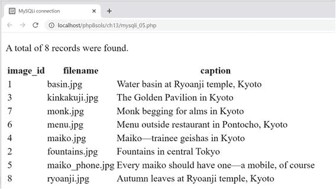

还有一个`ASC`(代表“升序”)关键字。这是默认的排序顺序，所以通常会被忽略。

但是，当同一表中的列以不同的顺序排序时，指定`ASC`会增加清晰度。例如，如果您每天发布多篇文章，您可以使用以下查询按字母顺序显示标题，但按发布日期排序，最新的文章排在最前面:

```php
SELECT * FROM articles
ORDER BY published DESC, title ASC

```

#### 搜索特定值

要搜索特定的值，请在`SELECT`查询中添加一个`WHERE`子句。`WHERE`子句跟在表名后面。例如，`mysqli_06.php`和`pdo_06.php`中的查询如下所示:

```php
$sql = 'SELECT * FROM images
WHERE image_id = 6';

```

Note

SQL 使用一个等号来测试相等性，不像 PHP 使用两个。

它会产生以下结果:

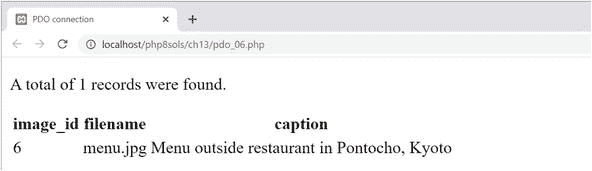

除了测试相等性之外，`WHERE`子句还可以使用比较运算符，例如大于(`>`)和小于(`<`)。我将根据需要介绍其他选项，而不是现在介绍所有选项。第 [15](15.html) 章全面总结了四个主要的 SQL 命令，`SELECT`、`INSERT`、`UPDATE`和`DELETE`，包括与`WHERE`一起使用的主要比较运算符列表。

如果与`ORDER BY`结合使用，`WHERE`子句必须放在前面。例如(代码在`mysqli_07.php`和`pdo_07.php`):

```php
$sql = 'SELECT * FROM images
WHERE image_id > 5
ORDER BY caption DESC';

```

这将选择三个`image_id`大于 5 的图像，并按照标题以相反的顺序对它们进行排序。

#### 搜索带有通配符的文本

在 SQL 中，百分号(`%`)是一个通配符，匹配任何内容或不匹配任何内容。它与`LIKE`关键字一起用在`WHERE`子句中。

`mysqli_08.php`和`pdo_08.php`中的查询如下所示:

```php
$sql = 'SELECT * FROM images
WHERE caption LIKE "%Kyoto%"';

```

它搜索`images`表中`caption`列包含“京都”的所有记录，并产生以下结果:

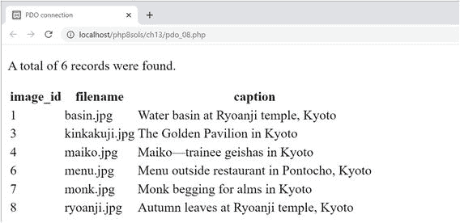

如前面的屏幕截图所示，它在`images`表的八条记录中找到了六条。所有标题都以“Kyoto”结尾，所以结尾的通配符不匹配任何内容，而开头的通配符匹配每个标题的其余部分。

如果省略前导通配符(`"Kyoto%"`)，查询将搜索以“Kyoto”开头的标题他们都不知道，所以你不会从搜索中得到任何结果。

`mysqli_09.php`和`pdo_09.php`中的查询如下所示:

```php
$sql = 'SELECT * FROM images
WHERE caption LIKE "%maiko%"';

```

它会产生以下结果:

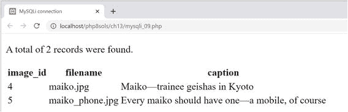

该查询拼写的“maiko”都是小写的，但该查询也发现它有一个首字母大写。使用`LIKE`的搜索不区分大小写。

要执行区分大小写的搜索，您需要像这样添加关键字`BINARY`(代码在`mysqli_10.php`和`pdo_10.php`):

```php
$sql = 'SELECT * FROM images
WHERE caption LIKE BINARY "%maiko%"';

```

到目前为止，您看到的所有示例都是硬编码的，但是大多数时候，SQL 查询中使用的值需要来自用户输入。除非您非常小心，否则这将使您面临被称为 SQL 注入的恶意利用的风险。本章的其余部分解释了这种危险以及如何避免它。

## 了解 SQL 注入的危险

**SQL** **注入**非常类似于我在第 [6 章](06.html)中警告过你的邮件头注入。注入攻击试图在 SQL 查询中插入虚假条件，试图暴露或破坏您的数据。以下查询的含义应该很容易理解:

```php
SELECT * FROM users WHERE username = 'xyz' AND pwd = 'abc'

```

这是登录应用程序的基本模式。如果查询发现一条记录，其中`username`是`xyz`而`pwd`是`abc`，那么您知道已经提交了用户名和密码的正确组合，因此登录成功。攻击者需要做的只是注入一个额外的条件，就像这样:

```php
SELECT * FROM users WHERE username = 'xyz' AND pwd = 'abc' OR 1 = 1

```

`OR`意味着只需要其中一个条件为真，所以即使没有正确的用户名和密码，登录也能成功。当查询的一部分来自变量或用户输入时，SQL 注入依赖于引号和其他控制字符不能被正确转义。

根据具体情况，你可以采取几种策略来预防 SQL 注入:

*   如果变量是一个整数(例如，记录的主键)，使用`is_numeric()`和`(int)`转换操作符来确保插入查询是安全的。

*   使用**准备好的语句**。在预处理语句中，SQL 查询中的占位符表示来自用户输入的值。PHP 代码自动将字符串用引号括起来，并对嵌入的引号和其他控制字符进行转义。MySQLi 和 PDO 的语法不同。

*   前面的策略都不适合列名，列名不能用引号括起来。要将变量用于列名，请创建一个可接受值的数组，并在将提交的值插入查询之前检查它是否在数组中。

让我们来看看如何使用这些技术。

Note

我没有将 MySQLi `real_escape_string()`或 PDO `quote()`方法作为预防 SQL 注入的技术，因为它们都不能提供防弹保护。使用预处理语句将用户输入的值嵌入到 SQL 查询中。

### PHP 解决方案 13-6:将用户输入的整数插入到查询中

这个 PHP 解决方案展示了如何净化用户输入的变量，以确保在将值插入 SQL 查询之前它只包含一个整数。MySQLi 和 PDO 的技术是一样的。

1.  将`ch13`文件夹中的`mysqli_integer_01.php`或`pdo_integer_01.php`复制到`mysqli`或`pdo`文件夹中，并删除文件名中的`_01`。每个文件包含一个 SQL 查询，该查询从`images`表中选择`image_id`和`filename`列。在页面主体中，有一个带有下拉菜单的表单，该表单由一个循环填充，该循环遍历 SQL 查询的结果。MySQLi 版本如下所示:

```php
<form action="mysqli_integer.php" method="get">
    <select name="image_id">
    <?php while ($row = $images->fetch_assoc()) { ?>
        <option value="<?= $row['image_id'] ?>"
        <?php if (isset($_GET['image_id']) &&
            $_GET['image_id'] == $row['image_id']) {
            echo 'selected';
         } ?>
         ><?= safe($row['filename']) ?></option>
    <?php } ?>
    </select>
    <input type="submit" name="go" value="Display">
</form>

```

该表单使用了`get`方法，并将`image_id`赋给了`<option>`标签的`value`属性。如果`$_GET['image_id']`与`$row['image_id']`具有相同的值，则当前的`image_id`与通过页面的查询字符串传递的值相同，因此`selected`属性被添加到开始的`<option>`标签中。`$row['filename']`的值被插入到开始和结束`<option>`标签之间。

除了使用 PDO `fetch()`方法在`foreach`循环中直接运行查询之外，PDO 版本是相同的。

如果您将页面加载到浏览器中，您会看到一个下拉菜单，其中列出了`images`文件夹中的文件，如下所示:


1.  在结束的`</form>`标签后立即插入以下代码。MySQLi 和 PDO 的代码是一样的，除了一行代码(这是 MySQLi 版本):

```php
<?php
if (isset($_GET['image_id'])) {
    $image_id = (int) $_GET['image_id'];
    $error = ($image_id === 0) ? true : false;
    if (!$error) {
        $sql = "SELECT filename, caption FROM images
        WHERE image_id = $image_id";
        $result = $conn->query($sql);
        $row = $result->fetch_assoc();
        ?>
        <figure>">
            <figcaption><?= safe($row['caption']) ?></figcaption>
        </figure>
     <?php }
     if ($error) {
         echo '<p>Image not found</p>';
    }
} ?>

```

条件语句检查`image_id`是否已经通过`$_GET`数组发送。如果有，使用`(int)`转换操作符将其分配给`$image_id`。使用 casting 操作符有两个目的:防止通过提交浮点数来探查脚本中的错误消息，以及将非数字值转换为 0。

下一行使用三元运算符将`$error`设置为`true`或`false`，这取决于$image_id 是否为 0。

如果`$error`是`false`，脚本查询数据库并显示选中的图像和标题。因为您知道`$image_id`是一个整数，所以直接插入 SQL 查询是安全的。因为是数字，所以不需要用引号括起来，但是赋给`$sql`的字符串需要用双引号来保证`$image_id`的值被插入到查询中。

新的查询通过`query()`方法提交给 MySQL，结果存储在`$row`中。最后，`$row['filename']`和`$row['caption']`用于显示页面中的图片及其标题。

但是，如果`$error`是`true`，最后的条件语句显示“找不到图像”

Tip

我选择了一个单独的条件语句来显示“Image not found ”,因为我计划稍后检查另一个错误，并且我希望对两者使用相同的错误消息。

1.  如果您使用的是 PDO 版本，请找到以下代码行:

```php
$row = $result->fetch_assoc();

```

改成这样:

1.  保存页面并将其加载到浏览器中。当页面第一次加载时，只显示下拉菜单。

2.  从下拉菜单中选择一个文件名，然后单击`Display`。应该会显示您选择的图像，如下面的屏幕截图所示:

```php
$row = $result->fetch();

```


如果你遇到问题，对照`ch13`文件夹中的`mysqli_integer_02.php`或`pdo_integer_02.php`检查你的代码。

1.  在浏览器中编辑查询字符串，将`image_id`的值更改为字符串。您应该看到“找不到图像”但是，如果字符串以 1 到 8 之间的数字开头，您将看到与该数字相关的图像和标题。

2.  尝试 1.0 到 8.9 之间的浮点数。相关图像正常显示。

3.  请尝试 1-8 范围之外的数字。在 PHP 的旧版本中，不会显示错误消息，因为查询没有问题。它只是在寻找一个不存在的值。然而，在 PHP 8 中，如果你已经将 php.ini 中的 error_reporting 设置为第 [2](02.html) 章中推荐的级别，你会得到一条类似这样的警告消息:

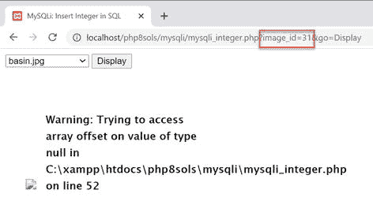

1.  为了避免这种情况，您应该使用 MySQLi 的`num_rows`属性或 PDO 的`rowCount()`方法来检查查询返回的行数。

为 MySQLi 更改如下代码:

```php
    $result = $conn->query($sql);
     if ($result->num_rows) {
         $row = $result->fetch_assoc();
         ?>
         <figure>">
             <figcaption><?= safe($row['caption']) ?></figcaption>
         </figure>
     <?php } else { ?>
         $error = true;
        }
    }
    if ($error) {
        echo '<p>Image not found</p>';
    }
} ?>

```

对于 PDO，用`$result->rowCount()`代替`$result->num_rows`。

如果查询没有返回任何行，PHP 将 0 视为隐式的`false`，因此条件失败，而是执行`else`子句，将`$error`设置为`true`。

显示“找不到图像”的条件语句可以移动到`else`块中，但是这个脚本有几个嵌套的条件。将它分开可以更容易阅读脚本和遵循条件逻辑。

1.  再次测试页面。当您从下拉菜单中选择图像时，它会像以前一样正常显示。但是，如果您尝试在查询字符串中输入一个超出范围的值，您将看到错误消息。

修改后的代码在`ch13`文件夹的`mysqli_integer_03.php`和`pdo_integer_03.php`中。

## 为用户输入使用准备好的语句

MySQLi 和 PDO 都支持预准备语句，这提供了重要的安全特性。预准备语句是 SQL 查询的模板，其中包含每个可变值的占位符。这不仅使在 PHP 代码中嵌入变量变得更加容易，还可以防止 SQL 注入攻击，因为引号和其他字符会在查询执行前自动转义。

使用预准备语句的其他优点是，当同一个查询被多次使用时，它们会更有效。此外，您可以将来自`SELECT`查询的每一列的结果绑定到命名变量，从而更容易显示输出。

MySQLi 和 PDO 都使用问号作为匿名占位符，就像这样:

```php
$sql = 'SELECT image_id, filename, caption FROM images WHERE caption LIKE ?';

```

PDO 也支持使用命名占位符。命名占位符以冒号开头，后跟标识符，如下所示:

```php
$sql = 'SELECT image_id, filename, caption FROM images WHERE caption LIKE :search';

```

Note

占位符不用引号括起来，即使它们代表的值是字符串。这使得构建 SQL 查询变得容易得多，因为不需要担心如何获得单引号和双引号的正确组合。

占位符只能用于列值。它们不能用于 SQL 查询的其他部分，如列名或运算符。这是因为在执行 SQL 时，包含非数字字符的值会被自动转义并括在引号中。列名和运算符不能用引号括起来。

准备好的语句比直接提交查询涉及的代码稍微多一点，但是占位符使 SQL 更容易读写，并且这个过程更安全。

MySQLi 和 PDO 的语法是不同的，所以下面几节将分别讨论它们。

### 在 MySQLi 预准备语句中嵌入变量

使用 MySQLi 预准备语句包括几个阶段。

#### 初始化语句

要初始化准备好的语句，在数据库连接上调用`stmt_init()`方法，并将其存储在一个变量中，如下所示:

```php
$stmt = $conn->stmt_init();

```

#### 准备声明

然后将 SQL 查询传递给语句的`prepare()`方法。这将检查您是否在错误的位置使用了问号占位符，以及当所有内容放在一起时，查询是否是有效的 SQL。

如果有任何错误，`prepare()`方法将返回`false`，因此通常将接下来的步骤包含在条件语句中，以确保它们仅在一切正常的情况下运行。

可以通过语句的`error`属性访问错误消息。

#### 将值绑定到占位符

用变量中保存的实际值替换问号在技术上被称为**绑定参数**。正是这一步骤保护了您的数据库免受 SQL 注入的攻击。

按照您希望将变量插入 SQL 查询的顺序，将变量传递给语句的`bind_param()`方法，同时传递指定每个变量的数据类型的第一个参数，同样按照变量的顺序。数据类型必须由以下四个字符之一指定:

*   `b`:二进制(如图像、Word 文档或 PDF 文件)

*   `d` : Double(浮点数)

*   `i`:整数(整数)

*   `s`:字符串(文本)

传递给`bind_param()`的变量数量必须与问号占位符的数量完全相同。例如，要将单个值作为字符串传递，请使用:

```php
$stmt->bind_param('s', $_GET['words']);

```

为了传递两个值，`SELECT`查询需要两个问号作为占位符，两个变量都需要用`bind_param()`绑定，如下所示:

```php
$sql = 'SELECT * FROM products WHERE price < ? AND type = ?';
$stmt = $conn->stmt_init();
$stmt->prepare($sql);
$stmt->bind_param('ds', $_GET['price'], $_GET['type']);

```

`bind_param()`、`'ds'`的第一个参数将`$_GET['price']`指定为浮点数，将`$_GET['type']`指定为字符串。

#### 执行语句

一旦准备好语句并且值已经绑定到占位符，调用语句的`execute()`方法。然后可以从语句对象中获取一个`SELECT`查询的结果。对于其他类型的查询，这是过程的结尾。

#### 绑定结果(可选)

可选地，您可以使用`bind_result()`方法将`SELECT`查询的结果绑定到变量。这避免了提取每一行然后以`$row['column_name']`的形式访问结果的需要。

为了绑定结果，您必须在`SELECT`查询中专门命名每一列。以同样的顺序列出您想要使用的变量，并将它们作为参数传递给`bind_result()`。例如，假设您的 SQL 如下所示:

```php
$sql = 'SELECT image_id, filename, caption FROM images WHERE caption LIKE ?';

```

要绑定查询结果，请使用以下代码:

```php
$stmt->bind_result($image_id, $filename, $caption);

```

这允许您直接访问结果，如`$image_id`、`$filename`和`$caption`。

#### 存储结果(可选)

当您为`SELECT`查询使用准备好的语句时，结果是无缓冲的。这意味着它们会保留在数据库服务器上，直到您提取它们。这具有需要较少内存的优点，尤其是当结果集包含大量行时。但是，无缓冲结果会带来以下限制:

*   一旦获取了结果，它们就不再存储在内存中。因此，不能多次使用同一个结果集。

*   在获取或清除所有结果之前，不能在同一数据库连接上运行另一个查询。

*   您不能使用`num_rows`属性来确定结果集中有多少行。

*   不能使用`data_seek()`移动到结果集中的特定行。

为了避免这些限制，您可以选择使用语句的`store_result()`方法存储结果集。但是，如果您只是想立即显示结果，而不是在以后重用，就没有必要先存储它。

Note

要清除未缓冲的结果，调用语句的`free_result()`方法。

#### 获取结果

要循环通过用准备好的语句执行的`SELECT`查询的结果，请使用`fetch()`方法。如果您已经将结果绑定到变量，请这样做:

```php
while ($stmt->fetch()) {
 // display the bound variables for each row
}

```

如果您没有将结果绑定到变量，那么使用`$row = $stmt->fetch()`并以`$row['column_name']`的形式访问每个变量。

#### 关闭语句

当您完成一个准备好的语句时，`close()`方法释放所使用的内存。

#### PHP 解决方案 13-7:在搜索中使用 MySQLi 预准备语句

这个 PHP 解决方案展示了如何使用 MySQLi 预准备语句和一个`SELECT`查询；它还演示了将结果绑定到命名变量。

1.  从`ch13`文件夹中复制`mysqli_prepared_01.php`并在`mysqli`文件夹中保存为`mysqli_prepared.php`。该文件包含一个搜索表单和一个用于显示结果的表格。

2.  在`DOCTYPE`声明上方的 PHP 代码块中，创建一个包含`connection.php`和`utility_funcs.php`的条件语句，并在提交搜索表单时创建一个只读连接。代码如下所示:

1.  接下来，在条件语句中添加 SQL 查询。该查询需要命名您想要从`images`表中检索的三列。使用问号作为搜索词的占位符，如下所示:

    ```php
    $sql = 'SELECT image_id, filename, caption FROM images
               WHERE caption LIKE ?';

    ```

2.  在将用户提交的搜索词传递给`bind_param()`方法之前，您需要添加通配符并将其赋给一个新变量，如下所示:

```php
if (isset($_GET['go'])) {
    require_once '../includes/connection.php';
    require_once '../includes/utility_funcs.php';
    $conn = dbConnect('read');
}

```

1.  现在可以创建预准备语句了。`DOCTYPE`声明上方的 PHP 块中完成的代码如下所示:

```php
$searchterm = '%'. $_GET['search'] .'%';

```

```php
if (isset($_GET['go'])) {
    require_once '../includes/connection.inc.php';
    $conn = dbConnect('read');
    $sql = 'SELECT image_id, filename, caption FROM images
               WHERE caption LIKE ?';
    $searchterm = '%'. $_GET['search'] .'%';
    $stmt = $conn->stmt_init();
    if ($stmt->prepare($sql)) {
        $stmt->bind_param('s', $searchterm);
        $stmt->execute();
        $stmt->bind_result($image_id, $filename, $caption);
        $stmt->store_result();
        $numRows = $stmt->num_rows;
    } else {
        $error = $stmt->error;
    }
}

```

这将初始化准备好的语句，并将其分配给`$stmt`。然后，SQL 查询被传递给`prepare()`方法，该方法检查查询语法的有效性。如果语法有问题，`else`块将错误消息分配给`$error`。如果语法没有错误，则执行条件语句中的其余脚本。

条件语句中的第一行将`$searchterm`绑定到`SELECT`查询，替换问号占位符。第一个参数告诉准备好的语句将其视为字符串。

执行准备好的语句后，下一行将把`SELECT`查询的结果绑定到`$image_id`、`$filename`和`$caption`。这些需要与查询中的顺序相同。我根据变量所代表的列来命名变量，但是您可以使用任何想要的变量。

然后存储结果。注意，您只需通过调用语句对象的`store_result()`方法来存储结果。与使用`query()`不同，你不用将`store_result()`的返回值赋给一个变量。如果您这样做了，它只是`true`或`false`，这取决于结果是否被成功存储。

最后，查询检索的行数从 statement 对象的`num_rows`属性中获得，并存储在`$numRows`中。

1.  在开始的`<body>`标记后添加一个条件语句，以便在出现问题时显示错误消息:

    ```php
    <?php
    if (isset($error)) {
        echo "<p>$error</p>";
    }
    ?>

    ```

2.  在搜索表单后添加以下代码以显示结果:

```php
<?php if (isset($numRows)) { ?>
     <p>Number of results for <b><?= safe($_GET['search']) ?></b>:
         <?= $numRows ?></p>
    <?php if ($numRows) { ?>
        <table>
            <tr>
               <th>image_id</th>
               <th>filename</th>
               <th>caption</th>
           </tr>
           <?php while ($stmt->fetch()) { ?>
               <tr>
                   <td><?= $image_id ?></td>
                   <td><?= safe($filename) ?></td>
                   <td><?= safe($caption) ?></td>
               </tr>
           <?php } ?>
        </table>
 <?php }
} ?>

```

第一个条件语句包裹在段落和表格周围，防止它们在`$numRows`不存在的情况下显示，这种情况发生在页面第一次加载时。如果表单已经提交，`$numRows`将被设置，所以搜索词被重新显示，`$numRows`的值报告匹配的数量。

如果查询没有返回结果，`$numRows`为 0，被视为`false`，因此不显示该表。如果`$numRows`包含除 0 以外的任何内容，则显示表格。显示结果的`while`循环对准备好的语句调用`fetch()`方法。不需要将当前记录存储为`$row`，因为来自每一列的值已经被绑定到`$image_id`、`$filename`和`$caption`。

1.  保存页面并将其加载到浏览器中。在搜索字段中输入一些文本，然后点击`Search`。结果的数量与包含搜索词的标题一起显示，如下面的屏幕截图所示:

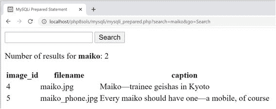

您可以将您的代码与`ch13`文件夹中的`mysqli_prepared_02.php`进行比较。

### 在 PDO 预准备语句中嵌入变量

PDO 准备的声明提供了匿名和命名占位符的选择。

#### 使用匿名占位符

匿名占位符使用问号的方式与 MySQLi 完全相同:

```php
$sql = 'SELECT image_id, filename, caption FROM images WHERE caption LIKE ?';

```

#### 使用命名占位符

命名占位符以冒号开头，如下所示:

```php
$sql = 'SELECT image_id, filename, caption FROM images WHERE caption LIKE :search';

```

使用命名占位符使代码更容易理解，特别是如果您选择的名称基于包含要嵌入 SQL 的值的变量。

#### 准备声明

准备和初始化语句只需一步(不像 MySQLi 需要两步)。您将带有占位符的 SQL 直接传递给连接对象的`prepare()`方法，该方法返回准备好的语句，如下所示:

```php
$stmt = $conn->prepare($sql);

```

#### 将值绑定到占位符

将值绑定到占位符有几种不同的方法。当使用匿名占位符时，最简单的方法是按照占位符的顺序创建一个值数组，然后将该数组传递给语句的`execute()`方法。即使只有一个占位符，也必须使用数组。例如，要将`$searchterm`绑定到单个匿名占位符，必须用一对方括号将它括起来，如下所示:

```php
$stmt->execute([$searchterm]);

```

您也可以用类似的方式将值绑定到命名占位符，但是传递给`execute()`方法的参数必须是一个关联数组，使用命名占位符作为每个值的键。因此，下面的代码将`$searchterm`绑定到名为占位符的`:search`:

```php
$stmt->execute([':search' => $searchterm]);

```

或者，在调用`execute()`方法之前，可以使用语句的`bindParam()`和`bindValue()`方法绑定值。当与匿名占位符一起使用时，两种方法的第一个参数都是一个数字，从 1 开始计数，表示占位符在 SQL 中的位置。对于命名占位符，第一个参数是字符串形式的命名占位符。第二个参数是要在查询中插入的值。

然而，这两种方法之间有一个微妙的区别:

*   对于`bindParam()`，第二个参数*必须*是一个变量。它不能是字符串、数字或任何其他类型的表达式。

*   对于`bindValue()`，第二个参数应该是字符串、数字或表达式。但它也可以是一个变量。

因为`bindValue()`接受任何类型的值，`bindParam()`可能看起来是多余的。区别在于传递给`bindValue()`的参数值必须是已知的，因为它绑定了实际值，而`bindParam()`只绑定了变量。因此，该值可以在以后赋给变量。

为了说明区别，让我们使用“使用命名占位符”中的`SELECT`查询`:search`占位符跟在`LIKE`关键字之后，因此该值需要与通配符结合使用。尝试执行以下操作会产生错误:

```php
// This will NOT work
$stmt->bindParam(':search', '%'. $_GET['search'] .'%');

```

不能用`bindParam()`将通配符连接到变量。在变量作为参数传递之前，需要添加通配符，如下所示:

```php
$searchterm = '%'. $_GET['search'] .'%';
$stmt->bindParam(':search', $searchterm);

```

或者，您可以构建表达式作为`bindValue()`的参数:

```php
// This WILL work
$stmt->bindValue(':search', '%'. $_GET['search'] .'%');

```

`bindParam()`和`bindValue()`方法接受可选的第三个参数:指定数据类型的常数。主要常数如下:

*   `PDO::PARAM_INT`:整数(整数)

*   `PDO::PARAM_LOB`:二进制(如图像、Word 文档或 PDF 文件)

*   `PDO::PARAM_STR`:字符串(文本)

*   `PDO::PARAM_BOOL`:布尔型(真或假)

*   `PDO::PARAM_NULL` ： 零

如果您想将数据库列的值设置为`null`，那么`PDO::PARAM_NULL`非常有用。例如，如果主键是自动递增的，那么在插入新记录时，您需要传递`null`作为值。这就是如何用`bindValue()`将名为`:id`的命名参数设置为`null`:

```php
$stmt->bindValue(':id', NULL, PDO::PARAM_NULL);

```

Note

浮点数没有 PDO 常数。

#### 执行语句

如果使用`bindParam()`或`bindValue()`将值绑定到占位符，只需调用不带参数的`execute()`方法:

```php
$stmt->execute();

```

否则，按照上一节所述传递一个值数组。在这两种情况下，查询的结果都存储在`$stmt`中。

可以用与 PDO 连接相同的方式访问错误消息。然而，不是在连接对象上调用`errorInfo()`方法，而是在 PDO 语句上使用它，就像这样:

```php
$error = $stmt->errorInfo()[2];

```

如果没有错误，`$error`将会是`null`。否则，它将包含描述问题的字符串。

#### 绑定结果(可选)

为了将`SELECT`查询的结果绑定到变量，需要使用`bindColumn()`方法单独绑定每一列，该方法有两个参数。第一个参数可以是列名，也可以是从 1 开始的列号。这个数字来自于它在`SELECT`查询中的位置，而不是它在数据库表中出现的顺序。因此，在我们一直使用的 SQL 示例中，要将来自`filename`列的结果绑定到`$filename`，以下任一方法都是可接受的:

```php
$stmt->bindColumn('filename', $filename);
$stmt->bindColumn(2, $filename);

```

因为每一列都是单独绑定的，所以不需要全部绑定。然而，这样做更方便，因为它避免了将`fetch()`方法的结果赋给数组的需要。

#### 获取结果

要获取一个`SELECT`查询的结果，调用语句的`fetch()`方法。如果您已经使用`bindColumn()`将输出绑定到变量，您可以直接使用变量。否则，它返回当前行的数组，该数组由列名和零索引列号索引。

Note

您可以通过传递一个常量作为参数来控制 PDO `fetch()`方法的输出类型。`www.php.net/manual/en/pdostatement.fetch.php`见。

#### PHP 解决方案 13-8:在搜索中使用 PDO 准备好的语句

这个 PHP 解决方案展示了如何使用 PDO 语句将用户提交的值从搜索表单嵌入到一个`SELECT`查询中。它使用与 PHP 解决方案 13-7 中 MySQLi 版本相同的搜索形式。

1.  从`ch13`文件夹中复制`pdo_prepared_01.php`并在`pdo`文件夹中保存为`pdo_prepared.php`。

2.  在 PHP 块中的`DOCTYPE`声明上方添加以下代码:

```php
if (isset($_GET['go'])) {
    require_once '../includes/connection.php';
    require_once '../includes/utility_funcs.php';
    $conn = dbConnect('read', 'pdo');
    $sql = 'SELECT image_id, filename, caption FROM images
               WHERE caption LIKE :search';
    $stmt = $conn->prepare($sql);
    $stmt->bindValue(':search', '%' . $_GET['search'] . '%');
    $stmt->execute();
    $error = $stmt->errorInfo()[2];
    if (!$error) {
        $stmt->bindColumn('image_id', $image_id);
        $stmt->bindColumn('filename', $filename);
        $stmt->bindColumn(3, $caption);
        $numRows = $stmt->rowCount();
    }
}

```

提交表单时，这包括连接文件并创建一个 PDO 只读连接。准备好的语句使用`:search`作为命名参数来代替用户提交的值。

在将搜索词绑定到准备好的语句的同时，`%`通配符与搜索词连接在一起。所以用`bindValue()`代替`bindParam()`。

在执行该语句后，调用该语句的`errorInfo()`方法，查看是否生成了错误消息并存储在`$errorInfo[2]`中。

如果没有问题，使用`bindColumn()`方法将结果绑定到`$image_id`、`$filename`和`$caption`。前两个使用列名，但是`caption`列是通过它在`SELECT`查询中的位置(从 1 开始计数)来引用的。

1.  显示结果的代码与 PHP 解决方案 13-7 中的步骤 6 和 7 相同。您可以在`ch13`文件夹的`pdo_prepared_02.php`中查看完成的代码。

#### PHP 解决方案 13-9:调试 PDO 准备好的语句

有时，数据库查询不会产生您期望的结果。当这种情况发生时，查看您的脚本发送到数据库服务器的确切内容是非常有用的。对于 MySQLi，没有一种简单的方法来检查由预处理语句插入到 SQL 查询中的值。但是对于 PDO 来说，这再简单不过了。这个功能是在 PHP 7.2 中引入的。

1.  继续使用之前 PHP 解决方案中的`pdo_prepared.php`。或者，将`ch13`文件夹中的`pdo_prepared_02.php`复制到`pdo`文件夹中，并重命名为`pdo_prepared.php`。

2.  修改结束标签`</table>`后的代码，如下所示:

```php
</table>
 <?php }
 echo '<pre>';
 $stmt->debugDumpParams();
 echo '</pre>';
 }
?>

```

这插入了一对`<pre>`标签，使得对`PDOStatement`对象的`debugDumpParams()`方法的调用的输出更具可读性。

1.  保存文件，将其加载到浏览器中，并进行搜索。除了搜索结果之外，您还应该看到类似于以下屏幕截图的输出:

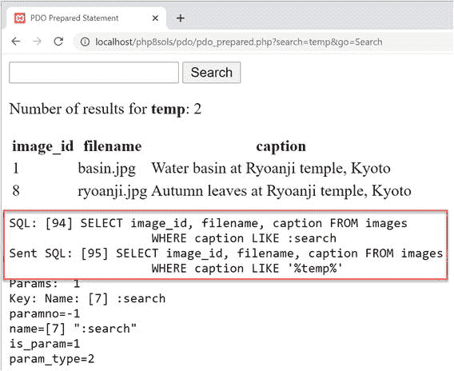

SQL 查询显示两次。第一次显示了 PHP 代码中出现的查询——在本例中，包括命名参数:search。第二次，它显示发送到数据库服务器的实际值。

在这种情况下，搜索“temp”会返回两个包含“temple”的标题。如果这是你所期望的，那没关系。但是假设你只想要一个精确的匹配。看到`%`通配符可以解释错误的结果，使调试没有产生预期结果的准备好的语句的问题变得更加容易。

您可以将您的代码与`ch13`文件夹中的`pdo_prepared_03.php`进行比较。

Caution

在调用`debugDumpParams()`之前调用`execute()`方法很重要。

#### PHP 解决方案 13-10:通过用户输入改变列选项

这个 PHP 解决方案展示了如何通过用户输入在一个`SELECT`查询中更改 SQL 关键字的名称。SQL 关键字不能用引号括起来，所以使用预处理语句是行不通的。相反，您需要确保用户输入与一组预期值相匹配。如果找不到匹配，则使用默认值。MySQLi 和 PDO 的技术是一样的。

1.  从`ch13`文件夹中复制`mysqli_order_01.php`或`pdo_order_01.php`并保存在`mysqli`或`pdo`文件夹中。两个版本都从`images`表中选择所有记录，并在表格中显示结果。这些页面还包含一个表单，该表单允许用户选择一个列的名称，以升序或降序对结果进行排序。在初始状态下，表单是不活动的。页面显示按`image_id`升序排序的详细信息，如下所示:

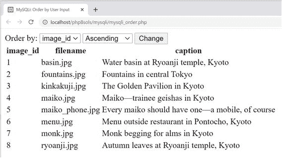

1.  将 PHP 块中的代码修改到`DOCTYPE`声明之上，如下所示(下面的清单显示的是 PDO 版本，但是粗体显示的变化对于 MySQLi 是一样的):

```php
require_once '../includes/connection.php';
require_once '../includes/utility_funcs.php';
// connect to database
$conn = dbConnect('read', 'pdo');
// set default values
$col = 'image_id';
$dir = 'ASC';
// create arrays of permitted values
$columns = ['image_id', 'filename', 'caption'];
$direction = ['ASC', 'DESC'];
// if the form has been submitted, use only expected values
if (isset($_GET['column']) && in_array($_GET['column'], $columns)) {
    $col = $_GET['column'];
}

if (isset($_GET['direction']) && in_array($_GET['direction'], $direction)) {
    $dir = $_GET['direction'];
}
// prepare the SQL query using sanitized variables
$sql = "SELECT * FROM images
            ORDER BY $col $dir";
// submit the query and capture the result
$result = $conn->query($sql);
$error = $conn->errorInfo()[2];

```

新代码定义了两个变量，`$col`和`$dir`，它们被直接嵌入到`SELECT`查询中。因为它们被赋予了默认值，所以当页面第一次加载时，查询显示按`image_id`列升序排序的结果。

两个数组`$columns`和`$direction`定义了允许的值:列名和`ASC`和`DESC`关键字。这些数组由检查`column`和`direction`的`$_GET`数组的条件语句使用。只有当提交的值分别与`$columns`和`$direction`数组中的值匹配时，它们才会被重新分配给`$col`和`$dir`。这可以防止任何向 SQL 查询中注入非法值的企图。

1.  编辑下拉菜单中的`<option>`标签，使其显示为`$col`和`$dir`选择的值，如下所示:

1.  保存页面并在浏览器中测试。您可以通过选择下拉菜单中的值并点击`Change`来更改显示的排序顺序。但是，如果您试图通过查询字符串注入非法值，页面会使用默认值`$col`和`$dir`来显示按`image_id`升序排序的结果。

```php
<select name="column" id="column">
    <option <?php if ($col == 'image_id') echo 'selected'; ?>
        >image_id</option>
    <option <?php if ($col == 'filename') echo 'selected'; ?>
        >filename</option>
    <option <?php if ($col == 'caption') echo 'selected'; ?>
        >caption</option>
</select>
<select name="direction" id="direction">
    <option value="ASC" <?php if ($dir == 'ASC') echo 'selected'; ?>
        >Ascending</option>
    <option value="DESC" <?php if ($dir == 'DESC') echo 'selected'; ?>
        >Descending</option>
</select>

```

你可以对照`ch13`文件夹中的`mysqli_order_02.php`和`pdo_order_02.php`来检查你的代码。

## 第三章回顾

PHP 8 提供了两种与 MySQL 通信的方法:

*   MySQL 改进的(MySQLi)扩展:推荐所有新的 MySQL 项目使用。它比不再受支持的原始 MySQL 扩展更有效。它增加了预准备语句的安全性，并且与 MariaDB 完全兼容。

*   PHP 数据对象(PDO)抽象层，它是数据库中立的:这是我与数据库通信的首选方法。它不仅是数据库中立的；它的优点是对准备好的语句使用命名参数，使代码更容易阅读和理解。此外，调试准备好的语句非常容易。虽然代码是数据库中立的，但 PDO 要求为您选择的数据库安装正确的驱动程序。MySQL 的驱动程序与 MariaDB 完全兼容，并且通常是安装的。其他驱动不太常见。但是，如果安装了正确的驱动程序，从一个数据库切换到另一个数据库时，只需更改连接字符串中的数据源名称(DSN)。

尽管 PHP 与数据库通信并存储结果，但查询需要用 SQL 编写，SQL 是用于查询关系数据库的标准语言。本章展示了如何使用`SELECT`语句检索存储在数据库表中的信息，使用`WHERE`子句细化搜索，以及使用`ORDER BY`改变排序顺序。您还了解了几种防止 SQL 注入查询的技术，包括预处理语句，它使用占位符而不是直接在查询中嵌入变量。

在下一章中，你将通过创建一个在线图片库将这些知识付诸实践。