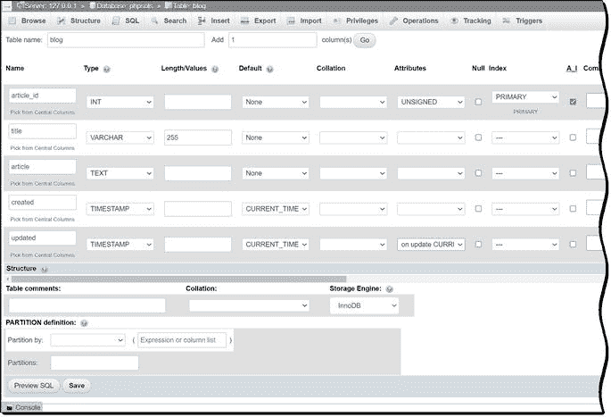
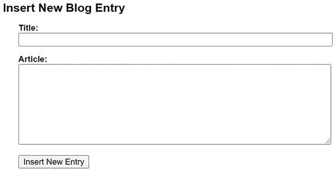
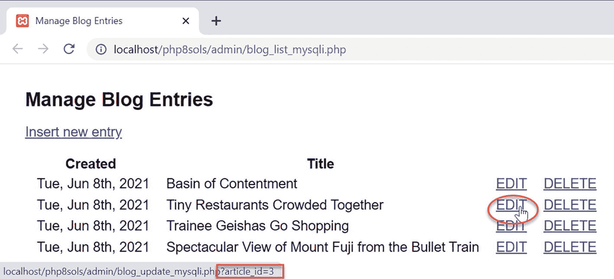
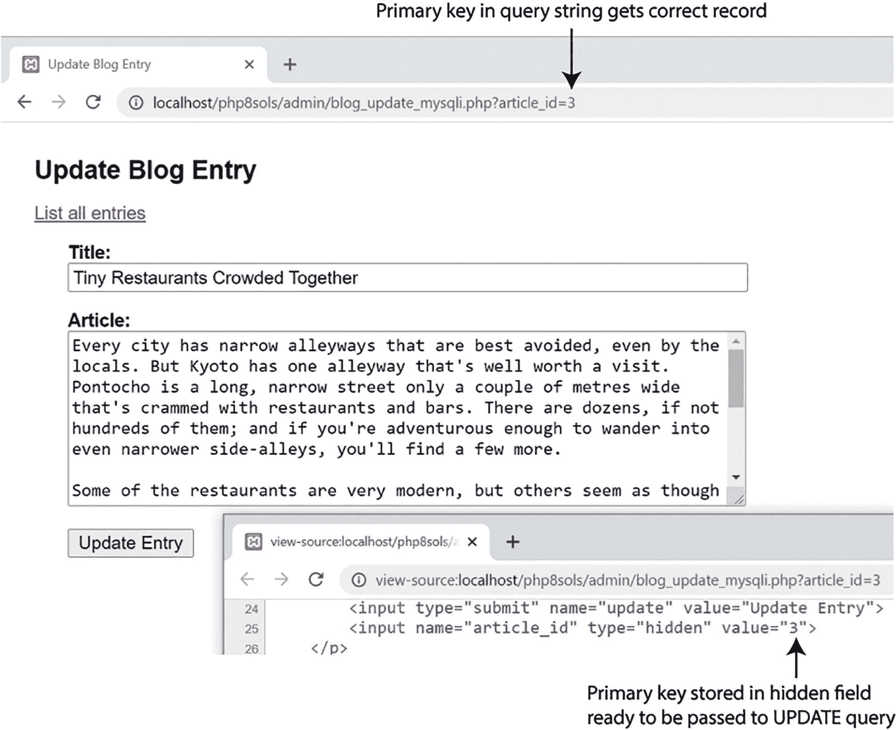
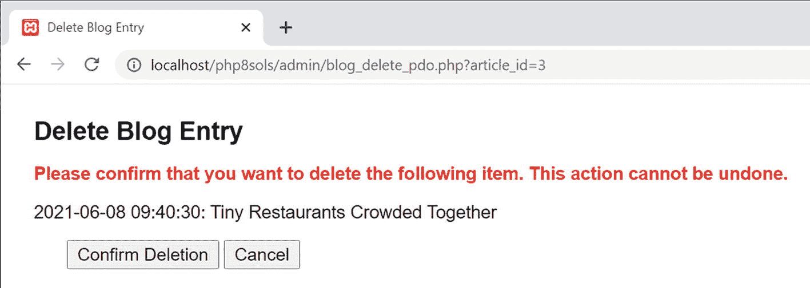

# 十五、管理内容

虽然您可以使用 phpMyAdmin 进行大量的数据库管理，但是您可能希望设置一些区域，让客户端可以登录到这些区域来更新一些数据，而不必让它们完全控制您的数据库。为此，您需要构建自己的表单并创建定制的内容管理系统。

每个内容管理系统的核心是有时被称为 CRUD(创建、读取、更新和删除)的循环，它仅使用四个 SQL 命令:`INSERT`、`SELECT`、`UPDATE`和`DELETE`。为了演示基本的 SQL 命令，本章将向您展示如何为一个名为`blog`的表构建一个简单的内容管理系统。

即使您不想构建自己的内容管理系统，本章介绍的四个命令对于任何数据库驱动的页面都是必不可少的，例如用户登录、用户注册、搜索表单、搜索结果等等。

在本章中，您将了解以下内容:

*   在数据库表中插入新记录

*   显示现有记录的列表

*   更新现有记录

*   删除记录前要求确认

## 建立内容管理系统

管理数据库表中的内容包括四个阶段，我通常将这四个阶段分配给四个独立但相互链接的页面:一个用于插入、更新和删除记录，另一个用于现有记录的列表。记录列表有两个目的:标识数据库中存储了什么，更重要的是，通过查询字符串传递记录的主键来链接到更新和删除脚本。

`blog`表格包含一系列标题和文本文章，将在日本旅程网站中显示，如图 [15-1](#Fig1) 所示。为了简单起见，这个表只包含五列:`article_id`(主键)、`title`、`article`、`created`和`updated`。


图 15-1

日本之旅网站中显示的博客表的内容

### 创建博客数据库表

如果您只想继续学习内容管理页面，请从`ch15`文件夹中的`blog.sql`导入表结构和数据。打开 phpMyAdmin，选择`phpsols`数据库，按照与第 [12 章](12.html)相同的方式导入表格。SQL 文件创建了这个表，并用四篇短文填充它。

如果您喜欢自己从头开始创建一切，打开 phpMyAdmin，选择`phpsols`数据库，如果还没有选择的话，单击`Structure`选项卡。在`Create table`部分，在`Name`字段中输入**博客**，在`Number of columns`字段中输入 **5** 。然后点击`Go`。使用以下截图和表 [15-1](#Tab1) : 中显示的设置

表 15-1

博客表的列定义

<colgroup><col class="tcol1 align-left"> <col class="tcol2 align-left"> <col class="tcol3 align-left"> <col class="tcol4 align-left"> <col class="tcol5 align-left"> <col class="tcol6 align-left"> <col class="tcol7 align-left"> <col class="tcol8 align-left"></colgroup> 
| 

田

 | 

类型

 | 

长度/值

 | 

默认

 | 

属性

 | 

空

 | 

索引

 | 

A_I

 |
| --- | --- | --- | --- | --- | --- | --- | --- |
| `article_id` | `INT` |   |   | `UNSIGNED` | 取消选择 | `PRIMARY` | 挑选 |
| `title` | `VARCHAR` | `255` |   |   | 取消选择 |   |   |
| `article` | `TEXT` |   |   |   | 取消选择 |   |   |
| `created` | `TIMESTAMP` |   | `CURRENT_TIMESTAMP` |   | 取消选择 |   |   |
| `updated` | `TIMESTAMP` |   | `CURRENT_TIMESTAMP` | `on update``CURRENT_TIMESTAMP` | 取消选择 |   |   |

`created`和`updated`列的默认值被设置为`CURRENT_TIMESTAMP`。所以当第一次输入记录时，两列得到相同的值。用于`updated`的`Attributes`列被设置为`on update CURRENT_TIMESTAMP`。这意味着每当记录发生更改时，它都会更新。为了跟踪记录最初是何时创建的，`created`列中的值永远不会更新。

### 创建基本的插入和更新表单

SQL 通过提供单独的命令，对插入和更新记录进行了重要的区分。`INSERT`仅用于创建一个全新的记录。插入记录后，必须使用`UPDATE`进行任何更改。因为这涉及到使用相同的字段，所以两个操作可以使用相同的页面。然而，这使得 PHP 更加复杂，所以我更喜欢先为插入页面创建 HTML，保存一个副本作为更新页面，然后分别编写代码。

插入页面中的表单只需要两个输入字段:标题和文章。其余三列的内容(主键和两个时间戳)被自动处理。插入表单的代码如下所示:

```php
<form method="post" action="blog_insert.php">
    <p>
        <label for="title">Title:</label>
        <input name="title" type="text" id="title">
    </p>
    <p>
        <label for="article">Article:</label>
        <textarea name="article" id="article"></textarea>
    </p>
    <p>
        <input type="submit" name="insert" value="Insert New Entry">
    </p>
</form>

```

表单使用了`post`方法。你可以在`blog_insert_mysqli_01.php`和`ch15`文件夹中的`blog_insert_pdo_01.php`中找到完整的代码。内容管理表单已经用`admin.css`赋予了一些基本的样式，它在`styles`文件夹中。在浏览器中查看时，该表单如下所示:



除了标题和提交按钮之外，更新表单是相同的。按钮代码是这样的(完整代码在`blog_update_mysqli_01.php`和`blog_update_pdo_01.php`):

```php
<input type="submit" name="update" value="Update Entry">

```

我给标题和文章输入字段起了与`blog`表中的列相同的名字。这使得以后编写 PHP 和 SQL 代码时更容易跟踪变量。

Tip

作为一种安全措施，一些开发人员建议使用数据库列的不同名称，因为任何人只需查看表单的源代码就可以看到输入字段的名称。使用不同的名称会增加闯入数据库的难度。在网站受密码保护的部分，这不应该是一个问题。但是，您可能希望考虑公开可访问的表单，例如用于用户注册或登录的表单。

### 插入新记录

向表中插入新记录的基本 SQL 如下所示:

```php
INSERT [INTO] table_name (column_names)
VALUES (values)

```

`INTO`在方括号中，这意味着它是可选的。它纯粹是为了让 SQL 读起来更像人类语言。列名可以按照您喜欢的任何顺序排列，但是第二组括号中的值必须按照它们所引用的列的顺序排列。

虽然 MySQLi 和 PDO 的代码非常相似，但为了避免混淆，我将分别处理它们。

Note

本章中的许多脚本使用了一种称为“设置标志”的技术`flag`是一个布尔变量，它被初始化为`true`或`false`，用于检查是否有事情发生。例如，如果`$OK`最初被设置为`false`，并且只有当一个数据库查询成功执行时才被重置为`true`，那么它可以被用作控制另一个代码块的条件。

#### PHP 解决方案 15-1:用 MySQLi 插入新记录

这个 PHP 解决方案展示了如何使用 MySQLi 预准备语句向`blog`表中插入一条新记录。使用预处理语句可以避免转义引号和控制字符的问题。它还可以保护你的数据库免受 SQL 注入病毒的攻击(参见第 [13 章](13.html))。

1.  在`php8sols`站点根目录下创建一个名为`admin`的文件夹。从`ch15`文件夹中复制`blog_insert_mysqli_01.php`，在新文件夹中另存为`blog_insert_mysqli.php`。

2.  插入新记录的代码应该只在表单已经提交的情况下运行，所以它包含在一个条件语句中，该语句检查`$_POST`数组中提交按钮(`insert`)的`name`属性。将以下内容置于`DOCTYPE`声明之上:

```php
<?php
if (isset($_POST['insert'])) {
    require_once '../includes/connection.php';
    // initialize flag
    $OK = false;
    // create database connection
    // initialize prepared statement
    // create SQL
    // bind parameters and execute statement
    // redirect if successful or display error
}
?>

```

包含连接函数后，代码将`$OK`设置为`false`。只有在没有错误的情况下，才会重置为`true`。结尾的五个注释规划了我们接下来要填写的剩余步骤。

1.  以具有读写权限的用户身份创建一个到数据库的连接，初始化一个准备好的语句，并为将从用户输入中获得的数据创建带有占位符的 SQL，如下所示:

```php
// create database connection
$conn = dbConnect('write');
// initialize prepared statement
$stmt = $conn->stmt_init();
// create SQL
$sql = 'INSERT INTO blog (title, article)
           VALUES(?, ?)';

```

将从`$_POST['title']`和`$_POST['article']`中导出的值由问号占位符表示。其他列将自动填充。`article_id`列为主键，使用`AUTO_INCREMENT`，`created`和`updated`列默认为`CURRENT_TIMESTAMP`。

Note

该代码与第 [13 章](13.html)的顺序略有不同。该脚本将在第 [17 章](17.html)中进一步开发，以运行一系列 SQL 查询，因此首先初始化准备好的语句。

1.  下一步是用变量中保存的值替换问号——这个过程叫做**绑定参数**。插入以下代码:

```php
if ($stmt->prepare($sql)) {
    // bind parameters and execute statement
    $stmt->bind_param('ss', $_POST['title'], $_POST['article']);
    $stmt->execute();
    if ($stmt->affected_rows > 0) {
        $OK = true;
    }
}

```

这是保护您的数据库免受 SQL 注入攻击的部分。按照您希望将变量插入到 SQL 查询中的顺序，将变量传递给`bind_param()`方法，同时传递指定每个变量的数据类型的第一个参数，同样按照变量的顺序。两者都是字符串，所以这个参数是`'ss'`。

一旦值被绑定到占位符，调用`execute()`方法。

`affected_rows`属性记录了有多少行受到了`INSERT`、`UPDATE`或`DELETE`查询的影响。

Caution

如果查询触发了 MySQL 错误，`affected_rows`返回 1。与一些计算语言不同，PHP 将 1 视为`true`。因此，您需要检查`affected_rows`是否大于零，以确保查询成功。如果大于零，`$OK`复位到`true`。

1.  最后，将页面重定向到现有记录的列表，或者显示任何错误消息。在上一步之后添加以下代码:

1.  在页面正文中添加以下代码块，以便在插入操作失败时显示错误消息:

    ```php
    <h1>Insert New Blog Entry</h1>
    <?php if (isset($error)) {
        echo "<p>Error: $error</p>";
        } ?>
    <form method="post" action="blog_insert_mysqli.php">

    ```

```php
// redirect if successful or display error
    if ($OK) {
        header('Location:
            http://localhost/php8sols/admin/blog_list_mysqli.php');
        exit;
    } else {
        $error = $stmt->error;
    }
}
?>

```

完整的代码在`ch15`文件夹的`blog_insert_mysqli_02.php`中。

这就完成了插入页面，但是在测试之前，创建`blog_list_mysqli.php`，这在 PHP 解决方案 15-3 中有描述。

**注意**为了关注与数据库交互的代码，本章中的脚本不认证用户输入。在实际应用中，您应该使用第 6 章[中描述的技术来检查从表单提交的数据，如果发现错误，就重新显示。](06.html)

#### PHP 解决方案 15-2:用 PDO 插入新记录

这个 PHP 解决方案展示了如何使用 PDO 预处理语句在`blog`表中插入一条新记录。如果您还没有这样做，在`php8sols`站点根目录下创建一个名为`admin`的文件夹。

1.  将`blog_insert_pdo_01.php`复制到`admin`文件夹，并保存为`blog_insert_pdo.php`。

2.  插入新记录的代码应该只在表单已经提交的情况下运行，所以它包含在一个条件语句中，该语句检查`$_POST`数组中提交按钮(`insert`)的`name`属性。将以下内容放在 PHP 块中的`DOCTYPE`声明上方:

```php
if (isset($_POST['insert'])) {
    require_once '../includes/connection.php';
    // initialize flag
    $OK = false;
    // create database connection
    // create SQL
    // prepare the statement
    // bind the parameters and execute the statement
    // redirect if successful or display error
}

```

包含连接函数后，代码将`$OK`设置为`false`。只有在没有错误的情况下，才会重置为`true`。结尾的五个注释指出了剩下的步骤。

1.  以具有读写权限的用户身份创建到数据库的 PDO 连接，并构建如下 SQL:

```php
// create database connection
$conn = dbConnect('write', 'pdo');
// create SQL
$sql = 'INSERT INTO blog (title, article)
VALUES(:title, :article)';

```

将从变量派生的值由命名的占位符表示，占位符由冒号(`:title`和`:article`)开头的列名组成。其他列的值将由数据库生成。`article_id`主键自动递增，`created`和`updated`列的默认值设置为`CURRENT_TIMESTAMP`。

1.  下一步是初始化准备好的语句，并将变量值绑定到占位符——这个过程称为**绑定** **参数**。添加以下代码:

```php
// prepare the statement
$stmt = $conn->prepare($sql);
// bind the parameters and execute the statement
$stmt->bindParam(':title', $_POST['title'], PDO::PARAM_STR);
$stmt->bindParam(':article', $_POST['article'], PDO::PARAM_STR);
// execute and get number of affected rows
$stmt->execute();
$OK = $stmt->rowCount();

```

首先将 SQL 查询传递给数据库连接的`prepare()`方法(`$conn`)，并将对语句的引用存储为变量(`$stmt`)。

接下来，变量中的值被绑定到准备好的语句中的占位符，然后`execute()`方法运行查询。

当与`INSERT`、`UPDATE`或`DELETE`查询一起使用时，PDO `rowCount()`方法报告受查询影响的行数。如果记录插入成功，`$OK`为`1`，PHP 将其视为`true`。否则就是`0`，按`false`处理。

1.  最后，将页面重定向到现有记录的列表，或者显示任何错误消息。在上一步之后添加以下代码:

```php
// redirect if successful or display error
    if ($OK) {
        header('Location: http://localhost/php8sols/admin/blog_list_pdo.php');
        exit;
    } else {
        $error = $stmt->errorInfo()[2];
    }
}
?>

```

错误消息(如果有的话)被存储为由`$stmt->errorInfo()`返回的数组的第三个元素，并使用数组解引用来访问。

1.  在页面正文中添加一个 PHP 代码块，以显示任何错误消息:

```php
<h1>Insert New Blog Entry</h1>
<?php if (isset($error)) {
    echo "<p>Error: $error</p>";
} ?>
<form method="post" action="blog_insert_pdo.php">

```

完整的代码在`ch15`文件夹的`blog_insert_pdo_02.php`中。

这就完成了插入页面，但是在测试之前，创建`blog_list_pdo.php`，这将在下面描述。

### 链接到更新和删除页面

在更新或删除记录之前，您需要找到它的主键。一种实用的方法是查询数据库以选择所有记录。您可以使用此查询的结果来显示所有记录的列表，包括指向更新和删除页面的链接。通过将`article_id`的值添加到每个链接的查询字符串中，可以自动识别要更新或删除的记录。如图 [15-2](#Fig2) 所示，浏览器状态栏(左下方)显示的网址将文章`Tiny Restaurants Crowded Together`的`article_id`标识为 3。



图 15-2

编辑和删除链接在查询字符串中包含记录的主键

更新页面使用它来显示准备更新的正确记录。相同的信息在指向删除页面的`DELETE`链接中传达。

要创建这样的列表，您需要从一个 HTML 表开始，该表包含两行和您想要显示的所有列，外加两个用于编辑和删除链接的额外列。第一行用于列标题。第二行包含在一个 PHP 循环中，显示所有结果。`ch15`文件夹中的`blog_list_mysqli_01.php`中的表格如下所示(`blog_list_pdo_01.php`中的版本是相同的，除了最后两个表格单元格中的链接指向 PDO 版本的更新和删除页面):

```php
<table>
    <tr>
       <th>Created</th>
       <th>Title</th>
       <th>&nbsp;</th>
       <th>&nbsp;</th>
    </tr>
    <tr>
       <td></td>
       <td></td>
       <td><a href="blog_update_mysqli.php">EDIT</a></td>
       <td><a href="blog_delete_mysqli.php">DELETE</a></td>
    </tr>
</table>

```

#### PHP 解决方案 15-3:创建更新和删除页面的链接

这个 PHP 解决方案展示了如何创建一个页面，通过显示所有记录的列表并链接到更新和删除页面来管理`blog`表中的记录。MySQLi 和 PDO 版本之间只有微小的差异，所以这些说明对两者都进行了描述。

将`blog_list_mysqli_01.php`或`blog_list_pdo_01.php`复制到`admin`文件夹，并将其保存为`blog_list_mysqli.php`或`blog_list_pdo.php`，这取决于您计划使用的连接方法。不同的版本链接到适当的插入、更新和删除文件。

1.  您需要连接到数据库并创建 SQL 查询。在 PHP 块中的`DOCTYPE`声明上方添加以下代码:

```php
require_once '../includes/connection.php';
require_once '../includes/utility_funcs.php';
// create database connection
$conn = dbConnect('read');
$sql = 'SELECT * FROM blog ORDER BY created DESC';

```

如果使用 PDO，将`'pdo'`作为第二个参数添加到`dbConnect()`中。

1.  通过在结束 PHP 标记前添加以下代码来提交查询。

对于 MySQLi，使用这个:

```php
$result = $conn->query($sql);
if (!$result) {
    $error = $conn->error;
}

```

对于 PDO，使用这个:

1.  在表格前添加一个条件语句以显示任何错误消息，并将表格放在`else`块中。表格前的代码如下所示:

    ```php
    <?php if (isset($error)) {
        echo "<p>$error</p>";
    } else { ?>

    ```

```php
$result = $conn->query($sql);
$error = $conn->errorInfo()[2];

```

右花括号放在右`</table>`标签后的一个单独的 PHP 块中。

*   对于 MySQLi，使用这个:

1.  现在，您需要将第二个表行包含在一个循环中，并从结果集中检索每条记录。以下代码位于第一行的结束标签`</tr>`和第二行的开始标签`<tr>`之间。

```php
</tr>
    <?php while($row = $result->fetch_assoc()) { ?>
<tr>

```

对于 PDO，使用这个:

```php
</tr>
    <?php while ($row = $result->fetch()) { ?>
<tr>

```

这和上一章一样，所以应该不需要解释。

1.  在第二行的前两个单元格中显示当前记录的`created`和`title`字段，如下所示:

    ```php
    <td><?= $row['created'] ?></td>
    <td><?= safe($row['title']) ?></td>

    ```

`created`列存储一个`TIMESTAMP`数据类型，这是一个固定的格式，所以不需要净化。但是`title`列是文本相关的，所以需要传递给第 [13 章](13.html)中定义的`safe()`函数。

1.  在接下来的两个单元格中，将当前记录的查询字符串和`article_id`字段的值添加到两个 URL 中，如下所示(虽然链接不同，但突出显示的代码对于 PDO 版本是相同的):

    ```php
    <td><a href="blog_update_mysqli.php?article_id=<?= $row['article_id'] ?>"
        >EDIT</a></td>
    <td><a href="blog_delete_mysqli.php?article_id=<?= $row['article_id'] ?>"
        >DELETE</a></td>

    ```

您在这里所做的是将`?article_id=`添加到 URL，然后使用 PHP 显示`$row['article_id']`的值。`article_id`列只存储整数，所以不需要对值进行清理。不要留下任何可能破坏 URL 或查询字符串的空格，这一点很重要。在处理完 PHP 之后，当在浏览器中查看页面的源代码时，开始的`<a>`标记应该是这样的(尽管数量会根据记录而变化):

1.  最后，用花括号封闭第二个表格行周围的循环，如下所示:

    ```php
    </tr>
        <?php } ?>
    </table>

    ```

2.  保存`blog_list_mysqli.php`或`blog_list_pdo.php`并将页面加载到浏览器中。假设您之前已经将`blog.sql`的内容加载到了`phpsols`数据库中，您应该会看到一个包含四个条目的列表，如图 [15-2](#Fig2) 所示。你现在可以测试`blog_insert_mysqli.php`或者`blog_insert_pdo.php`。插入项目后，您将返回到`blog_list.php`的相应版本，创建日期和时间以及新项目的标题将显示在列表的顶部。如果遇到任何问题，对照`ch15`文件夹中的`blog_list_mysqli_02.php`或`blog_list_pdo_02.php`检查您的代码。

```php
<a href="blog_update_mysqli.php?article_id=2">

```

**提示**这段代码假设表中总会有一些记录。作为练习，使用 PHP 解决方案 13-2 (MySQLi)或 13-4 (PDO)中的技术来计算结果的数量，如果没有找到记录，使用条件语句来显示消息。解决方案在`blog_list_norec_mysqli.php`和`blog_list_norec_pdo.php`里。

### 更新记录

更新页面需要执行两个独立的过程，如下所示:

1.  检索所选记录，并显示它以备编辑

2.  更新数据库中已编辑的记录

第一阶段使用`$_GET`超全局数组从 URL 中检索主键，然后使用它来选择并在更新表单中显示记录，如图 [15-3](#Fig3) 所示。



图 15-3

主键在更新过程中跟踪记录

主键存储在更新表单的隐藏字段中。在更新页面中编辑完记录后，使用`post`方法提交表单，将所有细节(包括主键)传递给`UPDATE`命令。

SQL `UPDATE`命令的基本语法如下所示:

```php
UPDATE table_name SET column_name = value, column_name = value
WHERE condition

```

更新特定记录时的条件是主键。因此，当更新`blog`表中的`article_id 3`时，基本的`UPDATE`查询如下所示:

```php
UPDATE blog SET title = value, article = value
WHERE article_id = 3

```

尽管 MySQLi 和 PDO 的基本原理是相同的，但代码差别很大，需要单独的指令。

#### PHP 解决方案 15-4:用 MySQLi 更新记录

这个 PHP 解决方案展示了如何将一个现有记录加载到更新表单中，然后使用 MySQLi 将编辑过的细节发送到数据库进行更新。要加载记录，您需要创建列出所有记录的管理页面，如 PHP 解决方案 15-3 中所述。

1.  从`ch15`文件夹中复制`blog_update_mysqli_01.php`并在`admin`文件夹中保存为`blog_update_mysqli.php`。

2.  第一个阶段包括检索您想要更新的记录的详细信息。将以下代码放在 PHP 块中的`DOCTYPE`声明上方:

```php
require_once '../includes/connection.php';
require_once '../includes/utility_funcs.php';
// initialize flags
$OK = false;
$done = false;
// create database connection
$conn = dbConnect('write');
// initialize statement
$stmt = $conn->stmt_init();
// get details of selected record
if (isset($_GET['article_id']) && !$_POST) {
    // prepare SQL query
    $sql = 'SELECT article_id, title, article
               FROM blog WHERE article_id = ?';
    if ($stmt->prepare($sql)) {
        // bind the query parameter
        $stmt->bind_param('i', $_GET['article_id']);
        // execute the query, and fetch the result
        $OK = $stmt->execute();
        // bind the results to variables
        $stmt->bind_result($article_id, $title, $article);
        $stmt->fetch();
    }
}
// redirect if $_GET['article_id'] not defined
if (!isset($_GET['article_id'])) {
    $url = 'http://localhost/php8sols/admin/blog_list_mysqli.php';
    header("Location: $url");
    exit;
}
// get error message if query fails
if (isset($stmt) && !$OK && !$done) {
    $error = $stmt->error;
}

```

尽管这非常类似于用于插入页面的代码，但是前几行是在条件语句之外的*。更新过程的两个阶段都需要数据库连接和准备好的语句，因此这避免了以后重复相同代码的需要。初始化两个标志:`$OK`检查检索记录是否成功，以及`$done`检查更新是否成功。*

第一个条件语句确保`$_GET['article_id']`存在，并且`$_POST`数组为空。因此，只有在设置了查询字符串，但表单还没有提交时，才会执行大括号内的代码。

您以与准备`INSERT`命令相同的方式准备`SELECT`查询，使用问号作为变量的占位符。但是，请注意，该查询不是使用星号来检索所有列，而是按名称指定三列，如下所示:

```php
$sql = 'SELECT article_id, title, article
           FROM blog WHERE article_id = ?';

```

这是因为 MySQLi 预准备语句允许您将`SELECT`查询的结果绑定到变量，为了能够做到这一点，您必须指定列名和您希望它们出现的顺序。

首先，您需要初始化准备好的语句，并用`$stmt->bind_param()`将`$_GET['article_id']`绑定到查询。因为`article_id`的值必须是整数，所以将`'i'`作为第一个参数传递。

代码执行查询，然后在获取结果之前，按照与在`SELECT`查询中指定的列相同的顺序将结果绑定到变量。

如果还没有定义`$_GET['article_id']`，下一个条件语句将页面重定向到`blog_list_mysqli.php`。这可以防止任何人试图直接在浏览器中加载更新页面。重定向位置已被分配给一个变量，因为如果更新成功，稍后将向该变量添加一个查询字符串。

如果预准备语句已创建，但`$OK`和`$done`仍为`false`，则最终条件语句会存储一条错误消息。您还没有添加更新脚本，但是如果成功检索或更新记录，其中一个将切换到`true`。因此，如果两者都保持`false`，您就知道其中一个 SQL 查询有问题。

1.  现在您已经检索了记录的内容，您需要在更新表单中显示它们。如果准备好的语句成功，`$article_id`应该包含要更新的记录的主键，因为它是您用`bind_result()`方法绑定到结果集的变量之一。

但是，如果有错误，您需要在屏幕上显示消息。但是如果有人将查询字符串更改为无效数字，`$article_id`将被设置为`0`，因此显示更新表单没有任何意义。在开始的`<form>`标签前添加以下条件语句:

```php
<p><a href="blog_list_mysqli.php">List all entries </a></p>
<?php if (isset($error)) {
    echo "<p class='warning'>Error: $error</p>";
}
if($article_id == 0) { ?>
    <p class="warning">Invalid request: record does not exist.</p>
<?php } else { ?>
<form method="post" action="blog_update_mysqli.php">

```

第一条条件语句显示 MySQLi 预准备语句报告的任何错误消息。第二个将更新表单包装在一个`else`块中，所以如果`$article_id`是`0`，表单将被隐藏。

1.  在结束的`</form>`标签后立即添加`else`块的结束花括号，如下所示:

    ```php
    </form>
           <?php } ?>
    </body>

    ```

2.  如果`$article_id`不是`0`，你知道`$title`和`$article`也包含有效值，可以显示在更新表单中，无需进一步测试。然而，您需要将文本值传递给`safe()`，以避免引号和可执行代码的问题。在`title`输入字段的`value`属性中显示`$title`，如下所示:

1.  对`article`文本区做同样的操作。因为文本区域没有 value 属性，所以代码位于开始和结束的`<textarea>`标记之间，如下所示:

```php
<input name="title" type="text" id="title" value="<?= safe($title) ?>">

```

```php
<textarea name="article" id="article"><?= safe($article) ?></textarea>

```

确保开始和结束 PHP 和`<textarea>`标记之间没有空格。否则，您将在更新的记录中得到不需要的空格。

1.  `UPDATE`命令需要知道您想要更改的记录的主键。您需要将主键存储在一个隐藏字段中，以便与其他细节一起在`$_POST`数组中提交。因为隐藏字段不会显示在屏幕上，所以下面的代码可以放在表单中的任何位置:

1.  保存更新页面，并通过将`blog_list_mysqli.php`加载到浏览器中并选择其中一条记录的`EDIT`链接来测试它。记录的内容应该显示在表单字段中，如图 [15-3](#Fig3) 所示。

```php
<input name="article_id" type="hidden" value="<?= $article_id ?>">

```

`Update Entry`按钮还不能做任何事情。只要确保一切都正确显示，并确认主键在隐藏字段中注册。如果有必要，您可以对照`blog_update_mysqli_02.php`检查您的代码。

1.  提交按钮的`name`属性是`update`，所以所有的更新处理代码都需要放在一个条件语句中，该语句检查`$_POST`数组中是否存在`update`。将下面以粗体突出显示的代码放在步骤 1 中重定向页面的代码的正上方:

```php
$stmt->fetch();
    }
}
// if form has been submitted, update record
if (isset($_POST ['update'])) {
    // prepare update query
    $sql = 'UPDATE blog SET title = ?, article = ?
               WHERE article_id = ?';
    if ($stmt->prepare($sql)) {
        $stmt->bind_param('ssi', $_POST['title'], $_POST['article'],
            $_POST['article_id']);
        $done = $stmt->execute();
    }
}
// redirect page on success or if $_GET['article_id']) not defined
if ($done || !isset($_GET['article_id'])) {
    $url = 'http://localhost/php8sols/admin/blog_list_mysqli.php';
    if ($done) {
        $url .= '?updated=true';
    }
    header("Location: $url");
    exit;
}

```

`UPDATE`查询准备了问号占位符，其中的值由变量提供。准备好的语句已经在条件语句之外的代码中初始化，所以您可以将 SQL 传递给`prepare()`方法，并用`$stmt->bind_param()`绑定变量。前两个变量是字符串，第三个是整数，所以第一个参数是`'ssi'`。

如果`UPDATE`查询成功，`execute()`方法返回`true`，重置`$done`的值。与`INSERT`查询不同，使用`affected_rows`属性没有什么意义，因为如果用户决定单击`Update Entry`按钮而不做任何更改，它将返回`0`，所以我们在这里不使用它。您需要将`$done ||`添加到重定向脚本的条件中。这确保了在更新成功或有人试图直接访问页面时页面被重定向。

如果更新成功，一个查询字符串将被追加到重定向位置。

1.  编辑`blog_list_mysqli.php`中表格上方的 PHP 块，显示一条记录已被更新的消息，如下所示:

```php
<?php if (isset($error)) {
    echo "<p>$error</p>";
} else {
    if (isset($_GET['updated'])) {
        echo '<p>Record updated</p>';
    }
?>
<table>

```

该条件语句嵌套在现有的`else`块中；不是`elseif`的说法。因此，在记录更新后，它将与数据库记录表一起显示。

1.  保存`blog_update_mysqli.php`并通过加载`blog_list_mysqli.php`，选择一个`EDIT`链接，并对显示的记录进行更改来测试它。当您点击`Update Entry`时，您将被带回`blog_list_mysqli.php`，列表上方将出现“记录已更新”。您可以通过再次单击相同的`EDIT`链接来验证您所做的更改。如有必要，用`blog_update_mysqli_03.php`和`blog_list_mysqli_03.php`检查您的代码。

#### PHP 解决方案 15-5:用 PDO 更新记录

这个 PHP 解决方案展示了如何将现有记录加载到更新表单中，然后使用 PDO 将编辑后的详细信息发送到数据库进行更新。要加载记录，您需要创建列出所有记录的管理页面，如 PHP 解决方案 15-3 中所述。

1.  从`ch15`文件夹中复制`blog_update_pdo_01.php`并在`admin`文件夹中保存为`blog_update_pdo.php`。

2.  第一个阶段包括检索您想要更新的记录的详细信息。将以下代码放在 PHP 块中的`DOCTYPE`声明上方:

```php
require_once '../includes/connection.php';
require_once '../includes/utility_funcs.php';
// initialize flags
$OK = false;
$done = false;
// create database connection
$conn = dbConnect('write', 'pdo');
// get details of selected record
if (isset($_GET['article_id']) && !$_POST) {
    // prepare SQL query
    $sql = 'SELECT article_id, title, article FROM blog
                WHERE article_id = ?';
    $stmt = $conn->prepare($sql);
    // pass the placeholder value to execute() as a single-element array
    $OK = $stmt->execute([$_GET['article_id']]);
    // bind the results
    $stmt->bindColumn(1, $article_id);
    $stmt->bindColumn(2, $title);
    $stmt->bindColumn(3, $article);
    $stmt->fetch();
}
// redirect if $_GET['article_id'] not defined
if (!isset($_GET['article_id'])) {
    $url = 'http://localhost/php8sols/admin/blog_list_pdo.php';
    header("Location: $url");
    exit;
}
if (isset($stmt)) {
    // get error message (will be null if no error)
    $error = $stmt->errorInfo()[2];
}

```

虽然这非常类似于用于插入页面的代码，但是前几行是第一个条件语句之外的*。更新过程的两个阶段都需要数据库连接，因此这避免了以后复制相同代码的需要。初始化两个标志:`$OK`检查检索记录是否成功，以及`$done`检查更新是否成功。*

第一个条件语句检查`$_GET['article_id']`是否存在，以及`$_POST`数组是否为空。这确保了只有在设置了查询字符串，但表单还没有提交时，才执行里面的代码。

在为插入表单准备 SQL 查询时，您为变量使用了命名占位符。这次，我们用一个问号，像这样:

```php
$sql = 'SELECT article_id, title, article FROM blog
           WHERE article_id = ?';

```

只有一个变量需要绑定到匿名占位符，所以将其作为单元素数组直接传递给`execute()`方法，如下所示:

```php
$OK = $stmt->execute([$_GET['article_id']]);

```

Caution

这段代码使用数组简写语法，所以`$_GET['article_id']`被放在一对方括号中。不要忘记数组的右方括号。

然后用`bindColumn()`方法将结果绑定到`$article_id`、`$title`和`$article`。这一次，我使用数字(从 1 开始计数)来表示将每个变量绑定到哪一列。

结果中只有一条记录要获取，所以立即调用`fetch()`方法。

如果还没有定义`$_GET['article_id']`，下一个条件语句将页面重定向到`blog_list_pdo.php`。这可以防止任何人试图直接在浏览器中加载更新页面。重定向位置已被分配给一个变量，因为如果更新成功，稍后将向该变量添加一个查询字符串。

最后一条条件语句从准备好的语句中检索任何错误消息。它与其余的预准备语句代码是分开的，因为它还将用于您稍后将添加的第二个预准备语句。

1.  现在您已经检索了记录的内容，您需要在更新表单中显示它们。如果准备好的语句成功，`$article_id`应该包含要更新的记录的主键，因为它是您用`bindColumn()`方法绑定到结果集的变量之一。

但是，如果有错误，您需要在屏幕上显示该消息。但是如果有人将查询字符串更改为无效数字，`$article_id`将被设置为`0`，因此显示更新表单没有任何意义。在开始的`<form>`标签前添加以下条件语句:

```php
<p><a href="blog_list_pdo.php">List all entries </a></p>
<?php if (isset($error)) {
    echo "<p class='warning'>Error: $error</p>";
}
if($article_id == 0) { ?>
    <p class="warning">Invalid request: record does not exist.</p>
<?php } else { ?>
<form method="post" action="blog_update_pdo.php">

```

第一条条件语句显示 PDO 预处理语句报告的任何错误消息。第二个将更新表单包装在一个`else`块中，所以如果`$article_id`是`0`，表单将被隐藏。

1.  在结束的`</form>`标签后立即添加`else`块的结束花括号，如下所示:

    ```php
    </form>
          <?php } ?>
    </body>

    ```

2.  如果`$article_id`不是`0`，你知道`$title`和`$article`也存在，可以显示在更新表单中，无需进一步测试。然而，您需要将文本值传递给`safe()`，以避免引号和可执行代码的问题。在`title`输入字段的`value`属性中显示`$title`，如下所示:

1.  对`article`文本区做同样的操作。因为文本区域没有 value 属性，所以代码位于开始和结束的`<textarea>`标记之间，如下所示:

```php
<input name="title" type="text" id="title" value="<?= safe($title) ?>">

```

```php
<textarea name="article" id="article"><?= safe($article) ?></textarea>

```

确保开始和结束 PHP 和`<textarea>`标记之间没有空格。否则，您将在更新的记录中得到不需要的空格。

1.  `UPDATE`命令需要知道您想要更改的记录的主键。您需要将主键存储在一个隐藏字段中，以便与其他细节一起在`$_POST`数组中提交。因为隐藏字段不会显示在屏幕上，所以下面的代码可以放在表单中的任何位置:

1.  保存更新页面，并通过将`blog_list_pdo.php`加载到浏览器中并选择其中一条记录的`EDIT`链接来测试它。记录的内容应该显示在表单字段中，如图 [15-3](#Fig3) 所示。

```php
<input name="article_id" type="hidden" value="<?= $article_id ?>">

```

`Update Entry`按钮还不能做任何事情。只要确保一切都正确显示，并确认主键在隐藏字段中注册。如果有必要，您可以对照`blog_update_pdo_02.php`检查您的代码。

1.  提交按钮的`name`属性是`update`，所以所有的更新处理代码都需要放在一个条件语句中，该语句检查`$_POST`数组中是否存在`update`。将下面以粗体突出显示的代码放在步骤 1 中重定向页面的代码的正上方:

```php
$stmt->fetch();
}
// if form has been submitted, update record
if (isset($_POST['update'])) {
    // prepare update query
    $sql = 'UPDATE blog SET title = ?, article = ?
               WHERE article_id = ?';
    $stmt = $conn->prepare($sql);
    // execute query by passing array of variables
    $done = $stmt->execute([$_POST['title'], $_POST['article'],
        $_POST['article_id']]);
}
// redirect page on success or $_GET['article_id'] not defined
if ($done || !isset($_GET['article_id'])) {
    $url = 'http://localhost/php8sols/admin/blog_list_pdo.php';
    if ($done) {
        $url .= '?updated=true';
    }
    header("Location: $url");
    exit;
}

```

同样，SQL 查询是使用问号作为从变量派生的值的占位符来准备的。这一次，有三个占位符，因此相应的变量需要作为数组传递给`execute()`方法。不用说，数组的顺序必须与占位符的顺序相同。

如果`UPDATE`查询成功，`execute()`方法返回`true`，重置`$done`的值。这里不能使用`rowCount()`方法来获得受影响的行数，因为如果没有做任何更改就点击`Update Entry`按钮，它会返回`0`。您会注意到我们在重定向脚本的条件中添加了`$done ||`。这确保了在更新成功或有人试图直接访问页面时页面被重定向。如果记录已被更新，一个查询字符串将被追加到重定向位置。

1.  编辑`blog_list_pdo.php`中表格上方的 PHP 块，显示一条记录已被更新的消息，如下所示:

```php
<?php if (isset($error)) {
    echo "<p>$error</p>";
} else {
    if (isset($_GET['updated'])) {
        echo '<p>Record updated</p>';
    }
?>
<table>

```

该条件语句嵌套在现有的`else`块中；不是`elseif`的说法。因此，在记录更新后，它将与数据库记录表一起显示。

1.  保存`blog_update_pdo.php`并通过加载`blog_list_pdo.php`，选择一个`EDIT`链接，并对显示的记录进行更改来测试它。当您点击`Update Entry`时，您将被带回`blog_list_pdo.php`，列表上方将出现“记录已更新”。您可以通过再次单击相同的`EDIT`链接来验证您所做的更改。如有必要，对照`blog_update_pdo_03.php`和`blog_list_pdo_03.php`检查您的代码。

### 删除记录

删除数据库中的记录类似于更新记录。基本的`DELETE`命令如下所示:

```php
DELETE FROM table_name WHERE condition

```

令`DELETE`命令具有潜在危险的是，它是最终命令。一旦你删除了一条记录，就再也无法恢复了——它永远消失了。没有回收站或垃圾桶来把它捞出来。更糟糕的是，`WHERE`子句是可选的。如果你忽略了它，表中的每一条记录都会不可挽回地被送进网络遗忘。因此，最好显示要删除的记录的详细信息，并要求用户确认或取消该过程(参见图 [15-4](#Fig4) )。



图 15-4

删除记录是不可逆的，所以在继续之前要得到确认

构建和编写删除页面的脚本几乎与更新页面相同，所以我不会给出一步一步的说明。但是，以下是要点:

*   检索所选记录的详细信息。

*   显示足够的详细信息，如标题，以便用户确认选择了正确的记录。

*   给`Confirm Deletion`和`Cancel`按钮赋予不同的`name`属性，使用每个`name`属性和`isset()`来控制所采取的动作。

*   使用条件语句隐藏`Confirm Deletion`按钮和隐藏字段，而不是将整个表单包装在`else`块中。

为每个方法执行删除的代码如下。

对于 MySQLi:

```php
if (isset($_POST['delete'])) {
    $sql = 'DELETE FROM blog WHERE article_id = ?';
    if ($stmt->prepare($sql)) {
        $stmt->bind_param('i', $_POST['article_id']);
        $stmt->execute();
        if ($stmt->affected_rows > 0) {;
            $deleted = true;
        } else {
            $error = 'There was a problem deleting the record.';
        }
    }
}

```

对于 PDO:

```php
if (isset($_POST['delete'])) {
    $sql = 'DELETE FROM blog WHERE article_id = ?';
    $stmt = $conn->prepare($sql);
    $stmt->execute([$_POST['article_id']]);
    // get number of affected rows
    $deleted = $stmt->rowCount();
    if (!$deleted) {
        $error = 'There was a problem deleting the record.';
        $error .= $stmt->errorInfo()[2];
    }
}

```

你可以在`ch15`文件夹的`blog_delete_mysqli.php`和`blog_delete_pdo.php`中找到完成的代码。为了测试删除脚本，将适当的文件复制到`admin`文件夹中。

## 回顾四个基本的 SQL 命令

既然你已经看到了`SELECT`、`INSERT`、`UPDATE`和`DELETE`的运行，让我们回顾一下 MySQL 和 MariaDB 的基本语法。这不是一个详尽的列表，但它集中在最重要的选项上，包括一些尚未涉及的选项。

我在 [`https://dev.mysql.com/doc/refman/8.0/en/`](https://dev.mysql.com/doc/refman/8.0/en/) 使用了与 MySQL 在线手册相同的排版约定(您可能也想参考):

*   任何大写的都是 SQL 命令。

*   方括号中的表达式是可选的。

*   小写斜体表示变量输入。

*   一个竖线(`|`)分隔选项。

尽管有些表达式是可选的，但它们必须按列出的顺序出现。例如，在一个`SELECT`查询中，`WHERE`、`ORDER BY`和`LIMIT`都是可选的，但是`LIMIT`不能出现在`WHERE`或`ORDER BY`之前。

### 挑选

`SELECT`用于从一个或多个表中检索记录。其基本语法如下:

```php
SELECT [DISTINCT] select_list
FROM table_list
[WHERE where_expression]
[ORDER BY col_name | formula] [ASC | DESC]
[LIMIT [skip_count,] show_count]

```

`DISTINCT`选项告诉数据库您想要从结果中消除重复的行。

*select_list* 是您希望包含在结果中的列的逗号分隔列表。若要检索所有列，请使用星号(*)。如果同一个列名在多个表中使用，引用必须明确，使用语法 *table_name.column_name* 。第 [17](17.html) 和 [18](18.html) 章详细解释了如何使用多个表格。

*table_list* 是一个逗号分隔的列表，从中可以提取结果。您希望包含在结果*中的所有表格都必须*列出。

`WHERE`子句指定搜索标准，例如:

```php
WHERE quotations.family_name = authors.family_name
WHERE article_id = 2

```

表达式可以使用比较、算术、逻辑和模式匹配运算符。最重要的在表 [15-2](#Tab2) 中列出。

表 15-2

MySQL WHERE 表达式中使用的主要运算符

<colgroup><col class="tcol1 align-left"> <col class="tcol2 align-left"> <col class="tcol3 align-left"> <col class="tcol4 align-left"></colgroup> 
| 

比较

 |   | 

算术

 |   |
| --- | --- | --- | --- |
| `<` | 不到 | `+` | 添加 |
| `<=` | 小于或等于 | `-` | 减法 |
| `=` | 等于 | `*` | 增加 |
| `!=` | 不等于 | `/` | 分开 |
| `<>` | 不等于 | `DIV` | 整数除法 |
| `>` | 大于 | `%` | 系数 |
| `>=` | 大于或等于 |   |   |
| `IN()` | 包括在列表中 |   |   |
| `BETWEEN` *最小值* `AND` *最大值* | 介于(包括两个值) |   |   |
| **逻辑** |   | **模式匹配** |   |
| `AND` | 逻辑与 | `LIKE` | 不区分大小写匹配 |
| `&&` | 逻辑与 | `NOT LIKE` | 不区分大小写的不匹配 |
| `OR` | 逻辑或 | `LIKE BINARY` | 区分大小写匹配 |
| `&#124;&#124;` | 逻辑或(最好避免) | `NOT LIKE BINARY` | 区分大小写不匹配 |

在表示“不等于”的两个运算符中，`<>`是标准的 SQL。不是所有的数据库都支持`!=`。

`DIV`是模数运算符的对应物。它产生的除法结果是一个没有小数部分的整数，而模数只产生余数:

```php
5 / 2        /* result 2.5 */
5 DIV 2      /* result 2  */
5 % 2        /* result 1  */

```

我建议您避免使用`||`,因为它实际上在标准 SQL 中被用作字符串连接操作符。通过不在 MySQL 中使用它，如果使用不同的关系数据库，可以避免混淆。为了连接字符串，MySQL 使用了`CONCAT()`函数(参见 [`https://dev.mysql.com/doc/refman/8.0/en/string-functions.html#function_concat`](https://dev.mysql.com/doc/refman/8.0/en/string-functions.html%2523function_concat) )。

`IN()`计算括号内逗号分隔的值列表，如果找到一个或多个值，则返回`true`。虽然`BETWEEN`通常用于数字，但它也适用于字符串。例如，`BETWEEN 'a' AND 'd'`为 *a、b、c、*和 *d* 返回`true`(但不是它们的大写等价物)。`IN()`和`BETWEEN`都可以在`NOT`之前进行相反的比较。

`LIKE`、`NOT LIKE`和相关的`BINARY`运算符与以下两个通配符一起用于文本搜索:

*   `%`:匹配任意字符序列或不匹配

*   `_`(下划线):仅匹配一个字符

因此，下面的`WHERE`子句匹配 Dennis、Denise 等，但不匹配 Aiden:

```php
WHERE first_name LIKE 'den%'

```

要匹配 Aiden，请将`%`放在搜索模式的前面。因为`%`匹配任何字符序列或者不匹配，所以`'%den%'`仍然匹配丹尼斯和丹尼斯。要搜索文字百分号或下划线，请在它前面加一个反斜杠(`\%`或`\_`)。

条件是从左到右计算的，但是如果您希望将一组条件放在一起考虑，可以用括号将它们分组。

`ORDER BY`指定结果的排序顺序。这可以指定为单个列、逗号分隔的列列表或类似于`RAND()`的表达式，这将使顺序随机化。默认的排序顺序是升序(a-z，0-9)，但是您可以指定`DESC`(降序)来颠倒顺序。

`LIMIT`后跟一个数字，规定返回的最大记录数。如果两个数字用逗号分隔，第一个告诉数据库要跳过多少行(参见第 [14 章](14.html)中的“选择记录子集”)。

关于`SELECT`的更多细节见 [`https://dev.mysql.com/doc/refman/8.0/en/select.html`](https://dev.mysql.com/doc/refman/8.0/en/select.html) 。

### 插入

`INSERT`命令用于向数据库添加新记录。一般语法如下:

```php
INSERT [INTO] table_name (column_names)
VALUES (values)

```

单词`INTO`是可选的；它只是让命令读起来更像人类语言。列名和值是以逗号分隔的列表，并且两者的顺序必须相同。因此，要将纽约(暴风雪)、底特律(烟雾)和檀香山(晴天)的天气预报插入到天气数据库中，应该这样做:

```php
INSERT INTO forecast (new_york, detroit, honolulu)
VALUES ('blizzard', 'smog', 'sunny')

```

使用这种语法的原因是允许您一次插入多条记录。每个后续记录都在一组单独的括号中，每组用逗号分隔:

```php
INSERT numbers (x,y)
VALUES (10,20),(20,30),(30,40),(40,50)

```

你将在第 18 章中使用这个多重插入语法。从`INSERT`查询中省略的任何列都被设置为默认值。*当列设置为* `AUTO_INCREMENT`时，不要为主键设置显式值；在`INSERT`语句中去掉列名。

详见 [`https://dev.mysql.com/doc/refman/8.0/en/insert.html`](https://dev.mysql.com/doc/refman/8.0/en/insert.html) 。

### 更新

该命令用于更改现有记录。基本语法如下所示:

```php
UPDATE table_name
SET col_name = value [, col_name = value]
[WHERE where_expression]

```

`WHERE`表达式告诉 MySQL 您想要更新哪条或哪些记录(或者可能在下面的例子中，梦见):

```php
UPDATE sales SET q4_2021 = 25000
WHERE title = 'PHP 8 Solutions, Fifth Edition'

```

关于`UPDATE`的更多细节，请参见 [`https://dev.mysql.com/doc/refman/8.0/en/update.htm` l](https://dev.mysql.com/doc/refman/8.0/en/update.html) 。

### 删除

`DELETE`可用于删除单个记录、多个记录或表格的全部内容。从单个表中删除的一般语法如下:

```php
DELETE FROM table_name [WHERE where_expression]

```

尽管 phpMyAdmin 在删除记录之前会提示您进行确认，但数据库会相信您的话，并立即执行删除。`DELETE`是完全不可原谅的——一旦数据被删除，它就永远消失了*。以下查询将删除名为`subscribers`的表中的所有记录，其中`expiry_date`中的日期已经过去:*

```php
DELETE FROM subscribers
WHERE expiry_date < NOW()

```

详见 [`https://dev.mysql.com/doc/refman/8.0/en/delete.html`](https://dev.mysql.com/doc/refman/8.0/en/delete.html) 。

Caution

虽然在`UPDATE`和`DELETE`中`WHERE`子句是可选的，但是您应该知道，如果您省略`WHERE`，整个表都会受到影响。这意味着，这两个命令中的任何一个不小心出错都可能导致每一条记录都完全相同，或者被删除。

## 安全和错误消息

当用 PHP 和数据库开发一个网站时，显示错误信息是很重要的，这样你就可以在出错时调试你的代码。然而，原始的错误消息在真实的网站上看起来很不专业。它们还可以向潜在的攻击者透露有关您的数据库结构的线索。因此，在将您的脚本部署到 Internet 上之前，您应该用您自己的中性消息替换数据库生成的错误消息，例如“对不起，数据库不可用”

## 章节回顾

数据库的内容管理包括插入、选择、更新和删除记录。每个记录的主键在更新和删除过程中起着重要的作用。大多数情况下，当第一次创建记录时，生成主键是由数据库自动处理的。此后，查找记录的主键只需使用一个`SELECT`查询，要么显示所有记录的列表，要么搜索您知道的关于记录的信息，比如一篇文章中的标题或单词。

MySQLi 和 PDO 预处理语句消除了确保引号和控制字符正确转义的需要，从而使数据库查询更加安全。如果在一个脚本中需要使用不同的变量重复相同的查询，它们还可以提高应用的速度。脚本只需要用占位符验证一次，而不是每次都验证 SQL。

尽管本章集中讨论了内容管理，但同样的基本技术也适用于大多数与数据库的交互。当然，对于 SQL 和 PHP 来说，还有很多东西。在下一章，我将解决一些最常见的问题，比如只显示一个长文本字段的第一句话和处理日期。然后在第 [17](17.html) 章中，我们将探索在一个数据库中使用多个表。*