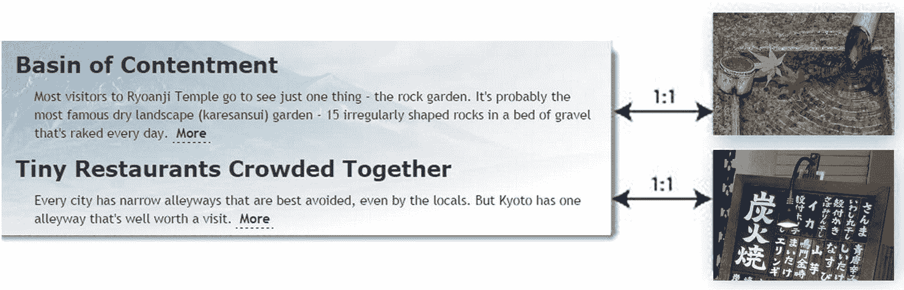
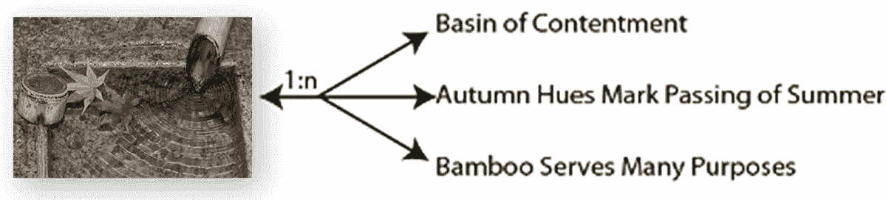
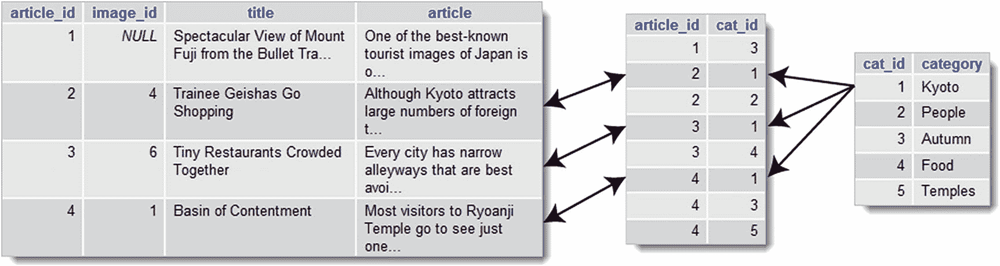
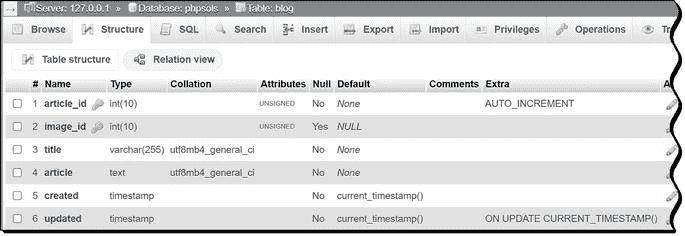
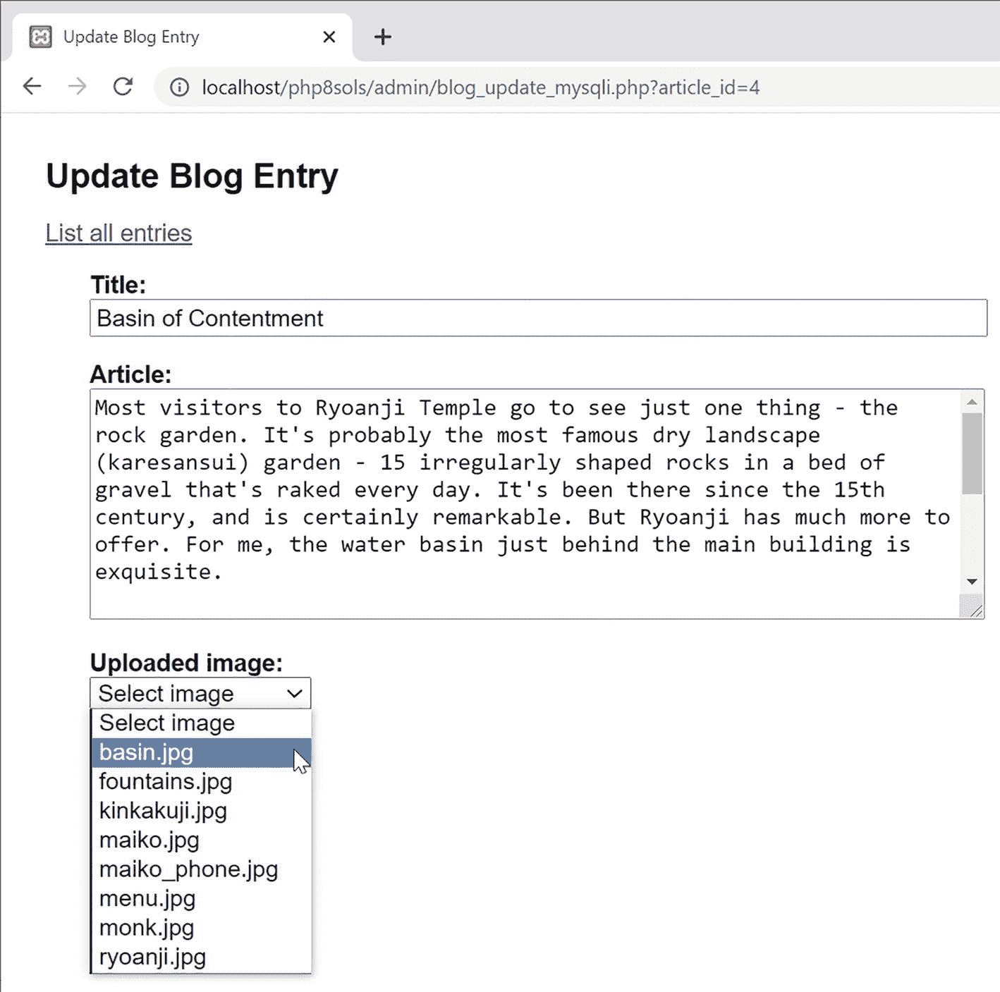
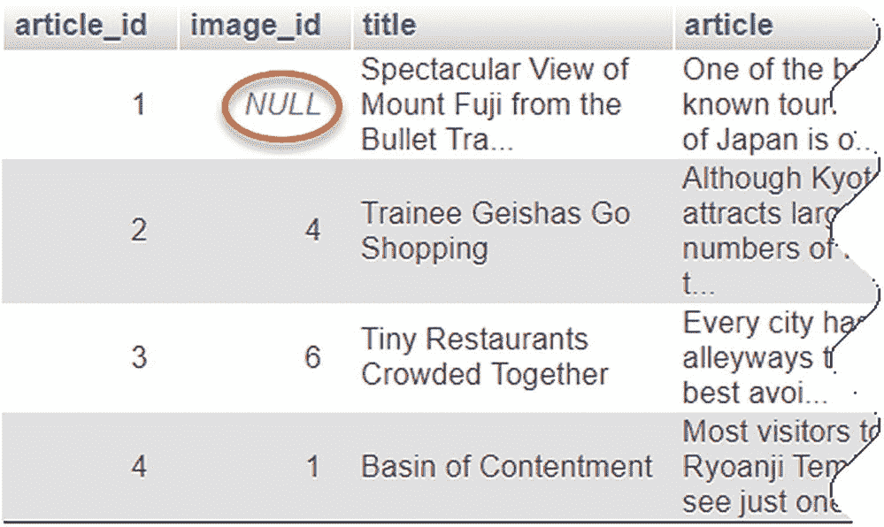
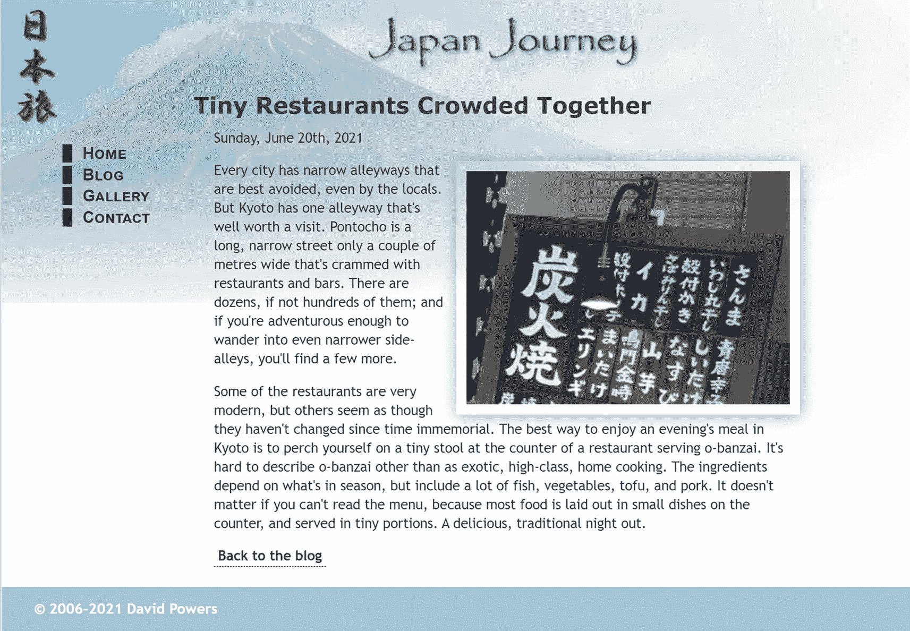
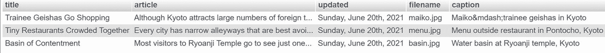
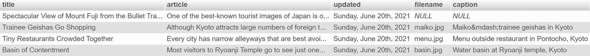
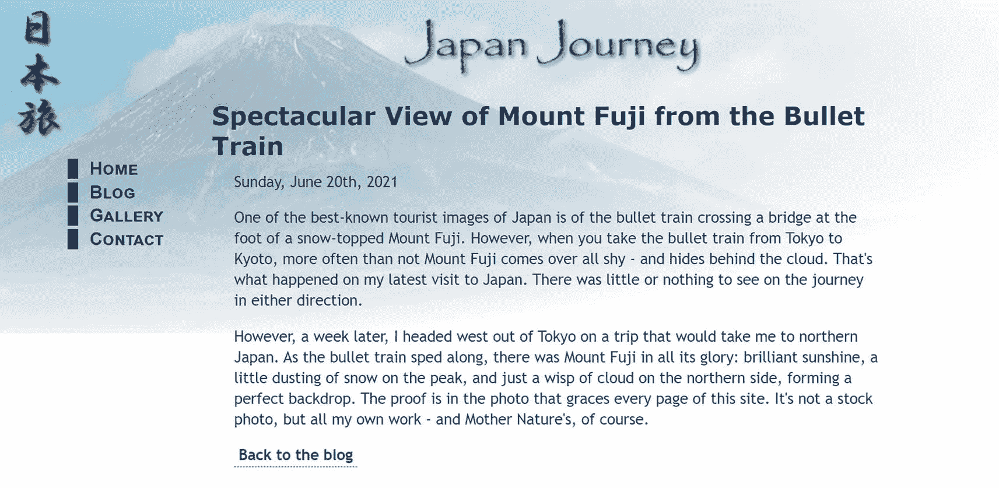

# 17.从多个表中提取数据

正如我在第 [13 章](13.html)中解释的，关系数据库的主要优势之一是能够通过使用一个表中的主键作为另一个表中的外键来链接不同表中的数据。`phpsols`数据库有两个表:`images`和`blog`。是时候再添加一些并加入它们了，这样你就可以给博客条目分配类别，并将图片与单独的文章关联起来。

您并不实际连接多个表，而是通过 SQL 来连接。通常，可以通过识别主键和外键之间的直接关系来连接表。但是，在某些情况下，这种关系更加复杂，需要通过第三个表，作为另外两个表之间的交叉引用。

在本章中，您将学习如何建立表之间的关系，以及如何将一个表中的主键作为外键插入到另一个表中。虽然从概念上听起来很难，但实际上非常简单——使用数据库查询在第一个表中查找主键，保存结果，然后在另一个查询中使用该结果将它插入到第二个表中。

特别是，您将了解以下内容:

*   了解不同类型的表关系

*   对多对多关系使用交叉引用表

*   改变表的结构以添加新列或索引

*   将主键作为外键存储在另一个表中

*   用`INNER JOIN`和`LEFT JOIN`链接表格

## 了解表关系

最简单的关系类型是**一对一**(通常表示为 **1:1** )。这种类型的关系通常出现在包含只有某些人应该看到的信息的数据库中。例如，公司通常将员工的工资明细和其他机密信息存储在一个表中，与更容易访问的员工列表分开。将每个员工记录的主键作为外键存储在 tables 表中，可以在两个表之间建立直接关系，从而允许会计部门查看所有信息，同时限制其他人只能查看公共信息。

在`phpsols`数据库中没有机密信息，但是你可以在`images`表中的一张照片和`blog`表中的一篇文章之间建立一对一的关系，如图 [17-1](#Fig1) 所示。



图 17-1

一对一关系将一个记录与另一个记录直接链接起来

这是在两个表之间创建关系的最简单的方法，但并不理想。随着更多文章的加入，这种关系的性质可能会改变。与图 [17-1](#Fig1) 中的第一篇文章相关的照片显示枫叶漂浮在水面上，因此它可能适合于说明一篇关于季节变化或秋天色调的文章。清澈的水、竹制的水瓢和竹制的烟斗也暗示了照片可以用来说明的其他主题。因此，你很容易就会发现同一张照片被用于几篇文章，或者是一个**一对多**(或 **1:n** )的关系，如图 [17-2](#Fig2) 所示。



图 17-2

一对多关系将一个记录与其他几个记录联系起来

正如您已经了解到的，主键必须是唯一的。因此，在一个`1:n`关系中，您将关系的`1`端的表中的主键(**主表**或**父表**)作为外键存储在`n`端的表中(**辅表**或**子表**)。在这种情况下，`images`表中的`image_id`需要作为外键存储在`blog`表中。关于`1:n`关系，重要的是要理解它也是`1:1`关系的集合。从右向左看图 [17-2](#Fig2) 每篇文章都与一个单独的图像有关系。如果没有这种一对一的关系，您将无法识别哪个图像与特定的文章相关联。

如果你想给每篇文章关联多个图片，会发生什么？您可以在`blog`表中创建几列来保存外键，但是这很快就变得难以处理了。你可能以`image1`、`image2`和`image3`开始，但是如果大多数文章只有一张图片，那么两栏在很多时候是多余的。你会为那篇需要四张图片的特别文章增加一个额外的专栏吗？

当面临适应**多对多**(或 **n:m** )关系的需求时，您需要一种不同的方法。`images`和`blog`表没有包含足够的记录来展示`n:m`关系，但是您可以添加一个`categories`表来标记单独的文章。大多数文章可能属于多个类别，每个类别都与几篇文章相关。

解决复杂关系的方法是通过一个**交叉引用表**(有时称为**链接表**)，它在相关记录之间建立一系列一对一的关系。这是一个特殊的表，只包含两列，这两列都声明为联合主键。图 [17-3](#Fig3) 显示了其工作原理。交叉引用表中的每条记录都存储了`blog`和`categories`表中各个文章之间关系的详细信息。要查找属于`Kyoto`类别的所有文章，您需要将`categories`表中的`cat_id 1`与交叉引用表中的`cat_id 1`进行匹配。这将`blog`表中带有`article_id 2`、`3`和`4`的记录标识为与`Kyoto`相关联。



图 17-3

交叉引用表将多对多关系解析为 1:1

通过外键建立表之间的关系对于如何更新和删除记录有着重要的意义。如果你不小心，你会以断链而告终。确保依赖关系不被破坏被称为维护参照完整性。我们将在下一章讨论这个重要的课题。首先，让我们集中检索存储在通过外键关系链接的单独表中的信息。

## 将图像链接到文章

为了演示如何使用多个表，让我们从图 [17-1](#Fig1) 和 [17-2](#Fig2) 中概述的简单场景开始:通过将一个表(父表)中的主键存储为另一个表(子表或依赖表)中的外键，可以将关系解析为`1:1`。这涉及到在子表中添加一个额外的列来存储外键。

### 改变现有表的结构

理想情况下，您应该在用数据填充数据库之前设计好数据库结构。然而，关系数据库，如 MySQL，非常灵活，允许您添加、删除或更改表中的列，即使它们已经包含记录。要将图像与数据库`phpsols`中的单个文章相关联，您需要向`blog`表中添加一个额外的列，以将`image_id`存储为外键。

#### PHP 解决方案 17-1:向表中添加额外的列

这个 PHP 解决方案展示了如何使用 phpMyAdmin 向现有的表中添加额外的列。它假设您在第 [15](15.html) 章的`phpsols`数据库中创建了`blog`表。

1.  在 phpMyAdmin 中，选择`phpsols`数据库，并单击`blog`表的`Structure`链接。

2.  在`blog`表格结构下面是一个允许您添加额外列的表单。您希望只添加一列，所以在`Add column(s)`文本框中使用默认值就可以了。通常的做法是将外键放在表的主键之后，所以从下拉菜单中选择`after article_id`，如下图所示。然后点击`Go`:


1.  这将为您打开定义列属性的屏幕。使用以下设置:

    *   名称:`image_id`

    *   类型:`INT`

    *   属性:`UNSIGNED`

    *   空:已选择

    *   Index: `INDEX`(不需要在弹出的模态对话框中给它命名)

不要*选择`A_I` ( `AUTO_INCREMENT`)复选框。你不希望`image_id`自动递增。其值将从`images`表中插入。*

选择`Null`复选框是因为并非所有文章都与图像相关联。点击`Save`。

1.  选择`Structure`选项卡，检查`blog`表结构现在看起来像这样:



1.  如果您单击屏幕左上方的`Browse`选项卡，您将看到在每条记录中`image_id`的值为空。现在的挑战是插入正确的外键，而不需要手动查找数字。我们接下来会解决这个问题。

### 在表中插入外键

在另一个表中插入外键的基本原理非常简单:查询数据库以找到想要链接到另一个表的记录的主键。然后，您可以使用一个`INSERT`或`UPDATE`查询将外键添加到目标记录中。

为了演示基本原理，您将修改第 [15](15.html) ( `blog_update_mysqli.php`或`blog_update_pdo.php`)章中的更新表单，以添加一个下拉菜单，列出已经在图像表中注册的图像(参见图 [17-4](#Fig4) )。



图 17-4

一个动态生成的下拉菜单插入适当的外键

菜单是由一个显示`SELECT`查询结果的循环动态生成的。每个图像的主键存储在`<option>`标签的`value`属性中。提交表单时，选择的值作为外键被合并到`UPDATE`查询中。

#### PHP 解决方案 17-2:添加图像外键(MySQLi)

这个 PHP 解决方案展示了如何通过添加选定图像的主键作为外键来更新`blog`表中的记录。它改编自第 [15 章](15.html)中的`admin/blog_update_mysqli.php`。使用您在第 [15](15.html) 章中创建的版本。或者，将`blog_update_mysqli_03.php`从`ch15`文件夹复制到`admin`文件夹，并从文件名中删除`_03`。

1.  检索要更新的文章的细节的现有的`SELECT`查询需要修改，以便它包括外键`image_id`，并且结果需要绑定到新的结果变量`$image_id`。然后，您需要运行第二个`SELECT`查询来获取`images`表的细节。在这样做之前，您需要通过调用准备好的语句的`free_result()`方法来释放数据库资源。将下面以粗体突出显示的代码添加到现有脚本中:

    ```php
    if (isset($_GET['article_id']) && !$_POST) {
        // prepare SQL query
        $sql = 'SELECT article_id, image_id, title, article FROM blog
            WHERE article_id = ?';
        if ($stmt->prepare($sql)) {
            // bind the query parameter
            $stmt->bind_param('i', $_GET['article_id']);
            // execute the query
            $OK = $stmt->execute();
            // bind the results to variables and fetch
            $stmt->bind_result($article_id, $image_id, $title, $article);
            $stmt->fetch();
            // free the database resources for the second query
            $stmt->free_result();
        }
    }

    ```

您可以在调用`fetch()`方法后立即释放结果，因为结果集中只有一条记录，并且每一列中的值都被绑定到一个变量。

1.  在表单内部，您需要显示存储在`images`表中的文件名。因为第二个`SELECT`语句不依赖于外部数据，所以使用`query()`方法比使用预准备语句更简单。在`article`文本区域后添加以下代码(这都是新代码，但是为了便于参考，PHP 部分用粗体突出显示):

    ```php
    <p>
        <label for="image_id">Uploaded image:</label>
        <select name="image_id" id="image_id">
            <option value="">Select image</option>
            <?php
            // get the list images
            $getImages = 'SELECT image_id, filename
                          FROM images ORDER BY filename';
            $images = $conn->query($getImages);
            while ($row = $images->fetch_assoc()) {
                ?>
                <option value="<?= $row['image_id'] ?>"
                    <?php
                     if ($row['image_id'] == $image_id) {
                         echo 'selected';
                     }
                     ?>><?= safe($row['filename']) ?></option>
            <?php } ?>
        </select>
    </p>

    ```

第一个`<option>`标签被硬编码为标签`Select image`，它的`value`被设置为空字符串。剩余的`<option>`标签由一个`while`循环填充，该循环将每条记录提取到一个名为`$row`的数组中。

条件语句检查当前的`image_id`是否与已经存储在`articles`表中的相同。如果是，`selected`被插入到`<option>`标签中，以便在下拉菜单中显示正确的值。

确保不要省略下一行中的第三个字符:

```php
?>><?= safe($row['filename']) ?></option>

```

它是`<option>`标签的结束尖括号，夹在两个 PHP 标签之间。

1.  保存页面并将其加载到浏览器中。您应该会被自动重定向到`blog_list_mysqli.php`。选择其中一个编辑链接，确保你的页面看起来如图 [17-4](#Fig4) 所示。检查浏览器源代码视图，确认`<option>`标签的`value`属性包含每张图片的主键。

    Tip

    如果`<select>`菜单没有列出图像，那么几乎可以肯定第 2 步中的`SELECT`查询有错误。在调用`query()`方法后立即添加`echo $conn->error;`，并重新加载页面。您需要查看浏览器源代码来查看错误消息。如果消息是“命令不同步；您现在不能运行这个命令”，问题在于在步骤 1 中没有用`free_result()`释放数据库资源。

2.  最后一步是将`image_id`添加到`UPDATE`查询中。因为一些博客条目可能与图像没有关联，所以您需要创建替代的准备好的语句，如下所示:

    ```php
    // if form has been submitted, update record
    if (isset($_POST ['update'])) {
        // prepare update query
        if (!empty($_POST['image_id'])) {
            $sql = 'UPDATE blog SET image_id = ?, title = ?, article = ?
                        WHERE article_id = ?';
            if ($stmt->prepare($sql)) {
                $stmt->bind_param('issi', $_POST['image_id'], $_POST['title'],
                    $_POST['article'], $_POST['article_id']);
                $done = $stmt->execute();
            }
        } else {
            $sql = 'UPDATE blog SET image_id = NULL, title = ?, article = ?
                       WHERE article_id = ?';
            if ($stmt->prepare($sql)) {
                $stmt->bind_param('ssi', $_POST['title'], $_POST['article'],
                    $_POST['article_id']);
                $done = $stmt->execute();
            }
        }
    }

    ```

如果`$_POST['image_id']`有一个值，您可以用占位符问号将它作为第一个参数添加到 SQL 中。因为它必须是一个整数，所以您将`i`添加到`bind_param()`的第一个参数的开头。

但是，如果`$_POST['image_id']`不包含值，您需要创建一个不同的预准备语句，在 SQL 查询中将`image_id`的值设置为`NULL`。因为它有一个显式值，所以你不把它加到`bind_param()`里。

1.  再次测试页面，从下拉菜单中选择一个文件名，然后单击`Update Entry`。您可以通过刷新 phpMyAdmin 中的`Browse`或者选择相同的文章进行更新来验证外键是否已经被插入到了`articles`表中。这一次，正确的文件名应该显示在下拉菜单中。

如有必要，对照`ch17`文件夹中的`blog_update_mysqli_04.php`检查您的代码。

#### PHP 解决方案 17-3:添加图像外键(PDO)

这个 PHP 解决方案使用 PDO 通过添加一个选中图像的主键作为外键来更新`blog`表中的记录。与 MySQLi 的主要区别在于，PDO 可以使用`bindValue()`方法将`null`值绑定到占位符。这些说明改编自第 [15 章](15.html)中的`admin/blog_update_pdo.php`。使用您在第 [15 章](15.html)中创建的版本。或者，将`blog_update_pdo_03.php`从`ch15`文件夹复制到`admin`文件夹，并从文件名中删除`_03`。

1.  将`image_id`添加到检索待更新文章详细信息的`SELECT`查询中，并将结果绑定到`$image_id`。这包括对作为第一个参数传递给`$title`和`$article`的`bindColumn()`的列进行重新编号。修改后的代码如下所示:

    ```php
    if (isset($_GET['article_id']) && !$_POST) {
        // prepare SQL query
        $sql = 'SELECT article_id, image_id, title, article FROM blog
                   WHERE article_id = ?';
        $stmt = $conn->prepare($sql);
        // pass the placeholder value to execute() as a single-element array
        $OK = $stmt->execute([$_GET['article_id']]);
        // bind the results
        $stmt->bindColumn(1, $article_id);
        $stmt->bindColumn(2, $image_id);
        $stmt->bindColumn(3, $title);
        $stmt->bindColumn(4, $article);
        $stmt->fetch();
    }

    ```

2.  在表单内部，您需要显示存储在`images`表中的文件名。因为第二个`SELECT`语句不依赖于外部数据，所以使用`query()`方法比使用预准备语句更简单。在`article`文本区域后添加以下代码(这都是新代码，但是为了便于参考，PHP 部分用粗体突出显示):

    ```php
    <p>
        <label for="image_id">Uploaded image:</label>
        <select name="image_id" id="image_id">
            <option value="">Select image</option>
            <?php
            // get the list images
            $getImages = 'SELECT image_id, filename
                          FROM images ORDER BY filename';
            foreach ($conn->query($getImages) as $row) {
                ?>
                <option value="<?= $row['image_id'] ?>"
                    <?php
                    if ($row['image_id'] == $image_id) {
                        echo 'selected';
                    }
                    ?>><?= safe($row['filename']) ?></option>
            <?php } ?>
        </select>
    </p>

    ```

第一个`<option>`标签被硬编码为标签`Select image`，它的`value`被设置为空字符串。剩余的`<option>`标记由一个`foreach`循环填充，该循环执行`$getImages SELECT`查询并将每条记录提取到一个名为`$row`的数组中。

条件语句检查当前的`image_id`是否与已经存储在`articles`表中的相同。如果是，`selected`被插入到`<option>`标签中，以便在下拉菜单中显示正确的值。

确保不要省略下一行中的第三个字符:

```php
?>><?= safe($row['filename']) ?></option>

```

它是`<option>`标签的结束尖括号，夹在两个 PHP 标签之间。

1.  保存页面并将其加载到浏览器中。您应该会被自动重定向到`blog_list_pdo.php`。选择其中一个`EDIT`链接，确保你的页面看起来如图 [17-4](#Fig4) 。检查浏览器源代码视图，验证`<option>`标签的值属性包含每个图像的主键。

2.  最后一步是将`image_id`添加到`UPDATE`查询中。当一个博客条目不与图像相关联时，您需要在`image_id`栏中输入`null`。这包括更改值绑定到预准备语句中的匿名占位符的方式。您需要使用`bindValue()`和`bindParam()`，而不是将它们作为数组传递给`execute()`方法。修改后的代码如下所示:

    ```php
    // if form has been submitted, update record
    if (isset($_POST['update'])) {
        // prepare update query
        $sql = 'UPDATE blog SET image_id = ?, title = ?, article = ?
                   WHERE article_id = ?';
        $stmt = $conn->prepare($sql);
        if (empty($_POST['image_id'])) {
            $stmt->bindValue(1, NULL, PDO::PARAM_NULL);
        } else {
            $stmt->bindParam(1, $_POST['image_id'], PDO::PARAM_INT);
        }
        $stmt->bindParam(2, $_POST['title'], PDO::PARAM_STR);
        $stmt->bindParam(3, $_POST['article'], PDO::PARAM_STR);
        $stmt->bindParam(4, $_POST['article_id'], PDO::PARAM_INT);
        // execute query
        $done = $stmt->execute();
    }

    ```

使用数字将这些值绑定到匿名占位符，从 1 开始计数，以标识它们应该应用到哪个占位符。条件语句检查`$_POST['image_id']`是否为空。如果是，`bindValue()`将值设置为`null`，使用关键字`NULL`作为第二个参数，使用 PDO 常数作为第三个参数。正如在第 [13](13.html) 章的“在 PDO 预准备语句中嵌入变量”中所解释的，当被绑定的值不是变量时，你需要使用`bindValue()`。

其余的值都是变量，所以它们使用`bindParam()`绑定。我用 PDO 常数表示整数，用字符串表示剩余的值。这不是绝对必要的，但它使代码更清晰。

最后，从`execute()`方法的括号中删除了值数组。

1.  再次测试页面，从下拉菜单中选择一个文件名，然后单击`Update Entry`。您可以通过刷新 phpMyAdmin 中的`Browse`或者选择相同的文章进行更新来验证外键是否已经被插入到了`articles`表中。这一次，正确的文件名应该显示在下拉菜单中。

如有必要，对照`ch17`文件夹中的`blog_update_pdo_04.php`检查您的代码。

### 从多个表中选择记录

有几种方法可以在一个`SELECT`查询中链接表，但是最常用的是列出表名，用`INNER JOIN`隔开。`INNER JOIN`独自产生所有可能的行组合(笛卡尔连接)。要仅选择相关值，您需要指定主键/外键关系。例如，要从`blog`和`images`表中选择文章及其相关图像，您可以使用一个`WHERE`子句，如下所示:

```php
SELECT title, article, filename, caption
FROM blog INNER JOIN images
WHERE blog.image_id = images.image_id

```

`title`和`article`列只存在于`blog`表中。同样，`filename`和`caption`只存在于`images`表中。他们是明确的，不需要被限定。但是，`image_id`在两个表中都存在，所以您需要在每个引用前面加上表名和句点。

多年来，用逗号代替`INNER JOIN`是一种常见的做法，就像这样:

```php
SELECT title, article, filename, caption
FROM blog, images
WHERE blog.image_id = images.image_id

```

Caution

使用逗号连接表会导致 SQL 语法错误，因为从 MySQL 5.0.12 开始，连接的处理方式发生了变化。用`INNER JOIN`代替。

你可以用`ON`代替`WHERE`子句，就像这样:

```php
SELECT title, article, filename, caption
FROM blog INNER JOIN images ON blog.image_id = images.image_id

```

当两列具有相同的名称时，您可以使用下面的语法，这是我个人的偏好:

```php
SELECT title, article, filename, caption
FROM blog INNER JOIN images USING (image_id)

```

Note

`USING`后的列名必须在括号中。

#### PHP 解决方案 17-4:构建详细页面

这个 PHP 解决方案展示了如何连接`blog`和`images`表来显示一篇选中的文章及其相关的照片。MySQLi 和 PDO 的代码几乎相同，所以这个解决方案涵盖了这两者。


图 17-5

详细信息页面包含一个占位符图像和文本

1.  将`ch17`文件夹中的`details_01.php`复制到`php8sols`站点根目录，并重命名为`details.php`。如果编辑环境提示您更新链接，请不要这样做。确保`footer.php`和`menu.php`在`includes`文件夹中，并在浏览器中加载页面。它看起来应该如图 [17-5](#Fig5) 所示。



图 17-6

不与图像相关联的项目的外键被设置为空

1.  将`blog_list_mysqli.php`或`blog_list_pdo.php`加载到浏览器中，并通过指定所示的图像文件名来更新以下三篇文章:

    *   满足的盆地:`basin.jpg`

    *   拥挤在一起的小餐馆:`menu.jpg`

    *   见习艺妓逛街:`maiko.jpg`

2.  导航到 phpMyAdmin 中的`blog`表，并单击`Browse`选项卡检查外键是否已经注册。至少有一条`image_id`的值为`NULL`，如图 [17-6](#Fig6) 所示。

1.  在试图显示一幅图像之前，我们需要确保它来自我们期望的地方，并且它确实是一幅图像。在 details.php 的顶部创建一个变量来存储图像目录的相对路径(以斜杠结束),如下所示:

    ```php
    // Relative path to image directory
    $imageDir = './img/';

    ```

2.  接下来，包含上一章的`utility_funcs.php`(如有必要，将其从`ch16`文件夹复制到`includes`文件夹)。然后包含数据库连接文件，创建一个只读连接，并在`DOCTYPE`声明上方的 PHP 代码块中准备 SQL 查询，如下所示:

```php
require_once './includes/utility_funcs.php';
require_once './includes/connection.php';
// connect to the database
$conn = dbConnect('read');  // add 'pdo' if necessary
// check for article_id in query string
$article_id = isset($_GET['article_id']) ? (int) $_GET['article_id'] : 0;
$sql = "SELECT title, article,DATE_FORMAT(updated, '%W, %M %D, %Y') AS updated,
            filename, caption
            FROM blog INNER JOIN images USING (image_id)
            WHERE blog.article_id = $article_id";
$result = $conn->query($sql);
$row = $result->fetch_assoc();  // for PDO use $result->fetch();

```

该代码使用三元运算符检查`URL`查询字符串中的`article_id`。用`isset()`测试其存在的条件。如果返回`true`，使用`(int)`转换操作符将值分配给`$article_id`，以确保它是一个整数。否则，`$article_id`被设置为`0`。你可以选择一篇默认的文章，但是暂时把它放在`0`上，因为我想说明一个重要的观点。

`SELECT`查询从`blog`表中检索`title`、`article`和`updated`列，从`images`表中检索`filename`和`caption`列。如第 [16](16.html) 章所述，使用`DATE_FORMAT()`函数和别名对`updated`的值进行格式化。因为只检索一条记录，所以使用原始列名作为别名不会导致排序顺序问题。

使用与两个表中的`image_id`列中的值相匹配的`INNER JOIN`和`USING`子句来连接这两个表。`WHERE`子句选择由`$article_id`标识的商品。因为已经检查了`$article_id`的数据类型，所以在查询中使用它是安全的。没有必要使用预先准备好的语句。

注意，该查询用双引号括起来，以便解释`$article_id`的值。为了避免与外面的一对引号冲突，在作为参数传递给`DATE_FORMAT()`的格式字符串周围使用了单引号。

1.  既然我们已经查询了数据库，我们可以检查图像。为了确保它在我们期望的地方，将`$row['filename']`的值传递给`basename()`函数，并将结果连接到图像目录的相对路径。然后我们可以检查文件是否存在并且可读。如果是，使用`getimagesize()`得到它的宽度和高度。在上一步插入的代码后立即添加以下代码:

    ```php
    if ($row && !empty($row['filename'])) {
        $image = $imageDir . basename($row['filename']);
        if (file_exists($image) && is_readable($image)) {
            $imageSize = getimagesize($image)[3];
        }
    }

    ```

正如 PHP 解决方案 10-1 第 10 章 [10](10.html) 中所解释的那样，`getimagesize()`返回一个关于图像的信息数组，包括索引 3 处的一个字符串，该字符串包含准备插入到``标签中的正确的宽度和高度属性。这里，我们使用数组解引用将它直接赋给`$imageSize`。

1.  其余代码在页面主体中显示 SQL 查询的结果。替换`<h2>`标签中的占位符文本，如下所示:

    ```php
    <h2><?php if ($row) {
            echo safe($row['title']);
        } else {
            echo 'No record found';
        }
        ?>
    </h2>

    ```

如果`SELECT`查询没有找到结果，`$row`将为空，PHP 将其解释为`false`。因此，如果结果集为空，将显示标题或“未找到记录”。

1.  像这样替换占位符日期:

1.  紧跟在日期段落之后的是一个包含占位符图像的`<figure>`元素。并非所有文章都与图像相关联，因此需要将`<figure>`包装在一个条件语句中，以检查`$imageSize`是否包含值。这样修改`<figure>`:

    ```php
    <?php if (!empty($imageSize)) { ?>
       <figure>
           " alt="<?= safe($row['caption']) ?>" <?= $imageSize ?>>
       </figure>
    <?php } ?>

    ```

2.  最后，你需要展示文章。删除占位符文本的段落，并将以下代码添加到上一步中最后一个代码块末尾的右大括号和右 PHP 标记之间:

```php
<p><?php if ($row) { echo $row['updated']; } ?></p>

```

```php
<?php } if ($row) { echo convertToParas($row['article']); } ?>

```

它使用`utility_funcs.php`中的`convertToParas()`函数将博客条目包装在`<p>`标签中，并用结束和开始标签替换换行符序列(参见第 [16 章](16.html)中的“显示段落”)。

1.  保存页面并将`blog.php`加载到浏览器中。点击文章的`More`链接，该文章具有通过外键分配的图像。你应该可以看到`details.php`，文章和图片的全文如图 [17-7](#Fig7) 所示。

如有必要，用`ch17`文件夹中的`details_mysqli_01.php`或`details_pdo_01.php`检查你的代码。



图 17-7

详细信息页面从一个表中提取文章，从另一个表中提取图像


图 17-8

缺少关联的图像会导致选择查询失败

1.  点击返回`blog.php`的链接，测试其他项目。每篇有相关图片的文章都应该正确显示。点击没有图片的文章的`More`链接。这次你应该会看到如图 [17-8](#Fig8) 所示的结果。

您知道文章在数据库中，因为前两个句子不会显示在`blog.php`中。为了理解这种突然的“消失”，请参考图 [17-6](#Fig6) 。对于没有相关图像的记录，`image_id`的值是`NULL`。因为`images`表中的所有记录都有一个主键，所以`USING`子句找不到匹配项。下一节将解释如何处理这种情况。

### 查找没有匹配外键的记录

从 PHP 解决方案 17-4 中复制`SELECT`查询，并删除搜索特定文章的条件，剩下如下内容:

```php
SELECT title, article, DATE_FORMAT(updated, '%W, %M %D, %Y') AS updated, filename, caption
FROM blog INNER JOIN images USING (image_id)

```

如果您在 phpMyAdmin 的 SQL 选项卡中运行这个查询，它会产生如图 [17-9](#Fig9) 所示的结果。



图 17-9

内部联接只查找在两个表中都匹配的记录

使用`INNER JOIN`,`SELECT`查询只成功找到完全匹配的记录。其中一篇文章没有相关联的图像，因此`articles`表中的`image_id`的值是`NULL`，它与`images`表中的任何内容都不匹配。

在这种情况下，你需要使用`LEFT JOIN`而不是`INNER JOIN`。使用`LEFT JOIN`，结果包括在左表中匹配，但在右表中不匹配的记录。“左”和“右”是指执行连接的顺序。像这样重写`SELECT`查询:

```php
SELECT title, article, DATE_FORMAT(updated, '%W, %M %D, %Y') AS updated, filename, caption
FROM blog LEFT JOIN images USING (image_id)

```

当您在 phpMyAdmin 中运行它时，您会得到所有四篇文章，如图 [17-10](#Fig10) 所示。



图 17-10

左连接包括在右表中没有匹配项的记录

如您所见，右表中的空字段(`images`)显示为`NULL`。

如果两个表中的列名不同，请像这样使用 ON:

```php
FROM table_1 LEFT JOIN table_2 ON table_1.col_name = table_2.col_name

```

所以现在您可以像这样重写`details.php`中的 SQL 查询:

```php
$sql = "SELECT title, article, DATE_FORMAT(updated, '%W, %M %D, %Y') AS updated,
            filename, caption
            FROM blog LEFT JOIN images USING (image_id)
            WHERE blog.article_id = $article_id";

```

如果您点击`More`链接查看没有关联图片的文章，您现在应该看到文章正确显示，如图 [17-11](#Fig11) 所示。其他文章也应该仍然可以正确显示。完成的代码可以在`details_mysqli_02.php`和`details_pdo_02.php`中找到。



图 17-11

LEFT JOIN 还检索没有匹配外键的文章

### 创建智能链接

`details.php`底部的链接直接回到`blog.php`。在`blog`表中只有四个条目没问题，但是一旦你开始在数据库中获得更多的记录，你就需要建立一个导航系统，正如我在第 [14 章](14.html)中向你展示的那样。导航系统的问题是，你需要一种方法让访问者返回到他们来自的结果集中的同一点。

#### PHP 解决方案 17-5:回到导航系统中的同一点

这个 PHP 解决方案检查访问者来自内部还是外部链接。如果引用的页面在同一个站点内，链接会将访问者返回到同一个地方。如果引用的页面是一个外部站点，或者服务器不支持必要的超级全局变量，脚本会用一个标准链接来代替。这里显示的是`details.php`的上下文，但是它可以用在任何页面上。

代码不依赖于数据库，所以它对 MySQLi 和 PDO 是一样的。

1.  在`details.php`的主体中找到后连杆。看起来是这样的:

1.  将光标放在第一个引号的右侧，插入以粗体突出显示的以下代码:

    ```php
    <p><a href="
    <?php
    // check that browser supports $_SERVER variables
    if (isset($_SERVER['HTTP_REFERER']) && isset($_SERVER['HTTP_HOST'])) {
        $url = parse_url($_SERVER['HTTP_REFERER']);
        // find if visitor was referred from a different domain
        if ($url['host'] == $_SERVER['HTTP_HOST']) {
            // if same domain, use referring URL
            echo $_SERVER['HTTP_REFERER'];
        }
    } else {
        // otherwise, send to main page
        echo 'blog.php';
    } ?>">Back to the blog</a></p>

    ```

```php
<p><a href="blog.php">Back to the blog</a></p>

```

`$_SERVER['HTTP_REFERER']`和`$_SERVER['HTTP_HOST']`是超全局变量，包含引用页面的 URL 和当前主机名。你需要用`isset()`检查它们的存在，因为不是所有的服务器都支持它们。此外，浏览器可能会阻止引用页面的 URL。

`parse_url()`函数创建一个包含 URL 的每个部分的数组，所以`$url['host']`包含主机名。如果它与`$_SERVER['HTTP_HOST']`匹配，您就知道该访问者是由一个内部链接推荐的，所以内部链接的完整 URL 被插入到`href`属性中。这包括任何查询字符串，因此链接会将访问者送回导航系统中的相同位置。否则，将创建一个指向目标页面的普通链接。

完成的代码在`ch17`文件夹的`details_mysqli_03.php`和`details_pdo_3.php`中。

## 第三章回顾

使用`INNER JOIN`和`LEFT JOIN`检索存储在多个表中的信息相对简单。成功使用多个表的关键在于构建它们之间的关系，这样复杂的关系总是可以通过`1:1`来解决，如果需要的话，可以通过交叉引用(或链接)表来解决。下一章继续探索使用多个表，向您展示在插入、更新和删除记录时如何处理外键关系。