# 十八、管理多个数据库表

前一章向您展示了如何使用`INNER JOIN`和`LEFT JOIN`来检索存储在多个表中的信息。您还了解了如何通过向子表添加额外的一列来链接现有的表，并单独更新每条记录以插入外键。但是，大多数情况下，您会希望在两个表中同时插入数据。这带来了挑战，因为`INSERT`命令一次只能在一个表上操作。您需要以正确的顺序处理插入操作，从父表开始，这样您就可以获得新记录的主键，并将其与其他细节同时插入到子表中。在更新和删除记录时，也需要考虑类似的因素。所涉及的代码并不难，但是在构建脚本时，您需要清楚地记住事件的顺序。

本章将指导您在`blog`表格中插入新文章，选择相关图片或上传新图片，并将文章分配到一个或多个类别，所有这些都在一个操作中完成。然后，您将构建脚本来更新和删除文章，而不会破坏相关表的引用完整性。

您还将了解如何使用事务将多个查询作为一个批处理来处理，如果批处理的任何部分失败，将数据库回滚到其原始状态，以及外键约束，外键约束控制在您试图删除另一个表中仍然具有外键关系的记录时会发生什么。并不是所有的数据库都支持事务和外键约束，所以检查您的远程服务器是否支持是很重要的。本章还解释了如果您的服务器不支持外键约束，您可以采取什么措施来保持数据的完整性。

特别是，您将了解以下内容:

*   在相关表中插入、更新和删除记录

*   创建记录后立即查找记录的主键

*   将多个查询作为单个批处理进行处理，并在任何部分失败时回滚

*   转换表的存储引擎

*   在 InnoDB 表之间建立外键约束

## 维护引用完整性

对于单表，更新一条记录的频率或删除多少条记录都无关紧要；对其他记录的影响为零。一旦将记录的主键作为外键存储在不同的表中，就创建了一个需要管理的依赖项。例如，图 [18-1](#Fig1) 显示了来自`blog`表的第二篇文章(“见习艺妓去购物”)通过`article2cat`对照表链接到`Kyoto`和`People`类别。

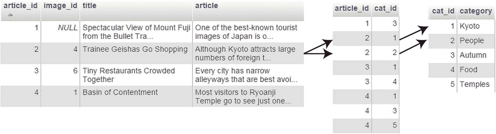

图 18-1

您需要管理外键关系以避免孤立记录

如果您删除了文章，但未能删除交叉引用表中的`article_id 2`条目，则在`Kyoto`或`People`类别中查找所有文章的查询会尝试匹配`blog`表中不存在的记录。同样，如果您决定删除其中一个类别，而不删除交叉引用表中的匹配记录，则查找与文章关联的类别的查询会尝试匹配一个不存在的类别。

不久之后，您的数据库中就会充斥着孤立的记录。幸运的是，维护引用完整性并不困难。SQL 通过建立称为外键约束的规则来做到这一点，外键约束告诉数据库当您更新或删除在另一个表中有依赖记录的记录时该做什么。

### 支持事务和外键约束

MySQL 5.5 和更高版本中的默认存储引擎 InnoDB 支持事务和外键约束。MariaDB 中的等效存储引擎是 Percona XtraDB，但它将自己标识为 InnoDB，并具有相同的功能。即使你的远程服务器运行的是 MySQL 或 MariaDB 的最新版本，也不能保证 InnoDB 是受支持的，因为你的托管公司可能已经禁用了它。

如果您的服务器运行的是旧版本的 MySQL，默认的存储引擎是 MyISAM，它不支持事务或外键约束。但是，您仍然可以访问 InnoDB，因为它从 4.0 版开始就是 MySQL 不可或缺的一部分。将 MyISAM 表转换成 InnoDB 非常简单，只需要几秒钟。

如果您不能访问 InnoDB，那么您需要通过在 PHP 脚本中构建必要的规则来维护引用完整性。本章展示了这两种方法。

Note

MyISAM 表的优点是速度非常快。它们需要较少的磁盘空间，非常适合存储不经常更改的大量数据。然而，MyISAM 引擎已经不再被积极开发，所以不建议将其用于新项目。

#### PHP 解决方案 18-1:检查是否支持 InnoDB

这个 PHP 解决方案解释了如何检查您的远程服务器是否支持 InnoDB 存储引擎。


图 18-2

通过 phpMyAdmin 检查存储引擎支持

1.  如果你的托管公司提供 phpMyAdmin 来管理你的数据库，在你的远程服务器上启动 phpMyAdmin，点击屏幕顶部的`Engines`标签，如果它可用的话。这将显示类似于图 [18-2](#Fig2) 的存储引擎列表。

Note

图[18–2](#Fig2)中的截图是在 MariaDB 服务器上拍摄的。您可能会在 MySQL 服务器上看到不同的存储引擎选择，但是 MySQL 和 MariaDB 通常都应该至少提供 InnoDB 和 MyISAM。Aria 存储引擎是 MariaDB 对 MyISAM 的改进版本。本书没有涉及它，因为它在 MySQL 上不可用，也不支持事务或外键约束。

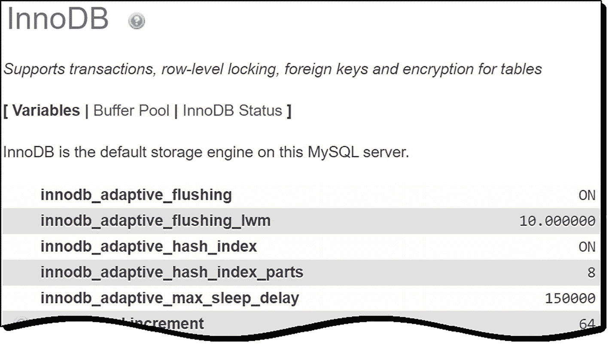

图 18-3

确认支持 InnoDB

1.  该列表显示所有存储引擎，包括不受支持的存储引擎。不支持或禁用的存储引擎呈灰色显示。如果您不确定 InnoDB 的状态，请在列表中单击它的名称。

2.  如果不支持 InnoDB，您会看到一条消息告诉您这一点。另一方面，如果您看到类似于图 [18-3](#Fig3) 的变量列表，那么您很幸运——InnoDB 是受支持的。

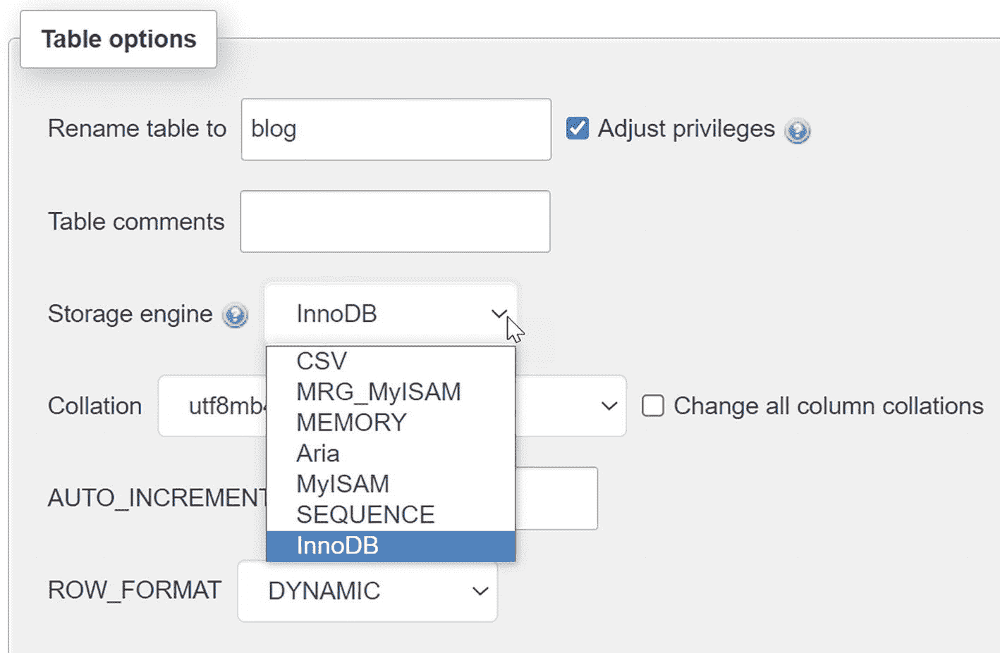

图 18-4

表选项中列出了可用的存储引擎

1.  如果 phpMyAdmin 中没有`Engines`选项卡，选择数据库中的任意一个表，然后单击屏幕右上角的`Operations`选项卡。在`Table options`部分，点击`Storage engine`字段右侧的向下箭头显示可用选项(参见图 [18-4](#Fig4) )。如果列出了 InnoDB，它是受支持的。

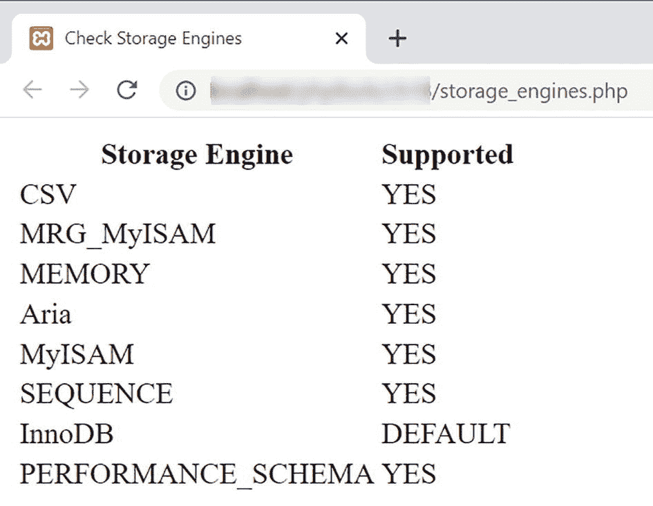

图 18-5

storage_engines.php 中的 SQL 查询报告了支持哪些

1.  如果前面的方法都没有给你答案，打开`ch18`文件夹中的`storage_engines.php`。编辑前三行，在远程服务器上插入数据库的主机名、用户名和密码。

2.  将`storage_engines.php`上传到你的网站，并将页面加载到浏览器中。您应该会看到存储引擎和支持级别的列表，如图 [18-5](#Fig5) 所示。在某些情况下，`NO`会被`DISABLED`代替。

如图 [18-5](#Fig5) 所示，一个典型的安装支持多个存储引擎。令人惊讶的是，您可以在同一个数据库中使用不同的存储引擎。事实上，建议你这样做。即使您的远程服务器支持 InnoDB，对于不需要事务或没有外键关系的表，使用 MyISAM 或 Aria 通常更有效。对于需要事务或具有外键关系的表，使用 InnoDB。

我将在本章的后面解释如何将表格转换成 InnoDB。在此之前，让我们看看如何建立和使用外键关系，而不管使用的是什么存储引擎。

### 将记录插入多个表中

一个`INSERT`查询只能向一个表中插入数据。因此，在处理多个表时，需要仔细规划插入脚本，以确保存储所有信息并建立正确的外键关系。

上一章的 PHP 解决方案 17-2 (MySQLi)和 17-3 (PDO)展示了如何为已经在数据库中注册的图像添加正确的外键。然而，当插入一个新的博客条目时，您需要能够选择一个现有的图像，上传一个新的图像，或者选择没有图像。这意味着您的处理脚本需要检查图像是否已被选择或上传，并相应地执行相关命令。此外，用零个或多个类别标记博客条目增加了脚本需要做出的决策数量。图 [18-6](#Fig6) 显示了决策链。

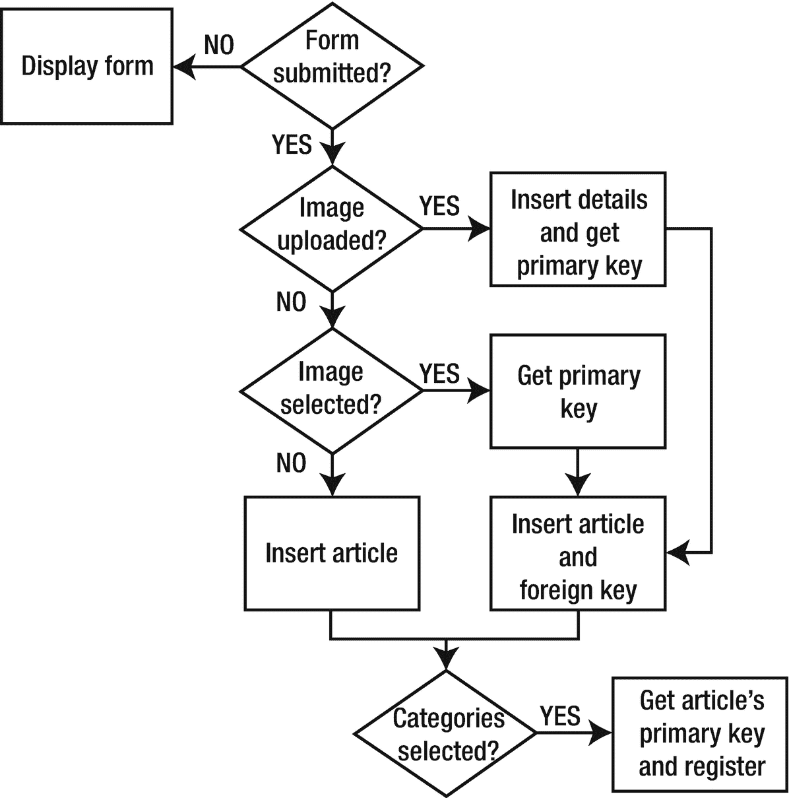

图 18-6

插入带有图像和类别的新博客文章的决策链

当页面第一次加载时，表单还没有提交，所以页面只显示插入表单。通过查询数据库，现有图像和类别都列在插入表单中，查询方式与 PHP 解决方案 17-2 和 17-3 中更新表单中的图像相同。

提交表单后，处理脚本将执行以下步骤:

1.  如果已经上传了一个图像，则处理上传，图像的细节存储在`images`表中，脚本获得新记录的主键。

2.  如果没有上传图像，但是选择了一个现有的图像，那么脚本从通过`$_POST`数组提交的值中获取外键。

3.  在这两种情况下，新的博客文章会作为外键与图像的主键一起插入到`blog`表中。但是，如果既没有上传图像，也没有从现有图像中选择图像，那么文章将被插入到`blog`表中，而没有外键。

4.  最后，脚本检查是否选择了任何类别。如果有，脚本会获取新文章的主键，并将其与`article2cat`表中所选类别的主键相结合。

如果在任何阶段出现问题，脚本都需要放弃流程的其余部分，重新显示用户的输入。这个剧本很长，所以我将把它分成几个部分。第一步是创建`article2cat`对照表。

### 创建交叉引用表

当处理数据库中的多对多关系时，你需要建立一个对照表，如图 [18-1](#Fig1) 所示。交叉引用表只包含两列，它们被共同声明为表的主键(称为**复合主键**)。如果你查看图 [18-7](#Fig7) ，你会看到`article_id`和`cat_id`列都多次包含相同的数字——这在主键中是不可接受的，主键必须是唯一的。但是，在复合主键中，两个值的组合是唯一的。前两个组合`1,3`和`2,1`不会在表中的任何地方重复出现，其他组合也不会。

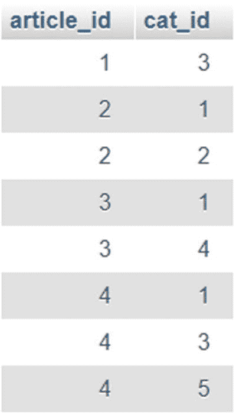

图 18-7

在交叉引用表中，两列一起构成一个复合主键

#### 设置类别和交叉引用表

在`ch18`文件夹中，您将找到`categories.sql`，它包含创建`categories`表和交叉引用表`article2cat`的 SQL，以及一些示例数据。在 phpMyAdmin 中，选择`phpsols`数据库，并使用`Import`选项卡加载`categories.sql`来创建表格和数据。表 [18-1](#Tab1) 和 [18-2](#Tab2) 中列出了这些表的设置。两个数据库表都只有两列。

表 18-2

article2cat 对照表设置

<colgroup><col class="tcol1 align-left"> <col class="tcol2 align-left"> <col class="tcol3 align-left"> <col class="tcol4 align-left"> <col class="tcol5 align-left"> <col class="tcol6 align-left"> <col class="tcol7 align-left"></colgroup> 
| 

名字

 | 

类型

 | 

长度/值

 | 

属性

 | 

空

 | 

索引

 | 

阿奇

 |
| --- | --- | --- | --- | --- | --- | --- |
| `article_id` | `INT` |   | `UNSIGNED` | 取消选择 | `PRIMARY` |   |
| `cat_id` | `INT` |   | `UNSIGNED` | 取消选择 | `PRIMARY` |   |

表 18-1

类别表的设置

<colgroup><col class="tcol1 align-left"> <col class="tcol2 align-left"> <col class="tcol3 align-left"> <col class="tcol4 align-left"> <col class="tcol5 align-left"> <col class="tcol6 align-left"> <col class="tcol7 align-left"></colgroup> 
| 

名字

 | 

类型

 | 

长度/值

 | 

属性

 | 

空

 | 

索引

 | 

A_I

 |
| --- | --- | --- | --- | --- | --- | --- |
| `cat_id` | `INT` |   | `UNSIGNED` | 取消选择 | `PRIMARY` | 挑选 |
| `category` | `VARCHAR` | Twenty |   | 取消选择 |   |   |

关于对照表的定义，重要的一点是两列都设置为主键，并且两列都没有选中`A_I` ( `AUTO_INCREMENT`)复选框。

Caution

若要创建复合主键，必须同时将两列声明为主键。如果您错误地只声明了一个主键，数据库会阻止您在以后添加第二个主键。您必须从单个列中删除主键索引，然后将其重新应用于两个列。这两列的组合被视为主键。

### 获取上传图像的文件名

这个脚本使用了第 9 章[的`Upload`类，但是这个类需要稍微调整一下，因为上传文件的文件名被合并到了`$messages`属性中。](09.html)

#### PHP 解决方案 18-2:改进上传类

这个 PHP 解决方案修改了第 9 章中的`Upload`类，创建了一个新的受保护属性来存储成功上传的文件的名称，并使用一个公共方法来检索名称数组。

1.  打开`Php8Solutions/File`文件夹中的`Upload.php`。或者，从`ch18/Php8Solutions/File`文件夹中复制`Upload.php`并保存在`php8sols`站点根目录下的`Php8Solutions/File`中。

2.  将以下行添加到文件顶部的属性列表中:

```php
protected $filenames = [];

```

这将名为`$filenames`的受保护属性初始化为一个空数组。

1.  修改`moveFile()`方法，如果文件上传成功，将修改后的文件名添加到`$filenames`属性中。新代码以粗体突出显示:

    ```php
    protected function moveFile($file) {
        $filename = $this->newName ?? $file['name'];
        $success = move_uploaded_file($file['tmp_name'], $this->destination . $filename);
        if ($success) {
            // add the amended filename to the array of uploaded files
            $this->filenames[] = $filename;
            $result = $file['name'] . ' was uploaded successfully';
            if (!is_null($this->newName)) {
                $result .= ', and was renamed ' . $this->newName;
            }
            $this->messages[] = $result;
        } else {
            $this->messages[] = 'Could not upload ' . $file['name'];
        }
    }

    ```

仅当文件成功移动到目标文件夹时，该名称才会添加到`$filenames`数组中。

1.  添加一个公共方法来返回存储在`$filenames`属性中的值。代码如下所示:

    ```php
    public function getFilenames() {
        return $this->filenames;
    }

    ```

将这些代码放在类定义中的什么地方并不重要，但是将所有公共方法放在一起是一种常见的做法。

1.  保存`Upload.php`。如果你需要检查你的代码，将它与`ch18/Php8Solutions/File`文件夹中的`Upload_01.php`进行比较。

### 调整插入表单以处理多个表格

您在第 [15 章](15.html)中创建的博客文章插入表单已经包含了在`blog`表中插入大部分细节所需的代码。与其从头开始，不如修改现有页面。目前，页面只包含标题的文本输入字段和文章的文本区域。

您需要为类别添加一个多选`<select>`列表，为现有图像添加一个下拉`<select>`菜单。

为了防止用户在上传新图像的同时选择现有图像，一个复选框和 JavaScript 控制相关输入字段的显示。选中该复选框将禁用现有图像的下拉菜单，并显示新图像和标题的输入字段。取消选中该复选框会隐藏和禁用文件和标题字段，并重新启用下拉菜单。如果 JavaScript 被禁用，上传新图像和标题的选项将被隐藏。

Note

为了节省篇幅，本章剩余的大多数 PHP 解决方案只给出了 MySQLi 的详细说明。PDO 版本的结构和 PHP 逻辑是相同的。唯一的区别在于用于提交 SQL 查询和显示结果的命令。完整注释的 PDO 文件在`ch18`文件夹中。

#### PHP 解决方案 18-3:添加类别和图像输入字段

这个 PHP 解决方案通过添加类别和图像的输入字段，开始修改第 [15 章](15.html)中的博客条目插入表单。

1.  在`admin`文件夹中，找到并打开您在第 [15 章](15.html)中创建的`blog_insert_mysqli.php`版本。或者，将`blog_insert_mysqli_01.php`从`ch18`文件夹复制到`admin`文件夹，并从文件名中删除`_01`。

2.  当页面首次加载时，类别和现有图像的`<select>`元素需要查询数据库，因此您需要将连接脚本和数据库连接移到检查表单是否已提交的条件语句之外。找到以粗体突出显示的行:

    ```php
    if (isset($_POST['insert'])) {
        require_once '../includes/connection.php';
        // initialize flag
        $OK = false;
        // create database connection
    $conn = dbConnect('write');

    ```

将它们移出条件语句，并包含`utility_funcs.php`，如下所示:

1.  页面主体中的表单需要能够上传文件，因此您需要将`enctype`属性添加到开始的`<form>`标签，如下所示:

```php
require_once '../includes/connection.php';
require_once '../includes/utility_funcs.php';
// create database connection
$conn = dbConnect('write');
if (isset($_POST['insert'])) {
    // initialize flag
    $OK = false;

```

1.  如果在尝试上传文件时出现错误(例如，文件太大或者不是图像文件)，插入操作将会暂停。使用与第 [6](06.html) 章所示相同的技术，修改现有的文本输入字段和文本区域，以重新显示数值。文本输入字段如下所示:

    ```php
    <input name="title" type="text" id="title" value="<?php if (isset($error)) {
        echo safe($_POST['title']);
    } ?>">

    ```

```php
<form method="post" action="blog_insert_mysqli.php" enctype="multipart/form-data">

```

文本区域如下所示:

```php
<textarea name="article" id="article"><?php if (isset($error)) {
     echo safe($_POST['article']);
} ?></textarea>

```

确保开始和结束的 PHP 标签和 HTML 之间没有间隙。否则，您将在文本输入字段和文本区域中添加不需要的空白。

1.  新的表单元素位于文本区域和提交按钮之间。首先，为类别的多选`<select>`列表添加代码。代码如下所示:

    ```php
    <p>
        <label for="category">Categories:</label>
        <select name="category[]" size="5" multiple id="category">
            <?php
            // get categories
            $getCats = 'SELECT cat_id, category FROM categories ORDER BY category';
            $categories = $conn->query($getCats);
            while ($row = $categories->fetch_assoc()) {
                ?>
                <option value="<?= $row['cat_id'] ?>" <?php
                if (isset($_POST['category']) && in_array($row['cat_id'],
                    $_POST['category'])) { echo 'selected';
                } ?>><?= safe($row['category']) ?></option>
            <?php } ?>
        </select>
    </p>

    ```

为了允许选择多个值，`multiple`属性被添加到了`<select>`标签中，`size`属性被设置为`5`。这些值需要以数组的形式提交，所以在`name`属性后面添加了一对方括号。

SQL 查询`categories`表，一个`while`循环用主键和类别名填充`<option>`标签。`while`循环中的条件语句将`selected`添加到`<option>`标签中，以便在`insert`操作失败时重新显示选定的值。

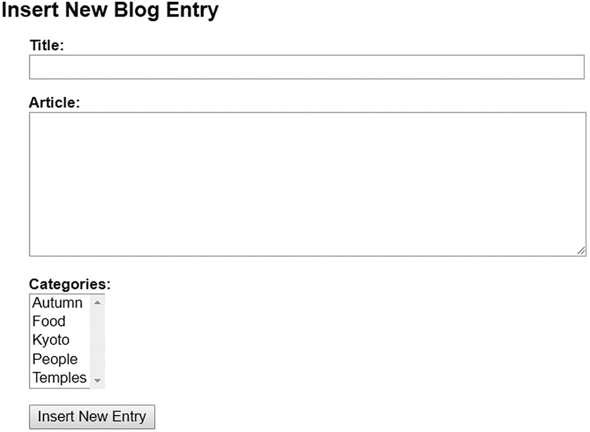

图 18-8

多选列表<select>从类别表中提取值</select>

1.  保存`blog_insert_mysqli.php`并将页面加载到浏览器中。该表单现在应该如图 [18-8](#Fig8) 所示。

1.  查看页面的源代码，验证每个类别的主键是否正确嵌入了每个`<option>`标记的`value`属性中。你可以将你的代码与`ch18`文件夹中的`blog_insert_mysqli_02.php`进行比较。

2.  接下来，创建`<select>`下拉菜单，显示已经在数据库中注册的图像。在步骤 5 中插入的代码之后立即添加此代码:

    ```php
    <p>
        <label for="image_id">Uploaded image:</label>
        <select name="image_id" id="image_id">
            <option value="">Select image</option>
            <?php
            // get the list of images
            $getImages = 'SELECT image_id, filename
                          FROM images ORDER BY filename';
            $images = $conn->query($getImages);
            while ($row = $images->fetch_assoc()) {
                ?>
                <option value="<?= $row['image_id'] ?>"
                    <?php
                    if (isset($_POST['image_id']) && $row['image_id'] ==
                        $_POST['image_id']) {
                        echo 'selected';
                    }
                    ?>><?= safe($row['filename']) ?></option>
            <?php } ?>
        </select>
    </p>

    ```

这创建了另一个`SELECT`查询来获取存储在`images`表中的每个图像的主键和文件名。代码现在应该非常熟悉了，所以不需要解释。

1.  标题的复选框、文件输入字段和文本输入字段位于上一步中的代码和提交按钮之间。代码如下所示:

    ```php
    <p id="allowUpload">
        <input type="checkbox" name="upload_new" id="upload_new">
        <label for="upload_new">Upload new image</label>
    </p>
    <p class="optional">
        <label for="image">Select image:</label>
        <input type="file" name="image" id="image">
    </p>
    <p class="optional">
        <label for="caption">Caption:</label>
        <input name="caption" type="text" id="caption">
    </p>

    ```

包含复选框的段落被赋予了 ID `allowUpload`，另外两个段落被赋予了一个名为`optional`的类。`admin.css`中的样式规则将这三段的`display`属性设置为`none`。

1.  保存`blog_insert_mysqli.php`并在浏览器中加载页面。`images <select>`下拉菜单显示在`categories`列表的下面，但是您在步骤 9 中插入的三个表单元素是隐藏的。如果浏览器中禁用了 JavaScript，将会显示以下内容。用户可以选择类别和现有的图像，但不能上传新的图像。

如有必要，对照 ch18 文件夹中的`blog_insert_mysqli_03.php`检查您的代码。

1.  将`ch18`文件夹中的`toggle_fields.js`复制到`admin`文件夹。该文件包含以下 JavaScript:

    ```php
    const cbox = document.getElementById('allowUpload');
    cbox.style.display = 'block';
    const uploadImage = document.getElementById('upload_new');
    uploadImage.onclick = function () {
        const image_id = document.getElementById('image_id');
        const image = document.getElementById('image');
        const caption = document.getElementById('caption');
        const sel = uploadImage.checked;
        image_id.disabled = sel;
        image.parentNode.style.display = sel ? 'block' : 'none';
        caption.parentNode.style.display = sel ? 'block' : 'none';
        image.disabled = !sel;
        caption.disabled = !sel;
    }

    ```

这使用在步骤 8 中插入的元素的 id 来控制它们的显示。如果启用了 JavaScript，页面加载时会自动显示复选框，但标题的文件输入字段和文本输入字段保持隐藏。如果选中该复选框，则禁用现有图像的下拉菜单，并显示隐藏的元素。如果随后取消选中该复选框，下拉菜单将重新启用，并且文件输入字段和标题字段将再次隐藏。

1.  在结束`</body>`标签之前用`<script>`标签将`toggle_fields.js`链接到`blog_insert_mysqli.php`，就像这样:

    ```php
    </form>
          <script src="toggle_fields.js"></script>
    </body>

    ```

在页面底部添加 JavaScript 可以加速下载和显示。如果将`toggle_fields.js`中的代码添加到`<head>`中，它将无法正常工作。


图 18-9

复选框控制文件和标题输入字段的显示

1.  保存`blog_insert_mysqli.php`并在浏览器中加载页面。在支持 JavaScript 的浏览器中，复选框应该显示在`<select>`下拉菜单和提交按钮之间。选中复选框，禁用下拉菜单，显示隐藏字段，如图 [18-9](#Fig9) 所示。

1.  取消选中该复选框。文件和标题输入字段被隐藏，下拉菜单被重新启用。如果有必要，你可以用`ch18`文件夹中的`blog_insert_mysqli_04.php`和`toggle_fields.js`来检查你的代码。

我使用 JavaScript 而不是 PHP 来控制文件和标题输入字段的显示，因为 PHP 是一种服务器端语言。PHP 引擎将输出发送到浏览器后，它不再与页面交互，除非您向 web 服务器发送另一个请求。另一方面，JavaScript 在浏览器中工作，所以它能够在本地操作页面内容。JavaScript 也可以与 PHP 结合使用，在后台向 web 服务器发送请求，并且它可以使用结果来刷新页面的一部分，而无需重新加载它——这是一种称为 Ajax 的技术，这超出了本书的范围。

更新后的插入表单现在有了类别和图像的输入字段，但是处理脚本仍然只处理标题的文本输入字段和博客条目的文本区域。

#### PHP 解决方案 18-4:将数据插入多个表格

该 PHP 解决方案采用`blog_insert_mysqli.php`中的现有脚本上传新图像(如果需要)，然后按照图 [18-6](#Fig6) 中概述的决策链将数据插入`images`、`blog`和`article2cat`表中。它假设你已经建立了`article2cat`交叉引用表，并完成了 PHP 解决方案 18-2 和 18-3。

不要试图匆匆读完这一部分。代码很长，但是它集合了您以前学过的许多技术。

Note

如果您使用的是 PDO，这个 PHP 解决方案后面有一个单独的部分描述了代码中的主要差异。

1.  您在 PHP 解决方案 18-2 中更新的`Upload`类使用了一个名称空间，因此您需要在脚本的顶层导入它。在`blog_insert_mysqli.php`顶部的开始 PHP 标签后立即添加这一行:

1.  初始化准备好的语句后，立即插入以下条件语句来处理图像(如果已经上载或选择了图像):

    ```php
    // initialize prepared statement
    $stmt = $conn->stmt_init();
    // if a file has been uploaded, process it
    if(isset($_POST['upload_new']) && $_FILES['image']['error'] == 0) {
        $imageOK = false;
        require_once '../Php8Solutions/File/Upload.php';
        $loader = new Upload('image', '../img/');
        $names = $loader->getFilenames();
        // $names will be an empty array if the upload failed
        if ($names) {
            $sql = 'INSERT INTO images (filename, caption) VALUES (?, ?)';
            if ($stmt->prepare($sql)) {
                $stmt->bind_param('ss', $names[0], $_POST['caption']);
                $stmt->execute();
                $imageOK = $stmt->affected_rows;
            }
        }
        // get the image's primary key or find out what went wrong
        if ($imageOK) {
            $image_id = $stmt->insert_id;
        } else {
            $imageError = implode(' ', $loader->getMessages());
        }
    } elseif (!empty($_POST['image_id'])) {
        // get the primary key of a previously uploaded image
        $image_id = $_POST['image_id'];
    }
    // create SQL
    $sql = 'INSERT INTO blog (title, article) VALUES(?, ?)';

    ```

```php
use Php8Solutions\File\Upload;

```

首先检查`$_POST['upload_new']`是否已经设置。如第 [6](06.html) 章所述，只有当复选框被选中时，它才会包含在`$_POST`数组中。因此，如果复选框没有被选中，那么条件失败，取而代之的是测试底部的`elseif`子句。`elseif`子句检查`$_POST['image_id']`的存在。如果存在且不为空，则意味着已经从下拉菜单中选择了一个现有图像，该值存储在`$image_id`中。

如果两个测试都失败，则既没有上传图像，也没有从下拉菜单中选择图像。该脚本稍后在为`blog`表准备`INSERT`查询时会考虑到这一点，允许您创建一个没有图像的博客条目。

但是，如果`$_POST['upload_new']`存在，则复选框已被选中，图像可能已被上传。为了确保这一点，条件语句还会检查`$_FILES['image']['error']`的值。正如您在第 [9](09.html) 章中了解到的，错误代码`0`表示上传成功。任何其他错误代码意味着上传失败或没有选择文件。

假设一个文件已经从表单成功上传，条件语句包括`Upload`类定义并创建一个名为`$loader`的对象，传递给它文件输入字段的名称，并将目标文件夹设置为`images`。为了避免代码复杂化，我没有对`Upload`构造函数使用三个可选参数。因此，将使用默认的最大大小和 MIME 类型，并且具有重复文件名的图像将被重命名。

您在 PHP 解决方案 18-2 中对`Upload`类所做的更改会将上传文件的名称添加到`$filenames`属性中，前提是该文件已成功移动到目标文件夹中。`getFilenames()`方法检索`$filenames`属性的内容，并将结果分配给`$names`。

如果文件被成功移动，其文件名将被存储为`$names`数组的第一个元素。因此，如果`$names`包含一个值，您可以安全地继续执行`INSERT`查询，该查询将`$names[0]`和`$_POST['caption']`的值作为字符串绑定到准备好的语句。

执行完语句后，`affected_rows`属性会重置`$imageOK`的值。如果`INSERT`查询成功，`$imageOK`为`1`，作为`true`处理。

如果图像细节被插入到`images`表中，那么准备好的语句的`insert_id`属性将检索新记录的主键，并将其存储在`$image_id`中。在运行任何其他 SQL 查询之前，必须访问`insert_id`属性，因为它包含最近查询的主键。

然而，如果`$imageOK`仍然为假，`else`块调用上传对象的`getMessages()`方法，并将结果分配给`$imageError`。`getMessages()`方法返回一个数组，因此`implode()`函数用于将数组元素连接成一个字符串。失败最可能的原因是文件太大或者 MIME 类型不正确。

1.  只要图片上传没有失败，流程的下一步就是将博客条目插入到`blog`表中。`INSERT`查询的形式取决于图像是否与博客条目相关联。如果是，`$image_id`存在，需要作为外键插入到`blog`表中。否则，可以使用原始查询。

像这样修改原始查询:

```php
// insert blog details only if there hasn't been an image upload error
if (!isset($imageError)) {
    // if $image_id has been set, insert it as a foreign key
    if (isset($image_id)) {
        $sql = 'INSERT INTO blog (image_id, title, article) VALUES(?, ?, ?)';
        if ($stmt->prepare($sql)) {
            $stmt->bind_param('iss', $image_id, $_POST['title'], $_POST['article']);
            $stmt->execute();
        }
    } else {
        // create SQL
        $sql = 'INSERT INTO blog (title, article)
                   VALUES(?, ?)';
        if ($stmt->prepare($sql)) {
            // bind parameters and execute statement
            $stmt->bind_param('ss', $_POST['title'], $_POST['article']);
            $stmt->execute();
        }
    }
    if ($stmt->affected_rows > 0) {
        $OK = true;
    }
}

```

这一整段代码被包装在一个条件语句中，该语句检查`$imageError`是否存在。如果是的话，插入新的博客条目就没有意义了，所以整个代码块都被忽略了。

然而，如果`$imageError`不存在，嵌套的条件语句根据`$image_id`是否存在准备不同的`INSERT`查询，然后执行已经准备好的查询。

检查`affected_rows`属性的条件语句被移出`else`块，这样它就可以应用于任何一个`INSERT`查询。

1.  流程的下一阶段将值插入到`article2cat`交叉引用表中。代码紧跟在上一个步骤的代码之后，如下所示:

    ```php
    // if the blog entry was inserted successfully, check for categories
    if ($OK && isset($_POST['category'])) {
        // get the article's primary key
        $article_id = $stmt->insert_id;
        foreach ($_POST['category'] as $cat_id) {
            if (is_numeric($cat_id)) {
                $values[] = "($article_id, " . (int) $cat_id . ')';
            }
        }
        if ($values) {
            $sql = 'INSERT INTO article2cat (article_id, cat_id)
                       VALUES ' . implode(',', $values);
            // execute the query and get error message if it fails
            if (!$conn->query($sql)) {
                $catError = $conn->error;
            }
        }
    }

    ```

`$OK`的值由在`blog`表中插入数据的查询的`affected_rows`属性决定，只有选择了任何类别，多选`<select>`列表才会包含在`$_POST`数组中。因此，只有当数据成功插入到`blog`表中，并且在表单中至少选择了一个类别时，这个代码块才会运行。它首先从准备好的语句的`insert_id`属性中获取插入操作的主键，并将其赋给`$article_id`。

表单将类别值作为数组提交。`foreach`循环检查`$_POST['category']`中的每个值。如果该值是数字，则执行下面一行:

```php
$values[] = "($article_id, " . (int) $cat_id . ')';

```

这将创建一个包含两个主键`$article_id`和`$cat_id`的字符串，用逗号分隔，并用一对括号括起来。`(int)`造型操作符确保`$cat_id`是一个整数。结果被分配给一个名为`$values`的数组。例如，如果`$article_id`是`10`并且`$cat_id`是`4`，则分配给数组的结果字符串是`(10, 4)`。

如果`$values`包含任何元素，`implode()`将其转换为逗号分隔的字符串，并将其附加到 SQL 查询中。例如，如果选择了类别`2`、`4`和`5`，结果查询如下所示:

```php
INSERT INTO article2cat (article_id, cat_id)
VALUES (10, 2),(10, 4),(10, 5)

```

正如在第 [15 章](15.html)的“回顾四个基本的 SQL 命令”中所解释的，这就是如何用一个`INSERT`查询插入多行。

因为`$article_id`来自可靠的来源，并且已经检查了`$cat_id`的数据类型，所以在 SQL 查询中直接使用这些变量是安全的，不需要使用准备好的语句。使用`query()`方法执行查询。如果失败，连接对象的错误属性将存储在`$catError`中。

1.  代码的最后一部分处理成功和错误消息的重定向。修改后的代码如下所示:

    ```php
    // redirect if successful or display error
    if ($OK && !isset($imageError) && !isset($catError)) {
        header('Location: http://localhost/php8sols/admin/blog_list_mysqli.php');
        exit;
    } else {
        $error = $stmt->error;
        if (isset($imageError)) {
            $error .= ' ' . $imageError;
        }
        if (isset($catError)) {
            $error .= ' ' . $catError;
        }
    }

    ```

控制重定向的条件现在确保了`$imageError`和`$catError`不存在。如果有，该值将连接到原始的`$error`，其中包含来自准备好的语句对象的任何错误消息。

1.  保存`blog_insert_mysqli.php`并在浏览器中测试。尝试上传太大的图像或错误 MIME 类型的文件。表单应该重新显示一条错误消息，并保留博客的详细信息。也可以尝试插入带有或不带有图片和/或类别的博客条目。您现在有了一个多用途的插入表单。

如果您没有合适的图像上传，请使用`phpsols images`文件夹中的图像。`Upload`类重命名它们以避免覆盖现有的文件。

您可以对照`ch18`文件夹中的`blog_insert_mysqli_05.php`来检查您的代码。

#### PDO 版本的主要区别

最终的 PDO 版本可以在`ch18`文件夹的`blog_insert_pdo_05.php`中找到。它遵循与 MySQLi 版本相同的基本结构和逻辑，但是在将值插入数据库的方式上有一些重要的不同。

步骤 2 中的代码严格遵循 MySQLi 版本，但是使用了命名占位符而不是匿名占位符。为了获得受影响的行数，PDO 在 statement 对象上使用了`rowCount()`方法。最近插入操作的主键是使用 connection 对象上的`lastInsertId()`方法获得的。像 MySQLi `insert_id`属性一样，您需要在执行完`INSERT`查询后立即访问它。

最大的变化是第 3 步中的代码，它将细节插入到 blog 表中。因为 PDO 可以使用`bindValue()`将一个`null`值插入到一个列中，所以只需要一条准备好的语句。步骤 3 的 PDO 代码如下所示:

```php
// insert blog details only if there hasn't been an image upload error
if (!isset($imageError)) {
    // create SQL
    $sql = 'INSERT INTO blog (image_id, title, article)
                VALUES(:image_id, :title, :article)';
    // prepare the statement
    $stmt = $conn->prepare($sql);
    // bind the parameters
    // if $image_id exists, use it
    if (isset($image_id)) {
        $stmt->bindParam(':image_id', $image_id, PDO::PARAM_INT);
    } else {
        // set image_id to NULL
        $stmt->bindValue(':image_id', NULL, PDO::PARAM_NULL);
    }
    $stmt->bindParam(':title', $_POST['title'], PDO::PARAM_STR);
    $stmt->bindParam(':article', $_POST['article'], PDO::PARAM_STR);
    // execute and get number of affected rows
    $stmt->execute();
    $OK = $stmt->rowCount();
}

```

如果图像已经上传，以粗体突出显示的条件语句将`$image_id`的值绑定到命名的`:image_id`占位符。但是如果没有上传图像，`bindValue()`将该值设置为`NULL`。

在第 4 步中，PDO 版本使用`exec()`而不是`query()`将值插入到`article2cat`表中。`exec()`方法执行 SQL 查询并返回受影响的行数，因此当不需要准备好的语句时，它应该与`INSERT`、`UPDATE`和`DELETE`查询一起使用。

另一个重要的区别是在出现问题时构建错误消息的代码。因为创建和准备报表在 PDO 中是一步到位的过程，所以如果出现问题，报表对象可能不存在。如果没有语句，对`errorInfo()`的调用将是`null`。因此，代码使用 null 合并操作符从数据库连接对象获取错误消息。还需要将`$error`初始化为一个空字符串，将各种消息连接起来，就像这样:

```php
// redirect if successful or display error
if ($OK && !isset($imageError) && !isset($catError)) {
    header('Location: http://localhost/php8sols/admin/blog_list_pdo.php');
    exit;
} else {
    $error = ";
    $error .= $stmt->errorInfo()[2] ?? $conn->errorInfo()[2];
    if (isset($imageError)) {
        $error .= ' ' . $imageError;
    }
    if (isset($catError)) {
        $error .= ' ' . $catError;
    }
}

```

## 更新和删除多个表中的记录

添加了`categories`和`article2cat`表意味着上一章 PHP 解决方案 17-2 和 17-3 中对`blog_update_mysqli.php`和`blog_update_pdo.php`的更改不再充分涵盖`phpsols`数据库中的外键关系。除了修改更新表单之外，您还需要创建脚本来删除记录，而不破坏数据库的参照完整性。

### 更新交叉引用表中的记录

交叉引用表中的每条记录只包含一个复合主键。通常情况下，主键不应该被改变。此外，它们必须是独特的。这给更新`article2cat`表带来了问题。如果在更新博客条目时没有对所选类别进行更改，则不需要更新交叉引用表。但是，如果类别发生变化，您需要确定要删除哪些交叉引用以及要插入哪些新的交叉引用。

一个简单的解决方案是删除所有现有的交叉引用并再次插入所选的类别，而不是纠结于是否进行了任何更改。如果没有进行任何更改，您只需再次插入相同的内容。

#### PHP 解决方案 18-5:向更新表单添加类别

这个 PHP 解决方案修正了上一章 PHP 解决方案 17-2 中的`blog_update_mysqli.php`,允许你更新与博客条目相关的类别。为了保持结构简单，对与条目相关联的图像的唯一改变是选择不同的现有图像或者根本不选择图像。

1.  继续使用 PHP 解决方案 17-2 中的`blog_update_mysqli.php`。或者，从`ch18`文件夹中复制`blog_update_mysqli_04.php`并作为`blog_update_mysqli.php`保存在`admin`文件夹中。

2.  当页面第一次加载时，您需要运行第二个查询来获取与博客条目相关的类别。将以下突出显示的代码添加到获取所选记录详细信息的条件语句中:

    ```php
    $stmt->free_result();
    // get categories associated with the article
    $sql = 'SELECT cat_id FROM article2cat
            WHERE article_id = ?';
    if ($stmt->prepare($sql)) {
        $stmt->bind_param('i', $_GET['article_id']);
        $OK = $stmt->execute();
        $stmt->bind_result($cat_id);
        // loop through the results to store them in an array
        $selected_categories = [];
        while ($stmt->fetch()) {
            $selected_categories[] = $cat_id;
        }
    }

    ```

该查询从交叉引用表中匹配所选博客条目主键的所有记录中选择`cat_id`。结果被绑定到`$cat_id`，一个`while`循环将这些值提取到一个名为`$selected_categories`的数组中。

1.  在 HTML 页面的主体中，在文本区域和显示图像列表的`<select>`下拉菜单之间添加一个多选`<select>`列表。使用另一个 SQL 查询来填充它，如下所示:

    ```php
    <p>
        <label for="category">Categories:</label>
        <select name="category[]" size="5" multiple id="category">
            <?php
            // get categories
            $getCats = 'SELECT cat_id, category FROM categories
                               ORDER BY category';
            $categories = $conn->query($getCats);
            while ($row = $categories->fetch_assoc()) {
                ?>
                <option value="<?= $row['cat_id'] ?>" <?php
                if (isset($selected_categories) &&
                    in_array($row['cat_id'], $selected_categories)) {
                    echo 'selected';
                } ?>><?= safe($row['category']) ?></option>
            <?php } ?>
        </select>
    </p>

    ```

`while`循环通过在`value`属性中插入`cat_id`并显示开始和结束标签之间的类别来构建每个`<option>`标签。如果`cat_id`在`$selected_categories`数组中，`selected`被插入到`<option>`标签中。这将选择已经与博客条目关联的类别。

1.  保存`blog_update_mysqli.php`并选择`blog_list_mysqli.php`中的`EDIT`链接之一，以确保多选列表中填充了类别。如果您在 PHP 解决方案 18-4 中插入了一个新条目，那么您与该条目相关联的类别应该被选中，如下面的屏幕截图所示。

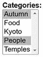

如有必要，您可以对照 ch18 文件夹中的`blog_update_mysqli_05.php`检查您的代码。PDO 版本出现在`blog_update_pdo_05.php`中。

1.  接下来，您需要编辑提交表单时更新记录的代码部分。新代码首先删除交叉引用表中匹配`article_id`的所有条目，然后插入在更新表单中选择的值。行内注释指出了为节省空间而省略的现有代码:

    ```php
    // if form has been submitted, update record
    if (isset($_POST ['update'])) {
        // prepare update query
        if (!empty($_POST['image_id'])) {
            // existing code omitted
        } else {
            // existing code omitted
                $done = $stmt->execute();
            }
        }
        // delete existing values in the cross-reference table
        $sql = 'DELETE FROM article2cat WHERE article_id = ?';
        if ($stmt->prepare($sql)) {
            $stmt->bind_param('i', $_POST['article_id']);
            $done = $stmt->execute();
        }
        // insert the new values in articles2cat
        if (isset($_POST['category']) && is_numeric($_POST['article_id'])) {
            $article_id = (int) $_POST['article_id'];
            foreach ($_POST['category'] as $cat_id) {
                $values[] = "($article_id, " . (int) $cat_id . ')';
            }
            if ($values) {
                $sql = 'INSERT INTO article2cat (article_id, cat_id)
                          VALUES ' . implode(',', $values);
                $done = $conn->query($sql);
            }
        }
    }

    ```

插入在更新表单中选择的值的代码与 PHP 解决方案 18-4 的步骤 4 中的代码相同。需要注意的关键点是，它使用了一个`INSERT`查询，而不是`UPDATE`。原始值已被删除，所以您要重新添加它们。

1.  保存`blog_update_mysqli.php`并通过更新`blog`表中的现有记录进行测试。如果有必要，你可以对照`ch18`文件夹中的`blog_update_mysqli_06.php`来检查你的代码。PDO 版本见于`blog_update_pdo_06.php`。

### 将多个查询视为事务中的一个块

前面的 PHP 解决方案对信任要求很高。更新序列包括三个独立的查询:更新`blog`表，删除`article2cat`表中的引用，并插入新的引用。如果其中任何一个失败，`$done`将被设置为`false`；但是如果下一次成功，它将被重置为`true`。您可能很容易只得到部分更新，但是除非是一系列查询的最后一部分失败，否则您不会知道。

一种解决方案可能是运行一系列条件语句，如果前面的查询失败，则阻止任何进一步的执行。问题是，您最终仍然会得到部分更新。当更新多个表中的连接记录时，需要将整个序列视为一个块。如果一部分失败，整个序列都会失败。只有当更新序列的所有部分都成功时，才会处理更新序列。将多个查询视为一个统一的块在 SQL 中称为事务。在 MySQLi 和 PDO 中实现交易都很简单。

Note

要在 MySQL 和 MariaDB 中使用事务，必须使用 InnoDB 存储引擎。

#### 在 MySQLi 中使用事务

默认情况下，MySQL 和 MariaDB 在自动提交模式下工作。换句话说，SQL 查询会立即执行。要使用事务，您需要关闭自动提交模式，然后像这样调用数据库连接对象上的`begin_transaction()`方法(假设`$conn`是数据库连接):

```php
$conn->autocommit(false);
$conn->begin_transaction();

```

然后正常运行 SQL 查询序列，根据查询是否成功执行，将变量设置为`true`或`false`。如果检测到任何错误，您可以在序列结束时将所有表回滚到它们的原始状态。否则，您可以提交事务，将序列作为单个块进行处理，如下所示:

```php
if ($trans_error) {
    $conn->rollback();
} else {
    $conn->commit();
}

```

#### 使用 PDO 的交易

PDO 也在自动提交模式下工作。在数据库连接对象上调用`beginTransaction()`方法会关闭自动提交模式。PHP 8 一遇到问题就会自动抛出异常，所以没有必要使用变量来跟踪单个查询的成功。只需使用一个`catch`块将表回滚到原始状态。基本结构是这样的:

```php
try {
    $conn->beginTransaction();
    // run sequence of SQL queries
    // commit the transaction if no problems have been encountered
    $done = $conn->commit();
    // catch the exception if there’s a problem
} catch (Exception $e) {
    // roll back to the original state and get the errormessage
    $conn->rollBack();
    $trans_error = $e->getMessage();
}

```

Caution

PHP 中的函数和方法名是不区分大小写的，所以对于 MySQLi 和 PDO 来说，`rollBack()`和`rollback()`同样是可以接受的。然而，在`begin_transaction()` (MySQLi)和`beginTransaction()` (PDO)之间有一个微妙的区别。PDO 方法没有下划线。

在 PHP 8 之前，PDO 的默认错误模式是静默的。如果您的服务器运行的是旧版本的 PHP，您需要明确设置错误模式，以便在遇到类似这样的问题时抛出异常:

```php
$conn->setAttribute(PDO::ATTR_ERRMODE, PDO::ERRMODE_EXCEPTION);

```

#### PHP 解决方案 18-6:将表格转换为 InnoDB 存储引擎

这个 PHP 解决方案展示了如何将一个表格从 MyISAM 转换成 InnoDB。如果您计划将表上传到您的远程服务器，它还必须支持 InnoDB(参见 PHP 解决方案 18-1)。

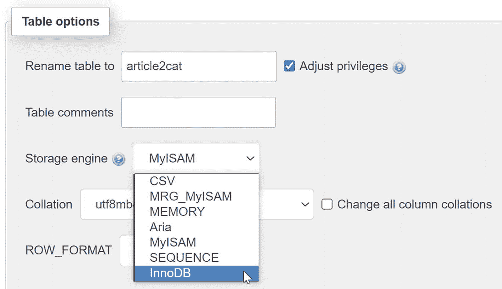

图 18-10

在 phpMyAdmin 中，更改表的存储引擎非常容易

1.  在 phpMyAdmin 中选择`phpsols`数据库，然后选择`article2cat`表。

2.  单击屏幕右上角的操作选项卡。

3.  在“表选项”部分,“存储引擎”字段报告表当前使用的引擎。如果显示 MyISAM，从下拉菜单中选择 InnoDB，如图 [18-10](#Fig10) 所示。

1.  点击`Go`。改变存储引擎就是这么简单！

Note

每个表都需要单独转换。不能在一次操作中更改数据库中的所有表。

#### PHP 解决方案 18-7:在事务中包装更新序列(MySQLi)

这个 PHP 解决方案改进了`blog_update_mysqli.php`中的脚本，将更新`blog`和`article2cat`表的 SQL 查询序列封装在一个事务中，如果序列的任何部分失败，就将数据库回滚到原始状态。

1.  如有必要，将`blog`和`article2cat`表的存储引擎转换为 InnoDB，如前面的 PHP 解决方案所述。

2.  继续使用 PHP 解决方案 18-5 中的`blog_update_mysqli.php`和`blog_list_mysqli.php`。或者，将`blog_update_mysqli_06.php`和`blog_list_mysqli_04.php`从`ch18`文件夹复制到`php8sols`站点根目录下的`admin`文件夹，并删除文件名中的数字。

3.  在`blog_update_mysqli.php`的顶部初始化一个空数组来存储错误信息:

1.  关闭自动提交模式，并在运行更新查询序列的条件语句的开头开始一个事务，如下所示:

    ```php
    // if form has been submitted, update record
    if (isset($_POST ['update'])) {
       // set autocommit to off
       $conn->autocommit(false);
       $conn->begin_transaction();
       // prepare update query

    ```

2.  在更新 blog 表的查询之后，添加一个条件语句，以便在查询失败时将任何错误消息添加到$trans_error 数组中。为了节省空间，省略了一些现有代码:

    ```php
    if (!empty($_POST['image_id'])) {
        // existing code omitted
            $done = $stmt->execute();
        }
    } else {
        // existing code omitted
           $done = $stmt->execute();
        }
    }
    if (!$done) {
        $trans_error[] = $stmt->error;
    }

    ```

3.  添加一个类似的条件语句，以捕获因删除交叉引用表中的现有值而产生的任何错误消息:

    ```php
    // delete existing values in the cross-reference table
    $sql = 'DELETE FROM article2cat WHERE article_id = ?';
    if ($stmt->prepare($sql)) {
        $stmt->bind_param('i', $_POST['article_id']);
        $done = $stmt->execute();
        if (!$done) {
            $trans_error[] = $stmt->error;
        }
    }

    ```

4.  从在`article2cat`表中插入更新值中捕获任何错误消息的代码需要稍有不同，因为它使用了`query()`方法，而不是准备好的语句。您需要像这样访问数据库连接对象的`error`属性，而不是语句对象的`error`属性:

    ```php
    if ($values) {
        $sql = 'INSERT INTO article2cat (article_id, cat_id)
                    VALUES ' . implode(',', $values);
        $done = $conn->query($sql);
        if (!$done) {
            $trans_error[] = $conn->error;
        }
    }

    ```

5.  在一系列查询之后，使用条件语句回滚或提交事务，如下所示(代码位于条件语句中，当单击 Update 按钮时，条件语句将运行脚本):

    ```php
    if ($trans_error) {
        $conn->rollback();
        $done = false;
    } else {
        $conn->commit();
    }

    ```

```php
$trans_error = [];

```

如果`$trans_error`包含任何错误信息，有必要将`$done`明确设置为`false`。这是因为`$done`将被任何在事务之外成功的查询设置为`true`。

1.  需要修改重定向页面的条件语句来处理事务。添加以粗体突出显示的新代码:

    ```php
    // redirect page after updating or if $_GET['article_id']) not defined
    if (($done || $trans_error) || (!$_POST && !isset($_GET['article_id']))) {
        $url = 'http://localhost/php8sols/admin/blog_list_mysqli.php';
        if ($done) {
            $url .= '?updated=true';
        } elseif ($trans_error) {
            $url .= '?trans_error=' . serialize($trans_error);
        }
        header("Location: $url");
        exit;
    }

    ```

条件现在被分组在括号内，以确保它们被正确解释。第一对检查`$done`或`$trans_error`是否等于`true`。通过检查`$_POST`数组是否为空，最终条件变得更加具体。这是必要的，因为点击更新按钮后，`!isset($_GET['article_id'])`总是`true`。

如果`$trans_error`包含任何错误消息，那么它等同于`true`，因此一个查询字符串被附加到重定向位置。因为`$trans_error`是一个数组，所以在连接到查询字符串之前，需要将它传递给`serialize()`函数。这会将数组转换为字符串，该字符串可以转换回其原始格式。

1.  最后的改变是在`blog_list_mysqli.php`中表格上方的 PHP 块中。添加粗体代码，以便在更新失败时显示任何错误消息:

    ```php
    if (isset($_GET['updated'])) {
        echo '<p>Record updated</p>';
    } elseif (isset($_GET['trans_error'])) {
        $trans_error = unserialize($_GET['trans_error']);
        echo "<p>Can't update record because of the following error(s):</p>";
        echo '<ul>';
        foreach ($trans_error as $item) {
           echo '<li>' . safe($item) . '</li>';
        }
        echo '</ul>';
    }

    ```

`unserialize()`函数逆转了`serialize()`的效果，将错误消息转换回一个数组，然后在`foreach`循环中显示。

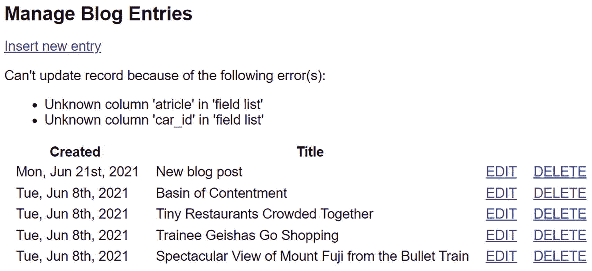

图 18-11

由于列名中的错误，更新失败

1.  保存`blog_update_mysqli.php`和`blog_list_mysqli.php`，并更新现有记录。脚本应该和以前一样工作。

2.  在`blog_update_mysqli.php`中的 SQL 中引入一些故意的错误，并再次测试。这一次，当您返回到`blog_list_mysqli.php`时，您应该会看到类似于图 [18-11](#Fig11) 的一系列错误信息。

1.  单击您刚刚尝试更新的记录的`EDIT`链接，并确认没有任何值发生变化。你可以对照`ch18`文件夹中的`blog_update_mysqli_07.php`和`blog_list_mysqli_05.php`来检查你的代码。

#### PHP 解决方案 18-8:在事务中包装更新序列(PDO)

这个 PHP 解决方案改进了`blog_update_pdo.php`中的脚本，将更新`blog`和`article2cat`表的 SQL 查询序列封装在一个事务中，如果序列的任何部分失败，就将数据库回滚到原始状态。

1.  如有必要，将`blog`和`article2cat`表的存储引擎转换为 InnoDB，如 PHP 解决方案 18-6 所述。

2.  继续使用 PHP 解决方案 18-5 中的`blog_update_pdo.php`和`blog_list_pdo.php`。或者，将`blog_update_pdo_06.php`和`blog_list_pdo_04.php`从`ch18`文件夹复制到`php8sols`站点根目录下的`admin`文件夹，并删除文件名中的数字。

3.  初始化页面顶部的一个变量以跟踪事务，并将其值设置为`false`:

```php
$trans_error = false;

```

Note

PHP 8 在 PDO 中遇到错误时会自动抛出异常，所以只有当您的服务器运行的是旧版本的 PHP 时，才需要执行以下步骤。如果您运行的是 PHP 8 或更高版本，请跳到步骤 5。

1.  在运行查询序列以更新`blog`和`article2cat`表的条件语句中，设置 PDO 在遇到类似这样的问题时抛出异常:

    ```php
    if (isset($_POST['update'])) {
        $conn->setAttribute(PDO::ATTR_ERRMODE, PDO::ERRMODE_EXCEPTION);
        // prepare update query
        $sql = 'UPDATE blog SET image_id = ?, title = ?, article = ?
                WHERE article_id = ?';

    ```

2.  将运行更新查询的所有代码包装在一个`try` / `catch`块中，并在`try`块的开头开始一个事务，如下所示:

    ```php
    if(isset($_POST['update'])) {
        try {
            $conn->beginTransaction();
            // prepare update query
            // other database queries omitted
        } catch (Exception $e) {
            $conn->rollBack();
            $trans_error = $e->getMessage();
        }
    }

    ```

3.  在现有代码中，执行每个查询的返回值都设置为`$done`。这不再是必要的，因为我们正在使用一个事务。我们将使用`$done`作为成功提交事务的返回值。找到以下行(它们在第 53、57 和 69 行周围):

    ```php
    $done = $stmt->execute();
    $done = $stmt->execute([$_POST['article_id']]);
    $done = $conn->exec($sql);

    ```

将它们更改为:

1.  紧接在`catch`块之前，添加粗体代码以提交事务:

    ```php
        $done = $conn->commit();
    } catch (Exception $e) {
        $conn->rollBack();
        $trans_error = $e->getMessage();
    }

    ```

2.  需要修改重定向页面的条件语句来处理事务。添加以粗体突出显示的新代码:

    ```php
    // redirect page after updating or if $_GET['article_id'] not defined
    if (($done || $trans_error) || (!$_POST && !isset($_GET['article_id']))) {
        $url = 'http://localhost/php8sols/admin/blog_list_pdo.php';
        if ($done) {
            $url .= '?updated=true';
        } elseif ($trans_error) {
            $url .= "?trans_error=$trans_error";
        }
        header("Location: $url");
        exit;
    }

    ```

```php
$stmt->execute();
$stmt->execute([$_POST['article_id']]);
$conn->exec($sql);

```

条件现在被分组在括号内，以确保它们被正确解释。第一对检查`$done`或`$trans_error`是否等于`true`。通过检查`$_POST`数组是否为空，最终条件变得更加具体。这是必要的，因为点击更新按钮后，`!isset($_GET['article_id'])`总是`true`。

如果`$trans_error`包含任何错误消息，那么它等同于`true`，因此一个查询字符串被附加到重定向位置。

1.  最后的改变是在`blog_list_pdo.php`中表格上方的 PHP 块中。添加粗体代码，以便在更新失败时显示任何错误消息:

    ```php
    if (isset($_GET['updated'])) {
        echo '<p>Record updated</p>';
    } elseif (isset($_GET['trans_error'])) {
        echo "Can't update record because of the following error: ";
        echo safe($_GET['trans_error']) . '</p>';
    }

    ```

PDO 一遇到错误就抛出异常，所以即使有多个错误，也只会有一个错误消息。

1.  保存`blog_update_pdo.php`和`blog_list_pdo.php`，并更新现有记录。脚本应该和以前一样工作。

2.  在`blog_update_pdo.php`中的一个更新查询中故意引入一个错误，并再次测试。这一次，当您返回到`blog_list_pdo.php`时，您将看到错误消息。

3.  单击您刚刚尝试更新的记录的`EDIT`链接，并确认没有任何值发生变化。你可以对照`ch18`文件夹中的`blog_update_pdo_07.php`和`blog_list_pdo_05.php`来检查你的代码。

Tip

在一系列查询只有在满足特定条件的情况下才应该被处理的情况下，事务是必不可少的。例如，在金融数据库中，只有在有足够的资金可用的情况下，才能进行资金转移。

### 删除时保持引用完整性

在 PHP 解决方案 18-5 中，当您删除交叉引用表中的记录时，无需担心引用完整性，因为存储在每个记录中的值都是外键。每个记录只是引用存储在`blog`和`categories`表中的主键。参见本章开头的图 [18-1](#Fig1) ，从对照表中删除将`article_id 2`与`cat_id 1`组合在一起的记录，只是断开了标题为“见习艺妓去购物”的文章与`Kyoto`类别之间的链接。文章和类别都不受影响。它们都保留在各自的表中。

如果你决定删除文章或类别，情况就大不相同了。如果您从`blog`表中删除“见习艺妓去购物”这篇文章，所有对`article_id 2`的引用也必须从交叉引用表中删除。类似地，如果您删除了`Kyoto`类别，那么所有对`cat_id 1`的引用都必须从交叉引用表中删除。或者，如果项目的主键作为外键存储在其他地方，则必须停止删除。

最好的方法是通过建立外键约束。为此，相关表必须使用 InnoDB 存储引擎。如果您使用的是 MySQL 或 MariaDB 5.5 或更高版本，InnoDB 是默认的。此外，本书附带的所有`.sql`文件都选择了 InnoDB 引擎。但是，如果您有使用 MyISAM 存储引擎创建的现有表，您需要在建立外键约束之前转换它们(参见 PHP 解决方案 18-6)。

#### PHP 解决方案 18-9:设置外键约束

这个 PHP 解决方案描述了如何在 phpMyAdmin 中的`article2cat`、`blog`和`categories`表之间设置外键约束。外键约束必须始终在子表中定义。在本例中，子表是`article2cat`，因为它将其他表中的`article_id`和`cat_id`主键存储为外键。

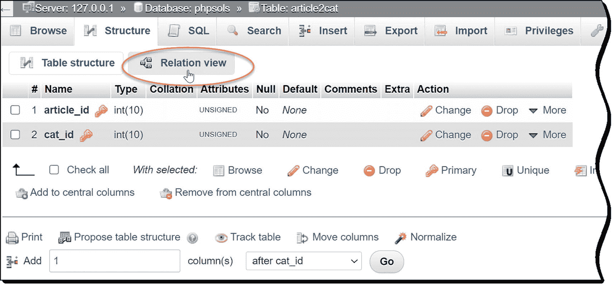

图 18-12

外键约束是在 phpMyAdmin 的关系视图中定义的

1.  在 phpMyAdmin 中选择`article2cat`表，然后单击 Structure 选项卡。

2.  单击结构表上方的关系视图(图 [18-12](#Fig12) 中的圆圈)(在 phpMyAdmin 的旧版本中，它是结构表下方的链接)。

1.  打开的屏幕是您定义外键约束的地方。将“约束名称”字段留空。phpMyAdmin 将自动为约束生成一个名称。

2.  外键约束只能在已索引的列上设置。`article2cat`中的`article_id`和`cat_id`列是表的复合主键，所以它们都列在列下拉菜单中。选择文章标识。然后在外键约束(INNODB)下选择以下设置:

    *   数据库:phpsols

    *   表格:博客

    *   列:文章标识

这在父表(blog)中的 article_id 和子表(article2cat)中的 article_id 之间建立了一个约束。

1.  接下来，您需要决定约束应该如何表现。“删除时”下拉菜单包含以下选项:

    *   级联:当您删除父表中的记录时，子表中的所有相关记录都会被删除。例如，如果删除`blog`表中主键为`article_id 2`的记录，那么`article2cat`表中所有主键为`article_id 2`的记录都会被自动删除。

    *   SET NULL:删除父表中的记录时，子表中的所有相关记录都将外键设置为 NULL。外键列必须接受空值。

    *   无操作:在一些数据库系统中，这允许外键约束检查被延迟。MySQL 会立即执行检查，因此这与 RESTRICT 具有相同的效果。

    *   RESTRICT:如果子表中仍然存在相关记录，这可以防止删除父表中的记录。

Note

同样的选项也适用于`ON UPDATE`。除了`RESTRICT`之外，它们的意义有限，因为只有在特殊情况下才应该更改记录的主键。`ON UPDATE RESTRICT`不仅阻止对父表中主键的更改；它还拒绝在子表中插入或更新任何可能导致在父表中没有匹配的外键值的内容。

如果是对照表，`CASCADE`是合理的选择。如果您决定删除父表中的记录，您希望同时删除对该记录的所有交叉引用。然而，为了演示外键约束的默认行为，为`ON DELETE`和`ON UPDATE`都选择`RESTRICT`。

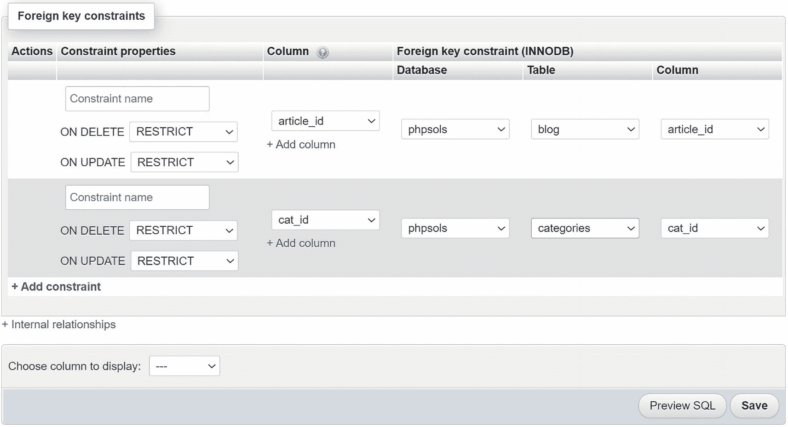

图 18-13

为交叉引用表设置外键约束

1.  单击添加约束链接，使用以下设置为 cat_id 建立外键约束:

    *   数据库:phpsols

    *   表格:类别

    *   列:cat_id

2.  将`ON DELETE`和`ON UPDATE`设置为`RESTRICT`。设置应该如图 [18-13](#Fig13) 所示。然后点击保存按钮。

Note

phpMyAdmin 旧版本中的 Relation 视图的布局有所不同，它将数据库、表和列下拉菜单组合在一个下拉菜单中。

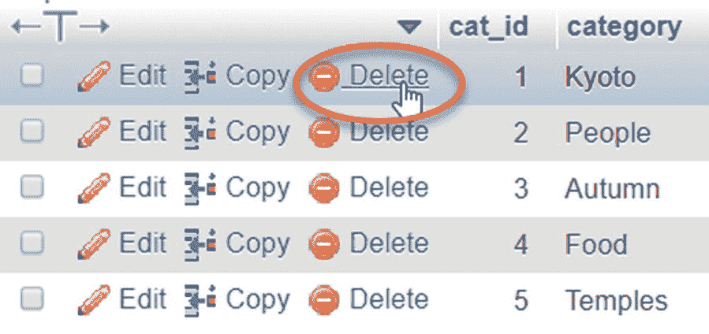

图 18-14

尝试删除类别表中的记录

1.  如果您还没有这样做，请更新至少一个博客条目，使其与类别相关联。

2.  在 phpMyAdmin 中，选择`categories`表，然后点击与博客条目相关的类别旁边的`Delete`，如图 [18-14](#Fig14) 所示。


图 18-15

如果存在相关记录，外键约束会阻止删除

1.  当 phpMyAdmin 要求您确认删除时，单击`OK`。如果你已经正确设置了外键约束，你会看到一个类似于图 [18-15](#Fig15) 的错误信息。

1.  如果错误消息出现在模式对话框中，请单击该框将其消除。

2.  选择`article2cat`表，并点击结构选项卡。然后点击“关系视图”

    Note

    在 phpMyAdmin 的旧版本中，`ON DELETE`和`ON UPDATE`可能为空。将这些选项留空与选择`RESTRICT`效果相同，这是两者的默认设置。

3.  将两个`ON DELETE`设置都更改为`CASCADE`，并点击`Save`。

4.  在`blog`表中选择一条已知与类别相关联的记录。记下它的`article_id`，然后删除记录。

5.  检查`article2cat`表。与您刚刚删除的记录相关联的记录也被删除。

要继续探索外键约束，请选择`blog`表，并与`images`表中的`image_id`建立外键关系。如果从 images 表中删除一条记录，那么 blog 表中的`image_id`外键需要设置为`NULL`。如果将`ON DELETE`的值设置为`SET NULL`，这将自动完成。通过从`images`表中删除一条记录并检查`blog`表中的相关记录来进行测试。

Note

如果需要将 InnoDB 表转换回 MyISAM，必须首先删除所有外键约束。选择“关系视图”，然后单击每个约束左上角的“放下”。在 phpMyAdmin 的旧版本中，将“外键(INNODB)”字段设置为空白，然后单击`Save`。移除约束后，您可以按照 PHP 解决方案 18-6 中的描述更改存储引擎。选择`MyISAM`而不是`InnoDB`。

### 创建带有外键约束的删除脚本

在 InnoDB 表中选择`ON DELETE`的值取决于表之间关系的性质。在使用`phpsols`数据库的情况下，将`article2cat`交叉引用表中的两列都设置为`CASCADE`不仅安全，而且是可取的。如果在`blog`或`categories`父表中删除了一条记录，则需要删除对照表中的相关值。

`images`和`blog`表之间的关系是不同的。如果您从`images`表中删除一条记录，您可能不想删除`blog`表中的相关文章。在那种情况下，`SET NULL`是一个合适的选择。当从`images`表中删除一条记录时，相关文章中的外键被设置为`NULL`，但文章保持不变。

另一方面，如果图像对理解文章至关重要，请选择`RESTRICT`。任何删除仍有相关文章的图像的尝试都会自动停止。

这些考虑会影响您处理删除脚本的方式。当外键约束设置为`CASCADE`或`SET NULL`时，您不需要做任何特殊的事情。您可以使用一个简单的`DELETE`查询，剩下的交给数据库。

但是，如果外键约束被设置为`RESTRICT`，那么`DELETE`查询将会失败。要显示适当的错误消息，请使用 MySQLi 语句对象的`errno`属性。因外键约束而失败的查询的 MySQL 错误代码是`1451`。在调用了`execute()`方法之后，您可以检查 MySQLi 中的错误，如下所示(参见`blog_delete_mysqli_innodb.php`):

```php
$stmt->execute();
if ($stmt->affected_rows > 0) {
    $deleted = true;
} else {
    $deleted = false;
    if ($stmt->errno == 1451) {
        $error = 'That record has dependent files in a child table, and cannot be deleted.';
    } else {
        $error = 'There was a problem deleting the record.';
    }
}

```

如果您使用 PDO，请使用`errorCode()`方法。由于外键约束而失败的查询的代码是`HY000`。在检查了受影响的行数之后，您可以使用 PDO 准备好的语句来检查错误代码，就像这样(参见`blog_delete_pdo_innodb.php`):

```php
$deleted = $stmt->rowCount();
if (!$deleted) {
    if ($stmt->errorCode() == 'HY000') {
        $error = 'That record has dependent files in a child table, and cannot be deleted.';
    } else {
        $error = 'There was a problem deleting the record.';
    }
}

```

如果您使用 PDO `exec()`方法，技术是相同的，该方法使用非`SELECT`查询返回受影响的行数。当使用`exec()`时，在数据库连接上调用`errorCode()`方法:

```php
$deleted = $conn->exec($sql);
if (!$deleted) {
    if ($conn->errorCode() == 'HY000') {
        $error = 'That record has dependent files in a child table, and cannot be deleted.';
    } else {
        $error = 'There was a problem deleting the record.';
    }
}

```

### 创建没有外键约束的删除脚本

如果您不能使用 InnoDB 表，那么您需要将相同的逻辑构建到您自己的删除脚本中。为了达到和`ON DELETE CASCADE`一样的效果，运行两个连续的`DELETE`查询，像这样(代码在`blog_delete_mysqli_myisam_cascade.php`；PDO 版本在`blog_delete_pdo_myisam_cascade.php`):

```php
$sql = 'DELETE FROM article2cat WHERE article_id = ?';
$stmt->prepare($sql);
$stmt->bind_param('i', $_POST['article_id']);
$stmt->execute();
$sql = 'DELETE FROM blog WHERE article_id = ?';
$stmt->prepare($sql);
$stmt->bind_param('i', $_POST['article_id']);
$stmt->execute();

```

为了达到与`ON DELETE SET NULL`相同的效果，运行一个`UPDATE`查询结合一个`DELETE`查询，如下所示:

```php
$sql = 'UPDATE blog SET image_id = NULL WHERE image_id = ?';
$stmt->prepare($sql);
$stmt->bind_param('i', $_POST['image_id']);
$stmt->execute();
$sql = 'DELETE FROM images WHERE image_id = ?';
$stmt->prepare($sql);
$stmt->bind_param('i', $_POST['image_id']);
$stmt->execute();

```

为了达到与`ON DELETE RESTRICT`相同的效果，您需要在继续执行`DELETE`查询之前运行`SELECT`查询来查找是否有相关记录，如下所示:

```php
$sql = 'SELECT image_id FROM blog WHERE image_id = ?';
$stmt->prepare($sql);
$stmt->bind_param('i', $_POST['image_id']);
$stmt->execute();
// store result to find out how many rows it contains
$stmt->store_result();
// if num_rows is not 0, there are dependent records
if ($stmt->num_rows) {
    $error = 'That record has dependent files in a child table, and cannot be deleted.';
} else {
    $sql = 'DELETE FROM images WHERE image_id = ?';
    $stmt->prepare($sql);
    $stmt->bind_param('i', $_POST['image_id']);
    $stmt->execute();
}

```

## 第三章回顾

一旦您学会了与数据库通信所需的基本 SQL 和 PHP 命令，使用单个表就非常容易了。然而，通过外键来链接表是很有挑战性的。关系数据库的强大之处在于它的灵活性。问题是这种无限的灵活性意味着没有单一的“正确”做事方式。

不过，不要因此而分心。您的直觉可能是坚持使用单个表，但是沿着这条路走下去会有更大的复杂性。让使用数据库变得容易的关键是在早期阶段限制你的野心。像本章一样建立简单的结构，用它们做实验，了解它们是如何工作的。逐渐添加表和外键链接。有大量数据库工作经验的人说，他们经常花一半以上的开发时间来考虑表结构。在那之后，编码是容易的部分！

在最后一章中，我们将回到使用单个表，解决使用数据库进行用户身份验证的重要问题，以及如何处理散列和加密的密码。