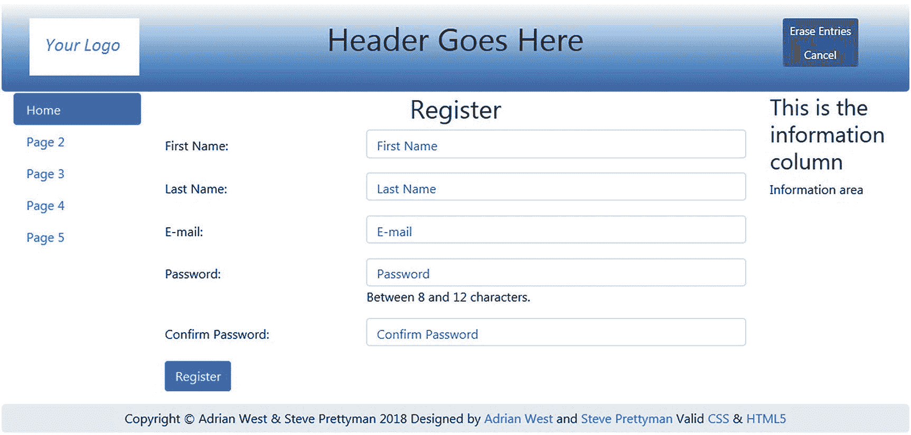
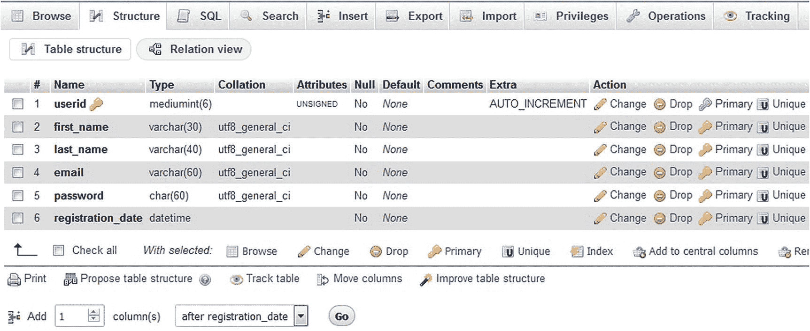
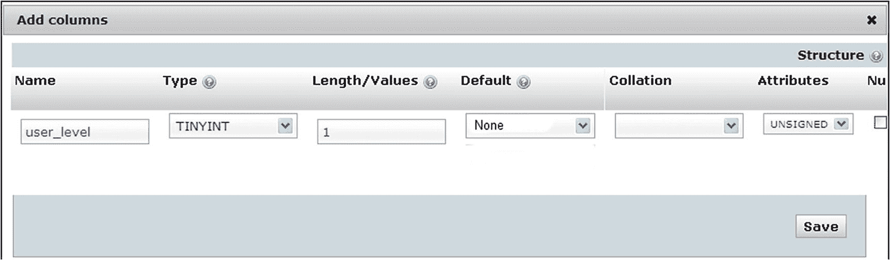
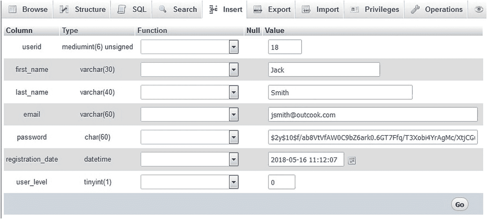
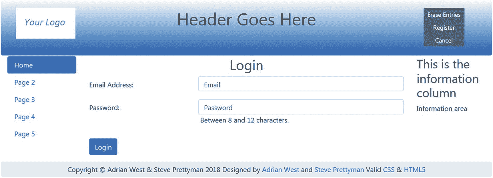
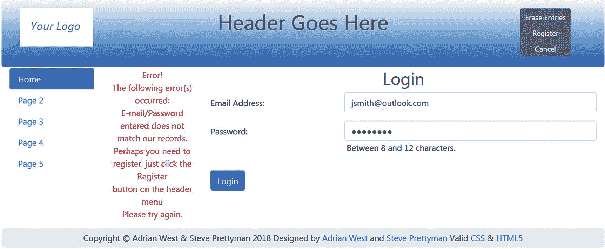
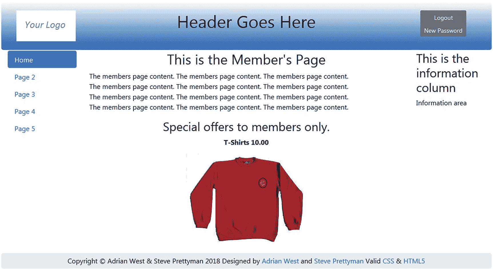
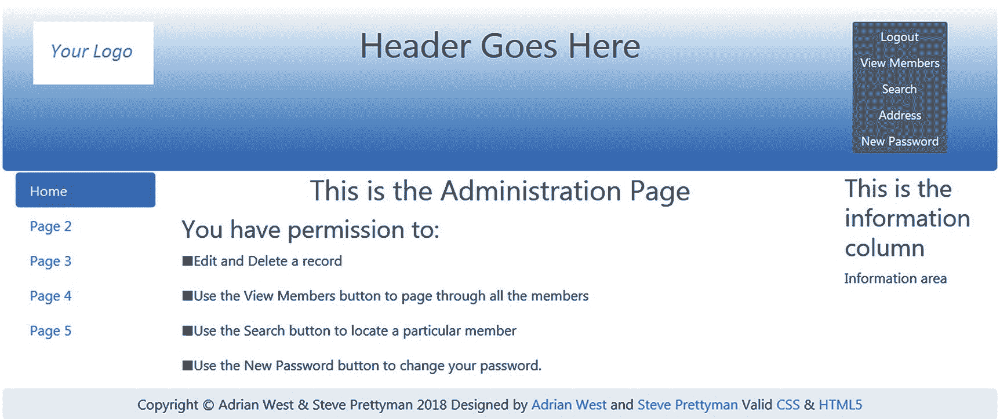
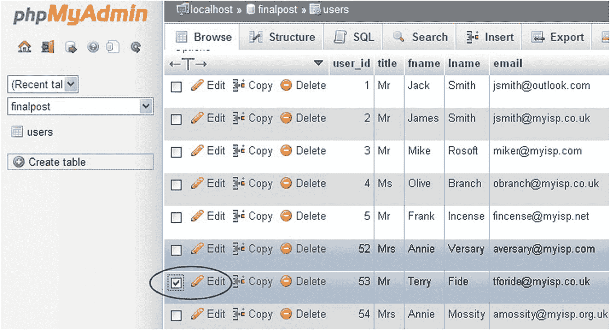

# 3.为成员和管理员创建登录/注销功能

在第 2 章中，我们使用数据库和表格创建了第一个交互式页面。到现在，你可能已经意识到我们创造的东西并不是很实用；但是，您学习了如何将交互性嵌入到真实的页面中。更实际的应用是允许注册用户登录和注销个人页面。当用户登录时，他们应该能够访问网站提供的额外功能。这可能是一个为会员提供特殊服务的页面，也可能是在博客中添加评论、访问会议记录或查看会员特殊活动日期的功能。

完成本章后，您应该能够

*   创建新的数据库和表

*   删除或替换标题中的菜单按钮

*   处理 HTML 文本框中不需要的字符

*   区分两种类型的成员资格或用户级别

*   创建用户级别以限制对个人页面的访问

*   创建登录和注销页面

*   创建成员专用页面

*   规划管理员的角色

*   测试登录和注销的能力

在前面的教程中，任何用户都可以查看成员表，但是成员们不会高兴地知道他们的个人详细信息对每个人都可用。我们现在必须防止这种情况，只允许管理员(如会员秘书)和网站管理员查看会员表。

管理员是一类特殊的用户:他们应该能够查看成员表，修改或删除记录。精通计算机的管理员可以使用 phpMyAdmin，但许多管理员将是只具备基本计算机技能的会员秘书。他们需要一个简单的界面来查看、修改和删除记录。本章将教你如何为管理员创建和实现一个用户友好的界面。第[章 4](04.html) 、[章 5](05.html) 和[章 6](06.html) 将逐步完善这个接口。

要登录网站上的私人页面，注册成员和管理员必须输入只有他们知道的信息，例如，用户的电子邮件地址和密码或用户名和密码。登录页面将自动检查登录详细信息是否与数据库中保存的用户信息相匹配。如果登录细节得到验证，则允许用户访问私人网页。

## 创建 logindb 数据库和用户表

本章中的教程基于第 [2](02.html) 章中创建的页面。我们将通过为数据库和包含 PHP 和 HTML 页面的文件夹使用一个新名称来阐明文件结构。这是必要的，因为我们发现，如果学生一次又一次地修改，他们会陷入可怕的混乱。因此，作为一般规则，我们将继续为本书的每个新章节使用单独的文件夹和新的数据库名称。但是，一个表可以和前面的教程同名(例如，*用户*)。如果表在不同的数据库中，这是可以接受的。

我们开始吧。创建一个新文件夹和一个新数据库，如下所示:

1.  在 XAMPP *htdocs* 或 easyPHP *eds-www* 文件夹中，新建一个名为 *login* 的文件夹。

2.  在[出版社的网页上下载第](http://apress.com) [3](03.html) 章的 PHP 文件。并将它们放入 XAMPP *htdocs* 或 easyPHP *eds-www* 的新登录文件夹中。或者，您可以在阅读本章时，通过在 HTML 编辑器中键入每个文件来练习创建 PHP 和 HTML 清单。将它们保存在您的*登录*文件夹中，以便您可以运行它们。

3.  打开 phpmyadmin。

4.  单击数据库选项卡。

5.  创建一个名为 *logindb* 的新数据库。如第 [2](02.html) 章所示，将编码设置为 utf8-general-ci。

6.  按照第 [2](02.html) 章的说明为数据库添加用户、用户 ID 和密码。使用以下属性:

    *用户名*:威廉

    *主机*:本地主机

    *密码* : Cat0nlap

    数据库名称:logindb

7.  在 *login* 文件夹中，创建 *mysqli_connect.php* 文件，以便它连接到 logindb，如下面的清单所示:

*列出连接到新数据库所需的代码片段(msqli_connect.php)*

```php
<?php
// Create a connection to the logindb database.
// Set the encoding and the access details as constants:
Define ('DB_USER', 'william');
Define ('DB_PASSWORD', 'Cat0nlap');
Define ('DB_HOST', 'localhost');
Define ('DB_NAME', 'logindb');
// Make the connection:
$dbcon = new mysqli(DB_HOST, DB_USER, DB_PASSWORD, DB_NAME);
mysqli_set_charset($dbcon, 'utf8');
?>

```

在实际环境中，这个连接文件将保存在一个安全的文件夹中。

### 注意

抵制从书的 PDF 版本中复制和粘贴代码的冲动。在编辑过程中，某些符号更改可能会导致示例代码无法执行。最好的方法是从[进程下载代码。com](http://apress.com) 网站。如果您确实从 PDF 版本中复制了代码，请将其放入 Microsoft 记事本中，然后保存。这确实修复了一些可能对 PHP 无效的引号字符。

表 3-1

用户表的属性

<colgroup><col class="tcol1 align-left"> <col class="tcol2 align-left"> <col class="tcol3 align-left"> <col class="tcol4 align-left"> <col class="tcol5 align-left"> <col class="tcol6 align-left"> <col class="tcol7 align-left"> <col class="tcol8 align-left"></colgroup> 
| 

列名

 | 

类型

 | 

长度/值

 | 

默认

 | 

属性

 | 

空

 | 

索引

 | 

A_I

 |
| --- | --- | --- | --- | --- | --- | --- | --- |
| 用户 id | 中位 | six | 没有人 | 无符号的 | -是吗 | 主要的 | ·······················。 |
| 名字 | 可变长字符串 | Thirty | 没有人 |   | -是吗 |   | -是吗 |
| 姓氏 | 可变长字符串 | Forty | 没有人 |   | -是吗 |   | -是吗 |
| 电子邮件 | 可变长字符串 | Fifty | 没有人 |   | -是吗 |   | -是吗 |
| 密码 | 茶 | Sixty | 没有人 |   | -是吗 |   | -是吗 |
| 注册日期 | DATETIME |   | 没有人 |   | -是吗 |   | -是吗 |

1.  在数据库 logindb 中，创建一个名为 *users* 的新表，该表有六列。其布局和属性与第 [2](02.html) 章中的用户表相同。详见表 [3-1](#Tab1) 。如第 [2](02.html) 章所述，phpMyAdmin 的某些版本不要求输入主索引(user_id)的长度(6)和属性(无符号)。user_id 字段是一个 autonum 字段，数据库系统在其中生成号码。按照第 [2](02.html) 章中设置前一个数据库的相同方式设置该表。

记得调整密码字段的大小，以符合最新的哈希标准。您可以在这里找到当前的 PHP 哈希标准:

```php
http://php.net/manual/en/function.password-hash.php

```

现在我们将整理标题菜单。

## 移除或替换标题中多余的菜单按钮

如第 [2](02.html) 章所述，一些标题菜单按钮已经变得多余，需要一些新的按钮。在本节中，标题菜单将被修改。我们必须阻止公众和普通成员查看成员表。为了实现这一点，现在，我们将从除管理页面上的标题之外的所有标题中删除显示成员表的链接。我们也将很快要求管理员登录访问他们的页面。我们还需要删除成员页面上的登录链接，因为该成员已经登录。我们必须添加一个注销链接。注册链接也是多余的，因为成员和管理员已经注册；因此，菜单按钮也将被删除。

### 小费

当你全神贯注于数据库和网站页面的编码时，多余的按钮很容易被忽略。试着培养检查每一个新的或修改过的页面的标题的习惯，以确保没有多余或丢失的按钮。

在使用许多页面的“真实世界”网站中，我们可能会将实际的菜单页面链接存储在一个数据库表中，并使用基于登录用户级别(如管理员或用户)的代码来确定提供哪些链接。然而，对于较小的网站(比如这个演示)，创建一些额外的标题菜单也是一样快(或者更快)。

### 向主页标题添加登录按钮

我们现在将在主页的标题菜单中添加一个新按钮，以便成员可以登录。我们还将删除“查看用户”按钮，因为我们希望进行安排，以便只有管理员能够查看成员表(我们将很快提供额外的限制)。图 [3-1](#Fig1) 显示了修改后的割台。


图 3-1

主页的修订标题。“新密码”按钮已被删除，“查看用户”按钮被“登录”按钮所取代。

删除了“查看用户”和“新密码”按钮，并添加了“登录”按钮。修改后的标题将自动包含在非专用页面(第 2 页、第 3 页等)中，因为标题文件名没有改变。

清单 [3-1](#PC3) 显示了新标题的代码。

```php
<div class="col-sm-2">

</div>
<div class="col-sm-8">
 <h1 class="blue-text mb-4 font-bold">Header Goes Here</h1>
 </div>
     <nav class="col-sm-2">
        <div class="btn-group-vertical btn-group-sm" role="group"
       aria-label="Button Group">
  <button type="button" class="btn btn-secondary"
    onclick="location.href = 'login.php'" >Login</button>
  <button type="button" class="btn btn-secondary"
    onclick="location.href = 'register-page.php'">Register</button>
</div>
     </nav>

Listing 3-1Revising the Home Page Header Menu (header.php)

```

在运行 XAMPP 或 easyPHP 的情况下，在浏览器中输入**http://localhost/log in/index . PHP**查看带有新登录按钮的主页，如图 [3-1](#Fig1) 所示。

### 删除注册和新密码标题中多余的按钮

注册页面和新密码页面需要一个新的标题，因为以前的标题有多余的菜单按钮。

在注册页面上，用户没有密码，因此无法登录；因此，登录和新密码按钮将被删除。注册按钮是多余的，因为用户已经访问了注册页面。现在，我们将从注册页面的标题中删除多余的按钮，并替换为更有用的按钮。图 [3-2](#Fig2) 显示了新的割台。


图 3-2

注册页面和新密码页面的新标题

多余的按钮被两个有意义的链接取代，即删除条目和取消。“删除条目”按钮重新加载注册页面，然后显示空字段。在与不熟悉电脑的用户测试网站后，我们选择了 Er *作为条目*,而不是清除或删除所有条目。他们被“清除”和“擦除所有”的措词弄糊涂了，但他们立即明白了“擦除”条目。取消按钮使用户返回主页。清单 [3-2a](#PC4) 给出了注册和新密码页面的修改标题代码。

```php
<div class="col-sm-2">

</div>
<div class="col-sm-8">
 <h1 class="blue-text mb-4 font-bold">Header Goes Here</h1>
 </div>
     <nav class="col-sm-2">
        <div class="btn-group-vertical btn-group-sm" role="group"
        aria-label="Button Group">
  <button type="button" class="btn btn-secondary"
    onclick="location.href = 'register-page'" >Erase Entries</button>
  <button type="button" class="btn btn-secondary"
    onclick="location.href = 'index.php'">Cancel</button>
</div>
    </nav>

Listing 3-2aReplacing Redundant Buttons with Meaningful Buttons (register-header.php)

```

本章和后续章节的注册页面将链接到新的标题，如清单 [3-2b](#PC5) 中的下一段代码所示。

### 修改后的注册页面

其余代码与第 [2](02.html) 章中的注册页面相同。修订后的代码包含在章节 [3](03.html) 的可下载文件中。

```php
<!DOCTYPE html>
<html lang="en">
<head>
  <title>Template for an interactive web page</title>
  <meta charset="utf-8">
  <meta name="viewport"
     content="width=device-width, initial-scale=1, shrink-to-fit=no">
  <!-- Bootstrap CSS File -->
  <link rel="stylesheet"
   href=
"https://stackpath.bootstrapcdn.com/bootstrap/4.1.0/css/bootstrap.min.css"
   integrity=
"sha384-9gVQ4dYFwwWSjIDZnLEWnxCjeSWFphJiwGPXr1jddIhOegiu1FwO5qRGvFXOdJZ4"
  crossorigin="anonymous">
   <script src="verify.js"></script>
</head>
<body>
<div class="container" style="margin-top:30px">
<!-- Header Section -->
<header class="jumbotron text-center row col-sm-14"
style=
  "margin-bottom:2px; background:linear-gradient(white, #0073e6);
   padding:20px;">
  <?php include('register-header.php'); ?>
</header>
<!-- Body Section -->
  <div class="row" style="padding-left: 0px;">
<!-- Left-side Column Menu Section -->
  <nav class="col-sm-2">
      <ul class="nav nav-pills flex-column">
              <?php include('nav.php'); ?>
  </ul>
       </nav>

Listing 3-2bIncluding the New Header in the Registration Page (register-page.php)

```

新标题现在将应用于新密码页面。

### 新密码页面的新标题

新密码页面将需要相同的新标题。(如图 [3-2](#Fig2) 所示。)

本章和后续章节的新密码页面将链接到新标题，如清单 [3-2c](#PC6) 中的下一段代码所示。

“删除条目”按钮重新加载“新密码”页面并显示空字段。取消按钮使用户返回主页。

```php
<div class="col-sm-2">

</div>
<div class="col-sm-8">
 <h1 class="blue-text mb-4 font-bold">Header Goes Here</h1>
 </div>
     <nav class="col-sm-2">
       <div class="btn-group-vertical btn-group-sm"
       role="group" aria-label="Button Group">
  <button type="button" class="btn btn-secondary"
       onclick="location.href = 'change-password.php'" >
       Erase Entries</button>
  <button type="button" class="btn btn-secondary"
       onclick="location.href = 'index.php'">Cancel</button>
</div>
    </nav>

Listing 3-2cReplacing Redundant Buttons with Meaningful Buttons (password-header.php)

```

头部包含的文件在注册密码文件(*change-password.php*)中进行了修改，如以下代码片段所示:

```php
<!DOCTYPE html>
<html lang="en">
<head>
  <title>Template for an interactive web page</title>
  <meta charset="utf-8">
  <meta name="viewport"
    content="width=device-width, initial-scale=1, shrink-to-fit=no">
  <!-- Bootstrap CSS File -->
  <link rel="stylesheet"
  href=
"https://stackpath.bootstrapcdn.com/bootstrap/4.1.0/css/bootstrap.min.css"
  integrity=
"sha384-9gVQ4dYFwwWSjIDZnLEWnxCjeSWFphJiwGPXr1jddIhOegiu1FwO5qRGvFXOdJZ4"
  crossorigin="anonymous">
  <script src="verify.js"></script>
</head>
<body>
<div class="container" style="margin-top:30px">
<!-- Header Section -->
<header class="jumbotron text-center row col-sm-14"
style="margin-bottom:2px; background:linear-gradient(white, #0073e6);
  padding:20px;">
  <?php include('password-header.php'); ?>
</header>
<!-- Body Section -->
  <div class="row" style="padding-left: 0px;">
<!-- Left-side Column Menu Section -->
  <nav class="col-sm-2">
      <ul class="nav nav-pills flex-column">
              <?php include('nav.php'); ?>
      </ul>
  </nav>

```

其余的代码放在这里，从第[章到第](02.html)章没有变化。

### 成员页面的新标题菜单

对于成员页面，取消了注册按钮和查看成员按钮，增加了注销按钮，如图 [3-3](#Fig3) 所示。


图 3-3

成员页面的修改标题菜单

请注意，在图 [3-3](#Fig3) 中，当成员登录到成员页面时，登录菜单按钮会变为注销按钮。有几种聪明的方法可以实现这一点，但是最简单的方法是在成员页面中加载一个新的标题。这是有效的，因为有时特殊成员页面也需要稍微改变标题图像或文本。另请注意，多余的注册和新密码按钮已从标题菜单中删除。

新文件被命名为*members-header.php*。新的注销按钮有一个链接，将用户带到名为 logout.php*的页面。这反过来会将用户发送到主页。为什么链接不直接到主页？因为 logout.php 的中间页面*包含了一些在访问主页之前关闭会话的代码。会话是一种设备，将在下一节中解释。新标题的注销链接显示在下面的代码片段中。**

清单 [3-3](#PC8) 显示了剩下的两个链接的代码。

```php
<div class="col-sm-2">

</div>
<div class="col-sm-8">
 <h1 class="blue-text mb-4 font-bold">Header Goes Here</h1>
 </div>
     <nav class="col-sm-2">
        <div class="btn-group-vertical btn-group-sm" role="group"
     aria-label="Button Group">
  <button type="button" class="btn btn-secondary"
     onclick="location.href = 'logout.php'" >Logout</button>
  <button type="button" class="btn btn-secondary"
     onclick="location.href = 'change-password.php'" >New Password</button>
</div>
    </nav>

Listing 3-3Creating the New Header for the Members page (members-header.php)

```

如果该网站有一个以上的网页是专为会员，你可以添加更多的按钮，链接到文件*members-header.php*；或者，您可以将链接放在成员页面的正文中。

### 修改“谢谢”页面的标题

当用户到达“谢谢”页面时，他们已经注册，不再需要注册按钮，也不需要任何其他按钮。“谢谢”页面标题只需要一个将用户重定向到主页的按钮。图 [3-4](#Fig4) 显示了带有主页按钮的页眉。


图 3-4

“谢谢”页面的修订标题

标题中的主页菜单按钮将用户重定向到主页(*index.php*)，如清单 [3-4a](#PC9) 所示。

```php
<div class="col-sm-2">

</div>
<div class="col-sm-8">
 <h1 class="blue-text mb-4 font-bold">Header Goes Here</h1>
 </div>
     <nav class="col-sm-2">
        <div class="btn-group-vertical btn-group-sm" role="group"
     aria-label="Button Group">
  <button type="button" class="btn btn-secondary"
       onclick="location.href = 'index.php'" >Home Page</button>
</div>
    </nav>

Listing 3-4aCreating the Code for the Revised “Thank You” Header (thanks-header.php)

```

“谢谢”页面现在将被修改，以包含修改后的标题。清单 [3-4b](#PC10) 显示了“谢谢”页面中更改后的 *include* 声明。

```php
<!DOCTYPE html>
<html lang="en">
<head>
  <title>Register Thanks</title>
  <meta charset="utf-8">
  <meta name="viewport"
    content="width=device-width, initial-scale=1, shrink-to-fit=no">
  <!-- Bootstrap CSS File -->
  <link rel="stylesheet"
    href=
"https://stackpath.bootstrapcdn.com/bootstrap/4.1.0/css/bootstrap.min.css"
  integrity=
 "sha384-9gVQ4dYFwwWSjIDZnLEWnxCjeSWFphJiwGPXr1jddIhOegiu1FwO5qRGvFXOdJZ4"
  crossorigin="anonymous">
</head>
<body>
<div class="container" style="margin-top:30px">
<!-- Header Section -->
<header class="jumbotron text-center row"
style="margin-bottom:2px; background:linear-gradient(white, #0073e6);
  padding:20px;">
  <?php include('thanks-header.php'); ?>
</header>
<!-- Body Section -->
  <div class="row" style="padding-left: 0px;">
<!-- Left-side Column Menu Section -->
  <nav class="col-sm-2">
      <ul class="nav nav-pills flex-column">
              <?php include('nav.php'); ?>
      </ul>
  </nav>

Listing 3-4bCreating the Revised “Thank You” Page (register-thanks.php)

```

其余代码与章节 [2](02.html) 中的代码相同。

## 注册页面和不需要的字符

我们现在将开始验证用户是否提供了有效信息。每当文本框用于用户输入时，它都可能允许用户输入不需要的字符，这可能是试图提供 SQL 注入(用户试图访问您的数据库)或意外的用户输入错误。我们将使用 PHP 输入过滤函数来净化输入。这里显示了一个示例:

```php
$first_name = filter_var( $_POST['first_name'], FILTER_SANITIZE_STRING);

```

我们现在将该功能添加到我们的注册页面。现在，让我们添加更新后的*register-header.php*文件，该文件只包含两个按钮:删除条目和取消。

图 [3-5](#Fig5) 显示了带有新标题的注册页面。



图 3-5

带有新标题的注册页面

清单 [3-5](#PC12) 显示了修改后的 PHP 代码，用于过滤 process-register-page.php 的*条目。*

```php
<?php
// This script is a query that INSERTs a record in the users table.
// Check that form has been submitted:
try {                                                                        #1
       $errors = array(); // Initialize an error array.
       // Check for a first name:
      $first_name = filter_var( $_POST['first_name'], FILTER_SANITIZE_STRING);
       if (empty($first_name)) {
               $errors[] = 'You forgot to enter your first name.';
        }
        // Check for a last name:
      $last_name = filter_var( $_POST['last_name'], FILTER_SANITIZE_STRING);
        if (empty($last_name)) {
               $errors[] = 'You forgot to enter your last name.';
        }
        // Check for an email address:                                       #2
            $email = filter_var( $_POST['email'], FILTER_SANITIZE_EMAIL);
        if  ((empty($email)) || (!filter_var($email, FILTER_VALIDATE_EMAIL))) {
               $errors[] = 'You forgot to enter your email address';
               $errors[] = ' or the e-mail format is incorrect.';
        }
        // Check for a password and match against the confirmed password:
        $password1 = filter_var( $_POST['password1'], FILTER_SANITIZE_STRING);
        $password2 = filter_var( $_POST['password2'], FILTER_SANITIZE_STRING);
        if (!empty($password1)) {
               if ($password1 !== $password2) {
                       $errors[] = 'Your two password did not match.';
               }
        } else {
               $errors[] = 'You forgot to enter your password.';
        }
        if (empty($errors)) { // If everything's OK.
        // Register the user in the database...
        // Hash password current 60 characters but can increase
            $hashed_passcode = password_hash($password1, PASSWORD_DEFAULT);
               require ('mysqli_connect.php'); // Connect to the db.
               // Make the query:
               $query = "INSERT INTO users (userid, first_name, last_name, ";
               $query .= "email, password, registration_date) ";
               $query .="VALUES(' ', ?, ?, ?, ?, NOW() )";
        $q = mysqli_stmt_init($dbcon);
        mysqli_stmt_prepare($q, $query);
        // use prepared statement to ensure that only text is inserted
        // bind fields to SQL Statement
        mysqli_stmt_bind_param($q, 'ssss', $first_name, $last_name, $email, $hashed_passcode);
        // execute query
        mysqli_stmt_execute($q);
        if (mysqli_stmt_affected_rows($q) == 1) {    // One record inserted
               header ("location: register-thanks.php");
               exit();
         } else { // If it did not run OK.
               // Public message:
               $errorstring =
               "<p class='text-center col-sm-8' style='color:red'>";
               $errorstring .=
               "System Error<br />You could not be registered due ";
               $errorstring .=
               "to a system error. We apologize for any inconvenience.</p>";
               echo "<p class=' text-center col-sm-2'
               style='color:red'>$errorstring</p>";
               // Debugging message below do not use in production
               //echo '<p>' . mysqli_error($dbcon) . '<br><br>Query: ' .
                  $query . '</p>';
               mysqli_close($dbcon); // Close the database connection.
               // include footer then close program to stop execution
               echo '<footer class="jumbotron text-center col-sm-12"
                   style="padding-bottom:1px; padding-top:8px;">
             include("footer.php");
             </footer>';
               exit();
               }
        } else { // Report the errors.
               $errorstring =
                 "Error! <br /> The following error(s) occurred:<br>";
           foreach ($errors as $msg) { // Print each error.
                       $errorstring .= " - $msg<br>\n";
           }
           $errorstring .= "Please try again.<br>";
           echo "<p class=' text-center col-sm-2'
               style='color:red'>$errorstring</p>";
           }// End of if (empty($errors)) IF.
           }
   catch(Exception $e) // We finally handle any problems here
   {
     // print "An Exception occurred. Message: " . $e->getMessage();
     print "The system is busy please try later";
   }
   catch(Error $e)
   {
      //print "An Error occurred. Message: " . $e->getMessage();
      print "The system is busy please try again later.";
   }
?>

Listing 3-5Creating the Amended Registration Page (process-register-page.php)

```

### 代码的解释

本节解释代码。

```php
try {                                                                     #1
        $errors = array(); // Initialize an error array.
        // Check for a first name:
        $first_name = filter_var( $_POST['first_name'], FILTER_SANITIZE_STRING);
        if (empty($first_name)) {
                $errors[] = 'You forgot to enter your first name.';
        }

```

具有 FILTER_SANITIZE_STRING 属性的 filter_var 函数将从用户输入的值中删除多余的空格和 HTML 标记。除了使用预准备语句之外，这将大大降低用户使用 SQL 注入访问数据库或在数据库中输入无效信息的能力。该代码仍然允许输入非字母字符。我们将在后面的章节中删除这些字符。

```php
// Check for an email address:                                             #2
            $email = filter_var( $_POST['email'], FILTER_SANITIZE_EMAIL);
        if  ((empty($email)) || (!filter_var($email, FILTER_VALIDATE_EMAIL))) {
               $errors[] = 'You forgot to enter your email address';
               $errors[] = ' or the e-mail format is incorrect.';
        }

```

filter_var 函数具有 FILTER_SANITIZE_EMAIL 属性，该属性将删除任何无效的电子邮件字符。此外，如果输入的电子邮件格式正确，属性 FILTER_VALIDATE_EMAIL 将返回 true 或 false。在这段代码中，我们可以使用这个属性来验证电子邮件。但是，因为我们想将表单中的电子邮件保存到$email 中，所以我们也对它进行了清理。还有一些附加属性可用于整理和过滤用户输入。有关更多信息，请访问此页面:

[T2`www.php.net/manual/en/function.filter-input.php`](http://www.php.net/manual/en/function.filter-input.php)

### 注册一些成员

在这一点上，你应该在数据库中注册一些虚构的人，这样你在本章的后面就有东西可以玩了。为了节省您的时间，我们重复了第 [2](02.html) 章的成员名单，他们显示在表 [3-2](#Tab2) 中。

表 3-2

注册一些成员

<colgroup><col class="tcol1 align-left"> <col class="tcol2 align-left"> <col class="tcol3 align-left"></colgroup> 
| 

名字

 | 

电子邮件

 | 

密码

 |
| --- | --- | --- |
| 麦克·罗斯 | 米克尔@myisp.com | W1llgat3s |
| 橄榄枝 | obranch@myisp.com.uk | 第 1 年第 0 季第 3 集 |
| 弗兰克·弗雷泽 | finsin @ my ISP . net | P3 PFM 300 型核潜艇 |
| 周年纪念日 | aversary@myisp.com | B1 港币 3yg1rl |
| 特里·菲德 | tfide @ my ISP . com | 刀疤 3dst1ff |
| 玫瑰（灌木）丛 | rbush@myisp.co.uk | R3 db 100 ms |

为了维护个人页面的安全性，我们使用了一种叫做 *sessions* 的设备。一个会话通常包括一个完整的过程(如银行交易)。例如，如果一个人想把钱从储蓄账户转到支票账户，就会发生多个动作。首先从储蓄账户中取出钱，然后存入支票账户。如果动作不存款会怎么样？如果这两个动作没有绑定在一起(通过会话)，钱就没了。但是，如果会话存在且操作未完成，则可以回滚。最糟糕的情况是钱永远不会被取出并存入银行。因此，钱没有丢失。

在网页中，会话还可以用于将页面内容关联在一起。这允许用户一次登录整个网站。会话可以确定用户已经登录，并为他们分配适当的访问权限。如果会话不存在，用户可能需要登录每个页面。其他数据也可以存储在一个会话中，以允许同一网站中的多个页面共享信息。

会话在服务器中处于活动状态，直到会话关闭或超时。它会在服务器管理员设置的一段时间(通常为 20 分钟)后超时。如果提供了关闭会话(注销)的代码，如果用户浏览了远离原始网站的多个页面，或者如果用户关闭了浏览器，会话也会关闭。然而，开发者不应该依赖于用户关闭浏览器或者滚动到离网站足够远的地方。应该总是有方法关闭会话。

## 区分两种类型的成员

前一章中的 simpledb 数据库有一个安全问题；任何未注册的用户都可以通过访问网站来查看成员列表。我们现在将确保成员表只能被开发人员和成员秘书(管理员)查看，而不能被整个世界查看。一种解决方案是指导会员秘书如何安装和使用 phpMyAdmin 然而，我们会假设我们的会员秘书不太懂计算机，也不想学习 phpMyAdmin。

我们的解决方案是限制对 *view_table.php* 页面和所有其他管理员页面的访问，这样只有会员秘书可以查看它们。这将通过为管理员使用会话和不同的 user_level 编号来实现。将为管理员提供一个用户友好的界面，以便他们可以搜索和修改会员记录。

总而言之，我们区分会员类型的规则如下:

*   非会员将无法查看私人页面，因为用户只有注册后才能登录。

*   注册会员将能够访问会员页面，因为他们可以登录。这样会启动一个会话，允许他们打开成员页面。

*   管理员是唯一能够访问管理页面的人。当他们登录时，登录操作会启动一个会话，在他们可以打开管理员页面之前检查 user_level。user_level 不同于普通会员的用户级别。

在设计登录页面之前，我们还必须创建一种方法来区分普通注册成员和同时也是管理员的成员。管理员将拥有额外的特权。在下一个教程中，您将学习如何向现有的数据库表中添加标题为 *user_level* 的新列。这一新栏目将使我们能够区分会员类型。

## 创建用户级别以限制对个人页面的访问

为了限制对视图表页面的访问，我们将向 users 表添加一个名为 *user_level* 的列。在本专栏中，我们将为管理员指定一个用户级别编号 1。注意:如果您提供通过网页设置该值的能力，我们建议您使用一个不太明显的值(如 999)来表示管理级别。该号码与会员秘书的登录信息有关，与其他人无关。

访问 phpMyAdmin 并单击数据库 logindb。然后单击用户表。单击“结构”选项卡。查看记录下方，在*加 1 列*字样旁找到加符号，如图 [3-6](#Fig6) 所示。



图 3-6

添加符号出现在该屏幕的底部

接下来，在单词*的右侧，添加一列*，使用下拉菜单选择 registration_date。或者，选择表格末端标有*的单选按钮，然后点击 Go 按钮。*

您将被带到图 [3-7](#Fig7) 所示的屏幕。



图 3-7

为新的 user_level 列创建标题和属性

插入新列名及其属性，如下所示:

*   *名称*:用户级别

*   *类型* : TINYINT

*   *长度/数值* : 1

*   *默认*:无

*   *属性*:无符号

当您对属性感到满意时，单击保存按钮。将创建新列。

下一步是启动 XAMPP 或 easyPHP，通过在浏览器的地址栏中输入`http://localhost/login/index.php`来访问页面。当索引页面出现时，点击标题菜单上的注册按钮，将该用户注册为普通会员，如下所示:

*   名字:詹姆斯

*   *姓氏*:史密斯

*   电子邮件:jsmith@myisp.co.uk

*   *密码*:blacks m1

当使用正确的电子邮件地址和密码时，詹姆斯·史密斯可以查看成员的特殊页面，但不能查看或修改成员列表。

我们现在将任命詹姆斯·史密斯为会员秘书，有权管理会员名单。为了安全起见，需要第二个名字和一个伪电子邮件地址和密码来访问管理部分；因此，我们需要一个额外的注册身份。第二个电子邮件地址很重要，因为办公室同事可能知道 James 的个人电子邮件地址。必须尽一切努力对管理员的登录信息保密。电子邮件地址应该是虚构的，但必须符合公认的电子邮件格式。现在使用假名(“Jack”)、新的电子邮件地址和新的密码再次注册会员秘书，如下所示:

*   *名字*:杰克

*   *姓氏*:史密斯

*   电子邮件:jsmith@outcook.com

*   *密码* : D0gsb0dy

现在使用 phpMyAdmin 来访问数据库 logindb 和 users 表。点击浏览选项卡，找到管理员杰克·史密斯的记录，如图 [3-8](#Fig8) 所示。如果您单击编辑链接，您将能够将他的 user_level 字段从 0 更改为 1。单击“执行”按钮保存更改



图 3-8

找到杰克·史密斯的记录，并将 user_level 更改为 1

当詹姆斯·史密斯使用个人电子邮件地址和原始密码登录时，会员页面将像其他会员一样显示。这是因为原始密码的 user_level 为零，与所有其他注册成员相同。但是，当 James 登录 Jack 电子邮件地址和管理员密码时，将显示管理页面，因为 Jack 电子邮件地址的 user_level 是 1。

现实世界中的管理员会确保没有人能够发现替代的电子邮件地址和新密码。与管理员联系的人将使用原始姓名和个人电子邮件地址。

### 小费

如果詹姆斯·史密斯辞职，新的管理员被任命，网站管理员将删除杰克·史密斯的记录。新的管理员假名和新密码将被分配给 James 的替代者。当管理员用新密码登录时，新的会员秘书将被分配一个替代(假)电子邮件地址。然后，网站管理员将会员秘书的用户级别设置为 1。

现在我们将创建登录页面并引入一些新的 PHP 语句。

## 登录

从用户的角度来看，登录或退出网站的能力是没有意义的，除非它能带来一些好处，比如为成员提供一个特殊的页面或者允许在博客中发表评论。在接下来的部分中，我们将创建与注册用户交互的新页面。这将是一个登录页面，一个成员专用页面，和一个管理员页面。同一个登录页面用于登录成员页面或管理员页面。如果您认为登录过程完全保护了管理页面和成员页面，这是可以理解的。然而，想象一下下面的场景。

一个成员登录了一个私人页面，然后被叫去接电话。有人可以查看会员的计算机，并在浏览器的地址栏中读取个人页面的 URL。如果那个人在他们自己的电脑上输入网址，他们就可以访问个人网页。显然，必须防止这种情况。这是通过本章稍后描述的会话来实现的。

首先，我们必须为登录页面创建一个标题。

### 登录页面的标题

图 [3-9](#Fig9) 显示了带有三个菜单按钮的登录标题。


图 3-9

登录页面标题

清单 [3-6](#PC16) 显示了登录头的代码。

```php
<div class="col-sm-2">

</div>
<div class="col-sm-8">
 <h1 class="blue-text mb-4 font-bold">Header Goes Here</h1>
 </div>
     <nav class="col-sm-2">
        <div class="btn-group-vertical btn-group-sm" role="group" aria-label="Button Group">
  <button type="button" class="btn btn-secondary"
     onclick="location.href = 'login.php'" >Erase Entries</button>
  <button type="button" class="btn btn-secondary"
     onclick="location.href = 'register-page.php'">Register</button>
  <button type="button" class="btn btn-secondary"
     onclick="location.href = 'index.php'">Cancel</button>
</div>
    </nav>

Listing 3-6Creating the Header for the Login Page (login-header.php)

```

现在我们需要看看限制访问成员表的过程。我们将阻止普通用户和注册成员查看该表，但我们将允许管理员查看该表并修改记录。

图 [3-10](#Fig10) 显示了登录页面的外观。



图 3-10

登录页面

请注意，多余的按钮已从本页的标题中删除。

### 登录页面

现在我们有了一个 user_level 列，我们可以创建包含两个条件的登录页面。这些条件将识别管理员的用户级别(用户级别 1)和普通成员的用户级别(用户级别 0)。当真正的管理员登录时，他们将看到管理页面，其中包含新的菜单按钮。当注册成员登录时，他们将被重定向到成员页面。HTML 代码如清单 [3-7a](#PC17) 所示。

```php
<!DOCTYPE html>
<html lang="en">
<head>
  <title>Template for an interactive web page</title>
  <meta charset="utf-8">
  <meta name="viewport" content=
      "width=device-width, initial-scale=1, shrink-to-fit=no">
  <!-- Bootstrap CSS File -->
  <link rel="stylesheet"
  href=
"https://stackpath.bootstrapcdn.com/bootstrap/4.1.0/css/bootstrap.min.css"
  integrity=
 "sha3849gVQ4dYFwwWSjIDZnLEWnxCjeSWFphJiwGPXr1jddIhOegiu1FwO5qRGvFXOdJZ4"
  crossorigin="anonymous">
   <script src="verify.js"></script>
</head>
<body>
<div class="container" style="margin-top:30px">
<!-- Header Section -->
<header class="jumbotron text-center row col-sm-14"
style="margin-bottom:2px; background:linear-gradient(white, #0073e6);
  padding:20px;">
  <?php include('login-header.php'); ?>
</header>
<!-- Body Section -->
  <div class="row" style="padding-left: 0px;">
<!-- Left-side Column Menu Section -->
  <nav class="col-sm-2">
      <ul class="nav nav-pills flex-column">
              <?php include('nav.php'); ?>
      </ul>
  </nav>
  <!-- Validate Input -->
<?php
if ($_SERVER['REQUEST_METHOD'] == 'POST') {                               //#1
 require('process-login.php');
} // End of the main Submit conditional.
?>
<div class="col-sm-8">
<h2 class="h2 text-center">Login</h2>
<form action="login.php" method="post" name="loginform" id="loginform">
  <div class="form-group row">
    <label for="email" class="col-sm-4 col-form-label">Email Address:</label>
    <div class="col-sm-8">
      <input type="text" class="form-control" id="email" name="email"
          placeholder="Email" maxlength="30" required
          value="<?php if (isset($_POST['email'])) echo $_POST['email']; ?>" >
    </div>
  </div>
  <div class="form-group row">
    <label for="password" class="col-sm-4 col-form-label">Password:</label>
    <div class="col-sm-8">
<input type="password" class="form-control" id="password" name="password" placeholder="Password" maxlength="40" required
          value=
           "<?php if (isset($_POST['password'])) echo $_POST['password']; ?>">
          <span>Between 8 and 12 characters.</span></p>
    </div>
  </div>
<div class="form-group row">
    <div class="col-sm-12">
        <input id="submit" class="btn btn-primary" type="submit" name="submit"
        value="Login">
    </div>
        </div>
        </form>
</div>
<!-- Right-side Column Content Section -->
<?php
 if(!isset($errorstring)) {
        echo '<aside class="col-sm-2">';
        include('info-col.php');
        echo '</aside>';
        echo '</div>';
        echo '<footer class="jumbotron text-center row col-sm-14"
               style="padding-bottom:1px; padding-top:8px;">';
 }
 else
 {
        echo '<footer class="jumbotron text-center col-sm-12"
        style="padding-bottom:1px; padding-top:8px;">';
 }
  include('footer.php');
 ?>
</footer>
</div>
</body>
</html>

Listing 3-7aCreating the Login Page (login.php)

```

### 代码的解释

到目前为止，大部分代码对您来说已经很熟悉了。清单中的注释解释了一些代码。

```php
if ($_SERVER['REQUEST_METHOD'] == 'POST') {                               //#1
 require('process-login.php');
} // End of the main Submit conditional.

```

一个不同之处是，登录文件会引入流程登录代码来验证用户输入的信息。清单 [3-7b](#PC19) 提供了 PHP 登录验证码。

表单是粘性的——也就是说，如果用户犯了一个错误，触发了一个错误消息，PHP 会保留并重新显示用户输入。使用注册页面，用户输入的内容在提交给服务器之前会得到验证。如果有问题，HTML5 会要求用户在提交页面之前纠正它。因此，数据在发送到服务器之前是正确的。如果浏览器和服务器之间的代码被破坏，服务器上的 PHP 代码将返回错误消息。

当有人登录时，只有使用服务器上的 PHP 代码才能验证电子邮件和密码是否正确。PHP 服务器代码必须首先从数据库表中检索电子邮件、密码和其他信息。然后将用户输入的电子邮件和密码与检索到的进行比较。服务器上的 PHP 代码(不是 HTML5 代码)将决定它是否有效。如果无效，代码将向浏览器返回一条错误消息。因为错误消息是由服务器发回的，所以我们也可以同时将用户输入的电子邮件和密码的值返回给表单。这允许更加用户友好的响应，而不会导致任何额外的服务器调用。清单 [3-7b](#PC19) 显示了电子邮件和密码验证码。

```php
<?php
// This section processes submissions from the login form
// Check if the form has been submitted:
if ($_SERVER['REQUEST_METHOD'] == 'POST') {
    //connect to database
try {
    require ('mysqli_connect.php');
    // Validate the email address
// Check for an email address:
               $email = filter_var( $_POST['email'], FILTER_SANITIZE_EMAIL);
        if  ((empty($email)) || (!filter_var($email, FILTER_VALIDATE_EMAIL))) {
               $errors[] = 'You forgot to enter your email address';
               $errors[] = ' or the e-mail format is incorrect.';
        }
    // Validate the password
            $password =
               filter_var( $_POST['password'], FILTER_SANITIZE_STRING);
        if (empty($password)) {
               $errors[] = 'You forgot to enter your password.';
        }
   if (empty($errors)) { // If everything's OK.                              #1
// Retrieve the user_id, psword, first_name and user_level for that
// email/password combination
 $query =
  "SELECT userid, password, first_name, user_level FROM users WHERE email=?";
      $q = mysqli_stmt_init($dbcon);
      mysqli_stmt_prepare($q, $query);

        // bind $id to SQL Statement
        mysqli_stmt_bind_param($q, "s", $email);
       // execute query
       mysqli_stmt_execute($q);
        $result = mysqli_stmt_get_result($q);
        $row = mysqli_fetch_array($result, MYSQLI_NUM);
        if (mysqli_num_rows($result) == 1) {
        //if one database row (record) matches the input:-
        // Start the session, fetch the record and insert the
        // values in an array
        if (password_verify($password, $row[1])) {                         //#2
               session_start();
               // Ensure that the user level is an integer.
               $_SESSION['user_level'] = (int) $row[3];
               // Use a ternary operation to set the URL                     #3
$url = ($_SESSION['user_level'] === 1) ? 'admin-page.php' :
               'members-page.php';
        header('Location: ' . $url);
        // Make the browser load either the members or the admin page
        } else { // No password match was made.                              #4
$errors[] = 'E-mail/Password entered does not match our records. ';
$errors[] = 'Perhaps you need to register, just click the Register ';
$errors[] = 'button on the header menu';
        }
        } else { // No e-mail match was made.
$errors[] = 'E-mail/Password entered does not match our records. ';
$errors[] = 'Perhaps you need to register, just click the Register ';
$errors[] = 'button on the header menu';
}
}
if (!empty($errors)) {
               $errorstring =
               "Error! <br /> The following error(s) occurred:<br>";
               foreach ($errors as $msg) { // Print each error.
                       $errorstring .= " $msg<br>\n";
               }
               $errorstring .= "Please try again.<br>";
echo "<p class=' text-center col-sm-2' style='color:red'>$errorstring</p>";
               }// End of if (!empty($errors)) IF.
               mysqli_stmt_free_result($q);
               mysqli_stmt_close($q);
        }
 catch(Exception $e) // We finally handle any problems here
   {
     // print "An Exception occurred. Message: " . $e->getMessage();
     print "The system is busy please try later";
   }
   catch(Error $e)
   {
      //print "An Error occurred. Message: " . $e->getMessage();
      print "The system is busy please try again later.";
   }
} // no else to allow user to enter values
?>

Listing 3-7bVerifying the Login (process-login.php)

```

### 代码的解释

本节解释代码。

```php
if (empty($errors)) { // If everything's OK                                  #1
   // Retrieve the user_id, psword, first_name and user_level for that
  // email/password combination
  $query =
  "SELECT user_id, password, first_name, user_level FROM users WHERE email=?";
      $q = mysqli_stmt_init($dbcon);
      mysqli_stmt_prepare($q, $query);
      // bind $id to SQL Statement
        mysqli_stmt_bind_param($q, "s", $email);
     // execute query
     mysqli_stmt_execute($q);
     $result = mysqli_stmt_get_result($q);
     $row = mysqli_fetch_array($result, MYSQLI_NUM);
     if (mysqli_num_rows($result) == 1) {

```

如果没有遇到问题(也就是说，如果用户正确输入了`$email`和`$password`，则使用电子邮件从数据库中检索记录。假设电子邮件是唯一的。

```php
if (password_verify($password, $row[1])) {                                //#2
       session_start();
      // Ensure that the user level is an integer.
      $_SESSION['user_level'] = $row[3];

```

必须使用 password_verify 函数来比较密码，因为存储在数据库表中的密码已经过哈希处理。如果来自数据库的密码与来自用户的密码匹配，则启动一个会话。它用于检查登录人员的授权。user_level 存储在一个会话变量(实际上是一个会话数组)中，以便我们在需要验证所需的访问级别时可以访问它。会话将在本说明部分的末尾进行全面解释。

```php
/ Use a ternary operation to set the URL                                    #3
$url = ($_SESSION['user_level'] === 1) ? 'admin-page.php' :
 'members-page.php';
    header('Location: ' . $url);
    // Make the browser load either the members' or the admin page

```

在这一点上，我们将打破我们为这本书设定的规则:我们正在引入一段聪明的速记代码。这是一种常见的 PHP 设备，用于在两种结果之间进行选择，因此特别有用，也不太难理解。

单词“三元”( trivial )( T1)与一个海鸥科海鸟保护区没有任何关系。它是程序员和网站开发者使用的数学术语。它是“一元、二元、三元”系列中的第三个运算符换句话说，*三元*有三个部分。三元运算符通常被称为*三元条件运算符*，因为它是设置条件(if-then 表达式)的简洁方式。操作员使用符号？还有:。我们使用的格式将用户重定向到管理页面的 URL 或成员页面的 URL。代码如下:

```php
$url = ($_SESSION['user_level'] === 1) ? 'admin-page.php' :
    'members-page.php';

```

右边语句的第一部分(括在括号中)查看会话数组中的 user_level，并询问它是否等于 1。三个等号表示“等同于”如果等于 1，问号把后面两项变成条件语句。它说“如果 user_level 等于 1，那么将*admin-page.php*赋给名为$url 的变量。”冒号相当于*else*；因此，如果 user_level 不等于 1，则 url 被设置为 members-page.php 的*。记住，注册成员的 user_level 是 0。*

 *因此，变量$url 被设置为一个页面，用户使用熟悉的 header 语句被重定向到该页面。

```php
header('Location: ' . $url);

```

三进制语句的简写形式如下:

```php
if ($_SESSION['user_level'] === 1) {
header('location: admin-page.php');
}else{
header('location: members-page.php');
}
If the user's login data does not match the data in the database table, messages are stored in the error array as shown below.
       } else { // No password match was made.                              #4
$errors[] = 'E-mail/Password entered does not match our records. ';
$errors[] = 'Perhaps you need to register, just click the Register ';
$errors[] = 'button on the header menu';
       }
       } else { // No e-mail match was made.
$errors[] = 'E-mail/Password entered does not match our records. ';
$errors[] = 'Perhaps you need to register, just click the Register ';
$errors[] = 'button on the header menu';
}

```

图 [3-11](#Fig11) 显示了显示的错误信息。



图 3-11

登录不成功时显示的错误消息之一

没有给出两个条目(电子邮件或密码)中哪一个不正确的提示；这是一项安全功能。例如，如果错误消息指出电子邮件地址不正确，但密码可以接受，黑客就可以集中精力尝试可能的电子邮件地址。我们还应该限制无效尝试的次数，以减少黑客猜出正确组合的机会。然而，现在，让我们只验证电子邮件和密码。

新的数据库 logindb 将允许注册成员登录和退出成员页面。因此，未注册用户将被禁止访问该成员的页面。这并不完全安全，因为有人可能会越过该成员的肩膀，在浏览器的地址栏中发现该成员页面的文件名。如前所述，使用该名称，他们可以访问该成员的页面。这个安全漏洞将通过使用会话来解决。

### 会议

需要保密的页面将使用一个叫做 *sessions* 的特性；因此，现在将解释会话及其应用。注册会员应该能够登录一次，每次访问该网站。他们不应该为了访问几个私人页面而多次登录。当用户登录时，登录状态应该保持。登录和注销之间的时间称为*会话*。附加信息(如 user_level)可以存储为会话变量。默认情况下，这些变量实际上存储在一个会话数组中。会话关闭后，这些变量将不再可用。如果存在会话，网页可以使用这些变量为登录用户提供额外的功能。

### 小费

将会话视为一种安全通行证。当用户成功登录后，会存储该用户的安全通行证(会话和/或会话变量)。每个私页门口都有保安驻守。当用户试图打开一个私人页面时，该页面上的安全警卫检查安全通行证(会话和/或会话变量)。如果通行证确认该人被授权访问该页面，则个人页面被打开。当用户注销时，会话及其数组(包含会话变量)被销毁。会话携带关于用户的一些有用信息，可以在个人页面中访问和使用这些信息。

使用会话的过程如下:

1.  如果用户被授权登录并成功登录，则会创建一个会话。

2.  当用户试图访问个人页面时，个人页面会检查该用户的会话是否存在。

3.  如果会话存在，将打开个人页面。

4.  如果会话不存在，用户将被定向回登录页面。

5.  通过使用会话，服务器可以区分不同类型的用户，例如非成员、注册成员和管理员。

6.  登录的用户可以转到其他个人页面，也可以注销。当他们注销时，会话及其会话阵列将被销毁。

会话按如下方式启动:

```php
// Set the session data:
session_start();

```

会话按如下方式关闭:

```php
}else{ //cancel the session
        $_SESSION = array[]; // Destroy the variables
        $params = session_get_cookie_params();
        // Destroy the cookie
        Setcookie(session_name(), ", time() – 42000,
                $params["path"], $params["domain"],
                $params["secure"], $params["httponly"]);
        if (session_status() == PHP_SESSION_ACTIVE) { session_destroy(); } // Destroy the session itself
        header("location:index.php");
        }

```

将$_SESSION 设置为 array()技术上将$_SESSION 指向一个新的空数组。旧数组(包含会话变量)将不再与当前会话相关联。这将导致系统破坏原始阵列。更简单地说，我们可以说在会话期间创建的任何会话变量现在都被清除了。可选地，会话信息可以存储在 cookie 中(不推荐)。如果选择此选项，session_get_cookie_params 函数将提供对活动会话 cookie 参数的访问。Setcookie 函数使用 time 参数设置一个负的过期时间(一个已经过去的时间)。这将导致 cookie 立即过期。session_destroy 函数销毁会话，这也将删除会话数组。一些使用 PHP 7.1+的开发人员报告说，如果会话已经处于非活动状态，可能会出现警告。if 语句会在尝试销毁会话之前检查会话的状态。

登录操作会创建一个会话，将变量保存在一个名为`$_SESSION`的数组中。当用户登录并试图打开一个私人页面时，PHP 代码检查是否为该用户建立了一个会话。如果有，个人页面将在用户的浏览器中打开。

在从*process-login.php*的代码中提取的以下语句中，从数据库中选择数据，然后如果密码正确，则创建一个会话(如果电子邮件不在表中，则不会返回记录，因此也会验证电子邮件)。user_level 保存在服务器上的一个临时会话变量中，以便在私有页面中使用。

```php
$query =
"SELECT userid, password, first_name, user_level FROM users WHERE email=?";
$q = mysqli_stmt_init($dbcon);
mysqli_stmt_prepare($q, $query);
// bind $id to SQL Statement
mysqli_stmt_bind_param($q, "s", $email);
// execute query
mysqli_stmt_execute($q);
$result = mysqli_stmt_get_result($q);
$row = mysqli_fetch_array($result, MYSQLI_NUM);
if (mysqli_num_rows($result) == 1) {
     //if one database row (record) matches the input:-
     // Start the session, fetch the record and insert the
     // values in an array
     if (password_verify($password, $row[1])) {
              session_start();
              // Ensure that the user level is an integer.
              $_SESSION['user_level'] = (int) $row[3];

```

### 小费

session_start()函数和检查会话的语句必须出现在页面顶部 HTML 标记之前。新手经常会被出现在每一个私人页面上的 session_start()函数所迷惑:它为什么不启动一个新的会话来替换现有的会话？答案是，如果一个会话存在，该函数不会启动另一个会话；相反，它检查用户的凭证，如果它们令人满意，它就允许加载个人页面。如果会话不存在，它将启动一个会话；但是，该会话是无效的，条件语句会将用户返回到登录页面。

会话创建唯一的会话 ID (SID)。第一次使用`<?php session_start(); ?>`语句时，它会建立一个 SID。它在服务器上注册 SID，并保存信息以便在任何个人页面上使用。下面是一个只有用户级别为 1 的管理员才能访问的个人页面开头的代码示例:

```php
<?php
session_start();
if (!isset($_SESSION['user_level']) or ($_SESSION['user_level'] != 1))
{ header("Location: login.php");
   exit();
}
?>
<!doctype html>

```

代码必须在页面的顶部。代码可以翻译如下:“如果会话不存在，或者如果用户级别不等于 1，那么用户将被返回到登录页面。”

我们的下一步是创建一个受登录会话保护的会员专用页面。

## 会员专用页面

从[出版社下载*members-page.php*文件。或者使用清单](http://apress.com) [3-8](#PC30) 手工编码来创建页面。图 [3-12](#Fig12) 显示了为本教程创建的成员页面。



图 3-12

会员专用页面

注意图 [3-12](#Fig12) 中修改后的成员标题。

还要注意清单 [3-8](#PC30) 中显示了会话、到登录页面的重定向以及新标题包含的文件。

```php
<?php
session_start();                                                          //#1
if (!isset($_SESSION['user_level']) or ($_SESSION['user_level'] != 0))
{ header("Location: login.php");
  exit();
}
?>
<!DOCTYPE html>
<html lang="en">
<head>
  <title>Template for an interactive web page</title>
  <meta charset="utf-8">
  <meta name="viewport"
        content="width=device-width, initial-scale=1, shrink-to-fit=no">
  <!-- Bootstrap CSS File -->
  <link rel="stylesheet"
        href=
    "https://stackpath.bootstrapcdn.com/bootstrap/4.1.0/css/bootstrap.min.css"
  integrity=
     "sha384-9gVQ4dYFwwWSjIDZnLEWnxCjeSWFphJiwGPXr1jddIhOegiu1FwO5qRGvFXOdJZ4"
        crossorigin="anonymous">
</head>
<body>
<div class="container" style="margin-top:30px">
<!-- Header Section -->
<header class="jumbotron text-center row"
style="margin-bottom:2px; background:linear-gradient(white, #0073e6);
        padding:20px;">
  <?php include('header-members.php'); ?>
</header>
<!-- Body Section -->
  <div class="row" style="padding-left: 0px;">
<!-- Left-side Column Menu Section -->
  <nav class="col-sm-2">
      <ul class="nav nav-pills flex-column">
                <?php include('nav.php'); ?>
      </ul>
  </nav>
<!-- Center Column Content Section -->
<div class="col-sm-8">
<h2 class="text-center">This is the Member's Page</h2>
<p>The members page content. The members page content. The members page content.
<br>The members page content. The members page content. The members page content.
<br>The members page content. The members page content. The members page content.
<br>The members page content. The members page content. The members page content.
</p>
<p class="h3 text-center">Special offers to members only.</p>
    <p class="text-center"><strong>T-Shirts 10.00</strong></p>
 <!--#2-->
<br>
</div>
<!-- Right-side Column Content Section -->
        <aside class="col-sm-2">
      <?php include('info-col.php'); ?>
        </aside>
  </div>
<!-- Footer Content Section -->
<footer class="jumbotron text-center row"
style="padding-bottom:1px; padding-top:8px;">
  <?php include('footer.php'); ?>
</footer>
</div>
</body>
</html>

Listing 3-8Creating the Members Page (members-page.php)

```

### 代码的解释

本节解释代码。

```php
<?php
session_start();                                                          //#1
if (!isset($_SESSION['user_level']) or ($_SESSION['user_level'] != 0))
{ header("Location: login.php");
  exit();
}
?>

```

PHP session_start 语句必须立即出现在代码的顶部(就在

所有的私有页面都将以 session_start()函数开始。header redirection 语句(header())确保如果没有启动会话或者 user_level 不为零，用户将使用 header 命令重定向到登录页面。这个命令创建一个 HTTP Get 消息来检索登录页面。exit()函数还通过立即结束页面的执行来增加安全性。这确保了除非用户正确登录，否则不允许对页面的其余部分进行访问。

可选地，我们可以更加个性化，在我们的个人页面上提供特定于用户的问候。

```php
$_SESSION['first_name'] = (int) $row[2];

```

如果我们将这一行代码添加到登录程序中类似的行之后，我们还可以存储用户的名字。请记住，我们不想简单地存储我们检索到的所有值，因为我们返回了密码，也不想尽可能安全地存储密码。

```php
<?php
echo '<h2>Welcome to the Admin Page ';
if (isset($_SESSION['first_name'])){
echo "{$_SESSION['first_name']}";
}
echo '</h2>';
?>

```

我们可以修改成员页面中的欢迎代码，如前所示，为成员页面(或任何其他私人页面)提供更个性化的问候。

```php
<p class="h3 text-center">Special offers to members only.</p>
    <p class="text-center"><strong>T-Shirts 10.00</strong></p>
 <!--#2-->

```

为了给会员提供一些额外的内容，他们有机会购买 polo。h3 标题的显示由 Bootstrap h3 和 text-center 类控制。图像的显示由引导程序 mx-auto 和 d-block 类控制。这些类一起工作，使图像在列中居中。

下一节将展示规划的重要性。这一阶段的草率决定会导致日后的重大问题。

## 规划管理员的角色

我们现在需要非常仔细地计划，考虑会员秘书可能想对网站和数据库做什么。

让我们假设会员秘书想要做以下事情:

*   使用原始会员的密码查看会员专用页面

*   使用管理员的电子邮件和密码查看成员表

*   偶尔更改管理员的密码以获得额外的安全性

为了实现这些目标，我们需要完成以下任务:

*   为管理页面创建新标题

*   创建管理页面

管理员的要求将决定管理页面标题中菜单的内容。

稍后，在第 [4](04.html) 和 [5](05.html) 章中，我们将添加额外的功能，以满足以下要求:

*   使用管理员密码搜索和编辑成员的详细信息(例如，因结婚而更改姓名)。搜索按钮被添加到标题中；这个按钮将在以后的章节中起作用。

*   使用管理员密码删除记录(当成员辞职或死亡时需要)。

*   管理员还需要知道成员的总数——肯定有人会问他们。这将自动显示在成员表下方。

我们现在将创建管理员的标题和私人管理员的页面。

### 管理页面的新标题

基于前面计划的第一部分，管理页面的标题需要五个按钮:注销、查看成员、搜索、按地址搜索和新密码。图 [3-13](#Fig13) 显示了嵌入管理员页面的新标题。



图 3-13

新标题显示为嵌入在管理员页面中

标题现在有五个按钮。清单 [3-9a](#PC35) 显示了新的按钮。

```php
<div class="col-sm-2">

</div>
<div class="col-sm-8">
 <h1 class="blue-text mb-4 font-bold">Header Goes Here</h1>
 </div>
     <nav class="col-sm-2">
        <div class="btn-group-vertical btn-group-sm" role="group"
        aria-label="Button Group">
  <button type="button" class="btn btn-secondary"
        onclick="location.href = 'logout.php'" >Logout</button>
  <button type="button" class="btn btn-secondary"
        onclick="location.href = 'admin_view_users.php'">View Members
        </button>
  <button type="button" class="btn btn-secondary"
        onclick="location.href = '#'">Search</button>
  <button type="button" class="btn btn-secondary"
        onclick="location.href = '#'">Address</button>
  <button type="button" class="btn btn-secondary"
        onclick="location.href = 'register-password.php'">New Password
        </button>
</div>
    </nav>

Listing 3-9aCreating the Administration Page Header (admin-header.php)

```

### 注意

搜索按钮不起作用，因为我们尚未创建搜索页面。我们将在第 [4](04.html) 章创建搜索页面。

在下一步中，我们将向管理页面添加新的标题和会话详细信息。清单 [3-9b](#PC36) 显示了代码。

#### 管理员的页面

清单 [3-9b](#PC36) 显示了管理页面的代码。

```php
<?php
session_start();                                                          //#1
if (!isset($_SESSION['user_level']) or ($_SESSION['user_level'] != 1))
{ header("Location: login.php");
exit();
}
?>
<!DOCTYPE html>
<html lang="en">
<head>
  <title>Administration Page/title>
  <meta charset="utf-8">
  <meta name="viewport" content="width=device-width, initial-scale=1,
        shrink-to-fit=no">
  <!-- Bootstrap CSS File -->
  <link rel="stylesheet"
  href=
"https://stackpath.bootstrapcdn.com/bootstrap/4.1.0/css/bootstrap.min.css"
  integrity=
"sha384-9gVQ4dYFwwWSjIDZnLEWnxCjeSWFphJiwGPXr1jddIhOegiu1FwO5qRGvFXOdJZ4"
        crossorigin="anonymous">
</head>
<body>
<div class="container" style="margin-top:30px">
<!-- Header Section -->
<header class="jumbotron text-center row"
style="margin-bottom:2px; background:linear-gradient(white, #0073e6);
        padding:20px;">
  <?php include('header-admin.php'); ?>
</header>
<!-- Body Section -->
  <div class="row" style="padding-left: 0px;">
<!-- Left-side Column Menu Section -->
  <nav class="col-sm-2">
      <ul class="nav nav-pills flex-column">
                <?php include('nav.php'); ?>
      </ul>
  </nav>
<!-- Center Column Content Section -->
<div class="col-sm-8">
<h2 class="text-center">This is the Administration Page</h2>
<h3>You have permission to:</h3>
<p>Edit and Delete a record</p>
<p>Use the View Members button to page through all the members</p>
<p>Use the Search button to locate a particular member</p>
<p>Use the New Password button to change your password.
</p>
</div>
<!-- Right-side Column Content Section -->
        <aside class="col-sm-2">
      <?php include('info-col.php'); ?>
        </aside>
  </div>
<!-- Footer Content Section -->
<footer class="jumbotron text-center row"
style="padding-bottom:1px; padding-top:8px;">
  <?php include('footer.php'); ?>
</footer>
</div>
</body>
</html>

Listing 3-9bCreating an Administration Page (admin-page.php)

```

#### 代码的解释

本节解释代码。

```php
<?php                                                                                //#1
session_start();
if (!isset($_SESSION['user_level']) or ($_SESSION['user_level'] != 1))
{ header("Location: login.php");
   exit();
}
?>

```

同样，session_start 是一个安全防护，它包含在代码的顶部，只允许那些使用正确的 user_level (1)正确登录的用户访问页面。如果他们没有正确登录或没有 user_level 1 许可，他们将被重定向到登录页面。exit()确保它们不能在页面中继续前进。

#### 注销页面

下一页允许用户注销。当不再需要会话时，代码会将其销毁。

这不是用户可见的页面。它充当登录页面和主页之间的中间页面。清单 [3-9c](#PC38) 显示了代码。

```php
<?php
session_start();//access the current session.                                          #1
// if no session variable exists then redirect the user
if (!isset($_SESSION['user_id'])) {                                                  //#2
header("location:index.php");
exit();
//cancel the session and redirect the user:
}else{ //cancel the session                                                          //#3
 $_SESSION = array(); // Destroy the variables
      $params = session_get_cookie_params();
      // Destroy the cookie
      Setcookie(session_name(), ", time() – 42000,
      $params["path"], $params["domain"],
      $params["secure"], $params["httponly"]);
if (session_status() == PHP_SESSION_ACTIVE) {
      session_destroy(); } // Destroy the session itself
      header("location:index.php");
      }

Listing 3-9cCreating the Logout Code (logout.php)

```

#### 代码的解释

本节解释代码。

```php
session_start();//access the current session.                                          #1

```

该代码允许登录用户访问在登录页面中启动的会话的内存中的信息。第 1 行将新页面链接到该会话中存储的信息。

```php
//if no session variable then redirect the user
if (!isset($_SESSION['user_id'])) {                                                  //#2
header("location:index.php");
exit();

```

如果会话变量 user_id 不存在，用户将被重定向到主页。这表明他们从未登录。

```php
}else{ //cancel the session                                                            #3
 $_SESSION = array(); // Destroy the variables
      $params = session_get_cookie_params();
      // Destroy the cookie
      Setcookie(session_name(), ", time() – 42000,
      $params["path"], $params["domain"],
      $params["secure"], $params["httponly"]);
if (session_status() == PHP_SESSION_ACTIVE) {
session_destroy(); } // Destroy the session itself
header("location:index.php");
      }

```

如果会话存在并且创建了 cookie，则用户通过使 cookie 过期(将时间设置为负值)来注销。会话被销毁，用户被重定向到主页。

## 测试登录/注销功能

web 设计者或数据库管理员可以使用 phpMyAdmin 访问成员表。通常，管理员/会员秘书会通过网页查看会员列表。管理员/会员秘书应该只能查看、编辑或删除记录。这将在下一节中介绍。

启动 XAMPP 或 easyPHP，并使用浏览器测试登录功能。在浏览器的地址栏中输入以下 URL:

```php
http://localhost/login/login.php

```

现在，您应该能够为普通成员加载成员页面了。当管理员登录时，您还可以加载管理员页面。唯一不起作用的按钮是搜索按钮。这些将在第 [4](04.html) 章中讨论。关于管理员页面，表格视图还不是很有用，因为管理员不能删除或修改记录。这将在第 4 章[中通过添加删除和编辑链接来实现。](04.html)

在 phpMyAdmin 中修改和删除单个记录很容易，但是使用了术语 *delete* 而不是术语 *drop。* Drop 用于删除整个表和数据库。

### 修改和删除个人记录

网站管理员/开发者可以按如下方式修改和删除记录:



图 3-14

编辑或删除单个记录

1.  通过在浏览器的地址栏中输入以下内容来访问 phpMyAdmin:

    `http://localhost/phpmyadmin/`

2.  访问 logindb 数据库，然后访问 users 表。

3.  选择“浏览”选项卡，该选项卡显示注册成员的列表。如图 [3-14](#Fig14) 所示。

找到要修改或删除的成员记录并选中其复选框(如图 [3-14](#Fig14) 中圆圈所示)。然后点击编辑；您将看到一个屏幕，允许您更改有关用户的信息。您也可以单击删除来删除成员。你会被问到你是不是真心的。然后你可以拒绝或接受。

### 注意

我们在这一章中增加了安全性。然而，我们将在以后的章节中增加额外的安全性。本章中的代码比第 [2](02.html) 章中的代码更安全。然而，它还没有为“真实世界”做好准备。

## 摘要

在这一章中，我们修改了各种标题，给它们更多有意义的菜单按钮，我们也删除了多余的按钮。我们发现了如何登录个人页面以及如何从这些特殊页面注销。我们发现了一种通过使用会话来区分不同类型成员的方法。我们创建了一个会员专用页面，并学习了如何使用会话来保护私人页面。我们还学习了如何使用会话，以便只有管理员可以访问管理员页面。

在每个教程中，都为 PHP 和 SQL 代码提供了解释。我们通过移除普通成员查看成员表的能力来增加一点安全性。我们防止未经授权的人使用浏览器进入私人网页的网址。我们还发现了开发人员如何修改或删除单个记录。

在下一章，我们将学习会员秘书/管理员如何搜索、修改和删除记录。*