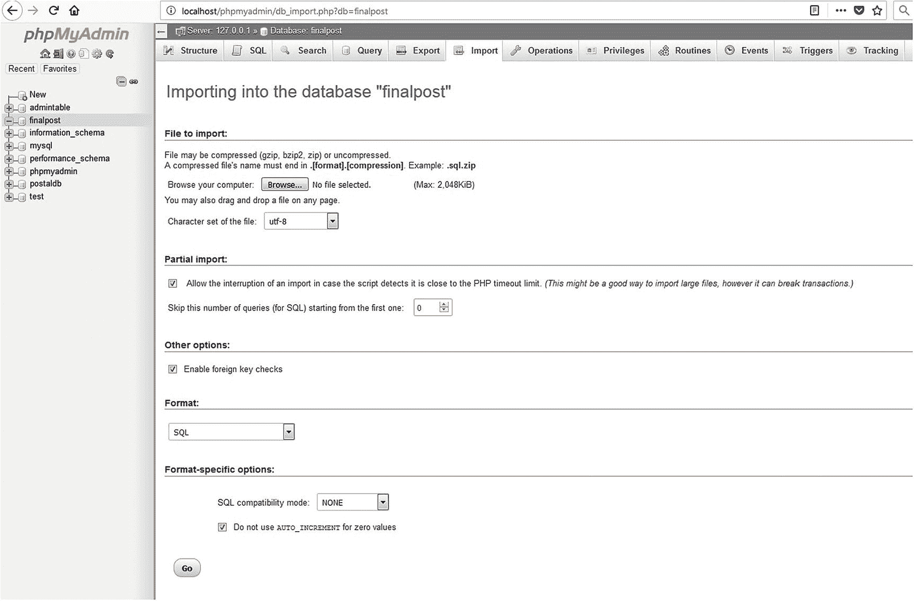
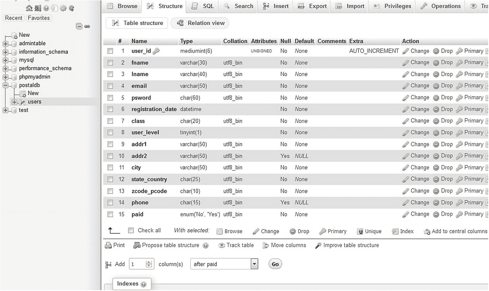
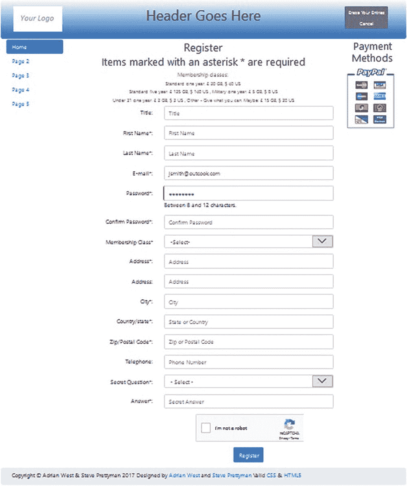
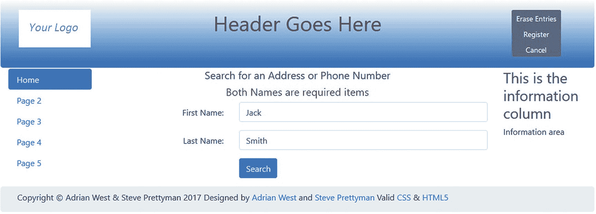
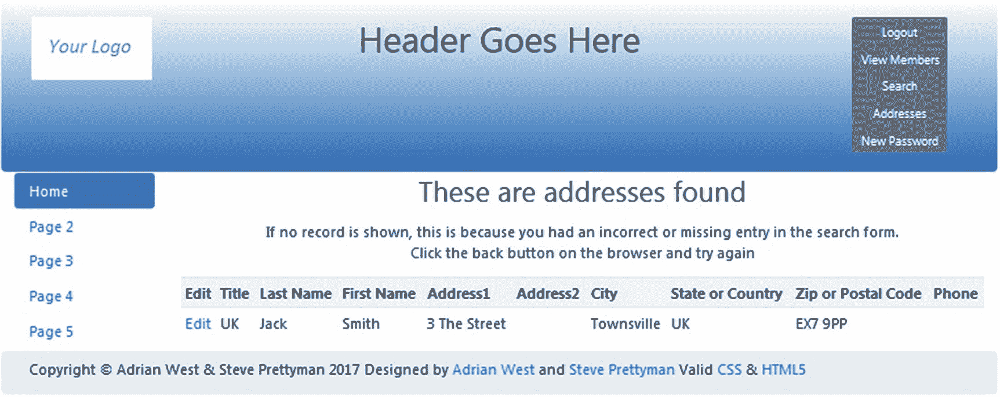

# 六、添加收尾工作：安全性和验证

在前一章中，我们创建了一个有用的数据库和几个交互式网站页面的开端。但是，管理员无法编辑所有成员信息。在本章中，我们将提供编辑地址和电话号码信息的能力。这将通过使用地址菜单按钮来实现。此外，我们将向数据库添加一个额外的标题字段。该字段也可通过地址菜单按钮进行编辑。PHP 页面的文件夹和文件系统将被整理以减少混乱。更多信息将放在文件夹中，以便于查找和检索。以前的交互式页面只有最少的用户输入验证和清理。本章将介绍一个更安全的系统。

完成本章后，您将能够

*   从现有数据库及其关联表生成 SQL 脚本

*   将一个 SQL 脚本导入 phpMyAdmin，以生成一个新的数据库和相关的表

*   向现有数据库表中添加附加字段

*   创建一个有组织的文件夹结构来存储相关的文件和网页

*   为访问和存储数据库信息提供更高的安全性

*   在用户输入进入数据库之前对其进行验证和清理

*   为标题、地址和电话号码提供额外的搜索功能

*   提供查看和编辑职务、地址和电话号码的附加功能

## 创建数据库

首先，我们将创建一个新版本的 postaldb 数据库，并将其重命名为 *finalpost* 。

1.  打开 XAMPP *htdocs* 或 easyPHP *eds-www* 文件夹，新建一个名为 *finalpost* 的文件夹。

2.  从本书的网站 [`www.apress.com`](http://www.apress.com) 下载第 [6 章](06.html)的文件，并将文件放在名为 *finalpost* 的新文件夹中。

3.  然后使用浏览器访问 phpMyAdmin，点击 Database 选项卡，创建一个名为 *finalpost* 的新数据库。

4.  向下滚动并找到新创建的数据库。然后选中旁边的复选框。

5.  单击检查权限，单击添加用户，然后添加新用户和密码，如下所示:

    *   *用户名*:白菜

    *   *密码* : in4aPin4aL

    *   *主机*:本地主机

    向下滚动；在全局权限旁边，单击全部选中。

1.  接受资源限制的默认值。

2.  滚动到底部，然后单击“Go”保存用户的详细信息。

### 创建用于连接到数据库的文件

创建一个名为 *mysqli_connect.php* 的新连接文件。(如果您不需要从头开始练习创建该文件，它已经包含在第 [6](06.html) 章的下载文件中。)

```php
<?php
// Create a connection to the postaldb database
// Set the database access details as constants and set the encoding to utf-8

Define ('DB_USER', 'cabbage');
Define ('DB_PASSWORD', 'in4aPin4aL');
Define ('DB_HOST', 'localhost');
Define ('DB_NAME', 'finalpost');
// Make the connection
$dbcon = new mysqli(DB_HOST, DB_USER, DB_PASSWORD, DB_NAME);
mysqli_set_charset($dbcon, 'utf8'); // Set the encoding...
Test your connection in a browser (http://localhost/finalpost/mysqli_connect.php). Remember, if you do not see anything on the screen, your connection was successful.

Listing 6-1The Database Connection File (mysqli_connect.php)

```

### 小费

当设计一个在现实世界中使用的密码时，你应该使它尽可能的复杂。确保它不以任何方式与数据库名称相关。复杂的密码可以通过助记符很容易地记住。然后可以把助记符写下来，锁起来。本教程中为密码(in4aPin4aL)选择的助记符是一句古老的英国谚语，“一便士一英镑。”这句格言的意思之一是，“如果我们开始这个，我们必须确保我们完成它；没有回头路。”在密码本身中，大写的 *P* 代表便士，大写的 *L* 是一英镑(100 便士)的古老符号。

## 通过导入 SQL 转储文件创建用户表

我们现在需要创建一个名为 *users* 的 17 列表。

我们可以听到你在呻吟，“哦，不！不是另一张桌子！”不要担心，我们将向您展示使用 phpMyAdmin 中的导入/导出工具的快捷方式。

已经为您创建了生成的代码，并将其导出到名为 *users.sql* 的文件中。这个文件实际上包含了创建用户和价格表的代码。你会在你安装在文件夹 *finalpost* 的下载文件中找到这个。

然而，您也可以从第 5 章[的当前 postaldb 数据库中创建 *users.sql* 文件。*如果你想从一个不受你在第*](05.html) [5](05.html) *章中所做的任何事情影响的数据库和表格开始，你可以忽略下面的说明并跳到导入说明。*

要创建要导入的文件，请按照下列步骤操作:

1.  打开 phpMyAdmin。从屏幕左侧的列表中选择 postaldb 数据库。

2.  然后选择页面顶部的导出选项卡。为模板创建一个名称，例如 *users* ，并将其输入到新模板文本框中。

3.  单击文本框右侧的“创建”按钮。新模板名 users 现在应该出现在右边的 existing templates 下拉框中。保持选择快速导出方法。还要确保 SQL 显示在格式下拉框列表中。

4.  如果一切正常，单击 Go 按钮。系统将下载一个包含 SQL 代码的文件，该文件不仅会为您创建表格，还会将您现有的数据从章节 [5](05.html) 数据库复制到章节 [6](06.html) 的新数据库中。

5.  在 Notepad++或类似的编辑器中打开下载的文件，逐行显示代码。检查代码，看看能否确定哪些行创建了表，哪些行向表中添加了数据。

6.  从文件菜单中选择另存为，将文件另存为 *users.sql.*

要从第 [6](06.html) 章的教材文件中导入 *users.sql* 文件，或者导入您通过导出第 [5](05.html) 章的表格而创建的文件，请完成以下说明:



图 6-1

phpMyAdmin 中的导入屏幕

1.  在 phpMyAdmin 的主页中，单击数据库 finalpost。

2.  单击导入选项卡。

3.  点击导入界面上的浏览按钮，如图 [6-1](#Fig1) 所示。

浏览按钮允许您导航到文件 *users.sql* 。打开 *users.sql* 文件。

1.  然后单击 Go，文件将被导入。

2.  现在在 phpMyAdmin 中打开 users 表(单击 browse 选项卡)，您将能够查看该表及其数据。

或者，在选择数据库后，可以使用 Operations 选项卡将表从一个数据库复制到另一个数据库。表 [6-1](#Tab1) 显示了导入用户表的结构。

表 6-1

第 [6 章](06.html)导入用户表的标题和属性

<colgroup><col class="tcol1"> <col class="tcol2"> <col class="tcol3"> <col class="tcol4"> <col class="tcol5"> <col class="tcol6"> <col class="tcol7"> <col class="tcol8"></colgroup> 
| 

列名

 | 

类型

 | 

长度/值

 | 

默认

 | 

属性

 | 

空

 | 

索引

 | 

A_I

 |
| --- | --- | --- | --- | --- | --- | --- | --- |
| 使用者辩证码 | 中位 | six | 没有人 | 无符号的 | □ | 主要的 | ·······················。 |
| 标题 | 可变长字符串 | Ten | 没有人 |   | ·······················。 |   | □ |
| 名字 | 可变长字符串 | Thirty | 没有人 |   | □ |   | □ |
| 姓氏 | 可变长字符串 | Forty | 没有人 |   | □ |   | □ |
| 电子邮件 | 可变长字符串 | Fifty | 没有人 |   | □ |   | □ |
| 密码 | 茶 | Sixty | 没有人 |   | □ |   | □ |
| 注册日期 | DATETIME |   | 没有人 |   | □ |   | □ |
| 用户级别 | 蒂尼因特 | one | 没有人 | 无符号的 | □ |   | □ |
| 班级 | 茶 | Twenty | 没有人 |   | □ |   | □ |
| 地址 1 | 可变长字符串 | Fifty | 没有人 |   | □ |   | □ |
| 城市 | 可变长字符串 | Fifty | 没有人 |   | □ |   | □ |
| 州 _ 国家 | 茶 | Twenty-five | 没有人 |   | □ |   | □ |
| zcode _ pcode 函数 | 茶 | Ten | 没有人 |   | □ |   | □ |
| 电话 | 茶 | Fifteen | 没有人 |   | ·······················。 |   | □ |
| 秘密 | 可变长字符串 | Thirty | 没有人 |   | □ |   | □ |
| 有报酬的 | ENUM | “是”，“不是” | 没有人 |   | □ |   | □ |

如果您从教科书文件中导入了 *users.sql* 文件，该结构还将包括一个标题和一个秘密字段。这些字段在第 [5](05.html) 章的数据库中不存在。我们将很快解释如果您从上一章导入了自己的数据，如何添加这些列。另外，请注意，标题、第二个地址和电话号码列的空框已被选中。这是因为它们是用户可以忽略的可选字段。许多用户可能没有额外的地址，例如公寓号码。有些用户不在电话簿上，不想公开他们的电话号码。

### 手动注册一些成员

如果没有从“用户”表中导入现有数据(用户),则需要手动输入。要注册会员，运行 XAMPP 或 EasyPHP 并使用浏览器输入以下 URL:

**http://localhost/final post/safer-register-page . PHP**

文件*safer-register-page.php*是第五章中*register-page.php*文件的更安全版本。该文件包含在第 [6](06.html) 章的可下载文件中。本章稍后将介绍更安全文件的增强功能。

如第 5 章所述，詹姆斯·史密斯首先注册为会员，然后以别名杰克·史密斯注册为会员秘书(管理员)。提醒一下，他们的详细情况如下:

*   名字:詹姆斯

*   *姓氏*:史密斯

*   电子邮件:jsmith@myisp.co.uk

*   *密码*:Bl @ cks m1

*   *名字*:杰克

*   *姓氏*:史密斯

*   电子邮件:jsmith@outcook.com

*   *密码* : D@gsb0dy

将杰克·史密斯的用户级别设置为 1。通过使用 phpMyAdmin，两个 Smiths 都应该将他们的 paid 列设置为 Yes。您可以选择为两个用户添加标题和机密答案。

### 小费

当添加新成员时，使用 phpMyAdmin 将 Yes 放入成员的 Paid 列。为此，单击左侧面板中 finalpost 旁边的框将其展开，然后单击 users 项。你会看到注册会员。在用户记录中，单击编辑。在下一个屏幕中，向下滚动并单击右下角的 Yes 单选按钮。然后单击开始。

除非会员秘书(管理员)将会员的付费栏标记为是，否则会员无法登录。

为了便于您访问会员数据，可下载会员的详细信息如表 [6-2](#Tab2) 所示。这与第五章[中的数据相同。数据已经从导入的 *users.sql* 文件放入表中。本章假设数据如下所示。如果您导入了自己的数据，您可能希望进行一些手动调整来反映这些信息。您不需要再次手动输入信息。](05.html)

表 6-2

可下载注册会员的详细信息

<colgroup><col class="tcol1"> <col class="tcol2"> <col class="tcol3"> <col class="tcol4"> <col class="tcol5"></colgroup> 
| 

标题

 | 

西方人名的第一个字

 | 

姓

 | 

电子邮件

 | 

密码

 |
| --- | --- | --- | --- | --- |
| 先生 | 迈克 | 这是什么 | 米克尔@myisp.com | willg @ T3 |
| 女士 | 橄榄 | 树枝 | obranch@myisp.co.uk | S7-1200 可编程控制器 |
| 先生 | 弗兰克 | 香 | fincense@myisp.net | p @ RFM 3s |
| 女士 | 安妮 | 周年纪念 | aversary@myisp.com | 页:1 |
| 先生 | 泰丽 | Fide | tfide @ my ISP . com | S7-1200 可编程控制器 |
| 夫人 | 玫瑰 | 矮树丛 | rbush@myisp.co.uk | R@db100ms |
| 夫人 | 安妮 | 苔藓 | amositty@myisp.org.uk | S7-1200 可编程控制器 |
| 先生 | 皮尔斯！皮尔斯 | 转向 | pver @ my ISP . com | K33pg0！尼日利亚 |
| 先生 | 戴劳 | 豆儿 | ddoo@myisp.co.uk | Sat！sf1ed |
| 先生 | 斯坦 | 达尔德族人 | sdad @ my ISP . net | b@TTl3fl@g |
| 夫人 | Honora | 骨 | nbone@myisp.com | L1k@t@rr13r |
| 先生 | 巴里 | 凯德 | bcade@myisp.co.uk | Bl0ckth@m |

### 小费

请记住，如前一章所述，使用手动方法输入数据可能会很繁琐。为了减少繁琐，您可以为不同的用户输入一些相同的地址、电话号码和机密答案。接下来建议一组合适的数据。

在第 [5](05.html) 章中，我们在每个记录中输入了以下信息，以节省时间和精力。以下是一些建议的默认条目:

<colgroup><col class="tcol1"> <col class="tcol2"></colgroup> 
| 地址 1 | 2 街道 |
| 地址 2 | 村庄(这是可选的，在注册一些成员的地址时应该省略) |
| 城市 | 汤斯维尔 |
| 州或国家 | 英国(或美国) |
| 邮政编码 | EX7 9PP(或在美国，33040) |
| 电话 | 01234 777 888(或者在美国，999 888 4444；这是可选的，在注册一些成员的电话号码时应该省略) |

记住，在 phpMyAdmin 中，将几个成员的 paid 列更改为 Yes。只有付费栏设置为“是”的会员才能登录系统。

## 向用户表中添加标题列

如果您从第 [5](05.html) 章导入了自己的数据，则表格不包括标题和秘密栏。*如果您确实使用了章节* [6](06.html) *教材文件中的 users.sql 文件，那么这些列已经创建好了，您可以跳过这一节。*

让我们添加一个标题列，允许成员可选地提供一个首选的标题(如先生、夫人、女士、Mx。，或博士)。

1.  在 phpMyAdmin 中，在屏幕左侧的列表中选择 finalpost 数据库。

2.  然后选择数据库中的 users 表。

3.  选择页面顶部的“结构”选项卡。现在将出现图 [6-2](#Fig2) 所示的屏幕。

    

    图 6-2

    phpMyAdmin 中的结构屏幕

4.  找到当前列列表下方的添加列信息。

5.  更改设置以指示将在 user_id 列后添加 1 列，然后单击 Go 按钮。

6.  为新标题列输入以下设置。

    <colgroup><col class="tcol1"> <col class="tcol2"> <col class="tcol3"> <col class="tcol4"> <col class="tcol5"> <col class="tcol6"> <col class="tcol7"> <col class="tcol8"></colgroup> 
    | 

    列名

     | 

    类型

     | 

    长度/值

     | 

    默认

     | 

    属性

     | 

    空

     | 

    索引

     | 

    A_I

     |
    | --- | --- | --- | --- | --- | --- | --- | --- |
    | 标题 | 可变长字符串 | Ten | 没有人 |   | ·······················。 |   | □ |

    请注意，新列将允许空值。这将使标题的输入成为可选的。

7.  输入新设置后，单击保存按钮。新列现在将出现在 userid 和 first_name 列之间的表结构中。

8.  现在单击 browse 选项卡查看表中的当前数据。通过单击数据左侧的编辑链接，随机选择一些用户，输入标题，然后保存更改。当显示成员的搜索结果时，您需要在表中显示一些标题。

9.  重复这些步骤，使用以下设置添加机密列。

<colgroup><col class="tcol1"> <col class="tcol2"> <col class="tcol3"> <col class="tcol4"> <col class="tcol5"> <col class="tcol6"> <col class="tcol7"> <col class="tcol8"></colgroup> 
| 

列名

 | 

类型

 | 

长度/值

 | 

默认

 | 

属性

 | 

空

 | 

索引

 | 

A_I

 |
| --- | --- | --- | --- | --- | --- | --- | --- |
| 秘密 | 可变长字符串 | Thirty | 没有人 |   | □ |   | □ |

### 通过导入 SQL 转储文件创建价格表

*如果您从章节* [*6*](06.html) *教材文件中导入了 users.sql 文件，它已经导入了价格表，所以您可以跳过这一节。*我们现在需要重复导入过程，将第 [5](05.html) 章中的价格表复制到 finalpost 数据库中。

1.  在 phpMyAdmin 的主页中，单击数据库 finalpost。

2.  单击导入选项卡。

3.  点击导入屏幕上的浏览按钮(参见图 [6-1](#Fig1) )。浏览按钮允许您导航到文件 *prices.sql* 。

4.  打开 *prices.sql* 文件，然后点击 Go。文件将被导入。

或者，在选择数据库后，可以使用 Operations 选项卡将表从一个数据库复制到另一个数据库。如果您现在在 phpMyAdmin 中打开 prices 表(单击 browse 选项卡)，您将能够查看该表及其数据。

表 [6-3](#Tab3) 显示了价格表的结构。

表 6-3

价格表的标题和属性

<colgroup><col class="tcol1"> <col class="tcol2"> <col class="tcol3"> <col class="tcol4"> <col class="tcol5"> <col class="tcol6"> <col class="tcol7"> <col class="tcol8"></colgroup> 
| 

列名

 | 

类型

 | 

长度/值

 | 

默认

 | 

属性

 | 

空

 | 

索引

 | 

阿奇

 |
| --- | --- | --- | --- | --- | --- | --- | --- |
| 一年 b | 小数 | six | 没有人 | 无符号的 | □ |   | □ |
| 一岁 | 小数 | six | 没有人 | 无符号的 | □ |   | □ |
| 五年 b | 小数 | six | 没有人 | 无符号的 | □ |   | □ |
| 五年 | 小数 | six | 没有人 | 无符号的 | □ |   | □ |
| 军队 | 小数 | six | 没有人 | 无符号的 | □ |   | □ |
| 美国军方 | 小数 | six | 没有人 | 无符号的 | □ |   | □ |
| u21gb | 小数 | six | 没有人 | 无符号的 | □ |   | □ |
| u21us | 小数 | six | 没有人 | 无符号的 | □ |   | □ |
| 最低价格 b | 小数 | six | 没有人 | 无符号的 | □ |   | □ |
| minpriceus | 小数 | six | 没有人 | 无符号的 | □ |   | □ |

该表现在还应该包括在第 [5](05.html) 章中输入的数据。您也可以从章节 [5](05.html) 数据库中导出和导入您自己的数据。

在我们继续之前，让我们转移一下话题，做些家务。如果我们不提供更好的组织，PHP 和 HTML 文件数量的不断增加会成为一个问题。

## 整理文件夹和文件系统

随着每一章增加了更多的功能，邮政文件夹中的文件数量也增加了。这种混乱会让人迷惑。为了整理新的 *finalpost* 文件夹，我们将把所有包含的文件放在它们自己的 *include* 文件夹中。这已经在本章的可下载文件中完成了。注意，使用 include 语句插入 PHP 程序的所有文件现在都在新的 includes 文件夹中。在主文件中，所有 PHP 包含文件现在都有前缀 includes/，如下面的代码片段所示:

```php
<?php
        include("includes/header-admin.php");
        include("includes/nav.php");
        include("includes/info-col.php");
?>

```

我们现在将为数据提供一些额外的验证和清理。安全性是开发过程中最重要的方面，也可能是最乏味的。用户的不当输入可能会将错误或损坏的数据插入到数据库表中。更严重的是，它会导致私人信息的泄露，或者让邪恶的人破坏桌子。它还可以让人们控制服务器和服务器上的任何数据。不可接受的输入或控制可能是犯罪分子所为，也可能只是用户的错误造成的。因此，必须过滤所有用户输入，以确保它适合您的数据库。

## 安全等级

数据库可能是不安全的或部分安全的；它永远不可能百分百安全。但是，必须对该语句进行限定，因为除了数据库的内置安全性之外，风险还取决于其他几个因素。邮政地址、电子邮件地址、信用卡信息和用户偏好都可以从不安全的数据库中获取，并以高价出售。

小型公司、俱乐部或社团的数据库仍然必须提供一层安全性。管理员有法律责任尽可能保证数据的安全。即使黑客没有攻击数据库，用户也可能无意中输入无效信息。请记住，在将数据输入数据库之前，过滤掉任何潜在的问题要容易得多。一旦数据库中存在坏数据，就很难删除它。

### 增加一层安全性

数据库必须具有唯一的名称(最长 16 个字符)、密码(尽可能复杂)、主机名(如 localhost)、指定用户和一组权限。

允许多个用户，并且应该限制他们的权限。为了最大程度的安全，必须限制数据库的用户 id 数量。应该只向用户提供完成其工作(任务)所需的权限。最近的新闻报道中有许多这样的例子:员工被授予了过多的权限，从而将用户的个人信息暴露给了犯罪分子或其他网站。大多数用户不应该拥有诸如 GRANT、SHUTDOWN 或 DROP 等权限。

我们在前面章节中演示的 PHP 代码在将密码存储在服务器上之前对其进行哈希处理。此外，网站管理员应该选择一个难以推断的密码。永远不要使用可以在字典中找到的单词或者是网站管理员名字的变位词。你可以用一个流行的说法，比如“又下雨了，鸭子的好天气”，然后创建一个类似 RaGw4dux 的密码。

总是假设用户输入的所有内容对数据库都是危险的。此外，数据应尽可能准确。人的年龄不是数据库的好条目。人的年龄随着时间而变化。数据很快就会失效。一个更好的条目是这个人的出生日期。这一点不会改变。这个人的年龄可以从他的出生日期计算出来，而且总是准确的。

此外，格式不正确的电子邮件地址对用户或数据库所有者都没有用。应该提供代码以确保电子邮件的格式正确。有些系统甚至会对输入的电子邮件进行验证，以确保不仅格式正确，而且是一封真实的电子邮件。

我们在示例代码中使用准备好的 SQL 语句。这确保了不会有用户数据被执行并对数据库造成损害。但是，我们目前不会从用户条目中删除任何无效或不必要的字符。我们希望尽可能避免无效或损坏的数据进入数据库。

我们应该始终清理任何输入字符串，以消除可执行代码进入数据库的可能性。预处理语句也会阻止数据的执行。

验证电子邮件地址、电话号码、所有数字项以及任何其他具有标准格式的项(如邮政编码)。任何过于笼统而无法验证的东西至少应该被清理掉。这两种技术*验证*和*净化*将在本章稍后解释。

在将所有用户输入显示到页面或插入数据库之前，对其进行清理。脚本可以结合使用 HTML 标签(如

在实时网站中，尽可能将访问数据库的文件存储在比根文件夹高一级的文件夹中。(根文件夹是 *htdocs* 或者 eds- *www* 。)您可能需要联系您的远程主机提供商，看看这是否可行。将该文件移到 *htdocs* 或 *eds-www* 之外的文件夹会使其更难访问。将此文件留在根文件夹中会允许个人或程序访问数据库。我们一直使用的连接代码如下:

```php
require ('mysqli_connect.php');

```

当使用比根级别高一级的文件夹中的文件时，连接代码如下:

```php
require ('../mysqli_connect.php');

```

### 注意

本教程的可下载 PHP 文件将保留所需的代码(' mysqli _ connect . PHP ')；因为数据库将位于您的计算机上，而不是远程主机上。将文件上载到生产服务器时，您应该将该文件的位置(并更改所有类似的语句)移动到更安全的文件夹中。如果您不保护此文件，将会留下很大的安全隐患。

尽可能防止浏览器显示泄露数据库结构的错误信息。在示例代码中，代码的 catch 块捕获并显示错误信息。在现实世界中，catch 块将错误消息存储在用户无法访问的错误日志中。还可以向网站管理员发送电子邮件，通知他们发生了错误。然后可以查看日志来确定问题。将向用户提供一条通用消息，要求他们稍后返回该站点。第 7 章将提供一个记录错误信息的例子。

正如我们在前面的章节中所展示的，总是使用会话来限制对易受攻击页面的访问，例如管理页面和成员的特殊页面。您还可以考虑提供不同的访问级别，比如用户级别、成员主席级别和网站管理员级别。这可以通过将 user_level 设置为不同的值(如 1、2、3)来实现，然后在每个安全页面顶部的会话代码中检查这些值中的一个(或多个)。

您可以使用 PayPal、Stripe 或类似的安全支付系统通过网站安全地接受付款。但是*从不*存储会员的银行/借记卡/信用卡详细信息。此外，不要存储政府识别号码(如社会安全号码)。请记住，访问这种类型的信息会为黑客提供破坏个人信用、窃取退税和窃取退休支票的能力。如果您需要一个惟一的标识符，使用 autonum 生成一个用户 ID，就像我们前面展示的那样。

### 增加了一层保护

如果您的客户希望使用内部支付系统，而不是使用 PayPal 或类似的第三方公司，他们将需要更昂贵的安全预算。对于安全性很重要或存储用户财务信息的网站，网站需要专业人员或第三方来监督和持续监控网站。这可能既费钱又费时。

每当安全信息必须从客户端传输到服务器时，安全套接字层(SSL)是必需的。SSL 将为信息流动提供加密通道。包含 SSL 的站点使用 HTTPS 协议，而不是 HTTP 协议。许多浏览器还提供一个锁图标，表示通信信道是由 SSL 加密的。一些主机，如脸书，现在要求所有托管的应用都使用 SSL。客户可能需要支付更高的年费来使用安全套接字层。

## 验证和消毒

让我们演示一下验证和清理之间的区别。

*   *验证*:验证器检查用户输入的格式。如果格式不正确，就不会提交表单，并且会出现一条错误消息，要求用户更正输入。例如，验证确保电子邮件地址的格式正确(即用户名后跟@符号，后跟 ISP 地址)。这可以防止不正确的数据被输入到数据库表中。

*   *Sanitizing* :这可以通过两种方法实现:使用标准的 PHP 清理器或者使用带有 SANITIZE 属性的 filter_var()函数。在数据发送到数据库表或显示在页面上之前，清理会自动删除不需要的字符。使用 SANITIZE 属性时，不会显示任何错误消息。用户不会被提醒他们犯了错误或者他们的输入包含危险的字符或脚本。这可能不是所希望的，因为它没有给用户提供纠正他们已经输入的内容的机会。清理将删除或停用可能损害数据库的 HTML 标记和 JavaScript 命令。

可以通过 filter_var()函数来应用验证和净化。

### filter_var()函数

函数 filter_var()包含在 PHP 5.2 版和更高版本中。其目的是简化用户输入的验证和净化。该函数与 FILTER_VALIDATE 或 FILTER_SANITIZE 属性结合使用。有关此功能的更多详细信息，请参见 [`http://php.net/manual/en/function.filter-var.php`](http://php.net/manual/en/function.filter-var.php) 。

### 确认

在第 [5](05.html) 章中，使用 HTML 5 在注册页面中提供了一些验证。但是，用户仍然可以输入无效的信息。此外，即使信息已经在客户机上使用 HTML 5 或 JavaScript 进行了验证，它在从客户机传输到服务器的过程中仍然可能被破坏。服务器端接收的数据可能会损坏网页或服务器，或者干扰数据库。用户也可能输入了格式错误的项目。作为错误格式的一个例子，用户可能在输入电子邮件地址时出错。错误的地址可能包含空格或不可接受的字符，如下所示:

```php
rbush 'myisp.com

```

这个错误的电子邮件地址不包含@符号，它有两个空格和一个撇号。这些是不可接受的电子邮件字符。验证过程将识别问题，并提供一条错误消息，要求用户更正电子邮件地址。

在第 [5](05.html) 章中，在 register-page.php 的*文件中，电子邮件的代码如下:*

```php
// Check for an email address:
            $email = filter_var( $_POST['email'], FILTER_SANITIZE_EMAIL);
        if  ((empty($email)) || (!filter_var($email, FILTER_VALIDATE_EMAIL))) {
                $errors[] = 'You forgot to enter your email address';
                $errors[] = ' or the e-mail format is incorrect.';
        }

```

这段代码清理输入，检查字段是否包含一些字符，并验证电子邮件的格式。这避免了电子邮件格式完全没有意义；这些废话会被输入到数据库表中。一些程序员使用 regex ( *regex* 是“正则表达式”的缩写)来验证电子邮件地址的格式，但是随着 PHP 5.2 和更高版本的出现，filter_var()函数变得可用并且更容易使用。通过正则表达式进行验证是相当复杂的，并且容易出现输入错误，正如您将从下面的例子中看到的:

```php
$email = "name@usersisp.com";

if (preg_match('/^[^0-9][a-zA-Z0-9_]+([.][a-zA-Z0-9_]+)*[@][a-zA-Z0-9_]+([.]

[a-zA-Z0-9_]+)*[.][a-zA-Z]{2,4}$/',$email)) {
echo "Your email is in the acceptable format";
} else {
echo "Your email address does not have an acceptable format";
}

```

通过 filter_var()函数进行验证是一个很大的改进。此代码用于更安全的注册码( *process_register_page.php)。*

一些文本输入没有遵循标准格式。让我们看看名字。在第 [5](05.html) 章中，我们使用以下代码检查了名字的内容:

```php
// Check for a first name:
$first_name = filter_var( $_POST['first_name'],
         FILTER_SANITIZE_STRING);
if (empty($first_name)) {
         $errors[] = 'You forgot to enter your first name.';
}

```

在本例中，字符串 first_name 被清除；但是，在将数据输入数据库之前，没有提供任何验证来尝试收集良好的数据。

在这一章中，我们提供了一些额外的验证。

```php
// Trim the first name
   $first_name = filter_var( $_POST['first_name'], FILTER_SANITIZE_STRING);
if ((!empty($first_name)) && (preg_match('/[a-z\s]/i',$first_name)) &&
                   (strlen($first_name) <= 30)) {
           //Sanitize the trimmed first name
    $first_nametrim = $first_name;
           }else{
           $errors[] =
           'First name missing or not alphabetic and space characters. Max 30';
           }

```

除了检查$first_name 是否为空之外，我们现在还检查字符串中有限的一组字符，以及该字符串是否小于或等于 30 个字符。字符长度匹配数据库表中列的长度和 HTML 文件中设置的长度(*safer-register-page.php*)。

因为不存在用于验证名字的 filter_var 函数参数，所以我们必须开发自己的参数。

```php
preg_match('/[a-z\s]/i',$first_name)

```

preg_match 函数将字符串(first _ name)与正则表达式('/[a-z\s]/i ')进行比较，如果字符串符合要求，则返回 True，否则返回 False。

在本例中，a-z 允许所有字母字符。\s 还表示允许使用空格。[]符号用于包含要比较的值。I 字符(以及包含其他字符的//)表示我们忽略了大小写。以下示例在不使用 I 的情况下提供了相同的功能:

```php
preg_match('[a-zA-z\s]', $first_name)

```

我们很快会看到一些额外的正则表达式。然而，正如您所见，创建表达式时很容易出错。当现有功能满足您的需求时，使用它们会更安全。

### 小费

某些文本输入可能没有有效的格式，因为它不符合设定的模式，例如，用于注释的文本区域或某人的头衔。在英国，一些头衔是中世纪封建制度的遗留物，如男爵夫人、勋爵、夫人或先生等古怪的称呼。一些退役军人使用他们的武装部队头衔，如少校或上校。大学教师可能会使用 Professor 或 Prof。不符合设定模式的文本可以使用带有 regex 函数的正则表达式进行验证。

### 卫生处理

在我们更安全的注册页面中，我们将使用带有净化参数的 filter_var 函数来删除任何有害字符。

```php
//Is the last name present? If it is, sanitize it
$last_name = filter_var( $_POST['last_name'], FILTER_SANITIZE_STRING);
if ((!empty($last_name)) && (preg_match('/[a-z\-\s\']/i',$last_name)) &&
                (strlen($last_name) <= 40)) {
        //Sanitize the trimmed last name
        $last_nametrim = $last_name;
        }else{
        $errors[] =
'Last name missing or not alphabetic, dash, quote or space. Max 30.';
        }

```

正如我们在第 [5](05.html) 章中看到的，FILTER_SANITIZE_STRING 参数用于净化任何没有通用格式的字符串。有应该用于特定格式的净化过滤器(例如 FILTER_SANTITIZE_EMAIL)。电子邮件清理过滤器比尝试为所有电子邮件格式创建正则表达式容易得多。

### 验证电话号码

电话号码不符合通用格式。用户将输入数字、空格、连字符和括号的任意组合。还有国际差异。让事情变得复杂的是，一些用户会将数字分组如下:

0111 222 333 或(0111) 222 333 或 0111-222-333

一些程序员会尝试使用几个 regex 语句来验证多种格式的电话号码。这本书提供了一种简化的方法。最简洁的解决方案是去掉所有不是数字的字符。我们将使用 filter_var()函数，如下所示:

```php
//Is the phone number present? If it is, sanitize it
$phone = filter_var( $_POST['phone'], FILTER_SANITIZE_STRING);
if ((!empty($phone)) && (strlen($phone) <= 30)) {
        //Sanitize the trimmed phone number
        $phonetrim = (filter_var($phone, FILTER_SANITIZE_NUMBER_INT));
    $phonetrim = preg_replace('/[^0-9]/', ", $phonetrim);
        }else{
        $phonetrim = NULL;
        }

```

如果用户输入(01234) 777 888，那么在杀毒之后，它将作为 01234777888 输入数据库。preg_replace 函数将用第二个参数中的字符替换正则表达式中的任何字符。在本例中，^符号表示 NOT(就像！PHP 中的符号)。因此，这个表达式告诉我们用“(nothing)”替换任何不是数字的字符。这将清除所有非数字字符。在向用户显示电话号码时，我们可以使用页面所在国家的格式，将字符放回电话号码中。

### 小费

有关可用的验证和消毒类型的列表，请参见附录 B。

## 更安全的注册页面

为了使注册页面更加安全，采用了几种技术。修改后的注册页面外观与第 [5](05.html) 章中的注册页面相似(增加了标题条目、安全问题和验证码)，如图 [6-3](#Fig3) 所示。



图 6-3

注册页面

已经包括了额外的安全和清洁，这将在清单 [6-3a](#PC14) 和清单 [6-3b](#PC22) 的末尾进行解释。

```php
<?php
if ($_SERVER['REQUEST_METHOD'] == 'POST') {
        require("cap.php"); // recaptcha check
}
?>
<!DOCTYPE html>
<html lang="en">
<head>
  <title>Register Page</title>
  <meta charset="utf-8">
  <meta name="viewport" content=
        "width=device-width, initial-scale=1, shrink-to-fit=no">
<!-- Bootstrap CSS File -->
<link rel="stylesheet"
        href=
"https://stackpath.bootstrapcdn.com/bootstrap/4.1.0/css/bootstrap.min.css"
        integrity=
"sha384-9gVQ4dYFwwWSjIDZnLEWnxCjeSWFphJiwGPXr1jddIhOegiu1FwO5qRGvFXOdJZ4"
        crossorigin="anonymous">
<script src="verify.js"></script>
<script src='https://www.google.com/recaptcha/api.js'></script>
// Required for Captcha Verification
</head>
<body>
<div class="container" style="margin-top:30px">
<!-- Header Section -->
<header class="jumbotron text-center row col-sm-14"
        style="margin-bottom:2px; background:linear-gradient(white, #0073e6);
                padding:20px;">
        <?php include('includes/register-header.php'); ?>
</header>
<!-- Body Section -->
<div class="row" style="padding-left: 0px;">
<!-- Left-side Column Menu Section -->
<nav class="col-sm-2">
      <ul class="nav nav-pills flex-column">
                     <?php include('includes/nav.php'); ?>
      </ul>
</nav>
<!-- Validate Input -->
<?php
if ($_SERVER['REQUEST_METHOD'] == 'POST') {
        require('process-register-page.php');
} // End of the main Submit conditional.
?>
<div class="col-sm-8">
         <h2 class="h2 text-center">Register</h2>
         <h3 class="text-center">
                  Items marked with an asterisk * are required</h3>
         <?php
         try {
         require_once("mysqli_connect.php");
         $query = "SELECT * FROM prices";
         $result = mysqli_query ($dbcon, $query); // Run the query.
         if ($result) { // If it ran OK, display the records.
                    $row = mysqli_fetch_array($result, MYSQLI_NUM);
                    $yearsarray = array(
                             "Standard one year:", "Standard five year:",
                             "Military one year:", "Under 21 one year:",
                             "Other - Give what you can. Maybe:" );
                    echo '<h6 class="text-center text-danger">
                            Membership classes:</h6>' ;
                    echo '<h6 class="text-center text-danger small"> ';
                    for ($j = 0, $i = 0; $j < 5; $j++, $i = $i + 2) {

                               echo $yearsarray[$j] . " &pound; " .
                                       htmlspecialchars($row[$i], ENT_QUOTES)  .
                                       " GB, &dollar; " .
                                       htmlspecialchars($row[$i + 1], ENT_QUOTES) .
                                       " US";

                               if ($j != 4) {
                               if ($j % 2 == 0) {
                                          echo "</h6><h6 class=
                                                      'text-center text-danger small'>"; }
                               else { echo " , "; }
                               }
                    }
                    echo "</h6>";
         }
?>
<form action="safer-register-page1.php" method="post"
        onsubmit="return checked();" name="regform" id="regform">
<div class="form-group row">
         <label for="title" class="col-sm-4 col-form-label
                  text-right">Title:</label>
<div class="col-sm-8">
         <input type="text" class="form-control" id="title" name="title"
                  placeholder="Title" maxlength="12"
                  pattern='[a-zA-Z][a-zA-Z\s\.]*'
                  title="Alphabetic, period and space max 12 characters"
                  value=
                          "<?php if (isset($_POST['title']))
                          echo htmlspecialchars($_POST['title'], ENT_QUOTES); ?>" >
</div>
</div>
<div class="form-group row">                                                      <!--#1-->
         <label for="first_name" class="col-sm-4 col-form-label
                  text-right">First Name*:</label>
<div class="col-sm-8">
         <input type="text" class="form-control" id="first_name"
                  name="first_name" pattern="[a-zA-Z][a-zA-Z\s]*"
                  title="Alphabetic and space only max of 30 characters"
                  placeholder="First Name" maxlength="30" required
                  value=
                          "<?php if (isset($_POST['first_name']))
                  echo htmlspecialchars($_POST['first_name'], ENT_QUOTES); ?>" >
</div>
</div>
<div class="form-group row">
         <label for="last_name" class="col-sm-4 col-form-label text-right">
                  Last Name*:</label>
<div class="col-sm-8">
         <input type="text" class="form-control" id="last_name" name="last_name"
                 pattern="[a-zA-Z][a-zA-Z\s\-\']*"
                 title="Alphabetic, dash, quote and space only max of 40 characters"
                 placeholder="Last Name" maxlength="40" required
                 value=
                         "<?php if (isset($_POST['last_name']))
                 echo htmlspecialchars($_POST['last_name'], ENT_QUOTES); ?>" >
</div>
</div>
<div class="form-group row">
         <label for="email" class="col-sm-4 col-form-label text-right">
                  E-mail*:</label>
<div class="col-sm-8">
         <input type="email" class="form-control" id="email" name="email"
                 placeholder="E-mail" maxlength="60" required
                 value=
                         "<?php if (isset($_POST['email']))
                 echo htmlspecialchars($_POST['email'], ENT_QUOTES); ?>" >
</div>
</div>
<div class="form-group row">                                                      <!--#2-->
         <label for="password1" class="col-sm-4 col-form-label
                  text-right">Password*:</label>
<div class="col-sm-8">
         <input type="password" class="form-control" id="password1"
                 name="password1"
                 pattern="(?=.*\d)(?=.*[a-z])(?=.*[A-Z]).{8,12}"
                 title="One number, one upper, one lower, one special, with 8 to 12 characters"
                 placeholder="Password" minlength="8" maxlength="12" required
                 value=
                         "<?php if (isset($_POST['password1']))
                 echo htmlspecialchars($_POST['password1'], ENT_QUOTES); ?>" >
<span id="message">Between 8 and 12 characters.</span>
</div>
</div>
<div class="form-group row">
        <label for="password2" class="col-sm-4 col-form-label
                 text-right">Confirm Password*:</label>
<div class="col-sm-8">
         <input type="password" class="form-control" id="password2"
                  name="password2"
                  pattern="(?=.*\d)(?=.*[a-z])(?=.*[A-Z]).{8,12}"
                  title="One number, one uppercase, one lowercase letter, with 8 to 12 characters"
                  placeholder="Confirm Password" minlength="8"
                  maxlength="12" required
                  value=
                          "<?php if (isset($_POST['password2']))
                  echo htmlspecialchars($_POST['password2'], ENT_QUOTES); ?>" >
</div>
</div>
<div class="form-group row">
        <label for="level" class="col-sm-4 col-form-label
                 text-right">Membership Class*</label>
<div class="col-sm-8">
                <select id="level" name="level" class="form-control" required>
                <option value="0" >-Select-</option>
<?php
for ($j = 0, $i = 0; $j < 5; $j++, $i = $i + 2) {

        echo '<option value="' .
                htmlspecialchars($row[$i], ENT_QUOTES) . '" ';
        if ((isset($_POST['level'])) && ( $_POST['level'] == $row[$i]))
                {
        ?>
                        selected
        <?php }
        echo ">" . $yearsarray[$j] . " " .
        htmlspecialchars($row[$i], ENT_QUOTES) .
              " &pound; GB, " .
              htmlspecialchars($row[$i + 1], ENT_QUOTES) .
              "&dollar; US</option>";
}
echo "here";
?>
</select>
</div>
</div>
<div class="form-group row">
         <label for="address1" class="col-sm-4 col-form-label
                  text-right">Address*:</label>
<div class="col-sm-8">
         <input type="text" class="form-control" id="address1" name="address1"
                 pattern="[a-zA-Z0-9][a-zA-Z0-9\s\.\,\-]*"
                 title="Alphabetic, numbers, period, comma, dash and space only max of 30 characters"
                 placeholder="Address" maxlength="30" required
                 value=
                         "<?php if (isset($_POST['adress1']))
                 echo htmlspecialchars($_POST['address1'], ENT_QUOTES); ?>" >
</div>
</div>
<div class="form-group row">
         <label for="address2" class="col-sm-4 col-form-label
                  text-right">Address:</label>
<div class="col-sm-8">
         <input type="text" class="form-control" id="address2" name="address2"
                 pattern="[a-zA-Z0-9][a-zA-Z0-9\s\.\,\-]*"
                 title="Alphabetic, numbers, period, comma, dash and space only max of 30 characters"
                 placeholder="Address" maxlength="30"
                 value=
                         "<?php if (isset($_POST['address2']))
                 echo htmlspecialchars($_POST['address2'], ENT_QUOTES); ?>" >
</div>
</div>
<div class="form-group row">
         <label for="city" class="col-sm-4 col-form-label
                  text-right">City*:</label>
<div class="col-sm-8">
         <input type="text" class="form-control" id="city" name="city"
                 pattern="[a-zA-Z][a-zA-Z\s\.]*"
                 title="Alphabetic, period and space only max of 30 characters"
                 placeholder="City" maxlength="30" required
                 value=
                         "<?php if (isset($_POST['city']))
                 echo htmlspecialchars($_POST['city'], ENT_QUOTES); ?>" >
</div>
</div>
<div class="form-group row">
         <label for="state_country" class="col-sm-4 col-form-label text-right">
                 Country/state*:</label>
<div class="col-sm-8">
         <input type="text" class="form-control" id="state_country"
                 name="state_country"
                 pattern="[a-zA-Z][a-zA-Z\s\.]*"
                 title="Alphabetic, period and space only max of 30 characters"
                 placeholder="State or Country" maxlength="30" required
                 value=
                         "<?php if (isset($_POST['state_country']))
                 echo htmlspecialchars($_POST['state_country'], ENT_QUOTES); ?>" >
</div>
</div>
<div class="form-group row">
         <label for="zcode_pcode" class="col-sm-4 col-form-label text-right">
                  Zip/Postal Code*:</label>
<div class="col-sm-8">
         <input type="text" class="form-control" id="zcode_pcode"
                 name="zcode_pcode"
                 pattern="[a-zA-Z0-9][a-zA-Z0-9\s]*"
                 title="Alphabetic, period and space only max of 30 characters"
                 placeholder="Zip or Postal Code" minlength="5" maxlength="30"
                 required
                 value=
                         "<?php if (isset($_POST['zcode_pcode']))
                 echo htmlspecialchars($_POST['zcode_pcode'], ENT_QUOTES); ?>" >
</div>
</div>
<div class="form-group row">
         <label for="phone" class="col-sm-4 col-form-label
                  text-right">Telephone:</label>
<div class="col-sm-8">
         <input type="tel" class="form-control" id="phone" name="phone"
                 placeholder="Phone Number" maxlength="30"
         value=
                         "<?php if (isset($_POST['phone']))
         echo htmlspecialchars($_POST['phone'], ENT_QUOTES); ?>" >
</div>
</div>
<div class="form-group row">
         <label for="question" class="col-sm-4 col-form-label text-right">
                  Secret Question*:</label>
<div class="col-sm-8">
         <select id="question" class="form-control">
                  <option selected value="">- Select -</option>
                  <option value="Maiden">Mother's Maiden Name</option>
                  <option value="Pet">Pet's Name</option>
                  <option value="School">High School</option>
                  <option value="Vacation">Favorite Vacation Spot</option>
         </select>
</div>
</div>
<div class="form-group row">                                                      <!--#3-->
         <label for="secret" class="col-sm-4 col-form-label
                  text-right">Answer*:</label>
<div class="col-sm-8">
         <input type="text" class="form-control" id="secret" name="secret"
                  pattern="[a-zA-Z][a-zA-Z\s\.\,\-]*"
                  title="Alphabetic, period, comma, dash and space only max of 30 characters"
                  placeholder="Secret Answer" maxlength="30" required
                  value=
                          "<?php if (isset($_POST['secret']))
                  echo htmlspecialchars($_POST['secret'], ENT_QUOTES); ?>" >
</div>
</div>
<div class="form-group row">                                                      <!--#4-->
         <label class="col-sm-4 col-form-label"></label>
<div class="col-sm-8">
<div class="float-left g-recaptcha"
         data-sitekey="yourdatasitekeyhere"></div>
</div>
</div>
<div class="form-group row">
         <label for="" class="col-sm-4 col-form-label"></label>
<div class="col-sm-8 text-center">
         <input id="submit" class="btn btn-primary" type="submit"
                 name="submit" value="Register">
</div>
</div>
</form>
</div>
<!-- Right-side Column Content Section -->
<?php

if(!isset($errorstring)) {
         echo '<aside class="col-sm-2">';
         include('includes/info-col-cards.php');
         echo '</aside>';
         echo '</div>';
         echo '<footer class="jumbotron text-center row col-sm-14"
                  style="padding-bottom:1px; padding-top:8px;">';
 }
 else
 {
         echo '<footer class="jumbotron text-center col-sm-12"
         style="padding-bottom:1px; padding-top:8px;">';
 }
  include('includes/footer.php');
  echo "</footer>";
  echo "</div>";
  }
catch(Exception $e) // We finally handle any problems here
   {
         // print "An Exception occurred. Message: " . $e->getMessage();
         print "The system is busy please try later";
   }
catch(Error $e)
   {
         //print "An Error occurred. Message: " . $e->getMessage();
         print "The system is busy please try again later.";
   }
?>
</body>
</html>

Listing 6-3aCreating a More Secure Registration Page
(safer-register-page.php)

```

### 代码的解释

本节解释代码。

```php
<div class="form-group row">                                                     <!--#1-->
         <label for="first_name" class="col-sm-4 col-form-label
                  text-right">First Name*:</label>
<div class="col-sm-8">
         <input type="text" class="form-control" id="first_name"
                  name="first_name" pattern="[a-zA-Z][a-zA-Z\s]*"
                  title="Alphabetic and space only max of 30 characters"
                  placeholder="First Name" maxlength="30" required
                  value=
                           "<?php if (isset($_POST['first_name']))
                  echo htmlspecialchars($_POST['first_name'], ENT_QUOTES); ?>" >
</div>
</div>

```

输入 HTML 标记的 pattern 属性允许我们使用正则表达式来验证与我们在 PHP 代码中提供的验证相关的信息。本例中显示的模式允许大写和小写字母字符和空格。title 属性是模式不匹配时显示的消息。此信息是必需的，最大长度为 30 个字符。用前面显示的 PHP 代码在服务器端也实现了同样的验证。

```php
<div class="form-group row">                                                     <!--#2-->
         <label for="password1" class="col-sm-4 col-form-label
                  text-right">Password*:</label>
<div class="col-sm-8">
         <input type="password" class="form-control" id="password1"
                  name="password1"
                  pattern="(?=.*\d)(?=.*[a-z])(?=.*[A-Z]).{8,12}"
                  title="One number, one upper, one lower, one special, with 8 to 12 characters"
                  placeholder="Password" minlength="8" maxlength="12" required
                  value=
                          "<?php if (isset($_POST['password1']))
                  echo htmlspecialchars($_POST['password1'], ENT_QUOTES); ?>" >
<span id="message">Between 8 and 12 characters.</span>
</div>
</div>

```

密码限制增加了。前面的模式将输入限制为需要一个大写字母、一个小写字母、一个数字和一个特殊字符。这个特殊字符实际上并没有在这里得到验证，而是在 PHP 代码中得到验证。我们把这个挑战留给你去发现特殊字符的模式。input 语句的模式和属性都要求用户输入 8 到 12 个字符。在“真实世界”中，我们会增加这些数字以提供更高的安全性。从用户处接受的其他值也以类似的方式进行验证。

```php
<div class="form-group row">                                                       <!--#3-->
         <label for="secret" class="col-sm-4 col-form-label
                  text-right">Answer*:</label>
<div class="col-sm-8">
         <input type="text" class="form-control" id="secret" name="secret"
                  pattern="[a-zA-Z][a-zA-Z\s\.\,\-]*"
                  title="Alphabetic, period, comma, dash and space only max of 30 characters"
                  placeholder="Secret Answer" maxlength="30" required
                  value=
                           "<?php if (isset($_POST['secret']))
                  echo htmlspecialchars($_POST['secret'], ENT_QUOTES); ?>" >
</div>
</div>

```

用户现在需要一个新的机密问题。当用户忘记密码时，该信息将用于允许用户重置他们的密码。在第 [11](11.html) 章中，我们将为用户创建一个请求新密码的表单。

```php
<div class="form-group row">                                                       <!--#4-->
         <label class="col-sm-4 col-form-label"></label>
<div class="col-sm-8">
<div class="float-left g-recaptcha"
         data-sitekey="yourdatasitekeyhere"></div>
</div>
</div>

```

目前，我们仍然有一个安全弱点，我们可以很容易地修复。我们没有能力检测一个人是否真的在使用我们的程序。这可能是一个主要问题，因为程序可以用虚假注册淹没我们的网站，直到数据库和服务器崩溃。此外，正如我们提到的，他们可以尝试插入可执行代码，这将对网站、数据库和服务器造成损害。

银行和其他高安全性组织将使用多种方法来验证人工输入，包括验证所使用的 IP 地址。我们将采用一种常见的方法，使用 Google 的 Recaptcha 系统来请求用户验证他们是人类。使用 Recaptcha 只需要导入所需的 JavaScript 代码并显示 Recaptcha 应用。显示应用的代码如前面代码中的#4 所示。导入所需 JavaScript 代码的代码如下:

```php
<script src='https://www.google.com/recaptcha/api.js'></script>
// Required for Captcha Verification
We will also need to verify that a human did actually check the box on the server side.
<?php
if ($_SERVER['REQUEST_METHOD'] == 'POST') {
         require("cap.php"); // recaptcha check
}
?>

```

前面的代码位于 safer-register 页面的顶部，用于插入复选框已被选中的验证。

```php
<?php
        if(isset($_POST['g-recaptcha-response'])){
                        $captcha=$_POST['g-recaptcha-response'];
                        $secretKey = "Put your secret key here";
                        $ip_address = $_SERVER['REMOTE_ADDR'];
                        $response=
file_get_contents("https://www.google.com/recaptcha/api/siteverify?secret=".
$secretKey."&response=".$captcha."&remoteip=".$ip_address);
                $keys = json_decode($response,true);
                if(intval($keys["success"]) !== 1) {
        echo "<h4 class='text-center'>Are you human? Click recaptcha</h4>";
                        header( "refresh:1;" );
                }
        }
        else {
echo "<h4 class='text-center'>Are you human? Click recaptcha!</h4>";
                        header( "refresh:1;" );
        }
?>

```

如果尝试被验证为人类，Recaptcha 将创建 g-recaptcha-response POST 值。如果存在的话，密钥和当前的 IP 地址被放在变量中，然后通过函数 file_get_contents 使用这些变量来检索响应的内容。响应采用 JSON 数据结构的格式。json_decode 函数将该结构转换成一个 PHP 数组($keys)。intval 函数用于判断数组成功列的内容是否为数字 1(相当于检查是否为真)。否则，将显示一条消息，并重置页面(一秒钟后)。如果响应不存在，将显示类似的消息，并重置页面。如果人类确实选中了这个框，那么一切都很好，程序继续运行。将文件与此代码(*cap.php*)链接的 require 语句在示例文件中被注释掉，因为它需要一个密钥才能成功工作。

要注册站点和密钥并阅读更多信息，请访问此站点:

```php
https://www.google.com/recaptcha

```

现在让我们看一些 PHP 代码。

```php
<?php
// Has the form been submitted?
try {
        require ('mysqli_connect.php'); // Connect to the database
        $errors = array(); // Initialize an error array.
        // --------------------check the entries-------------
        //Is the title present? If it is, sanitize it                               #1
        $title = filter_var( $_POST['title'], FILTER_SANITIZE_STRING);
        if ((!empty($title)) && (preg_match('/[a-z\.\s]/i',$title)) &&
                (strlen($title) <= 12)) {
                //Sanitize the trimmed title
                $titletrim = $title;
        }else{
                $titletrim = NULL; // Title is optional
        }
        // Trim the first name
        $first_name =
                filter_var( $_POST['first_name'], FILTER_SANITIZE_STRING);
                if ((!empty($first_name)) && (preg_match('/[a-z\s]/i',$first_name)) &&
                (strlen($first_name) <= 30)) {
                //Sanitize the trimmed first name
                $first_nametrim = $first_name;
        }else{
                $errors[] =
        'First name missing or not alphabetic and space characters. Max 30';
        }
        //Is the last name present? If it is, sanitize it
        $last_name = filter_var( $_POST['last_name'], FILTER_SANITIZE_STRING);
        if ((!empty($last_name)) &&
                (preg_match('/[a-z\-\s\']/i',$last_name)) &&
                        (strlen($last_name) <= 40)) {
                //Sanitize the trimmed last name
                $last_nametrim = $last_name;
        }else{
                $errors[] =
        'Last name missing or not alphabetic, dash, quote or space. Max 30.';
        }
        // Check that an email address has been entered
        $emailtrim = filter_var( $_POST['email'], FILTER_SANITIZE_EMAIL);
        if ((empty($emailtrim)) ||
                (!filter_var($emailtrim, FILTER_VALIDATE_EMAIL))
                        || (strlen($emailtrim > 60))) {
                $errors[] = 'You forgot to enter your email address';
                $errors[] = ' or the e-mail format is incorrect.';
        }
        // Check for a password and match against the confirmed password:           #2
        $password1trim =
                filter_var( $_POST['password1'], FILTER_SANITIZE_STRING);
                $string_length = strlen($password1trim);
        if (empty($password1trim)){
                $errors[] ='Please enter a valid password';
        }
        else {
        if(!preg_match(
'/^(?=.*[a-z])(?=.*[A-Z])(?=.*\d)(?=.*[#$@!%&*?])[A-Za-z\d#$@!%&*?]{8,12}$/',
$password1trim)) {
        $errors[] =
'Invalid password, 8 to 12 chars, 1 upper, 1 lower, 1 number, 1 special.';
        } else
        {
                $password2trim =
                filter_var( $_POST['password2'], FILTER_SANITIZE_STRING);
        if($password1trim === $password2trim) {
                $password = $password1trim;
        }else{
                $errors[] = 'Your two passwords do not match.';
                $errors[] = 'Please try again';
                }
        }
        }
        //Is the 1st address present? If it is, sanitize it
        $address1 = filter_var( $_POST['address1'], FILTER_SANITIZE_STRING);
        if ((!empty($address1)) &&
                (preg_match('/[a-z0-9\.\s\,\-]/i', $address1)) &&
                        (strlen($address1) <= 30)) {
                //Sanitize the trimmed 1st address
                $address1trim = $address1;
        }else{
        $errors[] =
'Missing address. Numeric, alphabetic, period, comma, dash and space.Max 30.';
        }
        //If the 2nd address is present? If it is, sanitize it
        $address2 = filter_var( $_POST['address2'], FILTER_SANITIZE_STRING);
        if ((!empty($address2)) &&
                (preg_match('/[a-z0-9\.\s\,\-]/i', $address2)) &&
                        (strlen($address2) <= 30)) {
                //Sanitize the trimmed 2nd address
                $address2trim = $address2;
        }else{
                $address2trim = NULL;
        }
        //Is the city present? If it is, sanitize it
        $city = filter_var( $_POST['city'], FILTER_SANITIZE_STRING);
        if ((!empty($city)) && (preg_match('/[a-z\.\s]/i', $city)) &&
                (strlen($city) <= 30)) {
                //Sanitize the trimmed city
                $citytrim = $city;
        }else{
                $errors[] =
                'Missing city. Only alphabetic, period and space. Max 30.';
        }
        //Is the state or country present? If it is, sanitize it
        $state_country =
                filter_var( $_POST['state_country'], FILTER_SANITIZE_STRING);
        if ((!empty($state_country)) &&
                (preg_match('/[a-z\.\s]/i', $state_country)) &&
                        (strlen($state_country) <= 30)) {
                //Sanitize the trimmed state or country
                $state_countrytrim = $state_country;
        }else{
                $errors[] =
        'Missing state/country. Only alphabetic, period and space. Max 30.';}
        //Is the zip code or post code present? If it is, sanitize it
        $zcode_pcode =
                filter_var( $_POST['zcode_pcode'], FILTER_SANITIZE_STRING);
        $string_length = strlen($zcode_pcode);
        if ((!empty($zcode_pcode)) &&
                (preg_match('/[a-z0-9\s]/i', $zcode_pcode))  &&
                        ($string_length <= 30) && ($string_length >= 5)) {
        //Sanitize the trimmed zcode_pcode
                $zcode_pcodetrim = $zcode_pcode;
        }else{
                $errors[] =
'Missing zip code or post code. Alpha, numeric, space only max 30 characters';
        }
        //Is the secret present? If it is, sanitize it
        $secret = filter_var( $_POST['secret'], FILTER_SANITIZE_STRING);
        if ((!empty($secret)) && (preg_match('/[a-z\.\s\,\-]/i', $secret)) &&
                (strlen($secret) <= 30)) {
                //Sanitize the trimmed city
                $secrettrim = $secret;
        }else{
                $errors[] =
'Missing city. Only alphabetic, period, comma, dash and space. Max 30.';
        }
        //Is the phone number present? If it is, sanitize it
        $phone = filter_var( $_POST['phone'], FILTER_SANITIZE_STRING);
        if ((!empty($phone)) && (strlen($phone) <= 30)) {
                //Sanitize the trimmed phone number
                $phonetrim = (filter_var($phone, FILTER_SANITIZE_NUMBER_INT));
                $phonetrim = preg_replace('/[^0-9]/', ", $phonetrim);
        }else{
                $phonetrim = NULL;
        }
        //Is the class present? If it is, sanitize it
        $class = filter_var( $_POST['level'], FILTER_SANITIZE_STRING);
        if ((!empty($class)) && (strlen($class) <= 3)) {
                //Sanitize the trimmed phone number
                $classtrim = (filter_var($class, FILTER_SANITIZE_NUMBER_INT));
        }else{
                $errors[] = 'Missing Level Selection.';
        }
        if (empty($errors)) { // If everything's OK.
                // If no problems encountered, register user in the database
                //Determine whether the email address has already been registered
                $query = "SELECT userid FROM users WHERE email = ? ";
                $q = mysqli_stmt_init($dbcon);
                mysqli_stmt_prepare($q, $query);
                mysqli_stmt_bind_param($q,'s', $emailtrim);
                mysqli_stmt_execute($q);
                $result = mysqli_stmt_get_result($q);

        if (mysqli_num_rows($result) == 0){
        //The email address has not been registered
        //already therefore register the user in the users table
        //-------------Valid Entries - Save to database -----
        //Start of the SUCCESSFUL SECTION.
        // i.e., all the required fields were filled out
                $hashed_password = password_hash($password, PASSWORD_DEFAULT);
                // Register the user in the database...
                $query = "INSERT INTO users (userid, title, first_name, ";
                $query .= "last_name, email, password, class, ";
                $query .= "address1, address2, city, state_country, ";
                $query .= "zcode_pcode, phone, secret, registration_date) ";
                $query .= "VALUES ";
                $query .= "(' ',?,?,?,?,?,?,?,?,?,?,?,?,?,NOW())";
                $q = mysqli_stmt_init($dbcon);
                mysqli_stmt_prepare($q, $query);
// use prepared statement to ensure that only text is inserted
// bind fields to SQL Statement
                mysqli_stmt_bind_param($q, 'sssssssssssss',
                        $titletrim, $first_nametrim, $last_nametrim, $emailtrim,
                        $hashed_password, $classtrim, $address1trim,
                        $address2trim, $citytrim, $state_countrytrim,
                        $zcode_pcodetrim, $phonetrim, $secrettrim);
                // execute query
                mysqli_stmt_execute($q);
                if (mysqli_stmt_affected_rows($q) == 1) {
                header ("location: register-thanks.php?class=" . $classtrim);
        } else {
        // echo 'Invalid query:' . $dbcon->error;
                $errorstring = "System is busy, please try later";
                echo "<p class=' text-center col-sm-2'
                        style='color:red'>$errorstring</p>";
        }
        }else{//The email address is already registered
                $errorstring = 'The email address is already registered.';
                echo "<p class=' text-center col-sm-2'
                        style='color:red'>$errorstring</p>";
        }
} else {//End of SUCCESSFUL SECTION
        // ---------------Process User Errors---------------
        // Display the users entry errors
        $errorstring = 'Error! The following error(s) occurred: ';
        foreach ($errors as $msg) { // Print each error.
                $errorstring .= " - $msg<br>\n";
        }
        $errorstring .= 'Please try again.';
        echo "<p class=' text-center col-sm-2' style=
                'color:red'>$errorstring</p>";
}// End of if (empty($errors)) IF.
}
catch(Exception $e)
{
        print "The system is busy, please try later";
        //print "An Exception occurred. Message: " . $e->getMessage();
}
catch(Error $e)
{
        print "The system is busy, please come back later";
        //print "An Error occurred. Message: " . $e->getMessage();
}
?>

Listing 6-3bCode for a More Secure Registration Page (process-register-page.php)

```

### 代码的解释

本节解释代码。

```php
//Is the title present? If it is, sanitize it                                           #1
        $title = filter_var( $_POST['title'], FILTER_SANITIZE_STRING);
        if ((!empty($title)) && (preg_match('/[a-z\.\s]/i',$title)) &&
                (strlen($title) <= 12)) {
                //Sanitize the trimmed title
                $titletrim = $title;
        }else{
                $titletrim = NULL; // Title is optional
        }

```

标题被删除了。如果净化的输入不为空，则将其与所需的格式进行比较，该格式允许字母字符、空格和句点。如果验证检查失败，那么$title 被设置为 NULL。由于 title 是可选的，因此如果 title 缺失或无效，不会产生错误消息。对于不可选的变量，错误消息放在错误数组中。

```php
// Check for a password and match against the confirmed password:                       #2
$password1trim =
        filter_var( $_POST['password1'], FILTER_SANITIZE_STRING);
        $string_length = strlen($password1trim);
if (empty($password1trim)){
        $errors[] ='Please enter a valid password';
}
else {
if(!preg_match(
'/^(?=.*[a-z])(?=.*[A-Z])(?=.*\d)(?=.*[#$@!%&*?])[A-Za-z\d#$@!%&*?]{8,12}$/',
$password1trim)) {
$errors[] = 'Invalid password, 8 to 12 chars, 1 upper, 1 lower, 1 number, 1 special.';

```

注意 preg_match 前面的感叹号。这意味着“如果密码不匹配，将一条错误消息放入$errors 数组中。”regex 函数 preg_match()检查第一个密码的字符组合是否正确。必须有一个大写字母、一个小写字母、一个数字和一个特殊字符(#$@！%&*?).另外，至少要有八个字符，不超过十二个。由于第二个密码必须与第一个密码匹配，因此第二个密码不需要进行此项检查。有关 preg_match 的更多信息，请参见本页:

[T2`http://php.net/manual/en/function.preg-match.php`](http://php.net/manual/en/function.preg-match.php)

如果两个密码不匹配或格式不正确，则会在$errors 数组中放置一条错误消息。完成这两种检查是为了一次向用户提供所有的错误反馈。例如，如果格式不正确并且密码不匹配，用户将会看到两个错误都显示出来。

### 注意

本章可从 [`www.apress.com`](http://www.apress.com) 下载的文件现在在标题的注册菜单按钮中包含了更安全的注册页面链接。第 5 章中的所有其他文件也已经使用本章中显示的清理和验证技术进行了更新。本文件中使用的验证技术用于演示。

在现实世界中，您可能会在许多用户输入中允许额外的字符，并要求更长的密码。总是考虑用户和他们需要的需求。这是安全性和用户便利性之间的平衡。

运行 XAMPP 或 easyPHP，在浏览器的地址栏输入**http://localhost/final post/safer-register-page . PHP**。然后注册一些会员，但是故意出错看结果。

在前一章中，我们创建并列出了一个搜索地址的屏幕。现在，我们将利用该屏幕来搜索和编辑标题、地址和电话号码。

## 搜索标题、地址或电话号码

在文件*header-admin.php*中，Addresses 菜单按钮中的死链接已经被替换为一个到页面 *search_addresses.php* 的链接。图 [6-4](#Fig4) 显示了搜索标题、地址和电话号码的屏幕。



图 6-4

搜索标题、地址或电话号码

代码以一个会话开始，以确保只有管理员可以查看和修改成员的记录。在这种情况下，我们已经假设管理员的会话是足够的保护。只有管理员可以搜索用户记录。HTML 代码如清单 [6-4](#PC25) 所示。

```php
<?php
session_start();
if (!isset($_SESSION['user_level']) or ($_SESSION['user_level'] != 1)) //#1
{ header("Location: login.php");
exit();
}
?>
<!DOCTYPE html>
<html lang="en">
<head>
  <title>Search Address Page</title>
  <meta charset="utf-8">
  <meta name="viewport" content=
        "width=device-width, initial-scale=1, shrink-to-fit=no">
  <!-- Bootstrap CSS File -->
  <link rel="stylesheet"
        href=
"https://stackpath.bootstrapcdn.com/bootstrap/4.1.0/css/bootstrap.min.css"
        integrity=
"sha384-9gVQ4dYFwwWSjIDZnLEWnxCjeSWFphJiwGPXr1jddIhOegiu1FwO5qRGvFXOdJZ4"
        crossorigin="anonymous">
<script src="verify.js"></script>
</head>
<body>
<div class="container" style="margin-top:30px">
<!-- Header Section -->
<header class="jumbotron text-center row col-sm-14"
style="margin-bottom:2px; background:linear-gradient(white, #0073e6);
        padding:20px;">
        <?php include('includes/login-header.php'); ?>
</header>
<!-- Body Section -->
<div class="row" style="padding-left: 0px;">
<!-- Left-side Column Menu Section -->
<nav class="col-sm-2">
      <ul class="nav nav-pills flex-column">
                <?php include('includes/nav.php'); ?>
      </ul>
</nav>
<!-- Validate Input -->
<?php
if ($_SERVER['REQUEST_METHOD'] == 'POST') {
        require('process-view_found_addresses.php');
} // End of the main Submit conditional.
?>
<div class="col-sm-8">
<div class="h2 text-center">
<h5>Search for an Address or Phone Number</h5>
<h5 style="color: red;">Both Names are required items</h5>
</div>
<form action="view_found_address.php" method="post" name="searchform"
        id="searchform">
<div class="form-group row">
        <label for="first_name" class=
                "col-sm-4 col-form-label text-right">First Name:</label>
<div class="col-sm-8">
        <input type="text" class="form-control" id="first_name"
                name="first_name"
                placeholder="First Name" maxlength="30" required
                value=
                "<?php if (isset($_POST['first_name']))
                echo htmlspecialchars($_POST['first_name'], ENT_QUOTES); ?>" >
</div>
</div>
<div class="form-group row">
        <label for="last_name" class="col-sm-4 col-form-label text-right">
                Last Name:</label>
<div class="col-sm-8">
        <input type="text" class="form-control" id="last_name"
                name="last_name"
                placeholder="Last Name" maxlength="40" required
                value=
                "<?php if (isset($_POST['last_name']))
                echo htmlspecialchars($_POST['last_name'], ENT_QUOTES); ?>" >
</div>
</div>
<div class="form-group row">
        <label for="l" class="col-sm-4 col-form-label"></label>
<div class="col-sm-8">
        <input id="submit" class="btn btn-primary" type="submit" name="submit"
                value="Search">
</div>
</div>
</form>
</div>
<!-- Right-side Column Content Section -->
<?php
 if(!isset($errorstring)) {
        echo '<aside class="col-sm-2">';
        include('includes/info-col.php');
        echo '</aside>';
        echo '</div>';
        echo '<footer class="jumbotron text-center row col-sm-14"
                style="padding-bottom:1px; padding-top:8px;">';
 }
 else
 {
        echo '<footer class="jumbotron text-center col-sm-12"
        style="padding-bottom:1px; padding-top:8px;">';
 }
  include('includes/footer.php');
 ?>
</footer>
</div>
</body>
</html>

Listing 6-4Creating

the Search Address Page (search_address.php)

```

### 代码的解释

本节解释代码。

```php
<?php
session_start();
if (!isset($_SESSION['user_level']) or ($_SESSION['user_level'] != 1))
{
header("Location: login.php");
exit();
}
?>

```

如前所示，只有管理员可以访问该页面。

```php
<form action="view_found_address.php" method="post" name="searchform"
        id="searchform">

```

在可下载文件中，文件的

<form>部分已被修改，因此它连接到文件 *view_found_address.php* ，如下所示。</form>

我们现在将检查检索到的标题、地址和电话号码的屏幕。

请注意，图 [6-5](#Fig5) 中显示的表格中没有删除列，因为删除是最终行为；必须使用 *delete_record.php* 页面来完成，在这里管理员有第二次机会来决定是否删除记录。

### 查看检索到的标题、地址和电话号码

图 [6-5](#Fig5) 显示了头衔、地址和电话号码。



图 6-5

新表格显示所选成员的头衔、地址和电话号码

清单 [6-5](#PC27) 显示了显示两个新列的代码。请注意，因为没有空间来包含电子邮件列，所以可以在 *admin_view_users.php* 页面中编辑电子邮件地址。

```php
<?php
try
{
        // This script retrieves records from the users table.
        require ('./mysqli_connect.php'); // Connect to the db.
        echo '<p class="text-center">If no record is shown, ';
        echo 'this is because you had an incorrect ';
        ' or missing entry in the search form.';
        echo '<br>Click the back button on the browser and try again</p>';
        $first_name = htmlspecialchars($_POST['first_name'], ENT_QUOTES);
        last_name = htmlspecialchars($_POST['last_name'], ENT_QUOTES);
// Since it's a prepared statement below this sanitizing is not needed
        // However, to consistently retrieve than sanitize is a good habit

        $query = "SELECT userid, title, last_name, first_name, ";
$query .= "address1, address2, city, state_country, zcode_pcode, phone ";
        $query .= "FROM users WHERE ";
        $query .= "last_name=? AND first_name=?";

        $q = mysqli_stmt_init($dbcon);
        mysqli_stmt_prepare($q, $query);

        // bind values to SQL Statement
        mysqli_stmt_bind_param($q, 'ss', $last_name, $first_name);

        // execute query
        mysqli_stmt_execute($q);

        $result = mysqli_stmt_get_result($q);

        if ($result) { // If it ran, display the records.
                // Table header.                                                        #1
                echo '<table class="table table-striped table-sm">
                <tr>
                <th scope="col">Edit</th>
                <th scope="col">Title</th>
                <th scope="col">Last Name</th>
                <th scope="col">First Name</th>
                <th scope="col">Address1</th>
                <th scope="col">Address2</th>
                <th scope="col">City</th>
                <th scope="col">State or Country</th>
                <th scope="col">Zip or Postal Code</th>
                <th scope="col">Phone</th>
                </tr>';

// Fetch and display the records:
while ($row = mysqli_fetch_array($result, MYSQLI_ASSOC)) {
        // Remove special characters that might already be in table to
        // reduce the chance of XSS exploits
        $user_id = htmlspecialchars($row['title'], ENT_QUOTES);
        $title = htmlspecialchars($row['state_country'], ENT_QUOTES);
        $last_name = htmlspecialchars($row['last_name'], ENT_QUOTES);
        $first_name = htmlspecialchars($row['first_name'], ENT_QUOTES);
        $address1 = htmlspecialchars($row['address1'], ENT_QUOTES);
        $address2 = htmlspecialchars($row['address2'], ENT_QUOTES);
        $city = htmlspecialchars($row['city'], ENT_QUOTES);
        $state_country = htmlspecialchars($row['state_country'], ENT_QUOTES);
        $zcode_pcode = htmlspecialchars($row['zcode_pcode'], ENT_QUOTES);
        $phone = htmlspecialchars($row['phone'], ENT_QUOTES);
        //                                                                              #2
        echo '<tr>
        <td scope="row"><a href="edit_address.php?id=' . $user_id .
        '">Edit</a></td>
        <td scope="row">' . $title . '</td>
        <td scope="row">' . $first_name . '</td>
        <td scope="row">' . $last_name . '</td>
        <td scope="row">' . $address1 . '</td>
        <td scope="row">' . $address2 . '</td>
        <td scope="row">' . $city . '</td>
        <td scope="row">' . $state_country . '</td>
        <td scope="row">' . $zcode_pcode . '</td>
        <td scope="row">' . $phone . '</td>
        </tr>';
}
echo '</table>'; // Close the table.
//
mysqli_free_result ($result); // Free up the resources.
} else { // If it did not run OK.
        // Public message:
        echo
        '<p class="center-text">The current users could not be retrieved.';
        echo 'We apologize for any inconvenience.</p>';
        // Debugging message:
        //echo '<p>' . mysqli_error($dbcon) . '<br><br>Query: ' . $q . '</p>';
        //Show $q is debug mode only
} // End of if ($result). Now display the total number of records/members.
mysqli_close($dbcon); // Close the database connection.
}
catch(Exception $e)
{
        print "The system is currently busy. Please try later.";
        //print "An Exception occurred.Message: " . $e->getMessage();
}
catch(Error $e)
{
        print "The system us busy. Please try later.";
        //print "An Error occurred. Message: " . $e->getMessage();
}
?>

Listing 6-5Code for Displaying a Table with Title, Address, and Phone Number (process_view_found_address.php

)

```

### 代码的解释

本节解释代码。

```php
// Table header.                                                                        #1
echo '<table class="table table-striped table-sm">
<tr>
<th scope="col">Edit</th>
<th scope="col">Title</th>
<th scope="col">Last Name</th>
<th scope="col">First Name</th>
<th scope="col">Address1</th>
<th scope="col">Address2</th>
<th scope="col">City</th>
<th scope="col">State or Country</th>
<th scope="col">Zip or Postal Code</th>
<th scope="col">Phone</th>
</tr>';

```

现在，列标题包括成员的头衔、地址和电话号码。

```php
//                                                                                      #2
        echo '<tr>
        <td scope="row"><a href="edit_address.php?id=' . $user_id .
        '">Edit</a></td>
        <td scope="row">' . $title . '</td>
        <td scope="row">' . $first_name . '</td>
        <td scope="row">' . $last_name . '</td>
        <td scope="row">' . $address1 . '</td>
        <td scope="row">' . $address2 . '</td>
        <td scope="row">' . $city . '</td>
        <td scope="row">' . $state_country . '</td>
        <td scope="row">' . $zcode_pcode . '</td>
        <td scope="row">' . $phone . '</td>
        </tr>';

```

该表显示并填充了成员的职务、地址和电话号码。注意，编辑标题/地址/电话表的链接现在是 *edit_address.php* 。接下来我们将创建这个文件。

### 编辑标题、地址和电话号码

当找到记录并点击编辑链接时，出现如图 [6-6](#Fig6) 所示的屏幕。这允许管理员编辑显示中的任何字段。请注意，管理员不能从标题/地址/电话搜索中删除记录，因为这必须使用 delete.php 页面的*显示的记录来完成。从 delete.php*页面的*中删除记录会自动删除标题、地址和电话细节，因为它们是记录的一部分。*


图 6-6

用于编辑标题/地址/电话显示字段的屏幕

在该屏幕中，可以编辑所有字段。标题、第二个地址和电话字段是可选的，也就是说，如果需要，它们可以保留为空。清单 [6-6](#PC30) 显示了屏幕的代码。

### 注意

清单 [6-6](#PC30) 和文件 *edit_record.php* 中已经使用了验证和清理。这里没有列出文件 *edit_record.php* ，但是您可以通过在您的文本编辑器中查看下载的文件来检查它。

```php
<?php
try
{
// After clicking the Edit link in the found_record.php page. This code is executed
// The code looks for a valid user ID, either through GET or POST:
if ( (isset($_GET['id'])) && (is_numeric($_GET['id'])) ) {
    $id = htmlspecialchars($_GET['id'], ENT_QUOTES);
} elseif ( (isset($_POST['id'])) && (is_numeric($_POST['id'])) ) {
// Form submission.
        $id = htmlspecialchars($_POST['id'], ENT_QUOTES);
} else { // No valid ID, kill the script.
        echo
        '<p class="text-center">This page has been accessed in error.</p>';
        include ('footer.php');
        exit();
}
require ('mysqli_connect.php');
// Has the form been submitted?
if ($_SERVER['REQUEST_METHOD'] == 'POST') {
        $errors = array();
        // Look for the first name:
        //Is the title present? If it is, sanitize it
        $title = filter_var( $_POST['title'], FILTER_SANITIZE_STRING);
        if ((!empty($title)) && (preg_match('/[a-z\.\s]/i',$title)) &&
                (strlen($title) <= 12)) {
                //Sanitize the trimmed title
                $titletrim = $title;
        }else{
                $titletrim = NULL; // Title is optional
        }
        // Sanitize the first name
        $first_name =
        filter_var( $_POST['first_name'], FILTER_SANITIZE_STRING);
        if ((!empty($first_name)) && (preg_match('/[a-z\s]/i',$first_name)) &&
                (strlen($first_name) <= 30)) {
                //Sanitize the trimmed first name
                $first_nametrim = $first_name;
        }else{
                $errors[] =
        'First name missing or not alphabetic and space characters. Max 30';
        }
        //Is the last name present? If it is, sanitize it
        $last_name = filter_var( $_POST['last_name'], FILTER_SANITIZE_STRING);
if ((!empty($last_name)) && (preg_match('/[a-z\-\s\']/i',$last_name)) &&
                (strlen($last_name) <= 40)) {
        //Sanitize the trimmed last name
    $last_nametrim = $last_name;
        }else{
        $errors[] = 'Last name missing or not alphabetic, dash, quote or space. Max 30.';
        }
        //Is the 1st address present? If it is, sanitize it
$address1 = filter_var( $_POST['address1'], FILTER_SANITIZE_STRING);
if ((!empty($address1)) && (preg_match('/[a-z0-9\.\s\,\-]/i', $address1)) &&
  (strlen($address1) <= 30)) {
        //Sanitize the trimmed 1st address
        $address1trim = $address1;
}else{
        $errors[] =
'Missing address. Numeric, alphabetic, period, comma, dash, space. Max 30.';
        }
        //If the 2nd address is present? If it is, sanitize it
        $address2 = filter_var( $_POST['address2'], FILTER_SANITIZE_STRING);
        if ((!empty($address2)) &&
                (preg_match('/[a-z0-9\.\s\,\-]/i', $address2)) &&
                (strlen($address2) <= 30)) {
                //Sanitize the trimmed 2nd address
                $address2trim = $address2;
        }else{
                $address2trim = NULL;
        }
        //Is the city present? If it is, sanitize it
        $city = filter_var( $_POST['city'], FILTER_SANITIZE_STRING);
        if ((!empty($city)) && (preg_match('/[a-z\.\s]/i', $city)) &&
                (strlen($city) <= 30)) {
                //Sanitize the trimmed city
                $citytrim = $city;
        }else{
                $errors[] =
                'Missing city. Only alphabetic, period and space. Max 30.';
        }
        //Is the state or country present? If it is, sanitize it
        $state_country =
                filter_var( $_POST['state_country'], FILTER_SANITIZE_STRING);
        if ((!empty($state_country)) &&
                (preg_match('/[a-z\.\s]/i', $state_country)) &&
                        (strlen($state_country) <= 30)) {
                //Sanitize the trimmed state or country
                $state_countrytrim = $state_country;
        }else{
                $errors[] =
        'Missing state/country. Only alphabetic, period and space. Max 30.';
        }
        //Is the zip code or post code present? If it is, sanitize it
        $zcode_pcode =
                filter_var( $_POST['zcode_pcode'], FILTER_SANITIZE_STRING);
        $string_length = strlen($zcode_pcode);
        if ((!empty($zcode_pcode)) &&
                (preg_match('/[a-z0-9\s]/i', $zcode_pcode))  &&
                        ($string_length <= 30) && ($string_length >= 5)) {
                //Sanitize the trimmed zcode_pcode
        $zcode_pcodetrim = $zcode_pcode;
        }else{
                $errors[] =
        'Missing zip-post code. Alphabetic, numeric, space. Max 30 characters';
        }
        //Is the phone number present? If it is, sanitize it
        $phone = filter_var( $_POST['phone'], FILTER_SANITIZE_STRING);
        if ((!empty($phone)) && (strlen($phone) <= 30)) {
                //Sanitize the trimmed phone number
                $phonetrim = (filter_var($phone, FILTER_SANITIZE_NUMBER_INT));
                $phonetrim = preg_replace('/[^0-9]/', ", $phonetrim);
        }else{
                $phonetrim = NULL;
        }
        if (empty($errors)) { // If everything's OK.
                $query =
        'UPDATE users SET title=?, first_name=?, last_name=?, address1=?,';
                $query .=
                        ' address2=?, city=?, state_country=?, zcode_pcode=?,';
                $query .= ' phone=?';
                $query .= ' WHERE userid=? LIMIT 1';
                $q = mysqli_stmt_init($dbcon);
                mysqli_stmt_prepare($q, $query);

                // bind values to SQL Statement

mysqli_stmt_bind_param($q, 'ssssssssss', $titletrim, $first_nametrim,
        $last_nametrim, $address1trim, $address2trim, $citytrim,
        $state_countrytrim, $zcode_pcodetrim, $phonetrim, $id);
        // execute query

        mysqli_stmt_execute($q);

        if (mysqli_stmt_affected_rows($q) == 1) { // Update OK

        // Echo a message if the edit was satisfactory:
                echo '<h3 class="text-center">The user has been edited.</h3>';
        } else { // Echo a message if the query failed.
                echo
'<p class="text-center">The user could not be edited due to a system error.';
             echo
        ' We apologize for any inconvenience.</p>'; // Public message.
//echo '<p>' . mysqli_error($dbcon) . '<br />Query: ' . $q . '</p>';
// Debugging message.
// Message above is only for debug and should not display sql in live mode
                        }
        } else { // Display the errors.
        echo '<p class="text-center">The following error(s) occurred:<br />';
                foreach ($errors as $msg) { // Echo each error.
                        echo " - $msg<br />\n";
                }
                echo '</p><p>Please try again.</p>';
        } // End of if (empty($errors))section.
} // End of the conditionals
// Select the user's information to display in textboxes:

        $q = mysqli_stmt_init($dbcon);
        $query = "SELECT * FROM users WHERE userid=?";
        mysqli_stmt_prepare($q, $query);
        // bind $id to SQL Statement
        mysqli_stmt_bind_param($q, 'i', $id);
        // execute query
        mysqli_stmt_execute($q);
        $result = mysqli_stmt_get_result($q);
        $row = mysqli_fetch_array($result, MYSQLI_ASSOC);
        if (mysqli_num_rows($result) == 1) {
        // Valid user ID, display the form.
        // Get the user's information:
        // Create the form:
?>
<h2 class="h2 text-center">Edit User</h2>
<h3 class="text-center">Items marked with an asterisk * are required</h3>
<form action="edit_address.php" method="post"
        name="editform" id="editform">
<div class="form-group row">
        <label for="title" class="col-sm-4 col-form-label
                text-right">Title:</label>
<div class="col-sm-8">
        <input type="text" class="form-control" id="title" name="title"
                placeholder="Title" maxlength="12"
                pattern='[a-zA-Z][a-zA-Z\s\.]*'
                title="Alphabetic, period and space max 12 characters"
                value=
                "<?php if (isset($row['title']))
                echo htmlspecialchars($row['title'], ENT_QUOTES); ?>" >
</div>
</div>
<div class="form-group row">
        <label for="first_name" class="col-sm-4 col-form-label
                 text-right">First Name*:</label>
<div class="col-sm-8">
        <input type="text" class="form-control" id="first_name"
                name="first_name"
                pattern="[a-zA-Z][a-zA-Z\s]*"
                title="Alphabetic and space only max of 30 characters"
                placeholder="First Name" maxlength="30" required
                value=
                "<?php if (isset($row['first_name']))
                echo htmlspecialchars($row['first_name'], ENT_QUOTES); ?>" >
</div>
</div>
<div class="form-group row">
        <label for="last_name" class="col-sm-4 col-form-label text-right">
                Last Name*:</label>
<div class="col-sm-8">
        <input type="text" class="form-control" id="last_name" name="last_name"
                pattern="[a-zA-Z][a-zA-Z\s\-\']*"
                title="Alphabetic, dash, quote and space only max of 40 characters"
                placeholder="Last Name" maxlength="40" required
                value=
                        "<?php if (isset($row['last_name']))
                echo htmlspecialchars($row['last_name'], ENT_QUOTES); ?>" >
</div>
</div>
<div class="form-group row">
        <label for="address1" class="col-sm-4 col-form-label
                text-right">Address*:</label>
<div class="col-sm-8">
        <input type="text" class="form-control" id="address1" name="address1"
            pattern="[a-zA-Z0-9][a-zA-Z0-9\s\.\,\-]*"
            title="Alphabetic, numbers, period, comma, dash and space only max of 30 characters"
            placeholder="Address" maxlength="30" required
            value=
                "<?php if (isset($row['address1']))
                echo htmlspecialchars($row['address1'], ENT_QUOTES); ?>" >
</div>
</div>
<div class="form-group row">
        <label for="address2" class="col-sm-4 col-form-label
                text-right">Address:</label>
<div class="col-sm-8">
        <input type="text" class="form-control" id="address2" name="address2"
                pattern="[a-zA-Z0-9][a-zA-Z0-9\s\.\,\-]*"
                title="Alphabetic, numbers, period, comma, dash and space only max of 30 characters"
                placeholder="Address" maxlength="30"
                value=
                        "<?php if (isset($row['address2']))
                echo htmlspecialchars($row['address2'], ENT_QUOTES); ?>" >
</div>
</div>
<div class="form-group row">
        <label for="city" class="col-sm-4 col-form-label
                text-right">City*:</label>
<div class="col-sm-8">
        <input type="text" class="form-control" id="city" name="city"
                pattern="[a-zA-Z][a-zA-Z\s\.]*"
                title="Alphabetic, period and space only max of 30 characters"
                placeholder="City" maxlength="30" required
                value=
                        "<?php if (isset($row['city']))
                echo htmlspecialchars($row['city'], ENT_QUOTES); ?>" >
</div>
</div>
<div class="form-group row">
        <label for="state_country" class="col-sm-4 col-form-label text-right">
                Country/state*:</label>
<div class="col-sm-8">
        <input type="text" class="form-control" id="state_country"
                name="state_country"
                pattern="[a-zA-Z][a-zA-Z\s\.]*"
                title="Alphabetic, period and space only max of 30 characters"
                placeholder="State or Country" maxlength="30" required
                value=
                        "<?php if (isset($row['state_country']))
                echo htmlspecialchars($row['state_country'], ENT_QUOTES); ?>" >
</div>
</div>
<div class="form-group row">
        <label for="zcode_pcode" class="col-sm-4 col-form-label text-right">
                Zip/Postal Code*:</label>
<div class="col-sm-8">
        <input type="text" class="form-control" id="zcode_pcode"
                name="zcode_pcode"
                pattern="[a-zA-Z0-9][a-zA-Z0-9\s]*"
                title="Alphabetic, period and space only max of 30 characters"
                placeholder="Zip or Postal Code" minlength="5" maxlength="30"
                required
                value=
                        "<?php if (isset($row['zcode_pcode']))
                echo htmlspecialchars($row['zcode_pcode'], ENT_QUOTES); ?>" >
</div>
</div>
<div class="form-group row">
        <label for="phone" class="col-sm-4 col-form-label
                text-right">Telephone:</label>
<div class="col-sm-8">
        <input type="tel" class="form-control" id="phone" name="phone"
                placeholder="Phone Number" maxlength="30"
                value=
                        "<?php if (isset($row['phone']))
                echo htmlspecialchars($row['phone'], ENT_QUOTES); ?>" >
</div>
</div>
        <input type="hidden" name="id" value="<?php echo $id ?>" />
<div class="form-group row">
        <label class="col-sm-4 col-form-label"></label>
<div class="col-sm-8">
<div class="float-left g-recaptcha"
        data-sitekey="Yourdatakeygoeshere"></div>
</div>
</div>
<div class="form-group row">
        <label for="" class="col-sm-4 col-form-label"></label>
<div class="col-sm-8">
        <input id="submit" class="btn btn-primary" type="submit" name="submit"
        value="Edit User">
</div>
</div>
</form>
<?php
} else { // The user could not be validated
        echo '<p class="text-center">
                This page has been accessed in error.</p>';
}
mysqli_stmt_free_result($q);
mysqli_close($dbcon);
}
catch(Exception $e)
{
        print "The system is busy. Please try later";
        //print "An Exception occurred.Message: " . $e->getMessage();
}catch(Error $e)
{
        print "The system is currently busy. Please try again later";
        //print "An Error occurred. Message: " . $e->getMessage();
}
?>

Listing 6-6Creating a Screen for Editing the Title, Address, and Phone Number (process_edit_address.php

)

```

### 代码的解释

大部分代码你以前都见过。不允许管理员查看用户的密码。密码在放入数据库之前已经过哈希处理。因此，从数据库中提取的密码将不是可读的格式。管理员不会从查看哈希密码中获得任何好处。

### 注意

本章不包括某些文件的列表，因为其中一些与第 [5](05.html) 章中的相同。为了检查代码，在你的文本编辑器中查看章节 [6](06.html) 的可下载文件。

## 摘要

在本章中，我们从第 [5](05.html) 章创建了数据库的副本。我们为数据库创建了一个新的名称和密码。然后，我们创建了两个表。本章描述了导入 SQL 文件的过程，并提供了创建表格的快速方法。我们还发现了如何在表格中插入额外的列(标题)。作为使用 SQL 文件的替代方法，提供了足够的信息，使您能够从头开始创建填充的数据库表。

接下来，我们整理了文件系统，将所有包含的文件放到一个名为 *includes* 的文件夹中。我们讨论了安全性，简要提到了净化，并研究了验证。然后我们创建了一个新的更安全的注册页面。我们学习了如何创建用于搜索和编辑标题、地址和电话号码的页面。

在下一章中，您将学习如何在最后一刻做出不可避免的更改，以及如何将数据库迁移到远程主机。将给出如何备份表的建议。我们还将在 catch 例程中提供电子邮件和日志功能。