# 7.迁移到主机并备份您的网站数据库

你可能认为在第 [6](06.html) 章中创建的数据库驱动的网站已经完成，可以移植到主机上了。然而，在现实世界中，客户可能会在最后一刻要求一些更改。为了减少最后一分钟的变更，客户应该始终参与开发过程。网站的每个阶段完成后，客户应该“签署”变更，以表明他们接受网站的当前版本。让客户参与进来至关重要。一个网页设计者/开发者不可能预见到一个客户可能期望在网站上实现的一切。即使客户没有最新的变更，当新法律实施时，仍然可能有必要的变更，需要额外的网站或数据库调整。在这一章中，我们会做一些最后的修改，这些修改可能是在我们的网站完成之前由客户建议的。我们还将上传我们的数据库和网站到远程主机，并备份所有信息。

完成本章后，您将能够

*   创建允许用户更改自己的个人信息的网站

*   创建安全的用户反馈表

*   将数据库迁移到远程主机

*   备份数据库

## 做最后的改变

在我们的示例中，我们将假设客户已经请求了一些最后的更改，如下所示:

*   为了减轻会员秘书的工作量，我们被要求允许注册会员更新他们自己的详细资料。例如，电话号码、地址和电子邮件地址可以改变。另外，有些人可能需要更改他们的头衔或名字。我们同意允许注册会员更新他们的头衔、姓名、地址、电话号码和电子邮件地址。

*   客户要求提供一份查询表，以便用户在注册成为会员之前可以询问有关该组织的更多信息。我们同意创建一个安全的查询表单。

让我们从创建一个新的数据库和表开始。

### 创建新数据库

我们在前一章中创建的数据库需要进行最后的修改，但是为了避免混淆，我们将在名为 *migrate* 的新版本数据库中实现这些修改。在 [`www.apress.com`](http://www.apress.com) 页面下载第[章第 7 章](07.html)的文件，并加载到新的 *migrate* 文件夹，使用以下步骤:

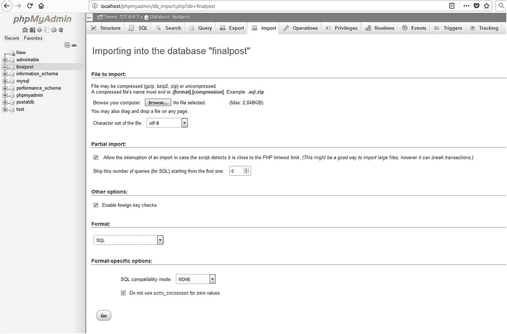

图 7-1

phpMyAdmin 中的导入接口

1.  在 XAMPP *htdocs* 或 EasyPHP *eds-www* 文件夹中，新建一个名为 *migrate* 的文件夹。

2.  从这本书的第一页开始。下载并解压第七章[的文件到你的新文件夹。](07.html)

3.  在浏览器的地址栏中，输入`http://localhost/phpmyadmin/`访问 phpMyAdmin。

4.  单击 databases 选项卡，创建名为 *migrate* 的数据库，从下拉排序列表中选择 utf8_general_ci，然后单击 Go。

5.  在左侧面板中，单击数据库 *migrate 旁边的框。*

6.  不要在下一个屏幕上输入任何内容，而是单击 Import 选项卡。

7.  点击浏览按钮(见图 [7-1](#Fig1) )并导航到您的 SQL 转储文件 *users.sql* 所在的位置。

8.  点击 *users.sql* 文件，然后点击打开按钮；该字段将填充转储文件的 URL。请注意，转储文件包含用户和价格表。

9.  确保下拉菜单中的字符集是 utf-8，并且格式显示为 SQL。

10.  单击开始。

11.  在左侧面板中，单击数据库迁移，并在下一个屏幕中单击特权选项卡。

12.  向下滚动并单击添加用户帐户。然后输入以下详细信息:

    *   *用户名* : trevithick

    *   *主机选择*:本地

    *   *密码* : l0c0m0t1v3

13.  向下滚动到“全局权限”,然后单击“全部选中”旁边的框。

14.  向下滚动并在右侧单击“Go”。

#### 用于连接数据库的下载文件的详细信息

本章的下载文件中已经为您创建了文件 *mysqli_connect.php* 。内容如下所示:

```php
<?php
// This creates a connection to the migrate database and to MySQL,
// It also sets the encoding.
// Set the access details as constants:
Define ('DB_USER', 'trevithick');
Define ('DB_PASSWORD', 'l0c0m0t1v3');
Define ('DB_HOST', 'localhost');
Define ('DB_NAME', 'migrate');
// Make the connection:
$dbcon = new mysqli(DB_HOST, DB_USER, DB_PASSWORD, DB_NAME);
// Set the encoding...optional but recommended
mysqli_set_charset($dbcon, 'utf8');

```

### 警告

请记住以管理员身份登录以查看成员表。登录邮箱为`jsmith@outcook.com`，密码为 d0g3b0dy。

会员秘书已经要求改变，以便会员可以在有限的范围内更新他们自己的记录。这是数据库驱动网站的一个常见特征。例如，在 PayPal，会员可以更新他们的个人资料(他们自己的账户信息)。已经规定成员可以更改密码；因此，在随后的成员更新界面中将不再包含该功能。

### 允许成员更新他们自己的记录

当成员登录后，他们将被允许更新自己的帐户。他们将无法访问任何其他成员的帐户；这可以通过会话来控制。该成员的修正案将得到验证和清理。如果成员想要更改密码，他们必须使用标题菜单上的新密码按钮。出于安全原因，可以修改的项目有限，如下所示:

*   头衔、名字、姓氏、电子邮件地址、邮政地址和电话号码

用户具有受限的访问权限，只允许他们编辑自己的信息。要做到这一点，我们必须具备识别个体成员的能力。成员秘书使用搜索页面来确定要编辑的记录。该屏幕不向个人成员提供，因为他们别无选择，只能编辑自己的记录。因此，我们需要在用户登录时识别他们，并将他们的身份保存在一个会话变量中，该变量可以在稍后显示的编辑您的帐户页面上使用。

在登录页面中，我们之前通过查看 user_level 来确定用户是成员还是管理员。user_level 中的值也决定了他们可以访问哪些页面。这个级别保存在一个会话变量中，然后由每个受限页面顶部的会话代码(安全防护)进行检查。我们可以对登录代码进行微小的更改，以便能够使用“编辑您的帐户”页面顶部的会话代码(security guard)来确定可以编辑的用户信息。

```php
if (password_verify($p, $row[1])) {
session_start();
// Ensure that the user level is an integer.
$_SESSION['user_level'] = (int) $row[3];
$_SESSION['user_id'] = (int) $row[0]; // Determine individual user

```

唯一需要的更改是在前面的代码片段中添加最后一行。user_id 是数据库中的记录行号，保存在一个同名的会话变量中。这唯一地标识了用户。这种标识是安全的，因为会话变量只能在活动会话期间访问。用户必须登录，如该代码段中的 if 语句所示，以便创建会话用户 ID 和用户级别。我们现在可以在编辑帐户页面中使用这些信息。

但是，在我们这样做之前，让我们更改成员专用页面的标题，以便注册成员可以查看和修改他们的记录。修改图 [7-2](#Fig2) 中所示的割台以允许这种情况。


图 7-2

成员页面标题中的“新建您的帐户”按钮

清单 [7-2](#PC3) 显示了修改后的标题代码。这是在*包含*文件夹中下载的代码。

```php
<div class="col-sm-2">
    
</div>
<div class="col-sm-8">
    <h1 class="blue-text mb-4 font-bold">Header Goes Here</h1>
 </div>
    <nav class="col-sm-2">
           <div class="btn-group-vertical btn-group-sm" role="group"
                   aria-label="Button Group">
                           <button type="button" class="btn btn-secondary"
                   onclick="location.href = 'logout.php'" >Logout</button>
                           <button type="button" class="btn btn-secondary"
                   onclick="location.href = 'edit_your_account.php'">
                           Your Account</button>
                           <button type="button" class="btn btn-secondary"
                   onclick="location.href =
                   'safer-register-password.php'">New Password</button>
</div>
    </nav>

Listing 7-2Adding a New Menu Button to the Header of the Members Page

```

点击“您的帐户”按钮，会显示一个新页面，如图 [7-3](#Fig3) 所示。

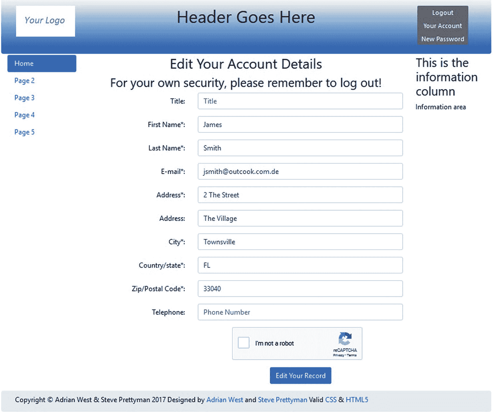

图 7-3

新的“编辑您的帐户详细信息”页面

会员页面和更新屏幕强调了注销的重要性。编辑字段并点击“编辑您的记录”按钮时，会出现确认信息，如图 [7-4](#Fig4) 所示。通过再次显示详细信息，用户在注销之前还有机会更改任何不正确的信息。

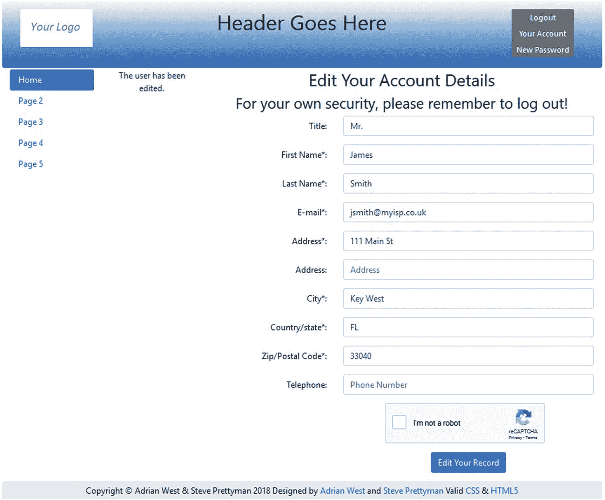

图 7-4

更新已确认

清单 [7-4a](#PC4) 显示了图 [7-3](#Fig3) 和 [7-4](#Fig4) 所示屏幕的代码。

```php
<?php
if ($_SERVER['REQUEST_METHOD'] == 'POST') {
        require("cap.php");
}
session_start();
//                                                                                       #1
if (isset($_SESSION['user_id']) && ($_SESSION['user_level'] == 0)){
$id = filter_var( $_SESSION['user_id'], FILTER_SANITIZE_STRING);
      define('ERROR_LOG',"errors.log");
} else {
      header("Location: login.php");
      exit();
}
?>
<!DOCTYPE html>
<html lang="en">
<head>
  <title>Edit Your Account Page</title>
  <meta charset="utf-8">
  <meta name="viewport" content=
        "width=device-width, initial-scale=1, shrink-to-fit=no">
  <!-- Bootstrap CSS File -->
  <link rel="stylesheet"
       href=
"https://stackpath.bootstrapcdn.com/bootstrap/4.1.0/css/bootstrap.min.css"
  integrity=
"sha384-9gVQ4dYFwwWSjIDZnLEWnxCjeSWFphJiwGPXr1jddIhOegiu1FwO5qRGvFXOdJZ4"
        crossorigin="anonymous">
<script src="verify.js"></script>
<script src='https://www.google.com/recaptcha/api.js'></script>
</head>
<body>
<div class="container" style="margin-top:30px">
<!-- Header Section -->
<header class="jumbotron text-center row col-sm-14"
style="margin-bottom:2px; background:linear-gradient(white, #0073e6);
        padding:20px;">
<?php include('includes/header_members_account.php'); ?>

</header>
<!-- Body Section -->
<div class="row" style="padding-left: 0px;">
<!-- Left-side Column Menu Section -->
  <nav class="col-sm-2">
        <ul class="nav nav-pills flex-column">
                <?php include('includes/nav.php'); ?>
        </ul>
  </nav>
<?php
try {
require ('mysqli_connect.php');
// Has the form been submitted?
if ($_SERVER['REQUEST_METHOD'] == 'POST') {
        $errors = array();
//Is the title present? If it is, sanitize it
    $title = filter_var( $_POST['title'], FILTER_SANITIZE_STRING);
        if ((!empty($title)) && (preg_match('/[a-z\.\s]/i',$title)) &&
                (strlen($title) <= 12)) {
                //Sanitize the trimmed title
                $titletrim = $title;
        }else{
                $titletrim = NULL; // Title is optional
        }
// Trim the first name
   $first_name = filter_var( $_POST['first_name'], FILTER_SANITIZE_STRING);
if ((!empty($first_name)) && (preg_match('/[a-z\s]/i',$first_name)) &&
               (strlen($first_name) <= 30)) {
               //Sanitize the trimmed first name

               $first_nametrim = $first_name;
               }else{
       $errors[] =
'First name missing or not alphabetic and space characters. Max 30';
       }
//Is the last name present? If it is, sanitize it
$last_name = filter_var( $_POST['last_name'], FILTER_SANITIZE_STRING);
if ((!empty($last_name)) && (preg_match('/[a-z\-\s\']/i',$last_name)) &&
               (strlen($last_name) <= 40)) {
       //Sanitize the trimmed last name
       $last_nametrim = $last_name;
}else{
       $errors[] =
'Last name missing or not alphabetic, dash, quote or space. Max 30.';
       }
// Check that an email address has been entered
$emailtrim = filter_var( $_POST['email'], FILTER_SANITIZE_EMAIL);
if ((empty($emailtrim)) || (!filter_var($emailtrim, FILTER_VALIDATE_EMAIL))
                       || (strlen($emailtrim > 60))) {
               $errors[] = 'You forgot to enter your email address';
               $errors[] = ' or the e-mail format is incorrect.';
      }
//Is the 1st address present? If it is, sanitize it
$address1 = filter_var( $_POST['address1'], FILTER_SANITIZE_STRING);
if ((!empty($address1)) && (preg_match('/[a-z0-9\.\s\,\-]/i', $address1)) &&
  (strlen($address1) <= 30)) {
        //Sanitize the trimmed 1st address
        $address1trim = $address1;
}else{
        $errors[] =
'Missing address. Numeric, alphabetic, period, comma, dash, space. Max 30.';
}
//If the 2nd address is present? If it is, sanitize it
$address2 = filter_var( $_POST['address2'], FILTER_SANITIZE_STRING);
if ((!empty($address2)) && (preg_match('/[a-z0-9\.\s\,\-]/i', $address2)) &&
  (strlen($address2) <= 30)) {
        //Sanitize the trimmed 2nd address

        $address2trim = $address2;
}else{
        $address2trim = NULL;
}
//Is the city present? If it is, sanitize it
$city = filter_var( $_POST['city'], FILTER_SANITIZE_STRING);
if ((!empty($city)) && (preg_match('/[a-z\.\s]/i', $city)) &&
  (strlen($city) <= 30)) {
        //Sanitize the trimmed city
        $citytrim = $city;
}else{
        $errors[] =
'Missing city. Only alphabetic, period and space. Max 30.';
        }
//Is the state or country present? If it is, sanitize it
$state_country = filter_var( $_POST['state_country'], FILTER_SANITIZE_STRING);
if ((!empty($state_country)) && (preg_match('/[a-z\.\s]/i', $state_country))
       && (strlen($state_country) <= 30))      {
       //Sanitize the trimmed state or country
       $state_countrytrim = $state_country;
}else{
       $errors[] =
       'Missing state/country. Only alphabetic, period and space. Max 30.';
//Is the zip code or post code present? If it is, sanitize it
$zcode_pcode = filter_var( $_POST['zcode_pcode'], FILTER_SANITIZE_STRING);
$string_length = strlen($zcode_pcode);
if ((!empty($zcode_pcode)) && (preg_match('/[a-z0-9\s]/i', $zcode_pcode))  &&
   ($string_length <= 30) && ($string_length >= 5)) {
        //Sanitize the trimmed zcode_pcode
    $zcode_pcodetrim = $zcode_pcode;
}else{
        $errors[] =
'Missing zip code or post code. Alphabetic, numeric, space only max 30 chars';
}
//Is the phone number present? If it is, sanitize it
$phone = filter_var( $_POST['phone'], FILTER_SANITIZE_STRING);
if ((!empty($phone)) && (strlen($phone) <= 30)) {
       //Sanitize the trimmed phone number
       $phonetrim = (filter_var($phone, FILTER_SANITIZE_NUMBER_INT));
       $phonetrim = preg_replace('/[^0-9]/', ", $phonetrim);
}else{
       $phonetrim = NULL;
}
if (empty($errors)) { // If everything's OK.
        //  make the query
        $q = mysqli_stmt_init($dbcon);
        $query =
                'SELECT userid FROM users WHERE email=? AND userid !=?';
       mysqli_stmt_prepare($q, $query);
        // bind $id to SQL Statement
        mysqli_stmt_bind_param($q, 'si', $emailtrim, $id);
        // execute query

        mysqli_stmt_execute($q);
        $result = mysqli_stmt_get_result($q);
        if (mysqli_num_rows($result) == 0) {
        // e-mail does not exist in another record
                // Make the update query:
                 $query =
'UPDATE users SET title=?, first_name=?, last_name=?, email=?, ';
                 $query .=
'address1=?, address2=?, city=?, state_country=?, zcode_pcode=?, ';
                 $query .=
'phone=?';
       $query .= ' WHERE userid=?';
        $q = mysqli_stmt_init($dbcon);
         mysqli_stmt_prepare($q, $query);
        // bind values to SQL Statement
               mysqli_stmt_bind_param($q, 'ssssssssssi', $titletrim,
        $first_nametrim, $last_nametrim,
        $emailtrim, $address1trim, $address2trim, $citytrim,
        $state_countrytrim,
        $zcode_pcodetrim, $phonetrim, $id);
       // execute query
       mysqli_stmt_execute($q);
               if (mysqli_stmt_affected_rows($q) == 1) { // Update OK
                       // Echo a message if the edit was satisfactory:
                       $errorstring = 'The user has been edited.';
                       echo "<p class=' text-center col-sm-2'
                       style='color:green'>$errorstring</p>";
               } else { // Echo a message if the query failed.
                       $errorstring =
       'The user could not be edited. Did you change anything?';
       $errorstring .=
       ' We apologize for any inconvenience.'; // Public message.
                       echo "<p class=' text-center col-sm-2'
                       style='color:red'>$errorstring</p>";
       //echo '<p>' . mysqli_error($dbcon) . '<br />Query: ' . $q . '</p>';
       // Debugging message.
       // Message above is only for debug and should not display sql
       }
}
} else { // Display the errors.
        // ---------------Process User Errors---------------
        // Display the users entry errors
        $errorstring = 'Error! The following error(s) occurred: ';
        foreach ($errors as $msg) { // Print each error.
                $errorstring .= " - $msg<br>\n";
                }
        $errorstring .= 'Please try again.';
        echo "<p class=' text-center col-sm-2' style='color:red'>$errorstring</p>";
        }// End of if (empty($errors)) IF.
} // End of the conditionals

// Select the user's information:
$query = "SELECT title, first_name, last_name, email, address1,
         address2, city, state_country, zcode_pcode, phone ";
$query .=" FROM users WHERE userid=?";
// id was retrieved from database prepared not needed
$q = mysqli_stmt_init($dbcon);
 mysqli_stmt_prepare($q, $query);
 // bind $id to SQL Statement
mysqli_stmt_bind_param($q, 'i', $id);
 // execute query
mysqli_stmt_execute($q);
$result = mysqli_stmt_get_result($q);
if (mysqli_num_rows($result) == 1) { // Valid user ID, display the form.
        // Get the user's information:
        $row = mysqli_fetch_array ($result, MYSQLI_ASSOC);
        // Create the form:
?>
  <!-- Validate Input -->
<div class="col-sm-8">
<h2 class="h2 text-center">Edit Your Account Details</h2>
<h3 class="text-center">
For your own security, please remember to log out!</h3>
<form action="edit_your_account.php" method="post"                              <!-- #2 -->
name="editform" id="editform">
 <div class="form-group row">
    <label for="title" class="col-sm-4 col-form-label
        text-right">Title:</label>
 <div class="col-sm-8">
      <input type="text" class="form-control" id="title" name="title"
        placeholder="Title" maxlength="12"
        pattern='[a-zA-Z][a-zA-Z\s\.]*'
        title="Alphabetic, period and space max 12 characters"
        value=
             "<?php if (isset($row['title']))
             echo htmlspecialchars($row['title'], ENT_QUOTES); ?>" >
 </div>
</div>
<div class="form-group row">
    <label for="first_name" class="col-sm-4 col-form-label text-right">
               First Name*:</label>
    <div class="col-sm-8">
      <input type="text" class="form-control" id="first_name"
                name="first_name"
                pattern="[a-zA-Z][a-zA-Z\s]*"
                title="Alphabetic and space only max of 30 characters"
                placeholder="First Name" maxlength="30" required
                value=
                "<?php if (isset($row['first_name']))
                echo htmlspecialchars($row['first_name'], ENT_QUOTES); ?>" >
 </div>

 </div>
 <div class="form-group row">
    <label for="last_name" class="col-sm-4 col-form-label text-right">
               Last Name*:</label>
 <div class="col-sm-8">
      <input type="text" class="form-control" id="last_name" name="last_name"
        pattern="[a-zA-Z][a-zA-Z\s\-\']*"
        title="Alphabetic, dash, quote and space only max of 40 characters"
        placeholder="Last Name" maxlength="40" required
        value=
              "<?php if (isset($row['last_name']))
              echo htmlspecialchars($row['last_name'], ENT_QUOTES); ?>" >
</div>
</div>
<div class="form-group row">
    <label for="email" class="col-sm-4 col-form-label text-right">
                E-mail*:</label>
    <div class="col-sm-8">
      <input type="email" class="form-control" id="email" name="email"
        placeholder="E-mail" maxlength="60" required
        value=
              "<?php if (isset($row['email']))
              echo htmlspecialchars($row['email'], ENT_QUOTES); ?>" >
</div>

</div>
<div class="form-group row">
    <label for="address1" class="col-sm-4 col-form-label
        text-right">Address*:</label>
    <div class="col-sm-8">
      <input type="text" class="form-control" id="address1" name="address1"
        pattern="[a-zA-Z0-9][a-zA-Z0-9\s\.\,\-]*"
        title="Alphabetic, numbers, period, comma, dash and space only max of 30 characters"
          placeholder="Address" maxlength="30" required
          value=
               "<?php if (isset($row['address1']))
               echo htmlspecialchars($row['address1'], ENT_QUOTES); ?>" >
 </div>
</div>
<div class="form-group row">
    <label for="address2" class="col-sm-4 col-form-label text-right">Address:</label>
    <div class="col-sm-8">
      <input type="text" class="form-control" id="address2" name="address2"
        pattern="[a-zA-Z0-9][a-zA-Z0-9\s\.\,\-]*"
        title="Alphabetic, numbers, period, comma, dash and space only max of 30 characters"
        placeholder="Address" maxlength="30"
        value=
             "<?php if (isset($row['address2']))
             echo htmlspecialchars($row['address2'], ENT_QUOTES); ?>" >
</div>
</div>
<div class="form-group row">
    <label for="city" class="col-sm-4 col-form-label
        text-right">City*:</label>
    <div class="col-sm-8">
      <input type="text" class="form-control" id="city" name="city"
        pattern="[a-zA-Z][a-zA-Z\s\.]*"
        title="Alphabetic, period and space only max of 30 characters"
        placeholder="City" maxlength="30" required
        value=
             "<?php if (isset($row['city']))
             echo htmlspecialchars($row['city'], ENT_QUOTES); ?>" >
</div>
</div>

<div class="form-group row">
    <label for="state_country" class="col-sm-4 col-form-label text-right">
               Country/state*:</label>
    <div class="col-sm-8">
      <input type="text" class="form-control" id="state_country"
               name="state_country"
      pattern="[a-zA-Z][a-zA-Z\s\.]*"
          title="Alphabetic, period and space only max of 30 characters"
          placeholder="State or Country" maxlength="30" required
          value=
               "<?php if (isset($row['state_country']))
               echo htmlspecialchars($row['state_country'], ENT_QUOTES); ?>" >
</div>
</div>
<div class="form-group row">
    <label for="zcode_pcode" class="col-sm-4 col-form-label text-right">
               Zip/Postal Code*:</label>
    <div class="col-sm-8">
      <input type="text" class="form-control" id="zcode_pcode"
               name="zcode_pcode"
        pattern="[a-zA-Z0-9][a-zA-Z0-9\s]*"
        title="Alphabetic, period and space only max of 30 characters"
        placeholder="Zip or Postal Code" minlength="5"
              maxlength="30" required
        value=
             "<?php if (isset($row['zcode_pcode']))
             echo htmlspecialchars($row['zcode_pcode'], ENT_QUOTES); ?>" >
</div>
</div>
<div class="form-group row">
    <label for="phone" class="col-sm-4 col-form-label
               text-right">Telephone:</label>
    <div class="col-sm-8">
      <input type="tel" class="form-control" id="phone" name="phone"
        placeholder="Phone Number" maxlength="30"
        value=
             "<?php if (isset($row['phone']))
             echo htmlspecialchars($row['phone'], ENT_QUOTES); ?>" >
</div>
</div>

      <input type="hidden" name="id" value="' . $id . '">
<div class="form-group row">
  <label class="col-sm-4 col-form-label"></label>
  <div class="col-sm-8">
  <div class=
"float-left g-recaptcha" style="padding-left: 80px;"
data-sitekey="6LcrQ1wUAAAAAPxlrAkLuPdpY5qwS9rXF1j46fhq"></div>
</div>
</div>
<div class="form-group row">
        <label for="" class="col-sm-4 col-form-label"></label>
    <div class="col-sm-8 text-center">
        <input id="submit" class="btn btn-primary" type="submit"
                name="submit" value="Edit Your Record">
</div>
</div>
</form>
</div>
<?php
   }
 if(!isset($errorstring)) {
        echo '<aside class="col-sm-2">';
        include('includes/info-col.php');
        echo '</aside>';
        echo '</div>';
        echo '<footer class="jumbotron text-center row col-sm-14"
                style="padding-bottom:1px; padding-top:8px;">';
 }
 else
 {
        echo '<footer class="jumbotron text-center col-sm-12"
        style="padding-bottom:1px; padding-top:8px;">';
 }
  include('includes/footer.php');
  echo "</footer>";
  echo "</div>";

}
catch(Exception $e) // We finally handle any problems here
   {
      // print "An Exception occurred. Message: " . $e->getMessage();
      print "The system is busy please try later";
      // $date = date('m.d.y h:i:s’);
      // $errormessage = $e->getMessage();
      // $eMessage = $date . " | Exception Error | " , $errormessage . |\n";
      // error_log($eMessage,3,ERROR_LOG);
      // e-mail support person to alert there is a problem
      // error_log(“Date/Time: $date – Exception Error, Check error log for
//details", 1, noone@helpme.com, "Subject: Exception Error \nFrom: Error Log <errorlog@helpme.com>" . "\r\n");
   }
   catch(Error $e)

   {
       // print "An Error occurred. Message: " . $e->getMessage();
       print "The system is busy please try later";
       // $date = date('m.d.y h:i:s');
       // $errormessage = $e->getMessage();
       // $eMessage = $date . " | Error | " , $errormessage . |\n";
       // error_log($eMessage,3,ERROR_LOG);
       // e-mail support person to alert there is a problem
   //  error_log("Date/Time: $date – Error, Check error log for
//details", 1, noone@helpme.com, "Subject: Error \nFrom: Error Log <errorlog@helpme.com>"."\r\n");
   }
?>
</body>
</html>

Listing 7-4aCreating an Interface for Members to Edit Their Accounts (edit_your_account.php)

```

#### 代码的解释

本节解释代码。

```php
<?php
session_start();
//                                                                                       #1
if (isset($_SESSION['user_id']) && ($_SESSION['user_level'] == 0)){
$id = filter_var( $_SESSION['user_id'], FILTER_SANITIZE_STRING);
} else {
header("Location: login.php");
exit();
}
?>

```

仅当会话变量 user_id 中有值并且用户级别为 0 时，才允许访问页面。当用户使用登录页面登录时，user_id 被设置为会话变量。因此，只要会话仍处于活动状态，该值就有效。然后，user_id 被保存在＄id 变量中，因为它将用于显示和更新用户记录。

```php
form action="edit_your_account.php" method="post"                                 <!--#2-->
        onsubmit="return checked();"
        name="regform" id="regform">
 <div class="form-group row">
        <label for="title" class="col-sm-4 col-form-label text-right">
                Title:</label>
 <div class="col-sm-8">
        <input type="text" class="form-control" id="title" name="title"
               placeholder="Title" maxlength="12"
               pattern='[a-zA-Z][a-zA-Z\s\.]*'
               title="Alphabetic, period and space max 12 characters"
               value=
                       "<?php if (isset($row['title']))
               echo htmlspecialchars($row['title'], ENT_QUOTES); ?>" >
  </div>
  </div>

```

这段代码显示了用于编辑成员帐户的粘性表单的一部分。$row 数组是通过使用 SELECT 语句从数据库表中提取用户记录而创建的。代码与我们之前看到的类似，只是我们从$row 而不是$_POST 中提取数据。

文件*process _ edit _ your _ account*中的所有清理和验证与第 [6 章](06.html)中所示的相同。所以这里就不讨论了。你可以用文本编辑器从下载的章节 [7](07.html) 文件中查看这个文件的内容。

让我们分开一会儿。在前面的章节中，我们没有花时间指出，在大多数情况下，我们的网页已经支持移动(小屏幕)。图 [7-5](#Fig5) 显示了移动尺寸版本的 safer-register-page。

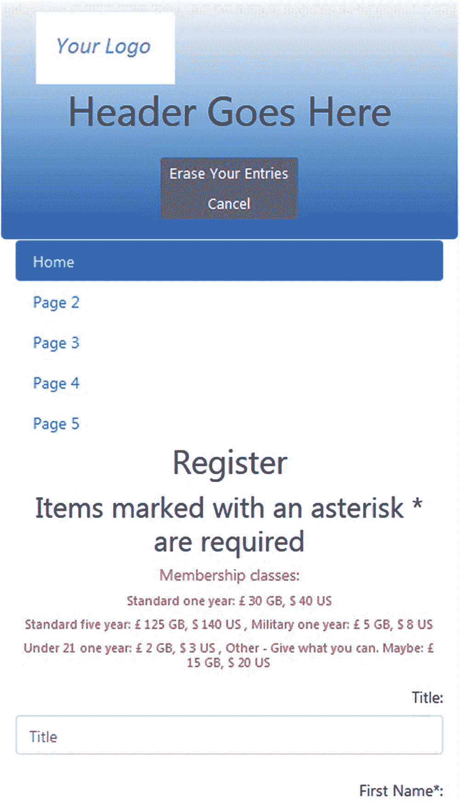

图 7-5

移动尺寸注册页面

我们在前面的章节中使用的引导类给了我们的页面这种能力。在接下来的章节中，我们将对引导代码做一些细微的调整，以个性化我们的按钮，并隐藏一些从移动设备上看到的菜单。

会员网站和数据库迁移教程到此结束。但是，我们可以对这个网站(或任何网站)进行一些有用的添加和更改，接下来我们会看到。

### 安全反馈表

联系我们表单与数据库没有严格的关系；然而，它是一个交互式元素，提供了 PHP 代码的优秀应用。

电子邮件和反馈表格是最受欢迎的联系方式，可以让用户轻松地与网站所有者交流。不幸的是，这两种联系方式都可能被滥用。电子邮件地址被收集并出售给垃圾邮件发送者。这两种行为都会给网站所有者带来困扰和大量垃圾邮件。黑客可以劫持一个表单，并用它向网站所有者频繁发送垃圾邮件。这些通常包含可以通过文本区域中的链接激活的恶意软件。如上所述，任何人都不应该点击电子邮件中嵌入的链接，除非绝对确定该链接是有效的。本节描述了降低这些风险的一些选项。

设计反馈表时，我们需要考虑以下几点:

*   盲人和视力严重受损的用户将使用屏幕阅读器来阅读和回复表单。必须遵守可访问性规则。

*   表单处理程序中必须内置过滤器，以防止表单被恶意劫持。

    ### 注意

    许多政府机构要求公司遵守网站的可访问性指南。许多国家不会向不遵守无障碍指南的公司提供政府合同。这些指导原则通常不难实施，并且通过为视障用户提供对网站信息的访问来增加组织的商誉。

#### 反馈回复看起来像什么？

以下是从安全表单及其处理程序收到的真实电子邮件:

```php
------------------------------------------------------------
Name of sender: Andrew Eastman
Email of sender: aeastman@myisp.co.uk
Telephone No: 01111 222333
XP?: No
Vista?: No
Windows7?: No
Windows 8: Yes
Laptop?: Yes
Desktop?; No
------------------------- MESSAGE ----------------------------
How can I change back to Windows 7?
-------------------------------------------------------------------

```

### 反馈表

图 [7-6](#Fig6) 显示了一个典型的反馈表。

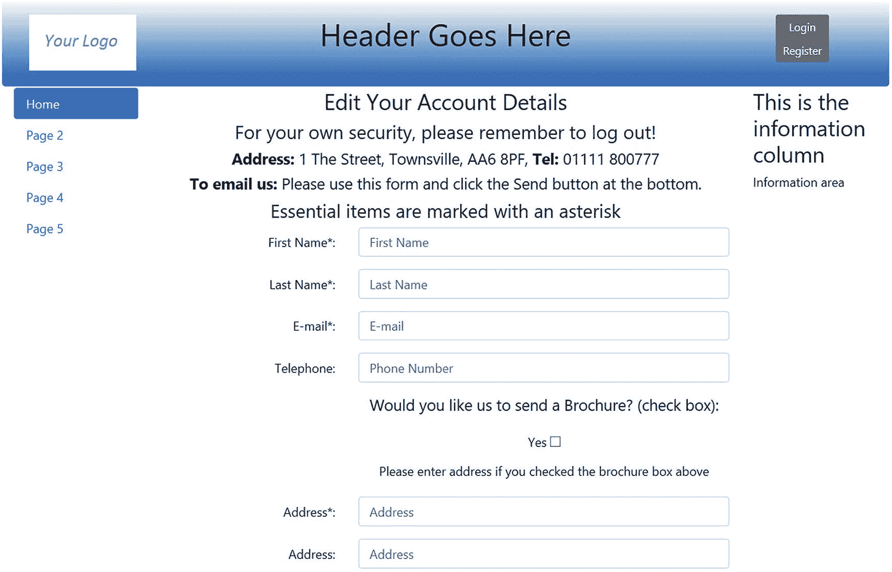

图 7-6

反馈表

反馈页面的代码专注于防止 URL 被输入，因为这是机器人填写表单的主要问题。

清单 [7-6a](#PC8) 提供了显示表单的代码。

```php
<?php
if ($_SERVER['REQUEST_METHOD'] == 'POST') {
        require("cap.php");
}
?>
<!DOCTYPE html>
<html lang="en">
<head>
  <title>Feedback Form</title>
  <meta charset="utf-8">
  <meta name="viewport"
        content="width=device-width, initial-scale=1, shrink-to-fit=no">
  <!-- Bootstrap CSS File -->

  <link rel="stylesheet"
        href="https://stackpath.bootstrapcdn.com/bootstrap/4.1.0/css/bootstrap.min.css"
  integrity="sha384-9gVQ4dYFwwWSjIDZnLEWnxCjeSWFphJiwGPXr1jddIhOegiu1FwO5qRGvFXOdJZ4"
        crossorigin="anonymous">
<script src='https://www.google.com/recaptcha/api.js'></script>
</head>
<body>
<div class="container" style="margin-top:30px">
<!-- Header Section -->
<header class="jumbotron text-center row col-sm-14"
        style="margin-bottom:2px; background:linear-gradient(white, #0073e6);
        padding:20px;">
        <?php include('includes/header.php'); ?>
</header>
<!-- Body Section -->
<div class="row" style="padding-left: 0px;">
<!-- Left-side Column Menu Section -->
  <nav class="col-sm-2">
       <ul class="nav nav-pills flex-column">
              <?php include('includes/nav.php'); ?>
       </ul>
  </nav>
  <!-- Validate Input -->
<div class="col-sm-8">
<h3 class="text-center">Contact Us!</h3>
<h5 class="text-center"><strong>Address:</strong>
1 The Street, Townsville, AA6 8PF, <strong>Tel:</strong> 01111 800777</h5>
<h5 class="text-center"><strong>To email us:</strong>
        Please use this form and click the Send button at the bottom.</h5>
<h4 class="text-center">Essential items are marked with an asterisk</h4>
<!--                                                                                  #1-->
<form action="feedback-handler.php" method="post" name="feedbackform"
        id="feedbackform">
<!--START OF TEXT FIELDS-->
<div class="form-group row">
        <label for="first_name" class="col-sm-4 col-form-label text-right">
               First Name*:</label>

<div class="col-sm-8">
        <input type="text" class="form-control" id="first_name"
               name="first_name"
               pattern="[a-zA-Z][a-zA-Z\s]*"
               title="Alphabetic and space only max of 30 characters"
               placeholder="First Name" maxlength="30" required
               value=
                       "<?php if (isset($row['first_name']))
               echo htmlspecialchars($row['first_name'], ENT_QUOTES); ?>" >
</div>
</div>
<div class="form-group row">
         <label for="last_name" class="col-sm-4 col-form-label text-right">
                Last Name*:</label>
<div class="col-sm-8">
         <input type="text" class="form-control" id="last_name" name="last_name"
                pattern="[a-zA-Z][a-zA-Z\s\-\']*"
                title="Alphabetic, dash, quote and space only max of 40 characters"
                placeholder="Last Name" maxlength="40" required
                value=
                        "<?php if (isset($row['last_name']))
                echo htmlspecialchars($row['last_name'], ENT_QUOTES); ?>" >
</div>
</div>
<div class="form-group row">
         <label for="email" class="col-sm-4 col-form-label text-right">
                E-mail*:</label>
<div class="col-sm-8">
         <input type="email" class="form-control" id="email" name="email"
                placeholder="E-mail" maxlength="60" required
                value=
                        "<?php if (isset($row['email']))
                echo htmlspecialchars($row['email'], ENT_QUOTES); ?>" >
</div>
</div>
<div class="form-group row">
        <label for="phone" class="col-sm-4 col-form-label
                text-right">Telephone:</label>
<div class="col-sm-8">
       <input type="tel" class="form-control" id="phone" name="phone"
                placeholder="Phone Number" maxlength="30"
                value=
                        "<?php if (isset($row['phone']))
                echo htmlspecialchars($row['phone'], ENT_QUOTES); ?>" >
</div>
</div>
<div class="form-group row">
    <label for="" class="col-sm-4 col-form-label text-right"></label>
<h5 class="col-sm-8 text-center">Would you like us to send a Brochure?
        (check box):</h5>
</div>
<div class="form-group row">

    <label for="" class="col-sm-4 col-form-label text-right"></label>
<div class="checkbox col-sm-8 text-center">Yes
        <input class="" type="checkbox" name="brochure" id="brochure" value="yes">
</div>
</div>
<div class="form-group row">
    <label for="" class="col-sm-4 col-form-label text-right"></label>
<h6 class="col-sm-8 text-center">
        Please enter address if you checked the brochure box above</h6>
</div>
<div class="form-group row">
        <label for="address1" class="col-sm-4 col-form-label
             text-right">Address*:</label>
<div class="col-sm-8">
        <input type="text" class="form-control" id="address1" name="address1"
               pattern="[a-zA-Z0-9][a-zA-Z0-9\s\.\,\-]*"
               title="Alphabetic, numbers, period, comma, dash and space only max of 30 characters"
               placeholder="Address" maxlength="30" required
               value=
                       "<?php if (isset($row['address1']))
               echo htmlspecialchars($row['address1'], ENT_QUOTES); ?>" >
</div>
</div>
<div class="form-group row">
        <label for="address2" class="col-sm-4 col-form-label
               text-right">Address:</label>
<div class="col-sm-8">
        <input type="text" class="form-control" id="address2" name="address2"
               pattern="[a-zA-Z0-9][a-zA-Z0-9\s\.\,\-]*"
               title="Alphabetic, numbers, period, comma, dash and space only max of 30 characters"
               placeholder="Address" maxlength="30"
               value=
                       "<?php if (isset($row['address2']))
               echo htmlspecialchars($row['address2'], ENT_QUOTES); ?>" >
</div>
</div>
<div class="form-group row">
        <label for="city" class="col-sm-4 col-form-label
               text-right">City*:</label>
<div class="col-sm-8">
      <input type="text" class="form-control" id="city" name="city"
               pattern="[a-zA-Z][a-zA-Z\s\.]*"
               title="Alphabetic, period and space only max of 30 characters"
               placeholder="City" maxlength="30" required
               value=
                       "<?php if (isset($_POST['city']))
               echo htmlspecialchars($_POST['city'], ENT_QUOTES); ?>" >
</div>

</div>
<div class="form-group row">
        <label for="state_country" class="col-sm-4 col-form-label text-right">
               Country/state*:</label>
<div class="col-sm-8">
        <input type="text" class="form-control" id="state_country"
               name="state_country"
               pattern="[a-zA-Z][a-zA-Z\s\.]*"
               title="Alphabetic, period and space only max of 30 characters"
               placeholder="State or Country" maxlength="30" required
               value=
                       "<?php if (isset($_POST['state_country']))
               echo htmlspecialchars($_POST['state_country'], ENT_QUOTES); ?>" >
 </div>
 </div>
 <div class="form-group row">
         <label for="zcode_pcode" class="col-sm-4 col-form-label text-right">
                Zip/Postal Code*:</label>
<div class="col-sm-8">
        <input type="text" class="form-control" id="zcode_pcode"
               name="zcode_pcode"
               pattern="[a-zA-Z0-9][a-zA-Z0-9\s]*"
               title="Alphabetic, period and space only max of 30 characters"
               placeholder="Zip or Postal Code" minlength="5" maxlength="30"
               required
               value=
                       "<?php if (isset($_POST['zcode_pcode']))
               echo htmlspecialchars($_POST['zcode_pcode'], ENT_QUOTES); ?>" >
</div>
</div>
<div class="form-group row">
        <label for="" class="col-sm-4 col-form-label text-right"></label>
<h5 class="col-sm-8 text-center">
        Would you like to receive emailed newsletters?</h5>
</div>
<fieldset class="form-group row">
                <label for="" class="col-sm-4 col-form-label text-right"></label>
<div class="col-sm-8 text-center">                                               <!--#2 -->
<div class="form-check form-check-inline">
        <input class="form-check-input" type="radio" name="letter"
              id="letter" value="yes" checked>
        <label class="form-check-label" for="letter">
            Yes
       </label>

</div>
<div class="form-check form-check-inline">
        <input class="form-check-input" type="radio" name="noletter"
                id="noletter" value="no">
       <label class="form-check-label" for="noletter">
            No
       </label>
</div>
</div>
</fieldset>
<div class="form-group row">                                                      <!--#3-->
        <label for="" class="col-sm-4 col-form-label text-right"></label>
<div class="col-sm-8 text-center">
        <label for="comment">Please enter your message below</label>
        <textarea class="form-control" id="comment" name="comment" rows="12"
                cols="40"
                value=
                        "<?php if (isset($_POST['comment']))
                echo htmlspecialchars($_POST['comment'], ENT_QUOTES); ?>" >
        </textarea>
 </div>
 </div>
 <div class="form-group row">
       <label class="col-sm-4 col-form-label"></label>
 <div class="col-sm-8">
 <div class="g-recaptcha" style="margin-left: 80px;"
       data-sitekey=”placeyoursitekeyhere"></div>
 </div>
</div>
<div class="form-group row">
        <label for="" class="col-sm-4 col-form-label"></label>
<div class="col-sm-8 text-center">
        <input id="submit" class="btn btn-primary" type="submit" name="submit"
                value="Send">
</div>
</div>
</form>
</div>
<!-- Right-side Column Content Section -->
        <aside class="col-sm-2">
                <?php include('includes/info-col.php'); ?>
        </aside>
<!-- Footer Content Section -->
</div>
<footer class="jumbotron text-center row"
        style="padding-bottom:1px; padding-top:8px;">
        <?php include('includes/footer.php'); ?>
</footer>
</body>
</html>

Listing 7-6aCreating the Contact Us

Form (feedback-form.php)

```

#### 代码的解释

本节解释代码。

```php
<!--                                                                                  #1-->
<form action="feedback-handler.php" method="post" name="feedbackform"
      id="feedbackform">

```

来自反馈表单的虚假反馈将被表单调用的 PHP 处理文件阻止。如果在任何文本字段中输入了 URL，在单击提交按钮后，表单处理程序将显示一条错误消息。这将阻止虚假回复。清单 [7-3b](#PC11) 显示了处理程序的 PHP 代码。

```php
<div class="col-sm-8 text-center">                                               <!--#2 -->
<div class="form-check form-check-inline">
          <input class="form-check-input" type="radio" name="letter"
             id="letter" value="yes" checked>
        <label class="form-check-label" for="letter">
            Yes
       </label>
</div>
<div class="form-check form-check-inline">
        <input class="form-check-input" type="radio" name="noletter"
                id="noletter" value="no">
        <label class="form-check-label" for="noletter">
             No
        </label>
</div>
Radio buttons are used to determine if the user wants to join the e-mail newsletter.
<div class="form-group row">                                                      <!--#3-->
        <label for="" class="col-sm-4 col-form-label text-right"></label>
<div class="col-sm-8 text-center">
        <label for="comment">Please enter your message below</label>
        <textarea class="form-control" id="comment" name="comment" rows="12"
               cols="40"
               value=
                       "<?php if (isset($_POST['comment']))
               echo htmlspecialchars($_POST['comment'], ENT_QUOTES); ?>" >
        </textarea>
 </div>
 </div>

```

Textarea 用于收集要发送的消息。该邮件将在服务器端进行清理。所有其他代码类似于第 [6](06.html) 章所示的安全寄存器页面中的代码。让我们看看清单 [7-6b](#PC11) 中的 PHP 代码。

请注意，使用了虚假的电子邮件地址和 URL。用你客户的详细资料代替。

```php
<?php
// Feedback form handler
// set the error and thank you pages                                                     #1
$formurl = "feedback_form.php" ;
$errorurl = "feedback/error.php" ;
$thankyouurl = "feedback/thankyou.php" ;
$emailerrurl = "feedback/emailerr.php" ;
$errorcommenturl =  "feedback/commenterror.php" ;
// set to the email address of the recipient
$mailto = "none@noone.com" ;
// Is first name present? If it is, sanitize it                                          #2
   $first_name = filter_var( $_POST['first_name'], FILTER_SANITIZE_STRING);
if ((!empty($first_name)) && (preg_match('/[a-z\s]/i',$first_name)) &&
                   (strlen($first_name) <= 30)) {
          //Save first name
          $first_nametrim = $first_name;
}else{
          $errors = 'yes';
}
//Is the last name present? If it is, sanitize it
$last_name = filter_var( $_POST['last_name'], FILTER_SANITIZE_STRING);
if ((!empty($last_name)) && (preg_match('/[a-z\-\s\']/i',$last_name)) &&
                  (strlen($last_name) <= 40)) {
          //Save last name
          $last_nametrim = $last_name;
}else{
          $errors = 'yes';
}
// Check that an email address has been entered correctly                                #3
$emailtrim = filter_var( $_POST['email'], FILTER_SANITIZE_EMAIL);
if ((empty($emailtrim)) || (!filter_var($emailtrim, FILTER_VALIDATE_EMAIL))
         || (strlen($emailtrim > 60))) {
         // if email is bad display error page
         header( "Location: $emailerrurl" );
       exit ;
}
// Is the phone number present? if so, sanitize it
$phone = filter_var( $_POST['phone'], FILTER_SANITIZE_STRING);
if ((!empty($phone)) && (strlen($phone) <= 30)) {
          //Sanitize and validate phone number
          $phonetrim = (filter_var($phone, FILTER_SANITIZE_NUMBER_INT));
          $phonetrim = preg_replace('/[^0-9]/', ", $phonetrim);
}else{
          $phonetrim = NULL; // if not valid or missing do not save
}
//Is the 1st address present? If it is, sanitize it
$address1 = filter_var( $_POST['address1'], FILTER_SANITIZE_STRING);
if ((!empty($address1)) && (preg_match('/[a-z0-9\.\s\,\-]/i', $address1)) &&
          (strlen($address1) <= 30)) {
          //Save the 1st address
          $address1trim = $address1;

}else{
          $errors = 'yes';
}
//If the 2nd address is present? If it is, sanitize it
$address2 = filter_var( $_POST['address2'], FILTER_SANITIZE_STRING);
if ((!empty($address2)) && (preg_match('/[a-z0-9\.\s\,\-]/i', $address2)) &&
          (strlen($address2) <= 30)) {
          //Save the 2nd address
          $address2trim = $address2;
}else{
          $address2trim = NULL; // If missing or not valid do not save
}
//Is the city present? If it is, sanitize it
$city = filter_var( $_POST['city'], FILTER_SANITIZE_STRING);
if ((!empty($city)) && (preg_match('/[a-z\.\s]/i', $city)) &&
          (strlen($city) <= 30)) {
          //Save the city
          $citytrim = $city;
}else{
          $errors = 'yes';
}
//Is the state or country present? If it is, sanitize it
$state_country = filter_var( $_POST['state_country'], FILTER_SANITIZE_STRING
if ((!empty($state_country)) && (preg_match('/[a-z\.\s]/i', $state_country))
          && (strlen($state_country) <= 30))      {
          //Save the state or country
          $state_countrytrim = $state_country;
}else{
          $errors = 'yes';
}
//Is the zip code or post code present? If it is, sanitize it
$zcode_pcode = filter_var( $_POST['zcode_pcode'], FILTER_SANITIZE_STRING);
$string_length = strlen($zcode_pcode);
if ((!empty($zcode_pcode)) && (preg_match('/[a-z0-9\s]/i', $zcode_pcode))  &&
          ($string_length <= 30) && ($string_length >= 5)) {
          //Save the zcode_pcode
          $zcode_pcodetrim = $zcode_pcode;
}else{
          $errors = 'yes';
          }

$brochure = filter_var( $_POST['brochure'], FILTER_SANITIZE_STRING);                   //#4
if($brochure != "yes") {$brochure = "no";} // if not yes, then no
$letter = filter_var( $_POST['letter'], FILTER_SANITIZE_STRING);
if($letter != "yes") {$letter = "no"; } // if not yes, then no

$comment = filter_var( $_POST['comment'], FILTER_SANITIZE_STRING);                     //#5
if ((!empty($comment)) && (strlen($comment) <= 480)) {
          // remove ability to create link in email
          $patterns = array("/http/", "/https/", "/\:/","/\/\//","/www./");
          $commenttrim = preg_replace($patterns," ", $comment);
}else{    // if comment not valid display error page
          header( "Location: $errorcommenturl" );
          exit;
}

if (!empty($errors)) { // if errors display error page
         header( "Location: $errorurl" );
         exit ; }
// everything OK send e-mail                                                             #6
$subject = "Message from customer " . $first_nametrim . " " . $last_nametrim;
$messageproper =
"------------------------------------------------------------\n" .
"Name of sender: $first_nametrim $last_nametrim\n" .
"Email of sender: $emailtrim\n" .
"Telephone: $phonetrim\n" .
"brochure?: $brochure\n" .
"Address: $address1trim\n" .
"Address: $address2trim\n" .
"City: $citytrim\n" .
"Postcode: $zcode_pcodetrim\n" .
"Newsletter?:$letter\n" .
"------------------------- MESSAGE -------------------------\n\n" .
$commenttrim .
"\n\n------------------------------------------------------------\n" ;
mail($mailto, $subject, $messageproper, "From: \"$first_nametrim $last_nametrim\" <$emailtrim>" );
header( "Location: $thankyouurl" );
exit ;
?>

Listing 7-6bCreating the Feedback Form Handler (feedback-handler.php)

```

### 警告

表单处理程序需要一个电子邮件服务器驻留在执行代码的机器上。除非您安装了自己的电子邮件服务器，否则这段代码不会在您的计算机上执行。然而，大多数虚拟主机公司都提供电子邮件服务器。您可以将此代码上传到托管站点。然后向托管公司验证代码以访问电子邮件服务器。有时需要一些微小但重要的改变来完成这个过程。

#### 代码的解释

本节解释代码。

```php
// set the error and thank you pages                                                     #1
$formurl = "feedback_form.php" ;
$errorurl = "feedback/error.php" ;
$thankyouurl = "feedback/thankyou.php" ;
$emailerrurl = "feedback/emailerr.php" ;
$errorcommenturl =  "feedback/commenterror.php" ;
// set to the email address of the recipient
$mailto = "none@noone.com" ;

```

虚拟的电子邮件地址和 URL 将需要被真实的地址和 URL 所取代。五个文件被分配给变量。四行是指包含错误信息的页面。

```php
// Is first name present? If it is, sanitize it                                          #2
   $first_name = filter_var( $_POST['first_name'], FILTER_SANITIZE_STRING);
if ((!empty($first_name)) && (preg_match('/[a-z\s]/i',$first_name)) &&
                   (strlen($first_name) <= 30)) {
          //Save first name
          $first_nametrim = $first_name;
}else{
          $errors = 'yes';
}

```

大多数变量的清理和验证类似于第 [6](06.html) 章中讨论的进程-寄存器-页面代码。然而，不是创建一个错误数组，而是将一个 errors 变量设置为 yes 以指示存在问题。电子邮件和评论是需要收集的最重要的信息。因此，我们将区别对待这些变量。

```php
// Check that an email address has been entered correctly                                #3
$emailtrim = filter_var( $_POST['email'], FILTER_SANITIZE_EMAIL);
if  ((empty($emailtrim)) || (!filter_var($emailtrim, FILTER_VALIDATE_EMAIL))
          || (strlen($emailtrim > 60))) {
          // if email is bad display error page
          header( "Location: $emailerrurl" );
       exit ;
}

```

如果电子邮件无效，则没有理由继续尝试发送邮件。因此，向用户显示电子邮件错误页面。

```php
$brochure = filter_var( $_POST['brochure'], FILTER_SANITIZE_STRING);                   //#4
if($brochure != "yes") {$brochure = "no";} // if not yes, then no
$letter = filter_var( $_POST['letter'], FILTER_SANITIZE_STRING);
if($letter != "yes") {$letter = "no"; } // if not yes, then no

```

如果用户没有点击小册子的“是”框，我们假设他们不想要它，并将变量设置为“否”。这也排除了任何其他可能的无效值。我们也对 e-mail letter 变量做了同样的处理。

```php
$comment = filter_var( $_POST['comment'], FILTER_SANITIZE_STRING);                     //#5
if ((!empty($comment)) && (strlen($comment) <= 480)) {
          // remove ability to create link in email
          $patterns = array("/http/", "/https/", "/\:/","/\/\//","/www./");
          $commenttrim = preg_replace($patterns," ", $comment);
}else{    // if comment not valid display error page
          header( "Location: $errorcommenturl" );
          exit;
}

```

如果评论的格式不正确，也没有理由尝试发送消息。因此，我们称之为与注释相关的错误页面。但是，如果注释格式正确，可能会尝试包含 URL 链接，我们将通过删除协议头(http，https)来停用 URL 链接。preg_replace 函数将用空格替换 patterns 数组中显示的任何格式，从而删除可能有害的条目。我们假设客户可能发送了一个链接来提供信息。然而，出于安全原因，我们不希望它是可点击的。

```php
// everything OK send e-mail                                                             #6
$subject = "Message from customer " . $first_nametrim . " " . $last_nametrim;
$messageproper =
"------------------------------------------------------------\n" .
"Name of sender: $first_nametrim $last_nametrim\n" .
"Email of sender: $emailtrim\n" .
"Telephone: $phonetrim\n" .
"brochure?: $brochure\n" .
"Address: $address1trim\n" .
"Address: $address2trim\n" .
"City: $citytrim\n" .
"Postcode: $zcode_pcodetrim\n" .
"Newsletter?:$letter\n" .
"------------------------- MESSAGE -------------------------\n\n" .
$commenttrim .
"\n\n------------------------------------------------------------\n" ;
mail($mailto, $subject, $messageproper, "From: \"$first_nametrim $last_nametrim\" <$emailtrim>" );
header( "Location: $thankyouurl" );
exit ;

```

这个代码块使用经过清理和验证的变量来构造电子邮件。注意每一项后面的句号；这些都很重要。代码\n 在每个项目之间插入一个换行符(或回车)。发送电子邮件时需要这种格式。最后两行使用 PHP 函数 mail()发送电子邮件。电子邮件发出后，用户被重定向到“谢谢”页面。

### “谢谢”页面和错误消息

“谢谢”页面确认电子邮件已成功发送。我们提供了一个返回按钮，允许用户继续使用该网站，如果他们这样选择。图 [7-7](#Fig7) 显示“谢谢”页面，清单 [7-7a](#PC18) 显示代码。你可以选择用主导航菜单替换返回主页按钮。

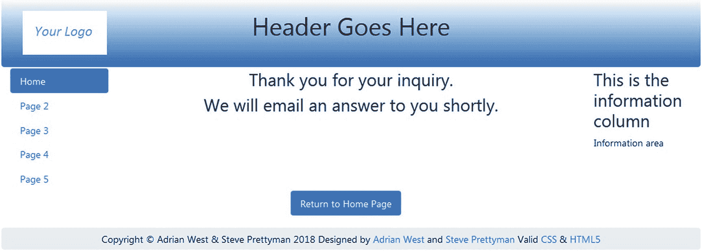

图 7-7

“谢谢”页面消息

```php
<!DOCTYPE html>
<html lang="en">
<head>
  <title>Thank you for your inquiry</title>
  <meta charset="utf-8">
  <meta name="viewport" content=
      "width=device-width, initial-scale=1, shrink-to-fit=no">
  <!-- Bootstrap CSS File -->
  <link rel="stylesheet"
      href=
"https://stackpath.bootstrapcdn.com/bootstrap/4.1.0/css/bootstrap.min.css"
      integrity=
"sha384-9gVQ4dYFwwWSjIDZnLEWnxCjeSWFphJiwGPXr1jddIhOegiu1FwO5qRGvFXOdJZ4"
      crossorigin="anonymous">
</head>
<body>
<div class="container" style="margin-top:30px">
<!-- Header Section -->
<header class="jumbotron text-center row"
      style=
"margin-bottom:2px; background:linear-gradient(white, #0073e6);
       padding:20px;">
       <?php include('../includes/thankyou-header.php'); ?>
</header>
<!-- Body Section -->
<div class="row" style="padding-left: 0px;">
<!-- Left-side Column Menu Section -->
  <nav class="col-sm-2">
      <ul class="nav nav-pills flex-column">
                <?php include('../includes/nav.php'); ?>
      </ul>
  </nav>
<!-- Center Column Content Section -->

<div class="col-sm-8">
<h3 class="text-center" >Thank you for your inquiry.</h3>
<h3 class="text-center" >We will email an answer to you shortly.</h3>
</div>
<!-- Right-side Column Content Section -->
        <aside class="col-sm-2">
                 <?php include('../includes/info-col.php'); ?>
        </aside>
  </div>
<div class="row col-sm-12" style="padding-left: 0px;  padding-bottom: 20px;">
<div class="col-sm-5"></div>
<nav class="col-sm-4 text-center">
<ul class="nav nav-pills">
<li class="nav-item">
          <a class="nav-link active" href="index.php">Return to Home Page</a>
</li>
</ul>
</nav>
</div>
<!-- Footer Content Section -->
<footer class="jumbotron text-center row"
style="padding-bottom:1px; padding-top:8px;">
  <?php include('../includes/footer.php'); ?>
</footer>
</div>
</body>
</html>

Listing 7-7aCreating the “Thank You” Page (thankyou.php)

```

如果电子邮件未成功发送，将会出现一条说明性的错误消息。

为什么要使用错误页面而不是将一段文本回显到屏幕上？我们发现，我们的许多客户更喜欢独特的信息和页面提供的帮助，而不是常见的红色小错误信息，这些信息可能会被忽略或过于简短。如果您更喜欢将消息回显到页面，可以创建一个$error 数组来保存消息，就像我们在注册页面中所做的那样。

清单 [7-7b](#PC19) 提供了空字段或无效字段的错误消息代码。

```php
<!DOCTYPE html>
<html lang="en">
<head>
  <title>Error Message</title>
  <meta charset="utf-8">
  <meta name="viewport" content=
        "width=device-width, initial-scale=1, shrink-to-fit=no">
  <!-- Bootstrap CSS File -->
  <link rel="stylesheet"
  href=
"https://stackpath.bootstrapcdn.com/bootstrap/4.1.0/css/bootstrap.min.css"
  integrity=
"sha384-9gVQ4dYFwwWSjIDZnLEWnxCjeSWFphJiwGPXr1jddIhOegiu1FwO5qRGvFXOdJZ4"
  crossorigin="anonymous">
</head>
<body>
<div class="container" style="margin-top:30px">
<!-- Header Section -->
<header class="jumbotron text-center row"
        style=
"margin-bottom:2px; background:linear-gradient(white, #0073e6);
        padding:20px;">
        <?php include('../includes/thankyou-header.php'); ?>
</header>
<!-- Body Section -->
<div class="row" style="padding-left: 0px;">
<!-- Left-side Column Menu Section -->
  <nav class="col-sm-2">
      <ul class="nav nav-pills flex-column">
                <?php include('../includes/nav.php'); ?>
      </ul>
  </nav>
<!-- Center Column Content Section -->
<div class="col-sm-8">
<h4 class="text-center">
One or more of the essential items in the form has not been filled in.</h4>
<h4 class="text-center">
Essential items have an asterisk like this <span>*</span></h4>
<h4 class="text-center">
Return to the form by clicking the back button on your browser<br>
        and then fill in the missing items.</h4>

</div>
<!-- Right-side Column Content Section -->
       <aside class="col-sm-2">
       <?php include('../includes/info-col.php'); ?>
       </aside>
</div>
<!-- Footer Content Section -->
<footer class="jumbotron text-center row"
style="padding-bottom:1px; padding-top:8px;">
  <?php include('../includes/footer.php'); ?>
</footer>
</div>
</body>
</html>

Listing 7-7bCreating the Page for Empty Field Errors (error.php)

```

其他错误页面包含与此示例类似的格式，此处未列出。您可以从本章的下载文件中查看它们。

### 注意

您需要在主菜单中再添加一个按钮(*包含/nav.php* )。给按钮贴上*联系我们*的标签，并将其链接到文件 *feedback_form.php* 。

## 公共标题

你可能已经注意到，我们已经为我们的单个文件开发了许多标题。通过创建一个包含 case 语句的通用标题，我们可以有选择地处理在一个标题中显示的所有按钮决定。让我们看看清单 [7-8](#PC20) 中的代码。

```php
<div class="col-sm-2">

</div>
<div class="col-sm-8">
         <h1 class="blue-text mb-4 font-bold">Header Goes Here</h1>
 </div>
     <nav class="col-sm-2">
           <div class="btn-group-vertical btn-group-sm" role="group"
                   aria-label="Button Group">
           <div class="btn-group-vertical btn-group-sm" role="group"
                   aria-label="Button Group">
  // Case statement to determine which buttons to display                                #1
          <?php
          switch ($menu) {
          case 1: //header.php
          ?>
                    <button type="button" class="btn btn-secondary"
                    onclick="location.href = 'login.php'" >Login</button>
                    <button type="button" class="btn btn-secondary"
                    onclick="location.href =
                            'safer-register-page.php'">Register</button>

          <?php
        break;

          case 2: //header_members_account.php

          ?>
                    <button type="button" class="btn btn-secondary"
                             onclick="location.href = 'logout.php'" >Logout</button>
                    <button type="button" class="btn btn-secondary"
                             onclick="location.href = 'edit_your_account.php'">
                                     Your Account</button>
          <button type="button" class="btn btn-secondary"
                          onclick="location.href =
                          'safer-register-password.php'">New Password</button>
   <?php
    break;

 case 3: // header-thanks.php
    ?>
                   <button type="button" class="btn btn-secondary"
                            onclick="location.href = 'index.php'" >Cancel</button>
  <?php
     break;

case 4: // login-header.php
        ?>
                   <button type="button" class="btn btn-secondary"
                            onclick="location.href = 'login.php'" >
                                    Erase Entries</button>
                   <button type="button" class="btn btn-secondary"
                   onclick="location.href =
                           'safer-register-page.php'">Register</button>
           <button type="button" class="btn btn-secondary"
                   onclick="location.href = 'index.php'">Cancel</button>
<?php
   break;

case 5: //; members-header.php
        ?>
                 <button type="button" class="btn btn-secondary"
                          onclick="location.href = 'logout.php'" >Logout</button>
            <button type="button" class="btn btn-secondary"
                     onclick="location.href = 'change-password.php'" >
                             New Password</button>

<?php
    break;

case 6: //password-header.php
        ?>
                 <button type="button" class="btn btn-secondary"
                          onclick="location.href = 'register-password.php'" >
                          Erase Entries</button>
          <button type="button" class="btn btn-secondary"
                          onclick="location.href = 'index.php'">Cancel</button>
<?php
    break;

case 7: //password-header.php
       ?>
                 <button type="button" class="btn btn-secondary"
                 onclick="location.href = 'index.php'" >Home Page</button>
<?php
   break;

case 8: //thankyou-header.php
        ?>
                 <!-- <button type="button" class="btn btn-secondary"
                 onclick="location.href = 'index.php'" >Home Page</button>-->
<?php
   break;
case 9: //register-header.php
        ?>
                   <button type="button" class="btn btn-secondary"
                            onclick="location.href = 'register-page'" >
                           Erase Your Entries</button>
                   <button type="button" class="btn btn-secondary"
                            onclick="location.href = 'index.php'">Cancel
                            </button>
<?php
    break;
}
?>
</div>
</nav>

Listing 7-8Creating a Universal Header (header1.php)

```

### 代码的解释

本节解释代码。

```php
// Case statement to determine which buttons to display                                  #1
       <?php
       switch ($menu) {
       case 1: //header.php
         ?>
                 <button type="button" class="btn btn-secondary"
                 onclick="location.href = 'login.php'" >Login</button>
                 <button type="button" class="btn btn-secondary"
                 onclick="location.href =
                         'safer-register-page.php'">Register</button>

       <?php
        break;

```

检查变量$menu 以确定在标题中显示哪个按钮组合。要使用这个公共头文件，每个文件中必须有两处更改。

1.  必须在文件中创建一个变量，保存与要显示的一组按钮相对应的数字。例如，在文件*index.php*中，可以将以下代码添加到文件的顶部:

    ```php
    <?php
            $menu = 1;
    ?>

    ```

2.  拉入标头的 include 语句也必须更新，以包含新的标头。例如，在*index.php*文件(以及所有要更新的文件)中，更新代码如下所示:

    ```php
    include("include/header1.php");

    ```

本章中的文件尚未更新为包括通用标题。但是，用户可以使用前面的步骤更新它们。关于通用标题的使用示例，请查看从第 [11](11.html) 章下载的文件。

## 记录异常和错误

在几个章节中，我们已经包含了使用 catch 块处理异常和错误的能力。然而，我们除了显示一条通用消息之外什么也没做。为了完成我们的应用，我们应该提供在出现问题时得到通知的能力。提供这种能力的最简单方法是将错误消息放在日志文件中。PHP 应用可以将消息记录到默认的 PHP 错误文件或特定于应用的文件中。对于一个应用来说，为信息日志、身份验证(登录)日志、错误日志和安全日志创建单独的文件是很常见的。您可以在程序代码的顶部创建一个常数来指示日志文件的位置。这允许任何支持您的代码的人快速确定文件的位置，并允许他们在需要时轻松地更改位置。

```php
define(ERROR_LOG,"errors.log");

```

使用这个常量，我们可以使用 error_log 函数将错误信息发送到日志文件。

```php
error_log("A general error",3,ERROR_LOG);

```

这将把显示的消息直接发送到 *errors.log* 文件。然而，这并没有给我们足够的有意义的信息。例如，我们可能希望包含事件发生的时间和日期，以及一个指示消息类型的标题。

```php
$date = date('m.d.y h:i:s');
$errormessage = "This is the error";
$eMessage = $date . " | User Error | " . $errormessage . "\n";
error_log($eMessage,3,ERROR_LOG);

```

该代码将产生以下内容:

```php
07.04.2018 03:00:55 | User Error | This is the error

```

可以使用标准文本编辑器(Notepad++)或日志监控软件程序来查看日志文件的内容。

PHP 还使得在日志文件中写入内容时发送电子邮件警报变得容易。当然，您的文件必须存在于包含电子邮件服务器的服务器上。我们可以将电子邮件信息添加到另一个 error_log 语句中，如下所示:

```php
error_log("Date/Time: $date – Serious Problem. Check error log for details", 1 , noone@helpme.com, "Subject: User Errors \nFrom: Error Log <errorlog@helpme.com>" . "\r\n");

```

第一个参数指定电子邮件的消息。第二个参数通知 error_log 通过电子邮件发送该信息。第三个参数提供“收件人”电子邮件地址。第四个参数是一个额外的头字段。该字段通常用于包含电子邮件的主题和发送邮件的电子邮件地址。必须包含“发件人”地址，否则邮件将不会被发送。

在本章的下载代码中，我们包含了 error_log 代码，用于将错误发送到 error_log，并在出现问题时发送电子邮件。下面显示了这段代码:

```php
catch(Exception $e) // We finally handle any problems here
   {
     // print "An Exception occurred. Message: " . $e->getMessage();
     print "The system is busy please try later";
     $date = date('m.d.y h:i:s');
     $errormessage = $e->getMessage();
     $eMessage = $date . " | Exception Error | " , $errormessage . |\n";
     error_log($eMessage,3,ERROR_LOG);
     // e-mail support person to alert there is a problem
     error_log("Date/Time: $date – Exception Error, Check error log for
           details", 1, noone@helpme.com, "Subject: Exception Error \nFrom: Error Log
           <errorlog@helpme.com>" . "\r\n");
   }

```

Error catch 块的格式是类似的，不同之处在于更改了标题以指示它是一个错误而不是异常。我们还可以更改它，将错误保存在不同的日志文件中。这段代码在下载文件中被注释掉，直到您准备好使用它。

既然您已经有了内置的异常处理和错误处理，那么在将您的程序升级到产品之前，您需要编辑 *php.ini* 文件来关闭对用户的错误报告。

准备好之后，您需要找到 *php.ini* 配置文件。在 XAMPP，你可以通过进入控制面板并点击 Apache 服务器右侧的 config 按钮来轻松找到该文件，如图 [7-8](#Fig8) 所示。

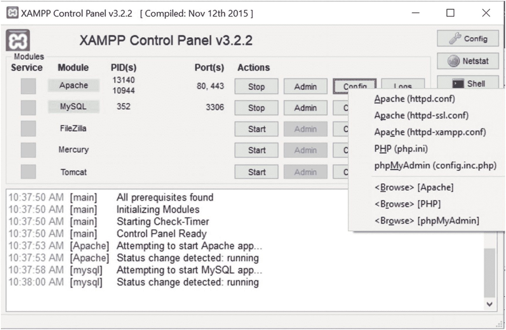

图 7-8

查找 php.ini 配置文件

点击 *php.ini* 菜单选项将其打开。对于 easyPHP，您必须深入开发服务器文件夹才能找到 *php.ini* 文件。它应该位于与此处所示链接类似的位置:

```php
C:\Users\yourcomputername\EasyPHP-Devserver-17\EasyPHP-Devserver-17\eds-binaries\php\php713vc14x86x170718155219

```

当然，您的版本名称和内部版本号将与显示的不同。找到文件后，用 Notepad++或其他文本编辑器打开它。

立即用另一个名称保存当前版本的配置文件(并记住保存的位置),以防出错并需要恢复到原始设置。

找到这一行:display_errors = On。将设置更改如下:display_errors = Off。保存文件。然后关闭再打开 Apache 服务器。您的错误消息现在应该被定向到错误日志，而不是网页。当然，这不包括为用户创建的带有 echo 语句的任何错误消息(如您的电子邮件丢失)。

现在，我们可能已经准备好将文件移动到远程生产服务器。让我们来看看实现这一点的过程。

## 将数据库和表迁移到远程主机

使用 phpMyAdmin 创建了数据库和表之后，我们如何将它们转移到托管公司？将数据库从 XAMPP 或 easyPHP 迁移到远程主机的过程比数据库开发的任何其他方面都更让初学者担心。这是因为 MySQL/MariaDB 手册和互联网教程很少对该过程提供适当的解释。

对于本教程，我们选择使用 finalpostal 数据库，它包含在本章附带的 *users.sql* 文件中。

### 警告

您需要确定您选择的主机软件包中使用的操作系统。Linux 和 Windows 需要稍微不同的迁移过程。

### 令人困惑的错误信息

尝试将数据库传输到另一台计算机时，您可能会偶尔遇到问题。有时会出现一条错误消息，指出该表已经存在。这很奇怪，因为空数据库中肯定没有表。解决方法是访问第一台电脑上的 *XAMPP* 或 *easyPHP* 文件夹，然后深入到 *MySQL/MariaDB* 文件夹，然后是*数据*文件夹。在闪存盘(记忆棒)或云中保存一份 *somefilename.frm* 文件的副本。现在将该文件复制到目标计算机上的相同数据文件夹中，问题就解决了。你应该定期保存 **的副本。frm* 文件以及 SQL 转储，以防在数据库损坏后需要恢复数据。对于其他错误消息，将消息复制并粘贴到搜索引擎(如 Google)中，以发现建议的解决方案。

### 创建和导出 SQL 文件

迁移数据库的第一阶段包括创建 SQL 导出文件。您将能够导出两种类型的转储:仅针对表，或者针对数据库和表。我们将使用只包含表格的文件。如果数据库很大，应该单独导入表。我们将使用 phpMyAdmin 来导出文件。导出的 SQL 文件是一个简单的文本文件，名称格式为 *filename.sql* ，尽管也可以为导出的文件选择其他文件类型。接下来将解释文件的内容和过程。

#### 创建一个或多个表的转储文件

打开浏览器，在地址栏输入**http://localhost/phpmyadmin/**。

在 phpMyAdmin 的左侧面板中，单击包含要导出的表的数据库。然后点击导出选项卡，显示如图 [7-9](#Fig9) 所示的页面。

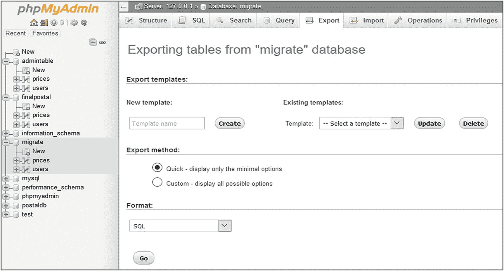

图 7-9

转储数据库表的屏幕

选择“快速”选项，并确保格式为 SQL。然后单击“开始”按钮。根据您的浏览器和设置，会询问您是打开还是保存文件，如图 [7-10](#Fig10) 所示。

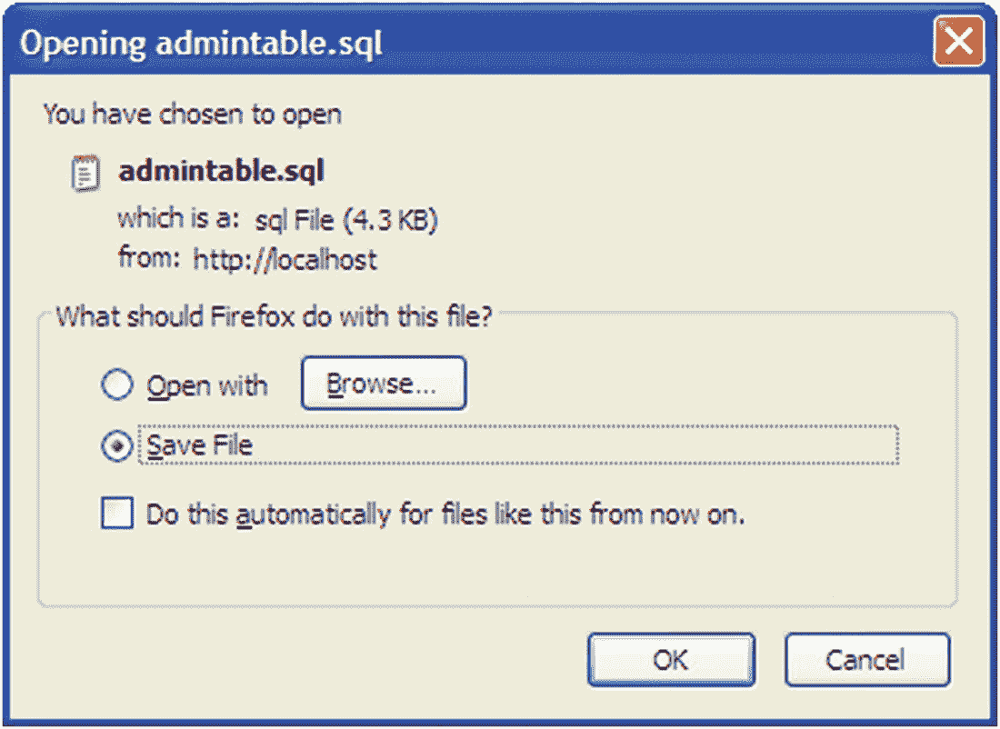

图 7-10

选择保存 SQL 文件

选择保存文件，然后单击确定。将文件保存在您可以访问的文件夹中，以便稍后将其上传到主机。在 Windows 中，所有下载文件的默认位置是*下载*文件夹。

#### SQL 转储看起来像什么？

在您的文本编辑器(例如 Notepad++)中检查 *users.sql* 文件。

您将看到许多注释掉的行。SQL 支持如下三种注释样式:

*   以如下散列符号开头的行:# *一些文本*

*   一行以双破折号开头，后面跟一个空格，像这样:- *一些文本*

*   标签之间的文本块，如下所示:

    ```php
    /*some text
    some text
    some text*/

    ```

下面显示了 finalpostal 数据库中表的转储示例(您的转储可能略有不同)。这是章节文件提供的 *users.sql* 文件中的代码。

```php
-- phpMyAdmin SQL Dump
-- version 4.8.0
-- https://www.phpmyadmin.net/
--
-- Host: 127.0.0.1
-- Generation Time: Dec 31, 2017 at 06:40 PM
-- Server version: 10.1.22-MariaDB
-- PHP Version: 7.1.4

```

此代码指定原始计算机上应用的版本。这是仅供参考，并在评论中。

```php
SET SQL_MODE = "NO_AUTO_VALUE_ON_ZERO";
SET AUTOCOMMIT = 0;
START TRANSACTION;
SET time_zone = "+00:00";

/*!40101 SET @OLD_CHARACTER_SET_CLIENT=@@CHARACTER_SET_CLIENT */;
/*!40101 SET @OLD_CHARACTER_SET_RESULTS=@@CHARACTER_SET_RESULTS */;
/*!40101 SET @OLD_COLLATION_CONNECTION=@@COLLATION_CONNECTION */;
/*!40101 SET NAMES utf8mb4 */;

```

请注意，utf8 版本包含在这些注释中:

```php
--
-- Database: `finalpost`
--

-- --------------------------------------------------------

--
-- Table structure for table `prices`

--

CREATE TABLE `prices` (
  `oneyeargb` decimal(6,0) UNSIGNED NOT NULL,
  `oneyearus` decimal(6,0) UNSIGNED NOT NULL,
  `fiveyeargb` decimal(6,0) UNSIGNED NOT NULL,
  `fiveyearus` decimal(6,0) UNSIGNED NOT NULL,
  `militarygb` decimal(6,0) UNSIGNED NOT NULL,
  `militaryus` decimal(6,0) UNSIGNED NOT NULL,
  `u21gb` decimal(6,0) UNSIGNED NOT NULL,
  `u21us` decimal(6,0) UNSIGNED NOT NULL,
  `minpricegb` decimal(6,0) UNSIGNED NOT NULL,
  `minpriceus` decimal(6,0) UNSIGNED NOT NULL
) ENGINE=InnoDB DEFAULT CHARSET=utf8;

```

这是创建价格表的实际 SQL 代码:

```php
--
-- Dumping data for table `prices`
--

INSERT INTO `prices` (`oneyeargb`, `oneyearus`, `fiveyeargb`, `fiveyearus`, `militarygb`, `militaryus`, `u21gb`, `u21us`, `minpricegb`, `minpriceus`) VALUES
('30', '40', '125', '140', '5', '8', '2', '3', '15', '20');

```

这是将数据加载到价格表中的 SQL 代码:

```php
-- --------------------------------------------------------

--
-- Table structure for table `users`
--

CREATE TABLE `users` (
  `userid` mediumint(6) UNSIGNED NOT NULL,
  `title` tinytext NOT NULL,
  `first_name` varchar(30) NOT NULL,
  `last_name` varchar(40) NOT NULL,
  `email` varchar(50) NOT NULL,
  `password` char(60) NOT NULL,
  `registration_date` datetime NOT NULL,
  `class` char(20) NOT NULL,
  `user_level` tinyint(2) UNSIGNED NOT NULL,
  `address1` varchar(50) NOT NULL,
  `address2` varchar(50) DEFAULT NULL,
  `city` varchar(50) NOT NULL,
  `state_country` char(25) NOT NULL,
  `zcode_pcode` char(10) NOT NULL,
  `phone` char(15) DEFAULT NULL,
  `paid` enum('No','Yes') NOT NULL,
  `secret` varchar(30) DEFAULT NULL
) ENGINE=InnoDB DEFAULT CHARSET=utf8;

```

下面是创建用户表的代码:

```php
--
-- Dumping data for table `users`
--

INSERT INTO `users` (`user_id`, `title`, `first_name`, `last_name`, `email`, `password`, `registration_date`, `class`, `user_level`, `address1`, `address2`, `city`, `state_country`, `zcode_pcode`, `phone`, `paid`) VALUES
(1, 'Mr', 'Mike', 'Rosoft', 'miker@myisp.com', '$2y$10$UiiBhmXca.0/bwopveFq8uInuX.EVrecinUQYQG546WjAWwZLJNoe', '2017-12-06 08:43:41', '30', 0, '4 The Street', 'The Village', 'Townsville', 'USA', 'WA', '0123777888', 'Yes'),
 (32, 'Mr', 'James', 'Smith', 'jsmith@myisp.co.uk', '$2y$10$Yu.c/cw/TSFa9vcMBGAfAe5vzyOwp3SZarBVc/9vEksfp.F8BzSiW', '2017-12-29 11:58:51', '30', 0, '2 The Street', ", 'Townsville', 'UK', 'EX24 6PS', '01234777888', 'Yes');

```

前面的代码将数据加载到 users 表中。为了节省空间，只显示第一条和最后一条记录。

```php
--
-- Indexes for dumped tables
--

--
-- Indexes for table `users`
--
ALTER TABLE `users`
  ADD PRIMARY KEY (`userid`);

```

这段代码将 user_id 定义为主键:

```php
--
-- AUTO_INCREMENT for dumped tables
--

--
-- AUTO_INCREMENT for table `users`
--
ALTER TABLE `users`
  MODIFY `user_id` mediumint(6) UNSIGNED NOT NULL AUTO_INCREMENT, AUTO_INCREMENT=35;COMMIT;

```

此代码将主键优化为原始设计中要求的设置:

```php
/*!40101 SET CHARACTER_SET_CLIENT=@OLD_CHARACTER_SET_CLIENT */;
/*!40101 SET CHARACTER_SET_RESULTS=@OLD_CHARACTER_SET_RESULTS */;
/*!40101 SET COLLATION_CONNECTION=@OLD_COLLATION_CONNECTION */;

```

接下来的步骤完成了以下工作:

*   检查目标服务器(主机)并准备接收 SQL 文件和 *htdocs* 或 *eds-www* 文件夹的内容

*   将 SQL 文件(或使用远程主机上的导入功能)和网站文件上传到主机

*   在主机中使用 phpMyAdmin 导入 SQL 文件

#### 调查远程主机的服务器

我们将假设您已经为您的网站购买了空间，并向您的主机提供商或另一方注册了域名。许多提供商允许您选择使用 Linux/Unix 或 Microsoft web 服务器的托管包。虽然许多网站托管在 Unix 服务器上，但这是一种常见的偏好；这不是一个要求。

在选择您的主机提供商之前，确保他们提供的包包括 PHP、phpMyAdmin 和 MySQL(或 MariaDB)。此外，特别是如果您选择 Unix 操作系统，请确保提供了 Apache。PHP 和 MySQL 现在也可以与微软的网络服务器接口。但是，主机提供商可以选择将 Apache 与 Microsoft 服务器一起使用，就像您可能已经在计算机上实现的那样。如果您不确定主机上是否安装了 PHP 和 MySQL(或 MariaDB)，请在文本编辑器中键入以下内容，并将其另存为*phpinfo.php*:

```php
<?php
phpinfo();
?>

```

您可能希望将这个 phpinfo 文件保存在一个安全的位置，或者在测试后删除它，以防止任何人看到您的服务器上安装了什么。

使用您的 FTP 客户端，或主机提供的上传文件的过程，加载此文件，然后在浏览器中打开它(输入类似 [`http://yourwebsitename.com/phpinfo.php`](http://yourwebsitename.com/phpinfo.php) 的 URL)。你会看到一个如图 [7-11](#Fig11) 所示的表格。向下滚动表格，您应该会看到主机服务器上 MySQLi 安装的详细信息。如果你看到安装了 MySQLi 的一个版本并且运行了这个程序，那么你应该能够上传并运行这本书里的程序。

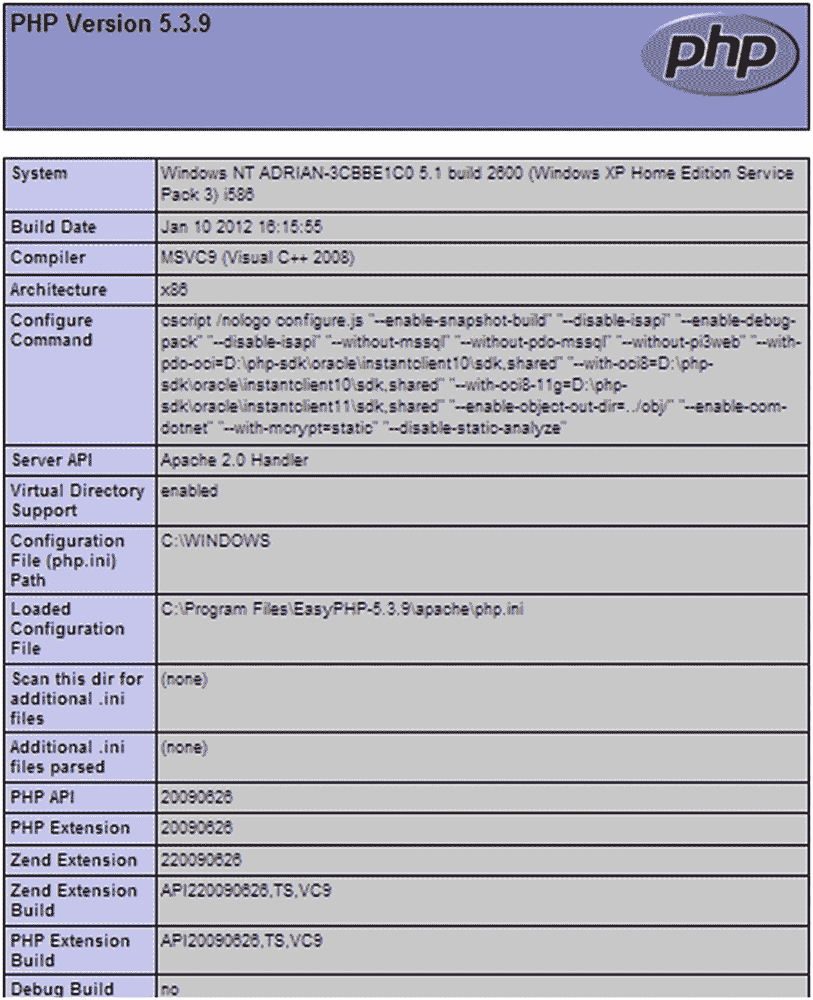

图 7-11

在服务器中打开 phpinfo.php 的结果

### 警告

一些基本的主机包不接受数据库。在这种情况下，您必须升级到更贵的产品包。继续之前，请检查您的目标主机上的产品范围。

### 在远程主机的服务器上使用 GUI

阅读文档或联系您的主机提供商的服务代表，以确定如何访问 phpMyAdmin 或类似类型的程序来创建、上传和修改 MySQL/MariaDB 数据库。您的主机提供商可能包括一个控制面板，如图 [7-12](#Fig12) 所示，或者可能提供另一种方式来访问 phpMyAdmin。

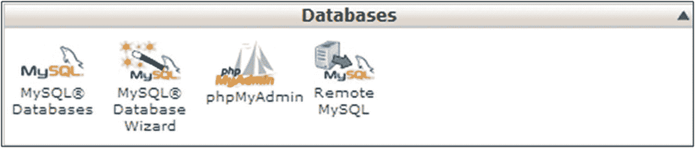

图 7-12

控制面板的数据库部分

要安装数据库，请按照下列步骤操作:

*   打开 phpMyAdmin 并创建一个空数据库。在本例中，我们将创建 finalpostal 数据库。

当创建 finalpostal 数据库时，要么生成的数据库将具有名称 finalpostal，要么主机将向数据库名称添加前缀。添加前缀的主机几乎总是附加网站所有者的用户 ID 来访问控制面板。我们假设所有者的用户 ID 是 mywebsite 主机可能会将数据库名称创建为 *mywebsite_finalpostal* 。在这个例子中，我们将假设数据库名有前缀*我的用户名*。

*   现在，您必须立即通过创建用户 ID 和密码来保护新创建的数据库。如前几章所述，通过使用 phpMyAdmin 来实现这一点。(有些主机会自动提供用户 ID，如果是这种情况，请使用那个。)

使用以下详细信息创建用户:

*   *用户*:站长(或主持人提供的名字)

*   *密码* : c0ff33p0t

*   *主机*:(您的网站 URL 的名称)

真实世界数据库中的密码肯定比 *c0ff33p0t* 复杂得多。仔细记下数据库名称、密码和用户。

### 连接到远程主机上的数据库

现在我们知道了空数据库的名称(在本例中，它是 myusername_finalpostal)，我们可以修改连接文件以适合远程主机。不要在你电脑上的 XAMPP 的 htdocs 或 easyPHP 的 eds-www 文件夹中创建这个文件。如果这样做，您将无法再从计算机服务器上的数据库驱动页面访问 finalpostal 数据库。使用记事本++等文本编辑器创建文件，并将新的 *mysqli_connect.php* 文件存储在除 *htdocs* 或 *eds-www* 文件夹之外的任何位置。修改后的文件不包含在可下载文件中，因为它对于您的数据库来说是唯一的。代码可能如下一段代码所示。

*连接到新数据库的代码片段(mysqli_connection.php)*

```php
<?php
// Create a connection to the admintable database and set the encoding
// The user name might be provided by the host.
// If not, use the name from your XAMPP version
Define ('DB_USER', 'webmaster');
Define ('DB_PASSWORD', 'c0ff33p0t');
Define ('DB_HOST', 'www.yourwebsite.com');
Define ('DB_NAME', 'myusername_admintable');
// Make the connection
$dbcon = new mysqli(DB_HOST, DB_USER, DB_PASSWORD, DB_NAME);
// Set the encoding...optional but recommended
mysqli_set_charset($dbcon, 'utf8');

```

现在，您已经具备了将数据库驱动的网站迁移到远程主机所需的以下所有项目:

*   向远程主机注册的帐户和域名

*   位于主机服务器上的新创建的空数据库

*   表的 SQL 转储文件

*   包含的文件夹和包含图像的文件夹

*   修改后的 *mysqli_connect.php* 文件

主 PHP 和 HTML 文件在上传之前需要修改，这个修改将在下一节描述。

### 安全上传 *mysqli_connection.php* 文件

为了获得最高的安全性，数据库连接文件应该位于根文件夹之外。然后，该文件不能通过网站直接访问。请确保它所在的文件夹是安全的，不会被外部访问。

大多数托管公司都提供使用 FTP 程序上传和更改服务器上文件的能力。有很多免费的 FTP 程序可用，包括 FileZilla ( [`https://filezilla-project.org/`](https://filezilla-project.org/) )。适用于您网站的 FTP 程序设置将取决于托管公司提供的安全设置。您还需要一个用户 ID、密码(该密码可能与访问您的主机帐户的普通用户 ID 和密码不同)，以及您的 URL 或 TCP/IP 地址。您将被限制只能访问您的文件夹和文件。图 [7-13](#Fig13) 显示了一个示例 FTP 窗口，它包括一个 Linux/Unix 远程主机的典型文件夹结构。

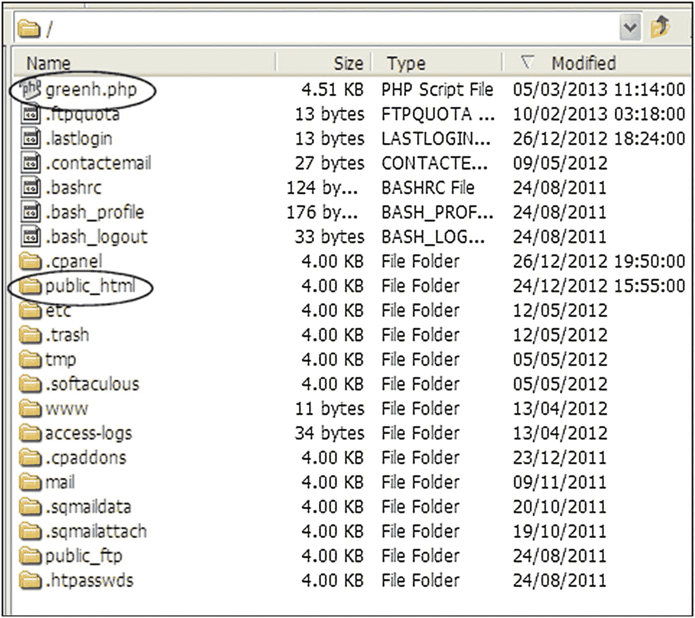

图 7-13

FTP 程序窗口中显示的 Linux/Unix 环境的典型文件和文件夹

在图 [7-13](#Fig13) 中，数据库连接文件(圈起来的)已经被重命名为【greenh.php】的*并上传到 *public_html* 根文件夹(圈起来的)之外。该文件夹存在于 Linux/Unix 操作系统中，用于存放向公众显示的任何网站。在微软网络服务器上，这个文件夹可能被命名为 *www* 、 *htdocs* 或类似的名称。您网站的用户将无法访问不在公共文件夹中的任何文件( *public_html* )。您的主机也可能只允许您访问该公共文件夹，而不允许您访问根级别，如图 [7-13](#Fig13) 所示。*

如果你可以在主机上的公共文件夹( *public_html* )之外找到连接文件(*greenh.php*),那么你当前的交互页面都找不到它。要解决这个问题，使用您的代码编辑器打开每个包含一个 *mysqli_connect.php* 链接的文件，并运行一个查找并替换所有链接的操作来修改它的位置，如下所示。

找到 *mysqli_connect.php* ，替换成*../greenh.php* 。符号*../* 告诉页面该文件位于当前文件夹的上一层。为了连接到您自己的计算机/服务器上的数据库，您可能使用了 require(' mysqli _ connect . PHP ')；如本书的示例文件中所提供的。请记住，用户通常不会看到连接文件的链接，因为任何 PHP 代码都是在服务器上执行的，只有结果(比如从数据库中提取的信息)才会显示给用户。然而，我们确实希望尽可能地安全，以防意外发生。

现在，连接文件更安全了，交互页面也相应地进行了修改，您可以将 HTML、CSS 和 PHP 页面上传到远程主机。

### 将交互式页面上传到主机

最后的步骤如下:

*   保存您网页的公共文件夹不包括 *htdocs* 或 *eds-www* 文件夹。这些文件夹名称特定于用于创建页面的开发包(XAMPP 或 EasyPHP)。在真实环境中，实际的文件夹名称不是必需的。web 服务器知道所有公共可用的网页都驻留在公共文件夹中( *public_html* 、 *www* 或 *htdocs* )。因此，您需要使用 FTP 客户端(FileZilla)将 HTML、CSS 和 PHP 页面从 finalpostal 的 *htdocs* 或 *eds-www* 文件夹上传到主机服务器的 public 文件夹中。因为您已经上传了一个经过修改并重命名的 *mysqli_connect.php* 文件，所以请注意不要上传未经修改的版本。现在，使用您的 FTP 客户端在您的公共文件夹中创建一个子文件夹(如 SQL)。上传将用于将表安装到数据库中的 SQL 文件。

*   在远程服务器上打开并登录 phpMyAdmin(或类似的主机提供的程序)。

*   在 phpMyAdmin 的左侧面板中，单击新创建的空数据库的名称，然后单击 Import 选项卡。

*   将要求您选择要导入的 SQL 文件。浏览到 *public_html* 文件夹，然后到子文件夹( *SQL* ，找到每个上传的 SQL 文件。打开它(或它们),然后点按“前往”。

*   您的公共文件夹可能有一个默认的*index.html*文件。你的新的 index.php*文件必须替换 HTML 文件；否则，【index.html】的*将代替你的*index.php*文件载入。将主机上的*index.html*文件重命名为*old-index.html*或将其删除。web 服务器将搜索具有不同扩展名的所有索引文件。如果找到带有*的索引文件。html* 扩展名，它将尝试将该文件显示为网站的主页。如果该文件不存在，它将寻找其他索引文件，如*index.php*。

现在，通过在浏览器的地址栏中键入您网站的 URL，可以在线查看您上传的交互式网站。请注意，如果您决定将文件加载到子文件夹中，而不是直接加载到公共文件夹中，请在 URL 中包含该文件夹的名称，例如 [`http://yourwebsite.com/finalpostal/`](http://yourwebsite.com/finalpostal/) 。你应该看到你的主页，从那里你可以测试网站。确保测试所有与数据库交互的页面，以确保数据库连接正确。

请注意，您可能需要等待一些主机更新它们的服务器缓存(内存)来显示您的网页更改。使用域名系统(DNS)服务器显示网页。这些服务器将网站名称转换为实际的 TCP/IP 数字地址，该地址唯一地标识了您网站的位置。如果您更改了您的 URL 地址或索引页面，DNS 服务器也会逐渐更新这些信息。

与任何计算机工作一样，备份是预防硬件或软件故障的必要措施。如果您发现一些主要的编码问题，这些备份文件还将提供回滚到文件的早期版本的能力。

## 备份您的数据库

当你学习创建和使用数据库和使用数据库的网站时，这四个步骤是必不可少的:

1.  继续在你的笔记本或软件笔记系统上写东西。

2.  请务必更新您的流程图。

3.  使用 phpMyAdmin 中的 Export 选项卡来备份您的表。

4.  备份你的 *htdocs* 或 *eds-www* 文件夹。

记录用户名和密码等重要步骤和细节可以省去很多悲伤。当创建许多实验数据库和这些数据库的变体时，您不可能记住每个数据库的细节。此外，你不会记得每天(或每周)所做的所有改变。记录下你已经完成的每个阶段的细节，以及你下一步打算做什么。如果你必须停下来一段时间(可能是为了更新其他客户的网站)，这一点尤其重要。客户似乎从不单独请求更新；他们成群结队而来，四五个客户同时吵着要更新。

还要记录有用的网站网址。如果你在一本书或博客上看到一个有用的提示，把它记下来。这可以让你不用再翻遍书架或博客来寻找物品。回环笔记本是理想的选择，因为你可以插入分隔条来帮助你找到你写下重要信息的地方。但如果你不是老派，电子笔记本也将是一个不错的选择。

对于备份，使用 phpMyAdmin(或者您的主机提供的数据库管理系统)从每个数据库中导出表的 SQL 转储。然后将它们保存到 USB 闪存驱动器或其他云位置，以便在表损坏的情况下，可以从已知的良好时间框架中恢复表。

在闪存驱动器或云驱动器上制作一份 *htdocs* 或 *eds-www* 文件夹的副本，这样你就有了最新版本的成功且经过测试的网页。将它们(以及您的 SQL 文件)存储在多个位置，这样当硬盘或操作系统出现故障时，您就不会受到影响。此外，考虑在另一台计算机上创建一个 XAMPP 或 easyPHP 环境。额外的工作是保持网站的每个副本都是最新的，但是如果一台电脑坏了，你可以在另一台电脑上继续工作。内心的平静是一件美好的事情。

你还应该设置每个网站主机提供的自动备份系统，以确保你的数据自动备份，并可以在发生意外时自动恢复。

## 摘要

在这一章中，我们加入了客户和会员秘书建议的一些最后的改进。这些措施包括允许注册会员更新自己的资料。客户还要求提供网站的询价单。对网站的所有这些新增内容都进行了描述和列出。本章提供了一些你可以添加到你的网站的额外功能，包括记录错误的能力。本章最后完整描述了将数据库迁移到主机和备份数据库表的过程。

在下一章中，我们将学习如何为房地产代理商创建产品目录。