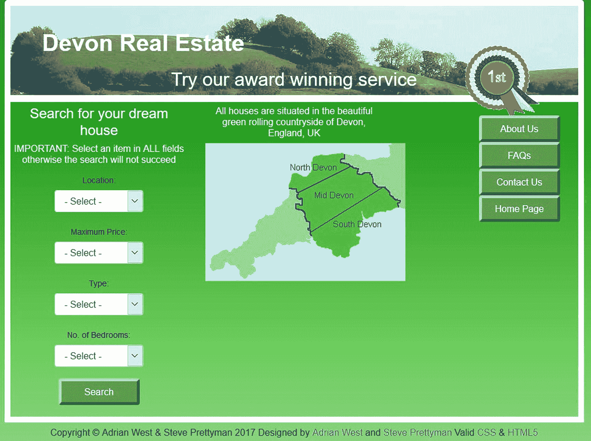
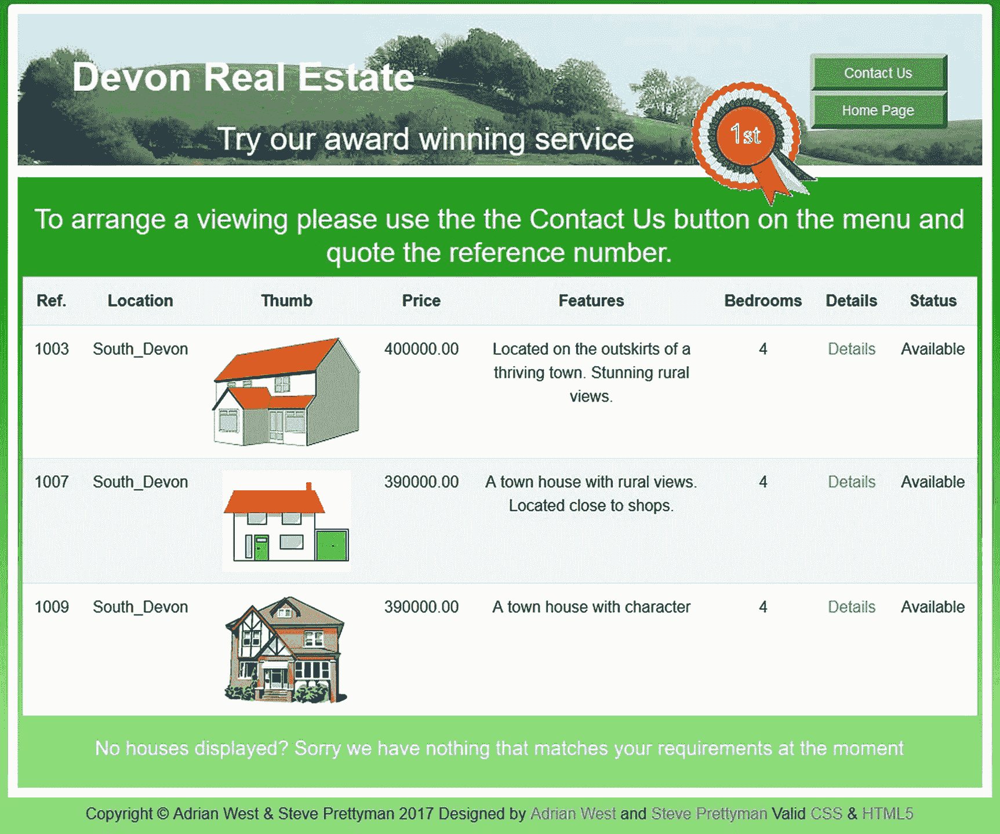
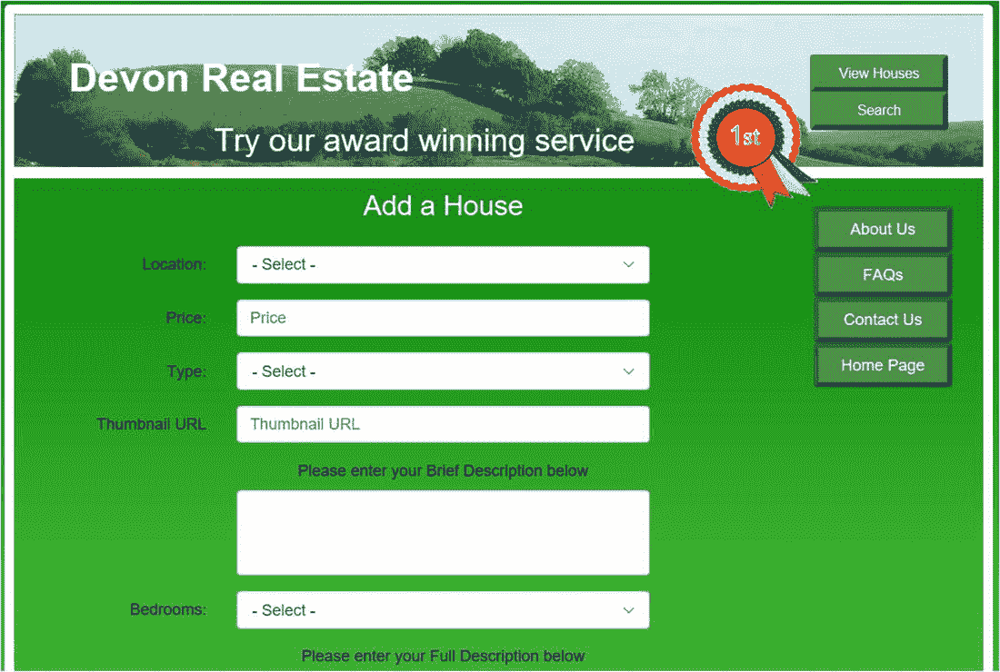
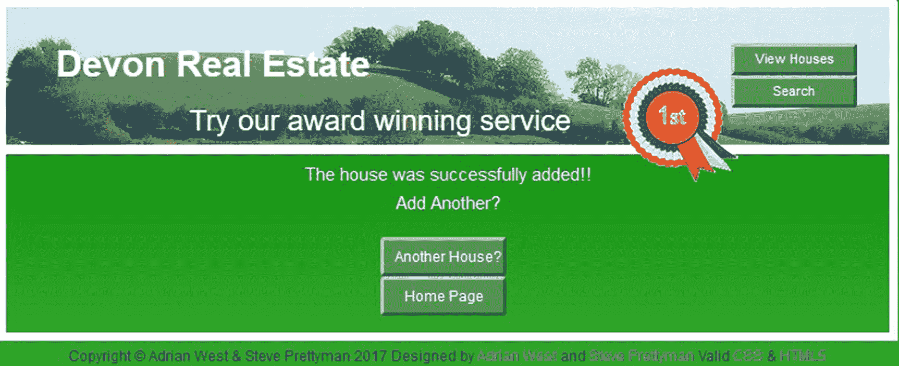
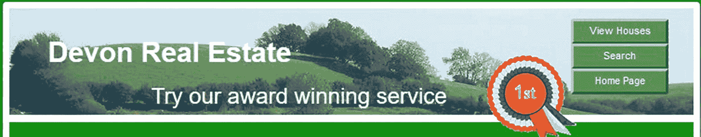
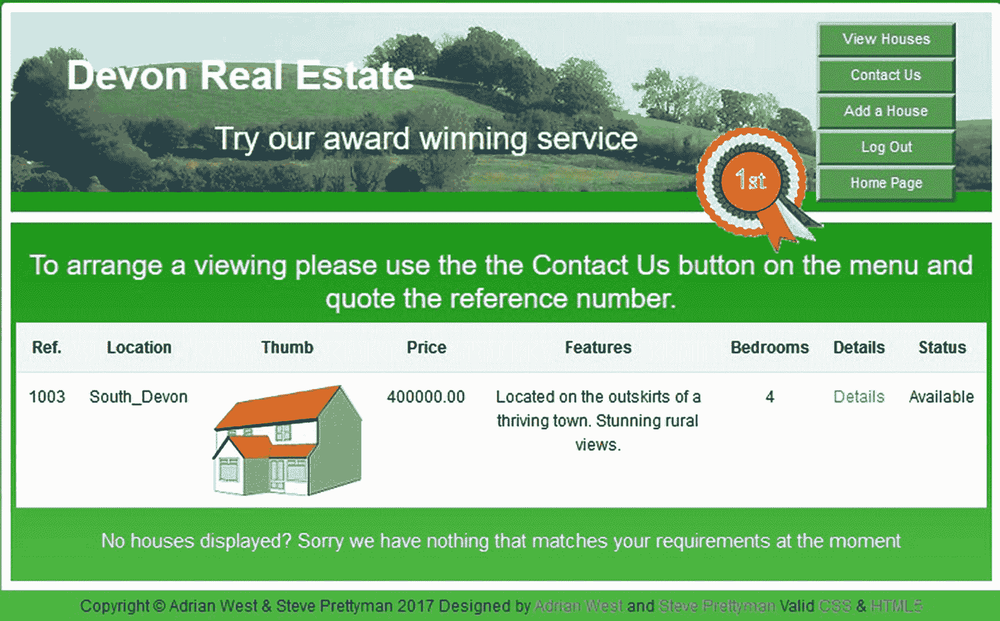
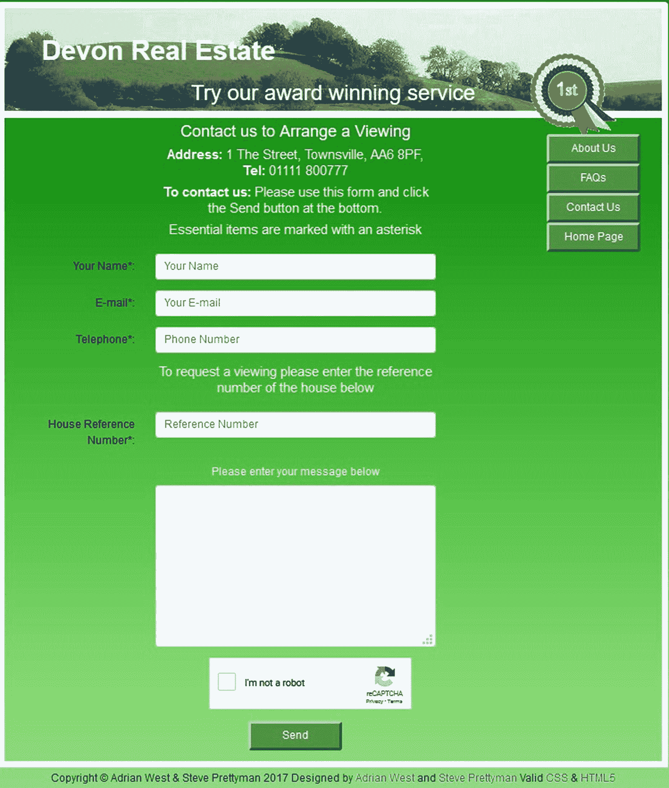

# 八、创建产品目录

在前面的章节中，你已经学习了 PHP 和 MySQL/MariaDB 的基础知识。这些概念提供了一个基础，可以用来创建一个完全数据库驱动的网站。在本章中，我们将使用这些技巧和一个示例产品目录来创建一个全功能的数据库驱动的站点。大多数电子商务网站都有一个目录来展示产品和服务。一些网站使用目录来显示无法通过互联网购买的项目，如旅游景点或房屋。本章中的教程假设一家房地产代理公司在一个有限的区域内提供各种类型的房屋。房地产网站是一个很好的例子，它有一个目录供用户浏览，但并不实际购买任何东西。通过互联网买房(对大多数人来说)是不切实际的。明智的买家会在考虑购买之前先查看房产及其位置。

因为一所房子的买卖牵涉到这么多人，他们的行动都必须仔细协调。所涉及的当事人包括卖方、买方、房地产经纪人、买卖双方各自的律师、买卖双方的银行或抵押贷款公司以及买方的验船师。此外，可能会涉及一系列事件，例如，卖方在找到并同意购买另一所房子之前，不能继续交易。同样，买家在得到当前房屋的实盘之前不能继续交易。这些依赖性突出了为什么在房地产网站上只提供房屋目录是合理的。试图提供完成销售所必须发生的所有不同交易将是复杂和不切实际的。

完成本章后，您将能够

*   设计并准备数据库和管理计划

*   创建房地产数据库和表格

*   创建一个可搜索的主页，用户可以在那里找到合适的房子

*   为管理员创建一个页面，以查看所有的房屋或搜索并查看特定的房屋

*   创建显示页面的代码，这些页面提供列出的每个属性的完整规范

*   为有兴趣看房的用户创建一个查询表单

## 准备数据库和管理计划

与任何项目一样，我们必须让用户(所有者)参与开发过程。参与开发过程的完整生命周期的用户更有可能对最终产品感到满意。要开始这个过程，我们必须首先收集所有重要的信息，这些信息将决定整个网站的设计和局限性。

在我们与房地产代理业主会面后，我们就以下优先事项达成一致:

*   最重要的页面是搜索页面。这必须通过让用户快速找到他们感兴趣的房子来吸引他们。

*   以下是找房子时的首要任务:

    *   位置

    *   价格

    *   卧室数量

    *   房屋类型

因此，搜索页面将包含这四个项目的字段:

*   房子的大概位置会被透露，但是街道名和门牌号一定不能透露。这就避免了用户绕过房产中介，直接去找房主。此外，这为房屋所有者和代理人提供了安全性，因为除非由代理人陪同，否则没有人能够进入房屋位置。出于安全和财务方面的原因，任何潜在客户在被带去看房子之前都会经过房地产办公室的筛选。

*   将不会使用术语*空置占有*。一所空房子对歹徒来说是一块磁铁。空置房屋可能被破坏、被非法占用，或者给销售代理和他们的客户带来安全风险。

*   房产中介的摄影师会提供一个缩略图(*)。jpg* ，*。gif* ，或者*。png* 文件)。缩略图的宽度为 150 像素，最大高度为 120 像素。摄影师还将提供照片的放大版本，用于完整的规格页面；这些将被标准化为 350 像素宽。摄影师会格外小心，确保图像本身没有嵌入纬度、经度或其他方向指示。

    ### 警告

    目录总是包含图像，但房地产管理员可能无法处理它们。房地产公司管理员需要通过 FTP 客户端将新图像放在远程主机上的适当文件夹中。管理员还需要基本的 HTML 和 CSS 技能来格式化房屋描述的文本。我们将假设管理员不具备这些技能。因此，我们将采用的解决方案是请网站管理员管理网站的内容。

首先，我们需要创建新的数据库。

## 创建新数据库

要创建新数据库，请按照下列步骤操作:

1.  在 *xampp* 内的 *htdocs* 文件夹中或者在 EasyPHP 文件夹 *eds_www* 中，新建一个名为 *estate 的文件夹。*

2.  从本书在[出版社的链接下载第](http://apress.com) [8](08.html) 章的文件。并将它们解压到新的*地产*文件夹中。

3.  在浏览器的地址栏中，输入 localhost/phpmyadmin/以访问 phpmyadmin。

4.  单击 Databases 选项卡，创建一个名为 *estatedb 的数据库。*从下拉排序列表中选择 utf8_general_ci，然后单击创建。

5.  单击权限选项卡，然后向下滚动并单击添加新用户。

6.  输入这些详细信息:

    *   *用户名* ： smeeton

    *   *密码* : L1ghth0us3

    *   *主机*:本地主机

7.  在左侧面板中，单击数据库 estatedb 旁边的框。

8.  不要在下一个屏幕上输入任何内容，而是单击 Import 选项卡。

9.  点击浏览按钮，导航到*地产*文件夹和 SQL 转储文件 *houses.sql* 。

10.  点击 *houses.sql* 文件，然后点击打开按钮。该字段将填充转储文件的 URL。

11.  确保下拉菜单中的字符集是 utf-8，并且格式显示为 SQL。

12.  单击开始。

## 创建用于连接到数据库的文件

将文件命名为 *mysqli_connect.php* 。如果您正在使用下载文件，这个文件已经为您创建好了，可以在名为*庄园*的文件夹中找到。

```php
<?php
// Create a connection to the migrate database and to MySQL
// Set the encoding to utf-8
// Set the database access details as constants
Define ('DB_USER', 'smeeton');
Define ('DB_PASSWORD', 'L1ghth0us3');
Define ('DB_HOST', 'localhost');
Define ('DB_NAME', 'estatedb');
// Make the connection:
$dbcon = new mysqli(DB_HOST, DB_USER, DB_PASSWORD, DB_NAME);
// Set the encoding...optional but recommended
mysqli_set_charset($dbcon, 'utf8');
?>

```

houses 表及其内容(以及一个 users 表)是在您之前导入并运行 *houses.sql* 文件时创建的。验证创建的房屋表具有表 [8-1](#Taba) 中所示的列。

表 8-1

房屋数据库表的属性

<colgroup><col class="tcol1"> <col class="tcol2"> <col class="tcol3"> <col class="tcol4"> <col class="tcol5"> <col class="tcol6"> <col class="tcol7"> <col class="tcol8"></colgroup> 
| 

列名

 | 

类型

 | 

长度/值

 | 

默认

 | 

属性

 | 

空

 | 

索引

 | 

A_I

 |
| --- | --- | --- | --- | --- | --- | --- | --- |
| 参考编号 | 中位 | six | 没有人 | 无符号的 | -是吗 | 主要的 | ·······················。 |
| 位置 | 蒂尼因特 | Sixty | 没有人 |   | -是吗 |   | -是吗 |
| 价格 | 小数 | 9,2 | 没有人 |   | -是吗 |   | -是吗 |
| 类型 | 微小文本 | Fifty | 没有人 |   | -是吗 |   | -是吗 |
| 迷你 _ 描述 | 可变长字符串 | One hundred | 没有人 |   | -是吗 |   | -是吗 |
| 卧室 | 蒂尼因特 | Two | 没有人 |   | -是吗 |   | -是吗 |
| 拇指 | 可变长字符串 | Forty-five | 没有人 |   | -是吗 |   | -是吗 |
| 完整 _ 描述 | 可变长字符串 | Six hundred | 没有人 |   | -是吗 |   | -是吗 |
| 完整 _ 图片 | 可变长字符串 | Forty-five | 没有人 |   | -是吗 |   | -是吗 |
| 状态 | 微小文本 | Thirty | 没有人 |   | -是吗 |   | -是吗 |

观众在查询房产时会用到房屋参考号。当用户单击 details 链接时，该值还将用于显示房屋的详细信息。

列类型 MEDIUMINT(无符号时)允许从 0 到 8，388，606 的整数。这个规模将为房地产公司提供大量的潜在询价空间。

TINYTEXT 最多允许 255 个字符。这为描述卧室提供了很大的灵活性。

DECIMAL 允许价格达到表中第一个数字设定的限制。第二个数字表示小数位数。大小为 9，2 意味着当输入九位数字时，如 123456789，记录的结果将是 1234567.89。这使得查询量高达 4.1 亿次！thumb 列保存图像的 URL 例如，*img/thumbs/house _ 01 . jpg*。我们允许在缩略图列中有 45 个字符，因为缩略图的文件名通常很长——例如，*img/thumbs/平房 _South_Devon_150px.png* 。

full_description 列将包含房屋的详细描述。管理员可以输入 HTML 和 CSS 来控制该字段中文本的格式。full_picture 列包含每个房屋放大图像的 URL 链接。

“状态”栏将显示房屋是否可用、正在出售、退出市场或已出售。

## 安全

如前所述，不熟练的管理员将无法处理映像的准备，并且可能无法使用 FTP 程序将新映像放入远程主机的适当文件夹中。因为这些任务必须由网站管理员来执行，所以网站管理员就是管理员。熟练的网站管理员可以使用 phpMyAdmin 进行任何更改。

创建的任何管理页面也需要使用用户 ID 和密码来保护。这些页面将包括会话代码(安全防护),类似于我们在前面章节中看到的例子。本章的可下载文件包括一个用户表、一个注册页面和一个登录页面。

网站中没有提供登录菜单按钮。只有管理员知道这个存在，他们会输入 localhost/estate/login.php 来访问登录页面。

“用户”( users)表格包括前一章中的管理员杰克·史密斯，他的信息可用于访问任何管理页面。杰克的登录信息如下:

*   电子邮件:jsmith@outcook.com

*   *密码* : D0g3b@dy

根据商定的规范，所需页面如下:

*   主页，包括用户的房屋搜索功能(*index.php*)。

*   搜索结果页面，显示用户根据搜索条件选择的房屋。

*   一个完整的规格页面，显示每个单独的房子的细节。用户通过单击搜索结果页面上的链接来访问这些信息。

*   “联系我们”页面，将用于用户查询。

*   一个管理页面，将提供这样的网站管理员可以方便地查看所有的房子。

*   另一个管理页面，这将允许网站管理员搜索和查看特定的房子。

*   管理员还可以添加新的房屋。只有网站管理员知道该页面的 URL，并且无法从网站访问该页面。作为额外的预防措施，管理页面不会在页面标题中包含单词*admin*；它有一个不太明显的名字【advert.php T2】。

前面的页面都不允许编辑或删除房屋列表。管理员将使用 phpMyAdmin 来编辑和删除房屋。我们现在可以为房地产网站创建一个主页。

## 创建具有搜索功能的主页

图 [8-1](#Fig1) 显示主页。



图 8-1

一个房地产网站的主页

本教程中页面的绿色背景是 CSS3 渐变。白色边框内的区域具有透明背景，因此可以看到渐变。

主页有四个下拉菜单，以消除用户输入错误，并确保只将可接受的数据输入数据库表。为了节省空间和提供更好的安全性，本教程中的数据库通过限制这些下拉菜单中的选择来简化。菜单中使用英国价格和术语。在美国，使用不同的术语；例如，术语*半分离*可能会被并排双工替换。在英国，平房是单层建筑，而房子有两层或两层以上。对于一个美国房地产经纪人，你也可以替换货币实体&英镑；与美元实体&美元；。

虽然我们严格限制了下拉选择以节省空间和代码并增加安全性，但真实世界的房屋目录将采用相同的原则，但使用更广泛的位置、价格和房屋类型选择。

在主页的主体中，主菜单(*menu.php*)的代码在下面的代码片段中给出:

```php
<div style="padding-top: 10px; padding-bottom: 10px; padding-right: 15px;">
 <nav class="float-right navbar navbar-expand-md navbar-dark">
        <button class="navbar-toggler" type="button" data-toggle="collapse"
                data-target="#collapsibleMenu1">
                <span class="navbar-toggler-icon"></span>
        </button>
       <div class="btn-group-vertical btn-group-sm collapse navbar-collapse" id="collapsibleMenu1"
               role="group" aria-label="Button Group">
               <ul class="navbar-nav flex-column" style="width: 140px;">
                      <li class="nav-item">
                      <a class="btn btn-primary"
                      style="background:#559a55; border: 5px outset #559a55;" href="#"
                      role="button">About Us</a>
                      </li>
               <li class="nav-item">
                      <a class="btn btn-primary" style="background:#559a55; border: 5px outset #559a55;"
                      href="#" role="button">FAQs</a>
               </li>
               <li class="nav-item">
                      <a class="btn btn-primary" style="background:#559a55; border: 5px outset #559a55;"
                      href="contact.php" role="button">Contact Us</a>
               </li>
               <li class="nav-item">
                     <a class="btn btn-primary" style="background:#559a55; border: 5px outset #559a55;"
                     href="index.php" role="button">Home Page</a>
               </li>
              </ul>
         </div>
 </nav>
</div>

```

在可下载的菜单文件中,“关于我们”和“常见问题”链接是死的，因为在本教程中没有为这两个链接提供目标页面。

我们现在将检查主页和大多数网页的标题。

### 大多数页面的页眉

头文件代码更改为包含头文件，如下所示:

```php
<header>
<?php include('includes/header.php'); ?>
</header>

```

主样式表格式化标题并提供背景图像。

### 主页代码

现在让我们检查一下主页，它也是一个搜索页面(清单 [8-1](#PC4) )。

```php
<!DOCTYPE html>
<html lang="en">
<head>
<title>Estate Home Page</title>
      <meta charset="utf-8">
      <meta name="viewport" s
content="width=device-width, initial-scale=1, shrink-to-fit=no">
      <!-- Bootstrap CSS File -->
      <link rel="stylesheet"
href=
"https://stackpath.bootstrapcdn.com/bootstrap/4.1.0/css/bootstrap.min.css"
             integrity=
"sha384-9gVQ4dYFwwWSjIDZnLEWnxCjeSWFphJiwGPXr1jddIhOegiu1FwO5qRGvFXOdJZ4"
             crossorigin="anonymous">
<link rel="stylesheet" type="text/css" href="transparent.css">

</head>
<body>
<div class="container" style="margin-top:10px">
<!-- Header Section -->
<header>
<?php include('includes/header.php'); ?>
</header>
<!-- Body Section -->
<div class="content mx-auto" id="contents">
      <div class="row mx-auto" style="padding-left: 0px; height: auto;">
<!-- Center Column Content Section -->
      <div class="col-sm-12 text-center"
style="padding:0px; margin-top: 5px;">
      <!--Start of admin add paintings content-->
<div class="row">
             <div class="col-sm-4">
                   <h4>Search for your dream house</h4>
                   <h6>IMPORTANT: Select an item in
                   ALL fields otherwise the search will not succeed</h6>
<form action="found_houses.php" method="post"
name="searchform" id="searchform">
<div class="form-group row form-control-sm no-gutters"
      style="padding: 0px;">
<div class="col-sm-3"></div>
<div class="col-sm-6" style="padding: 0px;">
                   <label for="location" class="col-form-label text-right">
                         Location:</label>
                   <select id="location" name="location" class="form-control"
                         required>
                         <option selected value="">- Select -</option>
                         <option value="South_Devon">South Devon</option>
                         <option value="Mid_Devon">Mid Devon</option>
                         <option value="North_Devon">North Devon</option>
                   </select>
             </div>
             </div>
<div class="form-group row form-control-sm no-gutters"
      style="padding: 0px;" >
<div class="col-sm-3"></div>
<div class="col-sm-6" style="padding: 0px;">
                   <label for="price" class=" col-form-label text-right">
                         Maximum Price:</label>
                   <select id="price" name="price" class="form-control"
                         required>
                         <option selected value="">- Select -</option>
                         <option value="200000">&pound;200,000</option>
                         <option value="300000">&pound;300,000</option>
                         <option value="400000">&pound;400,000</option>
                   </select>
             </div>
             </div>
<div class="form-group row form-control-sm no-gutters"
      style="padding: 0px;" >
<div class="col-sm-3"></div>
<div class="col-sm-6" style="padding: 0px;" >
                   <label for="type" class="col-form-label text-right">
                         Type:</label>
                   <select id="type" name="type" class="form-control"
                         required>
                         <option selected value="">- Select -</option>
                         <option value="Det-bung">Detached Bungalow</option>
                         <option value="Semi-det-bung">
Semi-detached Bungalow</option>
                         <option value="Det-house">Detached House</option>
                         <option value="Semi-det-house">

Semi-detached House</option>
                   </select>
             </div>
             </div>
<div class="form-group row form-control-sm no-gutters"
        style="padding: 0px;">
<div class="col-sm-3"></div>
<div class="col-sm-6" style="padding: 0px;">
                   <label for="bedrooms" class="col-form-label text-right">
                         No. of Bedrooms:</label>
<select id="bedrooms" name="bedrooms" class="form-control"
style="margin: 0px;" required>
                                <option selected value="">- Select -</option>
                                <option value="1">1</option>
                                <option value="2">2</option>
                                <option value="3">3</option>
                                <option value="4">4</option>
                   </select>
             </div>
             </div>
<div class="form-group row form-control-sm ">
                   <label for="" class="col-sm-3 col-form-label"></label>
             <div class="col-sm-6 text-center "style="padding: 0px;" >
                   <input id="submit" class="btn btn-primary" type="submit"
                         name="submit" value="Search">
             </div>
      </div>
</div>
<div class="col-sm-4">
<h6>All houses are situated in the beautiful green rolling countryside
       of Devon, England, UK</h6>
       
</div>
<div class="col-sm-4">
<?php include ('includes/menu.php'); ?>
</div>
</div>
</div>
</div>
</div>
<div class="row mx-auto" style="padding-left: 0px; height: auto;">
<div class="col-sm-12 text-center" style="padding:0px; margin-top: 5px;">
<footer>
<?php include ('includes/footer.php'); ?>
</footer>
</div>
</div>
</div>
</body>
</html>

Listing 8-1Creating the Home Page (index.php)

```

索引页面的代码类似于我们在其他章节中看到的代码。不需要额外的解释。

## 显示目录

用户在首页字段输入搜索条件后(*index.php*，如图 [8-1](#Fig1) ，点击搜索按钮将显示所选房屋，如图 [8-2](#Fig2) 。

在主页中输入以下详细信息，可以看到选中的房屋，如图 [8-2](#Fig2) 所示:

*   *地点*:南德文郡

*   *最高价格* : 40 万

*   *类型*:独立式住宅

*   *卧室* : 4 间

请注意，所有缩略图都将存储在名为*拇指*的*图像*文件夹下的子文件夹中。在完整描述页面中使用的所有全尺寸图片(稍后解释)将被存储在*图片*文件夹下的*图片*子文件夹中。当用户单击 Details 链接时，将显示所选房屋的完整描述。



图 8-2

将显示按搜索标准选择的房屋

图 [8-2](#Fig2) 中显示的搜索标准如下:

*   *地点*:南德文郡

*   *最高价格* : 40 万

*   *类型*:独立式住宅

*   *卧室* : 4 间

    ### 注意

    如果您单击 1003 号房屋的详细信息链接，您将看到该房屋的完整详细信息。如果你点击房子 1007 的细节链接，你会看到一个默认图片的完整细节的例子。

清单 [8-2](#PC5) 给出了显示找到的房屋的代码。

主菜单被删除，以便表格可以跨越页面的宽度。为了使用户能够返回到主页，在标题中添加了一个主页按钮。

```php
<?php
session_start();
// Data from valid source?                                                               #1
if ((empty($_SESSION['user_level'])) && (!isset($_SESSION['previous_url']) or ($_SESSION['previous_url'] != "index")))
{ header("Location: index.php");
exit();
}
else
{
if (!empty($_SESSION['user_level'])) {
      $user_level = $_SESSION['user_level'];

if(($user_level == 1) && (!empty($_POST['ref_number'])))
{
      $ref_number = htmlspecialchars($_POST['ref_number'], ENT_QUOTES);
}
} else { $user_level = 0; }
}
define('ERROR_LOG',"errors.log");
?>
 <!DOCTYPE html>
<html lang="en">
<head>
<title>Found Houses Page</title>
      <meta charset="utf-8">
      <meta name="viewport" content=
"width=device-width, initial-scale=1, shrink-to-fit=no">
      <!-- Bootstrap CSS File -->
      <link rel="stylesheet"
href=
"https://stackpath.bootstrapcdn.com/bootstrap/4.1.0/css/bootstrap.min.css"
             integrity=
"sha384-9gVQ4dYFwwWSjIDZnLEWnxCjeSWFphJiwGPXr1jddIhOegiu1FwO5qRGvFXOdJZ4"
             crossorigin="anonymous">
<link rel="stylesheet" type="text/css" href="transparent.css">
</head>
<body>
<div class="container" style="margin-top:10px">
<!-- Header Section -->
<header>
<?php
if ($user_level == 0)
{
include("includes/header_found_houses.php");
}
else if($user_level==1)
{
include('includes/header_4btn.php');
}
?>
</header>
<!-- Body Section -->

<div class="content mx-auto" id="contents">
<div class="row mx-auto" style="padding-left: 0px; height: auto;">
<!-- Center Column Content Section -->
<div class="col-sm-12 text-center"
style="padding:20px; margin-top: 5px;">
<!--Start of admin add paintings content-->
<div class="row">
<h3>To arrange a viewing please use the Contact Us button
on the menu and quote the reference number.</h3>
<?php
// This script retrieves all the records from the houses table
try {
require ('mysqli_connect.php'); // Connect to the database.
// Make the query:                                                                       #2
$query = "SELECT ref_number, location, thumb, price, ";
$query .= "mini_description, type, bedrooms, ";
$query .= "status FROM houses ";
if(($user_level == 1) && (!empty($_POST['ref_number']))) {
$query .= "WHERE ref_number=? ";
} else {
$query .= "WHERE location= ? AND ";
$query .= "(price <= ?) AND (price >= (? - 100000)) AND ";
$query .= "type= ? AND bedrooms= ?  ORDER BY ref_number ASC ";
}
$q = mysqli_stmt_init($dbcon);
mysqli_stmt_prepare($q, $query);
// bind values to SQL Statement
if(($user_level == 1) && (!empty($_POST['ref_number']))) {
             mysqli_stmt_bind_param($q, 's', $ref_number);
} else {
$location = htmlspecialchars($_POST['location'], ENT_QUOTES);
$price = htmlspecialchars($_POST['price'], ENT_QUOTES);
$type = htmlspecialchars($_POST['type'], ENT_QUOTES);
$bedrooms = htmlspecialchars($_POST['bedrooms'], ENT_QUOTES);
mysqli_stmt_bind_param($q, 'sssss', $location, $price, $price,
$type, $bedrooms);
}
// execute query
mysqli_stmt_execute($q);
$result = mysqli_stmt_get_result($q);
// SELECT is safe execution - read only
if ($result) { // If it ran OK, display the records.
// Table header.
?>
<table class="table table-responsive table-striped"
style="background: white;color:black;">
<tr>
<th scope="col">Ref.</th>
<th scope="col">Location</th>
<th scope="col">Thumb</th>
<th scope="col">Price</th>
<th scope="col">Features</th>
<th scope="col">Bedrooms</th>
<th scope="col">Details</th>
<th scope="col">Status</th>
</tr>
<?php

while ($row = mysqli_fetch_array($result, MYSQLI_ASSOC)) {
      // Remove special characters that might already be in table to
      // reduce the chance of XSS exploits
      $ref_number = htmlspecialchars($row['ref_number'], ENT_QUOTES);
      $thumb = htmlspecialchars($row['thumb'], ENT_QUOTES);
      $price = htmlspecialchars($row['price'], ENT_QUOTES);
      $mini_description =
htmlspecialchars($row['mini_description'], ENT_QUOTES);
      $bedrooms = htmlspecialchars($row['bedrooms'], ENT_QUOTES);
      $status = htmlspecialchars($row['status'], ENT_QUOTES);

      echo '<tr>
      <td scope="row">' . $row['ref_number'] . '</td>
      <td scope="row">' . $row['location'] . '</td>';
      if ($row['thumb'] == "")                                                         //#3
             {
echo '<td scope="row">';
}
      else {
echo'<td scope="row">  </td>';
}
      echo'<td scope="row">' . $row['price'] . '</td>
      <td scope="row">' . $row['mini_description'] . '</td>
      <td scope="row">' . $row['bedrooms'] . '</td>
      <td scope="row">
<a href="house_details.php?ref_number=' . $row['ref_number'] .
                   '">Details</a></td>
      <td scope="row"> ' . $row['status'] . '</td>
      </tr>';
      }
      echo '</table>'; // Close the table.
      mysqli_free_result ($result); // Free up the resources.
      } else { // If it did not run OK.
// Public message:
      echo '<p class="center-text">
The current users could not be retrieved.';
      echo 'We apologize for any inconvenience.</p>';
      // Debugging message:
      //echo '<p>' . mysqli_error($dbcon) . '<br><br>Query: ' . $q . '</p>';
      //Show $q is debug mode only
} // End of if ($result). Now display the total number of records/members.
mysqli_close($dbcon); // Close the database connection.
}
catch(Exception $e) // We finally handle any problems here
   {
// print "An Exception occurred. Message: " . $e->getMessage();
      print "The system is busy please try later";
      //  $date = date('m.d.y h:i:s');

      //  $errormessage = $e->getMessage();
      //  $eMessage = $date . " | Exception Error | " , $errormessage . |\n";
      //   error_log($eMessage,3,ERROR_LOG);
// e-mail support person to alert there is a problem
      //  error_log("Date/Time: $date – Exception Error, Check error log for
//details", 1, noone@helpme.com, "Subject: Exception Error \nFrom:
// Error Log <errorlog@helpme.com>" . "\r\n");
   }
   catch(Error $e)
   {
      // print "An Error occurred. Message: " . $e->getMessage();
      print "The system is busy please try later";
      // $date = date('m.d.y h:i:s');
      // $errormessage = $e->getMessage();
      // $eMessage = $date . " | Error | " , $errormessage . |\n";
      // error_log($eMessage,3,ERROR_LOG);
      // e-mail support person to alert there is a problem
      //  error_log("Date/Time: $date – Error, Check error log for
//details", 1, noone@helpme.com, "Subject: Error \nFrom: Error Log
// <errorlog@helpme.com>" . "\r\n");
   }
?>
<div class="row mx-auto" style="padding-left: 0px; height: auto;">
<div class="col-sm-12 text-center" style="padding:0px; margin-top: 5px;">
<h5 class="text-center">No houses displayed? Sorry we have nothing
that matches your requirements at the moment</h5>
</div>
</div>
</div><!-- End of table display content -->
</div>
</div>
</div>
<div class="row mx-auto" style="padding-left: 0px; height: auto;">
<div class="col-sm-12 text-center" style="padding:0px; margin-top: 5px;">
<footer>
<?php include ('includes/footer.php'); ?>
</footer>
</div>
</div>
</body>
</html>

Listing 8-2Creating the Results Page

(found_houses.php)

```

### 代码的解释

本节解释代码。

```php
<?php
session_start();
// Data from valid source?                                                          #1
if ((empty($_SESSION['user_level'])) && (!isset($_SESSION['previous_url']) or ($_SESSION['previous_url'] != "index")))
{ header("Location: index.php");
exit();
}
else
{
if (!empty($_SESSION['user_level'])) {
      $user_level = $_SESSION['user_level'];

if(($user_level == 1) && (!empty($_POST['ref_number'])))
{
      $ref_number = htmlspecialchars($_POST['ref_number'], ENT_QUOTES);
}
} else { $user_level = 0; }
}
define('ERROR_LOG',"errors.log");
?>

```

该安全防护检查 previous_url 会话变量和 index 值是否存在。该检查仅允许索引文件调用该页面并向其传递内容。索引页要求选择所有下拉框。它还通过使用这些下拉列表来限制传递到此页面的值。

```php
// Make the query:                                                                  #2
$query = "SELECT ref_number, location, thumb, price, ";
$query .= "mini_description, type, bedrooms, ";
$query .= "status FROM houses ";
if(($user_level == 1) && (!empty($_POST['ref_number']))) {
$query .= "WHERE ref_number=? ";
} else {
$query .= "WHERE location= ? AND ";
$query .= "(price <= ?) AND (price >= (? - 100000)) AND ";
$query .= "type= ? AND bedrooms= ?  ORDER BY ref_number ASC ";
}

```

如果用户不是管理员，下拉菜单提供的条目将被分配给 SQL 查询。如果用户是管理员，WHERE 子句将包含房屋参考号，我们很快将在一个管理表单中提供该参考号。

价格需要一些解释。声明如下:

```php
(price <= ?) AND (price >= (?'-100000)

```

如果价格只是< =？，使用最高价格 400，000 的搜索将显示每栋价值 400，000 或更低的房屋。寻找最高价格为 40 万英镑的房子的人不会对 28 万英镑或 12 万英镑的房子感兴趣。因此，以下语句用于给出比搜索人的最高价格低 100，000 的最低价格:

```php
AND (price >= (?-100000)

```

该显示按升序参考数字排序；但是，您可以将其更改为按价格降序排序。

```php
if ($row['thumb'] == "")                                                               //#3
             {
echo '<td scope="row">';
}
      else {
echo'<td scope="row">  </td>';

}

```

如果数据库中没有缩略图的链接，则使用默认图片。如果代理人在摄影师有机会拍照之前就决定发布待售房屋，这种情况可能会发生。

## 搜索结果页面的页眉

图 [8-3](#Fig3) 为割台。


图 8-3

这两个按钮中的一个是“联系我们”按钮，这样用户可以请求预约看房

清单 [8-3](#PC11) 给出了标题的代码。

```php
<div class="jumbotron text-center row mx-auto" id="includeheader">
<div class="col-sm-10">
      <h1 class="text-left"><strong>Devon Real Estate</strong></h1>
      <h2 class="text-center">Try our award winning service</h2>
</div>
  <nav class="col-sm-2">
       <div class="btn-group-vertical btn-group-sm" role="group"
            style="width: 140px;" aria-label="Button Group">
                  <button type="button" class="btn btn-secondary" id="buttons"
                         onclick="location.href = 'contact.php'" >Contact Us</button>
                  <button type="button" class="btn btn-secondary" id="buttons"
                         onclick="location.href = 'index.php'">Home Page</button>
      </div>
  </nav>
</div>


Listing 8-3Creating the Search Result Header

(header_found_houses.php)

```

现在，让我们创建详细信息页面。点击 *found_houses.php* 页面中为单个房屋提供的链接即可访问该页面。

## 创建房屋详细信息页面

房屋详细信息页面提供了更全面的房屋描述。当用户单击 Details 链接时，页面会从数据库中提取这些附加信息。该页面由索引页面或管理员搜索页面调用，稍后将对此进行解释。图 [8-4](#Fig4) 显示页面。


图 8-4

房屋 1003 的房屋详情(house_details.php)

found_houses 页面将房屋参考号(通过 GET)传递给 house_details 页面。这个值然后被用来检索房子的详细描述。

如果数据库中没有图片链接，则使用默认图片。如果代理人在摄影师有机会拍照之前就决定发布待售房屋，这种情况可能会发生。

清单 [8-4](#PC12) 显示了房屋详细信息页面的代码。

```php
<?php
session_start();
// Data from valid source?                                                               #1
if ((!empty($SESSION['user_level'])) &&
(!isset($_SESSION['previous_url'])
      or ($_SESSION['previous_url'] != "index")))
{ header("Location: index.php");
exit();
}
define('ERROR_LOG','errors.log');

?>
<!DOCTYPE html>
<html lang="en">
<head>
  <title>House Details Page</title>
  <meta charset="utf-8">
  <meta name="viewport" content="width=device-width,
initial-scale=1, shrink-to-fit=no">
  <!-- Bootstrap CSS File -->
  <link rel="stylesheet"
href=
"https://stackpath.bootstrapcdn.com/bootstrap/4.1.0/css/bootstrap.min.css"
       integrity=
"sha384-9gVQ4dYFwwWSjIDZnLEWnxCjeSWFphJiwGPXr1jddIhOegiu1FwO5qRGvFXOdJZ4"
  crossorigin="anonymous">
  <link rel="stylesheet" type="text/css" href="transparent.css">
</head>
<body>
<div class="container" style="margin-top:10px">
<!-- Header Section -->
<header>
<?php include('includes/header.php'); ?>
</header>
<!-- Body Section -->
<div class="content mx-auto" id="contents">
<div class="row mx-auto" style="padding-left: 10px; height: auto;">
<!-- Center Column Content Section -->
<div class="col-sm-12 text-center" style="padding:20px; margin-top: 5px;">
<!--Start of admin add paintings content-->
<div class="row">
<div class="col-sm-5" style="background-color: white; padding-top: 10px;">
<?php
try {
$ref_number = htmlspecialchars($_GET['ref_number'], ENT_QUOTES);
require ('mysqli_connect.php'); // Connect to the database.
// Make the query:                                                                       #2
$query = "SELECT price, full_description, full_picture ";
$query .= "FROM houses WHERE ref_number=?";
$q = mysqli_stmt_init($dbcon);
mysqli_stmt_prepare($q, $query);
// bind values to SQL Statement
mysqli_stmt_bind_param($q, 's', $ref_number);
// execute query
mysqli_stmt_execute($q);
$result = mysqli_stmt_get_result($q);
if ($result) { // If it ran OK, display the records.
$row = mysqli_fetch_array($result, MYSQLI_ASSOC);
?>
<h5 style="color:green"><strong>
Details for House Reference No
<?php echo $ref_number; ?>
</strong></h5>
<?php
echo '';}
else { echo $row['full_picture'];
echo '">';
}
?>
</div>
<div class="col-sm-4"
style=" background-color: white; color:black; padding-top: 10px;">
<h4 style="color:green;">
To arrange a viewing please click the Contact Us button
      and quote the reference number
<?php echo $ref_number . '</h4>';

echo '<p>&pound;';
echo $row['price'] . '</p>';
echo $row['full_description'];
?>
</div>
<?php
mysqli_free_result ($result); // Free up the resources.
}
else { // If it did not run OK.
// Message:
      echo '<p class="error">The record could not be retrieved. ';
      echo 'We apologize for any inconvenience.</p>';
      // Debugging error message:
//echo '<p>' . mysqli_error($dbcon) . '<br><br>Query: ' . $q . '</p>';
}
mysqli_close($dbcon); // Close the database connection.
}
catch(Exception $e) // We finally handle any problems here
   {
// print "An Exception occurred. Message: " . $e->getMessage();
      print "The system is busy please try later";
      // $date = date('m.d.y h:i:s');
      // $errormessage = $e->getMessage();
      // $eMessage = $date . " | Exception Error | " , $errormessage . |\n";
      // error_log($eMessage,3,ERROR_LOG);
      // e-mail support person to alert there is a problem
      // error_log("Date/Time: $date – Exception Error, Check error log for
//details", 1, noone@helpme.com, "Subject: Exception Error \n
//From: Error Log <errorlog@helpme.com>" . "\r\n");
   }
   catch(Error $e)
   {
      // print "An Error occurred. Message: " . $e->getMessage();
      print "The system is busy please try later";
      // $date = date('m.d.y h:i:s');
      // $errormessage = $e->getMessage();
      // $eMessage = $date . " | Error | " , $errormessage . |\n";
      // error_log($eMessage,3,ERROR_LOG);
      // e-mail support person to alert there is a problem
      // error_log("Date/Time: $date – Error, Check error log for
//details", 1, noone@helpme.com, "Subject: Error \nFrom:
// Error Log <errorlog@helpme.com>" . "\r\n");
   }
?>
<div class="col-sm-3">
<?php include ('includes/menu.php'); ?>
</div>
</div>
</div>
</div>
</div>
</div>
</body>
</html>

Listing 8-4House Details Page (house_details.php)

```

### 代码解释

本节解释代码。

```php
<?php
session_start();
// Data from valid source?                                                               #1
if ((!empty($SESSION['user_level'])) && (!isset($_SESSION['previous_url'])
       or ($_SESSION['previous_url'] != "index")))
{ header("Location: index.php");
exit();
}
define('ERROR_LOG','errors.log');
?>

```

安全警卫再次要求所选择的数据来自索引页面，该页面又被传递到 found houses 页面。普通用户只有从索引页面开始并单击 found_houses 页面中的详细信息链接才能到达这里。一旦管理员登录到登录页面，就会将他们重定向到广告页面。代码没有关闭会话，以允许用户返回到“找到的房屋”页面并单击另一个链接(如果可用)。

```php
// Make the query:                                                                       #2
$query = "SELECT price, full_description, full_picture ";
$query .= "FROM houses WHERE ref_number=?";
$q = mysqli_stmt_init($dbcon);
mysqli_stmt_prepare($q, $query);
// bind values to SQL Statement
mysqli_stmt_bind_param($q, 's', $ref_number);

```

房屋参考号是通过 found_houses 页面中的链接传递的。house_details 页面使用这个参考号从数据库中提取房子的完整描述。

### 注意

管理员负责控制数据的格式。管理员将使用 HTML 和/或 CSS 来确保数据正确显示。由于房地产员工可能不知道这些技能，因此这项任务被分配给了网站管理员。

```php
echo '" src="';                                                                        //#3
if ($row['full_picture']=="")
{echo 'img/pictures/default.jpg"/>';}
else { echo $row['full_picture'];
echo '">';

```

如果数据库中不存在全尺寸图片的链接，则提供默认图片。

现在让我们添加一些页面来帮助我们的管理员添加和查看房子。

## 创建管理/添加房屋页面

图 [8-5a](#Fig5) 显示管理员页面。



图 8-5a

管理和添加房屋页面

图 [8-5a](#Fig5) 显示管理员页面(【advert.php】T2)。这是用于向数据库中的房屋表添加新房屋的页面。

让我们检查一下管理员页面上的元素。该页面包含四个下拉菜单，其中三个是索引页面中下拉菜单的副本；这些是卧室的位置、类型和数量。状态菜单是第四个下拉菜单，用于通知用户房子是可用的、报价中的还是已经售出的。价格字段不是下拉菜单，因为房价很少精确地设定在 40 万、30 万或 20 万英镑。

关于状态，你可能想知道为什么我们会进入销售。房子卖了为什么不从数据库里删除？房地产经纪人这样做有两个原因。

*   潜在买家可能在某个较早的日期使用过该网站，并被某个特定的房子所吸引。后来，当他们看到房子被卖掉了，他们就没有必要去联系代理人，看看它是否还在市场上。

*   如果潜在的访问者看到网站上列出了几个已出售的房屋，他们会确信代理人正在积极地出售房屋。

管理员将使用 phpMyAdmin 在适当的时间间隔后删除已售房屋。

假设缩略图在文件夹*图像*下的子文件夹*拇指*中，管理员必须按以下格式输入图像的 URL:

```php
c://estaimg/house06.gif

```

必须以 300000 的格式输入价格(不含货币符号)。

全尺寸图片在*图片*文件夹下的*图片*子文件夹中，网址必须按以下格式输入:

```php
c://estaimg/fullhouse06.gif

```

这些字段由管理员填写，当他们单击 Add 按钮时，详细信息被插入到数据库的 houses 表中。给出确认信息，如图 [8-5b](#Fig6) 所示。



图 8-5b

显示确认消息

清单 8-5 给出了管理员页面的代码。

```php
<?php
session_start();
if (!isset($_SESSION['user_level']) || ($_SESSION['user_level'] != 1))
{
      header("Location: login.php");
      exit();
}
define('ERROR_LOG','errors.log');
if ($_SERVER['REQUEST_METHOD'] == 'POST') {
      //require("cap.php");
}
?>
<!DOCTYPE html>
<html lang="en">
<head>
  <title>Add Home Page</title>
  <meta charset="utf-8">
  <meta name="viewport" content="width=device-width, initial-scale=1, shrink-to-fit=no">
  <!-- Bootstrap CSS File -->
  <link rel="stylesheet"
      href="https://stackpath.bootstrapcdn.com/bootstrap/4.1.0/css/bootstrap.min.css"
      integrity=
      "sha384-9gVQ4dYFwwWSjIDZnLEWnxCjeSWFphJiwGPXr1jddIhOegiu1FwO5qRGvFXOdJZ4"
      crossorigin="anonymous">
<link rel="stylesheet" type="text/css" href="transparent.css">
<script src='https://www.google.com/recaptcha/api.js'></script>
</head>
<body>
<div class="container" style="margin-top:10px">
<!-- Header Section -->
<header>
      <?php include('includes/header_advert.php'); ?>
</header>
<?php
// This script is a query that INSERTs a record in the houses table.
// Check that form has been submitted:
if ( ($_POST['submit'] == 'Add')) {
       // only accept values from same site via post
try {
       $errors = array(); // Initialize an error array.
       require('mysqli_connect.php'); // Connect to the db.
       // Check for a location
       $location = filter_var($_POST['location'], FILTER_SANITIZE_STRING);
       if ((empty($location)) || ($location == '- Select -')) {
             $errors[] = 'You forgot to enter the location.';
       } else {
             if (($location == "South_Devon") ||
                    ($location == "Mid_Devon") ||
                    ($location == "North_Devon"))
             {
                    // OK
             } else {
                    $errors[] = "Invalid location";
             }
      }
// Has a price been entered?
$price = filter_var( $_POST['price'], FILTER_SANITIZE_NUMBER_INT);
if ((empty($price)) || (strlen($price) > 15)) {
      $errors[] ='You forgot to enter the price.' ;
}
// check type
$type = (filter_var($_POST['type'], FILTER_SANITIZE_STRING));
      if ((empty($_POST['type'])) || ($_POST['type'] == '- Select -')) {
             // user could choose - Select - by mistake
             $errors[] = 'You forgot to enter the type of house.';
      } else {
             if (($type == "Det-bung") ||
                    ($type == "Sem-det-bung") ||
                    ($type == "Det-house") ||
                    ($type == "Semi-det-house"))
             {
                    //OK
             } else {
                    $errors[] = "Invalid type";
             }
      }
// Check for brief description

$mini_descriptiontrim = filter_var( $_POST['mini_description'], FILTER_SANITIZE_STRING);
if ((!empty($mini_descriptiontrim)) && (preg_match('/[a-z0-9\.\!\?\s\,\-]/i', $mini_descriptiontrim)) &&
       (strlen($mini_descriptiontrim) <= 120)) {
       $mini_description = $mini_descriptiontrim;
}else{
       $errors[] = 'Missing description. Only numeric, alphabetic, period, comma, dash and space. Max 120.';
}
       // Check for number of bedrooms
       $bedrooms = filter_var( $_POST['bedrooms'], FILTER_SANITIZE_NUMBER_INT);
       if ((empty($bedrooms)) || ($bedrooms == '- Select -')) {
             $errors[] = 'You forgot to enter the number of bedrooms';
       } else {
             if (($bedrooms == "1") ||
                    ($bedrooms == "2") ||
                    ($bedrooms == "3") ||
                    ($bedrooms == "4"))
             {
                    // OK
             } else {
                    $errors[] = "Invalid number of bedrooms";
             }
      }
// Check if a thumbnail url has been entered
$thumb = filter_var( $_POST['thumb'], FILTER_SANITIZE_URL);
if ((empty($thumb)) || (strlen($thumb > 45))) {
      // thumbnail link is optional
      $thumb = NULL;
}
// Check if full description has been entered
$full_descriptiontrim =
      filter_var( $_POST['full_description'], FILTER_SANITIZE_STRING);
if ((!empty($full_descriptiontrim)) &&
      (preg_match('/[a-z0-9\.\!\?\s\,\-]/i', $full_descriptiontrim)) &&
      (strlen($full_descriptiontrim) <= 400)) {
      $full_description = $full_descriptiontrim;
}else{
      $errors[] =
      'Missing description. Only numeric, alphabetic, period, comma, dash and space. Max 30.';
      }
      // full picture
      $full_picture = filter_var( $_POST['full_picture'], FILTER_SANITIZE_URL);
             if ((empty($full_picture)) || (strlen($full_picture) > 45)){
             // optional
                     $full_picture = NULL;
             }
      // Check for status of the house

      $status = filter_var( $_POST['status'], FILTER_SANITIZE_STRING);
             if ((empty($status)) || ($status == '- Select -')) {
                     $errors[] = 'You forgot to select a status';
             } else {
             if (($status == "Available") ||
                    ($status == "Under offer") ||
                    ($status == "Withdrawn") ||
                    ($status == "Sold"))
             {
                    // OK
             } else {
                    $errors[] = "Invalid status";
             }
      }
if (empty($errors)) { // If everything's OK.
      // Register the house in the database
      // Make the query:
      $query = "INSERT INTO houses (ref_number, location, price, type, mini_description, bedrooms, ";
      $query .= "thumb, status, full_description, full_picture) ";
      $query .= " VALUES ";
      $query .= "(' ', ?, ?,?,?,?,?,?,?,? )";
$q = mysqli_stmt_init($dbcon);
mysqli_stmt_prepare($q, $query);
// use prepared statement to ensure that only text is inserted
// bind fields to SQL Statement
mysqli_stmt_bind_param($q, 'sssssssss', $location, $price, $type, $mini_description, $bedrooms,
      $thumb, $status, $full_description, $full_picture);
// execute query
mysqli_stmt_execute($q);
if (mysqli_stmt_affected_rows($q) == 1) {
      // Good
      header ("location: another.php");
} else { // If it did not run OK.
      // Message:
      $errorstring = 'System Error ';
      $errorstring .= 'The house could not be added due to a system error. ';
      $errorstring .= 'We apologize for any inconvenience.';
      // Debugging message:
      // echo '<p>' . mysqli_error($dbcon) . '<br><br>Query: ' . $q . '</p>';
      } // End of if ($r) IF.
mysqli_close($dbcon); // Close the database connection.
exit();
} else { // Report the errors.
      $errorstring = 'Error!';
      $errorstring .= ' The following error(s) occurred:<br>';
      foreach ($errors as $msg) { // Print each error.
             $errorstring .= " - $msg<br>\n";
      }
             $errorstring .= 'Please try again.';
}// End of if (empty($errors)) IF.
} // try
catch(Exception $e) // We finally handle any problems here
   {
      // print "An Exception occurred. Message: " . $e->getMessage();
      print "The system is busy please try later";
      //  $date = date('m.d.y h:i:s');
      //  $errormessage = $e->getMessage();
      //  $eMessage = $date . " | Exception Error | " , $errormessage . |\n";
      //   error_log($eMessage,3,ERROR_LOG);
      // e-mail support person to alert there is a problem
      //  error_log("Date/Time: $date – Exception Error, Check error log for
      //details", 1, noone@helpme.com, "Subject: Exception Error \nFrom: Error Log
      //<errorlog@helpme.com>" . "\r\n");
   }
   catch(Error $e)

   {
      // print "An Error occurred. Message: " . $e->getMessage();
      print "The system is busy please try later";
      // $date = date('m.d.y h:i:s');
      // $errormessage = $e->getMessage();
      // $eMessage = $date . " | Error | " , $errormessage . |\n";
      // error_log($eMessage,3,ERROR_LOG);
      // e-mail support person to alert there is a problem
      //  error_log("Date/Time: $date – Error, Check error log for
      // details", 1, noone@helpme.com, "Subject: Error \nFrom:
      // Error Log <errorlog@helpme.com>" . "\r\n");
   }
} // End of the main Submit conditional.
?>
<div class="content mx-auto" id="contents" style="padding-top:10px">
<!-- Body Section -->
  <div class="row" style="padding-left: 0px;">
<div class="col-sm-8">
<form action="advert.php" method="post" name="advert" id="advert">
<!--START OF TEXT FIELDS-->
<div class='form-group row'>
      <label for="" class="col-sm-4 col-form-label text-right"></label>
<div class="col-sm-8 text-center">
      <h3>Add a House</h3>
      <h5>
      <?php
      If (!empty($errorstring)) {
            echo $errorstring;
      }
      ?></h5>
</div>
</div>
<div class="form-group row">
      <label for="location" class="col-sm-4 col-form-label text-right">
        Location:</label>
        <div class="col-sm-8">
      <select id="location" name="location" class="form-control" required>
             <option value="">- Select -</option>
             <option value="South_Devon">South Devon</option>
             <option value="Mid_Devon">Mid Devon</option>
             <option value="North_Devon">North Devon</option>
      </select>
</div>
</div>
<div class="form-group row">
      <label for="price" class="col-sm-4 col-form-label text-right">Price:</label>
<div class="col-sm-8">
      <input type="num" class="form-control" id="price" name="price"
             placeholder="Price" maxlength="15"
             pattern="[0-9\.]*"
             title="Numbers only max of 120 characters"
             value=
                    "<?php if (isset($_POST['price']))
             echo htmlspecialchars($_POST['price'], ENT_QUOTES); ?>" >
    </div>
</div>
<div class="form-group row">

      <label for="type" class="col-sm-4 col-form-label text-right">
        Type:</label>
        <div class="col-sm-8">
     <select id="type" name="type" class="form-control" required>
      <option value="">- Select -</option>
      <option value="Det-bung">Detached Bungalow</option>
      <option value="Sem-det-bung">Semi-detached Bungalow</option>
      <option value="Det-house">Detached House</option>
      <option value="Semi-det-house">Semi-detached House</option>
      </select>
</div>
</div>
<div class="form-group row">
    <label for="thumb" class="col-sm-4 col-form-label text-right">Thumbnail URL</label>
    <div class="col-sm-8">
      <input type="url" class="form-control" id="thumb" name="thumb"
        placeholder="Thumbnail URL" maxlength="45"
         value=
            "<?php if (isset($_POST['thumb']))
            echo htmlspecialchars($_POST['thumb'], ENT_QUOTES); ?>" >
    </div>
  </div>
 <div class="form-group row">
      <label for="" class="col-sm-4 col-form-label text-right"></label>
<div class="col-sm-8 text-center">
      <label for="comment">Please enter your Brief Description below</label>
      <textarea class="form-control" id="mini_description"
            name="mini_description" rows="3" cols="40"
            pattern="[a-zA-Z0-9][a-zA-Z0-9\s\.\,\-\?\!]*"
            title="Alphabetic, numbers, comma, ., -, ?, !, space only max of 120 characters"
            value=
            " <?php if (isset($_POST['mini_description']))
            echo htmlspecialchars($_POST['mini_description'], ENT_QUOTES); ?>" >
      </textarea>
 </div>
 </div>
<div class="form-group row">
      <label for="bedrooms" class="col-sm-4 col-form-label text-right">
             Bedrooms:</label>
<div class="col-sm-8">
      <select id="bedrooms" name="bedrooms" class="form-control" required>
             <option value="">- Select -</option>
             <option value="1">1</option>
             <option value="2">2</option>
             <option value="3">3</option>
             <option value="4">4</option>
      </select>
</div>
</div>
<div class="form-group row">

      <label for="" class="col-sm-4 col-form-label text-right"></label>
<div class="col-sm-8 text-center">
      <label for="comment">Please enter your Full Description below</label>
      <textarea class="form-control" id="full_description" name="full_description"
             rows="10" cols="40"
             pattern="[a-zA-Z0-9][a-zA-Z0-9\s\.\,\-\?\!]*"
             title="Alphabetic, numbers, comma, ., -, ?, !, space only max of 400 characters"
             value=
                     "<?php if (isset($_POST['full_description']))
             echo htmlspecialchars($_POST['full_description'], ENT_QUOTES); ?>" >
      </textarea>
</div>
</div>
<div class="form-group row">
     <label for="full_picture" class="col-sm-4 col-form-label text-right">Full Picture URL</label>
      <div class="col-sm-8">
      <input type="url" class="form-control" id="full_picture" name="full_picture"
             placeholder="Full Picture URL" maxlength="45"
             value=
                     "<?php if (isset($_POST['full_picture']))
             echo htmlspecialchars($_POST['full_picture'], ENT_QUOTES); ?>" >
 </div>
 </div>
<div class="form-group row">
       <label for="status" class="col-sm-4 col-form-label text-right">
              Status:</label>
<div class="col-sm-8">
       <select id="status" name="status" class="form-control" required>
              <option value="">- Select -</option>
              <option value="Available">Available</option>
              <option value="Under offer">Under offer</option>
              <option value="Withdrawn">Withdrawn</option>
              <option value="Sold">Sold</option>
       </select>
</div>
</div>
<div class="form-group row">
       <label class="col-sm-4 col-form-label"></label>
  <div class="col-sm-8">
  <div class="float-left g-recaptcha" style="padding-left: 50px;"
       data-sitekey="6LcrQ1wUAAAAAPxlrAkLuPdpY5qwS9rXF1j46fhq"></div>
  </div>
  </div>
<div class="form-group row">
       <label for="" class="col-sm-4 col-form-label"></label>
<div class="col-sm-8 text-center">
       <input id="submit" class="btn btn-primary" type="submit" name="submit" value="Add">
</div>
</div>
</form><!-- End of the add house content. -->
</div>
<!-- Left-side Column Menu Section -->
        <nav class="col-sm-4">
              <?php include('includes/menu.php'); ?>
       </nav>
</div>
</div>
<div>
<div class="row mx-auto" style="padding-left: 0px; height: auto;">
<div class="col-sm-12 text-center" style="padding:0px; margin-top: 5px;">
      <footer>
             <?php include ('includes/footer.php'); ?>
      </footer>
</div>
</div>
</div>
</div>
</body>
</html>

Listing 8-5Creating the Admin

istator’s Page (advert.php)

```

HTML5 代码使用 required 属性来确保用户在必填字段中输入信息。下拉框允许用户仅从项目列表中进行选择。这提供了良好的验证，因为不能输入无效的条目。用户在表单中输入信息后，从文本框接收的信息将被验证。使用的编码类似于前一章中使用的编码。因此，我们不会在这里重复解释。

您可能已经注意到，管理员页面的标题不同于一般的标题。我们接下来将对此进行研究。

## 管理员页面的页眉

三个管理页面需要两个额外的按钮，因为宽表显示填满了内容区域，没有给主菜单留下空间。

图 [8-6](#Fig7) 显示了两个额外的按钮。



图 8-6

显示了两个额外的菜单按钮

清单 [8-6](#PC19) 给出了管理员头的代码。

```php
<div class="jumbotron text-center row mx-auto" id="includeheader">
<div class="col-sm-10">
<h1 class="text-left"><strong>Devon Real Estate</strong></h1>
<h2 class="text-center">Try our award winning service</h2>
</div>
  <nav class="col-sm-2">
       <div class="btn-group-vertical btn-group-sm" role="group"
                   style="width: 140px; margin-top:-25px;"
                   aria-label="Button Group">
                   <button type="button" class="btn btn-secondary" id="buttons"
                   onclick="location.href = 'advert_houses.php'" >
                          View Houses</button>
                   <button type="button" class="btn btn-secondary" id="buttons"
                          onclick="location.href = 'advert_search.php'">
                                  Search</button>
                   <button type="button" class="btn btn-secondary" id="buttons"
                          onclick="location.href = 'index.php'">Home Page</button>
</div>
</nav>
</div>


Listing 8-6Creating the Header with One Extra Button (header_3btn.php)

```

管理员可以使用分页显示来查看整个库存。这将在下面讨论。

## 管理员对所有待售房屋的查看

图 [8-7](#Fig8) 显示了全库存视图的第一页。


图 8-7

全库存展示中的一页

清单 [8-7a](#PC20) 显示了显示房屋存量的代码。

全库存显示的代码使用了与前面章节中描述的类似的表格和分页。因此，不对代码进行解释。

```php
<?php
session_start();
if (!isset($_SESSION['user_level']) || ($_SESSION['user_level'] != 1))
{
      header("Location: login.php");
      exit();
}
define('ERROR_LOG', 'errors.log');
?>
<!DOCTYPE html>
<html lang="en">
<head>
      <title>Admin View All Houses</title>
      <meta charset="utf-8">
      <meta name="viewport" content="width=device-width, initial-scale=1, shrink-to-fit=no">
       <!-- Bootstrap CSS File -->
       <link rel="stylesheet"
href="https://stackpath.bootstrapcdn.com/bootstrap/4.1.0/css/bootstrap.min.css"
              integrity=
"sha384-9gVQ4dYFwwWSjIDZnLEWnxCjeSWFphJiwGPXr1jddIhOegiu1FwO5qRGvFXOdJZ4"
             crossorigin="anonymous">
      <link rel="stylesheet" type="text/css" href="transparent.css">
      <script src='https://www.google.com/recaptcha/api.js'></script>
</head>
<body>
<div class="container" style="margin-top:10px">

<!-- Header Section -->
<header>
      <?php include('includes/header_3btn.php'); ?>
</header>
<div class="content mx-auto" id="contents" style="padding-top:10px">
<!-- Body Section -->
 <div class="row" style="padding: 10px;">
<div class="col-sm-12">
      <h4 class="text-center">Houses displayed four at-a-time</h4>
      <h5>
             <?php
             If (!empty($errorstring)) {
                   echo $errorstring;
             }
             ?>
      </h5>
<?php
      try {
      // This script retrieves all the records from the users table.
      require ('mysqli_connect.php'); // Connect to the database.
      //set the number of rows per display page
      $pagerows = 4;
      // Has the total number of pages already been calculated?
      if (isset($_GET['pages'])) {
            $pages = (filter_var($_GET['pages'], FILTER_SANITIZE_NUMBER_INT));
      } else {
            //use the next block of code to calculate the number of pages
            //First, check for the total number of records
            $query = "SELECT COUNT(ref_number) FROM houses";
            $result = mysqli_query ($dbcon, $query);
            $row = mysqli_fetch_array ($result, MYSQLI_NUM);
            $records = $row[0];
            //Now calculate the number of pages
            if ($records > $pagerows){ //if the number of records will fill more than one page
                   //Calculate the number of pages and round the result up to the nearest integer
                   $pages = ceil ($records/$pagerows);
            }else{
                   $pages = 1;
            }
      }//page check finished. Declare which record to start with
      If (isset($_GET['start'])) {
            $start = (filter_var($_GET['start'], FILTER_SANITIZE_NUMBER_INT));
      } else {
            $start = 0;
      }
// Make the query:
$query = "SELECT ref_number, location, thumb, price, mini_description, bedrooms, status ";
$query .= "FROM houses ORDER BY ref_number DESC LIMIT ?, ?";
 $q = mysqli_stmt_init($dbcon);
 mysqli_stmt_prepare($q, $query);
 // use prepared statement to ensure that only text is inserted
 // bind fields to SQL Statement
 mysqli_stmt_bind_param($q, 'ii', $start, $pagerows );
 // execute query
 mysqli_stmt_execute($q);

$result = mysqli_stmt_get_result($q);
if ($result) { // If it ran OK, display the records.
      // Table header.
      echo '<table class="table table-striped table-sm" style="color: black; background-color:white;">
      <tr>
            <th scope="col">Ref-Num</th>
            <th scope="col">Location</th>
            <th scope="col">Thumb</th>
            <th scope="col">Price</th>
            <th scope="col">Features</th>
            <th scope="col">Bedrooms</th>
            <th scope="col">Status</th>
      </tr>';
      // Fetch and print all the records:
      while ($row = mysqli_fetch_array($result, MYSQLI_ASSOC)) {
            // Remove special characters that might already be in table to
            // reduce the chance of XSS exploits
            $ref_number = htmlspecialchars($row['ref_number'], ENT_QUOTES);
            $location = htmlspecialchars($row['location'], ENT_QUOTES);
            $thumb = htmlspecialchars($row['thumb'], FILTER_FLAG_NO_ENCODE_QUOTES);
            $price = htmlspecialchars($row['price'], ENT_QUOTES);
            $mini_description = htmlspecialchars($row['mini_description'], ENT_QUOTES);
            $bedrooms = htmlspecialchars($row['bedrooms'], ENT_QUOTES);
            $status = htmlspecialchars($row['status'], ENT_QUOTES);
            echo '<tr>
                  <td scope="row">' . $ref_number . '</td>
                  <td scope="row">' . $location . '</td>
                  <td scope="row"></td>
                  <td scope="row">' . $price . '</td>
                  <td scope="row">' . $mini_description . '</td>
                  <td scope="row">' . $bedrooms . '</td>
                  <td scope="row">' . $status . '</td>
            </tr>';
      }
      echo '</table>'; // Close the table.
      mysqli_free_result ($result); // Free up the resources.
} else { // If it did not run OK.
      // Message:
      $errorstring = '<p class="text-center">The record could not be retrieved. ';
      $errorstring .= 'We apologize for any inconvenience.</p>';
      // Debugging message:
      //echo '<p>' . mysqli_error($dbcon) . '<br><br>Query: ' . $q . '</p>';
} // End of if ($result). Now display the total number of records/houses
$q = "SELECT COUNT(ref_number) FROM houses";
$result = mysqli_query ($dbcon, $q);
$row = mysqli_fetch_array ($result, MYSQLI_NUM);
$houses = (filter_var($row[0], FILTER_SANITIZE_NUMBER_INT));
mysqli_close($dbcon); // Close the database connection.
echo "<p class='text-center' style='color:black'>Total found: $houses</p>";
if ($pages > 1) {
      echo '<h5 class="text-center">';
      //What number is the current page?
      $current_page = ($start/$pagerows) + 1;
      //If the page is not the first page then create a Previous link

      if ($current_page != 1) {
            echo '<a href="advert_houses.php?start=' . ($start - $pagerows) . '&pages=' .
                   $pages . '">Previous</a> ';
      }
      //Create a Next link
      if ($current_page != $pages) {
            echo '<a href="advert_houses.php?start=' . ($start + $pagerows) . '&pages=' .
                   $pages . '">Next</a> ';
      }
echo '</h5>';
}
}
catch(Exception $e) // We finally handle any problems here
   {
      // print "An Exception occurred. Message: " . $e->getMessage();
      print "The system is busy please try later";
      //  $date = date('m.d.y h:i:s');
      //  $errormessage = $e->getMessage();
      //  $eMessage = $date . " | Exception Error | " , $errormessage . |\n";
      //   error_log($eMessage,3,ERROR_LOG);
      // e-mail support person to alert there is a problem
      //  error_log("Date/Time: $date – Exception Error, Check error log for
      // details", 1, noone@helpme.com, "Subject: Exception Error \nFrom: Error Log
      // <errorlog@helpme.com>" . "\r\n");
   }
   catch(Error $e)
   {
      // print "An Error occurred. Message: " . $e->getMessage();
      print "The system is busy please try later";
      // $date = date('m.d.y h:i:s');
      // $errormessage = $e->getMessage();
      // $eMessage = $date . " | Error | " , $errormessage . |\n";
      // error_log($eMessage,3,ERROR_LOG);
      // e-mail support person to alert there is a problem
      //  error_log("Date/Time: $date – Error, Check error log for
      // details", 1, noone@helpme.com, "Subject: Error \nFrom: Error Log <errorlog@helpme.com>" . "\r\n");
   }
?>
</div><!-- End of table display content -->
</div>
</div>
<div class="row mx-auto" style="padding-left: 0px; height: auto;">
<div class="col-sm-12 text-center" style="padding:0px; margin-top: 5px;">
      <footer>
             <?php include ('includes/footer.php'); ?>
      </footer>
</div>
</div>
</div>
</body>
</html>

Listing 8-7aCreating a Paginated Table of the Entire Stock of Houses (advert_houses.php)

```

管理员还可以通过使用房屋参考号来搜索单个记录，如下一节所述。

## 管理员的搜索页面

图 [8-8](#Fig9) 显示了管理员的搜索页面。


图 8-8

管理员可以搜索特定的房屋

请注意，搜索页面的标题中添加了一个额外的菜单选项。您可以通过在编辑器中打开 *header_4btn.php* 文件来查看新头文件的代码。清单 [8-8](#PC21) 给出了管理员搜索页面的代码。

```php
<?php
session_start();
if (!isset($_SESSION['user_level']) || ($_SESSION['user_level'] != 1))
{
      header("Location: login.php");
      exit();
}
?>
<!DOCTYPE html>
<html lang="en">
<head>
      <title>Admin Search Page</title>
      <meta charset="utf-8">
      <meta name="viewport" content="width=device-width, initial-scale=1, shrink-to-fit=no">
      <!-- Bootstrap CSS File -->
      <link rel="stylesheet"
      href="https://stackpath.bootstrapcdn.com/bootstrap/4.1.0/css/bootstrap.min.css"
      integrity="sha384-9gVQ4dYFwwWSjIDZnLEWnxCjeSWFphJiwGPXr1jddIhOegiu1FwO5qRGvFXOdJZ4"
      Crossorigin="anonymous">
      <link rel="stylesheet" type="text/css" href="transparent.css">
      <script src='https://www.google.com/recaptcha/api.js'></script>
</head>
<body>
<div class="container" style="margin-top:10px">

<!-- Header Section -->
<header>
      <?php include('includes/header_4btn.php'); ?>
</header>
<div class="content mx-auto" id="contents" style="padding-top:10px">
<!-- Body Section -->
<div class="row" style="padding-left: 0px;">
<div class="col-sm-10">
<form action="found_houses.php" method="post" name="find" id="find">
<!--START OF TEXT FIELDS-->
<div class='form-group row'>
      <label for="" class="col-sm-4 col-form-label text-right"></label>
<div class="col-sm-8 text-center">
      <h3>Search for a record</h3>
      <h5>Enter the Reference Number</h5>
      <h5>
      <?php
      If (!empty($errorstring)) {
            echo $errorstring;
      }
      ?>
      </h5>
</div>
</div>
<div class="form-group row">
<div class="col-sm-2"></div>
      <label for="ref_number" class="col-sm-4 col-form-label text-right">Reference Number:</label>
      <div class="col-sm-4">
      <input type="num" class="form-control" id="ref_number" name="ref_number"
            placeholder="Reference Number" maxlength="30"
                    pattern="[0-9]*"
            title="Numbers only max of 30 characters"
            value=
                    "<?php if (isset($_POST['ref_number']))
            echo htmlspecialchars($_POST['ref_number'], ENT_QUOTES); ?>" >
  </div>
  </div>
<div class="form-group row">
      <label for="" class="col-sm-4 col-form-label"></label>
<div class="col-sm-8 text-center">
      <input id="submit" class="btn btn-primary" type="submit" name="submit" value="Search">
</div>
</div>
</form><!-- End of the add house content. -->
</div>
</div>
</div>
<div class="row mx-auto" style="padding-left: 0px; height: auto;">
<div class="col-sm-12 text-center" style="padding:0px; margin-top: 5px;">
<footer>
      <?php include ('includes/footer.php'); ?>
</footer>
</div>
</div>
</body>
</html>

Listing 8-8The Administrator’s Search Page (advert_search.php

)

```

当点击搜索按钮时，显示与房屋参考号相关的记录。

### 搜索的结果

图 [8-9](#Fig10) 显示管理员可以显示任何指定的房屋。



图 8-9

选择并显示记录

前面解释过的 *found_houses.php* 页面被调用来通过参考号显示单个房屋。

```php
$query = "SELECT ref_number, location, thumb, price, mini_description, type, bedrooms, ";
$query .= "status FROM houses ";
if(($user_level == 1) && (!empty($_POST['ref_number']))) {
$query .= "WHERE ref_number=? ";
} else {
$query .= "WHERE location= ? AND ";
$query .= "(price <= ?) AND (price >= (? - 100000)) AND ";
$query .= "type= ? AND bedrooms= ?  ORDER BY ref_number ASC ";
}

```

这个来自 found houses 页面的代码片段将使用参考号而不是多个字段来提取管理员指定的特定记录。

```php
<?php
if ($user_level == 0)
{
include("includes/header_found_houses.php");
}
else if($user_level==1)
{
include('includes/header_4btn.php');
}
?>

```

位于 found houses 页面顶部的这段代码将使显示的页面个性化，包括管理员标题，而不是所有用户的通用标题。这将为管理员提供查看其他页面的按钮。代码的其余部分与站点访问者看到的一样。

### 注意

“找到的房屋”页面不包含编辑或删除房屋的方法。该页面的存在纯粹是为了让用户可以查看房子的详细信息。网站管理员是管理员，是唯一被允许编辑或删除房屋的人。许多数据库管理系统(DBMSs)能够通过将表字段拖放到表单上来快速创建管理员可以使用的输入和编辑页面。MySQL 和 MariaDB 的免费版本没有这个功能。但是，您会发现 Microsoft Access 确实提供了表单生成功能。如果不能快速生成表单，管理员还可以使用 phpMyAdmin 来输入或修改数据。

## “联系我们”页面

图 [8-10](#Fig11) 显示了一个合适的联系我们页面的示例。这是第七章[第七章](07.html)的联系我们页面的精简版。



图 8-10

“联系我们”页面

清单 [8-10a](#PC24) 给出了显示表单的代码。

```php
<!DOCTYPE html>
<html lang="en">
<head>
  <title>Contact Us Form</title>
  <meta charset="utf-8">
  <meta name="viewport" content="width=device-width, initial-scale=1, shrink-to-fit=no">
  <!-- Bootstrap CSS File -->
  <link rel="stylesheet"
      href="https://stackpath.bootstrapcdn.com/bootstrap/4.1.0/css/bootstrap.min.css"
      integrity="sha384-9gVQ4dYFwwWSjIDZnLEWnxCjeSWFphJiwGPXr1jddIhOegiu1FwO5qRGvFXOdJZ4"
      crossorigin="anonymous">
<script src='https://www.google.com/recaptcha/api.js'></script>
<link rel="stylesheet" type="text/css" href="transparent.css">
</head>
<body>
<div class="container" style="margin-top:30px">

<!-- Header Section -->
<header>
      <?php include('includes/header.php'); ?>
</header>
<!-- Body Section -->
<div class="content mx-auto" id="contents">
 <div class="row mx-auto" style="padding-left: 0px; height: auto;">
<!-- Center Column Content Section -->
  <div class="col-sm-12 text-center" style="padding:0px; margin-top: 5px;">
  <div class="row" style="padding-left: 0px;">
<!-- Left-side Column Menu Section -->
<div class="col-sm-8">
<form action="contact-handler.php" method="post" name="feedbackform" id="feedbackform">
 <!-- Validate Input -->
 <div class="form-group row">
<div class="col-sm-4"></div>
<div class="col-sm-8">
      <h4 class="text-center">Contact us to Arrange a Viewing</h4>
      <h5 class="text-center"><strong>Address:</strong>
            1 The Street, Townsville, AA6 8PF, <strong>Tel:</strong> 01111 800777</h5>
      <h5 class="text-center"><strong>To contact us:</strong>
            Please use this form and click the Send button at the bottom.</h5>
      <h5 class="text-center">Essential items are marked with an asterisk</h5>
</div>
</div>
<!--START OF TEXT FIELDS-->
<div class="form-group row">
      <label for="username" class="col-sm-4 col-form-label text-right">Your Name*:</label>
<div class="col-sm-8">
      <input type="text" class="form-control" id="username" name="username"
            pattern="[a-zA-Z][a-zA-Z\s]*" title="Alphabetic and space only max of 30 characters"
            placeholder="Your Name" maxlength="30" required
            value=
                    "<?php if (isset($_POST['username']))
            echo htmlspecialchars($_POST['username'], ENT_QUOTES); ?>" >
 </div>
 </div>
<div class="form-group row">
      <label for="useremail" class="col-sm-4 col-form-label text-right">E-mail*:</label>
<div class="col-sm-8">
      <input type="email" class="form-control" id="useremail" name="useremail"
            placeholder="Your E-mail" maxlength="60" required
            value=
                    "<?php if (isset($_POST['useremail']))
            echo htmlspecialchars($_POST['useremail'], ENT_QUOTES); ?>" >
 </div>
 </div>
 <div class="form-group row">
       <label for="phone" class="col-sm-4 col-form-label text-right">Telephone*:</label>
 <div class="col-sm-8">
       <input type="tel" class="form-control" id="phone" name="phone"
             placeholder="Phone Number" maxlength="30"
             value=
                     "<?php if (isset($_POST['phone']))
             echo htmlspecialchars($_POST['phone'], ENT_QUOTES); ?>" >
</div>
</div>
<div class="form-group row">
      <label for="" class="col-sm-4 col-form-label text-right"></label>
      <h5 class="col-sm-8 text-center">To request a viewing please enter the reference number of the house below</h5>
</div>
<div class="form-group row">
      <label for="address1" class="col-sm-4 col-form-label text-right">

            House Reference Number*:</label>
<div class="col-sm-8">
      <input type="num" class="form-control" id="ref_number" name="ref_number"
            pattern="[0-9]*"
            title="Numbers only max of 30 characters"
            placeholder="Reference Number" maxlength="30" required
            value=
                    "<?php if (isset($_POST['ref_number']))
            echo htmlspecialchars($_POST['ref_number'], ENT_QUOTES); ?>" >
  </div>
  </div>
<div class="form-group row">
      <label for="" class="col-sm-4 col-form-label text-right"></label>
<div class="col-sm-8 text-center">
      <label for="comment" style="color:white;">Please enter your message below</label>
      <textarea class="form-control" id="comment" name="comment" rows="8" cols="40"
             value="<?php if (isset($_POST['comment']))
             echo htmlspecialchars($_POST['comment'], ENT_QUOTES); ?>" >
      </textarea>
 </div>
 </div>
 <div class="form-group row">
      <label class="col-sm-4 col-form-label"></label>
 <div class="col-sm-8">
 <div class="g-recaptcha" style="margin-left: 80px;"
      data-sitekey="6LcrQ1wUAAAAAPxlrAkLuPdpY5qwS9rXF1j46fhq"></div>
 </div>
 </div>
<div class="form-group row">
      <label for="" class="col-sm-4 col-form-label"></label>
<div class="col-sm-8 text-center">
      <input id="submit" class="btn btn-primary" type="submit" name="submit" value="Send">
</div>
</div>
</form>
</div>
<div class="col-sm-4">
      <?php include ('includes/menu.php'); ?>
</div>
</div>
</div>
</div>
</div>
<div class="row mx-auto" style="padding-left: 0px; height: auto;">
<div class="col-sm-12 text-center" style="padding:0px; margin-top: 5px;">
      <footer>
             <?php include ('includes/footer.php'); ?>
      </footer>
</div>
</div>
</div>
</body>
</html>

Listing 8-10aCreating the Contact Us Page (contact.php)

```

表格的格式和信息的验证类似于第 [7](07.html) 章中解释的代码。因此，本章不再重复解释。

我们现在将检查清单 [8-10b](#PC25) 中的联系人表单处理程序。

```php
<?php
// Feedback form handler
// set the error and thank you pages
$formurl = "feedback/feedback_form.html" ;
$errorurl = "feedback/error.html" ;
$thankyouurl = "feedback/thankyou.html" ;
$emailerrurl = "feedback/emailerr.html" ;
$errorcommenturl =  "feedback/commenterror.html" ;
// set to the email address of the recipient
$mailto = "none@noone.com" ;
// Is first name present? If it is, sanitize it
$username = filter_var( $_POST['username'], FILTER_SANITIZE_STRING);
if ((!empty($username)) && (preg_match('/[a-z\s]/i',$username)) &&
            (strlen($username) <= 30)) {
             //Save user name
             $usernametrim = $username;
}else{
      $errors = 'yes';
}
// Check that an email address has been entered correctly
$useremailtrim = filter_var( $_POST['useremail'], FILTER_SANITIZE_EMAIL);
if  ((empty($useremailtrim)) || (!filter_var($useremailtrim, FILTER_VALIDATE_EMAIL))
                   || (strlen($useremailtrim > 60))) {
                   // if email is bad display error page
                   header( "Location: $emailerrurl" );
                   exit ;
}
// Is the phone number present? if so, sanitize it
$phone = filter_var( $_POST['phone'], FILTER_SANITIZE_STRING);
if ((!empty($phone)) && (strlen($phone) <= 30)) {
       //Sanitize and validate phone number
       $phonetrim = (filter_var($phone, FILTER_SANITIZE_NUMBER_INT));
       $phonetrim = preg_replace('/[^0-9]/', “, $phonetrim);
}else{
       $phonetrim = NULL; // if not valid or missing do not save
}
       /
$ref_number = filter_var( $_POST['ref_number'], FILTER_SANITIZE_STRING);
if ((!empty($ref_number)) && (preg_match('/[0-9]/', $ref_number)) &&
  (strlen($ref_number) <= 30)) {
       //Save the 1st address
       $ref_numbertrim = $ref_number;
}else{
       $errors = 'yes';
}
$comment = filter_var( $_POST['comment'], FILTER_SANITIZE_STRING);
if ((!empty($comment)) && (strlen($comment) <= 320)) {
       // remove ability to create link in email
       $patterns = array("/http/", "/https/", "/\:/","/\/\//","/www./");
       $commenttrim = preg_replace($patterns," ", $comment);
       }else{ // if comment not valid display error page

       header( "Location: $errorcommenturl" );
       exit;
}
if (!empty($errors)) { // if errors display error page
      header( "Location: $errorurl" );
      exit ; }
// everything OK send e-mail
$subject = "Message from customer " . $usernametrim;
$messageproper =
      "------------------------------------------------------------\n" .
      "Name of sender: $usernametrim\n" .
      "Email of sender: $useremailtrim\n" .
      "Telephone: $phonetrim\n" .
      "Ref Number: $ref_numbertrim\n" .
      "------------------------- MESSAGE -------------------------\n\n" .
      $commenttrim .
      "\n\n------------------------------------------------------------\n" ;
      mail($mailto, $subject, $messageproper, "From: \"$usernametrim\" <$useremailtrim>" );
      header( "Location: $thankyouurl" );
      exit ;
?>

Listing 8-10bCreating the Contact Form Handler

(contact_handler.php)

```

邮件发出后，会出现一个“谢谢”页面。如果信息输入不正确或所需信息缺失，将显示一条错误消息。由于该代码类似于第 [7](07.html) 章中的代码，请查看那里的解释。请记住，除非该代码驻留在能够通过程序代码发送电子邮件的服务器上，否则它不会执行。

### 注意

“谢谢”页面和错误信息页面包含在可下载文件中，它们与第 [7](07.html) 章中的页面相似。

## 摘要

在本章中，您学习了如何为房地产目录规划数据库。我们创建了一个主页，用户可以在其中搜索合适的房子。我们制作了一个房屋详细信息页面，为用户提供来自数据库的更多细节。我们为管理员提供了一个页面，以便他们可以添加新的房屋。我们制作了一个页面，允许管理员查看所有的房屋，或者搜索和查看特定的房屋。我们为想要亲自检查房子的用户创建了一个查询表单。

在下一章中，您将学习如何通过连接多个表来提取数据，如何创建允许通过支票付款的表单，以及如何实现打印在线表单的经济方法。