# 10.创建一个留言板

留言板可以是一个独立的功能，也可以是论坛中的一个重要组件。一个基本论坛至少有四个表，分别用于消息、会员注册、主题和回复。然而，为了节省空间并遵从本书的副标题*简化的方法*，本章描述了一个简单的留言板，其中有一个消息表和一个成员表。我们希望对这个留言板的原则的理解能启发你扩展它的功能并探索更复杂的解决方案。为了让你感兴趣，在本章的最后，我们添加了一个图表，展示了如何增强留言板来创建一个论坛。

留言板的功能比论坛少；一般来说，它们缺乏以允许它们作为线索被收集的方式接受回复的能力。在论坛中，回复与原始发帖 ID 相关联，并按日期升序显示。我们的留言板旨在收集明智和滑稽的报价，然后将它们插入一个可搜索的数据库。

完成本章后，您将能够

*   创建一个带有数据库和表格的留言板

*   创建注册页面

*   创建登录和注销页面

*   创建留言板类别的网关

*   创建页面以显示报价

*   创建搜索工具

### 警告

为了防止不愉快内容的显示，留言板需要持续的监控(调节)。在你的潜在客户承诺与你签订设计合同之前，应该提醒他们这一点。2018 年，美国实施了将公共留言板和其他公共论坛的内容责任置于论坛提供商的法律。这与以前的强制措施相反，以前的强制措施解除了论坛提供商对公共内容的责任。

## 计划

为了简化本章中的留言板，用户只有在注册并登录后才能查看消息。然而，一些信息会显示在主页上，以吸引用户注册。在我们的例子中，消息是报价，目的是建立一个有用的报价数据库。主页上的登录按钮会将注册用户重定向到一个页面，在那里他们可以选择查看哪种类型的报价，滑稽报价或明智报价。

当访问留言板时，注册会员将能够提供报价。因为该成员提供了报价，所以我们在教程中将线程称为*报价*。为了进一步简化，表中的列数被减少到实际的最小值。

用于登录的用户名将是用户选择的唯一的假名，因为留言板和论坛应该保护用户的个人信息。当会员发布新报价时，他们的假名是留言板上显示的唯一名称。但是，在注册时，他们可能还会被要求提供其他信息，例如他们的电子邮件地址，以便站点管理员在必要时可以与他们联系。他们的电子邮件地址从未在留言板上公开过。

我们现在将为留言板创建数据库和表格。

## 创建数据库

从本书的页面[下载本章的文件。并将它们放在一个名为 *msgboard* 的新文件夹中，该文件夹位于 *htdocs* 或 *eds-www* 文件夹中。](http://apress.com)

启动 XAMPP 或 EasyPHP，在 phpMyAdmin 中创建名为 *msgboarddb* 的数据库。将编码设置为 utf8_general_ci。向下滚动并单击添加新用户。然后选择 Databases 选项卡，选择 msgboarddb 旁边的框，并单击 privileges。添加具有以下详细信息的新用户:

*   *用户名*:布鲁内尔

*   *主机*:本地主机

*   *密码*:介于 1lblac 3r 之间

向下滚动到全局权限并选中全部选中框。单击保存(或在某些版本中单击继续)。

数据库连接文件 *mysqli_connect.php* 包含在可下载文件中。一定要把它添加到你的 *htdocs* 或 *eds-www* 文件夹中。如果要手动创建文件，请使用以下代码:

```php
<?php
// Create a connection to the msgboarddb database and to MySQL
// Set the encoding to utf-8
// Set the database access details as constants
define ('DB_USER', 'brunel');
define ('DB_PASSWORD', 'tra1lblaz3r');
define ('DB_HOST', 'localhost');
define ('DB_NAME', 'msgboarddb');
// Make the connection:
$dbcon = new mysqli(DB_HOST, DB_USER, DB_PASSWORD, DB_NAME);
// Set the encoding...optional but recommended
mysqli_set_charset($dbcon, 'utf8');

```

## 创建表

使用可下载的*导入表格。sql* 文件或手动创建它们。

如果您想从头开始创建表，在 phpMyAdmin 的左侧面板中，单击单词 *msgboarddb* 。然后创建第一个包含六列的表，并将表成员命名为。

使用表 [10-1](#Tab1) 中的属性，并为将接受排序规则的列选择排序规则 utf8 _ general _ ci(reg _ date 和 member_level 没有排序规则)。创建列时，将出现 member_id 和 user_name 索引的弹出对话框。对于 member_id 弹出窗口，这两个字段都将是主字段。在用户名索引弹出窗口中，在第一个字段中输入**用户名**，在第二个字段中输入**唯一用户名**。

表 10-1

成员表

<colgroup><col class="tcol1"> <col class="tcol2"> <col class="tcol3"> <col class="tcol4"> <col class="tcol5"> <col class="tcol6"> <col class="tcol7"> <col class="tcol8"> <col class="tcol9"></colgroup> 
| 

列名

 | 

类型

 | 

长度/值

 | 

默认

 | 

属性

 | 

空

 | 

索引

 |   | 

A_I

 |
| --- | --- | --- | --- | --- | --- | --- | --- | --- |
| 成员 id | （同 Internationalorganizations）国际组织 | eight | 没有人 | 无符号的 | -是吗 | 主要的 |   | ·······················。 |
| 用户名 | 可变长字符串 | Twelve | 没有人 |   | -是吗 | 独一无二的 |   | -是吗 |
| 电子邮件 | 可变长字符串 | Sixty | 没有人 |   | -是吗 |   |   | -是吗 |
| 密码 | 茶 | Sixty | 没有人 |   | -是吗 |   |   | -是吗 |
| reg_date | DATETIME |   | 没有人 |   | -是吗 |   |   | -是吗 |
| 成员级别 | 蒂尼因特 | Two | 没有人 |   | -是吗 |   |   | -是吗 |

member_id 列是主键，user_name 列有一个唯一的索引以防止重复条目。向下滚动并单击保存。

## 创建第二个表

您可以从可下载的 SQL 文件中导入论坛表，或者手动创建包含五列的论坛表。它包含一个名为 post_id 的列，该列被配置为主键。我们的项目将使用户能够从引文中搜索短语或单词；因此，提供了全文搜索。给消息列一个全文索引。

表 [10-2](#Tab2) 显示了表的细节。

表 10-2

论坛表的属性

<colgroup><col class="tcol1"> <col class="tcol2"> <col class="tcol3"> <col class="tcol4"> <col class="tcol5"> <col class="tcol6"> <col class="tcol7"> <col class="tcol8"> <col class="tcol9"></colgroup> 
| 

列名

 | 

类型

 | 

长度/值

 | 

默认

 | 

属性

 | 

空

 | 

索引

 |   | 

A_I

 |
| --- | --- | --- | --- | --- | --- | --- | --- | --- |
| post_id | （同 Internationalorganizations）国际组织 | eight | 没有人 | 无符号的 | -是吗 | 主要的 |   | ·······················。 |
| 用户名 | 可变长字符串 | Twelve | 没有人 |   | -是吗 |   |   | -是吗 |
| 科目 | 可变长字符串 | Sixty | 没有人 |   | -是吗 |   |   | -是吗 |
| 消息 | 文本 |   | 没有人 |   | -是吗 | 全面测试 |   | -是吗 |
| 发布日期 | DATETIME |   | 没有人 |   | -是吗 |   |   | -是吗 |

当您在论坛表中创建 post_id 列时，您将看到一个弹出对话框。对于 post_id 列，两个字段都应该包含单词 *PRIMARY* 。单击开始。当你在论坛表中创建消息栏时，你会看到如图 [10-1](#Fig1) 所示的弹出对话框。

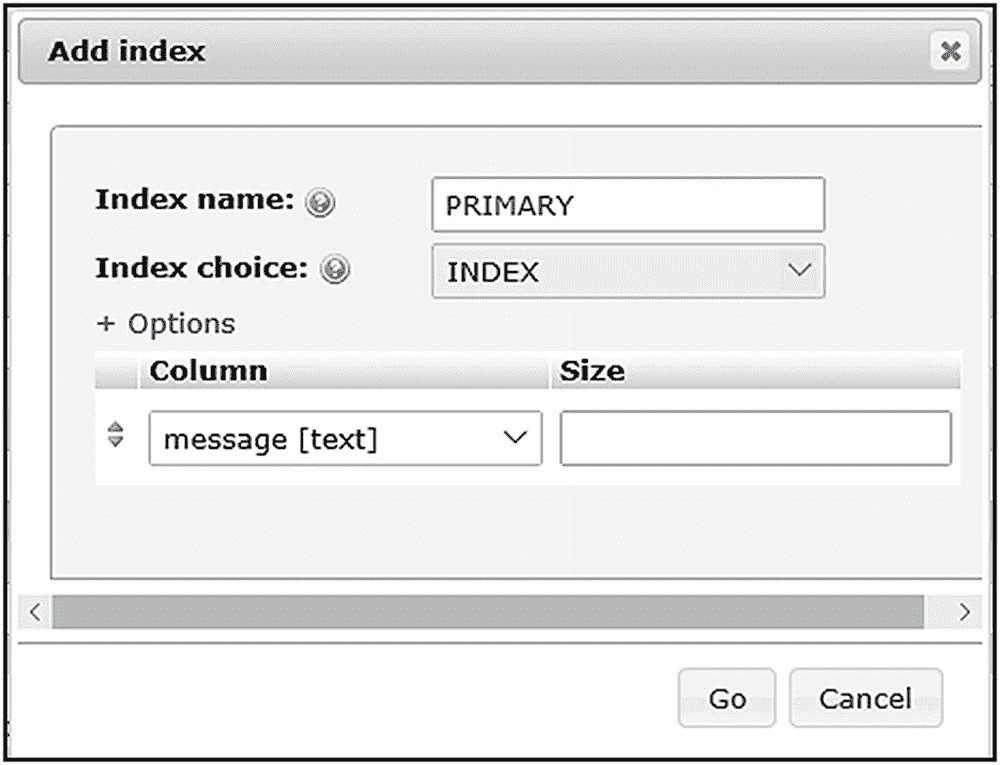

图 10-1

添加索引对话框

接下来，我们将检查网站的一些页面。

为留言板创建主页

主页上显示了一些例子来鼓励人们注册。注册并登录后，他们将能够查看更多报价，还可以向收藏中添加报价。如果您喜欢从头开始创建表格，则在填充消息表格之前，主页上不会显示报价(消息)。

图 [10-2](#Fig2) 显示了填充表格后的主页。

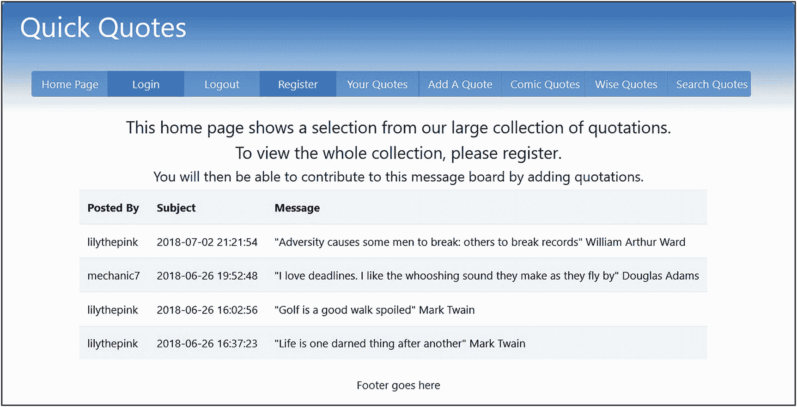

图 10-2

表格被填充，因此主页显示四个引号

清单 [10-2a](#PC2) 显示了生成主页的代码。

```php
<?php // Start the session.
session_start() ;
     if ( isset( $_SESSION[ 'member_id' ] ) )
                 { $menu = 1;}
     else { $menu = 5; }
?>
<!DOCTYPE html>
<html lang="en">
<head>
     <title>Message Board Home Page</title>
     <meta charset="utf-8">
     <meta name="viewport" content=
                 "width=device-width, initial-scale=1, shrink-to-fit=no">
     <!-- Bootstrap CSS File -->
     <link rel="stylesheet"
                 href="https://stackpath.bootstrapcdn.com/bootstrap/4.1.0/css/bootstrap.min.css"
                 integrity="sha384-9gVQ4dYFwwWSjIDZnLEWnxCjeSWFphJiwGPXr1jddIhOegiu1FwO5qRGvFXOdJZ4"
                 crossorigin="anonymous">
     <link rel="stylesheet" type="text/css" href="msgboard.css">
</head>
<body>
     <div class="container"
              style="margin-top:30px;border: 2px black solid;">
     <!-- Header Section -->
     <header class="jumbotron text-center row" id="includeheader"
         style="margin-bottom:2px;
         background:linear-gradient(#0073e6, white); padding:10px;">
             <?php include('includes/header.php'); ?>
     </header>
<!-- Body Section -->
<div class="content mx-auto" id="contents">
<div class="row mx-auto" style="padding-left: 0px; height: auto;">
<div class="col-sm-12">
     <h4 class="text-center">
         This home page shows a selection from our large collection
             of quotations.</h4>
         <h4 class="text-center">To view the whole collection,
             please register. </h4>
         <h5 class="text-center">You will then be able to contribute to
             this message board by adding quotations.</h5>
     <?php
     // Connect to the database
     require ( 'mysqli_connect.php' ) ;
     // Make the query
     $query =
     "SELECT user_name,post_date, subject, message FROM forum LIMIT 4" ;
     $result = mysqli_query( $dbcon, $query ) ;
     if ( mysqli_num_rows( $result ) > 0 )
     {
             ?>
             <table class="table table-responsive table-striped col-sm-12"
             style="background: white;color:black; padding-left: 80px;">
                    <tr>
                                 <th scope="col">Posted By</th>
                                 <th scope="col">Subject</th>
                                 <th scope="col">Message</th>
                    </tr>
             <?php
             while ( $row = mysqli_fetch_array( $result, MYSQLI_ASSOC ))
             {
                    $user_name =
                    htmlspecialchars($row['user_name'], ENT_QUOTES);
                    $post_date =
                    htmlspecialchars($row['post_date'], ENT_QUOTES);
                    $message =
                    htmlspecialchars($row['message'], ENT_QUOTES);
                    echo '<tr>
                                 <td scope="row">' . $user_name . '</td>
                                 <td scope="row">' . $post_date . '</td>
                                 <td scope="row">' . $message . '</td>
                    </tr>';
             }
             echo '</table>' ;
     }
     else { echo '<p class="text-center">
               There are currently no messages.</p>' ; }
     mysqli_close( $dbcon ) ;
?>
</div>
</div>
<footer class="jumbotron row mx-auto" id="includefooter"
     style="padding-bottom:1px; margin: 0px; padding-top:8px;
             background-color:white;">
     <div class="col-sm-12 text-center">
             <?php include('includes/footer.php'); ?>
  </div>
</footer>
</div>
</div>
</body>
</html>

Listing 10-2aCreating the Home Page for the Forum’s Website (index.php)

```

标题使用了一个 case 语句，其中包含了本章所要求的每个水平菜单按钮，但是不同的按钮将被禁用以适应每个页面。

清单 [10-2b](#PC3) 给出了索引页面的主页标题代码段的代码。

```php
<meta name="viewport" content="width=device-width, initial-scale=1">
<script src=
"https://ajax.googleapis.com/ajax/libs/jquery/3.3.1/jquery.min.js">
</script>
<script src=
"https://cdnjs.cloudflare.com/ajax/libs/popper.js/1.14.0/umd/popper.min.js">
    </script>
<script src="https://maxcdn.bootstrapcdn.com/bootstrap/4.1.0/js/bootstrap.min.js">
    </script>
<div class="col-sm-8">
    <h1 class="mb-4 font-bold float-left" style="color:white">
             <?php
             if (!empty($_GET['name'])) {
                        $name =
                        filter_var( $_GET['name'], FILTER_SANITIZE_STRING);
                        echo $name;
             }
             else { echo "Quick Quotes"; }
             ?>
    </h1>
</div>
    <nav class="float-left navbar navbar-expand-xl navbar-trans navbar-light">
        <button class="navbar-toggler" type="button" data-toggle="collapse" data-target="#collapsibleMenu">
    <span class="navbar-toggler-icon"></span>
  </button>
      <div class="btn-group btn-group-md collapse navbar-collapse navbar" id="collapsibleMenu"  role="group" aria-label="Button Group">   <?php
              switch ($menu) {
                      case 1: //index.php
                      ?>
                               <button type="button" style="width: 110px;"
                               class="btn btn-secondary bg-primary disabled"
                               onclick="location.href = "">Home Page
                               </button>

                               <button type="button" style="width: 110px;"
                               class="btn btn-secondary bg-primary disabled"
                               onclick="location.href = "" >Login
                               </button>

                               <button type="button" style="width: 110px;"
                               class="btn btn-secondary bg-primary"
                               onclick="location.href =
                               'logout.php?name=Logout'">Logout
                               </button>

                               <button type="button" style="width: 110px;"
                               class="btn btn-secondary bg-primary disabled"
                               onclick="location.href = "" >Register
                               </button>

                               <button type="button" style="width: 120px;"
                               class="btn btn-secondary bg-primary"
                               onclick="location.href =
                               'view_posts.php?name=Your Quotes'" >
                               Your Quotes
                               </button>

                               <button type="button" style="width: 120px;"
                               class="btn btn-secondary bg-primary"
                               onclick="location.href =
                               'post.php?name=Add A Quote'">Add A Quote
                               </button>

                               <button type="button" style="width: 120px;"
                               class="btn btn-secondary bg-primary"
                               onclick="location.href =
                               'forum_c.php?name=Comic Quotes'" >
                               Comic Quotes
                               </button>

                               <button type="button" style="width: 120px;"
                               class="btn btn-secondary bg-primary"
                               onclick="location.href =
                               'forum_w.php?name=Wise Quotes'">
                               Wise Quotes
                               </button>

                               <button type="button" style="width: 120px;" class=
                               "btn btn-secondary bg-primary"
                               onclick="location.href =
                               'search.php?name=Search Quotes'" >
                               Search Quotes
                               </button>
              <?php
              break;

Listing 10-2bCreating the Header for the Home Page (includes/header.php)

```

标题使用一个水平菜单，在页面上为成员的发帖和回复提供最大的空间。清单 [10-2b](#PC3) 中显示的代码段包括引导代码，用于在较小的设备(手机)中将菜单更改为“煎饼菜单”。case 语句的第一段(case 1)演示了用户登录时索引页面菜单的状态。除了“登录”和“注册”按钮之外，所有按钮都已启用。如果用户未登录，不同的按钮块(情况 5，未显示)将仅显示登录和注册按钮为活动状态(如图 [10-2](#Fig2) 所示)。

```php
<?php // Start the session.
session_start() ;
     if ( isset( $_SESSION[ 'member_id' ] ) )
                 { $menu = 1;}
     else { $menu = 5; }
?>

```

索引页面代码的顶部(清单 [10-2a](#PC2) )包含了前一段。该段通过搜索 member_id 值来确定显示哪个菜单。如果存在，则用户已经登录。变量$menu 设置为 1，这将激活除登录和注册之外的所有按钮。如果 member_id 值不存在，则用户尚未登录。变量$menu 设置为 5。案例 5 的菜单块(在 header.php 文件的*中)仅激活登录和注册按钮。*

### 注意

目前，很少有按钮工作，因为我们还没有创建其他页面。这将在我们创建一些数据后得到纠正。

下一步将是创建注册页面，以便我们可以注册一些成员数据。

## 创建注册表单

登记表是第 [7](07.html) 章中表格的简化版。形式如图 [10-3](#Fig3) 所示。

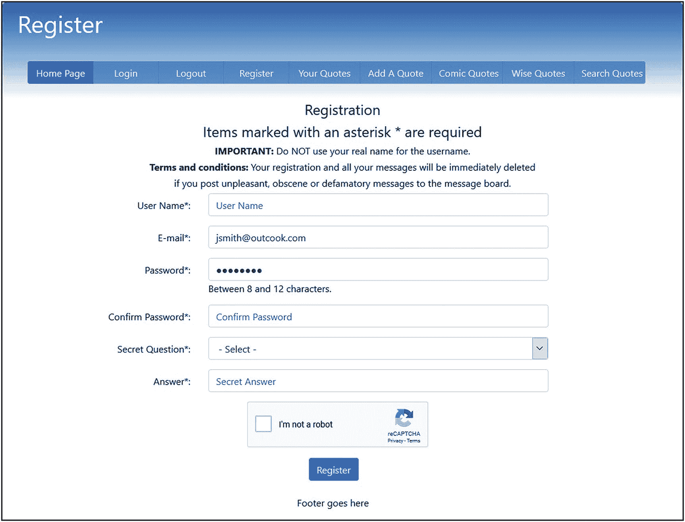

图 10-3

注册页面

如前所述，用户名不是成员的真实姓名，而是匿名登录网站的假名。

清单 [10-3a](#PC5) 显示了注册表单的代码，并将一条记录插入到成员表中，清单 [10-3b](#PC6) 给出了 PHP 代码。

```php
<?php
$menu = 2;
if ($_SERVER['REQUEST_METHOD'] == 'POST') {
//require("cap.php");
}
?>
<!DOCTYPE html>
<html lang="en">
<head>
        <title>Register Page</title>
        <meta charset="utf-8">
        <meta name="viewport" content=
"width=device-width, initial-scale=1, shrink-to-fit=no">
        <!-- Bootstrap CSS File -->
        <link rel="stylesheet"
href=
"https://stackpath.bootstrapcdn.com/bootstrap/4.1.0/css/bootstrap.min.css"
                integrity=
"sha384-9gVQ4dYFwwWSjIDZnLEWnxCjeSWFphJiwGPXr1jddIhOegiu1FwO5qRGvFXOdJZ4"
                crossorigin="anonymous">
   <script src="verify.js"></script>
   <script src='https://www.google.com/recaptcha/api.js'></script>
</head>
<body>
<div class="container" style="margin-top:30px;border: 2px black solid;">
<!-- Header Section -->
<header class="jumbotron text-center row" id="includeheader"
style="margin-bottom:2px;
background:linear-gradient(#0073e6, white); padding:10px;
padding-right: 5px;">
                <?php include('includes/header.php'); ?>
</header>
<!-- Body Section -->
<div class="content mx-auto" id="contents">
<div class="row mx-auto" style="padding-left: 0px; height: auto;">
<div class="col-sm-12">
<h4 class="text-center">Registration</h4>
<h4 class="text-center">Items marked with an asterisk *
are required</h4>
<h6 class="text-center"><strong>IMPORTANT:</strong> Do NOT
use your real name for the username.</h6>
<h6 class="text-center"><strong>Terms and conditions:</strong>
Your registration and all your messages
will be immediately deleted </h6>
<h6 class="text-center">if you post unpleasant, obscene or
defamatory messages to the message board.</h6>
<?php
try {
if ($_SERVER['REQUEST_METHOD'] == 'POST') {
                require('process-register-page.php');
} // End of the main Submit conditional.
?>
<div class="col-sm-10">
<form action="safer-register-page.php" method="post"
onsubmit="return checked();" name="regform" id="regform">
<div class="form-group row">
   <label for="user_name" class="col-sm-4 col-form-label text-right">
User Name*:</label>
    <div class="col-sm-8">
<input type="text" class="form-control" id="user_name"
        name="user_name"
                        pattern="[a-zA-Z][a-zA-Z0-9\s]*" title=
"Alphabetic, numeric and space only max of 30 characters"
                        placeholder="User Name" maxlength="30" required
                        value=
                                "<?php if (isset($_POST['user_name']))
                        echo htmlspecialchars($_POST['user_name'], ENT_QUOTES);
                        ?>" >
    </div>
</div>
<div class="form-group row">
<label for="email" class="col-sm-4 col-form-label text-right">
E-mail*:</label>
<div class="col-sm-8">
        <input type="email" class="form-control" id="email"
name="email" placeholder="E-mail" maxlength="60"
required
                        value=
                                "<?php if (isset($_POST['email']))
                        echo htmlspecialchars($_POST['email'], ENT_QUOTES);
?>" >
    </div>
</div>
<div class="form-group row">
<label for="password1" class="col-sm-4 col-form-label
text-right">Password*:</label>
<div class="col-sm-8">
      <input type="password" class="form-control" id="password1"
                        name="password1"
                        pattern="(?=.*\d)(?=.*[a-z])(?=.*[A-Z]).{8,12}"
                        title=
"One number, one upper, one lower, one special, with 8 to 12 characters"
                placeholder="Password" minlength="8" maxlength="12" required
                        value=
                            "<?php if (isset($_POST['password1']))
                echo htmlspecialchars($_POST['password1'], ENT_QUOTES); ?>" >
                        <span id="message">Between 8 and 12 characters.</span>
    </div>
</div>
<div class="form-group row">
<label for="password2" class="col-sm-4 col-form-label text-right">
Confirm Password*:</label>
<div class="col-sm-8">
      <input type="password" class="form-control" id="password2"
        name="password2"
              pattern="(?=.*\d)(?=.*[a-z])(?=.*[A-Z]).{8,12}"
                        title=
"One number, one uppercase, one lowercase letter, with 8 to 12 characters"
                        placeholder=
"Confirm Password" minlength="8" maxlength="12" required
                        value=
                                "<?php if (isset($_POST['password2']))
                echo htmlspecialchars($_POST['password2'], ENT_QUOTES); ?>" >
    </div>
</div>
<div class="form-group row">
<label for="question" class="col-sm-4 col-form-label text-right">
          Secret Question*:</label>
<div class="col-sm-8">
          <select id="question" class="form-control">
                        <option selected value="">- Select -</option>
<option value="Maiden">Mother's Maiden Name</option>
                        <option value="Pet">Pet's Name</option>
                        <option value="School">High School</option>
                        <option value="Vacation">Favorite Vacation Spot</option>
                </select>
        </div>
</div>
<div class="form-group row">
<label for="secret" class="col-sm-4 col-form-label
text-right">Answer*:</label>
<div class="col-sm-8">
      <input type="text" class="form-control" id="secret" name="secret"
                pattern="[a-zA-Z][a-zA-Z\s\.\,\-]*"
                title="Alphabetic, period, comma, dash and space only max of 30
                        characters"
                placeholder="Secret Answer" maxlength="30" required
                value=
                        "<?php if (isset($_POST['secret']))
                        echo htmlspecialchars($_POST['secret'], ENT_QUOTES); ?>" >
  </div>
</div>
<div class="form-group row">
<label class="col-sm-4 col-form-label"></label>
<div class="col-sm-8" style="padding-left: 80px;">
<div class="float-left g-recaptcha"
data-sitekey=
"6LcrQ1wUAAAAAPxlrAkLuPdpY5qwS9rXF1j46fhq"></div>
</div>
</div>
<div class="form-group row">
<label for="" class="col-sm-3 col-form-label"></label>
<div class="col-sm-8 text-center">
        <input id="submit" class="btn btn-primary" type="submit" name="submit"
        value="Register">
</div>
</div>
</form>
</div>
</div>
</div>
<!-- Footer Section -->
<footer class="jumbotron row mx-auto" id="includefooter"
style="padding-bottom:1px; margin: 0px; padding-top:8px;
padding-left: 0px; background-color:white;">
<div class="col-sm-12 text-center">
                <?php include('includes/footer.php'); ?>
  </div>
</footer>
</div>
</div>
<?php
}
catch(Exception $e) // We finally handle any problems here
 {
// print "An Exception occurred. Message: " . $e->getMessage();
        print "The system is busy please try later";
        //  $date = date('m.d.y h:i:s');
        //  $errormessage = $e->getMessage();
        //  $eMessage = $date . " | Exception Error | " , $errormessage . |\n";
        //   error_log($eMessage,3,ERROR_LOG);
// e-mail support person to alert there is a problem
        //  error_log("Date/Time: $date – Exception Error, Check error log for
//details", 1, noone@helpme.com, "Subject: Exception Error \nFrom:
// Error Log <errorlog@helpme.com>" . "\r\n");
 }
catch(Error $e)
 {
   // print "An Error occurred. Message: " . $e->getMessage();
   print "The system is busy please try later";
   // $date = date('m.d.y h:i:s');
   // $errormessage = $e->getMessage();
   // $eMessage = $date . " | Error | " , $errormessage . |\n";
   // error_log($eMessage,3,ERROR_LOG);
   // e-mail support person to alert there is a problem
        //  error_log("Date/Time: $date – Error, Check error log for
//details", 1, noone@helpme.com, "Subject: Error \nFrom: Error Log
// <errorlog@helpme.com>" . "\r\n");
 }
 ?>
</body>
</html>

Listing 10-3aCreating the Registration Page (safer-register-page.php)

```

```php
<?php
define("ERROR_LOG","errors.log");
// Has the form been submitted?
try {
require ('mysqli_connect.php'); // Connect to the database
$errors = array(); // Initialize an error array.
// --------------------check the entries-------------
// Trim the first name
        $user_name = filter_var( $_POST['user_name'], FILTER_SANITIZE_STRING);
if ((!empty($user_name)) && (preg_match('/[a-z0-9\s]/i',$user_name)) &&
                (strlen($user_name) <= 30)) {
                //Save the trimmed first name
        $user_nametrim = $user_name;
        }else{
                $errors[] =
'First name missing or not alphabetic, numeric and space characters.
        Max 30';
        }
// Check that an email address has been entered
        $emailtrim = filter_var( $_POST['email'], FILTER_SANITIZE_EMAIL);
        if  ((empty($emailtrim)) ||
(!filter_var($emailtrim, FILTER_VALIDATE_EMAIL))
                        || (strlen($emailtrim > 60))) {
                $errors[] = 'You forgot to enter your email address';
                $errors[] = ' or the e-mail format is incorrect.';
        }
// Check for a password and match against the confirmed password:
$password1trim = filter_var( $_POST['password1'], FILTER_SANITIZE_STRING);
if (empty($password1trim)){   //
$errors[] ='Please enter a valid password';
}
else {
if(!preg_match(
'/^(?=.*[a-z])(?=.*[A-Z])(?=.*\d)(?=.*[#$@!%&*?])
[A-Za-z\d#$@!%&*?]{8,12}$/',
$password1trim)) {  //
$errors[] =
'Invalid password, 8 to 12 chars, one upper, one lower,
one number, one special.';
} else
{
$password2trim =
filter_var( $_POST['password2'], FILTER_SANITIZE_STRING);
if($password1trim === $password2trim) { //
$password = $password1trim;
}else{
$errors[] = 'Your two passwords do not match.';
$errors[] = 'Please try again';
}
}
}
//Is the secret present? If it is, sanitize it
$secret = filter_var( $_POST['secret'], FILTER_SANITIZE_STRING);
if ((!empty($secret)) && (preg_match('/[a-z\.\s\,\-]/i', $secret)) &&
        (strlen($secret) <= 30)) {
        //Sanitize the trimmed city
        $secrettrim = $secret;
}else{
        $errors[] =
'Missing city. Only alphabetic, period, comma, dash and space. Max 30.';
}
if (empty($errors)) { // If everything's OK.
// If no problems encountered, register user in the database
//Determine whether the email address has already been registered
$query = "SELECT user_name FROM members WHERE email = ? ";
$q = mysqli_stmt_init($dbcon);
mysqli_stmt_prepare($q, $query);
mysqli_stmt_bind_param($q,'s', $emailtrim);
mysqli_stmt_execute($q);
$result = mysqli_stmt_get_result($q);

if (mysqli_num_rows($result) == 0){
//The email address has not been registered
//already therefore register the user in the users table
                        //-------------Valid Entries - Save to database -----
                //Start of the SUCCESSFUL SECTION. i.e.
//all the required fields were filled out
                $hashed_password = password_hash($password, PASSWORD_DEFAULT);
                // Register the user in the database...
                // Register the user in the database...
                $query =
"INSERT INTO members (member_id, user_name, email,
        passcode, secret, reg_date) ";
        $query .= "VALUES(' ', ?, ?, ?, ?, NOW() )";
$q = mysqli_stmt_init($dbcon);
mysqli_stmt_prepare($q, $query);
// use prepared statement to ensure that only text is inserted
// bind fields to SQL Statement
mysqli_stmt_bind_param($q, 'ssss', $user_nametrim, $emailtrim,
        $hashed_password, $secrettrim);
// execute query
mysqli_stmt_execute($q);
if (mysqli_stmt_affected_rows($q) == 1) {
                        header ("location: register-thanks.php");
                } else {
                        // echo 'Invalid query:' . $dbcon->error;
                $errorstring = "System is busy, please try later";
echo "<p class=' text-center col-sm-2' style='color:red'>$errorstring</p>";
                }
        }else{//The email address is already registered
        $errorstring = 'The email address is already registered.';
echo "<p class=' text-center col-sm-2'
style='color:red'>$errorstring</p>";
}
} else {//End of SUCCESSFUL SECTION
// ---------------Process User Errors---------------
// Display the users entry errors
$errorstring = 'Error! The following error(s) occurred: ';
foreach ($errors as $msg) { // Print each error.
$errorstring .= " - $msg<br>\n";
    }
$errorstring .= 'Please try again.';
echo "<p class=' text-center col-sm-2'
        style='color:red'>$errorstring</p>";
}// End of if (empty($errors)) IF.
}
catch(Exception $e) // We finally handle any problems here
{
// print "An Exception occurred. Message: " . $e->getMessage();
print "The system is busy please try later";
//  $date = date('m.d.y h:i:s');
//  $errormessage = $e->getMessage();
//  $eMessage = $date . " | Exception Error | " , $errormessage . |\n";
//   error_log($eMessage,3,ERROR_LOG);
// e-mail support person to alert there is a problem
//  error_log("Date/Time: $date – Exception Error, Check error log for
//details", 1, noone@helpme.com, "Subject: Exception Error \nFrom:
//Error Log <errorlog@helpme.com>" . "\r\n");
}
catch(Error $e)
{
// print "An Error occurred. Message: " . $e->getMessage();
print "The system is busy please try later";
// $date = date('m.d.y h:i:s');
// $errormessage = $e->getMessage();
// $eMessage = $date . " | Error | " , $errormessage . |\n";
// error_log($eMessage,3,ERROR_LOG);
// e-mail support person to alert there is a problem
//  error_log("Date/Time: $date – Error, Check error log for
//details", 1, noone@helpme.com, "Subject: Error \nFrom:
//Error Log <errorlog@helpme.com>" . "\r\n");
}
?>

Listing 10-3bChecking the Registration Page (process-register-page.php)

```

不需要对代码进行解释，因为它类似于第 [7](07.html) 章中的登记表。

### 注意

大多数菜单项都被禁用，只有主页按钮处于活动状态。主页标题上的注册按钮现在可以工作了，因为它可以链接到我们新创建的注册页面。

### “谢谢”页面

如果注册成功，显示“谢谢”，如图 [10-4](#Fig4) 所示。


图 10-4

“谢谢”页面

### 注意

在*safer-register-page.php*中使用的按钮块(情况 2)在“谢谢”文件中使用。只有主页是活动的。

清单 [10-4](#PC7) 显示了“谢谢”页面的代码。

```php
<?php
        $menu = 2;
?>
<!DOCTYPE html>
<html lang="en">
<head>
        <title>Thank You Page</title>
        <meta charset="utf-8">
        <meta name="viewport" content="width=device-width, initial-scale=1, shrink-to-fit=no">
        <!-- Bootstrap CSS File -->
        <link rel="stylesheet"
                href="https://stackpath.bootstrapcdn.com/bootstrap/4.1.0/css/bootstrap.min.css"
                integrity=
        "sha384-9gVQ4dYFwwWSjIDZnLEWnxCjeSWFphJiwGPXr1jddIhOegiu1FwO5qRGvFXOdJZ4"
                crossorigin="anonymous">
        <link rel="stylesheet" type="text/css" href="msgboard.css">
</head>
<body>
<div class="container" style="margin-top:30px;border: 2px black solid;">
<!-- Header Section -->
<header class="jumbotron text-center row" id="includeheader"
        style="margin-bottom:2px; background:linear-gradient(#0073e6, white); padding:10px;">
        <?php include('includes/header.php'); ?>
</header>
<!-- Body Section -->
<div class="content mx-auto" id="contents">
<div class="row mx-auto" style="padding-left: 0px; height: auto;">
<div class="col-sm-12">
        <h4 class="text-center">Thank you for registering</h4>
        <h5 class="text-center">On the Home Page, you will now be able to login</h5>
        <h5 class="text-center">and add new quotes to the message board.</h5>
</div>
</div>
<footer class="jumbotron row mx-auto" id="includefooter"
        style="padding-bottom:1px; margin: 0px; padding-top:8px; background-color:white;">
        <div class="col-sm-12 text-center">
                <?php include('includes/footer.php'); ?>
        </div>
</footer>
</div>
</div>
</body>

Listing 10-4Creating the “Thank You” Page (register-thanks.php)

```

## 推广成员表

现在您已经有了一个注册表单，您可以使用标题中的 Register 按钮来注册表 [10-3](#Tab3) 中给出的成员，或者您可以导入可下载的 SQL 文件。

表 10-3

成员表的属性

<colgroup><col class="tcol1"> <col class="tcol2"> <col class="tcol3"></colgroup> 
| 

用户名

 | 

电子邮件地址

 | 

密码

 |
| --- | --- | --- |
| 粉红色的百合 | jsmith@myisp.co.uk | 砰砰砰！3b33 |
| 巨人台阶 12 | ndean@myisp.co.uk | 第三季第 1 集 |
| 机械 7 | jdoe@myisp.co.uk | -= ytet-伊甸园字幕组=-翻译:粒粒粒尘紫月猫姐 scenery 校对 |
| 内衣 | jsmith@outcook.com | D0gs0dy！2 |
| 神话之王 | 亚瑟@myisp.net | Cam@10t4 |

成员将自动拥有默认的 member_level 值零。为了节省空间，在本教程中，我们没有包括管理设施。如果要添加此功能，请将成员注册为管理员，member_level 值为 1。然后为他们提供管理页面，如前几章所述。如果没有这个特性，网站管理员将需要监控最新的帖子，并使用 phpMyAdmin 删除任何攻击性的帖子。

现在我们有了一些注册会员，他们可以登录了。

## 登录页面

图 [10-5](#Fig5) 显示登录页面。

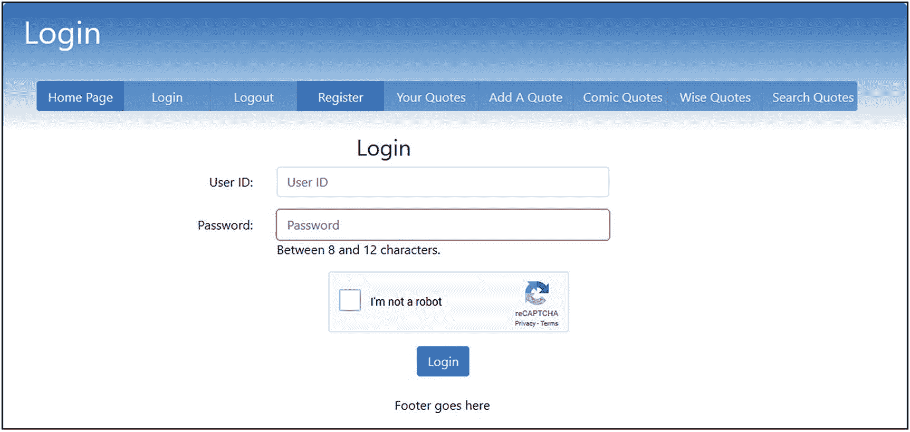

图 10-5

登录页面

清单 [10-5a](#PC8) 给出了登录页面的代码。

标题块(情况 3)禁用除注册和主页之外的所有按钮。这段代码处理来自登录表单的提交。

```php
<?php
if ($_SERVER['REQUEST_METHOD'] == 'POST') {
      //require("cap.php");
}
$menu = 3;
?>
<!DOCTYPE html>
<html lang="en">
<head>
      <title>Login Page</title>
      <meta charset="utf-8">
      <meta name="viewport"
              content="width=device-width, initial-scale=1, shrink-to-fit=no">
      <!-- Bootstrap CSS File -->
      <link rel="stylesheet"
              href=
"https://stackpath.bootstrapcdn.com/bootstrap/4.1.0/css/bootstrap.min.css"
              integrity="sha384-9gVQ4dYFwwWSjIDZnLEWnxCjeSWFphJiwGPXr1jddIhOegiu1FwO5qRGvFXOdJZ4"
              crossorigin="anonymous">
      <script src='https://www.google.com/recaptcha/api.js'></script>
      <link rel="stylesheet" type="text/css" href="msgboard.css">
</head>
<body>
      <div class="container"
              style="margin-top:30px;border: 2px black solid;">
      <!-- Header Section -->
      <header class="jumbotron text-center row" id="includeheader"
              style="margin-bottom:2px;
              background:linear-gradient(#0073e6,whit1); padding:20px;">
              <?php include('includes/header.php'); ?>
      </header>
      <!-- Body Section -->
      <div class="content mx-auto" id="contents">
      <div class="row mx-auto" style="padding-left: 0px; height: auto;">
      <div class="col-sm-12">
      <?php
      if ($_SERVER['REQUEST_METHOD'] == 'POST') {                                       //#1
               require('process-login.php');
      }
      ?>
      <!-- Display the login form fields -->
      <div class="col-sm-10">
                <h3 class="h3 text-center">
                         <?php if(empty($errorstring)) { echo "Login"; }
                                  else { echo $errorstring; }
                         ?>
                </h3>
      <form action="login.php" method="post" name="loginform" id="loginform">
                <div class="form-group row">
      <label for="user_name" class="col-sm-4 col-form-label text-right">
                User ID:</label>
      <div class="col-sm-6">
        <input type="user_name" class="form-control" id="user_name"
                         name="user_name"
                         placeholder="User ID" maxlength="30" size="30" required
                         value=
                         "<?php if (isset($_POST['user_name']))
              echo htmlspecialchars($_POST['user_name'], ENT_QUOTES); ?>" >
    </div>
</div>
<div class="form-group row">
    <label for="passcode" class="col-sm-4 col-form-label
                text-right">Password:</label>
    <div class="col-sm-6">
                <input type="password" class="form-control" id="passcode"
                         name="passcode"
                         pattern="(?=.*\d)(?=.*[a-z])(?=.*[A-Z]).{8,12}"
                         title="One number, one upper, one lower, one special,
                                 with 8 to 12 characters"
                         placeholder="Password" minlength="8" maxlength="12"
                         required
                         value=
                         "<?php if (isset($_POST['passcode']))
                echo htmlspecialchars($_POST['passcode'], ENT_QUOTES); ?>" >
                         <span id="message">Between 8 and 12 characters.</span>
    </div>
</div>
<div class="form-group row">
     <label class="col-sm-4 col-form-label"></label>
<div class="col-sm-8" style="padding-left: 80px;">
<div class="float-left g-recaptcha" data-sitekey=
              "6LcrQ1wUAAAAAPxlrAkLuPdpY5qwS9rXF1j46fhq"></div>
</div>
</div>
<div class="form-group row">
     <label for="" class="col-sm-3 col-form-label"></label>
<div class="col-sm-8 text-center">
     <input id="submit" class="btn btn-primary" type="submit" name="submit"
             value="Login">
     </div>
   </div>
</form>
</div>
</div>
</div>
<footer class="jumbotron row mx-auto" id="includefooter"
     style="padding-bottom:1px; margin: 0px; padding-left: 0px;
     padding-top:8px; background-color:white;">
     <div class="col-sm-12 text-center">
          <?php include('includes/footer.php'); ?>
     </div>
</footer>
</div>
</div>
</body>
</html>

Listing 10-5aCreating the Login Page (login.php)

```

### 代码的解释

您之前已经看到了所有的代码，但是编号为#1 的行引用了一个需要解释的文件。

```php
if ($_SERVER['REQUEST_METHOD'] == 'POST') {                                             //#1
         require('process-login.php');
}

```

名为*process-login.php*的文件启动登录过程。清单 [10-5b](#PC10) 中给出了代码。

```php
<?php
        define('ERROR_LOG',"errors.log");
        // This section processes submissions from the login form
        // Check if the form has been submitted:
        if ($_SERVER['REQUEST_METHOD'] == 'POST') {
        //connect to database
        try {
                require ('mysqli_connect.php');
                // Check that user name has been entered
                $user_name = filter_var( $_POST['user_name'], FILTER_SANITIZE_STRING);
                if  ((empty($user_name))
                        || (strlen($user_name > 30))) {
                        $errors[] = 'You forgot to enter your User ID';
                        $errors[] = ' or the User ID format is incorrect.';
                }
        // Check for a password and match against the confirmed password:
        $password = filter_var( $_POST['passcode'], FILTER_SANITIZE_STRING);
        //$string_length = strlen($password);
        if (empty($password)){
                $errors[] ='Please enter a valid password';
        }
        else {
                if(!preg_match(
                '/^(?=.*[a-z])(?=.*[A-Z])(?=.*\d)(?=.*[#$@!%&*?])[A-Za-z\d#$@!%&*?]{8,12}$/',
                        $password)) {
                $errors[] = 'Invalid password, 8 to 12 chars, one upper, one lower, one number, one special.';
        }
}
  if (empty($errors)) { // If everything's OK.
        // Retrieve the user_id, psword, first_name and user_level for that
        // email/password combination
        $query = "SELECT member_id, passcode, user_name FROM members ";
        $query .= "WHERE user_name=?";
        $q = mysqli_stmt_init($dbcon);
        mysqli_stmt_prepare($q, $query);
                // bind $user_name to SQL Statement
        mysqli_stmt_bind_param($q, "s", $user_name);
        // execute query
        mysqli_stmt_execute($q);
        $result = mysqli_stmt_get_result($q);
        $row = mysqli_fetch_array($result, MYSQLI_NUM);
        if (mysqli_num_rows($result) == 1) {
                //if one database row (record) matches the input:-
                // Start the session, fetch the record and insert the
                // values in an array
                if (password_verify($password, $row[1])) {
                        session_start();
                        $_SESSION[ 'member_id' ] = $row[0];
                        $_SESSION[ 'user_name' ] = $row[2] ;
                        header ( 'Location: forum.php' ) ;
                } else { // No password match was made.
                        $errors[] = 'User ID/Password entered does not match our records. ';
                        $errors[] = 'Perhaps you need to register, just click the Register ';
                        $errors[] = 'button on the header menu';
                }
        } else { // No e-mail match was made.
                $errors[] = 'User ID/Password entered does not match our records. ';
                $errors[] = 'Perhaps you need to register, just click the Register ';
                $errors[] = 'button on the header menu';
        }
}
if (!empty($errors)) {
                $errorstring = "Error! <br /> The following error(s) occurred:<br>";
                foreach ($errors as $msg) { // Print each error.
                        $errorstring .= " $msg<br>\n";
                }
                $errorstring .= "Please try again.<br>";
                }// End of if (!empty($errors)) IF.

}
catch(Exception $e) // We finally handle any problems here
   {
        // print "An Exception occurred. Message: " . $e->getMessage();
        print "The system is busy please try later";
        //  $date = date('m.d.y h:i:s');
        //  $errormessage = $e->getMessage();
        //  $eMessage = $date . " | Exception Error | " , $errormessage . |\n";
        //   error_log($eMessage,3,ERROR_LOG);
        // e-mail support person to alert there is a problem
        //  error_log("Date/Time: $date – Exception Error, Check error log for
        //details", 1, noone@helpme.com, "Subject: Exception Error \nFrom:
        // Error Log <errorlog@helpme.com>" . "\r\n");
   }
catch(Error $e)
   {
        // print "An Error occurred. Message: " . $e->getMessage();
        print "The system is busy please try later";
        // $date = date('m.d.y h:i:s');
        // $errormessage = $e->getMessage();
        // $eMessage = $date . " | Error | " , $errormessage . |\n";
        // error_log($eMessage,3,ERROR_LOG);
        // e-mail support person to alert there is a problem
        //  error_log("Date/Time: $date – Error, Check error log for
        //details", 1, noone@helpme.com, "Subject: Error \nFrom:
        // Error Log <errorlog@helpme.com>" . "\r\n");
   }
}
?>

Listing 10-5bCreating the Code for Processing the Login (process_login.php)

```

验证与前几章相同。如果登录失败，它会显示错误消息。

## 注销

注销是一项重要的安全功能。除非用户注销(或关闭浏览器)，否则会话仍然是活动的，并且有人可以访问和更改信息。清单 [10-5c](#PC11) 显示了注销页面的代码。

```php
<?php
session_start();//access the current session.
// if no session variable exists then redirect the user
if (!isset($_SESSION['member_id'])) {
header("location:index.php");
exit();
//cancel the session and redirect the user:
}else{ //cancel the session
    $_SESSION = array(); // Destroy the variables
        $params = session_get_cookie_params();
        // Destroy the cookie
        setcookie(session_name(), ", time()-42000,
        $params["path"], $params["domain"],
        $params["secure"], $params["httponly"]);
if (session_status() == PHP_SESSION_ACTIVE) {
session_destroy(); } // Destroy the session itself
header("location:index.php");
        }

Listing 10-5cCreating the Logout File (logout.php)

```

用户注销后，只能访问登录或注册页面以及主页。前面描述的登录页面将注册用户重定向到论坛页面，在那里他们可以选择查看哪个论坛。接下来描述论坛页面。

## 创建选择报价的途径

门户页面允许成员选择要查看的类别，如图 [10-6](#Fig6) 所示。


图 10-6

forum.php 页面允许用户选择要查看的报价类别

清单 10-6 给出了网关页面的代码。

标题块(*header.php*的情况 4)激活除登录和注册之外的所有按钮，因为用户现在已经登录。

```php
<?php
// Start the session.
session_start() ;
//Redirect if not logged in.
if ( !isset( $_SESSION[ 'member_id' ] ) )
       { header("Location: login.php");
                exit(); }
$menu = 4;
?>
<!DOCTYPE html>
<html lang="en">
<head>
       <title>Thank You Page</title>
       <meta charset="utf-8">
       <meta name="viewport" content="width=device-width,
                initial-scale=1, shrink-to-fit=no">
       <!-- Bootstrap CSS File -->
       <link rel="stylesheet"
                 href="https://stackpath.bootstrapcdn.com/bootstrap/4.1.0/css/bootstrap.min.css"
                 integrity="sha384-9gVQ4dYFwwWSjIDZnLEWnxCjeSWFphJiwGPXr1jddIhOegiu1FwO5qRGvFXOdJZ4"
                 crossorigin="anonymous">
       <link rel="stylesheet" type="text/css" href="msgboard.css">
</head>
<body>
       <div class="container" style="margin-top:30px;border:
                2px black solid;">
       <!-- Header Section -->
       <header class="jumbotron text-center row" id="includeheader"
               style="margin-bottom:2px;
               background:linear-gradient(#0073e6,white); padding:10px;">
               <?php include('includes/header.php'); ?>
       </header>
       <!-- Body Section -->
       <div class="content mx-auto" id="contents">
       <div class="row mx-auto" style="padding-left: 0px; height: auto;">
       <div class="col-sm-12">
            <h4 class="text-center">Thanks for logging in.
               Choose a forum from the menu above.</h4>
       </div>
       </div>
       <footer class="jumbotron row mx-auto" id="includefooter"
            style="padding-bottom:1px; margin: 0px; padding-top:8px;
               background-color:white;">
               <div class="col-sm-12 text-center">
                         <?php include('includes/footer.php'); ?>
               </div>
       </footer>
    </div>
    </div>
</body>
</html>

Listing 10-6Creating a Gateway to the Two Categories (forum.php)

```

在我们创建两个论坛页面之前，我们需要在论坛页面中显示一些报价。我们现在将创建一个表单，以便我们可以输入一些报价。

## 用于发布报价的表单

图 [10-7](#Fig7) 显示了过账表单。

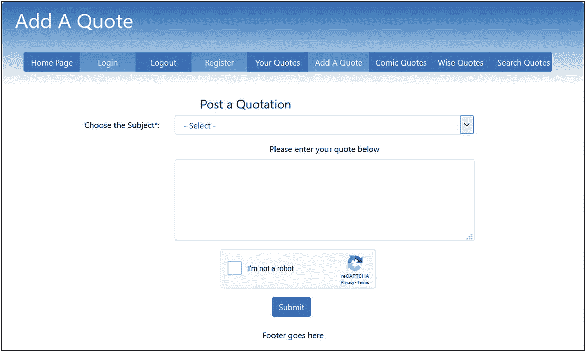

图 10-7

用于发布报价的表单

你可以用*这个词主语*或者，如果你愿意，你可以用*类别*来代替。在本教程中，它们是同义词。主题使用下拉菜单有两个原因。

*   我们假设留言板所有者想要限制主题(类别)的数量，因为所有者不希望成员创建新的主题。成员们将会在“滑稽语录”主题或“智慧语录”主题中添加新的语录。

*   拼写需要一致。下拉菜单保证了这一点。当然，所有者可以在下拉菜单中添加新的主题(类别)。

清单 [10-7a](#PC13) 给出了发布页面的代码。

包含的标题块(*header.php*的案例 8)激活除登录、注销和添加报价之外的所有按钮。

```php
<?php
// Start the session.
session_start() ;
// Redirect if not logged in.
if ( !isset( $_SESSION[ 'member_id' ] ) )
    { header("Location: login.php");
exit(); }
$menu = 8;
if ($_SERVER['REQUEST_METHOD'] == 'POST') {
    //require("cap.php");
}
?>
<!DOCTYPE html>
<html lang="en">
<head>
    <title>Post A Quote Page</title>
    <meta charset="utf-8">
    <meta name="viewport" content="width=device-width, initial-scale=1, shrink-to-fit=no">
    <!-- Bootstrap CSS File -->
    <link rel="stylesheet"
            href="https://stackpath.bootstrapcdn.com/bootstrap/4.1.0/css/bootstrap.min.css"
            integrity=
"sha384-9gVQ4dYFwwWSjIDZnLEWnxCjeSWFphJiwGPXr1jddIhOegiu1FwO5qRGvFXOdJZ4"
    crossorigin="anonymous">
    <script src='https://www.google.com/recaptcha/api.js'></script>
    <link rel="stylesheet" type="text/css" href="msgboard.css">
</head>
<body>
    <div class="container" style="margin-top:30px;border: 2px black solid;">
    <!-- Header Section -->
    <header class="jumbotron text-center row" id="includeheader"
            style="margin-bottom:2px; background:linear-gradient(#0073e6,white); padding:10px;">
            <?php include('includes/header.php'); ?>
    </header>
    <!-- Body Section -->
    <div class="content mx-auto" id="contents">
    <div class="row mx-auto" style="padding-left: 0px; height: auto;">
    <div class="col-sm-10" style="padding-top: 20px;">
            <h4 class="text-center">Post a Quotation</h4>
    <!-- Display the form fields-->
    <form id="post_form" action="process_post.php" method="post" accept-charset="utf-8"  >
            <div class="form-group row">
                    <label for="question" class="col-sm-4 col-form-label text-right">
            Choose the Subject*:</label>
            <div class="col-sm-8">
                    <select id="subject" name="subject" class="form-control">
                    <option selected value="">- Select -</option>
                    <option value="Comic Quotes">Comic Quotes</option>
                    <option value="Wise Quotes">Wise Quotes</option>
                    </select>
            </div>
            </div>
    <div class="form-group row">
            <label for="" class="col-sm-4 col-form-label text-right"></label>
    <div class="col-sm-8 text-center">
                    <label for="message">Please enter your quote below</label>
                    <textarea class="form-control" id="message" name="message" rows="5" cols="50"
                    value=
                            "<?php if (isset($_POST['message']))
                    echo htmlspecialchars($_POST['message'], ENT_QUOTES); ?>" >
            </textarea>
    </div>
    <div>
    <div class="form-group row">
    <label class="col-sm-4 col-form-label"></label>
    <div class="col-sm-8">
    <div class="g-recaptcha" style="margin-left: 90px;"
            data-sitekey="6LcrQ1wUAAAAAPxlrAkLuPdpY5qwS9rXF1j46fhq"></div>
    </div>
    </div>
    <div class="form-group row">
            <label for="" class="col-sm-3 col-form-label"></label>
    <div class="col-sm-8 text-center" style="padding-left: 40px;">
            <input id="submit" class="btn btn-primary" type="submit" name="submit" value="Submit">
    </div>
    </div>
</form>
</div>
<!--posting an entry into the database table automatically sends a message to the forum moderator                                                                                 #1
// Assign the subject-->
<!--<?php
    $subject = "Posting added to message board";
    $member = isset($_SESSION['user_name']) ? $_SESSION['user_name'] : "";
    $body = "Posting added by " . $member;
    mail("admin@myisp.co.uk", $subject, $body, "From:admin@myisp.co.uk\r\n");
    ?>-->
</div>
</div>
<footer class="jumbotron row mx-auto" id="includefooter"
    style="padding-bottom:1px; margin: 0px; padding-top:8px; background-color:white;">
    <div class="col-sm-12 text-center">
        <?php include('includes/footer.php'); ?>
    </div>
</footer>
</div>
</body>
</html>

Listing 10-7aCreating the Form for Posting New Quotations (post.php)

```

### 代码的解释

本节解释代码。

```php
<!--posting an entry into the database table automaticlally sends a message to the forum moderator                                                                                 #1
// Assign the subject-->
<!--<?php
    $subject = "Posting added to message board";
    $member = isset($_SESSION['user_name']) ? $_SESSION['user_name'] : "";
    $body = "Posting added by " . $member;
    mail("admin@myisp.co.uk", $subject, $body, "From:admin@myisp.co.uk\r\n");
?>-->

```

每当论坛中添加新报价时，都会向管理员发送一封电子邮件。然后，管理员应该检查公告，以确保它是适当的。如前所述，论坛提供商对论坛的内容负责。在这个例子中，这个电子邮件部分被注释掉了，因为只有当论坛被加载到提供 PHP 电子邮件服务的 web 服务器上时，这个代码才起作用。

本例中的电子邮件保持可用。PHP 函数 mail()的格式如下:mail (to，subject，body，from)。

收件人和发件人必须是电子邮件地址。变量可以是基本的，比如本例中的$subject，也可以是复杂的。在这个清单中，发布消息的人的用户名从会话中提取，然后与一些文本连接在一起，形成电子邮件的正文。“主题”、“收件人”和“发件人”项创建了电子邮件的标题。标题是电子邮件的顶部；正文是页眉下面的窗口。生成的电子邮件将类似于表 [10-4](#Tab4) 。

表 10-4

电子邮件的外观

<colgroup><col class="tcol1"> <col class="tcol2"></colgroup> 
| 来自: | admin@myisp.co.uk |
| 日期: | 2018 年 08 月 02 日 17 时 26 分 |
| 致: | admin@myisp.co.uk |
| 主题: | 张贴添加到快速报价留言板 |
| 粉红百合添加的帖子 |

当然，您必须用自己的电子邮件地址替换这些假电子邮件地址。请注意，给自己发送电子邮件时，两个电子邮件地址是相同的。

当然，数据库可以由熟悉 phpMyAdmin 的管理员管理；然而，为不熟悉 phpMyAdmin 的人创建一个用户友好的管理工具是很好的。(查看前面的章节，尤其是第 [3](03.html) 章，了解创建管理页面的说明。)用户友好的管理页面允许管理员查看最新帖子的表格。该表将有删除和编辑链接，如第 [3](03.html) 章所述。或者，可以在论坛表中添加一个额外的字段，以指示批准了哪些帖子。则只能显示批准的报价。这将不允许显示任何未批准的帖子。

### 注意

除非提供 PHP 电子邮件服务，否则不会使用您的计算机发送和接收电子邮件。购买主机环境时，确保包含 PHP 电子邮件。

#### 处理过帐

清单 [10-7b](#PC15) 给出了 *process_post.php* 的代码。

```php
<?php
// Start the session.
session_start() ;
// Redirect if not logged in.
if ( !isset( $_SESSION[ 'member_id' ] ) )
        { header("Location: login.php");
        exit(); }
//Connect to the database
require ( 'mysqli_connect.php' ) ;
// Has the form been submitted?
if ($_SERVER['REQUEST_METHOD'] == 'POST')
{
        // Check that the user has entered a subject and a message                        #1
        $subject = filter_var( $_POST['subject'], FILTER_SANITIZE_STRING);
         if ( empty($subject ) ) { echo 'You forgot to select a subject.'; }

        $comment = filter_var( $_POST['message'], FILTER_SANITIZE_STRING);
        if ((!empty($comment)) && (strlen($comment) <= 480)) {
                // remove ability to create link in email
                $patterns = array("/http/", "/https/", "/\:/","/\/\//","/www./");
                $commenttrim = preg_replace($patterns," ", $comment);
        }else{ // if comment not valid display error page
                echo "You forgot to enter a message";
        }
        // If successful insert the post into the database table
        if( !empty($commenttrim) && !empty($subject) )
        {
                //Make the insert query                                                   #2
                $query = "INSERT INTO forum (post_id, user_name, subject, message, post_date) ";
                $query .= "VALUES( ' ', ?, ?, ?, NOW() )";
                $q = mysqli_stmt_init($dbcon);
                mysqli_stmt_prepare($q, $query);
                // use prepared statement to ensure that only text is inserted
                // bind fields to SQL Statement
                $user_name = filter_var( $_SESSION['user_name'], FILTER_SANITIZE_STRING);
                mysqli_stmt_bind_param($q, 'sss', $user_name, $subject, $commenttrim);
                // execute query
                mysqli_stmt_execute($q);
                if (mysqli_stmt_affected_rows($q) == 1) {
                        header ("Location: post_thanks.php");
        }
        else
        {
                echo "An Error has occurred in loading your posting";
        }
// Close the database connection
mysqli_close( $dbcon ) ;
}
 }
?>

Listing 10-7bCreating the File for Processing the Postings (process_post.php)

```

### 代码的解释

本节解释代码。

```php
// Check that the user has entered a subject and a message                           #1
$subject = filter_var( $_POST['subject'], FILTER_SANITIZE_STRING);
if ( empty($subject ) ) { echo 'You forgot to select a subject.'; }

$comment = filter_var( $_POST['message'], FILTER_SANITIZE_STRING);
if ((!empty($comment)) && (strlen($comment) <= 480)) {
        // remove ability to create link in email
        $patterns = array("/http/", "/https/", "/\:/","/\/\//","/www./");
        $commenttrim = preg_replace($patterns," ", $comment);

```

消息的文本区域(以及来自用户的所有信息)吸引了那些想要插入危险脚本的恶意用户。因此，必须在代码中内置特殊的安全过滤器。使用带有 FILTER_SANITIZE_STRING 参数的 filter_var 函数清理 textarea(和 subject)中的消息。这使得条目无害。使用预准备语句还可以确保传递的字符串作为文本传递，并且不会造成伤害。

之前已经多次遇到 filter_var 和 FILTER_SANITIZE_STRING。它将删除任何不需要的字符，包括撇号。

```php
//Make the insert query                                                             #2
$query = "INSERT INTO forum (post_id, user_name, subject, message, post_date) ";
$query .= "VALUES( ' ', ?, ?, ?, NOW() )";
$q = mysqli_stmt_init($dbcon);
mysqli_stmt_prepare($q, $query);
// use prepared statement to ensure that only text is inserted
// bind fields to SQL Statement
$user_name = filter_var( $_SESSION['user_name'], FILTER_SANITIZE_STRING);
mysqli_stmt_bind_param($q, 'sss', $user_name, $subject, $commenttrim);
// execute query
mysqli_stmt_execute($q);
if (mysqli_stmt_affected_rows($q) == 1) {
        header ("Location: post_thanks.php");

```

准备好的 insert 语句使用筛选过的会话用户名、先前筛选过的主题和先前筛选过的引号($commenttrim)。如果由于某种原因，变量仍然包含有害数据，则准备好的语句会将它们用作文本，并且不会执行任何代码。尽管从安全角度来看，这些条目现在是无害的，但它们可能仍然包含不适合留言板的字符或信息。管理员可以更正数据或删除公告。

## 张贴一些报价

现在我们有了一个将帖子插入论坛表的表单，我们将发布表 [10-5](#Tab5) 中显示的引用。您还可以使用 phpMyAdmin 从下载文件一章中导入 SQL 文件。当每个报价发布后，您将被重定向到论坛页面。但是，您还不能查看报价，因为我们还没有创建显示报价的两个页面。

表 10-5

贴一些语录

<colgroup><col class="tcol1"> <col class="tcol2"> <col class="tcol3"></colgroup> 
| 

以…身份登录

 | 

主题(又名论坛)

 | 

消息

 |
| --- | --- | --- |
| 粉红色的百合 | 明智的报价 | "逆境使一些人崩溃，另一些人打破记录."威廉·阿瑟·沃德 |
| 机械 7 | 滑稽的引语 | “我喜欢最后期限。我喜欢它们飞过时发出的嗖嗖声。”道格拉斯·亚当斯 |
| 粉红色的百合 | 滑稽的引语 | "打高尔夫球是一种很好的散步方式."[人名]马克·吐温(美国幽默大师、小说家、作家、演说家) |
| 粉红色的百合 | 滑稽的引语 | "生活是一件接一件糟糕的事情。"[人名]马克·吐温(美国幽默大师、小说家、作家、演说家) |
| 巨人台阶 12 | 滑稽的引语 | “给我高尔夫球杆，新鲜空气和一个漂亮的伴侣，你可以保留高尔夫球杆和新鲜空气”杰克·本尼 |
| 神话之王 | 明智的报价 | "没有巨大的热情，就不会有伟大的成就。"拉尔夫·瓦尔多·爱默生 |
| 神话之王 | 明智的报价 | "至理名言往往落在贫瘠的土地上，但一句友善的话绝不会被丢弃."亚瑟帮忙 |
| 神话之王 | 滑稽的引语 | "许多小事情因为正确的广告而变得很大."[人名]马克·吐温(美国幽默大师、小说家、作家、演说家) |
| 神话之王 | 明智的报价 | "同时做两件事等于什么都不做。"Publilius Syrus |
| 巨人台阶 12 | 明智的报价 | "从未犯过错误的人从未尝试过新事物."[人名]阿尔伯特·爱因斯坦(犹太裔理论物理学家) |
| 巨人台阶 12 | 滑稽的引语 | "经验只是我们给自己的错误起的名字."奥斯卡·王尔德 |
| 巨人台阶 12 | 滑稽的引语 | "如果你想重获青春，就砍掉他的零花钱."阿尔·贝恩斯坦 |
| 机械 7 | 滑稽的引语 | "技术进步只是为我们提供了一种更有效的倒退手段."阿尔多斯·赫胥黎 |
| 粉红色的百合 | 明智的报价 | "真正的知识是知道自己无知的程度."孔子 |
| 机械 7 | 明智的报价 | "如果你不在乎谁得到了荣誉，你会取得惊人的成就."哈里·S·杜鲁门 |

### 纪念

将自动添加发布的日期和时间。

当你有一些报价要显示时，它们会出现在主页上(如图 [10-2](#Fig2) 所示)。

## 滑稽的报价页面

图 [10-8](#Fig8) 显示了滑稽的报价页面。

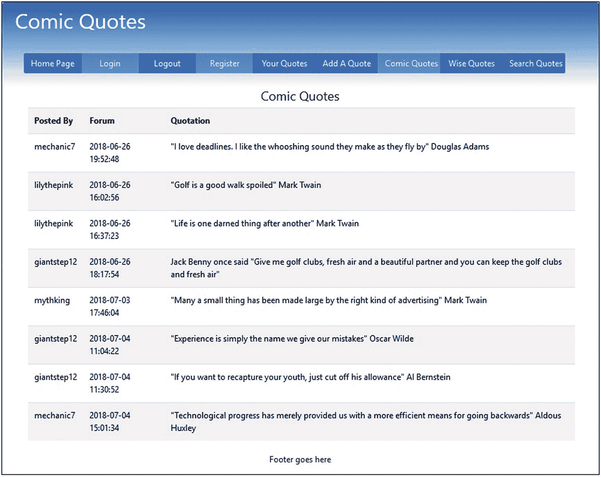

图 10-8

滑稽的报价页面

清单 [10-8](#PC18) 中给出的代码只从数据库论坛表中选择滑稽的引文。

```php
<?php // Start the session.
session_start() ;
// Redirect if not logged in.
if ( !isset( $_SESSION[ 'member_id' ] ) )
        { header("Location: login.php");
        exit(); }
$menu = 9;
?>
<!DOCTYPE html>
<html lang="en">
<head>
        <title>Message Board Home Page</title>
        <meta charset="utf-8">
        <meta name="viewport" content="width=device-width, initial-scale=1, shrink-to-fit=no">
        <!-- Bootstrap CSS File -->
        <link rel="stylesheet"
                href="https://stackpath.bootstrapcdn.com/bootstrap/4.1.0/css/bootstrap.min.css"
                integrity=
        "sha384-9gVQ4dYFwwWSjIDZnLEWnxCjeSWFphJiwGPXr1jddIhOegiu1FwO5qRGvFXOdJZ4"
                crossorigin="anonymous">
        <link rel="stylesheet" type="text/css" href="msgboard.css">
</head>
<body>
        <div class="container" style="margin-top:30px;border: 2px black solid;">
        <!-- Header Section -->
        <header class="jumbotron text-center row" id="includeheader"
                style="margin-bottom:2px; background:linear-gradient(#0073e6,white); padding:10px;">
                <?php include('includes/header.php'); ?>
        </header>
        <!-- Body Section -->
        <div class="content mx-auto" id="contents">
        <div class="row mx-auto" style="padding-left: 0px; height: auto;">
        <div class="col-sm-12">
                <h4 class="text-center">Comic Quotes</h4>
                <?php
                // Connect to the database
                require ( 'mysqli_connect.php' ) ;
                // Make the query                                                         #1
                $query = "SELECT user_name,post_date,subject,message FROM forum WHERE  ";
                $query .=  "subject = 'Comical Quotes' ORDER BY 'post_date' ASC";
                $result = mysqli_query( $dbcon, $query ) ;
                if ( mysqli_num_rows( $result ) > 0 )
                {
                        ?>
                        <table class="table table-responsive table-striped col-sm-12"
                                style="background: white;color:black; padding-left: 20px;">
                                <tr>
                                        <th scope="col">Posted By</th>
                                        <th scope="col">Forum</th>
                                        <th scope="col">Quotation</th>
                                </tr>
                        <?php
                        while ( $row = mysqli_fetch_array( $result, MYSQLI_ASSOC ))
                        {
                                $user_name = htmlspecialchars($row['user_name'], ENT_QUOTES);
                                $post_date = htmlspecialchars($row['post_date'], ENT_QUOTES);
                                $message = htmlspecialchars($row['message'], ENT_QUOTES);
                                echo '<tr>
                                        <td scope="row">' . $user_name . '</td>
                                        <td scope="row">' . $post_date . '</td>
                                        <td scope="row">' . $message . '</td>
                                </tr>';
                        }
                        echo '</table>' ;
                }
                else { echo 'There are currently no messages.' ; }
        mysqli_close( $dbcon ) ;
?>
</div>
</div>
<footer class="jumbotron row mx-auto" id="includefooter"
        style="padding-bottom:1px; margin: 0px; padding-top:8px; background-color:white;">
        <div class="col-sm-12 text-center">
                <?php include('includes/footer.php'); ?>
        </div>
</footer>
</div>
</div>
</body>
</html>

Listing 10-8Creating the Comical Quotes Page (forum_c.php)

```

### 代码的解释

清单 [10-8](#PC21) 中的大部分代码大家都会很熟悉，清单中还有注释提醒你重要的代码行。

我们现在将检查第 1 行:

```php
// Make the query                                                                      #1
$query = "SELECT user_name,post_date,subject,message FROM forum WHERE  ";
$query .=  "subject = 'Comical Quotes' ORDER BY 'post_date' ASC";

```

该查询只从论坛表中选择滑稽的引文。报价将按发布的升序排序，即最早的先排序。

#### 滑稽引用页面的标题

在查看滑稽报价页面后，用户可能还想查看明智报价页面或插入他们自己的报价。为了让用户能够做到这一点，下面显示的标题块(*header.php*的第 9 种情况)激活了除登录、注册和漫画引用之外的所有按钮。目前，这些按钮中有几个是无效的，因为我们还没有设计相关的页面。

要显示的按钮在来自*header.php*的代码片段中显示如下:

```php
case 9: //forum_c.php
        ?>
             <button type="button" style="width: 110px;"
                     class="btn btn-secondary bg-primary"
                     onclick="location.href =
                     'index.php?name=Quick Quotes'">
                     Home Page
             </button>

             <button type="button" style="width: 110px;" class=
                     btn btn-secondary bg-primary disabled"
                     onclick="location.href = "" >Login
             </button>

             <button type="button" style="width: 110px;"
                     class="btn btn-secondary bg-primary"
                     onclick="location.href =
                     'logout.php?name=Logout'">Logout
             </button>

             <button type="button" style="width: 110px;" class=
                     "btn btn-secondary bg-primary disabled"
                     onclick="location.href = "" >Register
             </button>

             <button type="button" style="width: 120px;"
                     class="btn btn-secondary bg-primary"
                     onclick="location.href =
                     'view_posts.php?name=Your Quotes'" >Your Quotes
             </button>

             <button type="button" style="width: 120px;"
                     class="btn btn-secondary bg-primary"
                     onclick="location.href = 'post.php?name=Add A Quote'">
                     Add A Quote
             </button>

             <button type="button" style="width: 120px;" class=
                     "btn btn-secondary bg-primary disabled"
                     onclick="location.href = "" >Comic Quotes
             </button>

             <button type="button" style="width: 120px;"
                     class="btn btn-secondary bg-primary"
                     onclick="location.href =
                     'forum_w.php?name=Wise Quotes'">Wise Quotes
             </button>

             <button type="button" style="width: 120px;"
                     class="btn btn-secondary bg-primary"
                     onclick="location.href =
                     'search.php?name=Search Quotes'" >Search Quotes
             </button>
      <?php
    break;

```

### 明智的报价页面

除了 SQL 查询之外，这个页面几乎与滑稽的报价页面相同。此外，明智的报价按钮被禁用，而滑稽的报价按钮被启用。图 [10-9](#Fig9) 显示了 Wise 报价页面。

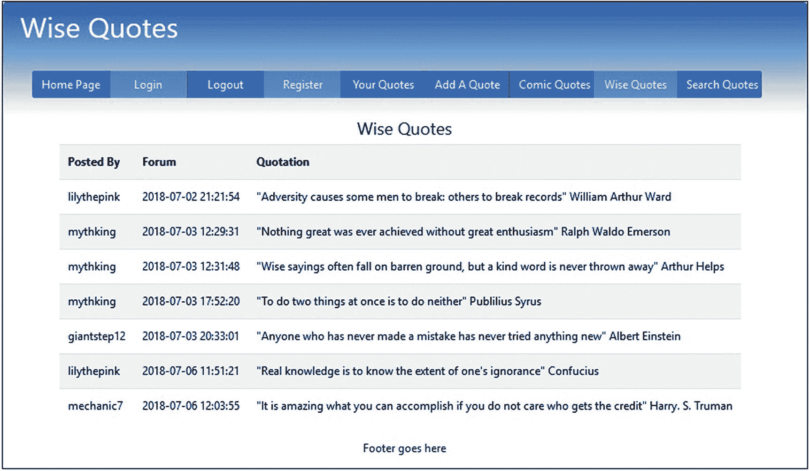

图 10-9

明智引语的展示

该页面仅显示明智的报价。清单 [10-9](#PC21) 给出了 Wise 报价页面的代码。

```php
<?php // Start the session.
session_start() ;
// Redirect if not logged in.
if ( !isset( $_SESSION[ 'member_id' ] ) )
        { header("Location: login.php");
        exit(); }
$menu = 10;
?>
<!DOCTYPE html>
<html lang="en">
<head>
        <title>Message Board Home Page</title>
        <meta charset="utf-8">
        <meta name="viewport" content="width=device-width, initial-scale=1, shrink-to-fit=no">
        <!-- Bootstrap CSS File -->
        <link rel="stylesheet"
                href="https://stackpath.bootstrapcdn.com/bootstrap/4.1.0/css/bootstrap.min.css"
                integrity="sha384-9gVQ4dYFwwWSjIDZnLEWnxCjeSWFphJiwGPXr1jddIhOegiu1FwO5qRGvFXOdJZ4"
                crossorigin="anonymous">
        <link rel="stylesheet" type="text/css" href="msgboard.css">
</head>
<body>
        <div class="container" style="margin-top:30px;border: 2px black solid;">
        <!-- Header Section -->
        <header class="jumbotron text-center row" id="includeheader"
                style="margin-bottom:2px; background:linear-gradient(#0073e6,white); padding:10px;">
                <?php include('includes/header.php'); ?>
        </header>
        <!-- Body Section -->
        <div class="content mx-auto" id="contents">
        <div class="row mx-auto" style="padding-left: 0px; height: auto;">
        <div class="col-sm-12">
                <h4 class="text-center">Wise Quotes</h4>
                <?php
                // Connect to the database
                require ( 'mysqli_connect.php' ) ;
                // Make the query                                                       #1
                $query = "SELECT user_name,post_date,subject,message FROM forum ";
                $query .= "WHERE subject = 'Wise Quotes' ORDER BY 'post_date' ASC";
                $result = mysqli_query( $dbcon, $query ) ;
                if ( mysqli_num_rows( $result ) > 0 )
                {
                        ?>
                        <table class="table table-responsive table-striped col-sm-12"
                                style="background: white;color:black; padding-left: 50px;">
                                <tr>
                                        <th scope="col">Posted By</th>
                                        <th scope="col">Forum</th>
                                        <th scope="col">Quotation</th>
                                </tr>
                        <?php
                        while ( $row = mysqli_fetch_array( $result, MYSQLI_ASSOC ))
                        {
                                $user_name = htmlspecialchars($row['user_name'], ENT_QUOTES);
                                $post_date = htmlspecialchars($row['post_date'], ENT_QUOTES);
                                $message = htmlspecialchars($row['message'], ENT_QUOTES);
                                echo '<tr>
                                        <td scope="row">' . $user_name . '</td>
                                        <td scope="row">' . $post_date . '</td>
                                        <td scope="row">' . $message . '</td>
                                </tr>';
                        }
                echo '</table>' ;
                }
                else { echo 'There are currently no messages.' ; }
                mysqli_close( $dbcon ) ;
        ?>
        </div>
</div>
<footer class="jumbotron row mx-auto" id="includefooter"
        style="padding-bottom:1px; margin: 0px; padding-top:8px; background-color:white;">
        <div class="col-sm-12 text-center">
                <?php include('includes/footer.php'); ?>
        </div>
</footer>
</div>
</div>
</body>
</html>

Listing 10-9Creating the Wise Quotes Page (forum_w.php)

```

### 代码的解释

代码几乎与 Comical Quotes 论坛页面的列表相同，除了此处显示的项目:

```php
// Make the query                                                                         #1
$query = "SELECT user_name,post_date,subject,message FROM forum ";
$query .= "WHERE subject = 'Wise Quotes' ORDER BY 'post_date' ASC";

```

该查询只选择主题为“Wise Quotes”的记录报价将按发布的升序排序，即最早的先排序。

与滑稽报价页面一样，一个新的标题块(*header.php*的案例 10)将允许用户重定向到滑稽报价页面。

#### 明智报价页面的标题

标题块与“滑稽引用”页面的标题块相同，只是“明智引用”按钮被禁用，而“滑稽引用”按钮被激活。请注意,“查看您的帖子”和“搜索”按钮将不起作用，因为相关页面尚未创建。

```php
   case 10: //forum_w.php
            ?>
                <button type="button" style="width: 110px;" class="btn btn-secondary bg-primary"
                        onclick="location.href = 'index.php?name=Quick Quotes'">
                        Home Page
                </button>

                <button type="button" style="width: 110px;" class="btn btn-secondary bg-primary disabled"
                        onclick="location.href = "" >Login
                </button>

                <button type="button" style="width: 110px;" class="btn btn-secondary bg-primary"
                        onclick="location.href = 'logout.php?name=Logout'">Logout
                </button>

                <button type="button" style="width: 110px;" class="btn btn-secondary bg-primary disabled"
                        onclick="location.href = "" >Register
                </button>

                <button type="button" style="width: 120px;" class="btn btn-secondary bg-primary"
                        onclick="location.href = 'view_posts.php?name=Your Quotes'" >
                        Your Quotes
                </button>

                <button type="button" style="width: 120px;" class="btn btn-secondary bg-primary"
                        onclick="location.href = 'post.php?name=Add A Quotes'">
                        Add A Quote
                </button>

                <button type="button" style="width: 120px;" class="btn btn-secondary bg-primary"
                        onclick="location.href = 'forum_c.php?name=Comic Quotes'" >
                        Comic Quotes
                </button>

                <button type="button" style="width: 120px;" class="btn btn-secondary bg-primary disabled"
                        onclick="location.href = "">Wise Quotes
                </button>

                <button type="button" style="width: 120px;" class="btn btn-secondary bg-primary"
                        onclick="location.href = 'search.php?name=Search Quotes'" >
                        Search Quotes
                </button>
        <?php
        break;

```

## 添加搜索工具

最可能的搜索原因如下:

*   成员可能想要查看他们自己的帖子或其他贡献者的帖子的列表。

*   成员可能希望在邮件中搜索特定作者的特定单词或短语或引文。

在实现这些搜索之前，我们必须创建显示搜索结果的页面。

图 [10-10](#Fig10) 显示了查看单个成员帖子的显示。

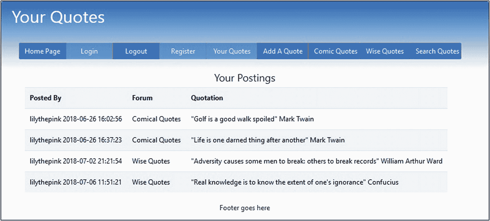

图 10-10

显示一个成员的帖子

清单 [10-10](#PC24) 给出了显示成员帖子的页面代码。

```php
<?php
// Start the session.
session_start() ;
// Redirect if not logged in.
if ( !isset( $_SESSION[ 'member_id' ] ) )
{ header("Location: login.php");
exit(); }
$menu = 7;
?>
<!DOCTYPE html>
<html lang="en">
<head>
        <title>View Postings Page</title>
        <meta charset="utf-8">
        <meta name="viewport" content=
"width=device-width, initial-scale=1, shrink-to-fit=no">
        <!-- Bootstrap CSS File -->
        <link rel="stylesheet"
                href="https://stackpath.bootstrapcdn.com/bootstrap/4.1.0/css/bootstrap.min.css"
                integrity="sha384-9gVQ4dYFwwWSjIDZnLEWnxCjeSWFphJiwGPXr1jddIhOegiu1FwO5qRGvFXOdJZ4"
                crossorigin="anonymous">
        <link rel="stylesheet" type="text/css" href="birds.css">
</head>
<body>
<div class="container" style=
"margin-top:30px;border: 2px black solid;">
<!-- Header Section -->
<header class="jumbotron text-center row" id="includeheader"
style="margin-bottom:2px;
background:linear-gradient(#0073e6,white); padding:10px;">
                        <?php include('includes/header.php'); ?>
</header>
<div id="content"><!--Start of the quotes found page content-->
<?php
// Connect to the database
require ( 'mysqli_connect.php' ) ;                                                      //#1
                $user_name =
filter_var( $_SESSION['user_name'], FILTER_SANITIZE_STRING);
                // Make the full text query
                $query = "SELECT user_name,post_date,subject,message FROM ";
$query .= "forum WHERE user_name = ? ";
                $query .= "ORDER BY post_date ASC";
        $q = mysqli_stmt_init($dbcon);
        mysqli_stmt_prepare($q, $query);
        // bind $id to SQL Statement
                mysqli_stmt_bind_param($q, "s", $user_name);
        // execute query
        mysqli_stmt_execute($q);
        $result = mysqli_stmt_get_result($q);
                if (mysqli_num_rows($result) > 0) {
                        echo '<h4 class="text-center">Your Postings</h4>';
                        ?>
                        <table class=
"table table-responsive table-striped col-sm-12"
                                style="background: white;color:black;
padding-left: 40px;">
                                <tr>
                                        <th scope="col">Posted By</th>
                                        <th scope="col">Forum</th>
                                        <th scope="col">Quotation</th>
                                </tr>
                        <?php
                        while ( $row =
mysqli_fetch_array( $result, MYSQLI_ASSOC ))
                        {
                                $user_name =
htmlspecialchars($row['user_name'], ENT_QUOTES);
                                $post_date =
htmlspecialchars($row['post_date'], ENT_QUOTES);
                                $subject =
htmlspecialchars($row['subject'], ENT_QUOTES);
                                $message =
htmlspecialchars($row['message'], ENT_QUOTES);
                                echo '<tr>
                                        <td scope="row">' . $user_name . " " .
 $post_date . '</td>
                                        <td scope="row">' . $subject . '</td>
                                        <td scope="row">' . $message . '</td>
                                </tr>';
                        }
                        echo '</table>' ;
                }
else { echo '<p class="text-center">
There are currently no messages.</p>' ; }
mysqli_close( $dbcon ) ;
?>
</div><!--End of the quotes found page content.-->
<footer class="jumbotron row mx-auto" id="includefooter"
style="padding-bottom:1px; margin: 0px; padding-top:8px;
background-color:white;">
<div class="col-sm-12 text-center">
                        <?php include('includes/footer.php'); ?>
                </div>
</footer>
</div>
</body>
</html>

Listing 10-10Creating a Page to Display an Individual Member’s Postings (view_posts.php)

```

### 代码的解释

您之前已经看到了大部分代码，但是查询需要一些解释。

```php
require ( 'mysqli_connect.php' ) ;                                                      //#1
                $user_name =
filter_var( $_SESSION['user_name'], FILTER_SANITIZE_STRING);
                // Make the full text query
                $query = "SELECT user_name,post_date,subject,message FROM ";
$query .= "forum WHERE user_name = ? ";
                $query .= "ORDER BY post_date ASC";
        $q = mysqli_stmt_init($dbcon);
        mysqli_stmt_prepare($q, $query);
        // bind $id to SQL Statement
                mysqli_stmt_bind_param($q, "s", $user_name);
        // execute query
        mysqli_stmt_execute($q);

```

该查询选择要显示的项目，并指定两个条件:只显示在会话中指定的用户名($user_name)的过帐，并按过帐日期的升序对表行显示进行排序。

## *ViewPosts.php 的头球*

标题块将激活除登录、注册和报价之外的所有按钮。下面的代码片段显示了来自*header.php*的代码:

```php
case 8: //post.php
            ?>
                <button type="button" style="width: 110px;" class="btn btn-secondary bg-primary"
                        onclick="location.href = 'index.php?name=Quick Quotes'">
                        Home Page
                </button>

                <button type="button" style="width: 110px;" class="btn btn-secondary bg-primary disabled"
                        onclick="location.href = "" >Login
                </button>

                <button type="button" style="width: 110px;" class="btn btn-secondary bg-primary"
                        onclick="location.href = 'logout.php?name=Logout'">
                        Logout
                </button>

                <button type="button" style="width: 110px;" class="btn btn-secondary bg-primary disabled"
                        onclick="location.href = "" >Register
                </button>

                <button type="button" style="width: 120px;" class="btn btn-secondary bg-primary"
                        onclick="location.href = 'view_posts.php?name=Your Quotes'" >
                        Your Quotes
                </button>

                <button type="button" style="width: 120px;" class="btn btn-secondary bg-primary disabled"
                        onclick="location.href = "">Add A Quote
                </button>

                <button type="button" style="width: 120px;" class="btn btn-secondary bg-primary"
                        onclick="location.href = 'forum_c.php?name=Comic Quotes'" >
                        Comic Quotes
                </button>

                <button type="button" style="width: 120px;" class="btn btn-secondary bg-primary"
                        onclick="location.href = 'forum_w.php?name=Wise Quotes'">
                        Wise Quotes
                </button>

                <button type="button" style="width: 120px;" class="btn btn-secondary bg-primary"
                        onclick="location.href = 'search.php?name=Search Quotes'" >
                        Search Quotes
                </button>
        <?php
        break;

```

我们现在将启用成员进行全文搜索的能力。

## 搜索特定的单词或短语

成员们可能希望看到马克·吐温的语录表或关于高尔夫的语录列表；因此，成员将搜索特定的单词或短语。这将需要在标题中的搜索按钮。作为一种替代方案，可以在论坛页面中加入一个搜索字段；然而，为了简单起见，我们将使用更简单的方法:使用一个链接到搜索表单的按钮。

全文搜索将在每封邮件中查找单词。名为 messages 的列必须作为全文索引，如本章开头所示。

全文搜索可用于 VARCHAR 和 text 列。全文搜索不区分大小写，将忽略以下内容:

*   偏旁的话。如果你想搜索*被宠坏的*，你得搜索完整的单词。只搜索*宠*不会返回你要找的东西。

*   包含少于四个字符的单词。

*   别说了。这些都是极为常见的词语，如*中的*、*中的*、*中的*、*中的*、*中的*、*中的*、*中的*、*中的*、*中的*等。

*   被搜索列中超过 50%的行中包含的单词或短语。在这种情况下，该单词或短语被视为停用词。这通常可以通过在一个表中有四个或更多记录来避免。

### 全文搜索表单

我们现在将创建一个在消息(引用)中搜索特定单词或短语的表单。

图 [10-11](#Fig11) 显示了搜索表单。

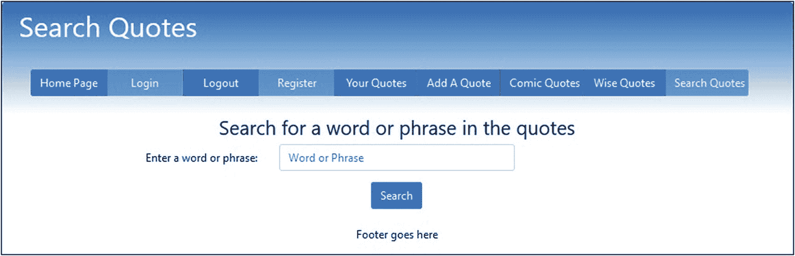

图 10-11

搜索表单

清单 [10-11](#PC27) 给出了搜索表单的代码。

```php
<?php
// Start the session.
session_start() ;
// Redirect if not logged in.
if ( !isset( $_SESSION[ 'member_id' ] ) )
        { header("Location: login.php");
        exit(); }
$menu = 6;
?>
<!DOCTYPE html>
<html lang="en">
<head>
        <title>Search Page</title>
        <meta charset="utf-8">
        <meta name="viewport" content="width=device-width, initial-scale=1, shrink-to-fit=no">
        <!-- Bootstrap CSS File -->
        <link rel="stylesheet"
        href="https://stackpath.bootstrapcdn.com/bootstrap/4.1.0/css/bootstrap.min.css"
        integrity=
        "sha384-9gVQ4dYFwwWSjIDZnLEWnxCjeSWFphJiwGPXr1jddIhOegiu1FwO5qRGvFXOdJZ4"
        crossorigin="anonymous">
        <link rel="stylesheet" type="text/css" href="msgboard.css">
</head>
<body>
        <div class="container" style="margin-top:30px;border: 2px black solid;">
        <!-- Header Section -->
        <header class="jumbotron text-center row" id="includeheader"
                style="margin-bottom:2px; background:linear-gradient(#0073e6,white); padding:10px;">
                <?php include('includes/header.php'); ?>
        </header>
        <!-- Body Section -->
        <div class="content mx-auto" id="contents">
        <div class="row mx-auto" style="padding-left: 0px; height: auto;">
        <div class="col-sm-12">
                <h3 class="text-center">Search for a word or phrase in the quotes</h3>
                <form id="search" action="quotes_found.php" method="post">
                <div class="form-group row">
                <label for="target" class="col-sm-4 col-form-label text-right">Enter a word or phrase:</label>
                <div class="col-sm-4">
                        <input type="text" class="form-control" id="target" name="target"
                                placeholder="Word or Phrase" maxlength="60" size="40" required
                                value=
                                        "<?php if (isset($_POST['target']))
                                echo htmlspecialchars($_POST['target'], ENT_QUOTES); ?>" >
                </div>
                 </div>
                <div class="form-group row">
                        <label for="" class="col-sm-2 col-form-label"></label>
                <div class="col-sm-8 text-center">
                        <input id="submit" class="btn btn-primary" type="submit"
                                name="submit" value="Search">
                </div>
        </div>
</form>
</div>
</div>
<footer class="jumbotron row mx-auto" id="includefooter"
        style="padding-bottom:1px; margin: 0px; padding-top:8px; background-color:white;">
        <div class="col-sm-12 text-center">
                <?php include('includes/footer.php'); ?>
  </div>
</footer>
</div>
</div>
</body>
</html>

Listing 10-11Creating the Search Form (search.php)

```

搜索表单将搜索词传递给显示搜索结果的页面。

## 显示搜索结果

图 [10-12](#Fig12) 显示了全文搜索如何显示结果。

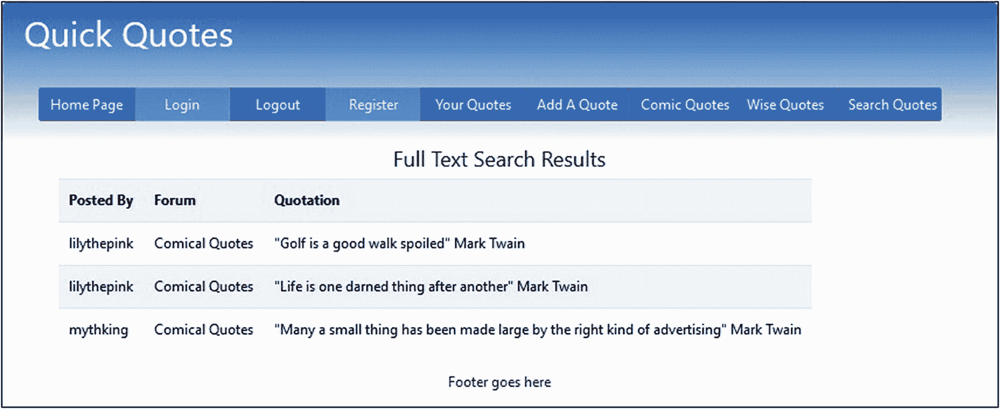

图 10-12

显示对单词 Mark Twain 进行全文搜索的结果

请注意，马克·吐温的引用次数不到我们论坛表中所有引用次数的 50%。如果引用马克·吐温的次数超过引用次数的 50%，就不会显示任何结果。在我们的示例数据库表中，有 23 个报价。马克·吐温被引用了三次；因此，他占总数的 13%。因为这不到总数的 50 %,他将被找到并展示。如果表中只有六条引文，马克·吐温将被引用 50%，因此他将找不到。换句话说，组词*马克·吐温*将被视为停用词，如*他的*、*她的*、*带*以及*你的*。如果您知道某个词或短语存在于数据库表中，但全文搜索未能找到它，则可能是表中没有足够的引号，或者至少 50%的引号包含要搜索的词或短语。清单 [10-12a](#PC28) 给出了 *quotes_found* 页面的代码。

```php
<?php
// Start the session.
session_start() ;
// Redirect if not logged in.
if ( !isset( $_SESSION[ 'member_id' ] ) )
        { header("Location: login.php");
        exit(); }
$menu = 4;
?>
<!DOCTYPE html>
<html lang="en">
<head>
        <title>Search Page</title>
        <meta charset="utf-8">
        <meta name="viewport" content="width=device-width, initial-scale=1, shrink-to-fit=no">
        <!-- Bootstrap CSS File -->
        <link rel="stylesheet"
                href="https://stackpath.bootstrapcdn.com/bootstrap/4.1.0/css/bootstrap.min.css"
                integrity=
"sha384-9gVQ4dYFwwWSjIDZnLEWnxCjeSWFphJiwGPXr1jddIhOegiu1FwO5qRGvFXOdJZ4"
                crossorigin="anonymous">
        <link rel="stylesheet" type="text/css" href="msgboard.css">
</head>
<body>
<div class="container" style="margin-top:30px;border: 2px black solid;">
<!-- Header Section -->
        <header class="jumbotron text-center row" id="includeheader"
                style="margin-bottom:2px; background:linear-gradient(#0073e6,white); padding:10px;">
                        <?php include('includes/header.php'); ?>
        </header>
<div id="content"><!--Start of the quotes found page content-->
<?php
        // Connect to the database
        require ( 'mysqli_connect.php' ) ;
        //if POST is set                                                                 #1
        if($_SERVER['REQUEST_METHOD'] == 'POST' ) {
                $target = filter_var( $_POST['target'], FILTER_SANITIZE_STRING);
                // Make the full text query                                              #2
                $query = "SELECT user_name,post_date,subject,message FROM forum WHERE ";
                $query .= "MATCH (message) AGAINST ( ? ) ORDER BY post_date ASC";
                $q = mysqli_stmt_init($dbcon);
                mysqli_stmt_prepare($q, $query);
                // bind $id to SQL Statement
                mysqli_stmt_bind_param($q, "s", $target);
                // execute query
                mysqli_stmt_execute($q);
                $result = mysqli_stmt_get_result($q);
                if (mysqli_num_rows($result) > 0) {
                        echo '<h4 class="text-center">Full Text Search Results</h2>';
                        ?>
                        <table class="table table-responsive table-striped col-sm-12"
                                style="background: white;color:black; padding-left: 50px;">
                                <tr>
                                        <th scope="col">Posted By</th>
                                        <th scope="col">Forum</th>
                                        <th scope="col">Quotation</th>
                                </tr>
                        <?php
                        while ( $row = mysqli_fetch_array( $result, MYSQLI_ASSOC ))
                        {
                                $user_name = htmlspecialchars($row['user_name'], ENT_QUOTES);
                                $subject = htmlspecialchars($row['subject'], ENT_QUOTES);
                                $message = htmlspecialchars($row['message'], ENT_QUOTES);
                                echo '<tr>
                                        <td scope="row">' . $user_name . '</td>
                                        <td scope="row">' . $subject . '</td>
                                        <td scope="row">' . $message . '</td>
                                </tr>';
                        }
                        echo '</table>' ;
                }
                else { echo '<p class="text-center">There are currently no messages.</p>' ; }
        mysqli_close( $dbcon ) ;
        }
?>
</div><!--End of the quotes found page content.-->
<footer class="jumbotron row mx-auto" id="includefooter"
        style="padding-bottom:1px; margin: 0px; padding-top:8px; background-color:white;">
        <div class="col-sm-12 text-center">
                <?php include('includes/footer.php'); ?>
        </div>
</footer>
</div>
</body>
</html>

Listing 10-12aCreating the Search Results Page (quotes_found.php)

```

### 注意

如果您运行该文件并看到错误消息“警告:mysqli_num_rows()期望参数 1 是 mysqli_result，布尔值在…中给定”，您可能忘记选择全文作为表中消息列的索引。

### 代码的解释

本节解释代码。

```php
//if POST is set                                                                          #1
if($_SERVER['REQUEST_METHOD'] == 'POST' ) {
        $target = filter_var( $_POST['target'], FILTER_SANITIZE_STRING);

```

搜索表单将目标单词或短语(例如*马克·吐温*)发送到这个页面，在这里它被赋给变量$target。

```php
// Make the full text query                                                               #2
$query = "SELECT user_name,post_date,subject,message FROM forum WHERE ";
$query .= "MATCH (message) AGAINST ( ? ) ORDER BY post_date ASC";
$q = mysqli_stmt_init($dbcon);
mysqli_stmt_prepare($q, $query);
// bind $id to SQL Statement
mysqli_stmt_bind_param($q, "s", $target);

```

全文查询在 forum 表中搜索包含存储在变量$target 中的单词 *Mark Twain* 的消息(引文),该变量绑定到 prepare 语句。注意括号、逗号、双引号和单引号；它们很重要。全文搜索查询的格式如下:

```php
SELECT list of items FROM some table WHERE MATCH (the column) AGAINST(the search words) ;

```

关键字 MATCH 和 AGAINST 是标准选择查询和全文搜索查询之间的主要区别。

### quotes_found 页面的标题

清单 [10-12b](#PC32) 给出了头部的代码块。这也是 forum.php 使用的相同标题。

```php
case 4: //forum.php //quotes_found.php
            ?>
                <button type="button" style="width: 110px;" class="btn btn-secondary bg-primary"
                        onclick="location.href = 'index.php?name=Quick Quotes'">
                        Home Page
                </button>

                <button type="button" style="width: 110px;" class="btn btn-secondary bg-primary disabled"
                        onclick="location.href = "" >Login
                </button>

                <button type="button" style="width: 110px;" class="btn btn-secondary bg-primary"
                        onclick="location.href = 'logout.php?name=Logout'">
Logout
                </button>

                <button type="button" style="width: 110px;" class="btn btn-secondary bg-primary disabled"
                        onclick="location.href = "" >Register
                </button>

                <button type="button" style="width: 120px;" class="btn btn-secondary bg-primary"
                        onclick="location.href = 'view_posts.php?name=Your Quotes'" >
                        Your Quotes
                </button>

                <button type="button" style="width: 120px;" class="btn btn-secondary bg-primary"
                        onclick="location.href = 'post.php?name=Add A Quote'">
                        Add A Quote
                </button>

                <button type="button" style="width: 120px;" class="btn btn-secondary bg-primary"
                        onclick="location.href = 'forum_c.php?name=Comic Quotes'" >
                        Comic Quotes
                </button>

                <button type="button" style="width: 120px;" class="btn btn-secondary bg-primary"
                        onclick="location.href = 'forum_w.php?name=Wise Quotes'">
                        Wise Quotes
                </button>

                <button type="button" style="width: 120px;" class="btn btn-secondary bg-primary"
                        onclick="location.href = 'search.php?name=Search Quotes'" >Search Quotes
                </button>
        <?php
        break;

Listing 10-12bCreating the Header Block for the Quotes Found Page (header.php)

```

## 增强留言板

为了不熟悉数据库的读者的利益，本章中的留言板被大大简化了。通过使用您从前面章节中获得的知识，可以添加如下增强功能:

*   用于显示两类报价的页面可以显示分页的结果。(查看第[章第 5](05.html) 章和第[章第 8](08.html) 章，了解如何完成此操作。)

*   成员可能想要更改他们的密码。(查看第 [3 章](03.html)了解详情。)

*   成员可能忘记了他们的密码；可以向他们发送新密码。这包括在第 [11 章](11.html)中。

### 将留言板转换为论坛

在这一章的开始，我们说过我们将简要描述一个将留言板转换成论坛的结构。一个论坛需要最大的规范化和原子性。(参见第 [9](09.html) 章，提醒您这些术语的定义。)需要更多的表，其中几个将通过包含关键字 JOIN 的查询来链接。

论坛需要额外的表格来放置主题和回复。留言板由管理员审核，结果是自动发送一封包含发帖人姓名和日期的电子邮件。当报价被提交时，它被立即插入到数据库表中；更好的解决方案是创建一个额外的列(approved ),该列必须由管理员设置，以允许向成员显示报价。

如果管理员能够在不使用 phpMyAdmin 的情况下删除或编辑报价，那将会很有帮助。管理页面可以显示包含编辑和删除链接的最近帖子的表格，如第 [3](03.html) 章所述。

一个论坛最少需要四张桌子，如图 [10-13](#Fig13) 所示。

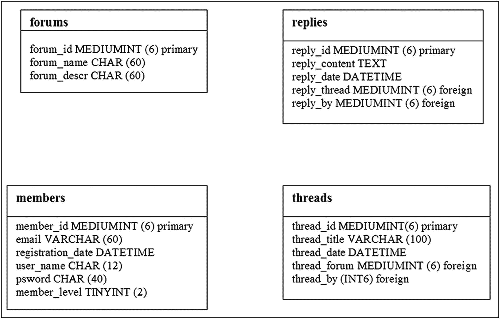

图 10-13

一个非常基本的论坛的表格

## 摘要

在这一章中，我们学习了基本留言板的计划和结构。我们创建了一个注册页面和登录表单。我们开发了一个两页报价的网关，然后创建了这些页面。我们学习了如何创建发布消息的表单。我们创建了两个搜索表单:一个允许成员搜索他们自己的帖子列表，另一个用于进行全文搜索。建议对基本留言板进行一些改进，最后提供了一个基本论坛的简要概述。下一章描述一个基本的电子商务网站。