# 11.电子商务:简介

电子商务网站接受支付以换取商品或服务。用户订购网站目录页面中显示的一系列商品或服务。用户订单的详细信息存储在网站的数据库中。金钱从用户手中转移到网站所有者手中。这是通过网站内置的支付系统实现的。最后，订购的商品被交付给用户。用户可以跟踪他们的订单进度，更新他们的帐户详细信息，并在必要时联系客户支持部门。

完成本章后，您将能够

*   设计一个简单的电子商务网站

*   创建一个与贝宝接口的网站

*   创建一个包含简单购物车的网站

*   为用户提供恢复密码的能力

两种类型的电子商务网站将从使用数据库中受益:一种是拥有广泛商品或服务的网上商店，如亚马逊，另一种是拥有有限商品范围但打算扩大范围的网上商店。本章对电子商务网站的简要概述就是基于后者。

### 注意

这一章简要演示了电子商务网站的基本格式。为了使基本原则尽可能清楚并节省空间，不包括替代货币。当根据你的领域调整网站时，你自然会改变内容和货币来适应。正如我们之前提到的，向多个国家销售商品和服务时，您必须确保遵守每个国家的在线销售相关法律。

本章描述了两种类型的购物车，贝宝购物车和自定义购物车。每个示例都是单独处理的，并且包括自己的数据库、表和文件。以下是本章的两个主要部分:

*   创建一个贝宝购物车网站

    *   PayPal 购物车主页

    *   管理 PayPal 购物车网站

*   创建自定义购物车网站

    *   自定义购物车主页

    *   管理自定义购物车网站

    *   结账页面

我们将在本章中讨论几个重要的过程。然而，我们不会涵盖电子商务网站所需的每个流程。这个大纲将为你进一步学习提供一个起点。本章包含的代码很少，因为所描述的网站结合了前面章节中已经展示和解释的大部分代码。

例如:

*   注册页面类似于第 [6](06.html) 章中描述的注册页面。

*   第 [3](03.html) 章和第 [8](08.html) 章描述了大多数管理设施。

*   第 [9](09.html) 章描述了多个表格的使用。

*   使用 Bootstrap 创建可以在任何大小的设备上显示的网站贯穿全书。

登录和注销页面在前面的几章中已经详细介绍过了。但是，本章中的登录页面包含一个链接，使用户能够找回忘记的密码；代码就是为这个特性提供的。

### 注意

本章是对一个电子商务网站的简单介绍。完整地处理一个电子商务网站的实例，包括支付网关、库存控制系统、订单跟踪、安全措施、发票和客户服务，需要一整本书。你可以在附录 b 中找到设计和开发电子商务网站的资源列表。

我们想花时间感谢罗杰·圣巴尔贝提供的彩色蚀刻图像。他制作蚀刻画的方法令人着迷；在他的网站上可以找到这一过程的简要记录:

[T2`www.dolphin-gallery.co.uk`](https://www.dolphin-gallery.co.uk)

尽管我们声明每件产品都是独一无二的，但罗杰确实为每件蚀刻作品制作了数量有限的签名副本。为了简单起见，在我们的例子中，Dove Gallery 将只存储一个副本。阿德里安·韦斯特拥有本章中使用的其他画作。艺术家詹姆斯·凯塞尔(现已去世)是皇家艺术学院双料艺术家(伦敦和英国伯明翰)。

### 注意

PayPal 购物车和自定义购物车部分的可下载文件包含在单独的子文件夹中。 *paypaldb.sql* 和 *customdb.sql* 文件用于安装 PayPal 和自定义数据库和表格。主文件夹可以从[地址下载。com](http://apress.com) 网站。

我们开始吧。对于这两种购物车来说，最重要的两个主题是安全性和仔细规划。

## 安全警告

数据库驱动的电子商务网站非常容易受到攻击；因此，安全性是首要考虑的问题。通过注意以下警告，电子商务网站可以相当安全。

*   开发人员不应该试图推出一个电子商务网站，除非他们在 PHP、SQL 和 Maria/MySQL 数据库方面达到了很高的专业水平。

*   对 PHP *存储过程*和*事务*的全面了解对于电子商务来说是必不可少的。

*   开发人员必须彻底了解可能发生的固有安全问题和风险。

*   开发人员必须了解并完全遵守所在地区或国家的数据保护法，尤其是管理在线交易的法律。

*   网站不应该存储客户的银行和信用卡信息，除非有一个昂贵而有效的安全方案。

*   使用 PayPal、Stripe 或 [Authorize 等安全支付系统更安全。网](http://authorize.net)。总是选择他们的购物车按钮的编码版本。使用这些支付系统之一来收集信用卡和其他敏感信息。不要在您的电子商务数据库中收集或存储信息。

*   使用受安全套接字层(SSL)保护的 HTTPS 页面。

现在让我们来看看创建电子商务网站的计划。

## 计划

通常，设计数据库的第一步意味着讨论网站所有者的需求，然后制定一个计划来满足这些需求。与客户会面后，我们确定了以下要求:

*   这些网站将出售原画和彩色蚀刻画。

*   管理员将能够通过用户友好的界面从数据库表中添加或删除绘画和艺术家。

*   一个基本的电子商务数据库会使用许多表，通常是 12 个或更多，但在第一阶段(我们将在本章中介绍)，我们的网站将使用下列表:

    *   *用户*:该表包含管理员和注册用户。该表将包括用户的地址，但为了简洁起见，它将不包括替代的递送地址。

    *   艺术:这个表格包含了对绘画的描述，并且将被用来显示绘画库存的目录。

    *   *艺术家*:此表包含艺术家的姓名。然而，为了节省空间，它不会包含艺术家的传统简要描述。

    *   *订单和订单处理(仅限定制购物车):*这些表格将记录并跟踪订单详情，如定制购物车部分所示。

### 注意

我们假设在 PayPal 网站的规划阶段，所有者决定不要求用户注册，除非他们希望收到电子邮件更新，这将为美术馆提供特别优惠或新的收购。关于定制购物车网站，我们已经决定纳入预先注册。另一种方法是在结帐阶段进行注册。

## 创建 PayPal 购物车网站

在本节中，我们将创建一个使用 PayPal 处理所有交易的电子商务网站。让我们从建立数据库、表和文件开始。

### 创建 PayPal 购物车数据库和表格

请遵循以下步骤:

1.  在 XAMPP 的 *htdocs* 文件夹或 EasyPHP 文件夹 *eds_www* 中，新建一个名为 *paypalcart* 的文件夹。

2.  从[出版社的页面下载第](http://apress.com) [11 章](11.html)的 paypalcart 文件。并将它们解压到你新的 *paypalcart* 文件夹中。

3.  启动 XAMPP 或 EasyPHP，在浏览器的地址栏中输入 localhost/phpmyadmin/以访问 phpmyadmin。

4.  单击 Databases 选项卡，创建一个名为 *paypaldb 的数据库。*从下拉排序规则列表中，选择 utf8_general_ci，然后单击创建。

5.  单击权限选项卡，然后向下滚动并单击添加新用户。

6.  输入这些详细信息:

    *   *用户名*:巨像

    *   *密码*:fstab 0 computer 3r

    *   *主机*:本地主机

    *   *数据库名称* : paypaldb

7.  单击开始。

### 查看连接文件

连接文件的代码如下:

```php
<?php
// Create a connection to the migrate database and to MySQL
// Set the encoding to utf-8
// Set the database access details as constants
Define ('DB_USER', 'colossus');
Define ('DB_PASSWORD', 'Fstc0mput3r');
Define ('DB_HOST', 'localhost');
Define ('DB_NAME', 'paypaldb');
// Make the connection:
$dbcon = new mysqli(DB_HOST, DB_USER, DB_PASSWORD, DB_NAME);
// Set the encoding...optional but recommended
mysqli_set_charset($dbcon, 'utf8');

```

要测试您的连接文件，请在浏览器的地址栏中输入以下 URL:

```php
       http://localhost/paypalcart/mysqli_connect.php

```

显示的页面应该完全是空的。

### 推广 paypal 购物车表

使用 phpMyAdmin 导入表并填充它们。

1.  在 phpMyAdmin 的左侧面板中，单击数据库 paypaldb 旁边的框。

2.  不要在下一个屏幕上输入任何内容，而是单击 Import 选项卡。

3.  点击浏览按钮并导航至 *paypalcart* 文件夹。

4.  点击打开按钮，导入 *paypaldb.sql* 转储文件；该字段将填充文件的位置。

5.  确保下拉菜单中的字符集是 utf-8，并且格式显示为 SQL。

6.  单击开始。

出于您的兴趣，表 [11-1](#Tab1) 给出了 PayPal 购物车艺术表的列细节。所有的表都使用 InnoDB 存储引擎。

表 11-1

艺术表格包括一个贝宝支付代码栏

<colgroup><col class="tcol1"> <col class="tcol2"> <col class="tcol3"> <col class="tcol4"> <col class="tcol5"> <col class="tcol6"> <col class="tcol7"> <col class="tcol8"></colgroup> 
| 

列名

 | 

类型

 | 

长度/值

 | 

默认

 | 

属性

 | 

空

 | 

索引

 | 

阿奇

 |
| --- | --- | --- | --- | --- | --- | --- | --- |
| 艺术标识 | （同 Internationalorganizations）国际组织 | eight | 没有人 | 无符号的 | -是吗 | 主要的 | ·······················。 |
| 拇指 | 可变长字符串 | Fifty | 没有人 |   | -是吗 |   | -是吗 |
| 类型 | 可变长字符串 | Fifty | 没有人 |   | -是吗 |   | -是吗 |
| 价格 | 小数 | 6,2 | 没有人 | 无符号的 | -是吗 | 指数 | -是吗 |
| 媒介 | 可变长字符串 | Fifty | 没有人 |   | -是吗 |   | -是吗 |
| 艺术家 | 可变长字符串 | Fifty | 没有人 |   | -是吗 |   | -是吗 |
| 迷你描述 | 可变长字符串 | One hundred and fifty | 没有人 |   | -是吗 |   | -是吗 |
| ppcode | 文本 | Five hundred | 没有人 |   | -是吗 |   | -是吗 |

*注意:除 PayPal 之外的支付系统可能要求在最后一栏输入不同的值。*

名字和中间名被设置为空条目，因为一些艺术家可能很少使用这些名字，如毕加索。艺术家表如表 [11-2](#Tab2) 所示。

表 11-4

最小用户表的类型和属性如表 [11-5](#Tab5) 所示

<colgroup><col class="tcol1"> <col class="tcol2"> <col class="tcol3"> <col class="tcol4"> <col class="tcol5"> <col class="tcol6"> <col class="tcol7"> <col class="tcol8"></colgroup> 
| 

列名

 | 

类型

 | 

长度/值

 | 

默认

 | 

属性

 | 

空

 | 

索引

 | 

A_I

 |
| --- | --- | --- | --- | --- | --- | --- | --- |
| 用户 id | 中位 | eight | 没有人 | 无符号的 | -是吗 | 主要的 | ·······················。 |
| 标题 | 可变长字符串 | Twelve | 没有人 |   | ·······················。 |   | -是吗 |
| 名字 | 可变长字符串 | Thirty | 没有人 |   | -是吗 |   | -是吗 |
| 姓氏 | 可变长字符串 | Forty | 没有人 |   | -是吗 |   | -是吗 |
| 电子邮件 | 可变长字符串 | Fifty | 没有人 |   | -是吗 |   | -是吗 |
| 密码 | 茶 | Sixty | 没有人 |   | -是吗 |   | -是吗 |
| 注册日期 | DATETIME |   |   |   | -是吗 |   | -是吗 |
| 用户级别 | 蒂尼因特 | one | 没有人 | 无符号的 | -是吗 |   | -是吗 |
| 地址 1 | 可变长字符串 | Fifty | 没有人 |   | -是吗 |   | -是吗 |
| 地址 2 | 可变长字符串 | Fifty | 没有人 |   | ·······················。 |   | -是吗 |
| 城市 | 可变长字符串 | Fifty | 没有人 |   | -是吗 |   | -是吗 |
| 州 _ 国家 | 可变长字符串 | Thirty | 没有人 |   | -是吗 |   | -是吗 |
| zcode _ pcode 函数 | 可变长字符串 | Ten | 没有人 |   | -是吗 |   | -是吗 |
| 电话 | 可变长字符串 | Fifteen | 没有人 |   | ·······················。 |   | -是吗 |
| 秘密 | 可变长字符串 | Thirty | 没有人 |   | -是吗 |   | -是吗 |

表 11-3

表 [11-4](#Tab4) 显示了如何填充艺术家表的详细信息

<colgroup><col class="tcol1"> <col class="tcol2"> <col class="tcol3"></colgroup> 
| 

西方人名的第一个字

 | 

中名

 | 

姓

 |
| --- | --- | --- |
| 艾德里安(男子名) | W | 西 |
| 罗杰 | 街道 | 巴尔贝 |
| 詹姆斯 |   | 凯塞尔 |

表 11-2

艺术家桌

<colgroup><col class="tcol1"> <col class="tcol2"> <col class="tcol3"> <col class="tcol4"> <col class="tcol5"> <col class="tcol6"> <col class="tcol7"> <col class="tcol8"></colgroup> 
| 

列名

 | 

类型

 | 

长度/值

 | 

默认

 | 

属性

 | 

空

 | 

索引

 | 

阿奇

 |
| --- | --- | --- | --- | --- | --- | --- | --- |
| 艺术标识 | （同 Internationalorganizations）国际组织 | eight | 没有人 | 无符号的 | -是吗 | 主要的 | ·······················。 |
| 名字 | 可变长字符串 | Thirty | 没有人 |   | ·······················。 |   | -是吗 |
| 中间名 | 可变长字符串 | Thirty | 没有人 |   | ·······················。 |   | -是吗 |
| 姓氏 | 可变长字符串 | Forty | 没有人 |   | -是吗 |   | -是吗 |

包含 user_level 列，使登录页面能够区分注册用户和管理员。用户的默认 user_level 为 0，管理员将获得一个更大的数字，该数字会将他们定向到管理页面。当任何其他用户访问 PayPal 购物车网站时，他们无需登录即可查看网站页面。包含了一个秘密栏，用于在用户忘记密码时提供附加信息。

### 注意

以下是用户的登录详细信息；您将需要 Mike Rosoft 先生的详细信息来登录管理页面并添加新的绘画。

迈克·罗软特先生，电子邮件:miker@myisp.com，密码:W111g@t3s，用户级别:1

罗斯·布什夫人，电子邮件:rbush@myisp.co.uk，密码:R@db100ms，用户级别:0

为了节省注释的空间，我们没有包括包含在 *users.sql* 文件中的所有信息。其他细节用于本示例贝宝购物车网站；因此，它们并不重要。

接下来讨论主页。

### PayPal 购物车主页

PayPal 购物车网站的主页及其代码在 PayPal 购物车可下载文件中提供。他们是*index.php*和 *transparent.css* 。

图 [11-1](#Fig1) 显示了 PayPal 购物车主页。


图 11-1

PayPal 购物车主页，也是一个搜索页面

用户无需登录或注册即可使用主页内置的搜索功能。买家运送画作的详细信息将由 PayPal 通过电子邮件提供给网站所有者。唯一必须注册和登录的人是管理员，以添加或删除绘画。但是，用户可以注册，如果他们想收到每月简讯。清单 [11-1](#PC3) 给出了主页的代码。

```php
<?php
$menu=7;
?>
<!DOCTYPE html>
<html lang="en">
<head>
  <title>PayPal Cart Index Page</title>
  <meta charset="utf-8">
  <meta name="viewport"
  content="width=device-width, initial-scale=1, shrink-to-fit=no">
  <!-- Bootstrap CSS File -->
  <link rel="stylesheet"
  href=
"https://stackpath.bootstrapcdn.com/bootstrap/4.1.0/css/bootstrap.min.css"
  integrity=
"sha384-9gVQ4dYFwwWSjIDZnLEWnxCjeSWFphJiwGPXr1jddIhOegiu1FwO5qRGvFXOdJZ4"
  crossorigin="anonymous">
<link rel="stylesheet" type="text/css" href="transparent.css">
</head>
<body>
<div class="container" style="margin-top:10px">
<!-- Header Section -->
<header class="jumbotron text-center row mx-auto" id="includeheader">
<?php include('includes/header.php'); ?>
</header>
<!-- Body Section -->
<div class="content mx-auto" id="contents">
<div class="row mx-auto" style="padding-left: 20px; height: auto;">
<!-- Center Column Content Section -->
<div class="col-sm-6 text-center" style="padding:0px; margin-top: 5px;">
      <!--Start of found paintings content-->
      <form  action="found_paintings.php" method="post">
<div class="form-group row">
      <div class="col-sm-10 text-left"
             style="padding: 20px; padding-left: 30px;">
             <h3>Welcome to the Dove Gallery</h3>
             <h6 style="color: black;">
<b>All prices include frames, sales tax, delivery and insurance</b></h6>
             <h2 class="text-center">Search for a painting</h2>
      </div>
      <div class="col-sm-6">
</div>
</div>
      <div class="form-group row">
          <label for="type" class="col-sm-3 col-form-label text-right">
             Type:</label>
<div class="col-sm-6">
      <select id="type" name="type" class="form-control">
             <option selected value="">- Select -</option>
             <option value="still-life">Still Life</option>
             <option value="nature">Nature</option>
             <option value="abstract">Abstract</option>
</select>
</div>
</div>
       <div class="form-group row">
      <label for="price"
class="col-sm-3 col-form-label text-right">
Maximum Price:</label>
<div class="col-sm-6">
      <select id="price" name="price" class="form-control">
             <option selected value="">- Select -</option>
             <option value="40">&pound;40</option>
             <option value="80">&pound;80</option>
             <option value="800">&pound;800</option>
</select>
</div>
</div>
      <div class="form-group row">
             <label class="col-sm-3 col-form-label"></label>
      <div class="col-sm-6">
<input id="submit" class="btn btn-primary"
             type="submit" name="submit" value="Submit">
</div>
</div>
</form><!--End of the search content-->
</div>
<div class="col-sm-3 text-center"
style="padding:0px; margin-top: 5px;">

</div>
<aside class="col-sm-3" id="includemenu">
             <?php include('includes/menu.php'); ?>
</aside>
</div>
<div class="form-group row">
<label class="col-sm-4"></label>
<div class="col-sm-8">
<footer class="jumbotron row" id="includefooter">
             <?php include('includes/footer.php'); ?>
</footer>
</div>
</div>
</div>
</div>
</body>
</html>

Listing 11-1The PayPal Cart Home Page (index.php)

```

本页和本章中演示的其他页面的 HTML 和引导格式与您在其他章节中看到的类似。因此，我们不会重复每个页面的 HTML 代码。还要注意，我们使用前面章节中的一个头文件来处理所有页面。

### 使用 PayPal 购物车主页搜索画作

图 [11-2](#Fig2) 显示了搜索最高花费 40 的自然绘画的结果。

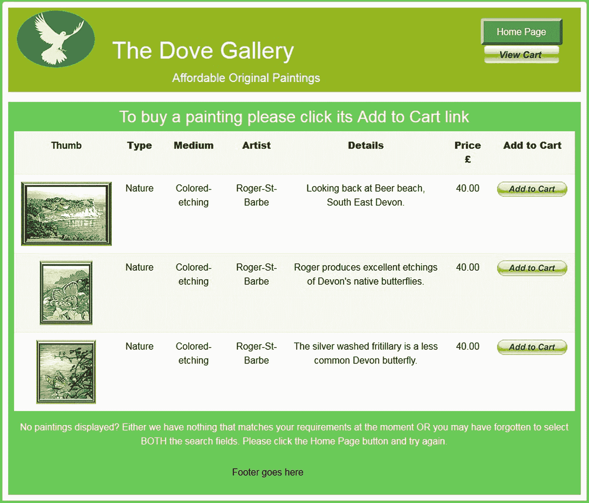

图 11-2

搜索成本不超过 40 英镑的自然绘画的结果

### 注意

除非您连接到互联网，否则 PayPal 按钮不会显示在搜索结果页面上。

可以从 Apress 网站下载并查看*found _ paints . PHP*文件的 HTML 代码。它类似于您之前看到的代码。清单 [11-2](#PC4) 显示了显示找到的画作的 PHP 代码。

```php
<?php
//Connect to the database
try {
require ( 'mysqli_connect.php' ) ;
// Select the first three items from the art table                                        #1
$type=$_SESSION['type'];
$price=$_SESSION['price'];
$query =
"SELECT art_id, thumb, type, price, medium, artist, mini_descr, ppcode ";
$query .=
"FROM art WHERE type= ? AND price <= ? ORDER BY price DESC LIMIT 3";
$q = mysqli_stmt_init($dbcon);
mysqli_stmt_prepare($q, $query);
// bind $id to SQL Statement
mysqli_stmt_bind_param($q, "si", $type, $price);
// execute query
mysqli_stmt_execute($q);
$result = mysqli_stmt_get_result($q);
if (mysqli_num_rows($result) > 0) {
?>
<table class="table table-responsive table-striped"
style="background: white;">
<tr><th scope="col">Thumb</th>
<th scope="col"><b>Type</b></th>
<th scope="col"><b>Medium</b></th>
<th scope="col"><b>Artist</b></th>
<th scope="col"><b>Details</b></th>
<th scope="col"><b>Price &pound;</b></th>
<th scope="col"><b>Add to Cart</b></th>
</tr>
<?php
// Fetch the matching records and populate the table display                              #2
while
($row = mysqli_fetch_array($result, MYSQLI_ASSOC)) {
             echo '<tr>
             <td></td>
             <td>' . $row['type'] . '</td>
             <td>' . $row['medium'] . '</td>
             <td>' . $row['artist'] . '</td>
             <td>' . $row['mini_descr'] . '</td>
             <td>' . $row['price'] . '</td>
             <td>' . $row['ppcode'] . '</td>
             </tr>';
        }
?>
</table>
<?php
// Close the database connection.
       mysqli_close( $dbcon ) ;
}
// Or notify the user that no matching paintings were found
else {
echo '<p>There are currently no items matching your search
criteria.</p>' ; }
}
catch(Exception $e)
{
       print "The system is busy, please try later";
       $error_string = date('mdYhis') . " | Found Pics | " .
$e->getMessage() . "\n";
       error_log($error_string,3,"/logs/exception_log.log");
       //error_log("Exception in Found Pics Program.
// Check log for details", 1, "noone@nowhere.com",
       //        "Subject: Found Pics Exception" . "\r\n");
       // You can turn off display of errors in php.ini
// display_errors = Off
       //print "An Exception occurred. Message: " .
// $e->getMessage();
}catch(Error $e)
{
       print "The system is busy, please come back later";
       $error_string = date('mdYhis') . " | Found Pics | " .
$e->getMessage() . "\n";
       error_log($error_string,3,"/logs/error_log.log");
       //error_log("Error in Found Pics Program.
//Check log for details", 1, "noone@nowhere.com",
       //    "Subject: Found Pics Error" . "\r\n");
       // You can turn off display of errors in php.ini
// display_errors = Off
      //print "An Error occurred. Message: " .
// $e->getMessage();
}
?>

Listing 11-2Code to Show the Results of a Search (process_found_pics.php)

```

#### 代码的解释

本节解释代码。

```php
// Select the first three items from the art table                                        #1
$type=$_SESSION['type'];
$price=$_SESSION['price'];
$query =
"SELECT art_id, thumb, type, price, medium, artist, mini_descr, ppcode ";
$query .=
"FROM art WHERE type= ? AND price <= ? ORDER BY price DESC LIMIT 3";

```

在本章的演示中，我们将艺术作品的显示限制为三个与用户选择的类型和价格相匹配的作品。我们这样做是为了减少本章的代码。在实际环境中，如本书前面所示，需要对代码进行调整以包含分页。

```php
// Fetch the matching records and populate the table display                              #2
while
($row = mysqli_fetch_array($result, MYSQLI_ASSOC)) {
             echo '<tr>
             <td></td>
             <td>' . $row['type'] . '</td>
             <td>' . $row['medium'] . '</td>
             <td>' . $row['artist'] . '</td>
             <td>' . $row['mini_descr'] . '</td>
             <td>' . $row['price'] . '</td>
             <td>' . $row['ppcode'] . '</td>
             </tr>';

```

在创建的表格中，会显示 PayPal 代码(ppcode)。该代码将为用户提供向 PayPal 购物车添加商品的能力，如下所述。

### 与 PayPal 购物车按钮集成

PayPal 是安全的，为全球数百万人所熟悉。贝宝支付按钮是经过编码的，这样价格就不会被恶意顾客操纵。当产品付款后，PayPal 会向管理员发送一封电子邮件，其中包含以下内容:交易日期和 id、付款金额、买家的电子邮件地址、买家的送货地址以及所购商品的描述。

贝宝支付系统将不会详细描述，因为这将需要自己的一章(或两章)。完整的描述可能会过时，因为贝宝经常更新流程。我们没有给出详细的说明，而是提供了这个概述，以便您知道在 PayPal 网站上应该寻找什么。PayPal 和其他信用卡验证资源在其网站上提供了大量说明。附录 b 列出了两个有用的论坛。它们将帮助您了解如何配置 PayPal，并解决您在将购物车按钮与您的网站集成时可能遇到的问题。

要创建企业账户，请访问您所在地区或国家的 PayPal 网站(例如，美国的 [`www.paypal.com`](https://www.paypal.com) ，英国的 [`www.paypal.co.uk`](https://www.paypal.co.uk) )。注册是免费的，并不难成立。然后，通过单击“业务”选项卡并使用搜索字段找到按钮和徽标所需的代码来访问您的业务帐户。

电子商务目录中的每个产品都需要其唯一的代码用于“添加到购物车”按钮；这些都可以使用您在 PayPal 网站上的帐户进行完全配置。然后可以将每个按钮的代码复制并粘贴到数据库的 art 表中。在我们的例子中，这可以通过将代码粘贴到管理员页面的 PayPal 文本区域来实现，如图 [11-4](#Fig4) 所示。

PayPal 提供多种信用卡/借记卡标志。这些标志告诉用户，即使他们没有 PayPal 账户，也可以进行支付。图 [11-3](#Fig3) 显示了两个标准的 PayPal 编码按钮和一个信用卡/借记卡标志的横版。

图 [11-3](#Fig3) 中的按钮不包含在可下载文件中，因为它们是用户在线时由 PayPal 代码生成的。


图 11-3

按钮和信用卡/借记卡标志的外观

### 注意

本章的可下载文件中使用了 PayPal 按钮的虚拟代码。你自己的贝宝按钮将是独一无二的，只适用于你自己的电子商务网站。PayPal 将生成代码，供您复制并粘贴到 *admin_add_painting.php* 文件中。

伪代码也放在可下载文件中，用于 Recaptcha 验证。您需要将此代码替换为您的 Recaptcha 详细信息。

添加到购物车按钮的典型代码将类似于清单 [11-3a](#PC7) 中的示例。PayPal 可能会更改此代码，所以请确保从 PayPal 网站上复制正确的代码。为了安全起见，每个产品的 ID 值在这里被给定为 XXXXXXX，但是真实世界的按钮将有数字而不是 *X* s

```php
<form target="paypal" action="https://www.paypal.com/cgi-bin/webscr" method="post">
<input name="cmd" value="_s-xclick" type="hidden">
<input name="hosted_button_id" value="XXXXXXX" type="hidden">
<p><input src=
"https://www.paypal.com/en_GB/i/btn/btn_cart_LG.gif" name="submit"
alt="PayPal - The safer, easier way to pay online."
Style="float: left;" border="0" type="image"></p>
</form>

Listing 11-3aSample Code for a PayPal Add to Cart Button

```

我们还在商店的 found _ paintings 页面的标题中放置了一个 PayPal 查看购物车按钮(位于*header.php*)。查看购物车按钮的代码将类似于清单 [11-3b](#PC8) 。如前所述，此代码的格式可以由贝宝更改。经常去 PayPal 网站下载最新的格式。

粗体显示的电子邮件地址将被网站所有者(或管理员)的电子邮件地址替换。订单确认后，PayPal 会通过电子邮件将详细信息发送到该地址。

```php
<form name="_xclick" target="paypal"
action="https://www.paypal.com/uk/cgi-bin/webscr" method="post">
<input type="hidden" name="cmd" value="_cart">
<input type="hidden" name="business" value="me@mybusiness.co.uk">
<input type="image" src="https://www.paypal.com/en_GB/i/btn/view_cart.gif" border="0" name="submit"
alt="Make payments with PayPal - it's fast, free and secure!">
<input type="hidden" name="display" value="1">
</form>

Listing 11-3bThe Code for a PayPal View Cart Button

```

### 警告

为您商店中的每件产品配置唯一的 PayPal 按钮时，配置必须包括价格、货币、所购商品的名称和产品识别号。最重要的是，请确保您配置了 PayPal 按钮，以便提示买家输入送货地址。贝宝按钮将自动编码。

现在让我们看看网站的其他页面。管理员将使用图 [11-4](#Fig4) 所示的添加绘画页面添加带有 PayPal 代码的绘画。

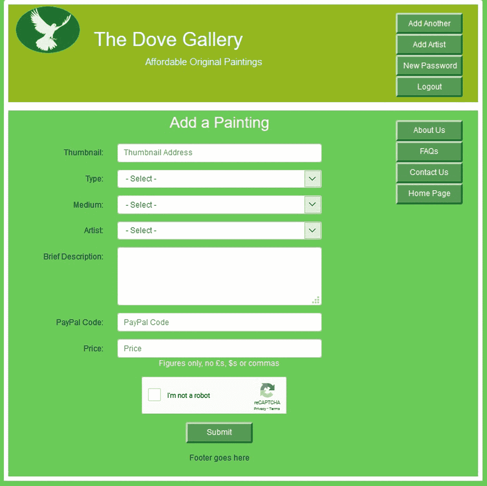

图 11-4

添加绘画的管理员界面和 PayPal 添加到购物车按钮

*admin _ add _ paints . PHP*站点的 HTML 代码类似于本书中显示的其他表单代码。因此，此处不包含。但是，您可以从 Apress 网站下载并在您的文本编辑器中查看它。表单被提交到 PHP 文件*admin _ add _ paints . PHP*。清单 [11-4](#PC9) 提供了这个代码。

```php
<?php
      $errors = array();
// Start an array to contain the error messages
// Check if a thumbnail url has been entered                                              #1
       $thumbtrim = trim($_POST['thumb']);
             if ((!empty($thumbtrim)) &&
(filter_var($thumbtrim, FILTER_VALIDATE_URL))
                          && (strlen($thumbtrim) <= 50)) {
                    // no changes
             }
             else
             {
             $errors[] =
'Missing thumbnail url or wrong format. Max 50.';
             }
// Check for a type                                                                       #2
       $typetrim = trim($_POST['type']);
       if ((!empty($typetrim)) &&
(preg_match('/[a-z\-\s\.]/i',$typetrim)) &&
                   (strlen($typetrim) <= 50)) {
       //Sanitize the trimmed type
       $typetrim = (filter_var($typetrim, FILTER_SANITIZE_STRING));
       }else{
$errors[] =
'Type missing or not alphabetic, -, period or space. Max 50.';
             }
// Has a price been entered?
$pricetrim = trim($_POST['price']);
if ((!empty($pricetrim)) && (strlen($pricetrim) <= 10)) {
       //Sanitize the trimmed price
              $pricetrim =
(filter_var($pricetrim, FILTER_SANITIZE_NUMBER_INT));
             $pricetrim = preg_replace('/\D+/', “, ($pricetrim));
       }else{
$errors[] =
'Price missing. Must be Numeric. Max ######.##.';
       }
// Has the medium been entered?
       $mediumtrim = trim($_POST['medium']);
       if ((!empty($mediumtrim)) &&
(preg_match('/[a-z\-\s\.]/i',$mediumtrim)) &&
                   (strlen($mediumtrim) <= 50)) {
      //Sanitize the trimmed medium
$mediumtrim = (filter_var($mediumtrim, FILTER_SANITIZE_STRING));
      }else{
$errors[] =
'Medium missing only alphabetic, -, period or space. Max 50.';
       }
       // Has the artist been entered?
       $artisttrim = trim($_POST['artist']);
       if ((!empty($artisttrim)) &&
(preg_match('/[a-z\-\s\.]/i',$artisttrim)) &&
                    (strlen($artisttrim) <= 50)) {
             //Sanitize the trimmed artist
$artisttrim = (filter_var($artisttrim, FILTER_SANITIZE_STRING));
      }else{
$errors[] =
'Artist missing or not alphabetic, -, period or space. Max 50.';
       }
// Has a brief description been entered?
       $minitrim = trim($_POST['mini_descr']);
       if ((!empty($minitrim)) &&
(preg_match('/[a-z\-\s\.]/i',$minitrim)) &&
                   (strlen($minitrim) <= 150)) {
       //Sanitize the trimmed artist
$minitrim = (filter_var($minitrim, FILTER_SANITIZE_STRING));
       }else{
       $errors[] =
'Description missing or not alphabetic, -, period or space. Max 50.';
       }
        // Has the PPcode been entered?
       $ppcodetrim = trim($_POST['ppcode']);
       if ((!empty($ppcodetrim)) &&
(strlen($ppcodetrim) <= 45)) {
       //Sanitize the trimmed ppcode
       $ppcodetrim =
(filter_var($minitrim, FILTER_SANITIZE_STRING));
}else{
             $errors[] =
'PayPal Code missing or not alphabetic, -, period or space. Max 50.';
      }
if (empty($errors)) { // If no errors were encountered
      // Register the painting in the database
try {
             require ('mysqli_connect.php');
// Connect to the database
             // Make the query:'
       $query = "INSERT INTO art” .
" (art_id, thumb, type, medium, artist, mini_descr, price, ppcode)";
       $query .= "VALUES ";
       $query .= "(' ', ?,?,?,?,?,?,?)";
       $q = mysqli_stmt_init($dbcon);
       mysqli_stmt_prepare($q, $query);
       // use prepared statement to ensure that only text is inserted
       // bind fields to SQL Statement
mysqli_stmt_bind_param($q, 'sssssss', $thumbtrim, $typetrim, $mediumtrim, $artisttrim, $minitrim, $pricetrim, $ppcodetrim );
       // execute query
       mysqli_stmt_execute($q);
       if (mysqli_stmt_affected_rows($q) == 1) {
              echo '<h2 style="margin-left: 60px;">
The painting was successfully registered</h2><br>';
       } else { // If it was not registered
              // Error message:
              echo '<h2>System Error</h2>
              <p class="error">
The painting could not be added due to a system
 error. We apologize for any inconvenience.</p>';
              // Debugging message:
              //echo '<p>' . mysqli_error($dbcon) .
// '<br><br>Query: ' . $q . '</p>';
              } // End of if ($result)
              mysqli_close($dbcon); // Close the database connection.
}
catch(Exception $e)
{
             print "The system is busy, please try later";
             $error_string = date('mdYhis') .
" | Add Painting | " . $e-getMessage() . "\n";
             error_log($error_string,3,"/logs/exception_log.log");
             //error_log("Exception in Add Painting Program. " .
//" Check log for details", 1, "noone@nowhere.com",
             //     "Subject: Add Painting Exception" . "\r\n");
             // You can turn off display of errors in php.ini
// display_errors = Off
             //print "An Exception occurred. Message: " .
//     $e->getMessage();
}
catch(Error $e)
{
             print "The system is busy, please come back later";
             $error_string = date('mdYhis') . " | Add Painting | " .
$e-getMessage() . "\n";
             error_log($error_string,3,"/logs/error_log.log");
             //error_log("Error in Add Painting Program. " .
//"Check log for details", 1, "noone@nowhere.com",
             //     "Subject: Add Painting Error" . "\r\n");
             // You can turn off display of errors in php.ini
// display_errors = Off
             //print "An Error occurred. Message: " .
// $e->getMessage();
}
} else { // Display the errors.
       echo '<h2>Error!</h2>
       <p class="error">The following error(s) occurred:<br>';
             foreach ($errors as $msg) { // Print each error.
                    echo " - $msg<br>\n";
             }
       echo '</p><h3>Please try again.</h3><p><br></p>';
}// End of if (empty($errors))
?>

Listing 11-4Code for Adding Paintings (admin_add_painting.php)

```

#### 代码的解释

本节解释代码。

```php
// Check if a thumbnail url has been entered                                              #1
       $thumbtrim = trim($_POST['thumb']);
             if ((!empty($thumbtrim)) &&
(filter_var($thumbtrim, FILTER_VALIDATE_URL))
                          && (strlen($thumbtrim) <= 50)) {
                    // no changes
             }
             else
             {
             $errors[] =
'Missing thumbnail url or wrong format. Max 50.';
             }
The validation for thumb uses the filter_var property FILTER_VALIDATE_URL to ensure that the location of the artwork picture is formatted correctly.
// Check for a type                                                                       #2
       $typetrim = trim($_POST['type']);
       if ((!empty($typetrim)) &&
(preg_match('/[a-z\-\s\.]/i',$typetrim)) &&
                    (strlen($typetrim) <= 50)) {
       //Sanitize the trimmed type
       $typetrim = (filter_var($typetrim, FILTER_SANITIZE_STRING));
             }else{
$errors[] =
'Type missing or not alphabetic, -, period or space. Max 50.';
             }

```

表单传递的其他值的验证包括空格的修整、使用正则表达式检查格式是否正确，以及使用 filter_var 进行清理。在本例中，正则表达式允许字母字符(a-z)、破折号(-)、空格(s)和句点(。).我们之前讨论过正则表达式。更多信息见附录 b。

创建 PayPal 购物车网站的大部分代码与我们在其他章节中使用的代码相似。因此，我们没有提供很多解释。提供的一些管理屏幕与定制购物车示例中包含的相同。我们将在下一部分查看这些屏幕。现在让我们创建自己的定制购物车。

## 创建自定义购物车

一些电子商务网站使用他们自己的定制购物车，这里我们指的是由网站开发者设计的购物车。定制购物车很复杂，需要几个交互式页面来取代在线 PayPal 系统。该过程最好用流程图来描述，如图 [11-5](#Fig5) 所示。

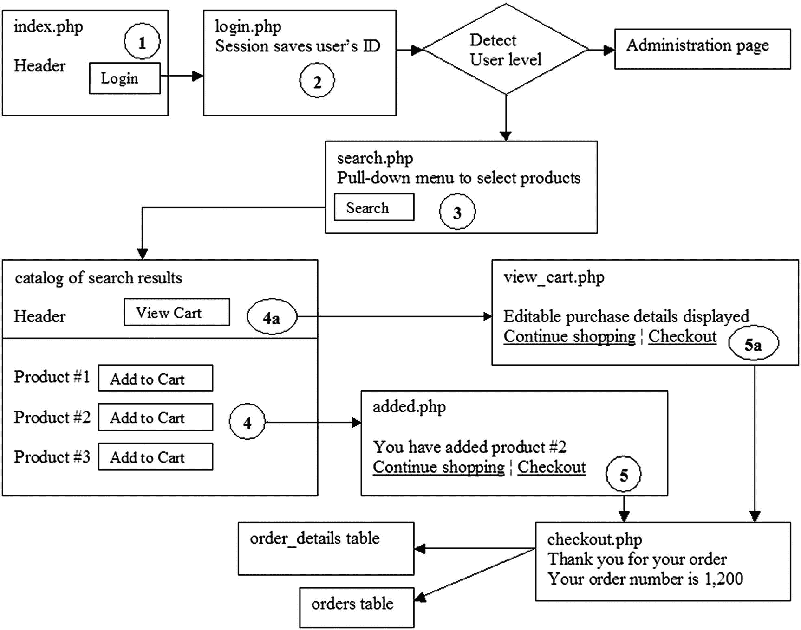

图 11-5

定制购物车的典型流程图

数字圆圈表示用户采取的步骤。登录(步骤 2)后，用户的 ID 保存在一个会话中，所有后续页面都可以访问该会话。检测用户级别，并将用户重定向到搜索页面(步骤 3)；我们的例子有包含搜索标准的下拉菜单。用户选择标准并点击搜索按钮。然后，他们会被重定向到符合搜索条件的产品目录。如果用户决定购买一幅画，他们将点击添加到购物车按钮(步骤 4)。这将产品 ID 和用户 ID 发送到购物车；显示确认操作的消息(步骤 5)。显示屏上有一个继续购物链接和一个到结账页面的链接。单击继续购物链接，用户将返回到购物页面(步骤 4)，在这里用户可以添加更多产品。如果用户单击标题菜单上的 View cart 按钮，他们将看到一个表格，显示他们选择的产品和价格。该表允许用户更改数量或从购物车中删除商品。用户走到收银台确认订单，然后订单被处理。让我们来看看如何创建这些功能。

### 自定义购物车主页

自定义购物车主页不包括搜索功能，因为自定义购物车有一个单独的搜索页面。我们要求用户登录购买任何绘画。为了鼓励观众注册，主页上展示了诱人的产品样品。图 [11-6](#Fig6) 显示主页。

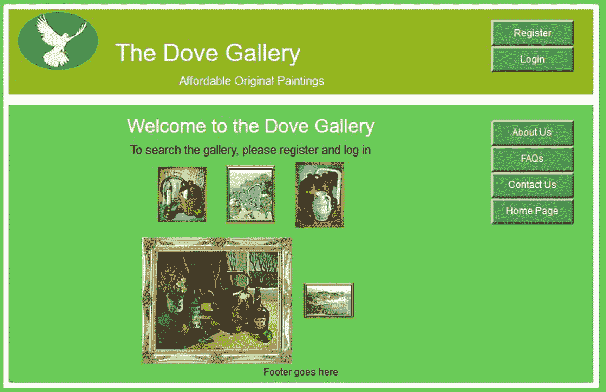

图 11-6

customcart 主页

主页的代码及其 CSS 文件包含在可下载文件中，分别为*index.php*和 *transparent.css* 。注意标题中的注册按钮和登录按钮。这向用户提供了一个提示，即他们必须登录才能购买产品。通过展示一些产品，鼓励用户注册。

### 创建自定义购物车数据库和表

自定义购物车示例使用自己的数据库、表和代码。要查看演示，请按照下列步骤操作:

1.  在 XAMPP 的 *htdocs* 文件夹或者 EasyPHP 的 *eds_www* 文件夹中，新建一个名为 *customcart* 的文件夹。

2.  从[出版社的页面下载第](http://apress.com) [11 章](11.html)的定制购物车文件。并将它们解压缩到新的 *customcart* 文件夹中。

3.  在 XAMPP 或 EasyPHP 中启动 Apache 和 MySQL，在浏览器的地址栏中输入 localhost/phpmyadmin/以访问 phpmyadmin。

4.  单击 Databases 选项卡并创建一个名为 *customdb* 的数据库。从下拉排序规则列表中，选择 utf8_general_ci，然后单击创建。

5.  单击权限选项卡，然后向下滚动并单击添加新用户。

6.  输入这些详细信息:

    *   *用户名*:图灵

    *   *密码*:在 1gm3 中

    *   *主机*:本地主机

    *   *数据库名称* : customdb

7.  单击开始。

在查看连接文件的新标题下，代码应如下所示:

```php
<?php
// Create a connection to the customdb database and to MySQL
// Set the encoding to utf-8
// Set the database access details as constants
DEFINE ('DB_USER', 'turing');
DEFINE ('DB_PASSWORD', 'En1gm3');
DEFINE ('DB_HOST', 'localhost');
DEFINE ('DB_NAME', 'customdb');
// Make the connection:
$dbcon = new mysqli(DB_HOST, DB_USER, DB_PASSWORD, DB_NAME);
// Set the encoding...optional but recommended
mysqli_set_charset($dbcon, 'utf8');

```

要测试您的连接文件，请在浏览器的地址栏中输入以下 URL:

```php
       http://localhost/customcart/mysqli_connect.php

```

显示的页面应该完全是空的。

使用 phpMyAdmin 导入表并按如下方式填充它们:

1.  在左侧面板中，单击数据库 customdb 旁边的框。

2.  不要在下一个屏幕上输入任何内容，而是单击 Import 选项卡。

3.  点击浏览按钮并导航至 *customcart* 文件夹。

4.  单击 SQL 转储文件，然后单击“打开”按钮，逐个导入这些文件；该字段将填充转储文件的 URL。

5.  确保下拉菜单中的字符集是 utf-8，并且格式显示为 SQL。

6.  单击开始。对每个 SQL 转储文件重复步骤 4 到 6。

#### 探索定制购物车

当 Apache 和 MariaDB/MySQL 在 XAMPP 或 EasyPHP 中运行时，在浏览器的地址栏中键入 **localhost/customcart/** ,然后按照以下步骤操作:

1.  使用电子邮件地址 rbush@myisp.co.uk 和密码 R @ dbl00ms 以 Rose Bush 的身份登录。

2.  选择项目和价格范围，然后单击“提交”按钮。

3.  当搜索结果页面出现时，单击其中一个添加到购物车链接。

4.  单击查看购物车菜单按钮，然后尝试将数量从 1 更改为 2；然后点击更新购物车按钮。

5.  在购物车视图中，单击继续购物链接，将另一幅画添加到购物车中，然后单击标题菜单上的查看购物车按钮。将显示购物车的全部内容。

6.  要从购物车视图中删除一幅画，请将其数量更改为零，然后单击更新购物车链接。

下面显示了由 SQL 转储文件和文件清单创建的五个 customcart 表，供您参考。

最小艺术家表有四列，如表 [11-5](#Tab5) 所示。

表 11-5

艺术家桌

<colgroup><col class="tcol1"> <col class="tcol2"> <col class="tcol3"> <col class="tcol4"> <col class="tcol5"> <col class="tcol6"> <col class="tcol7"> <col class="tcol8"></colgroup> 
| 

列名

 | 

类型

 | 

长度/值

 | 

默认

 | 

属性

 | 

空

 | 

索引

 | 

A_I

 |
| --- | --- | --- | --- | --- | --- | --- | --- |
| 艺术的 | （同 Internationalorganizations）国际组织 | eight | 没有人 | 无符号的 | -是吗 | 主要的 | ·······················。 |
| 名字 | 可变长字符串 | Thirty | 没有人 |   | -是吗 |   | -是吗 |
| 中间名 | 可变长字符串 | Thirty | 没有人 |   | -是吗 |   | -是吗 |
| 姓氏 | 可变长字符串 | Thirty | 没有人 |   | -是吗 |   | -是吗 |

绘画的细节存储在一个名为 *art* 的七列表中，如表 [11-6](#Tab6) 所示。

表 11-6

艺术桌

<colgroup><col class="tcol1"> <col class="tcol2"> <col class="tcol3"> <col class="tcol4"> <col class="tcol5"> <col class="tcol6"> <col class="tcol7"> <col class="tcol8"></colgroup> 
| 

列名

 | 

类型

 | 

长度/值

 | 

默认

 | 

属性

 | 

空

 | 

索引

 | 

A_I

 |
| --- | --- | --- | --- | --- | --- | --- | --- |
| 艺术标识 | （同 Internationalorganizations）国际组织 | eight | 没有人 | 无符号的 | -是吗 | 主要的 | ·······················。 |
| 拇指 | 可变长字符串 | Fifty | 没有人 |   | -是吗 |   | -是吗 |
| 类型 | 可变长字符串 | Thirty | 没有人 |   | -是吗 |   | -是吗 |
| 媒介 | 可变长字符串 | Fifty | 没有人 |   | -是吗 |   | -是吗 |
| 艺术家 | 可变长字符串 | Fifty | 没有人 |   | -是吗 |   | -是吗 |
| 迷你 _ 描述 | 可变长字符串 | One hundred and fifty | 没有人 |   | -是吗 |   | -是吗 |
| 价格 | 小数 | 6,2 | 没有人 | 无符号的 | -是吗 | 指数 | -是吗 |

名为 *thumb* 的列用于包含绘画缩略图的 URL。description 列包含绘画的名称、大小和一些关于图片的信息，例如油画是在画布上还是在板上画的。一个真实世界的艺术表格也可能包括一个放大版本的绘画的 URL 的列。请注意，可下载的表格没有 PayPal 购物车按钮代码栏。

orders 表是最小的，只有四列:订单 ID、用户 ID、价格和订单日期。如表 [11-7](#Tab7) 所示。

表 11-7

订单表

<colgroup><col class="tcol1"> <col class="tcol2"> <col class="tcol3"> <col class="tcol4"> <col class="tcol5"> <col class="tcol6"> <col class="tcol7"> <col class="tcol8"></colgroup> 
| 

列名

 | 

类型

 | 

长度/值

 | 

默认

 | 

属性

 | 

空

 | 

索引

 | 

A_I

 |
| --- | --- | --- | --- | --- | --- | --- | --- |
| 订单 id | （同 Internationalorganizations）国际组织 | eight | 没有人 | 无符号的 | -是吗 | 主要的 | ·······················。 |
| 用户 id | （同 Internationalorganizations）国际组织 | eight | 没有人 | 无符号的 | -是吗 | 指数 | -是吗 |
| 总价 | 小数 | 7,2 | 没有人 |   | -是吗 |   | -是吗 |
| 订单日期 | DATETIME |   | 没有人 |   | -是吗 | 指数 | -是吗 |
| 价格 | 小数 | 6,2 | 没有人 | 无符号的 | -是吗 | 指数 | -是吗 |

订单表需要能够连接到其他表。

一个名为 *order_contents* 的五列表格包含各种 id、价格、订购数量和发货日期，如表 [11-8](#Tab8) 所示。

表 11-8

最小订单内容表

<colgroup><col class="tcol1"> <col class="tcol2"> <col class="tcol3"> <col class="tcol4"> <col class="tcol5"> <col class="tcol6"> <col class="tcol7"> <col class="tcol8"></colgroup> 
| 

列名

 | 

类型

 | 

长度/值

 | 

默认

 | 

属性

 | 

空

 | 

索引

 | 

A_I

 |
| --- | --- | --- | --- | --- | --- | --- | --- |
| 内容标识 | （同 Internationalorganizations）国际组织 | eight | 没有人 | 无符号的 | -是吗 | 主要的 | ·······················。 |
| 订单 id | （同 Internationalorganizations）国际组织 | eight | 没有人 | 无符号的 | -是吗 | 指数 | -是吗 |
| 艺术标识 | （同 Internationalorganizations）国际组织 | eight | 没有人 | 无符号的 | -是吗 | 指数 | -是吗 |
| 价格 | 小数 | 5,2 | 没有人 | 无符号的 | -是吗 | 指数 | -是吗 |
| 量 | （同 Internationalorganizations）国际组织 | four | 没有人 | 无符号的 | -是吗 |   | -是吗 |
| 派遣日期 | DATETIME | Sixty | 没有人 |   | -是吗 |   | -是吗 |

该表与其他表相连接。通常情况下，会有一个数量栏，为了完整起见，在表 [11-8](#Tab8) 中显示了这一点，但是如果这些画是原作(如我们的示例网站中所示)，则每幅画只存在一个，在这种情况下，数量栏是不需要的。如果商店出售印刷品或墨盒，数量栏将是必不可少的。还将包括发送地址和特殊递送指示栏。

简单的 order 和 order_contents 表只是为了说明类似的表也是电子商务网站的一部分。在现实世界中，它们将被连接到其他表。

最后，定制购物车网站的用户表有 15 列，如表 [11-9](#Tab9) 所示。

表 11-9

最小用户表的类型和属性

<colgroup><col class="tcol1"> <col class="tcol2"> <col class="tcol3"> <col class="tcol4"> <col class="tcol5"> <col class="tcol6"> <col class="tcol7"> <col class="tcol8"></colgroup> 
| 

列名

 | 

类型

 | 

长度/值

 | 

默认

 | 

属性

 | 

空

 | 

索引

 | 

A_I

 |
| --- | --- | --- | --- | --- | --- | --- | --- |
| 用户 id | 中位 | eight | 没有人 | 无符号的 | -是吗 | 主要的 | ·······················。 |
| 标题 | 可变长字符串 | Twelve | 没有人 |   | ·······················。 |   | -是吗 |
| 名字 | 可变长字符串 | Thirty | 没有人 |   | -是吗 |   | -是吗 |
| 姓氏 | 可变长字符串 | Forty | 没有人 |   | -是吗 |   | -是吗 |
| 电子邮件 | 可变长字符串 | Fifty | 没有人 |   | -是吗 |   | -是吗 |
| 密码 | 茶 | Sixty | 没有人 |   | -是吗 |   | -是吗 |
| 注册日期 | DATETIME |   | 没有人 |   | -是吗 |   | -是吗 |
| 用户级别 | 蒂尼因特 | Two | 没有人 | 无符号的 | -是吗 |   | -是吗 |
| 地址 1 | 可变长字符串 | Fifty | 没有人 |   | -是吗 |   | -是吗 |
| 地址 2 | 可变长字符串 | Fifty | 没有人 |   | -是吗 |   | -是吗 |
| 城市 | 可变长字符串 | Fifty | 没有人 |   | -是吗 |   | -是吗 |
| 州 _ 国家 | 可变长字符串 | Thirty | 没有人 |   | -是吗 |   | -是吗 |
| zcode _ pcode 函数 | 可变长字符串 | Ten | 没有人 |   | -是吗 |   | -是吗 |
| 电话 | 可变长字符串 | Fifteen | 没有人 |   | ·······················。 |   | -是吗 |
| 秘密 | 可变长字符串 | Thirty | 没有人 |   | -是吗 |   | -是吗 |

包含 user_level 列，使登录页面能够区分注册用户和管理员。用户的 user_level 为 0，但管理员的编号为 1。我们将很快看到秘密栏将被用来帮助用户恢复他们的密码。

可下载文件 *users.sql* 包含表 [11-9](#Tab9) 中所示的两个注册。这些用户的详细信息将在您在本章后面探索定制购物车的工作方式时用到。

### 注意

以下是用户的登录详细信息:

迈克·罗索夫先生，电子邮件:miker@myisp.com，密码:W111g@t3s，用户级别:51

罗斯·布什夫人，电子邮件:rbush@myisp.co.uk，密码:R@db100ms，用户级别:0

为了在上面的注释中节省空间，我们没有显示包含在表的 *user.sql* 文件中的附加信息。我们给了布什夫人和 Rosoft 先生相同的邮政地址，因为他们是同一个人。在这个自定义购物车网站的示例中，不会再次访问其他详细信息；因此，它们并不重要。

#### 自定义购物车登录页面

图 [11-7](#Fig7) 显示了 login.php 的*页面。*

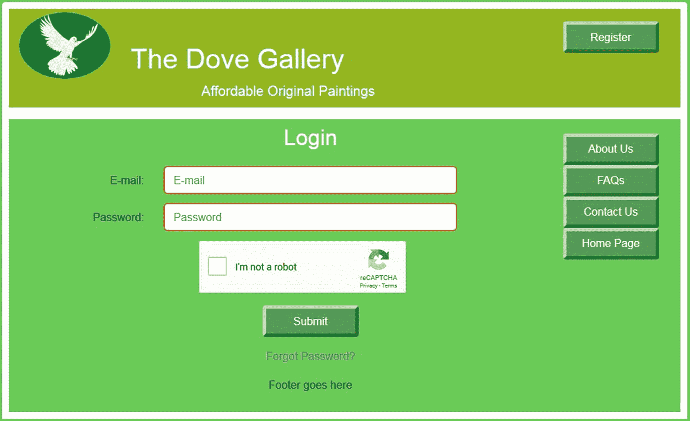

图 11-7

customcart 和 PayPal 登录页面

注意页面有忘记密码？链接。让我们看看 HTML 代码。PHP 代码( *process_login.php* )与我们在前面章节中看到的相同。你可以从网站下载的文件中查看。

清单 [11-7](#PC13) 显示了 login.php 页面的*代码。*

```php
<?php
$menu = 7;
if ($_SERVER['REQUEST_METHOD'] == 'POST') {
//require("cap.php");
}
?>
<!DOCTYPE html>
<html lang="en">
<head>
  <title>Template for an interactive web page</title>
  <meta charset="utf-8">
  <meta name="viewport"
content="width=device-width, initial-scale=1, shrink-to-fit=no">
  <!-- Bootstrap CSS File -->
  <link rel="stylesheet"
  href=
"https://stackpath.bootstrapcdn.com/bootstrap/4.1.0/css/bootstrap.min.css"
  integrity=
"sha384-9gVQ4dYFwwWSjIDZnLEWnxCjeSWFphJiwGPXr1jddIhOegiu1FwO5qRGvFXOdJZ4"
  crossorigin="anonymous">
<link rel="stylesheet" type="text/css" href="transparent.css">
<script src='https://www.google.com/recaptcha/api.js'></script>
</head>
<body>
<div class="container" style="margin-top:10px">
<!-- Header Section -->
<header class="jumbotron text-center row mx-auto"
id="includeheader">
<?php include('includes/header.php'); ?>
</header>
<!-- Body Section -->
<div class="content mx-auto" id="contents">
<div class="row mx-auto"
style="padding-left: 0px; height: auto;">
<!-- Center Column Content Section -->
<div class="col-sm-8 text-center"
style="padding:0px; margin-top: 5px;">
<!--Start of login content-->
<?php
// Display any error messages if present.
if ( isset( $errors ) && !empty( $errors ) )
{
       echo '<p id="err_msg">A problem occurred:<br>' ;
       foreach ( $errors as $msg ) { echo " - $msg<br>" ; }
             echo 'Please try again or ' .
'<a href="register-page.php">Register</a></p>' ;
}
?>
<!-- Display the login form fields -->
<form  action="process_login.php" method="post">
<div class="form-group row">
    <label class="col-sm-4 col-form-label"></label>
    <div class="col-sm-8">
<h2 style="margin-top: 10px;">Login</h2>
</div>
</div>
<div class="form-group row">
    <label for="email"
class="col-sm-4 col-form-label text-right">
E-mail:</label>
    <div class="col-sm-8">
      <input type="text" class="form-control" id="email"
name="email"
             placeholder="E-mail" maxlength="30" required
value=
             "<?php if (isset($_POST['email']))
             echo htmlspecialchars($_POST['email'], ENT_QUOTES); ?>" >
required >
    </div>
       </div>
<div class="form-group row">
    <label for="passcode"
class="col-sm-4 col-form-label text-right">
Password:</label>
<div class="col-sm-8">
      <input type="password" class="form-control"
id="passcode" name="passcode"
             placeholder="Password" minlength="8"
maxlength="12" required
value=
             "<?php if (isset($_POST['passcode']))
             echo htmlspecialchars($_POST['passcode'], ENT_QUOTES); ?>"
required >
</div>
</div>
<div class="form-group row">
<label class="col-sm-4 col-form-label"></label>
<div class="col-sm-8">
<div class="g-recaptcha" style="padding-left: 50px;"
data-sitekey="placeyourrecaptchasitekeyhere"></div>
</div>
</div>
<div class="form-group row">
<label class="col-sm-4 col-form-label"></label>
<div class="col-sm-8">
<input id="submit" class="btn btn-primary"
type="submit" name="submit" value="Submit">
</div>
</div>
<div class="form-group row">                                                       <!--#1-->
       <label class="col-sm-4 col-form-label"></label>
       <div class="col-sm-8">
       <a href="forgot.php">Forgot Password?</a>
</div>
</div>
<div class="form-group row">
      <label class="col-sm-4 col-form-label"></label>
<div class="col-sm-8">
<footer class="jumbotron row" id="includefooter">
             <?php include('includes/footer.php'); ?>
</footer>
</div>
</div>
</form><!--End of the add a login content-->
</div>
<!-- Right-side Column Content Section -->
<aside class="col-sm-4" id="includemenu">
       <?php include('includes/menu.php'); ?>
       </aside>
</div>
</div>
</div>
</body>
</html>

Listing 11-7Creating the Login Page (login.php)

```

#### 代码的解释

本章的下载文件中提供了登录和注销文件。登录页面的代码与本书之前的登录文件相同，只是包含了以下语句:

```php
<div class="form-group row">                                                       <!--#1-->
       <label class="col-sm-4 col-form-label"></label>
       <div class="col-sm-8">
       <a href="forgot.php">Forgot Password?</a>
</div>
</div>

```

这只是一个指向名为*forgot.php 的页面的链接。*清单 [11-8](#PC15) 显示的是*forget . ph*T6】p 的代码。

### 找回忘记的密码

你可能想知道为什么我们这么晚才引入找回忘记的密码的方法。我们的推理如下:

*   我们认为更复杂的 PHP 代码最好在以后的章节中介绍，当你对 PHP 的使用更加熟练的时候。

*   在早期教程中，密码检索不是必需的，因为您没有与可能忘记密码的真实用户进行交互。

*   我们假设您至少在到达第 [10](10.html) 章之前不会尝试将数据库驱动的网站迁移到外部主机。

*   密码检索包括向用户发送电子邮件；除非您将网站上传到主机或在您的计算机上安装电子邮件服务器，否则无法测试这一点。

如果用户点击忘记密码？链接，他们将看到如图 [11-8](#Fig8) 所示的屏幕。

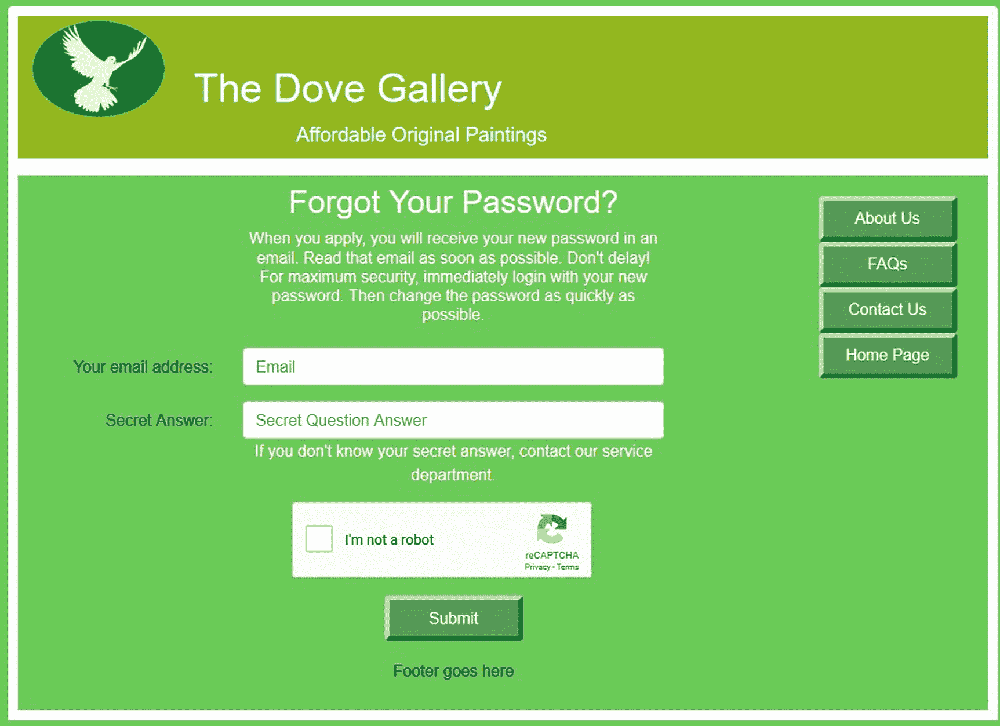

图 11-8

找回忘记的密码的显示

*forgot.php*文件的 HTML 代码类似于前面显示的其他代码。因此，此处不包含。你可以从 Apress 网站下载。然而，让我们看看*process _ forget . PHP*页面的 PHP 代码，如清单 [11-8](#PC15) 所示。

```php
<?php
try {
       require ('mysqli_connect.php');
       // Assign the value FALSE to the variable $buyid
       $buyid = FALSE;
// Validate the email address...
if (!empty($_POST['email'])) {
// Does that email address exist in the database?                                         #1
       $query =
'SELECT user_id, user_level, secret FROM users WHERE email=?';
       $q = mysqli_stmt_init($dbcon);
       mysqli_stmt_prepare($q, $query);
       // bind $id to SQL Statement
       $email = htmlspecialchars($_POST['email'], ENT_QUOTES);
       mysqli_stmt_bind_param($q, "s", $email);
       // execute query
       mysqli_stmt_execute($q);
       $result = mysqli_stmt_get_result($q);
       $row = mysqli_fetch_array($result, MYSQLI_NUM);
$secret = htmlspecialchars($_POST['secret'], ENT_QUOTES);
       if ((mysqli_num_rows($result) == 1) && ($row[1] == 0) &&                         //#2
              ($row[2] == $secret))
       {
             $buyid = $row[0];
       } else {
// If the buyid for the email address was not retrieved
      echo '<h6 style="padding-left:80px; padding-top: 20px;">
If your e-mail and secret are correct, you will receive an
e-mail</h6>';
      }
}
if ($buyid) {
// If buyid for the email address was retrieved,
// create a random password                                                               #3
      $password = substr ( md5(uniqid(random_int(), true)), 5, 10);
// Update the database table
        $hashed_password =
password_hash($password, PASSWORD_DEFAULT);
        $query = "UPDATE users SET password=? WHERE user_id=?";
        $q = mysqli_stmt_init($dbcon);
        mysqli_stmt_prepare($q, $query);
        // bind $id to SQL Statement
       mysqli_stmt_bind_param($q, "si", $hashed_password, $buyid);
       // execute query
        mysqli_stmt_execute($q);
        if (mysqli_stmt_affected_rows($q) == 1) {
// Send an email to the buyer                                                             #4
       $body = "Your password has been changed to '" . $password;
$body .= "'. Please login as soon as possible using the new password. ";
$body .= "Then change it immediately. otherwise, ";
$body .= "if a hacker has intercepted ";
$body .= "this email they will know your login details.";
      mail ($email, 'Your new password.', $body,
'From: admin@thedovegallery.co.uk');
// Echo a message and exit the code
echo '<h6 style="padding-left:80px; padding-top: 20px;">
Your password has been changed. ';
echo 'You will shortly receive the new temporary password ';
echo 'by email.</h6>';
       mysqli_close($dbcon);
       include ('includes/footer.php');
       exit(); // Stop the script.
} else { // If the query failed to run
       echo '<p class="error">Due to a system error, your password ';
  echo 'could not be changed. We apologize for any inconvenience. </p>';
}
}
mysqli_close($dbcon);
}
catch(Exception $e)
{
       print "The system is busy, please try later";
       $error_string = date('mdYhis') . " | Forgot Password | " .
$e-getMessage() . "\n";
       error_log($error_string,3,"/logs/exception_log.log");
       //error_log("Exception in Forgot Password Program.
// Check log for details", 1, "noone@nowhere.com",
       // "Subject: Forgot Password Exception" . "\r\n");
       // You can turn off display of errors in php.ini
// display_errors = Off
      //print "An Exception occurred. Message: " .
$e->getMessage();
}
catch(Error $e)
{
       print "The system is busy, please come back later";
       $error_string = date('mdYhis') . "| Forgot Password |".
$e-getMessage() . "\n";
       error_log($error_string,3,"/logs/error_log.log");
       //error_log("Error in Forgot Password Program.
// Check log for details", 1, "noone@nowhere.com",
       //    "Subject: Forgot Password Error" . "\r\n");
       // You can turn off display of errors in php.ini
// display_errors = Off
       //print "An Error occurred. Message:".
// $e->getMessage();
}
?>

Listing 11-8Code for the Forgotten Password Page (process_forgot.php)

```

#### 代码的解释

本节解释代码。

```php
// Does that email address exist in the database?                                         #1
      $query =
'SELECT user_id, user_level, secret FROM users WHERE email=?';

```

请验证该电子邮件是否在数据库中。否则，错误消息将显示以下消息:

如果您的电子邮件和密码正确，您将会收到一封电子邮件

此消息不会告诉用户该电子邮件不存在，因为未经授权的用户会知道他们需要继续尝试其他电子邮件，直到他们发现一个有效的电子邮件。

```php
if ((mysqli_num_rows($result) == 1) && ($row[1] == 0) &&                                //#2
             ($row[2] == $secret))
       {
             $buyid = $row[0];

```

如果电子邮件存在(返回了一行)并且 user_level 为 0(不是管理员，以便为管理 ID 提供额外的保护),并且返回的机密消息是正确的，那么将$buyid 设置为 user_id。

```php
// create a random password                                                               #3
      $password = substr ( md5(uniqid(random_int(), true)), 5, 10);
// Update the database table
        $hashed_password =
password_hash($password, PASSWORD_DEFAULT);
        $query = "UPDATE users SET password=? WHERE user_id=?";

```

如果信息得到验证，则创建一个随机密码，对其进行哈希运算，并将其保存到表中的记录中。

```php
// Send an email to the buyer                                                             #4
       $body = "Your password has been changed to '" . $password;
$body .= "'. Please login as soon as possible using the new password. ";
$body .= "Then change it immediately. otherwise, ";
$body .= "if a hacker has intercepted ";
$body .= "this email they will know your login details.";
       mail ($email, 'Your new password.', $body,
'From: admin@thedovegallery.co.uk');

```

创建一封包含登录信息(包括密码)的电子邮件。请记住，系统上必须有电子邮件服务器，才能发送电子邮件。

### 注意

注销的代码将与前几章相同。

### 自定义购物车搜索页面

搜索页面类似于首页贝宝购物车主页；它被重新命名为 search.php。图 [11-9](#Fig9) 显示搜索页面。

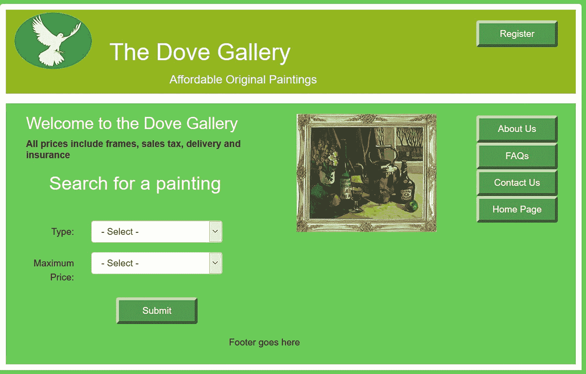

图 11-9

自定义购物车搜索页面(用户 _ 搜索 _ 页面)

当管理员登录时，他们将被定向到一个管理页面，这将在下面描述。

### 将绘画添加到自定义购物车的表格中

要将绘画添加到用于定制购物车的数据库表中，管理界面几乎与用于 PayPal 购物车的界面相同，但是省略了 PayPal 代码的文本区域。图 [11-10](#Fig10) 显示了新的界面。

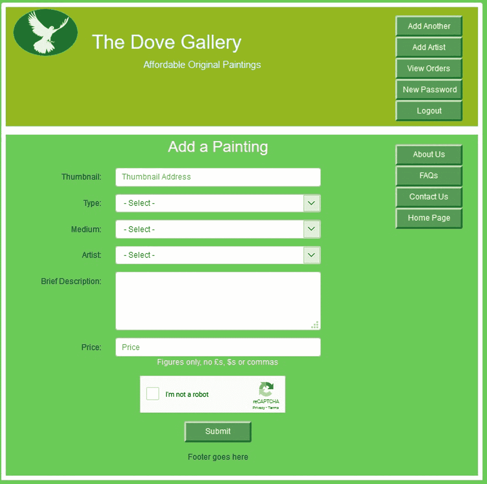

图 11-10

自定义购物车管理页面(admin_page.php)

图 [11-11](#Fig11) 显示了搜索结果和添加到购物车链接。

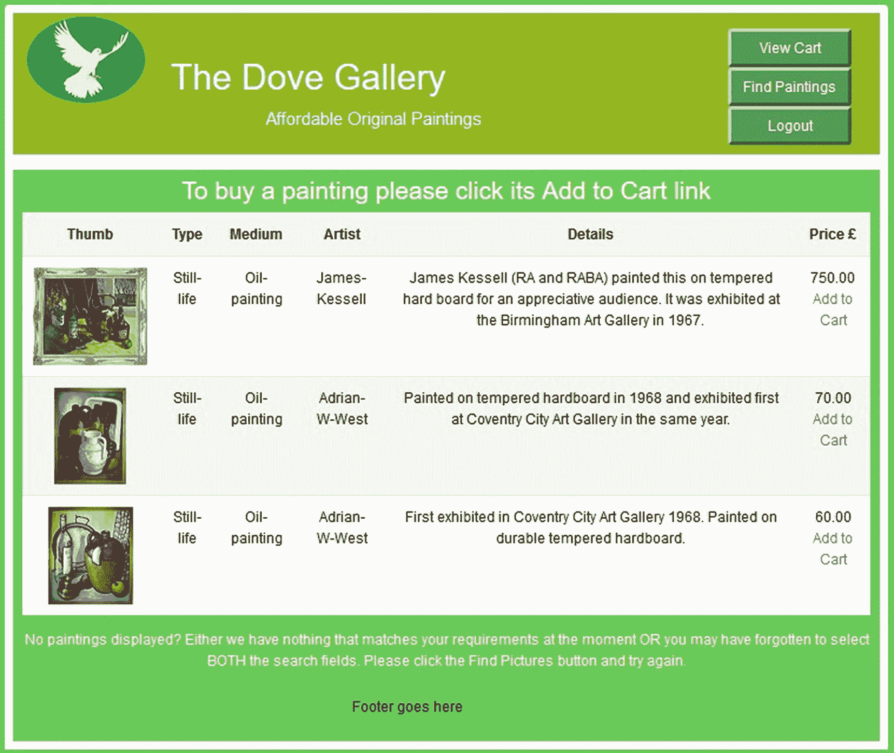

图 11-11

显示绘画及其添加到购物车链接

因为购物车的 HTML 代码类似于 PayPal 购物车中显示的购物车，所以这里没有显示。不过你可以从你下载的文件中查看 *found_pics_cart.php* 文件了解详情。PHP 代码如清单 [11-11](#PC20) 所示。

```php
<?php
//Connect to the database
try {
require ( 'mysqli_connect.php' ) ;
// Select the first three items items from the art table
$type=$_SESSION['type'];
$price=$_SESSION['price'];
$query =
"SELECT art_id, thumb, type, price, medium, artist, mini_descr, ppcode";
$query .=
"FROM art WHERE type= ? AND price <= ? ORDER BY price DESC LIMIT 3";
$q = mysqli_stmt_init($dbcon);
mysqli_stmt_prepare($q, $query);
// bind $id to SQL Statement
$type = htmlspecialchars($type, ENT_QUOTES);
$price = htmlspecialchars($_POST['price'], ENT_QUOTES);
mysqli_stmt_bind_param($q, "si", $type, $price);
// execute query
mysqli_stmt_execute($q);
$result = mysqli_stmt_get_result($q);
if (mysqli_num_rows($result) > 0) {
// Table header
?>
<table class="table table-responsive table-striped"
style="background: white;">
<tr><th scope="col">Thumb</th><th scope="col">Type</th>
<th scope="col">Medium</th><th scope="col">Artist</th>
<th scope="col">Details</th><th scope="col">
Price &pound;</th>
</tr>
<?php
// Fetch the matching records and populate the table display                              #1
while ($row = mysqli_fetch_array($result, MYSQLI_ASSOC)) {
       echo '<tr>
       <td></td>
       <td>' . $row['type'] . '</td>
       <td>' . $row['medium'] . '</td>
       <td>' . $row['artist'] . '</td>
       <td>' . $row['mini_descr'] . '</td>
       <td>' . $row['price'] .
       '<br><a href="added.php?id=' . $row['art_id'] .
'">Add to Cart</a></td>
      </tr>';
      }
?>
</table>
<?php
// Close the database connection.
  mysqli_close( $dbcon ) ;
}
// Or notify the user that no matching paintings were found
else {
echo '<p>There are currently no items matching your search '
echo 'criteria.</p>' ; }
}
catch(Exception $e)
{
       print "The system is busy, please try later";
       $error_string = date('mdYhis') . " | Found Pics | " .
$e->getMessage() . "\n";
       error_log($error_string,3,"/logs/exception_log.log");
       //error_log("Exception in Found Pics Program.
//Check log for details", 1, "noone@nowhere.com",
       //    "Subject: Found Pics Exception" . "\r\n");
       // You can turn off display of errors in php.ini
//display_errors = Off
      //print "An Exception occurred. Message:".
//$e->getMessage();
}catch(Error $e)
{
       print "The system is busy, please come back later";
$error_string = date('mdYhis') . " | Found Pics | " .
$e->getMessage() . "\n";
       error_log($error_string,3,"/logs/error_log.log");
       //error_log("Error in Found Pics Program.
//Check log for details", 1, "noone@nowhere.com",
       //    "Subject: Found Pics Error" . "\r\n");
       // You can turn off display of errors in php.ini
//display_errors = Off
       //print "An Error occurred. Message:".
//$e->getMessage();
}
?>

Listing 11-11Code for process_found_pics.php

```

#### 代码的解释

本节解释代码。

```php
// Fetch the matching records and populate the table display                              #1
while ($row = mysqli_fetch_array($result, MYSQLI_ASSOC)) {
       echo '<tr>
       <td></td>
       <td>' . $row['type'] . '</td>
       <td>' . $row['medium'] . '</td>
       <td>' . $row['artist'] . '</td>
       <td>' . $row['mini_descr'] . '</td>
       <td>' . $row['price'] .
       '<br><a href="added.php?id=' . $row['art_id'] .
'">Add to Cart</a></td>
       </tr>';

```

自定义购物车代码和 PayPal 代码之间的唯一区别是购物车提供的链接。在自定义购物车代码中，链接被附加到*added.php*程序。在贝宝程序中，它会转到贝宝网站。这个定制的购物车链接还会将*的 art_id 传递给 added.php*。

当一幅画被添加到购物车时，用户会得到通知，如图 [11-12](#Fig12) 所示。

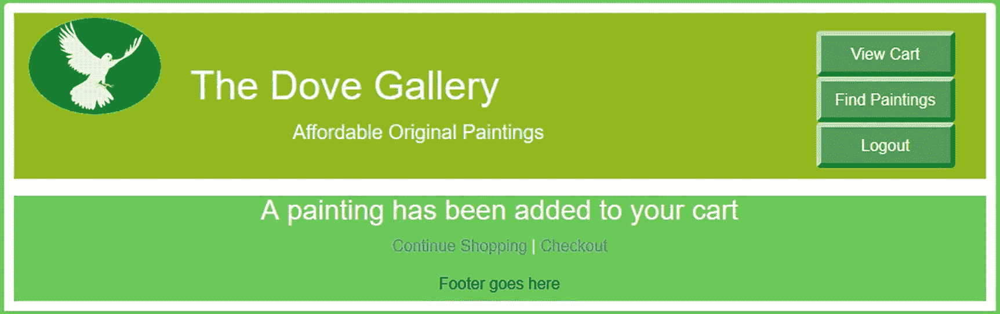

图 11-12

确认一幅画已被添加到购物车

请注意确认消息下方的两个链接；用户可以继续购物以向购物车添加更多商品。他们可以选择通过单击标题菜单上的查看购物车链接来查看购物车内容。他们也可以使用第二个链接直接进入收银台。清单 [11-12](#PC22) 给出了确认页面的代码。

```php
<?php
session_start();
if (!isset($_SESSION['user_id'])){
header('location:login.php');
exit();
}
$menu = 2;
?>
<!DOCTYPE html>
<html lang="en">
<head>
<title>Added to Cart</title>
<meta charset="utf-8">
<meta name="viewport"
content="width=device-width, initial-scale=1, shrink-to-fit=no">
<!-- Bootstrap CSS File -->
<link rel="stylesheet"
      href=
"https://stackpath.bootstrapcdn.com/bootstrap/4.1.0/css/bootstrap.min.css"
       integrity=
"sha384-9gVQ4dYFwwWSjIDZnLEWnxCjeSWFphJiwGPXr1jddIhOegiu1FwO5qRGvFXOdJZ4"
       crossorigin="anonymous">
<link rel="stylesheet" type="text/css" href="transparent.css">
</head>
<body>
<div class="container" style="margin-top:10px">
<!-- Header Section -->
<header class="jumbotron text-center row mx-auto"
id="includeheader">
<?php include('includes/header.php'); ?>
</header>
<!-- Body Section -->
<div class="content mx-auto" id="contents">
<div class="row mx-auto"
style="padding-left: 0px;margin-top: -17px; width: 90%; height: auto;">
<!-- Center Column Content Section -->
<div class="col-sm-12 text-center"
style="padding:0px; margin-top: 5px;">
<div id="content"><!--Start of added page-->
<p>
<?php
if ( isset( $_GET['id'] ) ) { $id = $_GET['id'] ; }
// Connect to the database
try {
require ( 'mysqli_connect.php' ) ;
// Get selected painting data from the  'art' table
             $query = "SELECT * FROM art ";
             $query .= "WHERE art_id = ? ";
             $q = mysqli_stmt_init($dbcon);
             mysqli_stmt_prepare($q, $query);
             // bind $id to SQL Statement
             mysqli_stmt_bind_param($q, "i", $id);
             // execute query
             mysqli_stmt_execute($q);
             $result = mysqli_stmt_get_result($q);
             $row = mysqli_fetch_array($result, MYSQLI_ASSOC);
             if (mysqli_num_rows($result) == 1) {
 // If the cart already contains one of those products                                    #1
             if ( isset( $_SESSION['cart'][$id] ) )
             {
       // Add another one of those paintings
       $_SESSION['cart'][$id]['quantity']++;
echo '<h3>Another one of those paintings has been added';
echo 'to your cart</h3>';
             }
             else
             {
    // Add a different painting                                                           #2
             $_SESSION['cart'][$id]=
array ( 'quantity' => 1, 'price' => $row['price'] ) ;
      echo '<h3>A painting has been added to your cart</h3>';
             }
}
}
catch(Exception $e)
{
       print "The system is busy, please try later";
       $error_string = date('mdYhis') . " | Added  | " .
$e->getMessage() . "\n";
       error_log($error_string,3,"/logs/exception_log.log");
       //error_log("Exception in Added Program.
// Check log for details", 1, "noone@nowhere.com",
       //    "Subject: Added Exception" . "\r\n");
       // You can turn off display of errors in php.ini
// display_errors = Off
       //print "An Exception occurred. Message: " .
//$e->getMessage();
}catch(Error $e)
{
       print "The system is busy, please come back later";
       $error_string = date('mdYhis') . " | Added | " .
$e->getMessage() . "\n";
       error_log($error_string,3,"/logs/error_log.log");
       //error_log("Error in Added Program.
//Check log for details", 1, "noone@nowhere.com",
       //    "Subject: Added Error" . "\r\n");
       // You can turn off display of errors in php.ini
//display_errors = Off
       //print "An Error occurred. Message: " . $e->getMessage();
}
// Close the database connection
mysqli_close($dbcon);
// Insert three links
echo '<p><a href="users_search_page.php">
Continue Shopping</a> |
<a href="checkout.php">Checkout</a></p>' ;
?>
<footer>
<?php include("includes/footer.php"); ?>
</footer>
</div>
</div><!--End of page content-->
</div>
</div>
</div>
</body>
</html>

Listing 11-12Creating the Confirmation Page (added.php)

```

#### 代码的解释

本节解释代码。

```php
// If the cart already contains one of those products                                     #1
             if ( isset( $_SESSION['cart'][$id] ) )
             {
       // Add another one of those paintings
       $_SESSION['cart'][$id]['quantity']++;
echo '<h3>Another one of those paintings has been added';
echo 'to your cart</h3>';

```

检查所选绘画的细节以确定显示两个消息中的哪一个，或者“一幅绘画已被添加”或者“那些绘画中的另一幅已被添加”会话变量 cart 包含一个带有 id、数量和价格索引的三维数组。通俗地说，购物车包括由 ID(购买了什么)、数量(多少)和价格(每个)定义的每个订单。如果用户已经选择购买该画，则数量值增加({ *'* 数量*')*++)1(这由 if 语句确定)。

```php
// Add a different painting                                                               #2
             $_SESSION['cart'][$id]=
array ( 'quantity' => 1, 'price' => $row['price'] ) ;
       echo '<h3>A painting has been added to your cart</h3>' ;

```

如果以前没有选择过这幅画，那么将创建一个新的数组，数量设置为 1，价格来自艺术表中包含的值。

如果用户选择查看购物车，他们将看到显示的内容，如图 [11-13](#Fig13) 所示。

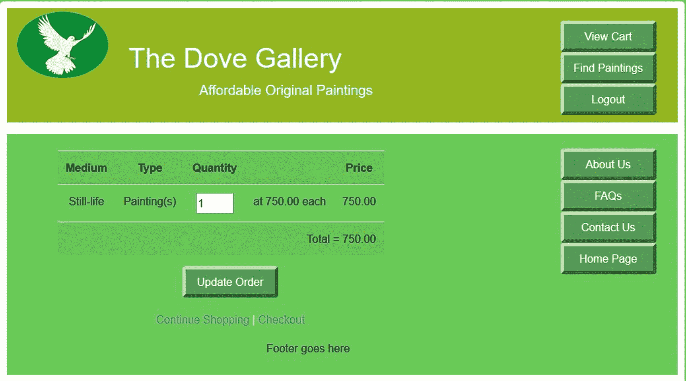

图 11-13

购物车里有一幅价值 750 英镑的静物画

用户可以编辑所显示表格第三列中的数量(白色部分)。为了从购物车中移除一幅画，用户将把当前数字变为零。在编辑数量之后，用户必须单击 Update My Cart 按钮来显示新的小计(顶行的最后一列)和修改后的总价。

用户可以点击继续购物链接选择另一幅画。让我们假设他们选择了另一幅价值 750 英镑的油画；当查看购物车时，他们将看到添加的绘画和新的总成本，如图 [11-13](#Fig13) 所示。

cart.php 的 HTML 代码可以从新闻网站下载。该代码类似于前面看到的 HTML 代码。让我们看看创建交互式购物车的 PHP 代码(清单 [11-13](#PC25) )。

```php
<?php
// If the user changes the quantity then Update the cart
       if(isset($_POST['qty'])) {
       foreach ( $_POST['qty'] as $art_id => $item_qty )                                 //1
       {
       // Ensure that the id and the quantity are integers
       // PHP would convert for us. But other languages would not
       $id = (int) $art_id;
       $qty = (int) $item_qty;
       // If the quantity is set to zero clear the session or
       // else store the changed quantity
       if ( $qty == 0 ) { unset ($_SESSION['cart'][$id]); }
       elseif ( $qty > 0 ) {
             $_SESSION['cart'][$id]['quantity'] = $qty; }
       }
       }
       // Set an initial variable for the total cost
       $total = 0;
       // Display the cart content
       if (!empty($_SESSION['cart']))
       {
?>
<div class="row mx-auto" style="padding-left: 0px; height: auto;">
<!-- Center Column Content Section -->
<div class="col-sm-4 text-center mx-auto"
      style="padding-left: 40px;"></div>
<div class="col-sm-10 text-center mx-auto"
      style="color: black; padding:20px; margin-top: 5px;">
<?php
       try {
       // Connect to the database.
       require ('mysqli_connect.php');
       // Get the items from the art table and
       //insert them into the cart
       $q = "SELECT * FROM art WHERE art_id IN (";
       foreach (                                                                         //2
             $_SESSION['cart'] as $id => $value) { $q .= $id . ','; }
             $q = substr( $q, 0, -1 ) . ') ORDER BY art_id ASC';
             $result = mysqli_query ($dbcon, $q);
             // Create a form and a table
             echo '<form action="cart.php" method="post">';
             echo '<table class="table table-responsive table-striped"
             style=" color:black;">';
             echo '<tr><th scope="col">Medium</th><th scope="col">Type</th>';
             echo '<th scope="col">Quantity</th><th scope="col"></th>';
             echo '<th scope="col">Price</th></tr>';
             while ($row = mysqli_fetch_array ($result, MYSQLI_ASSOC))
             {
                    // Calculate the subtotals and the grand total                        #3
                    $subtotal = $_SESSION['cart'][$row['art_id']]['quantity'] *
                    $_SESSION['cart'][$row['art_id']]['price'];
                    $total += $subtotal;
                    // Display the table                                                  #4
                    echo "<tr> <td>{$row['type']}</td><td>Painting(s)</td>
                    <td><input type=\"text\" size=\"3\"
             name=\"qty[{$row['art_id']}]\"
             value=\"{$_SESSION['cart'][$row['art_id']]['quantity']}\"></td>
                    <td>at {$row['price']} each </td>
                    <td style=\"text-align:right\">".
                    number_format ($subtotal, 2)."</td></tr>";
             }
       // Close the database connection
       mysqli_close($dbcon);
       // Display the total
       echo ' <tr><td colspan="5"
       style="text-align:right">Total = '.
       number_format($total,2).'</td></tr></table>';
       echo '<input id="submit" class="btn btn-primary"
       type="submit" name="submit" value="Update Order"></form>';
}
catch(Exception $e)
{
       print "The system is busy, please try later";
       $error_string = date('mdYhis') . " | Cart | " .
              $e-getMessage() . "\n";
       error_log($error_string,3,"/logs/exception_log.log");
       //error_log("Exception in Cart Program.
       //Check log for details", 1, "noone@nowhere.com",
       //    "Subject: Cart Exception" . "\r\n");
       // You can turn off display of errors in php.ini
       // display_errors = Off
       //print "An Exception occurred. Message: " .
       //$e->getMessage();
}
catch(Error $e)
{
       print "The system is busy, please come back later";
       $error_string = date('mdYhis') . " | Cart | " .
              $e-getMessage() . "\n";
       error_log($error_string,3,"/logs/error_log.log");
       //error_log("Error in Cart Program.
       //Check log for details", 1, "noone@nowhere.com",
       //    "Subject: Cart Error" . "\r\n");
       // You can turn off display of errors in php.ini
       //display_errors = Off
       //print "An Error occurred. Message:" .
       //$e->getMessage();
}
echo "</div>";
echo "</div>";
}
else
// Or display a message
{ echo
'<p style="padding: 60px;">Your cart is currently empty.</p>' ;
}
// Create some links
echo
'<p><a href="users_search_page.php">Continue Shopping</a>';
echo ' | <a href="checkout.php">Checkout</a>' ;
?>

Listing 11-13Code for the View Cart Page (process_cart.php)

```

#### 代码的解释

清单中的注释解释了用于填充购物车的步骤。但是，有些项目需要更多的解释，如下所示:

```php
   foreach ( $_POST['qty'] as $art_id => $item_qty )                                    //#1
The view cart process relies on sessions and some complex arrays. The function foreach is a special loop that works with arrays. In line #1 the item $_POST['qty'] is an array containing the quantity of a product. The symbol => does not mean equal to or greater than, it is an array operator that associates the item qty with the $art_id of the product.
$q = "SELECT * FROM art WHERE art_id IN (";
foreach (                                                                               //#2
$_SESSION['cart'] as $id => $value) { $q .= $id . ','; }
$q = substr( $q, 0, -1 ) . ') ORDER BY art_id ASC';

```

值被添加到这里显示的名为 *cart* 的会话数组中。这些值包括$id，即$art_id 和价格。

```php
// Calculate the subtotals and the grand total                                            #3
       $subtotal = $_SESSION['cart'][$row['art_id']]['quantity'] *
             $_SESSION['cart'][$row['art_id']]['price'];
       $total += $subtotal;   }

```

购物车中每一行的数量和价格用于计算小计。然后，将每一行的小计加到总计中，得出到期总计。

```php
// Display the table                                                                      #4
echo "<tr> <td>{$row['type']}</td><td>Painting(s)</td>
<td><input type=\"text\" size=\"3\"
name=\"qty[{$row['art_id']}]\" value=\"{$_SESSION['cart'][$row['art_id']]['quantity']}\"></td>
<td>at {$row['price']} each </td>
<td style=\"text-align:right\">".
number_format ($subtotal, 2)."</td></tr>";

```

会话数组用于将值插入到视图购物车表的单元格中。请注意，在格式化表格的代码中，双引号通过使用反斜杠进行转义。

### 注意

在现实世界的网站中，要达到必要的安全标准，需要使用两种技术:准备好的语句和事务。事务超出了本书的范围，但是您可以使用附录 b 中提供的资源来了解它们。

我们将简要提及结帐页面。

### 结账页面

当点击 checkout 链接时，会发生四件事。

*   出现一个“谢谢”页面，其中也注明了订单号。

*   订单详细信息会发布到订单内容表中。

*   订单被输入到订单表中。

*   购物车被清空，准备下次购物。

图 [11-14](#Fig14) 显示了“感谢”页面。

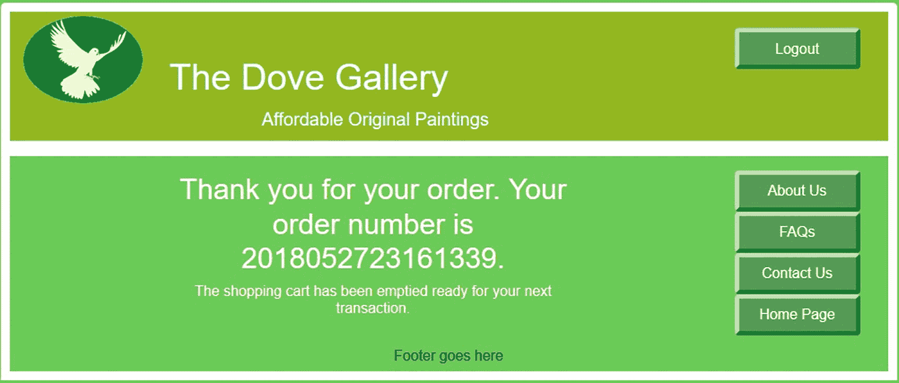

图 11-14

结帐“谢谢”页面

结帐页面根据当前日期和时间以及用户的 ID 号生成订单号。如果出现问题，这些信息足以帮助服务台查找正确的订单。结帐页面的代码包含在可下载的文件中。

### 额外的管理任务

本章前面介绍了添加艺术家和绘画的过程，但是管理员必须执行其他几项任务。编辑和删除艺术家和画作可以通过第 [3](03.html) 章描述的技术来实现。其他任务通常由管理团队承担；这些职责包括订单处理、运输、库存控制、财务控制和客户支持。所有这些活动都将记录在适当的数据库表格中。

## 摘要

在这一章中，你学习了电子商务网站所需的许多要素中的一些。然而，简洁的需要意味着我们必须限制元素的数量。因为一个实际的电子商务网站需要大量的文件，这一章的空间被用来描述用户看到的主要显示。这一章不是教程，而是对一个电子商务网站的简要描述，随后是 PayPal 和定制购物车的演示。

下载代码包括接受用户信息的安全方法。这些网站还被设计用于任何尺寸的设备，包括智能手机。

我们希望您能够理解电子商务网站的复杂性，以及加强安全性的必要性。我们也希望这一章能启发你探索附录 b 中给出的一些电子商务资源。