# 12.简单看一下 Oracle MySQL 8

到目前为止，您可能会奇怪为什么我们没有推出 Oracle 的 MySQL 8 数据库服务器。我们首先想教你在 MariaDB 和 MySQL 的任何当前级别上都能工作的技术。在很大程度上，我们已经完成了这项任务。第二，如果你对 MariaDB 或 MySQL 5.7 满意，你可以不安装 MySQL 8。你可以跳过这一章，我们向你展示的一切都将会起作用。

完成本章后，您将能够

*   了解 Oracle MySQL 8 的特性和工具

*   安装 MySQL 8

*   使用 MySQL Workbench 中包含的工具

*   将数据库迁移到 MySQL 8

*   在 MySQL 8 中创建和修改数据库

*   在 MySQL 8 中创建用户 id

MySQL 8 有很多很强的特性，我们来看看升级的优势。您将看到版本 8 有一些以前版本中没有的新特性。

## 升级的优势

免费社区版和企业版中有以下改进:

*   *MySQL 文档库*:可以使用比 SQL 8 更老的基于 SQL 和非基于 SQL 的数据库。

*   *SQL 用户角色*:您可以基于传统的 IT 工作角色创建管理用户 id。

*   *改进的 SQL Workbench* :目前没有兼容 MySQL 8 的 phpMyAdmin 版本。我们将在本章中介绍 MySQL 工作台的特性。

*   *改进的安全特性*:两个版本都使用了改进的 openSSL 协议，即开源的安全套接字层(SSL)和传输层安全(TLS)协议，具有默认认证。我们将在本章的例子中介绍默认认证。

*   *密码历史*:您可以维护密码历史信息。现在可以限制重复使用以前的密码了。

*   *密码哈希*:新的 caching_sha2_password 认证可用。它实现了 SHA-256 密码哈希，并使用缓存来解决任何延迟问题。您会发现 PHP 7 目前不支持这种新的散列级别。

*   *可靠性提高*:数据定义语言(DDL)语句变得安全可靠。元数据现在存储在事务数据字典中。

*   *改进的 InnoDB 数据库引擎*:数据库引擎得到了改进。

*   *性能提升*:性能最高比 MySQL 5.7 快两倍。

*   *新的 SQL 命令*:锁定记录和表时，有 NOWAIT 和 SKIP 锁定选项。SQL 支持索引定义中带有 DESC 的降序索引。它不再被忽视。分组函数可以在包含 WITH ROLLUP 修饰符的 GROUP BY 查询中使用。ALTER TABLE 支持更好的列重命名(将列 old_name 重命名为 new_name)。

*   *更新的 SQL 命令* : SELECT 和 UNION 使用相同的语法。自然连接允许使用可选的 INNER 关键字(自然内部连接)。右深度连接不再需要括号(连接...加入...安大略...开)。您可以在查询两边使用括号(选择...联合选择...).顶级语句中现在允许联合的左手嵌套。这些更改遵循 SQL 标准。

*   *默认支持更大的字符集*:两个版本都包含了更多的国家字符集，比如俄国的。默认字符集为 utf8mb4 ( [`https://dev.mysql.com/doc/relnotes/mysql/8.0/en/news-8-0-0.html#mysqld-8-0-0-charset`](https://dev.mysql.com/doc/relnotes/mysql/8.0/en/news-8-0-0.html%2523mysqld-8-0-0-charset) )。

*   *GIS 地理支持*:两个版本都包括空间参考系统(SRS)。

*   *新增错误日志*:两个版本都使用 MySQL 组件架构。

*   *JSON 改进*:有新命令，新功能，改进排序，部分更新。您可以使用 SQL 命令来访问 JSON 数据。数据被返回，就好像它是一个关系表。

以下改进仅在企业版中可用。它不是免费的，但是有一个 30 天的超时版本可以下载测试。

*   *备份和恢复*:完整、增量、部分备份。这包括时间点恢复。备份压缩可用。

*   *高可用性*:针对 InnoDB 集群的集成、本机和高可用性。

*   *加密*:密钥生成、数字签名和其他功能。

*   *认证*:与其他安全系统，包括微软 Active Directory 和 PAM。

*   *防火墙*:防御数据库攻击，包括 SQL 注入。

*   *审计*:基于策略的审计。

*   *监控*:用于管理数据库基础设施。

*   *云服务*:由甲骨文云提供支持。它支持 SaaS、PaaS 和 DBaaS 应用程序。

更多详情，请访问 [`https://dev.mysql.com/doc/relnotes/mysql/8.0/en/news-8-0-11.html`](https://dev.mysql.com/doc/relnotes/mysql/8.0/en/news-8-0-11.html) 。

截至本书出版时，MySQL 8 还没有集成到 XAMPP 或 easyPHP 中。这些工具的创造者选择支持 MySQL 和 MariaDB 的一些原始开发者。但是，您现在会发现，您可以在您的平台上运行两个版本的 MySQL (5.7 和 8.11)。让我们从安装社区服务器版本开始。

## 安装 MySQL 8 社区服务器

完成以下步骤来安装 Oracle 的 MySQL 8 社区服务器:

1.  前往 [`https://dev.mysql.com/downloads/mysql/`](https://dev.mysql.com/downloads/mysql/) 。

2.  向下滚动到正式发布(GA)区域(参见图 [12-1](#Fig1) )。

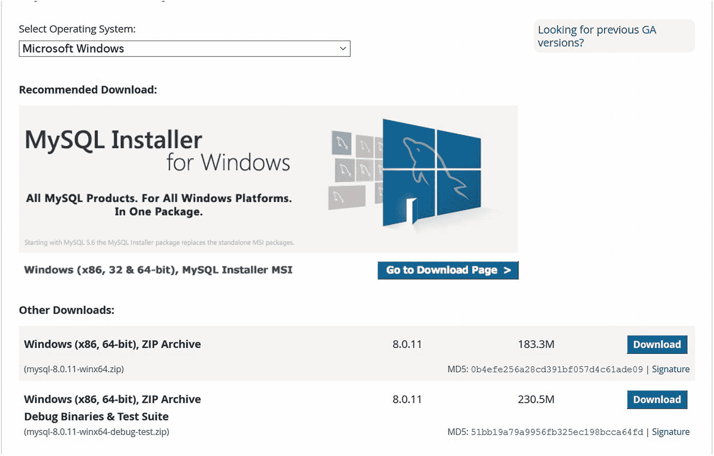

图 12-1

MySQL 安装程序

MySQL 有一个适用于当今许多操作系统的版本。如果您没有使用 Windows，您可以使用图 [12-1](#Fig1) 顶部所示的下拉框选择正确的版本。本演示将安装 Windows 版本，但其他版本的安装过程类似。

1.  单击转到下载页面按钮。我们选择的版本包括所有适用于 Windows 的工具。

2.  向下滚动到正式发布(GA)区域(参见图 [12-2](#Fig2) )。

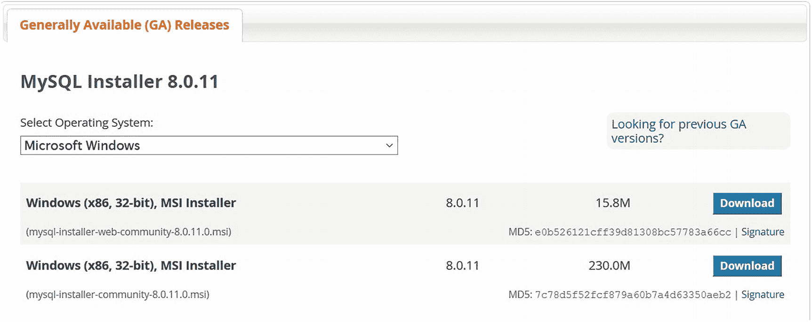

图 12-2

选择安装程序

第一个选项(web 安装程序)会将大部分软件保留在互联网上，直到您选择要安装的项目。然后它会在安装时下载每一个。第二个选项一次下载所有项目。如果您在整个安装过程中都连接到互联网，请使用第一个选项。

1.  点按您想要安装的项目旁边的安装按钮(下载)。

2.  下一个屏幕建议您登录或创建一个免费的用户 ID 来使用 Oracle 的最新更新和服务。您可以向下滚动到页面底部并单击“不，谢谢，开始下载”链接来跳过这一步(参见图 [12-3](#Fig3) )。

    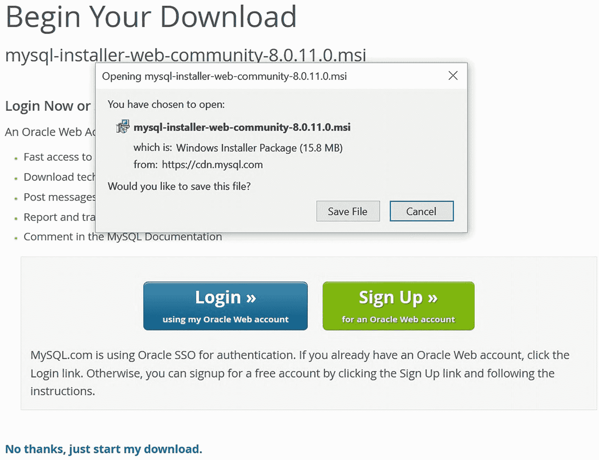

    图 12-3

    启动安装程序

3.  单击保存文件。

    将下载安装程序。找到它的位置并单击它开始安装。见图 [12-4](#Fig4) 。

    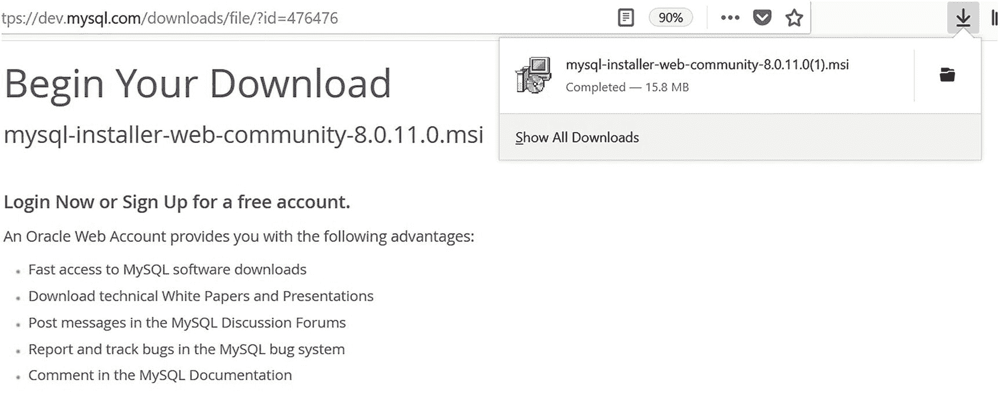

    图 12-4

    找到并启动安装程序

4.  您可能会收到一条警告消息，提示您已经下载了可执行文件；如果是，请单击确定。Windows 还会询问您是否允许应用程序对您的系统进行更改。单击是。将显示安装程序的许可协议。选中“我接受”框，然后单击“下一步”。将出现图 [12-5](#Fig5) 所示的画面。

    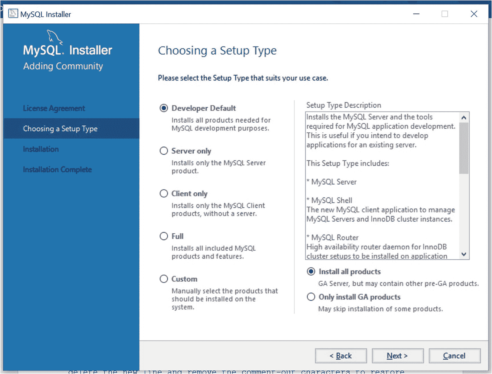

    图 12-5

    选择安装类型

5.  有五种安装类型可供选择。给出的描述都挺详细的，这里就不描述了。但是，在本演示中，我们不会安装所有产品。我们将只安装我们需要的那些。因此，选择 Custom 并单击 Next 按钮。将出现图 [12-6](#Fig6) 中的屏幕。

    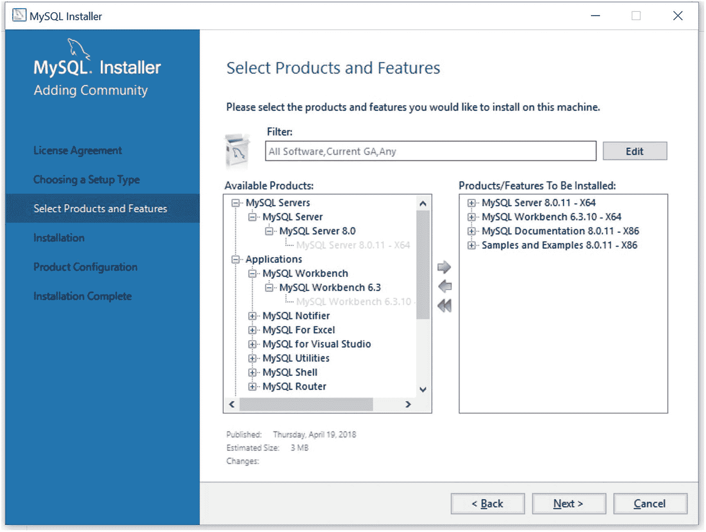

    图 12-6

    选择要安装的产品

6.  对于本演示，我们希望安装 MySQL 服务器、MySQL 工作台、文档和示例。您需要单击每个区域旁边的+号(在某些情况下，多个+号)来查找要安装的产品。找到产品后，选择它并单击绿色右箭头。产品应该移动到屏幕的右侧。一旦在右侧看到所有需要的产品(见图 [12-6](#Fig6) )，点击下一步。

7.  所选产品将在下一个屏幕上列出。验证它们是否正确，然后单击“执行”按钮。

8.  安装完所有产品后，该按钮将变为“下一步”按钮。点击它。

9.  下一个屏幕将指示我们需要为服务器和示例进行一些产品配置。单击下一步。

10.  下一个屏幕将为您提供创建复制数据库的机会。这适用于数据可能分散在许多位置的大型配置。我们只测试一个小系统，所以我们需要默认(独立)选择。单击下一步。将出现图 [12-7](#Fig7) 所示的画面。

    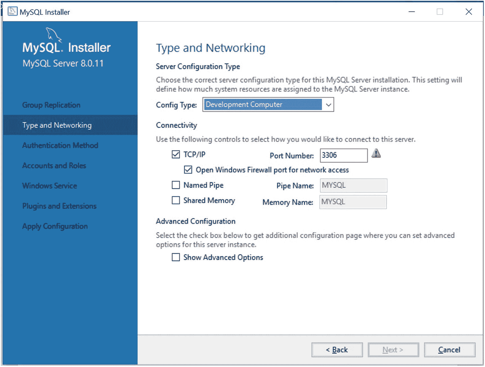

    图 12-7

    更改端口号

11.  为了我们的测试和开发需要，配置类型选项应该设置为开发计算机。但是，将端口号从默认端口(3306)更改为另一个端口(尝试 3307；警告图标将告诉您是否存在冲突)。如果使用不同的端口，我们可以同时运行两个版本的 MySQL。我们目前有一个冲突，因为 MySQL 5.7 正在使用端口 3306。更改端口后，您可以单击下一步。将出现图 [12-8](#Fig8) 中的屏幕。

    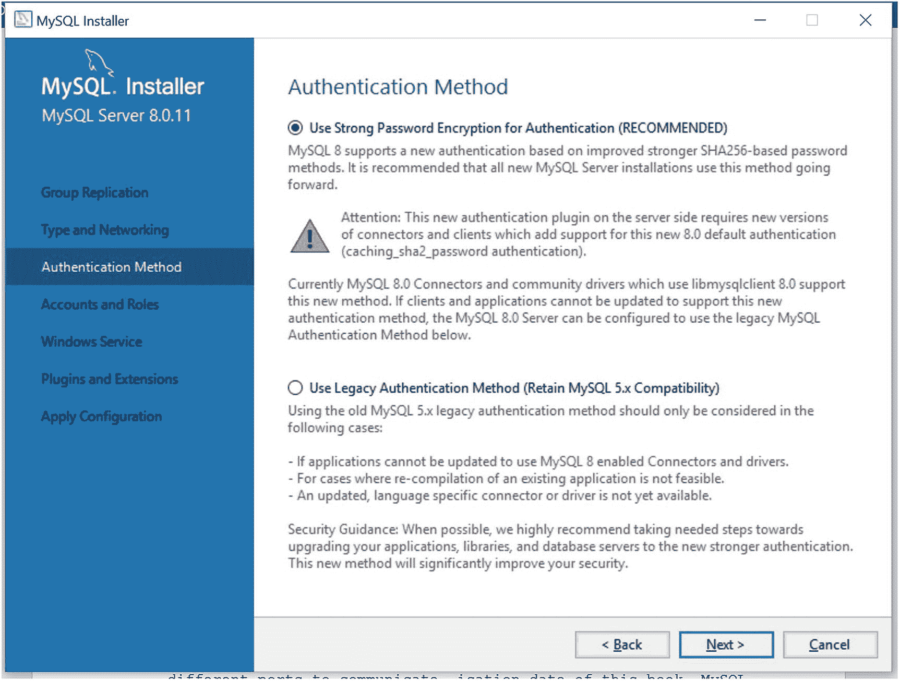

    图 12-8

    更改身份验证方法

12.  由于 PHP 7 目前不能与新的 Oracle 加密技术一起使用，所以我们选择“使用传统身份验证方法”很重要。然后单击下一步。然后，系统会要求您输入根密码。您必须在每次访问 MySQL 8 时使用此密码(这是一个新功能)。请确保输入一个您会记住的安全密码。然后单击下一步。您也可以选择在这个时候(见图 [12-9](#Fig9) )或在服务器安装之后，根据角色创建其他用户标识和密码(也是一项新功能)。我们现在不会安装任何特殊的用户标识。

    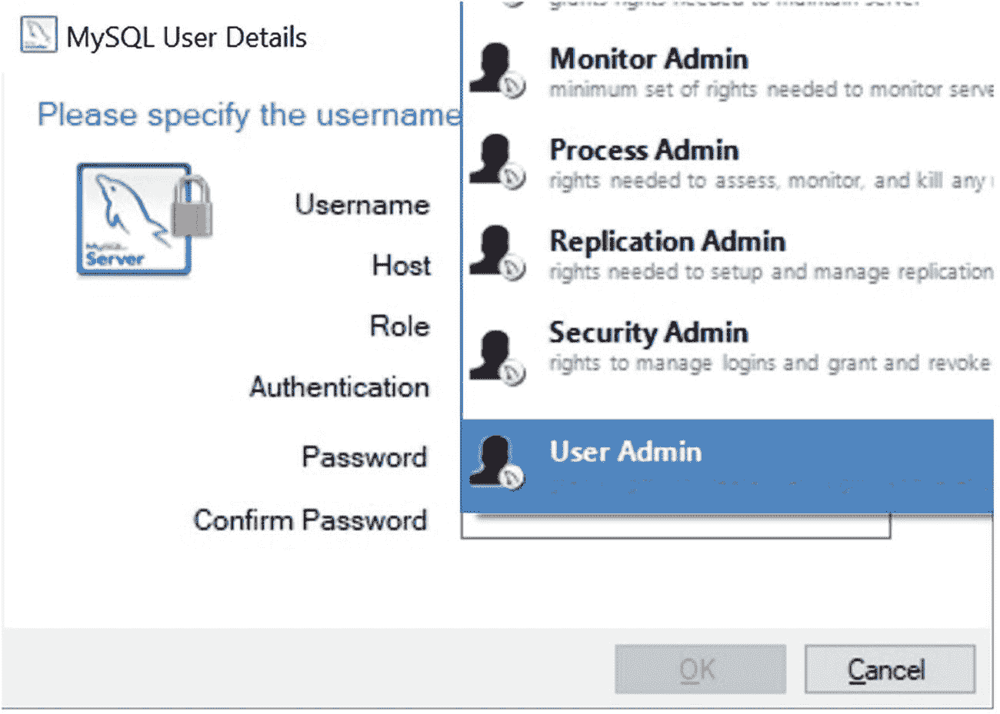

    图 12-9

    添加具有角色的新用户

13.  下一个屏幕将询问您是否希望 MySQL 作为 Windows 服务启动(换句话说，自动启动)。我们将保留默认设置(或者如果您想要手动启动 MySQL 服务器，您可以更改它们)。单击下一步。下一个屏幕与文档存储相关。这是使用和创建 NoSQL 类型数据库的能力。由于这本书不包括 NoSQL 数据库，我们将保留默认选择(不选择任何内容),然后单击 Next。

14.  我们将看到应用配置屏幕。单击执行，设置将被安装。更改完成后，单击“完成”。它现在会询问我们样本数据的配置。单击“下一步”按钮。要求时输入您的 root 密码。单击检查按钮。这将验证您可以使用提供的密码访问示例数据库。单击“下一步”按钮。将出现应用配置屏幕。单击执行。这将应用 SQL 脚本来安装示例数据。完成后点击完成。产品配置屏幕将再次出现。单击下一步。

15.  您应该会看到一个安装完成屏幕。可选地，复选框被选中以启动 MySQL Workbench。因为我们将在下一节中查看 MySQL Workbench，所以您可以保持选中它。单击完成。

恭喜你！您已经安装了 MySQL 8.0。让我们来看一些特性。首先，我们将探索 MySQL Workbench。

## 探索 MySQL Workbench 的特性

如果您和我们一样，您喜欢 phpMyAdmin 的特性，并且您拒绝发现另一个工具。然而，MySQL Workbench 已经存在了一段时间。许多开发人员多年来一直用它的可视化流程图工具(而不是代码)来设计数据库。一旦设计好数据库，就可以生成 SQL 代码来安装数据库和表。它现在还包括许多更有用的工具。工作台是一个独立的产品，你可以自己安装。现在，如您所见，我们可以将它作为 MySQL 服务器包的一部分进行安装。让我们来看看它的一些特性。

如果 MySQL Workbench 还没有运行，您可以在 MySQL 文件夹下找到它。单击图标启动它。最初的屏幕实际上非常简单；它提供了一些基本信息，包括您已经安装的 MySQL 版本和 MySQL 用于通信的端口(3307)。欢迎界面如图 [12-10](#Fig10) 所示。

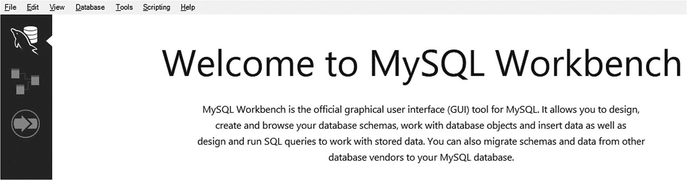

图 12-10

MySQL Workbench 的欢迎屏幕

让我们首先单击图表按钮，这是 shark 数据库图标下面的第二个项目，这将显示模型屏幕(图 [12-11](#Fig11) )。

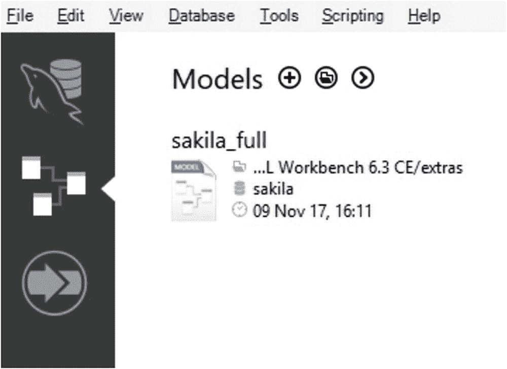

图 12-11

MySQL 工作台的设计模型屏幕

在我们安装的示例文件中，sakila_full 模型向我们展示了一个包含多个表的数据库的可视化表示。点击右边的型号名称查看详细信息。完整模型如图 [12-12](#Fig12) 所示。

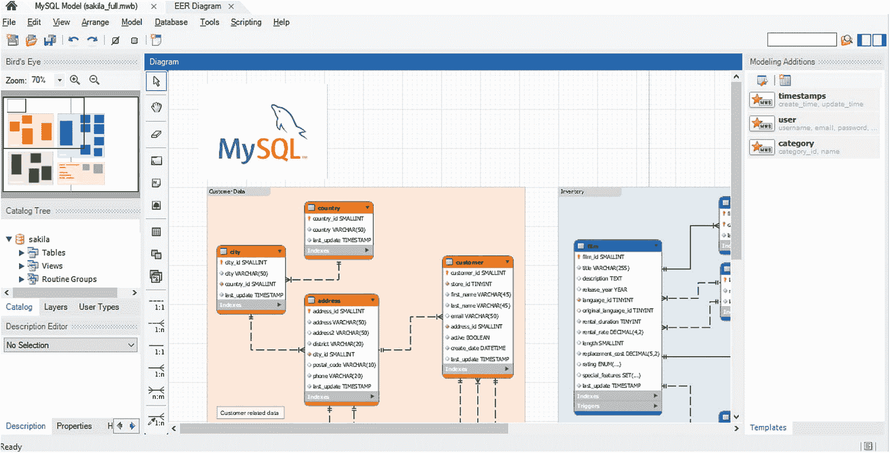

图 12-12

salika _ 完整设计模型

如果你读过第 9 章或上过数据库设计课，这个图应该很熟悉。这是一个实体关系图。这些图表用于创建标准形式的数据库和表格。所显示的表的格式和表之间的链接表明了关系(如一对多)、属性和实体。学习这些技术需要几个章节。不过你可以在网上找到很多有用的视频(包括一些使用 SQL Workbench 的)。

正如我们前面提到的，Workbench 的一个很棒的特性是能够让它生成 SQL 代码(并安装它),以便在设计好数据库后创建数据库。您还可以将数据库“反向工程”回设计模式。该功能位于数据库菜单下，如图 [12-13](#Fig13) 所示。

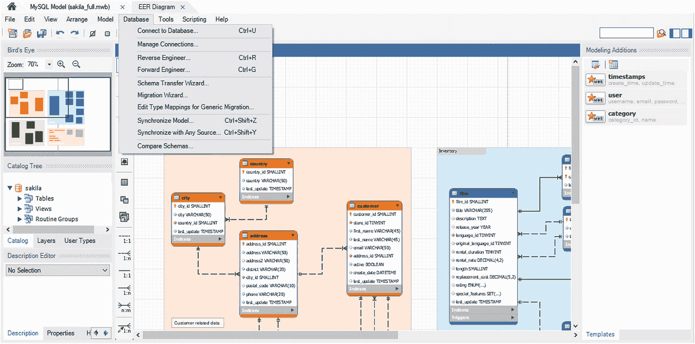

图 12-13

设计数据库

如果您单击屏幕顶部的 MySQL 模型选项卡，您将看到 sakila 数据库的现有模式(图 [12-14](#Fig14) )。

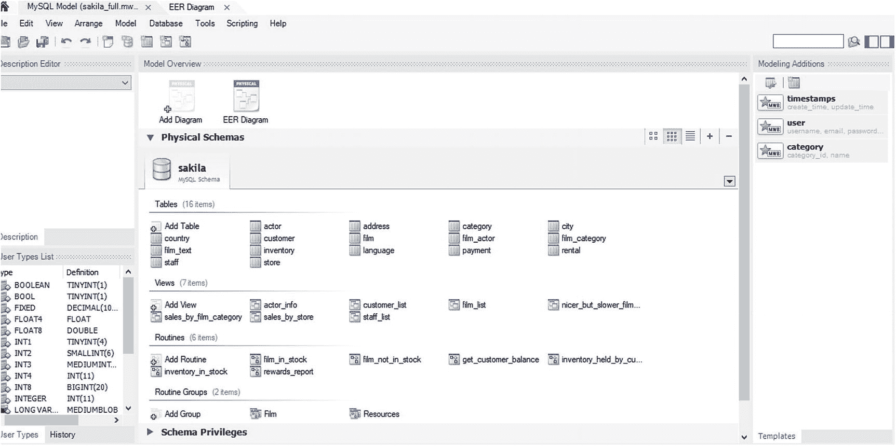

图 12-14

萨基拉数据库

在这里，我们可以用与 phpMyAdmin 类似的方式创建数据库和表。我们稍后将回到这个位置。点击屏幕顶部标签上的 *X* 图标，关闭数据视图。你现在应该回到欢迎页面(如图 [12-10](#Fig10) 所示)。找到包含 MySQL 版本和端口信息的盒子(在图 [12-10](#Fig10) 的左下角)。单击该框。将显示服务器仪表板(图 [12-15](#Fig15) )。

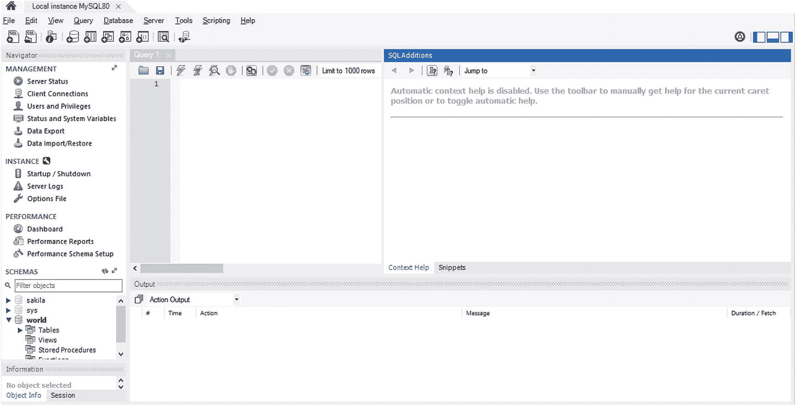

图 12-15

服务器仪表板

服务器仪表板不仅能够监控我们的数据库，还能够监控服务器本身。单击左侧菜单顶部的服务器状态选项。将显示服务器状态屏幕(图 [12-16](#Fig16) )。

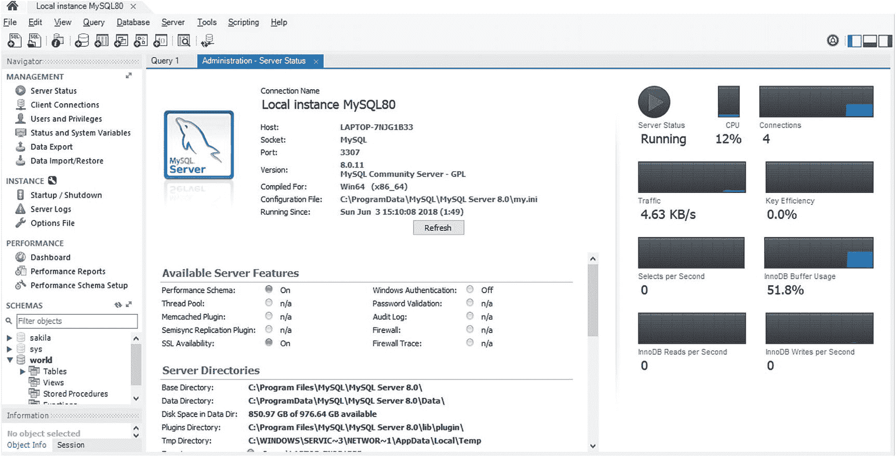

图 12-16

服务器状态屏幕

这个屏幕提供了很多关于我们服务器的重要信息。除了文件的位置，我们还可以看到安装和打开了哪些功能。我们可以刷新服务器。此外，在右侧，我们可以看到我们的服务器运行得有多好(高效)。单击左侧菜单中的客户端连接。将显示客户端状态屏幕(图 [12-17](#Fig17) )。

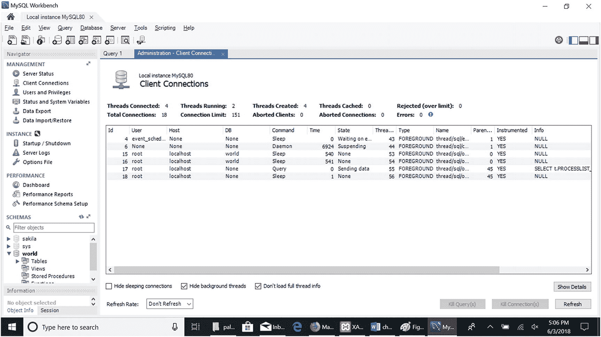

图 12-17

客户端状态屏幕

通过这个屏幕，我们可以监控谁在访问我们的服务器(和数据库)。单击左侧菜单中的用户和权限。用户和权限屏幕如图 [12-18](#Fig18) 所示。

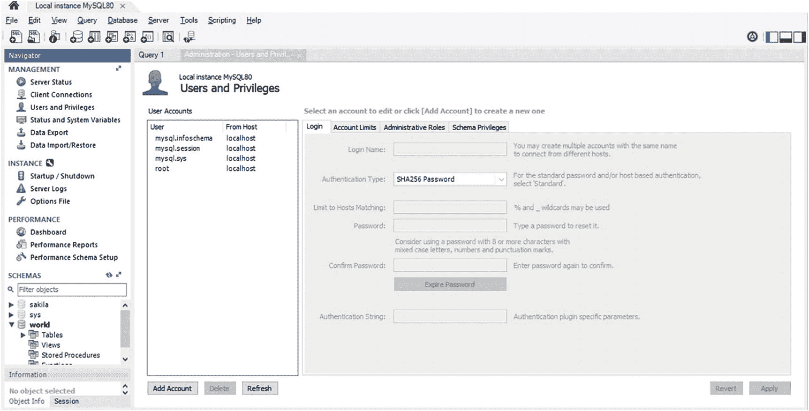

图 12-18

用户和权限屏幕

该屏幕提供了创建访问和维护数据库和服务器的附加用户 id 的能力。正如安装说明中提到的，我们可以将 IT 角色分配给用户 id。我们很快会回到这里。单击左侧菜单中的数据导出选项。数据导出界面如图 [12-19](#Fig19) 所示。

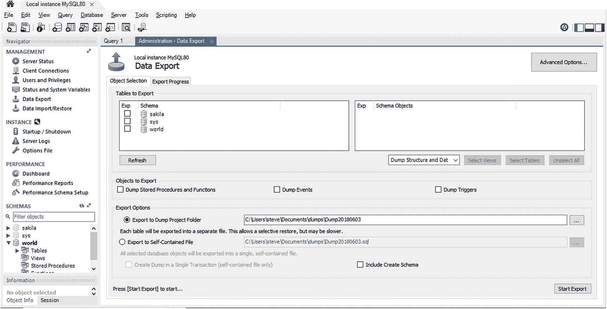

图 12-19

数据导出屏幕

这是我们可以选择要导出的数据、选择要导出的位置，甚至安排何时要导出数据的位置之一。单击左侧菜单中的数据导入项目。数据导入界面如图 [12-20](#Fig20) 所示。

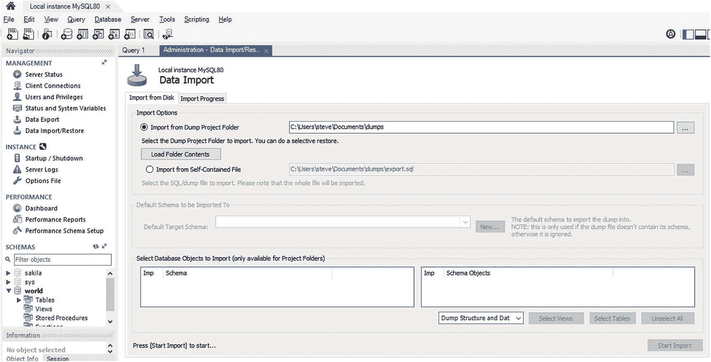

图 12-20

数据导入屏幕

这是我们很快将用来导入我们创建的一些数据库的屏幕。

也可以通过左侧菜单上的启动/关闭选项来启动和停止服务器。从服务器日志链接可以很容易地查看服务器日志。单击性能下的仪表板。性能仪表板如图 [12-21](#Fig21) 所示。

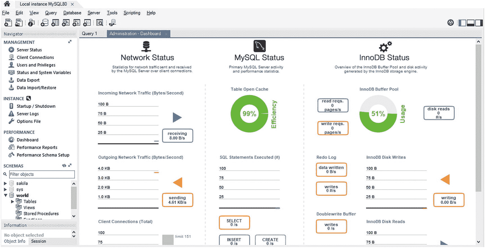

图 12-21

性能仪表板屏幕

MySQL 性能仪表板提供了服务器性能、MySQL 性能和 InnoDB 数据库引擎性能的完整快速视图。

您可能已经注意到，您还可以访问菜单左下角的数据库。现在我们已经快速浏览了 Workbench，我们如何使用 PHP 7 访问 MySQL 8 数据库呢？我们将在下一节中发现这一点。

## 将 PHP 7 连接到 MySQL 8 社区服务器

我们必须请求 PHP 与我们新版本的 MySQL 进行通信。您需要找到 *php.ini* 配置文件。在 XAMPP，你可以通过进入控制面板并点击 Apache 服务器右侧的 config 按钮来轻松找到该文件，如图 [12-22](#Fig22) 所示。

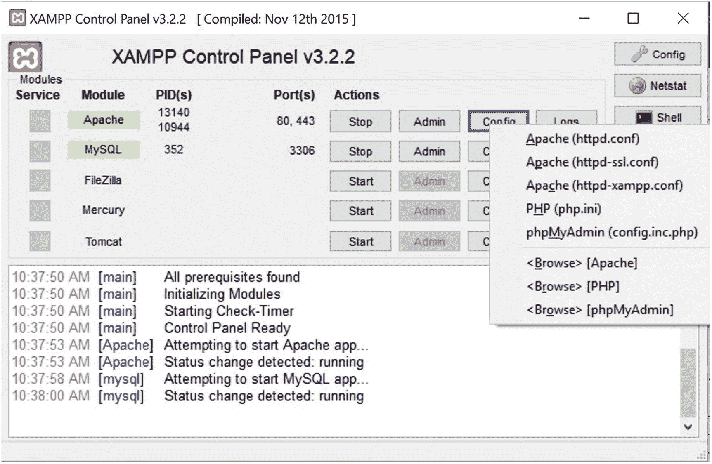

图 12-22

查找 php.ini 配置文件

点击 *php.ini* 菜单选项将其打开。对于 easyPHP，您必须深入开发服务器文件夹才能找到 *php.ini* 文件。它应该位于类似以下链接的位置:

```php
C:\Users\yourcomputername\EasyPHP-Devserver-17\EasyPHP-Devserver-17\eds-binaries\php\php713vc14x86x170718155219

```

当然，您的版本名称和内部版本号将与显示的不同。找到文件后，用记事本或其他文本编辑器打开它。

立即用另一个名称保存当前版本的配置文件(并记住保存的位置),以防出错并需要恢复到原始设置。现在，找到您的搜索工具(在记事本的编辑下)并搜索 3306 的所有位置(或您的默认端口号)。如果您不确定您的 MySQL 端口，您可以在 XAMPP 控制面板(图 [12-22](#Fig22) )或 EasyPHP 仪表板(在数据库服务器信息下)中看到它的显示。对于 *php.ini* 文件中端口(3306)的每个位置，用您的 MySQL 8 服务器端口号(3307)替换它。然后保存 *php.ini* 文件。

现在使用 XAMPP 控制面板或 easyPHP Dashboard 关闭 Apache，然后再打开。这将使 Apache 看到您的配置更改。

### 注意

更改 *php.ini* 配置文件后，XAMPP 和 easyPHP 将无法通信或打开或关闭 MySQL 8。此外，phpMyAdmin 可能无法与 MySQL 8 通信。理想情况下，这些工具的创建者将提供最终可以与 MySQL 8 通信的升级。我们可以在没有这些工具的情况下与 MySQL 8 建立通信，如下所述。

我们现在要确保 MySQL 8 已经启动并运行。一种快速的方法是在浏览器中测试端口。输入以下内容作为 URL: **Localhost:3307** 。

如果 MySQL 正在运行，您将会看到类似如下的消息:

```php
Jʿʿʿ
8.0.11ʿʿʿʿsI[R%9BʿÿÿÿʿÿÃʿʿʿʿʿʿʿʿʿʿ▌}x+^{ʿmysql_native_passwordʿ!ʿʿÿ„#08S01Got packets out of order

```

这大部分并没有告诉我们人类太多。但是，您可以看到 MySQL 8.0.11 在这个示例中已经启动并运行。您还会在端口 3306 上看到 MySQL 5.7 的类似消息。如果您看到类似的消息，您已经准备好测试 PHP 7 和 MySQL 8 之间的通信。如果您看不到这条消息，您可以进入 MySQL Workbench，按照前面的讨论打开 MySQL 8。

为了测试我们的连接，让我们创建一个简单的测试文件，如下所示:

```php
<?php
// Create a connection to the WORLD UNDER MYSQL 8 database
// Set the encoding to utf-8
// Set the database access details as constants
Define ('DB_USER', 'root'); // or whatever userid you created
Define ('DB_PASSWORD', 'yourserverpassword');
// or whatever password you created
Define ('DB_HOST', 'localhost');
Define ('DB_NAME', 'world');
// Make the connection:
$dbcon = new mysqli(DB_HOST, DB_USER, DB_PASSWORD, DB_NAME);
// Set the encoding...optional but recommended
mysqli_set_charset($dbcon, 'utf8');
$query = "SELECT * FROM city";
$result = mysqli_query ($dbcon, $query); // Run the query.
if ($result) { // If it ran OK, display the records.
// Table header.
echo '<table class="table table-striped">
<tr><th scope="col">Name</th></tr>';
// Fetch and print all the records:
while ($row = mysqli_fetch_array($result, MYSQLI_ASSOC)) {
echo '<tr><td>' . $row['Name'] . '</td></tr>'; }
              echo '</table>'; // Close the table so that it is ready for displaying.
              mysqli_free_result ($result); // Free up the resources.
} else { // If it did not run OK.
// Error message:
echo '<p class="text-center">Nothing retrieved.';
// Debug message:
echo '<p>' . mysqli_error($dbcon) . '<br><br>Query: ' . $q . '</p>';
exit;
} // End of if ($result)
mysqli_close($dbcon); // Close the database connection.
?>

```

在我们之前创建的测试文件中，我们连接到 world 数据库(作为 MySQL 8 下的一个示例)和 city 表来显示城市名称。将这段代码或类似的代码放入之前执行 PHP 文件的位置之一。然后在浏览器中键入 URL 位置。如果连接成功，您将会看到一个类似于图 [12-23](#Fig23) 所示输出的列表。


图 12-23

测试我们的通信

恭喜你！PHP 7 现在正在和 MySQL 8 通信。要在 MySQL 版本之间来回切换，只需更改前面所示的 *php.ini* 文件中的端口值。现在我们想看看如何将我们的数据库迁移到 MySQL 8。

## 迁移到 MySQL 8 社区服务器

好消息是，您的数据库从 MySQL 5.7 迁移到 MySQL 8.11 不会那么困难。我们之前展示的所有代码都可以在 MySQL 8 中使用。理想情况下，您已经使用 InnoDB 数据库引擎(MySQL 5.5 以后的默认配置)和 UTF-8 配置(也是 MySQL 5.5 以后的默认配置)开发了代码(如图所示)。如果您发现您的表或数据库没有使用这些缺省值，您可以修改从数据库中转储的 SQL 代码。

让我们一步一步地完成前一章中迁移数据库的过程。

1.  打开 phpMyAdmin。好吧，我们抓到你了。还记得我们将端口设置为 3307 吗？如果我们试图打开 phpMyAdmin，我们会得到错误消息。返回到 *php.ini* 中，将所有出现的 3307 重置为 3306，并重启 Apache 和 MySQL5/MariaDB。现在进入 phpMyAdmin。

2.  选择 simpleDB 数据库(或者书中的任何数据库示例)。

3.  单击顶部的导出选项卡。

4.  输入 **simpleDB** 作为模板名称(如果下拉框中不存在)，然后单击 Create。现在它应该显示在下拉框中。

5.  单击开始。

6.  代码将在默认的文本编辑器中打开。将文件另存为 *simpleDB.sql* 。查看文件的内容，确保它没有指示不同的数据库引擎(应该是 InnoDB 或根本没有列出)。如果列出了不同的代码，您可以从文件中删除相关的代码。然后它将作为 InnoDB 加载。

7.  打开电脑上 MySQL 文件夹下的 MySQL 8 Workbench。

8.  单击包含服务器级别和端口号的灰色框，打开服务器导航器。

9.  在左侧菜单中，单击导入/恢复菜单选项。将出现图 [12-24](#Fig24) 中的屏幕。

    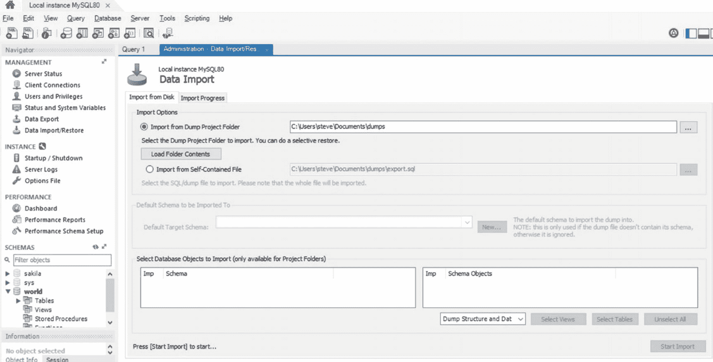

    图 12-24

    数据导入页面

10.  选择从自包含文件导入单选按钮。

11.  单击右边的三个点，选择并找到您刚刚创建的 SQL 文件。单击默认模式下拉框旁边的新建按钮。输入 **simpleDB** (或者您正在导入的数据库的名称)并单击 OK。现在从下拉框中选择模式。单击页面右下角的开始导入。SQL 代码现在将运行并导入您的数据库。

12.  您可能没有注意到页面左下角的新数据库。点击包含数据库模式的框上方的 Reload 按钮(两个圆形箭头)。现在应该出现了。

13.  让我们测试我们的数据库。转到顶部菜单并选择数据库。然后选择连接到数据库。在默认模式文本框中输入您的数据库名称( **simpleDB** )。单击确定。将出现图 [12-25](#Fig25) 中的画面。

    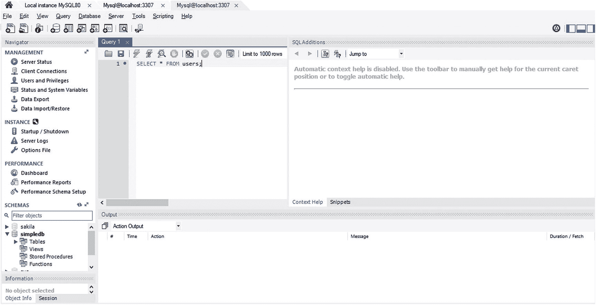

    图 12-25

    架构查询窗口

14.  在查询窗口中输入一个 SQL 命令，如图 [12-25](#Fig25) 所示。点按窗口顶部的任一闪电图标来运行脚本。如果一切正常，您应该会看到一个数据表出现。

现在我们的表已经存在了，让我们找点乐子，对它进行逆向工程。请遵循以下步骤:

1.  转到顶部菜单上的数据库选项。选择逆向工程。

2.  将出现一个参数屏幕。保留所有默认设置，然后单击下一步。

3.  下一个屏幕将验证连接。单击下一步。

4.  下一个屏幕将列出当前的数据库。列表中应该是您刚刚加载的数据库(simpledb)。选择它并单击下一步。

5.  下一个屏幕将测试模式(数据库)以查看它是否可以被工程化。单击下一步。

6.  您将看到一个验证屏幕，显示您正在使用的数据库。单击执行。

7.  将出现一个进度屏幕。单击下一步。

8.  最后，将显示一个屏幕，告诉您创建了什么。单击完成。您应该会看到类似于图 [12-26](#Fig26) 的显示。

    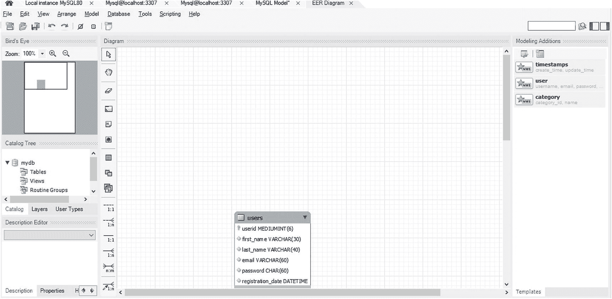

    图 12-26

    简单数据库关系图窗口

恭喜你，你刚刚逆向工程了你的数据库！现在，您可以进行设计更改，并设计它来生成更新的数据库。

您也可以以类似于 phpMyAdmin 的方式进行更改。通过关闭屏幕顶部的选项卡(点击 *X* )关闭 ER 图窗口。这将使你返回到模式查询窗口(图 [12-25](#Fig25) )。在左下方的模式(数据库)窗口中找到要调整的表。在表格名称的右侧，您会看到一个信息图标、一个扳手图标和一个表格图标。信息图标(单击时)提供关于表格的一般信息。表格图标将显示表格中的数据。扳手图标将允许我们更改表格的结构。单击扳手图标。将出现图 [12-27](#Fig27) 中的窗口。

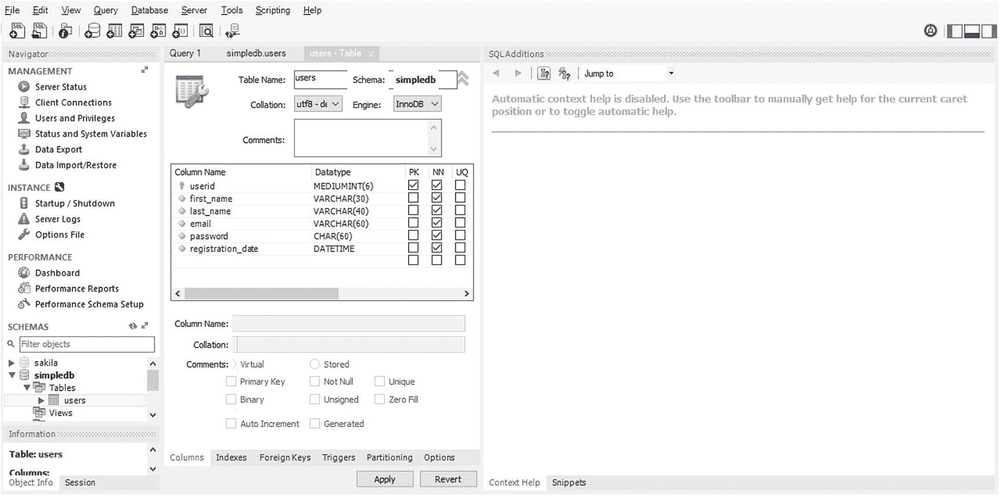

图 12-27

表格结构屏幕

您可能很难看到此屏幕的所有细节。转到“视图”菜单，单击“面板”，然后单击“隐藏输出区域”。这将为您提供如图 [12-27](#Fig27) 所示的视图。这个屏幕的使用类似于 phpMyAdmin 中同一个屏幕的使用。

现在让我们试着运行我们的 PHP 文件。

## 在 MySQL 8 社区服务器上使用我们的 PHP 文件

在开始使用我们在本书中创建的文件之前，我们需要设置用户 id 和密码来访问我们的模式(数据库)。在第 [2](02.html) 章中，我们用以下信息创建了用户 ID:

*   用户 id : horatio

*   *密码* : Hmsv1ct0ry

*   *数据库*(模式):simpledb

如前所述，在 MySQL Workbench 中，单击欢迎页面上的服务器信息框来访问服务器仪表板。单击左侧菜单中的用户和权限链接。将出现图 [12-28](#Fig28) 中的屏幕。

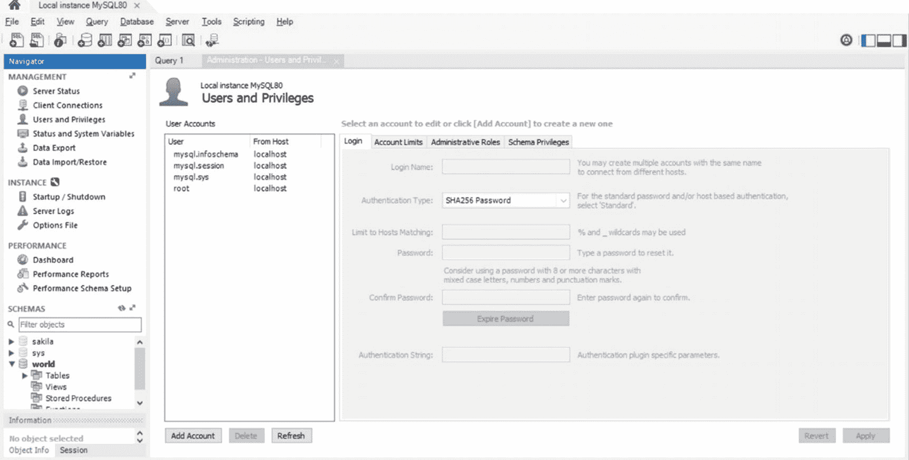

图 12-28

用户和权限屏幕

单击屏幕左下角的添加帐户按钮。将显示图 [12-29](#Fig29) 所示的屏幕。

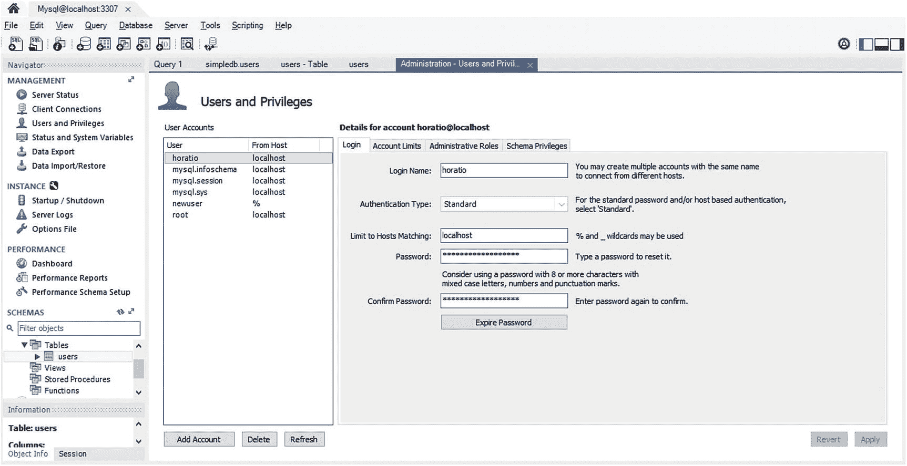

图 12-29

新用户帐户屏幕

这个屏幕类似于 phpMyAdmin 屏幕。输入用户的信息。请注意，身份验证类型应该设置为标准。PHP 7 需要这个设置。输入所需信息后，单击应用。

现在单击“管理角色”选项卡。将显示图 [12-30](#Fig30) 中的屏幕。

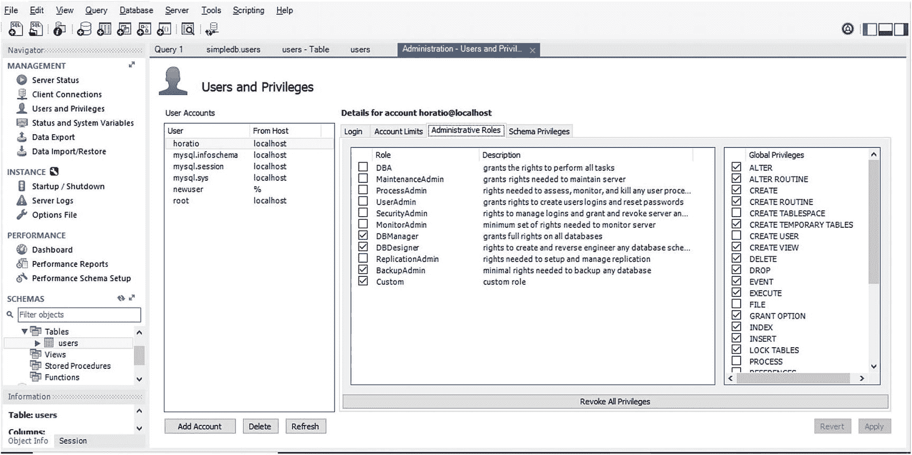

图 12-30

设置用户角色

您可以在此屏幕中决定您的用户 ID 可以执行的角色。可以多选一个。您也可以从右侧的选项中单独选择角色。您可以选择显示的设置或自己的设置。但是，您还需要在右侧窗口中选择 Execute。如果未选择执行，程序将无法使用该 ID。对选择满意后，单击应用。您还可以选择为每个用户 ID 设置帐户限制，以限制允许使用帐户限制选项卡进行的查询和更新次数。

我们现在准备好测试我们的程序了！确保您在 *php.ini* 文件中的端口设置被设置为 3307。还要确保 Apache 正在运行。我们现在将测试 simpledb 数据库的注册页程序。输入以下内容作为您的 URL:

```php
localhost/simpledb/register-page.php

```

应该会出现注册页面。输入一些信息，然后单击注册按钮。应该会显示“谢谢”页面。

### 注意

MySQL 8 中 SQL-MODE 的默认设置是严格的。这可能会导致您收到类似以下内容的错误:

`Incorrect integer value " for column 'userid' at row 1`

当试图将字符串放入数据库中的整数位置时，如下所示的 SQL INSERT 语句可能会导致此问题:

`$query = "INSERT INTO users ( userid, first_name, last_name, email, password, registration_date) ";`

`$query .="VALUES( ' ', ?, ?, ?, ?, NOW() )";`

此错误可通过以下两种方式消除:

1.  将查询更改为不插入自动递增列。它仍然会自动递增。

    `$query = "INSERT INTO users ( first_name, last_name, email, password, registration_date) ";`

    `$query .="VALUES( ?, ?, ?, ?, NOW() )";`

2.  找到 *my.ini* 文件。该文件保存在 c 盘下的*程序数据*文件夹中。该文件夹可能隐藏在您的视图中，因此您可能需要在 Windows 资源管理器窗口中单击“查看”,然后单击该框来查看隐藏的文件。该文件位于以下位置:

    `C:/Program Data/My SQL/MYSQL Server 8.0`

在文本编辑器中打开文件。搜索 *sql 模式*。设置如下所示:

`sql-mode="STRICT_TRANS_TABLES,NO_ENGINE_SUBSTITUTION"`

现在将设置更改为 sql-mode= " "。保存文件并在 Workbench 中重启 MySQL 8。您的注册现在应该可以工作了。

如果您有其他错误，您可以查看迁移文档，可以从 MySQL Workbench 的欢迎页面上左侧菜单的底部图标访问该文档。您也可以在搜索引擎(Google)中输入您的错误信息，寻求解决方案的建议。

您可以转到客户端连接屏幕(图 [12-17](#Fig17) )查看您创建的帐户的登录信息。

## 摘要

本章为您提供了使用 MySQL 8 的优势的快速解释。您还了解了如何安装服务器和迁移现有的数据库。此外，您还学习了如何创建可供程序或数据库管理员使用的用户 ID。您还了解了 MySQL Workbench 的特性。