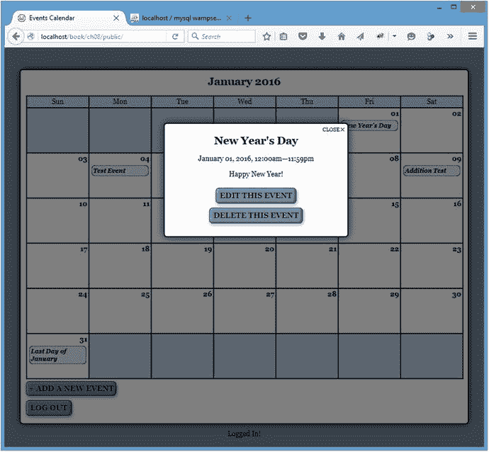
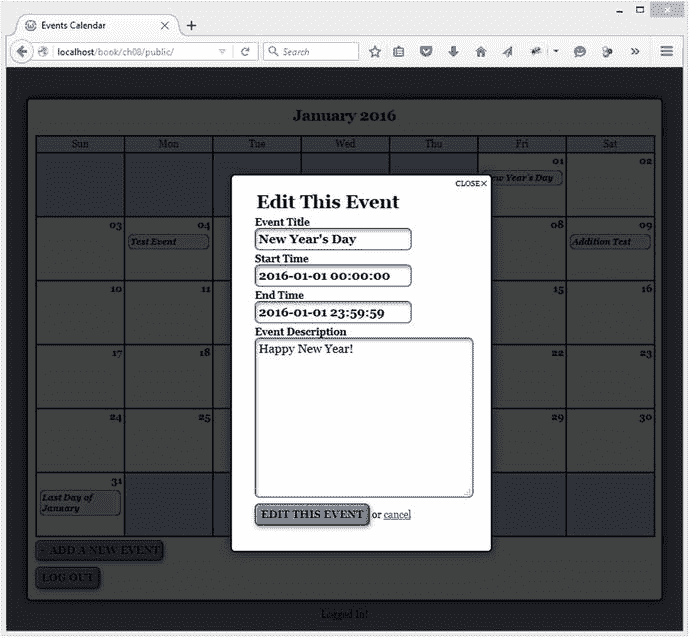
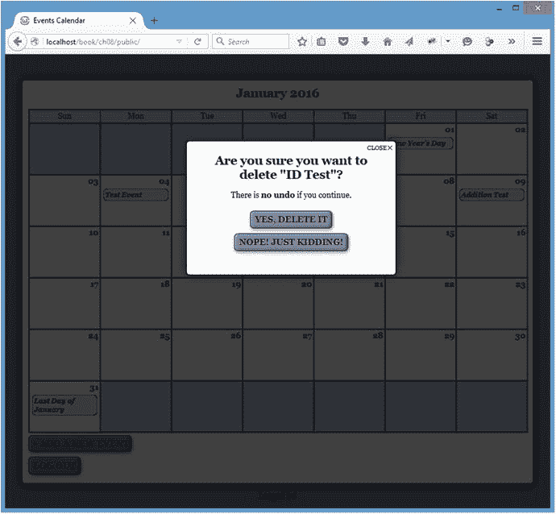
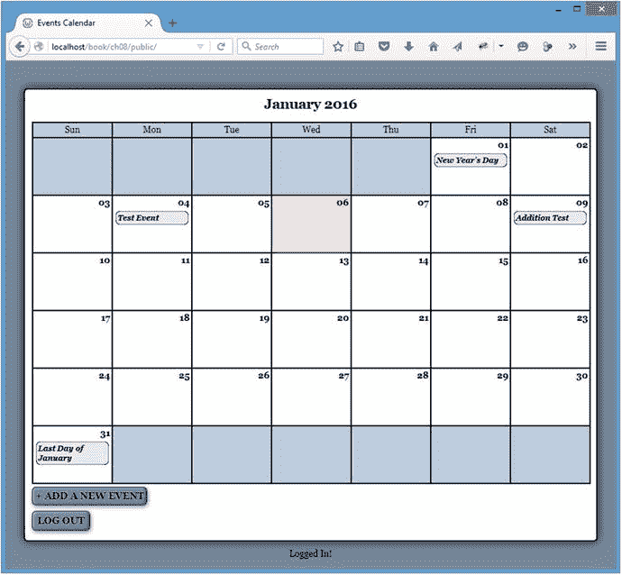

# 八、使用 AJAX 和 jQuery 编辑日历

Electronic supplementary material The online version of this chapter (doi:[10.​1007/​978-1-4842-1230-1_​8](http://dx.doi.org/10.1007/978-1-4842-1230-1_8)) contains supplementary material, which is available to authorized users.

现在您的应用可以显示事件数据而无需刷新页面，您可以看到 AJAX 在 web 应用中提供的额外便利。从历史上看，使用 web 应用的最大缺陷之一是，每个动作，无论多小，通常都需要等待页面刷新，同时保存设置。当用户需要在共享计算机上访问他的信息时，Web 应用很方便，但缓慢的工作流程通常足以让用户尽可能倾向于桌面应用。

然而，随着 AJAX 的主流接受和使用，用户现在可以快速地进行更改，而不必一直等待页面重新加载。这让网络应用感觉更像桌面应用，也让它们对用户更有吸引力。

在本章中，您将学习添加脚本，使管理员的编辑控件运行顺畅，而不需要为每个操作刷新页面。唯一需要页面刷新的操作是登录，因为这需要对会话进行更改。

Note

开始本章中的练习之前，请登录日历应用。默认登录依赖于用户名`testuser`和密码`admin`。

## 打开事件创建表单

首先，您将修改脚本，让管理员在不刷新页面的情况下添加新事件。打开`init.js`，选择按钮，按其类别添加新事件(`admin`)。添加一个 click 事件处理程序来阻止默认操作，并(目前)记录一条消息来确认它被正确触发:

`"use strict";`

`jQuery(function($){`

`var processFile = "assets/inc/ajax.inc.php",`

`fx = {`

`"initModal" : function() {...},`

`"boxin" : function(data, modal) {...},`

`"boxout" : function(event) {...}`

`}`

`// Pulls up events in a modal window`

`$("body").on("click", “li>a”, function(event){...});`

`// Displays the edit form as a modal window`

`$("body").on("click", ".admin", function(event){`

`// Prevents the form from submitting`

`event.preventDefault();`

`// Logs a message to prove the handler was triggered`

`console.log( "Add a New Event button clicked!" );`

`});`

`});`

Note

为了简洁起见，所有未更改的函数都被缩写，并且本章的代码示例中省略了注释。你可以在这本书的首页找到代码， [`http://www.apress.com/9781484212318`](http://www.apress.com/9781484212318) 。

保存此代码并刷新`http://localhost/`。单击“添加新事件”按钮，您将看到以下结果记录到控制台中:

`Add a New Event button clicked!`

### 添加 AJAX 调用来加载表单

接下来，创建一个变量来存储将被发送到处理文件的动作。您正在加载编辑和创建表单，因此将动作设置为`event_edit`。

现在可以调用`$.ajax()`函数了。该函数类似于将事件数据加载到模式窗口的脚本；事实上，唯一的区别在于提交的数据和处理返回值的方式。

在一次成功的加载中，您隐藏表单并在变量`form`中存储对它的引用。接下来，使用`fx.initModal()`检查模态窗口，并使用第一个参数为空的`fx.boxin()`淡入。最后，将表单添加到模式窗口，淡入，并为其分配类`edit-form`，以便以后选择。

将以下粗体代码添加到`init.js`以执行这些步骤:

`"use strict";`

`jQuery(function($){`

`var processFile = "assets/inc/ajax.inc.php",`

`fx = {`

`"initModal" : function() {...},`

`"boxin" : function(data, modal) {...},`

`"boxout" : function(event) {...}`

`}`

`// Pulls up events in a modal window`

`$("body").on("click", "li>a", function(event){...});`

`// Displays the edit form as a modal window`

`$("body").on("click", ".admin", function(event){`

`// Prevents the form from submitting`

`event.preventDefault();`

`// Loads the action for the processing file`

`var action = "edit_event";`

`// Loads the editing form and displays it`

`$.ajax({`

`type: "POST",`

`url: processFile,`

`data: "action="+action,`

`success: function(data){`

`// Hides the form`

`var form = $(data).hide(),`

`// Make sure the modal window exists`

`modal = fx.initModal();`

`// Call the boxin function to create`

`// the modal overlay and fade it in`

`fx.boxin(null, modal);`

`// Load the form into the window,`

`// Fades in the content, and adds`

`// a class to the form`

`form`

`.appendTo(modal)`

`.addClass("edit-form")`

`.fadeIn("slow");`

`},`

`error: function(msg){`

`alert(msg);`

`}`

`});`

`});`

`});`

但是您还没有准备好运行这段代码。

### 修改 AJAX 处理文件以加载表单

在前面的 AJAX 调用工作之前，您需要修改`ajax.inc.php`查找数组。添加一个新的数组元素，告诉脚本创建一个新的`Calendar`对象，然后用粗体显示的代码调用`displayForm()`方法:

`<?php`

`declare(strict_types=1);`

`/*`

`* Enable sessions if needed.`

`* Avoid pesky warning if session already active.`

`*/`

`$status = session_status();`

`if ($status == PHP_SESSION_NONE){`

`//There is no active session`

`session_start();`

`}`

`/*`

`* Include necessary files`

`*/`

`include_once '../../../sys/config/db-cred.inc.php';`

`/*`

`* Define constants for config info`

`*/`

`foreach ( $C as $name => $val )`

`{`

`define($name, $val);`

`}`

`/*`

`* Create a lookup array for form` `actions`

`*/`

`define(ACTIONS, array(`

`'event_view' => array(`

`'object' => 'Calendar',`

`'method' => 'displayEvent'`

`),`

`'edit_event' => array(`

`'object' => 'Calendar',`

`'method' => 'displayForm'`

`)`

`)`

`);`

`/*`

`* Make sure the anti-CSRF token was passed and that the`

`* requested action exists in the lookup array`

`*/`

`if ( isset(ACTIONS[$_POST['action']]) )`

`{`

`$use_array = ACTIONS[$_POST['action']];`

`$obj = new $use_array['object']($dbo);`

`$method = $use_array['method'];`

`/*`

`* Check for an ID and sanitize it if found`

`*/`

`if ( isset($_POST['event_id']) )`

`{`

`$id = (int) $_POST['event_id'];`

`}`

`else { $id = NULL; }`

`echo $obj->$method($id);`

`}`

`function __autoload($class_name)`

`{`

`$filename = '../../../sys/class/class.'`

`. strtolower($class_name) . '.inc.php';`

`if ( file_exists($filename) )`

`{`

`include_once $filename;`

`}`

`}`

`?>`

现在保存文件，加载`http://localhost/`，点击“添加新事件”按钮。一个新的模态窗口将淡入，编辑表单在里面(见图 [8-1](#Fig1) )。

图 8-1。

The event creation form loaded in a modal window

### 使取消按钮的行为像关闭按钮一样

您可能已经注意到，当显示窗体时，模式窗口不包含关闭按钮。但是，模式窗口包含一个取消按钮，单击该按钮将刷新页面。不需要在窗口中添加更多的按钮，只需要让 Cancel 按钮调用`fx.boxout()`方法来关闭窗口。

为了实现这一点，使用`.on()`将一个 click 事件处理程序绑定到带有`edit-form`类的表单中包含单词 cancel 的任何链接。

`"use strict";`

`jQuery(function($){`

`var processFile = "assets/inc/ajax.inc.php",`

`fx = {`

`"initModal" : function() {...},`

`"boxin" : function(data, modal) {...},`

`"boxout" : function(event) {...}`

`}`

`// Pulls up events in a modal window`

`$("body").on("click", "li>a", function(event){...});`

`// Displays the edit form as a modal window`

`$("body").on("click", ".admin", function(event){`

`// Make the cancel button on editing forms behave like the`

`// close button and fade out modal windows and overlays`

`$("body").on("click", ".edit-form a:contains(cancel)", function(event){`

`fx.boxout(event);`

`});`

`});`

保存文件，重新加载`http://localhost/`，点击“添加新事件”按钮。模式窗口加载后，点击表单中的`Cancel`链接。模式窗口和覆盖将淡出，就像单击关闭按钮时一样。

## 在数据库中保存新事件

要使表单正常工作，现在必须向表单上的提交按钮添加一个 click 事件处理程序。这个处理程序将阻止默认的表单提交，然后它将使用`.serialize()`从表单输入中创建一个查询字符串。然后，它将使用序列化数据通过`POST`向`ajax.inc.php`提交表单。

首先，向存在于带有`edit-form`类的表单中的`submit`类型的任何输入添加一个新的点击处理程序。使用`.on()`确保动态创建的输入仍然是处理程序的目标。您可以使用`event.preventDefault()`阻止默认动作。

通过将粗体代码插入`init.js`来完成:

`"use strict";`

`jQuery(function($){`

`var processFile = "assets/inc/ajax.inc.php",`

`fx = {`

`"initModal" : function() {...},`

`"boxin" : function(data, modal) {...},`

`"boxout" : function(event) {...}`

`}`

`// Pulls up events in a modal window`

`$("body").on("click", "li>a", function(event){...});`

`// Displays the edit form as a modal window`

`$("body").on("click", ".admin", function(event){`

`// Make the cancel button on editing forms behave like the`

`// close button and fade out modal windows and overlays`

`$("body").on("click", ".edit-form a:contains(cancel)", function(event){`

`fx.boxout(event);`

`});`

`// Edits events without reloading`

`$("body").on("click", ".edit-form input[type=submit]", function(event){`

`// Prevents the default form action from executing`

`event.preventDefault();`

`// Logs a message to indicate the script is working`

`console.log( "Form submission triggered!" );`

`});`

`});`

接下来，在浏览器中保存并重新加载日历。单击“添加新事件”按钮打开模式窗口，然后单击“创建新事件”按钮提交表单。这会将以下结果输出到控制台:

`Form submission triggered!`

### 序列化表单数据

要将事件数据发送到处理文件，您需要将数据转换为查询字符串。幸运的是，jQuery 有一个名为`.serialize()`的内置方法来做这件事。它将把表单输入转换成一串名称-值对，用一个&符号(`&`)隔开。

修改`init.js`通过选择点击输入的父表单来序列化表单数据，然后序列化其数据。接下来，暂时将输出记录到控制台:

`// Edits events without reloading`

`$("body").on("click", ".edit-form input[type=submit]", function(event){`

`// Prevents the default form action from executing`

`event.preventDefault();`

`// Serializes the form data for use with $.ajax()`

`var formData = $(this).parents("form").serialize();`

`// Logs a message to indicate the script is working`

`console.log( formData );`

`});`

保存前面的代码，并在浏览器中打开事件创建表单。现在输入以下测试数据:

*   事件标题:测试事件
*   活动开始时间:2016-01-04 08:00:00
*   活动结束时间:2016-01-04 10:00:00
*   事件描述:这是一个测试描述。

单击“创建新事件”按钮提交表单，并将以下内容输出到您的控制台(令牌值会有所不同):

`event_title=Test+Event&event_start=2016-01-04+08%3A00%3A00&event_end=2016` 

`-01-04+10%3A00%3A00&event_description=This+is+a+test+description.&event_id=&token=` 

`861e58daa0cfcf2c215f71d6f2bda1661e81c4c0&action=event_edit`

### 将序列化的表单数据提交到处理文件

既然表单数据已经序列化，您就可以使用`$.ajax()`将数据发送到处理文件。

使用`POST`方法将序列化数据提交给`ajax.inc.php`，然后淡出模态窗口，并在成功提交时使用`fx.boxout()`进行覆盖。此外，在 Firebug 控制台中记录一条确认消息，并将以下粗体代码附加到`init.js`:

`// Edits events without reloading`

`$("body").on("click", ".edit-form input[type=submit]", function(event){`

`// Prevents the default form action from executing`

`event.preventDefault();`

`// Serializes the form data for use with $.ajax()`

`var formData = $(this).parents("form").serialize();`

`// Sends the data to the processing file`

`$.ajax({`

`type: "POST",`

`url: processFile,`

`data: formData,`

`success: function(data) {`

`// Fades out the modal window`

`fx.boxout();`

`// Logs a message to the console`

`console.log( "Event saved!" );`

`},`

`error: function(msg) {`

`alert(msg);`

`}`

`});`

`});`

此时，脚本已经准备好保存新事件。但是您还没有准备好运行这段代码。首先，需要修改`ajax.inc.php`来接受这个数据。

### 修改 AJAX 处理文件以处理新的提交

让`ajax.inc.php`准备好接受来自事件编辑表单的提交就像向查找数组添加一个新元素一样简单:

`<?php`

`declare(strict_types=1);`

`/*`

`* Enable sessions if needed.`

`* Avoid pesky warning if session already active.`

`*/`

`$status = session_status();`

`if ($status == PHP_SESSION_NONE){`

`//There is no active session`

`session_start();`

`}`

`/*`

`* Include necessary files`

`*/`

`include_once '../../../sys/config/db-cred.inc.php';`

`/*`

`* Define constants for config info`

`*/`

`foreach ( $C as $name => $val )`

`{`

`define($name, $val);`

`}`

`/*`

`* Create a lookup array for form actions`

`*/`

`define(ACTIONS, array(`

`'event_view' => array(`

`'object' => 'Calendar',`

`'method' => 'displayEvent'`

`),`

`'edit_event' => array(`

`'object' => 'Calendar',`

`'method' => 'displayForm'`

`),`

`'event_edit' => array(`

`'object' => 'Calendar',`

`'method' => 'processForm'`

`)`

`)`

`);`

`/*`

`* Make sure the anti-CSRF token was passed and that the`

`* requested action exists in the lookup array`

`*/`

`if ( isset(ACTIONS[$_POST['action']]) )`

`{`

`$use_array = ACTIONS[$_POST['action']];`

`$obj = new $use_array['object']($dbo);`

`$method = $use_array['method'];`

`/*`

`* Check for an ID and sanitize it if found`

`*/`

`if ( isset($_POST['event_id']) )`

`{`

`$id = (int) $_POST['event_id'];`

`}`

`else { $id = NULL; }`

`echo $obj->$method($id);`

`}`

`function __autoload($class_name)`

`{`

`$filename = '../../../sys/class/class.'`

`. strtolower($class_name) . '.inc.php';`

`if ( file_exists($filename) )`

`{`

`include_once $filename;`

`}`

`}`

`?>`

保存该文件并重新加载`http://localhost/`。接下来，单击“添加新事件”按钮，在模式窗口中打开表单，然后输入一个包含以下信息的新事件:

*   事件标题:测试事件
*   活动开始时间:2016-01-04 08:00:00
*   活动结束时间:2016-01-04 10:00:00
*   事件描述:这是一个测试描述。

现在点击“创建新事件”按钮；模式窗口将淡出，并且控制台中将记录以下消息:

`Event saved!`

请注意，除非页面刷新，否则新事件不会出现在日历中。这可能会让用户感到困惑，因此在下一节中，您将修改应用，以便在成功保存后将新创建的事件添加到日历中。

## 添加事件而不刷新

将新事件添加到日历中相当复杂；保存事件后，您需要采取以下步骤。

Deserialize the form data.   Create date objects for both the currently displayed month and the new event.   Make sure the month and year match up for the new event.   Get the new event’s ID.   Determine on what day of the month the event falls.   Generate a new link with the proper event data and insert it into the corresponding calendar day.  

这个功能将被包含在一个新添加的名为`addevent`的`fx`对象中，它将接受从`ajax.inc.php` ( `data`)返回的数据，以及序列化的表单数据(`formData`)。

首先，通过插入以下粗体代码修改`init.js`中的`fx`对象文字:

`"use strict";`

`jQuery(function($){`

`var processFile = "assets/inc/ajax.inc.php",`

`fx = {`

`"initModal" : function() {...},`

`"boxin" : function(data, modal) {...},`

`"boxout" : function(event) {...` `},`

`// Adds a new event to the markup after saving`

`"addevent" : function(data, formData){`

`// Code to add the event goes here`

`}`

`};`

`$("body").on("click", "li>a", function(event){...});`

`$("body").on("click", ".admin", function(event){...});`

`$("body").on("click", ".edit-form a:contains(cancel)", function(event){...});`

`$("body").on("click", ".edit-form input[type=submit]", function(event){...});`

### 反序列化表单数据

添加新事件的第一步是反序列化表单数据。因为这个动作是独立的，所以您将通过在接受字符串(`str`)的名为`deserialize`的`fx`对象文本中创建一个附加函数来处理这个步骤:

`fx = {`

`"initModal" : function() {...},`

`"boxin" : function(data, modal) {...},`

`"boxout" : function(event) {...},`

`// Adds a new event to the markup after saving`

`"addevent" : function(data, formData){`

`// Code to add the event goes here`

`},`

`// Deserializes the query string and returns`

`// an event object`

`"deserialize" : function(str){`

`// Deserialize data here`

`}`

`};`

正如您在本书前面所学的，序列化的字符串是一系列由等号(`=`)连接并由&符号(`&`)分隔的名称-值对。两个序列化名称-值对的示例可能如下所示:

`name1=value1&name2=value2`

要反序列化这些值，首先使用本地 JavaScript 函数`.split()`在每个&符号处拆分字符串。此函数将字符串分解为一个名称-值对数组:

`Array`

`(`

`0 => "name1=value1",`

`1 => "name2=value2"`

`)`

接下来，您需要遍历名称-值对数组。在这个循环中，在等号处分割数组，并将数组存储在一个名为`pairs`的变量中。这意味着每个名称-值对被分成一个数组，第一个索引包含名称，第二个索引包含值。该数组遵循以下格式:

`Array`

`(`

`0 => "name1",`

`1 => "value1"`

`)`

将这些值分别存储在名为`key`和`val`的变量中，然后作为属性存储在名为`entry`的新对象中。

当循环完成时，返回反序列化的`data`对象。

接下来，在`fx.deserialize`中添加以下粗体代码:

`fx = {`

`"initModal" : function() {...},`

`"boxin" : function(data, modal) {...},`

`"boxout" : function(event) {...},`

`// Adds a new event to the markup after saving`

`"addevent" : function(data, formData){`

`// Code to add the event goes here`

`},`

`// Deserializes the query string and returns`

`// an event object`

`"deserialize" : function(str){`

`// Breaks apart each name-value pair`

`var data = str.split("``&`T2】

`// Declares variables for use in the loop`

`pairs=[], entry={}, key, val;`

`// Loops through each name-value pair`

`for (var x in data )`

`{`

`// Splits each pair into an array`

`pairs = data[x].split("=");`

`// The first element is the name`

`key = pairs[0];`

`// Second element is the value`

`val = pairs[1];`

`// Stores each value as an object property`

`entry[key] = val;`

`}`

`return entry;`

`}`

`};`

#### 解码表单值中任何 URL 编码的字符

在`fx.deserialize`正式投入使用之前，您必须首先修改它来解码任何 URL 编码的实体。当数据被序列化时，字符串值被编码，以便它们可以在查询字符串中传递。这意味着字符串“我正在测试&日志记录！”序列化时将转换为以下内容:

`I’m+testing+%26+logging!`

要扭转这种情况，使用正则表达式`/\+/g`将所有加号(`+`)替换为空格；该表达式只匹配加号。表达式结束分隔符后面的`g`使正则表达式进行全局搜索，因此不止一个匹配将被替换。

接下来，您需要使用本机的独立 JavaScript 函数`decodeURIComponent()`。在`fx`中创建一个名为`urldecode`的新函数，并插入以下代码:

`fx = {`

`"initModal" : function() {...},`

`"boxin" : function(data, modal) {...},`

`"boxout" : function(event) {...},`

`// Adds a new event to the markup after saving`

`"addevent" : function(data, formData){`

`// Code to add the event goes here`

`},`

`// Deserializes the query string and returns`

`// an event object`

`"deserialize" : function(str){`

`// Breaks apart each name-value` `pair`

`var data = str.split("&"),`

`// Declares variables for use in the loop`

`pairs=[], entry={}, key, val;`

`// Loops through each name-value pair`

`for ( x in data )`

`{`

`// Splits each pair into an array`

`pairs = data[x].split("=");`

`// The first element is the name`

`key = pairs[0];`

`// Second element is the value`

`val = pairs[1];`

`// Stores each value as an object property`

`entry[key] = val;`

`}`

`return entry;`

`},`

`// Decodes a query string value`

`"urldecode" : function(str) {`

`// Converts plus signs to spaces`

`var converted = str.replace(/\+/g, ' ');`

`// Converts any encoded entities back`

`return decodeURIComponent(converted);`

`}`

`};`

接下来，通过添加以下粗体代码来实现`fx.deserialize`中的`fx.urldecode`:

`fx = {`

`"initModal" : function() {...},`

`"boxin" : function(data, modal) {...},`

`"boxout" : function(event) {...},`

`// Adds a new event to the markup after` `saving`

`"addevent" : function(data, formData){`

`// Code to add the event goes here`

`},`

`// Deserializes the query string and returns`

`// an event object`

`"deserialize" : function(str){`

`// Breaks apart each name-value pair`

`var data = str.split("&"),`

`// Declares variables for use in the loop`

`pairs=[], entry={}, key, val;`

`// Loops through each name-value pair`

`for ( x in data )`

`{`

`// Splits each pair into an array`

`pairs = data[x].split("=");`

`// The first element is the name`

`key = pairs[0];`

`// Second element is the value`

`val = pairs[1];`

`// Reverses the URL encoding and stores`

`// each value as an object property`

`entry[key] = fx.urldecode(val);`

`}`

`return entry;`

`},`

`"urldecode" : function(str) {...}`

`};`

#### 将这一切结合在一起

有了`fx.deserialize`和`fx.urldecode`之后，您现在可以通过添加一个变量(`entry`)来存储反序列化的事件数据，从而修改`fx.addevent`:

`fx = {`

`"initModal" : function() {...},`

`"boxin" : function(data, modal) {...},`

`"boxout" : function(event) {...},`

`// Adds a new event to the markup after saving`

`"addevent" : function(data, formData){`

`// Converts the query string to an object`

`var entry = fx.deserialize(formData);`

`},`

`"deserialize" : function(str){...},`

`"urldecode" : function(str) {...}`

`};`

### 创建日期对象

因为只有为正在显示的月份创建的事件才应该添加到日历中，所以您需要确定正在显示的月份和年份，以及事件发生的月份和年份。

Note

对于这一步，您将利用 JavaScript 的内置`Date`对象，它提供了简化许多日期相关操作的方法。关于与`Date`对象相关的所有可用方法的完整解释，请访问 [`http://w3schools.com/jsref/jsref_obj_date.asp`](http://w3schools.com/jsref/jsref_obj_date.asp) 。

#### 使用 ID 修改日历类

要为当前显示的月份生成一个`Date`对象，您需要向在日历上方显示月份的`h2`元素添加一个 ID。为了确保跨浏览器的兼容性，用下面的粗体代码修改`Calendar`类中的`buildCalendar()`方法:

`public function buildCalendar()`

`{`

`/*`

`* Determine the calendar month and create an array of`

`* weekday abbreviations to label the calendar columns`

`*/`

`$cal_month = date('F Y', strtotime($this->_useDate));`

`$cal_id = date('Y-m', strtotime($this->_useDate));`

`define('WEEKDAYS', array('Sun', 'Mon', 'Tue',`

`'Wed', 'Thu', 'Fri', 'Sat'));`

`/*`

`* Add a header to the calendar markup`

`*/`

`$html = "\n\t<h2 id=\"month-$cal_id\">$cal_month</h2>";`

`for ( $d=0, $labels=NULL; $d<7; ++$d )`

`{`

`$labels .= "\n\t\t<li>" . WEEKDAYS[$d] . "</li>";`

`}`

`$html .= "\n\t<ul class=\"weekdays\">"`

`. $labels . "\n\t</ul>";`

`// For brevity, the remainder of this method has been omitted`

`}`

Note

对 ID 使用“month-”前缀意味着您符合 W3 标准，该标准规定元素 ID 必须以字母开头。

#### 用 JavaScript 构建日期对象

为了确保新事件在当前月份内，创建两个空的`Date`对象:一个用于当前月份，一个用于新事件。

要设置当前月份的`Date`对象的值，使用`.attr()`方法从`H2`元素中检索 ID 属性，在连字符处将其拆分，并将其存储在`cdata`变量中。

对于新事件，在空格处拆分`entry.event_start`的值，并获取第一个数组元素(以`YYYY-MM-DD`的格式表示的日期)并将其存储在一个名为`date`的变量中。接下来，在连字符处分割信息，并将数组存储在一个名为`edata`的变量中。

要设置`Date`对象，使用来自`cdata`和`edata`的数据分别设置`cal`和`event`中的日期。

最后，用下面的粗体代码修改`fx.addevent`:

`fx = {`

`"initModal" : function() {...},`

`"boxin" : function(data, modal) {...},`

`"boxout" : function(event) {...},`

`// Adds a new event to the markup after saving`

`"addevent" : function(data, formData){`

`// Converts the query string to an object`

`var entry = fx.deserialize(formData` `),`

`// Makes a date object for current month`

`cal = new Date(NaN),`

`// Makes a date object for the new event`

`event = new Date(NaN),`

`// Extracts the calendar month from the H2 ID`

`cdata = $("h2").attr("id").split('-'),`

`// Extracts the event day, month, and year`

`date = entry.event_start.split(' ')[0],`

`// Splits the event data into pieces`

`edata = date.split('-');`

`// Sets the date for the calendar date object`

`cal.setFullYear(cdata[1], cdata[2], 1);`

`// Sets the date for the event date object`

`event.setFullYear(edata[0], edata[1], edata[2]);`

`},`

`"deserialize" : function(str){...},`

`"urldecode" : function(str) {...}`

`};`

#### 修复时区不一致

您没有向`Date`对象传递时间或时区，因此该对象将默认为格林威治标准时间午夜(`00:00:00 GMT`)。这可能会导致您的日期对于不同时区的用户表现出意外。为了解决这个问题，您需要使用两个内置的`Date`对象方法:`.setMinutes()`和`.getTimezoneOffset()`来根据时区偏移量调整日期。

`.` `getTimezoneOffset()`的返回值是 GMT 和用户所在时区的分钟数之差。例如，`.getTimezoneOffset()`在山地标准时间(`-0700`)的返回值是 420。

使用`.setMinutes()`，您可以将时区偏移量的值添加到`Date`对象中，这将把日期返回到给定日期的午夜，而不管用户处于哪个时区。

您可以使用以下粗体代码进行调整:

`fx = {`

`"initModal" : function() {...},`

`"boxin" : function(data, modal) {...},`

`"boxout" : function(event) {...},`

`// Adds a new event to the markup after saving`

`"addevent" : function(data, formData){`

`// Converts the query string to an object`

`var entry = fx.deserialize(formData),`

`// Makes a date object for current month`

`cal = new Date(NaN),`

`// Makes a date object for the new event`

`event = new Date(NaN),`

`// Extracts the event day, month, and year`

`date = entry.event_start.split(' ')[0],`

`// Splits the event data into pieces`

`edata = date.split('-'),`

`// Extracts the calendar month from the H2 ID`

`cdata = $("h2").attr("id").split('-');`

`// Sets the date for the calendar date object`

`cal.setFullYear(cdata[1], cdata[2], 1);`

`// Sets the date for the event date object`

`event.setFullYear(edata[0], edata[1], edata[2]);`

`// Since the date object is created using`

`// GMT, then adjusted for the local time zone,`

`// adjust the offset to ensure a proper date`

`event.setMinutes(event.getTimezoneOffset());`

`},`

`"deserialize" : function(str){...},`

`"urldecode" : function(str) {...}`

`};`

#### 确保事件发生在当月

下一步是设置一个条件语句，确保只追加属于日历的事件。如果当前日历月和事件日期之间的年份和月份都匹配，您可以使用`Date`对象的`.` `getDay()`方法提取该月的日期。为了正确处理下一步，即向一位数日期添加前导零，您还需要将该值转换为字符串，这是通过将该值传递给`String()`来完成的。

一个月中的某一天需要有一个前导零来正确匹配日历。例如，如果返回的日期只有一位数字，您可以在日期前添加一个前导零。为此，请插入以下粗体代码:

`fx = {`

`"initModal" : function() {...},`

`"boxin" : function(data, modal) {...},`

`"boxout" : function(event) {...},`

`// Adds a new event to the markup after saving`

`"addevent" : function(data, formData){`

`// Converts the query string to an object`

`var entry = fx.deserialize(formData),`

`// Makes a date object for current month`

`cal = new Date(NaN),`

`// Makes a date object for the new event`

`event = new Date(NaN),`

`// Extracts the event day, month, and year`

`date = entry.event_start.split(' ')[0],`

`// Splits the event data into pieces`

`edata = date.split('-'),`

`// Extracts the calendar month from the H2` `ID`

`cdata = $("h2").attr("id").split('-');`

`// Sets the date for the calendar date object`

`cal.setFullYear(cdata[1], cdata[2], 1);`

`// Sets the date for the event date object`

`event.setFullYear(edata[0], edata[1], edata[2]);`

`// Since the date object is created using`

`// GMT, then adjusted for the local timezone,`

`// adjust the offset to ensure a proper date`

`event.setMinutes(event.getTimezoneOffset());`

`// If the year and month match, start the process`

`// of adding the new event to the calendar`

`if ( cal.getFullYear()==event.getFullYear()`

`&&` `cal.getMonth()==event.getMonth() )`

`{`

`// Gets the day of the month for event`

`var day = String(event.getDate());`

`// Adds a leading zero to 1-digit days`

`day = day.length==1 ? "0"+day : day;`

`}`

`},`

`"deserialize" : function(str){...},`

`"urldecode" : function(str) {...}`

`};`

### 将事件附加到日历

您终于可以将新事件添加到日历中了。为此，创建一个新的锚元素，隐藏它，设置它的`href`属性，并使用事件的标题作为链接文本。

接下来，使用`.delay(1000)`设置一秒钟的延迟，并淡入新事件。

您可以通过添加以下粗体显示的代码来实现这一点:

`fx = {`

`"initModal" : function() {...},`

`"boxin" : function(data, modal) {...},`

`"boxout" : function(event) {...},`

`// Adds a new event to the markup after saving`

`"addevent" : function(data, formData){`

`// Converts the query string to an object`

`var entry = fx.deserialize(formData),`

`// Makes a date object for current month`

`cal = new Date(NaN),`

`// Makes a date object for the new event`

`event = new Date(NaN),`

`// Extracts the event day, month, and year`

`date = entry.event_start.split(' ')[0],`

`// Splits the event data into pieces`

`edata = date.split('-'),`

`// Extracts the calendar month from the H2` `ID`

`cdata = $("h2").attr("id").split('-');`

`// Sets the date for the calendar date object`

`cal.setFullYear(cdata[1], cdata[2], 1);`

`// Sets the date for the event date object`

`event.setFullYear(edata[0], edata[1], edata[2]);`

`// Since the date object is created using`

`// GMT, then adjusted for the local timezone,`

`// adjust the offset to ensure a proper date`

`event.setMinutes(event.getTimezoneOffset());`

`// If the year and month match, start the process`

`// of adding the new event to the calendar`

`if ( cal.getFullYear()==event.getFullYear()`

`&& cal.getMonth()==event.getMonth() )`

`{`

`// Gets the day of the month for event`

`var day = String(event.getDate());`

`// Adds a leading zero to 1-digit days`

`day = day.length==1 ? "0"+day : day;`

`// Adds the new date link`

`$("<a>")`

`.hide()`

`.attr("href", "view.php?event_id="+data)`

`.text(entry.event_title)`

`.insertAfter($("strong:contains("+day+")"))`

`.delay(1000)`

`.fadeIn("slow");`

`}`

`},`

`"deserialize" : function(str){...},`

`"urldecode" : function(str) {...}`

`}`

Note

到目前为止,`data`变量还没有定义。您将在下一节中解决这个问题。

现在，回到 Submit 按钮的 click 事件处理程序，使用下面的粗体代码修改`$.ajax()`函数的成功回调以执行`fx.addevent()`:

`// Edits events without reloading`

`$("body").on("click", ".edit-form input[type=submit]", function (event){`

`// Prevents the default form action from executing`

`event.preventDefault();`

`// Serializes the form data for use with $.ajax()`

`var formData = $(this).parents("form").serialize();`

`// Sends the data to the processing file`

`$.ajax({`

`type: "POST",`

`url: processFile,`

`data: formData,`

`success: function(data) {`

`// Fades out the modal window`

`fx.boxout();`

`// Adds the event to the calendar`

`fx.addevent(data, formData);`

`},`

`error: function(msg) {`

`alert(msg);`

`}`

`});`

`});`

保存该文件并重新加载`http://localhost/`。调出事件创建表单，用以下信息创建一个新事件:

*   事件标题:加法测试
*   活动开始时间:2016-01-09 12:00:00
*   活动结束时间:2016-01-09 14:00:00
*   事件描述:这是一个向日历动态添加新事件的测试。

提交表单会导致模式窗口淡出；一秒钟后，新的事件标题将淡入日历的适当位置(见图 [8-2](#Fig2) )。

图 8-2。

The calendar after the new event is created

### 获取新事件的正确 ID

目前，新事件在创建后不刷新页面是不可见的。要看到这一点，请立即尝试单击您刚刚添加的新创建的“添加测试”链接。如果你从第四章开始就一直关注事态的发展，你会得到如图 [8-3](#Fig3) 所示的相当令人惊讶的结果。(如果您没有遵循，您可能会得到不同的结果，例如一个空的对话框，甚至是一个致命的错误！)

图 8-3。

Something has gone terribly wrong!

你很可能会问，这里究竟出了什么问题。没必要惊慌。如果您打开文件`/sys/class/class.calendar.inc.php`并检查`processForm()`方法，您会注意到在成功完成后，它返回`TRUE`。然后`TRUE`被解释为事件 ID，被强制转换为整数 1，于是元旦被取出。(如果您一直关注事态的发展，这个事件的 ID 将等于 1。)

#### 修改事件创建方法以返回新的事件 id

为了解决这个新的事件 ID 问题，您只需要在`processForm()`方法中做一个小的调整。在这个方法中，修改`return`命令，使用 PDO 的`lastInsertId()`方法输出最后插入的行的 ID:

`public function processForm()`

`{`

`/*`

`* Exit if the action isn’t set properly`

`*/`

`if ( $_POST['action']!='event_edit' )`

`{`

`return "The method processForm was accessed incorrectly";`

`}`

`/*`

`* Escape data from the form`

`*/`

`$title = htmlentities($_POST['event_title'], ENT_QUOTES);`

`$desc = htmlentities($_POST['event_description'], ENT_QUOTES);`

`$start = htmlentities($_POST['event_start'], ENT_QUOTES);`

`$end = htmlentities($_POST['event_end'], ENT_QUOTES);`

`/*`

`* If no event ID passed, create a new event`

`*/`

`if ( empty($_POST['event_id']) )`

`{`

`$sql = "INSERT INTO `events``

`(`event_title`, `event_desc`, `event_start`,`

``event_end`)`

`VALUES`

`(:title, :description, :start, :end)";`

`}`

`/*`

`* Update the event if it’s being edited`

`*/`

`else`

`{`

`/*`

`* Cast the event ID as an integer for security`

`*/`

`$id = (int) $_POST['event_id'];`

`$sql = "UPDATE `events``

`SET`

``event_title`=:title,`

``event_desc`=:description,`

``event_start`=:start,`

``event_end`=:end`

`WHERE `event_id`=$id";`

`}`

`/*`

`* Execute the create or edit query after binding the data`

`*/`

`try`

`{`

`$stmt = $this->db->prepare($sql);`

`$stmt->bindParam(":title", $title, PDO::PARAM_STR);`

`$stmt->bindParam(":description", $desc, PDO::PARAM_STR);`

`$stmt->bindParam(":start", $start, PDO::PARAM_STR);`

`$stmt->bindParam(":end", $end, PDO::PARAM_STR);`

`$stmt->execute();`

`$stmt->closeCursor();`

`/*`

`* Returns the ID of the event`

`*/`

`return $this->db->lastInsertId();`

`}`

`catch ( Exception $e )`

`{`

`return $e->getMessage();`

`}`

`}`

完成上述更改后，保存该文件并在浏览器中重新加载`http://localhost/`。接下来，使用以下信息创建一个新事件:

*   事件标题:ID 测试
*   活动开始时间:2016-01-06 12:00:00
*   活动结束时间:2016-01-06 16:00:00
*   事件描述:此事件在创建后应该可以立即查看。

现在保存活动，标题将出现在日历上。点击标题，事件将加载到一个模态窗口中(见图 [8-4](#Fig4) )。

图 8-4。

An event loaded immediately after creation

## 在模式窗口中编辑事件

在目前的状态下，你的应用离允许用户从模态窗口编辑事件只有一步之遥。现有的用于加载事件创建表单的 click 事件处理程序也可以用于事件编辑，只需稍加修改。

首先，展开选择器以包含任何具有 admin 类的元素；您可以通过包含以下粗体代码来实现这一点:

`// Displays the edit form as a modal window`

`$("body").on("click", ".admin-options form,.admin", function(event){`

`// Prevents the form from submitting`

`event.preventDefault();`

`// Loads the action for the processing file`

`var action = "edit_event";`

`// Loads the editing form and displays it`

`$.ajax({`

`type: "POST",`

`url: processFile,`

`data: "action="+action,`

`success: function(data){`

`// Hides the form`

`var form = $(data).hide(),`

`// Make sure the modal window exists`

`modal = fx.initModal();`

`// Call the boxin function to create`

`// the modal overlay and fade it in`

`fx.boxin(null, modal);`

`// Load the form into the window,`

`// fades in the content, and adds`

`// a class to the form`

`form`

`.appendTo(modal)`

`.addClass("edit-form")`

`.fadeIn("slow");`

`},`

`error: function(msg){`

`alert(msg);`

`}`

`});`

`});`

### 确定表单操作

在为单个事件显示的编辑控件中，按钮名称描述了该按钮采取的操作(例如，`edit_event`表示“编辑该事件”按钮，`delete_event`表示“删除该事件”按钮)。这些按钮将被`ajax.inc.php`用作提交的动作。

因为事件创建按钮没有按钮名，所以需要保留一个默认值(`edit_event`)。

要访问被点击按钮的名称，可以使用名为`target`的`event`对象的属性。此属性包含对触发事件的元素的引用。使用 jQuery 选择事件目标，并使用`.attr()`检索其名称。

现在，使用以下粗体代码修改事件处理程序:

`// Displays the edit form as a modal window`

`$("body").on("click", ".admin-options form,.admin", function(event){`

`// Prevents the form from submitting`

`event.preventDefault();`

`// Sets the action for the form submission`

`var action = $(event.target).attr("name") || "edit_event";`

`// Loads the editing form and displays it`

`$.ajax({`

`type: "POST",`

`url: processFile,`

`data: "action="+action,`

`success: function(data){`

`// Hides the form`

`var form = $(data).hide(),`

`// Make sure the modal window exists`

`modal = fx.initModal();`

`// Call the boxin function to create`

`// the modal overlay and fade it in`

`fx.boxin(null, modal);`

`// Load the form into the window,`

`// fades in the content, and adds`

`// a class to the form`

`form`

`.appendTo(modal)`

`.addClass("edit-form")`

`.fadeIn("slow");`

`},`

`error: function(msg){`

`alert(msg);`

`}`

`});`

`});`

### 存储事件 ID(如果存在)

接下来，需要提取事件 ID，假设它是可用的。要查找这个值，再次使用`event.target`属性，但是这次查找名为`event_id`的兄弟元素，然后将这个值存储在名为`id`的变量中。使用下面的粗体代码将它添加到事件处理程序中:

`// Displays the edit form as a modal window`

`$("body").on("click", ".admin-options form,.admin", function(event){`

`// Prevents the form from submitting`

`event.preventDefault();`

`// Sets the action for the form submission`

`var action = $(event.target).attr("name") || "edit_event"` `,`

`// Saves the value of the event_id input`

`id = $(event.target)`

`.siblings("input[name=event_id]")`

`.val();`

`// Loads the editing form and displays it`

`$.ajax({`

`type: "POST",`

`url: processFile,`

`data: "action="+action,`

`success: function(data){`

`// Hides the form`

`var form = $(data).hide(),`

`// Make sure the modal window exists`

`modal = fx.initModal();`

`// Call the boxin function to create`

`// the modal overlay and fade it in`

`fx.boxin(null, modal);`

`// Load the form into the window,`

`// fades in the content, and adds`

`// a class to the form`

`form`

`.appendTo(modal)`

`.addClass("edit-form")`

`.fadeIn("slow");`

`},`

`error: function(msg){`

`alert(msg);`

`}`

`});`

`});`

#### 将事件 ID 添加到查询字符串

有了存储在`id`变量中的 ID，您现在可以将该值附加到查询字符串中，以便提交给`ajax.inc.php`。

先检查`id`是否未定义，然后创建一个`event_id`名值对。接下来，使用以下粗体代码将数据附加到查询字符串:

`// Displays the edit form as a modal window`

`$("body").on("click", ".admin-options form,.admin", function(event){`

`// Prevents the form from submitting`

`event.preventDefault();`

`// Sets the action for the form submission`

`var action = $(event.target).attr("name") || "edit_event",`

`// Saves the value of the event_id input`

`id = $(event.target)`

`.siblings("input[name=event_id]")`

`.val();`

`// Creates an additional param for the ID if set`

`id = ( id!=undefined ) ? "``&`T2】

`// Loads the editing form and displays it`

`$.ajax({`

`type: "POST",`

`url: processFile,`

`data: "action="+action+id,`

`success: function(data){`

`// Hides the form`

`var form = $(data).hide(),`

`// Make sure the modal window exists`

`modal = fx.initModal();`

`// Call the boxin function to create`

`// the modal overlay and fade it in`

`fx.boxin(null, modal);`

`// Load the form into the window,`

`// fades in the content, and adds`

`// a class to the form`

`form`

`.appendTo(modal)`

`.addClass("edit-form")`

`.fadeIn("slow");`

`},`

`error: function(msg){`

`alert(msg);`

`}`

`});`

`});`

### 从模式窗口中移除事件数据

若要用编辑窗体替换模式窗口的内容，必须首先移除事件显示信息。

在成功处理程序中调用了`fx.initModal()`的地方，选择所有不属于关闭按钮的子按钮并删除它们。移除它们之后，调用`.end()`恢复到模态窗口的初始选择。(调用子元素后，jQuery 对象只引用您刚刚删除的子元素。)

您可以通过添加以下粗体代码来实现这一点:

`// Displays the edit form as a modal window`

`$("body").on("click", ".admin-options form,.admin", function(event){`

`// Prevents the form from submitting`

`event.preventDefault();`

`// Sets the action for the form submission`

`var action = $(event.target).attr("name") || "edit_event",`

`// Saves the value of the event_id input`

`id = $(event.target)`

`.siblings("input[name=event_id]")`

`.val();`

`// Creates an additional param for the ID if set`

`id = ( id!=undefined ) ? "&event_id="+id : "";`

`// Loads the editing form and displays it`

`$.ajax({`

`type: "POST",`

`url: processFile,`

`data: "action="+action+id,`

`success: function(data){`

`// Hides the form`

`var form = $(data).hide(),`

`// Make sure the modal window exists`

`modal = fx.initModal()`

`.children(":not(.modal-close-btn)")`

`.remove()`

`.end();`

`// Call the boxin function to create`

`// the modal overlay and fade it in`

`fx.boxin(null, modal);`

`// Load the form into the window,`

`// fades in the content, and` `adds`

`// a class to the form`

`form`

`.appendTo(modal)`

`.addClass("edit-form")`

`.fadeIn("slow");`

`},`

`error: function(msg){`

`alert(msg);`

`}`

`});`

`});`

保存该文件并在浏览器中重新加载`http://localhost/`后，点击`New Year’s Day`事件标题，调出事件描述。在模式窗口中，单击“编辑此事件”按钮；这导致事件描述消失，编辑表单将淡入，条目的数据加载到表单中进行编辑(参见图 [8-5](#Fig5) )。

图 8-5。

Editing an event in a modal window

### 确保日历中只添加新事件

如果您对元旦活动进行编辑并保存，一个额外的活动标题将被添加到日历中(参见图 [8-6](#Fig6) )。

图 8-6。

After you edit an event, its title is duplicated

如果刷新页面，将会消除重复。

为了防止这种重复问题，您需要向表单提交点击处理程序添加一个额外的调整。因为正在编辑的事件将把它们的 ID 加载到名为`event_id`的编辑表单的隐藏输入中，所以您可以检查输入值的长度。如果长度不为零，就不要调用`fx.addevent()`。

插入以下粗体代码进行检查:

`// Edits events without reloading`

`$("body").on("click", ".edit-form input[type=submit]", function (event){`

`// Prevents the default form action from executing`

`event.preventDefault();`

`// Serializes the form data for use with $.ajax()`

`var formData = $(this).parents("form").serialize();`

`// Sends the data to the processing file`

`$.ajax({`

`type: "POST",`

`url: processFile,`

`data: formData,`

`success: function(data) {`

`// Fades out the modal window`

`fx.boxout();`

`// If this is a new event, adds it to`

`// the calendar`

`if ( $("[name=event_id]").val().length==0 )`

`{`

`fx.addevent(data, formData);`

`}`

`},`

`error: function(msg) {`

`alert(msg);`

`}`

`});`

`});`

事件编辑功能就要完成了。但是，您可能已经注意到了一个遗留问题。如果事件标题发生了变化，那么在页面没有刷新的情况下，新标题不会出现。(如果您还没有尝试过，现在就尝试一下。)幸运的是，您可以很容易地解决这个问题。您只需要将主日历页面上显示的标题与提交时表单中包含的(可能)不同的标题进行比较。

插入以下粗体代码来实现此逻辑:

`// Edits events without reloading`

`$("body").on("click", ".edit-form input[type=submit]", function (event){`

`// Prevents the default form action from executing`

`event.preventDefault();`

`// If editing an existing event, need to pay attention to title.`

`if ( $(this).attr("name")=="event_submit"``&&`T2】

`{`

`// Need to check if the event title has been changed.`

`// Here’s the title that’s on the main calendar page.`

`var oldTitle = $(".active")[0].innerHTML;`

`// Here we fish out the (possibly) different title from the form data.`

`var formArray = $(this).parents("form").serializeArray();`

`var titleArray = $.grep(formArray, function(elem) {`

`return elem.name === 'event_title';`

`});`

`var newTitle = titleArray.length > 0 ? titleArray[0].value : "";`

`if (newTitle !== oldTitle)`

`{`

`// The event title has been changed, so update the page.`

`$(".active")[0].innerHTML = newTitle;`

`}`

`}`

`// Serializes the form data for use with $.ajax()`

`var formData = $(this).parents("form").serialize();`

`// Sends the data to the processing file`

`$.ajax({`

`type: "POST",`

`url: processFile,`

`data: formData,`

`success: function(data) {`

`// Fades out the modal` `window`

`fx.boxout();`

`// If this is a new event, adds it to`

`// the calendar`

`if ( $("[name=event_id]").val().length==0 )`

`{`

`fx.addevent(data, formData);`

`}`

`},`

`error: function(msg) {`

`alert(msg);`

`}`

`});`

`});`

有了这些更改，您的用户现在可以编辑事件，而不会在页面上看到潜在的令人困惑的重复标题或过时标题。

## 在模式窗口中确认删除

为了完善您的应用，您还将允许用户在不刷新页面的情况下删除条目。完成这项工作所需的大部分脚本已经准备好了，所以添加这项功能主要需要对现有代码进行调整。

### 显示确认对话框

要在点击“删除该事件”按钮时显示事件删除的确认对话框，您需要向`ajax.inc.php`中的查找数组添加一个额外的元素:

`<?php`

`declare(strict_types=1);`

`/*`

`* Enable sessions if needed.`

`* Avoid pesky warning if session already active.`

`*/`

`$status = session_status();`

`if ($status == PHP_SESSION_NONE){`

`//There is no active session`

`session_start();`

`}`

`/*`

`* Include necessary files`

`*/`

`include_once '../../../sys/config/db-cred.inc.php';`

`/*`

`* Define constants for config info`

`*/`

`foreach ( $C as $name => $val )`

`{`

`define($name, $val);`

`}`

`/*`

`* Create a lookup array for form actions`

`*/`

`define(ACTIONS, array((`

`'event_view' => array(`

`'object' => 'Calendar',`

`'method' => 'displayEvent'`

`),`

`'edit_event' => array(`

`'object' => 'Calendar',`

`'method' => 'displayForm'`

`),`

`'event_edit' => array(`

`'object' => 'Calendar',`

`'method' => 'processForm'`

`),`

`'delete_event' => array(`

`'object' => 'Calendar',`

`'method' => 'confirmDelete'`

`)`

`)`

`);`

`/*`

`* Make sure the anti-CSRF token was passed and that the`

`* requested action exists in the lookup array`

`*/`

`if ( isset(ACTIONS[$_POST['action']]) )`

`{`

`$use_array = ACTIONS[$_POST['action']];`

`$obj = new $use_array['object']($dbo);`

`$method = $use_array['method'];`

`/*`

`* Check for an ID and sanitize it if found`

`*/`

`if ( isset($_POST['event_id']) )`

`{`

`$id = (int) $_POST['event_id'];`

`}`

`else { $id = NULL; }`

`echo $obj->$method($id);`

`}`

`function __autoload($class_name)`

`{`

`$filename = '../../../sys/class/class.'`

`. strtolower($class_name) . '.inc.php';`

`if ( file_exists($filename) )`

`{`

`include_once $filename;`

`}`

`}`

`?>`

此时点击模式窗口中的“删除该事件”按钮，将出现确认对话框(见图 [8-7](#Fig7) )。

图 8-7。

The confirmation dialog to delete an event displayed in a modal window

### 为删除配置表单提交事件处理程序

确认事件删除需要对`init.js`稍加修改。为了正确执行，需要存储 Submit 按钮的值并将其传递给处理文件。这是因为表单可以用`Yes, Delete It`或`Nope! Just Kidding!`作为值提交；该脚本检查哪个按钮被点击，以确定采取什么行动。

要存储按钮的值，使用`this`关键字作为 jQuery 选择器，然后将从`.val()`返回的字符串存储为一个名为`submitVal`的变量。接下来，检查按钮的`name`属性是否为`confirm_delete`。如果是这样，在提交之前将动作`confirm_delete`和按钮的值附加到查询字符串中。

插入以粗体显示的以下代码来完成此操作:

`// Edits events without reloading`

`$("body").on("click", ".edit-form input[type=submit]", function (event){`

`// Prevents the default form action from executing`

`event.preventDefault();`

`// If editing an existing event, need to pay attention to title.`

`if ( $(this).attr("name")=="event_submit" && $(".active").length > 0 )`

`{`

`// Need to check if the event title has been changed.`

`// Here’s the title that’s on the main calendar page.`

`var oldTitle = $(".active")[0].innerHTML;`

`// Here we fish out the (possibly) different title from the form data.`

`var formArray = $(this).parents("form").serializeArray();`

`var titleArray = $.grep(formArray, function(elem) {`

`return elem.name === 'event_title';`

`});`

`var newTitle = titleArray.length > 0 ? titleArray[0].value : "";`

`if (newTitle !== oldTitle)`

`{`

`// The event title has been changed, so update the page.`

`$(".active")[0].innerHTML = newTitle;`

`}`

`}`

`// Serializes the form data for use with $.ajax()`

`var formData = $(this).parents("form").serialize()` `,`

`// Stores the value of the submit button`

`submitVal = $(this).val();`

`// If this is the deletion form, appends an action`

`if ( $(this).attr("name")=="confirm_delete" )`

`{`

`// Adds necessary info to the query string`

`formData += "``&`T2】

`+ "``&`T2】

`}`

`// Sends the data to the processing file`

`$.ajax({`

`type: "POST",`

`url: processFile,`

`data: formData,`

`success: function(data) {`

`// Fades out the modal window`

`fx.boxout();`

`// If this is a new event, adds it to`

`// the calendar`

`if ( $("[name=event_id]").val().length==0 )`

`{`

`fx.addevent(data, formData);`

`}`

`},`

`error: function(msg) {`

`alert(msg);`

`}`

`});`

`});`

#### 修改处理文件以确认删除

最后，您需要向`ajax.inc.php`中的查找数组添加一个额外的元素，以使删除按钮工作:

`<?php`

`declare(strict_types=1);`

`/*`

`* Enable sessions if needed.`

`* Avoid pesky warning if session already active.`

`*/`

`$status = session_status();`

`if ($status == PHP_SESSION_NONE){`

`//There is no active session`

`session_start();`

`}`

`/*`

`* Include necessary files`

`*/`

`include_once '../../../sys/config/db-cred.inc.php';`

`/*`

`* Define constants for config info`

`*/`

`foreach ( $C as $name => $val )`

`{`

`define($name, $val);`

`}`

`/*`

`* Create a lookup array for form actions`

`*/`

`define(ACTIONS, array((`

`'event_view' => array(`

`'object' => 'Calendar',`

`'method' => 'displayEvent'`

`),`

`'edit_event' => array(`

`'object' => 'Calendar',`

`'method' => 'displayForm'`

`),`

`'event_edit' => array(`

`'object' => 'Calendar',`

`'method' => 'processForm'`

`),`

`'delete_event' => array(`

`'object' => 'Calendar',`

`'method' => 'confirmDelete'`

`),`

`'confirm_delete' => array(`

`'object' => 'Calendar',`

`'method' => 'confirmDelete'`

`)`

`)`

`);`

`/*`

`* Make sure the anti-CSRF token was passed and that the`

`* requested action exists in the lookup array`

`*/`

`if ( isset(ACTIONS[$_POST['action']]) )`

`{`

`$use_array = ACTIONS[$_POST['action']];`

`$obj = new $use_array['object']($dbo);`

`$method = $use_array['method'];`

`/*`

`* Check for an ID and sanitize it if` `found`

`*/`

`if ( isset($_POST['event_id']) )`

`{`

`$id = (int) $_POST['event_id'];`

`}`

`else { $id = NULL; }`

`echo $obj->$method($id);`

`}`

`function __autoload($class_name)`

`{`

`$filename = '../../../sys/class/class.'`

`. strtolower($class_name) . '.inc.php';`

`if ( file_exists($filename) )`

`{`

`include_once $filename;`

`}`

`}`

`?>`

您可以通过从日历中删除 ID 测试事件来测试前面的代码。在模态窗口淡出后，事件标题仍然存在并可点击；但是，如果您试图查看事件的详细信息，则它的信息不可用，并且没有意义(参见图 [8-8](#Fig8) )。

图 8-8。

Because the event no longer exists, the event view makes no sense

### 删除后从日历中移除事件

您希望避免由于用户删除日历上不存在的事件而造成的混乱，因此您需要添加功能，以便在发生这种情况时从日历中删除事件。

为此，向名为`removeevent`的`fx`对象文字添加一个新函数。当事件出现在模态窗口时，这个函数将使用应用于事件的`active`类来淡出事件并将其从 DOM 中移除。您可以使用以下粗体代码将该功能添加到`fx`:

`fx = {`

`"initModal" : function() {...},`

`"boxin" : function(data, modal) {...},`

`"boxout" : function(event) {...},`

`"addevent" : function(data, formData){...},`

`// Removes an event from the markup after deletion`

`"removeevent" : function()`

`{`

`// Removes any event with the class "active"`

`$(".active")`

`.fadeOut("slow", function(){`

`$(this).remove();`

`});`

`},`

`"deserialize" : function(str){...},`

`"urldecode" : function(str) {...}`

`};`

#### 修改表单提交处理程序以删除已删除的事件

要在事件被删除后移除它们，需要向表单提交事件处理程序添加一个名为`remove`的新变量。这将存储一个布尔值，告诉脚本是否删除一个事件。默认情况下，该值将被设置为`false`，这意味着该事件不应被删除。

删除事件的唯一条件是在确认对话框中点击“是，删除”按钮。在 Submit 按钮中添加对该文本的检查，如果匹配，则将`remove`设置为`true`。

在成功处理程序中，设置一个条件来检查`remove`是否为`true`，如果是，则触发`fx.removeevent()`。

最后，为了防止空元素被添加到日历中，修改触发`fx.addevent()`的条件，以确保在执行之前`remove`是`false`。

您可以通过添加以粗体显示的代码来进行这些更改:

`// Edits events without reloading`

`$("body").on("click", ".edit-form input[type=submit]", function (event){`

`// Prevents the default form action from executing`

`event.preventDefault();`

`// If editing an existing event, need to pay attention to title.`

`if ( $(this).attr("name")=="event_submit" && $(".active").length > 0 )`

`{`

`// Need to check if the event title has been changed.`

`// Here’s the title that’s on the main calendar page.`

`var oldTitle = $(".active")[0].innerHTML;`

`// Here we fish out the (possibly) different title from the form data.`

`var formArray = $(this).parents("form").serializeArray();`

`var titleArray = $.grep(formArray, function(elem) {`

`return elem.name === 'event_title';`

`});`

`var newTitle = titleArray.length > 0 ? titleArray[0].value : "";`

`if (newTitle !== oldTitle)`

`{`

`// The event title has been changed, so update the page.`

`$(".active")[0].innerHTML = newTitle;`

`}`

`}`

`// Serializes the form data for use with $.ajax()`

`var formData = $(this).parents("form").serialize(),`

`// Stores the value of the submit button`

`submitVal = $(this).val(),`

`// Determines if the event should be removed`

`remove = false;`

`// If this is the deletion form, appends an action`

`if ( $(this).attr("name")=="confirm_delete" )`

`{`

`// Adds necessary info to the query string`

`formData += "&action=confirm_delete"`

`+ "&confirm_delete="+submitVal;`

`// If the event is really being deleted, sets`

`// a flag to remove it from the markup`

`if ( submitVal=="Yes, Delete It" )`

`{`

`remove = true;`

`}`

`}`

`// Sends the data to the processing file`

`$.ajax({`

`type: "POST",`

`url: processFile,`

`data: formData,`

`success: function(data) {`

`// If this is a deleted event, removes`

`// it from the markup`

`if ( remove===true )`

`{`

`fx.removeevent();`

`}`

`// Fades out the modal window`

`fx.boxout();`

`// If this is a new event, adds it to`

`// the calendar`

`if ( $("[name=event_id]").val().length==` `0`

`&&` `remove===false )`

`{`

`fx.addevent(data, formData);`

`}`

`},`

`error: function(msg) {`

`alert(msg);`

`}`

`});`

`});`

保存这些更改，重新加载`http://localhost/`，并调出测试事件描述。删除该事件；在你点击“是，删除”按钮后，模态框和事件标题将淡出，有效地从日历中消除事件，并为你的用户消除任何潜在的混淆(见图 [8-9](#Fig9) )。

图 8-9。

After deleting Test Event, the event title is removed from the calendar

## 摘要

在本章中，您实现了允许用户快速创建、编辑和删除事件而无需刷新页面的控件。这使得应用感觉更加精简和用户友好。

在下一章中，您将学习如何使用正则表达式来确认编辑表单中输入的数据是有效的，确保您的应用不允许可能破坏它的数据输入到数据库中。