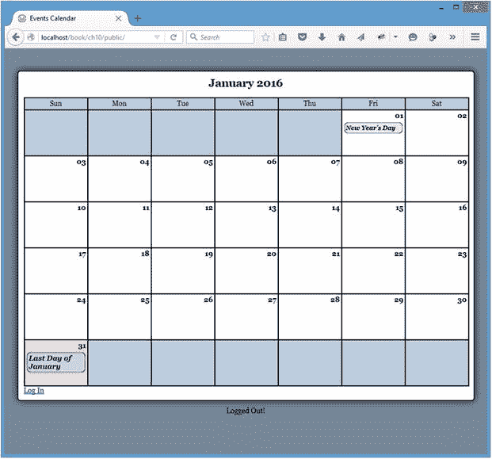

# 十、扩展 jQuery

Electronic supplementary material The online version of this chapter (doi:[10.​1007/​978-1-4842-1230-1_​10](http://dx.doi.org/10.1007/978-1-4842-1230-1_10)) contains supplementary material, which is available to authorized users.

jQuery 易于使用的语法导致开发人员开始编写脚本来实现自定义效果和其他任务。为了使这些脚本可配置和可重用，这些开发人员将它们构建为插件，或者通过向库中添加新方法来扩展 jQuery 的脚本。在本章中，您将学习如何向 jQuery 添加自己的插件。

## 向 jQuery 添加函数

在某些情况下，可能需要直接向`jQuery`对象添加一个函数，这意味着您可以像这样调用它:

`$.yourFunction();`

向 jQuery 添加函数可以帮助您组织脚本，并确保函数调用遵循一致的格式。但是，需要注意的是，向 jQuery 添加一个函数并不允许您将它与一组选定的 DOM 元素链接起来；为此，你必须使用一个方法，你将在本章中学习如何做。

### 向 jQuery 添加日期验证函数

在您的第一个扩展 jQuery 示例中，您将把您在上一章中编写的日期验证函数添加到`jQuery`对象中。具体来说，您将利用`valid-date.js`。

#### 允许在 jQuery 插件中使用自定义别名

您应该考虑的一件事是允许在 jQuery 插件中使用自定义别名。虽然这并不是绝对必要的，但是我们强烈建议这样做，因为如果`jQuery.noConflict()`放弃了`$`快捷方式，它可以帮助您防止插件崩溃。更好的是，这个特性实现起来如此简单，以至于不包含它实际上有点愚蠢。

当构建一个新的插件时，您应该将插件代码放在一个函数中，该函数在脚本加载时立即执行。一开始，脚本应该是这样的:

`(function(){`

`// plug-in code here...`

`})();`

第二组括号使前面的代码作为函数立即执行，这就是自定义别名的用武之地。如果您将`jQuery`对象传递给第二组括号，将`$`快捷方式传递给内部函数，那么代码将使用`$`快捷方式正常工作，即使使用`jQuery.noConflict()`将它返回给全局名称空间:

`(function($){`

`// plug-in code here...`

`})(jQuery);`

您可以使用任何有效的 JavaScript 变量名来代替`$`，使用这种方法脚本仍然可以正确执行:

`(function(custom){`

`// Adds a background color to any paragraph`

`// element using a custom alias`

`custom("p").css("background-color","yellow");`

`})(jQuery);`

#### 将函数附加到 jQuery 对象

要将该函数附加到 jQuery，请将以下代码添加到`valid-date.js`:

`(function($){`

`// Extends the jQuery object to validate date strings`

`$.validDate = function()`

`{`

`// code here`

`};`

`})(jQuery);`

使用这种格式，您现在可以像这样调用`validDate()`函数:

`$.validDate();`

#### 允许可配置选项

就像在最初的`validDate()`函数中一样，一个日期字符串将被传递到函数中。但是，为了使这个函数更具可配置性，您可以传入一个包含配置选项的对象(如果需要)来修改用于匹配日期字符串的 regex 模式:

`(function($){`

`// Extends the jQuery object to validate date strings`

`$.validDate = function(date, options)`

`{`

`// code here`

`};`

`})(jQuery);`

`options`对象只有一个属性:用于验证的模式。因为您希望`options`对象是可选的，所以您通过插入以下粗体代码为函数中的模式定义了一个默认值:

`(function($){`

`// Extends the jQuery object to validate date strings`

`$.validDate = function(date, options)`

`{`

`// Sets up default values for the method`

`var defaults = {`

`"pattern" : /^(\d{4}(-\d{2}){2} (\d{2})(:\d{2}){2})$/`

`};`

`};`

`})(jQuery);`

#### 使用用户提供的选项扩展默认选项

您可以使用`$.extend()`函数扩展`default`对象，这将通过组合默认选项和用户提供的选项来创建一个新对象。如果有三个可用选项，而用户传递一个只定义了其中两个的对象，使用`$.extend()`只会替换用户重新定义的两个属性。

插入粗体显示的代码来扩展`default`对象:

`(function($){`

`// Extends the jQuery object to validate date strings`

`$.validDate = function(date, options)`

`{`

`// Sets up default values for the method`

`var defaults = {`

`"pattern" : /^(\d{4}(-\d{2}){2} (\d{2})(:\d{2}){2})$/`

`},`

`// Extends the defaults with user-supplied options`

`opts = $.extend(defaults, options);`

`};`

`})(jQuery);`

#### 执行验证并返回值

执行验证和返回值的步骤与原始函数中的步骤几乎相同，除了您在这里通过`opts`对象访问模式:

`(function($){`

`// Extends the jQuery object to validate date strings`

`$.validDate = function(date, options)`

`{`

`// Sets up default values for the method`

`var defaults = {`

`"pattern" : /^(\d{4}(-\d{2}){2} (\d{2})(:\d{2}){2})$/`

`},`

`// Extends the defaults with user-supplied options`

`opts = $.extend(defaults, options);`

`// Returns true if a match is found, false otherwise`

`return date.match(opts.pattern)!=null;`

`};`

`})(jQuery);`

#### 符合 jQuery 插件文件命名约定

要将插件正式称为插件，必须使用插件文件的 jQuery 命名约定。接受的格式是`jquery.[name of plug-in].js`。为了满足这一准则，将`valid-date.js`的名称改为`jquery.validDate.js`。

### 修改包含脚本

现在文件名已经更改，您需要更新`footer.inc.php`来包含它。进行以粗体显示的更改，以加载正确的文件:

``

``

`</body>`

`</html>`

### 修改初始化脚本

最后，调整`init.js`来调用您刚刚添加的新 jQuery 函数，方法是进行粗体显示的调整:

`jQuery(function($){`

`var processFile = "assets/inc/ajax.inc.php",`

`fx = {...}`

`$("body").on("click", "li>a", function(event){...});`

`$("body").on("click", ".admin-options form,.admin", function(event)(event){...});`

`$("body").on("click", ".edit-form a:contains(cancel)", function(event){...});`

`// Edits events without reloading`

`$("body").on("click", ".edit-form input[type=submit]", function(event){`

`// Prevents the default form action from executing`

`event.preventDefault();`

`// Serializes the form data for use with $.ajax()`

`var formData = $(this).parents("form").serialize(),`

`// Stores the value of the submit button`

`submitVal = $(this).val(),`

`// Determines if the event should be removed`

`remove = false,`

`// Saves the start date input string`

`start = $(this).siblings("[name=event_start]").val(),`

`// Saves the end date input string`

`end = $(this).siblings("[name=event_end]").val();`

`// If this is the deletion form, appends an action`

`if ( $(this).attr("name")=="confirm_delete" )`

`{`

`// Adds necessary info to the query string`

`formData += "&action=confirm_delete"`

`+ "&confirm_delete="+submitVal;`

`// If the event is really being deleted, sets`

`// a flag to remove it from the markup`

`if ( submitVal=="Yes, Delete It" )`

`{`

`remove = true;`

`}`

`}`

`// If creating/editing an event, checks for valid dates`

`if ( $(this).siblings("[name=action]").val()=="event_edit" )`

`{`

`if ( !$.validDate(start) || !$.validDate(end) )`

`{`

`alert("Valid dates only! (YYYY-MM-DD HH:MM:SS)");`

`return false;`

`}`

`}`

`// Sends the data to the processing file`

`$.ajax({`

`type: "POST",`

`url: processFile,`

`data: formData,`

`success: function(data) {`

`// If this is a deleted event, removes`

`// it from the markup`

`if ( remove===true )`

`{`

`fx.removeevent();`

`}`

`// Fades out the modal window`

`fx.boxout();`

`// If this is a new event, adds it to`

`// the calendar`

`if ( $("[name=event_id]").val().length==0`

`&& remove===false )`

`{`

`fx.addevent(data, formData);`

`}`

`},`

`error: function(msg) {`

`alert(msg);`

`}`

`});`

`});`

`});`

保存前面的代码后，您可以重新加载`http://localhost/`并尝试提交一个带有错误日期值的新事件。该结果与使用原始`validDate()`功能时获得的结果相同。

## 向 jQuery 添加方法

要向 jQuery 对象添加可链接的方法，必须将其附加到 jQuery 的`fn`对象。这允许您对一组选定的元素调用方法:

`$(".class").yourPlug-in();`

Note

jQuery 的`fn`对象实际上只是 jQuery 对象的`prototype`对象的别名。修改对象的原型将影响该对象的所有未来实例，而不仅仅是当前实例。有关这方面的更多信息，请在 [`www.javascriptkit.com/javatutors/proto.shtml`](http://www.javascriptkit.com/javatutors/proto.shtml) 查看 JavaScript 中对`prototype`对象的简要说明。

### 构建您的插件

您将在本节中构建的插件将依靠一个简单的方法，当用户将鼠标悬停在事件标题上时放大它们，然后当用户将鼠标从标题上移开时将它们恢复到原始大小。

这个插件将被称为`dateZoom`，它将允许用户配置用于动画的大小、速度和缓动方程式。

#### 创建一个正确命名的插件文件

创建这个插件时，您的首要任务是给它命名。在`js`文件夹中创建一个名为`jquery.dateZoom.js`的新文件，并插入自定义别名函数:

`(function($){`

`// plug-in code here`

`})(jQuery);`

在该函数中，通过插入以下粗体代码将新方法附加到`fn`对象:

`(function($){`

`// A plug-in that enlarges the text of an element when moused`

`// over, then returns it to its original size on mouse out`

`$.fn.dateZoom = function(options)`

`{`

`// code here`

`};`

`})(jQuery);`

#### 提供可公开访问的默认选项

在您的`validDate()`插件中，函数的默认选项存储在私有对象中。这可能是不可取的，尤其是在用户可能将插件方法应用于多组元素，然后想要修改所有实例的默认值的情况下。

为了使默认选项可以公开访问，您可以将它们存储在`dateZoom`名称空间中。对于您的`dateZoom`插件，创建一个可公开访问的`defaults`对象，它包含六个定制属性:

*   `fontsize`:字体将扩展到的大小。默认设置为`110%`。
*   `easing`:动画使用的缓动功能。默认设置为`swing`。
*   `duration`:动画应该持续的毫秒数。默认设置为`600`。
*   `selector`:要绑定到的元素的 CSS 选择器。默认设置为`li>a`。
*   `match`:与要绑定到的元素相匹配的属性。默认设置为`href`。
*   `callback`:动画完成时触发的功能。默认设置为`null`。

现在，通过插入以下粗体代码，将默认选项添加到`dateZoom`插件中:

`(function($){`

`// A plug-in that enlarges the text of an element when moused`

`// over, then returns it to its original size on mouse out`

`$.fn.dateZoom = function(options)`

`{`

`// code here`

`};`

`// Defines default values for the plug-in`

`$.fn.dateZoom.defaults = {`

`"fontsize" : "110%",`

`"easing" : "swing",`

`"duration" : "600",`

`"selector" : "li>a",`

`"match" : "href",`

`"callback" : null`

`};`

`})(jQuery);`

此时，用户可以使用类似下面的语法更改对`dateZoom`插件的所有调用的默认值:

`$.fn.dateZoom.defaults.fontsize = "120%";`

要覆盖默认选项，用户可以为一个或多个默认选项传递一个带有新值的对象，就像在`validDate`插件中一样。您可以使用`$.extend()`创建一个新的对象，该对象包含创建插件时当前调用的值。

以下粗体代码将该功能添加到了`dateZoom`插件中:

`(function($){`

`// A plug-in that enlarges the text of an element when moused`

`// over, then returns it to its original size on mouse out`

`$.fn.dateZoom = function(options)`

`{`

`// Only overwrites values that were explicitly passed by`

`// the user in options`

`var opts = $.extend($.fn.dateZoom.defaults, options);`

`// more code here`

`};`

`// Defines default values for the plug-in`

`$.fn.dateZoom.defaults = {`

`"fontsize" : "110%",`

`"easing" : "swing",`

`"duration" : "600",`

`"selector" : "li>a",`

`"match" : "href",`

`"callback" : null`

`};`

`})(jQuery);`

#### 保持链接能力

为了保持插件方法可链接，该方法必须返回修改后的`jQuery`对象。幸运的是，使用 jQuery 很容易做到这一点:您所需要做的就是对`this`对象运行`.each()`方法来迭代每个选中的元素，然后返回`this`对象。

在`dateZoom`插件中，您可以通过插入粗体显示的代码使您的方法可链接:

`(function($){`

`// A plug-in that enlarges the text of an element when moused`

`// over, then returns it to its original size on mouse out`

`$.fn.dateZoom = function(options)`

`{`

`// Only overwrites values that were explicitly passed by`

`// the user in options`

`var opts = $.extend($.fn.dateZoom.defaults, options);`

`// Loops through each matched element and returns the`

`// modified jQuery object to maintain chainability`

`return this.each(function(){`

`// more code here`

`});`

`};`

`// Defines default values for the plug-in`

`$.fn.dateZoom.defaults = {`

`"fontsize" : "110%",`

`"easing" : "swing",`

`"duration" : "600",`

`"selector" : "li>a",`

`"match" : "href",`

`"callback" : null`

`};`

`})(jQuery);`

#### 创建可公开访问的帮助器方法

为了保持插件代码整洁有序，您将把元素的实际动画放在一个名为`zoom`的助手方法中。

这个方法和`defaults`对象一样，可以在`dateZoom`名称空间下公开访问。将该方法公开意味着用户可以在调用插件之前重新定义该方法，或者甚至在插件之外调用该方法，如果她愿意的话。

您可以通过将以下粗体代码插入到`dateZoom`插件中来创建`zoom`方法:

`(function($){`

`// A plug-in that enlarges the text of an element when moused`

`// over, then returns it to its original size on mouse out`

`$.fn.dateZoom = function(options)`

`{`

`// Only overwrites values that were explicitly passed by`

`// the user in options`

`var opts = $.extend($.fn.dateZoom.defaults, options);`

`// Loops through each matched element and returns the`

`// modified jQuery object to maintain chainability`

`return this.each(function(){`

`// more code here`

`});`

`};`

`// Defines default values for the plug-in`

`$.fn.dateZoom.defaults = {`

`"fontsize" : "110%",`

`"easing" : "swing",`

`"duration" : "600",`

`"selector" : "li>a",`

`"match" : "href",`

`"callback" : null`

`};`

`// Defines a utility function that is available outside of the`

`// plug-in if a user is so inclined to use it`

`$.fn.dateZoom.zoom = function(element, size, opts)`

`{`

`// zoom the elements`

`};`

`})(jQuery);`

此方法接受要制作动画的元素、应该制作动画的大小以及包含选项的对象。

Note

您将大小与其余选项分开，因为元素的原始字体大小将用于将元素返回到其原始状态，并且该值在`options`对象中不可用。

在这个方法中，您将使用`.animate()`、`.dequeue()`和`.clearQueue()`方法来制作对象的动画并防止动画队列堆积；添加以粗体显示的代码来实现这一点:

`(function($){`

`// A plug-in that enlarges the text of an element when moused`

`// over, then returns it to its original size on mouse out`

`$.fn.dateZoom = function(options)`

`{`

`// Only overwrites values that were explicitly passed by`

`// the user in options`

`var opts = $.extend($.fn.dateZoom.defaults, options);`

`// Loops through each matched element and returns the`

`// modified jQuery object to maintain chainability`

`return this.each(function(){`

`// more code here`

`});`

`};`

`// Defines default values for the plug-in`

`$.fn.dateZoom.defaults = {`

`"fontsize" : "110%",`

`"easing" : "swing",`

`"duration" : "600",`

`"selector" : "li>a",`

`"match" : "href",`

`"callback" : null`

`};`

`// Defines a utility function that is available outside of the`

`// plug-in if a user is so inclined to use it`

`$.fn.dateZoom.zoom = function(element, size, opts)`

`{`

`// Limit zoom effect to currently hovered element.`

`if (opts.match)`

`{`

`element = $.grep($(element), function(elem) {`

`return elem[opts.match] === $('a:hover')[0][opts.match];`

`});`

`}`

`$(element).animate({`

`"font-size" : size`

`},{`

`"duration" : opts.duration,`

`"easing" : opts.easing,`

`"complete" : opts.callback`

`})`

`.dequeue()     // Prevents jumpy animation`

`.clearQueue(); // Ensures only one animation occurs`

`};`

`})(jQuery);`

Note

`.dequeue()`方法将当前动画从动画队列中取出，防止在用`.clearQueue()`清空队列时动画跳到末尾。允许队列建立会导致动画元素看起来跳动或者快速连续地多次执行动画，这绝对是不希望的效果。

#### 修改每个匹配的元素

因为`.each()`方法接受回调，所以您可以很容易地修改正在处理的`jQuery`对象中的每个匹配元素。对于`dateZoom`插件，您将为每个选中的元素添加`hover`事件处理程序。

当用户将鼠标悬停在已经应用了`dateZoom`的元素上时，`zoom`方法将会运行。这个方法依赖于`defaults`对象的`selector`属性来指定应用效果的元素的类型。

如果需要的话，`defaults`对象的可选属性`match`用于进一步缩小受影响的元素。如果指定了这个选项，请注意，它使用 jQuery `$.grep`函数根据与当前鼠标悬停元素的成功匹配进一步过滤最初选择的元素(`$('a:hover')[0][opts.match]`)。

属性相应地调整文本的大小。当用户停止悬停时，原来的文本大小将被传递给`zoom`，元素的文本将恢复到原来的大小。要存储原始大小，使用`.css()`方法并将原始字体大小放在私有变量中。

通过将下面的粗体代码插入到`dateZoom`插件中，您可以使用`.hover()`方法来实现这个功能:

`(function($){`

`// A plug-in that enlarges the text of an element when moused`

`// over, then returns it to its original size on mouse out`

`$.fn.dateZoom = function(options)`

`{`

`// Only overwrites values that were explicitly passed by`

`// the user in options`

`var opts = $.extend($.fn.dateZoom.defaults, options);`

`// Loops through each matched element and returns the`

`// modified jQuery object to maintain chainability`

`return this.each(function(){`

`// Stores the original font size of the element`

`var originalsize = $(opts.selector).css("font-size");`

`// Binds functions to the hover event. The first is`

`// triggered when the user hovers over the element, and`

`// the second when the user stops hovering`

`$(this).hover(function(){`

`$.fn.dateZoom.zoom(opts.selector, opts.fontsize, opts);`

`},`

`function(){`

`$.fn.dateZoom.zoom(opts.selector, originalsize, opts);`

`});`

`});`

`};`

`// Defines default values for the plug-in`

`$.fn.dateZoom.defaults = {`

`"fontsize" : "110%",`

`"easing" : "swing",`

`"duration" : "600",`

`"selector" : "li>a",`

`"match" : "href",`

`"callback" : null`

`};`

`// Defines a utility function that is available outside of the`

`// plug-in if a user is so inclined to use it`

`$.fn.dateZoom.zoom = function(element, size, opts)`

`{`

`// Limit zoom effect to currently hovered element.`

`if (opts.match)`

`{`

`element = $.grep($(element), function(elem) {`

`return elem[opts.match] === $('a:hover')[0][opts.match];`

`});`

`}`

`$(element).animate({`

`"font-size" : size`

`},{`

`"duration" : opts.duration,`

`"easing" : opts.easing,`

`"complete" : opts.callback`

`})`

`.dequeue()     // Prevents jumpy animation`

`.clearQueue(); // Ensures only one animation occurs`

`};`

`})(jQuery);`

### 实现您的插件

此时，您的插件已经准备好实现了。剩下的工作就是包含文件并选择一组元素来运行它。

#### 包括插件文件

要包含插件文件，需要修改`footer.inc.php`并添加一个新的脚本标签。与`validDate`插件一样，`dateZoom`插件需要包含在`init.js`之前，以便该方法可以被调用:

``

``

``

`</body>`

`</html>`

#### 在一组元素上初始化插件

插件现在已经包含在应用中，所以您可以对一组元素调用`.dateZoom()`方法。下一组更改要求您修改`init.js`，所以现在打开那个文件。

首先将默认的`fontsize`值更改为`13px`，然后将`.dateZoom()`方法添加到使用`selector`属性选择的元素集的方法链中(在本应用中为`"li>a"`)。如前所述，您可以通过修改`init.js`来实现这些更改，如下面的粗体代码所示:

`jQuery(function($){`

`var processFile = "assets/inc/ajax.inc.php",`

`fx = {...}`

`// Set a default font-size value for dateZoom`

`$.fn.dateZoom.defaults.fontsize = "13px";`

`// Pulls up events in a modal window and attaches a zoom effect`

`$("body")`

`.dateZoom()`

`.on("click", "li>a", function(event){`

`// Stops the link from loading view.php`

`event.preventDefault();`

`// Adds an "active" class to the link`

`$(this).addClass("active");`

`// Gets the query string from the link href`

`var data = $(this)`

`.attr("href")`

`.replace(/.+?\?(.*)$/, "$1"),`

`// Checks if the modal window exists and`

`// selects it, or creates a new one`

`modal = fx.checkmodal();`

`// Creates a button to close the window`

`$("<a>")`

`.attr("href", "#")`

`.addClass("modal-close-btn")`

`.html("×")`

`.click(function(event){`

`// Removes event`

`fx.boxout(event);`

`})`

`.appendTo(modal);`

`// Loads the event data from the DB`

`$.ajax({`

`type: "POST",`

`url: processFile,`

`data: "action=event_view&"+data,`

`success: function(data){`

`// Displays event data`

`fx.boxin(data, modal);`

`},`

`error: function(msg) {`

`alert(msg);`

`}`

`});`

`});`

`$("body").on("click", ".admin-options form,.admin", function(event)(event){...});`

`$("body").on("click", ".edit-form a:contains(cancel)", function(event){...});`

`// Edits events without reloading`

`$("body").on("click", ".edit-form input[type=submit]", function(event){...});`

`});`

保存这些更改，在浏览器中重新加载`http://localhost/`，然后将鼠标悬停在一个事件标题上，查看运行中的`dateZoom`插件(参见图 [10-1](#Fig1) )。

图 10-1。

The event title enlarges when hovered over

通过将`defaults`对象的`match`属性设置为空字符串""，然后重新加载，从而暂时禁用该属性，这也是一个有益的尝试。如果你这样做了，你会注意到所有的`selector`元素(在这个应用中是`"li>a"`)都会在鼠标经过它们时得到缩放效果。这显示了 jQuery(CSS 派生的)访问 DOM 中元素的方法的多样性和强大功能，以及可能的复杂性。

## 摘要

现在，您应该可以轻松地在 jQuery 中构建定制插件了，无论是作为可链接的方法还是作为函数。这一章相当短，但是这种简短证明了您可以轻松地用自己的定制脚本扩展 jQuery 库。

恭喜你！现在，您已经了解了如何结合使用 PHP 和 jQuery 来构建具有类似桌面应用感觉的定制应用。现在，您已经准备好将您所有的好想法在网络上实现了！