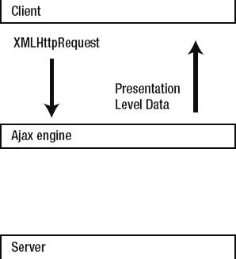
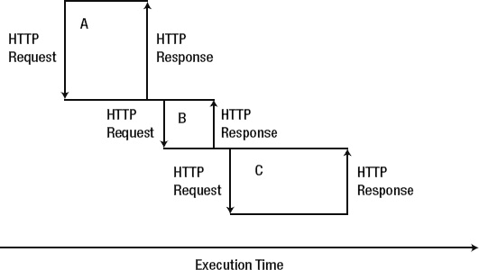
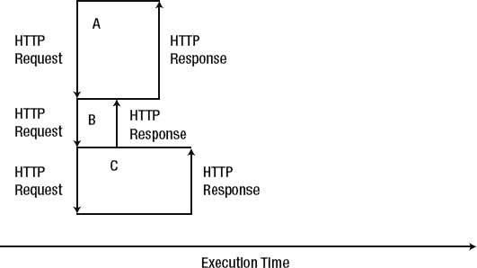
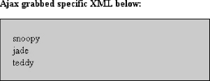
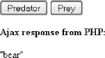

# 十五、JSON 和 Ajax

近年来，网页模仿桌面应用的功能不断发展。尽管增加了复杂性，但用户体验已经大大改善；发达的网站感觉更具响应性和吸引力。通过更快的反馈、弹出提示、自动完成和更少的必要整页重新加载，浏览是一种更丰富、更直观和愉快的体验。

使这一切成为可能的是从浏览器向服务器发出异步请求并接收返回响应的技术。这些请求是异步的，因为它们是在独立的线程中完成的，不会阻塞主脚本的执行。信息以 JSON (JavaScript 对象表示法)、XML(可扩展标记语言)或纯文本的形式来回传递。浏览器和服务器之间的异步通信不需要重新加载整个页面，这就是 Ajax。

 **注意【Ajax 这个术语是 Jesse James Garrett 在 2005 年创造的，最初代表异步 JavaScript 和 XML。从那以后，其他脚本语言和数据格式，如 VBScript 和 JSON，使得异步通信成为可能。出于这个原因，取决于你问谁，Ajax 也可以仅仅意味着异步 web 通信技术。**

Ajax 不是一种技术，而是由几个相互关联的工具组成。这些组件是:

*   表示层:HTML(超文本标记语言)或 XHTML(可扩展 HTML)和 CSS(级联样式表)和 DOM(文档对象模型)
*   数据交换:XML、JSON、HTML 或纯文本
*   异步通信:JavaScript `XMLHttpRequest`对象

XML 和 DOM 在[第 14 章](14.html#ch14)中介绍。假设读者熟悉 HTML、CSS 和 JavaScript。

在这一章中，我们将首先看看 JSON 格式，并在 PHP 中使用它。我们将讨论 JavaScript `XMLHttpRequest`对象以及如何使用它。我们将展示如何向一个 URL 发送一个 Ajax 请求，并用数据进行响应。我们将展示更高级的 JavaScript API jQuery 如何使 Ajax 请求变得更加容易。

在本章快结束时，我们将构建一个包含我们所学的所有组件的演示示例。演示将是一个基于表格的绘图网格，我们可以修改，编辑，保存和加载。我们将使用 jQuery 来更改单元格的背景颜色，并使用 Ajax 请求和 PHP 将图像数据保存到一个文件中，并在我们再次访问页面时加载它。

### 上

像 XML 一样，JSON 只是表示数据的另一种方式，XML 将在第 14 章详细介绍。JSON 有七种数据类型:`strings`、`objects`、`arrays`、`numbers`、`true`、`false`和`null`。`Strings`必须用双引号括起来，可以包含转义字符，如`\n`、`\t`和`\"`。JSON `objects`用大括号括起来，包含用逗号分隔的键/值对。在 JSON 中，键总是字符串，而值可以是七种数据类型中的任何一种，包括对象和数组。

JSON 对象的一个例子如下所示:

`{"name":"Brian", "age":29}`

这里，关键字`"name"`对应于字符串值`"Brian"`，关键字`"age"`对应于数值 29。

JSON 数组用括号括起来，包含用逗号分隔的值。JSON 数组的一个例子如下:

`["Brian", 29]`

JSON 对象和数组也可以嵌套。下面是一个表示图像的 JSON 对象:

`{    "dimensions": {
          "width":800, "height":600
      },
      "format":"jpg",
      "alpha_channel": false,
      "filename":"clouds.jpg"
}`

键`"dimensions"`有另一个对象作为它的值。这个嵌套对象有代表对象宽度和高度的键/值对。

这里显示了嵌套在一个 JSON 数组中的多个 JSON 对象:

`[
      {  "dimensions": {
             "width":800, "height":600
         },
         "format":"jpg",
         "alpha_channel": false,
         "filename":"clouds.jpg"
      },

     {  "dimensions": {
             "width":40, "height":40
          },`

`        "format":" png",
        "alpha_channel":true,
        "filename":"icon.jpg"
     }
]`

此处显示了一个 JSON 对象，它包含表示一些颜色数据的独立红、绿、蓝(RGB)通道的数组:

`{ "red":   [128,128,255,255,255,128,128,0,0],
  "green": [0, 0, 0, 0, 0, 0, 0,0,0],
  "blue":  [128,128,255,255,255,128,128,0,0]
}`

下面是相同的颜色数据，表示为 RGB 数组三元组的嵌套数组:

`[
  [128, 0, 128], [128,0,128], [255, 0, 255],
  [255, 0,255], [255, 0, 255], [128,0,128],
  [128, 0, 128], [0, 0, 0], [0,0,0]
]`

#### PHP 和 JSON

幸运的是，PHP 数组非常类似于 JSON 对象，PHP 有内置的函数来编码和解码 JSON。这些功能分别是`json_encode`和`json_decode,`。

 **注意**一种不能被编码成 JSON 的 PHP 数据类型是资源，就像数据库或文件句柄。与 PHP 不同，您不能在 JSON 中指定整数和浮点数之间的区别。两者都表示为相同的数字类型。

`json_encode`和`json_decode`都只处理`UTF-8`编码的数据。`json_decode`、`$assoc,`的第二个可选参数取布尔值，默认为`FALSE`。当`$assoc`设置为`TRUE`时，JSON 对象被解码成关联数组。在对`json_decode`进行故障排除时，重要的是要知道*“如果 json 不能被解码或者如果编码的数据比递归限制更深，则返回 NULL。”*这是根据在`[www.php.net/manual/en/function.json-decode.php](http://www.php.net/manual/en/function.json-decode.php)`找到的手册

第三个 PHP 函数`json_last_error,`返回一个表示错误代码的整数值。返回的错误代码是以下之一:

`JSON_ERROR_NONE                 No error has occurred
JSON_ERROR_DEPTH                The maximum stack depth has been exceeded
JSON_ERROR_CTRL_CHAR            Control character error, possibly incorrectly encoded
JSON_ERROR_STATE_MISMATCH       Invalid or malformed JSON
JSON_ERROR_SYNTAX               Syntax error
JSON_ERROR_UTF8                 Malformed UTF-8 characters, possibly incorrectly
encoded`

清单 15-1 是一个将 PHP 数据类型的代表编码成 JSON 表示，然后再转换回 PHP 数据类型的例子。

***清单 15-1。**将 PHP 数据类型编码成 JSON 并解码回 PHP 数据类型*

`<?php
//we will leave out the PHP resource type
$php_data_types = array(4.1, 3, NULL, true, false, "hello", new StdClass(), array());

$json = json_encode($php_data_types);
$decoded = json_decode($json);
?>

JSON Representation: 
<pre>
<?php var_dump($json); ?>
</pre>

PHP Representation: 
<pre>
<?php var_dump($decoded); ?>
</pre>

`

运行[清单 15-1](#list_15_1) 会产生以下输出:

`JSON Representation
string(37) "[4.1,3,null,true,false,"hello",{},[]]"

PHP Representation:
array(8) {
  [0]=>
  float(4.1)
  [1]=>
  int(3)
  [2]=>
  NULL
  [3]=>
  bool(true)
  [4]=>
  bool(false)
  [5]=>
  string(5) "hello"
  [6]=>
  object(stdClass)#2 (0) {
  }
  [7]=>
  array(0) {
  }
}`

清单 15-2 将 PHP 嵌套的书籍数组编码成 JSON，然后将 JSON 解码回 PHP。正如您将看到的，JSON 将编码表示为一个对象数组。

***清单 15-2。**一个 PHP 嵌套数组首先被编码成 JSON，然后解码回 PHP*

`<?php

$books = array(
      array("author" => "Lewis Carroll",
          "title" => "Alice's Adventures in Wonderland",
          "year" => 1865),
      array("author" => "Yann Martel",
          "title" => "Life of Pi",
          "year" => 2001),
      array("author" =>"Junot Diaz",
          "title" => "The Brief Wondrous Life of Oscar Wao",
          "year" => 2007),
      array("author" => "Joseph Heller",
          "title" => "Catch-22",
          "year" => 1961),
      array("author" => "Timothy Findley",
          "title" => "Pilgrim",
          "year" => 1999),
      array("author" => "Fyodor Dostoyevsky",
          "title" => "Brothers Karamazov",
          "year" => 1880),
      );

$json_books = json_encode($books);
$decoded_json_books = json_decode($json_books);
?>
<pre>
<?php var_dump($json_books); ?>

<?php var_dump($decoded_json_books); ?>
</pre>`

[清单 15-2](#list_15_2) 首先输出 PHP 嵌套数组的 JSON 表示，它是对象数组的形式。实际输出是一个连续的字符串。添加了换行符以提高可读性:

`string(415) "[
{"author":"Lewis Carroll","title":"Alice's Adventures in Wonderland","year":1865},
{"author":"Yann Martel","title":"Life of Pi","year":2001},
{"author":"Junot Diaz","title":"The Brief Wondrous Life of Oscar Wao","year":2007},
{"author":"Joseph Heller ","title":"Catch-22","year":1961},
{"author":"Timothy Findley","title":"Pilgrim","year":1999},
{"author":"Fyodor Dostoyevsky","title":"Brothers Karamazov","year":1880}
]"`

[清单 15-2](#list_15_2) 然后输出 PHP 编码，再次表示为一个对象数组。

`array(6) {
  [0]=>
  object(stdClass)#1 (3) {
    ["author"]=>
    string(13) "Lewis Carroll"
    ["title"]=>
    string(32) "Alice's Adventures in Wonderland"
    ["year"]=>
    int(1865)
  }
  [1]=>
  object(stdClass)#2 (3) {
    ["author"]=>
    string(11) "Yann Martel"
    ["title"]=>
    string(10) "Life of Pi"
    ["year"]=>
    int(2001)
  }
  [2]=>
  object(stdClass)#3 (3) {
    ["author"]=>
    string(10) "Junot Diaz"
    ["title"]=>
    string(36) "The Brief Wondrous Life of Oscar Wao"
    ["year"]=>
    int(2007)
  }
  [3]=>
  object(stdClass)#4 (3) {
    ["author"]=>
    string(14) "Joseph Heller "
    ["title"]=>
    string(8) "Catch-22"
    ["year"]=>
    int(1961)
  }
  [4]=>
  object(stdClass)#5 (3) {
    ["author"]=>
    string(15) "Timothy Findley"
    ["title"]=>
    string(7) "Pilgrim"
    ["year"]=>
    int(1999)
  }`

`  [5]=>
  object(stdClass)#6 (3) {
    ["author"]=>
    string(18) "Fyodor Dostoyevsky"
    ["title"]=>
    string(18) "Brothers Karamazov"
    ["year"]=>
    int(1880)
  }
}`

值得注意的是，JSON 忽略了单个 book 数组的数字键。但是，一旦我们将一个键设置为关联键，所有的键，包括数字键，都存储在 JSON 对象中。修改清单 15-2 中[的开头](#list_15_2)

`$books = array(
      array("author" => "Lewis Carroll",
          "title" => "Alice's Adventures in Wonderland",
          "year" => 1865),`

到

`$books = array(
      **"sample_book"** =>
      array("author" => "Lewis Carroll",
          "title" => "Alice's Adventures in Wonderland",
          "year" => 1865),`

因此它包含一个关联键，将产生一个编码的 JSON 和解码的 PHP 表示中的对象的对象:

`string(449) "{
"sample_book":
  {"author":"Lewis Carroll","title":"Alice's Adventures in Wonderland","year":1865},
"0":{"author":"Yann Martel","title":"Life of Pi","year":2001},
"1":{"author":"Junot Diaz","title":"The Brief Wondrous Life of Oscar Wao","year":2007},
"2":{"author":"Joseph Heller ","title":"Catch-22","year":1961},
"3":{"author":"Timothy Findley","title":"Pilgrim","year":1999},
"4":{"author":"Fyodor Dostoyevsky","title":"Brothers Karamazov","year":1880}
}"

object(stdClass)#1 (6) {
  ["sample_book"]=>
  object(stdClass)#2 (3) {
    ["author"]=>
    string(13) "Lewis Carroll"
    ["title"]=>
    string(32) "Alice's Adventures in Wonderland"
    ["year"]=>
    int(1865)
  }`

`  ["0"]=>
  object(stdClass)#3 (3) {
    ["author"]=>
    string(11) "Yann Martel"
    ["title"]=>
    string(10) "Life of Pi"
    ["year"]=>
    int(2001)
  }
  ["1"]=>
  object(stdClass)#4 (3) {
    ["author"]=>
    string(10) "Junot Diaz"
    ["title"]=>
    string(36) "The Brief Wondrous Life of Oscar Wao"
    ["year"]=>
    int(2007)
  }
  ["2"]=>
  object(stdClass)#5 (3) {
    ["author"]=>
    string(14) "Joseph Heller "
    ["title"]=>
    string(8) "Catch-22"
    ["year"]=>
    int(1961)
  }
  ["3"]=>
  object(stdClass)#6 (3) {
    ["author"]=>
    string(15) "Timothy Findley"
    ["title"]=>
    string(7) "Pilgrim"
    ["year"]=>
    int(1999)
  }
  ["4"]=>
  object(stdClass)#7 (3) {
    ["author"]=>
    string(18) "Fyodor Dostoyevsky"
    ["title"]=>
    string(18) "Brothers Karamazov"
    ["year"]=>
    int(1880)
  }
}`

### Ajax

Ajax 允许部分重新加载和操作呈现的内容，而不需要重新加载整个页面。Ajax 调用可以是同步的，但通常是异步的后台调用。这是为了在不干扰主程序流程的情况下发送和检索数据。如前所述，Ajax 不是一种单一的技术，而是协同工作的几个部分。

Ajax 的一些缺点是:

*   浏览器的后退按钮和书签不会跟踪 Ajax 的状态。
*   搜索引擎很难索引动态生成的内容。
*   非 JavaScript 用户需要适度降级，这需要额外的工作。
*   屏幕阅读器的可访问性问题。

然而，Ajax 的响应性和动态性通常会超过它的负面影响。像 Gmail、Google Docs 和脸书这样的应用展示了 Ajax 的能力。

#### 传统的网络模式

在经典 web 模型的简化视图中(见[图 15-1](#fig_15_1) ，客户端浏览器向 web 服务器发送 HTTP 请求并接收响应。任何时候，如果浏览器希望更新显示，即使是单个`
`元素或``元素发生了变化，或者验证输入，都需要向服务器发出完整的请求。对于每个请求，浏览器都在等待来自服务器的反馈。

***图 15-1。**传统网络模式*

20 年前，当网络首次被广泛使用时，等待 30 秒或更长时间来提交表格是可以接受的。互联网连接要慢得多，网络仍然是一项令人惊叹的新技术，比亲自寄信或提交纸质表格要快得多。随着人类已经习惯于更快的连接和及时的反馈，对缓慢响应时间的容忍度已经稳步下降。需要一种不中断用户体验的方式与服务器通信。

#### Ajax 网络模型

在 Ajax web 模型中(如图 15-2 和图 15-3 所示)，有一个中介——Ajax 引擎，它位于客户端和服务器之间。有了这个模型，客户端现在可以将其事件发送给 Ajax 引擎。根据事件的类型，Ajax 引擎要么操纵客户机的表示层(HTML 和 CSS ),要么向服务器发送异步事件。在后一种情况下，服务器响应 Ajax 引擎，Ajax 引擎反过来更新客户端。不需要直接的客户端到服务器的请求允许通信，而不需要中断用户思路的全页面刷新。

使用 Ajax web 模型，更新显示和表单验证等事件可以在不联系服务器的情况下发生。当我们需要保存和加载数据时，就会联系服务器。

***图 15-2。** Ajax web 模型——一个简单的事件，只有客户端和 Ajax 引擎交互*

你可以在[图 15-2](#fig_15_2) 中看到，一些浏览器客户端事件，比如显示变化，并不需要从服务器请求或接收数据。

***图 15-3。** Ajax web 模型——需要客户端、Ajax 引擎和服务器交互的更复杂事件*

其他事件确实需要 HTTP 请求和对服务器的响应，如图[图 15-3](#fig_15_3) 所示。

#### 异步与同步事件

假设我们有三个 HTTP 请求事件:A、B 和 C。在同步模式下，我们需要等到收到事件 A 的服务器响应后才能发送请求 B。然后，我们必须等到收到事件 B 的响应后才能发送请求 C。事件是连续的，因此事件 A 会阻塞事件 B 和事件 C，直到它完成。类似地，下一个事件 B 阻塞事件 C，直到它完成。参见图 15-4 。

***图 15-4。**顺序同步 HTTP 事件*

对于异步事件，请求从不等待。它们是单独并行执行的。即使 HTTP 事件 A 仍在等待服务器响应，新事件 B 和 C 也可以立即开始它们的 HTTP 请求。通过比较[图 15-4](#fig_15_4) 和[图 15-5](#fig_15_5) 可以看出，异步事件加快了整体事件处理时间。

***图 15-5。**并行、异步 HTTP 事件*

#### XMLHttpRequest 对象

对象，通常缩写为 XHR，由微软在 2000 年创建。它是一个 API，通常用 JavaScript 实现，支持从客户端向服务器发送请求并接收响应，而无需重新加载页面。物体的名称不能照字面理解。其组成部分只是象征性的，例如:

*   *XML* :实际上可以是 XML，JSON，HTML，或者纯文本文档。
*   *Http* :可能是 Http 或者 HTTPS。
*   *请求*:请求或响应。

有些浏览器不支持`XMLHttpRequest`对象，但支持`XDomainRequest`对象或`window.createRequest()`方法。在本章中，我们不会担心支持过时的或非标准的浏览器。

创建一个新的`XMLHttpRequest`对象需要一行代码，如清单 15-3 中的[所示。](#list_15_3)

***清单 15-3。**在 JavaScript 中创建`an XMLHttpRequest`对象*

`        `

为了设置请求的参数，我们使用了`open()`函数。该函数采用以下参数:

*   请求方式:`{"GET", "POST", "HEAD", "PUT", "DELETE", "OPTIONS"}`之一。
*   URL:请求 URL。可以是 PHP、JavaScript、HTML、纯文本或其他文件类型。
*   异步(可选):默认值为 true，表示非阻塞调用。
*   Username(可选):如果在请求服务器上使用身份验证，则为 Username。
*   Password(可选):在请求服务器上使用身份验证时的密码。

异步调用有一个监听器回调函数`onreadystatechange`，它允许主脚本继续运行。同步调用没有侦听器，因此需要阻塞主脚本，直到收到响应。如果我们发送一个异步调用，那么`onreadystatechange`回调将设置请求对象的`readyState`属性。

为了设置对象属性，但不发送请求，我们将使用如下代码:

``

默认情况下，与请求一起发出的头是`"application/xml;charset=*_charset*"`，其中 *`_charset`* 是实际使用的编码，例如`UTF-8.`，如果我们需要覆盖这些值，我们将使用函数`setRequestHeader(String header_name, String header_value)`。如果使用代理，请求对象将自动设置和发送代理授权头。

在发送请求之前，我们需要定义回调函数。我们将使用一个匿名(未命名)函数，并检查 readyState 是否为 4，这表示请求已完成:

`xhr.onreadystatechange=function(){
           if (xhr.readyState == 4){ //ready state 4 is completion
                if (xhr.status==200){ //success`

**可能的就绪状态有:**

> 0 未初始化-尚未调用 open()。
> 
> 1 尚未调用 Loading - send()。
> 
> 2 Loaded - send()已被调用，标题和状态可用。
> 
> 3 交互式下载，responseText 保存部分数据。
> 
> 4 完成-完成所有操作。

不同浏览器的状态 0-3 不一致。我们主要对状态 4 感兴趣。

既然我们已经初始化了请求对象并定义了回调，我们就可以发出请求了:

`      xhr.send("our content");`

发送一个带有`XMLHttpRequest`的 Ajax 请求看起来像清单 15-4 中的[。](#list_15_4)

***清单 15-4。**一个基本`XMLHttpRequest`T4】*

``

#### 使用 XMLHttpRequest

在我们使用`XMLHttpRequest`对象的第一个例子([清单 15-5](#list_15_5) )中，我们将替换`
`标签的内容。

*清单 15-5**。**用`XMLHttpRequest`、`listing_15_5.html`、*修改页面元素

`<html>
    <head></head>
    <body>
        
Original content

        
    </body>
</html>`

我们在清单 15-5 中的`open()`方法中使用的 URL 是当前页面，可以在 JavaScript 变量`window.location.pathname`中访问。我们在 Ajax 调用`xhr.send(null)`中没有发送任何数据。

JavaScript 放在我们操作的 HTML 元素之后。这是因为我们需要加载所有的 DOM 树，以便 JavaScript 能够找到并操作其中的元素。像 jQuery 这样的高级框架有测试文档是否准备好的功能，通过这样做，可以将 JavaScript 放在页面的任何地方。

根据你的计算机的响应时间，你可能会看到元素从初始值`"Original content"`变为`"Ajax loaded content"`

在页面加载后，清单 15-6 将获取一个外部 XML 文件的纯文本内容，并将其放入我们的文档中。对于纯文本，我们的意思是只检索 XML 元素值。元素名称和属性被丢弃。

***清单 15-6。**用一个`XMLHttpRequest`抓取一个 XML 文件的内容，并将其显示为纯文本*

`<html>
    <head>
        <title>XHR Example</title>
        
    </head>
    <body>
        
<strong>Ajax grabbed plain text:</strong>

        
&nbsp;

        
    </body>
</html>`

***清单 15-7。**所包含的 XML 文件，`animals.xml`*

`<?xml version="1.0" encoding="UTF-8" ?>
<animals>
  <dogs>
    <dog>
      <name>snoopy</name>
      brown
      <breed>beagle cross</breed>
    </dog>
    <dog>
      <name>jade</name>
      black
      <breed>lab cross</breed>
    </dog>
  </dogs>
  <cats>
    <cat>
      <name>teddy</name>
      brown
      <breed>tabby</breed>
    </cat>
  </cats>
</animals>`

清单 15-6 的[输出如图](#list_15_6)[图 15-6](#fig_15_6) 所示

***图 15-6。**运行[清单 15-6](#list_15_6) 的输出，它使用 Ajax 读取 XML 文件的纯文本*

在[清单 15-6](#list_15_6) 中需要注意的关键一行是，我们为我们的成功响应指定了纯文本输出:

`         if (xhr.status==200){ //success
              //retrieve result as plain text
              **message = "<pre>" + xhr.responseText + "</pre>";**
         }`

并将其作为 id 等于`generated_content`的`
`的`innerHTML`:

`        document.getElementById("generated_content").innerHTML = message;`

为了只获取动物名称([清单 15-8](#list_15_8) )，我们检索 XML 格式的输出，并解析所有的名称元素值。

***清单 15-8。**用`XMLHttpRequest`抓取 XML 并解析特定值*

`<html>
    <head>
        <title>XHR Example - XML</title>
        
    </head>
    <body>
        
<strong>Ajax grabbed specific XML below:</strong>

        
&nbsp;

        
    </body>
</html>`

我们在[清单 15-8](#list_15_8) 中使用 JavaScript 来获取使用`xhr.responseXML`的 Ajax 调用返回的 XML 数据，并解析它以获取`<name>`元素值。输出如图[图 15-7](#fig_15_7) 所示。

***图 15-7。**运行[清单 15-8](#list_15_8) 的输出，它使用 Ajax 解析 XML 数据*

如果我们请求一个用 HTML 编写的文件，那么使用`responseText`保留 HTML 结构，如[清单 15-9](#list_15_9) 所示。输出如图 15-8 中的[所示](#fig_15_8)

***清单 15-9。**用`XMLHttpRequest`* 抓取 HTML

`<html>
    <head>
        <title>XHR Example - Plain Text Containing HTML</title>
        
    </head>
    <body>
        
<strong>Ajax grabbed plain text containing html:</strong>

        
&nbsp;

        
    </body>
</html>`

其中`sample_table.html`包含

`<table border="1">
    <tr><th>foo</th><th>bar</th></tr>
    <tr><th>a</th><th>1</th></tr>
    <tr><th>b</th><th>2</th></tr>
    <tr><th>c</th><th>3</th></tr>
</table>` 

***图 15-8。**运行[清单 15-9](#list_15_9) 的输出，它使用 Ajax 包含 HTML*

#### 高级 JavaScript APIs

jQuery、Prototype 和 YUI 之类的高级 JavaScript APIs 之所以广受欢迎，部分原因是它们抽象出了细节，使得使用复杂对象(如`XMLHttpRequest`)变得更加容易。这意味着库的用户不需要直接知道`XMLHttpRequest`对象的内部工作原理。然而，对`XMLHttpRequest`对象的理解有助于理解“引擎盖下”发生了什么这些库的其他优点是它们使得跨浏览器支持和 DOM 操作更加容易。

有几个库可供选择。Danchilla 是 jQuery 的倡导者，jQuery 是目前最流行的 JavaScript 库。它被 Google、Amazon、Twitter、Microsoft Visual Studio、IBM、Drupal CMS(内容管理系统)以及许多其他网站和框架使用:如果您不喜欢它，请参见`[http://docs.jquery.com/Sites_Using_jQuery](http://docs.jquery.com/Sites_Using_jQuery).`其他选择包括 Dojo、YUI、Prototype、MooTools 和 script.aculo.us。然而，丹希拉会解释我们使用的任何功能。

#### jQuery 示例

[清单 15-10](#list_15_10) 是清单 15-5 的[的 jQuery 等价物，它在页面加载后替换了一个`
`元素的内容。](#list_15_5)

***清单 15-10。**用 jQuery 加载页面后修改`
`元素*

`<html>
    <head>
        <title>First jQuery Example</title>
        
        
    </head>
    <body>
        
Original content

    </body>
</html>`

在[清单 15-10](#list_15_10) 中，该行

`        `

从 Google CDN(内容交付网络)加载 jQuery 库。或者，您可以提供一个本地下载的库副本。在生产环境中，cdn 通常更快、更可靠。大多数浏览器对可以从一个域中同时下载的文件数量有限制。使用外部 CDN 会从网页的加载队列中删除一个文件。结果是更高的吞吐量和更快的页面加载。注意文件名是`jquery.min.js`。这是该库的打包、混淆版本。文件较小，您可能希望在生产中使用此版本。在开发中，您可能会调试您的输出，最好包括人类可读的版本，`jquery.js`。

`$(document).ready`函数调用是 jQuery 脚本的标准。`$(document)`代表完整的 DOM 文档，稍后在脚本中简称为`$()`。一旦 DOM 文档完全加载完毕，对`.ready`的调用就会执行脚本。这允许我们将脚本放在我们在 HTML 文档中操作的元素之前。

Ajax 参数在一个函数调用`$.ajax()`中初始化和设置。该函数将请求类型——GET 或 POST、URL 和响应数据类型作为参数。它还定义了成功和失败的回调。

最后我们原剧本的`document.getElementsByTagName("p")[0].innerHTML`行换成了`$("p").html("*some data*")`。该行的第一部分通过使用 CSS 选择器找到相关的`
`元素。第二部分设置元素数据。

 **注意**从技术上讲，`$("p")`匹配文档中所有的`
`标签。如果我们想显式匹配第一次出现的内容，如清单 15-5 中的[，我们可以链接内置函数`$("p").first`()。或者，我们可以使用 CSS 选择器，如`$("p:first")`或`$("p:eq(0)")`。](#list_15_5)

我们脚本的这个 jQuery 版本比使用`XMLHttpRequest`对象的原始版本要短。随着我们的脚本变得更加复杂，像 jQuery 这样的高级 API 的价值变得更加明显。

清单 15-11 是清单 15-6 中[的 jQuery 等价物，它从 XML 文件中加载纯文本。](#list_15_6)

***清单 15-11。**使用 jQuery 从 XML 文件加载纯文本*

`<html>
    <head>
        <title>Loading Plain Text with jQuery</title>
        
        
        `
`    </head>
    <body>
        
<strong>Ajax grabbed plain text:</strong>

        
&nbsp;

    </body>
</html>`

如果我们不关心可能的错误值，我们可以将清单 15-11 中的脚本重写为清单 15-12 中[所示的更简洁的代码..](#list_15_12)

***清单 15-12。**使用 jQuery 加载文件的更简洁版本。load()函数*

`   <html>
    <head>
        <title>Loading Plain Text with jQuery</title>
        
        
        
    </head>
    <body>
        
<strong>Ajax grabbed plain text:</strong>

        
&nbsp;

    </body>
</html>`

清单 15-12 中的 jQuery `load`函数执行一个 GET 请求，并使用“智能猜测”返回纯文本。然后，它将文本插入到选定的元素中。jQuery `wrap`函数在元素内容周围放置标记。这允许我们将加载的数据包含在上面的`<pre>..</pre>`标签中。

除了`$.ajax`函数，jQuery 还有用于 GET 和 POST 请求的`$.get`和`$.post`函数。通过这些函数，jQuery 试图猜测期望的输出。如果猜测错误，我们可以显式指定返回类型。有关更深入的内容，请参考位于`[http://api.jquery.com/jQuery.get/](http://api.jquery.com/jQuery.get/)`的 jQuery 文档。参见[清单 15-13](#list_15_13) 。

***清单 15-13。**使用`jQuery $.get`并请求 XML 数据类型。*

`<html>
    <head>
        <title>Loading XML with jQuery</title>
        
        
        
    </head>
    <body>
        
<strong>Ajax parsed XML:</strong>

        
&nbsp;

    </body>

    </html>`

在[清单 15-13](#list_15_13) 中，`$.get`函数有三个参数。第一个是请求文件，第二个是函数回调，在这里我们操作响应数据，第三个是预期的数据类型。如果没有指定`"xml"`，jQuery 会选择纯文本。

到目前为止，我们已经展示了如何使用`XMLHttpRequest`对象，以及像 jQuery 这样的高级 API 包装器如何隐藏一些细节，让生活变得更简单。现在让我们尝试一个 JSON 例子(见清单 15-14 )

***清单 15-14。**从 PHP 数组输出 JSON 数据，`json_example.php`*

`<?php

$animals = array(
    "africa" => array("gorilla", "giraffe", "elephant"),
    "asia" => array("panda"),
    "north america" => array("grizzly bear", "lynx", "orca"),
    );

print json_encode($animals);
?>`

[清单 15-15](#list_15_15) 使用 jQuery 通过 Ajax 请求从 PHP 文件中获取 JSON 值([清单 15-14](#list_15_14) )。

***清单 15-15。**使用`$.getJSON`和`$.each`T5】*

`<html>
    <head>
        <title>Loading JSON with jQuery</title>
        
        
    </head>
    <body>
        
<strong>Ajax parsed JSON:</strong>

        
&nbsp;

    </body>
</html>`

清单 15-15 的输出是:

`Ajax parsed JSON:

**africa:**
gorilla, giraffe, elephant

**asia:**
panda

**north america:**
grizzly bear, lynx, orca`

在[清单 15-15](#list_15_15) 中，我们使用了`$.getJSON`速记函数。我们也可以使用`$.get`和`json`作为第三个参数。我们还使用 jQuery 函数`$.each`遍历返回的 JSON 对象。为了分配`continent`和`animals`的键/值数据变量名，我们将回调函数定义为:

`$.each(data, function(continent, animals){)`

#### 通过 Ajax 向 PHP 脚本发送数据

在这个例子中([清单 15-16](#list_15_16) ，我们将在浏览器页面上有两个按钮，标记为“捕食者”和“猎物”。当按下任何一个按钮时，一个 Ajax 请求被发送到一个 PHP 脚本，带有查询参数`?type=predator`或`?type=prey`。当 PHP 脚本收到请求时，它使用查询值选择并返回一个适当的编码为 JSON 的动物条目。

***清单 15-16。** PHP 文件，选择一个捕食者或猎物，并以 JSON 格式输出，`predator_prey.php`*

`<?php
error_reporting(E_ALL);
$predators = array(
    "bear", "shark", "lion", "tiger",
    "eagle", "human", "cat", "wolf"
    );
$prey = array(
    "salmon", "seal", "gazelle", "rabbit",
    "cow", "moose", "elk", "turkey"
    );

if (isset($_GET['type'])) {
    switch ($_GET['type']) {
        case "predator":
            print json_encode($predators[array_rand($predators)]);
            break;
        case "prey":
            print json_encode($prey[array_rand($prey)]);
            break;`

`        default:
            print json_encode("n/a");
            break;
    }
}
?>`

在清单 15-17 的[中，我们通过发送一个 Ajax `.load`请求来处理两个按钮的`.click`事件。`predator_prey.php`文件接收这个请求，以及一个`type`参数，并发回一个字符串响应，我们将它加载到我们的文档中。我们已经使用`array_rand`为我们选择的数组生成了一个随机索引，然后使用`json_encode`将其以 JSON 格式输出。](#list_15_17)

***清单 15-17。**加载 Ajax 请求响应的 HTML 文件*

`<html>
    <head>
        <title>Predator/Prey Example</title>
    </head>
    
    
    <body>
        <button id="predator">Predator</button>
        <button id="prey">Prey</button>
        
<strong>Ajax response from PHP:</strong>

        
&nbsp;

    </body>
</html>`

清单 15-17 的[输出如图](#list_15_17)[图 15-9](#fig_15_9) 所示。

***图 15-9。**清单 15-17[的样本输出](#list_15_17)清单 T5】*

### 简单的图形程序

在[清单 15-18](#list_15_18) 中，我们将使用调色板、HTML 表格单元格网格和 jQuery 构建一个简单的绘图应用。一旦成功，我们将添加使用 PHP 和 Ajax 保存和加载图像的功能。

***清单 15-18。**图形应用操纵表格单元格的背景颜色*

`<html>
    <head>
        <title>Drawing Grid Example</title>
        
        
        
    </head>
    <body>
        
<strong>Palette</strong>

        <table id="palette">
            <tr>
                <td style="background-color: rgb(0, 0, 0);">&nbsp;</td>
                <td style="background-color: rgb(119, 119, 119);">&nbsp;</td>
                <td style="background-color: rgb(255, 255, 255);">&nbsp;</td>
                <td style="background-color: rgb(255, 0, 0);">&nbsp;</td>
                <td style="background-color: rgb(0, 255, 0);">&nbsp;</td>
                <td style="background-color: rgb(0, 0, 255);">&nbsp;</td>
                <td style="background-color: rgb(255, 255, 0);">&nbsp;</td>
            </tr>
        </table>

        
<strong>Draw!</strong>

        <table id="grid" cellspacing="0">
        </table>
        
<em>Debug console:&nbsp;</em>

        

    </body>
</html>`

在清单 15-18 的[的 CSS 中，我们为表格网格设置了`margin-collapse: collapse`，这样内部边界和边缘边界的厚度相同。我们创建了一个调色板供选择。即使我们指定了尺寸，`&nbsp;`(不间断空格)字符有助于确保浏览器绘制单元格边框。没有 DOM 操作，我们的网格是空的。在我们的 jQuery `.ready`函数中，我们使用一个循环和 jQuery `append`函数向网格添加 10 个表格行，每个行有 10 个单元格。](#list_15_18)

接下来，我们用以下内容定义调色板单元格的单击动作:

`                $("#palette td").each(
                function( index ){
                    //bind the onClick event
                    $( this ).bind (
                    "click",
                    function(){`

在函数细节中，我们更改了`active_color`,并在我们的调试区域显示了它的内容:

`                    function(){
                        **active_color = $(this).css("background-color");**
                        $("#debug_palette_color").html("active palette color is: " +
                            "" + active_color + "");
                    }`

我们将网格单元绑定到一个点击事件，这样在任何点击之后,`background-color`都会变成我们的`active_color:`

`              $("#grid td").each(
                function( index ){
                    //bind the onClick event
                    $( this ).bind (
                    "click",
                    function(){
                        **$(this).css("background-color", active_color);**
                    }
                );`

输出如[图 15-10](#fig_15_10) 所示。我们的计划成功了。然而，我们不能挽救我们的形象。所以当我们从页面浏览出去再回来的时候，我们总会有一个空白的画布。我们接下来将讨论这个问题。

 **注意** jQuery 背景颜色是更新的`rgb(255, 0, 0)`形式，而不是像`#ff0000.`这样的十六进制值。新的颜色格式是 CSS 3 规范的一部分，它也包括一个 alpha 版本 rgba。Alpha 值允许简单的不透明度设置，并且将很快全面支持跨浏览器。

***图 15-10。**我们绘制的网格来自[清单 15-18](#list_15_18)*

#### 维持状态

为了保存 Ajax 的修改，我们可以使用 PHP，将数据写入数据库、`$_SESSION`或文件中。当我们以后重新加载页面时，我们可以从保存的数据中填充图像网格。对于我们的例子，我们将使用一个物理文件。您可以扩展该示例以保存每个唯一会话或用户名的数据，但我们将只存储一组结果。

我们不希望在每次像素改变后都保存结果，因为那样会非常慢并且耗费资源。相反，我们将添加一个保存按钮，以便用户可以显式地请求保存。您还可以跟踪每次保存之间的更改次数。然后，我们可以在大约每 100 次更改后进行一次后台自动保存。这有助于保护用户数据，而无需中断用户备份工作。

我们还可以添加一个“Clear”按钮，将网格重置为透明的、未修改的状态，并截断保存的数据文件。参见[清单 15-19](#list_15_19) 。

***清单 15-19。**显示绘图网格并对我们的 PHP 脚本进行 Ajax 调用的 HTML】*

`<html>
    <head>
        <title>Drawing Grid Example</title>
        
        
        
    </head>
    <body>
        
<strong>Palette</strong>

        <table id="palette">
            <tr>
                <td style="background-color: rgb(0, 0, 0);">&nbsp;</td>
                <td style="background-color: rgb(119, 119, 119);">&nbsp;</td>
                <td style="background-color: rgb(255, 255, 255);">&nbsp;</td>
                <td style="background-color: rgb(255, 0, 0);">&nbsp;</td>
                <td style="background-color: rgb(0, 255, 0);">&nbsp;</td>
                <td style="background-color: rgb(0, 0, 255);">&nbsp;</td>
                <td style="background-color: rgb(255, 255, 0);">&nbsp;</td>
            </tr>
        </table>

        <button id="save">Save</button>

        
<strong>Draw!</strong>

        <table id="grid" cellspacing="0">
        </table>
        
<em>Debug console:&nbsp;</em>

        

        

    </body>
</html>..`

***清单 15-20。**将传入的`$_POST`变量数据保存为 JSON 格式的 PHP 脚本，`save_drawing.php`*

`<?php
   error_reporting(E_ALL);
   file_put_contents("image.x", json_encode($_POST));
?>`

***清单 15-21。**PHP 脚本加载保存的文件数据，`load_drawing.php`*

`<?php
$filename = "image.x";
if (file_exists($filename)) {
  print file_get_contents($filename);
}
?>`

我们新的 jQuery 现在有一个在点击“保存”按钮时保存数据的功能。为此，创建了一个新的 JavaScript 对象。然后将每个单元格的 CSS 背景色属性添加到对象中。一旦完成，我们向我们的`save_drawing.php`文件发送一个 Ajax POST 请求。我们需要使它成为 POST 请求，因为我们发送的数据太长，不能包含在 GET 查询字符串中。在 PHP 脚本中，我们将`$_POST`值编码成 JSON 并保存在一个文件中。参见清单 15-22 。

***清单 15-22。**我们整个程序的保存功能([清单 15-19](#list_15_19) )*

`                $("#save").click(function(){
                    var colorsAsJson = new Object();
                    var i=0;
                    $("#grid td").each(function() {
                        colorsAsJson[i] = $(this).css("background-color");
                        ++i;
                    });

                    $.ajax(
                    {
                        type: "post",
                        url: "save_drawing.php",
                        dataType: "text",
                        data: colorsAsJson,
                        success: function(data) {
                            $("#debug_message").html("saved image");
                        },
                        failure: function(){
                            $("#debug_message").html(
                              "An error has occured trying to save the image");
                        }
                    });
                });`

现在我们已经保存了图像数据，我们可以在再次访问页面时加载数据。为此，我们向`load_colors.php`发送一个`$.getJSON`请求。这将返回我们保存的 JSON 格式文件的内容。在我们的 jQuery 中，我们遍历网格的每个单元格，并分配相应的背景颜色。参见[清单 15-23](#list_15_23) 。输出如图[图 15-11](#fig_15_11) 所示。

***清单 15-23。**我们完整程序的加载功能([清单 15-19](#list_15_19) )*

`               $.getJSON("load_drawing.php", function(data){
                    $("#grid td").each(function(index){
                        $(this).css("background-color", data[index]);
                    });
                });` 

***图 15-11。**我们的 Ajax 绘图程序，带有初始加载的数据、保存按钮和 Firebug 输出*

使用 Ajax 时，使用开发人员工具进行调试很有帮助。Firefox 扩展 Firebug 是目前最好的工具之一。在 Firebug 中，Ajax 数据可以在`Net > XHR`部分找到。Chrome 开发者工具也非常有用。

### 总结

在这一章中，我们已经解释了异步 web 请求是如何实现更丰富、更灵敏、更有趣的网站的。这是通过在客户机和服务器端点之间注入一个中介 Ajax 引擎来实现的。这导致更新浏览器显示的服务器请求减少，并且当我们在服务器和客户机之间传输数据时，调用不会阻塞。

用来发送 Ajax 请求的最流行的脚本语言是 JavaScript。与直接处理`XMLHttpRequest`对象相比，使用 jQuery 这样的高级 API 可以使使用 Ajax 变得更加容易和愉快。

可以用 Ajax 交流的数据格式包括 XML(在第 14 章中讨论过的)、JSON(我们在本章中讨论过的)、HTML 和纯文本。

Ajax 在现代 web 开发中的使用是一把双刃剑。一方面，Ajax 实现了传统 web 模型无法实现的响应性和幕后数据传输。另一方面，用户*期待*丰富的浏览体验。因此，为了满足这些期望，web 应用需要做大量的工作。为了用 Ajax 创造良好的用户体验(UX ),开发人员需要精通几种技术，其中最重要的是 JavaScript、DOM 选择器、JSON 和 XML。

最后，Ajax 是一个新兴领域，其他技术如反向 Ajax 也在探索中。反向 Ajax 涉及长期 HTTP 连接和服务器将数据推送到客户端。未来有望让 Ajax 成为 web 开发的核心。