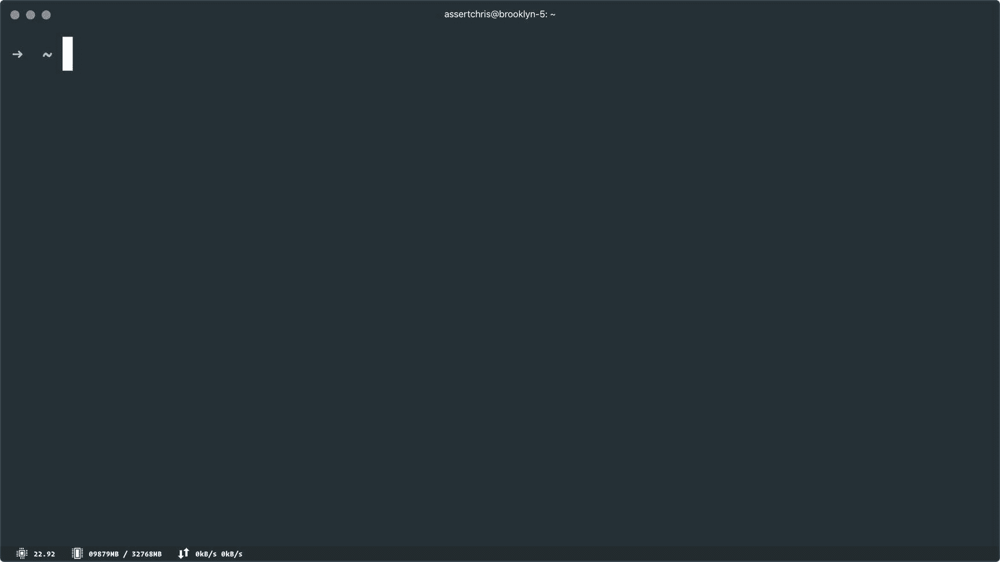
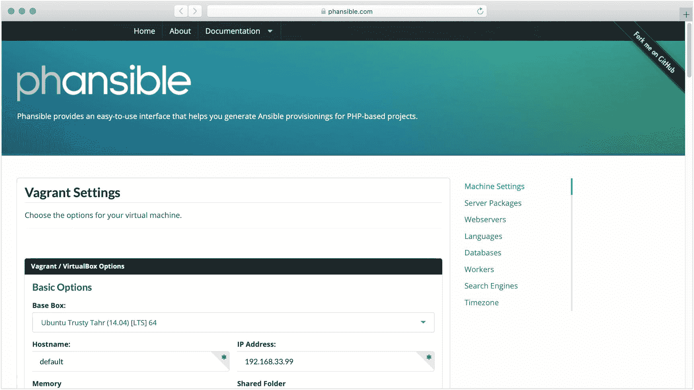
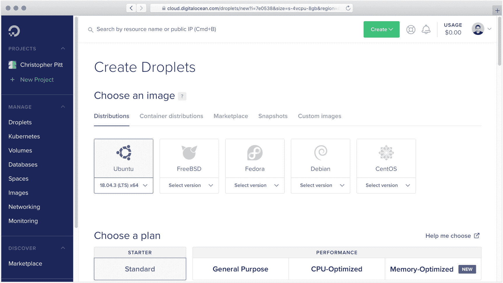
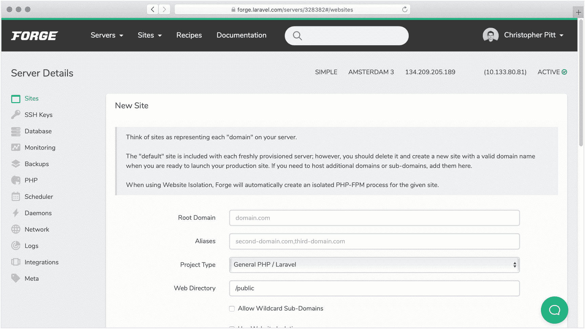
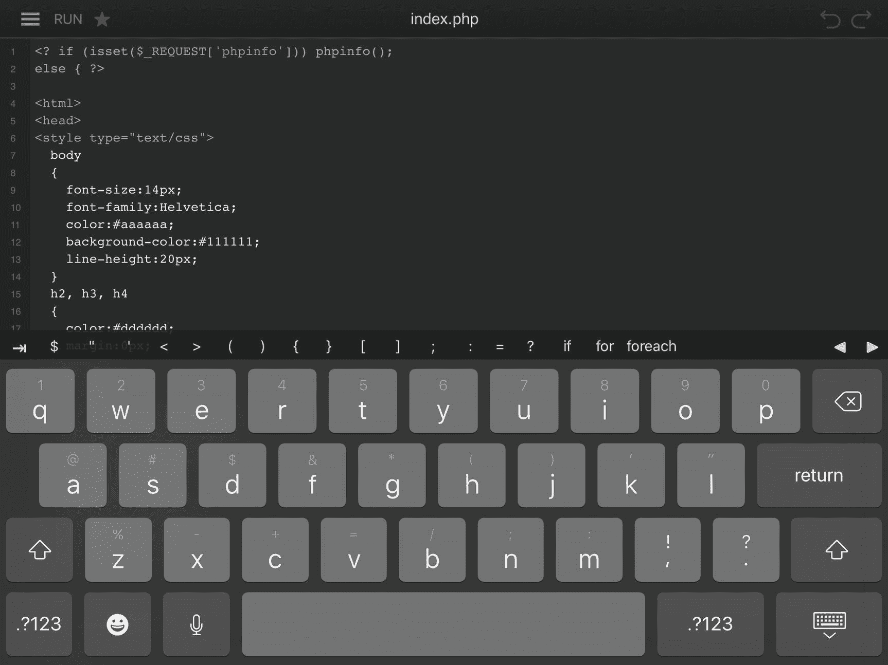
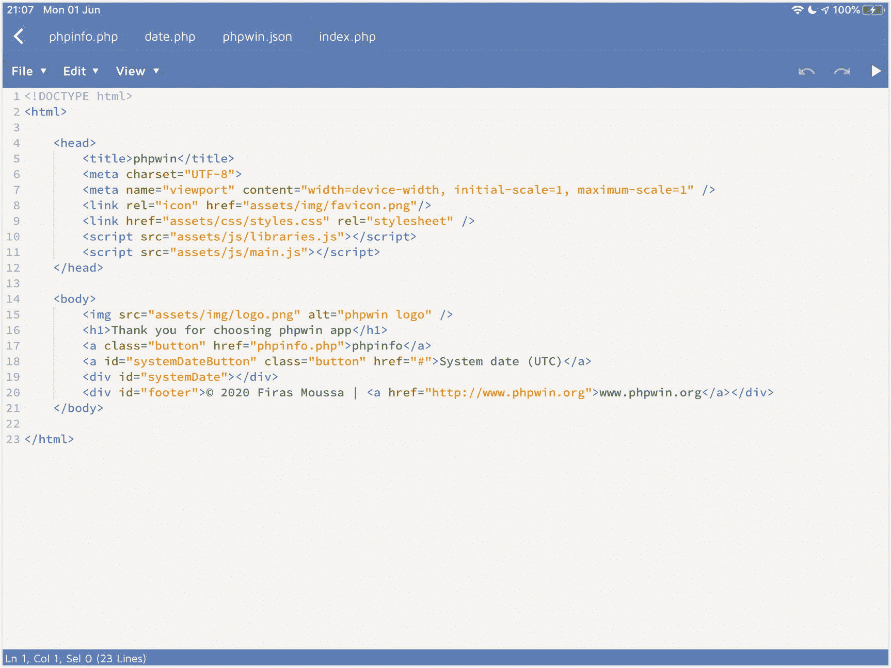
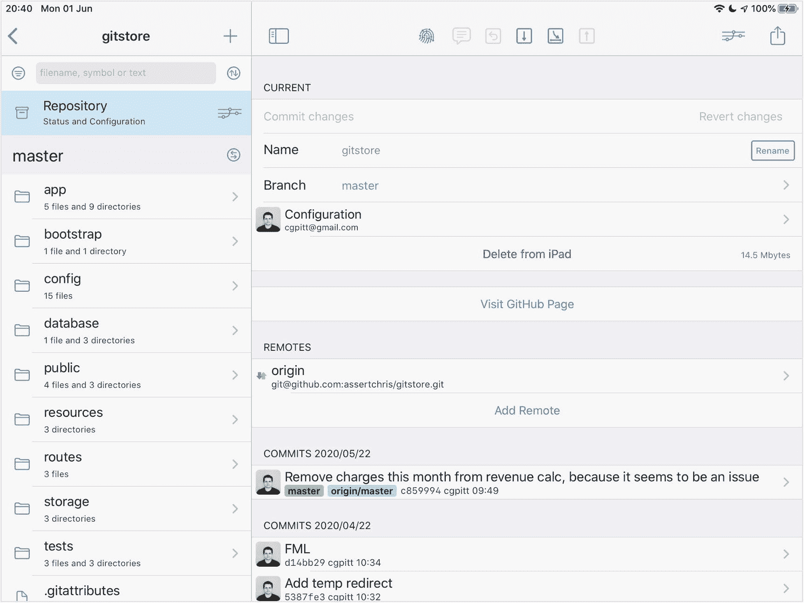
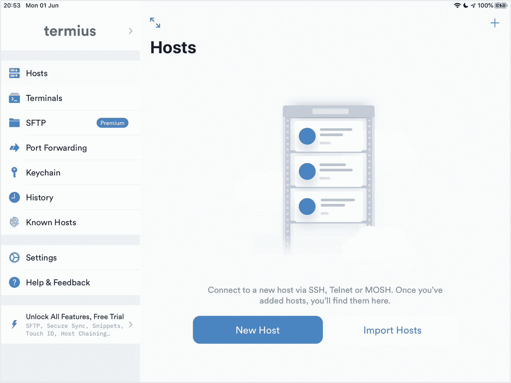

# 一、PHP 的使用方法

让我们来谈谈 PHP 的几种不同的使用方法。您可能会遇到的主要问题有

*   在网络服务器中运行脚本，制作网站

*   从命令行/终端运行脚本

让我们来看看这些的一些变体。除了在旅途中编码之外，我不打算深入介绍设置。等你拿到这本书的时候，那样的说明可能已经过时了。

你最好搜索类似“我如何在[你的操作系统上安装 PHP]”…

## 在终端中运行脚本

你看过电影里的电脑黑客吗？他们通常弓着背坐在键盘和屏幕前，疯狂地打字。有时他们穿着连帽衫。

事实是，编程和使用终端是正常的事情。如果你用的是苹果公司生产的电脑或者运行的是 Linux 系统，你可能比用 Windows 系统的电脑更习惯看到终端窗口。

终端窗口，有时也称为命令提示符或控制台，只是与计算机内部的直接通信。你可以用它们来安装新程序或运行你自己编写的脚本。

您不必使用终端窗口来运行您的脚本。如果你更喜欢视觉界面，直接跳到前面。

安装和使用 PHP 的步骤因您使用的操作系统而异。如果你使用的是 macOS，你可以使用 [Homebrew](https://brew.sh/) 来安装 PHP 和一个数据库。

如果你使用的是 Linux，你可以使用一个内置的包管理器来安装同样的东西。

在 Windows 上，你可以尝试使用 Linux 的 [Windows 子系统](https://docs.microsoft.com/en-us/windows/wsl/install-win10)，它将提供与你在 Linux 计算机上找到的相同的终端界面。或者你可以选择像[巧克力公司](https://chocolatey.org)这样的包装经理。

官方 PHP 文档提供了如何在最常见的操作系统上安装 PHP 的最新说明列表。

题外话，我用的终端 app 叫[超级终端](https://hyper.is)。我喜欢它，因为我可以使用 JavaScript 来配置它，并且我还可以使用与我在代码编辑器中使用的相同的主题。

超级终端应用，在 macOS 上运行

## 通过图形用户界面运行网站

有些人喜欢用更直观的方式来运营他们的网站。有很多好的选项可供选择，但我推荐一款名为 [XAMPP](https://www.apachefriends.org/index.html) 的应用。

你可以在 XAMPP 网站上找到通用操作系统的可下载安装程序，以及如何使用安装程序的说明。与在终端窗口运行 PHP 脚本不同，XAMPP 会给你一个地方来存放由网络服务器运行的 PHP 文件。区别是微妙而重要的。

当我们直接运行脚本时，它们会一直运行，直到完成。如果它们没有完成，通常是因为脚本有问题，比如无限循环。

一些框架和库引入了长期运行脚本或服务器脚本的概念。我说的不是这种情况下的那些。我说的是我们可能为了一个简单的目的想要执行的脚本，或者作为服务器维护的一部分想要频繁运行的脚本。

常见的例子有重命名一堆文件的脚本、删除旧日志文件的脚本，甚至是运行一些预定任务的脚本。

当我们使用 web 服务器时，web 服务器获取请求的细节(标题、参数等)。)，它执行脚本。在一天结束的时候，同样的代码运行，但是 web 服务器从我们手里拿走了一些工作。在某种程度上，它也让我们不用再处理输出和错误日志了。

稍后，当我要求您运行一个脚本时，您可能需要在您的 web 服务器的上下文中进行解释。如果我告诉你运行一个脚本，这可能意味着把它放在一个 web 服务器可以服务的文件中。我会告诉你什么时候做什么…

## 通过虚拟计算机运行网站

假设你想在你自己的计算机上运行你的代码，但是你不希望它阻塞你的文件系统或者导致各种各样的新东西被安装。那样的话，你可以用 VirtualBox 之类的。

VirtualBox 是您安装的一个程序，它允许您创建在您的计算机上运行的“虚拟计算机”。您可以决定允许他们访问多少资源。当它们被挂起时，它们不使用任何资源，除了它们需要的硬盘空间来记住它们之前在做什么。

设置和使用它们的过程与设置一台新的物理计算机没有什么不同。您需要首选操作系统的安装文件，然后您需要在这些文件上安装 PHP(和其他工具),就像它们是一台物理计算机一样。

这比在你的实际电脑上安装要多一点工作，但通常也要干净得多。

你可以使用基本的 VirtualBox 应用，或者你可以更进一步，使用一个叫做[vagger](https://www.vagrantup.com)的软件提供的自动设置帮助。这是一个工具，让您使用脚本来设置和维护 VirtualBox(和其他)虚拟计算机。你甚至可以使用别人做的食谱，这样你就不用自己做任何繁重的工作了。

当我了解更多关于流浪者的信息时，我推荐这些资源:

*   [游民食谱](https://leanpub.com/vagrantcookbook)会解释游民做什么，怎么用。

*   Phansible 会询问你想要安装什么，然后为你创建漫游脚本。

[显见的。com](https://phansible.com) 流浪者提供工具

## 在远程服务器上运行网站

在某些时候，你会希望其他人看到并使用你制作的网站。有一些方法可以让他们看到在你本地电脑上运行的网站，但这并不是一个永久的解决方案。

相反，许多公司提供他们喜欢称之为“云托管”或“虚拟服务器托管”的服务。有一些大公司，像亚马逊网络服务公司和 T2 谷歌云公司。还有一些更小的名字，如[数字海洋](https://www.digitalocean.com)和 [Vultr](https://www.vultr.com) 。我更喜欢小公司，因为他们的管理控制台更容易理解。

一旦您拥有 DigitalOcean 的帐户，您就可以登录并创建虚拟服务器。它类似于 VirtualBox 服务器，因为它不是物理机器。你仍然可以在上面运行流行的操作系统，比如 Ubuntu Linux。

在数字海洋上创建虚拟服务器

事实上，我提到的所有公司都允许你建立某种形式的虚拟服务器，运行 Linux。从那时起，你只需要按照你原本在个人电脑的终端窗口中所做的指示去做。

如果你喜欢别人为你做繁重的工作——就像我一样——你可以使用像 [Laravel Forge](https://forge.laravel.com) 这样的服务来安装运行 PHP 应用所需的一切。

在本书中，我们会经常提到拉勒维尔。虽然 Laravel Forge 面向支持 Laravel 应用，但它可以托管为与其他框架一起工作而构建的网站，甚至是用其他语言编写的网站。

我在我的 Forge 服务器上托管了许多 NodeJS 网站，因为我仍然可以从这些网站使用 Forge 中获得所有的安全性和自动化。

Forge 的创始人 Taylor Otwell 慷慨地提供了 Forge 第一年 35%的优惠券。在添加付款方式后(但在订购前)，您可以使用添加到您的账单资料中的优惠券代码 **lHz71w7Z** 。

在 Laravel Forge 上供应虚拟服务器

“在云端”托管不是免费的。其中一些公司会给你慷慨的试用账户，但你迟早会开始为他们的服务付费。幸运的是，你不需要支付任何费用就可以开始 PHP MVC 开发，只要你在你的个人电脑上做…

## 在沙盒中编码

当你想测试一些代码，但是你不在一台熟悉的计算机旁边时，你可以在沙箱中编码。沙盒网站允许你运行 PHP 代码和共享链接，这样你就可以向别人展示一些东西。

有两个我推荐你试试:

1.  Laravel Playground 是为测试 Laravel 代码量身定制的，但是你可以在其中执行任何 PHP 代码。您还可以在另一个站点上嵌入一个操场(带有自定义代码)，这对于在 wiki 或文档站点中记录您的 PHP 代码非常有用。

2.  3v4l 是了解相同的代码如何在不同版本的 PHP 中运行的最佳场所。有一只奇怪的虫子？把代码放在那里，并在 Twitter 上分享它的链接。

## 移动编码

作为最后一点乐趣，我想谈谈在 iPad 上编码。我接触的许多开发人员都有 iPad，但他们并不知道它可以成为一个强大的移动编码工具。

如果你想探索这个话题，我推荐你试试以下几个应用…

第一个应用叫做 DraftCode。这是一个 PHP 代码编辑器，允许执行本地 PHP 代码，就像你在 XAMPP 这样的 GUI 中运行代码一样。在撰写本文时，它的价格是 4.99 美元。

代码编辑器

这是我能找到的为数不多的几个甚至试图在没有互联网连接的情况下执行代码的应用之一，这意味着你可以在火车或飞机上使用它。它对 WordPress 应用有很好的支持，过去我甚至让它运行过 Laravel 应用。

不幸的是，似乎维护者已经决定提供受支持的 PHP 版本(7.2 和 7.3)作为额外的应用内购买。你可以使用基础应用运行 PHP 5.6 代码，但你必须额外支付 3.99 美元或 5.99 美元才能解锁新版本。

或者，你可以试试一个叫 winphp 的应用。我没有太多使用它的经验，但它似乎提供了与 DraftCode 相同的功能，甚至更多。你可以免费下载，但你也可以花 4.99 美元在应用内购买，解锁大量额外的功能(并隐藏广告)。

winphp 代码编辑器

这两款应用都支持外置键盘和鼠标/触控板，前提是你能让它们与你的 iPad 兼容。我发现即使只有一个键盘盖也对我的编码有很大的帮助。毕竟，没有人喜欢在屏幕上敲一大堆文字…

接下来，有一个叫做[工作副本](https://workingcopyapp.com/)的应用。这是一个很容易与 GitHub 集成的 Git 客户端。这个想法是，你可以使用工作副本来克隆你正在做的回购，然后在一个可以执行代码的应用中编辑它。虽然您可以在工作副本中编辑文本文件，但没有内置的功能来本地执行这些文件。

Git 客户端工作副本

自从我第一次尝试在 iPad 上编码以来，iOS(尤其是 iPadOS)已经有了很大的进步。除了苹果已经开始制作的伟大的新键盘和触控板外壳，文件应用使处理项目文件变得更加容易。

我要提到的最后一个 app 叫做 [Termius](https://termius.com) 。这是一个用于 iPad 的 SSH 客户端。有许多这样的应用，但 Termius 很有趣，因为它有可以在桌面上使用的配套应用，所以你可以在它们之间共享设置。

如果您在 iPad 上完成了本地开发，并希望将您的网站部署到远程虚拟服务器，您将需要一种与该服务器通信的方法。宋承宪是方法。当然，您需要访问互联网来完成这一部分，但是如果您习惯于在 iPad 上工作，那么从 iPad 上部署可能适合您。

ssh 客户端终端

与大多数其他应用一样，应用内购买将解锁额外功能并移除广告。我用 Termius 的次数还不够多，不需要那些功能，所以目前我还在用免费账号。

当然，随着 GitHub 在其应用中内置代码编辑器，在 iPad 上编码将变得更加容易。你显然需要互联网接入和一个付费的 GitHub 账户来使用这个选项，但我个人认为它的移动性是值得的。

## 关于 Docker 的一个注记

你可能听说过 Docker 的名字，尤其是当提到托管网站的时候。这是管理服务器的一种很好的方式，但是学习和使用起来会很棘手。我已经列出了许多关于如何运行 PHP 代码的很好的选项，我看不出再增加一个选项有什么价值。

欢迎你尝试一下，但是我不打算把它提到这一点以外。

## 从这里去哪里？

在下一章，我们将开始运行一些 PHP 代码。如果您想从终端运行该代码，您需要将终端打开到与您想运行的脚本相同的位置，并且

*   直接运行文件(用类似`php script.php`的东西)。

*   或者使用 PHP 开发服务器(用类似`php -S`的东西)。

不要担心——当我们需要运行代码时，我会更详细地解释如何使用它们。

另一方面，如果您更喜欢使用 web 服务器，那么您需要安装它并将您的脚本放在特殊的“web root”文件夹中。每个 web 服务器都是不同的，所以您需要参考文档来选择要安装的服务器。